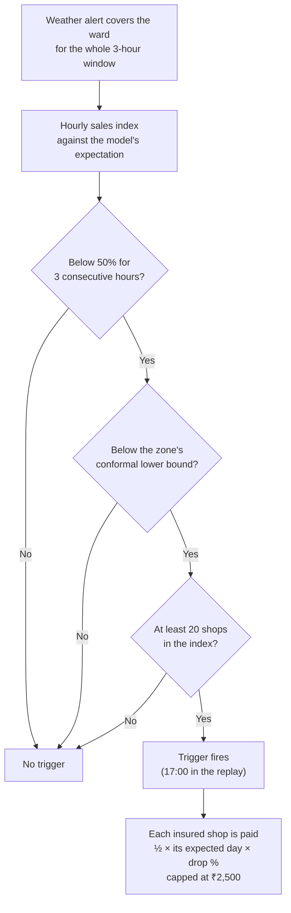

# Executive summary

| | |
|---|---|
| Status | Draft v1.7 · 3 Oct 2026 |
| Owner | Omkar Kadam |
| Audience | Judges, mentors, teammates |
| Related | [Problem statement analysis](01-strategy/problem-statement-analysis.md) · [Facts and sources](01-strategy/facts-and-sources.md) · [Product vision](02-product/vision-and-positioning.md) · [Regulatory and compliance](05-business/regulatory-and-compliance.md) · [Metrics and impact](02-product/metrics-and-impact.md) · [Build plan](06-delivery/build-plan.md) · [Final deck and video script](06-delivery/final-deck-and-video-script.md) |

## TL;DR

- **The problem:** on a day of heavy rain a small merchant's sales can halve, yet the daily loan instalment is still cut from that evening's settlement. Earlier Paytm merchant plans took 30–60 days per claim and several documents (A3).
- **The solution:** Chhatri, income cover where the claim starts itself. Paytm sees the loss in the shops' own sales, pays the same evening with no forms, explains the amount in Hindi and asks the lender to pause the next instalment.
- **The proof today:** a working prototype (76 commits, 29 Sep–1 Oct 2026, then the merchant app and the AI, rights and judge features on 2 Oct) with 3,284 backend tests collected, 70 of 70 demo checks at the 2 Oct baseline, a hash-chained audit log, and a backtest on real rainfall with simulated sales. The backtest is specification validation, not market proof.
- **The business:** a partner general insurer underwrites, Paytm Insurance Broking distributes, and Paytm's sales data, settlement rail and Soundbox carry the journey. No insurer or lender has agreed to anything yet. We ask for a pilot after the hackathon.
- **The scope:** everything on our list was must-ship (P0): the merchant mini-app, Ask Chhatri, slip reading, voice, the grievance ladder, the consent centre, the static demo and Marathi (N1–N8), the fixes X1–X8 and the ideas H1–H26. All of it is now built, each behind a feature flag, so a feature that is not rehearsed at the freeze is hidden, never shown half-working (section 5). Not done, and only a person can do it: rehearsals, the backup video, deploying the static demo, and a native speaker's review of Marathi.
- **What is real:** the policy engine, forecast model, audit chain and consoles run as code. AI is live only where a key is set and the header badge says LIVE; the Gemini and Sarvam paths are tested against fakes only, and no key has been run. Sales, alerts, WhatsApp, the Paytm link, KYC, payouts, the lender and the Soundbox are simulated and labelled.

## 1. The problem, through one merchant

**Anil Jadhav** (`S-0142`) is a synthetic persona: a tea-stall owner in Parel, Mumbai, in our simulated monsoon replay. His numbers are the demo's numbers, not a real merchant's.

> *Illustrative:* "On a monsoon day my sales fall by more than half. My ₹600 instalment still comes out of my settlement that evening. A claim means forms and weeks of waiting. I need the money today, to restock."

**The numbers in the replay (Tue 19 Aug 2025):**
- Anil's usual Tuesday: ₹4,380 in sales.
- His ward's sales index: 37% of expected for three hours during a red rain alert, a 63% drop.
- His loan instalment: ₹600 a day, deducted from his settlement.
- Earlier Paytm merchant plans: 30–60 days per claim and several documents (A3).

## 2. The positioning line

*Chhatri is income cover for India's small merchants where the claim starts itself. Paytm sees the loss in the shop's own sales, pays it the same day with no forms, explains it in Hindi, and asks the lender to give that day's loan instalment a holiday.*

## 3. How it works in three moves

### K1: Area auto-claim

A weather alert covers a ward for the whole window. The ward's hourly sales index stays below 50% of expected for 3 consecutive hours and below the zone's conformal lower bound, with at least 20 shops in the index. The policy engine then pays every insured shop in the ward half of **its own** expected day times the drop, capped at ₹2,500 a day. Cover must be in force and prepaid, and bought before the alert was issued. Nobody files anything. In the replay, Anil gets ½ × ₹4,380 × 63% = ₹1,380, and 312 shops in three wards are paid with the evening settlement, four simulated minutes after the 17:00 trigger.

### K2: Hospital-cash income claim

One shop goes silent for a full day while its area trades normally. Chhatri checks in on WhatsApp in Hindi. The merchant replies and sends one photo of the hospital slip. The slip reader extracts the patient name and dates, and the policy engine checks them against KYC and the silent day. It pays half the usual day, capped at ₹1,500 a day, for up to 3 automatic days (₹1,500 in the replay). If the name does not match or the slip is unclear, a claims officer decides. The AI never pays on a doubt.

### K3: EDI holiday

After an approved payout, Chhatri asks the lender to pause the next instalment under a pre-agreed rule, quoting the decision. The lender decides. In the replay the lender is simulated and agrees, so Anil's next ₹600 instalment is paused one simulated minute after the credit. Where the instalment moves to, and on what terms, is the lender's call.

## 4. Track fit: insurance, lending and fintech in one journey

**Track 2 asks:** make insurance, lending and fintech simpler, faster and more human. The example is the health insurance claims journey: understand coverage, submit documents, track claims, resolve queries.

| Stage | Chhatri realises it as | Track requirement |
|---|---|---|
| Understand coverage | Cover card and explainer in the merchant mini-app: what is covered, examples, caps and exclusions, with a tap-for-meaning jargon lens (N1 with H20, built behind `n1_miniapp`) | "Understanding policy coverage" |
| Submit documents | Area claims: no documents at all. Hospital cash: one slip photo, with a readiness checklist before it is sent (N3 with H15, built behind `n3_slip_precheck`) | "Submitting documents" |
| Track claims | Claim tracker: Detected → Checked → Decided → Paid → EDI holiday, each with its reason and next step, including the referred and dispute paths (N1, built behind `n1_miniapp`) | "Tracking claims" |
| Resolve queries | "Why this amount" answered from the decision's own numbers in Hindi and English, and disputes sent to a claims officer with a 24-hour SLA. Built behind flags: Ask Chhatri (N2) for free questions, grounded in the policy and the decision, and a grievance ladder with response clocks (N5) | "Resolving customer queries" |

Among the Track-2 projects we could find in public repos, we found none that pays a claim automatically from the merchant's own sales and links the payout to the loan instalment. We may have missed some; see the [competitive landscape](01-strategy/competitive-landscape.md).

## 5. What is built

**Existing (K-series): built before 2 Oct (commit 86575ea), running on simulated inputs.**

| Feature | Code path | Status | Owner |
|---|---|---|---|
| K1 Area auto-claim | `backend/chhatri/detect/`, `backend/chhatri/policy/engine.py` | Built | Ujjwal Pardeshi |
| K2 Hospital-cash claim | `backend/chhatri/policy/checks.py` | Built | Ujjwal Pardeshi |
| K3 EDI holiday | `backend/chhatri/ledger/instalments.py` | Built (simulated lender) | Ujjwal Pardeshi |
| K4 Policy engine (pilot-0.1) | `backend/chhatri/policy/engine.py`, `backend/chhatri/policy/rules.yaml` | Built | Ujjwal Pardeshi |
| K5 Explanations and disputes | `backend/chhatri/policy/explain.py`, `backend/chhatri/cases/service.py` | Built | Ujjwal Pardeshi |
| K6 Cover purchase, waiting period | `backend/chhatri/policy/cover.py` | Built | Ujjwal Pardeshi |
| K7 Hash-chained audit log | `backend/chhatri/audit/log.py`, `GET /api/audit/verify` | Built | Ujjwal Pardeshi |
| K8 Claims-officer console | `frontend/src/pages/`, `backend/chhatri/api/routers/` | Built | Ujjwal Pardeshi |

**New (N-series): all P0, all built on 2 Oct, each behind a feature flag.** A flag is off until `CHHATRI_FEATURES` (backend) and `VITE_FEATURES` (console build) name it, so a feature that is not rehearsed at the freeze is simply left off. Built means the code and its tests exist. None of the AI paths has been run with a key.

| Feature | What it is | Flag | Owner | Link |
|---|---|---|---|---|
| N1 Merchant mini-app | "Chhatri in Paytm for Business": cover card, coverage explainer with a jargon lens, buy, claim tracker (including the referred and dispute paths), trust receipt, help and language. Tailwind CSS v4 and shadcn/ui, scoped to the mini-app only | `n1_miniapp` | Omkar Kadam | [fs-04](02-product/feature-specs/fs-04-merchant-mini-app.md) |
| N2 Ask Chhatri | Grounded assistant in text and voice. Gemini free tier first, then Sarvam chat, then fixed templates. Says only amounts that are in the decision, cites policy clauses and warns about scam messages. Tested against fakes only | `n2_ask_chhatri` | Ujjwal Pardeshi | [fs-05](02-product/feature-specs/fs-05-ask-chhatri.md) |
| N3 Slip reading with a pre-check | Gemini free tier first, then Sarvam Vision. If neither can read the slip, a person decides. A pre-check asks for a retake when the photo is unclear, and the merchant confirms what was read before the checks run | `n3_slip_precheck` | Ujjwal Pardeshi | [fs-02](02-product/feature-specs/fs-02-hospital-cash-claim.md) |
| N4 Hindi and English voice | Sarvam speech-to-text and text-to-speech, then the browser's Web Speech API, then tap-to-send chips. Voice confirmation chips for amounts and dates. There is no Marathi voice | `n4_voice` | Ujjwal Pardeshi | [fs-05](02-product/feature-specs/fs-05-ask-chhatri.md) |
| N5 Grievance ladder | Our claims officer, then insurer grievance officer, Bima Bharosa and the Insurance Ombudsman, with response clocks and a router that says who owns the complaint. The steps outside Chhatri are self-reported by the merchant | `n5_grievances` | Omkar Kadam | [fs-06](02-product/feature-specs/fs-06-explanations-disputes-and-grievance.md) |
| N6 Consent centre | View and withdraw consents, an activity log and "forget my slip"; health data minimised and masked | `n6_consents` | Omkar Kadam | [fs-07](02-product/feature-specs/fs-07-cover-purchase-and-consent.md) |
| N7 Static demo | The console in mock mode as a static build with a permanent SIMULATED banner (`npm run build`, `npm run preview`). The static build is done. The repo owner has to deploy it on a free static host, so no public address exists yet, and the backup video of about 2 minutes is not recorded | none | Ujjwal Pardeshi | [free-tier stack](04-engineering/free-tier-stack-and-setup.md) |
| N8 Marathi | The mini-app text in Marathi for Mumbai merchants. A draft: it needs a native speaker's review. Text only | `n8_marathi` | Omkar Kadam | [conversation design](03-design/conversation-design.md) |

**Fixes (X-series): all built.** X1 the 2 failing frontend tests, fixed · X2 validate the published expected day at claim creation · X3 fail loudly when a zone is missing from the premium table · X4 EDI-holiday guard (active loan, not in arrears, holiday left) and lender-decides wording (`x4_lender_request`) · X5 off-script merchant gets a clean 404, not a KeyError · X6 provider panel showing LIVE, SIMULATED or FALLBACK, with a demo fallback switch (`x6_provider_panel`) · X7 honest-wording test over the message catalogue · X8 no loan or cross-sell offers during an alert or an open claim, and a message cap (`x8_distress_guard`).

**Ideas adopted from other projects (H13–H26): all built.** Project names only; the repositories are in the [competitive landscape](01-strategy/competitive-landscape.md). H1–H12 are the earlier ideas in the [product requirements](02-product/prd.md); all are built except H12 (measured test counts in the README), which is written after the final run, and H6, whose static build exists but is not deployed.

| ID | Idea | Credit | Status |
|---|---|---|---|
| H13 | Source badges: every rule, number and clause shown to a merchant or officer says where it came from, and when | Praman | Built |
| H14 | A counterfactual in every explanation: what would have changed the outcome, written by the engine, not a model | One-Tap Credit; Claim Advocate | Built |
| H15 | Slip pre-check: document type, a checklist, "ask, don't assume" below the confidence gate, the merchant confirms what was read | Praman; FinPath AI; FINPATH | Built · `n3_slip_precheck` |
| H16 | Defence against instructions hidden in slips and chat, with red-team tests | Claim Advocate | Built |
| H17 | Ask Chhatri cites policy clauses; every number comes from the engine's facts | Praman; One-Tap Credit; Soundbox Saathi | Built · `n2_ask_chhatri` |
| H18 | Voice confirmation chips for amounts and dates | Sahaj | Built · `n4_voice` |
| H19 | Scam-message warning in chat | FINPATH | Built · `n2_ask_chhatri` |
| H20 | Jargon lens: tap an insurance term for a plain explanation | Sahaj; AeroFin AI | Built · `n1_miniapp` |
| H21 | Next-step bar: no screen or reply is a dead end | Sahaj | Built · `n1_miniapp` (chat replies `n2_ask_chhatri`) |
| H22 | Grievance ladder with response clocks and a respondent router | Praman | Built · `n5_grievances` |
| H23 | Consent activity log and "forget my slip" | Sahaj; FINPATH | Built · `n6_consents` |
| H24 | What-if panel for judges: change rain or sales and watch the engine recompute (read-only) | Resolve OS; FinPath AI | Built · `h24_whatif` |
| H25 | Published AI evaluation; a number is shown only once it is measured | Sahaj; Resolve OS | The harness, the live Ask suite and the `/evals` page are built · `h25_evals`; one run is stored (3 Oct 2026, synthetic sets written by the team): intent routing 51 of 56, the guard stopped 34 of 35 unsupported replies, and 50 Ask questions run live through a free-tier Gemini model (11 of 48 ended in a template), with 0 of 50 forbidden statements and 2 of 50 rupee figures not traced to a fact; slip reading and voice are NOT MEASURED |
| H26 | Every AI reply carries its mode (LIVE, SIMULATED or FALLBACK), provider and fallback reason | Rakshak; Soundbox Saathi | Built |

FINPATH and FinPath AI are two different projects.

**The build waves.** Details are in the [build plan](06-delivery/build-plan.md) and the [implementation guide](04-engineering/implementation-guide.md). All six waves have landed in the code; what is left is rehearsal and the human-only items.

| Wave | What landed |
|---|---|
| 0 · setup | X1, feature flags, the mini-app's Tailwind and shadcn setup, a key check for Gemini and Sarvam |
| 1 · demo spine | N1 core (home, coverage explainer, claim tracker, trust receipt), the receipt, cover and claims endpoints, X4, X7, X2, X3, X5 |
| 2 · live AI | N3, N2, N4, and X6 with the FALLBACK state |
| 3 · trust and rights | N5, N6, X8, the AI evaluation page |
| 4 · judge-facing polish | Console projector polish and the trigger-to-payout moment, the what-if panel, presenter mode, the operations strip, N8 |
| 5 · ship | The N7 static build is done. Not done (human-only): the backup video, a full test run on the demo laptop, two rehearsals, and the code freeze 90 minutes before the slot |

## 6. Why Paytm

1. **Live sales per shop.** 1.57 crore merchants paid for Paytm payment devices in Q1 FY27 (A1). Pooling a ward's shops into one index means one shop cannot fake a loss.
2. **Settlement rail.** The payout rides the same evening's settlement. SEWA's heat-index payouts, by comparison, reach members weeks later (A9).
3. **Merchant audience.** Paytm's merchant protection plan already sells in three taps and covers 2 lakh+ merchants (A3).
4. **Licensed distribution.** Paytm Insurance Broking holds an IRDAI broker licence valid to Feb 2029 (A4). Paytm does not underwrite; a partner general insurer would.
5. **Merchant lending.** Loans from partner NBFCs and banks are repaid by daily deductions from settlements (A5). Paytm's financial services revenue (lending and insurance distribution) grew 45% to ₹814 crore in Q1 FY27 (A2).

## 7. Proof

### Engineering
- **Backend:** 5,005 tests collected (4,942 fast, 63 slow; 1,602 of the fast ones are policy invariants over seeded random claims). Final run: 4,941 fast passed at 97.90 % coverage, 63 slow passed. At the 2 Oct baseline (commit 86575ea) there were 1,747 (1,711 fast, 36 slow) at 99.7% coverage.
- **Frontend and infra:** the frontend unit suite passes (X1 fixed the 2 failing tests of the baseline); the infra checks number 212 (118 at the baseline). **End to end:** 137 Playwright tests in 27 files for the mock project (21 at the baseline); the stage walk ran 3 of 3 green.
- **Demo-check:** 70 of 70 checks, running every demo scenario through the HTTP API (final run, 3 Oct 2026). `make judge` runs it with the artefact hashes, the audit chain and the typecheck, and ends READY.
- **Deterministic replays:** every scenario load gives the same ids and amounts ([DEMO.md](DEMO.md)).

### Hash-chained audit log
Every step, from trigger to decision, payout, instalment pause and message, is an audit entry whose SHA-256 hash covers the previous entry's hash. `GET /api/audit/verify` walks the chain and reports whether it is intact; the demo shows this on the `/audit` page. The log is tamper-evident, not durable: it lives in memory and is rebuilt on every scenario load.

### Specification validation on simulated sales and real rainfall
**The calibration is circular by design.** The backtest runs on simulated merchant sales driven by real Open-Meteo rainfall, over June to September of 2024 and 2025. Simulation parameters are searched so the replay reproduces the demo numbers (Z7 37%, ₹4,380, ₹58,900). This validates that the policy rules behave as specified on *this replay*, not that they work for real merchants.

On simulated sales, Chhatri paid 89 of 148 "real drops" (60%) against 49 (33%) for a weather-only trigger, and 36 of its 125 payouts (29%) lacked a real drop against 287 of 336 (85%) for weather-only. The comparison mixes causes: 48 of the 148 real drops are two scripted city-wide shutdown days that a rain trigger cannot see, and 50 are slow days with no alert, which Chhatri leaves unpaid by design. On the 50 rain drops, the weather-only trigger paid 47 and Chhatri 41. Premiums are priced as expected loss ÷ (1 − 0.35), so the backtest loss ratio is about 65% by construction. That is a pricing assumption, not a success claim.

**A pilot with real merchants is what will test whether the trigger and the price work.**

## 8. The business model

A partner general insurer underwrites the cover, and Paytm Insurance Broking distributes it (A4). In the prototype, each zone's premium per day is max(₹2, backtest area loss per shop ÷ 365 ÷ (1 − 0.35)). On simulated sales that gives ₹6.93 to ₹38.82 a day across the 24 zones (Z3 ₹14.16, Z7 ₹18.62). Paytm's existing merchant protection plan costs under ₹2 a day (A3); it is a different product, and whether merchants will pay several times more for cover that pays the same evening is the open question. The product's real price is an open decision for the pilot. The first payment prepays 30 days through a Paytm payment link. After that, the evening settlement takes the next day's premium with the merchant's standing consent. The 35% loading must cover claims handling, reinsurance, capital and the broker's commission. For the lender, the hypothesis to test is fewer missed instalments on shock days.

See [business model and unit economics](05-business/business-model-and-unit-economics.md).

## 9. Errata and honest caveats

1. **Round-1 deck errata.** Z7 is 37%, not 41%: the round-1 sketch said 41%; the prototype shows 37%, which produces the 63% drop and the ₹1,380 payout. The deck also called WhatsApp and the Paytm link live and the price "a few rupees a day": both are simulated, and the price is open.
2. **"Area Income Signal" is our own roadmap idea**, not a Paytm product. We found no public source for one.
3. **Sales, alerts, KYC, payouts, the lender, WhatsApp and the Paytm link are simulated.** The backtest validates the rules against simulated sales driven by real rainfall, not against real merchants.
4. **The replay clock is accelerated:** 6 simulated minutes per real second. "Four minutes from trigger to money" is simulated time; in the product, the credit rides the evening settlement.
5. **The prototype was pre-built** between 29 Sep and 1 Oct 2026 (76 commits). The organisers confirmed pre-built work is allowed. Everything since (2 Oct) is built in waves behind flags and shows in the git log with its date and author; a feature that is not rehearsed at the freeze is hidden.
6. **The repository is public but has no licence file yet**, so we call it public, not open source.
7. **Hospital-cash claims are not yet in the price.** The backtest prices area claims only.
8. **No insurer or lender has agreed to anything**, and we have no talks to report. A partner will be approached after the hackathon.

## 10. What we ask of Paytm after the hackathon

These steps follow the [go-to-market and pilot plan](05-business/go-to-market-and-pilot-plan.md):

1. **A partner general insurer** to underwrite and decide claims, and **a lending partner** to confirm the EDI-holiday rules.
2. **Retrospective validation** on real 2026 monsoon sales, under a data agreement, to test the trigger without paying anyone.
3. **A shadow phase, then a staged live pilot:** hospital-cash and civic-disruption claims first, area rain claims in the next monsoon, with the sizes and kill criteria in the pilot plan.
4. **Data access under explicit, purpose-specific merchant consent**, designed for the DPDP Rules, 2025 (A22).
5. **Distribution through Paytm Insurance Broking**, with compliant cover documents.

## 11. How to read the docs

Start here: [problem statement analysis](01-strategy/problem-statement-analysis.md) (atomic requirements and decisions).

Then choose by role:

| If you are | Read first | Then |
|---|---|---|
| a judge | [competitive landscape](01-strategy/competitive-landscape.md) | [metrics and impact](02-product/metrics-and-impact.md), [current-state audit](01-strategy/current-state-audit.md) |
| a product manager | [vision and positioning](02-product/vision-and-positioning.md) | [personas and JTBD](02-product/personas-and-jtbd.md), [user journeys](02-product/user-journeys.md), feature specs |
| a business person | [business model](05-business/business-model-and-unit-economics.md) | [regulatory and compliance](05-business/regulatory-and-compliance.md), [go-to-market](05-business/go-to-market-and-pilot-plan.md) |
| a technologist | [system architecture](04-engineering/system-architecture.md) | [API and data model](04-engineering/data-model-and-api.md), [AI architecture](04-engineering/ai-architecture-and-guardrails.md), ADRs |
| a designer | [design system](03-design/design-system.md) | [screens and flows](03-design/screens-and-flows.md), [conversation design](03-design/conversation-design.md) |
| a regulatory reviewer | [compliance](05-business/regulatory-and-compliance.md) | [policy wording](02-product/policy-wording-and-cis.md), [grievance and consent specs](02-product/feature-specs/fs-06-explanations-disputes-and-grievance.md) |

**Newer documents for the final build:**

| Document | What it covers |
|---|---|
| [Implementation guide](04-engineering/implementation-guide.md) | The engineering guide for the P0 work, built in waves |
| [AI evaluation plan](04-engineering/ai-evaluation-plan.md) | How AI quality is measured (H25). The harness and the live Ask suite are built and the first run is stored (§1.2.1 there); slip reading and voice are not measured. A number reaches the evaluation page only from a stored run |
| [Copy deck](03-design/copy-deck.md) | Every new merchant-facing string, in English, Hindi and Marathi. Marathi is a draft |
| [On-site checklist](06-delivery/on-site-checklist.md) | The checklist for the final day |
| [Final deck and video script](06-delivery/final-deck-and-video-script.md) | The slides for the 7-minute and 3-minute cuts, and the backup video script |
| [Rival teardown appendix](01-strategy/rival-teardown-appendix.md) | One row per public repository we read, and a note on the closest projects |
| [Requirements traceability matrix](01-strategy/requirements-traceability-matrix.md) | Each requirement traced to where it is specified and tested |

For the demo and final-day decisions, see the [demo runbook](06-delivery/demo-runbook.md) and the [build plan](06-delivery/build-plan.md).

## Open questions

1. **Price.** The backtest gives ₹6.93–₹38.82 a day; Paytm's existing plan sells for under ₹2 a day (A3). What price clears both the loss ratio and the merchant's budget? Owner: Omkar Kadam.
2. **Partners.** Which insurer and lender will join a pilot, and how will the lender treat an EDI holiday? Owner: Omkar Kadam.
3. **Licence.** Should the repository get a licence before the final? Until it does, we call it public, not open source. Owner: Ujjwal Pardeshi.
4. **Slot.** The length of the final demo slot is not announced; both the 3-minute and the 7-minute cuts are prepared. Owner: Omkar Kadam.
5. **Static demo.** Which free static host will serve N7, and who deploys it? The docs carry no address until the link works. Owner: Ujjwal Pardeshi.

## Changelog

- 2026-10-03 · v1.7 · section 5 rewritten against the code: N1–N8, X1–X8 and H13–H26 are built behind flags (N7 not deployed, the evaluation page shows no run), proof counts updated, human-only items listed; voice is Hindi and English, Marathi is text only
- 2026-10-02 · v1.6 · scope is everything P0, built in waves 0 to 5 behind feature flags; N-series and X-series show waves, not priorities; H13–H26 table with credits; links to the seven new docs; earlier plans took 30–60 days; positioning line and K3 say the lender decides; backtest split and the N7 note added; "only one" wording removed; errata extended
- 2026-10-02 · v1.5 · final fact-check: persona labelled synthetic, K1 paid per shop, prices from the artefact, open questions restored, pilot steps aligned with the go-to-market plan
- 2026-10-02 · v1.4 · N3 slip-reading provider wording
- 2026-10-02 · v1.3 · AI provider and live/simulated framing aligned
- 2026-10-02 · v1.1 · fact-check pass: K1 trigger criteria clarified in a mermaid flowchart; replaced ASCII box diagram
- 2026-10-02 · v1 · first draft for judges, mentors and teammates
