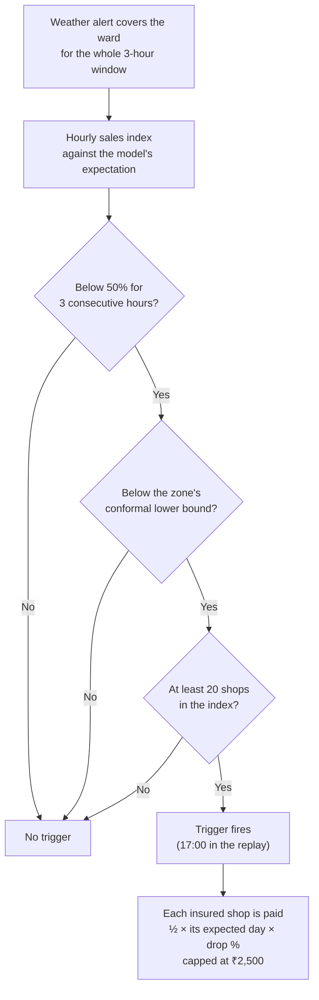

# Executive summary

| | |
|---|---|
| Status | Draft v1.5 · 2 Oct 2026 |
| Owner | Omkar Kadam |
| Audience | Judges, mentors, teammates |
| Related | [Problem statement analysis](01-strategy/problem-statement-analysis.md) · [Facts and sources](01-strategy/facts-and-sources.md) · [Product vision](02-product/vision-and-positioning.md) · [Regulatory and compliance](05-business/regulatory-and-compliance.md) · [Metrics and impact](02-product/metrics-and-impact.md) |

## TL;DR

- **The problem:** on a day of heavy rain a small merchant's sales can halve, yet the daily loan instalment is still cut from that evening's settlement. Merchant claims have typically taken 30–60 days and several documents (A3).
- **The solution:** Chhatri, income cover where the claim starts itself. Paytm sees the loss in the shops' own sales, pays the same evening with no forms, explains the amount in Hindi and asks the lender to pause the next instalment.
- **The proof today:** a working prototype (76 commits, 29 Sep–1 Oct 2026) with 1,747 backend tests at 99.7% coverage, 70 of 70 demo checks, a hash-chained audit log, and a backtest on real rainfall with simulated sales. The backtest is specification validation, not market proof.
- **The business:** a partner general insurer underwrites, Paytm Insurance Broking distributes, and Paytm's sales data, settlement rail and Soundbox carry the journey. We ask for a pilot after the hackathon.
- **What is real:** the policy engine, forecast model, audit chain and consoles run as code. AI is live only where a key is set and the header badge says LIVE. Sales, alerts, WhatsApp, the Paytm link, KYC, payouts and the lender are simulated and labelled. The new work for 2–3 Oct (N1–N4, fixes X1–X8) is planned and will show in the git log as it lands.

## 1. The problem, through one merchant

**Anil Jadhav** (`S-0142`) is a synthetic persona: a tea-stall owner in Parel, Mumbai, in our simulated monsoon replay. His numbers are the demo's numbers, not a real merchant's.

> *Illustrative:* "On a monsoon day my sales fall by more than half. My ₹600 instalment still comes out of my settlement that evening. A claim means forms and weeks of waiting. I need the money today, to restock."

**The numbers in the replay (Tue 19 Aug 2025):**
- Anil's usual Tuesday: ₹4,380 in sales.
- His ward's sales index: 37% of expected for three hours during a red rain alert, a 63% drop.
- His loan instalment: ₹600 a day, deducted from his settlement.
- Typical merchant claims: 30–60 days and several documents (A3).

## 2. The positioning line

*Chhatri is income cover for India's small merchants where the claim starts itself. Paytm sees the loss in the shop's own sales, pays it the same day with no forms, explains it in Hindi, and gives that day's loan instalment a holiday.*

## 3. How it works in three moves

### K1: Area auto-claim

A weather alert covers a ward for the whole window. The ward's hourly sales index stays below 50% of expected for 3 consecutive hours and below the zone's conformal lower bound, with at least 20 shops in the index. The policy engine then pays every insured shop in the ward half of **its own** expected day times the drop, capped at ₹2,500 a day. Cover must be in force and prepaid, and bought before the alert was issued. Nobody files anything. In the replay, Anil gets ½ × ₹4,380 × 63% = ₹1,380, and 312 shops in three wards are paid with the evening settlement, four simulated minutes after the 17:00 trigger.

### K2: Hospital-cash income claim

One shop goes silent for a full day while its area trades normally. Chhatri checks in on WhatsApp in Hindi. The merchant replies and sends one photo of the hospital slip. The slip reader extracts the patient name and dates, and the policy engine checks them against KYC and the silent day. It pays half the usual day, capped at ₹1,500 a day, for up to 3 automatic days (₹1,500 in the replay). If the name does not match or the slip is unclear, a claims officer decides. The AI never pays on a doubt.

### K3: EDI holiday

After an approved payout, Chhatri asks the lender to pause the next instalment under a pre-agreed rule, quoting the decision. The lender decides. In the replay, Anil's next ₹600 instalment is paused one simulated minute after the credit. Where the instalment moves to, and on what terms, is the lender's call.

## 4. Track fit: insurance, lending and fintech in one journey

**Track 2 asks:** make insurance, lending and fintech simpler, faster and more human. The example is the health insurance claims journey: understand coverage, submit documents, track claims, resolve queries.

| Stage | Chhatri realises it as | Track requirement |
|---|---|---|
| Understand coverage | Cover card and explainer in the merchant mini-app: what is covered, examples, caps and exclusions (N1, planned for 2 Oct) | "Understanding policy coverage" |
| Submit documents | Area claims: no documents at all. Hospital cash: one slip photo, with a readiness checklist before it is sent (N3, planned) | "Submitting documents" |
| Track claims | Claim tracker: Detected → Checked → Decided → Paid → EDI holiday, each with its reason and next step (N1, planned) | "Tracking claims" |
| Resolve queries | Today: "why this amount" answered from the decision's own numbers in Hindi and English, and disputes sent to a claims officer with a 24-hour SLA. Planned: Ask Chhatri (N2) for free questions, grounded in the policy and the decision | "Resolving customer queries" |

Among the Track-2 projects we could find in public repos, Chhatri is the only one that pays a claim automatically from the merchant's own sales and links the payout to the loan instalment (see the [competitive landscape](01-strategy/competitive-landscape.md)).

## 5. What exists today vs what we build

**Existing (K-series): built at commit 86575ea, running on simulated inputs.**

| Feature | Code path | Status | Owner |
|---|---|---|---|
| K1 Area auto-claim | `backend/chhatri/detect/`, `backend/chhatri/policy/engine.py` | Built | Ujjwal Pardeshi |
| K2 Hospital-cash claim | `backend/chhatri/policy/checks.py` | Built | Ujjwal Pardeshi |
| K3 EDI holiday | `backend/chhatri/ledger/instalments.py` | Built (simulated lender) | Ujjwal Pardeshi |
| K4 Policy engine (pilot-0.1) | `backend/chhatri/policy/engine.py`, `backend/chhatri/policy/rules.yaml` | Built | Ujjwal Pardeshi |
| K5 Explanations and disputes | `backend/chhatri/policy/explain.py`, `backend/chhatri/cases/service.py` | Built | Ujjwal Pardeshi |
| K6 Cover purchase, waiting period | `backend/chhatri/policy/cover.py` | Built | Ujjwal Pardeshi |
| K7 Hash-chained audit log | `backend/chhatri/audit/log.py`, `GET /api/audit/verify` | Built | Ujjwal Pardeshi |
| K8 Claims-officer console | `frontend/src/pages/`, `backend/chhatri/api/routers/` | Built | Ujjwal Pardeshi |

**New (N-series): planned for 2–3 Oct.**

| Feature | What it is | Priority | Owner | Link |
|---|---|---|---|---|
| N1 Merchant mini-app | "Chhatri in Paytm for Business": cover card, coverage explainer, buy, claim tracker, help and grievance | P0 | Omkar Kadam | [fs-04](02-product/feature-specs/fs-04-merchant-mini-app.md) |
| N2 Ask Chhatri | Grounded assistant in text and voice. Gemini free tier first, then Sarvam chat, then fixed templates. Says only amounts that are in the decision | P0 | Ujjwal Pardeshi | [fs-05](02-product/feature-specs/fs-05-ask-chhatri.md) |
| N3 Live slip reading | Gemini free tier first, then Sarvam Vision. If neither can read the slip, a person decides. A pre-check asks for a retake when the photo is unclear | P0 | Ujjwal Pardeshi | [fs-02](02-product/feature-specs/fs-02-hospital-cash-claim.md) |
| N4 Real Hindi voice | Sarvam speech-to-text and text-to-speech (the adapters exist), then the browser's Web Speech API, then tap-to-send chips | P0 | Ujjwal Pardeshi | [fs-05](02-product/feature-specs/fs-05-ask-chhatri.md) |
| N5 Grievance ladder | Insurer GRO → Bima Bharosa → Insurance Ombudsman, with SLA clocks | P1, if time | Omkar Kadam | [fs-06](02-product/feature-specs/fs-06-explanations-disputes-and-grievance.md) |
| N6 Consent centre | View and withdraw consents; health data minimised and masked | P1, if time | Omkar Kadam | [fs-07](02-product/feature-specs/fs-07-cover-purchase-and-consent.md) |
| N7 Public static demo | The console in mock mode on GitHub Pages or Vercel Hobby, plus a 7-minute video | P0 | Ujjwal Pardeshi | [free-tier stack](04-engineering/free-tier-stack-and-setup.md) |
| N8 Marathi | Mini-app and Ask Chhatri in Marathi for Mumbai merchants | P1, if time | Omkar Kadam | [conversation design](03-design/conversation-design.md) |

**Fixes (X-series): before the final.**

X1 fix the 2 failing frontend tests · X2 validate the published expected day at claim creation · X3 fail loudly when a zone is missing from the premium table · X4 EDI-holiday guard (active loan, not in arrears, lender policy flag) · X5 off-script merchant → clean 404, not a KeyError · X6 per-component Sarvam toggles and the provider panel · X7 honest-wording test over the message catalogue · X8 no loan or cross-sell offers during an alert or an open claim.

## 6. Why Paytm

1. **Live sales per shop.** 1.57 crore merchants paid for Paytm payment devices in Q1 FY27 (A1). Pooling a ward's shops into one index means one shop cannot fake a loss.
2. **Settlement rail.** The payout rides the same evening's settlement. SEWA's heat-index payouts, by comparison, reach members weeks later (A9).
3. **Merchant audience.** Paytm's merchant protection plan already sells in three taps and covers 2 lakh+ merchants (A3).
4. **Licensed distribution.** Paytm Insurance Broking holds an IRDAI broker licence valid to Feb 2029 (A4). Paytm does not underwrite; a partner general insurer would.
5. **Merchant lending.** Loans from partner NBFCs and banks are repaid by daily deductions from settlements (A5). Paytm's financial services revenue (lending and insurance distribution) grew 45% to ₹814 crore in Q1 FY27 (A2).

## 7. Proof

### Engineering
- **Backend:** 1,747 tests (1,711 fast, 36 slow), 99.7% coverage.
- **Frontend:** 262 of 264 tests pass; fix X1 covers the other 2. **Infra:** 118 of 118. **End to end:** 21 Playwright tests.
- **Demo-check:** 70 of 70 checks pass, running every demo scenario through the HTTP API.
- **Deterministic replays:** every scenario load gives the same ids and amounts ([DEMO.md](DEMO.md)).

### Hash-chained audit log
Every step, from trigger to decision, payout, instalment pause and message, is an audit entry whose SHA-256 hash covers the previous entry's hash. `GET /api/audit/verify` walks the chain and reports whether it is intact; the demo shows this on the `/audit` page.

### Specification validation on simulated sales and real rainfall
**The calibration is circular by design.** The backtest runs on simulated merchant sales driven by real Open-Meteo rainfall, over June to September of 2024 and 2025. Simulation parameters are searched so the replay reproduces the demo numbers (Z7 37%, ₹4,380, ₹58,900). This validates that the policy rules behave as specified on *this replay*, not that they work for real merchants.

On simulated sales, Chhatri paid 89 of 148 "real drops" (60%) against 49 (33%) for a weather-only trigger, and 36 of its 125 payouts (29%) lacked a real drop against 287 of 336 (85%) for weather-only. Premiums are priced as expected loss ÷ (1 − 0.35), so the backtest loss ratio is about 65% by construction. That is a pricing assumption, not a success claim.

**A pilot with real merchants is what will test whether the trigger and the price work.**

## 8. The business model

A partner general insurer underwrites the cover, and Paytm Insurance Broking distributes it (A4). In the prototype, each zone's premium per day is max(₹2, backtest area loss per shop ÷ 365 ÷ (1 − 0.35)). On simulated sales that gives ₹6.93 to ₹38.82 a day across the 24 zones (Z3 ₹14.16, Z7 ₹18.62). The product's real price is an open decision for the pilot. The first payment prepays 30 days through a Paytm payment link. After that, the evening settlement takes the next day's premium with the merchant's standing consent. The 35% loading must cover claims handling, reinsurance, capital and the broker's commission. For the lender, the hypothesis to test is fewer missed instalments on shock days.

See [business model and unit economics](05-business/business-model-and-unit-economics.md).

## 9. Errata and honest caveats

1. **Deck erratum: Z7 is 37% (not 41%).** The round-1 sketch said 41%; the prototype shows 37%, which produces the 63% drop and the ₹1,380 payout.
2. **"Area Income Signal" is our own roadmap idea**, not a Paytm product. We found no public source for one.
3. **Sales, alerts, KYC, payouts and the lender are simulated.** The backtest validates the rules against simulated sales driven by real rainfall, not against real merchants.
4. **The replay clock is accelerated:** 6 simulated minutes per real second. "Four minutes from trigger to money" is simulated time; in the product, the credit rides the evening settlement.
5. **The prototype was pre-built** between 29 Sep and 1 Oct 2026 (76 commits). The organisers confirmed pre-built work is allowed. The new work (N1–N4, X1–X8) is planned for 2–3 Oct and will show in the git log with its dates.
6. **The repository is public but has no licence file yet**, so we call it public, not open source.
7. **Hospital-cash claims are not yet in the price.** The backtest prices area claims only.

## 10. What we ask of Paytm after the hackathon

These steps follow the [go-to-market and pilot plan](05-business/go-to-market-and-pilot-plan.md):

1. **A partner general insurer** to underwrite and decide claims, and **a lending partner** to confirm the EDI-holiday rules.
2. **Retrospective validation** on real 2026 monsoon sales, under a data agreement, to test the trigger without paying anyone.
3. **A shadow phase, then a staged live pilot:** hospital-cash and civic-disruption claims first, area rain claims in the next monsoon, with the sizes and kill criteria in the pilot plan.
4. **Data access under explicit, purpose-specific merchant consent**, designed for the DPDP Rules, 2025 (A22).
5. **Distribution through Paytm Insurance Broking**, with compliant cover documents.

## 11. How to read the docs

Start here: [problem statement analysis](01-strategy/problem-statement-analysis.md) (atomic requirements and decisions).

Then choose by role:

| If you are | Read first | Then |
|---|---|---|
| a judge | [competitive landscape](01-strategy/competitive-landscape.md) | [metrics and impact](02-product/metrics-and-impact.md), [current-state audit](01-strategy/current-state-audit.md) |
| a product manager | [vision and positioning](02-product/vision-and-positioning.md) | [personas and JTBD](02-product/personas-and-jtbd.md), [user journeys](02-product/user-journeys.md), feature specs |
| a business person | [business model](05-business/business-model-and-unit-economics.md) | [regulatory and compliance](05-business/regulatory-and-compliance.md), [go-to-market](05-business/go-to-market-and-pilot-plan.md) |
| a technologist | [system architecture](04-engineering/system-architecture.md) | [API and data model](04-engineering/data-model-and-api.md), [AI architecture](04-engineering/ai-architecture-and-guardrails.md), ADRs |
| a designer | [design system](03-design/design-system.md) | [screens and flows](03-design/screens-and-flows.md), [conversation design](03-design/conversation-design.md) |
| a regulatory reviewer | [compliance](05-business/regulatory-and-compliance.md) | [policy wording](02-product/policy-wording-and-cis.md), [grievance and consent specs](02-product/feature-specs/fs-06-explanations-disputes-and-grievance.md) |

For the demo and final-day decisions, see the [demo runbook](06-delivery/demo-runbook.md) and the [build plan](06-delivery/build-plan.md).

## Open questions

1. **Price.** The backtest gives ₹6.93–₹38.82 a day; Paytm's existing plan sells for under ₹2 a day (A3). What price clears both the loss ratio and the merchant's budget? Owner: Omkar Kadam.
2. **Partners.** Which insurer and lender will join a pilot, and how will the lender treat an EDI holiday? Owner: Omkar Kadam.
3. **Licence.** Should the repository get an open-source licence before the final? Owner: Ujjwal Pardeshi.
4. **Slot.** The length of the final demo slot is not announced; both the 3-minute and the 7-minute cuts are prepared. Owner: Omkar Kadam.

## Changelog

- 2026-10-02 · v1.5 · final fact-check: persona labelled synthetic, K1 paid per shop, prices from the artefact, open questions restored, pilot steps aligned with the go-to-market plan
- 2026-10-02 · v1.4 · N3 slip-reading provider wording
- 2026-10-02 · v1.3 · AI provider and live/simulated framing aligned
- 2026-10-02 · v1.1 · fact-check pass: K1 trigger criteria clarified in a mermaid flowchart; removed private note reference; replaced ASCII box diagram
- 2026-10-02 · v1 · first draft for judges, mentors and teammates
