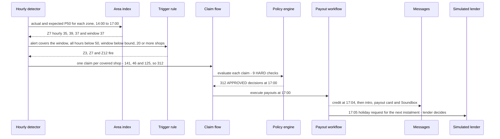
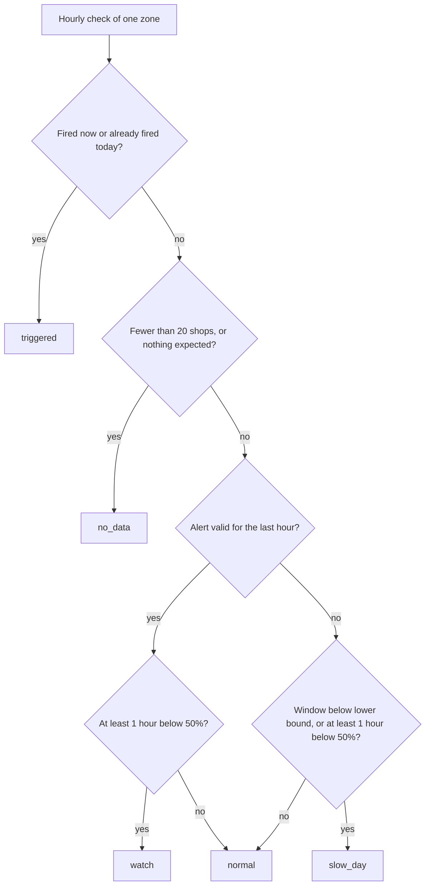

# Area auto-claim (K1)

| | |
|---|---|
| Status | v1.4 · K1 BUILT (commit 86575ea) · X2, receipt and what-if additions BUILT (waves 1 and 4; the what-if behind `h24_whatif`) |
| Owner | Omkar Kadam |
| Date | 2 Oct 2026 |
| Audience | Product, engineering, underwriting, compliance |
| Related | [Facts and sources](../../01-strategy/facts-and-sources.md) · [SPEC §8–9](../../SPEC.md) · [DEMO, monsoon replay](../../DEMO.md) · [Policy wording and CIS](../policy-wording-and-cis.md) · [Personas and JTBD](../personas-and-jtbd.md) · [fs-09 policy engine and audit](fs-09-policy-engine-and-audit.md) · [fs-03 EDI holiday](fs-03-edi-holiday.md) · [fs-08 claims officer console](fs-08-claims-officer-console.md) · [ADR 0002](../../04-engineering/adr/0002-area-sales-index-trigger.md) |

## TL;DR

- **Trigger:** a zone fires when a RAIN or CIVIC alert (any level) was issued and is valid for the whole 3-hour window, each of the last 3 completed hourly indices is below 50%, the window index is below the zone's conformal lower bound, at least 20 covered shops are in the index, and the zone has not fired that day. The merchant does nothing.
- **Area index:** the zone's actual sales divided by its expected sales (forecast P50) over the window, summed across the zone's covered shops that are scheduled open. It is weighted by expected sales, so a large shop counts for more than a small one.
- **Claims:** one AREA claim per merchant who holds a cover in a zone that fired. Merchants without cover get no claim.
- **Payout:** half of (that shop's expected day × the zone drop %), rounded to the rupee, capped at ₹2,500 a shop a day.
- **Timeline:** decisions and trigger at 17:00, credit at 17:04, instalment request to the lender at 17:05. The lender decides the holiday (fs-03).
- **Merchant sees:** Hindi intro message, payout card and Soundbox line at 17:04. The explanation is the reply when the merchant asks why.
- **Code:** the policy engine approves money (`backend/chhatri/policy/engine.py`). An area claim runs 9 checks, all HARD, so it is DECLINED or APPROVED and never REFERRED.
- **Priority:** K1 is built. X2 and the additions below are P0 and follow the build waves.

## 1. Summary

**What:** a zone has a loss that an alert predicted. Chhatri sees it in the shops' own sales and pays the same evening with no form.

**Who:** any merchant with an active, prepaid cover in a zone where a trigger fires.

**Why:** the 30 to 60 day claim (A3) forces a merchant in a crisis to borrow or close. Paying the same day, with the arithmetic shown from the merchant's own numbers, is the point of the product.

**IDs:** K1. Related: K3 (EDI holiday), K4 and K7 (engine and audit), K5 (explanations), H13 and H14 (sources and counterfactuals, fs-09).

## 2. Status today and what changes

### 2.1 What exists (BUILT)

| Component | Path | Demo |
|---|---|---|
| Area index | `backend/chhatri/detect/area_index.py` (`zone_window`) | Z7 37% at 17:00 |
| Trigger evaluation and zone status | `backend/chhatri/detect/triggers.py` (`evaluate_hour`) | Z3, Z7 and Z12 fire at 17:00 |
| Conformal lower bound (calibration) | `backend/chhatri/forecast/calibrate.py`, stored in `backend/artifacts/model/manifest.json` | Z7 bound 92 |
| Claim creation per covered shop | `backend/chhatri/replay/area.py` | 312 claims |
| Policy checks (9 for an area claim) | `backend/chhatri/policy/checks.py`, `catalogue.py` | all PASS for Anil |
| Payout arithmetic | `backend/chhatri/policy/amounts.py` (`area_breakdown`) | ₹1,380 = ½ × ₹4,380 × 63% |
| Engine decision | `backend/chhatri/policy/engine.py` (`evaluate_area_claim`) | decisions at 17:00 |
| Payout execute and credit | `backend/chhatri/ledger/payouts.py` | credit at 17:04 |
| Explanation strings | `backend/chhatri/policy/explain.py` | "Your usual Tuesday: ₹4,380" |
| Merchant messages | `backend/chhatri/conversation/messages.py`, `notifications.py` | `AREA_PAYOUT_INTRO`, `EXPLAIN_AREA` |
| Audit | `backend/chhatri/audit/log.py` | `/audit`, Verify chain |

### 2.2 What changes

| Task | ID | Owner | Wave |
|---|---|---|---|
| Validate the published (₹10-rounded) expected day when the claim is created. The engine already raises on an unrounded value; this moves the check to the `Claim` model so a bad claim is never stored | X2 | Ujjwal Pardeshi | 1 |
| Receipt with sources and a counterfactual for every decision, including a "why no payout" for a zone like Z9 | H13, H14 (fs-09) | Ujjwal Pardeshi, Omkar Kadam | 1 |
| Instalment request to the lender with lender-decides wording | X4 (fs-03) | Ujjwal Pardeshi | 1 |
| What-if panel: change rain and sales inputs and watch the same trigger rule recompute, read-only | H24 (fs-08) | Omkar Kadam | 4 |
| Ops strip with real counts | H8 (fs-08) | Omkar Kadam | 4 |

## 3. User stories and jobs to be done

| ID | Story | Job |
|---|---|---|
| J1 | As Anil, a tea-stall owner in a rain-hit zone, I want my loss paid today so I can eat and pay my loan, not wait 30 to 60 days. | Make me whole after a shock without an application. |
| J2 | As the claims officer Rajesh, I want to see at 17:04 that 312 shops were paid and from what data. | Confirm the right people and amounts were paid before I step in. |
| J3 | As the lender's credit manager, I want to know that Chhatri paid before I decide on a holiday request. | Tie the holiday request to a credited payout (fs-03). |
| J4 | As a judge, I want to see why Chembur got nothing on a day its sales fell. | Understand the trigger, not just the payout. |

## 4. Rules and reference data

### 4.1 Rules (`backend/chhatri/policy/rules.yaml`, pilot-0.1)

| Rule | Key | Value | Note |
|---|---|---|---|
| Payout share | `payout_share` | 0.50 | Half of the loss |
| Index floor | `area.index_floor_pct` | 50 | Each of the 3 hours must be below 50 (strict) |
| Window length | `area.consecutive_hours` | 3 | The last 3 completed hours |
| Quorum | `area.min_shops_in_index` | 20 | At least 20 covered, open shops in the zone index |
| Area daily cap | `area.daily_cap_rupees` | 2500 | Per merchant per day |
| Annual limit | `annual_limit_rupees` | 30000 | Per merchant, rolling 365 days ending on the event date |
| Waiting period | `cover.waiting_period_days` | 7 | A new cover starts 7 days after purchase |
| Alert look-ahead | `cover.alert_lookahead_hours` | 72 | Applies to cover quotes, not to claims. A quote is BLOCKED when an alert is valid now or starts within 72 hours |
| Case answer time | `dispute_sla_hours` | 24 | Every case's `due_by` is its opening time plus 24 hours |
| Payout rail delay | `payout_rail_delay_minutes` | 4 | Credit 4 simulated minutes after the decision |
| Instalment step delay | `instalment_pause_delay_minutes` | 5 | The step runs 5 minutes after the decision, 1 minute after the credit |

### 4.2 Zone reference (monsoon replay, Tue 19 Aug 2025, window 14:00 to 17:00)

These are the numbers on the console map and in the golden tests. Alert `A-20250818-01` is a RED rain alert, issued Mon 18 Aug 17:30 and valid Tue 14:00 to 20:00, for Z3, Z7 and Z12.

| Zone | Area | Shops in index | Hourly index 14:00, 15:00, 16:00 | Window index (drop) | Lower bound | Alert | Status at 17:00 | Paid | Zone total |
|---|---|---|---|---|---|---|---|---|---|
| Z3 | Worli · Lower Parel | 141 | 39%, 37%, 37% | 38% (62) | 89 | A-20250818-01 | triggered | 141 shops | ₹2,06,719 |
| Z7 | Parel · Lalbaug | 46 | 35%, 39%, 37% | 37% (63) | 92 | A-20250818-01 | triggered | 46 shops | ₹58,900 |
| Z9 | Chembur | 64 | 59%, 58%, 67% | 61% | 90 | none | slow_day | none | none |
| Z12 | Byculla | 125 | 48%, 45%, 48% | 47% (53) | 78 | A-20250818-01 | triggered | 125 shops | ₹1,59,801 |

Totals: 3 zones, 312 shops paid, ₹4,25,420. Per-shop payouts run from ₹217 to ₹2,500, and 32 shops reach the cap. Ramesh (S-0907, Z3) has no cover, so he is not in the index and has no claim.

Why Z9 gets nothing: there is no alert, and its hours (59, 58, 67) are not below 50. Its window index of 61 is below its lower bound of 90, so `BELOW_MODEL_RANGE` alone would pass. The trigger needs all of the conditions together. Z9's status is `slow_day`: no trigger, no claims, no decision.

The lower bound is the conformal bound from `manifest.json` (`lower_bound_pct`): the ⌊(n+1)·0.025⌋-th smallest window index over held-out normal days, per zone. The model was trained and calibrated on simulated sales, so the backtest is circular by design (see ADR 0002).

## 5. Flow and states

### 5.1 Trigger to payout

### 5.2 Zone status (first match wins, re-evaluated every hour)

The map stays red for the rest of the day once a zone has fired. Z9 is the `slow_day` case.

## 6. Inputs and data sources

| Input | Source | Mode today |
|---|---|---|
| Hourly sales (actual paise) | the simulated sales panel (`backend/chhatri/sim/sales.py`), fixed seed | SIMULATED |
| Expected sales (P50 per shop per hour) | LightGBM quantile model, `backend/chhatri/forecast/model.py` | model trained on simulated sales |
| Zone lower bound | `backend/artifacts/model/manifest.json`, `lower_bound_pct` per zone | committed artifact |
| Alerts | scripted in `backend/chhatri/sim/scenarios.py`: `A-20250818-01` (source text "IMD-style nowcast · simulated") | SIMULATED |
| Rainfall | real Open-Meteo history in the weather fixtures (`backend/data/weather`) | real data, replayed from fixtures |
| Merchant zone and cover | city fixtures and `Store.cover` | SIMULATED |
| Payout schedule | simulated settlement rail, 4 minutes | SIMULATED |

## 7. Decision logic and checks

### 7.1 Trigger evaluation (`detect/triggers.py`)

At each hour boundary `t`, a zone fires when all of these hold (every comparison is strictly less than):

1. A RAIN or CIVIC alert, issued by `t` and valid for the whole window `[t - 3h, t)`, covers the zone. Alert level does not matter. A heatwave alert does not count. If several qualify, the earliest issued (then lowest id) is used.
2. Each of the 3 completed hourly indices is below 50, and the window index is below the zone's lower bound.
3. The index has at least 20 shops.
4. The zone has not already fired that day.

The index is computed over the zone's covered shops that are scheduled open (weekly-off shops leave the index). A zone fires once a day, as one `AreaTrigger` with an id like `E-Z7-20250819`.

### 7.2 Policy checks (area claim: 9 checks, all HARD)

| Code | Fails when | Merchant sees |
|---|---|---|
| `COVER_IN_FORCE` | no cover, status not ACTIVE, or `starts_on` after the event date | `REASON_COVER_IN_FORCE` |
| `PREMIUM_PREPAID` | `prepaid_through` before the event date (s.64VB) | `REASON_PREMIUM_PREPAID` |
| `COVER_BEFORE_ALERT` | the cover was bought at or after the alert was issued | `REASON_COVER_BEFORE_ALERT` |
| `ALERT_ACTIVE` | the trigger's alert is missing or does not cover the zone for the whole window | `REASON_ALERT_ACTIVE` |
| `INDEX_QUORUM` | fewer than 20 shops in the index | `REASON_INDEX_QUORUM` |
| `BELOW_FLOOR` | not every one of the 3 hours is below 50 | `REASON_BELOW_FLOOR` |
| `BELOW_MODEL_RANGE` | window index is not below the zone lower bound | `REASON_BELOW_MODEL_RANGE` |
| `NOT_ALREADY_PAID` | an area payout for this merchant and date already exists | `REASON_NOT_ALREADY_PAID` |
| `WITHIN_ANNUAL_LIMIT` | paid in the last 365 days plus this amount is above ₹30,000 | `REASON_WITHIN_ANNUAL_LIMIT` |

The four trigger-level checks (alert, quorum, floor, bound) repeat the detector's rule on the claim's own trigger record. They cannot normally fail, because a claim exists only after the zone fired. They are there so a claim built from inconsistent data is still stopped.

Outcome: any HARD fail gives DECLINED, amount 0, reason from the first failing check. Otherwise APPROVED. Area claims have no SOFT check, so none is REFERRED.

### 7.3 Amount logic (`policy/amounts.py`)

1. Published expected day: the merchant's expected sales for the event day, forecast P50 rounded to the nearest ₹10.
2. Drop % = 100 minus the zone window index.
3. Lost = expected × drop %, in paise, half up.
4. Share = payout share (0.50) × lost, rounded to a whole rupee.
5. Payout = min(share, ₹2,500).

Anil (S-0142), Z7, Tuesday 19 Aug: expected ₹4,380 (438000 paise), drop 63%, lost ₹2,759.40 (275940 paise), share ₹1,379.70 rounded to ₹1,380 (138000 paise), cap ₹2,500 not reached. Payout ₹1,380. Decision `D-000142`, claim `CL-000142`, payout `P-000142`.

## 8. Merchant-facing copy

### 8.1 Exact catalogue strings (`backend/chhatri/conversation/messages.py`)

| Key | Hindi | English |
|---|---|---|
| `AREA_PAYOUT_INTRO` | `{name_hi} जी, आज भारी बारिश से आपके इलाके की बिक्री {drop}% गिरी।` | `{name_en} ji, heavy rain cut your area's sales by {drop}% today.` |
| `PAYOUT_CARD` | `आज के सेटलमेंट के साथ जमा` | `Credited with today's settlement` |
| `SOUNDBOX` | `Paytm par {amount} prapt hue — Chhatri se` | `{amount} received on Paytm, from Chhatri` |
| `EXPLAIN_AREA` | `आपका आम {weekday_hi}: {expected}। आज आपके इलाके की बिक्री {drop}% गिरी। छतरी खोई हुई बिक्री का आधा देती है।` | `Your usual {weekday_en}: {expected}. Your area fell {drop}%. Chhatri pays half the lost sales.` |
| `EXPLAIN_AREA_FORMULA` | `आपके भुगतान का हिसाब: {formula_hi}` | `How your payout was worked out: {formula_en}` |

At credit time (17:04) the merchant gets the intro, the payout card (badge "No claim needed") and the Soundbox line. The explanation (`EXPLAIN_AREA`, then the formula) is the reply when the merchant asks why. The instalment message at 17:05 is covered in fs-03.

### 8.2 Additions

No new area wording is needed. The receipt (fs-09) adds sources and a counterfactual to the formula that already exists. Counterfactual and source-chip wording is proposed there.

## 9. Edge cases and failure modes

| Case | Behaviour | Message | Audit |
|---|---|---|---|
| Shop closed for its own reasons on alert day | An area claim does not need silence. A covered shop in a fired zone gets a claim and is paid if its checks pass. | intro and card | `decision.area`, `payout.execute` |
| Merchant has no cover (Ramesh, S-0907) | Not in the index, no claim | none | none |
| Alert covers only part of the window | No trigger (`test_alert_must_cover_whole_window`) | none | none |
| Heatwave alert instead of rain or civic | Does not count (`test_heatwave_does_not_count_but_civic_does`) | none | none |
| Alert issued after the evaluation hour | Ignored (`test_alert_issued_after_now_is_ignored`) | none | none |
| Several alerts qualify | The earliest issued (then lowest id) is used (`test_earliest_issued_alert_is_used`) | intro names rain | `trigger.fired` holds `alert_id` |
| Fewer than 20 shops in the index | No trigger, status `no_data` (`test_quorum`) | none | none |
| An hour exactly at 50% | Not below the floor, so no trigger (`test_floor_is_strict`) | none | none |
| Zone already fired today | No second trigger (`test_already_triggered_that_day`) | none | none |
| Cover bought after the alert was issued | `COVER_BEFORE_ALERT` FAIL, DECLINED | `REASON_COVER_BEFORE_ALERT` | `decision.area` |
| Premium lapsed before the event | `PREMIUM_PREPAID` FAIL, DECLINED. A zone whose premiums lapsed pays nobody (`test_a_zone_whose_premiums_lapsed_is_declined_and_nothing_is_paid`) | `REASON_PREMIUM_PREPAID` | `decision.area` |
| Annual limit would be passed | `WITHIN_ANNUAL_LIMIT` FAIL, DECLINED | `REASON_WITHIN_ANNUAL_LIMIT` | `decision.area` |
| Z9: 61% of expected, no alert | `slow_day`. No trigger, no claim, no decision. The feed reads "{zone} at {index}% with no alert: slow day, no payout" | none | none |
| Payout workflow cannot start | Audited as `workflow.start_failed`, the replay continues | none | `workflow.start_failed` |

## 10. Guardrails, privacy and compliance

### 10.1 Guardrails

- **Code decides the money.** A payout exists only after an APPROVED decision (SPEC §0.2). No LLM touches an amount.
- **Catalogue text only.** Merchant-facing text about money comes from `messages.py` filled with decision facts.
- **Reproducible amounts.** Every rupee is reproducible from the numbers beside it. The formula is `½ × expected × drop% = amount`.

### 10.2 Data minimisation

- The decision holds the merchant id, amount, rules version, formula and check results. It holds no income or loan data.
- The zone index is a zone aggregate. It is not stored per person.

### 10.3 Fairness and basis risk

- The index is weighted by expected sales and needs at least 20 shops, so one small shop barely moves it. A large shop moves it more. This is a design choice, not a protection against gaming.
- The 7-day waiting period and the 72-hour look-ahead on cover quotes stop a merchant from buying cover once a storm is forecast.
- The lower bound is a conformal bound calibrated on simulated sales. It limits triggering on ordinary slow days. How well it matches the losses merchants actually suffer is not known until a pilot tests it (ADR 0002).

### 10.4 Regulatory

| Rule | How it is met |
|---|---|
| s.64VB (cash before cover) | `PREMIUM_PREPAID`: a payout needs premium received through the event date |
| Case answer time | `due_by` is the case's opening time plus 24 hours, tracked by the follow-up workflow |
| Parametric product filing | With the partner insurer, after the hackathon |
| DPDP (minimisation, withdrawal) | Sales data is used for cover and claims. Withdrawal and deletion are N6 (fs-07) |
| FREE-AI (explainability) | Formula today; sources and counterfactual with H13 and H14 (A23) |

## 11. Acceptance criteria

| Given | When | Then | Audit |
|---|---|---|---|
| Monsoon, Z7, alert `A-20250818-01` valid Tue 14:00 to 20:00 | The replay reaches 17:00 | Hourly indices are 35, 39, 37 (all below 50), window index 37 is below the bound 92, 46 shops are in the index, so Z7 fires with `drop_pct` 63 | `trigger.fired` |
| The same moment for Z3 and Z12 | Evaluated | Z3 fires (39, 37, 37, window 38, bound 89, 141 shops). Z12 fires (48, 45, 48, window 47, bound 78, 125 shops) | `trigger.fired` |
| Z7 fired, Anil has cover and a ₹4,380 expected Tuesday | The engine evaluates his claim | `AreaBreakdown`: expected 438000, drop 63, lost 275940, share 138000, cap 250000, amount 138000 | `decision.area` |
| The same claim | The 9 checks run | All PASS: cover active since 17 Mar 2025, premium prepaid through 22 Aug 2025, cover bought 10 Mar 2025 11:00 before the alert at 18 Aug 17:30, alert A-20250818-01 covers 14:00 to 17:00, 46 shops, hours 35% · 39% · 37%, 37% below 92%, not paid before, ₹1,380 of ₹30,000 | `decision.area` |
| Outcome APPROVED, ₹1,380 | The payout workflow runs | `P-000142` created at 17:00, CREDITED at 17:04 | `payout.execute`, `payout.credit` |
| Anil's phone at 17:04 | Messages arrive | `AREA_PAYOUT_INTRO` (63%), the payout card ₹1,380 with badge "No claim needed", the Soundbox line | `message.outbound`, `soundbox.announce` |
| Anil taps "why" | The reply is sent | `EXPLAIN_AREA` with Tuesday, ₹4,380 and 63%, then the formula `½ × ₹4,380 × 63% = ₹1,380` | `message.outbound` |
| Z9 at 17:00, no alert, index 61 | The detector runs | No trigger, status `slow_day`, no claim for any Z9 shop, nothing paid | none |
| The whole run to 17:06 | KPIs are read | 3 zones, 312 shops paid, 4 minutes, ₹4,25,420 paid, 123 instalments paused | n/a |

## 12. Telemetry and audit events

Real action names (SPEC §11):

| Action | Subject | Written when | Actor |
|---|---|---|---|
| `alert.issued` | alert | An alert enters the feed | system |
| `trigger.fired` | trigger `E-Z7-20250819` | A zone fires. Data is the whole `AreaTrigger` | model |
| `decision.area` | decision `D-000142` | The engine decides an area claim. Data is the decision with every check and a claim summary | policy-engine |
| `payout.execute` | payout `P-000142` | At the decision | workflow:payout |
| `payout.credit` | payout `P-000142` | 4 minutes later | workflow:payout |
| `message.outbound`, `soundbox.announce` | message | Intro, card, Soundbox | ai-agent |
| `instalment.pause` | instalment pause | 17:05, on a grant (fs-03 adds the request and decision entries) | workflow:payout |

**Console.** The ops strip (H8, fs-08, wave 4) shows the counts. Its exact metric definitions are in fs-08.

## 13. Build plan

| Task | ID | Owner | Wave |
|---|---|---|---|
| Claim model validates the published expected day | X2 | Ujjwal Pardeshi | 1 |
| Receipt with sources and counterfactuals | H13, H14 | Ujjwal Pardeshi, Omkar Kadam | 1 |
| Instalment request and lender-decides wording | X4 | Ujjwal Pardeshi | 1 |
| What-if panel | H24 | Omkar Kadam | 4 |
| Ops strip | H8 | Omkar Kadam | 4 |

## 14. Test plan

### 14.1 Existing tests (BUILT)

| Area | File | Test functions |
|---|---|---|
| Area index | `backend/tests/detect/test_area_index.py` | 10 |
| Triggers | `backend/tests/detect/test_triggers.py` | 21 (some parametrized): `test_seventeen_hundred`, `test_build_up`, `test_floor_is_strict`, `test_lower_bound_is_strict`, `test_alert_must_cover_whole_window`, `test_heatwave_does_not_count_but_civic_does`, `test_quorum`, `test_already_triggered_that_day` |
| Checks | `backend/tests/policy/test_checks.py` | 16 |
| Amounts | `backend/tests/policy/test_amounts.py` | 13 |
| Engine | `backend/tests/policy/test_engine.py` | 22: `test_area_approved_anil_1380`, `test_area_capped`, `test_area_hard_fail_declines_with_first_failing_reason`, `test_area_annual_limit_declines` |
| Payouts | `backend/tests/ledger/test_payouts.py` | 8 |
| Replay | `backend/tests/replay/test_area_flow.py` | 10: `test_three_zones_trigger_at_17_00_on_the_scripted_alert`, `test_every_covered_shop_in_a_triggered_zone_gets_one_area_decision`, `test_payouts_are_executed_at_17_00_and_credited_at_17_04`, `test_kpis_and_the_audit_trail_after_the_storm` |
| Golden numbers (slow) | `backend/tests/test_golden_numbers.py` | 13: `test_trigger_numbers`, `test_z9_is_a_slow_day_without_payout`, `test_312_shops_are_approved`, `test_anil_is_paid_1380_with_the_spec_explanation`, `test_z7_total_is_58900`, `test_ramesh_gets_nothing` |
| Demo check | `backend/scripts/demo_check.py` | 70 checks across the four scenarios |

The whole backend suite is 1,711 fast and 36 slow tests at 99.7% coverage.

### 14.2 New tests (PLANNED)

| Test | File | What it checks |
|---|---|---|
| Claim model rejects an unrounded expected day (X2) | `backend/tests/domain/` | Creation fails loudly. |
| `test_trigger_verdict_matches_evaluate_hour` | `backend/tests/detect/test_triggers.py` | The extracted trigger rule (fs-09 section 9.5) gives the same result as today for every existing case. |
| `test_zone_no_trigger_z9` | `backend/tests/policy/test_counterfactual.py` | Z9's counterfactual names the missing alert and the hours not below 50. |
| X7 honest-wording test | existing conversation tests | Area copy has no promise and no unsupported figure. |

### 14.3 Manual rehearsal

| Test | Action | Expected |
|---|---|---|
| Storm | Load monsoon, seek 13:30, play to 17:05 | Z3, Z7, Z12 trigger at 17:00. 312 paid at 17:04. |
| Why | Tap the voice chip "why" | Reply with ₹4,380 and 63%, then the formula. |
| Dispute | Tap the voice chip "dispute" | `DISPUTE_ACK`, case `C-2291` (fs-06). |
| Slow day | Click Z9 | Status slow day, the verbatim "Why Zone 9 got nothing" text, no payout. |

## Open questions

1. **Real-drop definition in the backtest.** The backtest counts a real drop as a large fall in sales (SPEC §8.2). Is that threshold acceptable to Paytm and the partner insurer? Owner: Omkar Kadam.
2. **Pricing.** Loading 0.35 and the ₹2 minimum are illustrative. Which pricing method will the partner use? Owner: Omkar Kadam.
3. **Policy wording says "Red alert".** The detector accepts a RAIN or CIVIC alert of any level. Wording or rule must change before a pilot. Owner: Omkar Kadam.
4. **Lender acceptance.** Will each lender accept the holiday request format in fs-03? Owner: Omkar Kadam.

## Changelog

- 2026-10-02 · v1.4 · fixed alert wording (any RAIN or CIVIC alert), hourly examples (Z7 35, 39, 37), lower bound (conformal, from manifest.json, Z7 92), AreaBreakdown figures, payout range and the Z9 case (no alert, no claim, no decision); added the zone reference table; corrected audit action names, inputs, case due time, annual limit and test counts; zone status is now a decision flow; build waves replace dates
- 2026-10-02 · v1.3 · second fact-check pass
- 2026-10-02 · v1.2 · final consistency pass against the code
- 2026-10-02 · v1.1 · fact-check pass
- 2026-10-02 · v1 · first draft, spec compliance and code review
