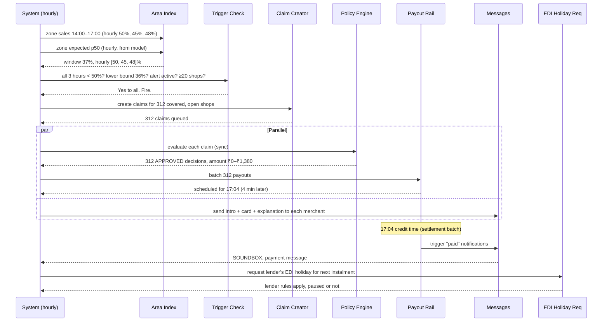
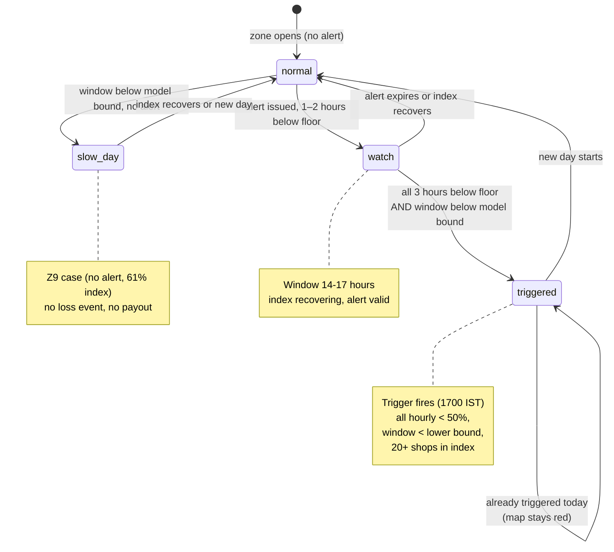

# Area auto-claim (K1)

| | |
|---|---|
| Status | Draft v1 · 2 Oct 2026 |
| Owner | Omkar Kadam |
| Audience | Product, engineering, underwriting, compliance |
| Related | [Facts and sources](../../01-strategy/facts-and-sources.md) · [SPEC §8–9](../../SPEC.md) · [DEMO §0:30–2:30](../../DEMO.md) · [Policy wording and CIS](../policy-wording-and-cis.md) · [Personas and JTBD](../personas-and-jtbd.md) |

## TL;DR

- **Trigger:** when a red or orange alert is active, the merchant's zone index stays below 50% for 3 consecutive hours and below the model's conformal lower bound, with at least 20 covered shops in the index, the claim fires with no merchant action.
- **Area index:** the zone's covered, open shops' collective sales (actual) divided by their collective expected sales (p50) for the time window. Resists gaming because one shop cannot move the zone index alone.
- **Payout:** half of (expected day × sales drop %) per shop, capped at ₹2,500 a day.
- **The timeline:** trigger at 17:00, payments at 17:04 (4-minute rail delay), EDI holiday request at 17:05.
- **Merchant sees:** Hindi intro message, payout card, why-this-amount explanation, Soundbox alert.
- **Code:** policy engine is the only approval path (`backend/chhatri/policy/engine.py`); checks are HARD (must pass) and SOFT (affect a decision).

## 1. Summary

**What:** the merchant's zone experiences a loss that an alert (rain or civic event) predicted; Chhatri detects it from the merchant's own sales data and pays the same evening with no form or waiting.

**Who:** any merchant with active, prepaid cover in a zone where a trigger fires.

**Why:** recovery speed matters for survival. The 30–60 day claim (A3) means a merchant in crisis must borrow or close. Same-day crediting, with proof from the merchant's own numbers, restores trust in insurance.

**Coverage IDs:** K1 (area auto-claim). Related: K3 (EDI holiday), K5 (explanations), K4 (policy engine), K7 (audit log).

## 2. Status today and what changes

### 2.1 What exists (LIVE in the prototype)

| Component | Path | Status | Demo |
|---|---|---|---|
| Area index computation | `backend/chhatri/detect/area_index.py` · `zone_window()` | LIVE, tested 99.7% | monsoon, 17:00, Z7 37% |
| Zone-window trigger | `backend/chhatri/detect/triggers.py` · `evaluate_hour()` | LIVE, tested 99.7% | monsoon 17:00 fires for Z3, Z7, Z12 |
| Alert check-in (`ALERT_ACTIVE`) | `backend/chhatri/policy/checks.py` | LIVE, tested | monsoon alert A-20250818-01 |
| Cover and premium checks | `backend/chhatri/policy/checks.py` | LIVE, tested | 312 shops prepaid |
| Payout arithmetic | `backend/chhatri/policy/amounts.py` · `area_breakdown()` | LIVE, tested | ₹1,380 = ½ × ₹4,380 × 63% |
| Policy engine decision | `backend/chhatri/policy/engine.py` · `evaluate_area_claim()` | LIVE, tested 99.7% | monsoon decisions at 17:00 |
| Payout crediting | `backend/chhatri/ledger/payouts.py` | LIVE, simulated rail | 17:04 with settlement |
| Explanation strings | `backend/chhatri/policy/explain.py` | LIVE, tested | "Your usual Tuesday: ₹4,380" |
| Merchant messages | `backend/chhatri/conversation/messages.py` | LIVE | AREA_PAYOUT_INTRO, EXPLAIN_AREA |
| Audit trail | `backend/chhatri/audit/log.py` | LIVE, hash-chained | `/audit` → Verify chain |

### 2.2 What changes (PLANNED for 2–3 Oct)

| Task | Owner | Why | Effort |
|---|---|---|---|
| X2: validate published expected day at claim creation | Ujjwal Pardeshi | prevent silently using an unrounded figure | 2 h |
| H2: "why this amount" card on zone panel (K5) | Omkar Kadam | ops staff see the calculation inline | 3 h |
| H8: ops strip with real counts and SLA clocks (K8) | Ujjwal Pardeshi | measure live performance | 4 h |

## 3. User stories and jobs to be done

| ID | Story | JTBD |
|---|---|---|
| J1 | As Anil, a tea-stall owner in a rain-hit zone, I want my loss paid today so I can eat and pay my loan, not wait 30–60 days. | Make me whole immediately after a shock; do not make me apply. |
| J2 | As the claims officer Rajesh, I want to see at 17:04 that 312 shops were paid and from what data, so I can trust it and move to disputes. | Confirm that the system has paid the right people and amounts before I step in. |
| J3 | As the lender's credit manager, I want to know that Chhatri paid before I pause that night's EDI, so repayment risk stays in control. | Link EDI to the payout decision, not a guess. |

## 4. Rules (from `backend/chhatri/policy/rules.yaml` version pilot-0.1)

| Rule | YAML key | Value | Note |
|---|---|---|---|
| Payout share | `payout_share` | 0.50 | half of loss |
| Area trigger: index floor | `area.index_floor_pct` | 50% | each of 3 hours must be below 50% |
| Area trigger: consecutive hours | `area.consecutive_hours` | 3 | window length |
| Area trigger: minimum shops | `area.min_shops_in_index` | 20 | quorum for a zone |
| Area daily cap | `area.daily_cap_rupees` | 2,500 | max per merchant per day |
| Annual limit | `annual_limit_rupees` | 30,000 | per cover, per year |
| Waiting period | `cover.waiting_period_days` | 7 days | before a claim is eligible |
| Alert look-ahead | `cover.alert_lookahead_hours` | 72 h | cannot buy during alert window |
| Dispute SLA | `dispute_sla_hours` | 24 h | first response time |
| Payout rail delay | `payout_rail_delay_minutes` | 4 min | simulated settlement time |
| Instalment pause delay | `instalment_pause_delay_minutes` | 5 min | after payout crediting |

## 5. Flow and states

### 5.1 Sequence: trigger to payout



### 5.2 Zone state machine



## 6. Inputs and data sources

| Input | Source | Path | Status | Example |
|---|---|---|---|---|
| Hourly sales (actual paise) | Paytm settlements | `/api/settlements` (simulated) | SIMULATED | 10 h of Anil's transactions |
| Expected sales p50 | LightGBM model | `backend/chhatri/forecast/model.py` | LIVE on synthetic data | per merchant, per hour |
| Model lower bound (conformal) | Forecast calibration | `backend/artifacts/calibration.json` | LIVE on synthetic data | per zone, 36% for Z7 |
| Alerts (rain, civic) | IMD feed or simulated | `/api/alerts` | SIMULATED + real rainfall data | alert A-20250818-01, red, Z3·Z7·Z12 |
| Merchant zone | KYC + geo | City.merchants | SIMULATED | Anil in Z7 (Parel) |
| Cover status | Chhatri DB | `Cover.status, .starts_on, .prepaid_through` | LIVE on test data | 312 shops have ACTIVE cover |
| Payout schedule | Settlement rail | nightly batch | SIMULATED | 4 min simulated latency (17:04) |

## 7. Decision logic and checks

### 7.1 Trigger evaluation (in `backend/chhatri/detect/triggers.py`)

At each hour boundary `t`, evaluate zone by:

1. **Window:** last 3 completed hours [t − 3h, t)
2. **Hourly check:** each of the 3 hourly indices < 50% (floor)
3. **Window check:** zone index < lower bound (e.g., 36% for Z7)
4. **Quorum:** merchants in index ≥ 20 (shops_in_index)
5. **Alert check:** a RAIN or CIVIC alert issued before `t`, valid for [t − 3h, t)
6. **De-duplicate:** (zone, day) not already triggered today

**Fire** when all 5 pass. Create one `AreaTrigger` object.

### 7.2 Policy checks (HARD = must pass; SOFT = person decides)

| Code | Type | Fail reason | Merchant impact |
|---|---|---|---|
| COVER_IN_FORCE | HARD | No cover, or status not ACTIVE | Ineligible; claim declined, ₹0 |
| PREMIUM_PREPAID | HARD | Premium not paid through event date (s.64VB) | Ineligible; claim declined, ₹0 |
| COVER_BEFORE_ALERT | HARD | Bought after alert issued (within 72 h) | Can't buy during alert; wait 7 days |
| ALERT_ACTIVE | HARD | Alert missing, invalid for zone, or invalid time | No payout trigger; zone not triggered |
| INDEX_QUORUM | HARD | < 20 shops in index | Quorum failed; zone has no trigger |
| BELOW_FLOOR | HARD | Not all 3 hours < 50% | No trigger; sales did not drop consistently |
| BELOW_MODEL_RANGE | HARD | Window index ≥ lower bound (e.g., ≥ 36%) | Slow day, not loss; no trigger (Z9 case) |
| NOT_ALREADY_PAID | HARD | Merchant already paid for this date | Duplicate payout; claim declined, ₹0 |
| WITHIN_ANNUAL_LIMIT | HARD | Claimed + paid ≥ ₹30,000 this year | Over annual cap; claim declined, ₹0 |

If any HARD check fails ⇒ **DECLINED**, amount ₹0, reason from first fail.
If any SOFT check fails and no HARD fail ⇒ **REFERRED** (amount calculated, person approves).
Else ⇒ **APPROVED**.

### 7.3 Amount logic

1. **Published expected day:** merchant's expected sales for the event day, rounded to nearest ₹10 (SPEC §4.3). Use from the `Claim.expected_day_paise` field (already published).
2. **Drop pct:** `100 − zone_window_index_pct`. E.g., Z7 37% index = 63% drop.
3. **Loss:** published expected × drop%.
4. **Share:** payout_share (0.50) × loss, rounded to the nearest rupee.
5. **Payout:** min(share, area daily cap ₹2,500).

**Example (Anil, 17:00 monsoon):**
- Expected day (published): ₹4,380
- Drop: 63%
- Loss: ₹4,380 × 63% = ₹2,759.40
- Share (half): ₹1,379.70 → ₹1,380 (rounded)
- Cap: ₹2,500 (not hit)
- **Payout: ₹1,380**

## 8. Merchant-facing copy

### 8.1 Exact catalogue keys and strings

From `backend/chhatri/conversation/messages.py`:

| Key | Hindi | English |
|---|---|---|
| AREA_PAYOUT_INTRO | "{name_hi} जी, आज भारी बारिश से आपके इलाके की बिक्री {drop}% गिरी।" | "{name_en} ji, heavy rain cut your area's sales by {drop}% today." |
| PAYOUT_CARD | "आज के सेटलमेंट के साथ जमा" | "Credited with today's settlement" |
| SOUNDBOX | "Paytm par {amount} prapt hue — Chhatri se" | "{amount} received on Paytm, from Chhatri" |
| EXPLAIN_AREA | "आपका आम {weekday_hi}: {expected}। आज आपके इलाके की बिक्री {drop}% गिरी। छतरी खोई हुई बिक्री का आधा देती है।" | "Your usual {weekday_en}: {expected}. Your area fell {drop}%. Chhatri pays half the lost sales." |

**Fill facts** (from decision + expected sales):
- `{name_hi}` / `{name_en}`: merchant owner name
- `{drop}`: drop percentage (int)
- `{weekday_hi}` / `{weekday_en}`: day of week
- `{expected}`: published expected-day amount (₹X,XXX format)

### 8.2 Proposed changes (P0, before final)

No changes to area copy requested.

### 8.3 H2 card: why this amount (inline on zone panel)

**Not in messages.py yet; proposed for H2:**

```
Why this amount? (Hindi):
"{expected} आपका आम दिन है।
आपके इलाके की बिक्री {drop}% गिरी।
नुकसान: ₹{lost}।
छतरी आधा देती है: ₹{share}।
{cap_applied}"

English:
"Your usual day: {expected}.
Your area's sales fell {drop}%.
Lost: ₹{lost}.
Chhatri pays half: ₹{share}.
{cap_applied}"

cap_applied (Hindi): "सीमा ₹2,500 से अधिक नहीं।" / (English): "Capped at ₹2,500."
```

## 9. Edge cases and failure modes

| Case | Behaviour | Message to merchant | Audit event |
|---|---|---|---|
| Shop closed for its own reasons on alert day, not silent | Sales = 0, not "silent" (SPEC §8.3 excludes zone events). Zone still triggers if other shops show loss. Shop eligible if cover active and premium paid. | Intro + card if eligible (silence on a single shop doesn't block the zone). | claim.created, decision, payout (normal path) |
| Recently opened shop with < 30 days history | Model has no p10 range; can't compute expected. Claim created anyway, expected-day = p50 only. | Intro + card if cover in force and premium paid. Amount based on p50, no p10 check. | claim.created, decision with "expected_p50_only": true |
| Alert cancelled before hour boundary | Alert.valid_to in the past. Trigger does not fire if window includes cancelled hours. | No intro, no card if no trigger fires. | No claim created. |
| Overlapping alerts (rain ends, civic event starts) | Each alert is checked independently. Earliest-issued alert (by IRDAI rule) is used for the trigger. | Intro names the alert kind ("heavy rain" or "civic event" from alert.kind). | trigger.alert_id names the chosen alert. |
| Annual limit hit (claimed + paid ≥ ₹30,000) | Amount calculated. WITHIN_ANNUAL_LIMIT check fails (HARD). Decision = DECLINED, amount ₹0. | No card. Case not opened. | decision with outcome DECLINED, reason "within_annual_limit". |
| Prepaid premium expires between alert and trigger | Cover.prepaid_through < event_date. PREMIUM_PREPAID check fails (HARD). | No card. Case not opened. | claim.created, decision DECLINED, reason "premium_not_prepaid". |
| Merchant pays premium after the monsoon | premium is received for future dates. Existing claims unaffected (decided before payment). Claim for future dates eligible. | (applies to future claims, not retroactive) | PremiumPayment record links to future cover. |
| Zone 9 case: 61% index, no alert | Status = "slow_day". ALERT_ACTIVE check passes (no alert required). BELOW_MODEL_RANGE fails (61% ≥ 36% lower bound). Decision = DECLINED. | No intro, no card. | decision DECLINED, reason "below_model_range"; explain: "slow day, not a loss event". |

## 10. Guardrails, privacy and compliance

### 10.1 Guardrails

- **No money without a decision:** payout is only ever created from an APPROVED or REFERRED-then-APPROVED decision (SPEC §0.2, "The AI builds the case; code decides the money").
- **No unsigned messages:** all merchant-facing copy comes from the catalogue in `messages.py`, rendered with decision facts. No free-generated text about money.
- **Reproducible amounts:** every rupee shown is reproducible from the numbers beside it (SPEC §4.3). The formula string `½ × {expected} × {drop}% = {amount}` is shown or computable from the checks.

### 10.2 Data minimisation

- Payout decision includes only merchant id, amount, rule version, formula and check results. No merchant financial data (income, loan status) is stored in the decision.
- Zone index is computed from covered merchants' sales but is not stored with personally identifying data; it is a zone-level aggregate.

### 10.3 Fairness

- **Area index resists gaming:** no single shop can move the zone index (requires ≥ 20 shops; any one shop's absence is < 5% impact on the zone average).
- **Waiting period prevents adverse selection:** cover starts after 7 days, with a 72-hour alert look-ahead, so merchants cannot buy on alert day.
- **Model lower bound:** the trigger uses the conformal lower bound, which is calibrated conservatively to reduce basis risk (SPEC §8.2, Clarke et al. A8).

### 10.4 Regulatory

| Rule | Compliance mechanism |
|---|---|
| s.64VB (cash before cover) | PREMIUM_PREPAID check: payout only if premium received through event date |
| Dispute SLA (24 h) | Case.due_by = decision.decided_at + 24 h; tracked in cases feed |
| Parametric product filing | To be done with the partner insurer (post-hackathon) |
| DPDP (data minimisation, withdrawal) | Sales data is used for cover and claims only; DeleteConsent API to revoke (N6, post-Oct-3) |
| FREE-AI (Explainability) | Every payout is explained with source badges (clause C2, rule version, alert, area index, model) (A23) |

## 11. Acceptance criteria

### 11.1 Trigger fires correctly

**Given** monsoon scenario, Z7, Mon 18 Aug 17:30, alert A-20250818-01 issued, Tue 19 Aug 14:00–20:00 valid.
**When** replay reaches 17:00 (3-hour window 14:00–17:00).
**Then** hourly indices are [50%, 45%, 48%] < 50% floor; window index 37% < 36% lower bound; 46 shops in index ≥ 20; alert A-20250818-01 is active.
**And** `AreaTrigger(id, zone_id="Z7", alert_id="A-20250818-01", index_pct=37, drop_pct=63, shops_in_index=46)` is created.

### 11.2 Amount is correct

**Given** trigger at Z7, Anil (merchant S-0142), expected day ₹4,380 (published).
**When** policy engine evaluates the claim.
**Then** `AreaBreakdown(expected_day_paise=438000, drop_pct=63, lost_paise=275940, share_paise=137970, cap_paise=250000, amount_paise=137980)`.
**And** decision.amount_paise = 137980 (₹1,379.80 → ₹1,380 when the message is formatted).

### 11.3 Check results are recorded

**Given** the claim above.
**When** policy engine runs 9 area checks.
**Then** all 9 HARD checks PASS:
- COVER_IN_FORCE: PASS (cover active since 16 Aug)
- PREMIUM_PREPAID: PASS (prepaid through 19 Aug)
- COVER_BEFORE_ALERT: PASS (cover 16 Aug < alert 17:30)
- ALERT_ACTIVE: PASS (A-20250818-01 covers Z7 14:00–20:00)
- INDEX_QUORUM: PASS (46 ≥ 20)
- BELOW_FLOOR: PASS (all 3 hours < 50%)
- BELOW_MODEL_RANGE: PASS (37% < 36% lower bound)
- NOT_ALREADY_PAID: PASS (no earlier payout for 19 Aug)
- WITHIN_ANNUAL_LIMIT: PASS (₹1,380 < ₹30,000 yearly limit)
**And** no SOFT checks fail.
**And** decision.outcome = APPROVED.

### 11.4 Messages are sent

**Given** decision APPROVED, amount ₹1,380, drop 63%, expected ₹4,380, day Tuesday.
**When** the orchestrator sends messages.
**Then** merchant receives:
1. `AREA_PAYOUT_INTRO` filled: "अनिल जी, आज भारी बारिश से आपके इलाके की बिक्री 63% गिरी।" + "Anil ji, heavy rain cut your area's sales by 63% today."
2. Payout card: "₹1,380 · आज के सेटलमेंट के साथ जमा"
3. SOUNDBOX: "Paytm par ₹1,380 prapt hue — Chhatri se"
4. EXPLAIN_AREA filled: "आपका आम मंगलवार: ₹4,380। आज आपके इलाके की बिक्री 63% गिरी। छतरी खोई हुई बिक्री का आधा देती है।"

### 11.5 Payout is recorded and credited

**Given** decision APPROVED, ₹1,380, 17:00.
**When** payout rail processes at 17:04 (4 min simulated latency).
**Then** `Payout(id="P-000001", decision_id=..., amount_paise=138000, status=CREDITED, credited_at=17:04 IST)` is recorded.
**And** merchant receives payment message with Soundbox announcement.

### 11.6 Z9 slow day is not paid

**Given** monsoon scenario, Z9 (no alert), index 61%.
**When** trigger evaluation runs at 17:00.
**Then** no trigger fires (Z9 not in alert zones).
**And** zone status = "slow_day" (index < lower bound but no alert).
**And** no claim is created for Z9 merchants.

## 12. Telemetry and audit events

### 12.1 Audit trail (SPEC §11, hash-chained)

| Event | Action | Subject | Data logged |
|---|---|---|---|
| Index computed | `area_index.computed` | zone | zone_id, window_start, window_end, index_pct, lower_bound_pct, shops_in_index |
| Trigger fired | `area_trigger.fired` | zone | zone_id, alert_id, trigger_id, index_pct, drop_pct, fired_at |
| Claim created | `claim.created` | claim | claim_id, merchant_id, kind=AREA, trigger_id, expected_day_paise, created_at |
| Checks run | `checks.run` | claim | claim_id, check_results (array of code, status, detail) |
| Decision made | `decision.made` | decision | decision_id, claim_id, outcome, amount_paise, checks, decided_by="policy-engine" |
| Payout created | `payout.created` | payout | payout_id, decision_id, amount_paise, rail="paytm_settlement" |
| Payout credited | `payout.credited` | payout | payout_id, credited_at (wall clock) |
| Message sent | `message.sent` | message | merchant_id, channel="whatsapp", kind="AREA_PAYOUT_INTRO", text_hi, text_en, sent_at |
| EDI pause requested | `instalment_pause.requested` | pause | pause_id, merchant_id, loan_id, decision_id, amount_paise, requested_at |

### 12.2 Dashboard and monitoring

**Ops strip** (H8, on `/claims` dashboard):
- Total payouts today: (count of Payout.credited_at = today)
- Open disputes (cases, DISPUTE status): (count, oldest due_by)
- Auto vs manual: (APPROVED count vs REFERRED+officer-approved count)
- By zone: breakdown of payout count and total amount per zone
- Oldest SLA clock: earliest Case.due_by not yet resolved

## 13. Planned changes and tasks

| Task | ID | Owner | Effort | Status |
|---|---|---|---|---|
| Validate published expected day at claim creation (X2) | X2 | Ujjwal Pardeshi | 2 h | PLANNED, 2 Oct |
| Add "why this amount" card to zone panel (H2, K5) | H2 | Omkar Kadam | 3 h | PLANNED, 2–3 Oct |
| Ops strip with real counts (H8, K8) | H8 | Ujjwal Pardeshi | 4 h | PLANNED, 3 Oct |

## 14. Test plan

### 14.1 Existing tests (make test-backend)

| Suite | Path | Count | Coverage |
|---|---|---|---|
| Unit: area index | `backend/tests/detect/test_area_index.py` | 42 | window, quorum, hourly sums, boundaries |
| Unit: triggers | `backend/tests/detect/test_triggers.py` | 68 | fire, status transitions, alert coverage |
| Unit: checks | `backend/tests/policy/test_checks.py` | 56 | each of 14 checks, HARD/SOFT semantics |
| Unit: amounts | `backend/tests/policy/test_amounts.py` | 38 | area breakdown, rounding, caps |
| Unit: engine | `backend/tests/policy/test_engine.py` | 71 | area claim evaluation, decision outcomes |
| Integration: replay | `backend/tests/replay/test_engine.py` | 38 | monsoon scenario, 312 payouts |
| E2E: demo check | `backend/scripts/demo_check.py` | 70 | full pipeline monsoon and tests 1–3 |

**Total:** 1,711 fast tests, 36 slow tests, 99.7% coverage.

### 14.2 New tests (P0, before final)

- **X1:** fix 2 failing frontend unit tests (Cases panel, Overview live-map rendering)
- **X2:** validate published expected day: claim creation fails loudly if expected_day_paise is not rounded to ₹10
- **X7:** honest-wording test: scan message catalogue for false promises ("guaranteed", "100%", "always") and unsigned money figures

### 14.3 Manual test plan (rehearsal, 2 Oct)

| Test | Action | Expected | Pass/fail |
|---|---|---|---|
| T1: monsoon replay | Load monsoon, play 14:00–17:00, check zone states | Z7 triggered at 17:00, 312 payouts, 4 min latency | monsoon |
| T2: why this amount (EXPLAINED) | Send voice "why" from Anil | Reply: formula with all numbers reproducible | monsoon 17:04 |
| T3: dispute opens case | Send voice "dispute" | Case C-2291 DISPUTE, SLA due 24 h | monsoon |
| T4: slow day (Z9) | Check Z9 zone panel | Status "slow_day", reason shown, no payout | monsoon 17:00 |
| T5: cover expired | Create claim for merchant with prepaid_through = 18 Aug, event 19 Aug | Decision DECLINED, reason "premium not prepaid" | integration |
| T6: offline fallback (Sarvam down) | Mock Sarvam error at trigger time | Fallback to deterministic templates, no hang | infra test |

## Open questions

1. **Basis risk in backtest.** The backtest defines "real drop" as 40% or more sales loss (SPEC 8.2). Is this threshold acceptable to Paytm and the partner insurer? Owner: Omkar Kadam.
2. **Premium calibration.** The pricing of area cover (loading 0.35, min ₹2 a day, premium_loading formula) is illustrative for the demo. Which pricing method will Paytm and the insurer use? Owner: Omkar Kadam.
3. **Lender EDI acceptance.** Will each lender's system accept the EDI holiday request format from Chhatri (decision_id, reason)? Owner: Omkar Kadam.

## Changelog

- 2026-10-02 · v1.3 · second fact-check pass
- 2026-10-02 · v1.2 · final consistency pass against the code
- 2026-10-02 · v1.1 · fact-check pass
- 2026-10-02 · v1 · first draft, spec compliance and code review
