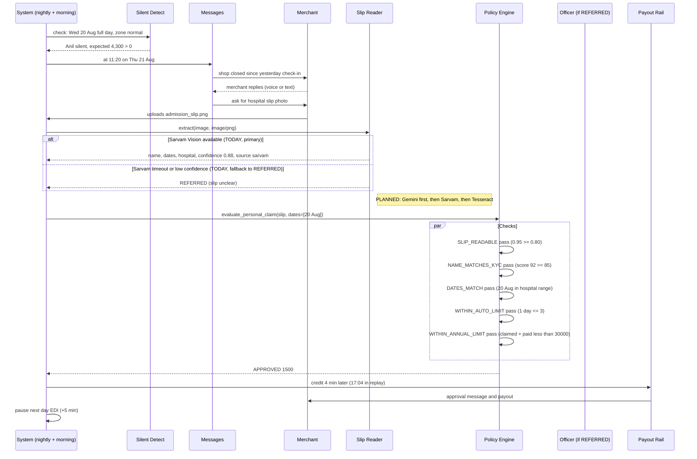
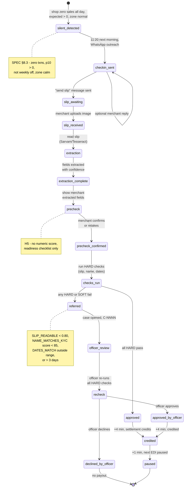

# Hospital-cash income claim (K2, N3, H5)

| | |
|---|---|
| Status | Draft v1 · 2 Oct 2026 |
| Owner | Omkar Kadam |
| Audience | Product, underwriting, compliance, AI safety |
| Related | [Facts and sources](../../01-strategy/facts-and-sources.md) · [SPEC §8–9](../../SPEC.md) · [DEMO §3:30–5:45](../../DEMO.md) · [Policy wording and CIS](../policy-wording-and-cis.md) · [Personas and JTBD](../personas-and-jtbd.md) · [AI architecture and guardrails](../../04-engineering/ai-architecture-and-guardrails.md) |

## TL;DR

- **Trigger:** merchant's zone is normal (no alert), shop goes silent (zero transactions all day, expected is above zero).
- **Proactive check-in:** at 11:20 next morning, Chhatri reaches out in Hindi on WhatsApp asking if all is well.
- **One slip:** merchant sends one photo of a hospital admission slip, discharge summary or bill.
- **Pre-check** (H5): merchant confirms the extracted fields (name, dates, hospital); checklist tells them what to retake if blurry or cropped.
- **Extraction (TODAY):** Sarvam Vision (primary), fallback to REFERRED (offline Tesseract planned). Extracts name, admission and discharge dates, hospital, document type, with per-field confidence.
- **Checks (HARD):** slip readable (confidence ≥ 0.80); name matches KYC (token-set ratio ≥ 85); admission ≤ silent day ≤ discharge.
- **Payout:** half of expected day, capped at ₹1,500 a day, up to 3 days automatically. Beyond 3 days or doubtful checks, a human approves.
- **Track in the mini-app:** Merchant sees the journey (Detected → Checked → Decided → Paid) and the reason at each step.

## 1. Summary

**What:** a merchant whose shop goes silent during normal weather may be in hospital. Chhatri detects the silence, reaches out, reads one hospital document and pays within hours, not days.

**Who:** any merchant with active, prepaid cover in a normal-weather zone who has zero sales for a full day.

**Why:** health events are invisible to area-trigger insurance (A8, A14). Hospital-cash products exist globally (A16), but they need documents. Chhatri reads the document with AI and decides the same day with no forms or multiple documents. It walks the track example end to end: understand coverage (mini-app), submit one document, track (tracker), resolve queries (Ask Chhatri), escalate (grievance ladder).

**Coverage IDs:** K2 (hospital-cash claim), N3 (live slip reading), H5 (pre-check).

## 2. Status today and what changes

### 2.1 What exists (LIVE in the prototype)

| Component | Path | Status | Demo |
|---|---|---|---|
| Silent-shop detection | `backend/chhatri/detect/silent.py` · `find_silent()` | LIVE, tested | Wed 20 Aug all-day silence |
| Morning check-in logic | `backend/chhatri/detect/silent.py` · `silent_this_morning()` | LIVE, tested | 11:20 check-in |
| Slip extraction request flow | `backend/chhatri/conversation/slip_flow.py` | LIVE, tested | ASK_SLIP message |
| Slip reading protocol | `backend/chhatri/integrations/base.py` · `SlipReader` | LIVE, abstract | TODAY: Sarvam; PLANNED: Gemini, Tesseract |
| Sarvam Vision adapter | `backend/chhatri/integrations/sarvam_vision.py` | LIVE (key-dependent) | reads embedded JSON or live API |
| Slip simulators | `backend/chhatri/integrations/sarvam_sim.py` | SIMULATED, tested | reads embedded JSON in PNG |
| Slip readability check | `backend/chhatri/policy/checks.py` · `slip_readable()` | LIVE, tested | confidence ≥ 0.80 |
| Name match check | `backend/chhatri/policy/checks.py` · `name_matches_kyc()` | LIVE, tested | token-set ratio ≥ 85 |
| Dates match check | `backend/chhatri/policy/checks.py` · `dates_match()` | LIVE, tested | admission ≤ day ≤ discharge |
| Payout arithmetic | `backend/chhatri/policy/amounts.py` · `personal_breakdown()` | LIVE, tested | ½ × ₹4,300, capped at ₹1,500 |
| Policy engine for personal | `backend/chhatri/policy/engine.py` · `evaluate_personal_claim()` | LIVE, tested 99.7% | illness scenario |
| Payout and EDI pause | `backend/chhatri/ledger/payouts.py` | LIVE, simulated rail | +4 min credit, +5 min pause |
| Merchant messages | `backend/chhatri/conversation/messages.py` | LIVE | CHECKIN_SILENT, ASK_SLIP, PERSONAL_PAID, SLIP_TO_HUMAN |

### 2.2 What changes (PLANNED for 2–3 Oct)

| Task | Owner | Why | Effort |
|---|---|---|---|
| N3: pre-check with readiness checklist (H5) | Omkar Kadam | merchant confirms extracted fields; checklist guides retake | 5 h |
| X6: per-component Sarvam toggles + provider panel | Ujjwal Pardeshi | spend free credits only on chosen components; show provider status | 3 h |
| X7: honest-wording test over message catalogue | Ujjwal Pardeshi | prevent false promises in slip messages | 0.5 h |
| N4 (if time): real Hindi voice (Sarvam STT/TTS) | Ujjwal Pardeshi | live Sarvam for check-in and replies | 2 h |

## 3. User stories and jobs to be done

| ID | Story | JTBD |
|---|---|---|
| J4 | As Anil, hospitalized for a fever, I want my income loss paid while I recover, not a claim form, not a fight with the insurance. | Make me whole without asking (Chhatri finds the reason); do not make me prove anything beyond what I can photograph. |
| J5 | As Rajesh, the claims officer, I want to see the extracted slip fields and the merchant's confirmed match before I step in, so I can skip routine cases. | Show me what the system extracted, what failed, and when to trust the merchant. |
| J2 | (same as area claim) As Rajesh, I want live, real KPIs so I can set SLAs and staffing. | Confirm that the system has made the right decisions before I step in. |

## 4. Rules (from `backend/chhatri/policy/rules.yaml` version pilot-0.1)

| Rule | YAML key | Value | Note |
|---|---|---|---|
| Payout share | `payout_share` | 0.50 | half of loss |
| Hospital-cash daily cap | `personal.daily_cap_rupees` | 1,500 | max per day per merchant |
| Max automatic days | `personal.max_auto_days` | 3 | above 3 days, refer to officer |
| Slip confidence threshold | `personal.slip_confidence_min` | 0.80 | confidence score must be at least 80% |
| Name match score threshold | `personal.name_match_min_score` | 85 | token-set ratio (rapidfuzz) ≥ 85 |
| Annual limit | `annual_limit_rupees` | 30,000 | shared with area claims |
| Waiting period | `cover.waiting_period_days` | 7 days | before eligible for any claim |
| Alert look-ahead | `cover.alert_lookahead_hours` | 72 h | waiting period applies during alert window |

## 5. Flow and states

### 5.1 Sequence: silence to payout

### 5.2 Claim state machine

## 6. Inputs and data sources

| Input | Source | Path | Status | Example |
|---|---|---|---|---|
| Daily sales | Paytm settlements | `/api/settlements` (simulated) | SIMULATED | Anil's transactions, Wed 20 Aug |
| Expected sales p50 | LightGBM model | `backend/chhatri/forecast/model.py` | LIVE on synthetic data | Wed ₹4,300 |
| Zone status (alert?) | Alerts feed | `/api/alerts` | SIMULATED + real weather | zone normal on Wed |
| Weekly off day | KYC + geo | City.profiles | SIMULATED | Anil: Mon–Fri open |
| Slip image | WhatsApp | Inbound media | LIVE in test | anil_admission_slip.png |
| KYC name | Chhatri DB | Merchant.kyc_name | SIMULATED | "ANIL RAMESH JADHAV" |
| Admission/discharge dates | Slip extraction | Sarvam Vision / Tesseract | LIVE with free tier | "Admitted: 2025-08-20" |
| Patient name on slip | Slip extraction | vision model output | LIVE with Sarvam free credits | "Anil R. Jadhav" |
| Hospital name | Slip extraction | vision model output | LIVE with Sarvam free credits | "KEM Hospital, Parel" |
| Document type | Slip extraction | vision classification | LIVE with Sarvam free credits | "admission" / "discharge summary" |
| Extraction confidence | Vision provider | model metadata | LIVE with Sarvam free credits | 0.95 (per field or overall) |
| Payout schedule | Settlement rail | nightly batch | SIMULATED | 4 min simulated latency |

## 7. Decision logic and checks

### 7.1 Silent detection (SPEC §8.3, `backend/chhatri/detect/silent.py`)

A merchant is silent on day D when **all** hold:

1. Zero transactions during business hours on D
2. Expected sales p10 > 0 (so zero is below the forecast range)
3. D is not the merchant's weekly off day
4. Zone is not in an area-event zone (no AREA trigger for the zone on D)

**Note:** if any of 1–4 fails, the merchant is not silent; the silent-day claim cannot fire.

**Morning re-check (11:20 on day D+1):**
- Zero transactions before 11:00 (or merchant's close hour, whichever is earlier)
- Business hours exist before 11:00 (open_hour < 11:00 or close_hour)
- Not a weekly off day
- **If all pass:** send CHECKIN_SILENT message

### 7.2 Slip extraction (SPEC §13.6, provider chain)

**TODAY:**
- **Primary:** Sarvam Vision free credits (timeout 20 s).
- **Fallback:** REFERRED with "slip unclear" reason (if Sarvam times out or returns low confidence).

**PLANNED (2–3 Oct):**
- Add Gemini free-tier adapter as first provider (if available).
- Add Tesseract hin+eng (offline, local binary, timeout 5 s) as fallback.
- Updated chain: Gemini (if available) → Sarvam Vision → Tesseract → REFERRED.

**Extracted fields (per-field confidence):**
- `patient_name` (string, optional)
- `admission_date` (ISO date, optional)
- `discharge_date` (ISO date, optional)
- `hospital_name` (string, optional)
- `document_type` (enum: "admission", "discharge_summary", "prescription", "bill", or None)
- `confidence` (float 0.0–1.0, per field or overall; minimum across all fields used for the check)

**Source badge:** show which provider was used (e.g., "Sarvam Vision", "Tesseract", "Gemini Vision").

### 7.3 Policy checks (HARD = must pass; SOFT = refer if any fail)

| Code | Type | Fail reason | Action |
|---|---|---|---|
| COVER_IN_FORCE | HARD | No cover, or status not ACTIVE | Ineligible; claim declined, ₹0 |
| PREMIUM_PREPAID | HARD | Premium not paid through silent date (s.64VB) | Ineligible; claim declined, ₹0 |
| COVER_BEFORE_ALERT | HARD | Bought after alert issued (within 72 h) | Can't claim during alert; wait 7 days |
| SILENCE_VERIFIED | HARD | Claimed day is not silent (has sales, or zone event, or weekly off) | Not a valid silent day; claim declined, ₹0 |
| SLIP_READABLE | SOFT | No slip, or document not medical, or confidence < 0.80 | Slip unclear; claim REFERRED to officer |
| NAME_MATCHES_KYC | SOFT | Name missing, not Latin script, or score < 85 | Name mismatch; claim REFERRED to officer |
| DATES_MATCH | SOFT | Admission date missing, or claimed day outside [admitted, discharged] | Dates outside hospital stay; claim REFERRED to officer |
| WITHIN_AUTO_LIMIT | SOFT | Silent days > 3 | Too many days; refer to officer |
| NOT_ALREADY_PAID | HARD | Any claimed day already paid for | Duplicate payout; claim declined, ₹0 |
| WITHIN_ANNUAL_LIMIT | HARD | Claimed + paid ≥ ₹30,000 this year | Over annual cap; claim declined, ₹0 |

**Outcome logic:**
- Any HARD fail ⇒ **DECLINED**, amount ₹0, reason from first HARD fail.
- All HARD pass but any SOFT fail ⇒ **REFERRED**, amount calculated, case opened, officer approves.
- All pass ⇒ **APPROVED**.

**Officer re-check:** when an officer approves a REFERRED decision, every HARD check is re-run from fresh facts (the slip, the merchant's current KYC, the silent days). A new HARD fail causes DECLINED even when the officer clicks Approve (e.g., if the merchant's KYC name was updated).

### 7.4 Amount logic

1. **Expected day (published):** merchant's p50 expected sales for the silent day, rounded to nearest ₹10.
2. **Days claimed:** the silent days (1–3 for automatic approval).
3. **Per-day share:** payout_share (0.50) × expected day, rounded to the nearest rupee.
4. **Per-day payout:** min(per-day share, personal daily cap ₹1,500).
5. **Total payout:** days × per-day payout.

**Example (Anil, Wed 20 Aug silent):**
- Expected day (published): ₹4,300 (Anil's usual Wednesday; console shows ₹4,560 for Thursday)
- Days claimed: 1
- Per-day share: 0.5 × ₹4,300 = ₹2,150
- Per-day payout: min(₹2,150, ₹1,500) = ₹1,500 (capped)
- **Total payout: 1 day × ₹1,500 = ₹1,500**

## 8. Merchant-facing copy

### 8.1 Exact catalogue keys and strings

From `backend/chhatri/conversation/messages.py`:

| Key | Hindi | English |
|---|---|---|
| CHECKIN_SILENT | "{name_hi} जी, आपकी दुकान कल से बंद दिख रही है। सब ठीक है?" | "Your shop has been closed since yesterday. Is everything okay?" |
| ASK_SLIP | "जल्दी ठीक हो जाइए। अस्पताल की पर्ची की एक फ़ोटो भेज दीजिए।" | "Get well soon. Please send one photo of the hospital slip." |
| PERSONAL_PAID | "{name_hi} जी, आपका दावा मंज़ूर है। {amount} आज के सेटलमेंट के साथ जमा।" | "{name_en} ji, your claim is approved. {amount} credited with today's settlement." |
| SLIP_TO_HUMAN (base) | "धन्यवाद। पर्ची पर नाम आपके KYC से मेल नहीं खा रहा, इसलिए हमारी टीम इसे देखेगी। 24 घंटे में जवाब मिलेगा।" | "Thank you. The name on the slip doesn't match your KYC, so our team will check it. You'll hear back within 24 hours." |
| SLIP_TO_HUMAN_UNREADABLE | "धन्यवाद। पर्ची साफ़ नहीं दिख रही है, इसलिए हमारी टीम इसे देखेगी। 24 घंटे में जवाब मिलेगा।" | "Thank you. The slip is not clear, so our team will check it. You'll hear back within 24 hours." |
| SLIP_TO_HUMAN_DATES | "धन्यवाद। पर्ची के तारीख़ आपके ख़ामोशी के दिनों से मेल नहीं खा रहे हैं, इसलिए हमारी टीम इसे देखेगी। 24 घंटे में जवाब मिलेगा।" | "Thank you. The dates on the slip don't match your silent days, so our team will check it. You'll hear back within 24 hours." |
| CASE_CHIP | [No Hindi] | "Sent to a claims officer · case {case_id}" |
| SOUNDBOX | "Paytm par {amount} prapt hue — Chhatri se" | "{amount} received on Paytm, from Chhatri" |

**Fill facts:**
- `{name_hi}` / `{name_en}`: merchant owner name
- `{amount}`: payout amount (₹X,XXX)
- `{case_id}`: case ID (C-NNNN)

### 8.2 H5 pre-check: readiness checklist (proposed P0)

**After extraction, before checks:** merchant sees a summary card with:

1. **Extracted fields** (read-only, with confidence badges):
   - Patient name: {name} [confidence icon]
   - Admitted: {date} [confidence icon]
   - Discharged: {date or "not yet"} [confidence icon]
   - Hospital: {name} [confidence icon]
   - Document type: {type} [confidence icon]

2. **Readiness checklist** (3 checks, no numeric score):
   - Pass or Warn: Photo is clear (not blurry, not cropped)
   - Pass or Warn: Name is visible and readable
   - Pass or Warn: Dates are visible (at least admission date)

3. **Retake guidance** (if any warnings):
   - "The photo is blurry. Please take another, in good light and focus on the patient name and dates."
   - "The photo is cropped. Please include the whole slip, name to discharge date."
   - "The photo is too dark or glared. Please retake in daylight with the whole document visible."

4. **Confirm or retake:**
   - Button: "These fields are correct. Continue." → proceed to policy checks.
   - Button: "Let me retake the photo." → return to photo upload.

**Tone:** no numeric score (false precision); plain language; actionable.

### 8.3 Officer console message

**In the case review (`/claims`):**

- Evidence: slip image (full)
- Extracted fields table:
  - Patient name: {name} (source: Sarvam Vision; confidence 0.95)
  - Admitted: {date} (source: Sarvam Vision; confidence 0.88)
  - Discharged: {date or blank} (source: Sarvam Vision; confidence 0.90)
  - Hospital: {name}
  - Document type: {type}
- KYC name: {KYC name}
- Name match score: {score}/100 (rapidfuzz token-set)
- Silent days: {dates} (claimed by merchant or detected)
- Check results table (with observed, required, detail)
- Approve / Decline buttons

### 8.4 Proposed copy changes (P0, before final)

No new merchant-facing text requested; only the pre-check (H5) is new.

## 9. Edge cases and failure modes

| Case | Behaviour | Message to merchant | Audit event |
|---|---|---|---|
| No slip received after ASK_SLIP | Claim expires (no policy on timeout; assume claim is abandoned). Merchant can file again. | (No message; the conversation just ends) | claim.created, no decision (stale claim). |
| Slip is a discharge summary, not admission | Document type = "discharge_summary". All checks run on the same logic. If dates and name match, approved. | (normal path: intro + card or refer) | decision with document_type="discharge_summary". |
| Two slips submitted for the same day | Only the first slip is used for the claim. Second slip is logged but ignored. | (no message; first claim already decided) | claim.created for first slip; second slip logged as "claim_already_exists". |
| Handwritten slip (Tesseract fails) | Confidence 0.0. SLIP_READABLE check fails. Claim REFERRED. | "पर्ची साफ़ नहीं दिख रही है।" (slip unclear; goes to human). | decision REFERRED, reason "slip_readable" (UNSURE). |
| Marathi slip (OCR limitation) | Sarvam Vision or Tesseract may extract Marathi text. `is_latin_name()` check fails. NAME_MATCHES_KYC returns UNSURE. Claim REFERRED. | (slip unclear or name in non-Latin script; goes to human). | decision REFERRED, check reason "name_not_latin". |
| Family member in hospital (not merchant) | Slip shows spouse or child, not merchant. KYC name is merchant, slip name is spouse. NAME_MATCHES_KYC fails (score < 85). Claim REFERRED. Officer reviews and declines (not covered). | (slip to human; officer reviews). | decision REFERRED → DECLINED by officer, reason "not_covered_person". |
| Discharge date before silent day | Admitted 18 Aug, discharged 19 Aug. Silent on 20 Aug. DATES_MATCH fails (20 Aug > discharged 19 Aug). Claim REFERRED. | "पर्ची के तारीख़ आपके ख़ामोशी के दिनों से मेल नहीं खा रहे हैं।" | decision REFERRED, reason "dates_match". |
| Slip dated before cover started | Admitted 5 Aug, cover starts 10 Aug. COVER_IN_FORCE check fails if event date < cover.starts_on. But event date is the silent day (20 Aug in replay), which is after cover start. This check should pass. | (normal path) | (check passes). |
| Merchant already paid for the silent day (area claim fired) | Same merchant, same day: area payout already approved and credited. Hospital-cash claim submitted for the same day. NOT_ALREADY_PAID check (HARD) fails. Claim DECLINED, amount ₹0. | (no card; case not opened). | decision DECLINED, reason "not_already_paid". |
| Sarvam Vision unavailable (quota or timeout) | TODAY: Claim REFERRED with "slip unclear". PLANNED: Fallback to Gemini (if available), then Tesseract. | (slip unclear; goes to human). | decision REFERRED, reason "slip_readable", source="sarvam" or fallback provider. |
| Zone has an alert on the silent day | Zone status is not "normal"; silent detection excludes the merchant. No claim is created. | (no message; not silent). | No claim created; silent detection returns empty. |
| 4 silent days claimed (> 3 automatic limit) | WITHIN_AUTO_LIMIT check fails (4 > 3). Claim REFERRED. Officer must approve. | (case opened; officer decides, likely approves all 4). | decision REFERRED, reason "within_auto_limit". |
| Merchant confirms blank extraction fields | Blank field (e.g., no discharge date, patient name = "Unknown") still proceeds to checks. The check result will reflect it (e.g., NAME_MATCHES_KYC returns UNSURE for blank name). | (case referred if check fails, or approved if blanks are acceptable). | decision outcome depends on check results. |

## 10. Guardrails, privacy and compliance

### 10.1 Guardrails

- **Only APPROVED or officer-approved REFERRED can pay:** payout is created only from an APPROVED or REFERRED-then-officer-APPROVED decision. No LLM output ever sets an amount or approves money (SPEC §0.2).
- **No free-generated medical text:** all messages about the slip or the claim come from the catalogue in `messages.py`. No prompts ask the LLM to create medical advice or eligibility statements.
- **Slip data never in LLM cache:** synthetic demo slips only are sent to Gemini free tier. Real slips (if any) go to Sarvam or Tesseract, never to a free-tier LLM. (A19, privacy rule).
- **Name extraction without inference:** the slip reader extracts the patient name as-is from the document (OCR). It does not infer family relationships or infer whether the named person is the merchant. The HARD check NAME_MATCHES_KYC compares name-to-KYC; the officer decides if a mismatch is acceptable.

### 10.2 Data minimisation

- **Slip data:** image is stored temporarily during extraction, then deleted (unless flagged for officer review). The extracted fields (name, dates, hospital, type, confidence, source) are stored in the claim decision record for a proposed 90 days (retention period to be confirmed with the insurer). The merchant can request deletion (N6, post-Oct-3).
- **No full medical history:** only the fields needed for the check are extracted. Doctor name, diagnosis, treatment and comorbidities are not extracted into the checked fields. The provider's raw response is kept in `SlipExtraction.raw` today ([models.py](../../../backend/chhatri/domain/models.py)); trim it to the checked fields before any pilot. The image is shown to the officer if needed.
- **KYC name comparison:** name matching uses a string similarity score (rapidfuzz token-set), not a full identity check or biometric matching.

### 10.3 Fairness

- **Proof comes from the merchant:** the slip is the merchant's own proof of hospitalization. Chhatri extracts and matches; the merchant controls the source.
- **Transparent confidence:** each extracted field shows a confidence score. The threshold (0.80) is published in the rules. A low-confidence slip is referred to a human.
- **No deferral to the merchant's claims:** hospital-cash is not indemnity. The daily benefit does not require the merchant to submit an actual bill or prove the exact cost of treatment (A16). A 1-day hospital stay = 1 day of payout, capped at ₹1,500, not contested.

### 10.4 Regulatory

| Aspect | Mechanism |
|---|---|
| s.64VB (cash before cover) | PREMIUM_PREPAID check: payout only if premium received through silent date |
| Cashless SLA (A24) | Chhatri is not a cashless claim; it is a parametric daily benefit. No SLA applies. Decision + credit time is ~4 h (same-day settlement). |
| Product filing | Hospital-cash must be filed by the partner insurer (post-hackathon) |
| DPDP data minimisation (A22) | Slip image is temporary; extracted fields are masked in the UI; deletion on request (N6) |
| FREE-AI (explainability, A23) | Every slip extraction shows the source and confidence. Officer review case shows why the system referred (failing check). No black-box approval. |
| Grievance SLA (24 h) | Case opened for REFERRED claims; due_by = decided_at + 24 h |

## 11. Acceptance criteria

### 11.1 Silent detection on full day

**Given** illness scenario, Wed 20 Aug 2025, Anil (S-0142), zero transactions all day, expected ₹4,300 (p50 > 0), not weekly off, zone normal.
**When** silent detection runs at end of Wed 20 Aug.
**Then** Anil is marked silent for 20 Aug.
**And** a SilentFinding(merchant_id="S-0142", day=2025-08-20, expected_day_paise=430000) is recorded.

### 11.2 Check-in sent at 11:20

**Given** Anil silent on Wed 20 Aug.
**When** replay reaches Thu 21 Aug 11:20.
**Then** `silent_this_morning(S-0142, 2025-08-21, until_hour=11)` returns True (zero transactions before 11:00).
**And** CHECKIN_SILENT message is sent: "अनिल जी, आपकी दुकान कल से बंद दिख रही है। सब ठीक है?"

### 11.3 Slip extraction and confidence

**Given** Anil uploads anil_admission_slip.png (patient "Anil R. Jadhav", admitted 2025-08-20, KEM Hospital, "Viral fever").
**When** the slip reader runs with Sarvam Vision.
**Then** SlipExtraction returns:
- patient_name: "Anil R. Jadhav"
- admission_date: 2025-08-20
- discharge_date: None (not yet discharged in the slip)
- hospital_name: "KEM Hospital, Parel"
- document_type: "admission"
- confidence: 0.95 (overall or per-field minimum)
- source: "sarvam:vision"

### 11.4 Checks all pass

**Given** the slip above, Anil's KYC name = "ANIL RAMESH JADHAV", cover active, prepaid through 21 Aug, 1 day claimed (20 Aug).
**When** policy engine runs all checks.
**Then**:
- COVER_IN_FORCE: PASS
- PREMIUM_PREPAID: PASS
- COVER_BEFORE_ALERT: PASS (no alert on 20 Aug, zone normal)
- SILENCE_VERIFIED: PASS (20 Aug is silent)
- SLIP_READABLE: PASS (0.95 ≥ 0.80, document type is "admission")
- NAME_MATCHES_KYC: PASS ("Anil R. Jadhav" vs "ANIL RAMESH JADHAV", token-set ratio 92 ≥ 85)
- DATES_MATCH: PASS (20 Aug ≥ admitted 20 Aug, ≤ discharge None ∴ still in hospital)
- WITHIN_AUTO_LIMIT: PASS (1 ≤ 3)
- NOT_ALREADY_PAID: PASS (no earlier personal payout for 20 Aug)
- WITHIN_ANNUAL_LIMIT: PASS (₹1,500 < ₹30,000)
**And** decision.outcome = APPROVED, amount_paise = 150000 (₹1,500).

### 11.5 Amount is correct

**Given** Anil's expected day ₹4,300 (published), 1 silent day.
**When** policy engine computes the amount.
**Then**:
- per_day_paise: round(0.5 × 430000) = 215000 (₹2,150)
- paid_per_day_paise: min(215000, 150000) = 150000 (₹1,500, capped)
- amount_paise: 1 × 150000 = 150000 (₹1,500)

### 11.6 Payout and EDI pause

**Given** decision APPROVED ₹1,500, decided at 11:20 (in the illness scenario's replay).
**When** replay steps to 11:24 (4 min later, settlement batch time).
**Then** payout is credited: `Payout(amount_paise=150000, status=CREDITED, credited_at=11:24)`.
**And** merchant receives PERSONAL_PAID message: "अनिल जी, आपका दावा मंज़ूर है। ₹1,500 आज के सेटलमेंट के साथ जमा।"
**When** replay steps to 11:25 (+5 min).
**Then** EDI holiday is requested: `InstalmentPause(merchant_id=S-0142, amount_paise=60000, reason=..., created_at=11:25)`.
**And** merchant receives INSTALMENT_PAUSED message: "आज की ₹600 की किस्त रोक दी गई है।"

### 11.7 Referred case: name mismatch

**Given** illness_mismatch scenario, slip shows "Sunil Pawar", Anil's KYC is "ANIL RAMESH JADHAV".
**When** policy engine runs NAME_MATCHES_KYC check.
**Then** score = 15 (low token-set similarity) < 85.
**And** check status = FAIL (SOFT).
**And** all HARD checks pass (cover, premium, silence verified).
**And** decision.outcome = REFERRED (all HARD pass but SOFT check fails).
**And** amount is calculated but not paid: amount_paise = 150000 (the computed amount, for reference).
**And** Case C-2291 is opened with status DISPUTE.
**And** merchant receives slip_to_human message: "धन्यवाद। पर्ची पर नाम आपके KYC से मेल नहीं खा रहा, इसलिए हमारी टीम इसे देखेगी। 24 घंटे में जवाब मिलेगा।"
**Then** officer reviews the case: slip image shown, extracted name "Sunil Pawar", KYC name "ANIL RAMESH JADHAV", match score 15.
**When** officer clicks Approve.
**Then** all HARD checks are re-run from fresh facts. All HARD checks still pass.
**And** decision.outcome = APPROVED, amount_paise = 150000 (no HARD fail overrides the approval).
**And** NAME_MATCHES_KYC is marked WAIVED_BY_OFFICER in the decision record.
**Or** officer clicks Decline.
**Then** decision.outcome = DECLINED, amount_paise = 0.

### 11.8 H5 pre-check readiness

**Given** slip extracted with confidence {0.90, 0.85, 0.88} for name, admission, hospital.
**When** pre-check screen is shown.
**Then** merchant sees:
- Patient name: "Anil R. Jadhav" [90% confident] [confidence badge]
- Admitted: "20 Aug 2025" [85% confident]
- Discharged: "– (not yet)" [88% confident]
- Hospital: "KEM Hospital, Parel" [–]
- Document type: "admission" [–]
**And** readiness checklist:
- Pass: Photo is clear (all fields readable)
- Pass: Name is visible (confidence 0.90)
- Pass: Dates are visible (admission 0.85)
**And** buttons: "These fields are correct. Continue." / "Let me retake the photo."
**When** merchant taps "Continue".
**Then** proceed to policy checks.

## 12. Telemetry and audit events

### 12.1 Audit trail (SPEC §11, hash-chained)

| Event | Action | Subject | Data logged |
|---|---|---|---|
| Silence detected | `silent.detected` | merchant | merchant_id, day, expected_day_paise, p10_paise |
| Check-in sent | `message.sent` | message | merchant_id, channel="whatsapp", kind="CHECKIN_SILENT", sent_at |
| Slip received | `slip.received` | media | media_id, merchant_id, mime_type, size_bytes, received_at |
| Slip read | `slip.read` | media | media_id, source="gemini:vision", confidence, document_type, fields_read=[…], read_at |
| Slip extraction complete | `slip.extracted` | slip | patient_name, admission_date, discharge_date, hospital_name, confidence, source |
| Pre-check shown (H5) | `precheck.shown` | claim | claim_id, merchant_id, extracted_fields, checklist_items, shown_at |
| Pre-check confirmed | `precheck.confirmed` | claim | claim_id, merchant_id, confirmed_at |
| Claim created | `claim.created` | claim | claim_id, merchant_id, kind=PERSONAL, silent_dates=[…], slip_id, expected_day_paise |
| Checks run | `checks.run` | claim | claim_id, check_results (array: code, status, severity, detail, observed, required) |
| Decision made | `decision.made` | decision | decision_id, claim_id, merchant_id, outcome, amount_paise, decided_by="policy-engine" |
| Case opened | `case.opened` | case | case_id, kind=DISPUTE, claim_id, decision_id, opened_at, due_by=opened_at+24h |
| Officer decision | `decision.officer` | decision | decision_id, outcome (APPROVED or DECLINED), decided_by="officer:name", decided_at |
| Payout created | `payout.created` | payout | payout_id, decision_id, amount_paise, rail="paytm_settlement" |
| Payout credited | `payout.credited` | payout | payout_id, credited_at (wall clock) |
| Message sent | `message.sent` | message | merchant_id, channel, kind (PERSONAL_PAID, SLIP_TO_HUMAN, etc.), text_hi, text_en |
| EDI pause requested | `instalment_pause.requested` | pause | pause_id, merchant_id, loan_id, decision_id, amount_paise, requested_at |

### 12.2 Dashboard and monitoring (H8, on `/claims`)

**Hospital-cash KPIs (daily):**
- Total silent detections: (count of SilentFinding)
- Check-ins sent: (count of CHECKIN_SILENT messages)
- Slips received: (count of Claim.slip != None)
- Auto approvals: (count of Decision.outcome = APPROVED)
- Referred to officer: (count of Decision.outcome = REFERRED)
- Officer approval rate: (count of APPROVED after officer / total REFERRED)
- Average time from slip to decision: (mean of decision.decided_at - claim.created_at)
- Oldest pending case: (Case.due_by earliest, not yet resolved)
- Extraction source breakdown: Sarvam counts (Gemini and Tesseract planned)

## 13. Planned changes and tasks

| Task | ID | Owner | Effort | Status |
|---|---|---|---|---|
| Pre-check with readiness checklist (H5) | H5 | Omkar Kadam | 5 h | PLANNED, 2–3 Oct |
| Sarvam provider toggles + panel (X6) | X6 | Ujjwal Pardeshi | 3 h | PLANNED, 2–3 Oct |
| Honest-wording test (X7) | X7 | Ujjwal Pardeshi | 0.5 h | PLANNED, 2 Oct |
| Real Hindi voice (N4, if time) | N4 | Ujjwal Pardeshi | 2 h | P1, on-site |

## 14. Test plan

### 14.1 Existing tests (make test-backend)

| Suite | Path | Count | Coverage |
|---|---|---|---|
| Unit: silent detection | `backend/tests/detect/test_silent.py` | 34 | find_silent, morning check, boundary cases |
| Unit: slip extraction | `backend/tests/integrations/test_sarvam_sim.py` | 18 | read_slip, JSON parsing, edge slips |
| Unit: personal checks | `backend/tests/policy/test_checks.py` | 28 | slip_readable, name_matches_kyc, dates_match (subset) |
| Unit: personal amounts | `backend/tests/policy/test_amounts.py` | 16 | personal_breakdown, capping, per-day logic |
| Unit: engine (personal) | `backend/tests/policy/test_engine.py` | 32 | evaluate_personal_claim, outcome logic |
| Integration: slip flow | `backend/tests/conversation/test_slip_flow.py` | 12 | reply flow, message selection |
| Integration: replay | `backend/tests/replay/test_engine.py` | 18 | illness and illness_mismatch scenarios |
| E2E: demo check | `backend/scripts/demo_check.py` | 70 | both hospital-cash tests (APPROVED, REFERRED) |

**Total:** 1,711 fast tests, 36 slow tests, 99.7% coverage (shared).

### 14.2 New tests (P0, before final)

- **X7:** honest-wording test on slip messages: "slip unclear", "name mismatch", "dates mismatch" — verify no promises or unsigned money figures.
- **H5:** pre-check UI test: extract fields, show checklist, confirm/retake flow.

### 14.3 Manual test plan (rehearsal, 2–3 Oct)

| Test | Action | Expected | Pass/fail |
|---|---|---|---|
| T7: illness scenario | Load illness, play to 11:20, check-in sent | CHECKIN_SILENT message with correct names and timing | illness |
| T8: slip extraction (APPROVED) | Send anil_admission_slip.png | Decision APPROVED, fields extracted (name, dates, hospital), confidence shown | illness 11:20 |
| T9: amount correct | Check formula on decision | Half of ₹4,300 = ₹2,150 per day, capped at ₹1,500 by 1 day = ₹1,500 | illness |
| T10: payout and pause | Step 5 minutes, check messages | PERSONAL_PAID at +4 min, INSTALMENT_PAUSED at +5 min | illness |
| T11: name mismatch (REFERRED) | Load illness_mismatch, send mismatch_admission_slip.png | Decision REFERRED, case C-2291 DISPUTE, message "name mismatch" | illness_mismatch |
| T12: officer approves mismatch | Click Approve on case C-2291 | Re-run NAME_MATCHES_KYC, still fails, decision.outcome = REFERRED (unchanged) | illness_mismatch |
| T13: pre-check (H5) | After slip extraction, before checks | Show extracted fields with confidence, readiness checklist, confirm/retake buttons | H5 (new) |
| T14: offline fallback | Mock Sarvam error | Fallback to Tesseract, confidence 0.0, slip-readable check UNSURE, refer to officer | infra test |

## Open questions

1. **Marathi slips.** Can the pre-check or officer console show Marathi text in the extracted fields, or must all fields be transliterated to Latin? Owner: Omkar Kadam.
2. **Gemini free-tier pricing.** Will Gemini Vision free tier sustain the RPM (requests per minute) during a full pilot? Owner: Ujjwal Pardeshi.
3. **Discharge date requirement.** Can a claim be approved if the merchant is still in hospital (discharge_date = None)? The current logic checks admission ≤ day ≤ discharge. If discharge is None, does the check pass? Owner: Ujjwal Pardeshi.
4. **Family member coverage.** If a merchant's spouse or child is hospitalized, should the income-loss claim still fire (so the merchant loses sales)? Or is it out of scope? Current policy: not covered (merchant, not family member). Owner: Omkar Kadam.

## Changelog

- 2026-10-02 · v1.5 · second fact-check pass
- 2026-10-02 · v1.4 · final consistency pass against the code
- 2026-10-02 · v1.3 · AI provider and live/simulated framing aligned
- 2026-10-02 · v1.2 · logic and truth audit fixes
- 2026-10-02 · v1.1 · fact-check pass
- 2026-10-02 · v1 · first draft, spec compliance, code review, H5 pre-check planned
