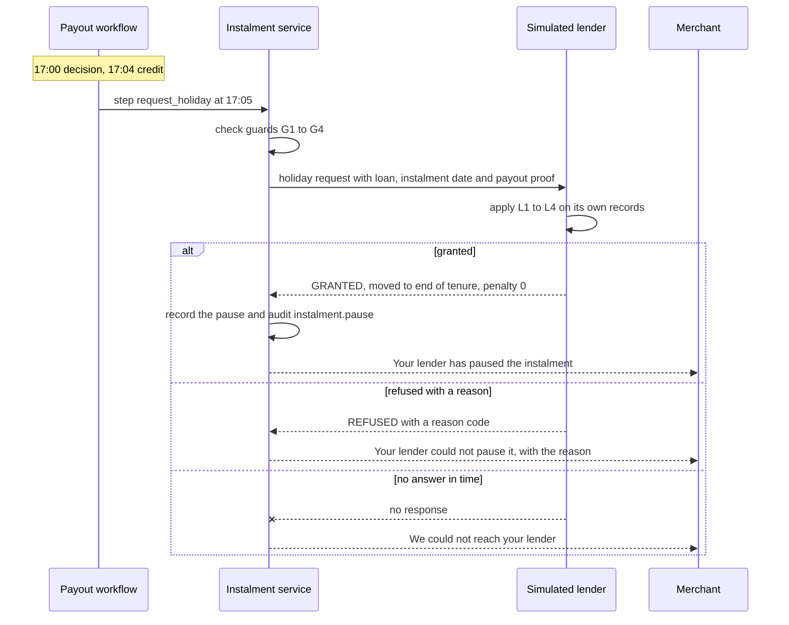
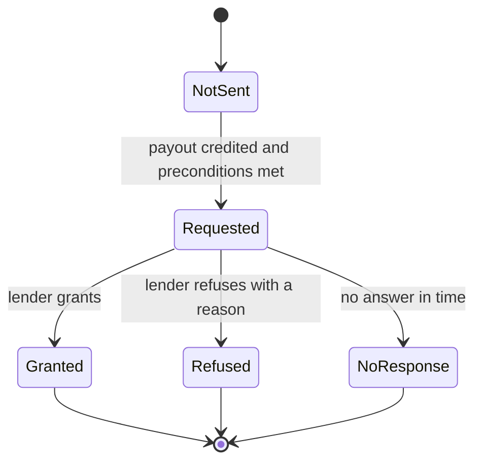

# Feature spec: EDI holiday (K3, X4, X8)

| | |
|---|---|
| Status | v1.4 · K3 BUILT as an unconditional pause (commit 86575ea) · X4 lender request, guard and wording BUILT, wave 1 · X8 BUILT, wave 3 |
| Owner | Omkar Kadam |
| Date | 2 Oct 2026 |
| Audience | Product team, lender partners, engineers, claims officers |
| Related | [fs-09 policy engine and audit](fs-09-policy-engine-and-audit.md) · [fs-06 explanations, disputes and grievance](fs-06-explanations-disputes-and-grievance.md) · [fs-08 claims officer console](fs-08-claims-officer-console.md) · [Policy wording and CIS](../policy-wording-and-cis.md) (C10) · [ADR 0006](../../04-engineering/adr/0006-edi-holiday-is-the-lenders-decision.md) · [Regulatory and compliance](../../05-business/regulatory-and-compliance.md) · [Facts and sources](../../01-strategy/facts-and-sources.md) · [Copy deck](../../03-design/copy-deck.md) · [Implementation guide](../../04-engineering/implementation-guide.md) |

## TL;DR

- **EDI means equated daily instalment.** An EDI holiday is the **lender's decision**. After a payout, Chhatri **requests** the holiday under a pre-agreed rule. The lender grants or refuses. The merchant is told what the lender decided.
- **Today (BUILT):** after an APPROVED payout, the instalment step pauses the next instalment with no check, and the message "Tomorrow's ₹600 instalment is paused." reads as if Chhatri did it. The `Loan` record has no status, arrears or allowance.
- **X4 (BUILT, wave 1, flag `x4_lender_request`):** Chhatri sends the lender a request and acts on the answer. Chhatri checks its own preconditions first (payout credited, loan on record, no request yet). The simulated lender applies four conditions: loan active, not in arrears, allowance left, flag on. A refusal creates no pause, and the payout is untouched.
- **Timing:** decision 17:00, credit 17:04, request 17:05 (the step runs 5 simulated minutes after the decision, 1 minute after the credit).
- **Wording:** new lender-decides messages replace the three `INSTALMENT_PAUSED` lines. That needs a coordinated change of the catalogue, SPEC section 13.4, DEMO.md and the tests that pin them (section 8.4).
- **X8 (BUILT, wave 3, flag `x8_distress_guard`):** no loan or top-up offer while a merchant is in distress, and a daily cap on proactive messages (`conversation/message_guard.py`). No such offer exists in the product today.
- **Priority:** K3, X4 and X8 are all P0, behind feature flags. An unfinished piece stays hidden.

IDs covered: **K3 · X4 · X8**.

## 1. Summary

K3 is a request, not an action. After Chhatri pays a claim, it asks the merchant's lender to move the next daily instalment to the end of the loan, with no penalty. The lender applies a rule it agreed in advance. If the rule passes, the lender grants. If not, the lender refuses and gives a reason. Chhatri shows the merchant the lender's answer in the lender's terms ("Your lender has paused...", "Your lender could not pause...").

This matches the RBI (Digital Lending) Directions, 2025 (A25), which leave a deferral to the lender. Whether a pre-agreed holiday counts as a restructuring is for the lender's compliance team to confirm.

## 2. Status today and what changes

| What | Status | Where | Change |
|---|---|---|---|
| Instalment step after a payout | BUILT | `ledger/instalments.py` (`InstalmentService.pause_next`, `request_holiday`), workflow `payout` step `request_holiday` (called `pause_instalment` at the baseline) at +5 minutes (`workflows/definitions.py`) | With `x4_lender_request` on it asks the lender (X4); with it off it is the unconditional pause |
| What it does today | BUILT | Pauses the instalment due on event date + 1 day. Returns nothing if the merchant has no loan or that instalment is already paused. Writes an `InstalmentPause` and the audit entry `instalment.pause` (lender "Simulated lender (NBFC partner)", moved to end of tenure, penalty 0) | Adds preconditions and a lender answer |
| Loan record | BUILT | `domain/models.py` (`Loan`): id, merchant, lender name, daily instalment, outstanding amount. No status, arrears or allowance | Unchanged. The lender keeps its own records (section 7.2) |
| Merchant message | BUILT | `INSTALMENT_PAUSED`, `INSTALMENT_PAUSED_TODAY`, `INSTALMENT_PAUSED_ON` in `conversation/messages.py`; chosen in `conversation/notifications.py` | Replaced by lender-decides wording (section 8) |
| Lender component status | BUILT | `lender`, always SIMULATED, "Simulated lender (NBFC partner)" (`integrations/statuses.py`) | Backed by the simulated adapter below; the presenter can force "no response" (X6) |
| Simulated lender adapter | BUILT, wave 1 | new `integrations/lender.py`, a `Lender` port in `integrations/base.py` | Section 7 |
| Request and decision records, ids `HR-` | BUILT, wave 1 | `domain/models.py`, `ids.py`, `ledger/instalments.py` | Section 7.5 |
| Console and tracker rows | BUILT | `frontend/src/components/claims/HolidayRow.tsx` (console), the lender-answer step of the claim tracker in the mini-app | Section 8.3 |
| X8 message guard | BUILT, wave 3 | `conversation/message_guard.py`, `conversation/outbox.py` | Section 9 |

## 3. User stories and jobs to be done

| Persona | Job to be done | Context |
|---|---|---|
| **Anil (merchant)** | Get relief on the day his sales fell, and know who decided. | Paid ₹1,380 at 17:04. His ₹600 instalment is next. He reads "Your lender has paused tomorrow's ₹600 instalment." |
| **A merchant refused by the lender** | Understand a "no" without thinking Chhatri cheated him. | He reads the lender's reason and sees that the payout is unaffected. He can raise it with the lender (fs-06). |
| **Rajesh (claims officer)** | See what happened to each holiday request. | The console shows request, answer and reason per payout. He does not decide holidays. |
| **Lender compliance officer** | Check that the request follows the agreed rule and carries no more data than needed. | The request has loan, instalment date and proof of a credited payout. No claim reason, no amount, no slip data. |
| **Judge** | See that the lender, not Chhatri, decides. | Presenter turns the lender to "no response" in the provider panel (X6) and replays. The merchant sees the fail-safe message. |

## 4. Rules

From `backend/chhatri/policy/rules.yaml` (pilot-0.1):

| Key | Value | Effect |
|---|---|---|
| `payout_rail_delay_minutes` | 4 | The payout is credited 4 simulated minutes after the decision (17:04 for the storm). |
| `instalment_pause_delay_minutes` | 5 | The instalment step runs 5 simulated minutes after the decision (17:05), which is 1 minute after the credit. After X4 this step sends the request. |

The lender's own rule is not in `rules.yaml`. It belongs to the lender and is consulted at request time. The simulator holds illustrative settings in code:

| Lender setting (simulator) | Value | Note |
|---|---|---|
| Programme flag | on | "Opted in": the lender takes part in holiday requests. |
| Holiday allowance | a count per rolling 365 days (illustrative value 3) | Policy wording C10 says "allowance left for holidays this year". The count is the lender's board-approved policy, not a Chhatri rule. |
| Prior holidays | none at the start of a run | So every demo request has allowance left. |
| Arrears fixtures | none by default | Tests set them. |

Because no fixture is on by default, every loan holder in the storm run is granted and the KPI "instalments paused" stays at 123. Golden numbers do not move.

## 5. Flow and state diagram





## 6. Inputs and data sources

| Input | Source | Mode today |
|---|---|---|
| Decision (APPROVED) and its payout (CREDITED) | policy engine (fs-09), `ledger/payouts.py` | BUILT |
| Merchant's loan | `Store.city.loans`: id (`LN-0142` style), lender name, daily instalment, outstanding | SIMULATED |
| Instalment date | event date + 1 day. A personal claim for Wednesday gives Thursday's instalment | BUILT |
| Lender rule and records | the simulated lender (section 7.2) | BUILT, SIMULATED |
| Lender answer | `GRANTED` or `REFUSED` with a reason code | BUILT, SIMULATED |

The example loan is Anil's (S-0142): ₹600 a day, lender "Simulated lender (NBFC partner)".

## 7. Decision logic: guard and lender rule

### 7.1 Chhatri's guards (checked before any request)

These four checks are the X4 guard. The ids G1 to G4 stand for guard.

| Id | Condition | If not met |
|---|---|---|
| G1 | The decision is APPROVED. | `ValueError` (as today). |
| G2 | The payout for the decision is CREDITED. | No request. The step is skipped and the skip is audited. The normal order (credit +4, request +5) satisfies it. |
| G3 | The merchant has a loan on record. | Nothing happens (as today). |
| G4 | No request exists yet for this loan and instalment date. | Nothing happens (as today for "already paused"). One request per instalment. |

### 7.2 The lender's pre-agreed rule (simulated, X4)

The simulated lender answers from its own records. All four must hold for a grant. When several fail, the reason returned is the first in this order.

| Order | Id | Condition | Reason code if not met |
|---|---|---|---|
| 1 | L4 | The programme flag is on for this loan. | `FLAG_OFF` |
| 2 | L1 | The loan is active (outstanding above zero). | `NOT_ACTIVE` |
| 3 | L2 | The loan is not in arrears. | `IN_ARREARS` |
| 4 | L3 | The holiday allowance is not used up. | `NO_ALLOWANCE` |

A grant moves the instalment to the end of the tenure with penalty 0, as today. The grant is recorded in the lender's own ledger, which is what L3 counts.

### 7.3 Messages exchanged (the contract with a lender)

The request carries only what the lender needs. It carries no claim kind, no reason for the claim, no slip data and no payout amount. A hospital-cash payout is therefore not revealed to the lender.

Request (Chhatri to lender):

```json
{
  "request_id": "HR-000001",
  "merchant_id": "S-0142",
  "loan_id": "LN-0142",
  "decision_id": "D-000142",
  "payout_id": "P-000142",
  "payout_credited_at": "2025-08-19T17:04:00+05:30",
  "instalment_date": "2025-08-20",
  "instalment_paise": 60000,
  "requested_at": "2025-08-19T17:05:00+05:30",
  "basis": "Pre-agreed rule: one instalment holiday after a credited Chhatri payout"
}
```

Response, granted:

```json
{
  "request_id": "HR-000001",
  "loan_id": "LN-0142",
  "decision": "GRANTED",
  "reason_code": null,
  "moved_to": "END_OF_TENURE",
  "penalty_paise": 0,
  "decided_at": "2025-08-19T17:05:00+05:30",
  "lender": "Simulated lender (NBFC partner)"
}
```

Response, refused:

```json
{
  "request_id": "HR-000002",
  "loan_id": "LN-0654",
  "decision": "REFUSED",
  "reason_code": "IN_ARREARS",
  "moved_to": null,
  "penalty_paise": 0,
  "decided_at": "2025-08-19T17:05:00+05:30",
  "lender": "Simulated lender (NBFC partner)"
}
```

The ids are examples. Request ids are `HR-` plus a six-digit sequence per run, like the other ids, and double as the idempotency key: sending the same request id twice returns the first answer.

### 7.4 Failure handling

- **One attempt, no retry.** If the lender does not answer within the time limit, Chhatri records `NO_RESPONSE` and does not pause. A later retry could grant after the merchant was told "not paused", so there is none. The time limit is a setting, with a proposed 10 seconds (a target to tune). In simulated time the wait is instant.
- **Fail safe.** Any error or no answer is treated as not granted. Chhatri never assumes a grant.
- **Demo control.** The provider panel (X6, fs-08) can force the `lender` component to FALLBACK. In FALLBACK the simulated lender does not answer, so every request ends as `NO_RESPONSE`.
- **The payout is independent.** The payout is credited at +4 before the request goes out. A refusal or no answer changes nothing about it.

### 7.5 Records (BUILT)

`HolidayRequest` (frozen model): `id` (`HR-000001`, new prefix `HR` in `ids.py`), `merchant_id`, `loan_id`, `decision_id`, `payout_id`, `instalment_date`, `instalment_paise`, `requested_at`, `status` (`REQUESTED`, `GRANTED`, `REFUSED`, `NO_RESPONSE`), `reason_code`, `decided_at`. The existing `InstalmentPause` is created only for a grant and gains `request_id`. `GET /api/merchants/{id}` gains `holiday_requests[]` (all outcomes) next to the existing `pauses` (grants only). The KPI "instalments paused" counts grants only.

## 8. Merchant-facing copy

### 8.1 Existing strings (BUILT, exact)

| Key | Hindi | English |
|---|---|---|
| `INSTALMENT_PAUSED` | `कल की {instalment} की किस्त रोक दी गई है।` | `Tomorrow's {instalment} instalment is paused.` |
| `INSTALMENT_PAUSED_TODAY` | `आज की {instalment} की किस्त रोक दी गई है।` | `Today's {instalment} instalment is paused.` |
| `INSTALMENT_PAUSED_ON` | `{date_hi} की {instalment} की किस्त रोक दी गई है।` | `The {instalment} instalment due on {date_en} is paused.` |

The problem: none of these says who paused it. The notification picks a variant from the instalment date (tomorrow, today, or a dated line), because a personal claim for Wednesday pauses Thursday's instalment while it is paid on Thursday.

### 8.2 Proposed lender-decides wording (not in the catalogue yet)

English is proposed here. Hindi is written in the [copy deck](../../03-design/copy-deck.md) and reviewed by a native speaker before use. The three existing Hindi lines are the model for tone.

| Key (proposed) | English (proposed) | When |
|---|---|---|
| `HOLIDAY_GRANTED` | "Your lender has paused tomorrow's {instalment} instalment. It moves to the end of your loan with no penalty." | Granted, instalment due tomorrow |
| `HOLIDAY_GRANTED_TODAY` | "Your lender has paused today's {instalment} instalment. It moves to the end of your loan with no penalty." | Granted, due today |
| `HOLIDAY_GRANTED_ON` | "Your lender has paused the {instalment} instalment due on {date_en}. It moves to the end of your loan with no penalty." | Granted, due another day |
| `HOLIDAY_REFUSED` | "Your lender could not pause {when} {instalment} instalment: {reason}. It is due as usual. Your payout is not affected." | Refused, with a reason below |
| `HOLIDAY_NO_RESPONSE` | "We could not reach your lender about {when} {instalment} instalment, so it is due as usual. Your payout is not affected." | No answer in time |

`{when}` reads "tomorrow's", "today's" or "the one due on {date}". Reason texts (proposed), one per code:

| Code | `{reason}` (proposed) |
|---|---|
| `FLAG_OFF` | "this loan is not part of the holiday scheme" |
| `NOT_ACTIVE` | "the loan is not active" |
| `IN_ARREARS` | "the loan has an amount overdue" |
| `NO_ALLOWANCE` | "your holiday allowance is used up" |

Wording rules: it always names the lender as the one who decided, never says "Chhatri paused", and never promises a follow-up. Policy wording C10 has its own sample lines for yes and no. They are proposals too and must be aligned with the copy deck before a pilot.

### 8.3 What the merchant sees on a refusal

1. **In chat or WhatsApp:** `HOLIDAY_REFUSED` (or `HOLIDAY_NO_RESPONSE`), one message, sent after the payout card. The payout message and the Soundbox line at 17:04 are unchanged.
2. **In the claim tracker (H1, fs-04):** the last step reads "Instalment: lender said no, {reason}". It is not shown as paused, and the payout step stays green.
3. **Next step (H21):** a button "Ask the lender about this", which opens a grievance with topic `EDI_HOLIDAY` (fs-06, respondent LENDER). The decision receipt carries the request and the answer.
4. **In the console:** a feed line "{shop}: lender refused the holiday ({code})" and the row in the merchant detail. The KPI "instalments paused" does not count it.

### 8.4 Coordinated change (the catalogue is pinned by tests)

`scripts/tests/test_docs.py` requires DEMO.md to quote the catalogue exactly, and the demo-check golden file quotes the instalment line. Replacing the wording touches all of these in one change:

| File | Change |
|---|---|
| `backend/chhatri/conversation/messages.py` | Add the `HOLIDAY_*` keys. Remove or stop using the three `INSTALMENT_PAUSED*` keys. |
| `backend/chhatri/conversation/notifications.py` | `instalment_paused` becomes `holiday_decided` and picks the variant from the lender's answer and the date. |
| `docs/SPEC.md` section 13.4 and section 10 | New strings. Replace "Chhatri pauses" with the request and answer. |
| `docs/DEMO.md` (the 17:05 steps and the closing numbers) | Quote the new `HOLIDAY_GRANTED*` strings and describe a request that the lender grants. |
| `scripts/tests/test_docs.py` | Replace the `INSTALMENT_PAUSED` entry in `DEMO_MESSAGES`. |
| `backend/chhatri/api/demo/golden.py` | The "instalment message" expectation (`Today's ₹600 instalment is paused.`). |
| Backend tests | `test_notifications.py` (`test_monsoon_17_04_intro_card_soundbox_then_17_05_pause`, `test_instalment_wording_follows_the_date`, `test_instalment_on_a_date_in_hindi`), `replay/test_golden.py` (`test_illness_pays_1500_and_pauses_thursdays_instalment`), `replay/test_area_flow.py`, `cases/test_demo_flows.py` |
| `frontend/src/mock` | Same new strings and the request and answer shape |

## 9. X8: no loan offers during distress, and a message cap (BUILT, wave 3)

No loan or top-up offer exists in the product today. X8 is a guard that must be in place before any such message is ever added.

| Rule | Definition |
|---|---|
| Message kinds | A closed map from catalogue key to kind. `TRANSACTIONAL`: payout, receipt, decision and reply messages. `PROACTIVE`: check-ins and reminders. `OFFER`: any loan, top-up or cross-sell card. |
| Offer suppression | An `OFFER` is not sent while any of these is true for the merchant: an alert covers their zone (valid now, or issued and starting within the 72-hour look-ahead); a claim is being decided; a case is OPEN; a REFERRED decision waits for an officer; a grievance is OPEN (fs-06). |
| Frequency cap | At most `max_proactive_per_day` `PROACTIVE` messages per merchant per calendar day (IST). Proposed value 3, a setting to tune. `TRANSACTIONAL` messages are never capped or suppressed. |
| Where | A single check before `Outbox.send` in `conversation/outbox.py`. |
| Audit | `message.suppressed` (proposed name) with the merchant, the message kind, the reason and no message text. |

Since no `OFFER` exists, the tests add a fake `OFFER` key to exercise the guard.

## 10. Edge cases and failure modes

| Case | Behaviour | Message | Audit |
|---|---|---|---|
| No loan | Nothing happens | none | none |
| Instalment already has a request | Nothing happens (idempotent) | none | none |
| Granted | Pause record created, instalment moved to end of tenure, penalty 0 | `HOLIDAY_GRANTED*` | `instalment.holiday_request`, `instalment.holiday_decision`, `instalment.pause` |
| Refused: programme flag off | No pause | `HOLIDAY_REFUSED`, reason "this loan is not part of the holiday scheme" | request, decision (reason `FLAG_OFF`) |
| Refused: loan not active | No pause | `HOLIDAY_REFUSED`, "the loan is not active" | decision (`NOT_ACTIVE`) |
| Refused: arrears | No pause | `HOLIDAY_REFUSED`, "the loan has an amount overdue" | decision (`IN_ARREARS`) |
| Refused: allowance used | No pause | `HOLIDAY_REFUSED`, "your holiday allowance is used up" | decision (`NO_ALLOWANCE`) |
| Lender does not answer in time | No pause, no retry | `HOLIDAY_NO_RESPONSE` | decision (`NO_RESPONSE`) |
| Payout not yet credited when the step runs | No request, step skipped | none | skip audited |
| Officer-approved claim (REFERRED then approved) | Same path after the credit | same | same |
| Merchant has more than one loan | Not modelled: one loan per merchant today | none | none (open question 6) |
| An offer card while an alert is active | Suppressed (X8) | none | `message.suppressed` |

## 11. Guardrails, privacy and compliance notes

- **RBI (Digital Lending) Directions, 2025 (A25):** the lender decides any deferral under its board-approved policy. Chhatri requests, and never changes a loan. Whether a pre-agreed holiday counts as a restructuring is for the lender's compliance team to confirm.
- **Insurance Act 1938, s.64VB (cash before cover):** unaffected. A holiday defers a loan instalment. It is not premium relief.
- **DPDP (A22):** the request shares the merchant's loan id, an instalment date and proof that a payout was credited. It does not share the claim kind, the reason, slip data or the payout amount. Which consent covers this sharing is not settled (open question 1).
- **Honest wording:** every merchant line names the lender as the decider. The honest-wording test (X7) scans the `HOLIDAY_*` keys for promises and for "Chhatri paused".
- **Alternative lender setting:** some lenders may prefer that the instalment is settled out of the payout, so the loan terms never change. That would be a payout split, not a holiday. It is not built and not in scope for the hackathon.

## 12. Acceptance criteria

| Given | When | Then | Audit |
|---|---|---|---|
| Anil (S-0142, ₹600 a day) is paid ₹1,380, decision D-000142, credit 17:04 | The step runs at 17:05 | A request goes out, the simulated lender grants, a pause record exists, and Anil gets `HOLIDAY_GRANTED` | `instalment.holiday_request`, `instalment.holiday_decision`, `instalment.pause` |
| The storm run to 17:06 | KPIs are read | "Instalments paused" is 123 and the Z7 total stays ₹58,900 | n/a |
| A loan the simulated lender holds in arrears | A payout is credited and the step runs | The lender refuses with `IN_ARREARS`, no pause record exists, the payout stays CREDITED, the merchant gets `HOLIDAY_REFUSED` naming the reason | request, decision |
| A loan with its allowance used up | The step runs | Refused with `NO_ALLOWANCE` | request, decision |
| The lender is forced to FALLBACK in the provider panel | The step runs | `NO_RESPONSE`, no pause, `HOLIDAY_NO_RESPONSE` | request, decision |
| The payout is still PENDING | The step runs | No request, the skip is audited | skip |
| An officer approves a REFERRED claim | The payout credits and the step runs | Same path as an automatic payout | same |
| A request is built for a hospital-cash payout | The payload is inspected | It has no claim kind, reason, slip field or amount | none |
| X8: an alert covers the zone | An `OFFER` message is queued | It is suppressed and `message.suppressed` is logged | `message.suppressed` |
| X8: the merchant has received the daily cap of `PROACTIVE` messages | Another `PROACTIVE` message is queued | It is suppressed. A `TRANSACTIONAL` message still goes out. | `message.suppressed` |

## 13. Telemetry and audit events

| Action | Subject | When | Data |
|---|---|---|---|
| `instalment.holiday_request` (BUILT) | holiday request `HR-…` | The request is sent | merchant, loan, decision, payout, instalment date, instalment amount, lender |
| `instalment.holiday_decision` (BUILT) | holiday request `HR-…` | The lender answers, or the time limit passes | decision (`GRANTED`, `REFUSED`, `NO_RESPONSE`), reason code, moved to, penalty |
| `instalment.pause` (BUILT, kept) | instalment pause `IP-…` | Only on a grant | loan, lender, date, amount, decision id, moved to, penalty, plus `request_id` |
| `message.suppressed` (BUILT, X8) | message | A message is held back | merchant, kind, reason. No text. |

Actors are `workflow:payout` for the request, decision and pause entries, and `system` for X8. The ops strip (fs-08) shows holiday requests by outcome from these entries.

## 14. Build plan

All P0. Owners: Ujjwal (backend), Omkar (copy, UI, docs).

| Task | Owner | Wave |
|---|---|---|
| `Lender` port, `SimulatedLender` (L1 to L4, ledger, fixtures, FALLBACK = no answer) | Ujjwal | 1 |
| `HolidayRequest` model, `HR` ids, `request_holiday` with G1 to G4, one attempt, audit | Ujjwal | 1 |
| `GET /api/merchants/{id}` gains `holiday_requests`; KPI counts grants only | Ujjwal | 1 |
| `HOLIDAY_*` keys, notification, honest-wording scan (X7) | Ujjwal and Omkar | 1 |
| Hindi lines in the copy deck, native review | Omkar | 1 |
| Coordinated change in section 8.4 (SPEC, DEMO.md, `test_docs.py`, goldens, mock) | Omkar and Ujjwal | 1 |
| Tracker row, console feed line, grievance link `EDI_HOLIDAY` | Omkar | 1 and 3 |
| X8 message kinds, suppression, cap, audit | Ujjwal | 3 |

## 15. Test plan

### Existing tests (BUILT)

- `backend/tests/ledger/test_instalments.py`: `test_pauses_tomorrows_instalment`, `test_second_pause_for_same_day_is_none`, `test_no_loan_means_no_pause`, `test_rejects_other_merchant_or_unapproved`.
- `backend/tests/conversation/test_notifications.py`: `test_monsoon_17_04_intro_card_soundbox_then_17_05_pause`, `test_instalment_wording_follows_the_date`, `test_instalment_on_a_date_in_hindi`.
- `backend/tests/replay/test_area_flow.py`: `test_next_days_instalments_are_paused_at_17_05_for_every_paid_shop_with_a_loan`, `test_anil_hears_at_credit_time_then_about_the_pause`.
- `backend/tests/replay/test_golden.py`: `test_illness_pays_1500_and_pauses_thursdays_instalment`, `test_decisions_17_00_credits_17_04_pauses_17_05_and_the_kpis`.
- `backend/tests/cases/test_demo_flows.py`: `test_monsoon_anil_paid_1380_at_1704_and_instalment_paused_at_1705`.

These changed with section 8.4: the pause assertions stayed, and the message assertions moved to the lender-decides wording.

### New tests (BUILT)

| Test | File | What it checks |
|---|---|---|
| `test_lender_rule_order_and_reasons` | `backend/tests/integrations/test_lender.py` | L4, L1, L2, L3 and the first-failing reason. |
| `test_lender_grant_is_recorded_and_counts_toward_allowance` | same | A grant is in the lender's ledger and L3 counts it. |
| `test_lender_fallback_gives_no_answer` | same | FALLBACK means no response. |
| `test_request_waits_for_a_credited_payout` | `backend/tests/ledger/test_instalments.py` | G2. |
| `test_request_is_idempotent_per_instalment` | same | G4 and the request id. |
| `test_refusal_creates_no_pause` | same | Reasons `IN_ARREARS`, `NO_ALLOWANCE`, `NOT_ACTIVE`, `FLAG_OFF`, and `NO_RESPONSE`. |
| `test_request_carries_no_claim_reason_or_amount` | same | The payload fields in 7.3 only. |
| `test_kpi_counts_grants_only` | `backend/tests/replay/test_area_flow.py` | 123 stays 123 with the default lender. |
| `test_holiday_messages_render_and_name_the_lender` | `backend/tests/conversation/test_messages.py` | New keys render and mention "lender". |
| `test_honest_wording_covers_holiday_keys` | X7 test | No "Chhatri paused" and no promise. |
| `test_offer_suppressed_for_each_distress_reason` and `test_proactive_cap_is_per_ist_calendar_day` | `backend/tests/conversation/test_message_guard.py` | X8 rules with a fake `OFFER` key. |
| Mock parity | `frontend/src/mock/routes.test.ts` | Static demo serves request and answer. |

### Regression checks

```bash
make test-backend   # backend pytest, not slow, coverage at least 80%
make test-slow      # golden numbers
make test-frontend  # typecheck, lint, unit tests
make demo-check     # every scenario through the HTTP API
```

## Open questions

1. **Consent for sharing with the lender.** Which consent purpose covers sending the loan id, instalment date and payout proof to the lender? Proposal: add a purpose to the consent centre (N6, fs-07). Owner: Omkar Kadam.
2. **Lender policy values.** Programme flag, allowance count and period, and arrears definition come from the partner lender. The simulator values are illustrative. Owner: Omkar Kadam.
3. **Time limit.** Proposed 10 seconds. Is that right for a real lender API? Owner: Ujjwal Pardeshi.
4. **Stage refusal.** Default plan: the X6 switch (no response). Option: put an arrears fixture on Anil's loan in the `illness_mismatch` scenario, which shows a named reason live. It needs the golden file and DEMO.md for that scenario updated. Owner: Omkar Kadam.
5. **Restructuring.** Does a pre-agreed holiday count as a restructuring for the lender? A compliance call by the lender. Owner: Omkar Kadam.
6. **More than one loan.** Which loan's instalment does a request name? The data model has one loan per merchant. Owner: Ujjwal Pardeshi with the lender.
7. **Insurer-funded alternative.** Pay the instalment out of the payout instead of a holiday. Deferred beyond the hackathon. Owner: Omkar Kadam.

## Changelog

- 2026-10-02 · v1.4 · lender-decides wording throughout; X4 made build-ready (preconditions, lender rule, request and response JSON, failure handling, refusal wording, tests); removed line-number references and pseudocode for code that does not exist; timing corrected (request 17:05, 5 minutes after the decision); X8 specified; coordinated change list for the pinned strings; build waves replace dates
- 2026-10-02 · v1.3 · consistency check against the code
- 2026-10-02 · v1.2 · corrections
- 2026-10-02 · v1.1 · corrections
- 2026-10-02 · v1 · First draft; K3 reframing from instalment pause to lender-approved EDI holiday. X4 rule guard, X8 cross-sell suppression, and proposed merchant copy added.
