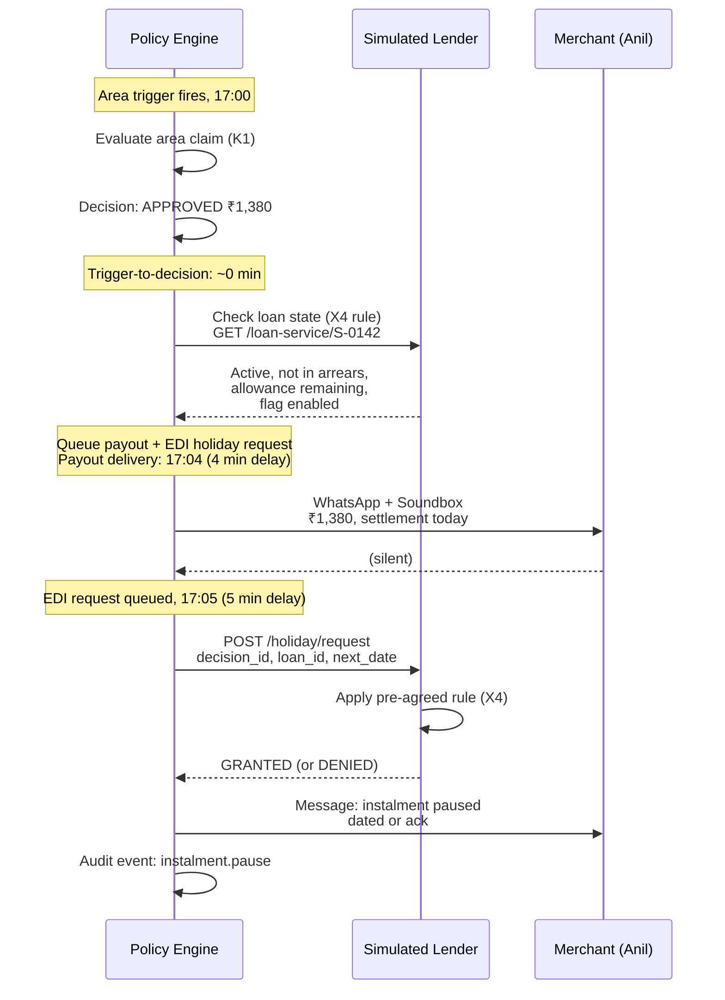
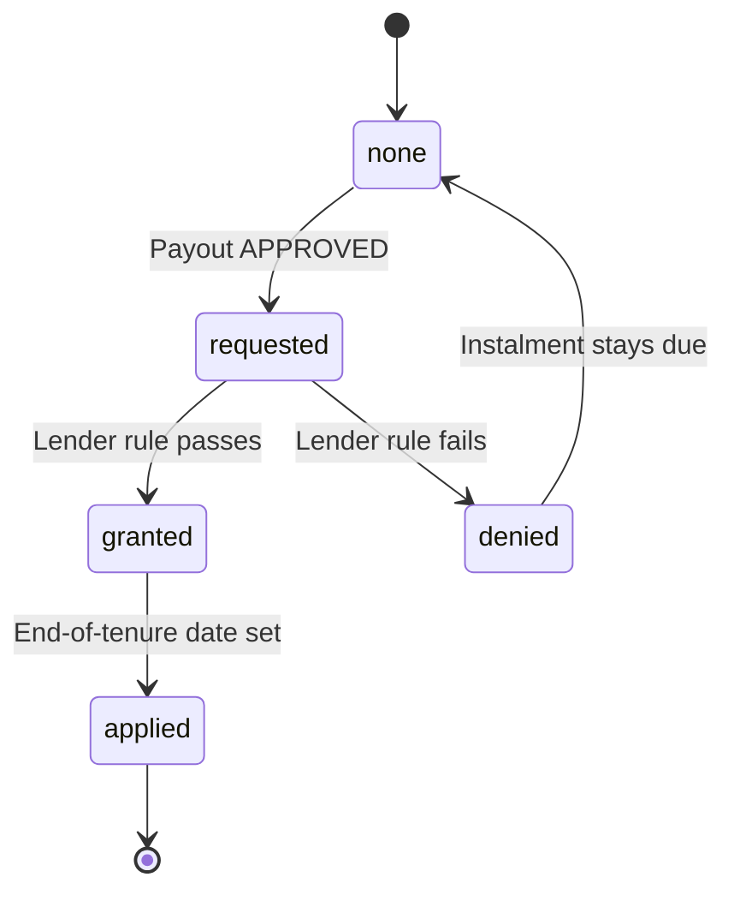

# Feature spec: EDI holiday (K3)

| | |
|---|---|
| Status | Draft v1 · 2 Oct 2026 |
| Owner | Omkar Kadam |
| Audience | Product team, lender partners, engineers, claims officers |
| Related | [Policy engine](fs-09-policy-engine-and-audit.md) · [Facts and sources](../../01-strategy/facts-and-sources.md) · [Regulatory compliance](../../05-business/regulatory-and-compliance.md) · [Feature roadmap](../prd.md) |

## TL;DR

- **K3 reframing:** Chhatri requests an EDI holiday from the lender after an approved payout; the lender's pre-agreed rule decides. Not a Chhatri pause.
- **Mechanics:** The instalment due the day after the event moves to the end of the loan tenure with no penal charge, confirmed by the lender before payout.
- **Lender pre-agreed rule (X4):** Loan is active, not in arrears, holiday allowance not used up, and lender flag is on.
- **Alternative:** Insurer pays the instalment from the payout (EMI-protection style), so the loan terms never change.
- **Timing:** In monsoon replay, 17:05 (5 minutes after the ₹1,380 area credit to Anil at 17:00); next-day EDI is ₹600 (from rules).
- **Status:** X4 rule designed (spec §4, pseudocode §7); code implementation planned for 2–3 Oct. X8 rule: no cross-sell or loan offers while alert or claim is open.

## 1. Summary

K3 is a reframing of what the prototype calls "instalment pause" from a unilateral Chhatri action to a **lender-requested, lender-approved deferral**. After Chhatri pays a claim (area or personal), it requests an EDI holiday for the next day's loan instalment. The lender applies a pre-agreed policy rule (the loan is active, not in arrears, and the holiday allowance is not used up). If the rule passes, the instalment moves to the end of the tenure with no penalty. The merchant sees the lender's decision, not a Chhatri action.

This feature spans **insurance (K3), lending (X4)** and complies with the **RBI (Digital Lending) Directions, 2025 (A25)**, which make any deferral the lender's decision.

IDs covered: **K3 · X4 · X8** (no cross-sell during open alert or claim).

## 2. Status today and what changes

| What | Status | Code path | Change |
|---|---|---|---|
| **Instalment pause on payout** | LIVE | `backend/chhatri/ledger/instalments.py`, `InstalmentService.pause_next()` | Reframe: lender decides, not Chhatri |
| **Lender rule check (X4)** | DESIGNED · IMPL PLANNED | `backend/chhatri/ledger/instalments.py` (after line 44) | Rule spec defined (§4, §7); code impl: add guard to check_lender_holiday_eligibility, log reason code. Target: 2–3 Oct. |
| **Merchant messaging (K3)** | NEEDS COPY | `backend/chhatri/conversation/messages.py` | Add: lender decision reason (granted or not) |
| **Audit trail (K3)** | LIVE | `backend/chhatri/audit/log.py` | Log: request, lender decision, reason code |
| **Alternative: insurer-funded** | PLANNED | — | If lender allows: insurer pays EMI from payout; loan unchanged |

### Today's code

The prototype's `InstalmentService` (lines 29–86 in `instalments.py`) pauses "tomorrow's" instalment (line 50: `due = event_date + NEXT_DAY`). It:
1. Checks if the merchant has a loan (line 46: `loan = self._store.city.loans.get(merchant_id)`)
2. Moves the instalment to the end with no penalty (lines 60–62)
3. Logs an audit event `instalment.pause` with reason text (lines 74–83)

**What is missing:** a lender rule guard (X4) that confirms the lender has allowed the holiday.

## 3. User stories and jobs to be done

| Persona | Job to be done | Context |
|---|---|---|
| **Anil (merchant)** | Get immediate relief when sales fall, without needing to negotiate with the lender | Area alert triggers; Anil is paid same day |
| | Understand why his next instalment moved; see confirmation from the lender | Claims message explains decision |
| **Rajesh (claims officer)** | Verify a payout qualifies for an EDI holiday before approving in a REFERRED case | Officer console shows holiday eligibility |
| **Lender compliance officer** | Confirm the merchant's loan is eligible for a pre-agreed holiday under the board-approved policy | Chhatri has pre-agreed rule (X4) on file |
| **Insurer GRO** | Decide whether to fund the EDI from the payout or request the lender to defer | Part of the payout-settlement conversation |

## 4. Rules

From `backend/chhatri/policy/rules.yaml` (pilot-0.1):

| Key | Value | Applies to |
|---|---|---|
| `instalment_pause_delay_minutes` | 5 | Workflow orchestration; the instalment pause is queued 5 min after the payout is credited. |
| `payout_rail_delay_minutes` | 4 | The payout itself (e.g. ₹1,380) is credited at 17:04; the pause happens at 17:05. |

No other rules in `rules.yaml` directly govern the EDI holiday. The **lender's pre-agreed rule (X4)** is held by the lender and consulted at payout time:

| Condition | Meaning | Guard |
|---|---|---|
| Loan is active | `loan.status == ACTIVE` (not REPAID, DEFAULTED, etc.) | `X4.loan_active` |
| Not in arrears | Zero or pending-resolution arrears | `X4.not_in_arrears` |
| Holiday allowance not used up | The merchant has not exhausted the allowance (e.g. 2 of 3 holidays used this year) | `X4.allowance_remaining` |
| Lender flag is on | The merchant has signed up for the EDI-holiday benefit | `X4.lender_flag_enabled` |

All four must pass for the lender to grant the holiday.

## 5. Flow and state diagram

### Sequence: area payout leading to EDI holiday



### State diagram: holiday lifecycle



## 6. Inputs and data sources

| Input | Source | Status | Example (monsoon) |
|---|---|---|---|
| Decision outcome | Policy engine (K4) | LIVE | APPROVED (area claim) |
| Merchant's loan | Store: `Store.city.loans.get(merchant_id)` | SIMULATED | Loan ID: `LN-S0142-001` |
| Daily instalment amount | Loan record: `loan.daily_instalment_paise` | SIMULATED | ₹600 = 60000 paise |
| Instalment due date | `event_date + 1 day` | LIVE | Wed 20 Aug (for event 19 Aug) |
| Lender's pre-agreed rule (X4) | POST to simulated lender service | SIMULATED | Rule: active + not arrears + allowance + flag |
| Lender decision | SIMULATED lender responds | SIMULATED | GRANTED |
| Lender decision reason code | Lender reason field | SIMULATED | E.g. `"holiday_applied"` or `"no_allowance"` |

## 7. Decision logic and checks

The EDI holiday request is made **only after an APPROVED payout** (line 44 in `instalments.py`: `if decision.outcome is not DecisionOutcome.APPROVED`).

### X4 guard (proposed): lender pre-agreed rule

```python
# Pseudocode: backend/chhatri/ledger/instalments.py (after line 44)

def check_lender_holiday_eligibility(loan: Loan, merchant_id: str) -> (bool, str):
    """
    Check the lender's pre-agreed rule (X4).
    Returns (eligible: bool, reason_code: str).
    """
    lender_service = ...  # call to simulated or live lender API
    rule = LenderHolidayRule(
        loan_active = loan.status == LoanStatus.ACTIVE,
        not_in_arrears = loan.arrears_paise == 0,
        allowance_remaining = loan.holidays_used < loan.holidays_allowed,  # e.g. 1 < 2
        lender_flag_enabled = loan.edi_holiday_flag_enabled,
    )
    if not rule.all_pass():
        return False, rule.first_failing_condition()  # e.g. "no_allowance"
    return True, "eligible"
```

The result is logged in the audit trail and sent to the merchant.

### Merchant-facing message: lender decision

When the lender decides:
- **GRANTED:** Use the existing `INSTALMENT_PAUSED` copy (lines 60–62 in `messages.py`), with a reference to the lender decision.
- **NOT GRANTED:** Show why (e.g. "allowance used up") and that the instalment is due as normal.

## 8. Merchant-facing copy

### Existing copy (SPEC §13.4, deck)

From `backend/chhatri/conversation/messages.py`:

```python
"INSTALMENT_PAUSED": Template(
    "कल की {instalment} की किस्त रोक दी गई है।", 
    "Tomorrow's {instalment} instalment is paused."
),
```

**Problem:** This copy does not say who paused it or that it is the lender's decision.

### Proposed copy change (K3 implementation)

| Key | Hindi | English | When | Filled with |
|---|---|---|---|---|
| `INSTALMENT_PAUSED_GRANTED` | `आपकी फाइल के अनुसार, कल की {instalment} की किस्त {date} को दे दी जाएगी।` | `Your lender has approved: tomorrow's {instalment} instalment will be due on {date}.` | Lender grants holiday | `{instalment}` = formatted rupee amount (₹600); `{date}` = last day of tenure |
| `INSTALMENT_PAUSED_NOT_GRANTED` | `आपकी ऋण के लिए किस्त की छुट्टी अभी उपलब्ध नहीं है। कल की {instalment} की किस्त सामान्य समय पर देय है।` | `Your loan's instalment holiday is not available right now. Tomorrow's {instalment} is due as scheduled.` | Lender denies | `{instalment}` = amount; reason omitted (merchant sees "not available") |
| `INSTALMENT_PAUSED_REASON_CODE` | (merged into above) | (merged into above) | Officer console only | Reason code: `no_allowance`, `not_active`, `in_arrears`, `flag_off` |

**Changelog item:** Move `INSTALMENT_PAUSED` → `INSTALMENT_PAUSED_GRANTED` in the copy. Update the test file `backend/tests/conversation/test_messages.py` to verify the new keys.

## 9. Edge cases and failure modes

| Case | Merchant state | Behaviour | Audit event | Message |
|---|---|---|---|---|
| **No loan** | Merchant unregistered for credit; `loan = None` | Pause function returns `None`; nothing logged. | None. | (no message; flow continues) |
| **Holiday granted** | Active loan, eligible | Instalment moved to end of tenure (date TBD by lender). | `instalment.pause` with reason: `"moved to end of tenure, no penalty"` | `INSTALMENT_PAUSED_GRANTED` with `{date}` |
| **Holiday not granted: allowance used up** | Merchant has used all seasonal holidays (e.g. 2 of 2). | Pause request rejected; instalment stays due next day. | `instalment.holiday_request_denied` with reason: `no_allowance` | `INSTALMENT_PAUSED_NOT_GRANTED` (with reason code in case view, not message) |
| **Holiday not granted: loan in arrears** | Merchant has pending arrears. | Pause rejected. | `instalment.holiday_request_denied` with reason: `in_arrears` | `INSTALMENT_PAUSED_NOT_GRANTED` |
| **Holiday not granted: loan not active** | Merchant's loan is REPAID or DEFAULTED. | Pause rejected. | `instalment.holiday_request_denied` with reason: `not_active` | `INSTALMENT_PAUSED_NOT_GRANTED` |
| **Holiday not granted: lender flag off** | Merchant did not sign up for EDI-holiday benefit. | Pause rejected. | `instalment.holiday_request_denied` with reason: `flag_off` | `INSTALMENT_PAUSED_NOT_GRANTED` |
| **Lender service timeout** | Network failure calling lender. | Fallback: assume NOT GRANTED; instalment stays due. | `instalment.holiday_request_error` with reason: `timeout` | `INSTALMENT_PAUSED_NOT_GRANTED` (degraded) |
| **X8 rule: cross-sell suppression** | Alert is active or a claim is open for the merchant. | No loan or top-up offer card shown during the merchant's journey through the claim. | `message.suppressed` with reason: `active_alert` or `open_claim` | (card not sent) |

## 10. Guardrails, privacy and compliance notes

### RBI Digital Lending Directions, 2025 (A25)

The **lender** decides any instalment deferral under its board-approved policy. Chhatri does not independently defer a loan. This aligns with RBI (Digital Lending) Directions, 2025 (A25), which state that deferral is the lender's decision.

**Hedge:** Whether a pre-agreed holiday counts as a restructuring is for the lender's compliance team to confirm.

### Insurance Act 1938, s.64VB (cash before cover)

The EDI holiday does not affect the premium schedule. Cover for a day starts when that day's premium is received, either the initial 30-day prepayment or a settlement deduction the previous evening, made with standing consent. The holiday is a **loan deferral**, not a premium relief.

### DPDP consent (A22)

The EDI holiday request involves the merchant's loan state (arrears, tenure, flag). This is financial data. The merchant has given consent for cover and claims (sales data); lending data is separate. **Open question:** Does the lender's terms of service cover this consultation, or is explicit consent needed?

### Audit trail

Every holiday request is logged with:
- Actor: `workflow:payout`
- Action: `instalment.holiday_request` (request) and `instalment.holiday_decision` (response)
- Data: merchant ID, loan ID, lender, decision, reason code, moved-to date

The entry is tamper-evident (hash chain, `/api/audit/verify`; K7).

## 11. Acceptance criteria

| Given | When | Then | Audit event |
|---|---|---|---|
| Merchant Anil has a ₹600 EDI, active loan, unused holiday allowance. Area trigger fires at 17:00. | Policy engine approves payout ₹1,380 at 17:00. | By 17:05, Anil receives message that his next (Wed) instalment is paused. Lender has moved it to end of tenure. | `instalment.pause` with reason: `moved_to_end, no_penalty, lender_approved` |
| Merchant has used all seasonal holidays (2 of 2). | Area payout approved. Pause request sent to lender at 17:05. | Lender rejects (no allowance). Anil gets message: "Holiday not available; instalment due tomorrow as normal." | `instalment.holiday_request_denied` with reason: `no_allowance` |
| Merchant's loan is in arrears. | Area payout approved. | Lender rejects. Anil does not see a pause message (or sees "not available"). Instalment stays due. | `instalment.holiday_request_denied` with reason: `in_arrears` |
| A red alert or a claim is open for Anil's zone. | Anil's claim is decided REFERRED and a case is opened. | No loan offer or cross-sell card is shown (X8). Any pending offer is suppressed. | `message.suppressed` with reason: `open_claim` |
| Hospital-cash claim is decided REFERRED. | Officer approves the claim (₹1,500 personal payout). | Officer re-runs all HARD checks (K4). If all pass, officer can click Approve. Pause request follows the same path as an auto-approved payout. | `instalment.pause` with decided_by: `officer:officer-id` |

## 12. Telemetry and audit events

### Audit events logged (K7, SPEC §11)

| Action | Subject type | Occurs when | Data fields |
|---|---|---|---|
| `instalment.holiday_request` | `instalment_holiday_request` | Payout is APPROVED (area or personal); pause request is sent to lender. | `merchant_id`, `loan_id`, `lender`, `instalment_date`, `amount_paise`, `decision_id` |
| `instalment.holiday_decision` | `instalment_holiday_decision` | Lender responds with GRANTED or NOT_GRANTED. | `merchant_id`, `loan_id`, `lender`, `decision`, `reason_code`, `moved_to_date` (if granted) |
| `instalment.pause` | `instalment_pause` | Holiday is GRANTED; the pause record is created. | `merchant_id`, `loan_id`, `lender`, `instalment_date`, `amount_paise`, `decision_id`, `moved_to`, `penalty_paise` (0) |
| `instalment.holiday_request_denied` | `instalment_holiday_request` | Holiday is NOT_GRANTED. | `merchant_id`, `loan_id`, `lender`, `reason_code` (e.g. `no_allowance`, `in_arrears`, `not_active`, `flag_off`) |
| `message.suppressed` | `message` | X8: a cross-sell card or loan offer is suppressed during an alert or open claim. | `merchant_id`, `alert_id` or `claim_id` or `case_id`, `suppression_reason` |

### Console metrics (K8)

The claims-officer console (`/policy` page, pending redesign) will show:
- Holiday requests today: count by decision (GRANTED, DENIED, ERROR).
- Most common denial reason: histogram.

## 13. Planned changes and tasks

| ID | Task | Owner | Effort (h) | PR in | Notes |
|---|---|---|---|---|---|
| X4 | Add lender pre-agreed rule guard (`check_lender_holiday_eligibility`) to `instalments.py` | Ujjwal Pardeshi | 1.5 | 2 Oct eve | Query simulated lender service; log reason code |
| K3 | Merchant copy: add `INSTALMENT_PAUSED_GRANTED`, `INSTALMENT_PAUSED_NOT_GRANTED` to `messages.py` | Omkar Kadam | 0.5 | 2 Oct eve | Bilingual; update test |
| K3 | Update DEMO.md step 5 to show lender decision message | Omkar Kadam | 0.5 | 2 Oct eve | Emphasize lender decides |
| K3 | Update SPEC §10 to use K3 name and lender-request framing | Omkar Kadam | 0.5 | 2 Oct eve | Remove "Chhatri pauses" language |
| X8 | Guard: no loan/top-up offers while `active_alert or open_claim` | Ujjwal Pardeshi | 1 | 2 Oct or 3 Oct | Test: verify card is not sent |
| N/A | Alternative: insurer-funded EDI holiday design doc | Omkar Kadam | 0.5 | Post-hackathon | Roadmap; decide with lender and insurer |

## 14. Test plan

### Existing tests (commit 86575ea)

From `backend/tests/ledger/test_instalments.py`:
- `test_pause_next_success`: Happy path; merchant has active loan, pause created.
- `test_pause_next_no_loan`: Merchant has no loan; returns None.
- `test_pause_next_already_paused`: Instalment already paused for the same date; returns None.

From `backend/tests/conversation/test_messages.py`:
- `test_render_instalment_paused`: `INSTALMENT_PAUSED` key renders with `{instalment}` filled.

### New tests (X4, K3)

| Test | File | Checks | Acceptance |
|---|---|---|---|
| `test_lender_holiday_eligible_all_pass` | `test_instalments.py` | X4 rule all conditions pass → eligible | `(True, "eligible")` |
| `test_lender_holiday_ineligible_no_allowance` | `test_instalments.py` | Merchant has used all holidays → not eligible | `(False, "no_allowance")` |
| `test_lender_holiday_ineligible_in_arrears` | `test_instalments.py` | Loan in arrears → not eligible | `(False, "in_arrears")` |
| `test_lender_holiday_ineligible_not_active` | `test_instalments.py` | Loan not ACTIVE → not eligible | `(False, "not_active")` |
| `test_lender_holiday_ineligible_flag_off` | `test_instalments.py` | Lender flag disabled → not eligible | `(False, "flag_off")` |
| `test_pause_with_lender_granted` | `test_instalments.py` | Pause is created when lender grants. | Pause record exists; audit event logged. |
| `test_pause_blocked_when_lender_denies` | `test_instalments.py` | Pause is not created when lender denies. | Pause record does not exist; denial audit event logged. |
| `test_render_instalment_paused_granted` | `test_messages.py` | New key `INSTALMENT_PAUSED_GRANTED` renders. | Message includes `{instalment}` and `{date}`. |
| `test_render_instalment_paused_not_granted` | `test_messages.py` | New key `INSTALMENT_PAUSED_NOT_GRANTED` renders. | Message says "not available". |
| `test_x8_suppress_offer_during_alert` | `test_conversation.py` or `test_integrations.py` | X8 rule: card not sent if active alert. | Card not in message list. |
| `test_x8_suppress_offer_during_open_claim` | Same | X8 rule: card not sent if open case. | Card not in message list. |
| `test_monsoon_demo_anil_pause_at_1705` | `backend/scripts/demo_check.py` | Anil's instalment pause logged at 17:05. | Audit entry for `instalment.pause` with correct loan ID and reason. |

### Regression checks

Run the existing suite; ensure no breakage:
```bash
make test-backend       # 1,711 fast tests + 36 slow tests
make test-frontend      # 262/264 unit tests (X1 fixes 2 more)
```

## Open questions

1. **Lender integration:** Which NBFC/bank partner will be the first to provide a real holiday service? When can we start testing with their API (including auth tokens)? **Owner:** Omkar Kadam.
2. **Alternative lender setting:** If the insurer pays the instalment from the payout (EMI-protection style), what are the legal and tax implications for the insurer and the lender? **Owner:** Omkar Kadam (with business partner and insurer counsel).
3. **Hedging on "restructuring":** The lender's compliance team will decide whether a pre-agreed holiday counts as a restructuring under RBI rules. Do we need a compliance sign-off before launching with a partner, or is a general DPDP consent enough? **Owner:** Omkar Kadam.
4. **DPDP consent for loan state:** Does asking the lender for holiday eligibility require a separate consent, or is it covered by the existing financial-services consent? **Owner:** Omkar Kadam.
5. **Seasonal cap on holidays:** Should the holiday allowance reset yearly, seasonally (per monsoon), or per loan tenure? **Owner:** Ujjwal Pardeshi (with lender input).
6. **Fallback when lender unavailable:** If the lender service times out or is down, should we grant the holiday optimistically or deny it pessimistically? Currently we deny. **Owner:** Ujjwal Pardeshi.

## Changelog

- 2026-10-02 · v1.3 · final consistency pass against the code
- 2026-10-02 · v1.2 · logic and truth audit fixes
- 2026-10-02 · v1.1 · fact-check pass
- 2026-10-02 · v1 · First draft; K3 reframing from instalment pause to lender-approved EDI holiday. X4 rule guard, X8 cross-sell suppression, and proposed merchant copy added.
