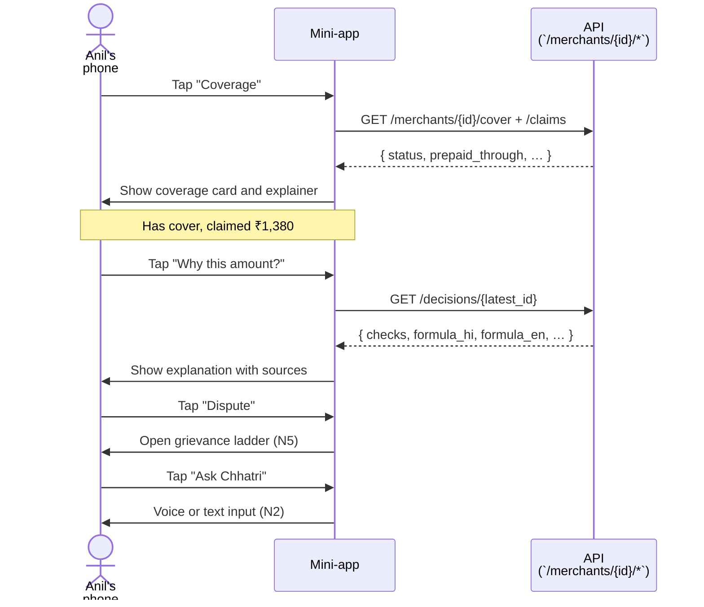
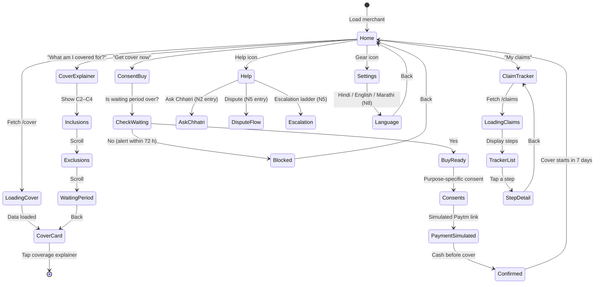

# Merchant mini-app: Chhatri in Paytm for Business

| | |
|---|---|
| Status | Draft v1 · 2 Oct 2026 |
| Owner | Omkar Kadam |
| Audience | Product team, frontend engineers, UI/accessibility reviewers |
| Related | [SPEC.md](../../SPEC.md) · [Executive summary](../../00-executive-summary.md) · [Personas and JTBD](../personas-and-jtbd.md) · [User journeys](../user-journeys.md) · [Design system](../../03-design/design-system.md) · [Screens and flows](../../03-design/screens-and-flows.md) · [Facts and sources](../../01-strategy/facts-and-sources.md) |

## TL;DR

- A phone-sized panel next to the WhatsApp phone on the merchant route, showing cover, claims and payouts in Hindi-first UI (N1, ADR-0005).
- Seven screens: Home and cover card · Coverage explainer with clauses C1–C12 · Consent and buy (simulated payment) · Claim tracker (Detected → Paid → EDI holiday) · Why-this-amount explanation · Payout receipt · Help and grievance.
- Entry points to Ask Chhatri (N2) and dispute flow (N5), language picker for Hindi, English, Marathi (N8 P1).
- 44×44 touch targets, 4.5:1 contrast, screen-reader labels, voice input button.
- All screens render from mock API endpoints when keys are missing; the phone simulator (not live WhatsApp) carries no network cost.

## 1. Summary

The merchant mini-app is the customer-facing surface for Chhatri inside the console, showing a single merchant (e.g. Anil Jadhav, `S-0142`) their cover, decisions and payouts in real time. It is placed next to the WhatsApp phone simulator on the route `/merchant/:id` (SPEC §20). The app covers scenarios N1 (merchant surface), N8 (Marathi, if time allows) and cross-links to N2 (Ask Chhatri), N5 (grievance), N6 (consent centre, P1).

The app addresses a critical gap identified in the current-state-audit.md: "No merchant surface to understand cover, buy and consent, track a claim, or escalate a grievance. Judges scored journey completeness 4–6/10."

## 2. Status today and what changes

**Today (2 Oct 2026, commit 86575ea):**
- Frontend: `frontend/src/pages/Merchant.tsx` loads the merchant and renders a WhatsApp phone simulator with a MerchantPanel beside it (line 134–145, `MerchantPanel.tsx`).
- MerchantPanel has three sections (line 142–147):
  - Soundbox announcement (LIVE when integrated to Paytm, SIMULATED in demo).
  - Money card: payouts with decision formula and badges (LIVE: decision data from `/api/merchants/{id}`).
  - "What happened" steps (LIVE: built from messages and decisions).
  - Merchant file: cover status, loan, KYC (LIVE: from merchant object).
  - Presenter notes (hidden by default, ?presenter=1 shows them).
- Styles: `frontend/src/styles/phone.css`, `merchant-panel.css`, tokens.
- Tests: 262 of 264 unit tests pass; 2 fail (Cases panel, Overview live-map). Fix X1 planned.
- The panel is bare-bones: no consumer screens, no mini-app.

**Changes (to build on 2 Oct and on-site, 3 Oct):**
1. Replace the MerchantPanel's flat sections with a tabbed or card-carousel mini-app.
2. Add seven screens (details in section 3).
3. Add entry points to Ask Chhatri (voice question button, N2) and dispute flow (N5).
4. Language picker for Hindi (default), English, Marathi (N8 toggle, P1).
5. Mock API endpoints: `GET /api/merchants/{id}/cover`, `GET /api/merchants/{id}/claims`, `GET /api/merchants/{id}/consents` (for N6, P1).
6. A/A testing of new screens in the mock backend.

## 3. User stories and jobs to be done

| Persona | JTBD | Related screen |
|---|---|---|
| **Anil Jadhav (primary, S-0142)** | Understand what I am covered for | Coverage explainer |
| | Buy cover quickly | Consent and buy |
| | See if I have an active claim or payout | Claim tracker |
| | Understand why I got ₹1,380 and not more | Why-this-amount explanation |
| | Dispute or escalate if I disagree | Help and grievance |
| | Get help in Hindi or Marathi | Language setting |
| **Ramesh (S-0907, uncovered)** | Learn what the cover costs | Coverage explainer + Consent and buy |
| | Be told when I can buy cover (not during an alert) | Consent and buy → BLOCKED |
| **Officer or field sales** | Show the merchant their cover on a phone | All screens in mock mode |

## 4. Rules (from `backend/chhatri/policy/rules.yaml`, version pilot-0.1)

| Rule | Value | Where shown |
|---|---|---|
| `waiting_period_days` | 7 | Coverage explainer (C5); Consent and buy (countdown) |
| `alert_lookahead_hours` | 72 | Consent and buy (BLOCKED if cover purchased during alert window) |
| `cover.annual_limit_rupees` | 30,000 | Coverage explainer (C4); receipt |
| `personal.daily_cap_rupees` | 1,500 | Coverage explainer (C4); receipt |
| `area.daily_cap_rupees` | 2,500 | Coverage explainer (C4); receipt |
| `personal.max_auto_days` | 3 | Coverage explainer (C4) |
| `payout_share` | 0.50 | Coverage explainer (C2, C3); Why-this-amount (formula) |
| `premium.min_per_day_rupees` | ₹2 | Coverage explainer (C6); Consent and buy |
| `premium.first_payment_days` | 30 | Consent and buy (link, prepayment) |
| `dispute_sla_hours` | 24 | Help and grievance (escalation timer) |
| `payout_rail_delay_minutes` | 4 | Why-this-amount (Paid time), Tracker (next step) |

## 5. Flow and states

### 5.1 Screen sequence (simplified)



### 5.2 Mini-app states



## 6. Inputs and data sources

| Input | Endpoint | Status | Purpose |
|---|---|---|---|
| Merchant cover | `GET /api/merchants/{id}/cover` | PLANNED | Home card: status, zone, waiting period, caps used, prepaid through |
| Area and personal claims | `GET /api/merchants/{id}/claims` | PLANNED | Tracker: step items with reasons and next step |
| Decision details | `GET /api/decisions/{decision_id}` (exists) | LIVE | Why-this-amount: checks, formula, facts, sources |
| Payout receipt | `GET /api/decisions/{id}/receipt` | PLANNED | Receipt screen: decision, rules version, formula, hash, audit entry |
| Merchant consents | `GET /api/merchants/{id}/consents` | PLANNED (P1 for view; buy flow just reads policy) | Consent centre (N6): purpose, status, withdraw option |
| Merchant grievances | `GET /api/merchants/{id}/grievances` | PLANNED (P1 for ladder) | Escalation ladder: GRO → Bima Bharosa → Ombudsman, SLA clocks |
| Language setting | Browser `localStorage` or backend store | SIMULATED | User preference: hi, en, mr (N8) |
| SMS/WhatsApp gateway | Paytm Soundbox or WhatsApp Cloud API | SIMULATED | Announcements (not merchant-facing in the mini-app itself, but reference in tracker) |

All endpoints that are PLANNED will have mock implementations in `frontend/src/mock/` when keys are missing, so the app works in static mode (N7).

## 7. Decision logic and checks

No decision logic lives in the mini-app. All money decisions are made by `chhatri.policy.engine` (SPEC §0.2) and displayed read-only. The app renders explanations and forwards disputes to the case system.

**UI-only guard:**
- Cover purchase is BLOCKED if the merchant tries to buy during an alert window (72 h look-ahead, rule K6). The UI disables the "Get cover" button and shows the block reason.
- Language picker respects user preference (localStorage, N8).

## 8. Merchant-facing copy

All copy is bilingual (Hindi + English). Marathi is P1 (N8). Source: `backend/chhatri/conversation/messages.py` (existing keys) and proposed additions.

### 8.1 Screen copy (from catalogue or new)

**Home and cover card:**
- Card title (existing `PAYOUT_CARD`): "आज के सेटलमेंट के साथ जमा" / "Credited with today's settlement"
- Status badge (new, proposed): "Cover active" / "कवर चालू है" (if not covered: "No cover")
- Next step text (new, proposed): "कब तक कवर है?" / "When does my cover end?" (showing prepaid_through)

**Coverage explainer:**
- Heading (new, proposed): "आप किन नुकसानों के लिए कवर हैं?" / "What am I covered for?"
- C2 (Area income loss): "अपने इलाके में भारी बारिश या बिजली गुल होने से आपकी बिक्री अगर 50% से ज़्यादा गिरे तो छतरी आपका 50% नुकसान देता है।" / "If your area's sales drop over 50% due to heavy rain or power cut, Chhatri pays 50% of your loss."
- C3 (Hospital cash): "अगर आप या आपका परिवार कहीं 24 घंटे से ज़्यादा रहे तो छतरी ₹1,500 तक देता है।" / "If you or your family are in hospital for 24+ hours, Chhatri pays up to ₹1,500 a day."
- C4 (Caps and limits): "साल भर में सबसे ज़्यादा ₹30,000 तक।" / "Up to ₹30,000 per year."
- Examples: "उदाहरण: आपकी दुकान की बिक्री आम दिन ₹3,000 है। बारिश में 60% गिरकर ₹1,200 रह गई। छतरी आपको ₹900 देगा (50% × 1,800 नुकसान)।" / "Example: Your usual daily sale is ₹3,000. In heavy rain it drops 60% to ₹1,200. Chhatri pays ₹900 (50% of ₹1,800 loss)."
- C5 (Waiting period): "नए कवर के 7 दिन बाद शुरू होता है।" / "New cover starts 7 days after purchase."
- C6 (Premium): "₹2 से ₹10 प्रति दिन, आपके इलाके के अनुसार।" / "₹2 to ₹10 per day, depending on your area."
- C7 (Exclusions): "सीलबंद दुकान, बिजली कनेक्शन नहीं, या मैन्युअल सेटलमेंट पर नहीं।" / "Sealed shops, no electricity connection, or manual settlement."

**Consent and buy:**
- Waiting period blocked (existing `COVER_BLOCKED`): "नया कवर वेटिंग पीरियड के बाद शुरू होता है — {starts_on_hi} से। कल के अलर्ट पर यह लागू नहीं होगा।" / "New cover starts after the waiting period — from {starts_on_en}. It won't apply to tomorrow's alert."
- Consent checkbox (new, proposed): "मैं अपना सेल्स डेटा छतरी को दावे के लिए चेक करने देता/देती हूँ।" / "I allow Chhatri to check my sales data for claims."
- Payment link (existing `COVER_LINK`): "आगे के लिए कवर लेना हो तो {first_payment} ({per_day}/दिन) यहाँ भरें: {url}" / "To buy cover for later, pay {first_payment} ({per_day}/day) here: {url}"
- Payment confirmed (new, proposed): "कवर {starts_on_hi} से शुरू होगा।" / "Cover will start from {starts_on_en}."

**Claim tracker:**
- Card states (new, proposed bilingual):
  - Detected: "पता चला · {time}" / "Detected · {time}" (e.g. "Detected at 17:00")
  - Checked: "चेक किया गया · {reason}" / "Checked · {reason}" (e.g. "Slip is clear")
  - Decided: "मंज़ूर · ₹{amount}" / "Approved · ₹{amount}"
  - Paid: "जमा · {time}" / "Credited · {time}"
  - EDI holiday: "कल की {instalment} की किस्त रोक दी गई है।" / "Tomorrow's {instalment} instalment is paused." (existing `INSTALMENT_PAUSED`)
- Next step: "अगला कदम: {next}" (e.g. "अगला कदम: आपके सेटलमेंट के साथ ₹1,380 जमा होगा।" / "Next: ₹1,380 will be credited with your settlement.")

**Why-this-amount explanation:**
- Card heading (new, proposed): "मुझे इतने ही पैसे क्यों मिले?" / "Why did I get this amount?"
- Formula label (existing `EXPLAIN_AREA_FORMULA`): "आपके भुगतान का हिसाब: {formula_hi}" / "How your payout was worked out: {formula_en}"
- Example: "आपका आम सोमवार: ₹4,380 · आपके इलाके की बिक्री: 63% गिरी · छतरी आपको 50% देता है · यानी: ₹4,380 × 63% × 50% = ₹1,380" / "Your usual Monday: ₹4,380 · Your area's sales fell 63% · Chhatri pays 50% · So: ₹4,380 × 63% × 50% = ₹1,380"
- Source badges (new, proposed): "[Sales data]", "[Alert A-20250818-01]", "[KYC]", "[Clause C4]"
- Counterfactual (for REFERRED or BLOCKED, new, proposed): "मंज़ूर होते अगर: नाम के अंक 85 से ज़्यादा होते।" / "Would be approved if: name score were above 85."
- Dispute button: "यह गलत है" / "This is wrong" (entry to N5 dispute flow)

**Payout receipt (H3):**
- Heading (new, proposed): "आपके भुगतान की रसीद" / "Your payout receipt"
- Rows: "Decision ID", "Rules version", "Formula", "Data sources", "Audit entry", "Grieve by", "Download PDF"
- Example data:
  ```
  Decision: D-000001
  Rules: pilot-0.1
  Formula: ₹4,380 × 63% × 50% = ₹1,380
  Sources: Paytm sales index · alert A-20250818-01 · KYC verified
  Audit: 6a2b3c4d5e6f (first 12 chars of hash)
  Dispute deadline: 24 hours from decision
  ```
- PDF button (new, proposed): "PDF में डाउनलोड करें" / "Download as PDF"

**Help and grievance:**
- Heading (new, proposed): "मदद और शिकायत" / "Help and grievance"
- Ask Chhatri button (entry to N2): "छतरी से पूछें" / "Ask Chhatri" (voice or text)
- Dispute button (entry to N5): "मुझे लगता है यह गलत है" / "I think this is wrong" (opens a case)
- Escalation ladder (N5, P1, new, proposed):
  - "Step 1: छतरी की टीम (24 घंटे में जवाब)" / "Step 1: Chhatri team (reply within 24 h)"
  - "Step 2: बीमा भारोसा (14 दिनों में)" / "Step 2: Bima Bharosa (within 14 days)"
  - "Step 3: बीमा लोकपाल (मुफ़्त)" / "Step 3: Insurance Ombudsman (free)"
- SLA clocks: Display remaining time or "Overdue" badge.

**Settings:**
- Language picker (new, proposed):
  - "भाषा" / "Language": [Radio] हिंदी, English, मराठी (N8 P1)
  - Marathi label when selected: "भाषा" / "भाषा (मराठीमध्ये उपलब्ध)"

### 8.2 New copy proposal summary

All new strings are marked **[PROPOSED]** above and will need approval by the product team and compliance before launch. Existing deck strings (from the 16 keys in SPEC §13.4) are reused where possible.

## 9. Edge cases and failure modes

| Scenario | Behaviour | Message | Audit event |
|---|---|---|---|
| Merchant with no cover, navigates to app | Home shows "No cover" badge; all claim/payout screens are empty; "Get cover now" is clickable | "नए कवर के लिए यहाँ भरें" / "Get cover here" | `view_rendered` (screen name: home, cover_status: not_covered) |
| Waiting period not over yet | "Get cover" button disabled; message shows wait time left | "आप {N} दिन में कवर ले सकते हैं।" / "You can get cover in {N} days." | `view_rendered` (screen: consent_buy, waiting_period_remaining: N) |
| Alert issued within 72 hours of purchase | Cover purchase is BLOCKED; UI shows alert name and end time | Existing `COVER_BLOCKED` message | `cover_blocked` (merchant_id, alert_id, reason: lookahead) |
| No claims yet | Tracker shows empty state | "अभी कोई दावा नहीं" / "No claims yet" | `view_rendered` (screen: tracker, claims_count: 0) |
| Claim APPROVED, payment pending (< 4 min) | Status shows "Checked · Pending credit at 17:04" | "जमा होने में 4 मिनट का समय लग सकता है।" / "Credit may take up to 4 minutes." | `view_rendered` (screen: tracker, decision_outcome: APPROVED, payout_status: PENDING) |
| Claim REFERRED (officer review) | Status shows "Sent to a claims officer · case C-2291"; "Why this amount?" card shows counterfactual | "हमारी टीम इसे देखेगी। 24 घंटे में जवाब मिलेगा।" / "Our team will review it. Reply within 24 hours." | `case_opened` (case_id, merchant_id) |
| Claim DECLINED | Status shows reason (e.g. cover not in force); payout amount is ₹0 | Existing `PERSONAL_DECLINED` + reason | `decision_rendered` (outcome: DECLINED, reason_code) |
| API unavailable (network error) | Screen shows error with retry button | "कुछ गलत हुआ। फिर से कोशिश करें।" / "Something went wrong. Try again." | `view_error` (screen name, error code) |
| Offline (service worker cached) | Show last-known state with "Offline" badge; no real-time updates | "(ऑफ़लाइन) डेटा ताज़ा नहीं है।" / "(Offline) Data is not fresh." | No event (offline mode) |
| Language picker in Marathi (N8) | All strings render in Marathi (if available) or fall back to English | UI labels in Marathi | `language_changed` (merchant_id, language: "mr") |
| X8: Alert active, user sees mini-app | No loan or top-up cards shown; proactive message cap enforced | No cross-sell cards visible; Help screen available only | `view_rendered` (screen, x8_alert_active: true, cards_suppressed: loan) |
| X8: Claim or dispute open | No loan or top-up cards shown during the open state | User sees claim/dispute status instead of offers | `view_rendered` (screen, x8_claim_open: true, cards_suppressed: loan) |

## 10. Guardrails, privacy and compliance notes

### 10.1 No loan offers during distress (X8)

- **Rule X8** prevents loan, top-up or cross-sell offers while an alert covers the merchant's zone, or while a claim or dispute is open.
- Proactive messages (beyond payment confirmations and replies) are capped per day.
- The mini-app does not show loan cards or offer links during these states. The backend enforces the rule (SPEC §4.2, section "rules engine").
- Audit log records each message sent and the X8 guard result.

### 10.2 Privacy (DPDP A22, K6)

- **Sales data consent:** Purpose-specific ("for claims and cover") on the Consent and buy screen; withdrawable via Settings (N6, P1).
- **Hospital slip data:** "Health data minimised: we read only name, dates, hospital name from your slip. Not stored, deleted after decision." (N6, P1)
- **Masking:** KYC name shown as "A***L J****V" in Merchant file; phone as "+91 *** *** 7890".
- **No third-party tracking:** No Google Analytics, no Hotjar; only backend audit events.
- **Free-tier AI:** Gemini free tier may retain content for product improvement (A19). The mini-app itself does not send merchant data to Gemini; Ask Chhatri (N2) sends only the merchant's own cover and decision data, which are necessary for grounding, not personal information.

### 10.2 Accessibility (WCAG 2.1 AA target)

- **Touch targets:** All buttons and clickable areas ≥ 44×44 px (device-independent px).
- **Contrast:** Text ≥ 4.5:1 (normal) or 3:1 (large text ≥ 18pt).
- **Language tags:** `<div lang="hi">`, `<div lang="en">`, `<div lang="mr">` on bilingual blocks.
- **Screen reader labels:** `aria-label`, `aria-describedby` on cards, buttons, tables.
- **Form labels:** Associated with inputs via `<label>` or `aria-labelledby`.
- **Keyboard navigation:** Tab order logical; no keyboard traps; modal focusable.
- **Voice button:** Microphone icon with `aria-label="Voice input"` and visual feedback (waveform or spinner).
- **Numerals:** Large, monospace, on a contrasting background; Indian numbering style (₹1,380, not 1380).
- **No colour-only status:** Status conveyed by text badge ("APPROVED", "REFERRED"), not red/green alone.

### 10.3 Compliance

- **Insurance Act 1938 s.64VB:** "Cash before cover" enforced in backend; UI reflects `Cover.prepaid_through` (B. hedged as to-be-confirmed with insurer).
- **IRDAI claims timelines:** No SLA is printed in the UI that is not in `rules.yaml` (dispute 24 h, grievance 14 days from Bima Bharosa portal). (A24, B.)
- **RBI FREE-AI (A23, B.):** LLM (Ask Chhatri, N2) is grounded in policy and decision facts; no unsupported money claims; human review lane for edge cases. Audit log visible (receipt hash).
- **EDI holiday:** Described as "the lender's decision, requested after a payout" (K3, B.). No unilateral claim in the UI.

## 11. Acceptance criteria

### 11.1 Home and cover card

**Given** a merchant with active cover,
**When** the app loads,
**Then** the Home card shows:
- Cover status "Cover active" (or "Expires {date}" if nearing end of prepaid period).
- Expected daily amount (e.g. "Expected Tuesday: ₹4,380").
- A "Coverage explainer" link and a "Get cover" link (greyed out if already covered or waiting period not over).

**Given** a merchant with no cover,
**When** the app loads,
**Then** the Home card shows "No cover" and a clickable "Get cover" link.

### 11.2 Coverage explainer

**Given** the merchant taps "Coverage explainer",
**When** the screen loads,
**Then** it shows (scrollable):
- Heading "What am I covered for?" (bilingual).
- Section C2: area income loss, with an example (e.g. ₹3,000 → ₹1,200 loss → ₹900 payout).
- Section C3: hospital cash, with limits and conditions.
- Section C4: caps (daily, annual) and examples (e.g. "up to ₹1,500 a day, max 3 days = ₹4,500").
- Section C5: waiting period and alert look-ahead.
- Section C6: premium range (₹2–₹10/day).
- Section C7: exclusions (sealed shops, etc.).
- Each section cites its clause ID (C2, C3, …).

**Given** the merchant is reading in Hindi,
**When** they scroll to an example,
**Then** the example uses Indian rupee format (₹3,000, not 3000) and Hindi numerals are optional (ASCII digits are acceptable).

### 11.3 Consent and buy

**Given** the merchant taps "Get cover now",
**When** the waiting period is not over,
**Then** the button is disabled and a message shows "{N} days remaining" and a start date.

**Given** the merchant taps "Get cover now" and an alert is active within 72 hours,
**When** the app evaluates `rule.alert_lookahead_hours`,
**Then** the UI blocks purchase and shows the existing `COVER_BLOCKED` message.

**Given** the merchant taps "Get cover now" and is eligible to buy,
**When** the consent form is shown,
**Then** a checkbox requests purpose-specific consent ("for claims and cover").

**Given** the merchant taps "Agree and pay",
**When** the app calls `POST /api/merchants/{id}/pay-cover`,
**Then** a simulated Paytm link is shown (or real link if `PAYTM_MCP_URL` is set), labelled `SIMULATED`.

**Given** the merchant confirms payment,
**When** the backend records the premium payment,
**Then** the Home card shows "Cover active · starts {date}" within 2 seconds, and no error is shown.

### 11.4 Claim tracker

**Given** the merchant has no claims,
**When** they tap "My claims",
**Then** the tracker shows "No claims yet."

**Given** the merchant has a claim,
**When** they view the tracker,
**Then** each claim shows:
- Kind: "Area income loss" or "Hospital cash" (in Hindi + English).
- State: "Detected at {time}" → "Checked" → "Decided" → "Paid at {time}" → "EDI holiday" (applicable if payout > 0).
- Reason (bilingual): e.g. "Slip is clear" or "Name mismatch" for REFERRED.
- Next step (bilingual): e.g. "Credit may take 4 minutes" or "Our team will review it."
- Tap to expand for details (decision link, decision ID).

**Given** a claim is REFERRED (human review),
**When** the merchant views its step,
**Then** a "See case details" link opens to N5 (grievance) or the case view (if K8 is shown).

### 11.5 Why-this-amount explanation

**Given** a decision exists,
**When** the merchant taps "Why did I get this amount?",
**Then** the explanation card shows:
- Formula in Hindi and English (e.g. "₹4,380 × 63% × 50% = ₹1,380").
- Plain-language breakdown: "Your usual: ₹4,380 · Your area's drop: 63% · Chhatri's share: 50% · Total: ₹1,380."
- Source badges: "[Sales data]", "[Alert]", "[KYC]", "[Clause C2]".
- Dispute button ("This is wrong").

**Given** a claim is REFERRED,
**When** the merchant views the explanation,
**Then** a counterfactual line is shown: "Would be approved if: name score were ≥ 85" (using the reason from the decision).

### 11.6 Payout receipt

**Given** a payout is CREDITED,
**When** the merchant views the receipt,
**Then** the receipt shows (printable to PDF):
- Decision ID (e.g. "D-000001").
- Rules version ("pilot-0.1").
- Formula and amount.
- Data sources (bulleted).
- Audit hash (first 12 characters).
- Dispute deadline (24 hours from decision time).
- "Download as PDF" button.

### 11.7 Help and grievance

**Given** the merchant opens Help,
**When** they see the options,
**Then** they can tap:
- "Ask Chhatri" (entry to N2: voice or text question, returns grounded answer).
- "Dispute this amount" (entry to N5: opens a case, SLA = 24 h).
- "Escalation ladder" (N5, P1: GRO → Bima Bharosa → Ombudsman with SLA clocks).

### 11.8 Settings

**Given** the merchant opens Settings,
**When** they see the language picker,
**Then** they can select from: "हिंदी", "English", "मराठी" (N8 P1).

**Given** the merchant selects a language,
**When** they navigate back to Home,
**Then** all UI strings and merchant-facing copy are rendered in that language (or fall back to English if not available).

## 12. Telemetry and audit events

All events are emitted as (`screen_name`, `action`, `metadata`).

| Event | When | Metadata | Example |
|---|---|---|---|
| `view_rendered` | Screen loads | screen_name, cover_status, claims_count, language | `{ screen_name: "home", cover_status: "active", claims_count: 1, language: "hi" }` |
| `button_tapped` | User taps a button | screen_name, button_id, action | `{ screen_name: "home", button_id: "coverage_explainer", action: "navigate" }` |
| `cover_blocked` | Purchase blocked | reason (alert_lookahead, waiting_period) | `{ reason: "alert_lookahead", alert_id: "A-20250818-01", lookahead_hours: 72 }` |
| `consent_granted` | User agrees to consent | screen_name, purpose | `{ screen_name: "consent_buy", purpose: "claims_cover" }` |
| `language_changed` | User picks language | language | `{ language: "mr" }` |
| `question_asked` | User taps Ask Chhatri | question_text (first 50 chars), channel | `{ channel: "voice", question: "मुझे इतने ही..." }` |
| `dispute_opened` | User opens a case | claim_id, reason_text | `{ claim_id: "CL-000001", reason: "Loss was bigger" }` |
| `api_error` | Network or server error | screen_name, status_code, error_message | `{ screen_name: "tracker", status_code: 500, error: "Internal server error" }` |

All events are stored in the backend audit log (SPEC §11) with `subject_type: "merchant_interaction"`, `action: "mini_app_event"`.

## 13. Planned changes and tasks

| ID | Task | Owner | Effort (h) | Notes |
|---|---|---|---|---|
| N1.1 | Build Home card and cover status (active/inactive, prepaid_through) | Omkar Kadam | 3 | Component: `CoverCard.tsx` |
| N1.2 | Build Coverage explainer screen (C2–C7, scrollable, bilingual) | Omkar Kadam | 4 | Component: `CoverageExplainer.tsx`; include rupee examples |
| N1.3 | Build Consent and buy screen (waiting period, alert block, consent checkbox, payment link) | Omkar Kadam | 4 | Component: `ConsentBuy.tsx`; integrate `POST /api/merchants/{id}/pay-cover` mock |
| N1.4 | Build Claim tracker (state machine, step details, Next step text) | Omkar Kadam | 5 | Component: `ClaimTracker.tsx`; mock data from `/api/merchants/{id}/claims` |
| N1.5 | Build Why-this-amount explanation card (formula, sources, counterfactual, dispute button) | Omkar Kadam | 3 | Component: `ExplanationCard.tsx`; reuse decision explanation from MerchantPanel |
| N1.6 | Build Payout receipt screen (decision details, audit hash, PDF export) | Omkar Kadam | 3 | Component: `PayoutReceipt.tsx`; PDF via `window.print()` or jsPDF |
| N1.7 | Build Help and grievance screen (Ask Chhatri, dispute, escalation ladder P1) | Omkar Kadam | 3 | Component: `Help.tsx`; links to N2 and N5 entry points |
| N1.8 | Build Settings screen (language picker, consents P1) | Omkar Kadam | 2 | Component: `Settings.tsx`; localStorage for language preference |
| N1.9 | Tab/card navigation layout and routing | Omkar Kadam | 2 | Refactor MerchantPanel to use a tab bar or card carousel; route: `/merchant/:id?screen={home,coverage,consent,tracker,explanation,receipt,help,settings}` |
| N1.10 | Accessibility audit (WCAG 2.1 AA): touch targets, contrast, labels, keyboard | Omkar Kadam | 4 | Manual test on iOS Safari and Android Chrome; fix X0 issues |
| N1.11 | Mock API endpoints and data | Omkar Kadam | 3 | Add to `frontend/src/mock/`: `/merchants/{id}/cover`, `/merchants/{id}/claims`, `/merchants/{id}/consents`, `/merchants/{id}/grievances` |
| N1.12 | Unit tests: all screens render, buttons navigate, data loads | Omkar Kadam | 5 | Vitest + `@testing-library/react`; mock API calls; fix X1 (Cases, Overview tests) |
| N8.1 | Add Marathi language support (message catalogue, component strings) | Omkar Kadam | 2 | P1: if time allows. Add mr_IN locale to i18n. Marathi copy TBD. |
| N1.13 | Integration test on demo laptop (live SMS Soundbox, settle payout, check tracker update) | Both | 1 | End-to-end: trigger → payout → Soundbox → tracker update. Screen recording. |

**Total effort estimate:** 43 hours (3 Oct build + on-site fixes).

## 14. Test plan

### 14.1 Existing tests

From `frontend/`:
- `Merchant.tsx` unit test: loads merchant, renders panel (exists, passes).
- `MerchantPanel.tsx` unit test: Money section, WhatHappened, MerchantFile (exists, mostly pass; 2 fail: Cases panel, Overview map).

### 14.2 New tests

| Test | Suite | File | Acceptance criterion |
|---|---|---|---|
| Home card renders cover status | Unit | `CoverCard.test.tsx` | Shows "Cover active" or "No cover"; displays prepaid_through |
| Coverage explainer scrolls and shows C2–C7 | Unit | `CoverageExplainer.test.tsx` | All 6 sections present; clause IDs visible; rupee examples render |
| Waiting period blocks purchase | Unit | `ConsentBuy.test.tsx` | Button disabled when `rule.waiting_period_days` not elapsed |
| Alert blocks purchase | Unit | `ConsentBuy.test.tsx` | Message shows (existing `COVER_BLOCKED`); button disabled |
| Tracker renders claim steps | Unit | `ClaimTracker.test.tsx` | States: Detected, Checked, Decided, Paid, EDI holiday; reasons shown; next step text present |
| Explanation card shows formula | Unit | `ExplanationCard.test.tsx` | Formula matches `decision.explanation.formula_hi/en`; sources listed; counterfactual for REFERRED |
| Receipt shows decision, hash, deadline | Unit | `PayoutReceipt.test.tsx` | Decision ID, rules version, audit hash, dispute SLA all render correctly |
| Language picker persists | Unit | `Settings.test.tsx` | `localStorage` stores language; app rerenders in that language |
| Dispute button opens case | Integration | `Help.test.tsx` | Tap "This is wrong" → POST `/api/merchants/{id}/grievances` → case_id returned → navigate to case view (N5) |
| Ask Chhatri button enters N2 | Integration | `Help.test.tsx` | Tap "Ask Chhatri" → modal or new screen with voice/text input → integrated with N2 |
| All screens accessible (WCAG 2.1 AA) | Accessibility | Manual + axe-core | All interactive elements ≥ 44px; contrast ≥ 4.5:1; lang tags present; screen-reader labels |
| Offline mode shows "Offline" badge | Integration | `Merchant.test.tsx` | Service worker serves cached response; UI shows "(Offline) Data is not fresh" |
| API error shows retry button | Unit | All screen tests | On 500 or network error, show "Something went wrong. Try again." button |
| E2E: trigger → tracker update | E2E (Playwright) | `merchant-mini-app.e2e.ts` | Replay time 17:00 → Anil's claim appears in tracker; "Detected at 17:00" shows within 1 s |

**Coverage target:** 80%+ of new components. Measured with `npm run test:coverage`.

## Open questions

1. **Marathi support (N8):** Should Marathi be built on-site if time allows, or deferred to post-hackathon? Copy is TBD. Owner: Omkar Kadam.
2. **PDF receipt export (H3):** Use browser `window.print()` (simplest, works offline), jsPDF (adds dependency), or server-side PDF (requires backend work)? Owner: Omkar Kadam.
3. **Escalation ladder SLA clocks (N5, P1):** How should the UI display "Overdue" after 24 h? Icon + badge, or a prominent red bar? Owner: Omkar Kadam.
4. **Consent centre (N6, P1):** If built, should the UI show a "Delete my slip data" button that triggers a backend endpoint, or a manual "Contact support" instruction? Owner: Omkar Kadam.
5. **Language fallback:** If Marathi copy is not available for a string, should the UI fall back to English or Hindi (or blank)? Owner: Omkar Kadam.

## Changelog

- 2026-10-02 · v1.3 · second fact-check pass: fixed endpoint parameter from {id} to {decision_id}
- 2026-10-02 · v1.2 · final consistency pass against the code
- 2026-10-02 · v1.1 · fact-check pass: replaced an internal reference with current-state-audit.md.
- 2026-10-02 · v1 · first draft. Covers N1, with entry points to N2 (Ask Chhatri), N5 (dispute and grievance), N6 (consent, P1) and N8 (Marathi, P1).
