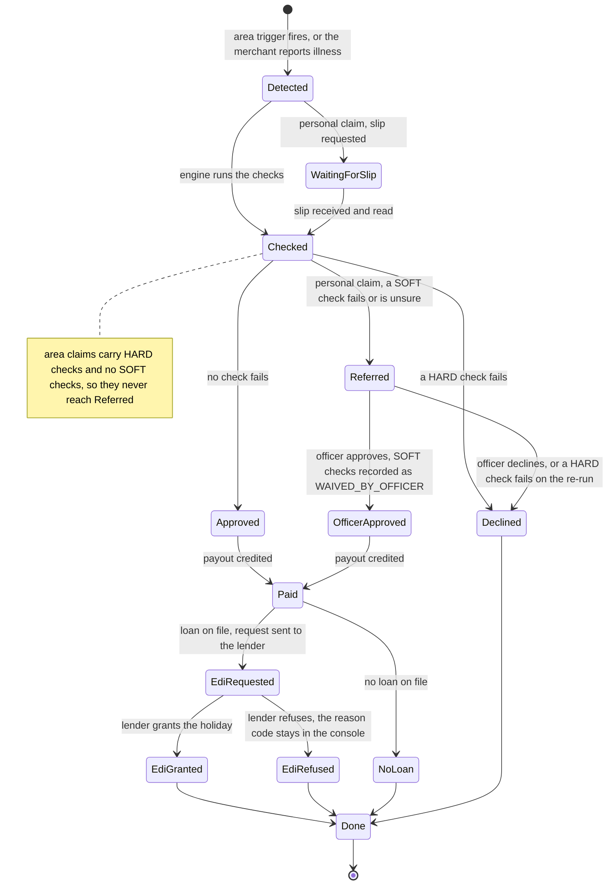
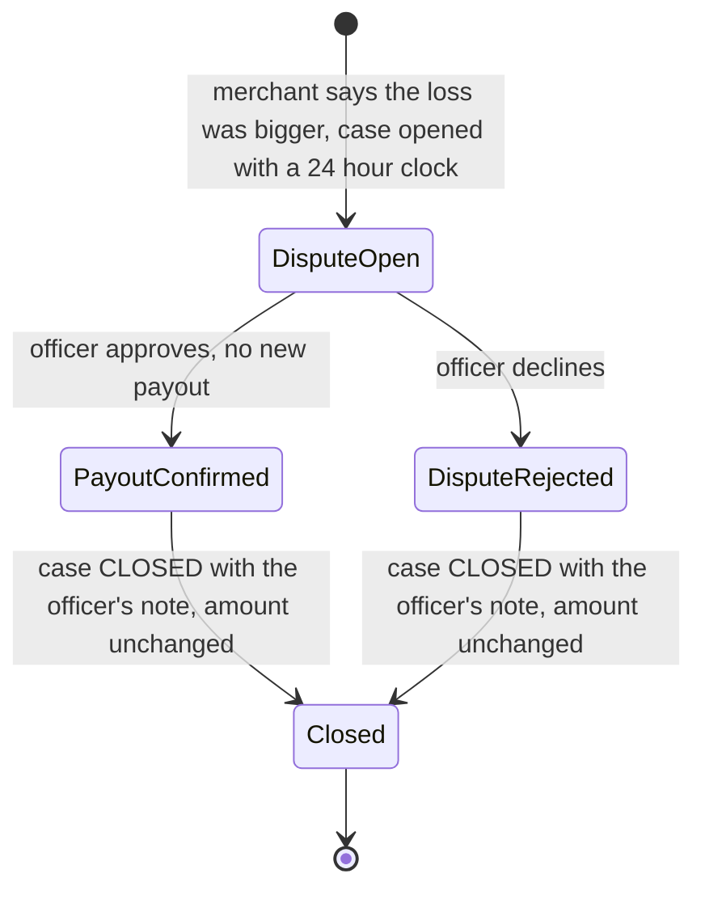

# Merchant mini-app: Chhatri in Paytm for Business

| | |
|---|---|
| Status | BUILT · spec v1.5 · the mini-app core (N1, nine screens) plus Ask Chhatri (N2), slip pre-check (N3), voice (N4), grievances (N5), consents (N6), and Marathi (N8) (Section 2 lists what exists today) |
| Owner | Omkar Kadam (screens, copy, UI stack) · Ujjwal Pardeshi (endpoints and engine fields in Section 6) |
| Date | 2026-10-02 |
| Related | [ADR 0005](../../04-engineering/adr/0005-mini-app-inside-the-console.md) · [PRD](../prd.md) · [Design system](../../03-design/design-system.md) · [Screens and flows](../../03-design/screens-and-flows.md) · [Copy deck](../../03-design/copy-deck.md) · [Data model and API](../../04-engineering/data-model-and-api.md) · [Implementation guide](../../04-engineering/implementation-guide.md) · [Policy wording](../policy-wording-and-cis.md) · [User journeys](../user-journeys.md) · [fs-03 EDI holiday](fs-03-edi-holiday.md) · [fs-05 Ask Chhatri](fs-05-ask-chhatri.md) · [fs-06 explanations, disputes and grievance](fs-06-explanations-disputes-and-grievance.md) · [fs-07 cover purchase and consent](fs-07-cover-purchase-and-consent.md) · [Traceability matrix](../../01-strategy/requirements-traceability-matrix.md) · [Facts and sources](../../01-strategy/facts-and-sources.md) |

## TL;DR

- **What:** a phone-sized merchant app, "Chhatri in Paytm for Business". A shopkeeper sees their cover, follows a claim step by step, learns why an amount was paid, keeps a receipt and gets help in Hindi, English or Marathi. It is a prototype surface in our own console, not an integration with the Paytm app.
- **Scope (N1):** nine screens in three tabs (Home, Claims, Help). It carries the claim tracker (H1), why-this-amount (H2), the trust receipt (H3) with verified-by badges (H13) and a counterfactual line (H14), the jargon lens (H20), the next-best-action bar (H21) and language switching (N8).
- **Where:** inside the console's merchant page as a third column next to the WhatsApp simulator, and as a standalone full-screen route, `/merchant/:id/app`, for phones and the static demo (N7).
- **Stack:** Tailwind CSS v4 and shadcn/ui, scoped to the mini-app under a `.miniapp` root class. The console keeps its plain CSS tokens.
- **Priority:** everything here is P0 (team decision, 2 Oct). Work runs in waves behind feature flags. A screen that is not finished is hidden, never shown half-working. N1 core is Wave 1; Marathi is Wave 4.
- **Honesty:** every status below says BUILT or PLANNED. Sales, alerts, KYC, payout rail, lender, Soundbox, WhatsApp and the Paytm link are SIMULATED and labelled. No N1 screen shows AI-written text.
- **Copy:** a quoted merchant-facing string is either a line of `backend/chhatri/conversation/messages.py` (Section 14.1 lists them) or proposed copy that needs a native Hindi review (Section 14).

## 1. Summary

The mini-app answers three questions a merchant asks after a bad day: *am I covered, what is happening to my claim, and why did I get this amount?* It reads the same API as the console, shows what the policy engine decided, and never decides anything itself. Money, dates and rule numbers are rendered from API fields. The app does not calculate them.

| Feature | What this spec adds | Section | Wave |
|---|---|---|---|
| N1 | Shell, nine screens, three tabs, placement in the console and on a phone | 4, 8 | 1 core; entry rows in 2 and 3 |
| H1 | Claim tracker: stepper with REFERRED, DISPUTE and lender paths | 9 | 1 |
| H2 | Why this amount: the engine's formula and numbers | 10 | 1 |
| H3 | Trust receipt, printable | 10 | 1 |
| H13 | Verified-by badges on every number, rule and clause | 10 | 1 |
| H14 | Counterfactual line in every explanation, produced by the engine | 10 | 1 |
| H20 | Jargon lens: tap a term, get a plain explanation with an example | 11 | 1 |
| H21 | Next-best-action bar on every screen | 12 | 1 (app); chat replies in fs-05, Wave 2 |
| N8 | Language switching: Hindi, English, Marathi | 13 | 1 (Hindi, English); 4 (Marathi) |

Specified elsewhere, with an entry row in the Help tab: Ask Chhatri and voice (N2, N4: [fs-05](fs-05-ask-chhatri.md)), slip reading (N3: [fs-02](fs-02-hospital-cash-claim.md)), grievance ladder (N5, H22: [fs-06](fs-06-explanations-disputes-and-grievance.md)), consent centre (N6, H23: [fs-07](fs-07-cover-purchase-and-consent.md)).

Ideas adopted from public rival projects (project names, not people; repo links are in [competitive landscape](../../01-strategy/competitive-landscape.md)): H13 from Praman; H14 from One-Tap Credit and Claim Advocate; H20 from Sahaj and AeroFin AI; H21 from Sahaj.

## 2. Status today and what changes

**BUILT (commit 86575ea, 2 Oct 2026)**

| Piece | Where |
|---|---|
| Merchant page: WhatsApp phone simulator in a 372 px column, and a merchant panel (Soundbox device, money card with the decision formula, BLOCKED card for a cover bought after an alert, "What happened" steps, merchant file, presenter notes) | `frontend/src/pages/Merchant.tsx`, `frontend/src/components/phone/` |
| Live refresh of one merchant on decision, payout, instalment and scenario events | `frontend/src/state/useMerchant.ts` |
| In-browser mock backend (`npm run dev:mock`, `?mock=1`) | `frontend/src/mock/` |
| Console design tokens; Ubuntu and Noto Sans Devanagari self-hosted (covers Marathi) | `frontend/src/styles/tokens.css`, `frontend/public/fonts/` |
| Decision with checks and explanation: `GET /api/decisions/{decision_id}` | `backend/chhatri/api/routers/records.py` |
| Cover quote and payment link: `POST /api/premium/link` (officer-authenticated); simulated paid callback: `POST /api/webhooks/paytm` | `backend/chhatri/api/routers/premium.py`, `webhooks.py` |
| Chat intents for "why this amount", dispute and buy cover | `backend/chhatri/conversation/` |
| Rules for display: `GET /api/policy` | `backend/chhatri/api/routers/records.py` |
| Frontend tests: 262 of 264 pass (X1 fixes the two failures) | `frontend/src/**/*.test.tsx` |

**BUILT since (Waves 0 to 5, 2 Oct 2026, uncommitted working tree until the freeze):** everything in this spec, behind its flag. The feature flags (`frontend/src/features.ts`), Tailwind v4 and shadcn scoped to `.miniapp` (`frontend/src/miniapp/miniapp.css`, `src/miniapp/ui/`), the frame and the standalone route, S1 to S9 (`src/miniapp/screens/`), the three endpoints and their mock parity (`src/mock/endpoints/cover.ts`, `tracker.ts`, `receipt.ts`), the next-best-action rules (`src/miniapp/hooks/nextBestAction.ts`, including `ask`, `send_slip` and `tick_consent`), the consent block on S3 (`src/miniapp/screens/BuyConsent.tsx`), Marathi (`src/miniapp/copy/mr.ts`, a draft until a native speaker reviews it) and the static build (`frontend/vite.spa-fallback.ts`). What still needs a person: the native review of the proposed Hindi and the Marathi draft, the deploy of the static build (repo owner) and the two rehearsals.

| Wave | What ships for the mini-app |
|---|---|
| 0 setup | Feature flags; Tailwind v4 and shadcn scoped setup (Section 5); frame and route skeleton, hidden behind `n1_miniapp` |
| 1 demo spine | S1 to S9 with Hindi and English; claim tracker incl. REFERRED and DISPUTE; trust receipt (H2, H3, H13, H14); jargon lens; next-best-action bar; `cover`, `claims` and `receipt` endpoints; mock parity |
| 2 live AI | Help rows for Ask Chhatri, slip pre-check and voice (flags `n2_ask_chhatri`, `n3_slip_precheck`); provider badge reused from X6 |
| 3 trust and rights | Help rows for grievances and consents; dispute button moves from the chat path to the grievance endpoint; consent block on S3 |
| 4 judge wow | Marathi (`n8_marathi`) after native review |
| 5 ship | N7 static build with the standalone route; deep-link fallback; rehearsals |

**Gaps found while writing this spec** (verified on 2 Oct 2026; 1 to 4 are fixed in Wave 1, 5 and 6 stay as the open questions say):

1. `GET /api/merchants/{id}/cover`, `GET /api/merchants/{id}/claims` and `GET /api/decisions/{decision_id}/receipt` do not exist yet (Wave 1, Ujjwal).
2. The mock backend has no route for `POST /api/premium/link` or `POST /api/webhooks/paytm`, and it prices the demo merchants at ₹3 a day (`frontend/src/mock/fixtures.ts`). A mock quote for Ramesh would read ₹90 for 30 days, not the ₹424.80 that [DEMO.md](../../DEMO.md) shows (Z3, ₹14.16 a day). Fix in Wave 1 (Omkar): copy the zone premiums from `backend/artifacts/premiums.json` into the mock data and add both routes.
3. Pilot covers are seeded at the ₹2 minimum, not at their zone's price (`backend/chhatri/sim/merchants.py`). Anil's cover would read ₹2 a day while Z7 is ₹18.62 a day. Fix in Wave 1 (Ujjwal, check the golden tests), or Home hides the per-day price until it is fixed.
4. A cover bought through the payment link is WAITING and nothing flips it to ACTIVE when `starts_on` passes (`backend/chhatri/ledger/premiums.py`), so COVER_IN_FORCE would fail for it. The status must be derived from the date; fs-07 specifies the fix.
5. A closed dispute sends the merchant OFFICER_DECLINED text whichever way the officer answers (`backend/chhatri/conversation/notifications.py`), so "payout confirmed" has no line of its own (open question 2).
6. `Check.observed` and `Check.required` come from the engine as English text. Check labels need bilingual copy per check code (Section 10.2).

## 3. Users and jobs to be done

| Persona | Job | Screen |
|---|---|---|
| Anil Jadhav (S-0142, tea stall, Parel, Z7; a synthetic persona in a simulated replay) | Know what I am covered for | S2 Coverage |
| | See whether a claim or payout is on its way | S1 Home, S4 Claims, S5 Claim |
| | Understand why I got ₹1,380 and not more | S6 Why this amount |
| | Keep proof of the decision | S7 Receipt |
| | Say "my loss was bigger" and know who answers | S5 Claim, S8 Help |
| | Read it in my language | S9 Language |
| Ramesh Vada Pav (S-0907, Z3, no cover) | See the price and the start date | S3 Cover and buy |
| | Understand why a request made during an alert is BLOCKED | S3 Cover and buy |
| Presenter or field officer | Show the merchant's view next to the officer's view | all screens, in the console frame |

## 4. Placement, routes and shell

ADR 0005 decides the placement; this section makes it buildable.

### 4.1 Console placement

At 1200 px and wider (the console is designed for 1280×720) the merchant page has three columns:

```
+--------------------+--------------------+------------------------------+
| WhatsApp phone     | Mini-app frame     | Merchant panel               |
| 372 px (BUILT)     | 372 px (BUILT)     | one column of cards (BUILT   |
|                    |  app bar + clock   | cards, stacked)              |
|                    |  screen (scrolls)  | Soundbox, money,             |
|                    |  next-best bar     | What happened,               |
|                    |  tab bar           | merchant file, notes         |
+--------------------+--------------------+------------------------------+
```

- From 900 to 1199 px: two columns (phone and frame); the merchant panel moves below them.
- Below 900 px: one column in the order phone, frame, panel.
- The frame reuses the `.phone` bezel (34 px radius). Its height is the column height; the app scrolls inside the frame. The frame is the containing block for overlays (`transform: translateZ(0)`), so a Sheet or Toast never escapes it.
- The page container allows 1280 px (today it stops at 1180 px) and the merchant panel switches to a single column in three-column mode.
- The frame header has an "Open full screen" link (`app-open-fullscreen`) to the standalone route. The link keeps `mock=1` and `lang`.

### 4.2 Routes

| Route | Renders | Chrome | Flag |
|---|---|---|---|
| `/merchant/:id` | Merchant page: phone, mini-app frame, merchant panel | console shell (header, control bar, footer) | `n1_miniapp` shows the frame. Off: today's two columns |
| `/merchant/:id/app` | Standalone mini-app, full viewport (centred, at most 430 px wide on a desktop) | none: inside `LiveProvider`, outside `AppShell` | `n1_miniapp`. Off: redirect to `/merchant/:id` |

The standalone route needs a second route tree in `frontend/src/App.tsx`. It stays inside `LiveProvider` because the app needs the API client, the stream and the replay clock.

### 4.3 URL state

All navigation inside the app is URL state, so a deep link or a browser back button works without a nested router.

| Param | Values | Notes |
|---|---|---|
| `screen` | `home` (default), `coverage`, `buy`, `claims`, `claim`, `why`, `receipt`, `help`, `settings` | Owned by other specs: `ask` and `voice` (fs-05), `slip` (fs-02), `grievances` (fs-06), `consents` and `consent-activity` (fs-07). An unknown value shows `home` |
| `claim` | claim id, for example `CL-000001` | Used with `screen=claim` |
| `decision` | decision id, for example `D-000001` | Used with `screen=why` and `screen=receipt`. Must match `^D-\d{6,}$` |
| `lang` | `hi`, `en`, `mr` | Section 13 |
| `mock`, `presenter` | existing console params | Kept on every link the app builds |

The merchant id in the path is validated by the existing `assertMerchantId` (ids look like `S-0142`). A bad id shows the existing "Unknown merchant" error.

### 4.4 Tabs and screens

Three bottom tabs, as in [screens and flows](../../03-design/screens-and-flows.md): Home, Claims, Help. The tab bar is the Tabs role, always visible, 44 px targets.

| ID | Screen | `screen=` | Tab | Wave |
|---|---|---|---|---|
| S1 | Home | `home` | Home | 1 |
| S2 | Coverage explainer | `coverage` | Home | 1 |
| S3 | Cover and buy | `buy` | Home | 1 (consent block in 3) |
| S4 | Claims | `claims` | Claims | 1 |
| S5 | Claim detail | `claim` | Claims | 1 |
| S6 | Why this amount | `why` | Claims | 1 |
| S7 | Trust receipt | `receipt` | Claims | 1 |
| S8 | Help | `help` | Help | 1 (rows added in 2 and 3) |
| S9 | Language | `settings` | Help (also the app bar globe) | 1 (Hindi, English); 4 (Marathi) |

### 4.5 Clock, merchant and device rules

- Time-dependent UI (start dates, countdowns, "today", the next-best action) reads the **replay clock** from the console's live state, never the device clock. Seeking the replay changes the app. Times are shown as simulated time, for example "17:04 (simulated)".
- The default merchant is Anil (S-0142). Another merchant is chosen by the path (`/merchant/S-0907`). The mini-app never lists merchants.
- Phones: the standalone route is the intended entry. The frame in the console is for the projector.

### 4.6 Feature flags

Flags are proposed names; the [implementation guide](../../04-engineering/implementation-guide.md) owns the mechanism (Wave 0) and the final list. The spec needs three things from the mechanism: a component can read a flag synchronously; "off" means absent from the UI (no empty shell, no "coming soon"); the current flag set is visible to the presenter.

| Flag | Gates | Turns on in | Off means |
|---|---|---|---|
| `n1_miniapp` | The frame, the standalone route, the third column | Wave 1, when S1 to S9 pass their acceptance criteria | Merchant page is today's two-column page; `/merchant/:id/app` redirects |
| `n2_ask_chhatri` | Help row "Ask Chhatri" and its next-best action | Wave 2 | Row hidden |
| `n3_slip_precheck` | Next-best action "Send your hospital slip" | Wave 2 | Rule skipped |
| `n5_grievances` | Help row "Complaints and escalation"; dispute via the grievance endpoint | Wave 3 | Row hidden; dispute uses the chat path |
| `n6_consents` | Help row "My data and consent"; consent block on S3 | Wave 3 | Row hidden; S3 shows a one-line data notice |
| `n8_marathi` | Marathi option on S9 | Wave 4, after native review | Option hidden; `?lang=mr` shows Hindi |

## 5. UI stack and component roles

Team decision, 2 Oct: the mini-app uses **Tailwind CSS v4 and shadcn/ui**, scoped to the mini-app. The console keeps its plain CSS tokens in `frontend/src/styles/tokens.css` and its 262 tests untouched.

### 5.1 Scoping rules

1. No Tailwind in console files. The mini-app lives in `frontend/src/miniapp/` (screens, `ui/` for the shadcn files, `lib/`, `copy/`). Nothing in the console imports from it except the route and page glue.
2. Tailwind v4 through `@tailwindcss/vite`. The one CSS entry is `frontend/src/miniapp/miniapp.css`, imported by `MiniappRoot` and nowhere else.
3. **No global reset.** Import the theme and the utilities only. Never `@import "tailwindcss"`, which includes Preflight.
4. **Class detection is limited to the mini-app folder:** `source(none)` plus `@source './'`, with test files excluded.
5. **Theme mapped straight onto the console tokens** in `@theme inline`. The default palette, radii, fonts, easings, shadows and breakpoints are cleared, so a class outside the mapping produces no CSS. No variables are declared for shadcn.
6. **Utilities are un-layered, without `important`.** The mini-app CSS loads after the console CSS, so a utility class beats a console element rule, and the console's `!important` reduced-motion rule still wins.
7. **A zero-specificity base, `:where(.miniapp …)`,** replaces Preflight for what the components rely on: form controls, media, headings and lists. It also makes the root a stacking context, a clip, a containing block for fixed overlays and a container for `@xs:` and `@sm:`.
8. Radix portals (Sheet, dialogs, popovers, tooltips) mount inside `.miniapp` through `useMiniappPortalContainer()`. The generated shadcn files were edited once for this, for the 44 and 48 px sizes and to drop dead classes (implementation guide, Wave 0 step 7).
9. 21st.dev components are added through the shadcn CLI and live in `frontend/src/miniapp/ui/` too. Concrete picks per role are in the [design system](../../03-design/design-system.md).

The entry file is [`frontend/src/miniapp/miniapp.css`](../../../frontend/src/miniapp/miniapp.css). [Design system section 13](../../03-design/design-system.md#13-theme-mapping-tailwind-to-tokenscss) explains each part and lists every theme name the mini-app may use (sections 13.2 and 13.3).

### 5.2 Collisions to guard

| # | Collision | Rule |
|---|---|---|
| 1 | shadcn's `--muted`, `--accent` and `--radius` have console tokens of the same name that mean other things | Never declare them. `@theme inline` maps the theme names straight onto console tokens (`--color-muted-foreground: var(--muted)`) |
| 2 | Console CSS is unlayered; layered utilities lose to it | Utilities are un-layered too and load later, so a class beats an element rule. No `important`: a layered `!important` would beat the console's reduced-motion rule |
| 3 | Console rules on bare elements (`h1` to `h4`, `a`, `button`) in `base.css` | The `:where(.miniapp)` base resets heading size and weight; utilities on the element style links and buttons |
| 4 | Class names in both systems: console `.table`, `.card`, `.btn`, `.badge`, `.muted`, `.stack`, `.eyebrow`; Tailwind utility `table` | No bare console class names in mini-app markup, except `num` (tabular numerals) and `hi` (Devanagari font). Never use the `table` utility |
| 5 | Theme variables with the same name in both: `--radius-sm`, `--radius-lg`, `--shadow-lg`, `--ease-out`, `--ease-in-out`, `--font-mono` | The theme is `inline`, so a utility holds its value directly; the built-CSS test asserts that no custom property is declared by both |
| 6 | The console's global `:focus-visible` uses `--accent` | `--accent` is never redefined inside the frame; shadcn components draw a `ring` in `--focus` (`--blue`) |
| 7 | Keyframes are global: the console defines `spin` and `pulse` | The mini-app's copies are renamed `mini-spin` and `mini-pulse` |
| 7 | Console `.btn` is 32 px high; touch targets need 44 px | Mini-app buttons are shadcn `Button` with an `h-11` default. No `.btn` |
| 8 | Portals escape `.miniapp` | `container` from context; the frame is the containing block |
| 9 | Marathi in `mr-IN` formatting defaults to Devanagari digits | Use the `-u-nu-latn` locale extension for money and dates (Section 13) |

### 5.3 Install and Vite 8 note

```bash
cd frontend
npm install -D tailwindcss @tailwindcss/vite
npx shadcn@latest init        # components.json points at src/miniapp/miniapp.css and src/miniapp/ui
npx shadcn@latest add button card tabs sheet badge sonner skeleton switch accordion
npx shadcn@latest add "https://21st.dev/r/<author>/<component>"   # picks in the design system
```

- The CLI writes theme variables into the CSS file named in `components.json`. Keep that file as the scoped entry above and review its diff after every `add`.
- The CLI writes imports through an `@/` alias, so Wave 0 adds `@/*` to `src/*` in `tsconfig`, Vite and Vitest. Console code keeps relative imports.
- The frontend runs Vite 8. On 2 Oct 2026 `@tailwindcss/vite` 4.3.3 lists `vite ^5.2.0 || ^6 || ^7 || ^8` as its peer range, so no workaround is needed. **If a later release drops Vite 8, use `@tailwindcss/postcss` instead** (PostCSS plugin in `vite.config.ts`, same CSS entry).
- Unit tests do not process Tailwind (Vitest skips CSS). Isolation is tested on the built CSS and in the browser (Section 19).

### 5.4 Component roles

Screens are specified by role. The concrete shadcn or 21st.dev component for each role is chosen in the [design system](../../03-design/design-system.md); this spec does not depend on the pick.

| Role | Used for | Base | Screens |
|---|---|---|---|
| Card | Cover card, claim cards, receipt sections, empty and error blocks | shadcn `card` | all |
| Stepper | Claim tracker (H1): ordered list of five steps, `aria-current="step"` on the current one | custom, built from Card and Badge | S5 |
| Sheet | Jargon lens (H20), consent withdrawal and erase (fs-07), verified-by detail | shadcn `sheet`, bottom side, inside the frame | S2, S5 to S7 |
| Tabs | Bottom tab bar; filters in fs-07 | shadcn `tabs` styled as a bar | shell |
| Badge | Status words, mode badges (SIMULATED, FALLBACK), verified-by badges, clause chips | shadcn `badge` | all |
| Toast | Confirmations (dispute sent, payment simulated) and the offline notice | shadcn `sonner`, host inside `.miniapp` | shell |
| Skeleton | Loading | shadcn `skeleton` | all |
| Button, Switch, Checkbox, Accordion | Actions; consent switches and boxes (fs-07); coverage sections | shadcn | S2, S3, fs-07 |

## 6. Data contract

All calls use the existing client and envelope (`{ok, data}` or `{ok: false, error: {code, message, fields}}`) from `frontend/src/api/`. Paths match the registry in [data-model-and-api.md](../../04-engineering/data-model-and-api.md) section 5. The mini-app never calls Gemini, Sarvam, WhatsApp or Paytm itself; the backend does.

### 6.1 Endpoints the mini-app uses

| Endpoint | Status | Used by | Notes |
|---|---|---|---|
| `GET /api/merchants/{id}` | BUILT | S1, S9 | Names (English and Hindi), `language`, `expected_today_label`, masked KYC name, loan summary |
| `GET /api/merchants/{id}/cover` | BUILT, Wave 1 | S1, S2, S3 | Section 6.2 |
| `GET /api/merchants/{id}/claims` | BUILT, Wave 1 | S1, S4, S5 | Section 6.2 |
| `GET /api/decisions/{decision_id}` | BUILT | S6 | Checks, explanation (formula, expected day, drop, share, cap), `rules_version`, `decided_by`, `referral_reason`, `supersedes` |
| `GET /api/decisions/{decision_id}/receipt` | BUILT, Wave 1 | S6, S7 | Section 6.2 |
| `POST /api/premium/link` | BUILT (officer-authenticated) | S3 | Returns `{quote, premium}`. `quote.outcome` is OK or BLOCKED. With `n6_consents` on it also takes `consents` and `notice_version` (fs-07 9.5) and answers 422 when the block is incomplete |
| `POST /api/webhooks/paytm` | BUILT | S3 | SIMULATED paid callback: JSON `link_id`, `status` `TXN_SUCCESS` |
| `POST /api/merchants/{id}/messages` | BUILT | S5, S8 | Wave 1 dispute: sends the dispute phrase, returns the produced messages (DISPUTE_ACK and the case chip) |
| `GET /api/policy` | BUILT | S2, S5 | Rule numbers; nothing numeric is typed into copy |
| `GET /api/integrations` | BUILT | all | LIVE, SIMULATED or FALLBACK per component (X6) |
| `GET /api/state`, `GET /api/stream` | BUILT | all | Replay clock and refresh events (the console's `LiveProvider` already consumes both) |
| `GET /api/audit/verify` | BUILT | S7 | "Check the log" |
| `POST /api/merchants/{id}/grievances`, `GET /api/merchants/{id}/grievances` | BUILT, Wave 3 (`n5_grievances`) | S5, S8 | [fs-06](fs-06-explanations-disputes-and-grievance.md); replaces the chat path for disputes |
| `POST /api/merchants/{id}/ask`, `POST /api/voice/stt`, `POST /api/voice/tts` | BUILT, Wave 2 (`n2_ask_chhatri`, `n4_voice`) | S8 rows | [fs-05](fs-05-ask-chhatri.md) |
| `POST /api/merchants/{id}/slip-precheck`, `POST /api/merchants/{id}/slip-precheck/{precheck_id}/confirm` | BUILT, Wave 2 (`n3_slip_precheck`) | S8 row, next-best action | [fs-02](fs-02-hospital-cash-claim.md) |
| `GET /api/merchants/{id}/consents`, `POST /api/merchants/{id}/consents/{consent_id}/withdraw`, `GET /api/merchants/{id}/consents/activity`, `POST /api/merchants/{id}/slips/{slip_id}/forget` | BUILT, Wave 3 (`n6_consents`) | S3, S8 row | [fs-07](fs-07-cover-purchase-and-consent.md) |
| `POST /api/integrations/{component}/fallback` | BUILT, Wave 2 (`x6_provider_panel`) | presenter | Drives the FALLBACK state on S3 |

The mini-app does not read `GET /api/cases/{case_id}`: that route returns the officer's evidence bundle (slip image, merchant text), which a merchant surface should not carry. The case fields the tracker needs arrive with the claim item.

The standalone route borrows the console's demo officer session for `POST /api/premium/link`. A pilot would use the merchant's own Paytm login (open question 4).

### 6.2 View models the screens read

The tables list fields by meaning. Names follow section 5 where it already defines them. A **+** marks a field this spec needs that section 5 does not show yet; the same change adds it there. If section 5 and this table differ, section 5 wins and this table is updated in the same change.

**Cover** (`GET /cover`)

| Field | Meaning |
|---|---|
| `status` | `NONE` (+), `PENDING_PAYMENT`, `WAITING`, `ACTIVE`, `LAPSED` or `CANCELLED`. Derived from `starts_on` and the replay date, not stored ([fs-07](fs-07-cover-purchase-and-consent.md) section 5.3) |
| `zone_id`, `zone_name` | Shown on Home |
| `starts_on`, `prepaid_through` | ISO dates |
| `premium_per_day_label` | The price this cover pays per day |
| `annual_limit_label`, `amount_claimed_label`, `amount_remaining_label` | Rolling 365 days |
| `waiting_period_days` | From the rules |
| `alert_active`, `alert_id` (+) | An alert for the zone is in force now, and which one |
| `premium_due` | `prepaid_through` is missing or earlier than today (the test behind COVER_STATUS_UNPAID) |
| `status_text_hi`, `status_text_en` (+) | The existing COVER_STATUS_ACTIVE, COVER_STATUS_STARTS or COVER_STATUS_UNPAID sentence, rendered by the backend. For `NONE`, the proposed key COVER_STATUS_NONE |

**Claim item** (`GET /claims`)

| Field | Meaning |
|---|---|
| `claim_id` | `CL-######`. A DISPUTE item carries `case_id` (for example `C-2291`) and `disputed_claim_id` (+) instead |
| `kind` | `AREA`, `PERSONAL` or `DISPUTE` (+) |
| `claim_at` | When the claim was detected |
| `decision_id` | Null until the Checked step completes |
| `outcome` (+), `amount_label` (+) | APPROVED, REFERRED or DECLINED once checked; the amount, never recomputed in the app |
| `steps[]` | `name` (Detected, Checked, Decided, Paid, EDI holiday), `status` (`completed`, `current`, `pending` or `skipped` (+)), `result` (+), `at`, `reason_hi` and `reason_en` (+; today one `reason`), `reason_code` (+) |
| `case_id`, `case_status` (+), `due_by` (+), `resolution` (+) | For REFERRED and DISPUTE items: the case (`C-2291`), its status (`OPEN`, `APPROVED`, `DECLINED` or `CLOSED`), the 24 h clock, and the officer's note or the catalogue reason once resolved. The amount on a DISPUTE item never changes |

`result` is APPROVED, REFERRED or DECLINED on the Decided step, and GRANTED, REFUSED or NO_LOAN on the EDI holiday step. `reason_code` is set when the lender refuses, and in no other case (`no_allowance`, `not_active`, `in_arrears`, `flag_off`); the merchant never sees it, the console does.

**Receipt** (`GET /decisions/{decision_id}/receipt`)

| Field | Meaning |
|---|---|
| `decision_id`, `outcome`, `amount_label`, `decided_at`, `decided_by` | `decided_by` is the engine or `officer:<id>` |
| `rules_version` | For example `pilot-0.1` |
| `formula_hi`, `formula_en` | From the decision's explanation |
| `lines[]` | The numbers shown: label key, value, `source_ref`. A line without a `source_ref` is a contract error |
| `sources[]` | Verified-by badges: `ref`, `kind`, `label`, `detail`, `at`, `mode` (LIVE, SIMULATED, FALLBACK), plus `version` and `clause` for rules |
| `checks[]` | `code`, `status`, `severity`, `observed`, `required` (English text from the engine), `source_ref`, and `erased` (+, Wave 3: true on the three slip checks after the merchant erased the slip, fs-07 section 9.8) |
| `counterfactual` | `kind` (`FLIP`, `CAP`, `NONE`), `check_code`, `text_hi`, `text_en`, produced by the engine |
| `audit` | `seq` and a 12-character `hash_prefix` of the decision's audit entry |
| `payout`, `edi`, `case_id`, `supersedes` | Payout status and credit time; lender request state; the case; the referred decision an officer decision replaces |
| `grievance` | The first rung of the ladder and its clock in hours (`dispute_sla_hours`) |

The receipt carries no phone number. The KYC name appears masked, as in the merchant file.

**Rule numbers** (`GET /api/policy`, field `rules`; keys as in `backend/chhatri/policy/rules.yaml`, version `pilot-0.1`)

| Shown as | Key | Value today | Where |
|---|---|---|---|
| Payout share | `payout_share` | 0.50 | S2 sections `c2`, `c4`; glossary |
| Area daily cap | `area.daily_cap_rupees` | 2,500 | S2 `c4`; glossary |
| Hospital-cash daily cap | `personal.daily_cap_rupees` | 1,500 | S2 `c3`, `c4`; glossary |
| Automatic days | `personal.max_auto_days` | 3 | S2 `c3`, `c4` |
| Annual limit | `annual_limit_rupees` | 30,000 | S1, S2 `c4`; glossary |
| Waiting period | `cover.waiting_period_days` | 7 | S2 `c5`, S3; glossary |
| Alert look-ahead | `cover.alert_lookahead_hours` | 72 | S2 `c5` |
| First payment days | `premium.first_payment_days` | 30 | S2 `c6`, S3 |
| Dispute clock | `dispute_sla_hours` | 24 | S5, S7 |
| Credit delay | `payout_rail_delay_minutes` | 4 | S5 Paid step |
| Name match, slip confidence | `personal.name_match_min_score`, `personal.slip_confidence_min` | 85, 0.80 | counterfactual text; glossary |
| Area floor, hours, quorum | `area.index_floor_pct`, `area.consecutive_hours`, `area.min_shops_in_index` | 50, 3, 20 | counterfactual text |

### 6.3 Refresh

The app refetches `cover`, `claims` and the open decision or receipt when a stream event for this merchant arrives: `decision`, `payout`, `instalment`, `case`, `message`, or `scenario` (which also resets the app to Home). `tick` just moves the clock. There is no polling. This mirrors `useMerchant`.

### 6.4 Mock parity (N7)

The mock backend implements every endpoint in the table above that the mini-app uses in Wave 1, with the same view models. One contract test parses the mock fixtures and the backend's JSON with the same parsers. The numbers in the mock match [DEMO.md](../../DEMO.md): Anil ₹4,380 to ₹1,380, Z7 ₹18.62 a day, Ramesh Z3 ₹14.16 a day and ₹424.80 for 30 days, first case C-2291.

### 6.5 Errors

| Response | App behaviour |
|---|---|
| 404 `not_found` (decision, claim) | Not found state: "We could not find this." with a link back to Claims |
| `premium` is null in the quote reply, or 502 | COVER_LINK_UNAVAILABLE text on S3 with Retry |
| 401 `unauthorized` or 403 `forbidden` on `POST /api/premium/link` (officer token missing or wrong) | "This demo action needs the presenter's session." (proposed) |
| 409, 422 | Inline message from `error.message`; the code is shown in small text |
| Network error | Offline state (Section 7) |
| Data fails a view-model parser (for example an AREA item with outcome REFERRED) | Error state with code `contract_violation`; the app never guesses |

## 7. Shared states

Every screen implements the same six states. Section 8 lists what each screen shows in them. Each screen root carries `data-state` set to `loading`, `empty`, `error`, `offline` or `ready`.

| State | Trigger | What the merchant sees |
|---|---|---|
| Loading | First fetch in flight | Skeleton blocks shaped like the final layout; `aria-busy="true"`; no spinner text |
| Empty | Request succeeded, nothing to show | One sentence and the next-best action |
| Error | Request failed, or the data failed its parser | "Something went wrong. Try again." (proposed copy), a Retry button, the error code in small text |
| Offline | `navigator.onLine` is false, or a request fails with a network error | Banner "Offline. Showing data from {time}." The last good data stays on screen from memory (no service worker, no stored copy). Actions that need the network are disabled with a reason |
| SIMULATED | Data or an action comes from a simulated source | A `SIMULATED` Badge. The app bar carries one summary badge. The receipt carries one per source |
| FALLBACK | A component was forced or fell back (arrives with X6) | A `FALLBACK` Badge and one line from `fallback_reason` |

## 8. Screens

Strings quoted on the screens are proposed copy (Section 14) unless Section 14.1 lists them as catalogue lines. Test ids use these prefixes: `app-` for the shell, then the screen's own prefix. Shell ids: `app-root` (the `.miniapp` element), `app-frame` (the console, not the standalone route), `app-appbar`, `app-clock`, `app-lang-button`, `app-open-fullscreen`, `app-tabbar`, `app-tab-home`, `app-tab-claims`, `app-tab-help`, `app-nba` (with `data-nba` set to the rule id), `app-nba-action`, `app-toast-host`, `app-offline-banner`, `app-mode-badge` (with `data-mode`), `app-error`, `app-error-retry`, `app-skeleton`, `app-empty`. Screen roots are `screen-<name>`.

### S1 Home (`screen=home`, tab Home, Wave 1)

**Purpose.** Answer "am I covered, what is happening, what next?" at a glance.

**Layout, top to bottom.**
1. Greeting and the simulated date and time (`home-greeting`, `app-clock`).
2. Alert banner, shown when an alert is in force in the zone (`home-alert-banner`): alert id, window, `SIMULATED`.
3. Cover card (`home-cover-card`): status sentence from `status_text_*` (`home-cover-status`), "paid through {date}" (`home-prepaid-through`), and "used in the last 365 days: {amount_claimed_label} of {annual_limit_label}" (`home-annual-used`). Home shows the per-day price once open question 3 is settled.
4. Expected day (`home-expected-day`): from `expected_today_label`.
5. Latest claim card (`home-latest-claim`) linking to S5.
6. Shortcuts: "What am I covered for?" (`home-open-coverage`, S2) and, when status is `NONE`, "Get cover" (`home-open-buy`, S3).

**Roles.** Card, Badge, Skeleton, Button. **Data.** `GET /api/merchants/{id}`, `GET /cover`, `GET /claims` (latest), `GET /api/state` (clock). **Next-best action:** Section 12, global list.

| State | Behaviour |
|---|---|
| Loading | Skeleton for the greeting, the cover card (three lines) and two rows |
| Empty | No cover: the card reads "No cover yet" and "Get cover" shows. No claims: the latest-claim slot is hidden |
| Error | Cover or merchant call fails: error Card with Retry. If just `GET /claims` fails, the cover card still renders and the claim slot shows an inline error with Retry |
| Offline | Banner; the cover card keeps its last data with "as of {time}" |
| SIMULATED | App bar badge; the alert banner says the alert feed is SIMULATED |
| FALLBACK | Not shown: Home uses no component that has a fallback |

### S2 Coverage explainer (`screen=coverage`, tab Home, Wave 1)

**Purpose.** "What am I covered for?" in plain words, with clause chips and the jargon lens.

**Layout.**
1. Heading and a "Your cover in numbers" Card (`coverage-numbers`): payout share, daily caps, annual limit, waiting period, look-ahead, first-payment days. Every figure is read from `GET /api/policy`; none is typed into copy.
2. Accordion sections, each with a clause Badge, two to four short sentences and one worked example labelled "Example":

| Section (`coverage-section-*`) | Clause | Content |
|---|---|---|
| `c2` Area income loss | C2 | When heavy rain cuts sales across your area, Chhatri checks and pays on its own. Example: Anil, Parel (Z7), Tuesday 19 August 2025 (simulated replay): usual day ₹4,380, area fell 63%, ½ × ₹4,380 × 63% = ₹1,380 |
| `c3` Hospital cash | C3 | A silent day, a check-in, one photo of the hospital slip. Name matches KYC, dates match, photo readable: paid on its own, otherwise a person decides. Example: ½ × ₹4,300 = ₹2,150, capped at ₹1,500 |
| `c4` How much we pay | C4 | Half of the lost sales; area cap ₹2,500 a day; hospital cash cap ₹1,500 a day for up to 3 automatic days; ₹30,000 in any rolling 365 days (numbers from the rules) |
| `c5` When cover starts | C5 | A new cover always starts 7 days after you ask. If an alert for your zone is in force or issued for the next 72 hours, the request is BLOCKED for an immediate start. You can still buy cover for later. Cover bought after an alert was issued never pays for that alert. Example: Ramesh asks Monday 18 August at 18:00, cover starts 25 August |
| `c6` Premium and cash before cover | C6 | The first payment covers 30 days. After that the evening settlement takes the next day's premium, with your standing consent. Cover works on prepaid days. Example: Zone 3 is ₹14.16 a day, so 30 days is ₹424.80. "Prototype prices come from simulated sales. The real price is not decided yet." |
| `c7` When a claim is not paid | C7, C8 | The existing decline sentences (`REASON_*` in the message catalogue), shown as the reasons Chhatri gives. "Anything the system is unsure about goes to a person. That is not a refusal." No exclusion is listed that the engine does not check; the draft wording in C7 stays in the policy document until the insurer's wording replaces it |
| `c10` Your loan instalment | C10 | After a payout Chhatri asks your lender to pause the next instalment. The lender decides |

3. "Your price" line: a covered merchant sees the price of their own cover. An uncovered merchant sees "You see your price when you tap Get cover" (viewing this screen never creates a payment link).
4. Terms in the text are tappable: they open the jargon lens (Section 11).

**Roles.** Accordion on Card, Badge, Sheet, Button. **Data.** `GET /api/policy`, `GET /cover`.

| State | Behaviour |
|---|---|
| Loading | Skeleton for the numbers card and three accordion rows |
| Empty | Not applicable: the clauses are static copy |
| Error | `GET /api/policy` fails: error Card with Retry. Clauses without their numbers are not shown |
| Offline | Banner; last numbers stay |
| SIMULATED | Examples carry "Example from a simulated replay"; the price note says prototype price |
| FALLBACK | Not shown |

### S3 Cover and buy (`screen=buy`, tab Home, Wave 1; consent block Wave 3)

**Purpose.** Show a merchant the price and the start date, offer the payment link, and say plainly when a request is BLOCKED.

**Layout.**
1. Intro Card: "Get cover" and "New cover always starts 7 days after you ask" (days from the rules).
2. If the merchant already has cover (`WAITING`, `ACTIVE`, `PENDING_PAYMENT`): a Card with the status sentence and no buy button.
3. Consent block (Wave 3, `n6_consents`): the notice and the three purpose checkboxes from [fs-07](fs-07-cover-purchase-and-consent.md) section 9.5. The "Check price and start date" button stays disabled until the two required purposes are ticked, because the quote and the payment link are one call (`POST /api/premium/link`) and consent is recorded when the merchant pays. Before Wave 3 this is one plain line: "Chhatri uses your sales data to decide claims and set your premium."
4. Otherwise the button "Check price and start date" (`buy-check`). Tapping it calls `POST /api/premium/link`. This is on purpose: opening the screen must not create a payment link. The app keeps the last quote in state and disables the button after success.
5. Result Card (`buy-result`, `data-outcome` set to `OK` or `BLOCKED`): outcome word, start date (`buy-starts-on`), price per day (`buy-price-per-day`), first payment for 30 days (`buy-first-payment`), `reason_*` from the quote, and the alert as a verified-by badge when `blocking_alert_id` is set. A BLOCKED result adds: "Cover bought after an alert was issued does not pay for that alert. You can still buy cover for later." (proposed). The outcome word is never "Approved".
6. Payment block (`buy-pay`): the link as text, a mode Badge (`buy-link-mode`). When the Paytm component is SIMULATED the button reads "Simulate payment" (`buy-simulate-pay`) and calls `POST /api/webhooks/paytm`; no URL is opened (`https://paytm.me/sim-…` is not a real payment page). When it is LIVE the button reads "Pay with Paytm" and opens the link.
7. Paid Card (`buy-paid`): the status sentence (for example "Your cover starts on 25 August."). The PREMIUM_PAID_STARTS message appears in the WhatsApp thread.

**Roles.** Card, Badge, Button, Skeleton, Toast, Checkbox (consent block). **Data.** `GET /cover`, `GET /consents` (Wave 3), `POST /api/premium/link`, `POST /api/webhooks/paytm`, `GET /api/integrations`.

| State | Behaviour |
|---|---|
| Loading | Skeleton intro; the check button shows a busy state during the quote |
| Empty | Not applicable |
| Error | No link in the reply: COVER_LINK_UNAVAILABLE text and Retry. Quote failure: generic error with Retry. A 422 from the consent check (Wave 3): `buy-consent-error` (fs-07 section 9.5) |
| Offline | Check and Pay are disabled with "You are offline." |
| SIMULATED | Link row says "SIMULATED link. No money moves."; the price note says prototype price |
| FALLBACK | When `paytm` is forced to fallback (X6): `FALLBACK` Badge and the reason; the link stays simulated |

### S4 Claims (`screen=claims`, tab Claims, Wave 1)

**Purpose.** One list of everything Chhatri is doing or has done for the merchant's money.

**Layout.** Heading; claim cards newest first (`claim-card-{id}`): kind (Area income loss, Hospital cash, Dispute), date, a status label (Section 14.2), the amount when decided, a one-line "what happens next", chevron to S5. A DISPUTE item is its own card and names the claim it disputes.

**Roles.** Card, Badge, Skeleton. **Data.** `GET /claims`. **Test ids.** `claims-list`, `claims-empty`.

| State | Behaviour |
|---|---|
| Loading | Three card skeletons |
| Empty | "No claims yet" and the next-best action |
| Error | Error Card with Retry. A parser failure shows `contract_violation` |
| Offline | Banner; last list |
| SIMULATED | App bar badge |
| FALLBACK | Not shown |

### S5 Claim detail (`screen=claim&claim=CL-000001`, tab Claims, Wave 1)

**Purpose.** Show where one claim is, in five steps, with a plain reason at each step.

**Layout.**
1. Header: kind, date, status label.
2. Stepper (`claim-stepper`): Detected, Checked, Decided, Paid, EDI holiday (Section 9). Each step shows state, simulated time, one-line reason and, for Paid and EDI holiday, the SIMULATED label for the payout rail and the lender.
3. For REFERRED and DISPUTE: the case chip (`claim-case-chip`), the existing text "Sent to a claims officer · case C-2291" (English in every language: the catalogue has no Hindi line), and the 24 h clock.
4. Buttons: "Why this amount?" (`claim-open-why`, S6), "Receipt" (`claim-open-receipt`, S7), and "This is wrong" (`claim-dispute-button`), which shows when the claim is paid and has no open dispute.
5. Wave 1 dispute: the button sends the phrase "मेरा नुकसान ज़्यादा हुआ।" to `POST /api/merchants/{id}/messages`, the same text the demo's dispute voice chip uses. The reply holds DISPUTE_ACK and the case chip with the case id. The Toast shows the DISPUTE_ACK sentence in the selected language. From Wave 3 (`n5_grievances`) the button calls `POST /api/merchants/{id}/grievances` instead and opens the same DISPUTE case.
6. A DISPUTE item shows the unchanged amount, the status (open or closed) and, when closed, the officer's resolution. It never offers a new amount.

**Roles.** Stepper, Card, Badge, Button, Toast. **Data.** `GET /claims`, `POST /api/merchants/{id}/messages`.

| State | Behaviour |
|---|---|
| Loading | Skeleton with five step rows |
| Empty | Not applicable. An unknown claim id shows Not found |
| Error | Error Card with Retry |
| Offline | Banner; the dispute button is disabled with a reason |
| SIMULATED | Paid step: "payout rail SIMULATED"; EDI holiday step: "lender SIMULATED" |
| FALLBACK | Not shown |

### S6 Why this amount (`screen=why&decision=D-000001`, tab Claims, Wave 1)

**Purpose.** H2: the engine's own explanation, with every number sourced (H13) and a counterfactual (H14).

**Layout.**
1. Heading "Why did I get this amount?" (the existing chip phrase "मुझे इतने ही पैसे क्यों मिले?" in Hindi).
2. Formula (`why-formula`) from `formula_hi` and `formula_en`: the selected language large, the other small. Example for Anil: `½ × ₹4,380 × 63% = ₹1,380`.
3. "Your numbers" (`why-numbers`): expected day, area drop or days, share, cap, result. Each row carries a verified-by badge (`why-badges`).
4. Counterfactual Card (`why-counterfactual`): Section 10.4.
5. Actions: "See receipt" and "This is wrong".
6. For a REFERRED decision there is no amount: the card says why a person is looking (the failing check in plain words), then the counterfactual.

**Roles.** Card, Badge, Sheet (badge detail), Button. **Data.** `GET /api/decisions/{decision_id}` and `GET /receipt` (sources, counterfactual).

| State | Behaviour |
|---|---|
| Loading | Skeleton: formula bar and three rows |
| Empty | A decision with no explanation (REFERRED): "No amount yet" and the reason a person is checking |
| Error | Not found shows the Not found state; anything else the generic error |
| Offline | Banner; last data |
| SIMULATED | Each source badge carries its mode |
| FALLBACK | Not shown |

### S7 Trust receipt (`screen=receipt&decision=D-000001`, tab Claims, Wave 1)

**Purpose.** H3: a document the merchant can keep, print or show to a bank or an officer. Contents and rules are in Section 10.

**Layout.** Header (decision id, outcome, amount, decided time), formula, sources, checks, counterfactual, audit entry and "Check the log", rules version, "If you disagree" path, and "Print or save as PDF" (`receipt-print`).

**Roles.** Card, Badge, Sheet, Button. **Data.** `GET /receipt`, `GET /api/audit/verify`.

| State | Behaviour |
|---|---|
| Loading | Skeleton of a document |
| Empty | Not applicable |
| Error | Not found or generic error with Retry |
| Offline | Printing still works; "Check the log" is disabled |
| SIMULATED | A badge per source; the printed header says "Prototype · simulated data" |
| FALLBACK | Not shown |

### S8 Help (`screen=help`, tab Help, Wave 1; rows added in Waves 2 and 3)

**Purpose.** One place for everything that is not a claim.

**Rows.** "What am I covered for?" (S2, always); "Ask Chhatri" (`n2_ask_chhatri`); "Complaints and escalation" (`n5_grievances`); "My data and consent" (`n6_consents`); "Language" (S9, always); "About this prototype" (always): "Prototype. Anil Jadhav and every merchant here are synthetic. Anything marked SIMULATED is not real: sales, alerts, KYC, payouts, lender, Soundbox, WhatsApp and the Paytm link." (proposed). A row whose flag is off is not rendered, so Help is never a list of disabled rows.

**Roles.** Card, Button, Badge. **Test ids.** `help-ask`, `help-grievances`, `help-consents`, `help-language`, `help-about`.

| State | Behaviour |
|---|---|
| Loading | Row skeletons |
| Empty | Never empty: Language and About always show |
| Error | Not applicable (static); a row that makes a call shows its own error |
| Offline | Rows that need the network are disabled with a reason |
| SIMULATED | The About row explains the badges |
| FALLBACK | The Ask Chhatri row shows the provider badge once fs-05 ships |

### S9 Language (`screen=settings`, tab Help, Wave 1; Marathi Wave 4)

**Purpose.** Switch language (Section 13).

**Layout.** Radio list: हिंदी, English, and मराठी when `n8_marathi` is on (`lang-option-hi`, `lang-option-en`, `lang-option-mr`), a preview line, and a note when strings fall back ("Some text is shown in Hindi.").

| State | Behaviour |
|---|---|
| Loading | Not applicable (static) |
| Empty | Not applicable |
| Error | If storage is blocked the choice still applies for the session; no error is shown |
| Offline | Works offline |
| SIMULATED | Not applicable |
| FALLBACK | The fallback note above |

## 9. Claim tracker state machine (H1)

The tracker shows what the backend recorded. It has five steps for every claim and a separate card for a dispute. The app displays states; it never moves a claim.

### 9.1 Steps

| Step | Area claim (K1) | Personal claim (K2) |
|---|---|---|
| Detected | The zone's trigger fires (Z7 at 17:00 in the demo) | A silent day is detected and Chhatri checks in (11:20 in the demo). The merchant says they are ill |
| Checked | The engine runs the checks. Area claims carry HARD checks and no SOFT checks | The merchant sends the slip. The engine runs HARD and SOFT checks |
| Decided | APPROVED or DECLINED. **Never REFERRED** | APPROVED, REFERRED or DECLINED |
| Paid | Credit about 4 simulated minutes after the decision (17:04) | Same |
| EDI holiday | After the payout Chhatri asks the lender; the lender grants or refuses (17:05) | Same |

### 9.2 Claim life cycle



### 9.3 Dispute

A DISPUTE is a separate case about the merchant's latest paid decision. It is not a re-decision. **The amount never changes.**



### 9.4 Rules

- An AREA item with outcome REFERRED fails the parser (`contract_violation`). The app does not draw a REFERRED area claim.
- REFERRED is for personal claims. A case is opened and the merchant sees the case chip and the 24 h clock.
- An officer decides REFERRED decisions, and no others. Approval re-runs every check on fresh facts. SOFT checks that failed or were unsure are recorded as WAIVED_BY_OFFICER. A HARD fail on the re-run still gives DECLINED. The new decision supersedes the referred one (`supersedes`), so the tracker shows one claim.
- The dispute button appears on a paid claim. (The backend opens a dispute case even when no paid decision exists, but an officer cannot decide such a case, so the app does not offer it.) The officer confirms the payout or rejects the dispute; either way the case is CLOSED with a note and the amount stays as paid.
- The EDI holiday is the lender's decision. Chhatri requests it after a payout under a pre-agreed rule; the lender grants or refuses. The tracker never says Chhatri paused the instalment. A refusal reads "not available" and shows no reason code ([fs-03](fs-03-edi-holiday.md), [ADR 0006](../../04-engineering/adr/0006-edi-holiday-is-the-lenders-decision.md)).
- No loan on file: the EDI holiday step is skipped, with "No loan on file".
- The amount shown is the decision's amount from the API.

### 9.5 What each step shows

Step texts in quotes are proposed copy (Section 14) unless Section 14.1 lists them.

| Situation | Detected | Checked | Decided | Paid | EDI holiday |
|---|---|---|---|---|---|
| Area, approved, credit pending | done, 17:00 | done, 17:00 | done, "Approved ₹1,380" | current, "Credit in about 4 simulated minutes" | pending |
| Area, paid, lender asked | done | done | done | done, 17:04 | current, "We asked your lender. The lender decides." |
| Area, paid, lender granted | done | done | done | done | done, lender's answer (INSTALMENT_PAUSED family) |
| Area, paid, lender refused | done | done | done | done | done, "Not available. Your instalment is due as usual." |
| Area, paid, no loan | done | done | done | done | skipped, "No loan on file" |
| Declined (either kind) | done | done | done, "Not paid" and the reason | skipped | skipped |
| Personal, waiting for slip | current, "Waiting for your slip" | pending | pending | pending | pending |
| Personal, referred | done | done | current, "With a claims officer", case chip, 24 h clock | pending | pending |
| Personal, officer approved | done | done | done, "Approved by a claims officer" | current or done | as above |
| Personal, officer declined | done | done | done, "Not paid" and the officer's reason | skipped | skipped |

Reasons come from the API in both languages (catalogue messages or the engine's explanation). The app adds just the fixed labels in Section 14.

## 10. Trust receipt (H2, H3, H13, H14)

### 10.1 Why this amount (H2)

S6 shows the decision's own formula (`formula_hi`, `formula_en`) and its numbers. The app does not recompute anything. A unit test checks that each fixture's formula reproduces its amount: ½ × ₹4,380 × 63% is ₹1,379.70, shown as ₹1,380 (the demo's published rounding).

### 10.2 Receipt contents (H3)

| Block | Contents |
|---|---|
| Header | "Decision receipt", decision id (for example D-000001), outcome and amount, decided time (simulated), decided by "Policy engine" or "Claims officer {id}" |
| Formula | The formula in both languages. A capped amount also shows the cap line |
| Numbers | Expected day, area drop or days, share, cap. Each with a verified-by badge |
| Sources | Verified-by badges (Section 10.3) |
| Checks | One row per check: bilingual label by check code, a result Badge (PASS, FAIL, UNSURE, NOT_APPLICABLE, WAIVED_BY_OFFICER), HARD or SOFT, and the engine's `observed` and `required` text in English |
| What would have changed it | The counterfactual (Section 10.4) |
| Rules | Version (`pilot-0.1`) and the clauses used, as chips (C2, C4, and so on) |
| Audit | Entry number and the first 12 characters of its hash (a display choice). "Check the log" calls `GET /api/audit/verify` and shows "Log unbroken, {entries} entries", or the first bad entry. A broken result is never hidden |
| Payout | Status, credit time, reference, "payout rail SIMULATED" |
| Lender | The lender's answer and "lender SIMULATED" |
| If you disagree | Step 1: tell us in this app (answered within 24 hours, from `dispute_sla_hours`). Then the insurer's grievance officer, IRDAI Bima Bharosa, the Insurance Ombudsman. Step 1 alone shows a clock until N5 ships; the other clocks come from [fs-06](fs-06-explanations-disputes-and-grievance.md) |
| Footer | "Prototype · simulated data" |

Check labels (bilingual copy per code; the English text for the same code also arrives as `label_en` from the engine):

| Code | Severity | English | Hindi (proposed) |
|---|---|---|---|
| COVER_IN_FORCE | HARD | Cover in force | कवर चालू था |
| PREMIUM_PREPAID | HARD | Premium paid in advance | प्रीमियम पहले से जमा था |
| COVER_BEFORE_ALERT | HARD | Cover bought before the alert | कवर अलर्ट से पहले लिया गया |
| ALERT_ACTIVE | HARD | Alert for your area | आपके इलाके में अलर्ट था |
| INDEX_QUORUM | HARD | Enough shops in the area index | इलाके में काफ़ी दुकानें थीं |
| BELOW_FLOOR | HARD | Area sales below the payout level | इलाके की बिक्री भुगतान के स्तर से नीचे गिरी |
| BELOW_MODEL_RANGE | HARD | Sales below their usual range | बिक्री आम दायरे से नीचे गिरी |
| SILENCE_VERIFIED | HARD | Shop closed the whole day | दुकान पूरे दिन बंद रही |
| NOT_ALREADY_PAID | HARD | Day not paid before | उस दिन का भुगतान पहले नहीं हुआ |
| WITHIN_ANNUAL_LIMIT | HARD | Within the yearly limit | साल की सीमा के अंदर |
| SLIP_READABLE | SOFT | Slip readable | पर्ची साफ़ पढ़ी गई |
| NAME_MATCHES_KYC | SOFT | Name matches KYC | नाम KYC से मेल खाता है |
| DATES_MATCH | SOFT | Dates match the closed days | तारीख़ें दुकान बंद रहने के दिनों से मेल खाती हैं |
| WITHIN_AUTO_LIMIT | SOFT | Within the automatic days | अपने-आप भुगतान की दिनों की सीमा के अंदर |

### 10.3 Verified-by badges (H13)

A verified-by badge names which system produced or checked a value, which id or version, and when. It is not a certificate from a third party. Rules:

1. Every number, rule and clause on S6 and S7 carries a badge. A value without a source is not rendered: the row shows "Source missing" and the test run fails.
2. The badge `mode` follows the source: sales index, alert, KYC, payout rail and lender are always SIMULATED; slip reading is LIVE when `SARVAM_API_KEY` is set and SIMULATED otherwise (FALLBACK after X6). Internal records (rules, cover, audit, officer) show no mode.
3. Times are replay times, for example "17:00 (simulated)".
4. Tapping a badge opens a Sheet with the source system, id, time and version.

| Kind | Badge reads (example) | Mode in the demo |
|---|---|---|
| RULE | Rules pilot-0.1 · C4 | none |
| SALES_INDEX | Sales index Z7 · 37% of expected for 3 hours · 17:00 | SIMULATED |
| ALERT | Alert A-20250818-01 · issued Mon 18 Aug 17:30 | SIMULATED |
| COVER | Cover on file · prepaid through {date} | none |
| KYC | KYC name on file (masked) | SIMULATED |
| SLIP | Slip read by {provider} · confidence {value} | LIVE or SIMULATED |
| OFFICER | Claims officer {id} · {time} | none |
| PAYOUT | Payout rail · credited 17:04 · reference {ref} | SIMULATED |
| LENDER | Lender decision · {time} | SIMULATED |
| AUDIT | Audit entry #{seq} · {hash prefix} | none |

### 10.4 Counterfactual (H14)

Every explanation says what would have changed the outcome. **The engine writes it from fixed templates and the decision's own facts. No language model is involved,** and the app shows `text_hi` and `text_en` exactly as received.

| `kind` | When | What it says |
|---|---|---|
| `FLIP` | REFERRED or DECLINED | The fix for each failing check: HARD fails for DECLINED, SOFT fails and unsure checks for REFERRED. "It would have paid with: {fix}, and {fix}." |
| `CAP` | APPROVED, and a cap or the yearly limit lowered the amount | Names the limit and the amount without it. Example from the demo: "Without the ₹1,500 daily cap the amount would have been ₹2,150." |
| `NONE` | APPROVED, nothing limited it | "Nothing limited this amount." (proposed) |

Fix templates per check (English, proposed; `{...}` comes from the rules or the decision):

| Check | Fix |
|---|---|
| COVER_IN_FORCE | your cover being in force on {day} |
| PREMIUM_PREPAID | your premium being paid in advance through {day} |
| COVER_BEFORE_ALERT | your cover being bought before alert {alert_id} was issued |
| ALERT_ACTIVE | a weather alert for your area at that time |
| INDEX_QUORUM | at least {min_shops_in_index} shops in your area's index |
| BELOW_FLOOR | your area's sales below {index_floor_pct}% of expected for {consecutive_hours} hours |
| BELOW_MODEL_RANGE | your area's sales below their usual range |
| SILENCE_VERIFIED | your shop recording no sales for the whole day |
| NOT_ALREADY_PAID | that day not having been paid already |
| WITHIN_ANNUAL_LIMIT | room left under the {annual_limit_rupees} yearly limit |
| SLIP_READABLE | a clearer slip (confidence {slip_confidence_min} or more) |
| NAME_MATCHES_KYC | the name on the slip matching your KYC name (score {name_match_min_score} or more) |
| DATES_MATCH | the slip dates covering the days your shop was closed |
| WITHIN_AUTO_LIMIT | a claim of {max_auto_days} days or fewer |

Two examples from the demo data. The engine lists every check that failed. Zone 9 fell to 61% on a day with no alert, so the sentence reads "It would have paid with: a weather alert for your area, your area's sales below 50% of expected for 3 hours, and your area's sales below their usual range." (The console's zone panel shows the same sentence, because no merchant decision exists for a zone that never triggered; a declined merchant's receipt uses the same templates.) The slip in the illness_mismatch scenario names Sunil Pawar against the KYC name ANIL RAMESH JADHAV, so it reads "It would have been paid automatically with: the name on the slip matching your KYC name (score 85 or more)." Both sentences are proposed wording.

### 10.5 Print or save as PDF

The receipt prints with `window.print()` and an `@media print` stylesheet: the tab bar, next-best-action bar and buttons are hidden, the header reads "Chhatri · decision receipt · prototype · simulated data", blocks do not split across pages. No PDF library and no server work (decision for the hackathon; revisit after it).

## 11. Jargon lens (H20)

Tap any insurance term and a Sheet opens with a plain explanation and an example, in the selected language.

**Interaction.** A term is a button styled as underlined text (`term-{id}`, `aria-haspopup="dialog"`). It opens the Sheet (`jargon-sheet`) with the term in both languages, "In plain words", "Example" (`jargon-sheet-example`) and Close (`jargon-sheet-close`). Focus moves into the Sheet, Esc closes it and focus returns to the term. Terms appear on S2, S5, S6 and S7.

**Data.** A static glossary in `frontend/src/miniapp/glossary.ts`, keyed by id. Numbers inside it are placeholders filled from `GET /api/policy` (for example `{waiting_period_days}`), so a rules change reaches the lens. Examples use demo numbers and say so. Final wording lives in the [copy deck](../../03-design/copy-deck.md); the table is the build contract. Hindi is proposed and needs a native review (open question 1). Marathi arrives in Wave 4.

| Id | Plain words (English) | सरल शब्दों में (हिंदी) | Example |
|---|---|---|---|
| `waiting_period` | A new cover starts {waiting_period_days} days after you ask. Until then it does not pay. | नया कवर माँगने के {waiting_period_days} दिन बाद शुरू होता है। तब तक यह भुगतान नहीं करता। | Ramesh asks on Monday 18 August. His cover starts on 25 August. |
| `alert` | A weather warning for your area. Cover bought after an alert is issued does not pay for that alert. | आपके इलाके के लिए मौसम की चेतावनी। अलर्ट जारी होने के बाद लिया गया कवर उस अलर्ट के लिए भुगतान नहीं करता। | Alert A-20250818-01 was issued on Monday 18 August at 17:30 for the next day. |
| `expected_day` | What Chhatri expects your shop to sell on this day of the week, worked out from past sales. | इस वार के लिए छतरी के हिसाब से आपकी दुकान की आम बिक्री, जो पुरानी बिक्री से निकाली जाती है। | Anil's usual Tuesday: ₹4,380. |
| `area_drop` | How far sales across the shops in your area fell below what was expected, in per cent. | आपके इलाके की दुकानों की बिक्री उम्मीद से कितने प्रतिशत गिरी। | On 19 August Zone 7 was at 37% of expected, a 63% drop. |
| `payout_share` | Chhatri pays half of the sales you lost. | छतरी आपकी खोई हुई बिक्री का आधा देती है। | ½ × ₹4,380 × 63% = ₹1,380. |
| `daily_cap` | The most Chhatri pays for one day: ₹2,500 for area loss and ₹1,500 for hospital cash. | एक दिन के लिए छतरी जो ज़्यादा से ज़्यादा देती है: इलाके के नुकसान के लिए ₹2,500 और अस्पताल के लिए ₹1,500। | Half of a ₹4,300 day is ₹2,150, so ₹1,500 is paid. |
| `annual_limit` | The most Chhatri pays you in any 365 days: ₹30,000. | किसी भी 365 दिनों में छतरी आपको जो ज़्यादा से ज़्यादा देती है: ₹30,000। | A claim that would take you over the limit is not paid. |
| `premium` | The small amount you pay each day for cover. | कवर के लिए आप हर दिन जो थोड़ी रकम देते हैं। | In the prototype Zone 3 costs ₹14.16 a day, so 30 days is ₹424.80. The real price is not decided. |
| `prepaid_through` | Cover works on days your premium was paid in advance. This is the last paid day. | कवर उन दिनों काम करता है जिनका प्रीमियम पहले से जमा हो। यह आख़िरी जमा दिन है। | Ramesh's ₹424.80 pays for 30 days, 25 August to 23 September. |
| `settlement` | The transfer of your Paytm sales to your bank account. | आपकी Paytm बिक्री का आपके बैंक खाते में जाना। | Anil's ₹1,380 arrived with the settlement at 17:04 (simulated). |
| `edi_holiday` | If your loan is repaid daily (EDI), your lender can pause one day's instalment. The lender decides, not Chhatri. | अगर आपका लोन रोज़ की किस्त (EDI) से चुकता है, तो आपका कर्ज़ देने वाला एक दिन की किस्त रोक सकता है। फ़ैसला उसका होता है, छतरी का नहीं। | Anil's ₹600 instalment: Chhatri asks, the lender answers. |
| `kyc` | The identity details Paytm already holds about you, such as your name. | आपके बारे में Paytm के पास पहले से मौजूद पहचान की जानकारी, जैसे आपका नाम। | The name on a hospital slip is compared with your KYC name. A score of 85 or more matches. |
| `referred` | A person at Chhatri decides. It is not a refusal. You hear back within 24 hours. | हमारी टीम का कोई व्यक्ति फ़ैसला करेगा। यह इनकार नहीं है। 24 घंटे में जवाब मिलेगा। | The slip name "Sunil Pawar" did not match KYC, so case C-2291 went to an officer. |
| `audit_fingerprint` | Each decision is written to a chained log. Changing an old line would break the chain. This code identifies this decision's line. | हर फ़ैसला एक जुड़ी हुई कड़ियों वाले लॉग में लिखा जाता है। पुरानी लाइन बदलने से कड़ी टूट जाती है। यह कोड इस फ़ैसले की लाइन की पहचान है। | "Check the log" tells you whether the whole log is unbroken. |
| `rules_version` | The version of the rule book used for this decision. | इस फ़ैसले में इस्तेमाल हुए नियमों का संस्करण। | pilot-0.1 |

Tests: every term id used on a screen exists in the glossary; every example number matches the mock fixtures; the sheet traps and returns focus.

## 12. Next-best-action bar (H21)

Every screen ends with one clear next step above the tab bar: a sentence and one button (`app-nba`, `app-nba-action`, `data-nba` set to the rule id). No screen is a dead end. The rule is a pure function, `nextBestAction(input)`, where `input` holds the screen, cover, claims, flags and the replay date. It returns `{id, kind, sentenceKey, params, target}` and `kind` is one of `VIEW`, `ASK`, `BUY_COVER`, `SEND_SLIP`, `WAIT` or `FOCUS`. **There is no offer kind.** A loan or top-up card cannot appear, so X8 holds by construction, including while an alert is active or a claim is open.

**Screen rules (checked first on that screen)**

| Screen | Rule id | Condition | Action |
|---|---|---|---|
| S2 | `get_cover_from_coverage` | status `NONE` | Get cover (S3) |
| S2 | `see_claims` | any claim exists | See my claims (S4) |
| S2 | `home_from_coverage` | otherwise | Back to Home |
| S3 | `tick_consent` | the consent block is incomplete (Wave 3, fs-07). Checked before `check_price` | Focus the first unticked required box |
| S3 | `check_price` | no quote yet | Focus `buy-check` |
| S3 | `pay` | quote with a link | Focus the pay button |
| S3 | `home_after_paid` | paid | Back to Home |
| S3 | `home_when_covered` | the merchant already has cover | Back to Home |
| S4 | `open_latest` | list not empty | Open the latest claim (S5) |
| S4 | `see_coverage_empty` | list empty | See what is covered (S2) |
| S5 | `wait_for_officer` | dispute open or claim referred | Sentence with the 24 h clock, and "Back to claims" |
| S5 | `see_why` | claim paid | Why this amount (S6) |
| S5 | `back_to_claims` | otherwise | Back to claims (S4) |
| S6 | `see_receipt` | always | See the receipt (S7) |
| S7 | `disagree` | claim paid | "Do you disagree? Tell us." Focus the dispute button on S5 |
| S9 | `home_after_language` | always | Back to Home |
| S10 | `get_cover_from_consents` | status `NONE` (Wave 3, fs-07) | Get cover (S3) |
| S10 | `see_activity` | otherwise | See what was used (S11) |
| S11 | `back_to_consents` | always | My data and consent (S10) |

**Global list (used on S1, S8 and as the fallback; first match wins)**

| # | Rule id | Condition | Sentence (English, proposed) | Target |
|---|---|---|---|---|
| 1 | `see_dispute_case` | a dispute is open | Your case is with a claims officer. You will hear back within 24 hours. | S5 of the dispute |
| 2 | `see_referred_claim` | a personal claim is referred | A claims officer is checking your claim. | S5 |
| 3 | `send_slip` | a personal claim waits for the slip and `n3_slip_precheck` is on | Send one photo of your hospital slip. | `slip` |
| 4 | `see_why` | the latest claim is paid | Your payout of {amount} was credited. See how it was worked out. | S6 |
| 5 | `see_coverage_waiting` | cover is WAITING | Your cover starts on {starts_on}. | S2 |
| 6 | `get_cover` | status `NONE` | You have no cover yet. | S3 |
| 7 | `see_premium` | `premium_due` | Your premium is not paid for the coming days. See how it works. | S2, section `c6` |
| 8 | `alert_notice` | an alert is in force and cover is ACTIVE | There is an alert for your area. If sales fall, Chhatri checks and pays on its own. | S2, section `c2` |
| 9 | `ask` | `n2_ask_chhatri` is on | Have a question? Ask Chhatri. | `ask` |
| 10 | `see_coverage` | otherwise | See what you are covered for. | S2 |

Tests are table-driven: one case per rule id, one per priority conflict, and a type-level check that no action kind is an offer.

## 13. Language switching (N8)

- **Languages:** `hi` (default), `en`, `mr` (Wave 4, `n8_marathi`, after native review).
- **Choice order:** URL `lang` first, then the stored preference (`localStorage` key `chhatri.miniapp.lang`, wrapped in try/catch because storage can be blocked), then the merchant's `language` field, then `hi`.
- **Separate from the console.** The console UI is English. The mini-app keeps its own language state, and the WhatsApp phone shows Hindi and English on every message regardless. This settles the language question that ADR 0005 v2 left open.
- **Switch:** the globe button in the app bar (`app-lang-button`) opens S9. The root element carries `lang`, and fallback text carries its own `lang`.
- **Fallback chain per string:** `mr` to `hi` to `en`. Hindi and English must be complete: a unit test fails on a missing key. Marathi may be incomplete; the test prints the measured count of Marathi keys, and S9 shows "Some text is shown in Hindi." while any key falls back.
- **Strings from the backend** (`text_hi`, `text_en`, `reason_hi`, `reason_en`) have no Marathi until the message catalogue gains `mr` (Wave 4, Ujjwal). Until then they show in Hindi. The case chip (CASE_CHIP) has no Hindi line, so it shows English in Hindi and Marathi.
- **Numbers and dates:** Indian grouping and ASCII digits in every language, using the `-u-nu-latn` locale extension (the default Marathi format uses Devanagari digits). Money shows the API's `*_label` as given.
- **Fonts:** Ubuntu with Noto Sans Devanagari, already self-hosted. The `.hi` helper class and `lang="hi"` select the Devanagari font; the scoped base gives `lang="hi"` and `lang="mr"` text a line height of 1.6 and no letter spacing.
- No audit event is written for a language change.

## 14. Merchant-facing copy

Final wording lives in the [copy deck](../../03-design/copy-deck.md); if it differs from this section, the copy deck wins. Anything not found in `backend/chhatri/conversation/messages.py` is **proposed** and needs a native Hindi review (open question 1).

### 14.1 Existing catalogue messages the app shows (exact)

| Key | English | Hindi | Shown on |
|---|---|---|---|
| `PAYOUT_CARD` | Credited with today's settlement | आज के सेटलमेंट के साथ जमा | S1 latest claim, S5 Paid step |
| `EXPLAIN_AREA` | Your usual {weekday_en}: {expected}. Your area fell {drop}%. Chhatri pays half the lost sales. | आपका आम {weekday_hi}: {expected}। आज आपके इलाके की बिक्री {drop}% गिरी। छतरी खोई हुई बिक्री का आधा देती है। | S6 |
| `EXPLAIN_AREA_FORMULA` | How your payout was worked out: {formula_en} | आपके भुगतान का हिसाब: {formula_hi} | S6 |
| `INSTALMENT_PAUSED` | Tomorrow's {instalment} instalment is paused. | कल की {instalment} की किस्त रोक दी गई है। | S5 EDI step until X4 replaces it with lender-decides wording (fs-03, proposed) |
| `COVER_BLOCKED` | New cover starts after the waiting period — from {starts_on_en}. It won't apply to tomorrow's alert. | नया कवर वेटिंग पीरियड के बाद शुरू होता है — {starts_on_hi} से। कल के अलर्ट पर यह लागू नहीं होगा। | WhatsApp thread; S3 uses the quote's `reason_*` and start date |
| `COVER_LINK` | To buy cover for later, pay {first_payment} ({per_day}/day) here: {url} | आगे के लिए कवर लेना हो तो {first_payment} ({per_day}/दिन) यहाँ भरें: {url} | WhatsApp thread |
| `COVER_LINK_UNAVAILABLE` | The payment link couldn't be created right now. Please ask again in a little while. | भुगतान लिंक अभी नहीं बन सका। थोड़ी देर बाद फिर से पूछिए। | S3 error |
| `COVER_STATUS_ACTIVE` | Your cover is active. Premium is paid through {prepaid_en}. | आपका कवर चालू है। प्रीमियम {prepaid_hi} तक जमा है। | S1 (via `status_text_*`) |
| `COVER_STATUS_STARTS` | Your cover starts on {starts_on_en}. | आपका कवर {starts_on_hi} से शुरू होगा। | S1, S3 |
| `COVER_STATUS_UNPAID` | Your cover is active, but the premium for the coming days hasn't been paid yet. | आपका कवर चालू है, पर आगे के दिनों का प्रीमियम अभी जमा नहीं है। | S1 |
| `DISPUTE_ACK` | Okay, I'm sending this to our team. You'll hear back within 24 hours. | ठीक है, मैं इसे हमारी टीम को भेज रहा हूँ। 24 घंटे में जवाब मिलेगा। | S5 Toast |
| `CASE_CHIP` | Sent to a claims officer · case {case_id} | (none in the catalogue) | S5 |

Also reused by key, with their catalogue text: `PERSONAL_PAID`, `OFFICER_APPROVED`, `OFFICER_DECLINED`, `PERSONAL_DECLINED`, `SLIP_TO_HUMAN` and its variants, `PREMIUM_PAID_STARTS`, and the `REASON_*` decline reasons (S2 section `c7`, S5 for a declined claim).

### 14.2 Status labels

The badge shows the plain label in the selected language. `data-status` carries the engine word. The receipt also prints the engine word in English.

| Engine state | English | Hindi (proposed) |
|---|---|---|
| APPROVED, credit pending | Approved. Credit is on its way. | मंज़ूर। पैसा आने वाला है। |
| APPROVED and credited | Paid | भुगतान हुआ |
| REFERRED | With a claims officer | हमारी टीम देख रही है |
| DECLINED | Not paid | भुगतान नहीं हुआ |
| Waiting for the slip | Waiting for your slip | आपकी पर्ची का इंतज़ार |
| DISPUTE open | Dispute open | आपत्ति पर विचार हो रहा है |
| DISPUTE closed | Dispute closed. Amount unchanged. | आपत्ति बंद। रकम वही रही। |
| Quote OK | Cover starts on {date} | कवर {date} से शुरू होगा |
| Quote BLOCKED | Blocked for now. Cover starts on {date}. | अभी रुका है। कवर {date} से शुरू होगा। |

### 14.3 Interface strings (proposed)

| Key | English | Hindi |
|---|---|---|
| `tab.home`, `tab.claims`, `tab.help` | Home, Claims, Help | होम, दावे, मदद |
| `home.greeting` | Hello, {name} ji | नमस्ते, {name} जी |
| `home.no_cover` (also the proposed catalogue key COVER_STATUS_NONE) | No cover yet | अभी कवर नहीं है |
| `home.used` | Used in the last 365 days: {used} of {limit} | पिछले 365 दिनों में इस्तेमाल: {used} / {limit} |
| `home.expected` | Expected today | आज की अनुमानित बिक्री |
| `home.open_coverage` | What am I covered for? | मुझे किस नुकसान का कवर मिलता है? |
| `home.get_cover` | Get cover | कवर लें |
| `claims.title`, `claims.empty` | Your claims, No claims yet | आपके दावे, अभी कोई दावा नहीं |
| `step.detected`, `step.checked`, `step.decided`, `step.paid` | Detected, Checked, Decided, Paid | पता चला, जाँच हुई, फ़ैसला हुआ, भुगतान हुआ |
| `step.edi` | EDI holiday | किस्त की छुट्टी (EDI) |
| `step.edi.requested` | We asked your lender. The lender decides. | हमने आपके कर्ज़ देने वाले से कहा है। फ़ैसला उसका होता है। |
| `step.edi.none` | No loan on file | कोई लोन दर्ज नहीं |
| `claim.why` | Why did I get this amount? | मुझे इतने ही पैसे क्यों मिले? |
| `claim.receipt`, `claim.dispute` | Receipt, This is wrong | रसीद, यह गलत है |
| `receipt.title` | Decision receipt | फ़ैसले की रसीद |
| `receipt.print`, `receipt.check_log` | Print or save as PDF, Check the log | प्रिंट करें या PDF बनाएँ, लॉग जाँचें |
| `receipt.counterfactual` | What would have changed this | क्या बदलता तो नतीजा अलग होता |
| `buy.check` | Check price and start date | कीमत और शुरू होने की तारीख़ देखें |
| `buy.simulate`, `buy.pay` | Simulate payment, Pay with Paytm | भुगतान का सिमुलेशन (SIMULATED), Paytm से भुगतान करें |
| `buy.blocked_note` | Cover bought after an alert was issued does not pay for that alert. You can still buy cover for later. | अलर्ट जारी होने के बाद लिया गया कवर उस अलर्ट के लिए भुगतान नहीं करता। आप आगे के लिए कवर फिर भी ले सकते हैं। |
| `help.title`, `help.ask`, `lang.title` | Help, Ask Chhatri, Language | मदद, छतरी से पूछें, भाषा |
| `err.generic` | Something went wrong. Try again. | कुछ गलत हुआ। फिर से कोशिश करें। |
| `err.not_found` | We could not find this. | यह नहीं मिला। |
| `err.offline_action` | You are offline. | आप ऑफ़लाइन हैं। |
| `offline.banner` | Offline. Showing data from {time}. | ऑफ़लाइन। {time} का डेटा दिख रहा है। |
| `about.text` | Prototype. Anil Jadhav and every merchant here are synthetic. Anything marked SIMULATED is not real: sales, alerts, KYC, payouts, lender, Soundbox, WhatsApp and the Paytm link. | यह एक प्रोटोटाइप है। अनिल जाधव समेत यहाँ के सभी दुकानदार काल्पनिक हैं। SIMULATED लिखी हर चीज़ असली नहीं है: बिक्री, अलर्ट, KYC, भुगतान, कर्ज़ देने वाला, Soundbox, WhatsApp और Paytm लिंक। |

## 15. Edge cases and failure modes

| Scenario | Behaviour |
|---|---|
| No cover (Ramesh, S-0907) | Home reads "No cover yet"; Get cover shows; Claims is empty; next-best action `get_cover` |
| Cover WAITING | Home shows "Your cover starts on {date}"; S3 has no buy button; next-best action `see_coverage_waiting` |
| Quote BLOCKED (an alert is in force, or issued and starting within 72 hours) | S3 shows BLOCKED with the start date (request date plus 7 days, always) and still offers the payment link. Never the word "Approved" |
| Quote OK | S3 shows OK, the same 7-day start date, price and first payment |
| Alert in force and covered | Home shows the alert banner; no offer of any kind appears (X8) |
| Area claim approved, credit not yet in | Paid step is current, "Credit in about 4 simulated minutes" (from `payout_rail_delay_minutes`) |
| Personal claim REFERRED | Case chip, 24 h clock, Paid and EDI holiday pending |
| Claim DECLINED | "Not paid" and the catalogue reason; Paid and EDI holiday skipped |
| AREA item with outcome REFERRED | `contract_violation` error state; the app does not draw it |
| Dispute opened twice | The button disappears while a dispute is open; the backend would open a second case, so the UI blocks it |
| Dispute closed | Amount unchanged, officer's note shown. Both answers read the same in the catalogue today (open question 2) |
| Lender refuses | "Not available. Your instalment is due as usual." The reason code stays in the console |
| No loan | EDI holiday step skipped |
| Decision or claim id not found | Not found state with a link back to Claims |
| Bad merchant id | The existing "Unknown merchant" error |
| API down | Error Card with Retry, per screen |
| Offline | Banner; last data stays; actions that need the network are disabled with a reason |
| Replay scenario reloaded while open | `scenario` event: the app returns to Home and refetches |
| Replay clock moved back | Every time-dependent element recomputes from the replay clock |
| Language string missing | Chain `mr` to `hi` to `en`; fallback text carries its own `lang` |
| Flag off | The screen or row is absent; a deep link falls back to Home |
| Storage blocked | Language still switches for the session; nothing else depends on storage |
| Static host without a single-page fallback (N7) | `/merchant/:id/app` returns 404 on a hard load. The static build adds a fallback page (open question 5) |
| Print on a phone | Same print stylesheet; the browser's own "save as PDF" |

## 16. Guardrails, privacy and compliance

### 16.1 The app never

- decides or calculates money, dates or rule numbers (it renders API fields);
- shows AI-written text (every sentence comes from the catalogue, the engine or static copy);
- shows a simulated source as live (Section 7);
- says Chhatri paused an instalment, or shows a lender reason code;
- shows a loan, top-up or cross-sell offer (X8; no offer kind exists);
- shows the word "Approved" for a cover quote (quotes are OK or BLOCKED);
- shows a phone number or an unmasked KYC name (it uses the API's masked fields).

### 16.2 Privacy

- Anil and every merchant here are synthetic; the app says so in Help.
- No third-party trackers. **No client telemetry:** the app writes nothing to the audit log. The log gains entries from backend actions alone (a dispute opened, a premium paid, consent and erase in fs-07). The old design that logged screen views as audit events is withdrawn.
- Language preference is the one thing stored in the browser.
- Demo access: the standalone route borrows the console's officer session for `POST /api/premium/link`. A pilot would use the merchant's own login (open question 4).

### 16.3 Accessibility (WCAG 2.2 AA target)

- Touch targets at least 44×44 px inside `.miniapp` (shadcn defaults are smaller; sizes are overridden once).
- Text contrast at least 4.5:1; focus ring uses `--focus` (`ring` in the theme).
- The bottom bar is a `nav` with three links and `aria-current="page"`, because it changes the URL.
- The stepper is an ordered list with `aria-current="step"`; status changes are announced through a polite live region.
- Sheets trap focus, close on Esc and return focus. Motion respects `prefers-reduced-motion`.
- Status is never colour alone: a text label always shows.
- `lang` is set on the root and on fallback text.

### 16.4 Compliance notes

- **Cash before cover (Insurance Act 1938, s.64VB):** the app shows "paid through {date}" and explains that cover works on prepaid days. The design is to be confirmed with the partner insurer ([facts and sources](../../01-strategy/facts-and-sources.md)).
- **Data protection (A22):** consent and erase are in fs-07 (Wave 3). Until then S3 shows a one-line notice, not a checkbox that records nothing.
- **Clocks:** the app prints just the clocks that exist in `rules.yaml` (dispute 24 hours). Other grievance clocks come from fs-06.
- **EDI holiday:** the lender's decision (ADR 0006).
- Policy wording is an illustrative draft; no insurer or lender has agreed to anything.

## 17. Acceptance criteria

Test data: scenario `monsoon` at 17:05 simulated unless stated, merchant S-0142, mock profile. Ids are in Sections 8 and 12.

**Shell and placement**

- **AC-01 Placement.** Given the console at 1280×720 and `n1_miniapp` on, when I open `/merchant/S-0142`, then `app-frame` is visible between the WhatsApp phone and the merchant panel, and `app-root` has the class `miniapp`.
- **AC-02 Flag off.** Given `n1_miniapp` off, when I open `/merchant/S-0142`, then `app-frame` is absent, and `/merchant/S-0142/app` redirects to `/merchant/S-0142`.
- **AC-03 Standalone.** Given a 390×844 viewport, when I open `/merchant/S-0142/app`, then no console header renders, `app-root` fills the viewport and `app-tabbar` has three links.
- **AC-04 URL state.** Given Home, when I tap `app-tab-claims`, then the URL has `screen=claims`; when I press Back, then it has `screen=home` and `screen-home` shows.
- **AC-05 Isolation.** Given the mini-app chunk is loaded, when I read the computed style of `.btn`, `h2`, `.table`, `.card` and `.badge` on `/claims`, then the values equal those without the chunk.
- **AC-06 Build output.** Given a production build, when the CSS is inspected, then it holds no Preflight rule outside `.miniapp`, no utility with `!important` (the `[hidden]` rule is the one exception), and a class that console code alone uses is absent.

**Home**

- **AC-07 Paid day.** Given Anil at 17:05, when Home loads, then `home-cover-status` shows the cover sentence, `home-latest-claim` shows ₹1,380 and `app-nba` has `data-nba="see_why"`.
- **AC-08 No cover.** Given Ramesh (S-0907), when Home loads, then `home-cover-status` reads "No cover yet", `home-open-buy` is visible and `app-nba` has `data-nba="get_cover"`.
- **AC-09 Alert banner.** Given Anil at 15:00 during alert A-20250818-01, when Home loads, then `home-alert-banner` names the alert, carries a SIMULATED badge, and no offer appears.

**Coverage**

- **AC-10 Numbers from the rules.** Given `GET /api/policy` returns `waiting_period_days` 7, when S2 loads, then `coverage-section-c5` contains "7 days"; with the mock rules set to 10 it contains "10 days".
- **AC-11 Jargon lens.** Given S2, when I tap `term-waiting_period`, then `jargon-sheet` opens with an example containing "25 August", focus is on `jargon-sheet-close`, Esc closes it and focus returns to the term.
- **AC-12 No link by viewing.** Given Ramesh on S2 or S3, when the screen loads, then no `POST /api/premium/link` has been sent.

**Cover and buy**

- **AC-13 BLOCKED.** Given scenario `buy_cover` at Mon 18 Aug 18:00 and Ramesh, when I tap `buy-check`, then `buy-result` has `data-outcome="BLOCKED"`, `buy-starts-on` shows 25 August, `buy-price-per-day` shows ₹14.16, `buy-first-payment` shows ₹424.80, and the screen never contains "Approved".
- **AC-14 OK quote.** Given a quote fixture with outcome OK, when the result renders, then `data-outcome="OK"` and the start date is the request date plus 7 days.
- **AC-15 Simulated link.** Given a quote with a link, when `buy-pay` renders, then the link text starts with `https://paytm.me/sim-`, `buy-link-mode` has `data-mode="SIMULATED"` and no URL is opened.
- **AC-16 Payment.** Given a quote with a link, when I tap `buy-simulate-pay`, then `buy-paid` shows "Your cover starts on 25 August." and, after the refetch, `home-cover-status` shows the same sentence and `home-prepaid-through` shows 23 September.

**Claims and tracker**

- **AC-17 Area claim.** Given Anil at 17:05, when I open the claim, then the five steps are done with times 17:00, 17:00, 17:00, 17:04 and 17:05, and `claim-step-decided` shows ₹1,380.
- **AC-18 Area never REFERRED.** Given a claims fixture with kind AREA and outcome REFERRED, when S4 renders, then `app-error` shows `contract_violation`.
- **AC-19 Referred.** Given scenario `illness_mismatch` after the slip is sent, when I open the claim, then `claim-step-decided` has `data-status="current"` and reads "With a claims officer", `claim-case-chip` reads "Sent to a claims officer · case C-2291", and Paid and EDI holiday are pending.
- **AC-20 Officer approval.** Given the officer approves C-2291 and the replay passes credit time, when I open the claim and its receipt, then `claim-step-decided` reads "Approved by a claims officer", the NAME_MATCHES_KYC row shows WAIVED_BY_OFFICER, and `claim-step-paid` is done.
- **AC-21 Declined.** Given a DECLINED fixture, when I open the claim, then Decided reads "Not paid" with the catalogue reason, and Paid and EDI holiday are skipped.
- **AC-22 Dispute opened.** Given the ₹1,380 payout, when I tap `claim-dispute-button`, then the phrase "मेरा नुकसान ज़्यादा हुआ।" is sent to `POST /api/merchants/S-0142/messages`, `app-toast-host` shows the DISPUTE_ACK sentence in the selected language, `claims-list` gains a DISPUTE item for case C-2291, and the original claim still reads ₹1,380.
- **AC-23 Dispute closed.** Given the officer approves or declines C-2291, when the item refreshes, then it shows closed, the amount still reads ₹1,380 in both cases, and the officer's note shows.
- **AC-24 Lender answer.** Given the lender grants (or refuses) after X4, when I open the claim, then `claim-step-edi` shows the lender's answer; the page never contains "Chhatri paused"; a refusal shows no reason code.
- **AC-25 No loan.** Given a merchant with no loan, when I open a paid claim, then `claim-step-edi` is skipped and reads "No loan on file".

**Why and receipt**

- **AC-26 Why.** Given Anil's decision, when S6 loads, then `why-formula` shows "½ × ₹4,380 × 63% = ₹1,380" in English (the Hindi formula in Hindi), every row in `why-numbers` carries a badge, and `why-counterfactual` is present.
- **AC-27 Receipt contents.** Given the same decision, when S7 loads, then it shows `receipt-decision-id`, `receipt-rules-version` ("pilot-0.1"), `receipt-formula`, `receipt-sources` with at least one badge showing kind, id, time and mode, `receipt-audit-prefix` (12 characters), `receipt-counterfactual` and `receipt-grievance-path` with a 24 hour first step.
- **AC-28 Source required.** Given a receipt fixture with a number that has no source, when it renders, then that row shows "Source missing" and the test fails.
- **AC-29 Counterfactual verbatim.** Given the mismatch decision, when S7 loads, then `receipt-counterfactual` equals the fixture's `text_en` exactly (nothing is built in the browser).
- **AC-30 Print.** Given S7, when I tap `receipt-print`, then `window.print` runs once, and in print media `app-tabbar` and `app-nba` are hidden.
- **AC-31 Check the log.** Given S7, when I tap "Check the log", then the result shows the entry count from `GET /api/audit/verify`, or the first bad entry.

**Language**

- **AC-32 Switch.** Given Home in Hindi, when I choose English on S9, then `app-root` has `lang="en"`, the tabs read Home, Claims, Help and the URL has `lang=en`.
- **AC-33 Fallback.** Given Marathi is on and a key is missing in `mr`, when it renders, then the Hindi text shows inside an element with `lang="hi"`.
- **AC-34 Marathi hidden.** Given `n8_marathi` off, when S9 loads, then `lang-option-mr` is absent, and `?lang=mr` shows Hindi.
- **AC-35 Digits.** Given Marathi on, when money and dates render, then digits are ASCII and grouped the Indian way.

**Next-best action and states**

- **AC-36 No dead ends.** Given each of S1 to S9, when it renders in the ready state, then `app-nba` exists and `app-nba-action` is enabled.
- **AC-37 No offers.** Given an alert is active or a claim is open, when `nextBestAction` runs over every fixture, then no result is of an offer kind (the kind does not exist).
- **AC-38 Error.** Given `GET /cover` returns 500, when Home loads, then `screen-home` has `data-state="error"` and activating `app-error-retry` refetches.
- **AC-39 Offline.** Given the browser goes offline after the first load, when I stay on Home, then `app-offline-banner` shows, the data stays, and on S3 `buy-check` is disabled with a reason.
- **AC-40 Not found.** Given `?screen=receipt&decision=D-999999`, when it loads, then `app-error` shows the not-found text.
- **AC-41 Replay clock.** Given the replay is seeked back to 16:00, when Home refetches, then the paid claim is gone and `app-nba` no longer has `data-nba="see_why"`.

## 18. Tasks by wave

Owners: Omkar = mini-app; Ujjwal = backend and engine. Task ids use the prefix N1-T and are not feature ids.

| Task | Wave | Owner | What | Done when |
|---|---|---|---|---|
| N1-T01 | 0 | Omkar | Tailwind v4 and shadcn scoped setup (Section 5): packages, Vite plugin, `components.json`, `@/` alias, `miniapp.css` with the scoped `:where(.miniapp)` base | AC-05 and AC-06 pass; console tests unchanged |
| N1-T02 | 0 | Omkar | Feature flags and the flags in Section 4.6 registered (mechanism per the implementation guide) | AC-02 |
| N1-T03 | 0 | Omkar | `AppFrame` three-column merchant page; standalone route outside `AppShell`; URL-state hook; portal container context; nav bar; empty screens behind `n1_miniapp` | AC-01, AC-03, AC-04 |
| N1-T10 | 1 | Ujjwal | `GET /api/merchants/{id}/cover`: derived status, `NONE`, `status_text_*` from the catalogue, `alert_id` | Contract test |
| N1-T11 | 1 | Ujjwal | `GET /api/merchants/{id}/claims`: AREA, PERSONAL, DISPUTE; steps with `skipped`, `result`, bilingual reasons, `reason_code`; EDI states with X4 | Contract test; AC-17 to AC-25 on live |
| N1-T12 | 1 | Ujjwal | `GET /api/decisions/{decision_id}/receipt`: lines and sources (H13), audit prefix, grievance block, counterfactual | Contract test; AC-27 |
| N1-T13 | 1 | Ujjwal | Engine counterfactual: fix templates per check code, three kinds, English and Hindi text in the catalogue | One test per check code |
| N1-T14 | 1 | Ujjwal | Seed pilot covers at the zone price, or confirm Home hides the per-day price (open question 3); check golden tests | Home and DEMO.md agree |
| N1-T15 | 1 | Omkar | API client methods, types and strict view-model parsers in `frontend/src/miniapp/api/` | Parser tests |
| N1-T16 | 1 | Omkar | Mock parity: the three endpoints, `POST /api/premium/link`, `POST /api/webhooks/paytm`, zone premiums from the artefact, DEMO.md numbers | AC-13 on mock |
| N1-T17 | 1 | Omkar | S1 to S9 per Section 8 with the shared states, Hindi and English copy, glossary and jargon lens, `nextBestAction` | AC-07 to AC-41 on the mock profile |
| N1-T18 | 1 | Omkar | Receipt print stylesheet; "Check the log" | AC-30, AC-31 |
| N1-T19 | 1 | Omkar | Console merchant page: three-column layout and single-column panel | AC-01 |
| N1-T20 | 1 | Omkar | Tests in Section 19 | Coverage thresholds hold |
| N1-T21 | 1 | Both | One contract test: mock fixtures and backend JSON parse with the same parsers | Green on both |
| N1-T30 | 2 | Omkar | Help rows and next-best-action rules for N2 and N3 once their flags are on; provider badge from X6 on S3 and S8 | AC-36 |
| N1-T40 | 3 | Omkar | Help rows for grievances and consents; dispute button on the grievance endpoint; consent block on S3 | fs-06 and fs-07 criteria |
| N1-T50 | 4 | Both | Marathi: native review, `mr` copy and glossary, flag on; `mr` in the message catalogue (Ujjwal) | AC-33 to AC-35 |
| N1-T60 | 5 | Omkar | N7: standalone route in the static build, deep-link fallback, screenshots for the video | Static build opens `/merchant/S-0142/app` |
| N1-T61 | 5 | Both | Rehearsals with the mini-app in the loop ([on-site checklist](../../06-delivery/on-site-checklist.md)) | Two rehearsals done |

## 19. Test plan

Frontend coverage thresholds (lines 90, statements 90, functions 85, branches 80) stay in force. Generated primitives in `frontend/src/miniapp/ui/` are excluded from the coverage include; our own components are not.

| Layer | Tool | What |
|---|---|---|
| Unit | Vitest, happy-dom | `nextBestAction` (one case per rule and per conflict, no offer kind); tracker model and strict parsers (AREA never REFERRED, steps per situation); copy fallback chain; Indian grouping and `-u-nu-latn` digits; glossary ids and example numbers; sourced-value rule (H13); rules numbers read from `/api/policy` |
| Component | Vitest, Testing Library | Every screen in all six states with mock fixtures; `AppFrame` and flags; jargon sheet focus trap |
| Contract | Vitest and pytest | Mock fixtures and backend JSON parse with the same parsers |
| Build output | `src/miniapp/builtCss.test.ts` (Vite build in Vitest) | No Preflight rule outside `.miniapp`; no utility with `!important`; a class that console code alone uses is absent |
| Isolation | Playwright | Computed styles of console elements equal with and without the mini-app chunk (AC-05) |
| End to end | Playwright, project `mock` | `miniapp-shell`, `miniapp-area-claim`, `miniapp-referred`, `miniapp-dispute`, `miniapp-buy-blocked`, `miniapp-receipt-print`, `miniapp-language` |
| Live smoke | Playwright, project `live` | One spec: Home, tracker and receipt for Anil against a running backend |
| Backend | pytest (Ujjwal) | `cover` derived status; `claims` kinds and steps; `receipt` sources and audit prefix; counterfactual per check code; X4 states |
| Accessibility | oxlint jsx-a11y (BUILT), manual keyboard pass | Optional `@axe-core/playwright` (PLANNED, free) |

## Open questions

1. **Native review.** Who reviews the proposed Hindi copy and glossary, and later the Marathi? Owner: Omkar Kadam.
2. **Closed dispute wording.** Today OFFICER_DECLINED goes to the merchant whichever way the officer answers a dispute. Add a distinct "payout confirmed" line? Owner: Ujjwal Pardeshi (catalogue) with Omkar Kadam (copy).
3. **Seeded premium.** Seed pilot covers at the zone price (Anil ₹18.62 a day), or keep the ₹2 seed and hide the per-day price on Home? Owner: Ujjwal Pardeshi.
4. **Demo access.** The standalone route borrows the officer session for `POST /api/premium/link`. Acceptable for the demo, or add a merchant-scoped quote endpoint (not in the registry)? Owner: Ujjwal Pardeshi.
5. **Static hosting (N7).** Deep links need a single-page fallback on the free host; the repo owner deploys and no URL is claimed here. Owner: Omkar Kadam.
6. **Engine text in English.** `observed` and `required` stay English in every language for the demo; add structured values later? Owner: Ujjwal Pardeshi.
7. **Flag mechanism and names.** Confirm the names in Section 4.6 against the implementation guide. Owner: Omkar Kadam.
8. **Counterfactual Hindi.** The fix templates need Hindi sentences in the catalogue. Who writes them? Owner: Ujjwal Pardeshi (keys) with Omkar Kadam (wording).

## Changelog

- 2026-10-02 · v1.5 · status lines match the build: every endpoint and screen BUILT behind its flag; the S3 consent block, the `ask`, `send_slip` and `tick_consent` rules and the Home "Ask Chhatri" button are in
- 2026-10-02 · v1.4 · rewritten as a build-ready N1 spec: placement and routes (ADR 0005), UI stack scoped to the mini-app, nine screens with data contract and all states, claim-tracker state machine (area, personal, dispute, lender answer), trust receipt with verified-by badges and engine counterfactual, jargon lens, next-best-action bar, language switching, acceptance criteria with test ids, tasks by wave, feature flags. Fixed wrong rule keys, the Soundbox "LIVE" and "usual Monday" claims, invented coverage and premium copy, the `pay-cover` endpoint, client telemetry and the service-worker offline claim; removed effort hours and the old priority labels.
- 2026-10-02 · v1.3 · second fact-check pass: fixed endpoint parameter from {id} to {decision_id}
- 2026-10-02 · v1.2 · final consistency pass against the code
- 2026-10-02 · v1.1 · fact-check pass: replaced an internal reference with current-state-audit.md.
- 2026-10-02 · v1 · first draft. Covers N1, with entry points to N2 (Ask Chhatri), N5 (dispute and grievance), N6 (consent) and N8 (Marathi).
