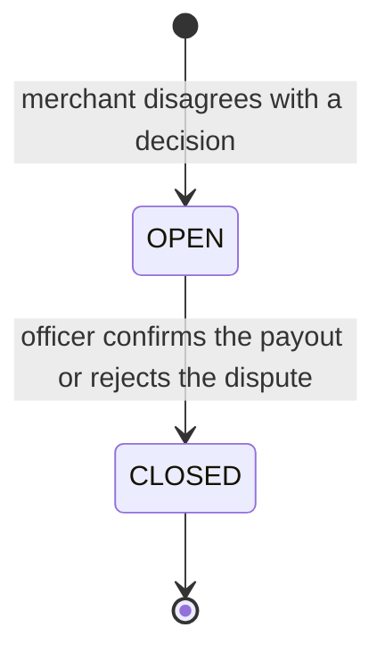
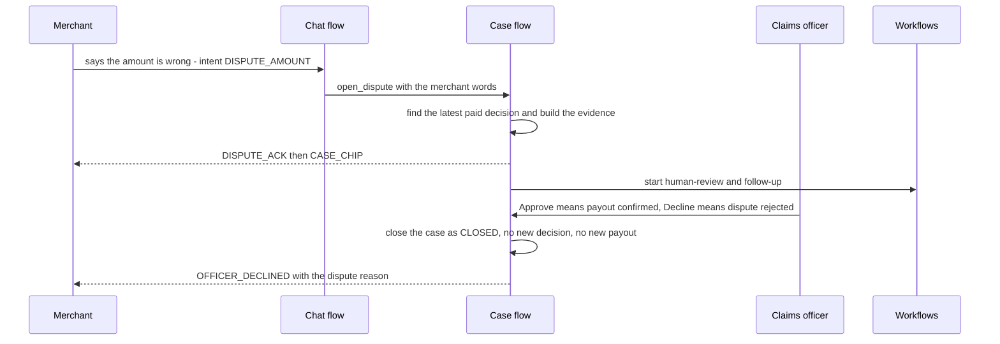
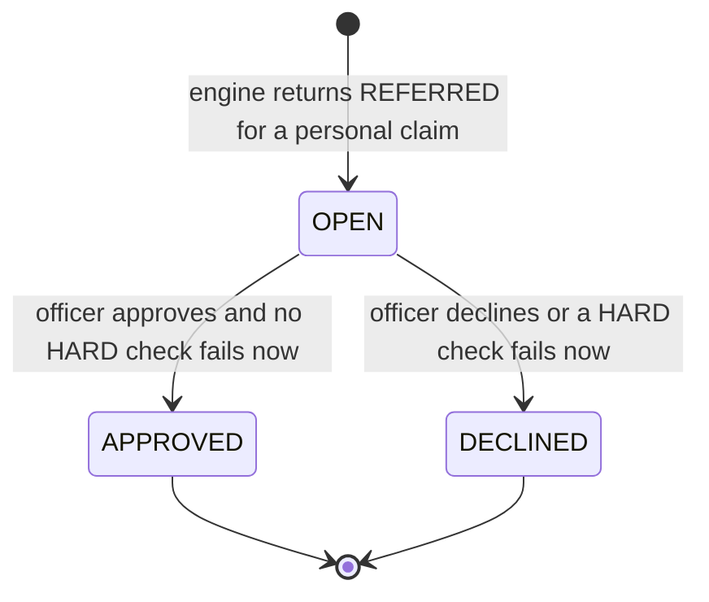
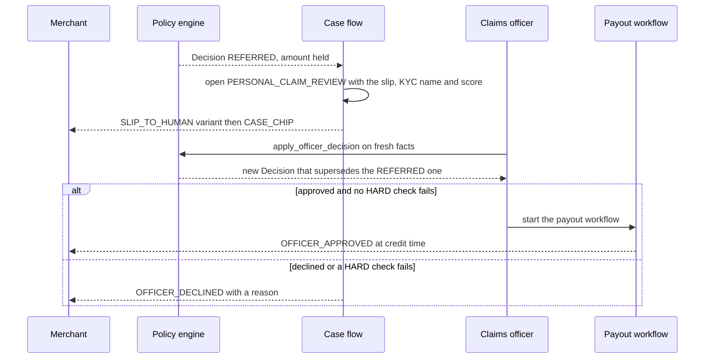
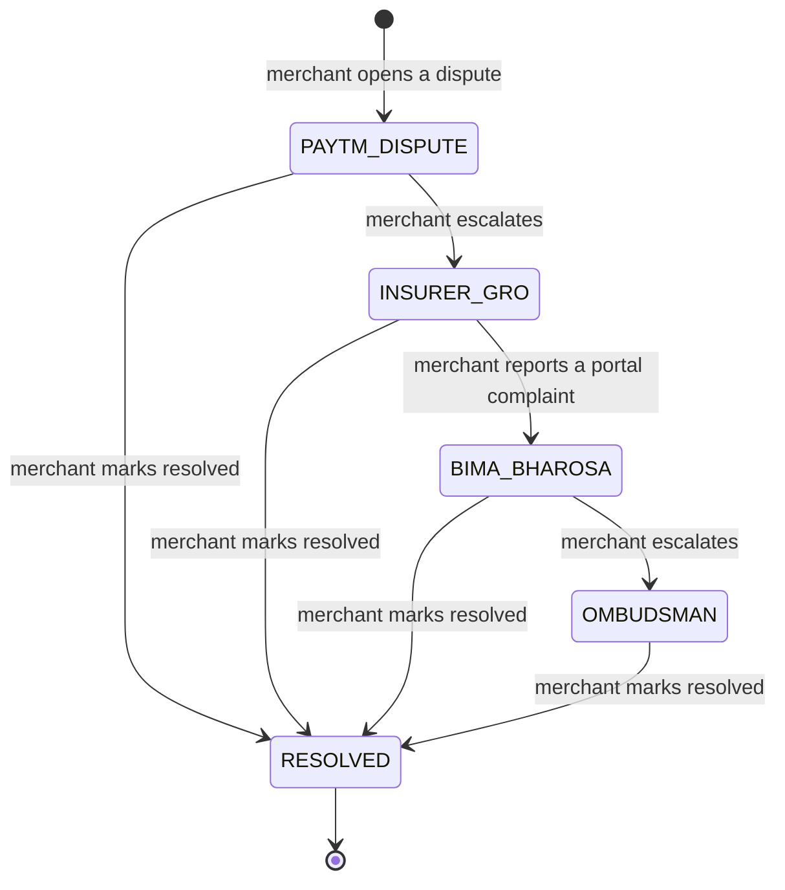

# Feature spec: Explanations, disputes and grievance (K5, N5, H22)

| | |
|---|---|
| Status | v1.4 · K5 BUILT (commit 86575ea) · N5 and H22 BUILT, wave 3 · dispute fixes BUILT, wave 1 |
| Owner | Omkar Kadam |
| Date | 2 Oct 2026 |
| Audience | Product, engineering, compliance, claims officers |
| Related | [fs-09 policy engine and audit](fs-09-policy-engine-and-audit.md) · [fs-03 EDI holiday](fs-03-edi-holiday.md) · [fs-08 claims officer console](fs-08-claims-officer-console.md) · [Policy wording and CIS](../policy-wording-and-cis.md) (C8, C9, C10) · [Regulatory and compliance](../../05-business/regulatory-and-compliance.md) (section 4) · [Facts and sources](../../01-strategy/facts-and-sources.md) · [Data model and API](../../04-engineering/data-model-and-api.md) · [User journeys](../user-journeys.md) · [Copy deck](../../03-design/copy-deck.md) · [Implementation guide](../../04-engineering/implementation-guide.md) · [ADR 0001](../../04-engineering/adr/0001-policy-engine-is-the-only-payout-authority.md) |

## TL;DR

- **K5 (BUILT):** a merchant can ask "why this amount" and gets the formula in Hindi or English from the decision record. No LLM writes a number.
- **Two flows, not one.** A **DISPUTE** is the merchant disagreeing with a decision: the officer answers, the amount never changes, and the case ends CLOSED. A **REFERRED review** is the engine unable to decide: the officer approves or declines, the engine re-runs every check, and an approval can pay. They are different case kinds with different logic (section 5).
- **N5 and H22 (BUILT, wave 3, flag `n5_grievances`):** a grievance ladder with response clocks and a respondent router that says who owns the complaint: Paytm, the insurer or the lender. Build-ready in sections 7 and 8.
- **Clocks only where a source exists.** Our own 24-hour answer time (OWN_SLA), and the 14 days the Bima Bharosa portal states (PORTAL_STATED). Every other time is shown as "to be confirmed" (TO_CONFIRM). No timeline is invented.
- **Evidence:** the receipt (`GET /api/decisions/{decision_id}/receipt`, BUILT wave 1, fs-09) is what a merchant attaches to any grievance.
- **Priority:** N5 and H22 are P0, wave 3, behind feature flags. The two dispute fixes in section 10 are wave 1.

IDs covered: **K5 · N5 · H22**. H22 builds on an idea from Praman. The tracker steps for the REFERRED and DISPUTE paths belong to the merchant app (H1, fs-04); this spec gives them their data.

## 1. Summary

K5 lets a merchant understand and question a decision. The explanation is a formula built from numbers the merchant can see (usual day, drop, cap). A dispute opens a case for a claims officer with a 24-hour answer time. The officer can confirm that the payout stands or reject the dispute. Nothing in the dispute path can change an amount, because only the policy engine decides money (fs-09).

N5 turns "what if I still disagree" into a visible ladder: our claims officer, the insurer's grievance officer, the IRDAI Bima Bharosa portal, and the Insurance Ombudsman. H22 adds the two things a merchant most needs at each rung: how long the stated response time is (and where that number comes from) and who owns this kind of complaint.

## 2. Status today and what changes

| What | Status | Where | Change |
|---|---|---|---|
| "Why this amount" in chat | BUILT | `conversation/replies.py`, `policy/explain.py`, keys `EXPLAIN_AREA`, `EXPLAIN_AREA_FORMULA`, `EXPLAIN_PERSONAL` | Receipt adds sources and a counterfactual (fs-09) |
| Dispute by chat (intent `DISPUTE_AMOUNT`, word list) opens a DISPUTE case | BUILT | `conversation/intents.py`, `replay/cases_flow.py` (`open_dispute`) | Fixes in section 10 |
| REFERRED review case (`PERSONAL_CLAIM_REVIEW`) | BUILT | `replay/cases_flow.py` (`open_review`) | None |
| Officer approve or decline | BUILT | `POST /api/cases/{case_id}/approve` and `/decline`, `replay/officer.py` | None |
| 24-hour clock and reminders | BUILT | `cases/service.py` (`due_by`), workflow `follow-up` (`check_case_sla`, `notify_officer`) | None |
| Dispute with no paid decision | BUILT but cannot be decided (API 409) | `replay/officer.py` | Fix, wave 1 |
| Receipt endpoint | BUILT, wave 1 | fs-09 section 10 | |
| Grievance ladder, clocks, router | BUILT, wave 3 | `cases/ladder.py`, `cases/grievances.py`, routes `GET` and `POST /api/merchants/{id}/grievances` | Sections 7 and 8 |

## 3. User stories and jobs to be done

| User | Job | Story |
|---|---|---|
| **Anil (merchant)** | Understand a payout | "Chhatri paid me ₹1,380. The card shows the formula and which numbers it used." |
| **Anil** | Disagree with a decision | "I think my loss was bigger. I say so in my own words. A claims officer answers within 24 hours." |
| **Anil** | Know where to go next | "If I am still not happy I see the next step, who answers it, and how long the portal says it takes." |
| **Ramesh (merchant)** | Complain about the right party | "My instalment was not paused. The app tells me that is the lender's decision and shows the lender's step, not the insurer's." |
| **Rajesh (claims officer)** | Answer a dispute | "I see the decision, its checks and formula, the day's hourly sales and the merchant's words. I confirm the payout or reject the dispute." |
| **Rajesh** | Decide a referred claim | "I see the slip, the KYC name and the failed check. I approve or decline. The engine re-checks everything first." |

## 4. Rules

From `backend/chhatri/policy/rules.yaml` (pilot-0.1) and the sources named in each row.

| Parameter | Value | Effect |
|---|---|---|
| `dispute_sla_hours` | 24 | Every case gets `due_by = opened_at + 24 hours`, for every case kind. This is our own answer time (OWN_SLA). |
| `payout_share`, `area.daily_cap_rupees`, `personal.daily_cap_rupees` | 0.50, 2500, 1500 | Used by the formulas in explanations. |
| Bima Bharosa portal, stated time | 14 days | The portal says complaints are attended within 14 days ([facts and sources](../../01-strategy/facts-and-sources.md), grievance ladder). Shown as the portal's own statement (PORTAL_STATED), not as a deadline we set. |
| Insurance Ombudsman | free to the policyholder | Insurance Ombudsman Rules, 2017 ([facts and sources](../../01-strategy/facts-and-sources.md)). No response time is stated there. |
| Insurer grievance officer response time | to be confirmed | [Regulatory and compliance](../../05-business/regulatory-and-compliance.md) section 4.2: to be confirmed with the insurer. |
| Lender grievance response time | to be confirmed | The RBI (Digital Lending) Directions, 2025 call for a grievance mechanism ([regulatory](../../05-business/regulatory-and-compliance.md) section 5.1). The time is to be confirmed with counsel and the lender. |

**Clock kinds** (used in section 8):

| Kind | Meaning | Shown as |
|---|---|---|
| `OWN_SLA` | A time Chhatri commits to in its own rules. | A countdown from the case opening, and "overdue" once it passes. |
| `PORTAL_STATED` | A time the responsible body publishes. | "The portal says complaints are attended within 14 days", with the day count from the date the merchant reports filing. |
| `TO_CONFIRM` | No sourced time yet. | "Response time to be confirmed with the insurer" (or lender, or Paytm). No countdown. |

## 5. Flows and states

### 5.1 DISPUTE flow (BUILT): the merchant disagrees, the amount never changes





Logic, as built:

1. The merchant's message matches the dispute word list (for example "wrong", "unfair", "disagree", "dispute", "complain", Hindi "गलत", "शिकायत"). This is `Intent.DISPUTE_AMOUNT`. The chat model never classifies it.
2. `open_dispute` takes the merchant's latest paid decision: the most recent APPROVED decision whose payout is CREDITED. It builds the evidence: expected against actual sales for each complete business hour of that decision's day, the merchant's words, and up to 5 similar past cases.
3. A case of kind `DISPUTE` opens, linked to that decision and claim, `due_by = opened_at + 24 hours`. The merchant gets `DISPUTE_ACK` and the case chip.
4. Workflows `human-review` (open the case, notify the officer) and `follow-up` (check the SLA at +24 hours, remind the officer if still OPEN) start.
5. The officer taps Approve (payout confirmed) or Decline (dispute rejected), with an optional note. The result is the same in both cases: the case is CLOSED, the resolution is the note or a default sentence ("Payout confirmed by a claims officer" or "Dispute declined by a claims officer"), and the disputed decision is returned unchanged. No new decision, no new payout, no change of amount.
6. The merchant gets `OFFICER_DECLINED` with a dispute reason, whichever button the officer pressed: `REASON_OFFICER_DISPUTE` for an area payout ("Your area's numbers support the amount paid.") or `REASON_OFFICER_DISPUTE_PERSONAL` for a personal payout ("The amount paid follows your policy's daily limit."). The officer's note is not sent to the merchant.

### 5.2 REFERRED review flow (BUILT): the engine could not decide





Logic, as built (details in fs-09 section 7.4):

1. A personal claim with any SOFT check FAIL or UNSURE (slip unreadable, name below 85, dates not covered, more than 3 days) is REFERRED. Name mismatch is SOFT: it refers, it never declines. An area claim has no SOFT check, so it is never REFERRED.
2. The REFERRED decision keeps the amount it would pay. No money moves.
3. A `PERSONAL_CLAIM_REVIEW` case opens with the evidence: expected against actual sales of the first silent day, the silent days, the slip (image link, patient name, dates, hospital, confidence), the KYC name and the name score (when the slip name is in Latin script), and past similar cases.
4. The merchant gets the `SLIP_TO_HUMAN` variant for the most basic SOFT issue (unreadable first, then name, dates, days) and the case chip.
5. The officer approves: the engine re-runs every check on fresh facts. Any HARD fail gives DECLINED. Otherwise APPROVED, each SOFT issue is `WAIVED_BY_OFFICER`, the case is APPROVED and the payout workflow starts.
6. The officer declines: DECLINED, amount 0, the note is the stored reason. The merchant gets `OFFICER_DECLINED` with the key from the failed HARD check if there is one, else `REASON_OFFICER_PERSONAL` ("After checking the slip, this claim can't be paid.").
7. The officer cannot change the amount. The merchant never sees the officer's note.

### 5.3 The two flows side by side

| | DISPUTE | REFERRED review |
|---|---|---|
| Starts when | the merchant disagrees with a decision | the engine returns REFERRED |
| Case kind | `DISPUTE` | `PERSONAL_CLAIM_REVIEW` |
| Linked decision | the disputed one (paid) | the REFERRED one |
| Officer buttons mean | Approve = payout confirmed, Decline = dispute rejected | Approve = pay (after a re-run), Decline = do not pay |
| Engine re-run | no | yes, every check on fresh facts |
| Money moves | never | an approval pays the held amount, a decline pays nothing |
| Case ends as | `CLOSED` | `APPROVED` or `DECLINED` |
| New decision | none | yes, `decided_by = officer:officer`, `supersedes` set |
| Merchant message | `OFFICER_DECLINED` with `REASON_OFFICER_DISPUTE` or `_PERSONAL` | `OFFICER_APPROVED` or `OFFICER_DECLINED` with a reason |
| Audit | `case.open`, `case.resolve` | `decision.personal`, `case.open`, `decision.officer`, `case.resolve` |

### 5.4 Grievance ladder (BUILT, wave 3)

Each respondent has its own ladder. A step id is a stable string used in the API and in the receipt.

| Ladder | Steps (in order) |
|---|---|
| Insurer (claim decisions) | `PAYTM_DISPUTE` then `INSURER_GRO` then `BIMA_BHAROSA` then `OMBUDSMAN` |
| Lender (instalment holiday) | `LENDER_GRIEVANCE` |
| Paytm (payments, app, data) | `PAYTM_SUPPORT` |



`PAYTM_DISPUTE` is the DISPUTE flow of section 5.1. The other steps are outside the Chhatri console: Chhatri forwards or guides and tracks what the merchant did and the stated clocks. It receives no reply from the insurer, IRDAI or the Ombudsman in the hackathon build.

## 6. Inputs and data sources

| Input | Source | Mode today |
|---|---|---|
| Merchant message and intent | the chat flow (word-list intents; the chat model sees only UNKNOWN text) | SIMULATED channel |
| Decision, checks, formula | policy engine, `GET /api/decisions/{decision_id}` and the receipt | BUILT |
| Case, evidence, clock | `cases/service.py`, `replay/evidence.py` | BUILT |
| Officer identity | one shared officer bearer token. `GET /api/session` hands it to the console in the demo. The audit actor is `officer:officer` | SIMULATED |
| Ladder steps and clock sources | static table in `cases/ladder.py`, values from section 4 | BUILT |
| Lender decision (for `EDI_HOLIDAY` complaints) | fs-03, simulated lender | SIMULATED |

## 7. Decision logic and checks

### 7.1 Respondent router (H22, BUILT)

The router is a fixed lookup table in code. It is not a model. The merchant picks a topic chip. Ask Chhatri (N2) may suggest a chip from a closed word list, and the merchant confirms it. The router then maps the topic to a respondent and a ladder.

| Topic | Respondent | Ladder and first step | Why |
|---|---|---|---|
| `PAYOUT_AMOUNT` | Insurer | insurer, `PAYTM_DISPUTE` | The amount comes from the insurer's pilot rules. |
| `CLAIM_DECLINED` | Insurer | insurer, `PAYTM_DISPUTE` | Same. |
| `CLAIM_SLOW` | Insurer | insurer, `PAYTM_DISPUTE` on the existing review case (no new case) | A referred claim is already with a claims officer. |
| `EDI_HOLIDAY` | Lender | lender, `LENDER_GRIEVANCE` | The lender decides the holiday (fs-03). |
| `PAYMENT_NOT_RECEIVED` | Paytm | Paytm, `PAYTM_SUPPORT` | Settlement is Paytm's. |
| `PREMIUM_CHARGE` | Paytm | Paytm, `PAYTM_SUPPORT` | Paytm collects the premium. |
| `DATA_OR_CONSENT` | Paytm | Paytm, `PAYTM_SUPPORT` | Data and consent (fs-07). |
| `APP_ISSUE` | Paytm | Paytm, `PAYTM_SUPPORT` | The app is Paytm's. |
| `OTHER` | Paytm | Paytm, `PAYTM_SUPPORT` | Triage. Questions about the policy terms are answered by Ask Chhatri with clause citations (fs-05). |

The roles are the working assumption for the hackathon. The real split depends on the partner insurer and lender agreements, and is to be confirmed.

### 7.2 Response clocks per step

| Step | Who answers | Clock | Value | Source |
|---|---|---|---|---|
| `PAYTM_DISPUTE` | the insurer's claims officer, in the Chhatri console | `OWN_SLA` | 24 hours from case `opened_at`; stops when the case resolves | `rules.yaml` `dispute_sla_hours`; policy wording C9 |
| `INSURER_GRO` | the insurer's grievance redressal officer | `TO_CONFIRM` | none shown | regulatory section 4.2 |
| `BIMA_BHAROSA` | IRDAI, through its portal | `PORTAL_STATED` | the portal says complaints are attended within 14 days; counted from the date the merchant reports filing | facts and sources, grievance ladder |
| `OMBUDSMAN` | the Insurance Ombudsman | `TO_CONFIRM` | none shown | facts and sources (free to the policyholder; no time stated) |
| `LENDER_GRIEVANCE` | the lender's grievance officer | `TO_CONFIRM` | none shown | regulatory section 5.1 |
| `PAYTM_SUPPORT` | Paytm support | `TO_CONFIRM` | none shown | to confirm with Paytm |

Clock state is computed when the grievance is read, from the entry time and the current time (the replay clock in the demo). No scheduler job is needed. A `PORTAL_STATED` clock past 14 days reads "The portal's stated 14 days have passed", never "the portal is late".

### 7.3 Escalation rule

Escalation is never blocked by Chhatri. A merchant can move to the next step of the ladder at any time: after an answer they disagree with, after a stated clock has passed, or earlier. The tracker shows each step's own conditions as "to be confirmed" where no source exists. Escalating to `BIMA_BHAROSA` or `OMBUDSMAN` is self-reported: Chhatri cannot file on the merchant's behalf, so the app shows how to file and records the date the merchant says they filed.

## 8. N5 and H22 build spec (BUILT, wave 3)

### 8.1 Data

New id prefix `GR` in `ids.py` (`GR-000001`). New frozen model `Grievance` in the store (in memory per scenario load, like cases).

| Field | Meaning |
|---|---|
| `id` | `GR-000001` |
| `merchant_id`, `decision_id` (nullable), `case_id` (nullable) | `case_id` is the DISPUTE case opened at `PAYTM_DISPUTE` |
| `kind` | `DISPUTE` (about a Chhatri decision) or `COMPLAINT` (anything else) |
| `topic`, `respondent` | topic from the closed list in 7.1; respondent `PAYTM`, `INSURER` or `LENDER` |
| `text`, `lang` | the merchant's words (at most 500 characters), language code |
| `status` | `OPEN` or `RESOLVED` |
| `current_step` | a step id |
| `steps[]` | `id`, `level`, `name`, `responder`, `state` (`NOT_STARTED`, `ACTIVE`, `DONE`), `delivery`, `entered_at`, `clock`, `outcome` |

`delivery` says how the step reaches its responder: `IN_CHHATRI` (the claims officer in the console), `SIMULATED` (forwarded to an insurer, lender or Paytm desk that is simulated in the demo) or `SELF_REPORTED` (Bima Bharosa and the Ombudsman: the merchant files and tells us the date).

### 8.2 API (paths from the registry; shapes extend data-model section 5.4)

`GET /api/merchants/{id}/grievances` returns the merchant's grievances, newest first.

```json
{
  "ok": true,
  "data": [
    {
      "grievance_id": "GR-000001",
      "kind": "DISPUTE",
      "topic": "PAYOUT_AMOUNT",
      "respondent": "INSURER",
      "decision_id": "D-000142",
      "case_id": "C-2291",
      "status": "OPEN",
      "opened_at": "2025-08-19T17:12:00+05:30",
      "current_step": "PAYTM_DISPUTE",
      "ladder_steps": [
        {"level": 1, "id": "PAYTM_DISPUTE", "name": "Our claims officer", "state": "ACTIVE", "delivery": "IN_CHHATRI",
         "entered_at": "2025-08-19T17:12:00+05:30",
         "clock": {"kind": "OWN_SLA", "hours": 24, "due_by": "2025-08-20T17:12:00+05:30", "state": "RUNNING"}},
        {"level": 2, "id": "INSURER_GRO", "name": "The insurer's grievance officer", "state": "NOT_STARTED", "delivery": "SIMULATED",
         "clock": {"kind": "TO_CONFIRM", "note_en": "Response time to be confirmed with the insurer"}},
        {"level": 3, "id": "BIMA_BHAROSA", "name": "IRDAI Bima Bharosa portal", "state": "NOT_STARTED", "delivery": "SELF_REPORTED",
         "clock": {"kind": "PORTAL_STATED", "days": 14, "started_at": null,
                   "statement_en": "The portal says complaints are attended within 14 days"}},
        {"level": 4, "id": "OMBUDSMAN", "name": "Insurance Ombudsman", "state": "NOT_STARTED", "delivery": "SELF_REPORTED",
         "clock": {"kind": "TO_CONFIRM", "note_en": "No response time is stated. The service is free to the policyholder"}}
      ],
      "next_action": {"id": "ESCALATE_TO_INSURER_GRO", "label_en": "Send this to the insurer's grievance officer"}
    }
  ]
}
```

`POST /api/merchants/{id}/grievances` takes an `action`:

| `action` | Body | Result |
|---|---|---|
| `OPEN` | `topic`, `text`, `lang`, optional `decision_id` | The router picks respondent and ladder. `PAYOUT_AMOUNT` and `CLAIM_DECLINED` open the DISPUTE case at `PAYTM_DISPUTE`, the same call as the chat path, and send `DISPUTE_ACK` and the case chip to the chat. `decision_id` defaults to the latest paid decision (`PAYOUT_AMOUNT`) or the latest DECLINED one (`CLAIM_DECLINED`); with neither the call is 422. `CLAIM_SLOW` opens no new case: it links the merchant's open review case and uses that case's `due_by`, or is 422 if there is none. Returns the grievance with HTTP 201. |
| `ESCALATE` | `grievance_id`, `escalate_from` (must equal `current_step`), optional `filed_on` (date) for `BIMA_BHAROSA` and `OMBUDSMAN` | Moves to the next step, sets `entered_at` (the merchant's `filed_on`, else now), starts that step's clock. |
| `RESOLVE` | `grievance_id` | Sets `status = RESOLVED`. |

Rules: a second `OPEN` for the same merchant, decision and topic while one is OPEN returns the existing grievance with HTTP 200, so a double tap makes no second case. An unknown merchant is a clean 404 (X5). A topic outside the list or text over 500 characters is 422. An `ESCALATE` whose `escalate_from` is not the current step, or from the last step, is 409. Same envelope as the rest of the API: `{ok, data}` or `{ok: false, error}`. The `delivery` field on each step tells the app which steps are simulated.

### 8.3 What the merchant sees at each step (tracker)

English wording below is proposed. Hindi and Marathi go in the [copy deck](../../03-design/copy-deck.md) and are reviewed by a native speaker. Every state ends in a next step (H21).

| State | Proposed text | Next step offered |
|---|---|---|
| `PAYTM_DISPUTE` active, clock running | "Our claims officer is looking at this. Answer due in {time left}." | The next step appears once the case is answered or overdue. |
| `PAYTM_DISPUTE` answered | "Answered: the decision stands. You can read the numbers again in your receipt." | "Not happy? Send this to the insurer's grievance officer" or "Mark as solved" |
| `PAYTM_DISPUTE` past 24 hours, still open | "This is past our 24-hour answer time." | The escalate button |
| `INSURER_GRO` active | "Sent to the insurer's grievance officer (simulated in this demo). Response time to be confirmed with the insurer." | "Complain on the Bima Bharosa portal" and "Mark as solved" |
| `BIMA_BHAROSA` active | "You filed on {date}. The portal says complaints are attended within 14 days. Day {n} of 14." | "Approach the Insurance Ombudsman" and "Mark as solved" |
| `BIMA_BHAROSA` past 14 days | "The portal's stated 14 days have passed." | "Approach the Insurance Ombudsman" |
| `OMBUDSMAN` active | "The Insurance Ombudsman service is free. No response time is stated." | "Mark as solved" |
| `LENDER_GRIEVANCE` active | "This is the lender's decision. Your request and the lender's answer are in your receipt. Response time to be confirmed with the lender." | "Mark as solved" |
| `PAYTM_SUPPORT` active | "With Paytm support. Response time to be confirmed." | "Mark as solved" |

Contact details for the insurer, lender and Paytm are not invented. The demo shows a clearly marked placeholder, and the real details come from the partners at pilot time. The Bima Bharosa step shows the portal address from the [regulatory document](../../05-business/regulatory-and-compliance.md) and what to bring: the decision id and the case number.

### 8.4 Evidence attached to an escalation

Escalating attaches the decision receipt (fs-09). The `grievance.escalate` audit entry stores `decision_id` and the receipt's audit sequence number, so a reviewer can find the decision entry and run `GET /api/audit/verify`.

### 8.5 Audit events (BUILT)

| Action | Actor | Subject | Data |
|---|---|---|---|
| `grievance.open` | `merchant:<id>` | grievance | topic, respondent, decision id, case id, first step. Not the merchant's text. |
| `grievance.escalate` | `merchant:<id>` | grievance | from, to, `filed_on`, clock kind, receipt audit sequence |
| `grievance.resolve` | `merchant:<id>` | grievance | step at which it was resolved |

### 8.6 Mock parity

`frontend/src/mock` serves the same two routes and the router table, so the static demo (N7) shows the ladder with no backend. The mock states plainly that nothing is sent to an insurer.

## 9. Merchant-facing copy

All text about money or eligibility comes from the catalogue in `backend/chhatri/conversation/messages.py`. Existing strings (exact):

| Key | Hindi | English |
|---|---|---|
| `EXPLAIN_AREA` | `आपका आम {weekday_hi}: {expected}। आज आपके इलाके की बिक्री {drop}% गिरी। छतरी खोई हुई बिक्री का आधा देती है।` | `Your usual {weekday_en}: {expected}. Your area fell {drop}%. Chhatri pays half the lost sales.` |
| `EXPLAIN_AREA_FORMULA` | `आपके भुगतान का हिसाब: {formula_hi}` | `How your payout was worked out: {formula_en}` |
| `EXPLAIN_PERSONAL` | `आपके दावे का हिसाब: {formula_hi}` | `How your claim was worked out: {formula_en}` |
| `DISPUTE_ACK` | `ठीक है, मैं इसे हमारी टीम को भेज रहा हूँ। 24 घंटे में जवाब मिलेगा।` | `Okay, I'm sending this to our team. You'll hear back within 24 hours.` |
| `CASE_CHIP` | (English only) | `Sent to a claims officer · case {case_id}` |
| `SLIP_TO_HUMAN` | `धन्यवाद। पर्ची पर नाम आपके KYC से मेल नहीं खा रहा, इसलिए हमारी टीम इसे देखेगी। 24 घंटे में जवाब मिलेगा।` | `Thank you. The name on the slip doesn't match your KYC, so our team will check it. You'll hear back within 24 hours.` |
| `SLIP_TO_HUMAN_DATES`, `_UNREADABLE`, `_DAYS` | same tail | dates not matching, slip not readable, more days than paid automatically |
| `OFFICER_APPROVED` | `{name_hi} जी, हमारी टीम ने आपका दावा मंज़ूर किया। {amount} जमा।` | `{name_en} ji, our team approved your claim. {amount} credited.` |
| `OFFICER_DECLINED` | `{name_hi} जी, हमारी टीम ने आपका दावा देखा। {reason_hi}` | `{name_en} ji, our team reviewed your claim. {reason_en}` |
| `REASON_OFFICER_DISPUTE` | `आपके इलाके के आँकड़ों के हिसाब से भुगतान सही था।` | `Your area's numbers support the amount paid.` |
| `REASON_OFFICER_DISPUTE_PERSONAL` | `आपकी पॉलिसी की रोज़ की सीमा के हिसाब से भुगतान सही था।` | `The amount paid follows your policy's daily limit.` |
| `REASON_OFFICER_PERSONAL` | `पर्ची की जाँच के बाद यह दावा मंज़ूर नहीं हो सका।` | `After checking the slip, this claim can't be paid.` |

Plus one `REASON_<CHECK>` per HARD check (fs-09 section 11).

**Proposed, not in the catalogue yet** (needs a coordinated change of `messages.py`, SPEC section 13.4 and the tests; none of these is pinned by DEMO.md):

| Key (proposed) | English (proposed) | Used for |
|---|---|---|
| `DISPUTE_NO_PAYOUT` | "Our team looked at your question. No payout has been made on your account yet, so there is no amount to change. Your claim tracker shows why." | A dispute where the merchant has no decision to dispute (section 10) |
| `DISPUTE_ALREADY_OPEN` | "Your question is already with our team. See case {case_id}." | A second dispute while a case is open (section 10) |

Hindi for both is to be written in the copy deck and reviewed by a native speaker.

## 10. Edge cases, failure modes and fixes

| Case | Behaviour at commit 86575ea | Fix (BUILT in wave 1 where one is named) |
|---|---|---|
| Merchant disputes and has **no paid decision** | A case opens with no decision (summary "disputes a payout amount; no paid claim on record"). The officer cannot decide it: API 409 ("case has no decision to review"). The case stays OPEN. | Wave 1. If there is no decision at all, do not open a case: reply with `DISPUTE_NO_PAYOUT` and the counterfactual (fs-09). If the latest decision is DECLINED or REFERRED, link the dispute to it. An officer can always close a DISPUTE with a note. |
| Merchant disputes a **DECLINED** decision | `open_dispute` only looks at the latest paid decision, so the dispute attaches to an older payout (or none). `dispute_reason_key` would also fail on a declined decision, which has no explanation. | Wave 1. In the tracker the Dispute button carries the `decision_id`. In chat the target is the latest final decision (APPROVED and credited, or DECLINED). `dispute_reason_key` gets a DECLINED branch that reuses the `REASON_<CHECK>` text. |
| Merchant disputes while a case for that decision is open | A second case opens. | Wave 1. Return the open case with `DISPUTE_ALREADY_OPEN`. The same rule is in 8.2 for `POST`. |
| Dispute opened long after the payout | Allowed. `due_by` is always 24 hours from the opening, so a dispute is never "already overdue" when it opens. | None. A time limit for filing is a policy decision (open question 4). |
| Officer approves a REFERRED claim but a HARD check now fails | DECLINED, case DECLINED, `OFFICER_DECLINED` names that check's reason. | None |
| Officer approves, name score still below 85 | The SOFT check is waived and the claim is APPROVED. It is not REFERRED again. | None |
| Slip reader fails | The slip counts as confidence 0, `SLIP_READABLE` fails (SOFT), REFERRED with `SLIP_TO_HUMAN_UNREADABLE`. | None |
| Officer action with a missing token | 401. A wrong token gives 403. | None |
| Officer acts on a case that is not OPEN, or on a REFERRED decision that is already resolved | `ValueError`, API 409 | None |
| Dispute answered "payout stands" but the engine was wrong | No path: the dispute cannot change an amount. Policy wording C9 says "If we made a mistake, we send you the extra money", which the prototype cannot do. | Open question 1. |

## 11. Guardrails, privacy and compliance notes

**AI guardrails.** No LLM generates a payout amount, an explanation number, a counterfactual or a respondent. Numbers come from the decision record. The conversation guard (`conversation/guard.py`) blocks unsupported money figures and promises in merchant replies.

**Officer access (decision for the hackathon).** The demo console reads the officer token from `GET /api/session` and sends it as a bearer token. Real officer login is outside the hackathon scope and is a pilot requirement. A missing header is 401, a wrong token is 403. The audit actor is the fixed value `officer:officer`, so audit entries do not say which person acted.

**Privacy (DPDP, to be confirmed with the insurer).**
- Case evidence can include slip fields (patient name, dates, hospital) and the slip image. Masking it for officers and deleting it on request are N6 work (fs-07).
- The officer's note is internal. It goes to the audit log and the case resolution, not to the merchant.
- The grievance text is the merchant's own words. It is stored with the grievance, not copied into the audit entry.

**Compliance.**
- The 24-hour answer time is Chhatri's own commitment in `rules.yaml`.
- The ladder (insurer grievance officer, IRDAI Bima Bharosa, Insurance Ombudsman) follows [facts and sources](../../01-strategy/facts-and-sources.md). The only response time quoted from a body is the portal's own statement of 14 days. Everything else is to be confirmed with the partner insurer, the lender and counsel.
- Whether a pre-agreed instalment holiday counts as a restructuring is for the lender's compliance team (fs-03).

## 12. Acceptance criteria

| Given | When | Then | Audit |
|---|---|---|---|
| Anil was paid ₹1,380 (decision D-000142) | He asks why | He gets `EXPLAIN_AREA` and the formula `½ × ₹4,380 × 63% = ₹1,380` (Hindi `₹4,380 का 63% = ₹2,759.40; उसका आधा = ₹1,380`) | none |
| The same | He says the amount is wrong | A DISPUTE case opens (first case C-2291) with `due_by` 24 hours later, linked to D-000142. He gets `DISPUTE_ACK` and `Sent to a claims officer · case C-2291`. | `case.open` |
| That case is OPEN | The officer taps Approve (or Decline) | The case is CLOSED, no new decision, the payout is unchanged, and Anil gets `OFFICER_DECLINED` with "Your area's numbers support the amount paid." | `case.resolve` |
| A slip names "Sunil Pawar", KYC is "ANIL RAMESH JADHAV" | The claim is decided | REFERRED (`NAME_MATCHES_KYC` score 28, SOFT), ₹1,500 held, case C-2291 of kind `PERSONAL_CLAIM_REVIEW`, merchant gets `SLIP_TO_HUMAN` and the chip | `decision.personal`, `case.open` |
| That case is OPEN | The officer taps Approve | All checks re-run, all HARD pass, a new APPROVED decision supersedes the REFERRED one, the case is APPROVED, the payout credits 4 minutes later and Anil gets `OFFICER_APPROVED` | `decision.officer`, `case.resolve`, `payout.execute`, `payout.credit` |
| The same | The officer taps Decline | DECLINED, Anil gets `OFFICER_DECLINED` with "After checking the slip, this claim can't be paid." | `decision.officer`, `case.resolve` |
| a merchant with no decision says "wrong" | The dispute is sent | No case opens. The reply is `DISPUTE_NO_PAYOUT`. | none |
| topic `PAYOUT_AMOUNT` with D-000142 | `POST` with `action: OPEN` | Grievance `GR-000001`, respondent INSURER, DISPUTE case at `PAYTM_DISPUTE`, clock `OWN_SLA` 24 hours | `grievance.open`, `case.open` |
| topic `EDI_HOLIDAY` | `POST` with `action: OPEN` | Respondent LENDER, ladder `LENDER_GRIEVANCE`, no case, clock `TO_CONFIRM` | `grievance.open` |
| current step `PAYTM_DISPUTE` | `ESCALATE` with `escalate_from: PAYTM_DISPUTE` | Current step `INSURER_GRO`, clock `TO_CONFIRM`, the receipt sequence stored | `grievance.escalate` |
| current step `INSURER_GRO` | `ESCALATE` with `filed_on` | Current step `BIMA_BHAROSA`, clock `PORTAL_STATED` counting from `filed_on` | `grievance.escalate` |
| `filed_on` is 15 days before now | The grievance is read | The clock reads "The portal's stated 14 days have passed." | none |
| `escalate_from` is not the current step | `ESCALATE` | 409 | none |

## 13. Telemetry and audit events

Written today (real names): `case.open` (kind, merchant, claim, decision, `due_by`), `case.resolve` (status, resolution, `within_sla`), `case.officer_notified`, `case.sla_checked` (`breached`), `case.officer_reminded`, `decision.officer`. PLANNED: `grievance.open`, `grievance.escalate`, `grievance.resolve` (section 8.5).

Dispute rate, officer resolution time against 24 hours, and the share of grievances escalated can be derived from these entries. Nothing computes them yet, and the ops strip in fs-08 lists only what it shows.

## 14. Build plan

All P0. Owners: Omkar (merchant app, copy, console labels), Ujjwal (backend).

| Task | Owner | Wave |
|---|---|---|
| Dispute target fix, `DISPUTE_NO_PAYOUT`, `DISPUTE_ALREADY_OPEN`, `dispute_reason_key` DECLINED branch, officer can close a no-decision dispute | Ujjwal | 1 |
| Tracker data for the REFERRED and DISPUTE paths (with fs-04) | Omkar | 1 |
| Receipt endpoint (fs-09) | Ujjwal | 1 |
| Console labels for DISPUTE cases: Confirm payout, Reject dispute (fs-08) | Omkar | 4 |
| `cases/ladder.py` (steps, clocks, sources), `Grievance` model and store, `GR` ids | Ujjwal | 3 |
| Respondent router and the two routes with validation and audit | Ujjwal | 3 |
| Tracker and help screen for the ladder, mock routes, Hindi and Marathi copy | Omkar | 3 |

## 15. Test plan

### Existing tests (BUILT)

- `backend/tests/replay/test_dispute_cover.py`: `test_explained_numbers_then_a_dispute_case_c_2291`, `test_a_dispute_without_a_paid_claim_cannot_be_decided`, `test_only_referred_personal_claims_get_an_officer_decision`.
- `backend/tests/replay/test_personal.py`: `test_a_mismatched_name_goes_to_a_human_with_the_evidence`, `test_the_officer_approves_and_the_money_follows_the_payout_workflow`, `test_the_officer_declines_and_the_merchant_is_told_at_once`, `test_officer_input_is_validated`, `test_follow_up_steps_check_the_sla_and_remind_the_officer`.
- `backend/tests/conversation/test_notifications.py`: `test_officer_decline_tells_the_reason_with_the_case`, `test_officer_decline_forced_by_a_hard_check_names_it`, `test_closed_area_dispute_is_answered_with_the_area_numbers`, `test_closed_personal_dispute_is_answered_with_the_daily_limit`, `test_dispute_answer_validation`.
- `backend/tests/conversation/test_reasons.py`: `test_dispute_reason_follows_what_was_disputed`, `test_every_hard_check_has_a_merchant_reason`, `test_slip_to_human_variant_priority`.
- `backend/tests/cases/test_service.py`: `test_first_case_is_c2291_with_sla`, `test_personal_review_requires_referred_decision`, `test_resolve`, `test_resolution_after_sla_flagged`.
- `backend/tests/api/test_cases_records.py`: `test_officer_approves_in_one_tap`, `test_officer_declines_without_a_note`, `test_officer_action_errors`.
- `backend/tests/policy/test_explain.py` (formulas).

### New tests (PLANNED)

| Test | File | What it checks |
|---|---|---|
| `test_dispute_with_no_decision_opens_no_case` | `backend/tests/replay/test_dispute_cover.py` | Reply is `DISPUTE_NO_PAYOUT`. |
| `test_dispute_targets_a_declined_decision` | same | The case links the DECLINED decision and the answer uses its `REASON_<CHECK>` text. |
| `test_second_dispute_returns_the_open_case` | same | One open case per decision. |
| `test_dispute_never_changes_the_amount` | same | Confirm and reject both close the case with the decision and payout unchanged. |
| `test_router_table` | `backend/tests/cases/test_grievances.py` | Every topic maps to the respondent in 7.1. |
| `test_clock_kinds_and_sources` | same | Each step has the clock kind of 7.2. Only `OWN_SLA` and `PORTAL_STATED` carry a number. |
| `test_portal_clock_counts_from_filed_on` | same | Day count and the "stated 14 days have passed" state. |
| `test_open_is_idempotent_and_validated` | `backend/tests/api/test_grievances.py` | 201, then 200 with the same id, 404, 422, 409. |
| `test_escalate_requires_the_current_step` | same | 409 otherwise. |
| `test_grievance_audit_has_no_merchant_text` | same | The audit entries hold ids and steps only. |
| Mock routes | `frontend/src/mock/routes.test.ts` | The static demo serves the same shapes. |

### Manual check (DEMO.md, illness_mismatch)

Send the sample slip (patient "Sunil Pawar"). The decision is REFERRED, case C-2291 opens, the officer taps Approve and the claim is paid at credit time.

## Open questions

1. **Correction payouts.** Policy wording C9 says that if we made a mistake we send the extra money, but a dispute cannot change an amount. Options: a corrected claim re-run by the engine after the hackathon, or softer wording in C9. Owner: Omkar Kadam with Ujjwal Pardeshi.
2. **Insurer reply channel.** Chhatri has no callback from the insurer, IRDAI or the Ombudsman. Is a reply feed wanted at pilot, or is a merchant-reported "answered" enough? Owner: Omkar Kadam.
3. **Who owns what.** The router assumes the insurer owns claim decisions, Paytm owns payments and the app, and the lender owns the holiday. The partners must confirm. Owner: Omkar Kadam.
4. **Time limit for filing a dispute.** None today. The policy wording lists a 30-day limit only as a proposed addition (C7, item 9). Owner: Omkar Kadam.
5. **Officer identity.** One shared token means the audit log cannot name the person. Per-officer login is a pilot requirement. Owner: Ujjwal Pardeshi.

## Changelog

- 2026-10-02 · v1.4 · split DISPUTE and REFERRED into two flows with their own diagrams and logic; N5 and H22 made build-ready (ladder, clock kinds, respondent router, API shapes, audit, tests); regulatory timings limited to sourced figures; name mismatch is SOFT; officer token decision recorded; dispute fixes added; build waves replace P1
- 2026-10-02 · v1.3 · final consistency pass against the code: clarified dispute vs REFERRED case decision logic; officer cannot change dispute amount
- 2026-10-02 · v1.2 · logic and truth audit fixes
- 2026-10-02 · v1.1 · fact-check pass: renamed mermaid participant `Off` → `Officer` (keyword issue); corrected open question 3 GRO SLA reference to avoid unverified durations; linked to facts-and-sources.md for Bima Bharosa timeline; replaced an internal reference with facts-and-sources.md.
- 2026-10-02 · v1 · first draft
