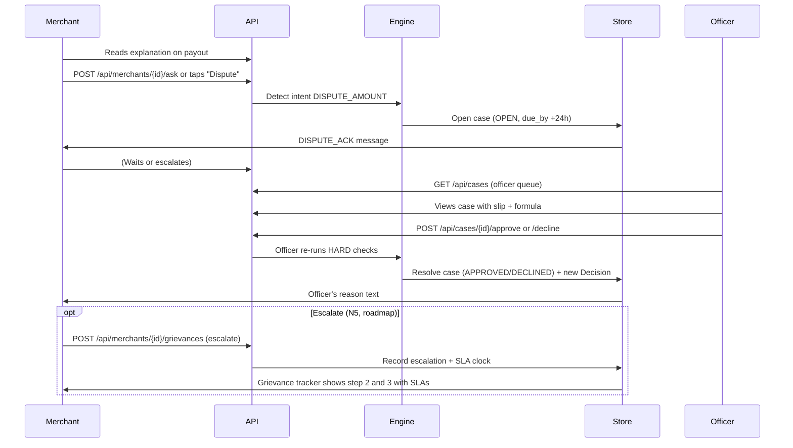
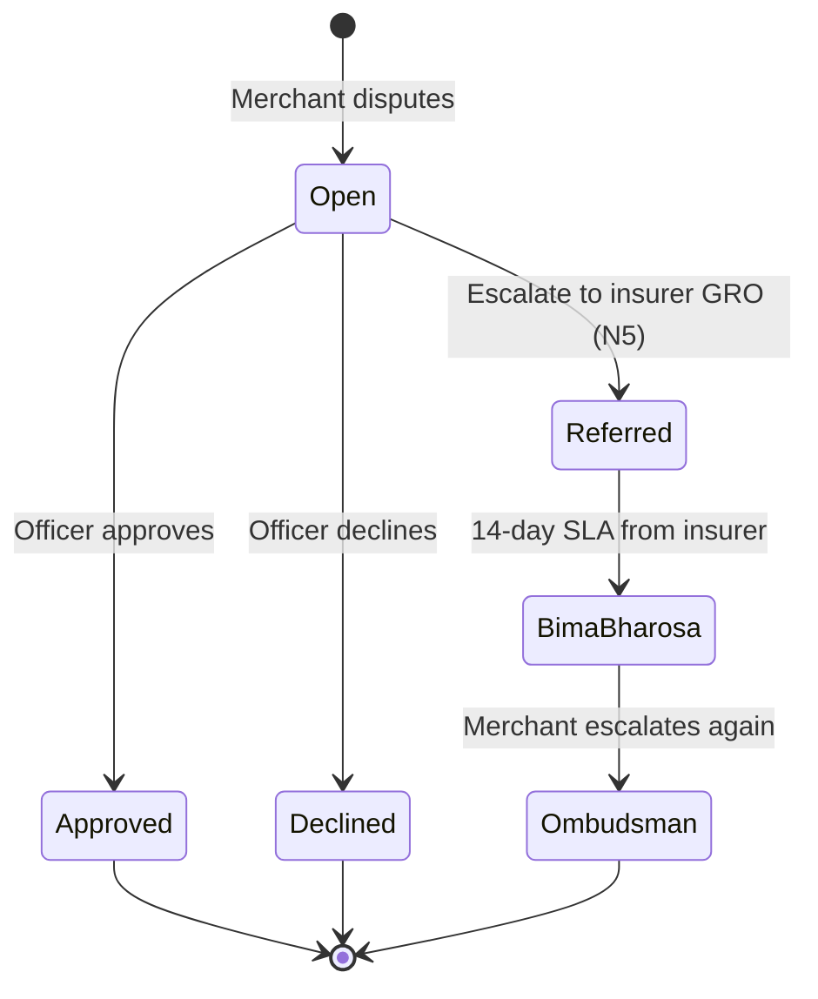

# Explanations, Disputes and Grievance

| | |
|---|---|
| Status | Draft v1 · 2 Oct 2026 |
| Owner | Omkar Kadam |
| Audience | Product, engineering, compliance |
| Related | [facts-and-sources.md](../../01-strategy/facts-and-sources.md) · [user-journeys.md](../user-journeys.md) · [policy-wording-and-cis.md](../policy-wording-and-cis.md) · [ADR 0001](../../04-engineering/adr/0001-policy-engine-is-the-only-payout-authority.md) |

## TL;DR

- Every payout shows a "why this amount" explanation card citing the rule, numbers and sources; reproducible from the facts shown.
- Disputes open a case with the claims officer and a 24 h SLA; the officer sees the merchant's claim and the decision's formula.
- Grievances follow a three-step ladder: the insurer's GRO → IRDAI Bima Bharosa → Insurance Ombudsman, each with an SLA clock shown in the tracker.
- The lender is respondent for EDI-holiday queries; the insurer for claims; Paytm for payment issues.
- All copy in merchant-facing templates is reproducible from the decision facts; no free-generated numbers.

## 1. Summary

K5 ensures a merchant disputes or escalates confidently. Every approved payout includes a reproducible explanation; any merchant can question it by opening a case. The case goes to the claims officer with a 24 h SLA. If unresolved, it escalates to the insurer's grievance officer, then to IRDAI Bima Bharosa and finally the Insurance Ombudsman. Every step is shown in the merchant's claim tracker with its SLA clock (N5 roadmap target for on-site build).

## 2. Status today and what changes

**Today (LIVE in the console):**
- Explanation templates and formula strings in `backend/chhatri/policy/explain.py` and `backend/chhatri/conversation/messages.py`.
- Dispute intent (`DISPUTE_AMOUNT`) recognized by `backend/chhatri/conversation/intents.py` and routed to open a case in `backend/chhatri/cases/service.py`.
- Case service with OPEN, APPROVED, DECLINED and CLOSED statuses; officer decisions flow through the policy engine via `backend/chhatri/api/routers/cases.py` (POST `/api/cases/{case_id}/approve` and `/decline`).
- Audit log captures every open and resolution action (`backend/chhatri/audit/log.py`).

**Planned changes (on-site, P1):**
- N5: tracker displays SLA clocks for grievances (insurer GRO, Bima Bharosa, Ombudsman); each step dates from the case's `opened_at` or escalation timestamp.
- N5: GET/POST `/api/merchants/{id}/grievances` endpoints to display and escalate the ladder.
- Copy changes to merchant-facing messages if the DISPUTE_ACK wording evolves.

## 3. User stories and jobs to be done

| User | Job | Story |
|---|---|---|
| **Anil (merchant)** | Understand why he was paid this amount | "I filed a claim; Chhatri paid me ₹1,380. The explanation shows me the formula and tells me which numbers it used." |
| **Anil** | Question an unjust payout | "I think my loss was bigger than Chhatri calculated. I tap 'Dispute' and say so in my own words. An officer will review it within 24 hours." |
| **Anil** | Escalate an unresolved dispute | "If the officer doesn't help, I can escalate to the insurer's grievance team, then to Bima Bharosa, then to the Ombudsman, each with a clear deadline shown." |
| **Rajesh (claims officer)** | Review a disputed claim | "A case lands in my queue. I see the merchant's message, the payout decision and the formula. I tap Approve (re-runs HARD checks) or Decline and send a reason." |
| **Insurer GRO** | Acknowledge escalation | "A grievance comes in; I have 14 days (Bima Bharosa SLA) to respond, or the merchant can escalate further." |

## 4. Rules

From `backend/chhatri/policy/rules.yaml` (pilot-0.1):

| Parameter | Value | Effect |
|---|---|---|
| `dispute_sla_hours` | 24 | Case must be resolved within 24 hours of opening. |
| `payout_share` | 0.50 | Used in formula rendering (½ ×). |
| `area.daily_cap_rupees` | 2,500 | Area cap used in explanation counterfactual. |
| `personal.daily_cap_rupees` | 1,500 | Personal cap used in explanation counterfactual. |

## 5. Flow and states

**States:**

## 6. Inputs and data sources

| Input | Source | Status | Used in |
|---|---|---|---|
| Merchant message (dispute intent) | WhatsApp (simulated in console) | SIMULATED | Intent classification; case summary_en/hi |
| Payout decision | Policy engine, `backend/chhatri/policy/engine.py` | LIVE | Explanation card; dispute context |
| Formula facts (expected day, drop %, cap) | Decision.explanation fields | LIVE | Merchant-facing copy; counterfactual rendering |
| KYC name, slip extraction | Merchant KYC + Vision (N3); cached in Decision.checks | SIMULATED | Explanation counterfactual ("approved when name matches") |
| Officer identity and token | Bearer token; `backend/chhatri/api/security.py` | SIMULATED (demo gives token via `/api/session`) | Case resolution audit trail |

## 7. Decision logic and checks

**For disputes:**
- Merchant sends `DISPUTE_AMOUNT` intent (word-list classification, `backend/chhatri/conversation/intents.py`).
- `CaseService.open()` validates: merchant exists, decision exists and belongs to the merchant.
- SLA clock starts: `due_by = opened_at + 24 hours` (rules.dispute_sla_hours).
- Case opens as OPEN; all fields (summary_en, summary_hi, evidence with decision facts) captured.
- **Important:** For DISPUTE cases, the payout amount does not change. The officer confirms (approve = payout confirmed) or rejects (decline = dispute rejected) the original payout without re-running policy checks or modifying the amount.

**For officer decisions on REFERRED cases:**
- Officer token required; `require_officer()` dependency in `backend/chhatri/api/deps.py`.
- **Only REFERRED decisions** (from SLIP_READABLE, NAME_MATCHES_KYC, DATES_MATCH, or WITHIN_AUTO_LIMIT SOFT check failures) can be re-decided by an officer.
- Officer taps Approve: policy engine re-runs every HARD check from fresh facts and decides APPROVED if all pass, else DECLINED. SOFT checks are marked WAIVED_BY_OFFICER.
- Officer taps Decline: case closes with DECLINED status; original decision is superseded.
- New Decision recorded; Case status → APPROVED/DECLINED/CLOSED; decision returned to UI.

**Name match check (HARD):**
- Code: `CheckCode.NAME_MATCHES_KYC` in `backend/chhatri/domain/enums.py`.
- Method: rapidfuzz token_set_ratio between KYC name and extracted slip name.
- Threshold: `name_match_min_score = 85` (rules.yaml).
- Failure → REFERRED or explanation counterfactual ("if the name matched").

## 8. Merchant-facing copy

All copy is rendered from `backend/chhatri/conversation/messages.py` using the `CATALOGUE` and `render()` / `bilingual()` functions with decision facts. SPEC §13.4 lists the 16 deck strings; §13.5 names extensions.

**Existing (exact strings):**

| Key | Hindi | English |
|---|---|---|
| `EXPLAIN_AREA` | `आपका आम {weekday_hi}: {expected}। आज आपके इलाके की बिक्री {drop}% गिरी। छतरी खोई हुई बिक्री का आधा देती है।` | `Your usual {weekday_en}: {expected}. Your area fell {drop}%. Chhatri pays half the lost sales.` |
| `EXPLAIN_PERSONAL` | `आपके दावे का हिसाब: {formula_hi}` | `How your claim was worked out: {formula_en}` |
| `DISPUTE_ACK` | `ठीक है, मैं इसे हमारी टीम को भेज रहा हूँ। 24 घंटे में जवाब मिलेगा।` | `Okay, I'm sending this to our team. You'll hear back within 24 hours.` |
| `CASE_CHIP` | (no Hindi) | `Sent to a claims officer · case {case_id}` |
| `SLIP_TO_HUMAN` | `धन्यवाद। पर्ची पर नाम आपके KYC से मेल नहीं खा रहा, इसलिए हमारी टीम इसे देखेगी। 24 घंटे में जवाब मिलेगा।` | `Thank you. The name on the slip doesn't match your KYC, so our team will check it. You'll hear back within 24 hours.` |
| `SLIP_TO_HUMAN_DATES` | `धन्यवाद। पर्ची की तारीख़ें दुकान बंद रहने के दिनों से मेल नहीं खा रहीं, इसलिए हमारी टीम इसे देखेगी। 24 घंटे में जवाब मिलेगा।` | `Thank you. The dates on the slip don't match the days your shop was closed, so our team will check it. You'll hear back within 24 hours.` |
| `SLIP_TO_HUMAN_UNREADABLE` | `धन्यवाद। पर्ची साफ़ नहीं पढ़ी जा सकी, इसलिए हमारी टीम इसे देखेगी। 24 घंटे में जवाब मिलेगा।` | `Thank you. We couldn't read the slip clearly, so our team will check it. You'll hear back within 24 hours.` |
| `SLIP_TO_HUMAN_DAYS` | `धन्यवाद। यह दावा अपने-आप भुगतान की दिनों की सीमा से लंबा है, इसलिए हमारी टीम इसे देखेगी। 24 घंटे में जवाब मिलेगा।` | `Thank you. This claim covers more days than we pay automatically, so our team will check it. You'll hear back within 24 hours.` |
| `OFFICER_APPROVED` | `{name_hi} जी, हमारी टीम ने आपका दावा मंज़ूर किया। {amount} जमा।` | `{name_en} ji, our team approved your claim. {amount} credited.` |
| `OFFICER_DECLINED` | `{name_hi} जी, हमारी टीम ने आपका दावा देखा। {reason_hi}` | `{name_en} ji, our team reviewed your claim. {reason_en}` |
| `REASON_*` (dynamic, e.g., REASON_NAME_MATCHES_KYC) | Hindi reason detail | English reason detail |

**Proposed changes:**
- None yet. If any DISPUTE_ACK or reason wording evolves, update all four locations: messages.py, SPEC.md §13.4, DEMO.md and test_messages.py.

## 9. Edge cases and failure modes

| Case | Behaviour | Message | Audit Event |
|---|---|---|---|
| Merchant disputes a BLOCKED decision (never approved) | Case opens anyway; officer sees decision, must decline | DISPUTE_ACK | `case.open` + officer action |
| Merchant disputes after SLA passes (>24 h) | Case still opens; SLA clock is already past due | DISPUTE_ACK | `case.open` with `due_by` in past |
| Officer approves a case but name match is STILL <85 | Decision becomes REFERRED again; case resolves to APPROVED but decision is REFERRED | Officer sees the issue, can decline instead | `case.resolve` + new decision |
| Slip has no extraction confidence (vision failed) | Decision is REFERRED, no HARD fail — officer must decide | SLIP_TO_HUMAN | Case opens at referral time if merchant disputes |
| Merchant uploads a new slip after case opens | Old slip in case evidence; merchant can send new slip in a follow-up message (not in scope) | (no automatic change) | Message logged |
| Officer token is invalid or missing | API rejects; no case action taken | 401 Unauthorized | (no audit event) |

## 10. Guardrails, privacy and compliance notes

**AI guardrails:**
- No LLM generates the payout amount or the explanation numbers (SPEC §0.2). All numbers come from decision.explanation or the CATALOGUE template facts.
- The `guard` module in `backend/chhatri/conversation/guard.py` enforces: no unsupported money figures in merchant-facing responses, no promises of approval.

**Privacy (DPDP, to be confirmed with insurer):**
- Case evidence may include the slip extraction (patient name, dates, hospital) and KYC data. Health data on slips must be masked or minimized when shown to officers (N6 roadmap).
- Officer review is logged but the officer's note is not shared back to the merchant (notes are internal).
- Dispute and grievance records are kept for the insurer's complaint resolution file and regulatory audit.

**Compliance:**
- 24 h SLA is the insurer's commitment; it is enforced by the `due_by` clock in the case model and shown to officers.
- Grievance ladder (N5) and SLA clocks follow the IRDAI three-step process (GRO → Bima Bharosa → Ombudsman); hedge as in facts-and-sources.md section B (Bima Bharosa portal states complaints are attended within 14 days per facts-and-sources.md, to be confirmed with partner counsel; Insurance Ombudsman Rules 2017 apply; no monetary limits quoted).
- Reasons for decline are drawn from HARD check failures (concrete policy rules) or officer review, never arbitrary.

## 11. Acceptance criteria

**Given** a merchant receives an area payout of ₹1,380 for Anil (S-0142) on the monsoon scenario.
**When** the merchant views the explanation card.
**Then** they see the formula `½ × ₹4,380 × 63% = ₹1,380` (English) or `₹4,380 का 63% = ₹2,759.40; उसका आधा = ₹1,380` (Hindi), with source badges linking to the alert and the zone index.

**Given** the merchant taps "Dispute this amount".
**When** they type a message (intent DISPUTE_AMOUNT is detected).
**Then** a case opens immediately with status OPEN, due_by = now + 24 h, and the message `DISPUTE_ACK` is sent (in the demo, the first case is C-2291).

**Given** the case is OPEN and in the officer's queue.
**When** the officer views the case.
**Then** they see the merchant's dispute message, the payout decision, the formula, and buttons to Approve or Decline.

**Given** the officer taps Approve and all HARD checks still pass.
**When** the policy engine re-runs the decision.
**Then** a new APPROVED decision is created, the case resolves to APPROVED, and the merchant receives `OFFICER_APPROVED`.

**Given** the case is past due (now > due_by).
**When** the officer queue is rendered.
**Then** the case is flagged as overdue (visual indicator on the case chip).

**Given** a merchant with no open case taps "Escalate to Bima Bharosa" (N5, roadmap).
**When** the system records the escalation.
**Then** a new grievance record opens at step 2 (Bima Bharosa) with a 14-day SLA clock.

## 12. Telemetry and audit events

**Audit events (from `backend/chhatri/audit/log.py`):**

| Action | Subject | Triggered by | Data fields |
|---|---|---|---|
| `case.open` | case | CaseService.open() | kind, merchant_id, claim_id, decision_id, opened_at, due_by |
| `case.resolve` | case | officer_decide() or system | status, resolved_by, resolved_at, decision_id |
| `decision.officer` | decision | officer_decide() on a case | claim_id, merchant_id, outcome, amount_paise, decided_by (officer:[id]) |

**Metrics to track:**
- Dispute rate (cases opened ÷ decisions made).
- Officer resolution time (case.resolve time − case.open time vs 24 h SLA).
- Share of cases escalated to Bima Bharosa (N5 roadmap).
- Appeal success rate (cases resolved APPROVED by officer ÷ all officer decisions).

## 13. Planned changes and tasks

| Task | Owner | Effort (h) | Feature | Priority |
|---|---|---|---|---|
| **X7: honest-wording test** | Ujjwal | 0.5 | K5, H4 | P0 |
| Lint merchant-facing copy for promises ("guaranteed", "100%", "always") and unsupported numbers | Ujjwal | - | K5 | P0 |
| **N5 grievance ladder UX (tracker display, escalation intent)** | Omkar | 4 | K5, N5 | P1 |
| Implement POST/GET `/api/merchants/{id}/grievances` (open, list, escalate) | Ujjwal | 3 | K5, N5 | P1 |
| SLA clock rendering in tracker (Omkar design, Ujjwal code) | Both | 2 | K5, N5 | P1 |

## 14. Test plan

**Existing tests (pass with current code):**
- `backend/tests/conversation/test_messages.py`: renders all CATALOGUE keys with facts; no KeyError on unknown keys or missing facts.
- `backend/tests/cases/test_service.py`: CaseService.open() validates merchant and decision; open, approve, decline, close transitions.
- `backend/tests/conversation/test_reasons.py`: slip_to_human_key() and hard_fail_reason_key() return correct CATALOGUE keys for each check failure.
- `backend/tests/policy/test_explain.py`: area and personal formulas render correctly; weekday names; capped and uncapped cases.

**New tests needed (P1):**
- `test_X7_honest_wording`: for each merchant-facing key, assert no "guaranteed", "100%", "always", "approved", "paid", "credited" unless preceded by decision fact check (e.g. only if decision.status == APPROVED).
- `test_case_due_by_on_open`: CaseService.open() sets due_by = opened_at + rules.dispute_sla_hours.
- `test_officer_decide_reruns_checks`: officer_decide() calls the policy engine; all HARD checks are re-run.
- `test_counterfactual_rendering`: explanation includes "approved when name ≥ 85" for REFERRED decisions.

**Manual test (DEMO.md test 2: illness_mismatch):**
- Merchant sends slip with patient name "Sunil Pawar"; KYC is "Anil Ramesh Jadhav".
- Decision is REFERRED (NAME_MATCHES_KYC fails at ~75).
- Case C-2291 opens.
- Officer taps Approve: SLIP_TO_HUMAN reason is shown; officer sees the check failure.
- Officer taps Decline: case resolves DECLINED with reason text.
- Merchant sees officer's message.

## Open questions

1. **Owner: Omkar** — Should the insurer GRO acknowledge a grievance escalation via email, or should the merchant tracker just show "escalated to insurer" as a workflow status? Today there is no callback from the insurer system.

2. **Owner: Ujjwal** — In demo mode, should an officer token be handed to the console via `/api/session` (current), or should the stage console require real officer login (not feasible for the hackathon)?

3. **Owner: Omkar** — Should a merchant be able to escalate a case directly to Bima Bharosa, or must they wait for the insurer GRO to acknowledge first? (The insurer's GRO SLA is to be confirmed with the partner insurer. The Bima Bharosa portal says complaints are attended within 14 days per facts-and-sources.md.) We propose merchant can escalate at any time, with the GRO step still standing.

4. **Owner: Ujjwal** — The case evidence dict can hold any JSON. Should we normalize the structure (e.g., `{ slip: ..., decision_facts: ..., case_summary: ... }`) or keep it loose and hydrate on the fly?

## Changelog

- 2026-10-02 · v1.3 · final consistency pass against the code: clarified dispute vs REFERRED case decision logic; officer cannot change dispute amount
- 2026-10-02 · v1.2 · logic and truth audit fixes
- 2026-10-02 · v1.1 · fact-check pass: renamed mermaid participant `Off` → `Officer` (keyword issue); corrected open question 3 GRO SLA reference to avoid unverified durations; linked to facts-and-sources.md for Bima Bharosa timeline; replaced an internal reference with facts-and-sources.md.
- 2026-10-02 · v1 · first draft
