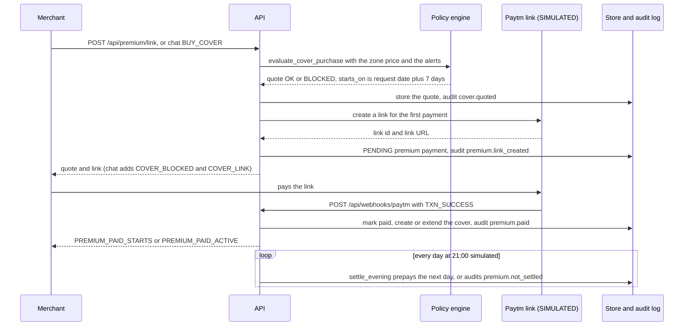
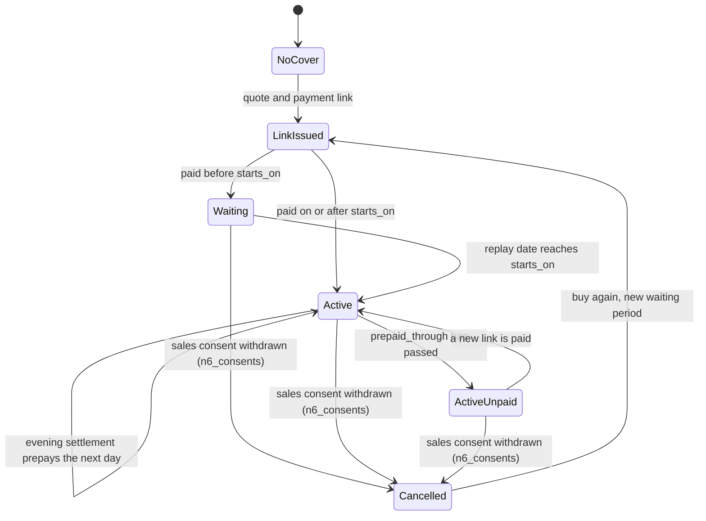

# Cover purchase and consent: K6, N6, H23

| | |
|---|---|
| Status | v1.4 · K6 BUILT (commit 86575ea) with its wave 1 fixes BUILT · N6 and H23 BUILT, wave 3. Section 2 lists what exists today. |
| Owner | Omkar Kadam (screens, copy, notices) · Ujjwal Pardeshi (engine, store, endpoints) |
| Date | 2026-10-02 |
| Audience | Product, engineering, compliance, legal |
| Related | [fs-04 merchant mini-app](fs-04-merchant-mini-app.md) · [fs-02 hospital-cash claim](fs-02-hospital-cash-claim.md) · [fs-03 EDI holiday](fs-03-edi-holiday.md) · [fs-06 explanations, disputes and grievance](fs-06-explanations-disputes-and-grievance.md) · [fs-09 policy engine and audit](fs-09-policy-engine-and-audit.md) · [Policy wording and CIS](../policy-wording-and-cis.md) (C5, C6, C11, C12) · [User journeys](../user-journeys.md) · [Data model and API](../../04-engineering/data-model-and-api.md) · [Implementation guide](../../04-engineering/implementation-guide.md) · [Copy deck](../../03-design/copy-deck.md) · [Regulatory and compliance](../../05-business/regulatory-and-compliance.md) · [Facts and sources](../../01-strategy/facts-and-sources.md) · [ADR 0005](../../04-engineering/adr/0005-mini-app-inside-the-console.md) · [ADR 0006](../../04-engineering/adr/0006-edi-holiday-is-the-lenders-decision.md) · [Traceability matrix](../../01-strategy/requirements-traceability-matrix.md) · [DEMO.md](../../DEMO.md) |

## TL;DR

- **K6 (BUILT):** a merchant asks for cover in chat or in the app. The policy engine answers **OK or BLOCKED**, never "approved". A new cover always starts 7 days after the request date, whatever the answer. BLOCKED means an alert for the zone is in force, or was issued and starts within 72 hours. The payment link is still offered, for cover from the later date. The first payment prepays 30 days. Each evening at 21:00 (simulated) the settlement prepays the next day. The price is the zone's price from `backend/artifacts/premiums.json`; nothing is calculated for a merchant at purchase.
- **Fixes (BUILT, wave 1):** X3, a missing zone price fails loudly instead of costing ₹2; a cover bought through the link is WAITING and nothing flips it to ACTIVE, so the engine check and the chat status are wrong after the start date, and the status is derived from the date instead (section 5.3); the seeded and mock prices disagree with the zone prices.
- **N6 and H23 (BUILT, wave 3, flag `n6_consents`):** the consent centre. Three purposes, each with a switch: sales data, hospital slip, premium from the daily settlement. Consent is recorded when the merchant pays or sends a slip. Turning a purpose off says in plain words what stops, and it does stop (section 9.4). An activity log shows what was used, for what and when (H23). The button "Erase this slip" (proposed label) deletes the photo, the fields read from it and the copied text in the claim record (H23).
- **Plain limits:** the audit log is append-only and hash-chained, so entries written before an erase can still quote a slip name; the screen says so. Withdrawing sales consent cancels the cover. That is a hackathon design decision for the insurer's compliance team and counsel to confirm. No refund is computed. There is no merchant login; the app borrows the demo officer session. Consents of the seeded merchants are made by the simulator and labelled SIMULATED.
- **Priority:** everything here is P0 (team decision, 2 Oct). It is built in waves behind the flag `n6_consents`. An unfinished consent screen is hidden, never shown half-working.

IDs covered: **K6 · X3 · N6 · H23**. H23 builds on ideas from Sahaj and FINPATH (project names; repo links are in [competitive landscape](../../01-strategy/competitive-landscape.md)).

## 1. Summary

K6 is how a merchant buys cover. The policy engine quotes a request, the merchant pays a link, a cover is created, and each evening a settlement step prepays the next day. Three rules keep this honest. A new cover always waits 7 days, so nobody can buy cover once a loss is known. A request made during or just before an alert is BLOCKED for an immediate start. Cover for a day starts when that day's premium has been received (cash before cover, the design behind Insurance Act s.64VB; to be confirmed with the insurer's compliance team).

N6 and H23 give the merchant control of the data behind all this. Today nothing in the code records consent. The consent centre records what the merchant agreed to, lets them turn each purpose off, makes the system stop using the data, shows what was used, and erases a hospital slip on request. The audit log cannot be edited, so section 9.8 states exactly what an erase removes and what it cannot.

| Feature | What this spec covers | Sections | Wave |
|---|---|---|---|
| K6 | Quote, payment link, payment, evening settlement, cover status | 5 to 8 | BUILT; fixes in 1 |
| X3 | A missing zone price fails loudly | 7.2 | 1 |
| N6 | Consent centre: purposes, grant, withdraw, enforcement, screens, purchase consent block | 9 | 3 |
| H23 | Consent activity log and "forget my slip" erase | 9.7, 9.8 | 3 |

## 2. Status today and what changes

**BUILT (commit 86575ea, 2 Oct 2026)**

| Piece | Where |
|---|---|
| Quote: OK or BLOCKED, start date, price, first payment | `backend/chhatri/policy/cover.py` (`evaluate_cover_purchase`) |
| Quote flow: store the quote, audit `cover.quoted`, create the payment link | `backend/chhatri/replay/orchestrator.py` (`quote_cover`) |
| Payment link, paid callback, new or extended cover | `backend/chhatri/ledger/premiums.py` (`PremiumService.create_link`, `mark_paid`) |
| Routes `POST /api/premium/link` (officer token) and `POST /api/webhooks/paytm` | `backend/chhatri/api/routers/premium.py`, `webhooks.py` |
| Zone prices: 24 zones, ₹6.93 to ₹38.82 a day | `backend/artifacts/premiums.json` (tracked in git); loader `backend/chhatri/ledger/premium_table.py` |
| Evening settlement at 21:00 simulated. No shipped scenario window reaches 21:00, so the demo never runs it | `PremiumService.settle_evening`; hook `EveningSettlement` in `backend/chhatri/replay/timed.py` |
| Chat: BUY_COVER (COVER_BLOCKED and COVER_LINK), COVER_STATUS, the paid confirmation | `backend/chhatri/conversation/replies.py`, `notifications.py`, `messages.py` |
| Checks that read the cover: COVER_IN_FORCE and PREMIUM_PREPAID (HARD, every claim), COVER_BEFORE_ALERT (HARD, area claims) | `backend/chhatri/policy/checks.py`, `catalogue.py` |
| Tests | `backend/tests/policy/test_cover.py`, `backend/tests/ledger/test_premiums.py`, `backend/tests/replay/test_dispute_cover.py`, `backend/tests/replay/test_timed.py` |

Nothing for N6 exists: no consent model, store, route, message or audit entry (searched on 2 Oct 2026).

**Planned at commit 86575ea, by build wave (the backend parts of waves 1 and 3 are BUILT)**

| Wave | What ships |
|---|---|
| 0 setup | The flag `n6_consents` in the frontend and the backend (proposed name; the [implementation guide](../../04-engineering/implementation-guide.md) owns the mechanism) |
| 1 demo spine | X3; derived cover status and the COVER_IN_FORCE fix (5.3); `GET /api/merchants/{id}/cover` (fs-04); seed and mock price fixes; the catalogue lines in section 8.3 |
| 3 trust and rights | N6 and H23: consent model and store, four routes, the `POST /api/premium/link` extension, gates in five places, screens S10 and S11, the consent block on S3, the slip erase |
| 5 ship | Mock parity for the static demo (N7); a withdrawal and an erase in the rehearsal script |

**Known gaps in code that this spec depends on** (verified 2 Oct 2026):

1. **WAITING never becomes ACTIVE.** `mark_paid` sets WAITING when the payment date is before `starts_on`, and nothing changes it later. `cover_in_force` needs status ACTIVE, so a claim for a day after `starts_on` on a link-bought cover fails COVER_IN_FORCE. The chat reply COVER_STATUS_STARTS also keeps saying "starts on", because `_cover_status` tests `status in NOT_YET_STARTED`. Fix: section 5.3.
2. **A missing zone price silently costs ₹2** (X3). Two tests pinned that behaviour at the baseline; X3 flipped them to `test_missing_file_gives_no_zone_a_price` and `test_zone_without_entry_is_an_error`.
3. **Pilot covers are seeded at the ₹2 minimum**, not at their zone price (`backend/chhatri/sim/merchants.py`, `cover_for`). The evening settlement takes the cover's own price, so Anil (Z7, ₹18.62 a day) would be charged ₹2. Check the golden tests before changing the seed. fs-04 open question 3 asks the same.
4. **The mock backend** has no route for `POST /api/premium/link` or `POST /api/webhooks/paytm`, and it prices demo merchants at ₹3 a day (`frontend/src/mock/fixtures.ts`).
5. **COVER_BLOCKED says "tomorrow's alert"** even when the blocking alert is in force today. One catalogue line serves both cases.
6. **`POST /api/premium/link` needs the officer token** (`require_officer`). There is no merchant login, so the app borrows the demo officer session (ADR 0005; fs-04 open question 4).
7. **The quote ignores an existing cover.** A merchant who already has a live cover and asks again (through chat; the app hides the button) is told the cover starts in 7 days, but payment extends the current cover from the day after `prepaid_through`.

## 3. Users and jobs to be done

| Persona | Job | Where |
|---|---|---|
| Ramesh Vada Pav (S-0907, Zone 3, no cover; a synthetic persona in a simulated replay) | See the price and the start date before paying | S3 (fs-04), chat |
| | Understand why a request made during an alert is BLOCKED | S3, chat |
| | Know what he agrees to when he pays | S3 consent block (section 9.5, wave 3) |
| Anil Jadhav (S-0142, tea stall, Parel, Zone 7; synthetic) | See what Chhatri has used of my data, and when | S11 activity log |
| | Turn off slip reading, or the daily deduction | S10 consent centre |
| | Erase the slip I sent | S10 |
| Insurer or compliance reviewer | Confirm cover starts after the premium is received, and consent is purpose-specific and withdrawable | Sections 7, 9, 11 |
| Presenter | Show a withdrawal and an erase live, with their effects | S10, S11, the WhatsApp thread |

## 4. Rules

From `backend/chhatri/policy/rules.yaml` (version `pilot-0.1`). The app and the copy read these numbers from `GET /api/policy`; none is typed into a sentence.

| Key | Value | Effect |
|---|---|---|
| `cover.waiting_period_days` | 7 | A new cover starts this many days after the request date |
| `cover.alert_lookahead_hours` | 72 | A request is BLOCKED if an alert for the zone is in force, or was issued and starts within this many hours |
| `premium.first_payment_days` | 30 | The first payment covers this many days |
| `premium.min_per_day_rupees` | 2 | Floor for a zone price. A table value below it is rejected when the table loads |
| `premium.loading` | 0.35 | Used by the backtest to set zone prices. Not used at purchase |

The evening settlement time, 21:00 simulated, is a constant in `backend/chhatri/replay/timed.py` (`SETTLEMENT_AT`), not a rule key.

**Zone price.** Price per day = max(₹2, backtest area loss per shop per season ÷ 365 ÷ (1 − 0.35)). The backtest computes it once, on simulated sales, and writes `backend/artifacts/premiums.json` (zone to paise). Nothing is calculated for a merchant. Hospital cash is not priced yet. These are prototype prices; the real price is not decided.

| Zone | Per day | First payment (30 days) | Note |
|---|---|---|---|
| Z3 | ₹14.16 | ₹424.80 | Ramesh, S-0907 |
| Z7 | ₹18.62 | ₹558.60 | Anil, S-0142 |
| Z9 | ₹25.38 | ₹761.40 | The no-alert slow day |
| Z21 | ₹6.93 | ₹207.90 | Lowest of the 24 zones |
| Z8 | ₹38.82 | ₹1,164.60 | Highest of the 24 zones |

## 5. Purchase flow and states

### 5.1 Purchase sequence (BUILT)



If the link cannot be created, the quote is still stored and audited, `premium.link_failed` is audited, the API returns `premium: null`, and the chat says COVER_LINK_UNAVAILABLE. A repeated paid callback changes nothing and sends no second message.

### 5.2 Cover life cycle

One cover is stored per merchant; a new purchase after a cancellation replaces it. The stored status can be PENDING_PAYMENT, WAITING, ACTIVE, LAPSED or CANCELLED. Today the code sets two of them.

| Stored status | Meaning | Set today by |
|---|---|---|
| (no cover) | The merchant never bought, like Ramesh before payment | |
| PENDING_PAYMENT | In the enum. A link creates a PENDING `PremiumPayment`, not a cover | Nothing |
| WAITING | Bought, inside the waiting period | `mark_paid`, when the payment date is before `starts_on` |
| ACTIVE | In force | The seed (pilot covers); `mark_paid`, when the payment date is on or after `starts_on` |
| LAPSED | In the enum. An unpaid cover stays ACTIVE with `premium_due` (section 5.3) | Nothing, and this spec keeps it that way |
| CANCELLED | In the enum | Nothing today. N6 sets it when sales consent is withdrawn (section 9.4) |



`LinkIssued` and `ActiveUnpaid` are drawn for clarity. They are not stored statuses: the first is a PENDING payment with no cover, the second is ACTIVE with `premium_due` true. A PENDING payment has no expiry in the code today (the enum has EXPIRED and FAILED, and nothing sets them), so an unpaid link just stays PENDING and the merchant can ask for a new quote.

### 5.3 Derived status (BUILT, wave 1, `policy/cover.py`)

The status shown to the merchant and read by the engine is derived from the stored status and a date, so the WAITING gap cannot happen.

```text
effective_status(cover, on):
  no cover                                          -> NONE
  stored CANCELLED, LAPSED or PENDING_PAYMENT       -> the same value
  stored WAITING or ACTIVE, and on < starts_on      -> WAITING
  stored WAITING or ACTIVE, and on >= starts_on     -> ACTIVE

premium_due(cover, on):
  effective_status is ACTIVE and (prepaid_through is missing or prepaid_through < on)
```

`on` is always the replay date in IST (`rt.clock.now()`), never the device clock. A pure function `effective_status` lives in `backend/chhatri/policy/cover.py` and is used in four places:

1. `cover_in_force` (`policy/checks.py`) with `on` set to the claim's event date. It fails for CANCELLED, LAPSED and PENDING_PAYMENT. For WAITING and ACTIVE the start date decides. Its two failure sentences stay as they are.
2. The chat reply `_cover_status` (`conversation/replies.py`) with `on` set to today. COVER_STATUS_STARTS is sent while the derived status is WAITING; COVER_STATUS_UNPAID when `premium_due`; COVER_STATUS_ACTIVE otherwise. NONE, CANCELLED and LAPSED still follow BUY_COVER, as today.
3. `GET /api/merchants/{id}/cover` (fs-04, section 6.2), which returns the derived `status` and `premium_due`.
4. `merchant_detail` (`replay/view_records.py`), so the console's merchant file agrees with the app.

Worked example (Ramesh, simulated dates; bought Mon 18 Aug 2025, `starts_on` 25 Aug, `prepaid_through` 23 Sep):

| Replay date | Derived status | `premium_due` |
|---|---|---|
| Mon 18 Aug (payment) | WAITING | false |
| Sun 24 Aug | WAITING | false |
| Mon 25 Aug | ACTIVE | false |
| Tue 23 Sep | ACTIVE | false |
| Wed 24 Sep | ACTIVE | true |

### 5.4 Evening settlement (BUILT)

Each day at 21:00 simulated, `EveningSettlement` totals every covered merchant's gross collections for the day from 00:00 to the last completed hour, then calls `PremiumService.settle_evening`. The rule is one line: when the day's collections are at least the cover's own price and the cover is prepaid exactly through that day, the next day is prepaid.

| Cover at 21:00 on `day` | Result | Audit entry |
|---|---|---|
| No cover, or stored status not ACTIVE or WAITING | Nothing | none |
| `prepaid_through` is after `day` | Nothing: tomorrow is already paid | none |
| `prepaid_through` is `day`, collections at least the price | `prepaid_through` becomes `day` plus 1; a PAID `SETTLEMENT_DEDUCTION` payment of one day is recorded | `premium.settled` |
| `prepaid_through` is `day`, collections below the price | Nothing advances | `premium.not_settled`, reason "collections below premium" |
| `prepaid_through` is missing or before `day` | Nothing advances: the cover lapsed before this day | `premium.not_settled`, reason "cover lapsed before this day" |

A miss has one consequence: from the next day PREMIUM_PREPAID fails (HARD), so a claim for that day is DECLINED with REASON_PREMIUM_PREPAID. No scenario window reaches 21:00 today, so unit tests cover this path and the demo does not show it live. Under N6 a fourth skip reason, "consent withdrawn", is added (section 9.4).

## 6. Inputs and data sources

| Input | Source | Status | Used for |
|---|---|---|---|
| Merchant and zone | The simulated city (`backend/chhatri/sim/merchants.py`) | SIMULATED | Price lookup, alert match |
| Alerts | The scenario's alert feed, read with `alerts_between(now, now + 72 hours)` | SIMULATED | The BLOCKED test |
| Zone price | `backend/artifacts/premiums.json`, written by the backtest | BUILT; prices from simulated sales | Quote and link |
| Replay clock | `rt.clock.now()` | SIMULATED | `starts_on`, derived status, settlement day |
| Payment link | Paytm adapter: MCP or REST when keys are set, otherwise the simulator (`https://paytm.me/sim-…`) | SIMULATED on stage: the team has no Paytm staging keys | The link |
| Paid callback | `POST /api/webhooks/paytm`; checksum verified in REST mode; idempotent on the transaction id | SIMULATED | `mark_paid` |
| Gross collections | The simulated sales history (`rt.world.history`) | SIMULATED | Evening settlement |
| Officer token | `GET /api/session`, sent as a bearer token | BUILT, for the demo | `POST /api/premium/link` |
| Consent records, notice text and version | `chhatri/consent/` (section 9.2) | BUILT, wave 3 | Gates, S3, S10, S11 |

## 7. Decision logic and checks

### 7.1 Quote (BUILT, `policy/cover.py`)

1. `starts_on` is the request date plus `cover.waiting_period_days`, for every outcome. It is never moved to "after the alert".
2. An alert is relevant at the request time when it names the merchant's zone, was issued at or before the request, has not ended, and is either valid now or starts within `cover.alert_lookahead_hours`. An alert not yet issued does not exist for the quote.
3. If any alert is relevant the outcome is **BLOCKED** and `blocking_alert_id` is the earliest by (valid_from, id). Otherwise the outcome is **OK**. The word "approved" is never used for a quote.
4. Both outcomes carry the zone price per day, `first_payment_paise` (price times 30) and `days_prepaid` 30. A BLOCKED quote still gets a payment link: the merchant can buy cover for later.
5. An existing cover does not change the outcome (gap 7 in section 2). A price of zero or less raises an error.

Boundary cases, all in `backend/tests/policy/test_cover.py` (alert A-20250818-01, issued Mon 18 Aug 17:30, in force Tue 19 Aug 14:00 to 20:00, zones Z3, Z7 and Z12):

| Request time | Outcome | Why |
|---|---|---|
| Mon 18 Aug 17:29 | OK | The alert is not issued yet |
| Mon 18 Aug 18:10 (Ramesh) | BLOCKED, starts 25 Aug | Issued, and starts within 72 hours |
| Tue 19 Aug 15:00 | BLOCKED | In force now |
| Tue 19 Aug 20:00 | OK | The alert has ended |
| An alert starting exactly 72 hours later | OK | Not within the look-ahead |
| An alert starting one minute earlier than that | BLOCKED | Within the look-ahead |
| An alert for another zone | OK | Not relevant |

### 7.2 Zone price (BUILT; X3 BUILT, wave 1)

Today `premium_per_day_paise` returns `table.get(zone, minimum)`, and a missing `premiums.json` gives an empty table with a logged warning, so every zone costs ₹2. X3 changes three things:

1. `premium_per_day_paise` raises `ValueError("no premium for zone Z99")` for a zone with no entry. The minimum stays as the floor that `parse_premiums` enforces on every value.
2. `load_static` (`backend/chhatri/replay/static.py`) logs an error naming each city zone with no price. `GET /api/preflight` reports the `premiums` row as not ok and lists the zones, so the presenter sees it before going on stage. A missing file is the same case for every zone.
3. The two tests named in gap 2 flip to expect the error.

The API answers a quote for such a zone with the generic 500 envelope (by design it never carries exception text); the log names the zone.

### 7.3 Payment (BUILT, `PremiumService.mark_paid`)

1. The link is a PENDING `PremiumPayment` with `covers_from` = `starts_on` and `covers_to` = `starts_on` plus 29 days. Ramesh: 25 Aug to 23 Sep.
2. The callback is idempotent: a PAID link returns unchanged. A payment that is not PENDING raises an error.
3. A merchant with no live cover (none, LAPSED or CANCELLED) gets a new cover: id `CV-<merchant>-<YYYYMMDD of starts_on>`, price per day = amount divided by the days paid (an uneven amount raises an error), `prepaid_through` = `covers_to`, status WAITING if the payment date is before `starts_on`, otherwise ACTIVE.
4. A merchant with a live cover (ACTIVE, WAITING or PENDING_PAYMENT) has `prepaid_through` extended by the days paid, starting the day after the current `prepaid_through`.
5. `premium.paid` is audited (actor `system`). The merchant gets PREMIUM_PAID_STARTS when `starts_on` is after today, otherwise PREMIUM_PAID_ACTIVE. The console feed gets one line.

### 7.4 Settlement (BUILT)

Section 5.4. Gross collections must be non-negative whole paise, or `settle_evening` raises an error.

### 7.5 How the engine reads the cover (BUILT; fix in 5.3)

| Check | Severity | Passes when | Merchant text on failure |
|---|---|---|---|
| COVER_IN_FORCE | HARD, every claim | A cover exists and starts on or before the event date. Today it also needs stored status ACTIVE (gap 1) | REASON_COVER_IN_FORCE: "Your cover wasn't in force on that day." |
| PREMIUM_PREPAID | HARD, every claim | `prepaid_through` is on or after the event date (Insurance Act s.64VB design) | REASON_PREMIUM_PREPAID: "The premium for that day hadn't been paid in advance." |
| COVER_BEFORE_ALERT | HARD, area claims | `purchased_at` is earlier than the alert's `issued_at` | REASON_COVER_BEFORE_ALERT: "The cover was bought after the alert was issued." |

COVER_BEFORE_ALERT is why a cover bought after an alert never pays for that alert, even once the 7 days have passed.

## 8. Merchant-facing copy (cover purchase)

### 8.1 Existing catalogue messages (exact)

All from `backend/chhatri/conversation/messages.py`. Placeholders in braces are filled by the backend. COVER_LINK has parentheses around the per-day price.

| Key | Hindi | English | Sent when |
|---|---|---|---|
| `COVER_BLOCKED` | `नया कवर वेटिंग पीरियड के बाद शुरू होता है — {starts_on_hi} से। कल के अलर्ट पर यह लागू नहीं होगा।` | `New cover starts after the waiting period — from {starts_on_en}. It won't apply to tomorrow's alert.` | The quote is BLOCKED (chat) |
| `COVER_LINK` | `आगे के लिए कवर लेना हो तो {first_payment} ({per_day}/दिन) यहाँ भरें: {url}` | `To buy cover for later, pay {first_payment} ({per_day}/day) here: {url}` | A link exists (chat), after COVER_BLOCKED when BLOCKED |
| `COVER_LINK_UNAVAILABLE` | `भुगतान लिंक अभी नहीं बन सका। थोड़ी देर बाद फिर से पूछिए।` | `The payment link couldn't be created right now. Please ask again in a little while.` | No link could be created |
| `COVER_STATUS_ACTIVE` | `आपका कवर चालू है। प्रीमियम {prepaid_hi} तक जमा है।` | `Your cover is active. Premium is paid through {prepaid_en}.` | Status question, cover in force and prepaid |
| `COVER_STATUS_STARTS` | `आपका कवर {starts_on_hi} से शुरू होगा।` | `Your cover starts on {starts_on_en}.` | Status question, cover not started |
| `COVER_STATUS_UNPAID` | `आपका कवर चालू है, पर आगे के दिनों का प्रीमियम अभी जमा नहीं है।` | `Your cover is active, but the premium for the coming days hasn't been paid yet.` | Status question, premium due |
| `PREMIUM_PAID_STARTS` | `{name_hi} जी, आपका {amount} का प्रीमियम मिल गया। आपका कवर {starts_on_hi} से शुरू होगा और {paid_to_hi} तक का प्रीमियम जमा है।` | `{name_en} ji, we received your {amount} premium. Your cover starts on {starts_on_en} and is paid through {paid_to_en}.` | Paid callback, `starts_on` after today |
| `PREMIUM_PAID_ACTIVE` | `{name_hi} जी, आपका {amount} का प्रीमियम मिल गया। आपका कवर चालू है और {paid_to_hi} तक का प्रीमियम जमा है।` | `{name_en} ji, we received your {amount} premium. Your cover is active and paid through {paid_to_en}.` | Paid callback, cover already started |

The quote itself carries a short reason, shown on S3 (`reason_hi`, `reason_en`, from `policy/cover.py`): BLOCKED, `New cover starts after the waiting period` and `नया कवर वेटिंग पीरियड के बाद शुरू होता है`; OK, `No alert for your area. New cover starts after the {days}-day waiting period` and `आपके इलाके के लिए कोई अलर्ट नहीं है। नया कवर {days} दिन के वेटिंग पीरियड के बाद शुरू होता है`. The decline sentences for the three cover checks are in section 7.5.

### 8.2 Demo numbers

DEMO.md scenario `buy_cover`: Ramesh (S-0907, Zone 3) asks on Mon 18 Aug 2025 at 18:00. The quote is BLOCKED by alert A-20250818-01, starts 25 Aug, ₹14.16 a day, ₹424.80 for 30 days. After the simulated payment the cover is WAITING, starts 25 Aug and is paid through 23 Sep. Say "prototype price" when quoting: the real price is not decided.

### 8.3 Proposed catalogue lines for wave 1 (not in the catalogue today)

| Key (proposed) | Hindi | English | Why |
|---|---|---|---|
| `COVER_STATUS_NONE` | `अभी कवर नहीं है` | `No cover yet` | The cover endpoint's `status_text_*` for a merchant with no cover (fs-04). The chat keeps following BUY_COVER for that merchant |
| `COVER_BLOCKED_NOW` | `नया कवर वेटिंग पीरियड के बाद शुरू होता है — {starts_on_hi} से। यह अभी चल रहे अलर्ट पर लागू नहीं होगा।` | `New cover starts after the waiting period — from {starts_on_en}. It won't apply to the alert that is in force now.` | Gap 5: used when the blocking alert is already in force (its `valid_from` is not after the request time) |

Both go through the honest-wording test (X7) like every catalogue line.

## 9. N6 consent centre and H23 build spec (BUILT, wave 3)

The backend of this section is BUILT (`chhatri/consent/`, `api/routers/consents.py`), and all of it sits behind the flag `n6_consents`: with the flag off the routes answer 404, the screens and the Help row are absent, S3 shows its one-line notice, and every gate passes, so waves 1 and 2 run exactly as today.

### 9.1 Purposes

A purpose is one reason Chhatri uses the merchant's data. Each has its own record, switch and effect.

| `purpose` | Label (English) | Data used | Needed to buy cover |
|---|---|---|---|
| `SALES_DATA_FOR_CLAIM` | Use my sales data to decide claims and set my premium | Daily and hourly sales totals from the Paytm settlement; Soundbox activity, to see whether the shop was open | Yes |
| `SLIP_DATA_FOR_HOSPITAL_CLAIM` | Read my hospital slip to check a claim | The slip photo the merchant sends, and five details read from it: patient name, admission date, discharge date, hospital name, document type | No. Asked at purchase, or when the first slip is sent |
| `SETTLEMENT_DEDUCTION` | Take the next day's premium from my daily settlement | The day's collections, to check they cover the premium, and the premium amount | Yes |

The three purposes follow the draft wording C11 (policy wording) and the cash-before-cover design in section 11. They are product design, not legal text; the split is to be confirmed with the insurer's compliance team. Not in this build: voice notes (open question 3), sharing with the lender (open question 2), offers (open question 8).

### 9.2 Data model

**Consent record** (new frozen model `Consent` in `backend/chhatri/domain/models.py`, new store table, new id prefix `consent: "CN"` in `IdFactory`):

| Field | Meaning |
|---|---|
| `id` | `CN-######`, sequence ids like the others; they restart on every scenario load |
| `merchant_id` | `S-####` |
| `purpose` | One of the three purposes |
| `status` | `ACTIVE` or `WITHDRAWN` |
| `notice_version` | The notice the merchant saw, for example `notice-1`; null for SEEDED. Bump it whenever any consent text changes |
| `granted_at` | When the merchant agreed: the tick (link request or slip upload), not the payment time. IST, replay time |
| `withdrawn_at` | IST, or null |
| `source` | `PAYMENT_APP`, `PAYMENT_CHAT`, `SLIP_UPLOAD` or `SEEDED` |
| `payment_id` | The premium payment that carried the grant (`PR-######`), or null |

Rules:

- A withdrawal replaces the record with `model_copy(update=...)`; nothing is mutated. The store keeps every record, so an old receipt still opens. `GET /consents` returns the latest record per purpose, or a NOT_GIVEN placeholder.
- At most one ACTIVE record per merchant and purpose. A grant after a withdrawal is a new record with a new id.
- **Seed.** At scenario load every merchant with a seeded cover gets three ACTIVE records, source SEEDED, `granted_at` = the cover's `purchased_at`, `notice_version` null. They write no audit entries: they pre-date the replay, so a scenario that never touches consent keeps the audit chain it has today. The app labels them SIMULATED. A merchant with no cover (Ramesh) has none.
- **Notice module** (new `backend/chhatri/consent/notice.py`): `NOTICE_VERSION`, and for each purpose the label, the data-used lines and the effect sentences, in Hindi and English. The API returns them, the mock copies them, and X7 scans them for promises. The app does not hold consent wording of its own.
- **Payment carries the grant.** The model `PremiumPayment` is unchanged. What the app ticked is held as a `PendingGrant` (purposes, notice version, time) in the consent book, keyed by the payment id (`expect_grant` in `backend/chhatri/consent/purchase.py`, `expect_payment` in `consent/ledger.py`). When the payment is paid, `ConsentBook` turns it into `Consent` records (source `PAYMENT_APP`, or `PAYMENT_CHAT` when the chat notice covered it) and audits `consent.granted`. An unpaid link therefore leaves no consent behind.
- The store, the audit log and the media are in memory for one scenario run. A reload starts all of them afresh.

### 9.3 How consent is granted

There is no grant endpoint, on purpose: consent is given by an action that needs the data, never on its own.

| Writer | When | Records | `source` |
|---|---|---|---|
| `POST /api/premium/link` with `consents` (S3, the app) | On payment | The ticked purposes | `PAYMENT_APP` |
| Chat BUY_COVER, with the line COVER_NOTICE after the link (section 9.10) | On payment | `SALES_DATA_FOR_CLAIM` and `SETTLEMENT_DEDUCTION`, each one that is not already ACTIVE | `PAYMENT_CHAT` |
| The slip upload sheet (fs-02) | When a slip is sent and no ACTIVE slip consent exists | `SLIP_DATA_FOR_HOSPITAL_CLAIM` | `SLIP_UPLOAD` |
| The seed | Scenario load | All three, for seeded covers | `SEEDED` |

Rules for `POST /api/premium/link` with the flag on:

- Body: `{merchant_id, consents?, notice_version?}`. `consents` is a list of purposes.
- For a merchant without a live cover, `consents` must contain `SALES_DATA_FOR_CLAIM` and `SETTLEMENT_DEDUCTION`, and `notice_version` must equal the current version. Otherwise 422 `validation_error` with `fields` (`consents`: "required purposes missing", `notice_version`: "out of date"). Nothing is created.
- For a merchant with a live cover (a renewal by link, which happens through chat today), `consents` is optional and records the purposes that are not ACTIVE.
- The check button on S3 is gated by the two required boxes, because the quote and the link are one call (section 9.5).

The slip path: with the flag on, `POST /api/merchants/{id}/slip-precheck` (fs-02) takes `consent: true` and `notice_version` when no ACTIVE slip consent exists, records the grant, and then reads the slip. Without both it answers 409 `consent_required` and reads nothing. In chat, a photo without an ACTIVE slip consent gets SLIP_CONSENT_NEEDED and nothing is read; the open check-in stays open. Seeded merchants have the consent, so the chat slip demo (scenario `illness_mismatch`) runs unchanged.

### 9.4 Withdrawal effects and where they are enforced

Turning a purpose off takes effect at once. A withdrawal never edits a decision, a payout or the audit log.

| Purpose | What stops | Enforced in |
|---|---|---|
| `SALES_DATA_FOR_CLAIM` | The cover is CANCELLED (its `prepaid_through` is kept as data; no refund is computed). No new area claim and no silent-day check-in for the merchant: they are treated like an uncovered merchant. The merchant's sales leave the zone index from that moment | `ConsentService.withdraw` sets the cover. Gates: `AreaFlow._claims` (`replay/area.py`) and `PersonalFlow.outreach` (`replay/personal.py`). `evaluate_hour` (`detect/triggers.py`) takes `excluded: frozenset[str]`, empty by default, so every golden number stays the same. A shipped scenario never withdraws |
| `SLIP_DATA_FOR_HOSPITAL_CLAIM` | New slips are not read, so no new hospital-cash claim. Cover and premium are untouched. Slips already stored stay until erased (9.8) | `SlipFlow.reply` (`conversation/slip_flow.py`): SLIP_CONSENT_NEEDED. The slip pre-check route (fs-02): 409 `consent_required` |
| `SETTLEMENT_DEDUCTION` | No more evening deductions. The cover keeps working through `prepaid_through`; after that the premium is due and PREMIUM_PREPAID fails | `PremiumService._settle_one` (`ledger/premiums.py`): when `prepaid_through` is the settlement day and the consent is not ACTIVE, audit `premium.not_settled` with reason "consent withdrawn" and move nothing |

What does not change: claims already decided, payouts already created, open cases (a claims officer still answers them), the audit log, and the numbers in `rules.yaml`.

**Block while a review is open.** Withdrawing `SALES_DATA_FOR_CLAIM` is refused with 409 `case_open` while an OPEN `PERSONAL_CLAIM_REVIEW` case exists for the merchant. Reason: an officer's approval re-runs the checks on the cover as it is then, and a CANCELLED cover would turn the approval into a decline for a loss that happened under cover. The sheet says so and tells the merchant they can turn it off once the claim is answered. This is a hackathon design decision, to be confirmed with counsel (open question 5).

**Messages.** Each withdrawal sends the merchant one WhatsApp line (CONSENT_WITHDRAWN_SALES, _SLIP or _SETTLEMENT, proposed, section 9.10) through the same outbox as every other message, so the thread and the app agree.

**Cancellation is a design choice.** A cover cannot work without the data, so turning off sales data ends it. Whether that is the right outcome, and how refunds and the free look (C12) apply, is for the partner insurer to decide (open question 5). Continuing the cover with a flag was considered and rejected: it would keep processing data the merchant had asked us to stop using.

### 9.5 Purchase consent block (S3)

Placement: inside the payment flow of S3 (fs-04), above the button `buy-check`. Wave 3, flag `n6_consents`. Before wave 3 S3 shows one plain line instead. Strings in quotes in this section are proposed copy from section 9.10.

- Heading and the notice text from the API (`buy-consent-notice`), with the notice version in small type.
- Three checkboxes, **unticked on load** (no pre-ticked boxes): `buy-consent-SALES_DATA_FOR_CLAIM` and `buy-consent-SETTLEMENT_DEDUCTION`, each tagged "Needed for cover", and `buy-consent-SLIP_DATA_FOR_HOSPITAL_CLAIM`, tagged "Optional". The wording is in section 9.10.
- `buy-check` stays disabled until both required boxes are ticked; the hint `buy-consent-hint` says why. After the quote the pay button works as fs-04 describes.
- The app reads the purposes from `GET /api/merchants/{id}/consents` (a merchant with no cover gets three NOT_GIVEN items with their labels and `current_notice_version`) and sends `consents` and `notice_version` with `POST /api/premium/link`.
- A 422 shows `buy-consent-error` ("The notice changed. Please read it again.") and reloads the consents.
- A merchant who already has cover sees no consent block (S3 shows the status card).

### 9.6 API

Paths are from the registry in [data-model-and-api.md](../../04-engineering/data-model-and-api.md) section 5; section 5.5 there holds the request and response examples. `{id}` is a merchant id (`^S-\d{4}$`). Envelope as everywhere: `{ok, data}` or `{ok: false, error: {code, message, fields}}`.

| Method and path | Status | Auth | Purpose |
|---|---|---|---|
| `GET /api/merchants/{id}/consents` | BUILT, wave 3 | none, like `GET /api/merchants/{id}` | The three purposes, with state, texts and held slips |
| `POST /api/merchants/{id}/consents/{consent_id}/withdraw` | BUILT, wave 3 | demo officer session | Turn a purpose off |
| `GET /api/merchants/{id}/consents/activity` | BUILT, wave 3 | none | The activity log (H23) |
| `POST /api/merchants/{id}/slips/{slip_id}/forget` | BUILT, wave 3 | demo officer session | Erase one slip (H23) |
| `POST /api/premium/link` | BUILT; `consents` and `notice_version` BUILT (wave 3) | officer token (BUILT) | Section 9.3 |

There is no merchant login in the prototype. The two writes need the officer bearer token like `POST /api/premium/link`, and the app borrows the console's demo session (ADR 0005). The audit actor is `merchant:<id>` because the action is the merchant's, and the entry's `data.via` says `demo_officer_session`, so the log does not imply a login that does not exist. The writes share the chat routes' `messages` rate limit.

**`GET /consents`** returns a list (`ok_list`, total 3, in a fixed order: sales, slip, settlement). Item fields:

| Field | Meaning |
|---|---|
| `consent_id` | `CN-######`, or null when `status` is NOT_GIVEN |
| `purpose` | One of the three |
| `purpose_label_en`, `purpose_label_hi` | From the notice module |
| `status` | `ACTIVE`, `WITHDRAWN` or `NOT_GIVEN` |
| `granted_at`, `withdrawn_at` | IST times (replay time) or null |
| `source` | `PAYMENT_APP`, `PAYMENT_CHAT`, `SLIP_UPLOAD`, `SEEDED`, or null |
| `notice_version` | What the merchant agreed to. Null for SEEDED and NOT_GIVEN |
| `current_notice_version` | The version in force now. The app sends it back at purchase |
| `required_to_buy` | True for sales and settlement |
| `data_used_en`, `data_used_hi` | Lists for the "What we use" section |
| `withdraw_effect_en`, `withdraw_effect_hi` | The effect text, with numbers filled from the rules and the cover (`{waiting_days}`, `{paid_through}`) |
| `can_withdraw`, `blocked_reason` | False with `case_open` while an OPEN review case blocks it |
| `regrant_en`, `regrant_hi` | How to turn it on again; shown while WITHDRAWN or NOT_GIVEN |
| `held` | On the slip item: stored slips, each `{slip_id, claim_id, received_at, state, erased_at, can_erase, blocked_reason}`. `received_at` is the claim's creation time. `state` is `HELD` or `ERASED` |

```json
{
  "ok": true,
  "data": [
    {
      "consent_id": "CN-000001",
      "purpose": "SLIP_DATA_FOR_HOSPITAL_CLAIM",
      "purpose_label_en": "Read my hospital slip to check a claim",
      "purpose_label_hi": "...",
      "status": "ACTIVE",
      "granted_at": "2024-11-03T14:00:00+05:30",
      "withdrawn_at": null,
      "source": "SEEDED",
      "notice_version": null,
      "current_notice_version": "notice-1",
      "required_to_buy": false,
      "can_withdraw": true,
      "blocked_reason": null,
      "held": [
        {"slip_id": "MD-000001", "claim_id": "CL-000001", "received_at": "2025-08-21T10:41:00+05:30",
         "state": "HELD", "erased_at": null, "can_erase": false, "blocked_reason": "case_open"}
      ]
    }
  ]
}
```

The example is abbreviated (text fields shortened, the other two items omitted) and its dates are illustrative.

**`POST /consents/{consent_id}/withdraw`** (no body) returns `{consent_id, purpose, status: "WITHDRAWN", withdrawn_at, action_taken_en, action_taken_hi, cover_status}`. `cover_status` is the derived status after the action (CANCELLED after a sales withdrawal). Errors: 401 or 403 (officer token); 404 `not_found` (unknown merchant, or a consent that is not this merchant's); 409 `already_withdrawn`; 409 `case_open` (for the sales consent). Audit: `consent.withdrawn`, and for sales also `cover.cancelled` (section 13).

**`GET /consents/activity`** is `ok_list`, newest first, with the paging of `GET /api/merchants` (default 50) and an optional `purpose` filter. Section 9.7 defines the items.

**`POST /slips/{slip_id}/forget`** (no body). `slip_id` is the stored photo's media id (`MD-######`). Returns `{slip_id, claim_id, erased_at, erased: {photo, claim_fields, decisions, case_fields, messages}, kept: [...], audit_note_en, audit_note_hi}`, where `erased.decisions`, `erased.case_fields` and `erased.messages` are counts. Errors: 401 or 403; 404 (not this merchant's slip); 409 `case_open`; 409 `already_erased`. Audit: `slip.erased`.

Error codes beyond the status defaults (`already_withdrawn`, `case_open`, `already_erased`, `consent_required`) use `ApiError(code=...)`, which the error envelope supports.

### 9.7 Activity log (H23)

The log answers three questions for one merchant: what was used, for what purpose, and when. It is a projection of the audit log, not a second log. Each row maps one audit action to one purpose and one fixed sentence.

| Audit action | Purpose | `kind` | Sentence (English; Hindi in section 9.10) |
|---|---|---|---|
| `silence.detected` | sales | `USED` | Your shop's sales were checked for {day}. No sales were found. |
| `decision.area` | sales | `USED` | Your sales for {day} were compared with your usual day. Decision {decision_id}. |
| `slip.read` | slip | `USED` | Your slip photo was read. Details found: {found} of {total}. |
| `decision.personal`, `decision.officer` | slip | `USED` | Your slip details were checked for a claim. Decision {decision_id}. |
| `premium.settled` | settlement | `USED` | Tomorrow's premium of {amount} was taken from today's collections. |
| `premium.not_settled` | settlement | `USED` | Today's collections were checked. Nothing was taken ({reason}). |
| `consent.granted` | its purpose | `GRANTED` | You agreed: {label}. |
| `consent.withdrawn` | its purpose | `WITHDRAWN` | You turned off: {label}. |
| `cover.cancelled` | sales | `EFFECT` | Your cover was cancelled because sales data was turned off. |
| `slip.erased` | slip | `ERASED` | Your slip data was erased. |

Rules:

1. An entry belongs to the merchant when `data.merchant_id` equals the merchant id, or, for `silence.detected`, when the subject is the merchant. Entries about other merchants and about a zone (`trigger.fired`) are never returned.
2. The sentence is a fixed template. It never copies text from the entry, so it cannot print a patient name. Days, ids and amounts come from fixed fields; `{reason}` is one of three fixed phrases ("collections below premium", "cover lapsed before this day", "consent withdrawn"), each with a Hindi line.
3. An item is `{seq, at, purpose, kind, text_en, text_hi, ref}`. `ref` is `{type, id}` for a decision, consent or media id, or null. `seq` is the audit entry number, so a reviewer can find the entry in `GET /api/audit` and run `GET /api/audit/verify`.
4. The log is as complete as the audit log. Seeded consents write no entries and nothing the replay did not do appears. Times are replay time.
5. Newest first, paged like `GET /api/merchants`, with an optional `purpose` filter.
6. Build: read `AuditLog.entries` in pages (up to 5,000 each) and filter. If that is slow at demo size, index entries by merchant when they are appended (`PublishingAuditLog`).

```json
{"seq": 41, "at": "2025-08-19T17:00:00+05:30", "purpose": "SALES_DATA_FOR_CLAIM", "kind": "USED",
 "text_en": "Your sales for 19 August were compared with your usual day. Decision D-000001.",
 "text_hi": "...", "ref": {"type": "decision", "id": "D-000001"}}
```

The item is abbreviated and its numbers are illustrative.

### 9.8 Forget my slip (H23)

A hospital slip is health information. The merchant can ask Chhatri to erase one slip. This section says what that removes, what it cannot, and why.

**Where slip-derived data lives today** (verified 2 Oct 2026):

| Place | What it holds | Erased by this action |
|---|---|---|
| The photo in the store (`Store._media`, id `MD-######`) | The image bytes | Yes. `GET /api/media/{id}` then answers 404 |
| `Claim.slip` | Five fields, confidence, source and the raw model response | Yes. Replaced by an empty extraction with source `erased` |
| Decision text: the `observed` and `detail_en` of SLIP_READABLE, NAME_MATCHES_KYC and DATES_MATCH, and `referral_reason` when it copies one of them | Patient name, stay dates, document type, confidence | Yes, on every decision of that claim (the referred one and the officer's). Code, status, severity and label stay |
| The review case: `evidence.slip`, `evidence.name_score`, and `summary_en` (it embeds `referral_reason`) | The five fields, the match score, the same text | Yes. `kyc_name` is the merchant's own KYC name, not slip data, and stays |
| The photo message in the WhatsApp thread | A link to the photo | Yes. The link is cleared and the thread shows "Photo erased" |
| **The audit log** (SQLite; UPDATE and DELETE are rejected by triggers; hash-chained) | `decision.personal` and `decision.officer` hold the decision's check text, so they can quote the patient name and stay dates. `case.open` holds `summary_en`. `slip.read` never holds the name | **No** |
| Memory facts used for precedents | Ids, amounts and dates | Nothing to erase |
| The slip reader | With `SARVAM_API_KEY` set the photo goes to Sarvam document AI | No: an erase cannot recall it. The prototype is meant for synthetic slips (ADR 0009). A pilot needs the provider's retention terms |

**Why the audit log is not edited.** The hash chain exists so that no one, including us, can change history unnoticed (fs-09), and `GET /api/audit/verify` fails if an entry changes. Editing the log for an erase would defeat it. So an erase has a limit, and the app says so before the merchant confirms: entries written before the erase can still show the name and dates. In the prototype the store and the audit log live in memory for one scenario run, and a reload starts both afresh. The limit matters for the design a pilot with a persistent log would inherit. Open question 1 proposes a way to close it for new entries.

**Rules**

1. One slip at a time, by the media id of the stored photo. The claim that holds it is found by `claim.slip_media_id`. A slip that is not this merchant's is a 404.
2. Refused with 409 `case_open` while an OPEN `PERSONAL_CLAIM_REVIEW` case exists for the claim, because the officer needs the evidence. After the case is closed an erase is allowed at any time. The draft wording C11 limits requests to 30 days after the decision; the prototype enforces no window (open question 6).
3. A second erase of the same slip is 409 `already_erased`.
4. The decision stays: outcome, amount, check codes, statuses, severities, labels and `required` text. The explanation (the formula) holds no slip data and stays.
5. After an erase the decision view and the receipt (fs-04 S7) mark the three slip checks `erased`. The app shows "Details erased on {date} at your request. The audit log still holds the original entry." so it never claims more than the erase did. `GET /decisions/{id}/receipt` gains `checks[].erased` (a boolean; fs-04 section 6.2 lists it).
6. The officer console shows "Slip erased" where the image was (fs-08; Omkar). The case evidence type allows `slip: {erased: true, erased_at}`.
7. The erase writes its own audit entry, `slip.erased` (actor `merchant:<id>`, subject type `media`): `slip_id`, `claim_id`, the decision ids and the counts of what it changed. No text from the slip.
8. Masking is not part of this build. The prototype reads five fields and has no diagnosis field, but the stored image shows everything on the slip and officers see it, because the name and date checks need it. A masking step is a pilot item (open question 6).

### 9.9 Mini-app screens

Two new screens in the Help tab, behind `n6_consents`. Strings in quotes on them are proposed copy from section 9.10. They follow fs-04: the six shared states, the app frame, URL state, test ids with the `app-` shell ids. `screen=consents` and `screen=consent-activity` are in the URL table of fs-04 section 4.3; with the flag off they show Home. The Help row "My data and consent" (`help-consents`) opens S10.

#### S10 Consent centre (`screen=consents`, tab Help, wave 3)

**Purpose.** Show what the merchant agreed to, let them turn each purpose off, and erase a slip.

**Layout.**
1. Heading and one sentence of intro (`consents-intro`); the notice version in small type (`consents-notice-version`).
2. Three Cards in a fixed order (`consent-card-{purpose}`). Each shows the label (`consent-label-{purpose}`), a state Badge (`consent-state-{purpose}`: On, Off, Not given), a source line (`consent-source-{purpose}`, with a SIMULATED Badge for SEEDED), the agreed date (`consent-granted-{purpose}`), an Accordion "What we use" (`consent-used-{purpose}`), a Switch (`consent-switch-{purpose}`), and a "Receipt" button (`consent-receipt-{purpose}`) that opens a Sheet (`consent-receipt-sheet`) with the id, notice version, source and times, and the print action of fs-04 section 10.5.
3. The Switch is On for ACTIVE. Tapping it does not flip it: it opens the withdraw Sheet, and the Switch flips when the call succeeds. For WITHDRAWN and NOT_GIVEN the Switch is off and disabled, and `consent-regrant-{purpose}` says how to turn it on again (linked with `aria-describedby`). A purpose with `can_withdraw` false shows `consent-blocked-{purpose}` with the reason.
4. Inside the slip card, a list of held slips (`slips-list`). Each row `slip-row-{slip_id}` shows the date, the claim id, a state (`slip-state-{slip_id}`: Held or Erased) and a button "Erase this slip" (`slip-erase-{slip_id}`). While `can_erase` is false the button is disabled and `slip-erase-blocked-{slip_id}` gives the reason.
5. A link "See what was used" (`consents-open-activity`) to S11. With `n5_grievances` on, a link "Complain about my data" (`consents-complain`) opens the grievance form of fs-06 with the topic `DATA_OR_CONSENT` selected.

**Withdraw Sheet** (`consent-withdraw-sheet`): title "Turn this off?", the effect text from the API as a list (`consent-effects`), two buttons: "Turn off" (`consent-withdraw-confirm`) and "Keep it on" (`consent-withdraw-cancel`). The confirm button shows a busy state during the call. A 409 shows `consent-withdraw-error` in the Sheet and leaves the Switch on. Success closes the Sheet, flips the Switch, and shows a Toast.

**Erase Sheet** (`slip-erase-sheet`): title "Erase this slip?", what is erased (`slip-erase-removes`), what stays (`slip-erase-keeps`), the audit note (`slip-erase-audit-note`), buttons "Erase" (`slip-erase-confirm`) and "Keep it" (`slip-erase-cancel`), and `slip-erase-error` for a 409.

**Roles.** Card, Switch, Badge, Accordion, Sheet, Button, Toast, Skeleton. **Data.** `GET /consents`, `POST /consents/{consent_id}/withdraw`, `POST /slips/{slip_id}/forget`.

| State | Behaviour |
|---|---|
| Loading | Three card skeletons |
| Empty | All three purposes are NOT_GIVEN (a merchant with no cover): the cards are replaced by one sentence, "You have not agreed to anything yet. You agree when you buy cover.", and the next-best action |
| Error | Error Card with Retry; a parser failure shows `contract_violation` |
| Offline | Banner; switches and erase buttons are disabled with "You are offline." |
| SIMULATED | SEEDED rows carry the SIMULATED Badge and "Set up by the simulator for this demo." |
| FALLBACK | Not shown |

#### S11 Consent activity (`screen=consent-activity`, tab Help, wave 3)

**Purpose.** Show what was used, for what, and when (H23).

**Layout.** Heading; a row of filter chips (`activity-filter-all`, `activity-filter-sales`, `activity-filter-slip`, `activity-filter-settlement`); the list (`activity-list`) of rows `activity-row-{seq}` with the time (`activity-time-{seq}`), a purpose Badge (`activity-purpose-{seq}`), the sentence (`activity-text-{seq}`) and, for a decision, a link (`activity-ref-{seq}`) to the receipt (S7); a button "Show more" (`activity-more`); "Check the log" (`activity-check-log`), which calls `GET /api/audit/verify` as S7 does; and a line "Times are simulated."

**Roles.** Card, Badge, Tabs (as chips), Button, Skeleton. **Data.** `GET /consents/activity`, `GET /api/audit/verify`.

| State | Behaviour |
|---|---|
| Loading | Row skeletons |
| Empty | `activity-empty`: "Nothing has been used yet." |
| Error | Error Card with Retry |
| Offline | Banner; the last list stays; "Show more" and "Check the log" are disabled |
| SIMULATED | The times line; seeded consents show no rows because they wrote no entries |
| FALLBACK | Not shown |

#### Next-best-action rules for these screens

These rows join the screen-rule table of fs-04 section 12 (checked first on that screen). There is still no offer kind.

| Screen | Rule id | Condition | Action |
|---|---|---|---|
| S3 | `tick_consent` | The consent block is incomplete (wave 3). Checked before `check_price` | Focus the first unticked required box (`FOCUS`) |
| S10 | `get_cover_from_consents` | Cover status `NONE` | Get cover (S3) |
| S10 | `see_activity` | Otherwise | See what was used (S11) |
| S11 | `back_to_consents` | Always | My data and consent (S10) |

### 9.10 Copy (proposed)

Nothing in this section is in the message catalogue yet, so every string is **proposed**. Hindi needs a native review before it ships (open question 9). Numbers in the effect texts are filled by the backend from the rules and the cover; none is typed here.

**Notice and checkboxes on S3** (from the notice module):

| Key | English | Hindi |
|---|---|---|
| `notice` | Before you pay: Chhatri uses your sales data to decide claims and set your premium. After the first payment, Chhatri takes the next day's premium from your daily settlement. Chhatri reads a hospital slip when you send one, for that claim alone. You can turn each of these off in the app under Help, My data and consent. This is a prototype with simulated data. | भुगतान से पहले: छतरी आपकी बिक्री के डेटा से दावे तय करती है और प्रीमियम तय करती है। पहले भुगतान के बाद छतरी आपके रोज़ के सेटलमेंट से अगले दिन का प्रीमियम काटती है। अस्पताल की पर्ची छतरी तब पढ़ती है जब आप भेजें, और सिर्फ़ उसी दावे के लिए। आप इनमें से हर एक को ऐप में मदद, मेरा डेटा और सहमति में बंद कर सकते हैं। यह एक प्रोटोटाइप है और डेटा काल्पनिक है। |
| `box.sales` | I agree: Chhatri may use my sales data to decide claims and set my premium. | मैं सहमत हूँ: छतरी मेरी बिक्री का डेटा दावे तय करने और प्रीमियम तय करने में इस्तेमाल कर सकती है। |
| `box.settlement` | I agree: after the first payment, Chhatri may take the next day's premium from my daily settlement. | मैं सहमत हूँ: पहले भुगतान के बाद छतरी मेरे रोज़ के सेटलमेंट से अगले दिन का प्रीमियम काट सकती है। |
| `box.slip` | I agree: Chhatri may read a hospital slip when I send one. | मैं सहमत हूँ: जब मैं अस्पताल की पर्ची भेजूँ, छतरी उसे पढ़ सकती है। |
| `tag.required`, `tag.optional` | Needed for cover, Optional | कवर के लिए ज़रूरी, ज़रूरी नहीं |
| `hint` | Tick the two boxes marked Needed for cover to continue. | आगे बढ़ने के लिए "कवर के लिए ज़रूरी" वाले दोनों बॉक्स चुनें। |
| `error.stale` | The notice changed. Please read it again. | सूचना बदल गई है। कृपया उसे फिर से पढ़ें। |

**Purposes** (from the notice module; `{waiting_days}` and `{paid_through}` are filled by the backend):

| Purpose | Item | English | Hindi |
|---|---|---|---|
| Sales | Label | Use my sales data to decide claims and set my premium | मेरी बिक्री का डेटा दावे तय करने और प्रीमियम तय करने में इस्तेमाल करें |
| | Data used | Daily and hourly sales totals from your Paytm settlement. Soundbox activity, to see whether your shop was open. | आपके Paytm सेटलमेंट से रोज़ और घंटे की बिक्री का कुल योग। Soundbox की गतिविधि, यह देखने के लिए कि दुकान खुली थी या नहीं। |
| | Effect | Your cover is cancelled today. Chhatri stops checking your sales, so no new claims are made for you, and your sales are left out of your area's index. Claims already decided stay on record. Any refund follows the cancellation terms (C12). To get cover again you buy again and wait {waiting_days} days. | आपका कवर आज रद्द हो जाएगा। छतरी आपकी बिक्री देखना बंद कर देगी, इसलिए आपके लिए कोई नया दावा नहीं बनेगा, और आपकी बिक्री आपके इलाके के इंडेक्स से बाहर हो जाएगी। तय हो चुके दावे रिकॉर्ड में रहेंगे। रिफ़ंड रद्द करने की शर्तों (C12) के अनुसार होगा। दोबारा कवर के लिए आपको फिर से खरीदना होगा और {waiting_days} दिन रुकना होगा। |
| | Re-grant | To turn this on again, buy cover again. | इसे दोबारा चालू करने के लिए फिर से कवर खरीदें। |
| Slip | Label | Read my hospital slip to check a claim | दावा जाँचने के लिए मेरी अस्पताल की पर्ची पढ़ें |
| | Data used | The photo of the slip you send. Five details read from it: patient name, admission date, discharge date, hospital name, document type. | आपकी भेजी पर्ची की फ़ोटो। उससे पढ़ी गई पाँच जानकारियाँ: मरीज़ का नाम, भर्ती की तारीख़, छुट्टी की तारीख़, अस्पताल का नाम, काग़ज़ का प्रकार। |
| | Effect | Chhatri stops reading slips, so no new hospital-cash claim can be made. Your cover and premium stay as they are. Slips already stored stay until you erase them. | छतरी पर्चियाँ पढ़ना बंद कर देगी, इसलिए अस्पताल-कैश का नया दावा नहीं बन सकेगा। आपका कवर और प्रीमियम जैसे हैं वैसे ही रहेंगे। जमा हो चुकी पर्चियाँ तब तक रहेंगी जब तक आप उन्हें मिटा न दें। |
| | Re-grant | To turn this on again, send a slip in the app and agree when asked. | इसे दोबारा चालू करने के लिए ऐप में पर्ची भेजें और पूछे जाने पर हामी भरें। |
| Settlement | Label | Take the next day's premium from my daily settlement | मेरे रोज़ के सेटलमेंट से अगले दिन का प्रीमियम काटें |
| | Data used | Your day's collections, to check they cover the premium. The premium amount for your zone. | आपके दिन की कमाई, यह देखने के लिए कि प्रीमियम निकल सकता है। आपके ज़ोन का प्रीमियम। |
| | Effect | Chhatri stops taking the premium from your settlement. Your cover keeps working through {paid_through}, the date you have paid for. After that the premium is due, and a claim for a later day is not paid until you pay again with a link. | छतरी आपके सेटलमेंट से प्रीमियम काटना बंद कर देगी। आपका कवर {paid_through} तक चलता रहेगा, यानी जिस तारीख़ तक आपने भुगतान किया है। उसके बाद प्रीमियम बाकी होगा, और बाद के दिन का दावा तब तक नहीं मिलेगा जब तक आप लिंक से फिर भुगतान नहीं करते। |
| | Re-grant | To turn this on again, pay with a new link and agree when asked. | इसे दोबारा चालू करने के लिए नए लिंक से भुगतान करें और पूछे जाने पर हामी भरें। |

**Chat lines** (new catalogue keys; placeholders as in the existing catalogue):

| Key | English | Hindi | When |
|---|---|---|---|
| `COVER_NOTICE` | By paying you agree that Chhatri uses your sales data to decide claims and set your premium, and takes the next day's premium from your daily settlement after this payment. You can change this in the app under Help, My data and consent. | भुगतान करके आप मानते हैं कि छतरी आपकी बिक्री के डेटा से दावे तय करेगी और प्रीमियम तय करेगी, और इस भुगतान के बाद आपके रोज़ के सेटलमेंट से अगले दिन का प्रीमियम काटेगी। आप इसे ऐप में मदद, मेरा डेटा और सहमति में बदल सकते हैं। | Sent after COVER_LINK when a link exists and the flag is on |
| `CONSENT_WITHDRAWN_SALES` | {name_en} ji, you turned off the use of your sales data. Your cover is cancelled and no new claims will be made. To get cover again, buy again in the app. | {name_hi} जी, आपने बिक्री के डेटा का इस्तेमाल बंद कर दिया। आपका कवर रद्द हो गया है और कोई नया दावा नहीं बनेगा। दोबारा कवर के लिए ऐप में फिर से खरीदें। | After a sales withdrawal |
| `CONSENT_WITHDRAWN_SLIP` | {name_en} ji, you turned off slip reading. New slips will not be read. Slips already stored stay until you erase them in the app. | {name_hi} जी, आपने पर्ची पढ़ना बंद कर दिया। नई पर्चियाँ नहीं पढ़ी जाएँगी। जमा पर्चियाँ तब तक रहेंगी जब तक आप ऐप में उन्हें मिटा न दें। | After a slip withdrawal |
| `CONSENT_WITHDRAWN_SETTLEMENT` | {name_en} ji, you turned off premium deductions from your settlement. Your cover runs through {paid_to_en}. After that, pay again with a link to keep it. | {name_hi} जी, आपने सेटलमेंट से प्रीमियम कटना बंद कर दिया। आपका कवर {paid_to_hi} तक चलेगा। उसके बाद कवर रखने के लिए लिंक से फिर भुगतान करें। | After a settlement withdrawal |
| `SLIP_CONSENT_NEEDED` | We need your OK before we read a slip. Open the app and send your slip there. It will ask for your OK first. | पर्ची पढ़ने से पहले हमें आपकी हामी चाहिए। ऐप खोलकर पर्ची वहीं भेजें। वह पहले आपकी हामी पूछेगा। | A photo arrives without an ACTIVE slip consent |

**Screen strings** (interface keys in the app's copy files, like fs-04 section 14.3):

| Key | English | Hindi |
|---|---|---|
| `consent.title` | My data and consent | मेरा डेटा और सहमति |
| `consent.intro` | You decide how Chhatri uses your data. You can turn each item off. | आप तय करते हैं कि छतरी आपके डेटा का कैसे इस्तेमाल करे। आप हर एक को बंद कर सकते हैं। |
| `consent.version` | Notice {version}. Prototype: nothing here is real data. | सूचना {version}। प्रोटोटाइप: यहाँ कुछ भी असली डेटा नहीं है। |
| `consent.state.on`, `.off`, `.not_given` | On, Off, Not given | चालू, बंद, दी नहीं गई |
| `consent.source.seeded` | Set up by the simulator for this demo. | इस डेमो के लिए सिमुलेटर ने बनाया। |
| `consent.source.payment_app` | Agreed when you paid, in the app. | भुगतान के समय ऐप में सहमति दी। |
| `consent.source.payment_chat` | Agreed when you paid, from the chat notice. | भुगतान के समय चैट की सूचना पर सहमति दी। |
| `consent.source.slip_upload` | Agreed when you sent a slip. | पर्ची भेजते समय सहमति दी। |
| `consent.granted_on` | Agreed on {date} | {date} को सहमति दी |
| `consent.used`, `consent.receipt` | What we use, Receipt | हम क्या इस्तेमाल करते हैं, रसीद |
| `consent.empty` | You have not agreed to anything yet. You agree when you buy cover. | आपने अभी किसी बात पर सहमति नहीं दी है। कवर खरीदते समय आप सहमति देते हैं। |
| `consent.withdraw.title` | Turn this off? | इसे बंद करें? |
| `consent.withdraw.confirm`, `.cancel` | Turn off, Keep it on | बंद करें, चालू रखें |
| `consent.withdraw.done` | Turned off. | बंद कर दिया। |
| `consent.err.case_open` | Your claim is still being checked by our team. You can turn this off once it is answered. | आपका दावा अभी हमारी टीम देख रही है। जवाब आने के बाद आप इसे बंद कर सकते हैं। |
| `consent.activity_link` | See what was used | देखें क्या इस्तेमाल हुआ |
| `consent.complain` | Complain about my data | मेरे डेटा के बारे में शिकायत करें |
| `slip.held` | Slip received {date} | {date} को मिली पर्ची |
| `slip.state.held`, `.erased` | Held, Erased | रखी है, मिटाई गई |
| `slip.erase` | Erase this slip | यह पर्ची मिटाएँ |
| `slip.erase.blocked` | Your claim is still being checked. You can erase the slip once it is answered. | आपका दावा अभी जाँचा जा रहा है। जवाब आने के बाद आप पर्ची मिटा सकते हैं। |
| `slip.erase.title` | Erase this slip? | यह पर्ची मिटाएँ? |
| `slip.erase.removes` | We will erase: the photo, the details read from it (name, dates, hospital), and the same text in your claim record. | हम मिटाएँगे: फ़ोटो, उससे पढ़ी गई जानकारी (नाम, तारीख़ें, अस्पताल), और आपके दावे के रिकॉर्ड में वही लिखा हुआ। |
| `slip.erase.keeps` | We will keep: the decision, the amount, and which checks passed or failed. | हम रखेंगे: फ़ैसला, रकम, और कौन-सी जाँच पास या फ़ेल हुई। |
| `slip.erase.audit_note` | The activity log cannot be edited, so it can still show the name and dates from this slip in entries written before today. | गतिविधि का लॉग बदला नहीं जा सकता, इसलिए आज से पहले लिखी गई प्रविष्टियों में इस पर्ची का नाम और तारीख़ें दिख सकती हैं। |
| `slip.erase.confirm`, `.cancel` | Erase, Keep it | मिटाएँ, रहने दें |
| `slip.erase.done` | Slip erased. | पर्ची मिटा दी गई। |
| `receipt.erased` | Details erased on {date} at your request. The audit log still holds the original entry. | विवरण {date} को आपके कहने पर मिटाए गए। ऑडिट लॉग में मूल प्रविष्टि अब भी है। |
| `activity.title` | What was used | क्या इस्तेमाल हुआ |
| `activity.empty` | Nothing has been used yet. | अभी तक कुछ इस्तेमाल नहीं हुआ। |
| `activity.filter.all`, `.sales`, `.slip`, `.settlement` | All, Sales, Slip, Premium | सभी, बिक्री, पर्ची, प्रीमियम |
| `activity.more`, `activity.times` | Show more, Times are simulated. | और दिखाएँ, समय सिमुलेटेड हैं। |

**Activity sentences in Hindi** (templates in `backend/chhatri/consent/activity.py`; English in section 9.7):

| Audit action | Hindi |
|---|---|
| `silence.detected` | {day} के लिए आपकी दुकान की बिक्री देखी गई। कोई बिक्री नहीं मिली। |
| `decision.area` | {day} की आपकी बिक्री की तुलना आपके आम दिन से की गई। फ़ैसला {decision_id}। |
| `slip.read` | आपकी पर्ची की फ़ोटो पढ़ी गई। मिली जानकारी: {total} में से {found}। |
| `decision.personal`, `decision.officer` | आपके दावे के लिए पर्ची की जानकारी जाँची गई। फ़ैसला {decision_id}। |
| `premium.settled` | आज की कमाई से कल का {amount} का प्रीमियम लिया गया। |
| `premium.not_settled` | आज की कमाई जाँची गई। कुछ नहीं काटा गया ({reason})। |
| `consent.granted` | आपने सहमति दी: {label}। |
| `consent.withdrawn` | आपने बंद किया: {label}। |
| `cover.cancelled` | बिक्री का डेटा बंद करने के कारण आपका कवर रद्द हुआ। |
| `slip.erased` | आपकी पर्ची का डेटा मिटा दिया गया। |
| `{reason}` phrases | कमाई प्रीमियम से कम थी · इस दिन से पहले कवर ख़त्म हो चुका था · आपने सहमति वापस ली थी |

### 9.11 Mock parity

`frontend/src/mock` implements the four routes and the `POST /api/premium/link` extension with the same view models, so the static demo (N7) shows the whole flow. It seeds three SEEDED consents for each covered mock merchant, keeps state in memory (a reload resets it), clears its mock slip on an erase, and builds the activity log from its own decision, premium and consent fixtures with the table in section 9.7. One contract test parses the mock fixtures and the backend's JSON with the same parsers (fs-04 section 6.4). The mock states plainly that nothing leaves the browser.

## 10. Edge cases and failure modes

| Case | Behaviour | Merchant sees | Audit entry |
|---|---|---|---|
| A request during or just before an alert | Quote BLOCKED, `starts_on` request date plus 7 days; the link is still created | COVER_BLOCKED, then COVER_LINK (chat) | `cover.quoted` (outcome BLOCKED), `premium.link_created` |
| The alert is already in force today | Same as above | COVER_BLOCKED says "tomorrow's alert" until `COVER_BLOCKED_NOW` ships (gap 5) | same |
| A zone has no price (X3) | The quote raises; start-up logs the zone; preflight shows it | The API's generic error; no reply in chat | none; the log names the zone |
| The link cannot be created | The quote is kept, no payment is stored | COVER_LINK_UNAVAILABLE | `cover.quoted`, `premium.link_failed` |
| The paid callback arrives twice, or late | Idempotent: the second changes nothing and sends no message | One PREMIUM_PAID_* line | `premium.paid` once |
| A callback for an unknown link | 404 `not_found` | Nothing | none |
| A callback that is not a success status | Ignored (`status: ignored`) | Nothing | none |
| A paid amount that is not a whole number of daily premiums | An error; no cover is created | Nothing | none |
| A merchant with a live cover asks again (chat) | A new link; payment extends the cover from the day after `prepaid_through` (gap 7) | COVER_LINK | `premium.paid` |
| Two links paid for one merchant | The second extends the cover by another 30 days | Two PREMIUM_PAID_* lines | `premium.paid` twice |
| Collections below the price at 21:00 | Nothing advances; the next day's claim fails PREMIUM_PREPAID | Nothing at 21:00; the decline reason later | `premium.not_settled` |
| A cover bought after an alert was issued | COVER_BEFORE_ALERT fails for that alert, even after the 7 days | The decline reason in section 7.5 | in the decision entry |
| A merchant with a CANCELLED cover buys again | A new cover and a new waiting period | PREMIUM_PAID_STARTS | `premium.paid` |
| A consent request without the required purposes, or with an old notice (N6) | 422 `validation_error` with `fields`; nothing is stored | `buy-consent-error` | none |
| Withdrawal of the same consent twice | 409 `already_withdrawn` | The switch is already off | none |
| Sales withdrawal while a review case is OPEN | 409 `case_open` | `consent.err.case_open` | none |
| Settlement withdrawal on a cover that is still WAITING | Allowed; the cover starts on `starts_on` and runs to `prepaid_through` | CONSENT_WITHDRAWN_SETTLEMENT | `consent.withdrawn` |
| A slip photo arrives with slip consent off | Nothing is read; no claim; the check-in stays open | SLIP_CONSENT_NEEDED | none |
| Erase while the review case is OPEN | 409 `case_open` | `slip.erase.blocked` | none |
| Erase of a slip twice, or of another merchant's slip | 409 `already_erased`, or 404 | The row already reads Erased, or an error | none |
| After an erase, the case page and the media URL | The case shows "Slip erased"; `GET /api/media/{id}` answers 404 | The thread shows "Photo erased" | `slip.erased` |
| The audit log before an erase | Entries written earlier can still show the name and dates (section 9.8) | `slip.erase.audit_note` | unchanged |
| Scenario reload | Consents, erases and the audit log start afresh; ids restart | The app returns to Home (fs-04) | a new log |
| Flag `n6_consents` off | Routes 404, screens and Help row absent, gates pass, S3 one-line notice | Today's behaviour | none |
| Offline | Switches and erase buttons are disabled | "You are offline." | none |

## 11. Guardrails, privacy and compliance notes

**AI guardrails.** No model writes a consent text, an effect, an activity sentence or any consent decision. All of them are fixed templates with Hindi and English lines. Consent is never inferred from words in chat ("yes", "ok", "haan"). The one chat-based grant is the notice sent with the link plus the payment (open question 4).

**Honest wording.** The notice and effect texts go through the X7 test with the message catalogue. They say what stops and what stays, and they do not say "deleted forever" or "completely erased". The erase text says the audit log can still hold the original entry.

**Data protection (A22).** The DPDP Rules, 2025 were notified on 13 Nov 2025 (published 14 Nov). The rollout is phased: 14 Nov 2025; 14 Nov 2026 (for example, consent managers); 14 May 2027 for the substantive obligations (consent, notices, breach reporting within 72 hours and more). The design applies now. How this build meets each point, to be confirmed with the partner insurer's compliance team and counsel:

| Principle | Design in this spec | Gap |
|---|---|---|
| Purpose-specific consent | Three purposes, each with its own record (9.1) | Whether three is the right split |
| Clear affirmative action | Unticked boxes in the app (9.5) | The chat path relies on a notice plus the payment (open question 4) |
| Informed | A versioned notice naming the data and the purpose (9.2, 9.10) | The Hindi needs a native review |
| Withdrawal as easy as giving | A switch and a sheet that states the effects (9.4, 9.9) | Sales withdrawal cancels the cover (open question 5) |
| A record of consent | A `Consent` record with notice version and source, and a `consent.granted` entry (9.2, 13) | Seeded consents are made by the simulator |
| Erase on request | Forget my slip (9.8) | The audit log keeps entries written before an erase (open question 1) |
| Minimise | Five fields are read from a slip and no diagnosis field exists | The stored image shows the whole slip (open question 6) |

**Health data.** Hospital slips need the strictest handling: minimise, mask and delete on request (facts and sources, A22). This build minimises and deletes on request. Masking is not built.

**Slip images and officers.** Officers see the slip image and the five fields in the case evidence, because the name and date checks need them (fs-06, fs-08). `GET /api/media/{id}` has no login and the ids are sequential (`MD-000001`), so anyone who can reach the server can fetch a stored image by guessing an id. The prototype holds synthetic slips alone. A pilot needs signed, expiring URLs and an access log.

**Cash before cover (Insurance Act 1938, s.64VB).** An insurer may not assume risk until the premium is received, or guaranteed or deposited in the prescribed manner. Chhatri's design: cover for a day starts when that day's premium has been received, either the first 30-day prepayment or the previous evening's settlement deduction, made with the merchant's explicit standing consent (the `SETTLEMENT_DEDUCTION` purpose). The 30 days is our product design, not a rule in s.64VB. To be confirmed with the partner insurer's compliance team and counsel. Withdrawing the settlement consent keeps the design intact: no premium, no cover after `prepaid_through`.

**Insurance product.** A new merchant-income parametric product would need product filing by a general insurer, possibly through IRDAI's regulatory sandbox route (facts and sources, section B). Not needed for the hackathon.

**Retention.** The draft wording C11 states what is kept after a withdrawal and offers deletion of slip data after a claim is closed. This spec does not repeat its figures. C11 and sections 9.4 and 9.8 must be reconciled with the insurer (open question 11).

## 12. Acceptance criteria

Test ids are the `data-testid` values of sections 9.5 and 9.9, plus the shell ids of fs-04. Backend criteria name the response field. Dates and numbers come from [DEMO.md](../../DEMO.md).

**K6 (BUILT, with the wave 1 fixes)**

- **AC-K6-01 Quote BLOCKED.** Given scenario `buy_cover` at Mon 18 Aug 2025 18:00 and Ramesh (S-0907, Zone 3) with no cover, when `POST /api/premium/link` is called with `{"merchant_id": "S-0907"}` and the officer token, then `quote.outcome` is `BLOCKED`, `quote.starts_on` is `2025-08-25`, `quote.blocking_alert_id` is `A-20250818-01`, `quote.premium_per_day_label` is `₹14.16`, `quote.first_payment_label` is `₹424.80`, and `premium.status` is `PENDING` with `premium.covers_from` `2025-08-25` and `premium.covers_to` `2025-09-23`.
- **AC-K6-02 Quote OK.** Given no alert is relevant (the alert is not yet issued), when a quote is made, then `outcome` is `OK`, `starts_on` is the request date plus 7 days, and `blocking_alert_id` is null. For an OK and a BLOCKED quote alike, `starts_on` is never moved to after an alert.
- **AC-K6-03 The link is still offered.** Given AC-K6-01, when Ramesh sends the voice chip `cover` in chat, then the thread shows COVER_BLOCKED with "25 August", then COVER_LINK with "₹424.80 (₹14.16/day)" and a link that starts `https://paytm.me/sim-`, labelled SIMULATED.
- **AC-K6-04 Payment creates a WAITING cover.** Given the link from AC-K6-01, when `POST /api/webhooks/paytm` receives the link id and `TXN_SUCCESS`, then `GET /api/merchants/S-0907` shows `cover.status` `WAITING`, `starts_on` `2025-08-25` and `prepaid_through` `2025-09-23`, and the thread ends with PREMIUM_PAID_STARTS, whose text ends "Your cover starts on 25 August and is paid through 23 September." A repeated callback adds no second message.
- **AC-K6-05 Derived status.** Given a runtime whose clock is set by the test, and the cover from AC-K6-04, then on Mon 25 Aug `GET /api/merchants/S-0907/cover` returns `status` `ACTIVE` and `premium_due` false; on Wed 24 Sep it returns `ACTIVE` and `premium_due` true; and the chat status question on 25 Aug returns COVER_STATUS_ACTIVE, not COVER_STATUS_STARTS.
- **AC-K6-06 COVER_IN_FORCE after the start.** Given a link-bought cover stored as WAITING with `starts_on` 2025-08-25 and a claim whose event date is 2025-08-26, when the engine decides, then COVER_IN_FORCE passes.
- **AC-K6-07 X3.** Given a price table without Z5, then `premium_per_day("Z5")` raises an error that names `Z5`; `load_static` logs an error naming `Z5`; `GET /api/preflight` shows the `premiums` row with `ok` false and lists `Z5`; and a Zone 3 quote is unchanged at `₹14.16`.
- **AC-K6-08 Settlement.** Given a cover prepaid through day D at price P, when `settle_evening` runs for D with collections of at least P, then `prepaid_through` is D plus 1, a PAID `SETTLEMENT_DEDUCTION` payment of P exists and `premium.settled` is audited. With collections below P, `prepaid_through` is unchanged and `premium.not_settled` has the reason "collections below premium".
- **AC-K6-09 Link outage.** Given the Paytm adapter raises an integration error, when `POST /api/premium/link` is called, then the reply has `quote` and `premium: null`, `premium.link_failed` is audited, and the chat says COVER_LINK_UNAVAILABLE.

**N6 and H23 (BUILT, wave 3, flag `n6_consents` on unless stated)**

- **AC-N6-01 Consent list.** Given `monsoon` is loaded, when Anil's app opens `/merchant/S-0142/app?screen=consents`, then `screen-consents` has `data-state="ready"`; `consent-card-SALES_DATA_FOR_CLAIM`, `consent-card-SLIP_DATA_FOR_HOSPITAL_CLAIM` and `consent-card-SETTLEMENT_DEDUCTION` exist; each `consent-switch-*` has `aria-checked="true"`; each `consent-source-*` shows the SIMULATED badge.
- **AC-N6-02 Withdraw slip consent.** Given AC-N6-01, when the merchant taps `consent-switch-SLIP_DATA_FOR_HOSPITAL_CLAIM`, then `consent-withdraw-sheet` opens and `consent-effects` shows the slip effect text. When `consent-withdraw-confirm` is tapped, then the sheet closes, the switch has `aria-checked="false"` and is disabled, `consent-regrant-SLIP_DATA_FOR_HOSPITAL_CLAIM` is visible, `app-toast-host` shows "Turned off.", the WhatsApp thread ends with CONSENT_WITHDRAWN_SLIP, and `GET /api/merchants/S-0142/consents` returns the slip item with `status` `WITHDRAWN`.
- **AC-N6-03 Keep it on.** When `consent-withdraw-cancel` is tapped, no request is sent and the switch stays on.
- **AC-N6-04 Slip refused after withdrawal.** Given slip consent is withdrawn and a silent-day check-in is open (scenario `illness`), when the slip photo is sent in chat, then the reply is SLIP_CONSENT_NEEDED, no `slip.read` entry is written, no claim is created and the check-in stays open.
- **AC-N6-05 Sales withdrawal.** Given `monsoon` at 16:00 and no OPEN review case for Anil, when sales consent is withdrawn and the replay plays to 17:05, then Anil's derived cover status is `CANCELLED`, he has no decision and no payout for the Z7 trigger, the other covered Z7 merchants are still decided, the trigger's `shops_in_index` is 45, one lower than the 46 of the golden run (DEMO.md), and `consent.withdrawn` and `cover.cancelled` are in the audit log.
- **AC-N6-06 Sales withdrawal blocked.** Given `illness_mismatch` with case C-2291 OPEN, when the sales consent is withdrawn, then the response is 409 with code `case_open`; in the app `consent-withdraw-error` shows `consent.err.case_open`, `consent-switch-SALES_DATA_FOR_CLAIM` stays on and the cover is unchanged.
- **AC-N6-07 Settlement withdrawal.** Given Anil's cover is prepaid through day D (a backend test with a controlled clock: no shipped scenario reaches 21:00), when settlement consent is withdrawn and 21:00 passes on D, then `prepaid_through` stays D, `premium.not_settled` has the reason "consent withdrawn", and the cover is still in force on D.
- **AC-N6-08 Grant at payment, app.** Given Ramesh (no cover) opens `/merchant/S-0907/app?screen=buy`, then the three `buy-consent-*` boxes are unticked and `buy-check` is disabled with `buy-consent-hint` visible. When the two required boxes are ticked, `buy-check` is enabled. After the quote and the simulated payment, `GET /consents` returns sales and settlement `ACTIVE` with `source` `PAYMENT_APP` and `granted_at` equal to the link request time, the slip item `NOT_GIVEN`, and two `consent.granted` entries exist.
- **AC-N6-09 Grant at payment, chat.** When Ramesh asks for cover in chat, then the thread shows COVER_BLOCKED, COVER_LINK and COVER_NOTICE in that order. After the simulated payment the two default consents have `source` `PAYMENT_CHAT`.
- **AC-N6-10 Missing or stale consent is refused.** When `POST /api/premium/link` is called for a merchant with no cover and without `consents`, or with an old `notice_version`, then it answers 422 `validation_error` with `fields.consents` or `fields.notice_version`, and no quote is stored.
- **AC-N6-11 Re-grant needs a new purchase.** Given Anil's sales consent is withdrawn, then `consent-switch-SALES_DATA_FOR_CLAIM` is disabled and `consent-regrant-SALES_DATA_FOR_CLAIM` says to buy cover again; a new `POST /api/premium/link` for Anil returns `starts_on` equal to the request date plus 7 days.
- **AC-N6-12 Activity log.** Given `monsoon` replayed to 17:05, when S11 opens, then `activity-list` has a row for Anil's `decision.area` with `activity-ref-*` linking to his receipt, every row belongs to Anil, no row shows another merchant's id or amount, `activity-filter-slip` shows no rows, and `activity-check-log` reports a valid chain.
- **AC-N6-13 No slip text in the log.** Given `illness_mismatch` after the slip is sent, when `GET /consents/activity` is read, then no `text_en` or `text_hi` contains "Sunil" or "Pawar".
- **AC-N6-14 Erase blocked while the review is open.** Given `illness_mismatch` with C-2291 OPEN, then `slip-erase-{slip_id}` is disabled and `slip-erase-blocked-{slip_id}` is visible, and `POST /slips/{slip_id}/forget` answers 409 `case_open`.
- **AC-N6-15 Erase after the case closes.** Given the officer approved C-2291 (₹1,500), when the merchant taps `slip-erase-{slip_id}`, then `slip-erase-sheet` shows `slip-erase-removes`, `slip-erase-keeps` and `slip-erase-audit-note`. When `slip-erase-confirm` is tapped, then `slip-state-{slip_id}` reads Erased; `GET /api/media/{slip_id}` answers 404; for both decisions of the claim the `observed` and `detail_en` of NAME_MATCHES_KYC equal "Erased at the merchant's request" while their `status` is unchanged; the case evidence has no `patient_name`; the paid amount is still ₹1,500; and `GET /api/audit/verify` is still valid with the original `decision.personal` entry still in the log.
- **AC-N6-16 The erase entry holds no text.** After AC-N6-15 the last audit entry is `slip.erased` with `slip_id`, `claim_id`, the decision ids and counts, and no field holds "Sunil", "Pawar", a hospital name or a stay date.
- **AC-N6-17 Receipt after an erase.** After AC-N6-15, S7 for the decision shows the `receipt.erased` text on the three slip checks.
- **AC-N6-18 Flag off.** With `n6_consents` off, `help-consents` is absent, `?screen=consents` shows Home, S3 shows one plain data line, the four routes answer 404, `POST /api/premium/link` ignores `consents`, and the golden run is identical.
- **AC-N6-19 Offline.** With the network off, S10 shows `app-offline-banner`, and `consent-switch-*` and `slip-erase-*` are disabled with "You are offline."
- **AC-N6-20 Languages.** With `lang=hi`, S10 and S11 show every string in Hindi; a unit test fails on a missing Hindi or English key.

## 13. Telemetry and audit events

**Written today (real names):**

| Action | Actor | Subject | Notable data |
|---|---|---|---|
| `cover.quoted` | `policy-engine` | quote | merchant, outcome, `starts_on`, premium per day, first payment, blocking alert |
| `premium.link_created` | `system` | premium payment | quote id, link id, amount, covers from and to, source |
| `premium.link_failed` | `system` | quote | merchant, error text |
| `premium.paid` | `system` | premium payment | transaction id, cover status, amount, covers from and to |
| `premium.settled` | `system` | premium payment | gross settlement, amount, the day prepaid |
| `premium.not_settled` | `system` | cover | day, reason, gross settlement, premium |
| `decision.area`, `decision.personal`, `decision.officer` | `policy-engine`, `officer:<id>` | decision | the full decision including every check |
| `slip.read` | `ai-agent` | media | merchant, source, confidence, document type, which fields were read. Never the name |
| `silence.detected` | `model` | merchant | silent day, expected day |

**Added in wave 3 (BUILT):**

| Action | Actor | Subject | Data |
|---|---|---|---|
| `consent.granted` | `merchant:<id>` | consent | merchant, purpose, source, notice version, `granted_at`, payment id |
| `consent.withdrawn` | `merchant:<id>` | consent | merchant, purpose, `via` (`demo_officer_session`), effect kinds |
| `cover.cancelled` | `system` | cover | merchant, reason `SALES_CONSENT_WITHDRAWN`, `prepaid_through` |
| `slip.erased` | `merchant:<id>` | media | `slip_id`, `claim_id`, decision ids, counts of what changed, `via`. No text |
| `premium.not_settled` | `system` | cover | gains the reason "consent withdrawn" |

The app writes nothing to the audit log (fs-04). Entries come from backend actions alone. Adoption, BLOCKED rate and withdrawal rate can be derived from these entries; nothing computes them yet.

## 14. Build plan

All P0 (team decision, 2 Oct). Owners: Omkar (screens, copy, mock), Ujjwal (engine, store, endpoints). Wave 0 adds the flag `n6_consents` to the frontend and the backend.

| Task | Owner | Wave |
|---|---|---|
| K6-T01 X3: `premium_per_day_paise` raises, `load_static` logs the zones, preflight row, flip the two tests | Ujjwal | 1 |
| K6-T02 `effective_status` and `premium_due`; use them in `cover_in_force`, `_cover_status`, `merchant_detail`; tests of section 5.3 | Ujjwal | 1 |
| K6-T03 `GET /api/merchants/{id}/cover` with derived status and `status_text_*` (fs-04 section 6.2) | Ujjwal | 1 |
| K6-T04 Seed pilot covers at the zone price (check the golden tests), or hide the per-day price on Home | Ujjwal, decision with Omkar | 1 |
| K6-T05 Mock: zone prices from `premiums.json`, routes for `POST /api/premium/link` and `POST /api/webhooks/paytm` | Omkar | 1 |
| K6-T06 Catalogue keys `COVER_STATUS_NONE` and `COVER_BLOCKED_NOW`; `_buy_cover` picks the variant; X7 scan | Ujjwal (keys), Omkar (wording) | 1 |
| N6-T01 `Consent` model, enums, `CN` ids, store methods, seed at scenario load | Ujjwal | 3 |
| N6-T02 `consent/notice.py`: version and the three purposes in two languages; X7 scan of it | Ujjwal | 3 |
| N6-T03 `ConsentService`: grant from payment and slip, withdraw with effects, the `case_open` rule, audit entries, merchant messages | Ujjwal | 3 |
| N6-T04 `PremiumPayment` fields; `create_link` and `mark_paid` carry the grant; `POST /api/premium/link` takes `consents` and `notice_version` | Ujjwal | 3 |
| N6-T05 Gates: `AreaFlow._claims`, `PersonalFlow.outreach`, `_settle_one` (reason "consent withdrawn"), `SlipFlow.reply`, `evaluate_hour(excluded=...)` | Ujjwal | 3 |
| N6-T06 `GET /consents` and `POST /consents/{consent_id}/withdraw` with schemas | Ujjwal | 3 |
| N6-T07 `consent/activity.py` projection and `GET /consents/activity` | Ujjwal | 3 |
| N6-T08 `forget_slip`: erase the five places, the `case_open` rule, `slip.erased`, the route, `checks[].erased` on the receipt | Ujjwal | 3 |
| N6-T09 Chat keys: COVER_NOTICE, CONSENT_WITHDRAWN_*, SLIP_CONSENT_NEEDED | Ujjwal (keys), Omkar (wording) | 3 |
| N6-T10 Backend flag `n6_consents`: routes absent and gates open when off; check `demo-check` and the golden tests | Ujjwal | 3 |
| N6-T11 Slip pre-check consent contract with fs-02: `consent`, `notice_version`, 409 `consent_required` | Ujjwal | 3 |
| N6-T12 S10: cards, switches, receipt Sheet, withdraw Sheet, erase Sheet | Omkar | 3 |
| N6-T13 S11 activity screen | Omkar | 3 |
| N6-T14 S3 consent block; NBA rows for S3, S10, S11; Help row | Omkar | 3 |
| N6-T15 Slip upload sheet shows the notice and sends `consent` (fs-02 addition) | Omkar | 3 |
| N6-T16 Console: "Slip erased" in the case evidence, evidence type, mock and tests | Omkar | 3 |
| N6-T17 Mock routes, seeds and fixtures (section 9.11) and the contract test | Omkar | 3 |
| N6-T18 Native review of section 9.10; copy deck entries | Omkar | 3 |
| N6-T19 End-to-end specs (project `mock`) for AC-N6-01, 02, 08, 14 and 15 | Omkar | 3 |
| N6-T20 Static demo parity check; a withdrawal and an erase in the rehearsal script | Omkar | 5 |

## 15. Test plan

**Existing tests (BUILT)**

- `backend/tests/policy/test_cover.py`: the quote boundaries of section 7.1 (`test_ramesh_blocked_by_red_alert`, `test_ok_without_relevant_alert`, `test_other_zone_alert_is_ignored`, `test_alert_valid_now_blocks`, `test_alert_not_yet_issued_does_not_block`, `test_alert_beyond_lookahead_does_not_block`, `test_ended_alert_does_not_block`, `test_earliest_relevant_alert_reported`).
- `backend/tests/ledger/test_premiums.py`: the zone table, the link, `mark_paid` (WAITING, ACTIVE, extension, PENDING_PAYMENT) and the settlement. Two tests changed with X3.
- `backend/tests/replay/test_dispute_cover.py`: `test_cover_after_the_alert_is_blocked_but_the_paytm_link_is_offered`, `test_a_payment_link_outage_keeps_the_quote_and_is_audited`.
- `backend/tests/replay/test_timed.py`: `test_the_evening_settlement_prepays_tomorrow_from_todays_collections`.
- `backend/tests/conversation/test_slip_flow.py`: `test_slip_read_is_audited_without_the_patient_name`.
- `make demo-check`: the `buy_cover` flow (quote, link, simulated payment, confirmation).

**New tests (BUILT)**

| Layer | Where | What |
|---|---|---|
| Backend | `backend/tests/policy/test_cover_status.py` | `effective_status` table, `premium_due`, the Ramesh worked example, `cover_in_force` for a WAITING cover after `starts_on` |
| Backend | `backend/tests/ledger/test_premium_table.py` | X3: the raise names the zone; `load_static` logs; the preflight row |
| Backend | `backend/tests/api/test_consents.py` (the service through its routes) | Grant on payment (app and chat), an unpaid link leaves none, withdraw effects per purpose, `case_open`, `already_withdrawn`, a re-grant is a new record, the seed |
| Backend | `backend/tests/api/test_consent_gates.py` | Area claim skipped without sales consent while other merchants are decided; outreach skipped; settlement reason "consent withdrawn"; SLIP_CONSENT_NEEDED; `evaluate_hour` with and without `excluded` (golden numbers unchanged with none) |
| Backend | `backend/tests/consent/test_notice_and_activity.py`, `backend/tests/api/test_consents.py` | One row per mapped action, the merchant filter, fixed templates, nothing else, no slip name in the `illness_mismatch` run |
| Backend | `backend/tests/api/test_consents.py` (`test_forget_erases_the_slip_and_keeps_the_decision` and its neighbours) | All five places erased; codes, statuses and amount unchanged; the audit chain valid and the original entry still present; the `slip.erased` entry holds no text; `case_open`, `already_erased`, 404 |
| Backend | `backend/tests/api/test_consents.py`, `backend/tests/api/test_rights_schemas.py` | Shapes, auth, errors, and 404 when the flag is off |
| Backend | the X7 test | Scans `consent/notice.py` and the new catalogue keys |
| Frontend unit and component | `frontend/src/miniapp/screens/` | S10 and S11 in all six states; the switch opens the sheet and flips once the call succeeds; the disabled reasons; the erase sheet content; the S3 consent block (unticked, gating, 422) |
| Contract | Vitest and pytest | Mock fixtures and backend JSON parse with the same parsers |
| End to end | `frontend/tests/e2e/` (project `mock`) | AC-N6-01, 02, 08, 14 and 15; a `live` smoke: Anil withdraws slip consent |

## Open questions

1. **Audit text.** Mask slip names and stay dates in new `decision.personal`, `decision.officer` and `case.open` entries (keep the initials and the score), so an erase leaves nothing identifying in new entries? It changes the audit payload, so the golden and determinism tests need a look first. Recommended: yes, if they allow it. Owner: Ujjwal Pardeshi.
2. **Lender sharing.** fs-03 asks which consent covers sending the loan id, instalment date and payout proof. Proposal: a fourth purpose `LENDER_REQUEST`, shown to merchants with a loan; off means no EDI request is sent and payouts are unaffected. It waits for the lender's agreement on the data fields (fs-03 question 2). Owner: Omkar Kadam.
3. **Voice notes.** Stored audio goes to a speech service when keys are set. Does it need its own purpose in a pilot? This build uses canned demo voice and the first-use notice of fs-05. Owner: Omkar Kadam.
4. **Chat-path consent.** Is "pay after reading COVER_NOTICE" a clear affirmative action? The app path uses unticked boxes; chat cannot. Owner: Omkar Kadam with the insurer's compliance team.
5. **Cancellation on withdrawal.** Withdrawing sales consent cancels the cover and is refused while a review is open. Confirm both, and how refunds and the free look (C12) apply. Owner: Omkar Kadam with the insurer.
6. **Erase window and masking.** The draft wording C11 limits erase requests to 30 days after the decision; the prototype enforces no window. Should it? And who builds masking of the stored image for officers in a pilot? Owner: Omkar Kadam.
7. **Renewal in the app.** After a settlement withdrawal the merchant can pay again through the chat link alone. Add a "Pay again" button on S3 for a live cover with `premium_due`? Owner: Omkar Kadam.
8. **Offers.** If an offer under X8 ever uses sales data, it needs its own purpose. None is defined. Owner: Omkar Kadam.
9. **Hindi review.** Who reviews the proposed Hindi in section 9.10? Owner: Omkar Kadam.
10. **A quote for a merchant who already has cover.** Keep ignoring the existing cover (gap 7), or return a renewal outcome with the real start date? Owner: Ujjwal Pardeshi.
11. **Retention.** Reconcile the draft wording C11 with sections 9.4 and 9.8: what is kept after a withdrawal, and for how long. Owner: Omkar Kadam with the insurer.

## Changelog

- 2026-10-02 · v1.4 · rewritten. Fixed the quote outcome (OK or BLOCKED, never approved), the start date (request date plus 7 days in every case), prices (per zone from premiums.json, nothing calculated per merchant), audit action names, the cover life cycle and the WAITING gap, the settlement description and the code paths. Made N6 and H23 build-ready: purposes, consent record, gates, withdrawal effects, activity log, forget-my-slip with the audit-log limit stated, screens S10 and S11, purchase consent block, endpoints, acceptance criteria with test ids, tasks by wave. Removed the grant route that is not in the registry, the forecast-model claim at quote time, "continue with a flag" on withdrawal, effort hours and the old priority labels.
- 2026-10-02 · v1.3 · corrections
- 2026-10-02 · v1.2 · consistency check against the code
- 2026-10-02 · v1.1 · corrections
- 2026-10-02 · v1 · first draft
