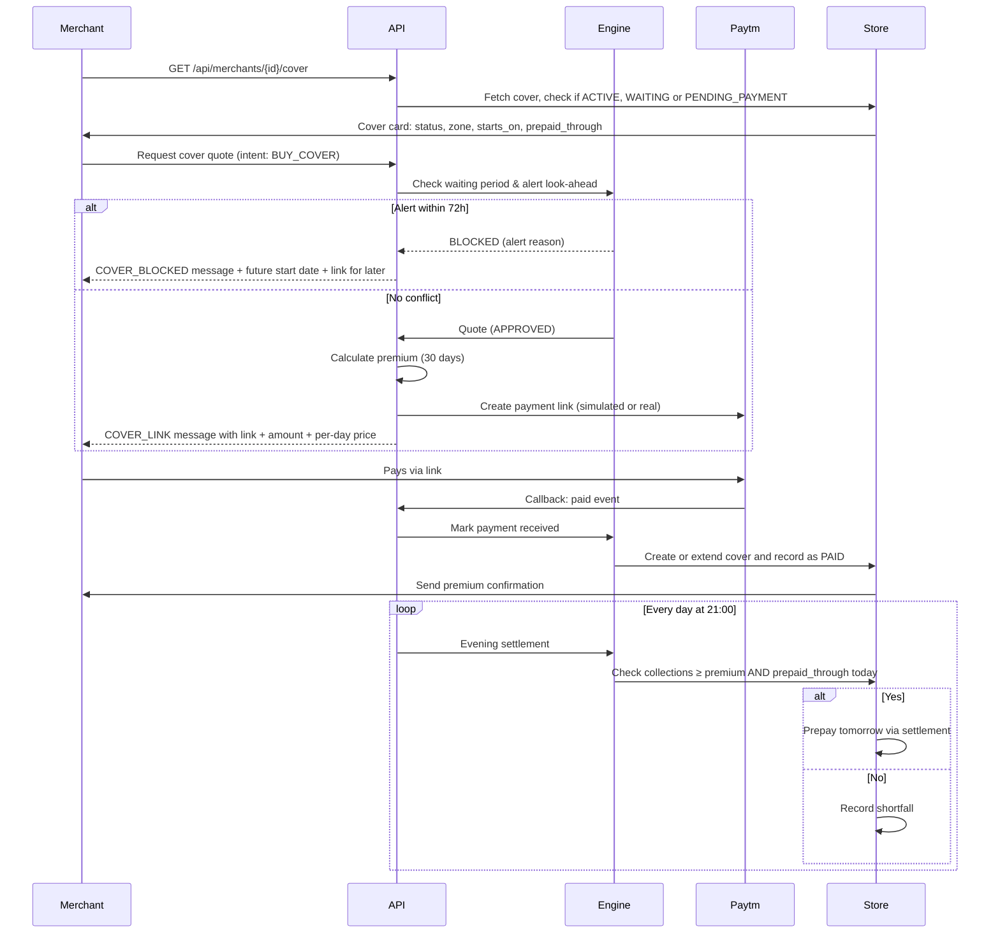
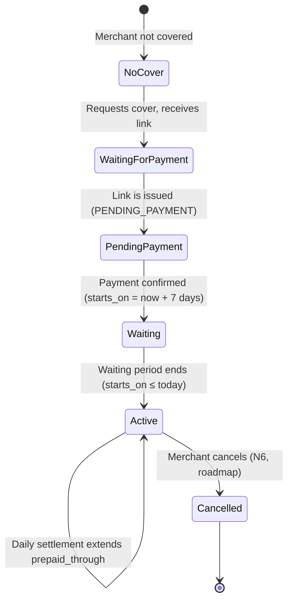

# Cover Purchase and Consent

| Status | Draft v1 · 2 Oct 2026 | Owner | Omkar Kadam | Audience | Product, engineering, compliance, legal | Related | [facts-and-sources.md](../../01-strategy/facts-and-sources.md), [policy-wording-and-cis.md](../policy-wording-and-cis.md), [user-journeys.md](../user-journeys.md), [ADR 0006](../../04-engineering/adr/0006-edi-holiday-is-the-lenders-decision.md) |
|---|---|---|---|---|---|---|---|

## TL;DR

- Cover requires a 7-day waiting period; a 72 h alert look-ahead prevents "cover me now" during an alert.
- Premium is expected-loss ÷ (1 − 0.35), minimum ₹2 a day; the first payment prepays 30 days.
- Cash-before-cover (Insurance Act s.64VB): cover starts only when the day's premium is received (first payment via link, then daily settlement deduction under standing consent).
- Consent is purpose-specific and withdrawable: sales data for cover and claims, slip data only for hospital-cash claims, voice notes, messaging.
- The consent centre (N6, roadmap) shows consent receipts, withdrawal actions, data deletion, and DPDP timeline notices in Hindi and English.

## 1. Summary

K6 and N6 together solve the last-mile friction in merchant cover adoption. The 7-day waiting period protects against anti-selection (merchants buying cover when they know a loss is coming); the 72 h look-ahead enforces the same rule by blocking purchases during a known alert. Cash-before-cover ensures the insurer bears no risk before the merchant pays. Settlement-linked deduction makes the daily premium frictionless. N6 (consent centre, P1) gives merchants transparency and control over their data: which purposes their data is used for, which data is shared with partners, and how to withdraw or delete it, all within the DPDP timeline and hedged carefully.

## 2. Status today and what changes

**Today (LIVE):**
- Cover quote logic in `backend/chhatri/policy/engine.py` (covers rules from `rules.yaml`).
- Premium calculation in `backend/chhatri/ledger/premiums.py` (expected loss formula, minimum ₹2 a day, 30-day prepayment).
- Payment link creation via `backend/chhatri/integrations/paytm.py` (MCP) or `paytm_sim.py` (simulated).
- Premium table (`backend/artifacts/premiums.json`) with per-zone daily paise (e.g., Z3 = 1,416 paise = ₹14.16 a day).
- Post-payment handling in `PremiumService.mark_paid()` (creates new cover or extends prepaid_through).
- Evening settlement deduction in `PremiumService.settle_evening()` (21:00 simulated, applies gross-settlement rule).

**Planned changes (on-site, P1):**
- N6 consent centre (GET `/api/merchants/{id}/consents` to list, POST to grant/withdraw).
- Data deletion action ("delete my slip data") in N1 mini-app.
- Consent receipts stored in the database.
- DPDP notice in Hindi and English with timeline.

## 3. User stories and jobs to be done

| User | Job | Story |
|---|---|---|
| **Ramesh (uncovered merchant, S-0907, Z3)** | Buy cover for his shop | "I'm worried about the rain tomorrow. Can I buy cover today? I see it costs ₹14.16 a day for 30 days (₹424.80). I fill in the payment link and I'm covered from 25 August." |
| **Ramesh** | Understand waiting period | "It says 'New cover starts after the waiting period — from 25 August. It won't apply to tomorrow's alert.' I know I'm blocked because an alert is tomorrow, but my cover will start in 7 days." |
| **Ramesh** | See cover start date | "After my payment is confirmed, I can see my cover is active and when the next premium is due." |
| **Ramesh** | Know his rights on data | "I see what data Chhatri uses (my sales, slips when I claim, voice notes). I can stop sharing any of it, and I can ask for my slip data to be deleted." |
| **Insurer** | Ensure no risk before payment | "Ramesh's cover doesn't start until we receive the premium. His payment link goes through Paytm; once Paytm confirms, his cover is live." |

## 4. Rules

From `backend/chhatri/policy/rules.yaml` (pilot-0.1):

| Parameter | Value | Effect |
|---|---|---|
| `cover.waiting_period_days` | 7 | Merchant must wait 7 days after cover purchase before it becomes active. |
| `cover.alert_lookahead_hours` | 72 | If a red alert is within 72 hours, block cover purchase (COVER_BLOCKED reason). |
| `premium.loading` | 0.35 | Premium = expected loss ÷ (1 − 0.35) ≈ expected loss × 1.538. |
| `premium.min_per_day_rupees` | 2 | Daily premium floor (₹2 per day, 200 paise). |
| `premium.first_payment_days` | 30 | First payment prepays 30 days. |
| `annual_limit_rupees` | 30,000 | Maximum payout per merchant per year. |

## 5. Flow and states

**States:**

## 6. Inputs and data sources

| Input | Source | Status | Used in |
|---|---|---|---|
| Merchant zone ID | Merchant KYC record | LIVE | Premium table lookup; waiting period calculation |
| Active alerts | Alert feed (simulated) | SIMULATED | Alert look-ahead check (72 h horizon) |
| Current cover status | Cover table (store) | LIVE | Quote logic; payment link display |
| Expected-sales forecast | LightGBM model (`backend/chhatri/forecast/model.py`) | SIMULATED (model trained on simulated sales) | Expected-loss calculation for premium |
| Daily sales data | Paytm settlement feed (simulated) | SIMULATED | Evening settlement deduction decision |
| Premium table (Z3 = 1,416 paise/day) | `backend/artifacts/premiums.json` | LIVE | Premium per-day amount; first-payment calculation |
| Paytm payment link callback | Paytm MCP or simulator | SIMULATED (unless Paytm staging keys set) | mark_paid() trigger; cover activation |
| Standing consent | Merchant consent record (N6, roadmap) | ROADMAP | Settlement deduction authorization |
| Officer token | Bearer token (demo mode) | SIMULATED | (not used in cover; included for completeness) |

## 7. Decision logic and checks

**For cover quote (K6):**

1. Check if merchant has an active cover.
   - If ACTIVE, WAITING or PENDING_PAYMENT: quote the next renewal (optional; not in current scope).
   - If none or CANCELLED: proceed to step 2.

2. Check waiting period.
   - If merchant has no cover: waiting period check is N/A (first cover).
   - If merchant is buying again: `requested_at + 7 days ≤ today` must be true.
   - If false: reject with BLOCKED reason.

3. Check alert look-ahead (72 h).
   - Query active alerts with `valid_from ≤ now + 72 h` (in merchant's zone).
   - If any red alert found: BLOCKED with reason, but still provide a quote for a start date > alert end + 72 h.
   - If none: proceed.

4. Calculate expected loss and premium.
   - Fetch merchant's expected-sales forecast from the model or a fallback.
   - Premium = expected loss ÷ (1 − 0.35).
   - Floor to minimum ₹2 a day (200 paise).
   - First payment = premium × 30 days.

5. Return quote (CoverQuote): outcome APPROVED or BLOCKED, start date (now + 7 days if BLOCKED, else now; forced to after alert if needed), premium per day, first payment, and reason_en/hi.

**For payment (mark_paid):**

1. Fetch or create cover: if no cover for this merchant, create one with status PENDING_PAYMENT.
2. Idempotent: if already PAID, extend prepaid_through and return.
3. Update cover: prepaid_through = paid_from_date + (first_payment_paise ÷ premium_per_day_paise) days.
4. If starting a new cover (status was PENDING_PAYMENT): set starts_on = now + 7 days (waiting period).
5. Change status to WAITING (not yet active).
6. Audit and send PREMIUM_PAID_STARTS message.

**For evening settlement (settle_evening, 21:00 simulated):**

1. Fetch all covers with status ACTIVE or WAITING (living covers).
2. For each cover: check if today's collections ≥ premium_per_day_paise AND prepaid_through == today.
3. If true: prepay tomorrow by issuing a SETTLEMENT_DEDUCTION payment record; prepaid_through += 1 day.
4. If false: audit shortfall (no deduction; merchant must pay manually, N/A in demo).

**Check code names (from `backend/chhatri/domain/enums.py`):**
- NONE for cover quotes (they are pre-decision checks, not policy-engine checks).

## 8. Merchant-facing copy

All copy is rendered from `backend/chhatri/conversation/messages.py`.

**Existing (exact strings):**

| Key | Hindi | English |
|---|---|---|
| `COVER_LINK` | `आगे के लिए कवर लेना हो तो {first_payment} {per_day}/दिन यहाँ भरें: {url}` | `To buy cover for later, pay {first_payment} {per_day}/day here: {url}` |
| `COVER_BLOCKED` | `नया कवर वेटिंग पीरियड के बाद शुरू होता है — {starts_on_hi} से। कल के अलर्ट पर यह लागू नहीं होगा।` | `New cover starts after the waiting period — from {starts_on_en}. It won't apply to tomorrow's alert.` |
| `PREMIUM_PAID_STARTS` | `{name_hi} जी, आपका {amount} का प्रीमियम मिल गया। आपका कवर {starts_on_hi} से शुरू होगा और {paid_to_hi} तक का प्रीमियम जमा है।` | `{name_en} ji, we received your {amount} premium. Your cover starts on {starts_on_en} and is paid through {paid_to_en}.` |
| `PREMIUM_PAID_ACTIVE` | `{name_hi} जी, आपका {amount} का प्रीमियम मिल गया। आपका कवर चालू है और {paid_to_hi} तक का प्रीमियम जमा है।` | `{name_en} ji, we received your {amount} premium. Your cover is active and paid through {paid_to_en}.` |

**Proposed changes:**
- None yet. If waiting period or premium calculation changes, update messages.py, SPEC.md, and tests.

## 9. Edge cases and failure modes

| Case | Behaviour | Message | Audit Event |
|---|---|---|---|
| Merchant has no zone in premium table (X3 fix) | X3 guard: loud error, not silent fallback to ₹2/day | API 500 with clear error message naming zone | `premium.table.missing_zone` |
| Red alert covers the zone; merchant still sends BUY_COVER intent | Quote returns BLOCKED with alert reason; link is still provided for start_date > alert end | COVER_BLOCKED + COVER_LINK | `cover.quote.blocked.alert` |
| Merchant pays the link, but the callback is delayed (>1 min) | mark_paid() is idempotent; payment is eventually recorded. If prepaid_through is not extended by evening, shortfall is logged and settlement does not deduct. | (no immediate message; next day's settlement or manual topup needed) | `premium.settled` or `premium.shortfall` |
| Merchant pays ₹424.80 via link, but only ₹200 lands in settlement (rare) | mark_paid() records full ₹424.80 (link callback); settlement checks if ₹200 ≥ ₹14.16 (yes), so next day is prepaid. Merchant's cover is not interrupted due to low daily premium threshold. | (silent; cover continues) | `premium.paid.link` + `premium.settled` |
| Merchant's cover expires (prepaid_through < today) | Cover status stays ACTIVE or becomes LAPSED (not in current scope). | (no automatic message; next claim is not covered) | `cover.lapsed` (future) |
| Two concurrent requests to create cover for the same merchant | Idempotent: second request updates the same cover, extends prepaid_through, or is rejected as duplicate (depends on implementation). | (API returns 409 or updates idempotently) | `cover.duplicate` (if rejected) |
| Paytm payment MCP is down (SIMULATED integration) | Payment link creation returns a SIMULATED URL (`https://paytm.me/sim-…`) with label. | COVER_LINK (same text, but link is marked SIMULATED) | `integration.paytm.simulated` |
| Zone's expected loss changes (model retrains) | Old cover's premium is locked (not retroactive); new quotes use new expected loss. | (silent; only affects future covers) | (no event; logged in model rebuild) |

## 10. Guardrails, privacy and compliance notes

**Guardrails:**
- Cover quote is a policy engine output (SPEC §0.2: code decides); it is never free-generated.
- Waiting period and alert look-ahead are hard rules: a merchant cannot override them by saying "I promise I have cover" (the rule checks are deterministic).
- Premium amount is calculated, not negotiated; the formula is shown to the merchant (expected loss ÷ (1 − 0.35), minimum ₹2).

**Privacy and DPDP (to be confirmed with the insurer partner's compliance team):**
- **Purpose: sales data for cover and claims** — Chhatri uses daily sales index to calculate expected loss and to detect when the merchant's sales fall. This is collected at purchase and during the cover period.
- **Purpose: slip data for hospital-cash claims only** — When a merchant claims, slip extraction reads the patient name, dates and hospital. This data is used only for that claim and must be deleted on request (N6).
- **Purpose: voice notes and messages** — Merchant voice check-ins and messages are logged for support and dispute resolution.
- **Withdrawal and deletion** — A merchant can withdraw consent at any time (cover can continue with cached expected loss; claims cannot proceed without slip consent). Data is deleted per merchant request (immediate for slip data; 30 days for transactional logs, depending on legal hold).
- **DPDP timeline** — Substantive obligations apply from 14 May 2027. Design now for purpose-specific, withdrawable consent (N6 roadmap).
- **Consent receipt** — Every consent grant is recorded with timestamp, purpose, and version. Recorded at purchase and at each renewal.

**Insurance Act s.64VB (cash-before-cover):**
- Cover for a day starts only when that day's premium has been received.
- First 30 days: premium received via payment link callback (Paytm confirms payment).
- Subsequent days: premium received via evening settlement deduction (merchant's explicit standing consent authorizes daily deduction from settlement).
- If a day's settlement is short (rare), that day's cover remains pending until the deduction lands or the merchant pays manually (not in current scope).

**IRDAI parametric product filing:**
- This is a parametric (index-based) income cover, not indemnity-based. Filing is by the partner insurer, possibly through IRDAI's regulatory sandbox.
- Not a requirement for the hackathon demo; handled post-hackathon.

## 11. Acceptance criteria

**Given** Ramesh (S-0907, Z3) has no cover and requests cover during a monsoon replay.
**When** a red alert is 48 hours away (within 72 h look-ahead).
**Then** the quote is BLOCKED with message `COVER_BLOCKED`, start date is set to after the alert period, and a `COVER_LINK` is provided for that date.

**Given** the alert has passed and Ramesh requests cover again.
**When** there is no active alert within 72 hours.
**Then** the quote is APPROVED, start date = now + 7 days (waiting period), and the premium is ₹14.16 a day (Z3 from premiums.json = 1,416 paise), first payment ₹424.80 for 30 days.

**Given** Ramesh pays the ₹424.80 link and the callback succeeds.
**When** mark_paid() is called.
**Then** a cover is created with status WAITING, starts_on = now + 7 days, prepaid_through = now + 30 days, and the message `PREMIUM_PAID_STARTS` is sent showing the deduction schedule.

**Given** the cover is WAITING and the waiting period ends (starts_on <= today).
**When** a claim is detected on that day.
**Then** the cover is counted as ACTIVE and the claim is eligible (X2 published expected day validation).

**Given** Ramesh's cover is ACTIVE and 21:00 arrives (evening settlement).
**When** the day's sales collections ≥ premium and prepaid_through = today.
**Then** a SETTLEMENT_DEDUCTION payment is recorded and prepaid_through is extended by 1 day.

**Given** Ramesh's cover is ACTIVE and a hospital-cash claim is detected.
**When** consent for "slip data for hospital-cash claims" is in force.
**Then** slip extraction is permitted and the merchant's slip is read.

**Given** a merchant grants consent for "sales data for cover and claims" at purchase.
**When** the consent centre (N6) is opened.
**Then** the consent purpose is listed, withdrawal button is visible, and a receipt with timestamp is shown.

## 12. Telemetry and audit events

**Audit events (from `backend/chhatri/audit/log.py`):**

| Action | Subject | Triggered by | Data fields |
|---|---|---|---|
| `cover.quote.requested` | cover | Engine.quote_cover() | merchant_id, requested_at, outcome (APPROVED/BLOCKED), reason (if BLOCKED) |
| `cover.created` | cover | PremiumService.mark_paid() on a new merchant | merchant_id, purchased_at, starts_on, premium_per_day_paise, status (PENDING_PAYMENT → WAITING) |
| `cover.extended` | cover | PremiumService.mark_paid() (existing cover) | merchant_id, prepaid_through (old → new), status |
| `premium.paid.link` | premium_payment | mark_paid() on link callback | merchant_id, cover_id, amount_paise, method (LINK), paid_at, source ("paytm_callback") |
| `premium.settled` | premium_payment | settle_evening() | merchant_id, cover_id, amount_paise, method (SETTLEMENT_DEDUCTION), paid_at (at 21:00), source ("settlement (simulated)") |
| `premium.shortfall` | premium_payment | settle_evening() when collections < premium | merchant_id, cover_id, expected_paise, actual_paise, shortfall_paise |
| `consent.granted` | consent | PremiumService.mark_paid() or merchant action (N6) | merchant_id, purpose (e.g., "sales_for_cover"), version, timestamp |
| `consent.withdrawn` | consent | Merchant action (N6, roadmap) | merchant_id, purpose, timestamp |
| `consent.data_deleted` | consent | Merchant action (N6, roadmap) | merchant_id, data_type ("slip"), timestamp |

**Metrics to track:**
- Cover adoption rate (merchants with active cover ÷ all merchants).
- Blocked cover rate (quotes with BLOCKED outcome ÷ all quote requests).
- Premium collection rate (settlement deductions ÷ expected daily deductions).
- Waiting period completion rate (covers that reach ACTIVE ÷ covers created).

## 13. Planned changes and tasks

| Task | Owner | Effort (h) | Feature | Priority |
|---|---|---|---|---|
| **X3: fail loudly on missing zone in premium table** | Ujjwal | 0.5 | K6, X3 | P0 |
| **N6 consent centre (UX + backend)** | Omkar + Ujjwal | 6 | K6, N6 | P1 |
| GET `/api/merchants/{id}/consents` — list consents with purposes | Ujjwal | 1.5 | K6, N6 | P1 |
| POST `/api/merchants/{id}/consents` — grant/withdraw consent | Ujjwal | 1.5 | K6, N6 | P1 |
| Data deletion action in mini-app (delete slip data) | Omkar | 1 | K6, N6 | P1 |
| DPDP notice (Hindi + English) in consent centre | Omkar | 0.5 | K6, N6 | P1 |
| Consent receipt storage and display | Ujjwal | 1 | K6, N6 | P1 |

## 14. Test plan

**Existing tests (pass with current code):**
- `backend/tests/policy/test_engine.py`: quote_cover() checks waiting period and alert look-ahead; returns APPROVED or BLOCKED with reason.
- `backend/tests/ledger/test_premiums.py`: premium_per_day() returns the value from premiums.json or the minimum ₹2/day.
- `backend/tests/ledger/test_premiums.py`: first_payment calculation (premium × 30 days).
- `backend/tests/integrations/test_paytm.py`: payment link creation; callback handling (mark_paid()).
- `backend/tests/ledger/test_premiums.py`: settle_evening() extends prepaid_through when conditions are met.

**New tests needed (P1):**
- **X3 test**: premium_per_day(zone="Z_MISSING") raises IntegrationError or ValueError with message naming the zone.
- `test_waiting_period_blocks_old_cover`: merchant with CANCELLED cover from 1 day ago requests new cover; quote is BLOCKED (waiting period not met).
- `test_alert_72h_lookahead`: red alert valid 14:00–20:00 today; quotes requested at 12:00 are BLOCKED; quotes at 12:01 tomorrow are APPROVED.
- `test_mark_paid_idempotent`: two concurrent mark_paid() calls for the same link return the same cover state.
- `test_cover_status_progression`: PENDING_PAYMENT → WAITING (at purchase) → ACTIVE (when starts_on ≤ today).
- `test_settlement_deduction_extends_prepaid`: settle_evening() on day N when prepaid_through = N and collections ≥ premium; check prepaid_through = N+1.

**Manual tests (DEMO.md test 3: buy_cover):**
- Ramesh (S-0907, Z3) requests cover at 18:00 on 18 Aug 2025 (monsoon scenario, red alert tomorrow).
- Quote is BLOCKED; message shows start date 25 August.
- Link is still provided with amount ₹424.80 (₹14.16 × 30 days).
- Merchant pays the link (simulated callback).
- Cover transitions to WAITING, prepaid_through = 30 days from now.

## Open questions

1. **Owner: Omkar** — Should the "cash-before-cover" mechanism show the merchant a message each time a daily settlement deduction happens, or only at the initial purchase confirmation? (Proposal: once at purchase; daily deductions are silent unless shortfall occurs.)

2. **Owner: Ujjwal** — Should the consent withdrawal action immediately suspend the cover, or should the cover continue with cached data and be flagged as "covered without active consent"? (Proposal: continue with flag; insurer decides post-hackathon.)

3. **Owner: Ujjwal** — How should the premium table be versioned and updated? Should old covers' premiums be locked, or should they track the latest table? (Proposal: lock at purchase; model retraining is a post-hackathon activity.)

4. **Owner: Omkar** — Should the waiting period be waived for merchants who already have had a previous cover (loyalty signal)? (Proposal: no waiver; 7 days is the insurer's anti-selection protection.)

## Changelog

- 2026-10-02 · v1.3 · second fact-check pass
- 2026-10-02 · v1.2 · final consistency pass against the code
- 2026-10-02 · v1.1 · fact-check pass
- 2026-10-02 · v1 · first draft
