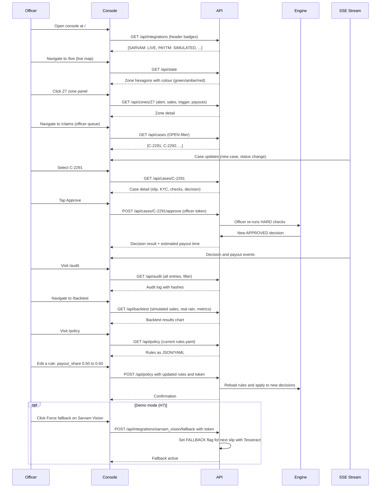

# Claims Officer Console

| Status | Draft v1 · 2 Oct 2026 | Owner | Ujjwal Pardeshi | Audience | Engineering, product, design | Related | [system-architecture.md](../../04-engineering/system-architecture.md), [user-journeys.md](../user-journeys.md), [screens-and-flows.md](../../03-design/screens-and-flows.md), [ADR 0005](../../04-engineering/adr/0005-mini-app-inside-the-console.md) |
|---|---|---|---|---|---|---|---|

## TL;DR

- K8 is the claims officer's command centre: a live city heat map (hex), zone alerts and sales, the claims queue, merchant detail, audit log, honest backtest, and policy rules editor.
- H7 (provider panel, P1) shows each component's status (LIVE, SIMULATED, FALLBACK) with latency and a demo-mode-only force-fallback switch.
- H8 (ops strip, P1) displays real counts from the database: open cases by state, oldest SLA clock, share auto-decided vs human, today's payouts by zone.
- Officer authentication is via bearer token in demo mode (handed by `/api/session`) or real auth in production (open question).
- Every page uses the same data sources and real-time subscriptions (SSE) so officer and merchant views stay in sync.

## 1. Summary

K8 is the UI layer for the claims officer (Rajesh), the insurer's human reviewer. It replaces email queues and spreadsheets with live context: the city heat map shows where claims are clustering, the zone panel shows sales vs expected, the case queue sorts by SLA urgency, the evidence (slip + KYC extraction) is side-by-side, and one tap approves or declines the claim. The audit log is immutable and hash-chained. The backtest page shows the model's performance honestly (simulated sales, real rain). The policy page lets the insurer tune rules before deployment. H7 and H8 add transparency: the provider panel shows which integrations are live vs simulated, and the ops strip shows the real numbers so operators can see bottlenecks at a glance.

## 2. Status today and what changes

**Today (LIVE in the console):**
- Frontend pages in `frontend/src/pages/{Overview,Live,Claims,Merchant,Audit,Backtest,Policy}.tsx`.
- Backend API routes in `backend/chhatri/api/routers/{cases,meta,audit,policy}.py`.
- Real-time event stream (SSE) via `backend/chhatri/api/sse.py` for case updates, decisions, payouts.
- Officer token validation in `backend/chhatri/api/security.py` (require_officer dependency).
- Case list and detail views in `backend/chhatri/api/routers/cases.py` (GET `/api/cases` and `/api/cases/{id}`).
- Merchant views in `backend/chhatri/api/routers/merchant.py` (GET `/api/merchants/{id}`).
- Audit log retrieval in `backend/chhatri/api/routers/audit.py` (GET `/api/audit` and `/api/audit/verify`).
- Backtest results in `backend/chhatri/backtest/report.py` (GET `/api/backtest`).
- Policy rules editor in `backend/chhatri/api/routers/policy.py` (GET/POST `/api/policy`).

**Planned changes (on-site, P1):**
- H7: POST `/api/integrations/{component}/fallback` — demo-mode-only switch to force SIMULATED mode for a component.
- H8: GET `/api/ops/summary` — counts from database only (open cases, SLA clocks, auto vs human, payouts).
- H7 + H8 UI in the console header (provider panel) and right-side ops strip.
- Accessibility improvements: keyboard navigation, ARIA labels (X plan).

## 3. User stories and jobs to be done

| User | Job | Story |
|---|---|---|
| **Rajesh (claims officer)** | Understand the current situation | "I open the console and see the live city map with zone status. Z7 is red (low sales), and I can see how many cases are OPEN, how many are past due, and which 3 cases need my attention right now." |
| **Rajesh** | Review a claim | "I select the first case. I see the merchant's slip and the extracted data (patient name, dates) alongside the KYC name and match score. The system has already run the policy checks; I can re-run them or approve/decline." |
| **Rajesh** | Know the payout timing | "I approve a claim. The system tells me when the merchant will receive the money (4 min after my approval, with the evening settlement)." |
| **Rajesh** | Debug a slow integration | "I look at the provider panel. It shows Sarvam vision is LIVE with 0.8 s latency. If it gets stuck, I can click 'Force fallback' and the demo will use Tesseract instead." |
| **Ops manager** | Monitor the system | "The ops strip shows: 5 open cases, oldest is 3 hours old, 87% were auto-approved, 12 payouts went out today. I can spot trends and alert the team if something breaks." |
| **Auditor** | Verify every decision | "I visit the audit page. Every payout, case, and decision is logged with timestamps and hash-chained so I can verify no step was hidden or reordered." |

## 4. Rules

From `backend/chhatri/policy/rules.yaml` (pilot-0.1) and the console display logic:

| Parameter | Value | Effect |
|---|---|---|
| `dispute_sla_hours` | 24 | Cases due within 24 h of opening are flagged as "due in X hours". |
| `payout_rail_delay_minutes` | 4 | Payouts appear in the feed after 4 min (settlement delay). |
| `area.daily_cap_rupees` | 2,500 | Displayed in area payout details. |
| `personal.daily_cap_rupees` | 1,500 | Displayed in hospital-cash payout details. |

## 5. Flow and states

**States:** Pages are stateless (driven by query params and real-time events); no local state unless the user edits rules or filters.

## 6. Inputs and data sources

| Page | Input | Source | Status | API Endpoint |
|---|---|---|---|---|
| Overview (/) | Problem statement, team, roadmap | Hardcoded HTML | LIVE | N/A |
| Live (/live) | Hex zone data, sales, alerts | Zone index, alert feed | SIMULATED | GET `/api/state` |
| Zone panel (modal) | Zone detail, payouts, cases | Zone, payout, case tables | SIMULATED | GET `/api/zones/{zone_id}` |
| Cases (/claims) | Case queue, filter | Case table | LIVE | GET `/api/cases?status=OPEN` |
| Case detail (modal) | Slip image, KYC extraction, checks, decision | Claim, decision tables; slip storage | SIMULATED | GET `/api/cases/{case_id}` |
| Merchant (/merchant/{id}) | Merchant record, cover, claims, messages | Merchant, cover, claim tables | LIVE | GET `/api/merchants/{id}` |
| Audit (/audit) | Audit entries, hash chain | Audit table | LIVE | GET `/api/audit?filter=...` |
| Backtest (/backtest) | Simulation results, metrics | Backtest report artifact | SIMULATED | GET `/api/backtest` |
| Policy (/policy) | Rules YAML | rules.yaml | LIVE | GET `/api/policy`, POST to update |
| Header (provider panel, H7) | Integration status | Integration registry, latency | MIXED | GET `/api/integrations` |
| Ops strip (H8) | Counts, clocks, metrics | Case, decision, payout tables | LIVE | GET `/api/ops/summary` (new) |

## 7. Decision logic and checks

**For case queue (CaseDetail view):**
- Query `/api/cases` filters by status (OPEN, ALL).
- Each case displays: kind (PERSONAL_CLAIM_REVIEW, DISPUTE, AREA_REVIEW), merchant name, opened_at, due_by, summary_en.
- Sorting: overdue first (now > due_by), then by opened_at (oldest first).
- Selection: case_id is persisted in URL params; stale on scenario reset.

**For case detail (case + decision + slip):**
- GET `/api/cases/{case_id}` returns case and decision.
- Slip image is fetched from `backend/data/slips/{slip_id}.json` (embedded as data URI in Slip model).
- Extracted data (name, dates, hospital, confidence) is in decision.slip.extraction or case.evidence.
- KYC name is in merchant.kyc_name.
- Match score is shown from the NAME_MATCHES_KYC check result.
- Officer can approve (re-runs HARD checks) or decline.

**For live map (zone hexagons):**
- GET `/api/state` returns all zones with their hourly index_pct and colour.
- Colour logic:
  - ≥ 80%: green (normal)
  - 50–80%: amber (watch)
  - < 50%: red (triggered)
  - During alert and < 50%: dark red (alert + low sales).
- Clicking a zone shows: alert (if any), actual/expected sales, shops in index, trigger status, payouts.

**For ops strip (H8, counts from DB only):**
- GET `/api/ops/summary` returns:
  - `open_cases_by_status`: {OPEN: 5, ...}
  - `oldest_case_due_by`: datetime
  - `auto_decided_pct`: (decisions with decided_by == "system") / total today
  - `payouts_by_zone_today`: {Z7: 312, Z3: 141, ...}
  - `total_paid_today_paise`: sum of payout.amount_paise.

**For provider panel (H7, LIVE/SIMULATED/FALLBACK):**
- GET `/api/integrations` returns component status (from `backend/chhatri/integrations/registry.py`).
- Each component tracks: name, mode (LIVE/SIMULATED), last_latency_ms (updated on each call), fallback_forced (demo only).
- If fallback_forced=true for a component, the next call uses the degraded path (e.g., Sarvam Vision → Tesseract).
- POST `/api/integrations/{component}/fallback` (demo mode only) toggles fallback_forced.

## 8. Merchant-facing copy

Not directly applicable to the console (officer-facing). However, messages.py templates are referenced in the case detail to show what the merchant will receive. See fs-06 and fs-07 for merchant copy.

## 9. Edge cases and failure modes

| Case | Behaviour | Display | Audit Event |
|---|---|---|---|
| Officer views a case from a different scenario (stale URL) | Frontend detects scenario reset; clears case selection. | "No case selected" message | (no audit event) |
| Officer selects a case but network fails mid-decision | API returns error; case stays OPEN; no decision recorded. | Error toast: "Failed to save. Please try again." | (no case.resolve event) |
| Two officers approve the same OPEN case simultaneously | API is idempotent; second request gets 409 (case no longer OPEN). | Error: "Case already resolved" | `case.resolve` once, 409 on second |
| Officer forces fallback on Sarvam vision; slip is still processed | Next slip uses Tesseract (offline); confidence may drop; if < 0.80, REFERRED anyway. | Slip detail shows "fallback: Tesseract" label | `integration.fallback.forced` |
| Audit log is corrupted; hash chain breaks | GET `/api/audit/verify` fails; console shows warning. | Red alert in header | `audit.verify.failed` (if detected) |
| Backtest job is still running (long computation) | GET `/api/backtest` returns 202 (pending) or cached result. | "Computing..." spinner | (no event; job logs separately) |
| Policy editor: officer enters invalid YAML | POST `/api/policy` returns 400 with parse error. | Error toast: "Invalid YAML: ..." | (no policy.updated event) |
| Zone hexagons render but no sales data for a zone | Hex shows grey (neutral) instead of coloured. | No alert, no index pct shown | (data not ready) |

## 10. Guardrails, privacy and compliance notes

**Officer authentication (open question, see section 11.3):**
- Demo mode: `/api/session` hands the token to the console (proof-of-concept only).
- Production: Real officer login (LDAP, SSO, or role-based access control).
- Token scope: claims-officer actions only (approve, decline, edit policy); no merchant data export.

**Privacy:**
- Officer views health data (patient name, hospital, dates) in case evidence; this is for decision-making only.
- Slip data is not persisted in the audit log; only the decision (checks, outcome, amount) is logged.
- Officers cannot export, download, or share the console data (no copy-paste, no screenshot).

**Compliance (audit, IRDAI, DPDP):**
- Every decision is logged immutably with timestamp, officer id, checks run, and outcome.
- Audit log is hash-chained (SHA256 of prev_hash + entry data) to prevent tampering.
- `/api/audit/verify` can be run by auditors to check chain integrity.
- Officer actions (approve, decline) are explicitly logged so the insurer can report to IRDAI on human vs auto decisions.

**Accessibility:**
- Keyboard navigation: Tab through case queue, arrow keys to scroll, Enter to select, Ctrl+S to save (future).
- ARIA labels on all buttons and lists (future).
- High-contrast mode for zone colours (future).

## 11. Acceptance criteria

**Given** the console is open and the officer is authenticated.
**When** the officer navigates to `/live`.
**Then** a hex map of Mumbai wards is displayed, coloured by sales index (green/amber/red), with a legend and zone labels.

**Given** a red alert is active for Z7 and sales have fallen to 37%.
**When** the officer clicks the Z7 hex.
**Then** a panel opens showing: alert headline, actual/expected sales, shop count, trigger status, and a list of payouts from the last trigger.

**Given** an OPEN case C-2291 is in the queue with a slip from Anil.
**When** the officer selects the case.
**Then** the case detail shows: merchant name (Anil), slip image, extracted patient name, extraction confidence, KYC name, match score, and check results (all PASS or the FAIL reason).

**Given** the officer taps Approve on the case.
**When** the policy engine re-runs HARD checks and all pass.
**Then** a new APPROVED decision is shown with the payout amount, and a message tells the officer "Payout estimated in 4 minutes."

**Given** the officer visits `/audit`.
**When** they filter by subject_type = "decision" and date range.
**Then** a list of decisions is shown with timestamps, hashes, and a "Verify chain" button.

**Given** the officer clicks "Verify chain".
**When** the browser computes the hash chain.
**Then** a message confirms "Chain valid: 312 entries, 0 breaks."

**Given** the console is in demo mode (DEMO.md setup).
**When** the header shows the provider panel (H7) with Sarvam Vision as LIVE.
**Then** the officer can click "Force fallback" and the next slip will use Tesseract instead.

**Given** the officer visits `/backtest`.
**When** the page loads.
**Then** it shows "Backtest results: simulated sales · real rainfall (Jun–Sep 2025)" with a chart of trigger accuracy and loss ratio.

**Given** the officer visits `/policy`.
**When** they view the current rules.
**Then** the rules are displayed in YAML format; if they are officer-authenticated, an edit button is visible.

**Given** the ops strip (H8) is visible in the top-right corner.
**When** the replay is running.
**Then** the strip updates in real time showing: "Cases 5 | Oldest 3h | Auto 87% | Paid ₹58,900 Z7: 312 Z3: 141 Z12: 125".

## 12. Telemetry and audit events

**Audit events (from `backend/chhatri/audit/log.py`):**

| Action | Subject | Triggered by | Data fields |
|---|---|---|---|
| `case.open` | case | Automatic (dispute, referral) | kind, merchant_id, opened_at, due_by |
| `case.resolve` | case | officer_decide() | status, resolved_by (officer:[id]), resolved_at, decision_id |
| `decision.officer` | decision | officer_decide() | claim_id, merchant_id, outcome, amount_paise, checks, decided_by |
| `audit.verify` | audit_log | GET `/api/audit/verify` | chain_valid (bool), breaks_count, last_verified_seq |
| `policy.updated` | policy | POST `/api/policy` | rules_version, changed_fields (delta), changed_by |

**Frontend metrics (not audited, for ops only):**
- Case queue open count (displayed in UI).
- Average case decision time (from opened_at to resolved_at).
- Officer decision accuracy (not in current scope; future: compare to policy engine outcome).

## 13. Planned changes and tasks

| Task | Owner | Effort (h) | Feature | Priority |
|---|---|---|---|---|
| **H7: Provider panel (status + latency display)** | Ujjwal | 2 | K8, H7 | P1 |
| **H7: Force fallback endpoint** (POST `/api/integrations/{component}/fallback`) | Ujjwal | 1 | K8, H7 | P1 |
| **H8: Ops strip (real counts)** (GET `/api/ops/summary`) | Ujjwal | 2 | K8, H8 | P1 |
| Accessibility: keyboard nav (Tab, arrows, Enter) | Ujjwal | 2 | K8 | P1 |
| Accessibility: ARIA labels on all interactive elements | Ujjwal | 1 | K8 | P1 |
| Zone detail panel (click hex → modal) | Ujjwal | 2 | K8 | P1 |
| Backtest chart (trigger accuracy, loss ratio) | Omkar + Ujjwal | 2 | K8 | P1 |
| Policy editor YAML syntax highlight | Ujjwal | 1 | K8 | P1 |
| Audit chain verification (browser-side hash check) | Ujjwal | 1.5 | K8 | P1 |

## 14. Test plan

**Existing tests (pass with current code):**
- `frontend/src/pages/Claims.test.tsx`: case queue renders with filter options; selection persists in URL.
- `frontend/src/pages/Live.test.tsx`: hex map renders zones with correct colours.
- `frontend/src/pages/Audit.test.tsx`: audit entries render with timestamps.
- `backend/tests/api/test_cases.py`: GET `/api/cases` returns list; GET `/api/cases/{id}` returns detail.
- `backend/tests/api/test_meta.py`: GET `/api/integrations` returns status.
- `backend/tests/api/test_audit.py`: GET `/api/audit` returns entries; verify returns chain status.

**New tests needed (P1):**
- **H7 tests:**
  - `test_get_integrations_shows_live_status`: GET `/api/integrations` includes `mode: "LIVE"` or `"SIMULATED"`.
  - `test_integration_latency_tracked`: each component tracks `last_latency_ms` after a call.
  - `test_force_fallback_demo_mode_only`: POST `/api/integrations/sarvam_vision/fallback` returns 403 outside demo mode.
  - `test_force_fallback_sets_flag`: after forcing, next slip uses offline Tesseract.

- **H8 tests:**
  - `test_ops_summary_counts_from_db`: GET `/api/ops/summary` returns counts that match DB (case, decision, payout tables).
  - `test_ops_summary_auto_decided_pct`: pct = (count where decided_by == "system") / total.
  - `test_ops_summary_payouts_by_zone_today`: dict keys are zone_ids; values are count or sum.
  - `test_ops_summary_oldest_case_due_by`: returns the earliest due_by from open cases.

- **K8 general:**
  - `test_case_queue_sort_by_overdue_then_opened`: cases with now > due_by appear first.
  - `test_case_selection_stale_after_scenario_reset`: URL param is cleared when scenario changes.
  - `test_zone_hex_colour_by_index`: index < 50% → red; 50–80% → amber; ≥ 80% → green.
  - `test_backtest_shows_simulated_sales_real_rain_label`: page displays "simulated sales · real rainfall".

**Manual tests (DEMO.md and demo runbook):**
- Open console, verify header badges show correct integration status (SARVAM: LIVE if keys set, else SIMULATED).
- Click a zone hex; verify detail panel opens with alert, sales, trigger status.
- Select case C-2291; verify slip, extraction, KYC match all render.
- Approve case; verify new APPROVED decision is shown and SSE event updates the queue.
- Force fallback on Sarvam; process next slip with Tesseract; verify "fallback" label in slip detail.
- Visit /audit; verify entries render with hashes.
- Click "Verify chain"; verify hash check passes.

## Open questions

1. **Owner: Ujjwal** — In production, how should officer authentication work? Should the console use LDAP / SSO, or is a bearer token in the Authorization header sufficient? (Demo: `/api/session` is proof-of-concept; production needs real auth system.)

2. **Owner: Ujjwal** — Should the ops strip auto-refresh, or should it update only on page reload / manual refresh? (Proposal: refresh every 10 s if SSE stream is active; else manual.)

3. **Owner: Ujjwal** — Should the zone detail panel show all payouts in that zone, or only the most recent trigger's payouts? (Proposal: most recent 100 payouts, filterable by date.)

4. **Owner: Ujjwal** — Should the policy editor allow editing only certain fields (e.g., payout_share, caps) or all of rules.yaml? (Proposal: all fields; changes take effect immediately and are logged as policy version updates.)

5. **Owner: Ujjwal** — Should the officer be able to bulk-approve cases (e.g., all REFERRAL cases from the same slip issue)? (Proposal: no; each case must be decided individually to ensure human review.)

## Changelog

- 2026-10-02 · v1.3 · second fact-check pass
- 2026-10-02 · v1.2 · final consistency pass against the code
- 2026-10-02 · v1.1 · fact-check pass
- 2026-10-02 · v1 · first draft
