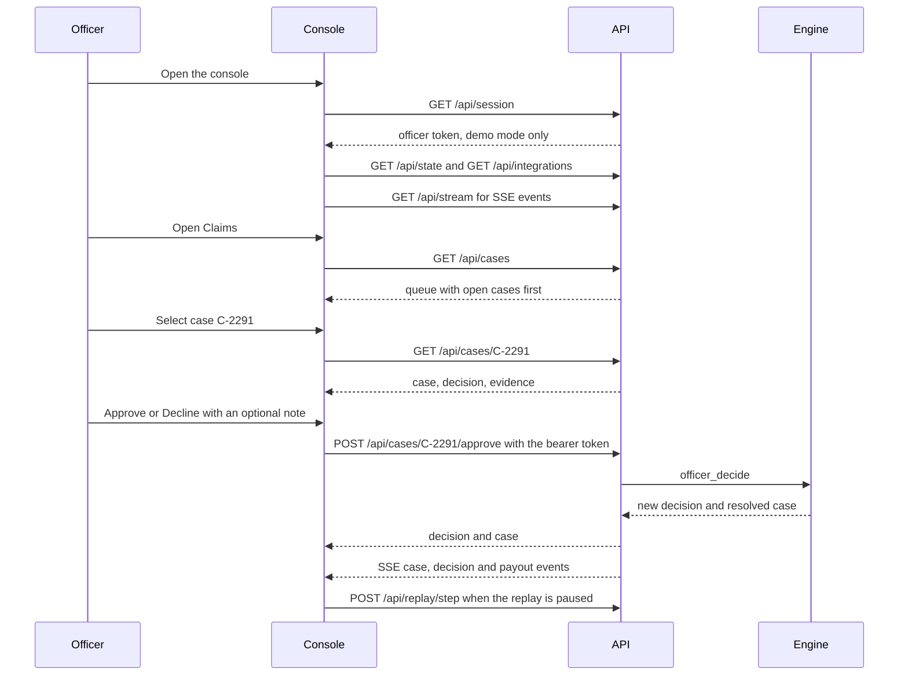
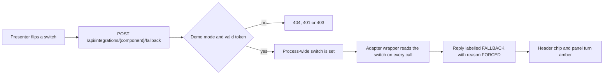
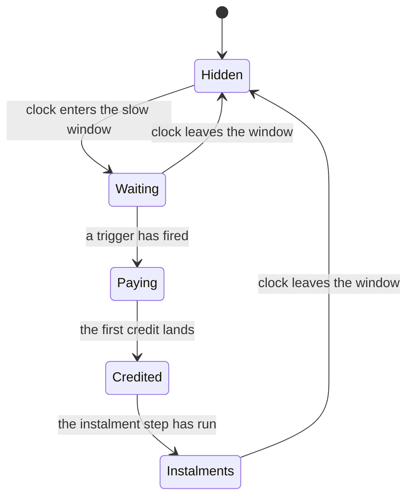

# Feature spec: Claims officer console (K8, X6, H8, H24)

| | |
|---|---|
| Status | v1.6 · K8 BUILT (commit 86575ea): seven pages, officer queue, audit, backtest, read-only policy · X6 and H26 labels BUILT, wave 2 · H8, H24, presenter mode, projector polish and the moment card BUILT, wave 4 (behind `h8_ops_strip`, `h24_whatif`, `console_polish`) |
| Owner | Omkar Kadam (console), Ujjwal Pardeshi (backend routes and engine) |
| Date | 2 Oct 2026 |
| Audience | Console and backend engineers, designers, the person presenting |
| Related | [fs-01 area auto-claim](fs-01-area-auto-claim.md) · [fs-03 EDI holiday](fs-03-edi-holiday.md) · [fs-05 Ask Chhatri](fs-05-ask-chhatri.md) · [fs-06 explanations, disputes and grievance](fs-06-explanations-disputes-and-grievance.md) · [fs-09 policy engine and audit](fs-09-policy-engine-and-audit.md) · [Screens and flows](../../03-design/screens-and-flows.md) · [Design system](../../03-design/design-system.md) (type scale §2.5, console §8.1) · [Data model and API](../../04-engineering/data-model-and-api.md) · [System architecture](../../04-engineering/system-architecture.md) · [ADR 0004](../../04-engineering/adr/0004-live-simulated-fallback-labels.md) · [ADR 0005](../../04-engineering/adr/0005-mini-app-inside-the-console.md) · [User journeys](../user-journeys.md) · [Demo runbook](../../06-delivery/demo-runbook.md) · [Implementation guide](../../04-engineering/implementation-guide.md) |

## TL;DR

- **K8 serves two people.** The claims officer decides only what the engine could not: a REFERRED personal claim, or a DISPUTE. The presenter walks judges through a replay. Seven pages are BUILT and run against the real backend or the in-browser mock.
- **The console never changes a rule.** `/policy` is read-only. There is no policy editor and no `POST /api/policy`. A rule change is a code change with a new `rules_version`, so every decision stays tied to the rules that made it. The old plan for an editor is dropped.
- **X6 and H26 (BUILT, wave 2).** A provider panel shows LIVE, SIMULATED or FALLBACK for every component, with a demo switch that forces a component into FALLBACK. AI output carries mode, provider and reason.
- **H8 (BUILT, wave 4).** An ops strip of five numbers with exact definitions (section 10), from `GET /api/ops/summary`.
- **H24 (BUILT, wave 4).** A what-if panel. A judge changes the alert, the three hourly sales indices or the shop count, and the real trigger rule recomputes. Read-only, `POST /api/whatif/area`.
- **Also wave 4.** Presenter mode, projector polish against the design-system type scale, and a trigger-to-payout moment card built on the replay pieces that exist today.
- **Priority.** Everything here is P0, built in waves behind feature flags (section 19). A piece that is not finished is hidden, never shown half-working.

IDs covered: **K8 · X6 · H8 · H24 · H26 (console side) · H13 and H14 (console side) · presenter mode · projector polish**.

## 1. Summary

K8 is where decisions become visible. The live map shows where sales fell and which zones were paid. The claims queue holds the cases the engine handed to a human. The case panel puts the slip, the KYC name, the checks and the engine's own decision side by side, and one tap approves or declines. The audit page recomputes the hash chain on demand. The backtest and policy pages show how the engine was tested and which rules it runs.

The console is also the demo surface. This spec adds what a judge asks for next: what is live and what is simulated (provider panel), how busy and how fast the operation is (ops strip), and what happens if the inputs change (what-if panel). All three read the same engine facts as the merchant's phone. There is one rule and several views of it.

Credits, by project name only (links in [Competitive landscape](../../01-strategy/competitive-landscape.md)): what-if panel (H24) from Resolve OS and FinPath AI; mode, provider and reason labels (H26) from Rakshak and Soundbox Saathi; source chips (H13) from Praman; counterfactual line (H14) from One-Tap Credit and Claim Advocate.

## 2. Status today and what changes

| What | Status | Where | Change |
|---|---|---|---|
| Seven pages | BUILT | `frontend/src/App.tsx`, `frontend/src/pages/`: Overview `/`, Live map `/live`, Claims `/claims`, Merchant phone `/merchant/:id`, Audit `/audit`, Backtest `/backtest`, Policy `/policy` | Wave 4 changes in sections 10 to 13 |
| Stack | BUILT | React 19, Vite 8, TypeScript, plain CSS tokens in `styles/tokens.css`, in-browser mock backend in `frontend/src/mock` (`npm run dev:mock`) | None. Tailwind and shadcn are for the mini-app only |
| Routes the console calls | BUILT | `backend/chhatri/api/routers/`: `cases.py`, `live.py`, `meta.py`, `records.py`, `replay.py`, `merchants.py`, `phone.py`, `stream.py`, `media.py` | Three new routes: `POST /api/integrations/{component}/fallback`, `GET /api/ops/summary`, `POST /api/whatif/area` |
| Officer queue and one-tap decision | BUILT | `pages/Claims.tsx`, `components/claims/`; `POST /api/cases/{case_id}/approve` and `/decline` call `Orchestrator.officer_decide` | DISPUTE button labels, source chips, counterfactual line (section 8) |
| Live event stream | BUILT | `GET /api/stream` (SSE), `state/live.tsx` | The ops strip and the moment card subscribe to it |
| Audit page | BUILT | `pages/Audit.tsx`: full log, text filter, "Verify chain" calls `GET /api/audit/verify` | None |
| Policy page | BUILT, read-only | `pages/Policy.tsx`: payout authority table, 14 checks, three live tests, rules in plain words, from `GET /api/policy` | None. No editor is planned |
| Backtest page | BUILT | `pages/Backtest.tsx`, from `GET /api/backtest` | One caveat line (section 13.3) |
| Integration badges | BUILT | `components/layout/IntegrationBadges.tsx`: LIVE or SIMULATED for 15 names | X6 adds FALLBACK, a switch and two names (section 9) |
| Presenter aids | BUILT | "Slow near payout", scenario chapters, launchers that pause at 17:06, `?presenter=1` notes on the Merchant page, "Enable sound" | Presenter mode extends them (section 12) |
| Ops strip, what-if panel, presenter mode, moment card | BUILT, wave 4, behind flags | `components/layout/OpsStrip.tsx`, `components/panel/WhatIf.tsx`, `state/presenter.tsx`, `components/layout/PresenterControls.tsx`, `components/panel/MomentCard.tsx` | Sections 10 to 13 |

**Not built and not planned:** a policy editor, bulk approve, per-person officer identity (the audit actor is the fixed `officer:officer`), an export or screenshot block, a Tesseract fallback. The console has no analytics or tracking.

## 3. User stories and jobs to be done

| User | Job | Story |
|---|---|---|
| Rajesh (claims officer) | Decide what the engine could not | "A slip with another name opens case C-2291. I read the headline, see the slip beside the KYC name, and approve or decline with a note. The engine re-runs every check. I never type an amount." |
| Rajesh | Answer a dispute | "Anil says his loss was bigger. The amount cannot change. I confirm the payout or reject the dispute, and the case closes." |
| Presenter (Omkar) | Tell the storm story in a few seconds | "I press Play at 16:57. The replay slows to one minute a second. The moment card shows the trigger, the credit and the instalment step. I pause at 17:06 and talk." |
| Judge | Test the rule | "I set Z9's three hours below 50 and switch on a rain alert. The panel lists each condition and says the zone would fire. Nothing is saved." |
| Judge | See what is live | "The provider panel says Sarvam is LIVE and the lender is SIMULATED. The presenter forces the lender and the next holiday request ends as no answer." |
| Ops manager | See load and speed | "The strip shows open cases, the next case due, the share decided by the engine, money paid today and holiday requests." |
| Auditor | Check nothing was altered | "On Audit I press Verify chain. The server recomputes every hash and reports valid, or the first bad entry." |

## 4. Rules

### 4.1 Principles

1. **Code decides the money** (SPEC §0.2). The console shows decisions. An officer can approve or decline a case the engine referred, or answer a dispute. There is no field for an amount.
2. **The console never edits a rule.** Rules live in `backend/chhatri/policy/rules.yaml` (version `pilot-0.1`). The Policy page shows them with units.
3. **All times are the replay clock**, never the browser clock. Countdowns use the snapshot clock (`lib/time.ts`).
4. **Simulated stays labelled.** Header badges, the footer line "Sales, alerts, KYC, payouts, lender and Soundbox are simulated", and the "Mock data" badge in mock mode stay on in every mode, presenter mode included.
5. **Read routes need no token.** Officer actions need the bearer token from `GET /api/session`. That route answers only in demo mode (404 otherwise). A missing token is 401, a wrong one 403.
6. **One rule, many views.** The what-if panel, the H14 counterfactual and the detector call the same `trigger_verdict` (fs-09 section 9.5). No threshold is copied into the console.
7. **Unfinished means hidden.** Each wave 2 and 4 feature sits behind a flag (4.3).

### 4.2 Parameters the console shows or depends on

| Parameter | Value | Where the console uses it |
|---|---|---|
| `dispute_sla_hours` | 24 | Every case gets `due_by` = `opened_at` + 24 hours, personal reviews included. Queue "SLA ... left", ops "next due" |
| `payout_rail_delay_minutes` | 4 | Credit note on an approved case. `useSettle`. Moment card "credit due" |
| `instalment_pause_delay_minutes` | 5 | `useSettle` steps the paused clock by the larger of the two delays, 5 minutes |
| `area.index_floor_pct`, `consecutive_hours`, `min_shops_in_index` | 50, 3, 20 | Map legend, sparkline rule, what-if fixed values |
| `area.daily_cap_rupees`, `personal.daily_cap_rupees` | 2,500 and 1,500 | Policy page |
| SLA warning tone | 4 hours before due | UI constant `SLA_WARN_MINUTES` in `lib/time.ts` |
| Slow near payout window | 16:58 to 17:06 at 1 simulated minute per second | UI constants in `content/chapters.ts` |

The legend text "Pays below 50% for 3 h, with alert" and the sparkline rule read a constant (`INDEX_FLOOR_PCT` in `lib/colour.ts`), not `GET /api/policy`. Section 13.2 fixes that.

### 4.3 Flags

| Flag | Gates | Wave |
|---|---|---|
| `x6_provider_panel` | FALLBACK tone, rows, switch, `POST /api/integrations/{component}/fallback` | 2 |
| `h8_ops_strip` | The strip and `GET /api/ops/summary` | 4 |
| `h24_whatif` | The what-if drawer and `POST /api/whatif/area` | 4 |
| `console_polish` | The presenter-mode toggle, its keys and the type step-up, and the trigger-to-payout moment card (earlier drafts named these `presenter_mode` and `moment_card`) | 4 |

The [implementation guide](../../04-engineering/implementation-guide.md) owns the mechanism. Off means absent from the UI, and the endpoint answers 404 `not_found`. The presenter can see the flags that are on (12.2).

## 5. Flows and states

### 5.1 The officer's path (BUILT)



The last call is `useSettle`: on a paused replay it steps the clock by 5 minutes so the credit shows on screen. A running clock is left alone.

### 5.2 What the officer can do, by case kind

| Case kind | Opens when | Buttons | Result | The merchant hears |
|---|---|---|---|---|
| `PERSONAL_CLAIM_REVIEW` | A personal claim is REFERRED | Approve, Decline | The engine re-runs every check on fresh facts. A HARD fail gives DECLINED even if the officer approved. An approval stores each SOFT check as `WAIVED_BY_OFFICER` and starts the payout. The new decision supersedes the REFERRED one. Case ends APPROVED or DECLINED | `OFFICER_APPROVED` at credit time, or `OFFICER_DECLINED` with a reason |
| `DISPUTE` | The merchant disputes the latest paid decision | "Confirm payout" and "Reject dispute" (BUILT labels; they call approve and decline) | The amount never changes. No new decision, no new payout. Case ends CLOSED with the officer's note, or "Payout confirmed by a claims officer" or "Dispute declined by a claims officer" | `OFFICER_DECLINED` with `REASON_OFFICER_DISPUTE` (area) or `REASON_OFFICER_DISPUTE_PERSONAL`, the same for both buttons. The note is not sent |
| `AREA_REVIEW` | The enum and the API schema have it, and `CaseService` can open one. No flow opens one today | n/a | n/a | n/a |

Only OPEN cases can be decided. Anything else, or a case without a decision, is 409. The full flows are in [fs-06](fs-06-explanations-disputes-and-grievance.md) section 5 and the engine rules in [fs-09](fs-09-policy-engine-and-audit.md) section 7.

## 6. Inputs and data sources

| Surface | Endpoints | Status |
|---|---|---|
| Header badges | `GET /api/integrations`, loaded once at start | BUILT |
| Officer token | `GET /api/session` (demo mode only) | BUILT |
| Live events | `GET /api/stream` (SSE). Types: `scenario`, `tick`, `zone`, `hexes`, `alert`, `trigger`, `decision`, `payout`, `instalment`, `message`, `soundbox`, `case`, `audit`, `kpis` | BUILT |
| Replay controls | `POST /api/replay/load`, `/play`, `/pause`, `/step`, `/seek`, `/reset` | BUILT |
| Live map | `GET /api/state`, `GET /api/zones/{zone_id}`, `GET /api/geo/zones`, `GET /api/geo/hexes` | BUILT |
| Claims | `GET /api/cases?status=`, `GET /api/cases/{case_id}`, `GET /api/decisions/{decision_id}`, `GET /api/policy` (credit delay), `POST /api/cases/{case_id}/approve` and `/decline` with the token | BUILT |
| Merchant phone | `GET /api/merchants/{merchant_id}`, `/messages`; `POST /messages`, `/voice`, `/voice-demo`, `/photo` | BUILT |
| Slip image | `GET /api/media/{media_id}` | BUILT |
| Audit | `GET /api/audit?after=&limit=`, `GET /api/audit/verify` | BUILT |
| Backtest, Policy | `GET /api/backtest`, `GET /api/policy` | BUILT |
| Case panel receipt data | `GET /api/decisions/{decision_id}/receipt` (fs-09 section 10) | BUILT, wave 1 |
| Provider switch | `POST /api/integrations/{component}/fallback` | BUILT, wave 2 (flag `x6_provider_panel`) |
| Ops strip | `GET /api/ops/summary` | BUILT, wave 4 (flag `h8_ops_strip`) |
| What-if | `POST /api/whatif/area` | BUILT, wave 4 (flag `h24_whatif`) |

Every response keeps the `{ok, data}` or `{ok, error}` envelope. Lists carry `meta {total, limit, offset}`.

## 7. What the console does today (BUILT)

### 7.1 Live map `/live`

- **Map.** Wards and H3 hexes. A hex is coloured by its zone's live index on a continuous ramp (`lib/colour.ts`): 40% and below is red `#b91c1c`, 70% amber `#e39a4f`, 100% and above green `#6dbb73`, with stops at 55 and 85. No data is grey `#c7ced9`. Labels carry numbers ("Z7 · 37% · 46 shops"), so the colour is never the only signal. The legend reads "Pays below 50% for 3 h, with alert".
- **Right panel, 392 px wide.** The zone card (status chip, rows Alert, Sales, Cover, Paid, Total from `GET /api/zones/{zone_id}`, hourly bars with the 50% rule); a strip of three KPI tiles (zones triggered, shops paid, trigger to money; a changed number counts up over 500 ms and the tile flashes; hover titles give the total paid and the instalments paused); the Z9 note; the event feed. The default zone is the demo merchant's zone if it triggered, else the first trigger.
- **Z9 note.** "Why Zone 9 got nothing: its sales fell to 61% on a day with no weather alert. That's a slow day, not a loss event, so Chhatri doesn't pay." It appears once the 17:00 evaluation has paid other zones. Before that a neutral note shows.
- **Moments.** A toast "₹1,380 credited · 17:04" for 5 seconds at the top of the map when the demo merchant is credited. A veil says "Loading the replay…" or "Moving the replay clock…" while a load, seek or reset rebuilds the city.

### 7.2 Claims `/claims`

- **Queue.** A segmented filter, Open or All (default All). Order: open cases first, newest first within each group. Each item shows id, kind label, status badge, merchant, "opened N ago", and for open cases "SLA N left" or "overdue N". The tone is ok, warn (within 4 hours of due) or overdue, always with words.
- **Selection.** `?case=C-2291` in the URL, scoped to the replay run. A case id from an earlier run is dropped, so a scenario switch never asks for a case that no longer exists.
- **Case panel.** Header with kind, id, merchant link, opened and due times and the SLA. A headline with the failed rule under it (`caseSummary.ts`). The engine's REFERRED decision and, after an officer decision, the officer's decision with "supersedes". The formula. A "Why a human" strip. A note box ("Note for the audit log (optional)", 500 characters at most). Approve and Decline. Evidence: slip image with a lightbox, extracted fields with confidence and source, name compare with the KYC name and the score against 85. A checks table (Check, Result, Observed, Required) with failures first.
- **After an approval.** The resolution line, a credit note ("₹1,500 credited to Anil's Tea Stall at 11:29, with the settlement.", or "reaches ... at 11:29 on the replay clock" before the credit time) and a link "Open the phone".
- **Errors.** Inline. 409 when the case is not OPEN or has no decision. Without a token the buttons are disabled and a line says "Officer token unavailable: approvals need the demo session (GET /api/session)."

### 7.3 Audit `/audit`

The whole log, newest first, grouped by simulated minute, with a text filter over action, actor and subject. "Verify chain" calls `GET /api/audit/verify`. The server recomputes every SHA-256 link and the page shows "Chain valid · N entries · head abc123…" or "Chain INVALID · first bad entry #n of N". Verifying is a read and writes no audit entry. While the log has five entries or fewer, a card offers "Watch the 17:00 storm".

### 7.4 Backtest `/backtest`

"Chhatri vs a weather-only trigger" first, then every measure, then premiums against payouts per zone (target loss ratio = 1 − `premium.loading`). The badge reads "simulated sales · real Open-Meteo rainfall" with the seasons "Jun–Sep 2024 · Jun–Sep 2025". `GET /api/backtest` is 404 until `make data` has written the report. It is a committed report, not a running job.

### 7.5 Policy `/policy` (read-only)

Left: the payout authority table (4 rows) and the 14 checks with severity. Right: three live tests, which are launchers into the demo, and the rules in plain words with units (`components/policy/ruleFormat.ts`). There is no input, no save and no write route. `GET /api/policy` returns `{rules, authority, checks}`.

### 7.6 Header and control bar

Header: wordmark, seven page links (Claims shows the open-case count), a "Connecting…" or "Reconnecting…" pill while SSE is down, the integration chip ("Sarvam +11 simulated" when the four Sarvam services are live, or "Simulated · 15" when nothing is live) and "Enable sound". Control bar, on every page but Overview: scenario picker (`monsoon`, `illness`, `illness_mismatch`, `buy_cover`), clock label, Play or Pause, speed 1 to 120 minutes per second, steps (+1 min, +15 min, +1 h), seek HH:MM, reset, "Slow near payout" and the scrubber with chapters.

### 7.7 Presenter aids that exist

| Aid | What it does |
|---|---|
| Slow near payout | On the monsoon replay, from 16:58 to 17:06 the speed drops to 1 simulated minute per second, then returns to the chosen speed. A per-viewer preference in `localStorage`, on by default |
| Chapters | Alert 14:00, Trigger 17:00, Paid 17:04, Instalment 17:05 on the scrubber. A click seeks one minute before, so the moment plays live |
| Launchers | "Watch the 17:00 storm" loads the monsoon, seeks 16:57, plays at 1 minute per second and pauses at 17:06 (`LAUNCHES.stormLive` in `content/deck.ts`) |
| Presenter notes | `?presenter=1` opens the presenter's script at the bottom of the merchant panel on the Merchant page |
| Enable sound | One click unlocks Soundbox and voice playback |

## 8. Case panel changes (BUILT, wave 4)

### 8.1 DISPUTE labels (wave 4)

For a DISPUTE case the two buttons read "Confirm payout" and "Reject dispute", with one line above them: "The amount cannot change. Confirming keeps the payout. Rejecting closes the dispute. The merchant is told the result either way." The routes stay `/approve` and `/decline`. The default resolution lines stay as built. The merchant hears the same answer for both (a known gap, fs-06 section 10).

### 8.2 Source chips, H13 (wave 4, data from wave 1)

The checks table gains a Source column. Each chip reads the `sources` array of its check in `GET /api/decisions/{decision_id}/receipt` (fs-09 section 8): label, record id, time, and an origin word (LIVE, SIMULATED or CONFIG). A SIMULATED origin always shows the word. The chip says where a value came from. It never says "verified by" an outside body.

### 8.3 Counterfactual line, H14 (wave 4, data from wave 1)

Under the decision block, one line from `counterfactuals[0].text_en` (for example the name-match line in fs-09 section 9.4), with the note "checked by re-running the engine". Nothing is shown when the receipt carries none. An LLM writes none of it.

### 8.4 Holiday rows, X4 (data wave 1, UI wave 4)

A feed line when the lender refuses or does not answer: "{shop}: lender refused the holiday ({code})" (fs-03 section 8.3). The "Loan instalment" row of the merchant panel shows the request status. The "instalments paused" KPI counts grants only.

## 9. X6 provider panel and H26 labels (BUILT, wave 2)

### 9.1 What the presenter sees

The header chip counts three kinds: named LIVE products, "+N simulated", and an amber "N fallback" segment when any component is in FALLBACK. A "forced" chip shows while any component is forced, so a presenter cannot forget it. The chip opens the panel (the existing popover, extended) with one row per component.

| Mode | Meaning | Badge |
|---|---|---|
| LIVE | The live adapter is in use and its last call, if any, succeeded | green, text "LIVE" |
| SIMULATED | No live adapter is configured here, or the component is always simulated | grey, text "SIMULATED" |
| FALLBACK | A configured live adapter failed, was blocked, or was forced off, and a simulator or template answered | amber, text "FALLBACK" |

A row shows the label, the mode badge, `detail`, the provider and model, the reason in words when it is not LIVE, and the last call (outcome and milliseconds) when there was one. Latency is shown only when it was measured. No latency is promised.

### 9.2 What forcing does

Forcing sets mode FALLBACK with reason `FORCED` and sends the next call down the component's fallback path. It takes effect on the next call, with no scenario reload.

| Component | Forced: what answers | `provider` | Wave |
|---|---|---|---|
| `sarvam_chat` | The next link of the Ask Chhatri chain, else a catalogue template (fs-05) | `template` or the next provider | 2 |
| `gemini_chat` (fs-05 section 10.4) | Sarvam chat if live, else a template | as above | 2 |
| `sarvam_vision` | The simulated slip reader. It reads the data embedded in the sample slips. Any other photo comes back at confidence 0.3, below the 0.80 gate, so the claim goes to a human | `simulated` | 2 |
| `gemini_vision` | The next reader link | as above | 2 |
| `sarvam_stt` | Browser speech recognition (N4), else the mic is hidden | `browser` | 2 |
| `sarvam_tts` | Browser speech synthesis, labelled | `browser` | 2 |
| `lender` | No answer. Every holiday request ends `NO_RESPONSE` (fs-03) | `simulated` | 2 |
| `n8n` | The in-process runner, same steps. The next workflow run uses it | `simulated` | 2 |
| `whatsapp`, `paytm` | The simulator channel or the simulated link. Switchable only when LIVE, which is not the case on stage | `simulated` | 2 |
| `memory`, `weather`, `soundbox`, `sales_data`, `alerts`, `payout_rail`, `kyc` | No fallback path. `switchable` is false | n/a | n/a |

Except for `lender`, a component is switchable only while it is LIVE. A SIMULATED component has no live adapter to force off, so its switch is disabled with the reason "no key set, already simulated". The lender is the exception: it is always simulated, and forcing it mutes it. Always SIMULATED, whatever the switch: sales data, alerts, KYC, payout rail, lender (when not forced), Soundbox.



### 9.3 API

**`GET /api/integrations`** (BUILT, extended without breaking the current fields). Today a row is `{name, mode, detail}` with mode LIVE or SIMULATED and 15 names. X6 widens mode to include FALLBACK, adds the fields below, and adds the names `gemini_chat` and `gemini_vision` (17 rows). The schema in `api/schemas/live.py` forbids extra fields, so the schema and `frontend/src/api/types.ts` change together.

```json
{
  "ok": true,
  "data": [
    {"name": "sarvam_chat", "mode": "LIVE", "detail": "Sarvam chat", "provider": "sarvam", "model": "<configured id>",
     "fallback_reason": null, "switchable": true, "forced": false, "last_call": null},
    {"name": "lender", "mode": "FALLBACK", "detail": "Simulated lender (NBFC partner), not answering: forced for the demo",
     "provider": "simulated", "model": null, "fallback_reason": "FORCED", "switchable": true, "forced": true, "last_call": null},
    {"name": "kyc", "mode": "SIMULATED", "detail": "KYC names from the simulated city",
     "provider": "simulated", "model": null, "fallback_reason": null, "switchable": false, "forced": false, "last_call": null}
  ],
  "meta": {"total": 17, "limit": 17, "offset": 0}
}
```

`provider`, `model` and `fallback_reason` use the vocabulary of fs-05 section 10.1. `switchable` is true only in demo mode, for the lender always and for the other components in the table while they are LIVE. `last_call` is null or `{at, outcome, ms}`, set by live adapters only. The example is illustrative: it shows shape, not measured values.

**`POST /api/integrations/{component}/fallback`** (BUILT, `api/routers/fallback.py`). Body `{"force": true}` or `{"force": false}`. It needs the officer bearer token. It answers 200 with the updated row (same shape as one list item). It is idempotent: forcing a forced component returns the same row.

| Case | Answer |
|---|---|
| Not demo mode | 404 `not_found`, like `GET /api/session` |
| No token, wrong token | 401 `unauthorized`, 403 `forbidden` |
| Unknown component | 404 `not_found` |
| Component with no fallback path, or one that is not LIVE (the lender excepted) | 409 `conflict`, "this component cannot be forced" |
| Body is not `{"force": true or false}` | 422 `validation_error` with `fields.force` |
| Flag `x6_provider_panel` off | 404 `not_found` |

### 9.4 State and audit

- The forced set is **process-wide**, not per scenario. A backward seek reloads the scenario and would otherwise clear a switch silently. It is cleared by `{"force": false}`, by the panel's "Clear all", or by a backend restart.
- Adapters are wrapped by a `FallbackSwitch` that is read at call time.
- Flipping a switch writes the audit entry `integration.fallback_set` (actor `officer:officer`, subject type `integration`, subject id the component name, data `{forced}`).
- The `scenario.loaded` entry gains `forced_components` (sorted list) **only when it is not empty**. With nothing forced the entry is unchanged, so the golden audit hashes in the demo do not move.

### 9.5 H26: where the console shows mode, provider and reason

| Place | What shows |
|---|---|
| Provider panel | All fields of 9.3 for every component |
| Merchant phone, model-path messages | Mode word in the bubble footer, provider, model and reason behind a "details" tap (fs-05 section 10) |
| Case evidence | The slip reader's `source` and mode next to "Read confidence" ("92% (simulated)" today) |
| Overview "honest tiers" | LIVE, SIMULATED and FALLBACK counts (`components/overview/Honesty.tsx`) |

### 9.6 Code to touch

Backend: `domain/enums.py` (`IntegrationMode.FALLBACK`), `integrations/statuses.py` (names), new `integrations/switch.py`, `integrations/registry.py` (wrappers), `api/routers/meta.py` (route), `api/schemas/live.py`, `replay/view_meta.py`. Frontend: `api/types.ts`, `api/endpoints.ts` (`setFallback`), `state/live.tsx` (refresh integrations after a switch), `components/layout/IntegrationBadges.tsx`, `components/overview/Honesty.tsx`, `styles/shell.css`, `mock/fixtures.ts`, `mock/routes.ts`. Coordinated: SPEC §19.2 (names and mode), `backend/tests/api/test_route_table.py`, [data-model-and-api.md](../../04-engineering/data-model-and-api.md) sections 4.1 and 5.6.

### 9.7 Mock parity (static demo, N7)

In the mock every component is SIMULATED. The mock serves the same rows. The `lender` switch works in the mock, because the mock lender is already simulated (a forced lender gives `NO_RESPONSE`). The other switches are disabled with the reason "static demo: nothing live to force".

## 10. H8 ops strip (BUILT, wave 4)

### 10.1 Placement and cells

A slim band under the control bar on `/live` and `/claims` only (target height 40 px, an estimate to check at 1280×720). Five cells, left to right. Each is a button. Labels use `--fs-xs`, values `--fs-lg`; presenter mode steps both up (section 12).

| Cell | Shows | Click |
|---|---|---|
| Open cases | "1" and the kinds "1 dispute" | Opens `/claims` |
| Next due | "C-2291 · 23 h 54 min left", or "overdue 1 h 5 min", with the SLA tone in words | Opens `/claims?case=C-2291` |
| Decided by the engine | "100% · 312 of 312" | Popover with the three counts |
| Paid today | "₹4,25,420 · 312 shops", and "N in flight" while payouts are PENDING | Popover with one row per zone, largest first |
| Holiday requests | "123 granted" and the other outcomes when not zero | Popover with the four counts |

Numbers count up over 500 ms and the cell flashes when a value changes (`useCountUp`, `useChangedKeys` in `state/motion.ts`). Reduced motion keeps the colour change only. If the request fails the strip shows "Ops numbers unavailable" and a Retry button. It never shows stale numbers without saying so.

### 10.2 Metric definitions

"Now" is the replay clock. "Today" is the IST calendar date of now. Every definition is read-only and uses no model.

| Metric | Field | Exact definition |
|---|---|---|
| Open cases | `open_cases` | Count of cases with status OPEN. It equals the Claims badge in the header |
| Open by kind | `cases_by_kind` | The keys `PERSONAL_CLAIM_REVIEW`, `DISPUTE`, `AREA_REVIEW`, each the count of OPEN cases of that kind. Zeros are included. The sum equals `open_cases` |
| Overdue | `overdue_cases` | Count of OPEN cases whose `due_by` is before now |
| Next due | `next_due_case` | Among OPEN cases, the earliest `due_by` (ties: earlier `opened_at`, then lower case number). `due_in_minutes` is whole minutes from now to `due_by`, negative when overdue. Null when nothing is open. Every case has the same 24-hour window today, so it is also the oldest |
| Claims today | `claims_today` | For each claim whose `created_at` is today, take its final decision (the last of its decisions). **automatic**: final outcome APPROVED or DECLINED and `decided_by` is `policy-engine`. **human**: `decided_by` starts with `officer:`. **waiting**: final outcome REFERRED, an officer has not decided. Disputes are not claims and never change a claim's final decision |
| Automatic share | `claims_today.automatic_share_pct` | floor(100 × automatic ÷ (automatic + human + waiting)). Null when there are no claims. It rounds down so "100%" means every claim was automatic |
| Paid today | `payouts_today` | Payouts whose `created_at` is today (the day rule of `GET /api/payouts?date=`). `credited_count` and `credited_paise` count status CREDITED. `pending_count` counts PENDING (decided, credit not yet landed). `failed_count` counts FAILED. `by_zone` groups credited payouts by the merchant's zone |
| Holiday requests | `holiday_requests_today` | After X4: holiday requests whose `requested_at` is today, counted by status `GRANTED`, `REFUSED`, `NO_RESPONSE`, `REQUESTED` (waiting for the lender). Null while X4 is off, and the cell is hidden |

The Live KPI tiles count all credited payouts of the run. Every scenario today is one day, so Paid today and the tiles agree, and a test asserts it.

### 10.3 API

`GET /api/ops/summary`. No token (counts and ids only, no personal data). 409 `no_scenario` before a scenario is loaded, like `GET /api/state`. Example for the monsoon replay at 17:06 after Anil's dispute, with X4 on:

```json
{
  "ok": true,
  "data": {
    "as_of": "2025-08-19T17:06:00+05:30",
    "day": "2025-08-19",
    "open_cases": 1,
    "cases_by_kind": {"PERSONAL_CLAIM_REVIEW": 0, "DISPUTE": 1, "AREA_REVIEW": 0},
    "overdue_cases": 0,
    "next_due_case": {"id": "C-2291", "kind": "DISPUTE", "merchant_id": "S-0142",
                      "opened_at": "2025-08-19T17:06:00+05:30", "due_by": "2025-08-20T17:06:00+05:30", "due_in_minutes": 1440},
    "claims_today": {"automatic": 312, "human": 0, "waiting": 0, "automatic_share_pct": 100},
    "payouts_today": {
      "credited_count": 312, "credited_paise": 42542000, "credited_label": "₹4,25,420",
      "pending_count": 0, "failed_count": 0,
      "by_zone": {
        "Z3": {"count": 141, "paise": 20671900, "label": "₹2,06,719"},
        "Z7": {"count": 46, "paise": 5890000, "label": "₹58,900"},
        "Z12": {"count": 125, "paise": 15980100, "label": "₹1,59,801"}
      }
    },
    "holiday_requests_today": {"GRANTED": 123, "REFUSED": 0, "NO_RESPONSE": 0, "REQUESTED": 0}
  }
}
```

Money fields follow the rule of the API: integer `*_paise` with a `*_label` from `format_inr`.

Expected values in the other demo scenarios (to confirm when built):

| Moment | Open cases | Claims today |
|---|---|---|
| `monsoon` at 17:06, before any dispute | 0 | 312 automatic, 0 human, 0 waiting, 100% |
| `illness` after the slip is read | 0 | 1 automatic, 100% |
| `illness_mismatch` after the slip | 1 (`PERSONAL_CLAIM_REVIEW`) | 0 automatic, 0 human, 1 waiting, 0% |
| `illness_mismatch` after the officer approves | 0 | 0 automatic, 1 human, 0 waiting, 0% |

### 10.4 Refresh

The strip fetches on mount and again, trailing-debounced, when a `case`, `decision`, `payout`, `instalment` or `scenario` event arrives. The monsoon creates 312 decisions in one tick, so the debounce is longer than the snapshot's 150 ms (target 500 ms). Countdowns are computed in the browser from `due_by` and the clock in the snapshot, so the strip needs no polling. When the SSE stream is down the strip keeps its last numbers and the connection pill already says so.

### 10.5 Backend notes

New `api/routers/ops.py`, new `replay/view_ops.py` (the only place these counts become JSON, as with the other views), `OpsSummary` in `api/schemas/` and `frontend/src/api/types.ts`. The store needs two read-only listings that do not exist yet: `Store.claims()` and `Store.decisions()` (insertion order), added to `StorePort`. The numbers come from the in-memory scenario store, which is rebuilt on every scenario load, not from a database.

[data-model-and-api.md](../../04-engineering/data-model-and-api.md) section 5.7 sketches an earlier shape (`oldest_case_id`, `auto_ratio`, `premium_status`). This spec supersedes it: `next_due_case` replaces `oldest_case_*`, `claims_today` replaces `decisions_by_outcome` and `auto_ratio`, and `premium_status` is dropped because no operations job on stage needs it.

## 11. H24 what-if panel (BUILT, wave 4)

### 11.1 What a judge does

On `/live`, the zone card has a "What if..." button. It opens a drawer over the right panel (same width, closes with Esc). The drawer says at the top "Read-only: nothing is saved" and "Evaluated at 17:00, window 14:00 to 17:00". The hour is pinned when the drawer opens, so a running replay does not move it. A "Latest hour" link repins it.

| Control | Sets | Range |
|---|---|---|
| Alert | `overrides.alert`: None, Rain, Civic, Heat | Rain and Civic count. Heat is a real alert kind that the rule ignores. None removes the alert |
| Hour 1, 2, 3 | `overrides.hourly_index_pct` (sales as a percent of expected) | The API accepts 0 to 1000, the guard `PERCENT_MAX` that the API schemas already use. The sliders run 0 to 150 with the 50% floor marked |
| Shops in the index | `overrides.shops_in_index` | 0 up to the zone's covered shops |
| Already triggered today | `overrides.already_triggered_today` | on or off |
| Back to what happened | clears every override | |

The drawer lists five conditions, each with words and an icon (tick or cross), for what happened and for the what-if side by side, then a result line: "Would fire: yes, 51% drop" or "Would not fire". When the demo merchant is covered in the zone it adds one example line, for instance "Anil would be paid ₹1,205 (½ × ₹4,380 × 55%)". The rule values (50, 3 hours, 20 shops, the zone's lower bound) are shown but cannot be edited. Editing a rule is out of scope. The panel changes the rule's inputs, not the simulated shop-level sales.

### 11.2 API

`POST /api/whatif/area`. No token. Read-only. A pure function of the loaded scenario and the request. Rate limited in its own group, because a slider fires several requests a second (value to set at build time). The UI debounces about 150 ms and aborts the request in flight.

Request (only `zone_id` is required):

```json
{
  "zone_id": "Z9",
  "at": "2025-08-19T17:00:00+05:30",
  "overrides": {"alert": "RAIN", "hourly_index_pct": [49, 49, 49], "shops_in_index": 62, "already_triggered_today": false},
  "example_merchant_id": "S-0142"
}
```

- `at` is an hour boundary in IST on the replay day, not after the replay clock's last completed hour. Default: that hour. A scenario with fewer completed hours than `consecutive_hours` gets 409 `conflict`, "no completed 3-hour window yet".
- `alert` is one of `NONE`, `RAIN`, `CIVIC`, `HEATWAVE`. `hourly_index_pct` must have exactly `consecutive_hours` integers. Unknown keys are 422. `example_merchant_id` must be a covered merchant of the zone, else 422.
- The window index is recomputed from the hourly values with the zone's own expected sales for those hours: sum of (index × expected) ÷ sum of expected, integer percent half up, as the detector computes it.
- Baseline `already_triggered_today` means a trigger for this zone and day exists with `fired_at` before `at`.

Response for Z9 at 17:00 with a rain alert and all three hours at 49 (values from the monsoon replay):

```json
{
  "ok": true,
  "data": {
    "read_only": true,
    "zone_id": "Z9", "zone_name": "Chembur",
    "at": "2025-08-19T17:00:00+05:30",
    "window": {"start": "2025-08-19T14:00:00+05:30", "end": "2025-08-19T17:00:00+05:30"},
    "rules_version": "pilot-0.1",
    "fixed": {"index_floor_pct": 50, "consecutive_hours": 3, "min_shops_in_index": 20, "lower_bound_pct": 90},
    "baseline": {"alert": "NONE", "alert_id": null, "hourly_index_pct": [59, 58, 67], "window_index_pct": 61,
                 "shops_in_index": 62, "already_triggered_today": false, "fires": false, "status": "slow_day"},
    "scenario": {"alert": "RAIN", "alert_id": null, "hourly_index_pct": [49, 49, 49], "window_index_pct": 49,
                 "shops_in_index": 62, "already_triggered_today": false, "fires": true, "status": "triggered", "drop_pct": 51},
    "changed": ["alert", "hourly_index_pct"],
    "conditions": [
      {"code": "ALERT_COVERS_WINDOW", "label_en": "A rain or civic alert covers all 3 hours",
       "required": "a RAIN or CIVIC alert issued by 17:00 and valid for the whole window",
       "baseline": {"met": false, "observed": "no alert for Z9 on 19 Aug 2025"},
       "scenario": {"met": true, "observed": "a rain alert covering 14:00 to 17:00"},
       "sources": [{"kind": "CLAUSE", "label": "Area income loss", "ref": "clause:C2", "as_of": null, "origin": "CONFIG", "clause": "C2"}]},
      {"code": "HOURS_BELOW_FLOOR", "label_en": "Every hour is below 50%", "required": "each hour below 50",
       "baseline": {"met": false, "observed": "59, 58, 67"}, "scenario": {"met": true, "observed": "49, 49, 49"}, "sources": ["..."]}
    ],
    "counterfactual": null,
    "example": null,
    "computed_by": "policy engine, deterministic",
    "stored": false
  }
}
```

The `conditions` array always has five entries. The other three have the same shape.

| `code` | Passes when | Baseline value for Z9 | Source kinds |
|---|---|---|---|
| `ALERT_COVERS_WINDOW` | A RAIN or CIVIC alert, issued by the evaluation time, is valid for every hour of the window | no alert, fails | `ALERT`, `CLAUSE` |
| `HOURS_BELOW_FLOOR` | Every hourly index is strictly below `index_floor_pct` (50) | 59, 58, 67, fails | `SALES_INDEX`, `RULES` |
| `WINDOW_BELOW_BOUND` | The window index is strictly below the zone's conformal lower bound | 61 below 90, passes | `SALES_INDEX`, `ZONE_BOUND` |
| `SHOPS_QUORUM` | Shops in the index are at least `min_shops_in_index` (20) | 62, passes | `SALES_INDEX`, `RULES` |
| `FIRST_TRIGGER_TODAY` | The zone has not triggered earlier today | not yet, passes | `SALES_INDEX` |

These five codes are the conditions that `trigger_verdict` (fs-09 section 9.5) returns, and the check codes in fs-09 section 8.4 map onto them. `status` uses the detector's zone statuses (`triggered`, `watch`, `slow_day`, `normal`, `no_data`), computed by the same function.

Z7 at 17:00 with all three hours at 45, and the demo merchant as the example (the numbers come from `area_breakdown`, the engine's own arithmetic):

```json
"scenario": {"hourly_index_pct": [45, 45, 45], "window_index_pct": 45, "fires": true, "status": "triggered", "drop_pct": 55},
"example": {"merchant_id": "S-0142", "shop_name": "Anil's Tea Stall", "expected_day_paise": 438000,
            "drop_pct": 55, "lost_paise": 240900, "share_paise": 120500, "cap_paise": 250000, "capped": false,
            "amount_paise": 120500, "amount_label": "₹1,205", "formula_en": "½ × ₹4,380 × 55% = ₹1,205",
            "scope": "amount arithmetic only"}
```

`example` is the amount arithmetic for one shop. It does not re-run cover, premium or paid-history checks, so the panel never presents it as a claim decision. For the golden 63% drop the same function gives ₹1,380.

With **no overrides** the call returns the baseline, `changed` is empty, and for a zone that did not fire `counterfactual` carries the H14 `ZONE_NO_TRIGGER` object (fs-09 section 9.4). That is how the Z9 explanation reaches screens: "Z9 sales were 61% of expected (hours 59%, 58% and 67%) with no weather alert. A payout needs an alert for all 3 hours and every hour below 50%." (proposed wording). The built "Why Zone 9 got nothing" sentence is unchanged.

### 11.3 Rules for the server

1. **Read-only, tested.** A call changes nothing: not the audit log, id counters, store, feed or event bus. A test compares all of them before and after many calls.
2. **One rule.** The verdict is `trigger_verdict` from `backend/chhatri/detect/triggers.py` after the wave 1 extraction. `evaluate_hour` calls the same function with no change in behaviour. No threshold is copied.
3. **Baseline from the detector's own arrays**, through a new read-only helper in `replay/whatif.py`. Never from the store's trigger records alone.
4. **No model.** An LLM never computes, edits or ranks anything here. The response has no `mode` or `provider`, because nothing is AI-backed.
5. **Never the future.** `at` cannot be past the replay clock.

### 11.4 Mock and vectors

The mock implements the same contract in `frontend/src/mock/routes.ts` using its own trigger function (`mock/area.ts`), which weights hours equally. A shared vectors file (the pattern of `money.vectors.json`) lists inputs and the expected `conditions[].met` and `fires`. Both the backend test and the mock test read it. They compare verdicts, not window decimals, so a one-point difference in the mock window index is allowed.

## 12. Presenter mode (BUILT, wave 4)

### 12.1 What it changes

| Change | Detail |
|---|---|
| Type steps up one token | Each `--fs-*` token takes the value of the next larger one: 11 to 12, 12 to 13, 13 to 14, 14 to 15, 15 to 17, 17 to 20, 20 to 26, 26 to 34, 34 to 44. `--fs-4xl` stays 44. All values are on the [design-system scale](../../03-design/design-system.md) (section 2.5). Scoped to the page roots `.home`, `.claims` and `.page`. The Overview and the phone frame are untouched |
| Quiet controls | Speed, steps, seek and reset fold under "More" (the markup the phone layout already uses). Scenario picker, clock, Play or Pause, scrubber, chapters and "Slow near payout" stay |
| Notes | Presenter notes open by default on the Merchant page (the behaviour `?presenter=1` has today) |
| Honesty stays | The footer lines, the "Mock data" badge and every SIMULATED badge remain |
| Flags visible | The provider panel's footer lists the flags that are on |

It writes nothing, calls no new endpoint and changes no data.

### 12.2 Activation

`?presenter=1` turns it on, remembered for the tab in `sessionStorage` so in-app links keep it, and `?presenter=0` turns it off (the pattern of `?mock=1` in `config.ts`). A "Present" button in the header (`aria-pressed`) and the key `P` toggle it. Storage is read and written inside try/catch, and the page works without it. The state is a React context in `state/presenter.tsx`.

### 12.3 Keys

Single-key shortcuts are active **only while presenter mode is on**, so a viewer can always turn them off (WCAG 2.1.4). They never fire while focus is in an input, a select or a textarea.

| Key | Action |
|---|---|
| `P` | Toggle presenter mode |
| Space | Play or Pause, when focus is not on a button |
| `1` to `4` | Jump to chapter 1 to 4 of the loaded scenario (seeks one minute before, as clicking the tick does) |
| `S` | Toggle "Slow near payout" |
| `W` | Open or close the what-if drawer on `/live` |
| `?` | Show this list |
| Esc | Close the drawer or popover |

## 13. Projector polish and the trigger-to-payout moment (BUILT, wave 4)

Design-system §8.1 sets 1280×720 as the console minimum, and the e2e suite already runs at that size. Everything below is a target to verify on the venue projector, not a measured result.

### 13.1 Type

| Rule | Why | Verify |
|---|---|---|
| Console page CSS uses scale tokens, not raw pixel sizes. Today `.kpi__value` is `32px` (the scale has `--fs-3xl` 34 and `--fs-4xl` 44) | Raw sizes do not step up in presenter mode | New test `styles.test.ts` reads the console CSS files and fails on a raw `font-size` outside an allow-list |
| Nothing below `--fs-2xs` (11 px) on a console page. Today 10 px is used for `.spark__rule-label` and `.spark__ticks` (live-panel.css), the nav count badge (shell.css) and 10.5 px for `.integration__mode` (shell.css) | Smallest text is unreadable from the back of a room | The same test, plus the e2e check below |
| In presenter mode nothing below `--fs-xs` (12 px) | One step up is enough to clear 12 px | e2e: on `/live` and `/claims` walk every text node and compare the computed `font-size` |
| KPI values `--fs-3xl`, and `--fs-4xl` in presenter mode | The three numbers are the screen's point | Screenshot |

### 13.2 Colour, contrast and copied thresholds

- **Contrast.** Text tokens target 4.5:1 (WCAG 2.2 AA, as the design system states). `--faint` (#8a93a3) measures 3.1:1 on white, and is used as a text colour in 9 declarations across `live-panel.css`, `claims-evidence.css`, `replay-controls.css`, `merchant-panel.css` and `overview.css`. Move those to `--muted` (5.97:1) and keep `--faint` for lines and icons. A unit test computes the ratio for a closed list of text and background pairs from `tokens.css`.
- **Not by colour alone.** Status always carries words or an icon. This is built for badges, checks and the SLA label. New parts follow it (ops strip tone words, FALLBACK text).
- **The ramp is red to amber to green with numbers on every label.** [Design system](../../03-design/design-system.md) section 1 says the map uses non-red-green ramps. The code does not. The labels carry the numbers, which is the accessibility guard. The design-system wording should say so.
- **No copied threshold.** The legend text and the sparkline floor read `area.index_floor_pct` through `ruleNumber(rules, 'area.index_floor_pct')` from `GET /api/policy` (`lib/rules.ts` has the helper) instead of the constant in `lib/colour.ts`.

### 13.3 Layout, motion and one honesty line

- **No sideways scroll at 1280×720** on `/live`, `/claims`, `/audit`, `/backtest`, `/policy`, in normal and presenter mode. e2e: `scrollWidth <= clientWidth`, as `smoke.spec.ts` already does at 390 px.
- **Height budget.** Header 52 px and footer 28 px are fixed (`--header-h`, `--footer-h`). The ops strip must not push the zone card, KPI strip and first feed row below the fold at 1280×720. If it does, open question 2.
- **Motion** stays at 150 to 300 ms for interface changes and 500 ms for count-ups. Every new animation stops under `prefers-reduced-motion` (design system §6.3).
- **Backtest caveat.** One line under the hero (proposed): "The model's range is calibrated on simulated sales, so this backtest tests the rule, not accuracy on real shops." The report already states that loss ratios are in-sample.

### 13.4 The trigger-to-payout moment

The moment is the four minutes from trigger to money. Most of it exists. The card is the new part.

| Replay time | Beat | On screen | Status |
|---|---|---|---|
| 16:58 | Slow window starts (the launcher already plays at 1 minute per second from 16:57) | Speed drops to 1 simulated minute per second | BUILT |
| 17:00 | Trigger | Three zones turn red, "zones triggered" counts 0 to 3 and flashes, zone chip reads Triggered, feed rows appear | BUILT |
| 17:00 to 17:03 | Paying | Moment card: "Triggered at 17:00 · paying 312 shops · credit due 17:04" with a progress track | BUILT (`console_polish`) |
| 17:04 | Money | Toast "₹1,380 credited · 17:04", "shops paid" counts 0 to 312, "trigger to money" reads 4 min, Soundbox line plays if sound is on | BUILT, card line BUILT (`console_polish`) |
| 17:05 | Instalment | Feed row. Card: "123 instalments paused", and after X4 "123 holiday requests, 123 granted" | BUILT, card line BUILT (`console_polish`; the holiday words need `h8_ops_strip`) |
| 17:06 | Hold | The launcher pauses the replay and the presenter talks | BUILT |

At 1 minute per second the beats from 16:58 to 17:06 take 8 seconds. That is why the replay pauses at 17:06.



**Moment card (`components/panel/MomentCard.tsx`).** It sits at the top of the right panel on `/live` and is rendered only while the replay clock is inside the scenario's slow window (`SLOW_WINDOWS` in `content/chapters.ts`, so only the monsoon today) and while it is paused at the end of it. Outside the window it is not in the page. A track from 16:58 to 17:06 shows the chapter ticks from `CHAPTERS` and a cursor at the clock. Numbers come from data that exists or arrives with H8: `snapshot.triggers`, `snapshot.kpis`, `payouts_today.pending_count` and `holiday_requests_today`. "Credit due" is the trigger time plus `payout_rail_delay_minutes`. No new endpoint. The card's text follows the states above and is the only copy it has.

### 13.5 Screenshot set

`frontend/tests/e2e/screens.spec.ts` (live project, 1280×720) gains: `10-live-ops-strip`, `11-live-whatif-z9`, `12-live-moment-1704`, `13-live-presenter`, `14-provider-panel-lender-forced`, `15-claims-dispute-labels`. Each waits for the thing it shows, so a missing number fails the run.

## 14. Console wording

Exact strings that exist today are marked BUILT. Everything else is proposed English. The console is English only. Strings for the copy deck go to [copy-deck.md](../../03-design/copy-deck.md).

| Place | Text | Status |
|---|---|---|
| Note box | "Note for the audit log (optional)" | BUILT |
| Buttons | "Approve", "Decline" | BUILT |
| No token | "Officer token unavailable: approvals need the demo session (GET /api/session)." | BUILT |
| Replay | "Slow near payout", "Loading the replay…", "Moving the replay clock…" | BUILT |
| Audit | "Verify chain", "Chain valid · N entries · head abc123…", "Chain INVALID · first bad entry #n of N" | BUILT |
| DISPUTE buttons | "Confirm payout", "Reject dispute" | proposed |
| DISPUTE hint | "The amount cannot change. Confirming keeps the payout. Rejecting closes the dispute. The merchant is told the result either way." | proposed |
| Provider panel | "Force fallback", "Clear all", "forced for the demo", "static demo: nothing live to force", "key set, model not set" (fs-05) | proposed |
| Ops strip | "Open cases", "Next due", "Decided by the engine", "Paid today", "Holiday requests", "Ops numbers unavailable" | proposed |
| What-if | "What if...", "Read-only: nothing is saved", "Back to what happened", "Would fire", "Would not fire", "Latest hour" | proposed |
| Presenter | "Present", "Keys" | proposed |
| Backtest caveat | see 13.3 | proposed |

## 15. Edge cases and failure modes

| Case | Behaviour | Audit |
|---|---|---|
| A case id from an earlier replay run is in the URL | The page drops it and shows the first case (`pickCase`, `isStaleRequest`) | none |
| An approval fails on the network | The case stays OPEN and an inline error shows. Nothing is decided | none |
| Two approvals of one case | The second gets 409 because the case is no longer OPEN. The call is rejected, not idempotent | `case.resolve` once |
| Approve on a case with no decision | 409 | none |
| No officer token (not demo mode) | Buttons disabled with the line in section 7.2 | none |
| `GET /api/backtest` before `make data` | 404, the page shows the error state | none |
| Audit chain broken | "Verify chain" shows "Chain INVALID" with the first bad entry | none |
| A zone has no data | Grey hex and "—" in the label | none |
| Forced component, then a backward seek | The scenario reloads, the forced set stays, the chip still shows "forced" | `scenario.loaded` lists `forced_components` |
| Force a component that is not switchable | 409 and the switch is disabled in the panel | none |
| What-if for an hour after the clock | 422 on `at` | none |
| What-if before three hours are complete | 409 with a clear message | none |
| Ops request fails | "Ops numbers unavailable" and Retry | none |
| SSE is down | The connection pill shows. Panels keep their last data | none |
| Mock totals differ from the backend | See below | n/a |

**Known mock gaps to fix in wave 4 (the backend is the reference).** The mock's per-zone payout totals for Z3 (₹1,79,820) and Z12 (₹1,34,650) in `mock/area.ts` (`ZONE_PAYOUTS`) differ from the backend's ₹2,06,719 and ₹1,59,801, so the mock total is ₹3,73,370 and not ₹4,25,420. The mock counts 124 paused instalments and the backend 123 (`mock/golden.test.ts`).

## 16. Guardrails, privacy and compliance notes

**Officer access.** The demo hands the token to the console. A real officer login is a pilot requirement and outside the hackathon scope. The audit actor is the fixed `officer:officer` (fs-06 section 11).

**Slip images.** `GET /api/media/{media_id}` serves slip images and voice notes without a token. The demo data is synthetic. A pilot needs the officer token or a signed URL on this route.

**Privacy.** An officer sees patient name, hospital and dates in a case's evidence, for the decision only. The audit entries carry the decision, the checks and the officer's note, not the slip image. Nothing in the console blocks copy or screenshots, and it has no export feature. Masking for officers and erasing on request are N6 work (fs-07).

**What-if and ops.** Neither writes anything. Neither returns personal data: ids, counts and amounts only.

**AI.** No model computes, edits or ranks anything on this page. The panel labels (H26) describe AI output made elsewhere.

**Compliance.** Every decision is in the hash-chained audit log with `decided_by`, so human against automatic decisions can be counted. The statements the insurer needs (IRDAI reporting, DPDP) are to be confirmed with the partner insurer and counsel, as in [Regulatory and compliance](../../05-business/regulatory-and-compliance.md).

**Accessibility.** Queue items and controls are buttons, so Tab and Enter work today. Status uses words and icons. Presenter keys are opt-in. New parts follow the design system (focus ring, reduced motion).

## 17. Acceptance criteria

| # | Given | When | Then |
|---|---|---|---|
| AC-K8-01 | The monsoon replay is at 17:05 | The officer opens `/live` | Z7 reads 37% with 46 shops, the three KPI tiles read 3, 312 and 4 min, and the Z9 note reads as in section 7.1 |
| AC-K8-02 | Case C-2291 is open (`illness_mismatch`) | The officer selects it | The panel shows the slip, "ANIL RAMESH JADHAV", the name score against 85, and the checks with the failing one first |
| AC-K8-03 | The same case | The officer approves | A new decision supersedes the REFERRED one, the case is APPROVED, and the credit note names the time |
| AC-K8-04 | The audit page | "Verify chain" is pressed | The page shows "Chain valid" with the entry count and the head, and no audit entry is added |
| AC-K8-05 | `/policy` | Any user looks | The rules show with units, there is no input or save, and `POST /api/policy` does not exist (404 or 405) |
| AC-X6-01 | Demo mode, lender SIMULATED | The presenter forces `lender` | The row reads FALLBACK with reason `FORCED`, the chip shows "forced", and the next holiday request ends `NO_RESPONSE` |
| AC-X6-02 | A forced lender | The replay is sought backward | The lender is still forced |
| AC-X6-03 | `kyc` | A switch is requested | 409, and the panel shows the switch disabled |
| AC-X6-04 | Not demo mode | The switch route is called | 404 |
| AC-X6-05 | Nothing is forced | A scenario loads | The `scenario.loaded` audit entry has no `forced_components` and the audit head hash is the same as before X6 |
| AC-H8-01 | Monsoon at 17:06, no dispute | The strip loads | Open cases 0, claims 312 automatic of 312 (100%), paid ₹4,25,420 from 312 shops, Z3, Z7 and Z12 rows as in section 10.3 |
| AC-H8-02 | Anil disputes | The `case` event arrives | Open cases reads 1, "1 dispute", next due "C-2291", and the Claims badge reads 1 |
| AC-H8-03 | A case is 1 hour past due | The strip renders | The cell says "overdue 1 h" in words |
| AC-H8-04 | Between 17:00 and 17:04 | The strip renders | "N in flight" shows the PENDING count, and it is gone after 17:04 |
| AC-H24-01 | Z9 at 17:00 | The drawer opens with no change | `fires` is false, status `slow_day`, and two conditions fail |
| AC-H24-02 | The same | Alert Rain and every hour 49 are set | `fires` is true and the drop is 51% |
| AC-H24-03 | Z12 at 17:00, hour 1 set to 50 | The drawer recomputes | `HOURS_BELOW_FLOOR` fails, because the rule is strictly below 50 |
| AC-H24-04 | Any what-if call | It completes | The audit log, ids, store and event history are unchanged |
| AC-H24-05 | Z7 at 17:00, hours 45, demo merchant | The call returns | The example reads ₹1,205 and the formula `½ × ₹4,380 × 55% = ₹1,205` |
| AC-PM-01 | Presenter mode on | `/live` and `/claims` render at 1280×720 | No sideways scroll and no text below 12 px |
| AC-PM-02 | Presenter mode off | The key `1` is pressed | Nothing happens |
| AC-PM-03 | Presenter mode on | The key `2` is pressed on the monsoon | The replay seeks to 16:59 |
| AC-MC-01 | Monsoon replay at 17:02 | `/live` renders | The moment card shows "paying", the track cursor is between the 17:00 and 17:04 ticks |
| AC-MC-02 | The clock is 18:00 | `/live` renders | The moment card is not in the page |
| AC-MC-03 | `illness` | `/live` renders | No moment card, because that scenario has no slow window |
| AC-DS-01 | A DISPUTE case is open | The panel renders | The buttons read "Confirm payout" and "Reject dispute" and call `/approve` and `/decline` |

## 18. Telemetry and audit events

Real action names (SPEC §11) that the console causes or shows:

| Action | Written when | Actor |
|---|---|---|
| `decision.officer` | An officer approves or declines a REFERRED claim. Data: the decision with every check, and the note | `officer:officer` |
| `case.open`, `case.resolve` | A case opens, and when an officer resolves it (status, resolution, `within_sla`) | `system` or `officer:officer` |
| `case.officer_notified`, `case.officer_reminded`, `case.sla_checked` | The `human-review` and `follow-up` workflows | `workflow:...` |
| `scenario.loaded` | A scenario loads (`day`, `start`, `end`, `seed`, `rules_version`) | `system` |

BUILT: `integration.fallback_set` (section 9.4) and the optional `forced_components` field of `scenario.loaded` (written only when a component is forced). This spec adds nothing else. Verifying the chain, the ops summary and the what-if call write no entry. There is no `audit.verify`, `policy.updated` or `audit.verify.failed` event.

The console collects no analytics. Resolution time and the share of disputes can be derived from `case.open` and `case.resolve` entries. Nothing computes them, and the ops strip lists only what section 10 defines.

## 19. Build plan

Everything is P0. Waves are the team plan: 0 setup, 1 demo spine, 2 live AI, 3 trust and rights, 4 judge wow, 5 ship. Owners: Ujjwal (backend, engine), Omkar (console, copy). Status on 3 Oct 2026: every row is BUILT except the two rehearsals of the last row, which need a person.

| ID | Task | Owner | Wave |
|---|---|---|---|
| Flags | Register the five flags (4.3) in the mechanism from the implementation guide | Omkar | 0 |
| H24 | Extract `trigger_verdict` from `detect/triggers.py` (fs-09 section 9.5), no behaviour change | Ujjwal | 1 |
| X4 | Lender, holiday request records and feed line (fs-03) | Ujjwal | 1 |
| X6 | `IntegrationMode.FALLBACK`, schema and TS type widened, names `gemini_chat` and `gemini_vision` | Ujjwal | 2 |
| X6 | `FallbackSwitch`, adapter wrappers, `POST /api/integrations/{component}/fallback`, extended `GET /api/integrations`, audit entry | Ujjwal | 2 |
| X6 | Provider panel UI: FALLBACK tone, rows, switch, header chip, "forced" chip, mock parity | Omkar | 2 |
| H26 | Mode, provider and reason on model-path bubbles and the slip reader line | Omkar | 2 |
| H13, H14 | Source chips and counterfactual line in the case panel | Omkar | 4 |
| K8 | DISPUTE button labels and hint | Omkar | 4 |
| X4 | Holiday rows in the merchant panel and the feed | Omkar | 4 |
| H8 | `Store.claims()`, `Store.decisions()`, `view_ops`, `GET /api/ops/summary`, schema | Ujjwal | 4 |
| H8 | `OpsStrip`, refresh, tests, mock route | Omkar | 4 |
| H24 | `replay/whatif.py`, `POST /api/whatif/area`, read-only test, vectors file | Ujjwal | 4 |
| H24 | What-if drawer, mock route | Omkar | 4 |
| Presenter | `state/presenter.tsx`, header toggle, keys, token step-up CSS | Omkar | 4 |
| Polish | Tokens-only test, off-scale fixes, `--faint` text, contrast test, policy-driven legend, overflow e2e, Backtest caveat | Omkar | 4 |
| Moment | `MomentCard` and tests | Omkar | 4 |
| Mock | Fix the Z3 and Z12 totals and the 123 count (section 15) | Omkar | 4 |
| Docs | SPEC §19 rows, `test_route_table.py` (the table and its count of 57 routes), data-model sections 4.1, 5.6, 5.7 | Ujjwal | with each route |
| Ship | Screenshot set, `make demo-check`, two rehearsals with presenter mode on, freeze 90 minutes before the slot | both | 5 |

## 20. Test plan

### Existing tests (BUILT)

- Frontend: `pages/Claims.test.tsx`, `pages/Live.test.tsx`, `pages/Pages.test.tsx` (audit list, filter and verify; backtest label; policy with live tests), `pages/Overview.test.tsx`, `pages/Merchant.test.tsx`, `pages/defaultZone.test.ts`; `components/claims/claimsParts.test.tsx`, `claimsRound2.test.tsx`; `components/audit/auditGroups.test.tsx`; `components/panel/panelParts.test.ts`, `panelRound2.test.ts`; `components/layout/Shell.test.tsx`, `replayControls.test.tsx`; `state/pauseAt.test.tsx`, `stopAt.test.ts`, `useSettle.test.ts`; `lib/colour.test.ts`, `time.test.ts`, `rules.test.ts`; `components/policy/ruleFormat.test.ts`; `mock/*.test.ts`.
- Backend: `backend/tests/api/test_cases_records.py` (`test_case_queue_and_detail`, `test_officer_approves_in_one_tap`, `test_officer_action_errors`, `test_audit_paging_and_verify`, `test_policy_and_backtest`), `test_meta_live.py` (`test_integrations_lists_every_component`, `test_session_is_404_outside_demo_mode`, `test_zone_panel_uses_the_deck_strings`), `test_route_table.py` (`test_route_table_matches_spec_exactly`, `test_officer_routes_need_the_bearer_token`), `test_schemas.py`.
- E2E (`frontend/tests/e2e`): `demo.spec.ts`, `smoke.spec.ts`, `screens.spec.ts`, at 1280×720.

### New tests (BUILT)

| Test | File | Checks |
|---|---|---|
| `test_forced_component_reports_fallback_with_reason_forced` | `backend/tests/integrations/test_fallback_switch.py` | Mode, reason and `forced` after a switch |
| `test_switch_survives_a_scenario_load` | same | A backward seek keeps the forced set |
| `test_lender_forced_gives_no_response` | same | Pairs with fs-03's `test_lender_fallback_gives_no_answer` |
| `test_not_switchable_component_is_409`, `test_outside_demo_mode_is_404`, `test_switch_needs_the_officer_token` | same | The answer table in 9.3 |
| `test_scenario_loaded_audit_unchanged_when_nothing_forced` | same | The golden audit head stays |
| `test_ops_summary_before_a_scenario_is_409` | `backend/tests/api/test_ops_summary.py` | Error path |
| `test_open_cases_and_kinds_match_the_queue` | same | Sum of kinds equals `open_cases` and the queue |
| `test_next_due_case_is_the_earliest_due_by`, `test_overdue_counts_only_open_cases` | same | Section 10.2 |
| `test_claims_today_automatic_human_waiting` | same | The `illness_mismatch` and `monsoon` rows of 10.3 |
| `test_automatic_share_rounds_down` | same | 311 of 312 gives 99, not 100 |
| `test_payouts_today_by_zone_matches_kpis` | same | 312, ₹4,25,420, and the three zone rows |
| `test_pending_payouts_counted_between_decision_and_credit` | same | In flight at 17:02, none at 17:04 |
| `test_no_overrides_reproduces_the_engine_verdict_for_every_zone` | `backend/tests/replay/test_whatif.py` | Baseline equals the detector's state at 17:00 |
| `test_z9_with_alert_and_hours_at_49_fires`, `test_hour_at_50_does_not_count`, `test_heatwave_alert_does_not_count`, `test_quorum_below_20_blocks` | same | Section 11.2 table |
| `test_window_index_uses_the_zones_expected_weights` | same | Recompute rule |
| `test_whatif_is_read_only` | same | Audit, ids, store, feed and bus unchanged |
| `test_whatif_validation` | same | Length, range, unknown keys, `at` after the clock |
| `test_example_uses_area_breakdown` | same | ₹1,205 at 55%, ₹1,380 at 63% |
| `OpsStrip.test.tsx` | `frontend/src/components/layout/` | Cells from a fixture, overdue wording, error state, hidden when the flag is off |
| `WhatIf.test.tsx` | `frontend/src/components/panel/` | Debounce and abort, condition words, read-only line, reset |
| `MomentCard.test.tsx` | same | States at 16:58, 17:00, 17:02, 17:04, 17:05, 17:06, 18:00; absent for `illness` |
| `presenter.test.tsx` | `frontend/src/state/` | Param kept for the tab, keys only while on, ignored in inputs |
| Header test extension | `components/layout/Shell.test.tsx` | FALLBACK segment, "forced" chip, disabled switch |
| `styles.test.ts`, `contrast.test.ts` | `frontend/src/` | Section 13.1 and 13.2 |
| `whatif.vectors.json` (shared) | `backend/tests` and `frontend/src/mock` | Verdict parity between backend and mock |
| E2E additions | `screens.spec.ts`, `smoke.spec.ts` | Section 13.5, no sideways scroll at 1280×720 |
| `test_route_table.py` update | `backend/tests/api/` | Three new rows, and the count |

### Manual check (DEMO.md and the demo runbook)

Open the console, confirm the badges, force the lender, play the storm with presenter mode on, open the what-if drawer on Z9, read the ops strip, open case C-2291 and approve it, press "Verify chain".

## Open questions

1. **Forced label.** fs-05 (section 10.3 and AC-ASK-15) labels a forced reply SIMULATED with reason `FORCED`. This spec, the registry sketch in data-model section 5.6 and fs-04 call a forced component FALLBACK. This spec follows FALLBACK, because a forced link is configured but blocked. The panel and the reply label must agree. Owner: Ujjwal Pardeshi, with the fs-05 owner.
2. **Ops strip height.** If a 40 px band costs too much map height at 1280×720, the cells move into the right panel above the KPI strip. Decide at the wave 4 rehearsal. Owner: Omkar Kadam.
3. **Premium status.** The registry sketch had `premium_status`. It is dropped from H8. Add it back only if an operations need appears. Owner: Ujjwal Pardeshi.
4. **Clearing a forced switch.** The set is process-wide and survives scenario loads. Is "Clear all" enough, or should a forced set also expire? Proposal: no expiry, with the chip always visible. Owner: Omkar Kadam.
5. **What-if rate limit.** Group name and value are to be set when built. Owner: Ujjwal Pardeshi.
6. **Alert level.** Policy wording C2 says "Red alert". The engine accepts a RAIN or CIVIC alert of any level, and the what-if offers kinds only. Align the wording or the rule with the insurer. Owner: Omkar Kadam.
7. **Slip image access.** `GET /api/media/{media_id}` has no token. Fix in a pilot. Owner: Ujjwal Pardeshi.
8. **Backtest caveat wording.** Review with the insurer before it ships. Owner: Omkar Kadam.

## Changelog

- 2026-10-03 · v1.6 · flag names match the registry (`console_polish`), the dispute labels and the Gemini component names are no longer marked proposed
- 2026-10-02 · v1.5 · status lines match the build: case panel changes, presenter mode, projector polish and the moment card BUILT behind their flags
- 2026-10-02 · v1.4 · rewritten as a build-ready console spec: policy page confirmed read-only and the editor dropped; real files, routes, queue order, colour ramp and tests replace invented ones; X6 provider panel with FALLBACK, switch contract and H26 labels; H8 ops strip with exact metric definitions and JSON; H24 what-if panel with `POST /api/whatif/area`; presenter mode; projector polish against the type scale; trigger-to-payout moment card; DISPUTE labels; P1 labels replaced by build waves
- 2026-10-02 · v1.3 · second fact-check pass
- 2026-10-02 · v1.2 · final consistency pass against the code
- 2026-10-02 · v1.1 · fact-check pass
- 2026-10-02 · v1 · first draft
