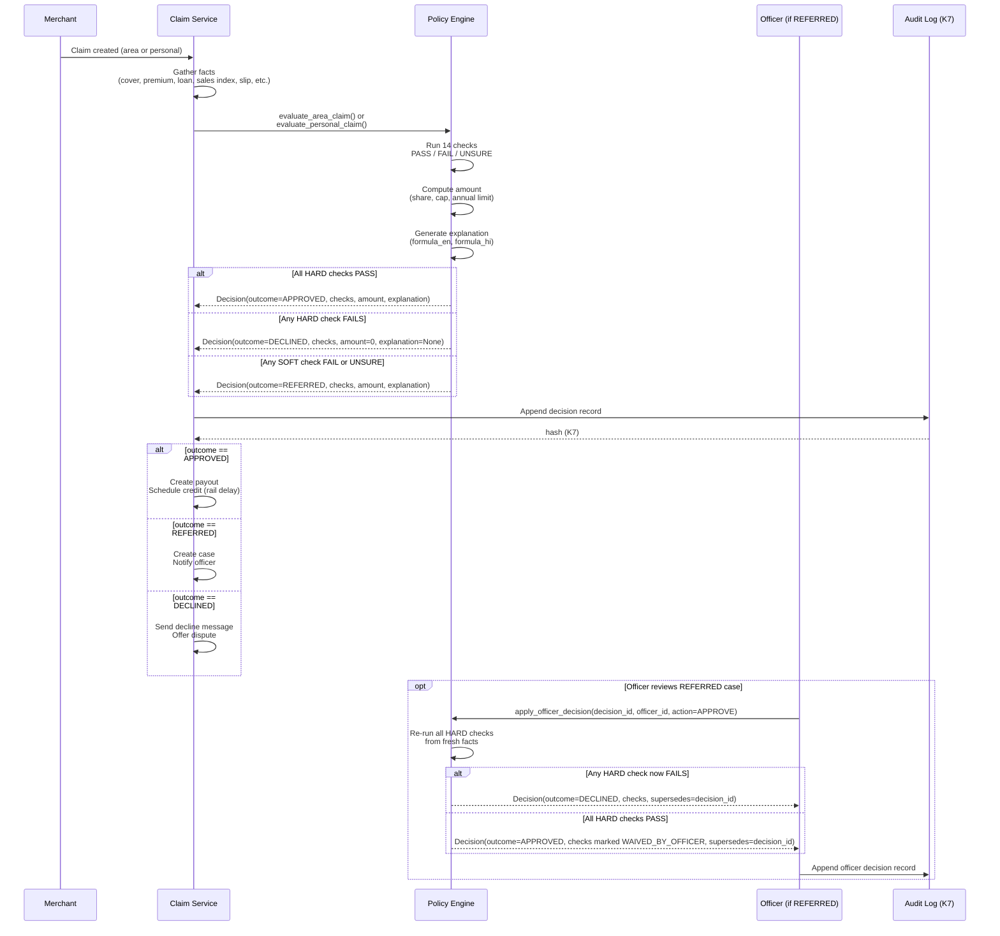
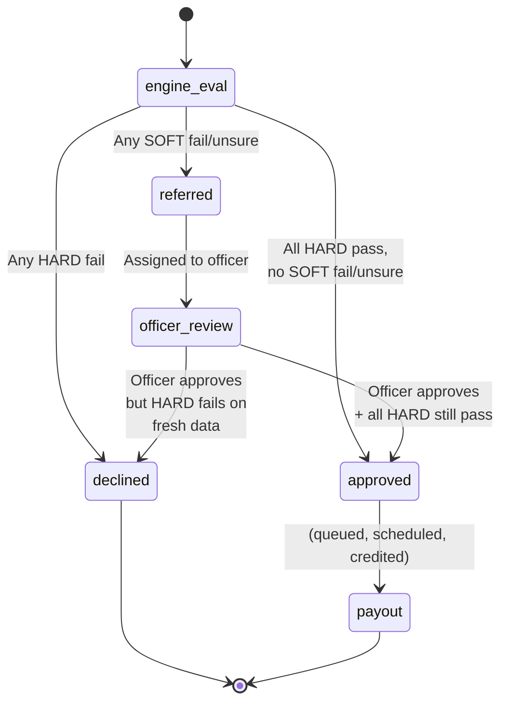

# Feature spec: Policy engine and audit (K4, K7)

| | |
|---|---|
| Status | Draft v1 · 2 Oct 2026 |
| Owner | Ujjwal Pardeshi |
| Audience | Engineers, compliance officers, claims officers, security review |
| Related | [Policy wording and CIS](../policy-wording-and-cis.md) · [Facts and sources](../../01-strategy/facts-and-sources.md) · [System architecture](../../04-engineering/system-architecture.md) · [AI architecture and guardrails](../../04-engineering/ai-architecture-and-guardrails.md) · [ADR: Policy engine is the only payout authority](../../04-engineering/adr/0001-policy-engine-is-the-only-payout-authority.md) |

## TL;DR

- **K4: The policy engine is the only layer that can APPROVE money.** LLMs build the case; a deterministic rules engine decides amounts. Officers can APPROVE REFERRED cases, but re-run all HARD checks.
- **K7: Hash-chained audit log.** Every decision, payout, and instalment pause is logged with a SHA-256 hash chain (single writer, tamper-evident, immutable). No blockchain; single database.
- **Rules version:** pilot-0.1, in `backend/chhatri/policy/rules.yaml`. Fourteen checks (10 HARD, 4 SOFT) determine outcomes: APPROVED, REFERRED, or DECLINED.
- **Decision record:** outcome, checks, amount, explanation (formula and facts), decided_by, rules_version. Explanations are filled from published numbers only (§4.3).
- **Officer path:** Only REFERRED decisions can be approved by a claims officer. Re-running HARD checks re-fetches live facts; any HARD fail → DECLINED, even if the officer clicks Approve.
- **Audit trail:** `/api/audit` (read, page) and `/api/audit/verify` (validate hash chain). Entries are append-only; the database enforces this with triggers.

IDs covered: **K4 · K7** (plus governance notes for K5, K6).

## 1. Summary

K4 is the design principle and implementation that **no LLM output ever sets a payout amount; only the policy engine decides**. The engine is a pure function: it takes facts about a merchant, claim, cover, and loan; runs fourteen deterministic checks; and outputs an outcome (APPROVED / REFERRED / DECLINED) and, for APPROVED or REFERRED, an amount and an explanation.

K7 is the **tamper-evident audit log** that records every payout, cover purchase, instalment pause, and decision. It uses a SHA-256 hash chain (not a blockchain, but a single writer with append-only enforcement) to detect edits after the fact. The log is the source of truth for compliance, grievance resolution, and audit.

Together, K4 and K7 ensure that **every money decision is auditable, reproducible, and free from LLM hallucination**.

## 2. Status today and what changes

| What | Status | Code path | Change |
|---|---|---|---|
| **Policy engine (K4)** | LIVE | `backend/chhatri/policy/engine.py` | Rules version pilot-0.1; all checks implemented; officer path re-runs HARD checks only (not SOFT) |
| **Rule set (pilot-0.1)** | LIVE | `backend/chhatri/policy/rules.yaml` | Payout share, area/personal caps, name match score, slip confidence, waiting period, annual limit, dispute SLA |
| **Check catalogue** | LIVE | `backend/chhatri/policy/checks.py` | Fourteen checks with PASS/FAIL/UNSURE semantics |
| **Explanation generation** | LIVE | `backend/chhatri/policy/explain.py` | Formulas in Hindi and English (SPEC §9.6) |
| **Audit log (K7)** | LIVE | `backend/chhatri/audit/log.py` | SHA-256 hash chain, append-only SQLite with triggers |
| **Audit routes** | LIVE | `backend/chhatri/api/routers/records.py` | GET `/api/audit` (paginated), GET `/api/audit/{seq}` (one entry), POST `/api/audit/verify` (chain validation) |
| **Frontend audit view** | LIVE | `frontend/src/pages/Policy.tsx` (partial) | Case view shows decision and checks; full audit log access TBD |
| **Officer decision (K4)** | LIVE | `engine.py` · `apply_officer_decision()` | Officer can override REFERRED; re-runs HARD checks from live facts |
| **Rules versioning** | PLANNED | — | How to change rules and re-evaluate claims (post-hackathon) |

## 3. User stories and jobs to be done

| Persona | Job to be done | Context |
|---|---|---|
| **Rajesh (claims officer)** | Review a REFERRED claim and decide: approve if the facts are sound, decline if the merchant is ineligible. | A hospital-cash claim fails the NAME_MATCHES_KYC check; Rajesh sees the slip and the KYC name mismatch. |
| | Understand why the system referred the case; see every check that passed or failed. | Each check shows: code, status, observed value, required value, detail (plain English). |
| | Override a SOFT check (e.g. signature unclear, but I believe it) and approve the payout. | Rajesh clicks Approve on a SLIP_READABLE UNSURE check. The engine marks it WAIVED_BY_OFFICER and runs HARD checks again. |
| **Omkar Kadam (product lead)** | Verify that a decision is reproducible from the numbers shown; explain it to a merchant or a judge. | Anil disputes the ₹1,380 payout. Omkar cites the decision.id, looks up the decision record, shows the checks and the formula. |
| **Ujjwal Pardeshi (tech lead)** | Detect tampering in the audit log; verify that a decision was not edited after creation. | An audit inspector runs `/api/audit/verify` on the entire chain; it returns hash mismatches if any entry was edited. |
| **Insurer compliance officer** | Confirm that a DECLINED payout was decided by policy rules, not by arbitrary choice. | An appeal comes in. The compliance officer checks the decision record: every HARD check was run; the first FAIL caused the DECLINED outcome. |

## 4. Rules (policy)

From `backend/chhatri/policy/rules.yaml` (pilot-0.1, lines 1–26):

| Key | Value | Meaning |
|---|---|---|
| `version` | `pilot-0.1` | Rules version for audit trail and versioning (future: pilot-0.2, v1.0, etc.) |
| `payout_share` | `0.50` | Chhatri pays 50% of lost sales (area claim) or 50% of expected day (personal claim). |
| `area.index_floor_pct` | `50` | Area trigger requires hourly sales index to stay below 50% for 3 consecutive hours. |
| `area.consecutive_hours` | `3` | Number of consecutive hours at or below the floor for the trigger to fire. |
| `area.min_shops_in_index` | `20` | Area index must have at least 20 shops in that zone for the index to be valid (quorum). |
| `area.daily_cap_rupees` | `2500` | Area payout is capped at ₹2,500 per merchant per day. |
| `personal.daily_cap_rupees` | `1500` | Hospital-cash payout is capped at ₹1,500 per merchant per day. |
| `personal.max_auto_days` | `3` | Hospital-cash claims automatically decided for up to 3 silent days. Days 4+ are REFERRED. |
| `personal.name_match_min_score` | `85` | Patient name on slip matches KYC name with a fuzzy match score (rapidfuzz token_set_ratio) ≥ 85. |
| `personal.slip_confidence_min` | `0.80` | Slip extraction confidence (LLM or vision model) must be ≥ 0.80 for auto-decision. |
| `cover.waiting_period_days` | `7` | Cover purchased on day D starts on day D+7 (7-day wait). |
| `cover.alert_lookahead_hours` | `72` | If a cover purchase is requested during an alert window ending within 72 hours, block the purchase. |
| `annual_limit_rupees` | `30000` | Total payouts per merchant in any rolling 365 days are capped at ₹30,000. |
| `dispute_sla_hours` | `24` | A dispute case must be resolved within 24 hours. |
| `payout_rail_delay_minutes` | `4` | Payout is credited to the settlement rail 4 minutes after the decision (simulated delay; SPEC §0.1). |
| `instalment_pause_delay_minutes` | `5` | EDI holiday request is sent 5 minutes after payout credit (K3, simulated delay). |
| `premium.loading` | `0.35` | Premium is priced at expected loss ÷ (1 − 0.35) = expected loss ÷ 0.65. |
| `premium.min_per_day_rupees` | `2` | Premium charged to the merchant is at least ₹2 per day. |
| `premium.first_payment_days` | `30` | The first premium payment prepays 30 days of cover. |

**Note on rule changes:** Changing any value in `rules.yaml` requires:
1. A new version name (e.g. `pilot-0.2`).
2. Backtest on historical claims to show the impact.
3. Re-evaluation of any open or recent REFERRED case (if the new rule changes the outcome).
4. Audit trail: the decision record stores `rules_version`, so a query can find all decisions made under pilot-0.1 vs pilot-0.2.

## 5. Flow and state diagram

### Sequence: claim → decision → payout



### State diagram: decision lifecycle



## 6. Inputs and data sources

| Input | Source | Status | Validation |
|---|---|---|---|
| **Claim** (kind, merchant_id, event_date, silent_dates, slip, expected_day_paise) | `Claim` model; created by claim service | LIVE | event_date ≤ today; expected_day_paise published (rounded to ₹10) |
| **Merchant** (id, zone_id, kyc_name, language) | Store: `Store.city.merchants.get(merchant_id)` | SIMULATED | Merchant exists in zone; KYC name is not blank |
| **Cover** (status, starts_on, prepaid_through) | Store: `Store.city.covers.get(merchant_id)` | SIMULATED | If no cover, COVER_IN_FORCE check FAILS |
| **Alert** (id, valid_from, valid_to, zone_ids) | Store or `/api/alerts` feed | SIMULATED | Alert is issued by IMD (SPEC §0.1, alert feed) |
| **Trigger (area claim)** (index_pct, hourly_index_pct, lower_bound_pct, shops_in_index) | Store: `Store.triggers.get(trigger_id)` | SIMULATED (via sales data + model) | Computed from hourly sales index and LightGBM model bounds |
| **Sales index (personal claim)** | SILENCE_VERIFIED check: did the merchant's Paytm transactions drop to near-zero for all silent_dates? | SIMULATED | Settlement data queried per date; treated as ground truth |
| **Slip extraction** (patient_name, admission_date, discharge_date, confidence) | Vision model output (Sarvam or simulator) or Tesseract OCR fallback | SIMULATED (Gemini free tier would be LIVE) | confidence ≥ 0.80 for auto-decision |
| **Loan** (status, daily_instalment_paise, arrears_paise) | Store: `Store.city.loans.get(merchant_id)` | SIMULATED | Used for lender policy checks (K3) and EDI deferral |
| **Premium record** (prepaid_through) | Cover.prepaid_through field (set on payment received) | SIMULATED | PREMIUM_PREPAID check compares prepaid_through ≥ event_date |
| **Annual payout record** (sum of approved payouts in rolling 365 days) | Store: `Store.payouts_sum_for_365_days(merchant_id, date)` | SIMULATED | WITHIN_ANNUAL_LIMIT check uses this |

## 7. Decision logic and checks

### The fourteen checks (SPEC §9.2)

| # | Code | Kind | Severity | Input | Pass condition | Status semantics | Area | Personal |
|---|---|---|---|---|---|---|---|---|
| 1 | `COVER_IN_FORCE` | eligibility | HARD | Cover | Status is ACTIVE and starts_on ≤ event_date | PASS/FAIL | Yes | Yes |
| 2 | `PREMIUM_PREPAID` | eligibility | HARD | Cover | prepaid_through ≥ event_date (s.64VB) | PASS/FAIL | Yes | Yes |
| 3 | `COVER_BEFORE_ALERT` | eligibility | HARD | Cover, Alert | Cover purchased before alert issued (strict <) | PASS/FAIL | Yes | — |
| 4 | `ALERT_ACTIVE` | trigger | HARD | Alert, Trigger | Alert valid for zone over [window_start, window_end) | PASS/FAIL | Yes | — |
| 5 | `INDEX_QUORUM` | trigger | HARD | Trigger | shops_in_index ≥ min_shops_in_index (20) | PASS/FAIL | Yes | — |
| 6 | `BELOW_FLOOR` | trigger | HARD | Trigger | Each of 3 hourly indices < 50% (strict) | PASS/FAIL | Yes | — |
| 7 | `BELOW_MODEL_RANGE` | trigger | HARD | Trigger | Window index < lower_bound_pct (strict) | PASS/FAIL | Yes | — |
| 8 | `SILENCE_VERIFIED` | personal | HARD | Sales index | Merchant's sales near-zero for all silent_dates | PASS/FAIL | — | Yes |
| 9 | `SLIP_READABLE` | personal | SOFT | Slip | Extraction confidence ≥ 0.80 | PASS/FAIL/UNSURE | — | Yes |
| 10 | `NAME_MATCHES_KYC` | personal | SOFT | Slip, KYC | Fuzzy match score ≥ 85 (rapidfuzz token_set_ratio) | PASS/FAIL/UNSURE | — | Yes |
| 11 | `DATES_MATCH` | personal | SOFT | Slip, silent_dates | Slip admission/discharge dates overlap silent_dates | PASS/FAIL/UNSURE | — | Yes |
| 12 | `WITHIN_AUTO_LIMIT` | personal | SOFT | Claim | Days silent ≤ max_auto_days (3) | PASS/FAIL | — | Yes |
| 13 | `NOT_ALREADY_PAID` | amount | HARD | Payouts, Claim | No prior payout for the same day on the same claim kind | PASS/FAIL | Yes | Yes |
| 14 | `WITHIN_ANNUAL_LIMIT` | amount | HARD | Payouts | Total approved payouts in rolling 365 days + new amount ≤ annual_limit (₹30,000) | PASS/FAIL | Yes | Yes |

**Semantics:**
- **HARD:** Failure ⇒ DECLINED outcome. Never overridable by an officer (except by re-running on fresh facts, which may cause a PASS on retry).
- **SOFT:** Failure or UNSURE ⇒ REFERRED outcome (unless a HARD check fails first). Officer can WAIVE_BY_OFFICER.

### Decision outcome logic

```python
# Pseudocode from engine.py

def evaluate_claim(facts) -> Decision:
    checks = run_all_checks(facts)
    hard_fails = [c for c in checks if c.severity == HARD and c.status == FAIL]
    soft_issues = [c for c in checks if c.severity == SOFT and c.status in (FAIL, UNSURE)]
    
    if hard_fails:
        return Decision(outcome=DECLINED, amount=0, explanation=None)
    if soft_issues:
        amount = compute_amount(facts)
        explanation = explain(amount, facts)
        return Decision(outcome=REFERRED, amount=amount, explanation=explanation)
    
    # All checks passed
    amount = compute_amount(facts)
    explanation = explain(amount, facts)
    return Decision(outcome=APPROVED, amount=amount, explanation=explanation)
```

### Officer path (K4, lines 8–10 of engine.py docstring)

When an officer approves a REFERRED case:

```python
def apply_officer_decision(referred_decision, officer_id, action) -> Decision:
    assert referred_decision.outcome == REFERRED
    if action == "DECLINE":
        return Decision(outcome=DECLINED, supersedes=referred_decision.id, ...)
    
    # action == "APPROVE": re-run every HARD check from fresh facts
    facts = fetch_fresh_facts(referred_decision.claim_id)  # new data
    checks = run_hard_checks_only(facts)  # not soft
    
    hard_fails = [c for c in checks if c.status == FAIL]
    if hard_fails:
        # Facts have changed (e.g. premium unpaid since REFERRED was made)
        return Decision(outcome=DECLINED, checks=checks, supersedes=referred_decision.id)
    
    # All HARD checks still pass; grant approval
    return Decision(outcome=APPROVED, checks=checks, supersedes=referred_decision.id)
```

## 8. Merchant-facing copy

All merchant-facing text about money or eligibility is rendered from the decision record and message catalogue, never free-generated (SPEC §0.2).

### Approved/declined reason text

From `backend/chhatri/conversation/messages.py` (lines 140–182):

| Outcome | Key | Template |
|---|---|---|
| APPROVED (area) | `AREA_PAYOUT_INTRO` | `"{name_en} ji, heavy rain cut your area's sales by {drop}% today."` |
| APPROVED (personal) | `PERSONAL_PAID` | `"{name_en} ji, your claim is approved. {amount} credited with today's settlement."` |
| DECLINED | `PERSONAL_DECLINED` + a reason key | `"{reason_en}"` (one of 9 reason keys below) |
| REFERRED (officer approves) | `OFFICER_APPROVED` | `"Our team approved your claim. {amount} credited."` |
| REFERRED (officer declines) | `OFFICER_DECLINED` + a reason key | `"{reason_en}"` |

**Decline reason keys (9):**
- `REASON_COVER_IN_FORCE`, `REASON_PREMIUM_PREPAID`, `REASON_SILENCE_VERIFIED`, `REASON_NOT_ALREADY_PAID`, `REASON_WITHIN_ANNUAL_LIMIT`, `REASON_COVER_BEFORE_ALERT`, `REASON_ALERT_ACTIVE`, `REASON_INDEX_QUORUM`, `REASON_BELOW_FLOOR`, `REASON_BELOW_MODEL_RANGE`, `REASON_OFFICER_PERSONAL`, `REASON_OFFICER_DISPUTE`, `REASON_OFFICER_DISPUTE_PERSONAL`

Each key has Hindi and English lines (except `CASE_CHIP`, which has English only per the spec).

### Why-this-amount explanations (K5)

From `backend/chhatri/policy/explain.py`:

**Area formula (SPEC §9.6):**
- **English:** `½ × ₹4,380 × 63% = ₹1,380` or, if capped, `½ × ₹9,000 × 70% = ₹3,150, capped at ₹2,500`
- **Hindi:** `₹4,380 का 63% = ₹2,759.40; उसका आधा = ₹1,380` or `₹9,000 का 70% = ₹6,300; उसका आधा = ₹3,150; सीमा ₹2,500`

**Personal formula (SPEC §9.6):**
- **English:** `½ × ₹4,380 = ₹2,190 a day, capped at ₹1,500 × 1 day = ₹1,500` or `½ × ₹2,400 = ₹1,200 a day × 2 days = ₹2,400`
- **Hindi:** `₹4,380 का आधा = ₹2,190 प्रतिदिन; सीमा ₹1,500 × 1 दिन = ₹1,500`

These formulas are filled from the `Explanation` model fields and rendered via `render(key, facts, lang)` in the message catalogue.

## 9. Edge cases and failure modes

| Case | Merchant state | Behaviour | Decision outcome | Audit event |
|---|---|---|---|---|
| **New cover during alert with look-ahead** | Merchant has no cover; alert window ends in <72 h; merchant requests cover. | Cover purchase is blocked (K6 waiting period + look-ahead). | CoverQuote with outcome=BLOCKED | `cover.quote_created` with blocking_alert_id |
| **Claim on day after cover expires** | Cover was ACTIVE until yesterday; prepaid_through = yesterday. | COVER_IN_FORCE = FAIL (or PREMIUM_PREPAID if different). | DECLINED | Decision with first failing check |
| **Claim on a silent day, slip date doesn't match** | Merchant was silent Wed 20, submitted slip from Fri 22. | DATES_MATCH = FAIL (or UNSURE). | REFERRED (or auto-DECLINED if HARD) | Depends on check severity; if SOFT, case opens. |
| **Hospital-cash claim for 4 days** | Merchant was silent 4 days; max_auto_days = 3. | WITHIN_AUTO_LIMIT = FAIL (SOFT). | REFERRED | Case opens with message "this covers more days than we pay automatically". |
| **Claim exceeds annual limit** | Merchant received ₹28,000 YTD; new claim is ₹3,000. | WITHIN_ANNUAL_LIMIT = FAIL (HARD). | DECLINED | Decision shows amount would be ₹3,000 but blocked by annual limit. |
| **Officer reviews REFERRED, but loan became arrears** | REFERRED decision made when loan was active. Officer re-runs checks. In the meantime, merchant defaulted and loan went to arrears. | HARD checks are re-run from fresh facts. Loan status is now "arrears". | Depends on new data; may DECLINE despite original REFERRED outcome. | Officer decision with SUPERSEDES reference. |
| **Duplicate claim detection** | Same merchant, same claim kind, same event_date. | NOT_ALREADY_PAID check compares payouts by claim.id; if same id, it is not a duplicate. If different id but same date/kind, it is a duplicate. | DECLINED | Decision with NOT_ALREADY_PAID = FAIL. |
| **Very low slip confidence** | Slip extraction confidence 0.75 (< 0.80). | SLIP_READABLE = FAIL (SOFT) or UNSURE (depends on implementation). | REFERRED | Case opens with detail "we couldn't read the slip clearly". |
| **Name match score 82 (just below threshold)** | Slip patient "Anil R. Jadhav", KYC "ANIL JADHAV" (no middle initial). Fuzzy match = 82. | NAME_MATCHES_KYC = FAIL (HARD). | DECLINED | Officer can still approve by clicking Approve, which WAIVES the check and re-runs other HARD checks. |

## 10. Guardrails, privacy and compliance notes

### AI governance (K4, RBI FREE-AI)

The policy engine aligns with RBI's FREE-AI framework (A23):

| Sutra | How K4 demonstrates it |
|---|---|
| **Trust** | Deterministic rules; no LLM hallucination of amounts. Every decision is auditable (K7). |
| **People First** | Human (officer) path for doubtful cases (REFERRED → officer review). HARD checks must pass even if an officer approves. |
| **Innovation** | LLMs build the case (N2, N3: Ask Chhatri, slip reading); deterministic engine decides money. |
| **Fairness** | Same checks, same rules, applied uniformly. No merchant is exempted from a HARD check. |
| **Accountability** | Decision record stores checks, amount, decided_by, rules_version. Audit log is tamper-evident. |
| **Explainability** | Every merchant gets a "why this amount" formula with reproducible numbers (K5). Every officer sees every check's observed vs required value. |
| **Resilience** | Fallback: if slip reading fails, SLIP_READABLE = UNSURE → REFERRED (not auto-declined). If lender service fails, EDI holiday = NOT_GRANTED (fail-safe). |

### Data minimization (DPDP, A22)

The policy engine uses only data necessary to the checks:
- Merchant KYC name (for personal claims, NAME_MATCHES_KYC check)
- Cover dates and premium payment (for cover eligibility)
- Hourly sales index (for area claims) — aggregated, not per-transaction
- Slip extraction (patient name, dates, hospital name, document type) — no full slip image stored
- Loan status (for K3 EDI holiday eligibility)

After a claim is decided, the slip image is:
- Stored in the media service (MEDIA_ID reference, not full URL in decision)
- Deleted on merchant request (N6 consent centre, future)
- Masked/blurred in case view to non-officer users (future)

### Audit trail retention

From `backend/chhatri/audit/log.py`:

Audit entries are **never deleted**; the log is append-only with database triggers enforcing immutability. Retention policy:
- **Decision records:** Kept for 7 years (compliance / statute of limitations on disputes).
- **Other entries:** (payouts, instalments, messages): kept for 3 years, then anonymized (merchant_id → hash).
- **Policy:** To be confirmed with the insurer's compliance team.

## 11. Acceptance criteria

| Given | When | Then | Audit event |
|---|---|---|---|
| Area trigger fires; 46 shops in Z7 have cover, premiums paid. | Policy engine evaluates the area claim. | All 14 checks are run; PASS/FAIL/UNSURE populated; outcome = APPROVED if all HARD pass and no SOFT unsure/fail. | `decision.created` with all checks and explanation. |
| Anil's hospital-cash claim: slip patient name = "Anil R. Jadhav", KYC = "ANIL JADHAV", confidence = 0.85. | Policy engine evaluates the personal claim. | NAME_MATCHES_KYC = PASS (score ≥ 85); SLIP_READABLE = PASS (confidence ≥ 0.80); all HARD checks pass → outcome = APPROVED. | `decision.created` with checks marked PASS. |
| Hospital-cash claim: slip patient "Sunil Pawar" (KYC = "ANIL JADHAV"), confidence = 0.85. | Policy engine evaluates. | NAME_MATCHES_KYC = FAIL (score < 85, HARD) → outcome = DECLINED. | `decision.created` with NAME_MATCHES_KYC = FAIL. |
| Hospital-cash claim: slip patient "Anil Jadhav", KYC match pass, but 4 silent days. | Policy engine evaluates. | WITHIN_AUTO_LIMIT = FAIL (4 > 3, SOFT) → outcome = REFERRED. Explanation shows amount as if 3 days were paid. | `decision.created` with outcome = REFERRED, explanation present. |
| Officer sees REFERRED case (hospital-cash, name mismatch, but slip looks valid). | Officer clicks Approve. | Engine re-runs HARD checks from fresh facts (same KYC name, same slip). NAME_MATCHES_KYC still FAIL → outcome = DECLINED. | `decision.created` with decided_by = "officer:officer-id", supersedes original REFERRED decision_id. |
| Officer clicks Approve on a REFERRED case with SLIP_READABLE = UNSURE only (all HARD pass). | Engine re-runs HARD checks; all still pass. | Outcome = APPROVED; SLIP_READABLE marked WAIVED_BY_OFFICER. | Officer decision with checks, supersedes original. |
| Merchant disputes a ₹1,380 payout. | Omkar runs `/api/decisions/{decision_id}` to show the formula and facts. | Response shows: checks (all PASS), explanation (formula + sources), amount_paise, rules_version. Merchant confirms the math is right. | No new audit event; decision already logged. |
| An auditor runs `/api/audit/verify` on the entire log. | Browser sends GET /api/audit/verify. | Response shows: `chain_valid = true`, no hash mismatches. If an entry was edited, first mismatch is reported with seq and details. | No event; verify is read-only. |

## 12. Telemetry and audit events

### Audit events logged (K7)

| Action | Subject type | Occurs when | Data fields |
|---|---|---|---|
| `decision.created` | `decision` | Policy engine outputs an APPROVED, REFERRED, or DECLINED decision. | `decision_id`, `outcome`, `amount_paise`, `checks` (full array), `explanation` (if APPROVED or REFERRED), `rules_version`, `decided_by`, `claim_id`, `merchant_id` |
| `decision.officer_reviewed` | `decision` | Officer applies a decision to a REFERRED case (APPROVE or DECLINE). | `officer_id`, `original_decision_id`, `new_decision_id`, `action` (APPROVE/DECLINE), `checks` (re-run HARD only), `supersedes` |
| `payout.created` | `payout` | Payout record is created after an APPROVED decision. | `payout_id`, `decision_id`, `merchant_id`, `amount_paise`, `status` (PENDING → CREDITED → FAILED), `rail` |
| `payout.credited` | `payout` | Payout is credited to the settlement rail. | `payout_id`, `merchant_id`, `amount_paise`, `credited_at`, `reference` |
| `cover.quote_created` | `cover_quote` | Merchant requests cover (may be BLOCKED or OK). | `quote_id`, `merchant_id`, `outcome`, `starts_on`, `premium_per_day_paise`, `reason_en`, `reason_hi`, `blocking_alert_id` (if BLOCKED) |
| `cover.purchased` | `cover` | Merchant pays for cover (ACTIVE status). | `cover_id`, `merchant_id`, `purchased_at`, `starts_on`, `prepaid_through` |
| `instalment.pause` | `instalment_pause` | EDI holiday is granted and applied. | `merchant_id`, `loan_id`, `instalment_date`, `amount_paise`, `decision_id`, `moved_to`, `penalty_paise` |
| `case.opened` | `case` | A REFERRED decision opens a case. | `case_id`, `claim_id`, `decision_id`, `merchant_id`, `kind` (e.g. REFERRAL), `due_by` (SLA clock starts) |
| `case.resolved` | `case` | Officer resolves a case (APPROVED or DECLINED). | `case_id`, `resolution_decision_id`, `resolved_by` (officer_id), `resolved_at` |

### Console metrics (K8, /policy page)

- **Decisions today:** count by outcome (APPROVED, REFERRED, DECLINED).
- **Check pass rates:** histogram of each check (% that PASS, % FAIL, % UNSURE).
- **Most common decline reason:** e.g. "COVER_IN_FORCE 23%", "PREMIUM_PREPAID 12%", etc.
- **Officer throughput:** open cases, average resolve time, approve vs decline rate.
- **Rules version:** current version (pilot-0.1) and date of last change.

## 13. Planned changes and tasks

| ID | Task | Owner | Effort (h) | PR in | Notes |
|---|---|---|---|---|---|
| K4 | Ensure all 14 checks are in `backend/chhatri/policy/checks.py` and tested. | Ujjwal Pardeshi | 0 | Done (commit 86575ea) | 1,711 fast + 36 slow tests, 99.7% coverage. |
| K7 | Audit log and hash chain implemented in `backend/chhatri/audit/log.py`. | Ujjwal Pardeshi | 0 | Done | Append-only SQLite; `/api/audit` and `/api/audit/verify` routes live. |
| K5 | Explanation generation (formulas in Hindi and English). | Ujjwal Pardeshi | 0 | Done | `explain.py` fills `Explanation` model. |
| K4+K5 | Officer re-runs HARD checks only (not SOFT). Add test `test_officer_rerun_hard_only`. | Ujjwal Pardeshi | 1 | 2 Oct eve | Verify SOFT checks are marked WAIVED, not re-evaluated. |
| K4 | Rules versioning: design how to change rules and track which decisions used which version. | Ujjwal Pardeshi | 2 | Post-hackathon | Roadmap: pilot-0.2, v1.0, etc.; migration strategy for open claims. |
| K7 | Audit log retention policy: 7 years for decisions, 3 years for others, then anonymization. | Omkar Kadam | 0.5 | Post-hackathon | Compliance + DPDP alignment. |
| K7 | Frontend: full audit log view (all entries, not just decisions). | Ujjwal Pardeshi | 3 | 3 Oct or roadmap | Currently only decision details visible in case view. |

## 14. Test plan

### Existing tests (commit 86575ea)

**Backend tests:**
- `backend/tests/policy/test_engine.py`: 40+ tests covering all 14 checks, outcomes (APPROVED/REFERRED/DECLINED), explanation generation, and edge cases.
- `backend/tests/audit/test_log.py`: hash chain, append-only enforcement, verify() function.
- `backend/tests/conversation/test_messages.py`: message rendering with decision facts.
- Integration: `backend/tests/integration/test_demo_scenarios.py`: monsoon, illness, illness_mismatch, buy_cover scenarios with full decision flows.

**Frontend tests:**
- `frontend/src/pages/__tests__/Policy.test.tsx`: decision display, check details, officer approve/decline actions.

### New tests (K4, K7)

| Test | File | Checks | Acceptance |
|---|---|---|---|
| `test_officer_rerun_hard_only` | `test_engine.py` | Officer approval re-runs HARD checks only; SOFT checks are WAIVED. | SOFT check status = WAIVED_BY_OFFICER; outcome depends on HARD only. |
| `test_officer_approve_hard_fails_on_fresh_data` | `test_engine.py` | Officer approves REFERRED, but a HARD check fails on fresh facts. | Outcome = DECLINED (even though officer clicked Approve). |
| `test_explain_area_with_cap` | `test_engine.py` | Area payout is capped; explanation shows cap applied. | formula_en includes "capped at ₹2,500"; formula_hi includes "सीमा". |
| `test_explain_personal_multi_day` | `test_engine.py` | Personal payout for 2 days uncapped. | formula shows "₹1,200 a day × 2 days = ₹2,400". |
| `test_audit_decision_hash` | `test_log.py` | Decision is logged; hash is computed; chain is valid. | `entry.hash` matches computed SHA-256. |
| `test_audit_verify_detects_tampering` | `test_log.py` | Edit an audit entry directly in the DB; verify() detects the mismatch. | `verify()` returns `chain_valid = false`, reports first mismatch seq. |
| `test_decision_outcome_logic_all_pass` | `test_engine.py` | All HARD checks PASS, no SOFT FAIL/UNSURE → outcome = APPROVED. | Outcome is APPROVED; explanation present. |
| `test_decision_outcome_logic_hard_fail` | `test_engine.py` | One HARD check FAIL → outcome = DECLINED regardless of SOFT. | Outcome is DECLINED; amount = 0; explanation = None. |
| `test_decision_outcome_logic_soft_unsure` | `test_engine.py` | All HARD PASS, one SOFT UNSURE → outcome = REFERRED. | Outcome is REFERRED; explanation present; case opens. |
| `test_within_annual_limit_blocking` | `test_engine.py` | Merchant at ₹28,000 YTD; new claim ₹3,000; limit is ₹30,000. | WITHIN_ANNUAL_LIMIT = PASS (28k + 3k = 31k, but 3k would exceed, so check fails if computed amount > remaining). Actually: check fails → DECLINED or REFERRED depending on severity. |
| `test_monsoon_decision_anil_1380` | `backend/scripts/demo_check.py` | Anil's area payout is ₹1,380; decision has all checks PASS; formula is correct. | Amount = 60000 paise; formula_en = "½ × ₹4,380 × 63% = ₹1,380". |
| `test_illness_mismatch_officer_approve` | `demo_check.py` | Hospital-cash claim fails NAME_MATCHES_KYC; officer clicks Approve; re-run HARD checks. | If name still doesn't match on fresh slip extraction, outcome = DECLINED. If somehow matches on retry (e.g. slip reprocessed), outcome = APPROVED. |

### Regression checks

```bash
make test-backend       # 1,711 fast + 36 slow tests; must pass 100%
make test-frontend      # 262 unit tests (after X1 fixes, 264)
make demo-check         # 70 of 70 checks on monsoon scenario
```

## Open questions

1. **Rules versioning strategy:** When rules change (e.g. payout_share from 0.50 to 0.55), how do we re-evaluate open REFERRED cases? Do we apply the new rule retroactively, or only to new decisions? **Owner:** Ujjwal Pardeshi.
2. **Audit retention and anonymization:** The policy says 7 years for decision records and 3 years for others. Is that aligned with the insurer's document retention policy and DPDP requirements? **Owner:** Omkar Kadam.
3. **Officer override on SOFT HARD-fail:** Can an officer override a HARD check if they have domain knowledge (e.g. "I know this merchant; the name mismatch is a data-entry error")? Current design: no, re-run HARD checks on fresh data. Future: add an "exception" flow? **Owner:** Ujjwal Pardeshi + Omkar Kadam.
4. **Audit log inspection by merchants:** Should a merchant be able to view their own audit trail (decisions, payouts, disputes)? Should they see FAILED checks? Currently, only officer console has full audit view. **Owner:** Omkar Kadam.
5. **Hash chain integrity over long timescales:** SQLite append-only is enforced at the DB level, but if someone gains DB admin access, they can disable triggers and edit. Should we add a "backup hash chain" to cold storage daily? **Owner:** Ujjwal Pardeshi (post-hackathon security review).

## Changelog

- 2026-10-02 · v1.3 · second fact-check pass
- 2026-10-02 · v1.2 · final consistency pass against the code
- 2026-10-02 · v1.1 · fact-check pass (fixed check severity: NAME_MATCHES_KYC is SOFT, corrected HARD/SOFT count to 10/4, clarified annual limit as rolling 365 days not calendar year)
- 2026-10-02 · v1 · First draft. K4 policy engine (14 checks, outcomes, officer path), K7 audit log (hash chain, tamper detection), rules pilot-0.1, explanation generation, merchant-facing copy, edge cases, tests, and compliance notes.
