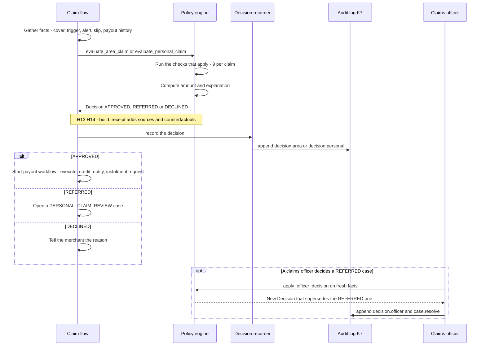
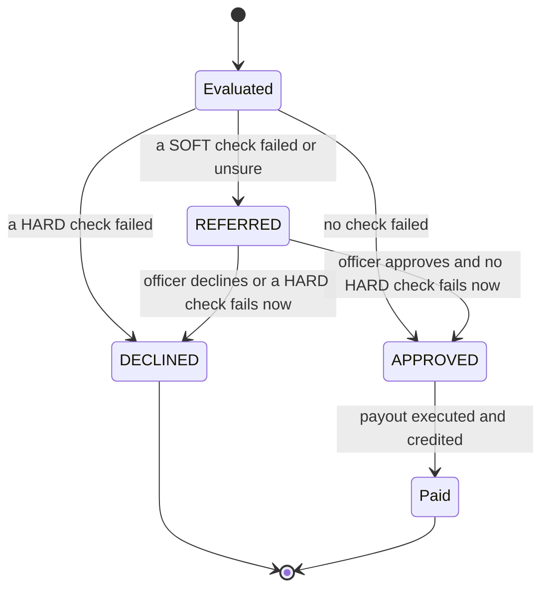

# Feature spec: Policy engine and audit (K4, K7, H13, H14)

| | |
|---|---|
| Status | v1.4 · K4 and K7 BUILT (commit 86575ea) · H13 and H14 BUILT, wave 1 |
| Owner | Ujjwal Pardeshi |
| Date | 2 Oct 2026 |
| Audience | Engineers, compliance officers, claims officers, security review |
| Related | [Policy wording and CIS](../policy-wording-and-cis.md) · [Facts and sources](../../01-strategy/facts-and-sources.md) · [System architecture](../../04-engineering/system-architecture.md) · [AI architecture and guardrails](../../04-engineering/ai-architecture-and-guardrails.md) · [Data model and API](../../04-engineering/data-model-and-api.md) · [Implementation guide](../../04-engineering/implementation-guide.md) · [ADR 0001](../../04-engineering/adr/0001-policy-engine-is-the-only-payout-authority.md) · [fs-06 explanations, disputes and grievance](fs-06-explanations-disputes-and-grievance.md) · [fs-08 claims officer console](fs-08-claims-officer-console.md) · [Competitive landscape](../../01-strategy/competitive-landscape.md) |

## TL;DR

- **K4 (BUILT):** money is decided by the policy engine, a pure Python function with its thresholds in `rules.yaml` (version pilot-0.1). An LLM never sets or changes an amount.
- **Outcome rule:** any HARD check fails, DECLINED. Otherwise any SOFT check fails or is UNSURE, REFERRED. Otherwise APPROVED.
- **Checks:** the catalogue has 14 checks (10 HARD, 4 SOFT). A claim runs only the ones that apply: an area claim runs 9 (all HARD, so an area claim is never REFERRED); a personal claim runs 9 (5 HARD, 4 SOFT).
- **Name mismatch is SOFT:** `NAME_MATCHES_KYC` below 85 sends the claim to a claims officer (REFERRED). It never declines a claim by itself.
- **Officer path:** a claims officer decides only REFERRED personal claims. The engine re-runs every check on fresh facts. Any HARD fail gives DECLINED even if the officer approves. An approval records each SOFT issue as `WAIVED_BY_OFFICER`. A DISPUTE is a different case kind (see fs-06).
- **K7 (BUILT):** a SHA-256 hash chain in an append-only SQLite table. `GET /api/audit` pages it and `GET /api/audit/verify` returns `{valid, entries, head_hash, first_bad_seq}`.
- **H13 (BUILT, wave 1):** every check row, money number and clause shown to a merchant or officer carries a Source (what it came from, its id, its time, LIVE or SIMULATED).
- **H14 (BUILT, wave 1):** every explanation can carry a counterfactual (what would have changed the outcome). The engine generates it and checks it by re-running the engine, so the LLM never writes it.
- **Receipt:** one new endpoint, `GET /api/decisions/{decision_id}/receipt`, returns the decision with its sources, clauses, counterfactuals, payout and audit hash.
- **Priority:** everything here is P0. H13, H14 and the receipt are build wave 1 (demo spine) behind feature flags. If one is not finished it stays hidden; it is never shown half-working.

IDs covered: **K4 · K7 · H13 · H14** (data for H2 and H3 receipts; H10 principle). H13 builds on an idea from Praman. H14 builds on ideas from One-Tap Credit and Claim Advocate. See [competitive landscape](../../01-strategy/competitive-landscape.md).

## 1. Summary

K4 is the design rule that code decides money. The engine takes facts about a claim, runs the checks that apply, and returns a `Decision`: outcome, amount, every check result, an explanation of the arithmetic, the rules version and who decided. The same facts always give the same decision.

K7 is the audit log. Each money-relevant step (trigger, decision, case, payout, instalment request, message) is appended to a hash chain. An edit behind the database triggers breaks the chain and `verify` reports the first bad entry.

H13 and H14 make the decision legible. H13 says where each fact came from. H14 says what would have changed the answer. Both are built by the engine side, not by an LLM, and both appear in one receipt that the merchant app, the console and Ask Chhatri all read.

## 2. Status today and what changes

| What | Status | Code path | Change |
|---|---|---|---|
| Policy engine | BUILT | `backend/chhatri/policy/engine.py` (`evaluate_area_claim`, `evaluate_personal_claim`, `apply_officer_decision`) | None |
| Rules pilot-0.1 | BUILT | `backend/chhatri/policy/rules.yaml`, `rules.py` | None |
| Check catalogue and check functions | BUILT | `policy/catalogue.py`, `policy/checks.py` | Fix the `WITHIN_ANNUAL_LIMIT` label text (wave 1, see section 12) |
| Amount arithmetic | BUILT | `policy/amounts.py` | None |
| Explanation formulas (en, hi) | BUILT | `policy/explain.py` | Reused by H14 |
| Decision record and audit payload | BUILT | `domain/models.py` (`Decision`), `replay/decisions.py` (`DecisionRecorder`), `audit/records.py` | H13 and H14 add sources and counterfactuals (section 10) |
| Officer decision | BUILT | `replay/officer.py` (`OfficerFlow`), `POST /api/cases/{case_id}/approve` and `/decline` | None |
| Audit log | BUILT | `backend/chhatri/audit/log.py` | None |
| Audit and decision routes | BUILT | `api/routers/records.py`: `GET /api/audit`, `GET /api/audit/verify`, `GET /api/decisions/{decision_id}`, `GET /api/policy` | Add the receipt route |
| Console audit page | BUILT | `frontend/src/pages/Audit.tsx`: whole log newest first, grouped by simulated minute, filters, Verify chain | None |
| Console policy page | BUILT, read-only | `frontend/src/pages/Policy.tsx`: authority table, checks, rules, live tests. There is no way to edit a rule in the console | None |
| H13 sources | BUILT, wave 1 | `policy/provenance.py` | Section 8 |
| H14 counterfactuals | BUILT, wave 1 | `policy/counterfactual.py` | Section 9 |
| Receipt endpoint | BUILT, wave 1 | `GET /api/decisions/{decision_id}/receipt` | Section 10 |
| Rules versioning and re-evaluation of open cases | PLANNED | none | After the hackathon (open question 1) |

## 3. User stories and jobs to be done

| Persona | Job to be done | Context |
|---|---|---|
| **Rajesh (claims officer)** | See why the system referred a claim and decide it. | A hospital-cash claim has a slip in the name "Sunil Pawar" and the KYC name is "ANIL RAMESH JADHAV". `NAME_MATCHES_KYC` scores 28, FAIL (SOFT), so the claim is REFERRED. Rajesh sees every check with observed and required values. |
| | Approve a doubtful claim without breaking a HARD rule. | Rajesh taps Approve. The engine re-runs all checks on fresh facts. If a HARD check now fails, the result is DECLINED. Otherwise the claim is APPROVED and the failed SOFT check is `WAIVED_BY_OFFICER`. |
| **Omkar Kadam (product lead)** | Show a judge that a decision is reproducible and see what would change it. | Open the receipt for D-000142: formula, sources on each number, and the counterfactual. |
| **Ujjwal Pardeshi (tech lead)** | Detect tampering with the log. | `GET /api/audit/verify` recomputes the chain and returns the first bad sequence number. |
| **Insurer compliance officer** | Confirm a decline came from a rule, not from a person's choice. | The decision record lists every check that ran; the first failing HARD check is the reason. |
| **Judge** | Ask "what if the rain had been lighter?" | The what-if panel (fs-08, H24) re-runs the same trigger rule. H14 explains the observed case the same way. |

## 4. Rules (pilot-0.1)

From `backend/chhatri/policy/rules.yaml`. The file says the values are illustrative and to be set with the insurance partner.

| Key | Value | Meaning |
|---|---|---|
| `version` | `pilot-0.1` | Stored on every decision (`rules_version`). |
| `payout_share` | 0.50 | Chhatri pays half of the lost sales (area) or half of the expected day (personal). |
| `area.index_floor_pct` | 50 | Each hourly index must be below 50 (strictly) for the trigger and for the `BELOW_FLOOR` check. |
| `area.consecutive_hours` | 3 | The trigger window is the last 3 completed hours. |
| `area.min_shops_in_index` | 20 | Quorum: at least 20 covered, open shops in the zone index. |
| `area.daily_cap_rupees` | 2500 | Area payout cap per shop per day. |
| `personal.daily_cap_rupees` | 1500 | Hospital-cash cap per day. |
| `personal.max_auto_days` | 3 | A personal claim of more than 3 silent days fails `WITHIN_AUTO_LIMIT` (SOFT), and the whole claim goes to an officer. |
| `personal.name_match_min_score` | 85 | Name score (rapidfuzz token-set ratio, 0 to 100, initials expanded) must be at least 85. |
| `personal.slip_confidence_min` | 0.80 | Slip read confidence must be at least 0.80. |
| `cover.waiting_period_days` | 7 | A new cover starts 7 days after the purchase date. |
| `cover.alert_lookahead_hours` | 72 | Used by cover quotes: BLOCKED when an alert for the zone is valid now, or was issued and starts within 72 hours. The payment link is still offered. |
| `annual_limit_rupees` | 30000 | Paid in the rolling 365 days ending on the event date, plus the new amount, must not pass ₹30,000. |
| `dispute_sla_hours` | 24 | Every case gets `due_by = opened_at + 24 hours`. The follow-up workflow checks it at +24 hours. |
| `payout_rail_delay_minutes` | 4 | Payout is credited 4 simulated minutes after the decision. |
| `instalment_pause_delay_minutes` | 5 | The instalment step runs 5 simulated minutes after the decision (1 minute after the credit). See fs-03. |
| `premium.loading` | 0.35 | Premium = max(₹2, area loss per shop per season / 365 / (1 - 0.35)). |
| `premium.min_per_day_rupees` | 2 | Minimum premium per day. |
| `premium.first_payment_days` | 30 | The first payment prepays 30 days. |

**Changing a rule.** The console shows rules but cannot edit them. A change is a code change: edit `rules.yaml`, bump `version`, run the backtest and the tests, and commit. Every decision keeps the `rules_version` it was made under. How to re-evaluate open cases after a change is not designed yet (open question 1).

## 5. Flow and state diagram





## 6. Inputs and data sources

| Input | Where it comes from | Mode today |
|---|---|---|
| Claim: kind, merchant, event date, silent days, slip, expected day | `replay/area.py` creates one AREA claim per covered shop per trigger. `replay/personal.py` creates a PERSONAL claim from a silent day and a slip. The expected day is the forecast P50 for the day, rounded to the nearest ₹10 | SIMULATED sales |
| Merchant: id, zone, KYC name | `Merchant` in the city fixtures | SIMULATED |
| Cover and premium | `Store.cover(merchant_id)`: status, `starts_on`, `purchased_at`, `prepaid_through` | SIMULATED |
| Trigger and alert (area) | `AreaTrigger` from `detect/triggers.py`; the alert from the alert feed | SIMULATED |
| Zone lower bound | `backend/artifacts/model/manifest.json` (conformal lower bound per zone, for example Z3 89, Z7 92, Z9 90, Z12 78) | committed artifact, trained on simulated sales |
| Verified silent days | `PersonalFlow.verified_days` from the sales panel (SPEC section 8.3) | SIMULATED |
| Slip extraction | Sarvam Document AI when `SARVAM_API_KEY` is set (LIVE), otherwise the simulator | SIMULATED unless keyed |
| Payout history | `Store.paid_last_365_days_paise` and `Store.paid_event_dates` | this run's simulated payouts |

The loan is not an input to the engine. After an APPROVED payout, the instalment step runs separately (fs-03).

The engine validates its inputs and raises `ValueError` on: a claim of the wrong kind, a merchant, zone or trigger that does not match, `drop_pct` different from 100 minus `index_pct`, an expected day that is not a ₹10-rounded figure, a silent day listed twice, a cover that belongs to another merchant, and a negative paid sum. A missing value in a HARD check is a FAIL.

## 7. Decision logic and checks

### 7.1 The 14 checks and which claim runs them

Source of truth: `policy/catalogue.py` (severity, applicability) and `policy/checks.py` (behaviour).

| # | Code | Severity | Runs for | Passes when | When it does not pass |
|---|---|---|---|---|---|
| 1 | `COVER_IN_FORCE` | HARD | area, personal | cover exists, status ACTIVE, `starts_on` on or before the event date | FAIL |
| 2 | `PREMIUM_PREPAID` | HARD | area, personal | `prepaid_through` on or after the event date (Insurance Act s.64VB) | FAIL |
| 3 | `COVER_BEFORE_ALERT` | HARD | area | cover `purchased_at` is before the alert `issued_at` (strict) | FAIL |
| 4 | `ALERT_ACTIVE` | HARD | area | the trigger's alert is valid for the zone over the whole window | FAIL |
| 5 | `INDEX_QUORUM` | HARD | area | at least 20 shops in the index | FAIL |
| 6 | `BELOW_FLOOR` | HARD | area | each of the 3 hourly indices is below 50 (strict) | FAIL |
| 7 | `BELOW_MODEL_RANGE` | HARD | area | window index is below the zone lower bound (strict) | FAIL |
| 8 | `SILENCE_VERIFIED` | HARD | personal | every claimed day is a verified silent day (no day claimed is a FAIL) | FAIL |
| 9 | `SLIP_READABLE` | SOFT | personal | slip present, a medical document type, confidence at least 0.80 | FAIL if no slip or not a medical document; UNSURE if confidence is below 0.80 |
| 10 | `NAME_MATCHES_KYC` | SOFT | personal | name score at least 85 against the KYC name | FAIL if the score is below 85; UNSURE if the name is missing or not in Latin script |
| 11 | `DATES_MATCH` | SOFT | personal | admission on or before each silent day, and each silent day on or before discharge (or still admitted) | FAIL if a day is outside the stay; UNSURE if there is no admission date |
| 12 | `WITHIN_AUTO_LIMIT` | SOFT | personal | at most 3 silent days | FAIL |
| 13 | `NOT_ALREADY_PAID` | HARD | area, personal | no approved payout for the same date and kind | FAIL |
| 14 | `WITHIN_ANNUAL_LIMIT` | HARD | area, personal | paid in the last 365 days plus this amount is at most ₹30,000 | FAIL |

Medical document types accepted by `SLIP_READABLE`: admission slip, discharge summary, prescription, bill.

Counts per claim: an area claim runs checks 1 to 7, 13 and 14 (9 checks, all HARD). A personal claim runs checks 1, 2, 8 to 14 (9 checks: 5 HARD and 4 SOFT). The catalogue totals 10 HARD and 4 SOFT.

### 7.2 Outcome rule

Simplified from `policy/engine.py` (`_decide`). The function is pure: no I/O.

```python
def decide(checks, amount, explanation):
    hard = first_hard_fail(checks)   # first HARD check with status FAIL, in check order
    soft = first_soft_issue(checks)  # first SOFT check with status FAIL or UNSURE
    if hard:
        return DECLINED(amount=0, explanation=None, referral_reason=hard.detail_en)
    if soft:
        return REFERRED(amount=amount, explanation=explanation, referral_reason=soft.detail_en)
    return APPROVED(amount=amount, explanation=explanation)
```

A REFERRED decision carries the amount that would be paid, but no money moves until an officer approves. A DECLINED decision carries amount 0 and no explanation.

### 7.3 Amount arithmetic

Money is integer paise, computed with `Decimal` and ROUND_HALF_UP, starting from the published expected day (nearest ₹10), so a merchant can redo the sum from the numbers shown.

| Claim | Formula | Worked example (golden demo) |
|---|---|---|
| Area | lost = expected x drop%; share = ½ x lost, rounded to a whole rupee; amount = min(share, ₹2,500) | Anil, Tuesday 19 Aug: ₹4,380 x 63% = ₹2,759.40; half is ₹1,379.70, rounded ₹1,380; below the cap, so ₹1,380 |
| Personal | per day = ½ x expected, rounded to a whole rupee; paid per day = min(per day, ₹1,500); amount = days x paid per day | Anil, usual Wednesday ₹4,300: ½ is ₹2,150, capped at ₹1,500 x 1 day = ₹1,500 |

### 7.4 Officer path

`apply_officer_decision(referred, fresh_facts, approve, officer_id, note, ...)` in `policy/engine.py`, called by `OfficerFlow.decide` in `replay/officer.py`.

1. The decision must be REFERRED and the facts must be for the same claim and merchant. Otherwise `ValueError`, and the API answers 409.
2. Only REFERRED personal claims reach an officer. Area claims have HARD checks only, so none is REFERRED.
3. Every check is re-run on fresh facts: cover, premium, silence re-verified from sales, payouts so far.
4. Any HARD FAIL gives DECLINED, even if the officer approved. The decision is still recorded with `decided_by = officer:<id>`.
5. Officer decline: DECLINED, amount 0, reason is the officer's note (default "Declined by a claims officer.").
6. Officer approve: APPROVED with the engine's amount. Each SOFT check is stored as `WAIVED_BY_OFFICER`, with the detail "Waived by officer <id> (was FAIL): ...".
7. The new decision has `supersedes = <REFERRED decision id>`. The case resolves APPROVED or DECLINED. An approval starts the payout workflow.

The officer never changes the amount. The route needs the officer bearer token (`POST /api/cases/{case_id}/approve` or `/decline`). The demo hands the token to the console; real officer login is outside the hackathon scope (fs-06 section 11).

## 8. H13: Source on every check, number and clause (BUILT, wave 1)

The idea list calls this "Verified-by badges". On screen the label is **Source**, because every input is SIMULATED today and the chip must never suggest that an outside body verified a number.

### 8.1 What the user sees

- Under each check row, each money number in the explanation and each clause chip: one or more Source chips.
- A chip reads like "Alert A-20250818-01 · IMD-style nowcast · simulated". Tap to expand: label, id, time of the record, and the origin badge (LIVE, SIMULATED or CONFIG).
- The receipt (N1), the console case panel (K8) and the Ask Chhatri citations (N2, H17) all read the same objects.

### 8.2 The Source object (closed)

A Source has exactly these fields. The API schema rejects extra fields, and the UI renders only these.

| Field | Type | Meaning |
|---|---|---|
| `kind` | enum | One of the kinds in section 8.3. |
| `label` | string | Short text from a fixed catalogue (for an alert, the alert's own `source` text). Never free text from an LLM. |
| `ref` | string | The exact record or key, in the pattern for the kind. It must resolve to a stored record, a `rules.yaml` key or a clause id. |
| `as_of` | ISO time or null | Time of the underlying record (alert `issued_at`, trigger `fired_at`, cover `purchased_at`, slip read time). Null for CONFIG kinds. |
| `origin` | enum | `LIVE`, `SIMULATED` or `CONFIG`. Taken from the record's own `source` field where one exists. |
| `clause` | string or null | A policy clause id, C1 to C12 (policy wording). |

### 8.3 Source kinds

| Kind | Points at | `ref` pattern | Origin today |
|---|---|---|---|
| `RULES` | a `rules.yaml` key | `rules:pilot-0.1:area.index_floor_pct` | CONFIG |
| `CLAUSE` | policy wording clause | `clause:C2` | CONFIG |
| `ALERT` | alert record | `alert:A-20250818-01` | SIMULATED |
| `SALES_INDEX` | zone window index of a trigger | `trigger:E-Z7-20250819` | SIMULATED |
| `FORECAST` | the merchant's expected day (forecast P50, rounded to ₹10) | `forecast:S-0142:2025-08-19` | SIMULATED |
| `ZONE_BOUND` | the zone's conformal lower bound | `zone-bound:Z7` | CONFIG (committed artifact) |
| `COVER` | cover record | `cover:<cover id>` | SIMULATED |
| `PREMIUM` | premium payment | `premium:PR-000001` | LIVE only when the payment `source` is a Paytm adapter, else SIMULATED |
| `KYC` | KYC name on file | `kyc:S-0142` | SIMULATED |
| `SLIP` | slip extraction | `slip:MD-000001` | LIVE when the slip `source` is `sarvam-doc-ai`, else SIMULATED |
| `SALES_DAY` | the merchant's sales for a day | `sales:S-0142:2025-08-20` | SIMULATED |
| `PAYOUT_HISTORY` | earlier payouts of the merchant | `payouts:S-0142` | SIMULATED |
| `LENDER` | lender decision (fs-03, X4) | `lender:HR-000001` | SIMULATED |

### 8.4 Check to source and clause map

Clause ids are from the [policy wording](../policy-wording-and-cis.md): C1 definitions, C2 area income loss, C3 hospital-cash, C4 how much we pay, C5 when cover starts, C6 premium and cash before cover, C7 exclusions, C8 how claims are decided, C9 disputes and grievances, C10 EDI holiday, C11 data and consent, C12 cancellation.

| Check | Sources | Clause |
|---|---|---|
| `COVER_IN_FORCE` | `COVER`, `RULES` (`cover.waiting_period_days`) | C5 |
| `PREMIUM_PREPAID` | `PREMIUM`, `COVER` | C6 |
| `COVER_BEFORE_ALERT` | `COVER`, `ALERT` | C5 |
| `ALERT_ACTIVE` | `ALERT`, `SALES_INDEX` | C2 |
| `INDEX_QUORUM` | `SALES_INDEX`, `RULES` (`area.min_shops_in_index`) | C1, C2 |
| `BELOW_FLOOR` | `SALES_INDEX`, `RULES` (`area.index_floor_pct`, `area.consecutive_hours`) | C2 |
| `BELOW_MODEL_RANGE` | `SALES_INDEX`, `ZONE_BOUND` | C2 |
| `SILENCE_VERIFIED` | `SALES_DAY` | C1, C3 |
| `SLIP_READABLE` | `SLIP`, `RULES` (`personal.slip_confidence_min`) | C3 |
| `NAME_MATCHES_KYC` | `SLIP`, `KYC`, `RULES` (`personal.name_match_min_score`) | C3 |
| `DATES_MATCH` | `SLIP`, `SALES_DAY` | C3 |
| `WITHIN_AUTO_LIMIT` | `RULES` (`personal.max_auto_days`) | C3, C4 |
| `NOT_ALREADY_PAID` | `PAYOUT_HISTORY` | C7 (proposed item 10, to confirm with the insurer) |
| `WITHIN_ANNUAL_LIMIT` | `PAYOUT_HISTORY`, `RULES` (`annual_limit_rupees`) | C4 |

Money facts in the explanation (`facts[]` in the receipt):

| Fact key | Shown as | Sources | Clause |
|---|---|---|---|
| `expected_day` | "Your usual Tuesday ₹4,380" | `FORECAST` | C4 |
| `area_index` and `drop_pct` | "Area index 37%, drop 63%" | `SALES_INDEX`, `ALERT` | C2 |
| `share` | "Chhatri pays half" | `RULES` (`payout_share`) | C4 |
| `cap` | "Cap ₹2,500 a day" | `RULES` (`area.daily_cap_rupees` or `personal.daily_cap_rupees`) | C4 |
| `days` | "1 day" | `SALES_DAY` | C3 |
| `amount` | "₹1,380" | the engine decision itself (`decision:D-000142`, kind `RULES` plus formula) | C4 |

### 8.5 Rules for builders

1. A check or fact without a Source fails a test. There is no "unknown source".
2. Sources are produced by `policy/provenance.py` from the facts the engine saw and from the decision. Nothing else may create one. The UI and any LLM only display them.
3. The chip says where a value came from. It never says "verified by" an outside body. A SIMULATED origin always shows the word.
4. The Ask Chhatri guard (H17) may quote only clause ids and numbers that appear in the receipt.

## 9. H14: Counterfactuals the engine checks by re-running (BUILT, wave 1)

A counterfactual is a sentence that says what would have changed the outcome, with numbers. The module `backend/chhatri/policy/counterfactual.py` generates it from engine facts. An LLM never writes, edits or ranks it.

### 9.1 Kinds

| Kind | For | What it says |
|---|---|---|
| `FLIP_FROM_DECLINED` | a DECLINED decision | The change to the failing HARD check(s) that would have produced REFERRED or APPROVED. |
| `FLIP_FROM_REFERRED` | a REFERRED decision | The change to the SOFT issue(s) that would have produced APPROVED. |
| `AMOUNT_SENSITIVITY` | an APPROVED decision | What moves the amount: the cap, or the value of one more point of drop or one more day. |
| `ZONE_NO_TRIGGER` | a zone with no trigger (no claim, no decision) | Which trigger conditions were not met and the change that would have fired the zone. |
| `EXPLAIN_ONLY` | a failing check with no honest single change (`NOT_ALREADY_PAID`, `WITHIN_ANNUAL_LIMIT`) | The engine's own numbers, with no "if". |

### 9.2 Algorithm

Input: the same facts object the engine saw, the `PolicyRules`, and the `Decision`. All steps are pure.

1. Pick targets. DECLINED: every failing HARD check. REFERRED: every SOFT FAIL or UNSURE. APPROVED: none (use sensitivity). Zone-level: every unmet trigger condition.
2. For each target, look up the flip in `FLIP_TABLE[check_code]`: a pure function `(facts, rules) -> new facts or None`. It returns a changed copy (never mutates) or None when no honest single change exists.
3. Apply all flips of the targets together to the facts.
4. Re-run the real engine on the changed facts: `evaluate_area_claim` or `evaluate_personal_claim` (zone-level: `trigger_verdict`, see 9.5), with a throwaway decision id.
5. Keep the counterfactual only if the re-run outcome is strictly better (DECLINED to REFERRED or APPROVED; REFERRED to APPROVED; zone not fired to fired). Otherwise drop it.
6. Build the object from the re-run: the changes, the result outcome, the result amount. Render the text from a template that reads only those fields.
7. Order: actionable first, then check order. Keep at most 2 per decision.

This makes every shown counterfactual a tested fact: "change X, and the engine says Y".

### 9.3 Flip table

| Check | Flip the engine tests | Actionable by the merchant |
|---|---|---|
| `COVER_IN_FORCE` | cover ACTIVE and in force on the event date | no (past) |
| `PREMIUM_PREPAID` | `prepaid_through` set to the event date | no (past) |
| `COVER_BEFORE_ALERT` | `purchased_at` one minute before the alert `issued_at` | no (past) |
| `ALERT_ACTIVE` | an alert covering the zone for the whole window | no |
| `INDEX_QUORUM` | `shops_in_index` set to the minimum (20) | no |
| `BELOW_FLOOR` | each hourly index set to 49 | no |
| `BELOW_MODEL_RANGE` | window index set to the zone lower bound minus 1 | no |
| `SILENCE_VERIFIED` | claimed days limited to verified silent days | no |
| `SLIP_READABLE` | confidence set to the minimum, a medical document type | yes (retake the photo) |
| `NAME_MATCHES_KYC` | slip name set to the KYC name | no (never coach identity documents) |
| `DATES_MATCH` | slip stay set to cover the claimed days | no |
| `WITHIN_AUTO_LIMIT` | claimed days set to `max_auto_days` | no |
| `NOT_ALREADY_PAID`, `WITHIN_ANNUAL_LIMIT` | none, kind is `EXPLAIN_ONLY` | no |

Guardrails: a counterfactual may name only thresholds that are already public in the policy wording (50%, 3 hours, 85, 0.80, 3 days, ₹30,000). It never suggests editing a document or a name. Text is conditional ("would have"), never a promise.

### 9.4 Output object

```json
{
  "id": "CF-1",
  "kind": "FLIP_FROM_REFERRED",
  "actionable": false,
  "changes": [
    {"check_code": "NAME_MATCHES_KYC", "field": "slip_name_score", "observed": "28", "needed": "85 or more"}
  ],
  "result": {"outcome": "APPROVED", "amount_paise": 150000, "amount_label": "₹1,500"},
  "verified": true,
  "text_en": "If the name on the slip had matched your KYC name (score 85 or more), this claim would have been paid automatically.",
  "text_hi": "(proposed, Hindi to be reviewed)",
  "sources": [ {"kind": "SLIP", "label": "Hospital slip read", "ref": "slip:MD-000001", "as_of": "2025-08-21T11:20:00+05:30", "origin": "SIMULATED", "clause": "C3"} ]
}
```

`verified` is always true in output, because an unverified counterfactual is never emitted. The test suite asserts it (section 17).

Worked examples (numbers from the golden demo and the checks above):

| Case | Outcome | Counterfactual (proposed English) |
|---|---|---|
| Zone Z9, Tue 19 Aug, 17:00 | no trigger, no claim | "Z9 sales were 61% of expected (hours 59%, 58% and 67%) with no weather alert. A payout needs an alert for all 3 hours and every hour below 50%." The flip sets an alert and each hour to 49, and `trigger_verdict` then fires. |
| Illness claim, slip name "Sunil Pawar" | REFERRED, amount ₹1,500 | The name example above. |
| Illness claim for 4 silent days, all else clean | REFERRED, amount 4 x ₹1,500 = ₹6,000 held for the officer | "Claims of up to 3 days are paid without review. This claim covers 4 days, so a claims officer decides it." |
| Anil area payout D-000142 | APPROVED ₹1,380 | `AMOUNT_SENSITIVITY`: "One more point of area drop would add about ₹22." The engine computes this as the amount at 64% minus the amount at 63%. The cap line appears only when the cap can bind. |

### 9.5 Zone-level counterfactual and the shared trigger rule

The trigger rule today lives inside `evaluate_hour` in `backend/chhatri/detect/triggers.py`. Wave 1 extracts its conditions into one pure function, `trigger_verdict(inputs, rules)`, that returns each condition (alert covers the window, every hour below the floor, window below the lower bound, quorum, first trigger of the day) and whether the zone fires. `evaluate_hour` calls it with no change in behaviour (the 21 tests in `backend/tests/detect/test_triggers.py` guard that). H14 calls it for `ZONE_NO_TRIGGER`. The what-if panel (fs-08, H24) calls it with edited inputs. One rule, three users, no copied thresholds.

The Z9 explanation reaches screens through `POST /api/whatif/area` with no overrides (fs-08). A merchant-facing "why no payout today" card is proposed as a `zone_notice` field on `GET /api/merchants/{id}/claims` (open question 3).

### 9.6 Proposed wording

New catalogue keys `CF_<CHECK_CODE>`, `CF_ZONE_NO_TRIGGER` and `CF_AMOUNT_*` go in `backend/chhatri/conversation/messages.py` and in the honest-wording scan (X7). All are proposed. Hindi lines need review by a native speaker before use. A template may read only the fields of its counterfactual object, and a test checks that every digit in a rendered text appears in those fields.

## 10. Receipt endpoint (BUILT, wave 1)

`GET /api/decisions/{decision_id}/receipt`. The existing `GET /api/decisions/{decision_id}` stays as it is. The receipt adds what H2, H3, H13 and H14 need. Same envelope `{ok, data}`. Unknown id: 404. The id pattern is `D-` plus at least 6 digits.

Storage: the receipt extras are built at decision time, while the facts are in hand, by `build_receipt(facts, decision, rules)`. They are stored with the decision (new optional fields `sources` and `counterfactuals`, default empty) and so go into the audit payload, which is `decision.model_dump()`. They are hash-chained like the rest. The engine's `evaluate_*` signatures do not change. Building them later from the store would be wrong, because after the payout the "already paid" fact has changed.

Example for Anil's area payout (values from the golden monsoon run):

```json
{
  "ok": true,
  "data": {
    "decision": {
      "id": "D-000142", "claim_id": "CL-000142", "merchant_id": "S-0142",
      "outcome": "APPROVED", "amount_paise": 138000, "amount_label": "₹1,380",
      "rules_version": "pilot-0.1", "decided_at": "2025-08-19T17:00:00+05:30",
      "decided_by": "policy-engine", "supersedes": null, "referral_reason": null
    },
    "explanation": {
      "formula_en": "½ × ₹4,380 × 63% = ₹1,380",
      "formula_hi": "₹4,380 का 63% = ₹2,759.40; उसका आधा = ₹1,380",
      "clause": "C4",
      "facts": [
        {"key": "expected_day", "label_en": "Your usual Tuesday", "value": "₹4,380",
         "sources": [ {"kind": "FORECAST", "label": "Expected day, forecast P50 to the nearest ₹10",
                       "ref": "forecast:S-0142:2025-08-19", "as_of": "2025-08-19T17:00:00+05:30",
                       "origin": "SIMULATED", "clause": "C4"} ]}
      ]
    },
    "checks": [
      {"code": "ALERT_ACTIVE", "severity": "HARD", "status": "PASS",
       "label_en": "Alert active for the whole window",
       "detail_en": "Red rain alert covers the whole window.",
       "observed": "A-20250818-01 19 Aug 2025 14:00–19 Aug 2025 20:00",
       "required": "Alert for Z7 19 Aug 2025 14:00–17:00",
       "clause": "C2",
       "sources": [ {"kind": "ALERT", "label": "IMD-style nowcast · simulated", "ref": "alert:A-20250818-01",
                     "as_of": "2025-08-18T17:30:00+05:30", "origin": "SIMULATED", "clause": "C2"} ]}
    ],
    "counterfactuals": [ {"id": "CF-1", "kind": "AMOUNT_SENSITIVITY", "verified": true, "...": "see section 9.4"} ],
    "payout": {"id": "P-000142", "status": "CREDITED", "credited_at": "2025-08-19T17:04:00+05:30"},
    "audit": {"seq": "<audit seq of decision.area>", "hash_short": "<first 12 hex characters>", "verify_path": "/api/audit/verify"},
    "grievance": {"dispute_allowed": true, "ladder": ["PAYTM_DISPUTE", "INSURER_GRO", "BIMA_BHAROSA", "OMBUDSMAN"], "spec": "fs-06"}
  }
}
```

The `checks` array has all 9 check rows (8 more with the same shape). `payout` is null until a payout exists. `grievance.ladder` uses the step ids defined in fs-06 section 5. The static demo (N7) serves the same shape from `frontend/src/mock`. The receipt is the data behind the printable H3 receipt in the merchant app (fs-04).

## 11. Merchant-facing copy

All text about money or eligibility is rendered from the decision record and the message catalogue (`backend/chhatri/conversation/messages.py`), never free-generated.

| Outcome | Key | English (existing) |
|---|---|---|
| APPROVED area | `AREA_PAYOUT_INTRO` | "{name_en} ji, heavy rain cut your area's sales by {drop}% today." |
| APPROVED personal | `PERSONAL_PAID` | "{name_en} ji, your claim is approved. {amount} credited with today's settlement." |
| REFERRED | `SLIP_TO_HUMAN`, `_DATES`, `_UNREADABLE`, `_DAYS` | for example "Thank you. The name on the slip doesn't match your KYC, so our team will check it. You'll hear back within 24 hours." |
| DECLINED | `PERSONAL_DECLINED` plus a reason key | "{name_en} ji, this claim can't be paid. {reason_en}" |
| Officer approved | `OFFICER_APPROVED` | "{name_en} ji, our team approved your claim. {amount} credited." |
| Officer declined | `OFFICER_DECLINED` plus a reason key | "{name_en} ji, our team reviewed your claim. {reason_en}" |

**Reason keys (13):** one per HARD check, `REASON_COVER_IN_FORCE`, `REASON_PREMIUM_PREPAID`, `REASON_COVER_BEFORE_ALERT`, `REASON_ALERT_ACTIVE`, `REASON_INDEX_QUORUM`, `REASON_BELOW_FLOOR`, `REASON_BELOW_MODEL_RANGE`, `REASON_SILENCE_VERIFIED`, `REASON_NOT_ALREADY_PAID`, `REASON_WITHIN_ANNUAL_LIMIT` (10), and three officer reasons, `REASON_OFFICER_PERSONAL`, `REASON_OFFICER_DISPUTE`, `REASON_OFFICER_DISPUTE_PERSONAL`. Every key has Hindi and English; `CASE_CHIP` has English only.

**Why-this-amount formulas** (`policy/explain.py`, quoted exactly by DEMO.md):

| Claim | English | Hindi |
|---|---|---|
| Area | `½ × ₹4,380 × 63% = ₹1,380` | `₹4,380 का 63% = ₹2,759.40; उसका आधा = ₹1,380` |
| Area, capped | `½ × ₹9,000 × 70% = ₹3,150, capped at ₹2,500` | `₹9,000 का 70% = ₹6,300; उसका आधा = ₹3,150; सीमा ₹2,500` |
| Personal, capped | `½ × ₹4,380 = ₹2,190 a day, capped at ₹1,500 × 1 day = ₹1,500` | `₹4,380 का आधा = ₹2,190 प्रतिदिन; सीमा ₹1,500 × 1 दिन = ₹1,500` |
| Personal, uncapped | `½ × ₹2,400 = ₹1,200 a day × 2 days = ₹2,400` | `₹2,400 का आधा = ₹1,200 प्रतिदिन × 2 दिन = ₹2,400` |

Counterfactual and source-chip wording is proposed (section 9.6). `scripts/tests/test_docs.py` pins DEMO.md to the catalogue, so no existing catalogue string changes in this feature.

## 12. Edge cases and failure modes

| Case | What happens | Outcome | Audit |
|---|---|---|---|
| New cover while an alert is valid or starts within 72 hours | The quote is BLOCKED, `starts_on` is still request date + 7 days, the payment link is still offered. Not a claim. | CoverQuote BLOCKED | `cover.quoted` |
| Claim for a day after the premium ran out | `PREMIUM_PREPAID` FAIL (HARD) | DECLINED, reason `REASON_PREMIUM_PREPAID` | `decision.area` or `decision.personal` |
| Slip dates do not cover the silent days | `DATES_MATCH` FAIL (SOFT) | REFERRED, case opens | `decision.personal`, `case.open` |
| Claim of 4 silent days | `WITHIN_AUTO_LIMIT` FAIL (SOFT). The explanation carries the amount for all 4 days, for example 4 x ₹1,500 = ₹6,000. The whole claim goes to an officer. | REFERRED | `decision.personal`, `case.open` |
| Annual limit passed | `WITHIN_ANNUAL_LIMIT` FAIL (HARD). The amount that would have been paid is not paid. | DECLINED | decision entry |
| Officer approves, but cover or premium lapsed meanwhile | Fresh facts make a HARD check fail | DECLINED | `decision.officer` |
| Same day claimed twice | `NOT_ALREADY_PAID` FAIL (HARD) | DECLINED | decision entry |
| Slip confidence 0.75 | `SLIP_READABLE` UNSURE (SOFT) | REFERRED, `SLIP_TO_HUMAN_UNREADABLE` | `decision.personal`, `case.open` |
| Slip name "Sunil Pawar" against KYC "ANIL RAMESH JADHAV" | Score 28, `NAME_MATCHES_KYC` FAIL (SOFT). A near miss such as "Sunita Jadhav" scores 65 and also fails. | REFERRED. An officer can approve, which waives the check and re-runs the HARD checks. | `decision.personal`, `case.open` |
| Slip name not in Latin script, or no name | `NAME_MATCHES_KYC` UNSURE | REFERRED | same |
| A merchant with no cover in a triggered zone | No claim is created for a shop without cover | no decision | none |
| Zone like Z9: 61% of expected, no alert | No trigger, no claims, no decision. H14 explains why. | none | none (the feed shows "slow day, no payout") |
| Officer action on a case that is not OPEN, or a decision that is not REFERRED | `ValueError`, API 409 | none | none |
| Audit row edited behind the triggers | `verify` returns `valid: false` and `first_bad_seq` | n/a | none (read only) |

## 13. Guardrails, privacy and compliance notes

### AI governance

The engine supports the RBI FREE-AI principles (A23) as follows. This is a design alignment, not a certification.

| Principle | How K4, K7, H13 and H14 support it |
|---|---|
| Trust | Deterministic rules. No LLM sets an amount. Every decision is in the hash chain. |
| People first | Doubtful claims go to a person. A HARD rule still applies when an officer approves. |
| Fairness | The same checks apply to every merchant. |
| Accountability | A decision stores its checks, amount, `decided_by` and `rules_version`. |
| Explainability | The formula, the sources (H13) and the counterfactual (H14) are all produced by code. |
| Resilience | If the slip reader fails, the slip has confidence 0 and `SLIP_READABLE` is UNSURE, so the claim goes to a person instead of being declined. |

### Data minimisation (DPDP, A22)

- The engine uses the KYC name, cover dates, hourly sales index (zone aggregate), slip fields (patient name, dates, hospital, document type) and payout history.
- The prototype stores the slip image (media id on the claim; the evidence bundle links the image for officers). Deleting it on request and masking it are N6 consent-centre work (fs-07, H23). Do not describe the prototype as storing no image.
- Audit entries are never deleted or edited. Retention periods and anonymisation of old entries are not decided; see open question 2 and the retention figures in [regulatory and compliance](../../05-business/regulatory-and-compliance.md).

## 14. Acceptance criteria

| Given | When | Then | Audit event |
|---|---|---|---|
| Z7 trigger at 17:00 on 19 Aug, 46 shops with cover and premium paid | The engine evaluates Anil's area claim | 9 checks run, all PASS, APPROVED ₹1,380, formula `½ × ₹4,380 × 63% = ₹1,380` | `decision.area` |
| Anil's slip names "Anil R. Jadhav", KYC "ANIL RAMESH JADHAV", confidence above 0.80 | The engine evaluates the personal claim | Initial R expands to RAMESH, score 100, all checks pass, APPROVED ₹1,500 | `decision.personal` |
| Slip patient "Sunil Pawar", confidence above 0.80, everything else clean | The engine evaluates | `NAME_MATCHES_KYC` FAIL (SOFT, score 28), outcome REFERRED, amount ₹1,500 held, case opens | `decision.personal`, `case.open` |
| A personal claim for 4 silent days, slip clean | The engine evaluates | `WITHIN_AUTO_LIMIT` FAIL (SOFT), REFERRED, explanation shows 4 days | `decision.personal`, `case.open` |
| The REFERRED name-mismatch claim above | Officer approves | All checks re-run, all HARD pass, APPROVED ₹1,500, `NAME_MATCHES_KYC` is `WAIVED_BY_OFFICER`, `supersedes` is the REFERRED decision id | `decision.officer`, `case.resolve` |
| A REFERRED claim whose cover has lapsed since | Officer approves | A HARD check fails, DECLINED, no payout | `decision.officer`, `case.resolve` |
| An auditor calls `GET /api/audit/verify` | The chain is intact | `{valid: true, entries, head_hash, first_bad_seq: null}` | none |
| A row is edited directly in SQLite | `verify` runs | `valid: false` and `first_bad_seq` is that row | none |
| Receipt for D-000142 | `GET /api/decisions/D-000142/receipt` | Every check and fact has at least one Source with a `ref` that resolves; `counterfactuals` holds only verified items | none |
| Z9 at 17:00, no alert, hours 59, 58, 67 | The zone explanation is requested | `ZONE_NO_TRIGGER` names the missing alert and the hours not below 50, and the re-run of `trigger_verdict` with the flip fires | none |

## 15. Telemetry and audit events

Real action names written today (`subject_type` in brackets). Actors are `policy-engine`, `model`, `system`, `workflow:payout`, `ai-agent`, `officer:<id>` and `merchant:<id>`.

| Action | Subject | When | Data |
|---|---|---|---|
| `alert.issued` | alert | An alert enters the feed | alert fields |
| `trigger.fired` | trigger | A zone fires (actor `model`) | the `AreaTrigger`: index, hourly indices, lower bound, shops |
| `decision.area` | decision | The engine decides an area claim | the whole decision (every check, amount, explanation, `rules_version`, `decided_by`) plus a claim summary |
| `silence.detected` | merchant | A silent day is detected | merchant and day |
| `decision.personal` | decision | The engine decides a personal claim | as above |
| `decision.officer` | decision | An officer decision supersedes a REFERRED one | as above plus `note`, `supersedes` |
| `case.open` / `case.resolve` | case | A case opens or an officer resolves it | kind, ids, `due_by`; status, resolution, `within_sla` |
| `payout.execute` / `payout.credit` | payout | Payout created at the decision, credited 4 minutes later | decision id, amount, rail, reference, status |
| `instalment.pause` | instalment pause | The instalment step ran (fs-03 changes this for X4) | loan, date, amount, decision id |
| `cover.quoted` | quote | A cover quote is made | outcome, `starts_on`, premium, `blocking_alert_id` |
| `premium.link_created`, `premium.paid`, `premium.settled`, `premium.not_settled`, `premium.link_failed` | premium | Premium link and settlement steps | amounts and ids |
| `slip.read` | media | A slip is read (actor `ai-agent`) | source, confidence, document type, fields read |
| `workflow.step_failed`, `workflow.start_failed` | workflow | A step or workflow start fails | step, error |

Other entries written today: `scenario.loaded`, `replay.stopped`, `intent.detected`, `message.inbound`, `message.outbound`, `soundbox.announce`, `case.sla_checked`, `case.officer_notified`, `case.officer_reminded`. PLANNED audit names for X4 (`instalment.holiday_request`, `instalment.holiday_decision`) are in fs-03. The receipt build adds no new action: its extras sit inside the decision entry.

**Console metrics.** The console shows decisions by outcome and open cases from live endpoints (`GET /api/state`, `GET /api/cases`). The ops strip (H8) and its exact definitions are in fs-08. This spec does not promise per-check pass-rate or decline-reason charts; nothing builds them.

## 16. Build plan

Everything is P0. Waves are from the team plan. Owners: Ujjwal (engine, backend), Omkar (UI, copy).

| ID | Task | Owner | Wave | Notes |
|---|---|---|---|---|
| H13 | `policy/provenance.py`: closed Source object, kinds, check map, fact map | Ujjwal | 1 | Section 8 |
| H14 | `policy/counterfactual.py`: flip table, verified re-run, zone-level | Ujjwal | 1 | Section 9 |
| H14 | Extract `trigger_verdict` from `detect/triggers.py`, no behaviour change | Ujjwal | 1 | Shared with fs-08 H24 |
| H2, H13, H14 | `build_receipt`, stored optional fields on `Decision`, `GET /api/decisions/{decision_id}/receipt` | Ujjwal | 1 | Section 10 |
| X7 | Add the `CF_*` templates and source labels to the honest-wording scan | Ujjwal | 1 | |
| K4 | Fix the `WITHIN_ANNUAL_LIMIT` label ("this policy year" to "rolling 365 days") | Ujjwal | 1 | `policy/catalogue.py` |
| H13 UI | Source chips in the receipt (fs-04) and the console case panel (fs-08) | Omkar | 1 and 4 | |
| H14 UI | Counterfactual card in the receipt and the console | Omkar | 1 and 4 | |
| Mock | Receipt route in `frontend/src/mock` for the static demo (N7) | Omkar | 1 | |
| K4 | Rules versioning and re-evaluation of open cases | Ujjwal | after the hackathon | Open question 1 |

## 17. Test plan

### Existing tests (BUILT)

- `backend/tests/policy/test_engine.py` (22 tests): `test_area_approved_anil_1380`, `test_personal_name_mismatch_referred_with_amount_and_explanation`, `test_personal_hard_beats_soft`, `test_officer_approves_referred_waives_soft_only`, `test_officer_decline`, `test_officer_cannot_override_hard_checks`, `test_officer_only_on_referred`, `test_engine_is_deterministic`.
- `backend/tests/policy/test_checks.py` (16), `test_explain.py` (9), `test_amounts.py`, `test_names.py`, `test_cover.py`.
- `backend/tests/audit/test_log.py` (17): `test_chain_links_and_same_inputs_same_hashes`, `test_append_only_triggers_block_update_and_delete`, `test_tamper_data_detected_via_direct_sqlite_edit`, `test_tamper_with_rehash_still_breaks_next_link`, `test_deleted_row_detected`, `test_decision_data_contains_every_check`.
- `backend/tests/api/test_cases_records.py`: `test_decision_record`, `test_audit_paging_and_verify`, `test_policy_and_backtest`, `test_officer_approves_in_one_tap`.
- `backend/tests/cases/test_demo_flows.py`: `test_human_mismatch_referred_case_c2291_then_officer_pays_1500`.
- `backend/tests/replay/test_golden.py`: `test_illness_mismatch_is_referred_and_the_officer_approves_1500`.
- Frontend: `frontend/src/pages/Pages.test.tsx` (audit list, filter, verify; policy with live tests), `frontend/src/components/audit/auditGroups.test.tsx`, `frontend/src/components/policy/ruleFormat.test.ts`.

### New tests (PLANNED)

| Test | File | What it checks |
|---|---|---|
| `test_every_check_has_sources_and_a_clause` | `backend/tests/policy/test_provenance.py` | All 14 checks map to at least one Source kind and a clause in C1 to C12. |
| `test_source_object_is_closed` | same | An extra field is rejected. |
| `test_source_refs_resolve` | same | Each `ref` points at a stored record, a rules key or a clause id. |
| `test_origin_follows_the_record_source` | same | A slip with source `sarvam-doc-ai` is LIVE, `simulated` is SIMULATED. |
| `test_counterfactual_is_verified_by_rerun` | `backend/tests/policy/test_counterfactual.py` | For every emitted item, applying `changes` and re-running the engine gives the stated outcome and amount. |
| `test_no_counterfactual_when_the_flip_does_not_help` | same | Two failing HARD checks with a flip for only one emit nothing that claims a better outcome. |
| `test_name_mismatch_flip` and `test_four_day_claim_flip` | same | The two REFERRED examples in section 9.4. |
| `test_zone_no_trigger_z9` | same | Z9 at 17:00: missing alert and hours not below 50, flip fires. |
| `test_amount_sensitivity_matches_engine` | same | The "one more point" figure equals the engine's difference. |
| `test_counterfactual_text_uses_only_its_own_numbers` | same | Every digit in a rendered text appears in the object. |
| `test_trigger_verdict_matches_evaluate_hour` | `backend/tests/detect/test_triggers.py` | The extracted rule gives the same result for all existing cases. |
| `test_receipt_shape_and_404` | `backend/tests/api/test_receipt.py` | Envelope, fields, unknown id gives 404. |
| `test_receipt_is_in_the_audit_payload` | same | The extras are inside the hash-chained entry. |
| Receipt in the mock | `frontend/src/mock/routes.test.ts` | The static demo serves the same shape. |

### Regression checks

```bash
make test-backend   # backend pytest, not slow, coverage at least 80%
make test-slow      # golden numbers and full-artifact flows
make test-frontend  # typecheck, lint, unit tests
make demo-check     # every scenario through the HTTP API
```

## Open questions

1. **Rules versioning:** when a value in `rules.yaml` changes, do open REFERRED cases keep the version they were referred under, or are they re-run? Owner: Ujjwal Pardeshi.
2. **Retention and anonymisation:** how long should audit entries and slip images be kept, and what is anonymised afterwards? The regulatory document gives working figures; the insurer must confirm them. Owner: Omkar Kadam.
3. **Where the Z9 notice reaches a merchant:** proposal is a `zone_notice` field on `GET /api/merchants/{id}/claims` carrying the `ZONE_NO_TRIGGER` counterfactual. Needs an entry in the API registry. Owner: Omkar Kadam with Ujjwal Pardeshi.
4. **Policy wording C2 says "Red alert":** the engine accepts a RAIN or CIVIC alert of any level (`TRIGGER_ALERT_KINDS`). Either the wording or the rule changes before a pilot. Owner: Omkar Kadam.
5. **Officer exceptions:** should an officer ever override a HARD check with a recorded reason? Today the answer is no. Owner: Ujjwal Pardeshi and Omkar Kadam.
6. **Merchant view of the audit trail:** should a merchant see their own entries? Today only the console shows the log. Owner: Omkar Kadam.
7. **Chain integrity over time:** triggers stop edits in normal use, and `verify` finds edits behind them, but someone with database admin rights can rebuild the whole chain. Publishing the head hash somewhere outside the database would close that; it is outside the hackathon scope. Owner: Ujjwal Pardeshi.

## Changelog

- 2026-10-02 · v1.4 · fixed NAME_MATCHES_KYC (SOFT, REFERRED never DECLINED), 9 checks per claim, officer path (all checks re-run), audit routes and action names, reason-key count (13), case kind, slip storage wording, console pages; added H13 sources and clause map, H14 counterfactuals, receipt endpoint, build waves
- 2026-10-02 · v1.3 · second fact-check pass
- 2026-10-02 · v1.2 · final consistency pass against the code
- 2026-10-02 · v1.1 · fact-check pass (fixed check severity: NAME_MATCHES_KYC is SOFT, corrected HARD/SOFT count to 10/4, clarified annual limit as rolling 365 days not calendar year)
- 2026-10-02 · v1 · First draft. K4 policy engine (14 checks, outcomes, officer path), K7 audit log (hash chain, tamper detection), rules pilot-0.1, explanation generation, merchant-facing copy, edge cases, tests, and compliance notes.
