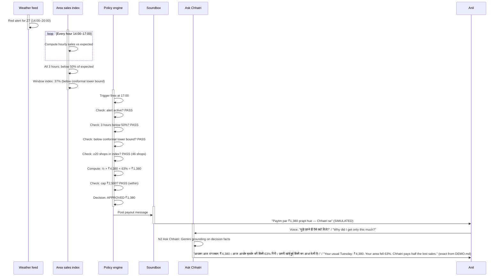
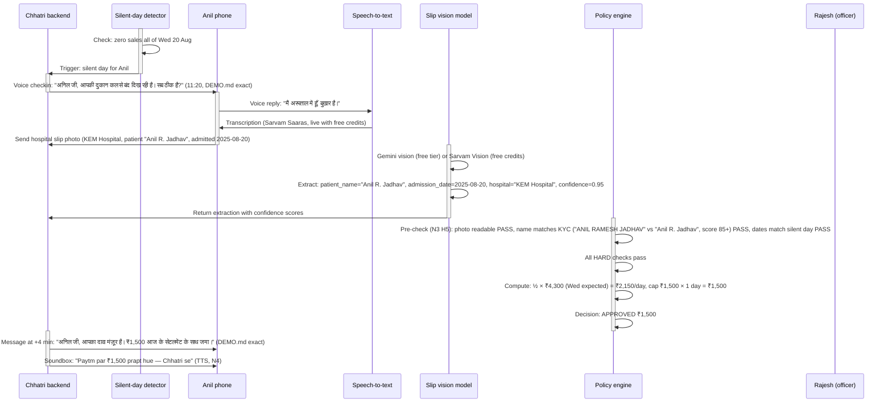
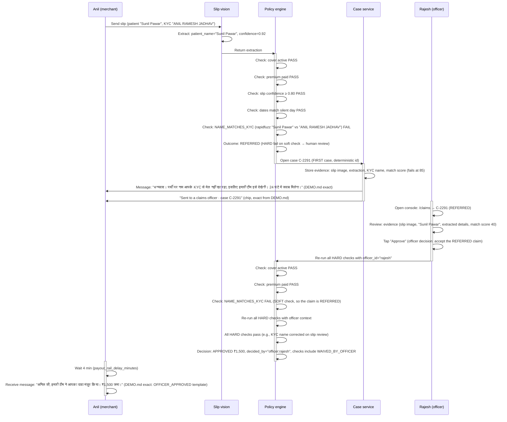

# User journeys

| | |
|---|---|
| Status | Draft v1.6 · 3 Oct 2026 |
| Owner | Omkar Kadam |
| Audience | Product, engineering, design; judges evaluating end-to-end coverage |
| Related | [Personas and JTBD](personas-and-jtbd.md) · [Product requirements](prd.md) · [Demo runbook](../06-delivery/demo-runbook.md) · [DEMO.md](../DEMO.md) |

## TL;DR

- 10 journeys cover insurance (area and hospital-cash claims), lending (EDI holiday), fintech (settlement, Soundbox, consent) and merchant surfaces (mini-app, voice, grievance escalation).
- J1–J2 focus on discovery, purchase and consent. J3–J6 are claim scenarios with different outcomes. J7–J10 are post-claim and lifecycle journeys.
- Every journey maps to the track's example stages (understand coverage, submit documents, track claims, resolve queries) and uses exact demo strings from `DEMO.md`.
- Status labels mark what runs. LIVE means the code runs for real, SIMULATED means a labelled simulator stands in, BUILT means the code and tests exist behind a feature flag that is off until the build turns it on (the AI paths are tested against fakes only, with no key run), and PLANNED means not built: a partner integration or a post-hackathon item.
- Merchant journey complexity is captured in stage tables; critical flows (J3–J6) have sequence diagrams.

## 1. Journey map and coverage matrix

| Journey | Persona | Primary vert. | Trigger | Stages | Track example fit |
|---|---|---|---|---|---|
| **J1 · Discover and understand cover** | Amit (field sales), Anil (merchant) | Insurance | Paytm field presentation, "What am I covered for?" | Understand → Ask Chhatri | Health claims: "what is covered" |
| **J2 · Consent and buy cover** | Anil | Insurance + Fintech | Ready to buy, monsoon season | Understand → Consent → Buy → Waiting period | Health claims: consent, purchase |
| **J3 · Area auto-claim (monsoon)** | Anil | Insurance + Lending + Fintech | Red alert issued; trigger fires at 17:00 | Detect → Check → Decide → Pay → EDI holiday | Health claims: claim submitted |
| **J4 · Hospital-cash claim (silent day)** | Anil | Insurance + Lending + Fintech | Shop goes silent; Chhatri checks in | Detect → Check → Decide → Pay → EDI holiday | Health claims: claim submitted, checked, paid same day |
| **J5 · Referred claim (name mismatch)** | Anil + Rajesh (officer) | Insurance + Lending | Slip name differs from KYC | Detect → Check → Refer to human → Officer checks → Pay | Health claims: claim referred, human review, resolved |
| **J6 · Dispute (merchant contests decision)** | Anil + Rajesh | Insurance | "My loss was bigger" | Detect → Decide → Dispute → Human review (24 h) | Health claims: query resolved |
| **J7 · Grievance escalation** | Anil | Insurance | Unresolved dispute, escalation | Decide → Dispute → GRO → Bima Bharosa → Ombudsman (SLAs) | Health claims: grievance path |
| **J8 · Blocked purchase (alert conflict)** | Ramesh | Insurance | Tries to buy cover during red alert | Understand → Block at waiting period | Health claims: cover restrictions |
| **J9 · Consent withdrawal and data deletion** | Anil | Insurance | "Delete my slip data" | Manage consents → View → Withdraw → Delete | Health claims: DPDP deletion |
| **J10 · Cover lapse and renewal** | Anil | Insurance | Premium not received; annual limit reached | Track claim → Notice lapse → Renewal prompt | Health claims: renewal |

---

## 2. J1 · Discover and understand cover

**Trigger:** Field sales team or merchant's own curiosity; monsoon season.

**Primary persona:** Amit (Paytm field sales, relationship executive) and Anil (tea-stall owner, primary beneficiary).

**Channels:** Mini-app (Hindi-first), Ask Chhatri voice and text, WhatsApp, in-console phone simulator.

### Stage table

| Stage | What merchant sees or does | What Chhatri does | AI involved | Rule or check | Failure and recovery | Metric |
|---|---|---|---|---|---|---|
| **Understand: Coverage explainer** | Taps "Coverage · what am I covered for?" in N1 mini-app. | Shows coverage card: "Area income loss when sales fall during an alert"; "Hospital cash when you go silent and are admitted"; caps, waiting period, EDI holiday. | Ask Chhatri generates answers to "What if my area has no alert?" (grounded in C2, C3) | None; UI-driven | Anil closes without buying; no metric impact. | Coverage card view rate (N1) |
| **Understand: Examples** | Scrolls examples: "₹400 a day expected, sales fell 50%, gets ₹200" | Shows two area examples and one hospital-cash example with the formula visible. | None (templated) | Amounts are from pilot-0.1 rules (K4). | None. | View depth (examples scrolled) |
| **Understand: Exclusions** | Taps "What is not covered?" | Shows list: "Seasonal slump, predicted foreclosures, alert for a neighbouring zone, …" from C7 | Ask Chhatri clarifies: "Will my lapse count as seasonal?" | Ask Chhatri guard: citation to C7 only; no money figures | Merchant asks again; no escalation. | Q&A volume for exclusions |
| **Understand: Waiting period** | Reads "Cover starts 7 days after purchase. If an alert is active or forecast within 72 hours, new cover won't apply to it." From C5. | "Timeline: you buy today → cover starts day 7 → this monsoon is too close → buy now for next monsoon" | Ask Chhatri voice: "क्या मेरा कवर कल के अलर्ट पर लागू होगा?" → "No. New cover starts after the waiting period, from 25 August. It won't apply to tomorrow's alert." | C5: 7-day wait + 72 h lookahead (K6). | Ramesh buys anyway; see J8 (blocked). | Taps on dates |
| **Ask Chhatri: Live voice** | Speaks question in Hindi or English: "Kya mere sales ka data safe hai?" | N2 asks Sarvam speech-to-text (LIVE with a key, otherwise SIMULATED; browser speech as a fallback); grounding in policy wording (C11: data consent); offers citations. | Gemini free tier grounded on policy wording (BUILT behind `n2_ask_chhatri`, tested against fakes only). Fallback: Sarvam chat or templates. | N2 guard: no money figures; only clauses and their clause IDs cited. | LLM times out → fallback to template. | Grounded answer rate; handoff rate |
| **LIVE / SIMULATED / PLANNED** | SIMULATED (mini-app on console) | BUILT (N1 screens, `n1_miniapp`) | BUILT (N2: Gemini, then Sarvam, then templates; `n2_ask_chhatri`, no key run) | BUILT (K4 rules) | BUILT (FALLBACK label and force switch, `x6_provider_panel`) | PLANNED (metrics dashboard) |

---

## 3. J2 · Consent and buy cover

**Trigger:** Anil decides to buy after understanding coverage, usually before monsoon season.

**Primary persona:** Anil.

**Channels:** Mini-app (cash before cover flow), Paytm payment link, Soundbox.

### Stage table

| Stage | What merchant sees or does | What Chhatri does | AI involved | Rule or check | Failure and recovery | Metric |
|---|---|---|---|---|---|---|
| **Consent: Purpose-specific disclosure** | Taps "Buy cover". Mini-app shows purpose-specific consent (C11): "Sales data for cover and claims." Checkbox for explicit consent. | N6 renders the consent screen with the exact purpose from C11; states the insurer and the broking firm. | None (templated) | DPDP consent law (A22): purpose-specific, withdrawable; substantive obligations from 14 May 2027. | Merchant declines; journey ends. No payment attempted. | Consent acceptance rate |
| **Consent: Data minimisation** | Mini-app shows "Your slip data is kept separate and deleted when you withdraw consent." | N6 shows the data handling policy from C11, with checkmarks on "minimise", "mask", "delete on request". | None | DPDP minimisation principle. | None. | Acceptance (assumed) |
| **Pay: Cash before cover** | Taps "Proceed to payment". Link is generated. Amount: 30 days of premium for the zone (computed from rules.yaml premium loading 0.35). Anil's cover will start 7 days after purchase (K6 waiting period). | Chhatri generates the payment link and displays it. The link is SIMULATED (`https://paytm.me/sim-…`) and labelled in the UI (the team has no Paytm staging keys configured, so the payment link is never LIVE in the demo). | None | K6: cover starts 7 days after purchase (waiting period); premium collection is "cash before cover" per s.64VB. First payment prepays 30 days (rules.yaml `premium.first_payment_days = 30`). | Link is SIMULATED; Anil cannot actually pay on stage. Fallback: UI shows "Payment link would be sent here" with the SIMULATED badge. | Payment link clicks; conversion to paid |
| **Link message: WhatsApp** | Anil receives a WhatsApp link for 30 days of his zone's premium (Z7: ₹558.60, ₹18.62 a day). In the demo the same message goes to Ramesh in Z3: "To buy cover for later, pay ₹424.80 (₹14.16/day) here: …" (DEMO.md). | Chhatri posts the link via in-console phone simulator (SIMULATED; the team has no WhatsApp Cloud API keys configured). | N4 TTS (Sarvam Bulbul SIMULATED, PLANNED browser speechSynthesis fallback). | None | SIMULATED on stage (no real WhatsApp); link is in the in-console phone. | WhatsApp message receipt |
| **Waiting period: Cannot buy during an alert** | Scenario: Mon 18 Aug 18:00 (demo buy_cover scenario). Ramesh (S-0907, Z3, uncovered) reads the red alert `A-20250818-01` (issued 17:30, valid for tomorrow 14:00–20:00). Tries to buy cover now. | Chhatri blocks purchase with voice message: "नया कवर वेटिंग पीरियड के बाद शुरू होता है — 25 अगस्त से। कल के अलर्ट पर यह लागू नहीं होगा।" / "New cover starts after the waiting period — from 25 August. It won't apply to tomorrow's alert." (exact from DEMO.md, 4:45–5:45 section). Then the link message: "आगे के लिए कवर लेना हो तो ₹424.80 (₹14.16/दिन) यहाँ भरें" / "To buy cover for later, pay ₹424.80 (₹14.16/day) here: …" (exact from DEMO.md). | None | K6: waiting period 7 days + alert lookahead 72 h. If `cover_start_date < (now + 72h) and alert_covers_zone`, block purchase. Otherwise offer link for future purchase. | Ramesh cannot cover tomorrow's alert but is offered a link to buy for 25 Aug or later. | Purchase block rate during alerts; link click rate |
| **LIVE / SIMULATED / PLANNED** | SIMULATED (mini-app) | SIMULATED (link, no real payment; Soundbox labels state SIMULATED) | Sarvam TTS: LIVE with our key, otherwise SIMULATED (N4) | LIVE (K6 blocklist) | SIMULATED (graceful on-stage) | PLANNED (post-hackathon with real payment) |

---

## 4. J3 · Area auto-claim in the monsoon

**Trigger:** Red alert issued; rain falls; trigger fires at 17:00 when area sales index is below 50% for 3 consecutive hours and below the model's lower bound.

**Primary persona:** Anil.

**Channels:** Live map (console), mini-app, Soundbox, voice (Ask Chhatri).

### Sequence diagram

### Stage table

| Stage | What merchant sees or does | What Chhatri does | AI involved | Rule or check | Failure and recovery | Metric |
|---|---|---|---|---|---|---|
| **Detect: Live map** | Anil watches `/live` hexagon map. Z7 turns red at 17:00. | Map recomputes every 60 s with the 1 h trailing index. Hexagon colour: green (>60%), amber (40–60%), red (<40%). At 17:00, Z7 shows `Z7 · 37% · 46 shops` (from DEMO.md, exact label). | None | Index is computed from area sales vs LightGBM forecast (forecast/model.py). | No map update → check network → reload scenario. | Map load time; frame rate |
| **Detect: Area trigger fires** | Console KPI tiles: "3 zones triggered · 312 shops paid · 4 min trigger to money". | Policy engine evaluates at 17:00 (simulated). Alert active (A-20250818-01) PASS; 3 h below 50% PASS; below conformal lower bound PASS; ≥20 shops PASS (rules.yaml min_shops_in_index: 20). Fires for Z3, Z7, Z12 simultaneously. | None | K1: hourly index below 50% for 3 consecutive hours AND below model's p10, during an alert, ≥20 shops in index. | Trigger does not fire → check zone alert list → verify rain data. | Trigger accuracy (test count) |
| **Check: Cover active and paid** | (Automatic, not visible) | Policy engine checks each of 312 shops: cover status is ACTIVE and `prepaid_through` is ≥ today (K6 cash before cover rule). | None | K6: cover starts only when premium received; no cover before waiting period ends; no cover on day if premium not paid. | Shop has no cover → decision is DECLINED (not APPROVED); merchant gets a notice (PLANNED N7). | Cover active rate at trigger |
| **Check: Amount computed** | Anil's mini-app shows decision card: "₹1,380 paid · 17:04 · No claim needed" (card badge from DEMO.md). Formula shown: "₹4,380 का 63% = ₹2,759.40; उसका आधा = ₹1,380" (Hindi, exact from DEMO.md). | Engine computes: expected Tuesday ₹4,380 (from merchant history); drop 63% (from area index); share 50% (rules.yaml payout_share: 0.50); daily cap ₹2,500; no annual limit applied yet → amount ₹1,380 (K1 formula, K4 authority). | None (deterministic formula, no LLM) | K4: policy engine is the only payout authority. Only checks and rules.yaml can set amount. | Amount is 0 (should not happen with proper cap config) → offer human review. | Amount distribution (histogram) |
| **Pay: Settlement deduction at 17:04** | Payout notification at 17:04 (4 min after trigger). Message: "अनिल जी, आज भारी बारिश से आपके इलाके की बिक्री 63% गिरी। आज के सेटलमेंट के साथ जमा।" (DEMO.md exact). | Chhatri posts a payout record to the ledger (ledger/payouts.py). Status: CREDITED, rail: settlement, credited_at: 17:04 simulated (payout_rail_delay_minutes: 4 from rules.yaml). Soundbox plays: "Paytm par ₹1,380 prapt hue — Chhatri se" (DEMO.md exact). | N4 TTS: Sarvam Bulbul (SIMULATED; LIVE only if SARVAM_API_KEY is set) → PLANNED browser speechSynthesis fallback. | K1 daily cap ₹2,500. | Payout fails → settlement system fallback (PLANNED). | Payout latency; settlement success rate |
| **EDI holiday: Lender pauses instalment at 17:05** | Message at 17:05 (1 min after payout): "कल की ₹600 की किस्त रोक दी गई है।" (DEMO.md exact). Mini-app tracker shows "EDI holiday · 17:05 · ₹600 paused". | Chhatri posts an EDI-holiday request to the lender integration (quoting the decision_id). Lender policy evaluates: loan active PASS, not in arrears PASS, holiday allowance unused PASS → grants it. Next instalment moves to end of loan (K3). | None | K3: EDI holiday is the lender's decision; Chhatri only requests. Rules.yaml: instalment_pause_delay_minutes: 5. Active-loan and arrears checks are in the request guard (X4). | Lender denies holiday → Anil is notified; no amount change. | Holiday grant rate by lender |
| **Ask Chhatri: "Why this amount?"** | Anil taps voice chip "why". Asks: "मुझे इतने ही पैसे क्यों मिले?" (DEMO.md exact). | N2 Ask Chhatri retrieves the decision record, fetches the formula and facts (expected day, drop %, share %, cap), grounds the answer in the policy wording (C4: "pays half the loss, capped at ₹2,500"). | Gemini Flash free tier (PLANNED) with decision facts in the context. Fallback: Sarvam sarvam-105b (SIMULATED) → deterministic template ("Your usual Tuesday: ₹4,380. Your area fell 63%. Chhatri pays half the lost sales."). | N2 guard: only figures in `decision.explanation` are cited; no new money figures generated. | LLM times out → use template. | Grounded answer rate; handoff to human |
| **LIVE / SIMULATED / PLANNED** | SIMULATED (replay clock at 6 min/s) | LIVE (policy engine) | Sarvam TTS: LIVE with a key, otherwise SIMULATED (N4); BUILT (N2 Ask Chhatri with Gemini, tested against fakes only) | LIVE (K1, K4, K3 rules) | PLANNED (post-hackathon: real weather alerts, settlement rail) | LIVE (core metrics: trigger accuracy, payout SLA) |

---

## 5. J4 · Hospital-cash claim (silent day)

**Trigger:** Shop has zero sales all day (silent day); Chhatri checks in at 11:20 (automatic proactive check-in, no merchant action).

**Primary persona:** Anil.

**Channels:** Mini-app, voice (Ask Chhatri, Soundbox), slip photo upload.

### Sequence diagram

### Stage table

| Stage | What merchant sees or does | What Chhatri does | AI involved | Rule or check | Failure and recovery | Metric |
|---|---|---|---|---|---|---|
| **Detect: Silent day** | (Automatic; no action) | Backend silent-day detector (detect/silent.py) checks daily at 20:00: sum of sales from 00:00–23:59 is 0. Creates a claim. | None | Zero sales = silent day (no other threshold). | Very rare (network glitch) → manual claim creation. | Silent-day frequency by zone |
| **Proactive check-in: Voice at 11:20** | Anil hears WhatsApp audio (11:20 simulated time, replayed on stage): "अनिल जी, आपकी दुकान कल से बंद दिख रही है। सब ठीक है?" (DEMO.md, 3:30–4:45 section, exact). | Chhatri posts a message with kind CHECKIN_SILENT; N4 plays the audio. Time is 11:20 on Thu 21 Aug (the day after the silent day). | N4 TTS (Sarvam Bulbul SIMULATED → PLANNED browser speechSynthesis fallback). | Trigger is zero sales; check-in is automatic 11:20 next day. | Audio not heard → text fallback ("Check-in: Your shop was closed yesterday. Reply if everything is okay."). | Check-in delivery rate |
| **Merchant response: Voice or text** | Anil taps voice chip "ill", speaks: "मैं अस्पताल में हूँ, बुखार है।" (Illness intent, from intents.py word list). | STT (N4 Sarvam Saaras v3/v4) transcribes. Intents classifier (word-list, conversation/intents.py, fallback to LLM if key mismatch) detects ILLNESS intent. | N4 STT (Sarvam SIMULATED with free credits, PLANNED browser Web Speech API fallback). Intent detection uses lexicon; LLM is fallback only if intent is UNKNOWN. | Lexicon must have "अस्पताल" (hospital), "बुखार" (fever), "बीमार" (sick). | Voice unclear → ask for text or retranscription. | Intent accuracy; response latency |
| **Pre-check: Slip upload and extraction** | Anil sends hospital slip photo (sample: `anil_admission_slip.png`). With `n3_slip_precheck` on (H5), Chhatri displays the extracted fields and a readiness checklist: "Photo readable? OK Name matches KYC? Confirm. Dates match? OK" — a visual checklist, not a numeric "readiness score". With the flag off, slip vision extracts fields automatically and proceeds to decision checks. | N3 slip reader chain: Gemini vision (free tier, BUILT, tested against fakes only) first; then Sarvam Vision (LIVE with a key, otherwise SIMULATED); then REFERRED to officer (rules.yaml slip_confidence_min: 0.80). Extraction captures: patient_name, admission_date, discharge_date, hospital_name, document_type, confidence for each field. The pre-check (H5, BUILT) shows the merchant the extracted values and asks confirmation before checks run. | Gemini vision or Sarvam Vision (LIVE with a key), or the deterministic simulator without keys. In the demo, the simulator reads JSON embedded in the sample slips. | N3 confidence gate ≥ 0.80 (rules.yaml slip_confidence_min: 0.80) for auto-pass; below it → REFERRED. | Photo too blurry → ask merchant for retake before the decision engine runs. | Vision accuracy; readiness checklist confirmation rate (H5; to be measured in a pilot) |
| **Checks: Policy engine hard and soft** | (Not visible; decision is instant) | Policy engine runs: HARD checks (all must pass for APPROVED): cover active PASS, premium paid PASS, name matches KYC (rapidfuzz token_set_ratio ≥ 85) PASS, slip confidence ≥ 0.80 PASS, dates match silent day PASS, up to 3 auto days (counter < 3) PASS. SOFT checks: none in hospital-cash. No SOFT/UNSURE → APPROVED. | None (all checks are rules-based, no LLM). | K2 checks: cover, premium, name match ≥ 85, slip confidence ≥ 0.80, dates, 3-day limit (rules.yaml personal.max_auto_days: 3). | Any HARD check fails → REFERRED (case opened for officer). Merchant is notified via voice. | Check pass rate; REFERRED rate |
| **Compute amount** | (Not visible) | Engine: expected Wed (silent day) ₹4,300 (from merchant history); share 50% → ₹2,150/day; personal cap ₹1,500/day (rules.yaml personal.daily_cap_rupees: 1500); 1 silent day → ₹1,500. Annual limit check: not exceeded. | None (formula, no LLM) | K2 + K4: personal cap ₹1,500/day, up to 3 auto days, annual limit ₹30,000. | Annual limit exceeded → REFERRED (PLANNED N5, compliance check). | Amount distribution; cap hit rate |
| **Decision: APPROVED at 11:20** | Mini-app shows: "Health claim · APPROVED ₹1,500 · No claim needed" (K2 payout card badge). Formula: "₹4,300 का आधा = ₹2,150 प्रतिदिन; सीमा ₹1,500 × 1 दिन = ₹1,500" (DEMO.md, 3:30–4:45 section, exact). | Decision record: id (D-000001), claim_id, merchant_id, outcome APPROVED, amount 1500 (paise), checks (all PASS), explained with formula. Audit log entry hash-chained. | None | K4: policy engine is the only payout authority. Officer is not consulted for APPROVED decisions. | Never reached (all HARD checks pass in the demo scenario). | APPROVED rate for hospital-cash |
| **Pay: Credit at 11:24 (+4 min)** | Message: "अनिल जी, आपका दावा मंज़ूर है। ₹1,500 आज के सेटलमेंट के साथ जमा।" (DEMO.md, 3:30–4:45 section, exact). Soundbox: "Paytm par ₹1,500 prapt hue — Chhatri se" (TTS, N4, SIMULATED with Sarvam). | Payout posted to ledger; status CREDITED; credited_at 11:24 simulated (payout_rail_delay_minutes: 4 from rules.yaml). Settlement deduction on Paytm (simulated). | N4 TTS (Sarvam Bulbul v3 SIMULATED, PLANNED browser speechSynthesis fallback). | K2, K4 authority. | Payout delayed → message says "pending settlement". | Payout latency; SLA compliance (target < 5 min) |
| **EDI holiday at 11:25 (+5 min)** | Message: "आज की ₹600 की किस्त रोक दी गई है।" (DEMO.md, 3:30–4:45 section, exact — "today's" because the claim is for Thu 21 and the pause is for the same day's EDI). | EDI-holiday request sent to lender; lender policy grants. Next instalment deferred. | None | K3: lender's decision; active-loan guard (X4). | Lender denies → message sent but no change. | EDI holiday grant rate |
| **LIVE / SIMULATED / PLANNED** | LIVE (decision instant) | LIVE (policy engine, silent-day detector) | SIMULATED (N4 TTS with Sarvam; Sarvam Vision: LIVE with a key, otherwise SIMULATED); BUILT (Gemini vision for N3, tested against fakes only) | LIVE (K2, K4 rules) | BUILT (pre-check H5 and readiness checklist, `n3_slip_precheck`) | LIVE (core: decision latency, APPROVED rate) |

---

## 6. J5 · Referred claim (name mismatch)

**Trigger:** Hospital slip name does not match KYC (NAME_MATCHES_KYC check fails).

**Primary persona:** Anil (initial slip) → Rajesh (claims officer review).

**Channels:** Mini-app, voice, console (officer case view).

### Sequence diagram

### Stage table

| Stage | What merchant sees or does | What Chhatri does | AI involved | Rule or check | Failure and recovery | Metric |
|---|---|---|---|---|---|---|
| **Claim initiation** | (Same as J4: silent day, slip upload) | N3 slip vision extracts fields. | Gemini vision (free) or Sarvam Vision (free credits). | (Same as J4) | (Same as J4) | (Same as J4) |
| **Checks: NAME_MATCHES_KYC fails** | Chhatri shows readiness checklist (H5): "Name matches KYC? FAIL This name doesn't match your KYC." (Before the policy engine runs, so the merchant can retake.) | Vision extraction: patient_name = "Sunil Pawar" (from `mismatch_admission_slip.png`, DEMO.md, 4:45–5:45 section). Policy engine check NAME_MATCHES_KYC runs: rapidfuzz token_set_ratio("Sunil Pawar", "ANIL RAMESH JADHAV") < 85 → FAIL (HARD check). | Vision extracts name. rapidfuzz (policy/names.py) compares. | K2, K4: name match ≥ 85 (rules.yaml personal.name_match_min_score: 85) is HARD. Any HARD fail → REFERRED or DECLINED. | If merchant sees the mismatch at pre-check, can retake photo. If checks have run, only officer can override. | Pre-check confirmation rate; vision accuracy |
| **Outcome: REFERRED** | Mini-app shows: "Health claim · REFERRED · Case C-2291". Message: "धन्यवाद। पर्ची पर नाम आपके KYC से मेल नहीं खा रहा, इसलिए हमारी टीम इसे देखेगी। 24 घंटे में जवाब मिलेगा।" (DEMO.md exact, from SLIP_TO_HUMAN template). Chip: "Sent to a claims officer · case C-2291" (CASE_CHIP, exact from DEMO.md). | Decision: outcome REFERRED, amount = the computed amount (₹1,500 in this scenario, but not paid yet), checks show NAME_MATCHES_KYC FAIL (HARD). Case C-2291 opened with kind CLAIM_REFERRED, status OPEN, evidence: slip image, extracted name, KYC name, match score. 24 h SLA clock starts (dispute_sla_hours: 24 from rules.yaml). | None | K4: policy engine decides REFERRED. Case service opens the case (cases/service.py). | No REFERRED case created → check logs. | REFERRED rate; case creation latency |
| **Officer review** | Rajesh, at console, goes to `/claims`. C-2291 shows: REFERRED, evidence panel lists the slip image, extracted fields ("Patient: Sunil Pawar, admitted 20-Aug, KEM Hospital"), KYC name ("ANIL RAMESH JADHAV"), match score ("40%"), and the reason ("Name mismatch"). Rajesh can tap "Approve" (officer decision, with reason logged). | Case service stores Rajesh's action. Officer decision triggers a re-evaluation: the policy engine is called again with officer_id="rajesh" and decision_type=officer. The engine re-runs all HARD checks. If any HARD check still fails → decision is DECLINED (K4 "no officer override"). If all pass → decision is APPROVED. | None | K4: officer can only approve a REFERRED case; every HARD check is re-run; any fail → still DECLINED. Soft checks the officer approves are marked WAIVED_BY_OFFICER. | Officer forgets to review → 24 h SLA breach, escalation (PLANNED N5 escalation tracking). | Case resolution time; officer approval rate |
| **Officer approves and pays** | Message: "अनिल जी, हमारी टीम ने आपका दावा मंज़ूर किया। ₹1,500 जमा।" (OFFICER_APPROVED template, DEMO.md exact). Payout at +4 min. | Officer decision is recorded; decision_id updated; amount approved ₹1,500; decided_by="officer:rajesh". Payout posted and credited. Audit log entry includes officer id. | None | K4 authority (officer can only approve; engine decides if checks pass). | Never in this demo (approval happens as shown). | Officer approval → payout SLA |
| **LIVE / SIMULATED / PLANNED** | SIMULATED (case C-2291 is pre-loaded in demo scenarios) | LIVE (policy engine, case service) | LIVE (vision extraction) | LIVE (K4 officer decision rules) | SIMULATED (officer approval on-stage; real approval workflow PLANNED) | LIVE (case resolution SLA, audit) |

---

## 7. J6 · Dispute (merchant contests decision)

**Trigger:** Anil sees the ₹1,380 payout and disputes it: "मेरा नुकसान ज़्यादा हुआ।" (My loss was bigger).

**Primary persona:** Anil (dispute) → Rajesh (case officer).

**Channels:** Mini-app, voice (Ask Chhatri), console (case view).

### Stage table

| Stage | What merchant sees or does | What Chhatri does | AI involved | Rule or check | Failure and recovery | Metric |
|---|---|---|---|---|---|---|
| **View decision with formula** | Anil's mini-app shows payout card with "Why" explanation: "Your usual Tuesday: ₹4,380. Your area fell 63%. Chhatri pays half the lost sales." (EXPLAIN_AREA template, DEMO.md exact). A formula card shows the calculation: "₹4,380 × 63% = ₹2,759.40; half = ₹1,379.70 → ₹1,380" (deterministic, K4 authority). | Chhatri renders the explanation with decision facts (expected_day_paise, drop_pct, share_pct, cap_paise). | None (templated explanation from decision.explanation; no LLM generation). | K5: explanations are always given and reproducible. Numbers shown are from decision facts, not free-generated. | Merchant cannot tap "Why" → UI bug, fix in X1 (frontend test fix). | "Why" engagement rate |
| **Dispute: Merchant says "My loss was bigger"** | Anil taps "Dispute" voice chip (from `/merchant/S-0142` live test, DEMO.md, 2:30–3:30 section). Speaks: "मेरा नुकसान ज़्यादा हुआ।" (DEMO.md exact dispute text). | STT (N4 Sarvam Saaras) transcribes. Intent classifier detects DISPUTE. Chhatri replies: "ठीक है, मैं इसे हमारी टीम को भेज रहा हूँ। 24 घंटे में जवाब मिलेगा।" (DISPUTE_ACK template, DEMO.md exact). | N4 STT (Sarvam free credits → Web Speech API fallback). Intent lexicon must include "नुकसान", "ज़्यादा" (loss, bigger). Fallback: LLM (if intent is UNKNOWN). | Dispute SLA (dispute_sla_hours: 24 from rules.yaml). | Voice unclear → text fallback. | Dispute intent detection rate |
| **Case opened: C-2291** | Message: "Sent to a claims officer · case C-2291" (CASE_CHIP, DEMO.md exact). Mini-app tracker shows "Dispute · 24 h SLA · case C-2291". | Case service opens a case with kind DISPUTE (different from CLAIM_REFERRED), status OPEN. Evidence: the original decision, the dispute text ("मेरा नुकसान ज़्यादा हुआ।"), and a due_by timestamp (now + 24 h). Audit log records the dispute action. | None | K5: dispute SLA 24 h. Cases module (cases/service.py) creates and manages the case. | Case ID collision → use deterministic sequence (IDs are sequence-based; first case is always C-2291). | Case creation rate; SLA tracking |
| **Officer review in console** | Rajesh opens `/claims` → **C-2291** (DISPUTE, not REFERRED; different evidence). Sees: decision ₹1,380, formula, dispute text "मेरा नुकसान ज़्यादा हुआ।", data (expected Tuesday, actual vs expected index). Rajesh checks: the area index was indeed 37%, all 46 shops were paid the same ratio, no error in the formula. | Case view shows: decision facts, dispute text, outcome (APPROVED from policy engine). Officer can approve (accept the decision) or decline (offer a counterfactual explanation, e.g. "Approved only when sales fell >70%"). | None | K5: officer reviews the dispute; the decision is not changed (policy engine is the only payout authority), but the case is resolved with a human explanation. | Officer approves without understanding → escalation (N5 GRO escalation). | Case resolution rate; first-contact resolution (FCR) |
| **Resolution: Approved, explanation sent** | Message: "आपका दावा जांच लिया गया है। ₹1,380 सही है: आपके इलाके की बिक्री 37% थी, 63% का नुकसान।" / "Your claim was reviewed. ₹1,380 is correct: your area sales were 37%, a 63% loss." (officer-generated or templated). | Officer decision recorded; case status RESOLVED; decision remains APPROVED. The dispute case (C-2291) is marked resolved_by="officer:rajesh", resolved_at=now. Merchant is notified. | None (officer types or selects a template response). | K5 authority (officer confirms the decision; does not change amount). | Never in this demo (officer approves as shown). | Case resolution SLA compliance (24 h) |
| **Escalation if unresolved (N5, BUILT behind `n5_grievances`)** | The complaints screen shows the next step on the ladder for the insurer's grievance officer, then Bima Bharosa, then the Ombudsman (see J7). | The case service moves the complaint along the ladder. The steps outside Chhatri are self-reported by the merchant. | None | N5: grievance ladder with SLA clocks. | SIMULATED (the outside steps are not integrated) | (PLANNED) Escalation rate |
| **LIVE / SIMULATED / PLANNED** | SIMULATED (case C-2291 is pre-loaded) | LIVE (case service, audit) | Sarvam STT: LIVE with our key, otherwise SIMULATED (N4) | LIVE (K5 dispute SLA, authority) | SIMULATED (officer approves on-stage) | LIVE (case SLA tracking) |

---

## 8. J7 · Grievance escalation ladder

**Trigger:** Dispute remains unresolved after 24 h or merchant chooses to escalate.

**Primary persona:** Anil.

**Channels:** Mini-app grievance view, voice escalation request.

### Stage table

| Stage | What merchant sees or does | What Chhatri does | AI involved | Rule or check | Failure and recovery | Metric |
|---|---|---|---|---|---|---|
| **View grievance ladder** | Mini-app "Help · Grievance" shows ladder: Insurer GRO → IRDAI Bima Bharosa → Insurance Ombudsman. Each step shows: SLA (Bima Bharosa: 14 days per the portal; GRO and Ombudsman: to be confirmed with the insurer), contact info, and a link to escalate. | The N5 complaints screen renders the ladder from the case service (`n5_grievances`). | None (templated, regulatory). | Grievance ladder per Insurance Act and IRDAI; Bima Bharosa portal says complaints are attended within 14 days; Ombudsman is free (Insurance Ombudsman Rules, 2017). | A failed write shows a plain message (a second tap is ignored while the first is on its way) | (PLANNED) Escalation rate by level |
| **GRO escalation (Insurer)** | Anil taps "Escalate to our GRO". Mini-app shows a timer for the GRO's SLA (the insurer's SLA, to be confirmed). | The ladder moves to the insurer's step and shows what to keep ready (decision and case ids). The merchant files this step herself, and Chhatri records the date she gives and never checks it. There is no integration with an insurer. | None | B: insurer grievance redressal officer, SLA per insurer policy. | A 409 means the complaint moved on: the list is refreshed and the merchant told | (PLANNED) GRO response time |
| **Bima Bharosa escalation (IRDAI)** | If GRO does not resolve, Anil can escalate to IRDAI's Bima Bharosa portal. Mini-app links to the portal and shows the 14-day SLA (per the Bima Bharosa portal, A). | A filing guide opens: the portal address, the ids to keep ready and a field for the date she filed. Chhatri records the date and does not file for her. | None | B: Bima Bharosa complaints attended within 14 days (per the portal); IRDAI regulates. | The filing date cannot be in the future | (PLANNED) Bima Bharosa complaint rate |
| **Ombudsman escalation (Free, final)** | If Bima Bharosa does not resolve, Anil can escalate to the Insurance Ombudsman (free). Mini-app shows the Ombudsman contact and case number. | The same filing guide for the Ombudsman: what the step is, that it is free, and what to keep ready. Chhatri does not compose or file the complaint (a pre-filled draft is not built). The Ombudsman is the final recourse. | None (templated) | B: Insurance Ombudsman Rules, 2017; free to policyholder; no monetary limit quoted. | As above | (PLANNED) Ombudsman complaint rate |
| **SLA clocks visible** | Each step shows its clock only where a source exists: our own hours, and the portal's stated days ("Day 2 of 14" once she gives a filing date). Every other step says the response time is to be confirmed. | Audit log records every escalation step (escalated_at, escalated_to, SLA_due_by). | None | N5: SLA clocks visible in the tracker. | If our own clock passes, the step reads overdue and the next step's button appears. Escalation is never blocked. | SLA breach rate by level |
| **LIVE / SIMULATED / PLANNED** | BUILT (N5, `n5_grievances`) | BUILT (grievance service, audit) | None | LIVE (K5 dispute authority; B regulatory path) | PLANNED (insurer partner integration) | PLANNED (post-hackathon) |

---

## 9. J8 · Blocked purchase (alert conflict)

**Trigger:** Ramesh, uncovered, tries to buy cover during a red alert.

**Primary persona:** Ramesh (shop S-0907, zone Z3, uncovered).

**Channels:** Mini-app, voice (Ask Chhatri).

### Stage table

| Stage | What merchant sees or does | What Chhatri does | AI involved | Rule or check | Failure and recovery | Metric |
|---|---|---|---|---|---|---|
| **Browse cover** | Ramesh opens N1 mini-app, taps "Buy cover". | Chhatri checks: is an alert covering this zone active, and is the alert within 72 h? (K6 lookahead). | None | K6: waiting period 7 days + alert lookahead 72 h. If (today + 72 h) overlaps with an alert zone, block purchase. | None (check is synchronous). | Purchase block rate |
| **Block message** | Chhatri displays: "नया कवर वेटिंग पीरियड के बाद शुरू होता है — 25 अगस्त से। कल के अलर्ट पर यह लागू नहीं होगा।" (COVER_BLOCKED template, DEMO.md exact, §5:45). | Chhatri renders the COVER_BLOCKED message with the cover_start_date ("25 August") filled in from rules.yaml waiting_period_days: 7. | None (templated) | K6: if alert_lookahead_hours = 72 and an alert is current and covers merchant zone, block the purchase. | Merchant cannot override; must wait until 25 Aug. | Block compliance rate |
| **Offer link for later** | Message continues: "आगे के लिए कवर लेना हो तो ₹424.80 (₹14.16/दिन) यहाँ भरें: …" (COVER_LINK template, DEMO.md exact). The link is for 30 days of Z3 premium (₹424.80 = ₹14.16/day × 30, from premiums.json). | Chhatri generates the link (SIMULATED unless Paytm staging keys are set). | None | K6: link shows the first-payment amount from rules.yaml premium.first_payment_days: 30. | Link is SIMULATED on stage (PAYTM_MCP_URL not set). | Link generation success rate |
| **LIVE / SIMULATED / PLANNED** | SIMULATED (mini-app) | LIVE (K6 blocklist, messaging) | None | LIVE (K6 rules) | SIMULATED (link) | LIVE (block accuracy; compliance with waiting period) |

---

## 10. J9 · Consent withdrawal and data deletion

**Trigger:** Anil taps "Manage consents" in mini-app and withdraws sales-data consent.

**Primary persona:** Anil.

**Channels:** Mini-app (consent centre, N6).

### Stage table

| Stage | What merchant sees or does | What Chhatri does | AI involved | Rule or check | Failure and recovery | Metric |
|---|---|---|---|---|---|---|
| **View consents** | Anil opens N6 consent centre. Lists: "Sales data for cover and claims" (status: ACTIVE), "Slip data for hospital-cash claim" (status: ACTIVE). Each has a "Withdraw" button and a "Delete my data" link. | N6 renders consents from policy/rules; states the purpose (from C11), the data controller (insurer), and retention period (until withdrawal). | None | C11: purpose-specific, withdrawable consent. DPDP Rules, 2025 (A22) apply; substantive obligations from 14 May 2027. | None visible to merchant. | Consent view rate |
| **Withdraw consent** | Anil taps "Withdraw" under "Sales data for cover and claims". A confirmation modal: "You'll no longer get cover because cover requires sales data. Continue?" | N6 consent service marks consent WITHDRAWN. Backend stops accepting sales data for new claims. Old data is retained unless merchant chooses "Delete". | None | DPDP consent withdrawal is a property right. New claims cannot be created without consent (X8 rule: no cross-sell during open claim; sales data is needed for cover). | If merchant withdraws, they are covered but cannot get new cover (existing cover continues). | Withdrawal rate; re-activation rate |
| **Delete slip data** | Anil taps "Delete my slip data". Confirmation: "All photos of hospital slips will be deleted within 30 days. You can still view past claim decisions." | Slip images and extracted data (patient name, dates) are queued for deletion (asynchronous, to be executed within 30 days per DPDP). Decision and payout records are kept (minimisation: only what is needed for audit). | None | DPDP: health data is sensitive; minimise, mask, delete on request. Deletion within 30 days. | Deletion fails → retry. Merchant is notified of status. | Deletion success rate; retention compliance |
| **LIVE / SIMULATED / PLANNED** | BUILT (N6, `n6_consents`) | BUILT (consent service, activity log, erase of a slip) | None | LIVE (C11 purposes; DPDP principles) | PLANNED (post-hackathon) | PLANNED (withdrawal rate; DPDP compliance) |

---

## 11. J10 · Cover lapse and renewal

**Trigger:** Monthly: if premium for the day was not received, cover lapses for that day. Annually: if ₹30,000 annual limit is reached, a claim for the excess amount is declined.

**Primary persona:** Anil.

**Channels:** Mini-app, Soundbox, settlement.

### Stage table

| Stage | What merchant sees or does | What Chhatri does | AI involved | Rule or check | Failure and recovery | Metric |
|---|---|---|---|---|---|---|
| **Daily coverage check** | (Automatic; no merchant action) | At claim time, policy engine checks: is `cover.prepaid_through >= today`? If no, cover is LAPSED for that day; claims are DECLINED (not paid). | None | K6: cover starts only when premium is received (cash before cover, s.64VB). Premium is deducted from settlement (EDI) with standing consent. | If premium fails, cover lapses; merchant is notified via Soundbox the next morning ("Your cover lapses today; renew to continue protection."). | Lapse frequency by day-of-week |
| **Annual limit enforced** | Anil's claims total ₹30,000 (rules.yaml annual_limit_rupees: 30000). A claim that would exceed this amount is DECLINED (the full amount is not paid). | Policy engine checks: sum of approved payouts (rolling 365 days) + new decision amount > annual limit? If yes → DECLINED (WITHIN_ANNUAL_LIMIT HARD check fails, backend/chhatri/policy/checks.py). | None | K4, K2: annual limit ₹30,000 per rolling 365 days (ending on the event date). WITHIN_ANNUAL_LIMIT is a HARD check (if exceeded, claim is DECLINED, not referred). | Merchant is notified of the decline and advised to purchase fresh cover. | Annual limit hit rate; decline rate for excess |
| **Renewal prompt** | Soundbox (Sep 1, at 20:00): "अनिल जी, आपका सालाना कवर सीमा खत्म हो गई। नया साल नया कवर। 30 सितंबर से रिन्यू करें।" / "Anil ji, your annual limit is used. New year, new cover. Renew from 30 Sep." (PLANNED message, not yet in messages.py). | Chhatri posts a renewal prompt 30 days before the calendar-year boundary. Link to renew goes to the payment flow (same as J2). | None (templated) | K6, K2: renewal is a new purchase, triggered by annual limit. | (PLANNED) | (PLANNED) Renewal rate; lapse recovery |
| **Lapse recovery** | Merchant renews within 7 days of lapse. New cover starts 7 days after purchase (K6). Gap period: no cover. | Premium is received → `prepaid_through` is extended; cover status is re-activated for the new period. | None | K6: waiting period applies to new cover. | Merchant does not renew → manual customer service outreach (PLANNED). | Renewal rate; time-to-renewal |
| **LIVE / SIMULATED / PLANNED** | PLANNED (N10, after on-site day; renewal funnel) | LIVE (K6 cash-before-cover check; K2 annual limit) | None (templated) | LIVE (K6, K2 rules) | PLANNED (renewal funnel, outreach) | LIVE (lapse and renewal metrics; annual limit compliance) |

---

## Open questions

1. **J3 area auto-claim timing on the live map:** Should the hero moment be at 17:00 (trigger fires) or 17:04 (money arrives)? Current demo seeks to 13:30, plays at speed 6, and reaches 17:04. Adjust the playback strategy if the judge prefers to see the trigger fire in real time. Owner: Omkar Kadam.
2. **J7 grievance escalation SLAs:** Bima Bharosa portal says complaints are attended within 14 days (A); the insurer's GRO SLA and the Insurance Ombudsman timeline vary. Confirm all three timelines with the partner insurer's compliance team before publishing in the policy wording (C9). Owner: Omkar Kadam.

## Changelog

- 2026-10-03 · v1.6 · status rows brought up to the code: N1 to N6 and X6 are BUILT behind flags (the AI paths tested against fakes only); the escalation and grievance steps outside Chhatri are self-reported
- 2026-10-02 · v1.5 · second fact-check pass
- 2026-10-02 · v1.4 · final consistency pass against the code
- 2026-10-02 · v1.3 · AI provider and live/simulated framing aligned
- 2026-10-02 · v1.2 · corrections after a second read against the code: annual limit changed to rolling 365-day window; H5 pre-check marked PLANNED (not LIVE); Pre-check stage description made conditional
- 2026-10-02 · v1.1 · fact-check pass: add mermaid tags to diagrams; fix J3 hourly values; remove J5 leaked notes; delete answered open questions; fix J7 GRO durations to be hedged; fix J10 annual limit (DECLINED, not REFERRED)
- 2026-10-02 · v1 · first draft, 10 journeys end to end.
