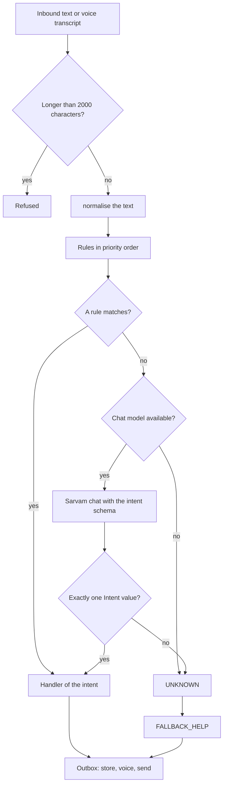
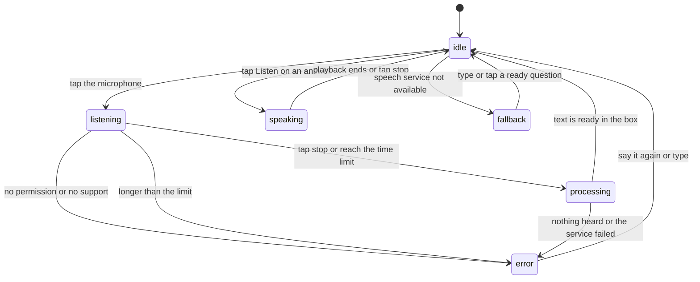
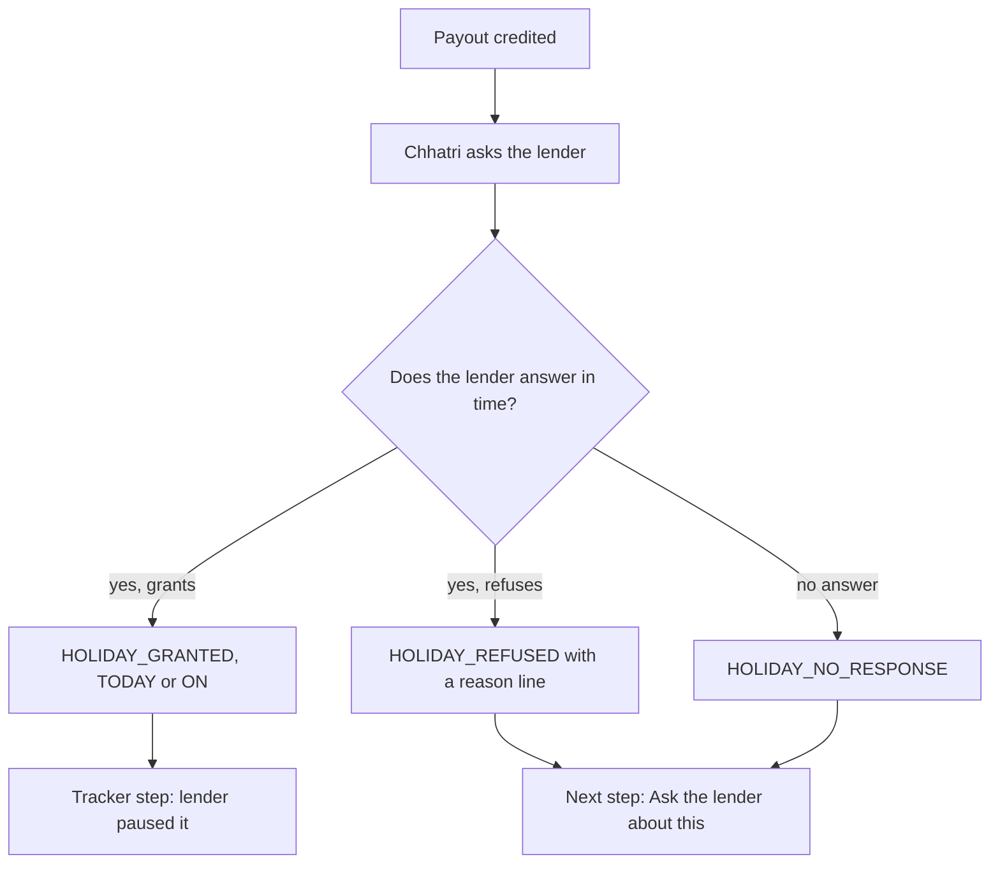
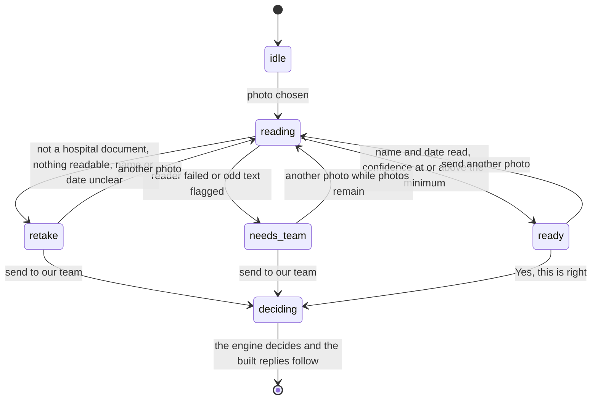

# Conversation design

| | |
|---|---|
| Status | Draft v1.4 · 2 Oct 2026 · Describes the conversation code that is built today and proposes new copy and flows. Everything proposed is PLANNED for waves 1 to 4, behind feature flags |
| Owner | Omkar Kadam |
| Audience | Engineers, designers, the native-speaker reviewer, support staff and anyone judging the bilingual flow |
| Related | [Copy deck](copy-deck.md) · [Ask Chhatri](../02-product/feature-specs/fs-05-ask-chhatri.md) · [EDI holiday](../02-product/feature-specs/fs-03-edi-holiday.md) · [Merchant mini-app](../02-product/feature-specs/fs-04-merchant-mini-app.md) · [Hospital cash claim](../02-product/feature-specs/fs-02-hospital-cash-claim.md) · [Explanations, disputes and grievance](../02-product/feature-specs/fs-06-explanations-disputes-and-grievance.md) · [AI architecture and guardrails](../04-engineering/ai-architecture-and-guardrails.md) · [AI evaluation plan](../04-engineering/ai-evaluation-plan.md) · [Implementation guide](../04-engineering/implementation-guide.md) · [Product requirements](../02-product/prd.md) · [Facts and sources](../01-strategy/facts-and-sources.md) |

## TL;DR

- Everything in this document is P0. It ships in waves 0 to 5 behind feature flags, and a feature that is not finished is hidden, never shown half-working. BUILT means the code does it today. PROPOSED means it is only in a spec or in the copy deck.
- Chhatri speaks respectful Hindi (आप) with English beside it. Numbers are digits, one idea goes in each message, and nothing promises money or approval. Marathi is a draft for wave 4 and needs a native speaker's review.
- Built today: 51 catalogue messages in Hindi and English (section 3.3), nine intents that rules classify and a chat model sees only for UNKNOWN (section 4), and a grounding guard that is tested but not yet called by any reply path (section 5).
- Known dead ends are listed with live results in section 4.6. A thank-you and a bare OK outside a check-in end in the help line, coverage questions are UNKNOWN until Ask Chhatri (N2) ships, and Marathi is UNKNOWN until N8.
- The lender decides the instalment holiday. The built INSTALMENT_PAUSED lines say "paused" and do not say who decided. Section 10.1 quotes them exactly and proposes lines that name the lender and cover a refusal and a missing answer.
- New in this version: voice states for N4 and the H18 confirmation chips (7.2 and 7.4), the H19 scam warning (10.5), and the H21 next action with WhatsApp reply buttons (10.6).
- Every new merchant-facing string, in English, Hindi and Marathi, is in the [copy deck](copy-deck.md). This document says how the strings are used.

## 1. Voice and tone

**Respectful आप.** Every merchant message uses the formal second person आप, never तू, and puts the honorific जी after the given name: "अनिल जी" in Hindi and "Anil ji" in English. The name comes from the merchant record.

**Simple Hindi and English.** Sentences are short and carry one idea. Words are concrete: पर्ची, not दस्तावेज़. Hindi is written in Devanagari. The one built exception is the Soundbox line, which is romanised Hindi ("Paytm par ₹1,380 prapt hue — Chhatri se"). English is plain: "Get well soon", never "expedite your recovery".

**Numbers as digits.** Write ₹1,380, not words. Grouping is Indian: ₹1,58,900. A date in Hindi is the day, a space and the month name (`27 अगस्त`, from `MONTHS_HI` in `messages.py`). A percentage is a whole number: 63%. Money is formatted once with `format_inr` and passed to a template as a string, never as paise or a float.

**Words from insurance.** A few are unavoidable, and the merchant meets them on the payment link and in built messages: प्रीमियम, कवर, वेटिंग पीरियड, सेटलमेंट. The copy deck fixes one word for each idea ([term table](copy-deck.md)), and the jargon lens (H20) explains each term in one sentence and one example. Never say "policy": say the rule.

**Gender.** Chhatri is feminine in Hindi ("छतरी खोई हुई बिक्री का आधा देती है"). The built DISPUTE_ACK uses a masculine first-person verb (`भेज रहा हूँ`). Open question 1 asks whether to change it. New Hindi and Marathi lines avoid gendered first-person verbs.

**No promises.** Nothing promises money or approval before a decision record exists. The promise stems of the guard (section 5.3) are the shared list.

**Honest labels.** LIVE, SIMULATED, FALLBACK and CONFIG are never translated, and anything simulated says so.

## 2. Channels and routing

| Channel | Status | Used for | Merchant sees | Notes |
|---|---|---|---|---|
| WhatsApp Cloud API | SIMULATED | Payout notices, check-in, questions, disputes, voice | Hindi text with English beside it, cards, voice | No Cloud API keys are set. Business-initiated messages outside the 24 hour session need approved templates; two exist in the code, `chhatri_area_payout` and `chhatri_checkin`. Reply buttons (at most 3, titles at most 20 characters) are in the payload builder and in the inbound parser, and no message sets them yet |
| Phone simulator | BUILT | The same flows, at `/merchant/{id}` | Text, cards, a voice player, voice chips (why, dispute, ill, cover), a photo button | Every outbound text message is voiced and cards and CASE_CHIP are not. Demo merchants get Sarvam audio when TTS is LIVE, else the browser speaks the Hindi text |
| Soundbox | SIMULATED | Payout announcement | The SOUNDBOX line, spoken | Written as an audit event |
| Merchant mini-app (N1) | PLANNED, wave 1 | Cover, claim tracker, receipt, explainer, buy, consent, grievance | Screens in the [copy deck](copy-deck.md) | Hindi and English from wave 1, Marathi with N8 |
| Ask Chhatri (N2) | PLANNED, wave 2 | Questions about cover, a claim or a payout | A text box, a voice button, clause chips, a label (LIVE, FALLBACK or SIMULATED) | [fs-05](../02-product/feature-specs/fs-05-ask-chhatri.md) |
| Officer console | BUILT | Review of REFERRED cases, disputes, audit | English only | Strings in [copy deck section 16](copy-deck.md) |

**Routing.** An inbound text goes through the checks of section 4.1 and then to the handler of its intent. A text that is empty or longer than 2,000 characters is refused. An inbound voice note is at most 30 seconds and 5 MB, and a photo is at most 5 MB. Every reply goes through the outbox, which stores it in the merchant thread and voices it.

## 3. Message catalogue

### 3.1 How it works

Every message a merchant receives from the backend is rendered from `CATALOGUE` in `backend/chhatri/conversation/messages.py`, which maps a key to a `Template(hi, en)`.

- `render(key, lang, **facts)` fills one language. `LANGUAGES` is `("hi", "en")`. An unknown key, an unknown language, a missing fact or an unused fact raises `KeyError`, so a typo fails a test instead of reaching a merchant.
- `bilingual(key, **facts)` returns the Hindi and English text as a pair. It cannot be used for a key with no Hindi line (CASE_CHIP and the three PAYOUT_CARD_BADGE keys), which raises `KeyError`.
- The domain `Language` enum already has `mr`. The catalogue does not, so a Marathi text needs the catalogue to gain a third language first (section 11).

```python
render("AREA_PAYOUT_INTRO", "hi", name_hi="अनिल", drop=63)
# अनिल जी, आज भारी बारिश से आपके इलाके की बिक्री 63% गिरी।
bilingual("AREA_PAYOUT_INTRO", name_hi="अनिल", name_en="Anil", drop=63)
# ('अनिल जी, आज भारी बारिश से आपके इलाके की बिक्री 63% गिरी।', "Anil ji, heavy rain cut your area's sales by 63% today.")
```

Helpers: `date_hi` and `date_en` format a date, `name_facts` builds the name facts of a merchant, and `format_inr` formats money with Indian grouping.

### 3.2 The sixteen deck messages

The messages that the pitch deck names, quoted exactly from the catalogue.

| Key | Hindi | English | Facts |
|---|---|---|---|
| `AREA_PAYOUT_INTRO` | {name_hi} जी, आज भारी बारिश से आपके इलाके की बिक्री {drop}% गिरी। | {name_en} ji, heavy rain cut your area's sales by {drop}% today. | `drop`, `name_en`, `name_hi` |
| `PAYOUT_CARD` | आज के सेटलमेंट के साथ जमा | Credited with today's settlement | none |
| `INSTALMENT_PAUSED` | कल की {instalment} की किस्त रोक दी गई है। | Tomorrow's {instalment} instalment is paused. | `instalment` |
| `SOUNDBOX` | Paytm par {amount} prapt hue — Chhatri se | {amount} received on Paytm, from Chhatri | `amount` |
| `CHECKIN_SILENT` | {name_hi} जी, आपकी दुकान कल से बंद दिख रही है। सब ठीक है? | Your shop has been closed since yesterday. Is everything okay? | `name_hi` |
| `ASK_SLIP` | जल्दी ठीक हो जाइए। अस्पताल की पर्ची की एक फ़ोटो भेज दीजिए। | Get well soon. Please send one photo of the hospital slip. | none |
| `PERSONAL_PAID` | {name_hi} जी, आपका दावा मंज़ूर है। {amount} आज के सेटलमेंट के साथ जमा। | {name_en} ji, your claim is approved. {amount} credited with today's settlement. | `amount`, `name_en`, `name_hi` |
| `SLIP_TO_HUMAN` | धन्यवाद। पर्ची पर नाम आपके KYC से मेल नहीं खा रहा, इसलिए हमारी टीम इसे देखेगी। 24 घंटे में जवाब मिलेगा। | Thank you. The name on the slip doesn't match your KYC, so our team will check it. You'll hear back within 24 hours. | none |
| `EXPLAIN_AREA` | आपका आम {weekday_hi}: {expected}। आज आपके इलाके की बिक्री {drop}% गिरी। छतरी खोई हुई बिक्री का आधा देती है। | Your usual {weekday_en}: {expected}. Your area fell {drop}%. Chhatri pays half the lost sales. | `drop`, `expected`, `weekday_en`, `weekday_hi` |
| `DISPUTE_ACK` | ठीक है, मैं इसे हमारी टीम को भेज रहा हूँ। 24 घंटे में जवाब मिलेगा। | Okay, I'm sending this to our team. You'll hear back within 24 hours. | none |
| `CASE_CHIP` | (no Hindi line) | Sent to a claims officer · case {case_id} | `case_id` |
| `COVER_BLOCKED` | नया कवर वेटिंग पीरियड के बाद शुरू होता है — {starts_on_hi} से। कल के अलर्ट पर यह लागू नहीं होगा। | New cover starts after the waiting period — from {starts_on_en}. It won't apply to tomorrow's alert. | `starts_on_en`, `starts_on_hi` |
| `COVER_LINK` | आगे के लिए कवर लेना हो तो {first_payment} ({per_day}/दिन) यहाँ भरें: {url} | To buy cover for later, pay {first_payment} ({per_day}/day) here: {url} | `first_payment`, `per_day`, `url` |
| `OFFICER_APPROVED` | {name_hi} जी, हमारी टीम ने आपका दावा मंज़ूर किया। {amount} जमा। | {name_en} ji, our team approved your claim. {amount} credited. | `amount`, `name_en`, `name_hi` |
| `OFFICER_DECLINED` | {name_hi} जी, हमारी टीम ने आपका दावा देखा। {reason_hi} | {name_en} ji, our team reviewed your claim. {reason_en} | `name_en`, `name_hi`, `reason_en`, `reason_hi` |
| `FALLBACK_HELP` | मैं छतरी हूँ। आप पूछ सकते हैं: "मुझे इतने पैसे क्यों मिले?" या "मेरा नुकसान ज़्यादा हुआ"। | I'm Chhatri. You can ask: "Why did I get this amount?" or "My loss was bigger". | none |

### 3.3 Status of every message

**BUILT messages.** All 51 catalogue keys, quoted from the code. A key with no Hindi line has only English. "Voiced" says whether the phone simulator turns the message into audio.

| Key | Status | Languages | Sent when | Voiced |
|---|---|---|---|---|
| `AREA_PAYOUT_INTRO` | BUILT | hi, en | An area payout is credited. Template `chhatri_area_payout` outside the 24 hour window | yes |
| `PAYOUT_CARD` | BUILT | hi, en | Line of the payout card, area and personal | no (card) |
| `INSTALMENT_PAUSED` | BUILT | hi, en | Instalment pause recorded for tomorrow | yes |
| `SOUNDBOX` | BUILT | hi, en | Soundbox announcement after an area or personal payout | spoken by the Soundbox, not by the phone |
| `CHECKIN_SILENT` | BUILT | hi, en | A full business day with no sales. Template `chhatri_checkin` outside the 24 hour window | yes |
| `ASK_SLIP` | BUILT | hi, en | REPORT_ILLNESS while a silence check-in is open | yes |
| `PERSONAL_PAID` | BUILT | hi, en | A personal claim approved by the engine, at credit time | yes |
| `SLIP_TO_HUMAN` | BUILT | hi, en | A personal claim is REFERRED because the name does not match | yes |
| `EXPLAIN_AREA` | BUILT | hi, en | WHY_AMOUNT after an area payout today, when the share is one half | yes |
| `DISPUTE_ACK` | BUILT | hi, en | DISPUTE_AMOUNT | yes |
| `CASE_CHIP` | BUILT | en | After DISPUTE_ACK and after each SLIP_TO_HUMAN line | no (English only) |
| `COVER_BLOCKED` | BUILT | hi, en | BUY_COVER when the quote is BLOCKED, followed by COVER_LINK | yes |
| `COVER_LINK` | BUILT | hi, en | BUY_COVER when a payment link exists | yes |
| `OFFICER_APPROVED` | BUILT | hi, en | A personal claim approved by an officer, at credit time | yes |
| `OFFICER_DECLINED` | BUILT | hi, en | An officer declines a case, or closes a dispute (then with a REASON_OFFICER line) | yes |
| `FALLBACK_HELP` | BUILT | hi, en | UNKNOWN, GREETING, WHY_AMOUNT with no payout today, AFFIRM or DENY with no open check-in | yes |
| `PAYOUT_CARD_BADGE` | BUILT | en | Badge of an area payout card | no (card) |
| `PAYOUT_CARD_BADGE_PERSONAL` | BUILT | en | Badge of a personal payout card | no (card) |
| `PAYOUT_CARD_BADGE_OFFICER` | BUILT | en | Badge of a payout card after an officer approval | no (card) |
| `SLIP_TO_HUMAN_DATES` | BUILT | hi, en | A personal claim is REFERRED because the dates do not match | yes |
| `SLIP_TO_HUMAN_UNREADABLE` | BUILT | hi, en | A personal claim is REFERRED because the slip is unreadable | yes |
| `SLIP_TO_HUMAN_DAYS` | BUILT | hi, en | A personal claim is REFERRED because it covers more days than are paid automatically | yes |
| `INSTALMENT_PAUSED_TODAY` | BUILT | hi, en | Instalment pause recorded for today | yes |
| `INSTALMENT_PAUSED_ON` | BUILT | hi, en | Instalment pause recorded for any other date | yes |
| `EXPLAIN_PERSONAL` | BUILT | hi, en | WHY_AMOUNT after a personal payout today | yes |
| `EXPLAIN_AREA_FORMULA` | BUILT | hi, en | WHY_AMOUNT after an area payout today, when the share is not one half | yes |
| `PERSONAL_DECLINED` | BUILT | hi, en | The engine declines a personal claim (a HARD check failed), with the REASON line of that check | yes |
| `REASON_COVER_IN_FORCE` | BUILT | hi, en | Reason line when the HARD check COVER_IN_FORCE fails and the decision is DECLINED | with its message |
| `REASON_PREMIUM_PREPAID` | BUILT | hi, en | Reason line when the HARD check PREMIUM_PREPAID fails and the decision is DECLINED | with its message |
| `REASON_SILENCE_VERIFIED` | BUILT | hi, en | Reason line when the HARD check SILENCE_VERIFIED fails and the decision is DECLINED | with its message |
| `REASON_NOT_ALREADY_PAID` | BUILT | hi, en | Reason line when the HARD check NOT_ALREADY_PAID fails and the decision is DECLINED | with its message |
| `REASON_WITHIN_ANNUAL_LIMIT` | BUILT | hi, en | Reason line when the HARD check WITHIN_ANNUAL_LIMIT fails and the decision is DECLINED | with its message |
| `REASON_COVER_BEFORE_ALERT` | BUILT | hi, en | Reason line when the HARD check COVER_BEFORE_ALERT fails and the decision is DECLINED | with its message |
| `REASON_ALERT_ACTIVE` | BUILT | hi, en | Reason line when the HARD check ALERT_ACTIVE fails and the decision is DECLINED | with its message |
| `REASON_INDEX_QUORUM` | BUILT | hi, en | Reason line when the HARD check INDEX_QUORUM fails and the decision is DECLINED | with its message |
| `REASON_BELOW_FLOOR` | BUILT | hi, en | Reason line when the HARD check BELOW_FLOOR fails and the decision is DECLINED | with its message |
| `REASON_BELOW_MODEL_RANGE` | BUILT | hi, en | Reason line when the HARD check BELOW_MODEL_RANGE fails and the decision is DECLINED | with its message |
| `REASON_OFFICER_PERSONAL` | BUILT | hi, en | Reason line when an officer declines a personal claim review | with its message |
| `REASON_OFFICER_DISPUTE` | BUILT | hi, en | Reason line when a dispute about an area payout is closed, or an officer declines an area review | with its message |
| `REASON_OFFICER_DISPUTE_PERSONAL` | BUILT | hi, en | Reason line when a dispute about a personal payout is closed | with its message |
| `COVER_STATUS_ACTIVE` | BUILT | hi, en | COVER_STATUS, cover in force and prepaid | yes |
| `COVER_STATUS_STARTS` | BUILT | hi, en | COVER_STATUS, cover not started yet | yes |
| `COVER_STATUS_UNPAID` | BUILT | hi, en | COVER_STATUS, cover in force but the coming days are not paid | yes |
| `PREMIUM_PAID_STARTS` | BUILT | hi, en | Paytm payment callback, cover starts after today | yes |
| `PREMIUM_PAID_ACTIVE` | BUILT | hi, en | Paytm payment callback, cover already started | yes |
| `COVER_LINK_UNAVAILABLE` | BUILT | hi, en | BUY_COVER when the link could not be created | yes |
| `CHECKIN_OK` | BUILT | hi, en | AFFIRM while a silence check-in is open | yes |
| `CHECKIN_WHAT_HAPPENED` | BUILT | hi, en | DENY while a silence check-in is open | yes |
| `ILLNESS_NO_SILENCE` | BUILT | hi, en | REPORT_ILLNESS with no open check-in | yes |
| `PHOTO_NOT_NEEDED` | BUILT | hi, en | A photo arrives with no open check-in | yes |
| `VOICE_UNCLEAR` | BUILT | hi, en | A voice note has no usable transcript | yes |

**PROPOSED messages.** These keys are not in `messages.py`. Each is written in three languages in the copy deck, and none may be shown before its wave and its flag are on.

| Group | Keys | Wave | Where |
|---|---|---|---|
| The lender decides the instalment holiday | `HOLIDAY_GRANTED`, `HOLIDAY_GRANTED_TODAY`, `HOLIDAY_GRANTED_ON`, `HOLIDAY_REFUSED`, `HOLIDAY_NO_RESPONSE`, `HOLIDAY_REASON_FLAG_OFF`, `HOLIDAY_REASON_NOT_ACTIVE`, `HOLIDAY_REASON_IN_ARREARS`, `HOLIDAY_REASON_NO_ALLOWANCE` | 1 | [copy deck 3.3](copy-deck.md), [fs-03](../02-product/feature-specs/fs-03-edi-holiday.md) |
| Claim tracker lines | 21 keys with the prefix `TRACK_` | 1 | [copy deck 3.2](copy-deck.md) |
| Check lines of the receipt | 14 keys with the prefix `CHK_` | 1 | [copy deck 6.1](copy-deck.md) |
| Counterfactual sentences | 25 keys with the prefix `CF_` | 1 | [copy deck 6.2 to 6.4](copy-deck.md), [fs-09](../02-product/feature-specs/fs-09-policy-engine-and-audit.md) |
| Cover status and a blocked quote for an alert already in force | `COVER_STATUS_NONE`, `COVER_BLOCKED_NOW` | 1 | [copy deck 2.5](copy-deck.md), [fs-07](../02-product/feature-specs/fs-07-cover-purchase-and-consent.md) |
| Two dispute replies | `DISPUTE_NO_PAYOUT`, `DISPUTE_ALREADY_OPEN` | 1 | [copy deck 13.2](copy-deck.md), [fs-06](../02-product/feature-specs/fs-06-explanations-disputes-and-grievance.md) |
| Ask Chhatri fixed lines | `ASK_HANDOFF`, `ASK_SCAM_WARNING`, `ASK_MENTION_CHIP`, `ASK_MENTION_WORDS`, `ASK_TOO_LONG`, `ASK_VOICE_NOTICE`, `ASK_OFFLINE` | 2 | [copy deck 9.2](copy-deck.md), [fs-05](../02-product/feature-specs/fs-05-ask-chhatri.md) |
| Slip pre-check | 27 keys with the prefix `SLIP_` | 2 | [copy deck 12](copy-deck.md), [fs-02](../02-product/feature-specs/fs-02-hospital-cash-claim.md) |
| Cover notice and consent in chat | `COVER_NOTICE`, `CONSENT_WITHDRAWN_SALES`, `CONSENT_WITHDRAWN_SLIP`, `CONSENT_WITHDRAWN_SETTLEMENT`, `SLIP_CONSENT_NEEDED` | 3 | [copy deck 14](copy-deck.md), [fs-07](../02-product/feature-specs/fs-07-cover-purchase-and-consent.md) |

The mini-app and console strings have dotted lower-case keys in the copy deck (for example `nba.pay` and `jargon.premium.what`). They are not catalogue keys.

A new key is added in one commit with its Hindi and English text, its test and, when it replaces a built line, the files in section 10.1.

## 4. Intent detection

Nine intents: WHY_AMOUNT, DISPUTE_AMOUNT, REPORT_ILLNESS, BUY_COVER, COVER_STATUS, GREETING, AFFIRM, DENY and UNKNOWN. Rules decide first. A chat model sees a message only when the rules return UNKNOWN. This section describes the code in `backend/chhatri/conversation/` (`intents.py`, `lexicon.py`, `nlu.py`, `replies.py`) and is BUILT unless it says otherwise.

### 4.1 Pipeline



The model path (`nlu.py`) is built as follows. The chat model is `sarvam-105b`. Only the first 500 characters of the message go into the prompt. The reply is accepted only when it is exactly one `Intent` value. On any error, timeout or odd reply the rules' UNKNOWN stands. The merchant's text is never logged. The audit entry `intent.detected` records the source, `rules` or `llm`. With no key set the model path is skipped, and every message the rules do not know gets FALLBACK_HELP.

### 4.2 Normalisation

`normalise(text)` makes one canonical form before any rule runs:

1. Unicode NFD, then the nukta (़) is dropped, so Hindi word lists are written without it: ज्यादा, not ज़्यादा.
2. The chandrabindu (ँ) becomes the anusvara (ं).
3. Lower case.
4. Apostrophes are removed, so "doesn't" and "doesnt" are the same.
5. The danda (। ॥) and every other character that is not a letter, a digit or a Devanagari sign become spaces.
6. The words are joined with single spaces and one space is added at each end.

A concept matches a **stem** (the start of a token), a **whole word** (a complete token) or a phrase (tokens that start at a token boundary). `बीमार` as a stem matches बीमारी. `बीमा` as a whole word does not match बीमार. Token boundaries are spaces, because the regular expression `\b` breaks inside a Devanagari word at its vowel signs.

| Input | After `normalise` |
|---|---|
| मुझे इतने ही पैसे क्यों मिले? | `" मुझे इतने ही पैसे क्यों मिले "` |
| ज़्यादा | `" ज्यादा "` |
| आँख | `" आंख "` |
| Doesn't help! | `" doesnt help "` |
| ठीक है। | `" ठीक है "` |

### 4.3 Rules, priority and today's reply

The first intent in the list whose rule matches wins. The order is the `PRIORITY` tuple.

| Order | Intent | Rule | Reply today |
|---|---|---|---|
| 1 | DISPUTE_AMOUNT | (LOSS and MORE) or DISAGREE or (NOT_ENOUGH and not WHY) or (SHOULD and EXTRA and AMOUNT) | DISPUTE_ACK and CASE_CHIP. A DISPUTE case opens on the latest PAID decision, or with "no paid claim on record" when there is none |
| 2 | WHY_AMOUNT | (WHY and AMOUNT) or CALCULATION | EXPLAIN_AREA, EXPLAIN_AREA_FORMULA or EXPLAIN_PERSONAL when the latest PAID decision was made today. Otherwise FALLBACK_HELP |
| 3 | REPORT_ILLNESS | ILLNESS | ASK_SLIP while a silence check-in is open. Otherwise ILLNESS_NO_SILENCE |
| 4 | COVER_STATUS | COVER and STATUS | COVER_STATUS_ACTIVE, COVER_STATUS_STARTS or COVER_STATUS_UNPAID. A merchant with no cover gets the purchase reply |
| 5 | BUY_COVER | COVER and BUY | COVER_BLOCKED then COVER_LINK, or COVER_LINK alone, or COVER_LINK_UNAVAILABLE |
| 6 | DENY | at least one DENY word, and nothing but DENY words, affirm words and fillers | CHECKIN_WHAT_HAPPENED while a check-in is open. Otherwise FALLBACK_HELP |
| 7 | AFFIRM | at least one affirm word, and nothing but affirm words and fillers | CHECKIN_OK while a check-in is open. Otherwise FALLBACK_HELP |
| 8 | GREETING | at least one greeting word, and nothing but greeting words and fillers | FALLBACK_HELP |
| 9 | UNKNOWN | none of the above | FALLBACK_HELP |

Why this order. A merchant who asks and also contests is offered the human review, so a dispute beats a question. An amount question beats an illness mention. Illness beats cover talk. A status question beats a purchase. DENY comes before AFFIRM, so "theek nahi" is a DENY although it contains "theek". DENY, AFFIRM and GREETING need the whole message to be made of their words, so "hello, why did I get only this much?" is still WHY_AMOUNT.

### 4.4 Word lists

The lists are quoted from `lexicon.py`, after normalisation (no nukta). A concept matches when any stem starts a token, any whole word is a token, or (for AMOUNT) any digit appears.

| Concept | Meaning | Stems (a token starts with one of these) | Whole words | Digits |
|---|---|---|---|---|
| WHY | a why-word | - | `kyo`, `kyon`, `kyoon`, `kyu`, `kyun`, `why`, `क्यु`, `क्यूं`, `क्यो`, `क्यों` | - |
| AMOUNT | money, amount or payment | `amount`, `itn`, `money`, `paisa`, `paise`, `payment`, `payout`, `rupay`, `rupee`, `so less`, `so little`, `so much`, `this much`, `इतन`, `पेमेंट`, `पैस`, `भुगतान`, `रकम`, `राशि`, `रुपए`, `रुपय` | `kam`, `less`, `little`, `only`, `paid`, `pay`, `rs`, `sirf`, `कम`, `सिर्फ` | any digit |
| CALCULATION | explain, how it was worked out | `breakdown`, `calculat`, `explain`, `hisaab`, `hisab`, `samjha`, `समझा`, `हिसाब` | - | - |
| LOSS | loss, damage | `damage`, `ghaata`, `ghata`, `loss`, `lost`, `nuksaan`, `nuksan`, `nukshan`, `nuqsan`, `घाटा`, `घाटे`, `नुकशान`, `नुकसान`, `नुक्सान`, `लास`, `लॉस` | - | - |
| MORE | more, bigger | `bigger`, `greater`, `higher`, `larger`, `अधिक`, `जयाद`, `जादा`, `ज्याद`, `बडा`, `बडी`, `बडे` | `adhik`, `bada`, `badi`, `jada`, `jyaada`, `jyada`, `more`, `much`, `than that`, `zada`, `zyaada`, `zyada` | - |
| DISAGREE | wrong, review, complain | `appeal`, `complain`, `disagree`, `dispute`, `dobara dekh`, `galat`, `not fair`, `not right`, `recheck`, `review`, `sahi nahi`, `shikayat`, `unfair`, `wrong`, `गलत`, `दोबारा देख`, `शिकायत`, `सही नहीं` | - | - |
| NOT_ENOUGH | not enough, too little | `bahut kam`, `kam mil`, `kam paise`, `less money`, `not enough`, `only got`, `paisa kam`, `paise kam`, `too less`, `too little`, `very less`, `कम पैस`, `कम मिल`, `पैसे कम`, `बहुत कम` | - | - |
| SHOULD | should get, deserve | `chahie`, `chahiye`, `chaiye`, `deserve`, `should`, `चाहिए`, `चाहिये` | - | - |
| EXTRA | extra, more money | - | `aur`, `jyada`, `more`, `zyada`, `और`, `ज्यादा` | - |
| ILLNESS | hospital, fever, ill, accident | `accident`, `admitted`, `aspatal`, `beemar`, `bimaar`, `bimar`, `bukhaar`, `bukhar`, `dengue`, `doctor`, `fever`, `haspatal`, `hospital`, `ilaaj`, `ilaj`, `injur`, `malaria`, `not well`, `sick`, `surgery`, `tabeeyat`, `tabiyat`, `tabiyet`, `typhoid`, `unwell`, `अस्पताल`, `इलाज`, `एक्सीडेंट`, `ऑपरेशन`, `चोट`, `टाइफाइड`, `डाक्टर`, `डेंगू`, `डॉक्टर`, `तबियत`, `तबीयत`, `दुर्घटना`, `बीमार`, `बुखार`, `भर्ती`, `मलेरिया`, `हस्पताल`, `हॉस्पिटल` | `ill`, `दवा` | - |
| COVER | cover | `cover`, `insur`, `polic`, `कवर`, `पॉलिसी` | `beema`, `bima`, `बिमा`, `बीमा` | - |
| STATUS | is it active, since when | `activ`, `am i covered`, `chalu`, `do i have`, `expir`, `kab tak`, `kya mera`, `mera bima`, `mera cover`, `my cover`, `my insurance`, `my policy`, `status`, `till when`, `until when`, `valid`, `कब तक`, `चालू`, `मेरा कवर`, `मेरा बीमा` | `kab`, `when`, `कब` | - |
| BUY | buy, give, get cover | `buy`, `chahie`, `chahiye`, `chaiye`, `cover me`, `cover my`, `de do`, `dedo`, `dijiye`, `dilao`, `enrol`, `get`, `give`, `kar do`, `karo`, `karva`, `karwa`, `kharid`, `lelo`, `lena`, `leni`, `need`, `purchas`, `sign up`, `subscrib`, `take`, `want`, `करवा`, `करो`, `खरीद`, `चाहिए`, `चाहिये`, `दिला`, `दीजिए`, `लेन` | `cover do`, `दे`, `दो`, `ले` | - |

| Word set | Used for | Words |
|---|---|---|
| AFFIRM_WORDS | AFFIRM: the whole message is these words and fillers | `accha`, `acha`, `achha`, `alright`, `bilkul`, `correct`, `done`, `fine`, `good`, `great`, `ha`, `haa`, `haan`, `han`, `hn`, `k`, `ok`, `okay`, `okk`, `right`, `sahi`, `sure`, `theek`, `thik`, `tik`, `well`, `yeah`, `yep`, `yes`, `yup`, `अच्छा`, `ठीक`, `बिलकुल`, `बिल्कुल`, `सही`, `हा`, `हां` |
| DENY_WORDS | DENY: the whole message is these words, affirm words and fillers | `mat`, `na`, `nah`, `nahi`, `nahin`, `never`, `nhi`, `no`, `nope`, `not`, `न`, `नही`, `नहीं`, `ना`, `मत` |
| GREETING_WORDS | GREETING: the whole message is these words and fillers | `afternoon`, `evening`, `good`, `hello`, `helo`, `hey`, `hi`, `hii`, `morning`, `namaskaar`, `namaskar`, `namaste`, `pranam`, `ram`, `नमस्कार`, `नमस्ते`, `प्रणाम`, `राम`, `सुप्रभात` |
| FILLER_WORDS | may sit beside an affirm, deny or greeting word without changing it | `all`, `am`, `bhai`, `bhi`, `chhatri`, `everything`, `hai`, `hoon`, `hu`, `hun`, `i`, `im`, `is`, `it`, `its`, `ji`, `main`, `please`, `sab`, `sir`, `to`, `छतरी`, `जी`, `तो`, `भाई`, `भी`, `मैं`, `सब`, `हूं`, `है` |

### 4.5 What the rules do with real messages

Each row was run through `classify` when this document was written.

| Merchant says | Intent | Note |
|---|---|---|
| मुझे इतने ही पैसे क्यों मिले? | `WHY_AMOUNT` | the golden demo question |
| Why did I get only this much? | `WHY_AMOUNT` | English |
| mujhe itne paise kyun mile | `WHY_AMOUNT` | Hinglish |
| How was this amount calculated? | `WHY_AMOUNT` | explain |
| मेरा नुकसान ज़्यादा हुआ। | `DISPUTE_AMOUNT` | the golden demo dispute |
| My loss was bigger. | `DISPUTE_AMOUNT` | English |
| ye galat hai | `DISPUTE_AMOUNT` | Hinglish, disagreement |
| I want a review | `DISPUTE_AMOUNT` | disagreement |
| मैं अस्पताल में हूँ, बुखार है। | `REPORT_ILLNESS` | the golden demo illness |
| I'm in hospital with a fever. | `REPORT_ILLNESS` | English |
| मेरा कवर चालू है क्या? | `COVER_STATUS` | cover and status |
| Is my cover active? | `COVER_STATUS` | English |
| Red alert tomorrow. Cover me today. | `BUY_COVER` | the golden demo purchase |
| कवर दे दो | `BUY_COVER` | cover and buy |
| ठीक है | `AFFIRM` | affirm |
| हाँ जी | `AFFIRM` | affirm |
| नहीं | `DENY` | deny |
| theek nahi | `DENY` | deny, although it contains theek |
| नमस्ते | `GREETING` | greeting |
| hello | `GREETING` | greeting |
| hello, why did I get only this much? | `WHY_AMOUNT` | a greeting does not hide a question |
| hello, why did I get this? | `UNKNOWN` | no amount word, so no question is found |
| फ़ोटो भेज दिया | `UNKNOWN` | a statement |

### 4.6 Known dead ends and mis-routes

These are facts about the built code, not wishes. Each has a fix that is already in a spec or an open question.

| Merchant says | Intent | Note |
|---|---|---|
| thanks | `UNKNOWN` | a thank-you has no intent |
| धन्यवाद | `UNKNOWN` | a thank-you in Hindi |
| OK thanks | `UNKNOWN` | thanks is not a filler word, so an OK with thanks is not an AFFIRM |
| ok | `AFFIRM` | an AFFIRM, but it has an answer only during a check-in |
| I want to talk to a person | `UNKNOWN` | a request for a person has no intent |
| टीम से बात करिए | `UNKNOWN` | the same request in Hindi |
| when will I get my money | `UNKNOWN` | a question about timing |
| Why was my claim rejected? | `UNKNOWN` | no amount word, so it is not a why-question |
| क्या गर्मी में भी कवर होता है? | `UNKNOWN` | a coverage question: Ask Chhatri (N2) answers it, the rules do not |
| Does the cover include hospital? | `REPORT_ILLNESS` | a coverage question that mentions hospital |
| Can I buy cover during an alert? | `BUY_COVER` | a question about buying, read as a purchase |
| Why was I not paid? | `WHY_AMOUNT` | asks why, with no payout |
| मला पैसे का मिळाले? | `UNKNOWN` | Marathi: no Marathi word list exists yet |

- **A thank-you ends in the help line.** "thanks" and "धन्यवाद" are UNKNOWN, so the reply is FALLBACK_HELP, which reads as if Chhatri did not understand. No acknowledgement line is written yet (open question 3).
- **A request for a person is UNKNOWN.** "I want to talk to a person" and "टीम से बात करिए" match no word list, so the reply is FALLBACK_HELP, which does not offer a person. The only built route to a person is a dispute. The next action TALK_TO_TEAM and the grievance router (N5) are the proposed fix (sections 9 and 10.6).
- **A bare OK, yes or no answers only a check-in.** AFFIRM and DENY have an answer only while a silence check-in is open. Anywhere else the reply is FALLBACK_HELP. The WhatsApp reply buttons of section 10.6 follow this rule: none offers a bare OK outside a check-in.
- **A greeting is answered by the help line.** That is acceptable, and the help line shows what to ask.
- **"Why" needs a payout today.** WHY_AMOUNT is answered from the latest PAID decision only when it was made today. The next day the same question gets FALLBACK_HELP.
- **A dispute opens a case even when nothing was paid.** The case summary then says "no paid claim on record". [fs-06](../02-product/feature-specs/fs-06-explanations-disputes-and-grievance.md) proposes DISPUTE_NO_PAYOUT and DISPUTE_ALREADY_OPEN (wave 1). Only the latest PAID decision can be disputed, so a declined claim cannot.
- **Coverage questions are UNKNOWN** until Ask Chhatri (N2) answers them from the policy clauses. A question about hospital cover is read as REPORT_ILLNESS, and "Can I buy cover during an alert?" is read as a purchase. Ask Chhatri's own pipeline lists the same mis-routes and keeps the rules as the first classifier.
- **No case kind carries a general question.** There is no HANDOFF kind (section 10.3).
- **Marathi is UNKNOWN.** Section 11 proposes the word lists.

### 4.7 Voice input

A voice note is turned into text by speech-to-text and then follows the same path. If the transcript is empty the reply is VOICE_UNCLEAR. Section 7 has the details.

## 5. Guard (grounding and promises)

`backend/chhatri/conversation/guard.py` enforces the rule that every money number shown to a merchant can be reproduced from the numbers shown next to it, and that no text promises money or approval.

### 5.1 What is built

Layer A is `grounded(reply, allowed_numbers)`. It returns true only when the reply uses nothing but allowed numbers and passes the promise check. It is BUILT and tested (`backend/tests/conversation/test_guard.py`). **No production code calls it yet.** The catalogue strings are not guarded either: they are fixed text, and the planned honest-wording scan (X7) is what checks them. The first caller will be Ask Chhatri (wave 2), where a model writes text.

### 5.2 Digit rule

The reply is searched for digit runs. Devanagari digits are folded to ASCII and grouping commas are dropped first, so `₹1,380`, `1380` and `१३८०` are the same run. Every run must be in `allowed_numbers`, which the caller builds from the decision facts. A decimal such as `₹1,380.50` brings in `50`, which must be a fact too. A time such as `17:04` gives `17` and `04`. A clause id such as `C4.1` gives `4` and `1`, so today it fails the digit rule unless those digits are facts (planned rule B1 strips valid clause ids first).

### 5.3 Promise rule

The reply is normalised as in 4.2 and then matched against these 39 stems. A stem matches when a token starts with it. There are no whole-word entries. English, Hindi and Hinglish promises share one list.

`approv`, `assur`, `definitely get`, `guarantee`, `manjoor`, `manjur`, `manzoor`, `mil jayega`, `mil jayenge`, `paisa milega`, `paise milenge`, `pakka`, `pass ho jayega`, `payment ho jayega`, `promis`, `refund`, `sanction`, `surely get`, `will be credited`, `will be paid`, `will credit`, `will get`, `will pay`, `will receive`, `youll get`, `गारंटी`, `जमा कर देंगे`, `जमा हो जाएग`, `पक्का`, `पैसे मिल`, `भुगतान कर देंगे`, `भुगतान मिल`, `भुगतान हो जाएग`, `मंजूर`, `मिल जाएंग`, `मिल जायेंग`, `मिलेंगे`, `रुपये मिल`, `वादा`

Some stems are phrases. `भुगतान मिल` matches "भुगतान मिल जाएगा" and also "भुगतान मिलाकर", because a token that starts with `मिल` follows the word भुगतान. A block is therefore a signal to use the template, never a proof of a promise.

### 5.4 Examples

Each row was run through `grounded` when this document was written.

| Reply | Facts allowed | Result | Why |
|---|---|---|---|
| आपका नुकसान ₹1,380 है। | `1380` | passes | the amount is a fact |
| आपको ₹2,000 देंगे | `1500` | blocked | 2000 is not a fact |
| Chhatri pays ₹1,500 for 1 day. | `1500`, `1` | passes | both numbers are facts |
| Your claim will be approved. | none | blocked | promise stem: approv |
| आपका दावा ज़रूर मंज़ूर होगा | none | blocked | promise stem: मंजूर |
| You will get ₹1,500 tomorrow. | `1500` | blocked | promise stem: will get |
| The decision is on record at 17:04. | `17`, `4` | blocked | 17:04 gives 17 and 04, and 04 is not a fact (4 is) |
| See clause C4.1 for the cap. | none | blocked | C4.1 gives 4 and 1, so a clause id fails the digit rule today |
| Chhatri pays one thousand five hundred rupees. | none | passes | number words are not caught today (planned rule B3) |

### 5.5 What the guard does not do today

- It does not read number words. "one thousand five hundred rupees" has no digit and passes.
- It does not know which digits are clause ids, times or dates.
- It does not check links, phone numbers or UPI handles.
- It does not check length, script or a leaked prompt.
- It does not read the catalogue.

### 5.6 Layer B (PLANNED, wave 2)

[fs-05](../02-product/feature-specs/fs-05-ask-chhatri.md) adds nine rules in front of layer A for model text. Both layers must pass.

| Rule | What it blocks |
|---|---|
| B1 | Clause ids outside C1 to C12 and C4.1 to C4.4. Valid ids are stripped before the number check. A case id such as `C-2291` is not a clause id |
| B2 | A rupee amount that is not in the rupee facts, and a percentage that is not in the percent facts |
| B3 | Number words (hundred, thousand, lakh, crore, the words for eleven to ninety) in English, Hindi and Hinglish, and small number words next to a currency word. The model must write digits so that layer A can check them |
| B4 | A money word within five tokens of a future or assurance marker, such as will, मिलेगा, tomorrow or soon |
| B5 | Outcome promises and certainty that the built stems miss, such as "पास हो जाएगा" and "definitely" |
| B6 | Links, phone numbers, UPI handles and email addresses. The only link ever shown is COVER_LINK from the engine |
| B7 | A reply longer than the cap (600 characters for each language, proposed) and a Hindi answer with no Devanagari |
| B8 | A reply that contains the per-request canary, which means the prompt leaked |
| B9 | Allowed numbers come only from the fact sheet. A number in the question is never added |

### 5.7 When the guard blocks

The blocked text is never shown. Ask Chhatri shows FALLBACK_HELP with the label FALLBACK and the reason `GUARD_BLOCKED` (copy deck, section 15.5). A merchant's own words are not guarded: they are input, not output.

## 6. Proactive messaging and the X8 rule

Chhatri starts some messages and sends others as a reply to the merchant. The table in 6.1 lists the messages that Chhatri starts. The X8 rule of [fs-03](../02-product/feature-specs/fs-03-edi-holiday.md) section 9 sorts every message into one of three kinds (6.2), and the check-in is the one built message of the proactive kind.

### 6.1 Built flows

| Trigger | Messages | Notes |
|---|---|---|
| A full business day with no sales | CHECKIN_SILENT | WhatsApp template `chhatri_checkin` outside the 24 hour session. In the illness replay it is sent at 11:20 the next day |
| An area payout is credited | AREA_PAYOUT_INTRO, the payout card (PAYOUT_CARD with a PAYOUT_CARD_BADGE), SOUNDBOX | WhatsApp template `chhatri_area_payout` outside the session. In the monsoon replay this is 17:04, four simulated minutes after the 17:00 decision |
| A personal payout is credited | PERSONAL_PAID, or OFFICER_APPROVED after an officer approval, with its card and badge, and SOUNDBOX | Four simulated minutes after the decision |
| An instalment pause is recorded | INSTALMENT_PAUSED, INSTALMENT_PAUSED_TODAY or INSTALMENT_PAUSED_ON | Five simulated minutes after the decision. X4 replaces these three lines (section 10.1) |
| A premium payment arrives (Paytm callback) | PREMIUM_PAID_STARTS or PREMIUM_PAID_ACTIVE | STARTS when cover starts after today, ACTIVE when it has started |
| An officer closes a case | OFFICER_APPROVED, or OFFICER_DECLINED with a REASON line | A closed dispute is explained by what was disputed: an area payout by the area's numbers, a personal payout by the daily cap. Confirming and rejecting a dispute read the same today, a known gap ([fs-06](../02-product/feature-specs/fs-06-explanations-disputes-and-grievance.md)) |

### 6.2 X8: offers and the message limit

X8 is PLANNED for wave 3 and has two parts. The rules and the tests are in [fs-03](../02-product/feature-specs/fs-03-edi-holiday.md) section 9.

- **No offers in distress.** No loan, top-up or cross-sell message or card is sent while an alert covers the merchant's zone (valid now, or issued and starting within the 72 hour look-ahead), while a claim is being decided, while a case is open, while a referred decision waits for an officer, or while a grievance is open. No such offer exists in the product today, and the next-action list of section 10.6 has no offer kind, so the rule holds by construction.
- **A limit on proactive messages.** At most `max_proactive_per_day` proactive messages for one merchant on one calendar day (IST). The spec proposes the value 3, as a setting to tune. Transactional messages are never limited or suppressed.

The spec sorts every catalogue key into one of three kinds, in a closed map that is checked in one place before the outbox sends. This is where the built keys fall:

| Kind | Meaning | Built keys (placement proposed here) |
|---|---|---|
| TRANSACTIONAL | Payout, receipt, decision and reply messages | The other 50 of the 51 built keys |
| PROACTIVE | Check-ins and reminders | `CHECKIN_SILENT` |
| OFFER | A loan, top-up or cross-sell card | None exists |

None of this is built: no code limits messages today. When X8 lands, every new key is given a kind in the same commit. Open question 4 asks whether 3 a day is the right setting.

## 7. Voice UX (N4)

### 7.1 Input: speech to text

- **LIVE.** Sarvam `saaras:v3` in transcribe mode, with `language_code` set to `hi-IN` or `unknown` and `input_audio_codec` taken from the upload type (opus from WhatsApp, webm from the browser). It returns the transcript and the language it heard. LIVE only when `SARVAM_API_KEY` is set.
- **Limits.** The recorder stops itself at 30 seconds (`MAX_RECORD_SECONDS`). The API refuses audio longer than 30 seconds or larger than 5 MB.
- **SIMULATED.** Four ready-made voice notes, the voice chips `why`, `dispute`, `ill` and `cover`. The merchant taps a chip and the sentence is used as the transcript. The chips are the demo path, and the copy deck shows the SIMULATED note while they are used.
- **Nothing heard.** An empty transcript gets VOICE_UNCLEAR, in Hindi and English, with a prompt to say it again or type it.
- **Browser speech recognition** (the Web Speech API) is not built. The browser voice is used for speaking only.

### 7.2 Confirmation chips for amounts and dates (H18, wave 2)

A misheard number is the costliest mistake a voice question can make, because an amount or a date changes the answer. H18 puts the merchant's eyes on every amount and date before the question is sent. It applies to the Ask screen of the mini-app. A WhatsApp voice note is answered at once, as today, and an amount heard in it changes nothing.

1. Recording ends, by the stop button or at the 30 second limit.
2. The transcript fills an editable text box. Voice never sends on its own.
3. The server finds each amount (for example ₹1,500) and each date (for example 19 August, or the word कल) in the final text and returns one chip for each.
4. Each chip carries the line ASK_MENTION_CHIP, "₹1,500 — is that right?", and two buttons, Right and Change. Right confirms the value. Change puts the cursor in the text box.
5. Send stays disabled until every chip is confirmed, and a hint says why. The server also refuses an unconfirmed voice question with 409.
6. The Hindi word कल means both yesterday and tomorrow. Its chip asks which one, with two options, and the server never guesses.
7. If a number is spoken as words that the parser cannot turn into a value, the app asks the merchant to type it (ASK_MENTION_WORDS).
8. If the merchant edits the text and adds an amount or a date, a new chip appears and must be confirmed.

The strings are in [copy deck section 11.2](copy-deck.md). The chip rules are in [fs-05](../02-product/feature-specs/fs-05-ask-chhatri.md).

### 7.3 Output: text to speech

- **LIVE.** Sarvam `bulbul:v3`, speaker `ritu`, pace 1.0, as mp3 for the browser or opus for WhatsApp. The limit is 2,500 characters.
- **SIMULATED.** The browser `speechSynthesis` reads the Hindi text, with a Hindi voice when the device has one.
- **Playback.** WhatsApp voice notes play in the thread. In the phone simulator and the mini-app an answer has a Listen button, and the caption text is always shown.
- **Not voiced.** Cards and CASE_CHIP. The Soundbox line is spoken by the Soundbox, not by the phone.

### 7.4 Voice states (N4, wave 2)

Six states: idle, listening, processing, speaking, error and fallback. The recording states are named listening and processing here and recording and transcribing in the Ask Chhatri spec.



| State | What the merchant sees | Copy keys | Leaves when |
|---|---|---|---|
| idle | The microphone button and the line "Tap the mic and speak." While speech to text is simulated, a note says so | `voice.state.idle`, `voice.btn.speak`, `voice.sim.note` | The merchant taps the microphone, or taps Listen on an answer |
| listening | The seconds so far against the limit, and a Stop button | `voice.state.listening`, `voice.btn.stop` | Stop, or the limit |
| processing | "Understanding what you said…" and a Cancel button | `voice.state.processing` | The text is ready, or it fails |
| speaking | "Playing the answer. Tap to stop." The text of the answer stays on screen | `voice.state.speaking`, `voice.btn.listen` | The audio ends, or Stop |
| error | One plain line and a next step, never a dead end. A permission error says how to allow the microphone, and the text box stays | `voice.err.denied`, `voice.err.unsupported`, `voice.err.fix`, `voice.err.too_long`, and VOICE_UNCLEAR for an empty transcript | The merchant says it again or types |
| fallback | "Voice is not available right now. You can type, or tap one of the ready questions." With the FALLBACK token and the reason line. The microphone is hidden and the text box stays | `voice.state.fallback`, and the reason lines of copy deck section 15.5 | The merchant types or taps a ready question |

The copy deck has the Hindi and Marathi of every key ([section 11.1](copy-deck.md)). The two recorder errors in `voice.err.denied` and `voice.err.unsupported` are built in English.

The Ask Chhatri spec also lists a first-use notice and a confirm step in its table of voice states. Here the notice (ASK_VOICE_NOTICE) is a line shown once before the first recording, and the confirm step is the chips of section 7.2, shown on the text box when the state returns to idle. Neither is a state of its own.

## 8. Repair strategies

What the merchant sees when something does not go as planned. The second column is BUILT unless it says PROPOSED.

| Scenario | Merchant sees | Next step |
|---|---|---|
| The message is not understood (a statement such as "फ़ोटो भेज दिया") | FALLBACK_HELP: `I'm Chhatri. You can ask: "Why did I get this amount?" or "My loss was bigger"` | The merchant asks again. PROPOSED: the reply buttons of section 10.6 after FALLBACK_HELP |
| "सब ठीक है" or "नहीं" during a silence check-in | CHECKIN_OK: `Good to hear. If you need help, just write to me.` or CHECKIN_WHAT_HAPPENED: `What happened? If you're ill or in hospital, please tell me.` | The merchant writes more, or reports an illness |
| An angry message ("गलत है! जालसाज़ी है!") | `DISPUTE_AMOUNT`, so DISPUTE_ACK and a case. The reply never argues | An officer reviews within the clock |
| A request for a person ("I want to talk to a person") | UNKNOWN, so FALLBACK_HELP, which offers no person | PROPOSED: TALK_TO_TEAM and the grievance router (sections 9 and 10.6) |
| The voice is unclear or clipped | VOICE_UNCLEAR: `Sorry, I couldn't hear that clearly. Please say it again or type it.` | The merchant records again or types |
| A photo arrives when none is needed | PHOTO_NOT_NEEDED: `Thanks for the photo. There's no open claim right now. If your shop stays closed for a full business day, Chhatri will reach out.` | None. No claim is opened |
| The slip cannot be read (N3) | PROPOSED: SLIP_RETAKE_CLEAR, SLIP_NO_READ or SLIP_PHOTO_LIMIT (copy deck section 12.2) | Another photo, or send it to the team |
| The question is outside what Ask Chhatri covers (N2) | PROPOSED: ASK_HANDOFF with the next action TALK_TO_TEAM | See 10.3 |
| Every AI link fails or the guard blocks the answer (N2) | PROPOSED: FALLBACK_HELP with the label FALLBACK and a reason | The merchant asks again |
| The app cannot reach the backend | PROPOSED: an error card with a retry button, and ASK_OFFLINE on the Ask screen. The typed text is kept | Retry |

## 9. Escalation

When the system cannot settle a merchant's concern, a person looks at it.

- **A dispute (BUILT).** DISPUTE_AMOUNT sends DISPUTE_ACK, "I'm sending this to our team. You'll hear back within 24 hours.", then CASE_CHIP, "Sent to a claims officer · case C-2291" (the first case id after a fresh load). The case has a due time 24 hours after it opens (`dispute_sla_hours` in `rules.yaml`). The officer sees the evidence and the merchant's own words.
- **A referred claim (BUILT).** A personal claim that a SOFT check holds back gets a SLIP_TO_HUMAN line and the same chip.
- **Talk to the team (PROPOSED, wave 2).** When Ask Chhatri cannot answer, the answer is ASK_HANDOFF and the next action is TALK_TO_TEAM. Until N5 ships, TALK_TO_TEAM opens the dispute button for a merchant who has a decision and is replaced by ASK_AGAIN for everyone else.
- **Grievance ladder (PROPOSED, wave 3, N5).** Paytm dispute, the insurer's grievance officer, Bima Bharosa, the Ombudsman, the lender's grievance and Paytm support, each shown with its own clock only where a source exists ([copy deck section 13](copy-deck.md)).

## 10. Proposed new copy and change requests

Everything here is PROPOSED unless a line says BUILT. The strings are in the [copy deck](copy-deck.md). This section says how they work and what changes in the code. Everything is P0 and ships in waves 0 to 5 behind feature flags.

### 10.1 X4: the lender decides the instalment holiday (wave 1)

**The problem.** The built line says "Tomorrow's ₹600 instalment is paused." It names no one, so it reads as if Chhatri or the system paused the loan. The holiday is the lender's decision ([ADR 0006](../04-engineering/adr/0006-edi-holiday-is-the-lenders-decision.md), [fs-03](../02-product/feature-specs/fs-03-edi-holiday.md)): after a payout Chhatri asks the lender, under a rule the lender agreed in advance, and the lender grants or refuses.

**BUILT today.** `notifications.instalment_paused` picks one of three lines by the pause date, five simulated minutes after the payout decision. Chhatri's own workflow records the pause, and nothing in it waits for a lender: `InstalmentPause` has no grant or status field.

| Key | Hindi (built) | English (built) | Sent when |
|---|---|---|---|
| `INSTALMENT_PAUSED` | कल की {instalment} की किस्त रोक दी गई है। | Tomorrow's {instalment} instalment is paused. | the pause is for tomorrow |
| `INSTALMENT_PAUSED_TODAY` | आज की {instalment} की किस्त रोक दी गई है। | Today's {instalment} instalment is paused. | the pause is for today |
| `INSTALMENT_PAUSED_ON` | {date_hi} की {instalment} की किस्त रोक दी गई है। | The {instalment} instalment due on {date_en} is paused. | the pause is for any other date |

**PROPOSED.** Five messages and four reason phrases replace the three lines. A message is sent only after the lender answers, or after the time-out for a missing answer. The English and Hindi below are quoted from the copy deck, which also has the Marathi draft.

| Key | English (PROPOSED) | Hindi (PROPOSED) | Sent when |
|---|---|---|---|
| `HOLIDAY_GRANTED` | Your lender has paused tomorrow's {instalment} instalment. It moves to the end of your loan with no penalty. | आपके लेंडर ने कल की {instalment} की किस्त रोक दी है। वह आपके लोन के अंत में चली जाती है, कोई जुर्माना नहीं। | the lender grants and the instalment is due tomorrow; replaces INSTALMENT_PAUSED |
| `HOLIDAY_GRANTED_TODAY` | Your lender has paused today's {instalment} instalment. It moves to the end of your loan with no penalty. | आपके लेंडर ने आज की {instalment} की किस्त रोक दी है। वह आपके लोन के अंत में चली जाती है, कोई जुर्माना नहीं। | the lender grants and the instalment is due today; replaces INSTALMENT_PAUSED_TODAY |
| `HOLIDAY_GRANTED_ON` | Your lender has paused the {instalment} instalment due on {date_en}. It moves to the end of your loan with no penalty. | आपके लेंडर ने {date_hi} की {instalment} की किस्त रोक दी है। वह आपके लोन के अंत में चली जाती है, कोई जुर्माना नहीं। | the lender grants and the instalment is due on another date; replaces INSTALMENT_PAUSED_ON |
| `HOLIDAY_REFUSED` | Your lender could not pause the {instalment} instalment due {when_en}: {reason_en}. It is due as usual. Your payout is not affected. | आपका लेंडर {when_hi} की {instalment} की किस्त नहीं रोक सका: {reason_hi}। वह हमेशा की तरह देय है। आपके भुगतान पर इसका कोई असर नहीं पड़ता। | the lender refuses; a reason line follows the colon |
| `HOLIDAY_NO_RESPONSE` | We could not reach your lender about the {instalment} instalment due {when_en}, so it is due as usual. Your payout is not affected. | हम {when_hi} की {instalment} की किस्त के बारे में आपके लेंडर तक नहीं पहुँच सके, इसलिए वह हमेशा की तरह देय है। आपके भुगतान पर इसका कोई असर नहीं पड़ता। | the lender does not answer in time; one attempt, no retry |
| `HOLIDAY_REASON_FLAG_OFF` | this loan is not part of the holiday scheme | यह लोन किस्त की छुट्टी की योजना में शामिल नहीं है | reason fragment for FLAG_OFF |
| `HOLIDAY_REASON_NOT_ACTIVE` | the loan is not active | लोन चालू नहीं है | reason fragment for NOT_ACTIVE |
| `HOLIDAY_REASON_IN_ARREARS` | the loan has an amount overdue | लोन की कुछ रकम बकाया है | reason fragment for IN_ARREARS |
| `HOLIDAY_REASON_NO_ALLOWANCE` | your holiday allowance is used up | आपकी किस्त की छुट्टियों की सीमा पूरी हो चुकी है | reason fragment for NO_ALLOWANCE |

The wording rules:

1. The line names the lender as the one who decided. It never says that Chhatri paused anything.
2. A refusal and a missing answer both say that the instalment is due as usual and that the payout is not affected.
3. The reason after a refusal is one of four fixed phrases, never free text from the lender.
4. There is one attempt and no retry, so a late grant can never contradict a message that was already sent.
5. The next step after a refusal or a missing answer is the button "Ask the lender about this", which opens a complaint on the topic EDI_HOLIDAY with the lender as respondent.
6. Nothing in the line promises a follow-up.



**Behind a flag, in one commit.** With the X4 flag off, the built lines are sent as today. With it on, the HOLIDAY lines replace them (PROPOSED). The built text is asserted in many places, so the switch must change them together. The files that quote it today are `messages.py`, `backend/chhatri/api/demo/golden.py`, the backend tests (`test_messages.py`, `test_notifications.py`, `test_golden.py`, `test_area_flow.py`, `test_personal.py`, `test_live_tests.py`), `frontend/src/content/catalogue.ts`, `frontend/src/mock/area.ts` with `golden.test.ts`, `frontend/src/components/phone/whatHappened.ts` (a regular expression reads the instalment line) with its test, `frontend/tests/e2e/helpers.ts`, `scripts/tests/test_docs.py` and `docs/DEMO.md`. The demo script of 3 October uses the built lines, so DEMO.md changes in the same commit that turns the flag on.

### 10.2 Mini-app screens (N1) copy

The copy of every screen is in the copy deck, with a stable key for each string.

| Screen or part | Copy deck section |
|---|---|
| Shell, settings, language | 2.1 |
| Home and the cover card | 2.2 |
| Coverage explainer and jargon lens (H20) | 2.3 and 7 |
| Get cover, with the notice and boxes | 2.4, 2.5 and 14.1 |
| Claims list, claim tracker (H1), the lender step | 3 |
| Why this amount, receipt (H2, H3), source chips (H13), counterfactual (H14) | 4, 5 and 6 |
| Next-action bar and chat next action (H21) | 8 |
| Ask Chhatri, voice, scam warning | 9, 10 and 11 |
| Slip pre-check | 12 |
| Grievance ladder and respondent router | 13 |
| Consent centre, activity log, forget my slip | 14 |
| Empty, error, offline, SIMULATED and FALLBACK states | 15 |

### 10.3 Ask Chhatri hand-off (N2, wave 2)

When a question is outside what Ask Chhatri can answer from the policy clauses and the merchant's own records, or the model declines, the answer is ASK_HANDOFF and the next action is TALK_TO_TEAM. The model never opens a case on its own.

- **What exists.** The built dispute path is the only route to a person. No case kind carries a general question: PERSONAL_CLAIM_REVIEW, DISPUTE and AREA_REVIEW do not fit.
- **Destination.** Until N5 ships (wave 3), TALK_TO_TEAM opens the dispute button for a merchant who has a decision and is replaced by ASK_AGAIN for everyone else. With N5, Ask may suggest a topic chip from the closed list of the grievance router and the merchant confirms it.
- **Version 1.3 of this document** proposed asking "Should I send this to them?" and opening a case of a new HANDOFF kind on Yes. That needs a case kind or N5, and it is still undecided (open question 2). Until then the hand-off text is information only.

### 10.4 Hospital slip pre-check (N3, wave 2)

The merchant sees what was read from the slip and confirms it before any check runs. The strings are in [copy deck section 12](copy-deck.md), and the rules are in [fs-02](../02-product/feature-specs/fs-02-hospital-cash-claim.md).



- The sheet lists the fields that were read and three checklist lines, each Passed or Not clear. It shows no confidence number and no percentage. Version 1.3 of this document showed the confidence as a percentage. That is withdrawn, and the minimum is never shown to the merchant.
- No field can be edited, so a name or a date cannot be changed on this screen.
- At most three photos are used for one check-in: the first and two retakes. The third that is not ready becomes SLIP_PHOTO_LIMIT.
- Sending to the team always files a REFERRED claim. Nothing in the pre-check pays, and choosing "send to our team" cannot talk the engine into paying.
- A read that holds odd text (for example an instruction) is discarded. The merchant sees the same line as for a failed read.
- Text on a slip is data, never an instruction. A model reads the photo, and the policy engine decides, as it does today.
- A slip needs the merchant's consent first. Without it the chat answers SLIP_CONSENT_NEEDED and asks the merchant to send the slip in the app (copy deck section 14.3).

### 10.5 H19: scam warning (wave 2)

A merchant may paste in a message that claims to be from Paytm or an insurer and asks for an OTP or a fee. Ask Chhatri checks each question for the signs of a scam and, when it finds them, puts a warning above the normal answer.

**It is a word and link check, not a model**, so it works with no key. If the rules also recognise a known question, that answer follows the warning. If they do not, the warning is the whole answer and no model is called, so a link or phone number in a scam message never reaches a model. The next action is ASK_AGAIN. The signal lists are from [fs-05](../02-product/feature-specs/fs-05-ask-chhatri.md).

| Strength | Signals |
|---|---|
| Strong | A request for an OTP, PIN, CVV, password or UPI PIN. A remote-access tool or request (AnyDesk, TeamViewer, screen share, "install this app"). An advance fee: a fee word together with a send or pay verb |
| Weak | A guarantee or a prize. Urgency. A short link or an apk file. A request to call a number |

A message is flagged when it has one strong signal or two weak ones.

**The warning** is built from four fixed strings of the copy deck, in this order: `scam.title`, ASK_SCAM_WARNING, `scam.do` and `scam.note`. `scam.report` (the national cyber crime helpline and portal) shows only when its number and address are set in configuration and checked against the official source.

What Chhatri itself never does, and the warning says so: ask for an OTP, PIN or password in a chat or on a call, charge a fee to pay a claim, or send a link before the merchant asks to buy cover. The only link Chhatri sends is COVER_LINK.

| Message the merchant pastes | Signals | Flagged |
|---|---|---|
| "Share your OTP to get your payout" | strong: credential | yes |
| "Install AnyDesk so we can fix your claim" | strong: remote access | yes |
| "Pay a fee to release your claim" | strong: advance fee | yes |
| "You won a prize, call this number now" | weak: prize, urgency, call me | yes (three weak) |
| "Open bit.ly/abc to see your claim" | weak: short link | no (one weak) |
| "Why did I get this amount?" | none | no |

These rows apply the rules of the spec by hand. The check itself is PLANNED, so none was run against code. `scam.note` tells the merchant that the check is quick, can be wrong, and that a message with none of these signs can still be a scam.

### 10.6 H21: next action (wave 1 for screens, wave 2 for chat)

Every screen and every answer ends with one clear next step. There is no dead end, and no next action is an offer: there is no loan, top-up or cross-sell kind.

**On screens (wave 1).** The next-best-action bar of the mini-app is a table of rules, one set for each screen and a global list that is the fallback ([fs-04](../02-product/feature-specs/fs-04-merchant-mini-app.md) section 12). Every rule id has a sentence and a button, and the copy deck has both ([section 8.1](copy-deck.md)).

**In chat (wave 2).** Every Ask Chhatri answer carries one `next_action` from a closed list of eight. The backend chooses it from the answer type and the merchant's state, never the model.

| Situation | `next_action` | Button label (English, from the copy deck) |
|---|---|---|
| WHY_AMOUNT answered | SEE_CLAIM | See my claim |
| COVER_STATUS answered | SEE_COVER | See my cover |
| BUY_COVER answered | GET_COVER | Get cover |
| REPORT_ILLNESS with a check-in open | SEND_SLIP | Send the slip photo |
| DISPUTE_AMOUNT, a case opened | TRACK_CASE | Track my case |
| A model answer citing C2, C3, C4, C8 or C10 | SEE_CLAIM if the merchant has a decision, else SEE_COVER | See my claim |
| A model answer citing C5, C6, C7 or C12 | SEE_COVER | See my cover |
| A model answer citing C11 | OPEN_CONSENTS (needs N6, wave 3), before that ASK_AGAIN | See my consents |
| C9, or the model declined, or the question is out of scope | TALK_TO_TEAM | Talk to the team |
| GREETING, FALLBACK_HELP, a scam warning, a strong injection signal, a simulated answer | ASK_AGAIN | Ask another question |

TALK_TO_TEAM needs a destination (section 10.3). A model-written answer while a silence check-in is open uses SEND_SLIP.

**WhatsApp reply buttons (PROPOSED).** The payload builder and the inbound parser already support up to three reply buttons with titles of at most 20 characters, and a tapped title is replayed as text. No message sets buttons today. Real WhatsApp cannot open a screen from a button, so the buttons carry the next step as a question the rules already understand.

| After the message | Buttons (at most 3) | Note |
|---|---|---|
| AREA_PAYOUT_INTRO (payout card) | `chip.why`, `chip.disagree` | only when a payout was decided today |
| EXPLAIN_AREA, EXPLAIN_AREA_FORMULA, EXPLAIN_PERSONAL | `chip.disagree` | - |
| FALLBACK_HELP | `chip.cover_status`, `chip.buy` | chip.buy only when the merchant has no cover |
| CHECKIN_SILENT | `chip.hospital`, `chip.all_fine`, `chip.not_fine` | three buttons, the WhatsApp limit |
| CHECKIN_WHAT_HAPPENED | `chip.hospital`, `chip.someone_ill` | - |
| CHECKIN_OK, PREMIUM_PAID_STARTS, PREMIUM_PAID_ACTIVE | `chip.cover_status` | - |
| COVER_LINK_UNAVAILABLE | `chip.buy_again` | - |

Each title must read, when it is replayed as text, as the intent it is meant to produce. The rows were run through `classify` (English and Hindi) and, for the Marathi draft, through the proposed Marathi lists of section 11.

| Button key | English title | Hindi title | Replayed as | Bot answers | Marathi title (draft), replayed with the proposed Marathi lists |
|---|---|---|---|---|---|
| `chip.why` | Why this amount? | इतने पैसे क्यों? | `WHY_AMOUNT` | EXPLAIN_AREA, EXPLAIN_AREA_FORMULA or EXPLAIN_PERSONAL when a payout was decided today, else FALLBACK_HELP | इतकी रक्कम का?: `WHY_AMOUNT` |
| `chip.disagree` | I disagree | यह ग़लत है | `DISPUTE_AMOUNT` | DISPUTE_ACK and CASE_CHIP (a DISPUTE case opens) | हे चुकीचे आहे: `DISPUTE_AMOUNT` |
| `chip.cover_status` | Is my cover active? | मेरा कवर चालू है? | `COVER_STATUS` | a COVER_STATUS line, or the purchase reply when the merchant has no cover | कवर सुरू आहे का?: `COVER_STATUS` |
| `chip.buy` | Buy cover | कवर खरीदें | `BUY_COVER` | COVER_BLOCKED then COVER_LINK, or COVER_LINK alone, or COVER_LINK_UNAVAILABLE | कवर खरेदी करा: `BUY_COVER` |
| `chip.hospital` | I am in hospital | मैं अस्पताल में हूँ | `REPORT_ILLNESS` | ASK_SLIP while a check-in is open, else ILLNESS_NO_SILENCE | मी रुग्णालयात आहे: `REPORT_ILLNESS` |
| `chip.all_fine` | All is fine | सब ठीक है | `AFFIRM` | CHECKIN_OK while a check-in is open, else FALLBACK_HELP | सगळे ठीक आहे: `AFFIRM` |
| `chip.not_fine` | No, not fine | नहीं, ठीक नहीं | `DENY` | CHECKIN_WHAT_HAPPENED while a check-in is open, else FALLBACK_HELP | नाही, ठीक नाही: `DENY` |
| `chip.someone_ill` | Someone is ill | कोई बीमार है | `REPORT_ILLNESS` | ASK_SLIP while a check-in is open, else ILLNESS_NO_SILENCE | कोणीतरी आजारी आहे: `REPORT_ILLNESS` |
| `chip.buy_again` | Buy cover again | फिर से कवर खरीदें | `BUY_COVER` | COVER_BLOCKED then COVER_LINK, or COVER_LINK alone, or COVER_LINK_UNAVAILABLE | पुन्हा कवर खरेदी करा: `BUY_COVER` |

Rules for a button:

1. A title is at most 20 characters, and a message has at most three buttons.
2. The replayed title must classify as the intended intent. A title such as "No, not right" is read as a dispute, because the disagreement list holds "not right" and "सही नहीं", so no title says that.
3. No button offers a bare OK, yes or no outside a silence check-in, because AFFIRM and DENY have an answer only while a check-in is open.
4. A button is shown only when its answer is true: "Why this amount?" only when a payout was decided today, and "Buy cover" only when the merchant has no cover.
5. Typed text and voice always work. A button is a shortcut.
6. After a button the reply is the same as after the typed words, so a button never leads to a message that the typed words could not.

## 11. Marathi (N8, wave 4)

Marathi is the language of Maharashtra, where the demo merchants trade, and it is a draft for wave 4. It is not built, and it needs a native speaker's review before any line is shown.

**What is built.** The domain `Language` enum has `mr`. The catalogue has Hindi and English only (`LANGUAGES = ("hi", "en")`), `MONTHS_HI` and the weekday and formula builders have no Marathi, and the intent word lists have no Marathi words. A Marathi message is therefore almost always UNKNOWN and gets FALLBACK_HELP in Hindi and English. The one built exception in the samples below is the greeting नमस्कार.

**What is proposed.**

1. A third language in the catalogue. The copy deck has a Marathi draft for all 51 built keys ([Appendix A](copy-deck.md)) and for every new string, plus the Marathi months, weekdays and formula patterns. The facts follow the Hindi ones (`{name_mr}`, `{date_mr}`, `{starts_on_mr}` and so on).
2. Marathi words in the intent lists, below. They were tested without changing the repo: the table after the lists shows what the built lists do with each sample and what the proposed lists do.
3. A review by a native speaker, in the order of the copy deck's checklist, then a test with two or three Marathi-speaking merchants, then a feature flag.

Dates, numbers and merchant names are filled by the same code, so no new logic is needed for them.

**Proposed Marathi additions to the word lists.** Words are written as `normalise` leaves them, without nukta.

| Concept or set | Marathi words added (stems or whole words, as `normalise` leaves them) |
|---|---|
| WHY | whole words `का`, `कशाला`, `कशासाठी` |
| AMOUNT | stems `रक्कम`, `इतकी`, `इतके`, `एवढी`, `एवढे`; whole words `कमी` |
| CALCULATION | stems `हिशोब`, `समजाव` |
| MORE | stems `जास्त`, `मोठे`, `मोठा`, `मोठी` |
| DISAGREE | stems `चुकीच`, `तक्रार`, `बरोबर नाही`, `योग्य नाही`, `पुन्हा तपास` |
| NOT_ENOUGH | stems `कमी मिळ`, `कमी पैसे`, `पैसे कमी` |
| SHOULD | stems `पाहिजे`, `हवे`, `हवेत` |
| EXTRA | whole words `आणखी`, `अजून` |
| ILLNESS | stems `रुग्णालय`, `आजारी`, `ताप`, `दवाखान`, `अपघात`, `दाखल`, `भरती` |
| COVER | stems `विमा` |
| BUY | stems `खरेदी`, `घ्यायच`, `घ्या`, `हवे`, `हवा`; whole words `करा` |
| STATUS | stems `सुरू`, `केव्हा`, `कधी` |
| GREETING_WORDS | `नमस्कार`, `रामराम` |
| AFFIRM_WORDS | `हो`, `बरोबर`, `बरं`, `छान` |
| DENY_WORDS | `नाही`, `नको` |
| FILLER_WORDS | `आहे`, `आहेत`, `मी`, `आपण`, `सगळे`, `सर्व`, `ना` |

**Samples.**

| Marathi (merchant says) | Built lists | With the proposed lists | Expected |
|---|---|---|---|
| मला इतकी रक्कम का मिळाली? | `UNKNOWN` | `WHY_AMOUNT` | `WHY_AMOUNT` |
| माझे नुकसान जास्त झाले | `UNKNOWN` | `DISPUTE_AMOUNT` | `DISPUTE_AMOUNT` |
| हे चुकीचे आहे | `UNKNOWN` | `DISPUTE_AMOUNT` | `DISPUTE_AMOUNT` |
| मला कमी पैसे मिळाले | `UNKNOWN` | `DISPUTE_AMOUNT` | `DISPUTE_AMOUNT` |
| मी रुग्णालयात आहे, ताप आहे | `UNKNOWN` | `REPORT_ILLNESS` | `REPORT_ILLNESS` |
| कोणीतरी आजारी आहे | `UNKNOWN` | `REPORT_ILLNESS` | `REPORT_ILLNESS` |
| माझे कवर सुरू आहे का? | `UNKNOWN` | `COVER_STATUS` | `COVER_STATUS` |
| कवर केव्हा सुरू होते? | `UNKNOWN` | `COVER_STATUS` | `COVER_STATUS` |
| कवर खरेदी करा | `UNKNOWN` | `BUY_COVER` | `BUY_COVER` |
| मला विमा हवा | `UNKNOWN` | `BUY_COVER` | `BUY_COVER` |
| सगळे ठीक आहे | `UNKNOWN` | `AFFIRM` | `AFFIRM` |
| हो, बरोबर आहे | `UNKNOWN` | `AFFIRM` | `AFFIRM` |
| नाही, ठीक नाही | `UNKNOWN` | `DENY` | `DENY` |
| नाही, बरोबर नाही | `UNKNOWN` | `DISPUTE_AMOUNT` | `DISPUTE_AMOUNT` |
| नाही, नको | `UNKNOWN` | `DENY` | `DENY` |
| नमस्कार | `GREETING` | `GREETING` | `GREETING` |

"नाही, बरोबर नाही" ("No, not right") reads as a dispute, the same as the English "No, not right". That is the rule, not a defect: a merchant who says a payout is not right is offered a person.

## 12. Sample dialogues by journey

The lines are quoted from the catalogue with the demo facts of `docs/DEMO.md`. A line marked PROPOSED is not built. The amounts are the golden demo numbers and are illustrative.

### 12.1 Area payout, "why this amount" and a dispute (BUILT)

Scenario `monsoon`. The trigger fires at 17:00 and the payout is credited four simulated minutes later.

```text
17:04  AREA_PAYOUT_INTRO
  Chhatri:
      Hindi:   अनिल जी, आज भारी बारिश से आपके इलाके की बिक्री 63% गिरी।
      English: Anil ji, heavy rain cut your area's sales by 63% today.
17:04  Payout card, then the Soundbox line
  card:     ₹1,380 · Credited with today's settlement · badge: No claim needed
  Soundbox: Paytm par ₹1,380 prapt hue — Chhatri se
17:05  INSTALMENT_PAUSED (built text; see 10.1 for the lender-decides replacement)
  Chhatri:
      Hindi:   कल की ₹600 की किस्त रोक दी गई है।
      English: Tomorrow's ₹600 instalment is paused.

Anil taps the voice chip why:   मुझे इतने ही पैसे क्यों मिले?      -> WHY_AMOUNT
  Chhatri:
      Hindi:   आपका आम मंगलवार: ₹4,380। आज आपके इलाके की बिक्री 63% गिरी। छतरी खोई हुई बिक्री का आधा देती है।
      English: Your usual Tuesday: ₹4,380. Your area fell 63%. Chhatri pays half the lost sales.

Anil taps the voice chip dispute:   मेरा नुकसान ज़्यादा हुआ।       -> DISPUTE_AMOUNT
  Chhatri:
      Hindi:   ठीक है, मैं इसे हमारी टीम को भेज रहा हूँ। 24 घंटे में जवाब मिलेगा।
      English: Okay, I'm sending this to our team. You'll hear back within 24 hours.
  Chhatri: Sent to a claims officer · case C-2291
```

### 12.2 Silent shop, illness and a personal claim (BUILT)

Scenario `illness` (Wednesday 20 August was silent, Thursday 21 August is the check-in).

```text
11:20  CHECKIN_SILENT
  Chhatri:
      Hindi:   अनिल जी, आपकी दुकान कल से बंद दिख रही है। सब ठीक है?
      English: Your shop has been closed since yesterday. Is everything okay?

Anil taps the voice chip ill:   मैं अस्पताल में हूँ, बुखार है।      -> REPORT_ILLNESS, check-in open
  Chhatri:
      Hindi:   जल्दी ठीक हो जाइए। अस्पताल की पर्ची की एक फ़ोटो भेज दीजिए।
      English: Get well soon. Please send one photo of the hospital slip.

Anil sends anil_admission_slip.png. The engine decides APPROVED ₹1,500 (½ × ₹4,300 = ₹2,150, capped at ₹1,500, 1 day).

+4 min  PERSONAL_PAID, the payout card and the Soundbox line
  Chhatri:
      Hindi:   अनिल जी, आपका दावा मंज़ूर है। ₹1,500 आज के सेटलमेंट के साथ जमा।
      English: Anil ji, your claim is approved. ₹1,500 credited with today's settlement.
  card:     ₹1,500 · Credited with today's settlement · badge: One photo, no forms
  Soundbox: Paytm par ₹1,500 prapt hue — Chhatri se
+5 min  INSTALMENT_PAUSED_TODAY
  Chhatri:
      Hindi:   आज की ₹600 की किस्त रोक दी गई है।
      English: Today's ₹600 instalment is paused.
```

With N3 (PROPOSED) the merchant also sees the slip sheet between the slip and the decision: SLIP_READING while the photo is read, then the fields, three checklist lines and SLIP_PRECHECK_SHOW, "We have read your slip. Please check it. Is this right?", with the buttons "Yes, this is right" and "Send another photo". The wording is in [copy deck section 12](copy-deck.md).

### 12.3 A slip with a different name (BUILT)

Scenario `illness_mismatch`. A person decides.

```text
Anil sends mismatch_admission_slip.png (patient name Sunil Pawar).
The engine: NAME_MATCHES_KYC fails. Decision REFERRED, no money moves.

  Chhatri:
      Hindi:   धन्यवाद। पर्ची पर नाम आपके KYC से मेल नहीं खा रहा, इसलिए हमारी टीम इसे देखेगी। 24 घंटे में जवाब मिलेगा।
      English: Thank you. The name on the slip doesn't match your KYC, so our team will check it. You'll hear back within 24 hours.
  Chhatri: Sent to a claims officer · case C-2291

The officer opens case C-2291 in /claims and approves. The engine re-runs every HARD check and pays ₹1,500.

At credit time (4 simulated minutes later)
  Chhatri:
      Hindi:   अनिल जी, हमारी टीम ने आपका दावा मंज़ूर किया। ₹1,500 जमा।
      English: Anil ji, our team approved your claim. ₹1,500 credited.
  card:     ₹1,500 · Credited with today's settlement · badge: Approved by a claims officer
```

### 12.4 Cover blocked by an alert (BUILT)

Scenario `buy_cover`, Monday 18 August 2025 at 18:00.

```text
Ramesh (S-0907, Zone 3, no cover) taps the voice chip cover:   Red alert tomorrow. Cover me today.   -> BUY_COVER
The quote is BLOCKED by alert A-20250818-01 (issued 17:30). New cover starts 25 August.

  Chhatri:
      Hindi:   नया कवर वेटिंग पीरियड के बाद शुरू होता है — 25 अगस्त से। कल के अलर्ट पर यह लागू नहीं होगा।
      English: New cover starts after the waiting period — from 25 August. It won't apply to tomorrow's alert.
  Chhatri:
      Hindi:   आगे के लिए कवर लेना हो तो ₹424.80 (₹14.16/दिन) यहाँ भरें: https://paytm.me/sim-…
      English: To buy cover for later, pay ₹424.80 (₹14.16/day) here: https://paytm.me/sim-…
```

The price is a prototype price from the backtest. Say so when quoting it.

### 12.5 The lender decides the instalment holiday (PROPOSED)

```text
After the payout, Chhatri asks the lender. The lender decides.

If the lender grants (PROPOSED HOLIDAY_GRANTED):
    Hindi:   आपके लेंडर ने कल की ₹600 की किस्त रोक दी है। वह आपके लोन के अंत में चली जाती है, कोई जुर्माना नहीं।
    English: Your lender has paused tomorrow's ₹600 instalment. It moves to the end of your loan with no penalty.

If the lender refuses (PROPOSED HOLIDAY_REFUSED with HOLIDAY_REASON_NO_ALLOWANCE):
    Hindi:   आपका लेंडर कल की ₹600 की किस्त नहीं रोक सका: आपकी किस्त की छुट्टियों की सीमा पूरी हो चुकी है। वह हमेशा की तरह देय है। आपके भुगतान पर इसका कोई असर नहीं पड़ता।
    English: Your lender could not pause the ₹600 instalment due tomorrow: your holiday allowance is used up. It is due as usual. Your payout is not affected.
    Next step button: Ask the lender about this

If the lender does not answer (PROPOSED HOLIDAY_NO_RESPONSE):
    Hindi:   हम कल की ₹600 की किस्त के बारे में आपके लेंडर तक नहीं पहुँच सके, इसलिए वह हमेशा की तरह देय है। आपके भुगतान पर इसका कोई असर नहीं पड़ता।
    English: We could not reach your lender about the ₹600 instalment due tomorrow, so it is due as usual. Your payout is not affected.
```

## 13. Content rules for low literacy

When writing or changing a string:

1. **One idea per message.** "आपका दावा मंज़ूर है और ₹1,500 जमा है" is two messages: the decision, then the amount. The built PERSONAL_PAID joins them in one line; new lines do not.
2. **The number first, then the reason.** "₹1,380 जमा क्योंकि..." is better than a sentence that buries the amount.
3. **Merchant words.** पर्ची, not दस्तावेज़. दावा for a claim. Say the rule ("रोज़ की सीमा") when you can, not "policy". Where an insurance word is needed (प्रीमियम, कवर, वेटिंग पीरियड, सेटलमेंट) use the word of the copy deck's term table and link it to the jargon lens.
4. **Short sentences.** About twelve words a line. A long sentence is two sentences.
5. **Active voice.** "आपको ₹1,380 मिल गया" is how a person talks, but only after a decision record exists: a promise stem (section 5.3) is never allowed before one.
6. **No acronyms.** KYC is the one the merchant already sees; EDI is explained once in the jargon lens, and elsewhere the line says "instalment holiday" (किस्त की छुट्टी).
7. **No digit inside a string** unless it is a placeholder, a clause id or a marked demo example. Rules numbers (7 days, 50%, ₹2,500, 85) always arrive through placeholders.
8. **No gendered first-person verbs** in new Hindi and Marathi lines.
9. **Status tokens are never translated.** LIVE, SIMULATED, FALLBACK and CONFIG stay in English.
10. **A promise stem, a guarantee word or an absolute word** ("only", "first", "best") is a review flag. Nothing says Chhatri will pay before the engine has.
11. **Marathi** is plain Marathi in Devanagari with ASCII digits and no nukta. Loan words that merchants already use (कवर, प्रीमियम, सेटलमेंट, KYC) stay.

## Open questions

1. Should the built DISPUTE_ACK change its masculine `भेज रहा हूँ`? Changing it means the catalogue, `DEMO.md`, the tests and the copy deck together. Owner: Omkar Kadam.
2. What does TALK_TO_TEAM open, and does a new case kind carry a general question? Needed before wave 2 ships Ask Chhatri. Owner: Ujjwal Pardeshi.
3. What should a thank-you get? Today "thanks" and "OK thanks" end in FALLBACK_HELP. A short acknowledgement needs a key, a test and a decision on its wording. It is a reply, so the X8 limit does not apply to it. Owner: Omkar Kadam.
4. Is 3 a day the right limit on proactive messages? The X8 spec proposes it as a setting to tune ([fs-03](../02-product/feature-specs/fs-03-edi-holiday.md) section 9), and the earlier text of this document said one a day. Today the only proactive message is CHECKIN_SILENT, and no limit is built. Owner: Omkar Kadam.
5. Does a closed dispute need two answers, one for a confirmed payout and one for a rejected dispute? Today both read the same. Owner: Ujjwal Pardeshi.
6. Voice first or text first on the Ask screen? The states of section 7.4 serve both, and the text box is always there. Owner: Omkar Kadam.
7. Who reads the Marathi and the new Hindi? Needed before wave 4. Owner: Omkar Kadam.

## Changelog

- 2026-10-02 · v1.4 · adds the status of every message (BUILT or PROPOSED), the intent word lists and guard rules as they are in code, live-run examples and known dead ends, N4 voice states, H18 confirmation chips, H19 scam warning, H21 next action with WhatsApp reply buttons, and a lender-decides replacement for INSTALMENT_PAUSED; aligns the X8 offer rule, the message kinds and the daily limit with the EDI holiday spec; corrects the case id, the check-in facts and several stale claims
- 2026-10-02 · v1.3 · second fact-check pass: clarified WhatsApp is SIMULATED today (no Cloud API keys)
- 2026-10-02 · v1.2 · logic and truth audit fixes
- 2026-10-02 · v1.1 · fact-check pass: removed an internal reference, expanded lender role explanation
- 2026-10-02 · v1 · first draft, from SPEC §13, intents, guard, messages.py and INTEGRATIONS.md
