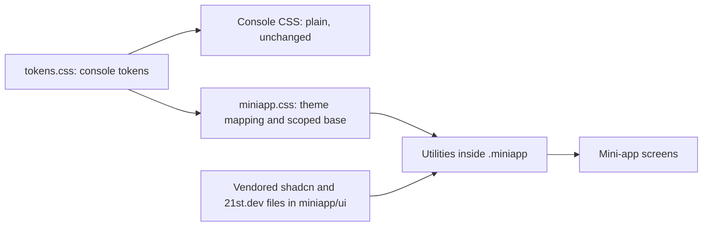

# Design system

| | |
|---|---|
| Status | Draft v1.2 · 2 Oct 2026 |
| Owner | Omkar Kadam |
| Audience | People building the console and the merchant mini-app, and anyone who adds a component or a token |
| Related | [Screens and flows](screens-and-flows.md) · [Copy deck](copy-deck.md) · [Conversation design](conversation-design.md) · [Mini-app spec (fs-04)](../02-product/feature-specs/fs-04-merchant-mini-app.md) · [Console spec (fs-08)](../02-product/feature-specs/fs-08-claims-officer-console.md) · [ADR 0004](../04-engineering/adr/0004-live-simulated-fallback-labels.md) · [ADR 0005](../04-engineering/adr/0005-mini-app-inside-the-console.md) · [System architecture](../04-engineering/system-architecture.md) · [Facts and sources](../01-strategy/facts-and-sources.md) · Token source: [`tokens.css`](../../frontend/src/styles/tokens.css) |

## TL;DR

- **One token set, two surfaces.** The console (seven pages) is BUILT with plain CSS tokens. The merchant mini-app (N1) is BUILT, behind `n1_miniapp`, with Tailwind CSS v4 and shadcn/ui, scoped under a `.miniapp` root, its theme mapped onto the same tokens. The decision record is section 12 and the mapping is section 13.
- **Everything here is P0 and lands in a wave.** W0 setup (stack and new tokens), W1 demo spine (mini-app core), W2 live AI (mode badges), W3 trust and rights, W4 judge wow (console polish for the projector), W5 ship. Sections say BUILT or PLANNED.
- **The draft's contrast numbers were wrong.** Amber `#e39a4f` on white is 2.33:1 (the draft said 5.2:1), orange `#fb923c` is 2.26:1 and teal `#14919b` is 3.78:1. Section 2.3 replaces them with calculated values. Every colour pair used for text now passes 4.5:1.
- **Honest labels.** LIVE is green, SIMULATED is grey, FALLBACK is orange, each with an icon and a word (section 11). The mode comes from the API. No client code decides it.
- **Devanagari.** Noto Sans Devanagari is self-hosted. Hindi and Marathi get line height 1.6, no uppercase, no letter spacing, and ASCII digits with Indian grouping (section 3.3).
- **Projector.** Presenter mode steps every type token up by one (section 2.5). Measured at 1280×720, the shell chrome must step up too, or the honesty badges and the replay ticks stay at 11 px (section 8.1).
- **Component picks.** The 21st.dev picks in section 5.2 come from catalogue descriptions and previews. Nobody has installed or read their code yet, and each pick has a shadcn fallback.
- **The Wave 0 scaffold needed a few changes to match section 13** (section 12.10): layered `important` utilities, re-declared `--muted` and `--accent`, a layered base, 32 px button sizes and a handful of classes in the generated files that the theme does not name. The mini-app Tailwind setup was rebuilt on that recipe, and `frontend/src/miniapp/miniappCss.test.ts`, `builtCss.test.ts` and `unmappedClasses.test.ts` guard it. Two things the scaffold found are in the recipe: the `shadcn/tailwind.css` import and the `mini-pulse` rename.

Section numbers 1, 2.5, 6.3 and 8.1 are stable: other specs cite them.

---

## 1. Design principles

### 1.1 The claims-officer console (BUILT, 1280×720 desktop)

Trustworthy, scannable and dense. The officer queue, the live map, the case panel and the audit log each show one decision. Nothing is hidden: every payout and every hold is explained where it appears. Live updates count up or flash and never jump. Empty states and error paths are written out (section 5.5). Icons are task-specific inline SVG, never emoji. The map ramp runs red to amber to green and every label carries its number and shop count, so colour never carries a signal alone (section 7.1). There are no purple AI gradients and no glass effects.

### 1.2 The merchant mini-app (BUILT, phone frame)

Clear, and one step at a time. The merchant is a shopkeeper who reads Hindi by preference, is busy, and may read slowly. Each screen answers one question and ends with one next step (the next-best-action bar, fs-04 section 12). The selected language is large. The other language appears small, where the product already has both (a formula, a status). Explanations name the clause and use the merchant's own rupee figures. An error says what to do next.

### 1.3 Rules for both surfaces

1. **Code decides the money.** A screen shows API fields. It never calculates, rounds or predicts an amount, a date or a rule number.
2. **A simulated source is never shown as live.** The mode word comes from the API (section 11). Presenter mode never hides a SIMULATED label.
3. **Colour never works alone.** Every status has a word and an icon.
4. **No AI-written text on an N1 screen.** Text comes from the message catalogue, the engine or static copy.
5. **No offers.** No loan, top-up or cross-sell appears while an alert is active or a claim is open (X8). The mini-app has no offer component.
6. **Targets.** Text contrast 4.5:1. Lines, icons and focus rings 3:1. WCAG 2.2 AA is the standard. Touch targets are 44 px in the mini-app (WCAG's floor is 24 px; 44 px is the house rule) and 48 px for the main button of a screen.
7. **Plain words.** No emoji, no hype and no promise words.

### 1.4 What exists and what is planned

| Part | Status | Wave | Where |
|---|---|---|---|
| Console tokens: palette, scale, spacing, radius, shadow, motion, z-ladder | BUILT | n/a | `frontend/src/styles/tokens.css` (commit 86575ea) |
| Ubuntu and Noto Sans Devanagari, self-hosted | BUILT | n/a | `frontend/public/fonts/` |
| Console components and 29 inline icons | BUILT | n/a | `frontend/src/components/` |
| Global reduced-motion rule, count-up and flash hooks | BUILT | n/a | `styles/base.css`, `state/motion.ts` |
| LIVE and SIMULATED chip and popover | BUILT | n/a | `components/layout/IntegrationBadges.tsx` |
| Status tokens, field border, focus colour, radius aliases (section 2.3) | BUILT | W0 | `tokens.css` |
| Tailwind v4 and shadcn, scoped (sections 12 and 13) | BUILT | W0 | `frontend/src/miniapp/` |
| Mini-app components (section 5.2) | BUILT | W1 core, W2, W3 | `frontend/src/miniapp/` |
| Verified-by badges (H13) | BUILT | W1 | mini-app receipt, console case panel |
| FALLBACK mode, provider panel, mode on AI replies (X6, H26) | BUILT | W2 | header chip, panel, Ask screen |
| Console polish: tokenised sizes, `--faint` text fix, focus ring, presenter mode, moment card | BUILT | W4 | console CSS and `state/presenter.tsx` |
| Marathi (N8) type check on the venue laptop | Not done: a person checks it on the venue laptop | W4 | mini-app |

---

## 2. Design tokens

Source of truth: `frontend/src/styles/tokens.css`, BUILT. The values below are the 3 Oct "Paytm-native refresh" values (note at the end of this section). Token names are final and are not renamed. W0 added the tokens marked BUILT, W0 below to the same `:root` block, because the Tailwind theme (section 13) points at them. Contrast ratios are calculated with the WCAG 2.x relative-luminance formula on 2 Oct 2026. Re-run them when a token changes.

### 2.1 Palette (BUILT)

| Token | Value | Use | Contrast and rule |
|---|---|---|---|
| `--navy` | `#002e6e` | Header, hero, dark surfaces, text on the sky fill | White on navy 13.00:1 |
| `--ink` | `#0b1b36` | Body text | 17.15:1 on white |
| `--blue` | `#0a5fc4` | Links, text-sized marks, the chart bars, the switch track | 6.09:1 on white, and white on it 6.09:1 |
| `--accent` | `#00b9f1` | The one sky-blue accent: mini-app primary buttons (navy text on it, 5.70:1), the active-tab mark, highlights on navy | 2.28:1 on white, so a fill only, never text or a thin line on a light surface. 5.70:1 on navy |
| `--paper` | `#f4f6f9` | Page background (very light grey) | n/a |
| `--amber` | `#e39a4f` | Map ramp mid-stop, hatching | 2.33:1 on white. Use as a fill, never as text. Text on an amber tint uses `--amber-ink` |
| `--red` | `#b91c1c` | Declined, blocked, errors | 6.47:1 on white |
| `--green` | `#15803d` | Paid, approved, LIVE | 5.02:1 on white |
| `--wa-header` | `#0b3d2e` | WhatsApp simulator header | White on it 12.20:1 |
| `--chat-bg` | `#ece5dd` | Simulator thread | n/a |
| `--bubble-out` | `#d9fdd3` | Simulator outgoing bubble | Ink on it 15.47:1 |

### 2.2 Surfaces, lines and text

| Token | Value | Use | Contrast and rule |
|---|---|---|---|
| `--card` | `#ffffff` | Card background | n/a |
| `--paper-2` | `#edf1f6` | Subtle section background, pressed list row | `--muted` on it 5.42:1 |
| `--line` | `#e4e9f0` | Standard hairline | 1.22:1 on white. A divider, never a control edge |
| `--line-soft` | `#eef2f7` | Hairline between list rows | n/a |
| `--line-strong` | `#cbd4e1` | Emphasised divider, outline-button border | 1.50:1 on white. A divider. The edge of an input needs `--field-border` |
| `--blue-hover` | `#08509f` | Link and console button hover | White on it 7.90:1 |
| `--accent-hover`, `--on-accent` | `#00a5d9`, `var(--navy)` | Sky fill pressed, and the text on the sky fill | `--on-accent` on `--accent` 5.70:1 |
| `--blue-soft` | `#e6f0fc` | Info tint, hover surface | `--blue` on it 5.29:1 |
| `--ink-2` | `#26344d` | Secondary text | 12.49:1 on white |
| `--ink-3` | `#3f4e66` | Tertiary text | 8.42:1 on white |
| `--muted` | `#55627a` | Muted text | 6.15:1 on white, 5.68:1 on `--paper`, 5.42:1 on `--paper-2` |
| `--faint` | `#8591a6` | Icons, chevrons, lines, disabled controls | 3.18:1 on white, 2.94:1 on `--paper`. **Fails as text.** fs-08 section 13.2 moves 9 text declarations to `--muted` |
| `--field-border` (BUILT, W0) | `#6f7b90` | Outline of inputs, selects, switch tracks | 4.28:1 on white, 3.95:1 on `--paper`, 3.77:1 on `--paper-2`. WCAG 1.4.11 asks 3:1 for a control's edge, and `--line-strong` cannot give it |
| `--amber-ink` | `#a8520f` | Text on amber tints | 5.41:1 on white, 4.79:1 on `--amber-soft` |
| `--amber-solid` | `#b45309` | Amber fill with white text | White on it 5.02:1 |
| `--amber-soft` | `#fcefe0` | Amber tint | n/a |
| `--red-soft`, `--red-line` | `#fbeaea`, `#f1c4c4` | Red tint and its border | `--red` on `--red-soft` 5.56:1 |
| `--green-soft` | `#e4f4e9` | Green tint | `--green` on it is 4.40:1 and **fails as text**. Use `--green-ink` |
| `--green-ink` (BUILT, W0) | `#166534` | Text on green tints | 7.13:1 on white, 6.25:1 on `--green-soft` |
| `--grey-soft` | `#eaeef4` | Neutral tint | `--ink-3` on it 7.23:1, `--muted` on it 5.28:1 |

### 2.3 Status colours (BUILT, W0)

The draft proposed status colours without checking them. These are the corrected set. Add this block to `:root` in `tokens.css`:

```css
/* W0 additions (frontend/src/styles/tokens.css) */
--green-ink: #166534;
--field-border: #707a8c;
--focus: var(--blue);                      /* focus ring on light surfaces. --accent stays for navy */

--paid: var(--green);       --paid-soft: var(--green-soft);
--decided: var(--blue);
--referred: var(--amber-solid);  --referred-soft: var(--amber-soft);  --referred-ink: var(--amber-ink);
--blocked: var(--red);      --blocked-soft: var(--red-soft);
--live: var(--green);       --live-soft: var(--green-soft);
--demo: var(--ink-3);       --demo-soft: var(--grey-soft);          /* SIMULATED */
--fallback: #c2410c;        --fallback-soft: #fff1e6;
--fallback-on-navy: #fdae5c;                                         /* FALLBACK chip on the navy header */

--radius-control: 8px;
--radius-card: var(--radius);
--radius-panel: var(--radius-lg);
```

| State | Solid (fill, white text) | Soft tint | Text on the tint | Icon (mini-app) | Used for |
|---|---|---|---|---|---|
| Paid | `--paid` `#15803d`, 5.02:1 | `--paid-soft` | `--green-ink`, 6.25:1 | `circle-check` | Payout credited, PAID pill, PASS rows |
| Decided | `--decided` `#0a5fc4`, 6.09:1 | `--blue-soft` | `--blue`, 5.29:1 | `clock` | Approved, credit on its way |
| Referred | `--referred` `#b45309`, 5.02:1 | `--referred-soft` | `--referred-ink`, 4.79:1 | `user-round` | With a claims officer, UNSURE, open cases, waived by officer |
| Blocked | `--blocked` `#b91c1c`, 6.47:1 | `--blocked-soft` | `--red`, 5.56:1 | `circle-x` | Declined, FAIL, BLOCKED quote |
| Live | `--live` `#15803d`, 5.02:1 | `--live-soft` | `--green-ink`, 6.25:1 | `circle-dot` | LIVE mode |
| Simulated | `--demo` `#3f4e66`, 8.42:1 | `--demo-soft` | `--demo`, 7.23:1 | `circle-dashed` | SIMULATED mode |
| Fallback | `--fallback` `#c2410c`, 5.18:1 | `--fallback-soft` | `--fallback`, 4.68:1 | `triangle-alert` | FALLBACK mode |

Status indicators carry a word, never colour alone. Since the 3 Oct refresh the mini-app shows a claim or cover status as a coloured word with a small dot, not a pill with an icon; the mode badge keeps its icon and word.

**What the draft got wrong.**

| Draft colour on white | Draft claim | Calculated | Replaced by |
|---|---|---|---|
| Amber `#e39a4f` | 5.2:1 | 2.33:1, fails | `--amber-solid` `#b45309`, 5.02:1 |
| Orange `#fb923c` | 4.6:1 | 2.26:1, fails | `--fallback` `#c2410c`, 5.18:1 |
| Teal `#14919b` | 5.5:1 | 3.78:1, fails | Grey for SIMULATED (below) |
| Green `#15803d` | 6.8:1 | 5.02:1, passes | Number corrected |
| Blue `#0b63c9` | 5.9:1 | 5.77:1, passes | Number corrected (the 3 Oct refresh then moved `--blue` to `#0a5fc4`) |
| Red `#b91c1c` | 6.4:1 | 6.47:1, passes | Number corrected |

**Why SIMULATED is grey and not teal.**

1. The BUILT chip and popover already show SIMULATED in grey (`--grey-soft` background). The popover row reads grey with the word SIMULATED. fs-08 section 9.1 keeps that.
2. SIMULATED is the default state (15 of 15 components in mock mode), so it should be quiet. LIVE and FALLBACK are the exceptions and should draw the eye.
3. Colour-vision check, simulated with the Machado 2009 matrices at severity 1.0 and measured as CIE76 ΔE (these are simulated values, not tests with people). LIVE green against SIMULATED grey measures 62 for normal vision, 49 protan, 40 deutan and 26 tritan. Against the draft's teal it measured 35, 35, 31 and 5.
4. FALLBACK orange and REFERRED amber measure ΔE 14 for normal vision and 3.7 (protan) and 0.7 (deutan). They look the same to a viewer with red-green deficiency, so they never rely on colour: the word and the icon differ, and the two never share a slot (a mode badge against a claim pill).

### 2.4 Navy surfaces (BUILT)

| Token | Value | Use | Contrast |
|---|---|---|---|
| `--navy` | `#002e6e` | Header, hero, closing band, the mini-app cover card | n/a |
| `--navy-2` | `#0a3a82` | Slightly lighter navy | n/a |
| `--navy-3` | `#0c3d83` | Panels on navy | n/a |
| `--navy-line` | `#1f4f94` | Border on navy | n/a |
| `--on-navy` | `#ffffff` | Strong text | 13.00:1 on navy |
| `--on-navy-2` | `#cfdcf2` | Secondary text | 9.39:1 on navy |
| `--on-navy-3` | `#a9bde0` | Tertiary text, the SIMULATED part of the header chip | 6.83:1 on navy, 5.49:1 on `--navy-3` |
| `--fallback-on-navy` (BUILT, W2) | `#fdae5c` | FALLBACK segment of the header chip | 7.05:1 on navy, 5.66:1 on `--navy-3` |

`--accent` on navy is 5.70:1, so it works as a focus ring there. `--blue` on navy is 2.13:1, which is below the 3:1 a line or icon needs: never use `--blue` as an icon or line on navy.

### 2.4a Paytm-native refresh, 3 Oct

Decision: the whole app should feel like it belongs inside a payments app, without any Paytm logo or wordmark (the brand stays Chhatri). The token names did not change, only values and one addition.

| Before | After | Why |
|---|---|---|
| Navy `#0f1a33`, a near-black | `#002e6e`, a deep blue navy | Reads as a payments-app header and hero |
| Blue `#0b63c9` with white text as the primary fill | Sky `--accent` `#00b9f1` as the primary fill with navy text; `--blue` `#0a5fc4` for links and text | Sky is the one bright accent. White on sky is 2.4:1 and fails, navy on sky is 5.7:1 |
| Page `#f3f5f8`, cards with a 6% and 16% shadow | Page `#f4f6f9`, white surfaces separated by `--line` hairlines, no shadow in the mini-app | Hairlines, not heavy boxes |
| Radius 6, 10, 16 | 8 (controls), 12 (cards), 16 (panels) | Small, consistent |
| New | `--accent-hover`, `--on-accent` | Pressed state and text on the sky fill |

Mini-app rules that follow (frontend/src/miniapp): `bg-primary` is the sky fill and carries `text-primary-foreground` (navy); text-sized links use `text-link`; menus and lists are one white sheet with hairline-divided rows (title, second line, trailing amount or chevron) instead of a card per row; amounts are bold with tabular numerals; a status is a coloured word with a dot, not a pill; a source is a quiet grey strip, not an outlined pill; no decorative icons (the tab bar, the app bar's Back and language buttons and the mode badge keep theirs). The contrast tests (`src/contrast.test.ts`) carry the new ratios.

Console rules that follow (frontend/src/components, pages, styles): the header stays deep navy and the page you are on gets a 3 px `--accent` underline on the bar's bottom edge instead of a filled chip; the same underline marks the Overview section rail. The primary button (Play, Verify chain) is the sky fill with navy text, secondary buttons are white with a `--line-strong` outline, controls are 34 px high with an 8 px radius. A card has a hairline and no shadow. The ops strip is one white band whose five cells are divided by hairlines. The right panel on /live and the panel beside the merchant phone are each one white surface with sections divided by hairlines, not a stack of cards; the moment card and the slow-day note keep a 3 px left bar. Status badges are the soft tint with its ink (never a solid fill), table headers are quiet muted text on white, and labels that were letter-spaced capitals (eyebrows, section labels) are sentence case with 0.02em spacing. The /policy live tests sit on a white card (`live-tests--light`); the Overview keeps them on navy. Gradients, glows and the hero hex field are gone; the phone bezel is `--ink` with a light shadow, and the simulated Soundbox carries the word Chhatri, not a Paytm mark. LIVE, SIMULATED and FALLBACK stay visible as small tinted words.

### 2.5 Type scale (BUILT; presenter column BUILT, W4)

Sizes are in px so the projector and phones render the deck's sizes exactly. Presenter mode (fs-08 section 12) gives each token the value of the next larger one.

| Token | Normal | Presenter | Used for today |
|---|---|---|---|
| `--fs-2xs` | 11 px | 12 px | Labels, stamps, nav count (32 uses) |
| `--fs-xs` | 12 px | 13 px | Small labels, badges (64 uses) |
| `--fs-sm` | 13 px | 14 px | Captions, nav links (55 uses) |
| `--fs-base` | 14 px | 15 px | Body text, the default (24 uses) |
| `--fs-md` | 15 px | 17 px | Input labels, small titles (29 uses) |
| `--fs-lg` | 17 px | 20 px | Section headings, card titles (14 uses) |
| `--fs-xl` | 20 px | 26 px | Panel titles, wordmark (13 uses) |
| `--fs-2xl` | 26 px | 34 px | Page titles (11 uses) |
| `--fs-3xl` | 34 px | 44 px | Overview titles (2 uses). KPI values move here (below) |
| `--fs-4xl` | 44 px | 44 px | The zone card's index percentage (1 use) |

**Measured baseline.** On 2 Oct 2026 the mock console was loaded at 1280×720 at the replay start (08:00) and every visible text node was counted by character.

| Page | At 13 px or smaller | At 14 px or smaller |
|---|---|---|
| Live map | 79% | 97% |
| Claims | 63% | 96% |
| Merchant phone | 57% | 95% |
| Audit | 52% | 91% |
| Backtest | 62% | 79% |
| Policy | 33% | 86% |

Most console text is 11 to 14 px. That is right for a laptop and small for a projector, which is why presenter mode steps every token up by one and why its floor is 12 px.

**What must change in the console CSS (W4).** The step reaches text that uses a token and nothing else. Raw pixel sizes do not step up:

| Where | Raw size today | Change |
|---|---|---|
| `.kpi__value` (`live-panel.css`) | 32 px | `var(--fs-3xl)`. It becomes 44 px in presenter mode |
| `.spark__rule-label`, `.spark__ticks` (`live-panel.css`) | 10 px | `var(--fs-2xs)` |
| Nav count badge (`shell.css`) | 10 px | `var(--fs-2xs)` |
| `.integration__mode` (`shell.css`), `.voice__tag` (`phone.css`) | 10.5 px | `var(--fs-2xs)` |
| `.mono` (`base.css`) | `0.92em`, which is 11.04 px in a 12 px context and 11.96 px in a 13 px context (presenter mode, Audit hashes) | `max(0.92em, var(--fs-2xs))`, so it never falls below the token floor |
| `.soundbox-device__brand` (`merchant-panel.css`), the "paytm" mark | 8 px | Decorative artwork on the device drawing. Leave it, and exclude it from the size test |

The Overview keeps its own larger raw sizes and is not part of presenter mode.

### 2.6 Spacing (BUILT, 4 px grid)

| Token | Value | Use |
|---|---|---|
| `--sp-1` | 4 px | Tight padding, inline gaps |
| `--sp-2` | 8 px | Gaps between small controls |
| `--sp-3` | 12 px | Input padding |
| `--sp-4` | 16 px | Card padding, standard margin |
| `--sp-5` | 20 px | Section gap |
| `--sp-6` | 24 px | Panel gap |
| `--sp-8` | 32 px | Major sections |
| `--sp-10` | 40 px | Large grid gap |
| `--sp-14` | 56 px | Very large gaps |
| `--sp-18` | 72 px | Hero spacing |
| `--sp-24` | 96 px | Maximum gap |

In the mini-app Tailwind's `--spacing` is 4 px, so `p-4`, `gap-6` and `mt-14` equal `--sp-4`, `--sp-6` and `--sp-14`. Every `--sp-N` is N × 4 px, so the two scales line up by construction.

### 2.7 Radius (BUILT; aliases BUILT, W0)

| Token | Value | Use | Tailwind class in the mini-app |
|---|---|---|---|
| `--radius-sm` | 6 px | Small console details | `rounded-sm` (4 px in the mini-app) |
| `--radius-control` | 8 px | Controls: buttons, inputs, chips | `rounded-md` through `--radius-control` |
| `--radius` | 12 px | Cards | `rounded-lg` and `rounded-xl` through `--radius-card` |
| `--radius-lg` | 16 px | Panels, map container | `rounded-2xl` through `--radius-panel` |
| `--radius-pill` | 999 px | CTAs and status pills | `rounded-full` |
| (none) | 4 px | Small inner details | `rounded-sm` |

Why aliases: Tailwind's theme uses the names `--radius-sm` and `--radius-lg`, which the console already defines with other values. The theme maps through `--radius-control`, `--radius-card` and `--radius-panel`, so a console token can never change a utility.

### 2.8 Shadows (BUILT)

| Token | Value | Use |
|---|---|---|
| `--shadow` | `0 1px 2px rgb(0 30 80 / 6%), 0 2px 8px rgb(0 30 80 / 4%)` | Console panels. The mini-app maps `shadow-sm` and `shadow-md` to none: hairlines separate surfaces |
| `--shadow-lg` | `0 10px 40px rgb(0 30 80 / 18%)` | The phone frame, popovers, sheets. Tailwind `shadow-lg` |
| `--shadow-navy` | `0 30px 80px rgb(4 10 24 / 45%)` | Hero depth, in the console |

### 2.9 Motion (BUILT)

| Token | Value | Use |
|---|---|---|
| `--ease-out` | `cubic-bezier(0.23, 1, 0.32, 1)` | UI changes: reveals, hover, press, popovers. Tailwind `ease-ui` |
| `--ease-in-out` | `cubic-bezier(0.77, 0, 0.175, 1)` | On-screen movement. Tailwind `ease-move` |
| `--dur-press` | 160 ms | Press feedback, closing a sheet. Tailwind `duration-press` |
| `--dur-ui` | 220 ms | Standard state change, opening a sheet. Tailwind `duration-ui` |
| `--dur-reveal` | 600 ms | Hero and page entrance. Tailwind `duration-reveal` |

The motion catalogue and the reduced-motion rule are in section 6.

### 2.10 Z-index ladder (BUILT)

| Token | Value | Use |
|---|---|---|
| `--z-sticky` | 20 | Sticky bars, replay controls |
| `--z-map` | 1000 | Map overlays |
| `--z-popover` | 1200 | Popovers and menus |
| `--z-toast` | 1300 | Toasts |
| `--z-modal` | 1400 | Dialogs |

Inside the mini-app `.miniapp` is its own stacking context (`isolation: isolate`) and its own containing block for fixed elements (`contain: layout`). A Tailwind `z-50` is therefore local to the frame and cannot cover the console header or the phone next to it.

### 2.11 Map and layout tokens (BUILT)

| Token | Value | Use |
|---|---|---|
| `--sea`, `--sea-deep`, `--land` | `#dbe7f3`, `#cfdeee`, `#f3f5f8` | The fallback basemap drawn from the ward polygons |
| `--coast`, `--ward-line` | `rgb(15 26 51 / 20%)`, `rgb(15 26 51 / 18%)` | Coastline and ward outlines |
| `--rain` | `#0b63c9` | Rain overlay on the map |
| `--header-h` | 52 px | Header row of the shell grid |
| `--footer-h` | 28 px | Footer row of the shell grid |
| `--gutter` | 14 px | Padding and gaps of the Live, Claims and phone panels |
| `--controls-h` | 46 px | Declared but not referenced by any rule today. The control bar takes its height from its content (84 px measured at 1280×720). Remove it or use it in W4 |

The map colour ramp is not a token. It lives in `frontend/src/lib/colour.ts` (section 7.1).

### 2.12 Themes

One light theme serves the console and the mini-app. The console has no dark theme and no toggle. Dark mode is not planned for this build: the console is designed and tested on light surfaces, and every contrast pair in this document is calculated for them. The navy header, hero and chip are dark surfaces inside the light theme, and `--on-navy` text is calculated for them (section 2.4). In the mini-app `@custom-variant dark` is declared so that `dark:` classes in vendored shadcn code never match (section 13.1).

---

## 3. Typography

### 3.1 Fonts (BUILT)

Both families are self-hosted in `frontend/public/fonts/`, declared in `public/fonts/fonts.css` with `font-display: swap`, and linked from `index.html`. The console makes no font request to another server, which keeps the static demo and a weak venue network safe. The mini-app inherits the same files and needs no font setup.

| Family | Weights shipped | Subsets | Licence |
|---|---|---|---|
| Ubuntu | 300, 400, 500, 700 (no 600) | Latin, Latin-ext | Ubuntu Font Licence 1.0 |
| Noto Sans Devanagari | 400, 500, 600, 700 | Devanagari (U+0900 to U+097F and related) | SIL Open Font License 1.1 |
| System monospace | n/a | n/a | n/a |

```css
--font: 'Ubuntu', 'Noto Sans Devanagari', system-ui, -apple-system, 'Segoe UI', sans-serif;
--font-hi: 'Noto Sans Devanagari', 'Ubuntu', system-ui, sans-serif;
--font-mono: ui-monospace, 'SFMono-Regular', Menlo, Consolas, monospace;
```

- Body text uses `--font`. `.hi` and `[lang='hi']` switch to `--font-hi` (BUILT in `base.css`). The mini-app base adds `[lang='mr']` (BUILT, W0).
- Ids, hashes and decision numbers use `.mono`. Amounts use `.num` (`font-variant-numeric: tabular-nums`). Measured on 2 Oct 2026: Ubuntu's digits are already equal width (the strings 1111 and 8888 are both 92 px wide at 40 px), so `.num` is a safeguard for fallback fonts.
- The rupee sign U+20B9 is not in the Ubuntu `latin` files. It is in the `latin-ext` files and in the Noto Devanagari files (checked by drawing the glyph from each file on 2 Oct 2026). `unicode-range` defers the `latin-ext` download until an amount appears on screen. PLANNED (W0, optional): preload the 400 and 500 `latin-ext` files in `index.html`, so the opening amount does not swap fonts.

### 3.2 Roles and rhythm

BUILT in the console: body is `--fs-base` (14 px) at line height 1.4, with antialiased, legibility-optimised rendering. Headings h1 to h4 are weight 500 with letter spacing -0.01em and no margin. Weights in use, counted by rule on 2 Oct 2026: 500 (115), 700 (18), 400 (8), 300 (3, Overview) and 600 (1, `overview-story.css`; Ubuntu has no 600, so the browser draws it at 700).

BUILT for the mini-app. The class names are the Tailwind names from section 13:

| Role | Class | Size and weight | Example |
|---|---|---|---|
| Screen title | `text-xl font-medium` | 20 px, 500 | "Your claims" |
| Card title | `text-lg font-medium` | 17 px, 500 | "Your cover" |
| Body | `text-sm` | 14 px, 400 | A sentence |
| Caption | `text-caption text-muted-foreground` | 13 px, 400 | "Credited 17:04 (simulated)" |
| Label and badge | `text-xs font-medium` | 12 px, 500 | "SIMULATED" |
| Amount | `text-2xl font-medium num` | 26 px, 500 | "₹1,380" |
| Receipt amount | `text-3xl font-medium num` | 34 px, 500 | "₹1,380" |
| Input text | `text-field` | 16 px, 400 | The Ask box. iOS Safari zooms into inputs below 16 px |

The mini-app floor is 12 px for labels and 14 px for sentences. `text-2xs` (11 px) belongs to console stamps.

### 3.3 Devanagari rules

These apply to Hindi and Marathi. The mini-app base (section 13) enforces rules 3 and 4.

| # | Rule | Reason |
|---|---|---|
| 1 | **Font.** Noto Sans Devanagari through `lang="hi"` or `lang="mr"`, or the `.hi` helper. A mixed line in the `--font` stack still draws each script from the right family | Correct glyphs for each script |
| 2 | **Set `lang`** on the root and on any element whose language differs (`hi`, `mr`, `en`). Fallback text carries its own `lang` | Shaping, screen readers, and the line-height rule below |
| 3 | **Line height 1.6** for Hindi and Marathi, letter spacing 0: `:lang(hi), :lang(mr)` in the mini-app base. The rule has the weight of one class and sits after the utilities, so a `leading-*` or `tracking-*` class cannot override it on Hindi text. Today the console sets the font family for Hindi and leaves the line height at the body's 1.4. W4 adds the same rule to `base.css` for `[lang='hi']` | Marks above and below the line need room, and spacing breaks the joins between letters |
| 4 | **No uppercase, no letter spacing, no italics, no faux bold.** Use real weights: 400, 500, 600, 700. The console's `.eyebrow` (uppercase, wide tracking) is for Latin text | Devanagari has no case, spacing splits characters that should join, and slanted Devanagari is synthesised |
| 5 | **Size.** A Hindi line uses the same token as the English line beside it. If the English is 12 px, set the Hindi line one step larger (`text-xs` becomes `text-caption`) | Devanagari reads smaller than Latin at the same size |
| 6 | **Wrap, never truncate.** No ellipsis on Hindi names or sentences. Buttons, chips and badges use `min-height`, not a fixed height, so a second line fits | Cutting inside a conjunct changes the word |
| 7 | **Digits.** ASCII 0 to 9 with Indian grouping in every language, for money, dates, times and ids. Never Devanagari digits. Use the API's `*_label` strings. For your own formatting use `Intl` with the `-u-nu-latn` locale extension, because `mr-IN` defaults to Devanagari digits | The API, the catalogue and the tests all use `₹1,380` |
| 8 | **Rupee sign.** The glyph is in the Ubuntu `latin-ext` files and in the Noto Devanagari files, and `fonts.css` maps U+20B9 to both. Keep both families in every stack that shows money | One of the two always draws it, and never the system font |
| 9 | **Weights.** Ubuntu has no 600, so `font-semibold` maps to 700 in the theme. Do not use `font-light` on Hindi: Noto 300 is not shipped | No synthesised weights |
| 10 | **Mixed lines.** A Hindi sentence with a Latin word (SIMULATED, KYC, Paytm) stays one element. Do not wrap the Latin word in a second font | Even rhythm |
| 11 | **Check before W4 sign-off.** The longest Hindi strings (the SLIP_TO_HUMAN family in `messages.py`) in the 354 px frame and at 320 px: nothing clipped, no marks cut at the top of a card or button | Wrap behaviour is not measured yet |

### 3.4 Numerals, money, dates

Formats are in section 9. Summary: `₹1,380`, `₹4,25,420` (Indian grouping), `₹14.16 a day` (paise appear when the value has them), `19 Aug 2025`, `17:04`, `63%`.

---

## 4. Iconography

### 4.1 Console (BUILT)

29 inline SVG glyphs in `components/common/Icon.tsx` (`IconName`): play, pause, step, reset, sound-on, sound-off, mic, send, attach, camera, speaker, check, cross, question, dash, shield, north, umbrella, chevron, stop, map, phone, arrow, more, drop, close, zoom, notes, bolt. Filled paths on a 24×24 viewBox, drawn in `currentColor`. No icon font and no external request, so the console works offline.

### 4.2 Mini-app (BUILT, W0 to W1)

`lucide-react` 1.49.0 (ISC licence): outline icons, 2 px stroke on a 24 px grid, named imports, so the bundle holds the icons in use. Sizes: 16 px beside text, 20 px in buttons, 24 px in the tab bar, 40 px in empty and error states. Every name below exists in 1.49.0 (checked 2 Oct 2026).

| Role | Icons |
|---|---|
| Tab bar | `house` (Home), `clipboard-list` (Claims), `life-buoy` (Help) |
| Cover and documents | `shield-check`, `file-text`, `book-open`, `circle-help` (jargon lens), `receipt`, `wallet`, `list-checks` |
| Claim and check states | `circle-check` (done, paid), `clock` (credit on its way), `user-round` (with a claims officer), `circle-x` (not paid, fail), `circle-dashed` (pending), `circle-minus` (skipped, not needed), `hourglass` (waiting), `loader-circle` (busy), `shield-alert` (waived by officer or unsure), `ban` (blocked) |
| Modes and sources | `circle-dot` (LIVE), `circle-dashed` (SIMULATED), `triangle-alert` (FALLBACK), `badge-check` (verified-by), `history` (audit entry) |
| Ask and voice | `message-circle`, `mic`, `mic-off`, `square` (stop), `send`, `languages` |
| Slip | `camera`, `camera-off`, `image`, `upload`, `rotate-ccw` (retake), `scan-text` (reading), `file-search` (look at a line), `file-question-mark` (not sure which document), `file-x` (wrong document) |
| Rights | `scale` (dispute), `flag` (complaint), `lock` (privacy), `eye` (what was used), `trash-2` (forget my slip), `bell-off` |
| Network and actions | `wifi-off`, `refresh-cw` (retry), `external-link`, `copy`, `printer`, `download`, `share-2`, `info`, `settings`, `globe` (language), `x` (close), `check` (ticked, confirmed), `chevron-down` (accordion) |
| Navigation | `chevron-left`, `chevron-right`, `arrow-right`, `play`, `pause`, `user-round` |

### 4.3 Rules

- A status icon always sits beside its word. Icons that decorate are `aria-hidden="true"`.
- A button that shows just an icon has an `aria-label` in the selected language.
- Strokes follow `currentColor`. A status icon takes the status tint's text colour (section 2.3).
- No emoji anywhere. Do not mix the two icon sets in one component, and console components do not import `lucide-react`.

---

## 5. Component inventory

### 5.1 Console components (BUILT)

Files are under `frontend/src/components/`.

| Area | Components | Used on |
|---|---|---|
| Shell | `layout/AppShell.tsx`, `Header.tsx` (`Brand`, nav, `ConnectionPill`, `IntegrationBadges`, `SoundToggle`), `ControlBar.tsx` (`ClockLabel`, `Scrubber` with chapter ticks), `Footer.tsx` | Every page. The control bar is hidden on Overview |
| Map | `map/LiveMap.tsx` (with `layers`, `heat`, `labels`, `overlays`, `basemap`), `storm/StormMap.tsx` | Live map, and the Overview storm section |
| Live panel | `panel/ZoneCard.tsx`, `KpiTiles.tsx`, `PayoutToast.tsx`, `EventFeed.tsx`, `Explanations.tsx` | Live map |
| Claims | `claims/CaseQueue.tsx`, `CaseDetail.tsx`, `Evidence.tsx`, `Checks.tsx`, `NameCompare.tsx`, `WhyHuman.tsx`, `SlipLightbox.tsx`, `HourlyChart.tsx` | Claims |
| Phone and merchant | `phone/Phone.tsx`, `Bubbles.tsx`, `Composer.tsx`, `Waveform.tsx`, `PaytmLinkCard.tsx`, `SoundboxStrip.tsx`, `SoundboxDevice.tsx`, `MerchantPanel.tsx`, `WhatHappened.tsx` | Merchant phone, Overview |
| Tables and bars | `audit/AuditTable.tsx`, `backtest/CompareTable.tsx`, `ZoneTable.tsx`, `proof/ProofBars.tsx` | Audit, Backtest, Overview |
| Overview sections | `overview/*`: Hero, Problem, Storm, HowItWorks, Journeys, Proof, Usp, Humans, Business, Tech, Roadmap, Closing, Honesty, LiveTests | Overview |
| Shared | `common/Icon.tsx`, `common/Status.tsx` (`Loading`, `ErrorState`, `InlineError`, `AsyncView`, with a `StaleNote` banner inside `AsyncView`) | Every page |

CSS classes reserved for the console: `.card`, `.btn` (32 px high), `.badge` and its colour variants, `.table`, `.muted`, `.eyebrow`, `.stack`, `.mono`. Mini-app markup does not use them. It may use `num` and `hi` (fs-04 section 5.2).

### 5.2 Mini-app components (BUILT)

Files live in `frontend/src/miniapp/` (screens, `ui/` for generated shadcn and 21st.dev files, `lib/`). "Source" names the shadcn component or the 21st.dev entry (`author/name`), and the fallback when a 21st.dev pick is used. The 21st.dev picks come from catalogue descriptions and previews. **Nobody has installed or read their code yet**, so each pick is a starting point to check with the list in section 5.4, never a dependency the design relies on. The six shared states are in section 5.5.

| Component | Source | Screens (wave) | States | Accessibility notes |
|---|---|---|---|---|
| AppFrame | Custom. Reuses the console `.phone` bezel | Merchant page (W1) | n/a | `region` with a label. Overlays are confined by `contain: layout` |
| AppBar | Custom, with shadcn `button` (ghost, icon) | All (W1) | SIMULATED summary badge, offline | Page title is the `h1`. The globe button has an `aria-label` in the selected language. The simulated clock is text |
| TabBar | Custom `nav` of three links. Visual reference: 21st.dev `shadcnui-blocks/tabs-08`. Not shadcn `tabs`: that implements the tab-list pattern and this bar changes the URL | All (W1) | Active, focus | `nav` with a label, `aria-current="page"`, 44 px targets, icon and label together |
| NextBestActionBar | Custom: `card` and `button` | All (W1) | Hidden while loading or on error. Action disabled with a reason when offline | A labelled region before the tab bar. The action is a real button or link |
| Card | shadcn `card` | All (W1) | Ready | A heading in every card. A whole card is not a click target by itself: put an `a` or `button` inside |
| Button | shadcn `button`, sizes overridden once | All (W1) | Hover, focus-visible, disabled with a reason in text, busy | 44 px (`min-h-11`), 48 px (`min-h-12`) for a screen's main action. A Hindi label may take two lines. Busy keeps its label and sets `aria-busy` |
| Badge family | shadcn `badge` with variants: `status`, `mode`, `clause`, `source` | All (W1). FALLBACK from W2 | n/a | Icon and word, contrast per section 2.3. Clause and source chips are buttons that open a sheet |
| CoverCard | `card` and `badge` | S1, S3 (W1) | Loading, no cover, WAITING, ACTIVE, premium unpaid, error, offline "as of" | The status sentence and dates are text |
| AlertBanner | shadcn `alert` | S1, offline (W1). Ask, slip (W2) | Info, warning, error | `role="status"` for information and `role="alert"` for errors. Icon and text |
| Stepper (claim tracker) | Custom `ol` built from `card` and `badge`. Starting point: 21st.dev `sean0205/c-stepper-13` (vertical, with titles and descriptions). Fallback: build from scratch | S5 (W1) | Step: completed, current, pending, skipped. Claim: loading, error | `ol` and `li`. `aria-current="step"` on the current step. Every step has a text status. A polite live region announces changes. Paid and EDI steps carry a SIMULATED label |
| Accordion | shadcn `accordion` | S2 (W1) | Collapsed, expanded | Radix keyboard support. 44 px headers with `aria-expanded` |
| Sheet (bottom) | shadcn `sheet`, `side="bottom"`, portal container inside the frame | S2, S5 to S7 (W1). N6 (W3) | Opening, open, closing | Focus moves in, Esc closes, focus returns to the trigger. The title labels the dialog. The scrim is `bg-black/50`, which the theme maps to navy |
| JargonTerm | Custom: a button styled as underlined text | S2, S5 to S7 (W1) | n/a | `aria-haspopup="dialog"`. Underline plus colour. A 44 px hit area through padding |
| FormulaBlock | Custom | S6, S7 (W1) | n/a | One text node, for example `½ × ₹4,380 × 63% = ₹1,380`, with its own `lang`. Never `aria-hidden` |
| SourceBadge (verified-by) | `badge` and `sheet` | S6, S7 (W1). Modes from W2 | LIVE, SIMULATED, FALLBACK, "Source missing" | A button. The sheet names system, id, time and version |
| CounterfactualCard | `card` | S6, S7 (W1) | Has a line, or the card is absent | Plain text, exactly as the API sends it |
| ReceiptDocument | `card` and `dl`. Visual reference: 21st.dev `ravikatiyar162/ticket-confirmation-card` (a visual reference, no install). Print stylesheet | S7 (W1) | Loading, not found, error, print | A description list of terms and values. The printed header reads "Prototype · simulated data". The tab bar and action bar are hidden in print |
| Skeleton | shadcn `skeleton`. Reserve the final height (pattern: 21st.dev `ddoemonn/skeleton-swap`) | All (W1) | Loading | `aria-busy="true"` on the screen. No text spinner. The pulse stops under reduced motion |
| Toast | shadcn `sonner`, mounted inside `.miniapp` | S3, S5 (W1) | Success, error | A polite live region. Stays 6 s and pauses on hover and focus. The screen also shows the result of the action |
| EmptyState, ErrorState | `card` and `button` (mini-app versions of the console components) | All (W1) | Empty, error, offline | One sentence and one action. The error code in small text |
| DemoClockSheet | shadcn `sheet` (bottom) over the chapter list of `content/chapters.ts` | Standalone route N7 (W5, proposed) | Closed, open, playing | A dialog titled "Demo date and time". The chapters are buttons. Play and Pause is one button with `aria-pressed`. It moves the replay clock and nothing else (screens and flows section 8) |
| LanguageList | shadcn `radio-group` | S9 (W1) | Selected | A `fieldset` and `legend`. Each language is named in its own script, with `lang` |
| AskComposer | shadcn `textarea` and `button`. Recording-timer pattern: 21st.dev `kokonutd/ai-voice-input` | Ask (W2) | Idle, typing (counter near 500), thinking, error, offline | A real label. 16 px text. Send stays disabled until every mention chip is confirmed (H18) |
| VoiceButton | shadcn `button` and the console's `useRecorder` hook (BUILT in `components/phone/useRecorder.ts`, 30 s limit) | Ask (W2) | Idle, notice, recording, transcribing, heard nothing, confirm, not available | `aria-pressed` while recording. The timer is announced at the start and at the stop, not each second. The mic is hidden when unavailable and the text box stays |
| SuggestionChips and mention chips | 21st.dev `nexus-ui/suggestions`. Fallback: shadcn `button` (outline) | Ask (W2) | Default, confirmed | Buttons 44 px high. A confirmed chip shows a check icon and the word "confirmed". Chips wrap, they do not scroll sideways |
| AnswerCard | `card` with clause chips, source badges and a mode footer | Ask (W2) | LIVE, FALLBACK, SIMULATED, hand-off, scam warning | The footer names the mode. A details sheet shows provider, model, time and reason |
| ModeBadge (provider badge) | `badge`, `mode` variant | Ask, slip (W2) | LIVE, SIMULATED, FALLBACK | Word and icon. The reason in plain words sits behind "details" |
| SlipCapture | A native `<input type="file" accept="image/*" capture="environment">` behind two `button`s: take a photo, choose from the gallery. Preview pattern: 21st.dev `uilayout.contact/imgpreview-dropzone`. Fallback: plain input and `img` | N3 (W2) | Idle, camera denied, too big, bad type, uploading, reading, read | Keyboard reachable. The preview has alt text. Errors appear in an `alert` |
| SlipFieldsCard | `card` and `badge` | N3 (W2) | Read, unsure field, nothing read | One row per field. A line the reader is unsure about says "Please look at this line" in words, with no percentage |
| ReadinessChecklist | Custom `ul` of icon and text | N3 (W2) | Pending, ok, warn | Each item is text with an icon. A polite status when the list updates |
| SlipProblemCard | `alert` and two `button`s (try again, ask a person) | N3 (W2) | Blurry, cropped, glare, wrong document, no name, no date, too big, bad type, reader down, camera denied | Says what is wrong and what to do. Focus moves to the heading. `role="alert"` |
| GrievanceLadder | Custom `ol` (the stepper pattern) with `card` and clock chips | N5 (W3) | Step: not started, active, done. Clock: running, past, to confirm | `aria-current="step"`. Each clock is text, for example "Answer due in 23 h" |
| ClockChip | `badge` | S5, N5 (W3) | Running, overdue, to confirm | Words, never colour alone |
| ConsentRow | shadcn `switch` and `label` with a description. Layout reference: 21st.dev `bundui/switch10` | N6 (W3) | On, off, withdrawn, busy | `role="switch"`. The label is tied to the switch. The state is written ("On", "Off"). A 44 px row |
| ConsentBox | shadcn `checkbox` and `label`, with a tag (`tag.required` or `tag.optional`) | S3 (W3), slip sheet (W3) | Unticked (the start), ticked, error (stale notice) | The label is tied to the box and the tag is text. A 44 px row. The line `hint` says what is missing, and the bar's `tick_consent` moves focus to the topmost unticked required box |
| ConsentActivityList | Custom `ul` | N6 (W3) | Empty, loading | Time, purpose and what was used, as text |
| EraseConfirm | shadcn `alert-dialog` | N6 (W3) | Idle, confirm, done, error | The button names the action. Focus starts on Cancel. Esc cancels |

### 5.3 Console additions (BUILT)

Plain CSS with the tokens above. No Tailwind in console files. Class names follow the console's BEM-like style (`block__element`).

| Component | Where | Wave | Notes |
|---|---|---|---|
| ProviderPanel, FALLBACK segment, forced chip | Extends `layout/IntegrationBadges.tsx` | W2 (X6, H26) | Row per component with mode, provider, model, reason, last call. The switch works in demo mode. Orange tone through `--fallback-on-navy` on the header |
| ModeChip on AI output | Phone bubbles, case evidence | W2 | Word and provider. Details on tap |
| SourceChip column, CounterfactualLine | Case panel `Checks.tsx` | W4 (data from W1) | Origin word shown for every simulated source |
| DisputeButtons | `CaseDetail.tsx` | W4 | "Confirm payout" and "Reject dispute", same routes as Approve and Decline |
| OpsStrip | A band over the map column on Live, full width on Claims | W4 (H8) | Five cells, each a button. Count-up 500 ms. Placement: section 8.1 and screens and flows section 9.0 |
| WhatIfDrawer | Over the Live right panel | W4 (H24) | Never writes. A pinned hour. Esc closes |
| PresenterToggle and KeysSheet | Header | W4 | `aria-pressed`. Keys work while presenter mode is on |
| MomentCard | Live page, inside the slow window | W4 | Placement is an open question (screens and flows section 9.6) |
| EvalsPage | New route `/evals` | W3 (H25) | A summary with no write actions. A number appears after a run has measured it |

### 5.4 Installing and vetting components

```bash
cd frontend
npm install -D tailwindcss @tailwindcss/vite shadcn tw-animate-css
npm install lucide-react sonner class-variance-authority radix-ui cn
# components.json: section 12.6 (the working tree has it). Do not run "shadcn init" (see below).
npx shadcn@latest add button card badge skeleton sonner sheet accordion switch
npx shadcn@latest add alert radio-group textarea input label separator alert-dialog checkbox
npx shadcn@latest add "https://21st.dev/r/<author>/<component>?api_key=$API_KEY_21ST"
```

`shadcn` is a dev dependency because `miniapp.css` imports `shadcn/tailwind.css` from it. `tabs`, `dialog`, `progress`, `scroll-area` and `tooltip` are not in the list: no screen uses them (section 12.10).

**Why no `shadcn init`.** In its default flow the command writes colour variables on `:root` and `.dark` into the CSS file, which the scoped setup must not have. It was not run for this document, so check rather than trust: the `components.json` in section 12.6 is all that `add` needs, and the diff of `miniapp.css` is reviewed after every `add`.

**The 21st.dev API key.** It is read from the environment variable `API_KEY_21ST` and nothing else. Export it in your shell, or keep it in an untracked `.env` (the repo's `.gitignore` already ignores `.env` and `.env.*`). Never write the key into a script, a doc, a commit or CI. An unauthenticated request to a 21st.dev registry URL answers "Authentication required" (checked 2 Oct 2026). The free-tier quota is not known, so installs are a build-time action and nothing at runtime depends on 21st.dev. A missing key or an used-up quota blocks nothing, because every pick has a shadcn or custom fallback.

**Before a vendored file is kept**, read it in the diff and check:

1. Its imports. No new runtime dependency (no animation library) unless the team agrees. The project has none today.
2. Its licence, in the registry entry or a header.
3. No hard-coded colours: replace them with theme names from section 13.
4. No styling that depends on `dark:`, no `!` important modifier (`size-3!` in Tailwind v4, or the older `!size-3`), no global CSS and no write to `:root`, `body` or `*`.
5. 44 px targets, the roles in the table above, and a layout that holds at 320 px.
6. Motion respects `prefers-reduced-motion` (section 6.3).
7. Hindi text wraps and its line height holds (section 3.3).
8. Every class is one that the theme names. The unmapped-class test of section 13.6 lists a class that produces no CSS, such as `rounded-4xl` or a `sm:` variant.

**Vendored code rules.** Generated files live in `frontend/src/miniapp/ui/`. Edit each once for sizes (`min-h-11`), the portal container, the removal of `dark:` classes and `lang`, and the classes the theme does not name (the list is in section 12.10). After that they are ours. Do not re-run `add --overwrite` without a diff review. Generated primitives are excluded from the coverage include (fs-04 section 19). Whether they also need a lint exclusion is open question 5.

### 5.5 Shared states

Every screen has the same six states.

| State | Console (BUILT) | Mini-app (BUILT) |
|---|---|---|
| Loading | `Loading`: a spinner and "Loading…" in a polite `output`, inside `AsyncView`. A veil over the map reads "Loading the replay…" or "Moving the replay clock…" during a load or seek | Skeleton shaped like the final layout, `aria-busy="true"`, no spinner text |
| Empty | Page text: Claims "No cases" and "Doubtful claims and disputes land here."; Audit "The log fills as the replay runs" with a launcher; Merchant "No payouts yet." | One sentence and the next-best action (copy deck ids `empty.*`) |
| Error | `ErrorState` (title "Could not load this", reason, "Try again"), `InlineError` (dismissible), the header chip "Integrations unavailable", all `role="alert"` | `ErrorState` card: a sentence, Retry, and the code in small text |
| Offline | `StaleNote`: "Showing the last data received · can't reach the server right now." with "Try again", over the stale content. The pill reads "Connecting..." or "Reconnecting..." while the stream is down | Banner "Offline. Showing data from {time}." The last data stays and actions that need the network are disabled with a reason |
| SIMULATED | Header chip, footer line "Sales, alerts, KYC, payouts, lender and Soundbox are simulated", the "Mock data" badge, and "SOUNDBOX · SIMULATED" on the device card | A SIMULATED badge: one summary in the app bar and one per source |
| FALLBACK | BUILT behind `x6_provider_panel`: an orange segment in the header chip (W2) | A FALLBACK badge and one reason line from `fallback_reason` |

---

## 6. Motion

### 6.1 Motion catalogue

BUILT in the console:

| Motion | Where | Value | Reduced motion |
|---|---|---|---|
| Count-up of a changed number | KPI tiles (`useCountUp`) | 500 ms (`COUNT_UP_MS`) | The hook jumps to the target |
| Highlight of a changed value | KPI tiles and zone card rows (`useChangedKeys`, class `is-changed`) | 1,400 ms (`FLASH_MS`) | No animation: the global rule below shortens it to 1 ms |
| Payout toast | Top of the Live map: "₹1,380 credited · 17:04" | Slides in over 420 ms (`toast-in`) and stays 5 s (`TOAST_MS`) | A 200 ms fade, shortened to 1 ms by the global rule |
| Paid pin | Map pin of a shop that was paid | Ring 600 ms (`ring-once`), card settles in 320 ms (`card-settle`) | Not played: the animation sits in a `no-preference` media block |
| Popover | Integration popover (`pop-in`) | `--dur-ui`, `--ease-out` | 1 ms |
| Decision settle | Claims: the resolution block (`settle-in`) | `--dur-reveal`, a 6 px rise | Not played: the animation sits in a `no-preference` media block |
| Hero story | Overview phone: bubbles 350 ms apart (`story-in`, 420 ms), then the Soundbox line (`soundbox-up`, 480 ms) | Plays once | Turned off |
| Pulses | The chip a launcher asks the presenter to tap (`chip-hint`), the Soundbox LED (`led`), the replay clock (`clock-pulse`) | Three pulses of 1.4 s or 0.8 s, and one of 900 ms | 1 ms |
| Slow near payout | Replay speed | 1 simulated minute per second between 16:58 and 17:06 | Unchanged: it is a speed, not an animation |

BUILT for the mini-app:

| Motion | Value | Notes |
|---|---|---|
| Press | `duration-press` (160 ms), scale to 0.97 | `active:scale-[0.97]` |
| State change (switch, badge, hover) | `duration-ui` (220 ms), `ease-ui` | Colour and icon swap |
| Screen change | Fade, 220 ms | No slide between tabs |
| Sheet | Slides from the bottom: `duration-ui` to open, `duration-press` to close | Focus moves in |
| Toast | 220 ms in and out | Sonner |
| Accordion | Height change, 220 ms | |
| Stepper | A step turns to done with an icon swap, 220 ms. No line animation | |
| In-progress step | The `loader-circle` icon turns once a second while credit or an answer is pending | The step always carries a text label such as `TRACK_PAID_PENDING` |
| List reveal | Opacity 0 to 1 and an 8 px rise, 220 ms per item, 30 ms stagger, at most 8 items | CSS (`animation-delay: calc(var(--i) * 30ms)`). The project has no animation library |
| Skeleton | Pulse | Static under reduced motion |
| Amounts | No count-up: an amount shows its final value at once | The console counts up. The mini-app must not look like it is calculating |

### 6.2 List reveals

The draft sketched a GSAP call. GSAP is not in the project and is not planned. Use CSS:

```css
.reveal { animation: reveal-in var(--dur-ui) var(--ease-out) both; animation-delay: calc(var(--i, 0) * 30ms); }
@keyframes reveal-in { from { opacity: 0; transform: translateY(8px); } }
```

Rise 8 px at most: a larger move reads as sloppy on dense data.

### 6.3 Respect for reduced motion

BUILT in `base.css`:

```css
@media (prefers-reduced-motion: reduce) {
  *, *::before, *::after {
    animation-duration: 1ms !important;
    animation-iteration-count: 1 !important;
    animation-delay: 0ms !important;
    transition-duration: 1ms !important;
    transition-delay: 0ms !important;
    scroll-behavior: auto !important;
  }
}
```

The JavaScript hooks (`useCountUp`, `useChangedKeys`) check `prefersReducedMotion()` too. Rules for new work:

1. **Mini-app utilities must not use Tailwind's `important` flag.** An important utility such as `duration-ui` beats the `*` rule above. Measured on 2 Oct 2026 in a scratch build: with reduced motion on, an element with `animate-in duration-ui` kept a 0.22 s animation and transition when the utilities were layered with `important`, and ran at 0.001 s with plain unlayered utilities. Section 12 records this.
2. Every new animation is covered by the rule above. A component that animates with JavaScript checks `prefersReducedMotion()`.
3. Motion never carries meaning alone. A spinner always sits with words.
4. Test: the build-output check in fs-04 section 19 must also assert that no utility carries `!important`, and one browser test emulates reduced motion and reads a computed duration.

---

## 7. Data visualisation

### 7.1 Map colour ramp (BUILT)

`frontend/src/lib/colour.ts` colours each hex by its zone's live index on a continuous ramp. The ramp is a set of fills, not a token set.

How the fills reach the map (`map/heat.tsx`, 3 Oct): the heat is a wash, not a grid. Cells have no strokes; their panes are blurred by about half a cell (the blur follows the zoom) and multiplied onto the OpenStreetMap tiles, which are softly desaturated, so place, district and sector names stay readable through the colour. The covered wards draw at 68% opacity. The rest of the Mumbai Metropolitan Region draws at 60% with simulated values (`lib/contextIndex.ts`: a level per area, a little texture per cell, an hourly drift and a dip near the rain band, never below 62%). That wash is labelled "Rest of MMR · simulated context, not covered" in the legend and on hover. Ward borders are navy hairlines; a watch ward is outlined in amber and a triggered ward in red.

| Index | Stop | Name |
|---|---|---|
| 40% and below | `#b91c1c` | Red (the same value as `--red`) |
| 55% | `#d6603a` | Intermediate |
| 70% | `#e39a4f` | Amber (the same value as `--amber`) |
| 85% | `#e7d38b` | Intermediate |
| 100% and above | `#6dbb73` | Green |
| No data | `#c7ced9` | Grey |

Values between two stops are mixed in sRGB. Values outside 40 to 100 take the end colour.

Rules:

1. **The ramp runs red to amber to green.** It is not safe for red-green colour deficiency, and the v1.1 wording that called it a non-red-green ramp was wrong. The guard is the label: every zone label carries its number and shop count ("Z7 · 37% · 46 shops"), so no one has to read the colour. A triggered zone's label is a navy chip with a red edge, and a slow-day label is a white card.
2. **The ramp colours are fills.** Against white the amber and the green are both 2.33:1. They are never text and never the edge of a control. Text near the map sits on its own opaque chip or card, so its contrast never depends on the ramp.
3. **The legend** is a gradient bar with ticks at 40%, 50% (the floor, in red words), 70% and 100%+, the line "Pays below 50% for 3 h, with alert", and a key for the hatch ("Heavy rain") and the dotted area ("No shops"). BUILT (W4, fs-08 section 13.2): the number 50 and the 3 hours are read from `GET /api/policy` (`lib/rules.ts` `triggerRule`), so a rules change reaches the legend and the sparkline rule; the constant in `lib/colour.ts` only stands in until the policy has loaded.
4. **The mini-app has no map and no ramp.**

### 7.2 Charts and bars (BUILT)

| Chart | Where | Encoding | Text alternative |
|---|---|---|---|
| Hourly chart (`claims/HourlyChart.tsx`) | Case evidence | Grey bars for expected sales, blue bars for actual sales, a red tick for an hour with no sales, a labelled band over the hours below the floor ("No payments" or "Below 50% of expected"), light gridlines with a left gutter | A `figure` with a `figcaption` that gives the totals as words. Each bar also has its numbers as a tooltip |
| Sparkline (`.spark`, zone card) | Live right panel | Three small bars for the hours and a dashed line at the 50% floor | Decorative (`aria-hidden`). The same numbers are in the zone card rows |
| Proof bars (`proof/ProofBars.tsx`) | Overview, Proof section | Paired horizontal bars for two methods | A `figure` with the measure as its label and a verdict sentence under the bars. Each bar prints its value |

Rules for any new chart:

1. A chart is a `figure` with a caption that states the point in words and the numbers that matter. A tooltip never carries a number that is not also visible.
2. Series use token colours, with a direct label or a legend. Never two series that differ by red against green alone.
3. The 50% floor is a drawn line with a text label, never a colour change alone.
4. The mini-app has no chart in N1. A shopkeeper reads a formula and rows of numbers (fs-04 section 8, S6).

### 7.3 Tables (BUILT)

Console tables are real `table` elements with header cells (the `.table` class: 9 px by 12 px cell padding, a `--line` rule under each row, a `--paper-2` header at weight 500). Numbers right-align through the `.num` class on the cell. Hashes and ids use `.mono`. At 900 px and below a `.table-wrap` lets the table scroll sideways inside its card, and the Policy checks become one card each at 640 px and below. The mini-app uses `dl` or an `ol` of rows instead of tables (the receipt is a description list, section 5.2), because a table does not reflow at 320 px.

---

## 8. Presenter mode and the projector

### 8.1 Console minimum size and projector budget

The console is designed at **1280×720** and the end-to-end suite runs at that size. The resolution of the venue projector is not known, so everything below is a measurement of the mock console in a 1280×720 browser window on 2 Oct 2026 (replay seeked to 17:05, 5 s wait), to be repeated on the projector.

**Shell**

| Block | Height | Note |
|---|---|---|
| Header | 52 px | `--header-h` |
| Control bar | 84 px | Scenario row 42 px and scrubber 41 px. Not shown on Overview |
| Main | 556 px | Pages inside add a 14 px gutter (`--gutter`), so a map or panel is 528 px high |
| Footer | 28 px | `--footer-h`. Holds the attribution and the honesty line, so it stays |

**Live page, right panel** (a scroll container, 392 px wide, 528 px visible)

| Block | Normal | Presenter (type step on the page roots) |
|---|---|---|
| Zone card | 276 px | 288 px |
| KPI strip | 73 px | 130 px (the values step to 44 px) |
| Z9 note | 71 px | 74 px |
| Space left under the note | 88 px | 16 px |
| Live events card | starts at y 600, the top row is cut by 3 px | starts at y 672, header at the edge |

**The budget rule.** In presenter mode the right panel has 16 px to spare, and in normal mode 88 px. A block added to the panel, or a band added under the control bar, pushes the Z9 note out of view in presenter mode. A 40 px band (fs-08 section 10.1) leaves 48 px in normal mode, so the feed shows its header and nothing more, and costs 24 px or more of the Z9 note in presenter mode. New console blocks therefore go **on the map as an overlay** or **beside the map as a band over the map column**, and nothing is added to the right panel without removing something of the same height (screens and flows section 9).

**Smallest text with the type step.** fs-08 section 12.1 scopes the step to `.home`, `.claims` and `.page`. Measured with that scope, the smallest text stays 11 px on every console page: the header chip ("Simulated · 15"), the scrubber ticks and labels, and the footer badge sit outside the page roots. That breaks AC-PM-01 (no text below 12 px) and leaves the honesty labels at the smallest size on the screen. Measured with the scope widened to `.app-header, .control-bar, .app-footer, .home, .claims, .page` and the raw sizes of section 2.5 fixed:

| Page | Smallest text, normal | Smallest text, widened scope | Sideways scroll |
|---|---|---|---|
| `/live` | 11 px | 12 px | none |
| `/claims` | 11 px | 12 px | none |
| `/audit` | 11 px | 11.96 px (`.mono`, fixed by the `max()` rule in section 2.5) | none |
| `/backtest` | 11 px | 12 px | none |
| `/policy` | 11 px | 12 px | none |

Widening the scope changed no height: header 52 px, control bar 84 px and footer 28 px stay the same. The navigation grows from 527 px to 559 px wide. **Recommendation (W4):** widen the scope as above. This needs a change to fs-08 section 12.1 (open question 2).

### 8.2 Rules for presenter mode

1. Presenter mode changes size and quiets controls. It writes no data and never removes a label. The footer line, the "Mock data" badge and every SIMULATED, LIVE and FALLBACK badge stay on screen.
2. The step moves each `--fs-*` token to the next larger one (section 2.5). Components must use tokens for font sizes, or they do not step. The test of fs-08 section 13.1 that checks for tokens enforces this.
3. The "Present" button in the header is a toggle with `aria-pressed`. Its pressed state is a `--navy-3` fill with `--on-navy` text and a 2 px `--accent` underline, and the word does not change. Single-key shortcuts work while presenter mode is on and not otherwise, and never while focus is in a field (fs-08 section 12.3).
4. Contrast on a projector washes out. Text tokens already meet 4.5:1. In presenter mode do not use `--faint` or `--line` for anything a judge must read.
5. A new console part states its height at 1280×720 in normal and presenter mode, and fits the budget in section 8.1, before it ships.

---

## 9. Formats

| Item | Format | Examples | Rule |
|---|---|---|---|
| Money | `₹`, Indian digit grouping, no decimals unless the value has paise | `₹1,380`, `₹4,25,420`, `₹424.80` | Use the API's `*_label` as sent. Never format money from a number in the browser, and never compute it |
| Percent | Integer and `%`, no space | `63%`, `37%` | From the API |
| Date, list | Day, month name, year | `19 Aug 2025` | Console |
| Date, sentence | Day and month in the language of the text | `19 August`, `19 अगस्त` | The catalogue helpers `date_en` and `date_hi` for backend text. The mini-app formats other dates in the active language |
| Time | 24-hour `HH:MM`, replay time | `17:04` | The mini-app adds "(simulated)" |
| Duration | Whole units | `4 min`, `24 h`, `23 h 54 min left` | SLA tone words, never colour alone |
| Ids | `.mono`, never translated | `C-2291`, `D-000001`, `CL-000001`, `S-0142`, `A-20250818-01`, `pilot-0.1` | Copyable as shown |
| Hash | The leading 12 characters in the receipt. The console prints `head abc123…` | `a1b2c3d4e5f6` | A display choice |
| Names | The merchant's given name, with "ji" (English) or "जी" (Hindi) | `Anil ji`, `अनिल जी` | From the catalogue facts `name_en` and `name_hi` |

**Digits are ASCII in every language.** Hindi and Marathi screens show `0 to 9`, never Devanagari digits. Use `Intl` with `en-IN`, or `hi-IN-u-nu-latn` and `mr-IN-u-nu-latn` for localised month names, because `mr-IN` formats with Devanagari digits by default. The console already uses `toLocaleString('en-IN')`.

---

## 10. Layout and responsive rules

### 10.1 Console (BUILT)

Designed at 1280×720. Existing breakpoints in the console CSS: 1100, 900, 700, 640, 600 and 480 px. At 900 px and below the Live and Claims pages stack in one column. At 480 px and below the merchant phone drops its drawn bezel and becomes the page. The navigation scrolls sideways on a phone. New console parts follow section 8.1.

### 10.2 Merchant page (BUILT, W1)

| Width | Layout |
|---|---|
| 1200 px and wider | Three columns: WhatsApp phone (372 px, BUILT), mini-app frame (372 px), merchant panel. The page container allows 1280 px |
| 900 to 1199 px | Two columns (phone and frame). The merchant panel moves below them |
| Below 900 px | One column in the order phone, frame, panel |
| `/merchant/:id/app` | The mini-app alone, centred, at most 430 px wide, full viewport height, no console chrome |

### 10.3 Inside the mini-app (BUILT, W1)

Sizes are design targets, to confirm in the W1 build.

| Part | Rule |
|---|---|
| Frame | 372 px wide in the console. The `.phone` bezel is 9 px, so the screen is **354 px** wide. Standalone, the screen is the viewport width up to 430 px |
| Container variants | `@xs:` applies from 320 px of frame width, `@sm:` from 384 px. They measure the frame, so the console column (354 px) matches `@xs:` and not `@sm:`. Viewport variants (`sm:`, `md:`) are switched off |
| Gutter and rhythm | 16 px side gutter (`px-4`). 12 px between cards (`gap-3`). 24 px between sections (`gap-6`) |
| App bar | About 48 px high: title (the `h1`), the simulated clock, the SIMULATED summary badge, the globe button, and in the console frame the "Open full screen" link |
| Tab bar | About 56 px high with three 44 px targets and `padding-bottom: env(safe-area-inset-bottom)`. It stays visible |
| Next-best-action bar | Sits above the tab bar: one sentence and one button of 48 px. It is not shown while a screen is loading or in an error state |
| Content | One scrolling column between the app bar and the next-best-action bar |
| Reflow | No horizontal scroll at 320 px wide with text at 200%. Rows wrap. Buttons use `min-h`, not a fixed `h`, so a Hindi label can take two lines |
| Orientation | Portrait is the design. Landscape just centres the same column |
| Print | The receipt prints on one column: the bars are hidden and blocks do not split across pages (fs-04 section 10.5) |

---

## 11. Mode badges and status pills

### 11.1 The three modes (ADR 0004)

The mode of a source comes from the API. No component decides it, and presenter mode never hides it.

| Mode | Meaning | Token pair | Icon (mini-app) | Word |
|---|---|---|---|---|
| LIVE | A live adapter answered and its last call, if there was one, succeeded | `--live` on `--live-soft`, text `--green-ink` | `circle-dot` | LIVE |
| SIMULATED | No live adapter is configured here, or the part is always simulated | `--demo` on `--demo-soft` | `circle-dashed` | SIMULATED |
| FALLBACK | A configured live adapter failed, was blocked or was forced off, and a backup answered | `--fallback` on `--fallback-soft` (`--fallback-on-navy` on the header) | `triangle-alert` | FALLBACK |

- The three words are product terms. They stay in Latin capitals in every language and are written as capitals in the source, never produced with `text-transform` (which does nothing for Devanagari). The sentence around them is translated.
- A badge is an icon and a word. It never relies on colour.
- **Console (BUILT):** `IntegrationBadges` shows the header chip, with LIVE brand chips and "+N simulated", or "Simulated · 15", and a popover titled "Live vs simulated". The mode label `.integration__mode` is grey for SIMULATED and green for LIVE. BUILT (W2, X6, behind `x6_provider_panel`): an orange FALLBACK segment, a "forced" chip and the provider panel (screens and flows section 9.1). fs-08 calls the FALLBACK tone amber. Here it is orange (`--fallback`), so that it differs from the amber of REFERRED. Open question 8.
- **Mini-app (BUILT):** the app bar carries one summary badge. Where sources differ, FALLBACK outranks SIMULATED and SIMULATED outranks LIVE, so the summary shows the least live state on the screen. Each source badge on the receipt carries its own mode (section 11.4).
- **Placement.** A mode badge and a claim pill never share one slot in a row, because orange and amber are close for red-green deficiency (section 2.3). They differ in word and icon as well.

### 11.2 Claim, check and payout pills

3 Oct refresh: in the mini-app a claim status is drawn as a coloured word with a small dot (`StatusWord`), not a pill with an icon. The icon column below is the earlier design and no longer drawn on a claim; the word, the tone and `data-status` are unchanged.

| Engine state | Tone | Console today (BUILT) | Mini-app icon (BUILT) | English label |
|---|---|---|---|---|
| APPROVED, credit pending | Decided | None: the case panel says it in a credit note | `clock` | "Approved. Credit is on its way." |
| APPROVED and credited | Paid | Outcome and case status APPROVED: green badge (text moves to `--green-ink` in W4) | `circle-check` | "Paid" |
| REFERRED | Referred | Outcome REFERRED: amber badge | `user-round` | "With a claims officer" |
| DECLINED | Blocked | Outcome and case status DECLINED: red badge | `circle-x` | "Not paid" |
| Waiting for the slip | Neutral | None | `hourglass` | "Waiting for your slip" |
| DISPUTE open | Referred | Case status OPEN: amber badge | `scale` | "Question open" (copy deck) |
| DISPUTE closed | Neutral | Case status CLOSED: grey badge | `circle-check` | "Question closed. Amount unchanged." (copy deck) |
| Cover quote OK | Decided | None | `shield-check` | "Cover starts on {date}" |
| Cover quote BLOCKED | Blocked | The BLOCKED card on the merchant panel | `ban` | "Blocked for now. Cover starts on {date}." |

Labels come from fs-04 section 14.2 and the copy deck, which wins if they differ. The engine word (APPROVED, REFERRED, DECLINED) is kept as `data-status` and is printed in English on the receipt.

| State | Tone and icon |
|---|---|
| Check PASS, FAIL, UNSURE, N/A, WAIVED_BY_OFFICER (BUILT) | Green with check, red with cross, amber with question, grey with dash, amber with shield |
| Payout PENDING, CREDITED, FAILED (BUILT mapping) | Decided, paid, blocked |
| Cover NONE, PENDING_PAYMENT, WAITING, ACTIVE, LAPSED, CANCELLED (BUILT mapping) | Neutral, referred, decided, paid, referred, neutral |
| SLA on an open case (BUILT, in words) | "SLA N left" (ok), the same within 4 hours of due (warn), "overdue N" (overdue) |

A check is shown with its result word, its severity (HARD or SOFT) and the engine's own text. The mini-app prints the engine words in English next to the translated label.

### 11.3 Evaluation status chips (BUILT, W3, `/evals`)

The page shows one chip per metric ([AI evaluation plan](../04-engineering/ai-evaluation-plan.md) section 3): NOT MEASURED (grey, `circle-dashed`), MISSED (red, `circle-x`), MET, WIDE INTERVAL (amber, `triangle-alert`) and MET (green, `circle-check`). A metric with no run shows NOT MEASURED and no number.

### 11.4 Verified-by badge (H13, BUILT, W1)

A source badge is a quiet grey strip (3 Oct refresh: no outline, no icon) that names which system produced or checked a value, the source kind in words, and the mode word in small bold type where there is one.

| Part | Rule |
|---|---|
| Shape | Pill, 24 px high, 1 px `--border` outline, `text-xs`, 44 px hit area through padding |
| Content | `badge-check`, kind label ("Sales index Z7", "Rules pilot-0.1 · C4"), then LIVE, SIMULATED or FALLBACK where the source has a mode. Internal records (rules, cover, audit, officer) show no mode |
| Action | A button. It opens a bottom sheet with the system, id, time and version |
| Missing source | The row shows "Source missing" in the blocked tone. The test run fails (fs-04 section 10.3) |
| Wording | The badge says where a value came from. It never says "certified" or "verified by" an outside body |

---

## 12. Decision record: Tailwind CSS v4 and shadcn/ui for the mini-app

### 12.1 Status and decision

**Accepted** (team decision, 2 Oct 2026), verified in a throwaway copy of the frontend the same day. Owner: Omkar Kadam. Build task N1-T01, wave 0.

The merchant mini-app (N1) is built with **Tailwind CSS v4 and shadcn/ui** (style `radix-nova`, Radix primitives, Lucide icons), **scoped under a `.miniapp` root class**, with the Tailwind theme mapped straight onto the console tokens in `tokens.css`. The console keeps its plain CSS and is not touched. There is no Preflight and no global rule outside `.miniapp`. The style is the one the shadcn CLI 4.21.1 wrote into the working tree on 2 Oct 2026, and the decision does not depend on it.

### 12.2 Context

- The console is 22 CSS files including the token file (8,821 lines, counted on 3 Oct 2026). At the 2 Oct baseline it was 18 files and about 7,750 lines, with 262 passing tests. Its bare-element rules (`h1` to `h4`, `a`, `button`) and class names (`.card`, `.btn`, `.badge`, `.table`) are used on every page.
- The mini-app needs nine screens in wave 1 and up to six more in waves 2 and 3, with bottom sheets, dialogs, accordions, switches, toasts and form controls. Each must be keyboard and screen-reader accessible. One person builds them in a few waves.
- The mini-app must look like the console: the same palette, radius, type and motion.

### 12.3 Options considered

| Option | For | Against | Result |
|---|---|---|---|
| A. Plain CSS tokens for the mini-app too | No new dependency. Nothing can leak | Every accessible primitive is built and tested by hand: a focus-trapping sheet, switch, accordion, alert dialog, radio group, toast. Slowest for wave 1 | Rejected |
| B. Tailwind v4 and shadcn, unscoped (the CLI default imports Preflight) | Fastest to start. Matches the shadcn documentation | Preflight and shadcn's `:root` variables restyle console elements the console already styles (`base.css` sets bare `h1` to `h4`, `a`, `button`) and share variable names (`--radius-sm`, `--radius-lg`, `--shadow-lg`, `--ease-out`). Console tests and screenshots would move | Rejected |
| C. Tailwind v4 and shadcn, scoped under `.miniapp` | Radix behaviour for free. One token source. Console unchanged | Two styling systems to keep apart. Vendored code to maintain. A few rules that must be followed (section 13.4) | **Chosen** |
| D. The mini-app as a separate app or iframe | Perfect style isolation | Loses the shared live state, the replay clock and the API client, and the third column in the merchant page (ADR 0005 puts it inside the console) | Rejected |

### 12.4 What was verified (2 Oct 2026)

A copy of the frontend (React 19, Vite 8.3.1, Tailwind 4.3.3) was built with the entry file in section 13.1 and a candidate mini-app file set. Console CSS was loaded before the mini-app CSS.

| Check | Result |
|---|---|
| Built CSS | No Preflight rule. The one selector outside `.miniapp` and the utilities is Tailwind's `@layer properties` `@supports` fallback, which declares `--tw-*` custom properties on `*`. Those names collide with nothing in the console |
| Class detection | Limited to `src/miniapp` by `source(none)` and `@source './'`. A class that console code alone uses is absent from the output |
| Console regression | The seven routes (`/`, `/live`, `/claims`, `/merchant/S-0142`, `/audit`, `/backtest`, `/policy`) were pixel-identical with and without the mini-app CSS, at 1280×720 and at 390×844 |
| Overlays | A `position: fixed` element inside `.miniapp` stays inside the frame, because the root has `contain: layout` |
| Token names | Every theme variable the build emits was compared with the console's `:root`. None collides. The three radius aliases exist because Tailwind's `--radius-sm` and `--radius-lg` would clash |
| Reduced motion | With layered `!important` utilities, an element with `animate-in duration-ui` kept a 0.22 s animation and transition under `prefers-reduced-motion: reduce`. With unlayered utilities it ran at 0.001 s, as the console rule intends. Cascade layers invert for `!important`: a layered `!important` beats an unlayered `!important` |
| Contrast | Every colour pair used for text in sections 2 and 11 passes 4.5:1 (calculated) |
| Class collision | The word `table` in a mini-app file makes Tailwind emit a `.table` utility, which would sit beside the console's `.table`. The word is kept out of mini-app files and a build test asserts there is no `.table` rule (section 13.6) |
| Not run | `@tailwindcss/postcss` was installed but not run end to end. It is the fallback if a later `@tailwindcss/vite` drops Vite 8 |

**npm note.** With npm 10.9.8 on Node 22.23.2, installing `@tailwindcss/vite` into the console tree crashed inside npm's dependency resolver (the peer tree with Vite 8). Both `npm install --legacy-peer-deps` and `npx npm@11 install` worked in the throwaway copy. `@tailwindcss/vite` 4.3.3 lists `vite ^5.2.0 || ^6 || ^7 || ^8` as its peer range.

### 12.5 Consequences and risks

| Risk | Mitigation |
|---|---|
| A change in the mini-app moves a console pixel | The isolation test in the browser (computed styles of `.btn`, `h2`, `.table`, `.card`, `.badge` on `/claims`, with and without the chunk) and the build-output test (section 13.6). The mini-app is a lazy route, so pages without it load no Tailwind CSS |
| Vendored shadcn and 21st.dev code drifts or carries hidden dependencies | Vet each file on the way in (section 5.4). Generated files live in `miniapp/ui/`, are edited once and then belong to us |
| New dependencies | All are MIT, ISC or Apache-2.0 (section 12.8). Pin the verified versions in W0 |
| Bundle size | Not measured. In W0, run `vite build` before and after and record the CSS and JS sizes beside the build plan. No target is set here |
| Dynamic class names are not detected | Write literal class strings. Use `cva` variants, never string concatenation of class names |
| `.miniapp` clips overflow (`overflow: hidden`) | Portal sheets, toasts and popovers into the frame through a container from React context |
| 21st.dev unavailable or over quota | Every pick has a shadcn or custom fallback. Installs happen at build time and nothing at runtime depends on 21st.dev |

### 12.6 `components.json`

The working tree has this file (2 Oct 2026). Keep it. The schema needs `style`, `tailwind`, `rsc` and `aliases`. `tailwind.config` stays empty because Tailwind v4 has no config file. The fields `rtl`, `menuColor`, `menuAccent` and `registries` do no harm.

```json
{
  "$schema": "https://ui.shadcn.com/schema.json",
  "style": "radix-nova",
  "rsc": false,
  "tsx": true,
  "tailwind": {
    "config": "",
    "css": "src/miniapp/miniapp.css",
    "baseColor": "neutral",
    "cssVariables": true,
    "prefix": ""
  },
  "iconLibrary": "lucide",
  "rtl": false,
  "aliases": {
    "components": "@/miniapp/components",
    "utils": "@/miniapp/lib/utils",
    "ui": "@/miniapp/ui",
    "lib": "@/miniapp/lib",
    "hooks": "@/miniapp/hooks"
  },
  "menuColor": "default",
  "menuAccent": "subtle",
  "registries": {}
}
```

The CLI writes imports through the `@/` alias, so W0 adds `@/*` to `src/*` in `tsconfig`, Vite and Vitest (the working tree has all three). Console code keeps its relative imports. The generated files import `cn` from the package `cn`, so the `utils` alias is not used and no `lib/utils.ts` is needed.

### 12.7 Wave 0 steps, in order

1. Add the W0 tokens of section 2.3 to `tokens.css`. Add the contrast test for the closed list of text and background pairs (fs-08 section 13.2).
2. Install the packages of section 12.8 (use the npm workaround above if needed). Pin the verified versions.
3. Add the `@tailwindcss/vite` plugin to `vite.config.ts`, and the `@/` alias to Vite, `tsconfig` and Vitest.
4. Replace `src/miniapp/miniapp.css` with section 13.1 (section 12.10 says why) and keep `components.json` from section 12.6. Import the CSS in the mini-app entry, after the console CSS.
5. Add the shadcn components of section 5.4 with `npx shadcn@latest add`, one batch at a time. Review the CSS diff after each, and apply the one-time edits of section 12.10 to each generated file.
6. Add the build-output, isolation, reduced-motion, unmapped-class and keyframe-name tests (section 13.6).
7. Decide whether `miniapp/ui/` is excluded from lint (open question 5). The coverage exclusion is in fs-04 section 19.
8. Flags are registered in the Wave 0 files `frontend/src/features.ts` and `backend/chhatri/features.py` (uncommitted), which a test keeps equal. This document adds none.

### 12.8 Packages (checked 2 Oct 2026)

| Package | Role | Version | Licence |
|---|---|---|---|
| `tailwindcss` | Tailwind v4 engine | 4.3.3 | MIT |
| `@tailwindcss/vite` | Vite plugin (fallback: `@tailwindcss/postcss`) | 4.3.3 | MIT |
| `tw-animate-css` | `animate-in` and `fade-in` classes that generated components use | 1.4.0 | MIT |
| `shadcn` | CLI that adds components | 4.21.1 | MIT |
| `radix-ui` | Accessible primitives behind the components | 1.6.7 | MIT |
| `lucide-react` | Icons | 1.49.0 | ISC |
| `sonner` | Toasts | 2.0.8 | MIT |
| `class-variance-authority` | Variant helper | 0.7.1 | Apache-2.0 |
| `cn` | Class merging that the generated files import. Published from the `shadcn-ui` organisation's repository, per its `package.json` | 0.4.0 | MIT |

`cn` does the job of `clsx` (2.1.1, MIT) plus `tailwind-merge` (3.7.0, MIT), the pair a hand-written `lib/utils.ts` would use. Install those two when a file needs them.

Fonts stay as they are (section 3.1). Nothing here needs a paid plan or an account, except that 21st.dev installs need the free API key of section 5.4.

### 12.9 Where this differs from fs-04 v1.4

fs-04 sections 5.1, 5.2 and 19 and AC-06 describe an earlier recipe. This document records what was measured. The owner of fs-04 should sync it (open question 1).

| # | fs-04 v1.4 | This document | Why |
|---|---|---|---|
| 1 | Utilities in `layer(utilities)` with the `important` flag, every utility `!important` | Utilities unlayered, no `important` | A layered `!important` beats the console's `!important` reduced-motion rule (section 12.4) |
| 2 | `--mini-*` aliases under `.miniapp` | `@theme inline` points straight at console tokens. Three radius aliases exist, and no others | One name layer fewer to keep in sync. The collisions are covered by the aliases |
| 3 | The frame is the containing block through `transform: translateZ(0)` | `contain: layout` on `.miniapp` | Confines fixed overlays and makes the root a layout and stacking boundary, with no forced compositing layer |
| 4 | An unlayered "mini-preflight" with `.miniapp`-prefixed selectors | A `:where(.miniapp)` base of zero specificity | The console and every utility always win over the base |
| 5 | The tab bar is "the Tabs role" (sections 4.4 and 5.4) and a `nav` (section 16.3) | A `nav` of three links with `aria-current="page"` | The bar changes the URL |
| 6 | AC-06 and the build test: every utility is `!important` | No utility is `!important`, no Preflight rule, no class that console code alone uses | Follows row 1 |

ADR 0005 still lists five tabs (Home, Coverage, Consent, Tracker, Help). fs-04 and this document use three (Home, Claims, Help).

### 12.10 State of the W0 scaffold in the working tree

On 2 Oct 2026 the working tree holds an uncommitted Wave 0 scaffold: `frontend/components.json`, `frontend/src/miniapp/` (`miniapp.css`, `miniappCss.test.ts`, `MiniappRoot.tsx` and 17 generated files in `ui/`) and the matching changes to `package.json`, Vite, TypeScript and Vitest. Most of it stands. This section lists where it differs from sections 12 and 13, and what to do about each. The checks ran in a throwaway copy: the entry file of section 13.1 was compiled with `@tailwindcss/node` over the 17 generated files, and every class that Tailwind's scanner found in them was built one at a time. The browser isolation test of section 13.6 was not re-run with these files.

| # | The working tree | This document | What to do |
|---|---|---|---|
| 1 | `miniapp.css` imports the utilities as `layer(utilities) ... important`, and `miniappCss.test.ts` asserts that text | Utilities unlayered, no `important` (sections 12.4 and 12.9, row 1) | Replace `miniapp.css` with section 13.1. Change the test to assert that neither `important` nor `layer(utilities)` is present. A layered `!important` utility beats the console's reduced-motion rule (0.22 s against 0.001 s) |
| 2 | `.miniapp { --muted: var(--paper-2); --accent: var(--blue-soft); ... }` re-declares names the console already uses | `@theme inline` points the Tailwind names at console tokens and declares no variable | Delete the block. The console's `:focus-visible` rule draws its outline with `var(--accent)`, which would turn near-white inside the frame. A shared rule that reads `var(--muted)` for grey text would get a near-white surface |
| 3 | The base is in `@layer base`, on `.miniapp *`. `MiniappRoot.tsx` adds `overflow-hidden` and `contain: layout paint` by class | A zero-specificity unlayered `:where(.miniapp)` base that also sets `isolation`, `contain: layout` and `container-type: inline-size` (section 13.5) | Replace with section 13.1 and reduce `MiniappRoot.tsx` to the `miniapp h-full w-full` classes and the portal container. Without `container-type`, the `@xs:` and `@sm:` variants have nothing to measure |
| 4 | Imports `shadcn/tailwind.css` | The earlier draft of section 13.1 did not | Keep it. Section 13.1 imports it now. The `radix-nova` files write `data-open:`, `data-closed:` and `data-checked:`. Without that file these compile to `[data-open]` and the like, which Radix never sets (it sets `data-state="open"`), so a sheet or an accordion would not animate and a checked switch would not change colour. The file has no selector rules except an inert `.shimmer`, and it registers some `@property` names |
| 5 | The skeleton's `pulse` is renamed `mini-pulse` | The earlier draft of section 13.1 did not | Keep it. Section 13.1 does it now. The console defines `@keyframes pulse` (opacity 1 to 0.35) and uses it in four rules, and Tailwind's `animate-pulse` would redefine it for the whole page |
| 6 | Style `radix-nova` | Section 12.6 said `new-york` | Keep `radix-nova`, because the 17 files were generated with it. Section 12.6 says so now |
| 7 | The generated files import `cn` from the package `cn`. `package.json` has `cn`, and neither `clsx` nor `tailwind-merge` | Section 12.8 listed `clsx` and `tailwind-merge` | Section 12.8 lists `cn` now |
| 8 | `ui/` holds `dialog`, `progress`, `scroll-area`, `tabs` and `tooltip`, and lacks `sonner`, `radio-group`, `alert-dialog` and `checkbox` | Section 5.4 | No screen uses the five: remove them. Add the four that are missing, for the toast, the language list, the erase confirmation and the consent boxes |
| 9 | `button.tsx` has `h-8` (32 px) as the default, `h-9` for `lg` and `size-8` for `icon` | 44 px targets, 48 px for a screen's main action (section 5.2) | One-time edit, below |

**One-time edits to the generated files.** The theme clears the breakpoint, easing, radius and font namespaces on purpose (section 13.1), so `sm:` and `md:` variants, `ease-in-out`, `rounded-4xl` and `font-heading` produce no CSS, and an important modifier breaks the build test. After the edits below, the throwaway build held no class with a theme prefix that produced no CSS, one `!important` (the `[hidden]` rule) and no `@keyframes pulse`.

| File | Edit |
|---|---|
| Every file | Remove the `dark:` classes. They never match (the variant is declared to match under `.dark`, which the mini-app never renders), so they are dead weight |
| `button.tsx` | `default` to `min-h-11 px-4`, `lg` to `min-h-12 px-5`, `icon` to `size-11`. Delete `xs`, `sm`, `icon-xs`, `icon-sm` and `icon-lg` (24 to 36 px), which are below the touch target. A button holds text, so it has a minimum height and no fixed one |
| `input.tsx` | `h-8` to `min-h-11`. The `text-base` size (16 px) stays, and `md:text-sm` goes, so iOS Safari does not zoom into the field |
| `textarea.tsx` | Drop `md:text-sm` |
| `badge.tsx` | `rounded-4xl` to `rounded-full`. `[&>svg]:size-3!` to `[&>svg]:size-3` |
| `sheet.tsx` | `ease-in-out` to `ease-move`. Drop the two `sm:max-w-sm` classes and `font-heading` |
| `card.tsx` | Drop `font-heading` |
| `alert.tsx` | Drop `md:text-pretty` |

These edits are for the 17 files generated on 2 Oct 2026. Every later `shadcn add` needs the same pass, and the unmapped-class test of section 13.6 shows what is left to do.

---

## 13. Theme mapping: Tailwind to `tokens.css`

### 13.1 The entry file

`frontend/src/miniapp/miniapp.css` is the one Tailwind entry, built in Wave 0. The mini-app imports it after the console CSS. The block below is its text; the file also excludes test files from class detection, and renames both keyframes the console defines (`mini-spin`, `mini-pulse`).



```css
/* frontend/src/miniapp/miniapp.css: the one Tailwind entry. Imported by the mini-app entry, after the console CSS. */
@layer theme;
@import 'tailwindcss/theme.css' layer(theme); /* theme variables, no preflight */
@import 'tailwindcss/utilities.css' source(none); /* utilities (unlayered) with class detection switched off ... */
@import 'tw-animate-css';
@import 'shadcn/tailwind.css'; /* custom variants data-open, data-closed, data-checked for Radix's data-state. Its one selector rule is the inert .shimmer */
@source './'; /* ... except this folder: src/miniapp */
@source not './**/*.test.{ts,tsx}'; /* a word in a test never ships as a utility */

@custom-variant dark (&:where(.dark, .dark *)); /* light theme: dark: classes in vendored code never match */

@theme inline {
  /* The names mapped below are all that exist. A class from another palette fails loudly instead of drifting. */
  --color-*: initial;
  --radius-*: initial;
  --font-*: initial;
  --ease-*: initial;
  --shadow-*: initial;
  --breakpoint-*: initial; /* no viewport variants (sm: md: lg:): the mini-app uses container queries (@xs: @sm:) */

  /* shadcn semantic names -> console tokens. No new :root variables for shadcn. */
  --color-background: var(--paper);
  --color-foreground: var(--ink);
  --color-card: var(--card);
  --color-card-foreground: var(--ink);
  --color-popover: var(--card);
  --color-popover-foreground: var(--ink);
  --color-primary: var(--blue);
  --color-primary-foreground: var(--on-navy);
  --color-secondary: var(--paper-2);
  --color-secondary-foreground: var(--ink-2);
  --color-muted: var(--paper-2);
  --color-muted-foreground: var(--muted);
  --color-accent: var(--blue-soft); /* shadcn "accent" is a hover surface, not the console --accent */
  --color-accent-foreground: var(--blue);
  --color-destructive: var(--red);
  --color-destructive-foreground: var(--on-navy);
  --color-border: var(--line);
  --color-input: var(--field-border); /* control outlines need 3:1 */
  --color-ring: var(--focus);

  /* Brand and text */
  --color-navy: var(--navy);
  --color-on-navy: var(--on-navy);
  --color-ink-2: var(--ink-2);
  --color-ink-3: var(--ink-3);
  --color-line-strong: var(--line-strong);
  --color-white: var(--on-navy);
  --color-black: var(--navy); /* scrims such as bg-black/50 use navy */

  /* Status: solid = fill with white text, soft = tint, ink = text on the tint */
  --color-paid: var(--paid);
  --color-paid-soft: var(--paid-soft);
  --color-paid-ink: var(--green-ink);
  --color-decided: var(--decided);
  --color-decided-soft: var(--blue-soft);
  --color-referred: var(--referred);
  --color-referred-soft: var(--referred-soft);
  --color-referred-ink: var(--referred-ink);
  --color-blocked: var(--blocked);
  --color-blocked-soft: var(--blocked-soft);
  --color-live: var(--live);
  --color-live-soft: var(--live-soft);
  --color-live-ink: var(--green-ink);
  --color-demo: var(--demo);
  --color-demo-soft: var(--demo-soft);
  --color-fallback: var(--fallback);
  --color-fallback-soft: var(--fallback-soft);

  /* Radius: the console ladder (controls 6, cards 10, panels 16) under shadcn's names */
  --radius-sm: 4px;
  --radius-md: var(--radius-control);
  --radius-lg: var(--radius-card);
  --radius-xl: var(--radius-card);
  --radius-2xl: var(--radius-panel);

  /* Type: same pixel sizes as the console, shadcn names */
  --font-sans: var(--font);
  --font-hindi: var(--font-hi);
  --font-code: var(--font-mono);
  --font-weight-semibold: 700; /* Ubuntu ships 300/400/500/700 */
  --text-2xs: var(--fs-2xs);
  --text-xs: var(--fs-xs);
  --text-caption: var(--fs-sm);
  --text-sm: var(--fs-base);
  --text-md: var(--fs-md);
  --text-base: 16px;
  --text-field: 16px; /* text-field: iOS Safari zooms into inputs below 16px */
  --text-lg: var(--fs-lg);
  --text-xl: var(--fs-xl);
  --text-2xl: var(--fs-2xl);
  --text-3xl: var(--fs-3xl);
  --text-4xl: var(--fs-4xl);

  --spacing: 4px; /* p-4 = 16px = --sp-4 */

  --shadow-xs: 0 1px 2px rgb(15 23 42 / 6%);
  --shadow-sm: var(--shadow);
  --shadow-md: var(--shadow);
  --shadow-lg: 0 10px 40px rgb(15 23 42 / 18%);

  --ease-ui: var(--ease-out);
  --ease-move: var(--ease-in-out);

  /* Keyframe names are global. The console already defines `spin` and `pulse` (opacity 1 to 0.35), and Tailwind's own would replace them. */
  --animate-spin: mini-spin 1s linear infinite;
  --animate-pulse: mini-pulse 2s cubic-bezier(0.4, 0, 0.6, 1) infinite;
  @keyframes mini-spin {
    to {
      transform: rotate(360deg);
    }
  }
  @keyframes mini-pulse {
    50% {
      opacity: 0.5;
    }
  }
}

/* Motion durations from the console tokens (Tailwind has no duration theme namespace) */
@utility duration-press {
  --tw-duration: var(--dur-press);
  transition-duration: var(--dur-press);
}
@utility duration-ui {
  --tw-duration: var(--dur-ui);
  transition-duration: var(--dur-ui);
}
@utility duration-reveal {
  --tw-duration: var(--dur-reveal);
  transition-duration: var(--dur-reveal);
}

/* Scoped base (zero specificity: the console and every utility win). Replaces the preflight. */
:where(.miniapp) {
  position: relative;
  isolation: isolate;
  overflow: hidden;
  contain: layout; /* confines position:fixed overlays to the phone frame */
  container-type: inline-size; /* @xs: and @sm: variants measure the frame, not the viewport */
}
:where(.miniapp, .miniapp *) {
  border-color: var(--line);
}
:where(.miniapp) :where(button, input, select, textarea) {
  background-color: transparent;
  border: 0 solid;
  border-radius: 0;
  padding: 0;
}
:where(.miniapp) :where(img, svg, video, canvas) {
  display: block;
  vertical-align: middle;
}
:where(.miniapp) :where(h1, h2, h3, h4, h5, h6) {
  font-size: inherit;
  font-weight: inherit;
}
:where(.miniapp) :where(ul, ol) {
  margin: 0;
  padding: 0;
  list-style: none;
}
:where(.miniapp) :where(figure, blockquote, dl, dd) {
  margin: 0;
}
:where(.miniapp) [hidden] {
  display: none !important;
}
:where(.miniapp) :lang(hi),
:where(.miniapp) :lang(mr) {
  line-height: 1.6;
  letter-spacing: 0;
}
```

### 13.2 Colour names

The names below are all that exist. A class from another palette (`bg-blue-500`) produces no CSS, so a mistake shows at once.

| Tailwind name | Token | Use |
|---|---|---|
| `background`, `foreground` | `--paper`, `--ink` | Page and body text |
| `card`, `card-foreground`, `popover`, `popover-foreground` | `--card`, `--ink` | Cards, sheets, popovers |
| `primary`, `primary-foreground` | `--blue`, `--on-navy` | Main action |
| `secondary`, `secondary-foreground`, `muted` | `--paper-2`, `--ink-2` | Quiet surfaces |
| `muted-foreground` | `--muted` | Secondary text |
| `accent`, `accent-foreground` | `--blue-soft`, `--blue` | A hover or selected surface. Not the console's `--accent` |
| `destructive`, `destructive-foreground` | `--red`, `--on-navy` | Destructive action |
| `border` | `--line` | Dividers and card edges |
| `input` | `--field-border` | The edge of a field or switch (3:1) |
| `ring` | `--focus` | Focus ring (`--blue`) |
| `navy`, `on-navy`, `ink-2`, `ink-3`, `line-strong` | same names | Brand and text steps |
| `white`, `black` | `--on-navy`, `--navy` | `bg-black/50` is a navy scrim |
| `paid`, `paid-soft`, `paid-ink` | `--paid`, `--paid-soft`, `--green-ink` | Paid, PASS |
| `decided`, `decided-soft` | `--decided`, `--blue-soft` | Approved, credit on its way |
| `referred`, `referred-soft`, `referred-ink` | `--referred`, `--referred-soft`, `--referred-ink` | With a person, UNSURE |
| `blocked`, `blocked-soft` | `--blocked`, `--blocked-soft` | Declined, FAIL, BLOCKED |
| `live`, `live-soft`, `live-ink` | `--live`, `--live-soft`, `--green-ink` | LIVE |
| `demo`, `demo-soft` | `--demo`, `--demo-soft` | SIMULATED |
| `fallback`, `fallback-soft` | `--fallback`, `--fallback-soft` | FALLBACK |

For a status badge use the soft fill with the matching ink text: `bg-paid-soft text-paid-ink`, `bg-referred-soft text-referred-ink`, `bg-blocked-soft text-blocked`, `bg-demo-soft text-demo`, `bg-fallback-soft text-fallback`. A solid fill uses `bg-<name> text-white` (white maps to `--on-navy`).

### 13.3 Radius, type, shadow and motion names

| Group | Tailwind names | Value |
|---|---|---|
| Radius | `rounded-sm` / `rounded-md` / `rounded-lg`, `rounded-xl` / `rounded-2xl` / `rounded-full` | 4 px (inner details) / 8 px (controls) / 12 px (cards) / 16 px (panels) / pill |
| Font family | `font-sans`, `font-hindi`, `font-code` | `--font`, `--font-hi`, `--font-mono` |
| Font weight | `font-normal`, `font-medium`, `font-semibold`, `font-bold` | 400, 500, 700 (Ubuntu has no 600), 700 |
| Text size | `text-2xs` `text-xs` `text-caption` `text-sm` `text-md` `text-base` `text-field` `text-lg` `text-xl` `text-2xl` `text-3xl` `text-4xl` | 11, 12, 13, 14, 15, 16, 16, 17, 20, 26, 34, 44 px |
| Spacing | `p-4`, `gap-6`, `mt-14`, and so on | N × 4 px, equal to `--sp-N` |
| Shadow | `shadow-xs`, `shadow-sm`, `shadow-md`, `shadow-lg` | Hairline, card, card, popover and sheet |
| Easing | `ease-ui`, `ease-move` | `--ease-out`, `--ease-in-out` |
| Duration | `duration-press`, `duration-ui`, `duration-reveal` | 160, 220, 600 ms |
| Animation | `animate-pulse`, `animate-in`, `animate-out`, `animate-accordion-down`, `animate-accordion-up` | `animate-pulse` plays `mini-pulse`, a copy of Tailwind's keyframes under a name the console does not use. The others come from `tw-animate-css` and `shadcn/tailwind.css` |
| Breakpoints | `@xs:`, `@sm:` (container) | 320 px, 384 px of the frame. No viewport variants |

Note that `text-sm` is the 14 px body size and `text-xs` is 12 px: the names follow shadcn, the sizes follow the console. The 11 px size is `text-2xs`.

### 13.4 Class rules

**Use**

- Theme names and the sizes above. Compose with `cva` and `cn`, imported from the package `cn` as the generated files do.
- Literal class strings, so the class detector finds them.
- `min-h-11` (44 px) for a touch target and `min-h-12` for a screen's main button. Never a fixed height on anything that holds text, so a Hindi label can take two lines.
- `lang` on the root and on any element in another language.

**Never**

| Do not | Why |
|---|---|
| The `!` important modifier (`size-3!`, or the older `!size-3`), or an `important` setting | Beats the console's reduced-motion rule (section 6.3) |
| `dark:` variants, or a theme toggle | One light theme. The variant is declared so vendored `dark:` classes never match |
| Raw colours (`bg-[#fff]`), raw pixel font sizes (`text-[13px]`), default palette names | Skips the tokens. The default palette is cleared |
| The word `table` in a mini-app file, and the console class names `.card`, `.btn`, `.badge`, `.muted`, `.eyebrow`, `.stack` in mini-app markup | Collides with the console classes. `num`, `hi` and `mono` are allowed |
| A colour named like a size (`xs`, `sm`, `md`, `lg`, `xl`, `base`, `caption`, `field`) | `text-*` resolves colour keys before size keys, so the size class would turn into a colour |
| Writes to `:root`, `body` or `*` | The mini-app owns `.miniapp` and nothing outside it |
| `h-*` on text containers, `uppercase`, `tracking-*`, `italic` on Hindi | Section 3.3 |
| Animation libraries | The project has none. Use CSS (section 6.2) |

### 13.5 What the scoped base does

`:where(.miniapp)` has zero specificity, so the console and every utility win over it.

| Rule | Reason |
|---|---|
| `isolation: isolate`, `overflow: hidden`, `contain: layout`, `container-type: inline-size` on the root | A stacking context, a clip, a containing block for fixed overlays, and a width that `@xs:` and `@sm:` measure |
| `border-color: var(--line)` on every descendant | A bare `border` utility gets the console's divider colour |
| Bare form controls lose their background, border, radius and padding | Replaces the part of Preflight that components rely on |
| Media is `display: block` | Stops baseline gaps under images and icons |
| Headings inherit size and weight | Resets the browser's heading size and weight. The console's bare `h1` to `h4` rule (weight 500, letter spacing -0.01em) is more specific than this base, so it still reaches the frame: a heading that needs another look carries `font-*` and `tracking-*` utilities. Hindi headings get letter spacing 0 from the `:lang` rule below |
| Lists and `figure`, `blockquote`, `dl`, `dd` lose their margins and bullets | Same |
| `[hidden]` is `display: none !important` | The one `!important` in the file, so the `hidden` attribute always wins |
| `:lang(hi), :lang(mr)`: line height 1.6, letter spacing 0 | Section 3.3. The rule has the weight of one class and comes after the utilities, so `leading-*` and `tracking-*` never override it on Hindi text. It applies to every element under a `lang="hi"` or `lang="mr"` ancestor, digits and Latin words included |

The console's `a` rule (blue, underline on hover), `button` rule (pointer cursor, 55% opacity when disabled) and `:focus-visible` rule (a 2 px outline in `--accent`) still reach the frame, so links and buttons in the mini-app are styled by utilities on the element. The generated components remove the outline with `outline-none` and draw a `ring` in `--ring`; a hand-written control does the same.

### 13.6 Checks to automate (W0)

| Check | Where | Asserts |
|---|---|---|
| Build output | A script after `vite build` | No Preflight rule outside `.miniapp`. No utility with `!important` (the `[hidden]` rule is the one exception). No `.table`, `.card`, `.btn` or `.badge` rule from Tailwind. The unscoped selectors allowed are the `@layer properties` fallback, the `@property` rules and the inert `.shimmer` of `shadcn/tailwind.css`. A class that console code alone uses is absent |
| Isolation | Playwright | Computed styles of `.btn`, `h2`, `.table`, `.card` and `.badge` on `/claims` are equal with and without the mini-app chunk (AC-05) |
| Reduced motion | Playwright with `reducedMotion: 'reduce'` | A mini-app element with `animate-in duration-ui` computes a duration of 1 ms or less |
| Unmapped classes | Vitest with `@tailwindcss/node` and `@tailwindcss/oxide` (`src/miniapp/unmappedClasses.test.ts`) | The entry file is compiled, and each candidate that the scanner finds in `src/miniapp` is built. A candidate with a utility prefix (`bg-`, `text-`, `rounded`, `font-`, `ease-`, `sm:` and so on) that adds no CSS fails the test. It found `rounded-4xl`, `ease-in-out`, `font-heading` and the `sm:` and `md:` classes in the 17 generated files, and nothing after the edits of section 12.10 |
| Keyframe names | Vitest | No `@keyframes` name in the built mini-app CSS equals one in `src/styles/*.css` (the console has `pulse` and `spin`, among others), except `spin`, whose body is the same in Tailwind |
| Contrast | Vitest | The closed list of text and background pairs of sections 2 and 11 stays at 4.5:1 or more, and the borders of controls at 3:1 or more |
| Tokens in use | Vitest | Console CSS has no raw `font-size` outside the allow-list (fs-08 section 13.1), and the mini-app source has no raw colour |

---

## Open questions

1. **Resolved 2 Oct: fs-04 synced with the measured recipe.** fs-04 sections 5.1, 5.2 and 19 now describe un-layered utilities, the `@theme inline` mapping and the `:where(.miniapp)` base.
2. **Widen the presenter scope.** fs-08 section 12.1 scopes the type step to the page roots, which leaves 11 px chrome text. This document recommends adding `.app-header`, `.control-bar` and `.app-footer`, and `max(0.92em, var(--fs-2xs))` for `.mono` (section 8.1). Owner: Omkar Kadam.
3. **Where the ops strip and the moment card go.** Section 8.1 measures that the right panel has 16 px to spare in presenter mode, so fs-08's band and its panel-top card both push the Z9 note out of view. Proposed: a band over the map column and a card over the map (screens and flows sections 9.2 and 9.6). Decide at the W4 rehearsal. Owner: Omkar Kadam.
4. **Marathi type check.** Check the longest strings on the venue laptop at 354 px and 320 px, and have a native speaker review the copy (W4). Owner: Omkar Kadam.
5. **Lint and coverage for vendored files.** Coverage already excludes `miniapp/ui/` (fs-04 section 19). Does the lint run skip it too? Owner: Omkar Kadam.
6. **21st.dev.** The free-tier quota is not known and no pick's code has been read. Vet each pick (section 5.4), or use its shadcn fallback. Owner: Omkar Kadam.
7. **Projector resolution.** Every budget in section 8.1 was measured at 1280×720. Repeat them on the venue projector. Owner: Omkar Kadam.
8. **FALLBACK colour.** fs-08 section 9.1 says the FALLBACK badge is amber. Here it is orange (`--fallback`), distinct from the amber of REFERRED. Align the wording of fs-08 and the badge. Owner: Omkar Kadam with Ujjwal Pardeshi.
9. **Tabs in ADR 0005.** The ADR lists five tabs. fs-04 and this document use three. Update the ADR or record why not. Owner: Omkar Kadam.
10. **`@tailwindcss/postcss` fallback.** Installed but not run end to end. Run it once in W0 so the fallback is real. Owner: Omkar Kadam.
11. **Hindi copy.** All proposed Hindi and Marathi lines need a native review (copy deck section 19). Owner: Omkar Kadam.
12. **Adopt section 13.1, or keep the scaffold's recipe?** This document recommends section 13.1, because of the measured reduced-motion result (section 12.4) and the shadowed `--accent` and `--muted` (section 12.10). The scaffold's `miniapp.css` and its test change if the owner agrees. Owner: Omkar Kadam.

---

## Changelog

- 2026-10-03 · v1.2 · the scaffold note, the CSS counts, the FALLBACK state and the proposed labels brought up to the code
- 2026-10-02 · v1.3 · status lines match the build: the mini-app, the W0 tokens, the mode badges, the verified-by badge, presenter mode, the moment card and the policy-driven legend are BUILT behind their flags; only the Marathi type check on the venue laptop is left for a person
- 2026-10-02 · v1.2 · rewritten to be build-ready: decision record for Tailwind CSS v4 and shadcn/ui scoped under `.miniapp` with the verified entry file, `components.json`, packages and wave 0 steps; theme mapping onto `tokens.css`; the W0 tokens (`--demo`, `--fallback`, status, field border, focus, radius aliases) with calculated contrast; projector type scale, chrome scope and 1280×720 budget; Devanagari rules; component inventory with sources, states and accessibility notes; motion with reduced motion; LIVE, SIMULATED and FALLBACK badges, claim pills and the verified-by badge. Corrected the draft's contrast numbers (amber, orange, teal), the GSAP snippet, the Ubuntu 600 weight and Google Fonts loading, the non-red-green ramp claim and the component paths, and replaced the old priority labels with build waves. Checked the Wave 0 scaffold in the working tree against the recipe and compiled the entry file over its 17 generated files (section 12.10): style `radix-nova`, the `shadcn/tailwind.css` import, the `mini-pulse` rename, the `cn` package, the one-time edits to the generated files, and three more checks in section 13.6
- 2026-10-02 · v1.1 · second fact-check pass: clarified provider badge shows Sarvam LIVE (Gemini planned in N2)
- 2026-10-02 · v1 · initial draft: tokens, principles, component inventory, N1 new components.
