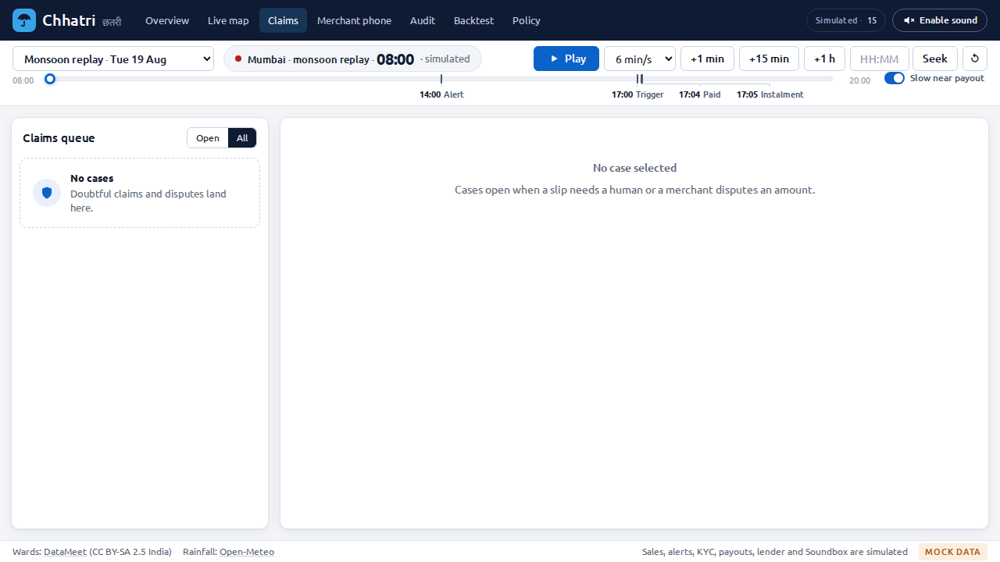
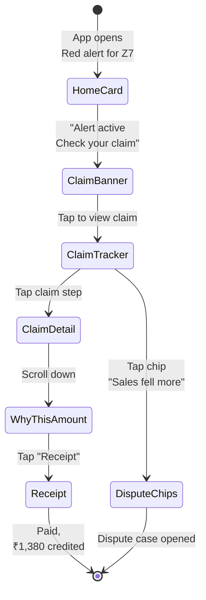
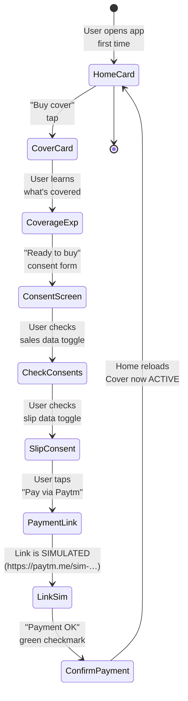
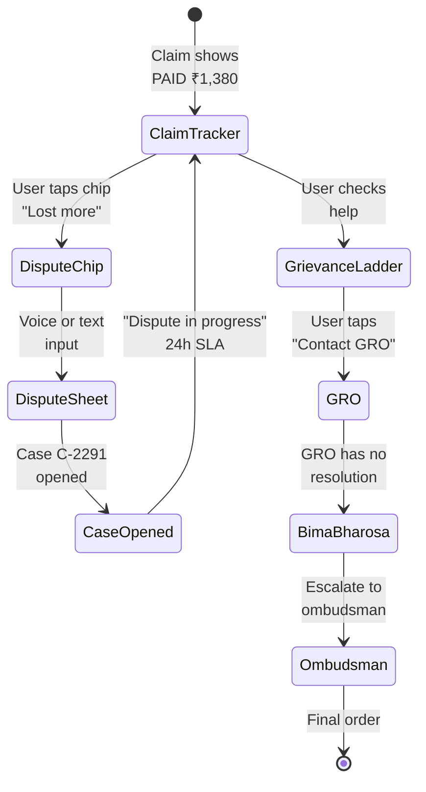

# Screens and flows

| | |
|---|---|
| Status | Draft v1 · 2 Oct 2026 |
| Owner | Omkar Kadam |
| Audience | Designers, developers building N1, UX reviewers |
| Related | [Design system](design-system.md) · [Personas and JTBD](../02-product/personas-and-jtbd.md) · [Feature specs: N1 merchant mini-app](../02-product/feature-specs/fs-04-merchant-mini-app.md) · [Facts and sources](../01-strategy/facts-and-sources.md) |

## TL;DR

- **Console (1280×720):** Existing desktop screens (Overview, Live map, Claims, Merchant phone). All rendered.
- **N1 mini-app (390×844 phone):** 10 new screens for merchant-facing cover, claims, consent, grievance. Wireframes below.
- **Layout:** Console on the left (map, panels, queue); WhatsApp phone sim in the centre; mini-app on the right (same phone frame, different tab). All three update in lock-step during replay.
- **Flows:** Journeys J3 (area claim), J4 (hospital-cash claim), J6 (consent & buy), J8 (dispute escalation) mapped to screens and state transitions.

---

## 1. Console screens (existing, 1280×720)

All screenshots embedded below are from commit 86575ea (1 Oct 2026).

### 1.1 Overview (hero, story, KPIs)


**Shows:**
- Hero section with the Chhatri value proposition (white text on navy background)
- Four key metrics (amount, shops paid, time to money, documents needed)
- Three CTAs: replay, phone, console
- Merchant phone simulator on the right (showing the WhatsApp conversation and payout receipt)

**Features:** K1, K8 · **Serves:** merchants and judges (story-first, then data) · **Future:** mobile layout collapses the hero to 1 column; phone becomes full-width below text.

### 1.2 Live map (zone-level sales index, triggers, coverage)

Not shown here due to space. Shows a hex choropleth of Mumbai wards coloured by sales index (0–100%). Zone labels (Z7, Z3, Z9, Z12) and shop counts. Top panel: alert status, trigger timeline, replay controls. Right panel: zone detail card (KPIs, feed, actions).

**Features:** K1, K8 · **Serves:** claims officers (operational view) · **Live:** map updates every simulated hour; hex colours change as sales fall.

### 1.3 Claims (case queue, slip extraction, decision history)



**Shows:**
- Left: case queue (Open / All filters); count of open cases
- Right: case detail pane (or empty state if no case selected)
- Case card inside: slip image, extracted text, checks (with pass/fail icons), decision (APPROVED / REFERRED), action buttons (Approve / Decline for officers)

**Features:** K5, K8, N5 (grievance ladder visible in case detail) · **Serves:** claims officers (triage view) · **Flow:** officer taps a case → slip and extraction appear → checks run in the detail pane → officer taps "Approve" to pay.

### 1.4 Merchant phone (WhatsApp simulator)

Part of the Overview screen. Shows an iPhone frame (390×844, 9 px border, WhatsApp theme).

**Content:** Conversation thread with the merchant, showing:
- Chhatri check-in message (Hindi + English)
- Merchant's voice reply (waveform + transcript)
- Slip photo upload card
- Payout receipt (decision ID, formula, Soundbox announcement)
- Grievance chip buttons

**Features:** K2, N1, N2, N4 · **Serves:** both console users (watching the merchant's journey) and the merchant themselves (in mock mode, the phone is embedded as a preview).

---

## 2. Information architecture

### 2.1 Console navigation (desktop top bar)

```
Chhatri [हिंदी] |  Overview | Live map | Claims | Merchant phone | Audit | Backtest | Policy
                                                                                    [Simulated] [Enable sound]
```

Each tab opens a different view. The phone and mini-app tabs are treated as "Merchant phone" (left: WhatsApp) and will add a "Mini-app" or "Chhatri in Paytm for Business" tab (right: cover, claims, etc.).

### 2.2 Mini-app navigation (phone, bottom tab bar)

```
┌──────────────────────────────────────┐
│ Chhatri [हिंदी globe]                │ (header, language toggle)
├──────────────────────────────────────┤
│ HOME | CLAIMS | HELP                 │ (bottom tab bar, always visible)
├──────────────────────────────────────┤
│  (Screen content: home card, claims  │ (scrollable content area)
│   tracker, help & grievance ladder)  │
├──────────────────────────────────────┤
│ [Message composer / tap chips]       │ (input area for voice/tap reply)
└──────────────────────────────────────┘
```

**Tabs:**
1. **HOME:** Cover status, coverage explainer, consent & buy, Ask Chhatri
2. **CLAIMS:** Claim tracker, Why-this-amount card, receipt, dispute case list
3. **HELP:** Grievance ladder, FAQ, customer service contact

### 2.3 Screen hierarchy (mini-app)

```
Home
├─ Cover Card (policy status, premium, waiting period)
├─ Ask Chhatri (collapsible; always-on at bottom)
└─ Claim Detection Banner (if an alert is active)

Claims
├─ Claim Tracker (Detected → Checked → Decided → Paid → EDI holiday)
├─ When clicked: Claim Detail
│  ├─ Slip image (if hospital-cash claim)
│  ├─ Why-This-Amount card (formula, checks, sources)
│  ├─ Receipt (printable)
│  └─ Dispute button
└─ Open Disputes list (with SLA clocks)

Help
├─ Grievance Ladder (3-step: GRO → Bima Bharosa → Ombudsman)
├─ FAQ (coverage, claims, payments)
├─ Consent Centre (view and withdraw data consents)
└─ Soundbox settings (test announcement, language)
```

---

## 3. Wireframes (N1 screens, 390×844 px)

Each wireframe shows layout, labels in Hindi (English in brackets), tap targets and state indicators. Font sizes are those in the design system (§9 of design-system.md).

### 3.1 Home screen

```
┌────────────────────────────────────────┐
│ Chhatri [हिंदी globe]                  │ 52px header
├────────────────────────────────────────┤
│                                        │
│  [card]────────────────────────────┐   │ 16px padding
│  │  कवर स्थिति [Cover Card]      │   │ 10px radius
│  │  ─────────────────────────────  │   │
│  │  स्थिति: सक्रिय                │   │ Font: 14px
│  │  (Status: Active)              │   │
│  │                                │   │
│  │  क्षेत्र: Z7                    │   │ 15px secondary
│  │  (Zone: Z7)                    │   │
│  │                                │   │
│  │  प्रीमियम: ₹14 प्रति दिन       │   │ Tabular numerals
│  │  (Premium: ₹14/day)            │   │
│  │                                │   │
│  │  [>] Waiting period details    │   │ Tap to expand
│  │  [>] View coverage details     │   │
│  │                                │   │
│  │  [BUTTON] कवर खरीदें            │   │ Primary blue button
│  │           (Buy cover)          │   │ 44px height
│  └────────────────────────────────┘   │
│                                        │
│  [sheet]─────────────────────────────┐ │ Ask Chhatri (collapsible)
│  │ मुझसे पूछो [Ask me]    [-]       │ │
│  │  (Always on, minimized)        │   │
│  └────────────────────────────────┘   │
│                                        │
│                                        │ Scrollable area
│                                        │
├────────────────────────────────────────┤
│ HOME | CLAIMS | HELP                   │ 46px bottom tab bar
└────────────────────────────────────────┘
```

**Notes:**
- Cover Card is a `.card` with padding 16px, radius 10px, shadow standard
- Status shows colour badge (green = Active)
- "Waiting period details" and "coverage details" toggle expand sections with HTML details/summary or CSS expand
- Cover button is primary blue (`--blue`), 44px min-height (touch target)

### 3.2 Coverage explainer (from Home: tap "View coverage details")

```
┌────────────────────────────────────────┐
│ < कवरेज [Coverage]        [हिंदी globe]│ 52px header (back arrow, title, lang)
├────────────────────────────────────────┤
│                                        │
│  क्या कवर है [What's covered]        │ 17px heading
│  ─────────────────────────────────    │
│                                        │
│  • बारिश में बिक्री गिरे (Area claim) │ 14px bullet, icon + text
│  • बीमारी से अस्पताल (Hospital cash)  │
│                                        │
│  उदाहरण [Example]                      │ Concrete example
│  ─────────────────────────────────    │
│  "हर दिन ₹4,380। बारिश में 63%     │
│   गिरेगा। आपको ₹1,380 मिलेंगे।"       │ "Every day ₹4,380. Rain cuts sales  │
│  (Day normally ₹4,380. In rain,      │  63%. You get ₹1,380.")               │
│   you lose 63%. Chhatri pays half.)  │                                       │
│                                        │
│  क्या नहीं है [What's NOT covered]   │ 17px heading
│  ─────────────────────────────────    │
│  • पहले 7 दिन (First 7 days)          │
│  • अलर्ट के 72 घंटे में (72h look-ahead) │
│  • ₹30,000 से ज़्यादा सालाना       │
│                                        │
│  [दस्तावेज़? कोई नहीं।]              │ Callout box
│  (No forms needed.)                   │
│                                        │
│  [< Back to home]                      │ Text link or button
│                                        │
├────────────────────────────────────────┤
│ HOME | CLAIMS | HELP                   │
└────────────────────────────────────────┘
```

**Notes:**
- Back arrow is a link to the Home tab, or part of the screen (collapsible)
- Bullets use a simple `▪` or SVG icon (check for covered, X for not covered)
- Example is italicised, in a light background card or quoted block
- Font is Hindi-first, English in brackets for clarity

### 3.3 Consent and buy screen (from Home: tap "Buy cover")

```
┌────────────────────────────────────────┐
│ < सहमति [Consent]         [हिंदी globe]│
├────────────────────────────────────────┤
│                                        │
│  क्या डेटा साझा किया जाएगा [Data]    │ 17px
│  ─────────────────────────────────    │
│                                        │
│  [ ] आपकी बिक्री देखने के लिए         │ Checkbox (checked)
│    [To check your sales]              │
│    [X] CHECKED                        │
│                                        │
│  [ ] अस्पताल की स्लिप देखने के लिए   │
│    [To read hospital slip]            │
│    [ ] UNCHECKED                      │ Unchecked by default
│                                        │
│  ────────────────────────────────────  │
│                                        │
│  प्रीमियम: ₹424.80 (30 दिन)          │ 15px secondary
│  (Premium: ₹14.16/day for 30 days)   │
│                                        │
│  [BUTTON] Paytm से भुगतान करें        │
│  (Pay via Paytm link)                 │ Primary blue button
│  https://paytm.me/sim-…               │ URL-like text
│  [SIMULATED]                          │ Label
│                                        │
│  [check] भुगतान की पुष्टि             │ Confirmation state (green)
│  (Payment confirmed)                  │
│  कवर 25-Aug से शुरू होता है           │
│  (Cover starts 25-Aug)                │
│                                        │
├────────────────────────────────────────┤
│ HOME | CLAIMS | HELP                   │
└────────────────────────────────────────┘
```

**Notes:**
- Checkboxes are styled with CSS (`.form-check`), not HTML checkbox
- "Data shared" section shows purpose-specific toggle per the C11 clause
- Premium amount uses tabular numerals
- Payment link is simulated (labelled); in LIVE mode, it would be a real Paytm link
- Green checkmark and "cover starts 25-Aug" appears only after payment succeeds

### 3.4 Claim tracker screen (CLAIMS tab)

```
┌────────────────────────────────────────┐
│ दावों का पता [Claims]  [हिंदी globe]  │ 52px header
├────────────────────────────────────────┤
│                                        │
│  [1] क्षेत्र दावा (Area claim)       │ H1 stepper
│  ─────────────────────────────────    │
│                                        │
│  [o] पता चला | मंगलवार 17:00         │ Step 1: Detected
│      (Detected | Tue 17:00)           │ Circle + label + time
│                                        │
│  |  (connecting line)                  │ Subtle grey line
│                                        │
│  [o] जांचा गया | मंगलवार 17:02       │ Step 2: Checked
│      (Checked | Tue 17:02)            │ Reason: "आपके क्षेत्र की बिक्री 63%"
│      ────                              │ (Your area's sales fell 63%)
│      आपके क्षेत्र की बिक्री 63%       │
│      (Your area sales fell 63%)       │
│                                        │
│  |                                     │
│                                        │
│  [OK] मंजूर (Approved)                │ Step 3: Decided
│      मंगलवार 17:04                     │ Check icon (green)
│      (Approved | Tue 17:04)           │
│                                        │
│  |                                     │
│                                        │
│  [card] भुगतान किया (Paid)           │ Step 4: Paid
│         ₹1,380 · 17:04                │ Amount + time
│         Paytm से सीधे                  │
│         (Via Paytm settlement)        │
│                                        │
│  |                                     │
│                                        │
│  [pause] किस्त में छुट्टी (Instalment holiday)│ Step 5: EDI holiday
│          बुधवार का ₹600 अगली तारीख  │
│          तक रखा गया                   │
│          (Wed's ₹600 pushed to end)   │
│                                        │
│  ──────────────────────────────────   │ Divider
│                                        │
│  [2] बीमारी दावा (Hospital-cash)    │ H1 stepper
│  ─────────────────────────────────    │ (if applicable; starts pending)
│                                        │
│  [o] प्रतीक्षा [Pending]              │
│                                        │
│  [BUTTON] विवाद खोलें (Open dispute) │ CTA button
│                                        │
├────────────────────────────────────────┤
│ HOME | CLAIMS | HELP                   │
└────────────────────────────────────────┘
```

**Notes:**
- Each claim gets its own stepper (numbered: 1️⃣, 2️⃣)
- Steps are rows: icon (circle, check, X) + label (in Hindi/English) + time + optional reason
- Connecting line between steps is `--line-soft` and thin (1–2px)
- Claim detail accessible by tapping a step or a card expand button
- "Open dispute" button is a link or secondary button

### 3.5 Claim detail (Why-this-amount card)

```
┌────────────────────────────────────────┐
│ < क्षेत्र दावा [Claim detail] [हिंदी] │
├────────────────────────────────────────┤
│                                        │
│  [OK] मंजूर [APPROVED]                │ Status badge (green)
│  ₹1,380 ईएमआई सहित                   │
│  (Paid with EDI holiday)              │
│                                        │
│  ────────────────────────────────────  │
│                                        │
│  इतने ही पैसे क्यों? [Why this much?] │ Heading
│                                        │
│  1. नियम: आपकी आधी दिन की बिक्री   │ Numbered formula
│     (Rule: Half your daily sales)    │
│                                        │
│  2. आपकी उम्मीद: ₹4,380/day          │ Citation: [C4.1]
│     (Your expected: ₹4,380/day)      │
│     [clause C4.1]                     │
│                                        │
│  3. गिरावट: 63% (Z7 index)           │ Citation: [alert]
│     (Drop: 63% from alert)           │ Clause C2 (area trigger)
│     [alert A-20250818-01]             │
│     [Rule] [K1]                       │
│                                        │
│  4. भुगतान: ₹4,380 × 0.5 × 0.63     │ Plain math
│               = ₹1,379.70            │ Tabular numerals
│               ≈ ₹1,380 (rounded)     │
│                                        │
│  5. कैप्स: < ₹2,500/day [C4.2]      │ Constraints
│               < ₹30,000/year [C4.3] │
│                                        │
│  ────────────────────────────────────  │
│                                        │
│  रिसिट्स [Receipt]                    │ Links to receipt screen
│  [BUTTON] प्रिंट करें    (Print)      │
│  [BUTTON] डाउनलोड        (Download)  │
│                                        │
│  विवाद [Dispute]                      │
│  "मेरा नुकसान इससे ज़्यादा था"      │ Tap-to-send chips
│  (My loss was bigger)  [send]         │
│                                        │
│  "पुष्टि बिलकुल गलत है"              │
│  (Proof was wrong)     [send]         │
│                                        │
│  या यह भेजें:                         │
│  [mic] मुझे बताएं  (Voice)           │ Voice option
│  [send] लिखकर भेजें   (Text)        │
│                                        │
├────────────────────────────────────────┤
│ HOME | CLAIMS | HELP                   │
└────────────────────────────────────────┘
```

**Notes:**
- Status badge uses `--decided` blue or `--paid` green
- Formula is numbered, not bullet-pointed, for a step-by-step feel
- Each citation (number, clause ID, alert ID) is a small badge or link (teal text, 12px)
- Tap-to-send chips are secondary buttons (light background, 12–14px, tap-friendly)
- Voice and text input options are at the bottom; voice uses the Web Speech API or Sarvam

### 3.6 Receipt screen

```
┌────────────────────────────────────────┐
│ < रिसीट [Receipt]        [हिंदी globe] │
├────────────────────────────────────────┤
│                                        │
│  [doc] भुगतान रसीद [Payment Receipt] │ Heading + icon
│                                        │
│  ────────────────────────────────────  │
│                                        │
│  निर्णय ID                             │
│  Decision ID: D-000001                │ 12px monospace
│                                        │
│  नियम: pilot-0.1                     │
│  Rules version: pilot-0.1            │
│                                        │
│  तारीख़                               │
│  Decided: Tue 19 Aug 17:04           │
│                                        │
│  ────────────────────────────────────  │
│                                        │
│  सूत्र [Formula]                       │
│  ½ × ₹4,380 × 63% = ₹1,380          │ Monospace, tabular numerals
│  (Half × expected × drop)            │
│                                        │
│  स्रोत [Sources]                      │
│  [chart] Paytm बिक्री सूचकांक (Sales) │ Badge: source name
│  [alert] अलर्ट A-20250818-01         │ Alert ID
│  [check] केवाईसी (KYC) नाम           │ Data source
│                                        │
│  ────────────────────────────────────  │
│                                        │
│  ऑडिट (Audit hash, first 12 chars)   │
│  hash: 8f4a2b9c1e3d                  │ 12px monospace
│                                        │
│  शिकायत [Grievance path]              │
│  यदि आप असहमत हैं [If you disagree]: │
│  > GRO (बीमाकर्ता)                   │ Expandable list
│  > Bima Bharosa (IRDAI)              │
│  > Insurance Ombudsman               │
│  [अधिक जानें] (Learn more)           │ Link
│                                        │
│  ────────────────────────────────────  │
│                                        │
│  [BUTTON] PDF डाउनलोड करें            │
│           (Download PDF)              │ Primary button
│                                        │
│  [BUTTON] प्रिंट                      │ Secondary buttons
│  [BUTTON] कॉपी करें                  │
│  (Print)  (Copy to clipboard)        │
│                                        │
├────────────────────────────────────────┤
│ HOME | CLAIMS | HELP                   │
└────────────────────────────────────────┘
```

**Notes:**
- Receipt is a printable card (could also be a PDF or screenshot)
- Sources are small coloured badges (like Figma component tags)
- Audit hash is monospace, short (first 12 chars) to avoid clutter
- Grievance ladder is collapsible (click arrow to expand)
- Download/Print buttons are both available

### 3.7 Grievance ladder (HELP tab)

```
┌────────────────────────────────────────┐
│ शिकायत सीढ़ी [Grievance]  [हिंदी globe]│
├────────────────────────────────────────┤
│                                        │
│  क्या करें [What to do if you disagree] │ 17px
│                                        │
│  [1] बीमाकर्ता का GRO               │ Step 1
│      (Company's grievance officer)   │
│      [email] [contact details]       │ Contact link
│      [ ] Open case [send]            │ CTA (open a grievance case)
│      Deadline: insurer's SLA         │ SLA info (to be confirmed)
│                                        │
│  |                                     │ Connecting line
│                                        │
│  [2] Bima Bharosa (IRDAI)             │ Step 2
│      (IRDAI ombudsman portal)        │
│      [link] bimabharosa.irdai.gov.in │ Link
│      [ ] Open case [send]            │
│      Deadline: within 14 days        │ SLA per Bima Bharosa portal
│      [clock] 12 दिन बचे (12 left)   │ Countdown (if case is open)
│                                        │
│  |                                     │
│                                        │
│  [3] Insurance Ombudsman               │ Step 3
│      [email] [contact details]       │
│      [ ] Open case [send]            │
│      Free for you                     │ Note
│      Timeline: to be confirmed         │
│                                        │
│  ────────────────────────────────────  │
│                                        │
│  [chat] चैट से पूछें (Ask Chhatri)   │ Link to Ask Chhatri
│  [phone] हेल्पलाइन (Call support)    │
│                                        │
├────────────────────────────────────────┤
│ HOME | CLAIMS | HELP                   │
└────────────────────────────────────────┘
```

**Notes:**
- Numbered steps (1️⃣, 2️⃣, 3️⃣) in large emojis or SVG icons
- Connecting line between steps (thin, `--line-soft`)
- Each step has contact info, an "Open case" CTA, and SLA clock
- SLA clock shows countdown if a case is open (e.g. "14 days left")
- Bottom has links to Ask Chhatri and a help hotline (phone number or WhatsApp)

### 3.8 Ask Chhatri (collapsible, from Home or HELP tab)

```
┌────────────────────────────────────────┐
│ मुझसे पूछो [Ask Chhatri]   [-]       │ 46px; [-] collapses the sheet
├────────────────────────────────────────┤
│                                        │
│  What coverage question?              │ Prompt (Hindi or English)
│  कवरेज से कोई सवाल?                  │
│                                        │
│  Suggestion chips:                     │
│  [कवर क्या है?]           (What's covered?) │ Tap to send
│  [अपवाद क्या हैं?]         (What's excluded?)│
│  [प्रतीक्षा अवधि?]         (Waiting period?)   │
│                                        │
│  Or type/speak:                        │
│  ┌──────────────────────────────┐     │ Input area
│  │ [mic] [text] ____________   │     │ Voice + text icons
│  │           (Message)          │     │
│  └──────────────────────────────┘     │
│  [send] भेजें (Send)     [Sarvam LIVE] │ Send button + provider badge
│                                        │
│  ────────────────────────────────────  │
│                                        │
│  **Response** (from LLM):              │
│  "कवर उन दिनों में काम करता है      │ Streamed, with citations
│  जब आपकी दिन की बिक्री 50% से कम   │
│  हो [clause C2.1]। आप ₹2,500 तक पा  │
│  सकते हैं [clause C4.1]।"            │
│                                        │
│  (Cover applies when your daily     │
│   sales fall below 50% [C2.1].      │
│   You can get up to ₹2,500 [C4.1].) │
│                                        │
│  Sources:                              │
│  [clause C2.1 Area claim coverage]  │ Expandable: shows clause text
│  [clause C4.1 Caps and amounts]    │
│                                        │
│  [thumbsup] Helpful  [thumbsdown] Not │ Feedback chips
│                                        │
│  Follow-up:                            │
│  [और भी बताएं?]  (Tell me more)[send]│ Chip for next question
│                                        │
├────────────────────────────────────────┤
│ HOME | CLAIMS | HELP                   │
└────────────────────────────────────────┘
```

**Notes:**
- Ask Chhatri is a persistent modal or bottom sheet
- Suggestion chips populate common questions; merchant can also type or use voice
- Response is streamed word-by-word (N2 feature)
- Citations are inline [clause C2.1] with expandable text showing the full clause
- Provider badge shows "Sarvam LIVE" or "Sarvam FALLBACK" (demo mode); N2 will add Gemini (planned)
- Helpful/unhelpful feedback buttons (thumbs up / thumbs down) allow the merchant to rate the answer
- Follow-up prompt chips help continuation

### 3.9 Consent centre (HELP tab)

```
┌────────────────────────────────────────┐
│ < सहमति केंद्र [Consents]  [हिंदी]   │
├────────────────────────────────────────┤
│                                        │
│  आपने अनुमति दी है [Your consents]  │ Heading
│                                        │
│  [X] आपकी दिन की बिक्री देखने के   │ Toggle (on)
│      लिए [Sales data for claims]     │
│      आप यह बंद कर सकते हैं            │
│      (You can withdraw this)          │
│      [स्थिति: सक्रिय] (Active)       │
│                                        │
│  [X] अस्पताल की स्लिप देखने के     │ Toggle (on)
│      लिए [Hospital slip for claims]  │
│      [स्थिति: सक्रिय] (Active)       │
│                                        │
│  [ ] विपणन संदेशों के लिए            │ Toggle (off)
│      [Marketing messages]             │
│      आप इसे चालू कर सकते हैं         │
│      (You can enable this)            │
│      [स्थिति: बंद] (Inactive)        │
│                                        │
│  ────────────────────────────────────  │
│                                        │
│  अपना डेटा हटाएं [Delete my data]    │ Destructive action
│  अस्पताल की सभी स्लिपें हटाएं      │ (requires confirmation)
│  [warning] इसे पूर्ववत नहीं किया    │
│  (Warning: This cannot be undone)    │
│                                        │
│  [BUTTON] डेटा हटाएं  (Delete data) │ Red button (destructive)
│                                        │
│  ────────────────────────────────────  │
│                                        │
│  अधिक जानें [Learn more]             │ Link to DPDP info
│  [link] डेटा सुरक्षा नीति            │ (privacy policy)
│                                        │
├────────────────────────────────────────┤
│ HOME | CLAIMS | HELP                   │
└────────────────────────────────────────┘
```

**Notes:**
- Toggles are styled CSS (not HTML checkbox)
- Each consent shows purpose, current status (Active/Inactive), and action (withdraw)
- Delete data is a destructive action (red button) with a warning
- Privacy policy link points to a full page (N6 feature)

### 3.10 Settings & language toggle (phone header)

```
┌────────────────────────────────────────┐
│ Chhatri        [हिंदी globe gear]      │ 52px header
│                                        │ Language toggle (dropdown or menu)
│                ┌──────────────────┐   │
│                │ हिंदी (Hindi)    │   │ Selected
│                │ English          │   │
│                │ मराठी (Marathi)  │   │ Future (N8)
│                └──────────────────┘   │
│                                        │ Settings menu (gear):
│                ┌──────────────────┐   │ - Sound on/off
│                │ [speaker] Sound: │   │ - Help
│                │ [?] Help         │   │ - Privacy
│                │ [lock] Privacy   │   │
│                └──────────────────┘   │
└────────────────────────────────────────┘
```

**Notes:**
- Language toggle is a dropdown (मराठी = Marathi, future N8)
- Settings menu icon (gear) opens a popover with Sound, Help, Privacy
- Sound toggle controls Soundbox and TTS (Ask Chhatri, voice messages)

---

## 4. Screen-to-screen flows (key journeys)

Mermaid diagrams for J3, J4, J6, J8 mapped to mini-app screens.

### 4.1 Journey J3: Area claim (monsoon alert to payout)



### 4.2 Journey J4: Hospital-cash claim (illness check-in to payout)

```mermaid
stateDiagram-v2
    [*] --> HomeCard: Shop silent<br/>all day Wed
    HomeCard --> WhatsAppCheckIn: Chhatri sends<br/>CHECKIN_SILENT
    WhatsAppCheckIn --> VoiceReply: Merchant replies<br/>with voice
    VoiceReply --> SlipUpload: Chhatri asks<br/>for slip photo
    
    SlipUpload --> ReadinessCheck: Photo extracted<br/>(Sarvam Vision; Tesseract planned N3)
    ReadinessCheck --> PreCheckPrompt: "Ready?"<br/>3-item checklist
    PreCheckPrompt --> ConfirmSlip: Merchant confirms
    
    ConfirmSlip --> ClaimDecision: Decision made<br/>auto or human review
    ClaimDecision --> ClaimTracker: Claim appears<br/>in app
    ClaimTracker --> Receipt: Tap "Receipt"
    Receipt --> [*]: Paid ₹1,500
```



### 4.3 Journey J6: Consent and buy (cover purchase)



### 4.4 Journey J8: Dispute escalation (case to ombudsman)



---

## 5. States (empty, loading, error, SIMULATED)

### 5.1 Empty states

When there is no data to show, the screen displays:

- **Icon:** 80×80 px, `--faint` colour (`#8a93a3`)
- **Headline:** 15px, `--ink-2`
- **Message:** 14px, `--muted`
- **Action:** Optional link or button (primary blue)

Examples:

```
No claims yet
┌─────────────┐
│   [document] │  Icon (80px)
└─────────────┘
You don't have any claims. They will appear
here when an alert triggers or you report
an illness.

[LINK] Learn about coverage  (link)
```

```
No disputes
Your claims are all approved. No action
needed.
```

### 5.2 Loading states

When data is being fetched or processed:

- **Spinner:** 40×40 px, dark blue (`--blue`), rotating (150–300 ms per rotation)
- **Text:** "Checking…" or "Reading slip…" (14px, `--ink-2`)
- **Respect:** `prefers-reduced-motion` → static spinner, no rotation

```
    ⟳
 Checking your claim…
```

### 5.3 Error states

When a request fails or input is invalid:

- **Icon:** 80×80 px, red (`--red`)
- **Headline:** 15px, `--red`
- **Message:** Plain error message in 14px (`--ink-2`)
- **Action:** "Try again" button or link

```
⊘ Error

We couldn't read the slip. The photo might
be blurry or cut off.

[≡] Take another photo    [Try again]
```

### 5.4 SIMULATED / FALLBACK badges

When an integration is in demo mode or has fallen back to a deterministic fallback:

- **Badge:** 12px, `--demo` teal or `--fallback` orange, pill-shaped (fully round)
- **Text:** "SIMULATED", "MOCK", or "FALLBACK" (monospace, white text)
- **Placement:** Top-right corner of the component or feature it labels

```
Payment link
https://paytm.me/sim-abc123…
[SIMULATED]  ← small badge
```

---

## 6. Console layout (1280×720)

The console shows three side-by-side panes:

```
┌─────────────────────────────────────────────────────────────┐
│ Chhatri [हिंदी] │ Overview | Live map | Claims | Merchant phone │ Mini-app [new] │
└─────────────────────────────────────────────────────────────┘
┌──────────────────────────────────────────────────────────┐
│                                                          │
│ Left: Console content (map, panels, queue, audit)      │
│ Max-width 1280px, flex grow                            │
│                                                          │
│       ┌──────────────────┐  ┌──────────────────────┐  │
│       │ WhatsApp phone   │  │ Mini-app N1          │  │
│       │ (390×844)        │  │ (390×844)            │  │
│       │                  │  │                      │  │
│       │ HOME tab:        │  │ HOME | CLAIMS | HELP │  │
│       │ Messages,        │  │ Selected: HOME       │  │
│       │ slip upload,     │  │                      │  │
│       │ payout receipt   │  │ Cover card           │  │
│       │                  │  │ Ask Chhatri          │  │
│       │ [← → tabs]       │  │                      │  │
│       └──────────────────┘  └──────────────────────┘  │
│                                                          │
│ Both phones are live-updating during replay; same data  │
│ flows to both (WhatsApp side and mini-app side).       │
│                                                          │
└──────────────────────────────────────────────────────────┘
```

---

## 7. UX review of existing console screens

### 7.1 Overview (what works well)

- **Hero statement is clear.** "Merchant insurance where the claim starts itself" immediately explains the value.
- **KPI layout is scannable.** Four tiles in a grid; users can see the core metrics at a glance (₹, shops, time, forms).
- **CTAs are obvious.** Three large buttons (Watch replay, See WhatsApp, Open console) guide the user's eye.
- **Phone simulator is credible.** Showing an actual iPhone frame with real WhatsApp bubbles and voice waveforms makes the demo feel live.

### 7.2 Overview (what to fix)

- **Hero text doesn't mention the date or the alert.** Add a small subtitle: "Monsoon replay: Tue 19 Aug 2025, 17:00 trigger" (so judges know what scenario is running).
- **No "next steps" after the 3 CTAs.** After clicking "Watch replay", users don't know if the replay auto-plays or if they need to press Play. Add a small note: "Click Play to start the 6x-speed replay" or auto-start it.
- **Mobile layout is not shown.** The Overview collapses to a single column on phone; confirm that Soundbox and voice waveform are still visible (they are, in `frontend/src/styles/overview.css`, but it's not obvious from the screenshot).

### 7.3 Live map (what works well)

- **Hex map is genuinely useful.** It's much better than a scatter plot; you can see spatial clusters (Z3 and Z7 are close, Z12 is separate).
- **Colour and numbers together.** Each hex shows the % and shop count; colour-blind users can read the text instead of relying on colour alone.
- **Responsive to replay.** As the clock advances, the sales index updates live, and the colour darkens as sales fall (impressive for a demo).

### 7.4 Live map (what to fix)

- **Zone names aren't visible in the hex labels.** Z7 and Z9 are IDs; judges might not know the geography. Add a small legend popup: "Z3 = Worli, Z7 = Parel, Z12 = Andheri, Z9 = Dadar" (and link to `SPEC §5` for the full ward list).
- **No visual distinction between covered and uncovered hexes.** All hexes are coloured equally; only the "at least 20 shops" rule decides trigger eligibility. Consider a subtle border on uncovered/low-merchant hexes (e.g., lighter stroke or hatching).

### 7.5 Claims (what works well)

- **Queue and detail pane split is a classic pattern.** Officer selects a case on the left, detail appears on the right.
- **Case card shows slip image + checks + decision + action.** All the information is there; officer doesn't need to click elsewhere.
- **Approve/Decline buttons are prominent.** The decision is one tap.

### 7.6 Claims (what to fix)

- **Empty state is too minimal.** "Doubtful claims and disputes land here." is fine, but add a second line: "When all checks pass, payouts are automatic; humans review edge cases (name mismatch, blur, bad dates)."
- **No SLA clock visible.** The SPEC says disputes have a 24 h SLA. The case card doesn't show a timer or "due by" time. Add a small line: "Due by: Fri 22 Aug 09:00" (in red if overdue).
- **Refusal reasons aren't clear.** If a case is REFERRED, why? Add a label under the status: "REFERRED · Name on slip does not match KYC (88% confidence)."

### 7.7 Merchant phone (what works well)

- **WhatsApp simulator is pixel-perfect.** The chat bubbles, avatar, timestamps, and Soundbox announcement (text-to-speech waveform) are all there.
- **Voice message waveform is convincing.** The animated bars make it feel like the merchant really did reply by voice.
- **Slip photo upload card is clear.** "Send a photo of the hospital slip" + a file input (or camera icon for mobile) is self-explanatory.

### 7.8 Merchant phone (what to fix)

- **No indicator of Sarvam speech-to-text latency.** The demo shows canned transcripts instantly. A real Sarvam integration would have network latency. Consider adding a spinner or "Listening…" state during the mock delay, so judges know it's not fake speed.
- **Slip extraction is behind the scenes.** The merchant sends the photo, and then the decision appears. Judges don't see *how* the slip was read (Sarvam Vision). Consider a small pop-up after upload: "Reading slip…" with a provider badge, or show extracted fields with confidence % in the receipt.

---

## Open questions

1. Should the mini-app (N1) live inside the console next to the WhatsApp phone, or in a separate tab and/or separate demo URL? Owner: Omkar Kadam.

2. For the claim tracker stepper, should the "next step ETA" be shown (e.g. "Paid estimated in 3 min") or just the completed-step time? Owner: Omkar Kadam.

3. Should the provider badge (Gemini, Sarvam, fallback) in Ask Chhatri be a small pill in the corner, or a full-width status bar? Owner: Omkar Kadam.

4. For the receipt screen, should we include a full policy wording PDF download, or just the decision + formula? Owner: Ujjwal Pardeshi (for PDF generation).

5. Should the grievance ladder (N5) show real contact emails (insurer GRO, Bima Bharosa portal URL) or placeholder URLs for demo purposes? Owner: Omkar Kadam.

---

## Changelog

- 2026-10-02 · v1.2 · second fact-check pass: removed invented STT latency estimate, clarified Gemini/Tesseract as planned (N2/N3), fixed EMI vs EDI terminology
- 2026-10-02 · v1.1 · fact-check pass: fixed ungrounded Bima Bharosa duration (14 days per portal), GRO SLA label, removed H5 reference
- 2026-10-02 · v1 · first draft: console gallery, IA, N1 wireframes, flows, UX review.
