# Screens and flows

| | |
|---|---|
| Status | Draft v1.3 · 2 Oct 2026 |
| Owner | Omkar Kadam |
| Audience | People building the mini-app and the console changes, UX reviewers, and the person presenting |
| Related | [Design system](design-system.md) · [Copy deck](copy-deck.md) · [Conversation design](conversation-design.md) · [Mini-app spec (fs-04)](../02-product/feature-specs/fs-04-merchant-mini-app.md) · [Console spec (fs-08)](../02-product/feature-specs/fs-08-claims-officer-console.md) · [Slip pre-check (fs-02)](../02-product/feature-specs/fs-02-hospital-cash-claim.md) · [Ask Chhatri (fs-05)](../02-product/feature-specs/fs-05-ask-chhatri.md) · [Disputes and grievance (fs-06)](../02-product/feature-specs/fs-06-explanations-disputes-and-grievance.md) · [Cover and consent (fs-07)](../02-product/feature-specs/fs-07-cover-purchase-and-consent.md) · [EDI holiday (fs-03)](../02-product/feature-specs/fs-03-edi-holiday.md) · [ADR 0004](../04-engineering/adr/0004-live-simulated-fallback-labels.md) · [ADR 0005](../04-engineering/adr/0005-mini-app-inside-the-console.md) · [AI evaluation plan](../04-engineering/ai-evaluation-plan.md) · [User journeys](../02-product/user-journeys.md) · [Personas](../02-product/personas-and-jtbd.md) |

## TL;DR

- **What this is.** The layout, components and states of every screen to build: the seven console pages that exist, the merchant mini-app (N1 with its nine screens, plus N2 and N4 Ask and voice, N3 the slip sheet, N5 complaints, N6 consent, N7 the standalone route and N8 language), and six console parts with the case panel changes (X6 provider panel, H8 ops strip, H24 what-if drawer, presenter mode, the `/evals` page and the trigger-to-payout moment card).
- **Everything is P0 and lands in a wave** (W0 setup, W1 demo spine, W2 live AI, W3 trust and rights, W4 judge wow, W5 ship). Each part says BUILT or PLANNED; since the Wave 0 to 5 build every part is BUILT behind its flag. Screenshots are of commit 86575ea.
- **The mini-app is a 354 px screen in a 372 px frame** next to the WhatsApp phone on `/merchant/:id` (three columns from 1200 px), and a full-screen column on `/merchant/:id/app`. Three tabs: Home, Claims, Help. Every screen ends in one next step.
- **Every screen has six states:** loading, empty, error, offline, SIMULATED and FALLBACK. Each screen below lists what shows in each, so none is built half-way.
- **Slip problems are screens, not dead ends.** A blurry photo, a wrong document, a name that does not match the KYC name and a blocked camera each say what is wrong and offer the next step (section 6).
- **The claim state machine includes REFERRED and DISPUTE** (section 10). An area claim is never REFERRED. A dispute never changes the amount.
- **The console has no room to spare in presenter mode.** Measured at 1280×720, the Live right panel has 16 px free. The ops strip therefore goes over the map column and the moment card over the map, not in the panel (section 9).
- **Copy.** Text is a catalogue key from `messages.py`, a key of the [copy deck](copy-deck.md), or marked "proposed". Where this document quotes a line, the copy deck wins if they differ.

---

## 1. How to read this document

### 1.1 Conventions

| Term | Meaning |
|---|---|
| BUILT, PLANNED | BUILT is in the code. A part behind a flag shows only when the flag is on. PLANNED is not written. On 3 Oct 2026 every part of this document is BUILT; the screenshots were taken at commit 86575ea |
| Waves | W0 setup, W1 demo spine, W2 live AI, W3 trust and rights, W4 judge wow, W5 ship. Everything here is P0 |
| Ids | Feature ids (K, N, X, H) are the ones of the [PRD](../02-product/prd.md). Mini-app screens S1 to S11 are those of fs-04 and fs-07. Test ids are in the feature specs and are not repeated |
| Six states | Loading (skeleton shaped like the final layout), empty (nothing to show, with the next step), error (a request failed, with Retry), offline (last data stays, network actions disabled with a reason), SIMULATED (the data or action comes from a simulated source, with a badge) and FALLBACK (a backup stepped in, from X6, with a badge and one reason line) |
| Copy | A `KEY_IN_CAPITALS` is a catalogue key. It is BUILT if `backend/chhatri/conversation/messages.py` has it, and a proposed new line of the copy deck if not. A dotted key (`empty.claims`) is a line of the copy deck, proposed unless the deck marks it BUILT. A quoted line marked "proposed" is in neither. Section 12 lists which is which |
| Numbers | Demo numbers (₹1,380, ₹4,380, 63%, ₹14.16, ₹424.80, case C-2291) are those of [DEMO.md](../DEMO.md). A size or a height that no code states is a design target, and says so |
| Wireframes | Drawn at 40 characters for the 354 px mini-app screen. `[ Label ]` is a button, `[ ]` and `[x]` an unticked and a ticked box, `( )` a chip or an unselected option, `(o)` a selected one, `[v]` and `[>]` an open and a closed section, `o` an icon, `!` a warning icon, `>` a row that opens a screen, `{name}` a value the API fills in. In the console sketches `v` is a tick and `x` a cross |

### 1.2 Screen index

| Id | Screen | Where | Feature | Wave | Status | Section |
|---|---|---|---|---|---|---|
| C1 | Overview | `/` | K8 | n/a | BUILT | 2.2 |
| C2 | Live map | `/live` | K8 | n/a | BUILT | 2.3 |
| C3 | Claims | `/claims` | K8 | n/a | BUILT | 2.4 |
| C4 | Merchant phone | `/merchant/:id` | K8 | n/a | BUILT, third column BUILT (W1) | 2.5, 3.2 |
| C5 | Audit | `/audit` | K8 | n/a | BUILT | 2.6 |
| C6 | Backtest | `/backtest` | K8 | n/a | BUILT | 2.7 |
| C7 | Policy | `/policy` | K8 | n/a | BUILT, nothing to edit | 2.8 |
| S1 | Home | `screen=home` | N1 | 1 | BUILT | 4.1 |
| S2 | Coverage explainer | `screen=coverage` | N1, H20 | 1 | BUILT | 4.2 |
| S3 | Cover and buy | `screen=buy` | N1, N6 | 1, consent block 3 | BUILT | 4.3 |
| S4 | Claims | `screen=claims` | N1, H1 | 1 | BUILT | 4.4 |
| S5 | Claim detail | `screen=claim` | N1, H1 | 1 | BUILT | 4.5 |
| S6 | Why this amount | `screen=why` | N1, H2, H13, H14 | 1 | BUILT | 4.6 |
| S7 | Trust receipt | `screen=receipt` | N1, H3, H13, H14 | 1 | BUILT | 4.7 |
| S8 | Help | `screen=help` | N1 | 1, rows added in 2 and 3 | BUILT | 4.8 |
| S9 | Language | `screen=settings` | N8 | 1, Marathi 4 | BUILT | 4.9 |
| N2, N4 | Ask Chhatri, with voice | `screen=ask` | N2, N4, H16 to H19, H21 | 2 | BUILT | 5 |
| N3 | Slip sheet and slip problems | `screen=slip` | N3, H5, H15 | 2 | BUILT | 6 |
| N5 | Complaints | `screen=grievances` | N5, H22 | 3 | BUILT | 7.1 |
| S10, S11 | Consent centre, consent activity | `screen=consents`, `screen=consent-activity` | N6, H23 | 3 | BUILT | 7.2, 7.3 |
| N7 | Static demo and standalone route | `/merchant/:id/app` | N7 | 5 | BUILT | 8 |
| X6 | Provider panel | Header chip and popover | X6, H26 | 2 | BUILT | 9.1 |
| H8 | Ops strip | `/live`, `/claims` | H8 | 4 | BUILT | 9.2 |
| H24 | What-if drawer | `/live` | H24 | 4 | BUILT | 9.3 |
| P | Presenter mode | Header, all console pages | n/a | 4 | BUILT | 9.4 |
| H25 | Evaluation page | `/evals` | H25 | 3 | BUILT | 9.5 |
| M | Trigger-to-payout moment card | `/live` | n/a | 4 | BUILT | 9.6 |
| D | Case panel additions | `/claims` | H13, H14, X4 | 4 | BUILT | 9.7 |

---

## 2. The console today (BUILT, 1280×720)

The console has seven pages on a navy header, a control bar and a footer. It runs against the real backend or the in-browser mock (`npm run dev:mock`, `?mock=1`). Components are in `frontend/src/components/` (design system section 5.1). The screenshots below are of commit 86575ea at 1280×720.

### 2.1 Shell

| Part | What it holds | Size |
|---|---|---|
| Header | Wordmark "Chhatri छतरी", seven page links (Claims carries the open-case count), a "Connecting…" or "Reconnecting…" pill while the live stream is down, the integration chip ("Simulated · 15" with nothing live, otherwise up to three live product names and "+N simulated"), "Enable sound" | 52 px |
| Control bar (not on Overview) | Scenario picker (`monsoon`, `illness`, `illness_mismatch`, `buy_cover`), the clock pill ("Mumbai · monsoon replay · 17:05 · simulated"), Play or Pause, speed (1 to 120 minutes a second), steps (+1 min, +15 min, +1 h), seek HH:MM, reset, "Slow near payout", and the scrubber with chapter ticks (14:00 Alert, 17:00 Trigger, 17:04 Paid, 17:05 Instalment) | 84 px |
| Page | One page, with a 14 px gutter | 556 px |
| Footer | "Wards: DataMeet (CC BY-SA 2.5 India)", "Rainfall: Open-Meteo", the line "Sales, alerts, KYC, payouts, lender and Soundbox are simulated" and the "Mock data" badge in mock mode | 28 px |

### 2.2 Overview `/` (C1)


- **Layout.** A navy hero with the headline, three entry points and four figures, and the story phone beside it (bubbles arrive one by one, then the Soundbox line). Below it, a scrolling story in sections (components Problem, Storm, HowItWorks, Journeys, Proof, Usp, Humans, Business, Tech, Roadmap, Closing, Honesty and LiveTests). No control bar.
- **Components.** `overview/Hero`, `StoryPhone`, `Storm`, `Proof` and the other section files, `SectionRail`, `Reveal`.
- **For.** Judges, who see the story before the data. Presenter mode does not touch it.

### 2.3 Live map `/live` (C2)


- **Layout.** The map (846 px wide) with overlays: the status pill, zone labels, the "Heavy rain band" pill, the legend and, for five seconds when the demo merchant is paid, the toast "₹1,380 credited · 17:04". The right panel (392 px) scrolls: zone card, KPI strip, the Z9 note, live events.
- **Components.** `map/LiveMap`, `panel/ZoneCard`, `KpiTiles`, `PayoutToast`, `EventFeed`, `Explanations`.
- **At 17:05 on the monsoon replay** Z7 reads 37% with 46 shops, the tiles read 3 zones, 312 shops and 4 min, and the note reads "Why Zone 9 got nothing…".

### 2.4 Claims `/claims` (C3)


- **Layout.** Queue on the left (open cases at the top, with the SLA in words), case panel on the right: headline, decision and formula, "Why a human", a note box, Approve and Decline, evidence (slip with a lightbox, extracted fields, name compare) and the checks table.
- **Components.** `claims/CaseQueue`, `CaseDetail`, `Evidence`, `Checks`, `NameCompare`, `WhyHuman`, `SlipLightbox`, `HourlyChart`.

### 2.5 Merchant phone `/merchant/:id` (C4)


- **Layout.** The phone (372 px column) and a merchant panel of cards. The mini-app frame becomes a third column between them (section 3.2).
- **Components.** `phone/Phone`, `Bubbles`, `Composer`, `Waveform`, `PaytmLinkCard`, `SoundboxStrip`, `SoundboxDevice`, `MerchantPanel`, `WhatHappened`.

### 2.6 Audit `/audit` (C5)

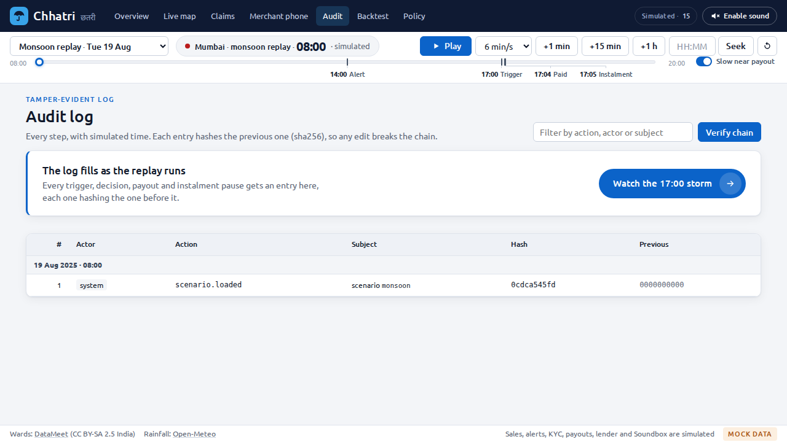

The whole log, newest at the top, grouped by simulated minute. "Verify chain" shows "Chain valid · N entries · head abc123…" or "Chain INVALID · first bad entry #n of N".

### 2.7 Backtest `/backtest` (C6)

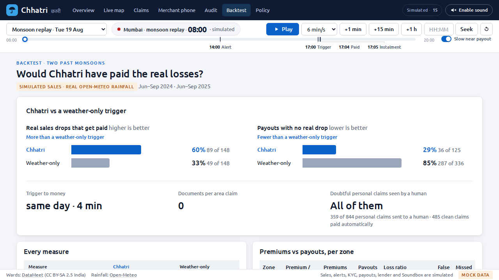

At the top, a comparison of Chhatri with a trigger that looks at weather alone, then every measure, then premiums against payouts per zone. It reads a committed report.

### 2.8 Policy `/policy` (C7)

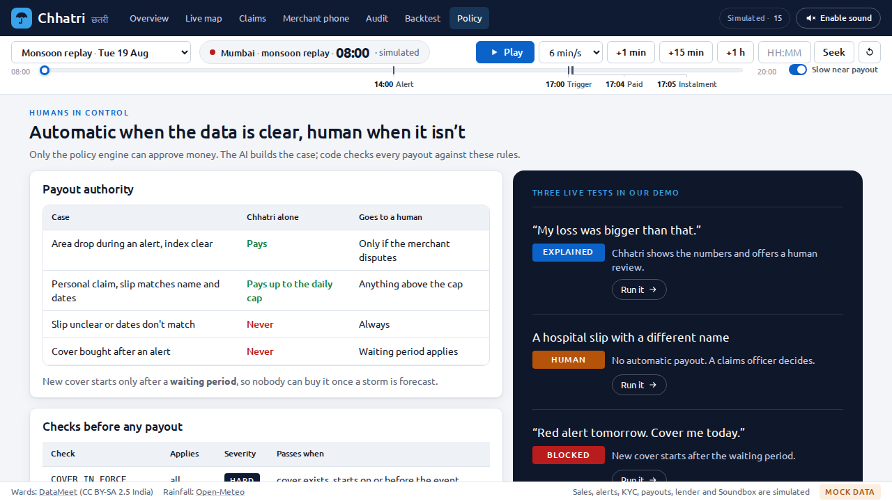

Nothing here can be edited. The payout authority table, the 14 checks with severity, the rules in plain words with units, and three live tests that launch the demo.

### 2.9 States on the console today

| State | What shows |
|---|---|
| Loading | `Loading`: a spinner and "Loading…" in a polite status. Live shows a veil over the map: "Loading the replay…" or "Moving the replay clock…" |
| Empty | Claims "No cases" and "Doubtful claims and disputes land here."; Audit "The log fills as the replay runs" with a launcher; Merchant "No payouts yet." |
| Error | `ErrorState` (title "Could not load this", the reason, "Try again") and `InlineError` (dismissible), both announced as alerts. The header chip reads "Integrations unavailable" if its call fails |
| Offline | `StaleNote` ("Showing the last data received · can't reach the server right now.") over the stale content, and the "Connecting…" or "Reconnecting…" pill |
| SIMULATED | Always on: the header chip, the footer line, the "Mock data" badge in mock mode, "SOUNDBOX · SIMULATED" on the device card |
| FALLBACK | BUILT behind `x6_provider_panel` (section 9.1) |

### 2.10 Review notes on the console

Findings from this pass, each with its fix and the wave that carries it. None is a blocker for W1.

| # | Finding | Fix | Wave |
|---|---|---|---|
| 1 | The hero line says Chhatri "pauses that day's loan instalment" (`overview/Hero.tsx`). [ADR 0006](../04-engineering/adr/0006-edi-holiday-is-the-lenders-decision.md) says the lender decides the holiday | Reword with the X4 lender wording (fs-03) | 1 with X4 |
| 2 | Text at 11 px, `--faint` used as a text colour in 9 declarations, green text on a green tint at 4.40:1, and raw pixel sizes that do not step up in presenter mode | Design system sections 2.2, 2.5 and 8.1 | 4 |
| 3 | The focus ring uses `--accent`, which is 2.77:1 on white | Use `--focus` (`--blue`) on light surfaces, keep `--accent` on navy | 4 |
| 4 | The legend text and the sparkline floor read a constant, not the rules | Read `area.index_floor_pct` from `GET /api/policy` (fs-08 section 13.2) | 4 |
| 5 | The ramp is red to amber to green. The labels carry the numbers, so colour does not work alone | Keep the labels. The design system now says so (section 7.1) | n/a |
| 6 | `--controls-h` is declared in `tokens.css` and used by no rule | Remove it or use it | 4 |
| 7 | The Live right panel is full. A block added to it pushes the Z9 note out of view in presenter mode | Section 9 places new blocks over the map | 4 |

---

## 3. Information architecture and placement

### 3.1 Console navigation (BUILT)

```text
Chhatri छतरी   Overview  Live map  Claims  Merchant phone  Audit  Backtest  Policy     [Simulated · 15] [Enable sound]
```

Seven pages, one header. The mini-app has no page of its own in the console: it is the third column of the Merchant phone page, and a standalone route for phones.

### 3.2 The merchant page at 1280×720 (BUILT, W1)

```text
+--------------------+--------------------+--------------------------+
| WhatsApp phone     | Mini-app frame     | Merchant panel           |
| 372 px (BUILT)     | 372 px (BUILT)     | one column of cards      |
|                    |  app bar           | (BUILT cards, stacked)   |
| thread, chips,     |  screen (scrolls)  |  Soundbox                |
| composer           |  next-step bar     |  Money                   |
|                    |  tab bar           |  What happened           |
|                    |                    |  Merchant file, notes    |
+--------------------+--------------------+--------------------------+
```

| Width | Layout |
|---|---|
| 1200 px and wider | Three columns as above. The page container allows 1280 px and the panel is one column |
| 900 to 1199 px | Phone and frame side by side, the panel below them |
| Below 900 px | One column: phone, frame, panel |
| `/merchant/:id/app` | The mini-app alone, centred, 430 px at most |

The frame reuses the `.phone` bezel (9 px border, 34 px radius), so the screen inside is 354 px wide. Its height is the column height (840 px at most) and the app scrolls inside it. The frame has a link "Open full screen" to the standalone route, which keeps `mock=1` and `lang`.

### 3.3 Inside the frame (BUILT, W1)

```text
+--------------------------------------+
| Chhatri                [A] SIMULATED |
| Demo date and time: 17:05            |
+--------------------------------------+
|                                      |
|   one screen, scrolls                |
|                                      |
+--------------------------------------+
| One sentence on the next step [ Go ] |
+--------------------------------------+
|   Home        Claims        Help     |
+--------------------------------------+
```

| Part | Content | Rule |
|---|---|---|
| App bar | The screen title (the `h1`), the replay clock as text, the language button (`globe`), one SIMULATED summary badge and, in the console frame, "Open full screen" | About 48 px. A back link replaces the title's left edge on screens below a tab |
| Screen | One scrolling column | 16 px side gutter, 12 px between cards |
| Next-step bar | One sentence and one button, from fs-04 section 12 | Hidden while loading or on error. No screen is a dead end. There is no offer kind |
| Tab bar | A `nav` with three links, `aria-current="page"` | About 56 px. Always visible. 44 px targets |

### 3.4 How the screens connect

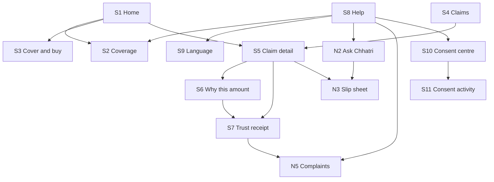

A tab owns its screens: Home owns S1 to S3, Claims owns S4 to S7, Help owns S8 and what it opens. The tab stays highlighted on a screen below it. A row appears in Help when its flag is on and is not drawn otherwise, so Help is never a list of disabled rows.

### 3.5 Routes and URL state

| Item | Rule |
|---|---|
| Routes | `/merchant/:id` (console, frame in the third column) and `/merchant/:id/app` (standalone, no console chrome, inside `LiveProvider`) |
| `screen` | `home` (default), `coverage`, `buy`, `claims`, `claim`, `why`, `receipt`, `help`, `settings`. Others: `ask`, `slip`, `grievances`, `consents`, `consent-activity`. An unknown value shows Home |
| `claim`, `decision` | `CL-000001` and `D-000001` style ids, validated before use |
| `lang` | `hi`, `en`, `mr` |
| `mock`, `presenter` | Existing console parameters, kept on every link the app builds |

All navigation is URL state, so Back works and a deep link opens the right screen. A flag that is off shows Home for its screen.

### 3.6 The six shared states (BUILT, W1)

Each screen root carries `data-state` with `loading`, `empty`, `error`, `offline` or `ready`. The visuals are the same everywhere.

| State | Component | Look | Words |
|---|---|---|---|
| Loading | `Skeleton` blocks at the final height | Grey pulse, still under reduced motion. `aria-busy="true"` | None. No spinner text |
| Empty | `EmptyState` card | 40 px icon, one sentence, the next step as a button | Copy deck `empty.*` |
| Error | `ErrorState` card | `circle-x` in the blocked tone, one sentence, "Try again", the code in small text | `error.generic`, `error.retry`, `error.code` |
| Offline | Banner under the app bar | `wifi-off`, the time of the data on screen. Network buttons are disabled and say why | `offline.banner`, `offline.blocked` |
| SIMULATED | `Badge`, mode variant | Icon and word SIMULATED. One in the app bar, one per source on the receipt | `sim.banner` and the `sim.*` lines |
| FALLBACK | `Badge`, mode variant, and one reason line | Orange. From X6 (W2) | `fb.banner`, `fb.reason.*` |

---

## 4. Merchant mini-app (N1, W1)

Layouts are for the 354 px screen. The states of each screen are those of fs-04 section 8, with the visuals of section 3.6. Components are from [design system section 5.2](design-system.md).

### 4.1 S1 Home (`screen=home`, tab Home)

**Purpose.** Am I covered, what is happening, what next, at a glance.

```text
+--------------------------------------+
| Chhatri                [A] SIMULATED |
| Demo date and time: 17:05            |
+--------------------------------------+
| Hello, Anil ji                       |
|                                      |
| ! Alert A-20250818-01 · SIMULATED    |
|   {valid_from} to {valid_to}         |
|   A weather alert is on for your     |
|   area. Chhatri is watching your     |
|   area's sales. You do not need to   |
|   do anything.                       |
|                                      |
| Your cover                  [Active] |
| Premium is paid through 22 Aug       |
| Your area                     Zone 7 |
| Used in the last 365 days:           |
|   ₹1,380 of ₹30,000                  |
|                                      |
| Expected sales today          ₹4,380 |
|                                      |
| Your latest claim             [Paid] |
| Area income loss · 19 Aug            |
| ₹1,380                             > |
|                                      |
| [ What am I covered for? ]           |
+--------------------------------------+
| Your payout of ₹1,380 was credited.  |
| See how it was worked out.           |
|                 [ Why this amount? ] |
+--------------------------------------+
|   Home        Claims        Help     |
+--------------------------------------+
```

- **Components.** AppBar, AlertBanner, CoverCard (Card, Badge), claim card, Button, NextBestActionBar, TabBar.
- **Notes.** The cover status is the catalogue sentence rendered by the backend (`COVER_STATUS_ACTIVE`, `COVER_STATUS_STARTS`, `COVER_STATUS_UNPAID`, and COVER_STATUS_NONE, proposed). The per-day price shows once fs-04 open question 3 is settled. The alert banner shows while an alert is in force and not otherwise. No offer of any kind appears while an alert is in force or a claim is open.
- **Next step.** Global list of fs-04 section 12: `see_dispute_case`, `see_referred_claim`, `send_slip`, `see_why`, `see_coverage_waiting`, `get_cover`, `see_premium`, `alert_notice`, `ask`, `see_coverage`.

| State | What shows |
|---|---|
| Loading | Skeleton for the greeting, the cover card (three lines) and two rows. The app bar and tab bar are already there |
| Empty | No cover: the card reads the no-cover sentence (`empty.cover`) and "Get cover" shows. No claims: the latest-claim slot is not drawn |
| Error | Cover or merchant call failed: error card with Retry. If just the claims call failed, the cover card still shows and the claim slot holds an inline error with Retry |
| Offline | Banner. The cover card keeps its data with "as of {time}" |
| SIMULATED | App bar badge. The alert banner carries its own SIMULATED badge, because the alert feed is simulated |
| FALLBACK | Not shown: Home uses no part that has a fallback |

### 4.2 S2 Coverage explainer (`screen=coverage`, tab Home)

**Purpose.** What am I covered for, in plain words, with clause chips and the jargon lens.

```text
+--------------------------------------+
| < Home      What am I covered for?   |
+--------------------------------------+
| Your cover in numbers                |
|   Payout share                  50%  |
|   Area daily cap             ₹2,500  |
|   Hospital cash a day        ₹1,500  |
|   Yearly limit              ₹30,000  |
|   Waiting period             7 days  |
|                                      |
| [v] Area income loss             C2  |
|     When heavy rain cuts sales ...   |
|     Example (simulated replay): ...  |
| [>] Hospital cash                C3  |
| [>] How much we pay           C4     |
| [>] When cover starts            C5  |
| [>] Premium and cash before cover C6 |
| [>] When a claim is not paid  C7 C8  |
| [>] Your loan instalment        C10  |
|                                      |
| You see your price when you tap      |
| Get cover.                           |
+--------------------------------------+
| See what Chhatri has done for you.   |
|                    [ See my claims ] |
+--------------------------------------+
|   Home        Claims        Help     |
+--------------------------------------+
```

- **Components.** Card, Accordion, Badge (clause chips), JargonTerm, Sheet (the jargon lens), Button.
- **Notes.** Every number is read from `GET /api/policy` and none is typed into copy. Underlined words open the jargon lens in a bottom sheet with the term in both languages, a plain-words line and an example. Opening this screen never creates a payment link. The sections are c2, c3, c4, c5, c6, c7 and c10 of fs-04 section 8.
- **Next step.** `get_cover_from_coverage`, `see_claims`, `home_from_coverage`.

| State | What shows |
|---|---|
| Loading | Skeleton for the numbers card and three accordion rows |
| Empty | Not applicable: the clauses are static copy |
| Error | The rules call failed: error card with Retry. Clauses without their numbers are not shown |
| Offline | Banner. The last numbers stay |
| SIMULATED | Examples say "Example from a simulated replay". The price line says it is a prototype price |
| FALLBACK | Not shown |

### 4.3 S3 Cover and buy (`screen=buy`, tab Home; consent block W3)

**Purpose.** Show the price and the start date, offer the payment link, and say plainly when a request is blocked.

```text
+--------------------------------------+
| < Home                     Get cover |
+--------------------------------------+
| New cover always starts 7 days       |
| after you ask.                       |
|                                      |
| Before you pay: Chhatri uses your    |
| sales data to decide claims ...      |
| Notice {version}                     |
| [x] I agree: use my sales data ...   |
|     Needed for cover                 |
| [x] I agree: take the next day's     |
|     premium ...    Needed for cover  |
| [ ] I agree: read my hospital slip   |
|     ...                     Optional |
|                                      |
| [ Check price and start date ]       |
|                                      |
| Blocked for now. Cover starts on     |
| 25 August.                         o |
| Cover starts               25 August |
| Premium a day                 ₹14.16 |
| First payment (30 days)      ₹424.80 |
| Prototype price. The real price is   |
| not decided yet.                     |
| Alert A-20250818-01 · SIMULATED      |
| Cover bought after an alert was      |
| issued does not pay for that alert.  |
| You can still buy cover for later.   |
|                                      |
| SIMULATED payment link. No real      |
| money moves.                         |
| https://paytm.me/sim-…               |
| [ Simulate payment ]                 |
+--------------------------------------+
| Pay the first payment to start your  |
| cover.          [ Simulate payment ] |
+--------------------------------------+
|   Home        Claims        Help     |
+--------------------------------------+
```

- **Components.** Card, Checkbox (the consent block, W3), Button, Badge, Skeleton, Toast.
- **Notes.** The quote and the link are one call (`POST /api/premium/link`), so "Check price and start date" is the action that creates a link, no other control does, and it stays disabled until the two required boxes are ticked (W3). The text above the boxes is the versioned `notice` line of the notice module (copy deck section 14.1), with the version in small type, and the call carries the version the merchant saw. The result is OK or BLOCKED and the word "Approved" never appears. With the Paytm component SIMULATED the button reads "Simulate payment" (`buy.simulate`) and no URL opens. With it LIVE the button reads "Pay with Paytm" (`buy.pay`). A merchant who already has cover sees a status card and no buy button.
- **What the sketch shows.** The screen after the quote, with the two required boxes ticked. Before the quote the result block and the link are absent. While a required box is unticked the bar reads `nba.tick_consent` ("Tick the boxes marked Needed for cover to go on.", button "Go to the boxes") and the line `hint` under the boxes says the same. After the boxes and before the quote the bar reads `nba.check_price` and its button focuses "Check price and start date". After the quote the bar reads `nba.pay`, and its button carries the same label as the body button, `buy.simulate` or `buy.pay`, so the two never disagree.
- **The result card** draws the outcome sentence (`buy.outcome.ok` or `buy.outcome.blocked`), then the three rows `buy.row.starts`, `buy.row.per_day` and `buy.row.first_payment` so the figures line up, then `explain.price.prototype` beside the price while prices come from simulated sales, the alert as a badge when one blocks the quote, and `buy.blocked_note`.
- **Next step.** `tick_consent`, `check_price`, `pay`, `home_after_paid`, `home_when_covered`.

| State | What shows |
|---|---|
| Loading | Skeleton intro. The check button shows a busy state during the quote |
| Empty | Not applicable |
| Error | No link in the reply: `COVER_LINK_UNAVAILABLE` and Retry. A failed quote: the generic error with Retry. A stale notice (W3): `error.stale`, "The notice changed. Please read it again." |
| Offline | Check and Pay are disabled with `offline.blocked` |
| SIMULATED | The link block carries `buy.link.simulated` and a SIMULATED badge, and `explain.price.prototype` sits beside the price |
| FALLBACK | If the `paytm` component is forced to fallback (X6): a FALLBACK badge and the reason. The link stays simulated |

### 4.4 S4 Claims (`screen=claims`, tab Claims)

**Purpose.** One list of everything Chhatri is doing or has done for the merchant's money.

```text
+--------------------------------------+
| Your claims                          |
+--------------------------------------+
| Area income loss             [Paid]  |
| 19 Aug · ₹1,380                      |
| Credited with today's settlement     |
|                                   >  |
+--------------------------------------+
| Question about a payout     [Open]   |
| Case C-2291 · answer due in 24 h     |
|                                   >  |
+--------------------------------------+
| Open your latest claim to see each   |
| step.      [ Open the latest claim ] |
+--------------------------------------+
|   Home        Claims        Help     |
+--------------------------------------+
```

- **Components.** Card, Badge (claim pill), Skeleton.
- **Notes.** Newest at the top. A card names its kind (area income loss, hospital cash, or a question about a payout), the date, a status pill (design system section 11.2), the amount once decided and one line on what happens next. A question about a payout is its own card and names the claim it is about. An area claim with outcome REFERRED is not drawn: it is a contract error.
- **Next step.** `open_latest`, `see_coverage_empty`.

| State | What shows |
|---|---|
| Loading | Three card skeletons |
| Empty | `empty.claims` and the next step "See what is covered" |
| Error | Error card with Retry. A data error shows the code `contract_violation` |
| Offline | Banner. The last list stays |
| SIMULATED | App bar badge |
| FALLBACK | Not shown |

### 4.5 S5 Claim detail (`screen=claim&claim=CL-000001`, tab Claims)

**Purpose.** Where one claim is, in five steps, with a plain reason at each step.

```text
+--------------------------------------+
| < Claims                             |
| Area income loss · 19 Aug    [Paid]  |
| ₹1,380                               |
+--------------------------------------+
| o Detected                     17:00 |
|   Your area's sales fell 63% during  |
|   the alert.                         |
| o Checked                      17:00 |
| o Decided: Approved ₹1,380     17:00 |
| o Paid                         17:04 |
|   Credited with today's settlement   |
|   Payout rail SIMULATED              |
| o Instalment holiday (EDI)     17:05 |
|   We asked your lender.              |
|   The lender decides.   · SIMULATED  |
|                                      |
| [ See receipt ]   [ This is wrong ]  |
+--------------------------------------+
| Your payout of ₹1,380 was credited.  |
| See how it was worked out.           |
|                 [ Why this amount? ] |
+--------------------------------------+
|   Home        Claims        Help     |
+--------------------------------------+
```

- **Components.** Stepper (an `ol`, `aria-current="step"` on the current step), Card, Badge, Button, Toast, Sheet (a slip sheet entry for a personal claim that waits for its slip).
- **The five steps** are Detected, Checked, Decided, Paid and the instalment holiday. A step has a state, a simulated time, a one-line reason and, for Paid and the holiday, a SIMULATED label for the payout rail and the lender.

| Step state | Icon | Tone | Word | Rule |
|---|---|---|---|---|
| Completed | `circle-check` | Paid | `tracker.state.done` | Time shown |
| Current, a system is working | `loader-circle`, turning once a second | Decided | `tracker.state.now` | A text label such as `TRACK_PAID_PENDING` ("{amount} is on its way, with the next settlement.") is always there |
| Current, a person is working | `user-round` | Referred | `claim.status.referred` | "With a claims officer", the case chip and the 24 h clock |
| Pending | `circle-dashed` | Neutral | `tracker.state.waiting` | Greyed text |
| Skipped | `circle-minus` | Neutral | `tracker.state.na` | A reason such as `TRACK_EDI_NONE` ("No loan on file") |
| Stopped | `circle-x` | Blocked | `tracker.state.stopped` | On the Decided step of a declined claim, with the reason. The steps after it are skipped |

- **Referred and question cases.** A case chip reads `CASE_CHIP` ("Sent to a claims officer · case C-2291", English in every language, because the catalogue has no Hindi line) with the clock. A question about a payout shows the unchanged amount and, once closed, the officer's note. It never offers a new amount.
- **Buttons.** The body holds `tracker.btn.receipt` and `tracker.btn.wrong`. fs-04 also lists `tracker.btn.why` in the body, and the next-step bar already holds that link (`see_why`, button `nba.see_why.btn`), so it is drawn once (open question 9).
- **"This is wrong"** shows on a paid claim with no open question. In W1 it sends the dispute phrase through the chat route and shows `DISPUTE_ACK` in a toast. From W3 it opens the complaint form (N5).
- **The lender.** The step never says Chhatri paused the instalment. A refusal reads as "not available" with no reason code in fs-04. The copy deck also keeps a plain-words reason line (`TRACK_EDI_REFUSED_WHY`) that it shows if its open question 9 is settled that way.
- **Words.** Step names, states and reasons are the keys `tracker.step.*`, `tracker.state.*` and the `TRACK_*` lines of the copy deck (section 3), which are catalogue lines in the code. The copy deck says the holiday step is shown for a merchant with a loan and not otherwise. fs-04 shows it as skipped with "No loan on file". The layout works with either (open question 1).
- **Next step.** `wait_for_officer`, `see_why`, `back_to_claims`.

| State | What shows |
|---|---|
| Loading | Skeleton with five step rows |
| Empty | Not applicable. An unknown claim id shows `error.not_found` with a link back to Claims |
| Error | Error card with Retry |
| Offline | Banner. "This is wrong" is disabled with a reason |
| SIMULATED | The Paid step says "payout rail SIMULATED". The holiday step says "lender SIMULATED" |
| FALLBACK | Not shown |

---

### 4.6 S6 Why this amount (`screen=why&decision=D-000001`, tab Claims)

**Purpose.** The engine's own explanation of one decision: the formula, each number with its source, and what would have changed the result.

```text
+--------------------------------------+
| < Claim             Why this amount? |
+--------------------------------------+
| Why did I get this amount?           |
|                                      |
| How it was worked out                |
|   ½ × ₹4,380 × 63% = ₹1,380          |
|   (the Hindi formula, smaller)       |
|                                      |
| Your numbers                         |
| Your usual Tuesday            ₹4,380 |
|   (Your usual day · SIMULATED)       |
| Area drop                        63% |
|   (Area sales index · SIMULATED)     |
| Chhatri's share                  50% |
|   (Chhatri rules pilot-0.1) (C4)     |
| Daily limit, rain             ₹2,500 |
|   (Chhatri rules pilot-0.1) (C4)     |
| Result                        ₹1,380 |
|                                      |
| What would have changed this         |
|   One more point of area drop would  |
|   have added about {delta}.          |
|   This explains this one decision. A |
|  future event is decided by the same |
|   checks when it happens.            |
|                                      |
| [ This is wrong ]                    |
+--------------------------------------+
| Keep a receipt of this decision.     |
|                  [ See the receipt ] |
+--------------------------------------+
|   Home        Claims        Help     |
+--------------------------------------+
```

- **Components.** AppBar, FormulaBlock, Card, SourceBadge, JargonTerm, CounterfactualCard, Button, NextBestActionBar.
- **Formula.** Both formulas come from the decision (`formula_en`, `formula_hi`). The selected language is large and the other small, each in its own `lang` element. The app never recomputes: a unit test checks that each fixture's formula reproduces its amount (½ × ₹4,380 × 63% is ₹1,379.70, shown as ₹1,380).
- **Numbers.** Rows are the usual day, the area drop (or the silent days for a hospital claim), the share, the daily limit and the result. Each row carries source badges from the receipt (`src.FORECAST`, `src.SALES_INDEX`, `src.RULES`, `src.CLAUSE`). Tapping a badge opens a bottom sheet with the record, the time and the type of source (`chip.field.*`). A value with no source is not drawn: the row reads `badge.source_missing` and the test run fails.
- **Terms.** "usual day", "area drop", "share" and "daily limit" are underlined and open the jargon lens (`expected_day`, `area_drop`, `payout_share`, `daily_cap`).
- **Counterfactual.** The sentences are the ones the receipt endpoint returns (copy deck section 6), shown exactly as received, with `CF_FOOTER` under them so they do not read as a promise. No language model writes them. The card is not drawn when the receipt carries none.
- **A REFERRED decision** has no amount. The screen replaces the formula and the numbers with `why.no_amount`, then the failing check in plain words (the matching `TRACK_REFERRED_*` line), then the counterfactual. A DECLINED decision shows the `REASON_*` line of the HARD check that failed, then the counterfactual.
- **Buttons.** fs-04 lists "See receipt" and "This is wrong" in the body. The next-step bar already holds the receipt link (`see_receipt`), so the body keeps one button, `tracker.btn.wrong`. If the owner prefers both, the body button is a second link to S7.
- **Next step.** `see_receipt`.

| State | What shows |
|---|---|
| Loading | Skeleton: a formula bar and three rows |
| Empty | A REFERRED decision: `why.no_amount` and the reason a person is checking. A claim with no decision cannot reach this screen |
| Error | An unknown decision id shows `error.not_found` with a link to Claims. Anything else shows the generic error with Retry |
| Offline | Banner. The last data stays. Source sheets still open from memory |
| SIMULATED | Every source badge carries its own origin word. The app bar badge sums them up |
| FALLBACK | Not shown: the explanation is written by the engine, not by an AI provider |

### 4.7 S7 Trust receipt (`screen=receipt&decision=D-000001`, tab Claims)

**Purpose.** A document the merchant can keep, print or show to a bank or an officer. It is a receipt once the payout is credited, and the same screen is a decision record before that.

```text
+--------------------------------------+
| < Claim         Your payout receipt  |
+--------------------------------------+
| o SIMULATED receipt. The data and the|
|   payout are not real.               |
|                                      |
| Decision           D-000001 Approved |
| Rules version              pilot-0.1 |
| Decided                19 Aug, 17:00 |
| Decided by                           |
|   An automatic rules check (code,    |
|   not AI)                            |
|                                      |
| How it was worked out                |
|   ½ × ₹4,380 × 63% = ₹1,380          |
|                                      |
| Where each number came from          |
|   (Your usual day · SIMULATED)       |
|   (Area sales index · SIMULATED)     |
|   (Chhatri rules pilot-0.1) (C4)     |
|                                      |
| Checks                  [>] {n} rows |
|   All {passed} checks passed.        |
|                                      |
| What would have changed this         |
|   One more point of area drop would  |
|   have added about {delta}.          |
|                                      |
| Policy clauses used        (C2) (C4) |
| Credited                19 Aug 17:04 |
|   Payout rail SIMULATED              |
| Audit entry (first 12 characters)    |
|   {hash12}      [ Check the log ]    |
|                                      |
| If you disagree                      |
|   1 Our claims officer     24 hours  |
|   2 The insurer's grievance officer  |
|   3 IRDAI Bima Bharosa portal        |
|   4 Insurance Ombudsman              |
|                                      |
| [ Print or save as PDF ]             |
| This receipt explains one decision.  |
| It is not a policy document.         |
+--------------------------------------+
| Do you disagree? Tell us.            |
|                    [ This is wrong ] |
+--------------------------------------+
|   Home        Claims        Help     |
+--------------------------------------+
```

- **Components.** AppBar, ReceiptDocument (a `card` with a `dl`), FormulaBlock, SourceBadge, Accordion (the checks), CounterfactualCard, ClauseChip (a `badge` variant), Button, Sheet, NextBestActionBar.
- **Rows and keys.** Every row label is a copy deck key: `receipt.row.decision`, `receipt.row.rules`, `receipt.row.decided_at`, `receipt.row.decided_by` (with `receipt.by.engine` or `receipt.by.officer`), `receipt.row.formula`, `receipt.row.sources`, `receipt.row.checks`, `receipt.row.what_changes`, `receipt.row.clauses`, `receipt.row.paid_at` or `receipt.row.pending`, `receipt.row.audit`, `receipt.row.disagree`, `receipt.row.payout` and, for a merchant with a loan, `receipt.row.lender`. The lender row carries the SIMULATED token and the `HOLIDAY_*` line the lender's answer produced.
- **Checks.** Collapsed to the line `TRACK_CHECKED_OK` when every check passed. Opened by default when a check failed, was unsure or was waived. One row per check: the `CHK_*` label, the result word (`chk.status.*`), HARD or SOFT, and the engine's `observed` and `required` text in English. A failed HARD check shows its `REASON_*` line, and a SOFT check shows its `TRACK_REFERRED_*` line.
- **Audit entry.** The opening 12 characters of the entry's hash, as a display choice (copy deck `receipt.row.audit`). "Check the log" (`receipt.check_log`) calls `GET /api/audit/verify` and shows `receipt.log.ok` or `receipt.log.broken`. A broken result is never hidden.
- **If you disagree.** The insurer ladder as four rows. Step 1 shows its 24-hour clock from `dispute_sla_hours`. Until N5 ships the other three show their names and no clock, with `grv.clock.confirm.insurer`. From W3 each row opens the matching step of the complaints screen (section 7.1).
- **Print.** `receipt.btn.print` calls `window.print()`. In print media the tab bar, the next-step bar and every button are hidden, the page header reads `receipt.print.header`, blocks do not split across pages, and `receipt.simulated` prints while any source is SIMULATED, which is always in the demo. No PDF library and no server work.
- **After an erase (W3).** The three slip checks read "erased" and the line `receipt.erased` appears, so the receipt never claims more than the erase did.
- **Next step.** `disagree` ("Do you disagree? Tell us."), which focuses the dispute button on S5.

| State | What shows |
|---|---|
| Loading | Skeleton of a document: header rows, a formula bar and four lines |
| Empty | The decision has no credited payout yet (credit pending, REFERRED or DECLINED). The title reads `receipt.title.record`, `empty.receipt` is the top line, and the payout row reads `receipt.row.pending` or is left out. The rest of the record is shown |
| Error | Not found shows `error.not_found` with a link to Claims. Anything else shows the generic error with Retry |
| Offline | Banner. Printing still works. "Check the log" is disabled with `offline.blocked` |
| SIMULATED | A badge for each source, the SIMULATED line at the top and in print, "payout rail SIMULATED" and "lender SIMULATED" on their rows |
| FALLBACK | A SLIP source badge on a hospital-cash receipt shows FALLBACK when a backup reader read the slip (W2). An area receipt has no such badge |

### 4.8 S8 Help (`screen=help`, tab Help)

**Purpose.** One place for everything that is not a claim.

```text
+--------------------------------------+
| Help                                 |
+--------------------------------------+
| What am I covered for?             > |
| Ask Chhatri               (W2)     > |
| Complaints and escalation  (W3)    > |
| My data and consent       (W3)     > |
| Language                           > |
|                                      |
| About this prototype                 |
|   Prototype. Anil Jadhav and every   |
|   merchant here are synthetic.       |
|   Anything marked SIMULATED is not   |
|   real: sales, alerts, KYC, payouts, |
|   lender, Soundbox, WhatsApp and the |
|   Paytm link.                        |
|   o LIVE  o SIMULATED  o FALLBACK    |
|   (what each word means)             |
+--------------------------------------+
| Have a question? Ask Chhatri.        |
|                    [ Ask Chhatri ]   |
+--------------------------------------+
|   Home        Claims        Help     |
+--------------------------------------+
```

- **Components.** AppBar, Card (a list of link rows, 44 px high at least), Badge (mode legend), Button, NextBestActionBar.
- **Rows.** Coverage and Language are always there. "Ask Chhatri" appears with `n2_ask_chhatri`, "Complaints and escalation" with `n5_grievances`, "My data and consent" with `n6_consents`. A row whose flag is off is not drawn, so Help is never a list of disabled rows. Row labels are `explain.title`, `ask.title`, `grv.title`, `consent.title` and `lang.label`.
- **About.** `help.about.title` and `help.about.text`. Under it a three-word legend with the hints `origin.LIVE.hint`, `origin.SIMULATED.hint` and `mode.FALLBACK.hint`, so a judge who sees a badge can read what it means without leaving the app. The legend is BUILT (`miniapp/screens/Help.tsx`) and uses copy that exists.
- **Next step.** The global list of fs-04 section 12. With `n2_ask_chhatri` on and nothing more urgent, it is `ask`.

| State | What shows |
|---|---|
| Loading | Row skeletons while the flags or the cover call are pending |
| Empty | Never empty: Coverage, Language and About always show |
| Error | Not applicable: the screen is static. A row that makes a call shows its own error |
| Offline | Banner. Rows that need the network are disabled with `offline.blocked` |
| SIMULATED | The About card explains the badges |
| FALLBACK | The Ask row carries a FALLBACK badge and the line `fb.ask` while its provider is in FALLBACK (W2) |

### 4.9 S9 Language (`screen=settings`, tab Help, also the globe in the app bar)

**Purpose.** Switch the mini-app language. The console stays English.

```text
+--------------------------------------+
| < Help                      Language |
+--------------------------------------+
| Language                             |
| (o) हिंदी                            |
| ( ) English                          |
| ( ) मराठी                       (W4) |
|                                      |
| Some text is shown in Hindi.         |
|   (while Marathi is chosen)          |
+--------------------------------------+
| Language saved.     [ Back to Home ] |
+--------------------------------------+
|   Home        Claims        Help     |
+--------------------------------------+
```

- **Components.** AppBar, LanguageList (a `fieldset` of radios), Button, NextBestActionBar.
- **Rules.** Each language is named in its own script (`lang.hi`, `lang.en`, `lang.mr`) with its own `lang` attribute. Choosing one changes the root `lang`, adds `lang=` to the URL and stores the choice under `chhatri.miniapp.lang`, in try and catch because storage can be blocked. The choice order is the URL, then storage, then the merchant's language, then Hindi. Marathi appears with `n8_marathi` on, after native review (W4), and not otherwise. While a key has no Marathi text the screen shows `lang.fallback_note`, and the fallback text carries `lang="hi"`.
- **A preview line** shows the cover status sentence in the chosen language, so the change is visible before leaving.
- **Next step.** `home_after_language`.

| State | What shows |
|---|---|
| Loading | Not applicable: the screen is static |
| Empty | Not applicable |
| Error | If storage is blocked, the choice still applies for the session and no error is shown |
| Offline | Works offline |
| SIMULATED | Not applicable |
| FALLBACK | The `lang.fallback_note` line, while Marathi falls back to Hindi |

---

## 5. Ask Chhatri and voice (N2, N4, W2)

Ask Chhatri explains. The rules decide every payout, not the assistant. The screen is `screen=ask` in the Help tab, behind `n2_ask_chhatri`, and voice is behind `n4_voice`. Everything here is BUILT behind those flags (`miniapp/screens/Ask*.tsx`, `miniapp/components/voice*.ts*`), on top of the recorder (`components/phone/useRecorder.ts`, 30 seconds) and the playback.

### 5.1 The screen

```text
+--------------------------------------+
| < Help                   Ask Chhatri |
+--------------------------------------+
| You can ask about your cover, your   |
| claims and your payouts.             |
| Chhatri explains. The rules decide   |
| every payout, not this assistant.    |
|                                      |
| You can ask                          |
| ( Why did I get this amount? )       |
| ( What is covered? )                 |
| ( When does my cover start? )        |
| ( How do I question a payout? )      |
|                                      |
+--------------------------------------+
| [ Ask about your cover, a claim ... ]|
| [ mic ]                     [ Send ] |
+--------------------------------------+
|   Home        Claims        Help     |
+--------------------------------------+
```

- **Empty state.** `ask.scope` and `ask.rules_decide`, then `ask.suggest.title` and up to four chips in this order, skipping those that do not apply: `ask.suggest.why` (a decision exists), `ask.suggest.bigger` (a paid decision exists), `ask.suggest.covered`, `ask.suggest.starts`, `ask.suggest.waiting`, `ask.suggest.question`, `ask.suggest.instalment` (the merchant has a loan). Four at a time is a design target. Tapping a chip sends its text.
- **Composer.** A text area with `ask.placeholder` (16 px text, so iOS does not zoom), a counter near the 500-character limit and `ASK_TOO_LONG` past it, a mic button (`voice.btn.speak`, section 5.4) and `ask.btn.send`. The composer takes the place of the next-step bar on this screen. fs-04 AC-36 lists S1 to S9 for the bar and Ask is not one of them. The next step of each answer is the button inside its card.
- **The thread** lives in the screen's state. It is not stored and it is cleared when the scenario reloads.

### 5.2 An answer

```text
+--------------------------------------+
| < Help                   Ask Chhatri |
+--------------------------------------+
|    Why did I get this amount?  (you) |
|                                      |
| Your usual Tuesday: ₹4,380. Your area|
| fell 63%. Chhatri pays half the lost |
| sales.                               |
|                                      |
| From the policy: (C4.1) (C2)         |
| Based on                             |
|   (Your usual day · SIMULATED)       |
|   (Area sales index · SIMULATED)     |
|                                      |
| [ See my claim ]          [ Listen ] |
| o LIVE · rules             Details > |
+--------------------------------------+
| [ Ask about your cover, a claim ... ]|
| [ mic ]                     [ Send ] |
+--------------------------------------+
|   Home        Claims        Help     |
+--------------------------------------+
```

- **Components.** AnswerCard (a `card`), ClauseChip, SourceBadge, ModeBadge, Button, Sheet (details), AskComposer, VoiceButton.
- **Parts.** The answer text. `ask.cites.policy` with clause chips (`clause.C*` titles open the clause sheet). `ask.based_on` with the source chips of the facts used. One next-action button from the closed list (`next_action.*`, chosen by the backend, never by the model). `voice.btn.listen`. A footer with the mode word and the provider.
- **Details.** `ask.details` opens a sheet with `ask.details.provider`, `ask.details.model`, `ask.details.time` and, on a FALLBACK or SIMULATED answer, `ask.details.reason` with one `fb.reason.*` line. The merchant never sees a confidence number.
- **Modes.** The footer word follows the answer. LIVE: the rules answered a known intent, a live model answered, or a template was used because the model correctly declined. FALLBACK: a backup stepped in, with one reason line. SIMULATED: no live path is configured here. In the static demo the answer is a recorded sample and says so (`fb.reason.MOCK_BACKEND`).
- **When the guard blocks.** Model text passes the guard before it is shown. The guard blocks numbers that are not engine facts, promise words, links and phone numbers. When it blocks, the screen shows the fixed line `FALLBACK_HELP` with the FALLBACK footer and the reason `fb.reason.GUARD_BLOCKED`.

### 5.3 Hand-off and scam warning

```text
+--------------------------------------+
| ! Be careful. This looks like a scam.|
|   Careful: Chhatri does not ask for  |
|  your OTP, PIN or password in a chat |
|  or on a call, and charges no fee to |
|   pay a claim. If a message asks for |
|   these, or asks you to install an   |
|   app, do not reply.                 |
|   Do not tap its link. ...           |
|   This is a quick check of the words |
|  in the message. It can be wrong. If |
|   you are unsure, do not act on it.  |
|                                      |
| [ Ask another question ]             |
+--------------------------------------+
```

- **Scam warning.** A banner above the normal answer: `scam.title`, `ASK_SCAM_WARNING`, `scam.do`, `scam.report` (hidden until the helpline number and the portal address are set in configuration and checked against the official source) and `scam.note`. It uses `role="alert"`, the blocked tone and a `triangle-alert` icon. The check never blocks the question. The next action is `next_action.ASK_AGAIN`.
- **Hand-off.** When the model declines or the question is out of scope, the answer is `ASK_HANDOFF` and the button is `next_action.TALK_TO_TEAM`. Until N5 ships it opens the dispute button on S5 (when the merchant has a paid decision) or is replaced by `next_action.ASK_AGAIN`. With N5 on it opens the complaint form with a suggested topic that the merchant confirms.

| State | What shows |
|---|---|
| Loading | Skeleton chips while the claims call decides which chips apply. A question in flight is the thinking state below, not this one |
| Thinking | A spinner with `ask.thinking`, a Cancel button (`ask.btn.cancel`) and, after 2 seconds, `ask.elapsed`. This is the one place a spinner has text, because the wait is for an answer, not for the screen |
| Empty | `ask.scope`, `ask.rules_decide` and the chips |
| Error | A request that fails for a reason other than the network shows `error.generic` with Retry and the code, and the typed text stays in the box |
| Offline | `ASK_OFFLINE` and a retry button. The typed text is kept. The mic is disabled with `offline.blocked` |
| SIMULATED | Every answer footer says SIMULATED. In the static demo, a "recorded sample" line. `voice.sim.note` shows while speech to text is simulated |
| FALLBACK | The top line `fb.ask` while the provider is in FALLBACK, and the FALLBACK footer with its reason on each answer from a backup |

### 5.4 Voice (N4)

Voice never sends on its own. The transcript fills the text box, the merchant confirms each amount and date, and Send works once that is done. A WhatsApp voice note in the phone simulator is answered at once, as today, and is not part of this flow.

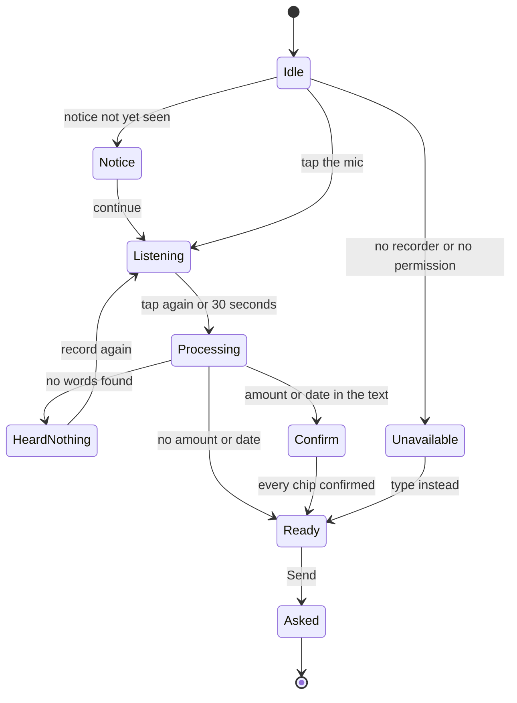

| Voice state | What shows | Keys |
|---|---|---|
| Idle | The mic button and the text box | `voice.state.idle` |
| Notice | A notice above the box, shown until the merchant has seen it once. A courtesy for the demo, not a consent flow | `ASK_VOICE_NOTICE` |
| Listening | A timer, "{seconds} of {max_seconds}", and a stop button. It stops itself at the built 30-second limit | `voice.state.listening`, `voice.btn.stop` |
| Processing | A spinner with a Cancel button | `voice.state.processing` |
| Heard nothing | The built line and a record-again button | `VOICE_UNCLEAR` (BUILT) |
| Confirm | The transcript in an editable box and one chip for each amount or date | `voice.transcript.label`, `voice.confirm.intro`, `ASK_MENTION_CHIP`, `voice.chip.right`, `voice.chip.change`, `voice.send.hint` |
| Speaking | Playing the answer, tap to stop. The answer text is always on screen | `voice.state.speaking`, `voice.btn.listen` |
| Error | Permission denied or no recorder, with the way out (type, or allow the mic) | `voice.err.denied`, `voice.err.unsupported`, `voice.err.fix`, `voice.err.too_long` |
| Not available | The mic is hidden, the text box and the chips stay | `voice.state.fallback` |

```text
+--------------------------------------+
| What we heard. You can change it.    |
| [ {transcript, editable}           ] |
| Check each amount and date.          |
| Then send.                           |
| ₹1,500 — is that right?              |
|        [ Right ]   [ Change ]        |
| 19 August — is that right?           |
|        [ Right ]   [ Change ]        |
| Confirm each amount and date to send.|
| [ mic ]               [ Send ] (off) |
+--------------------------------------+
```

- **Chips.** One for each amount and each date in the final text. A chip has Right and Change (`voice.chip.right`, `voice.chip.change`). After Right it shows a check icon and `voice.chip.confirmed`. The Hindi word कल means both yesterday and tomorrow, so that chip asks which one (`voice.chip.kal.ask`), and the server never guesses. Words the parser cannot turn into a value are not guessed either: the chip shows `ASK_MENTION_WORDS` and the merchant types the number. Editing the text to add an amount creates a new chip.
- **Send** stays disabled until every chip is confirmed, with `voice.send.hint` beside it. The server also refuses an unconfirmed voice question with 409.
- **Providers and labels.** Speech to text goes to Sarvam, then to the browser's recognition, then to the text box. Text to speech goes to Sarvam for demo merchants, then to the browser voice, then to text on screen. The mode of each step is labelled as in section 5.2. The mic and the speaker each show the mode word while it is not LIVE. Browser recognition is not built; the browser voice is used for speaking and not for listening.
- **Limits.** Audio of 30 seconds and 5 MB at most. The built aria labels on the recorder are in English alone (`Record a voice note`, `Stop and send voice note`), so the mini-app version carries the three languages (`voice.btn.speak`, `voice.btn.stop`).

---

## 6. Slip pre-check sheet and slip problems (N3, W2)

The photo is read, and the merchant confirms what was read before any check runs (H5). The pre-check never compares the name with the KYC name, never shows a confidence number, and never lets the merchant edit a field. If the read is wrong, the way out is another photo. Text printed on the slip is data, never an instruction. The sheet sits behind `n3_slip_precheck`. Everything here is BUILT behind that flag (`miniapp/screens/SlipPrecheck*.tsx`). With the flag off the chat path stays: a photo sent after the check-in is read and filed as today.

### 6.1 Where it opens

| Entry | When |
|---|---|
| Next-step bar of Home and Help | `send_slip`: a personal claim waits for the slip and the flag is on |
| Claim detail (S5) | The step "Waiting for your slip" holds the button `nba.send_slip.btn` |
| Ask Chhatri | The next action `next_action.SEND_SLIP` after a hospital check-in |

The sheet is a bottom sheet inside the frame, as tall as the screen under the app bar. With the flag off the sheet and its entries do not exist.

### 6.2 The sheet, state by state

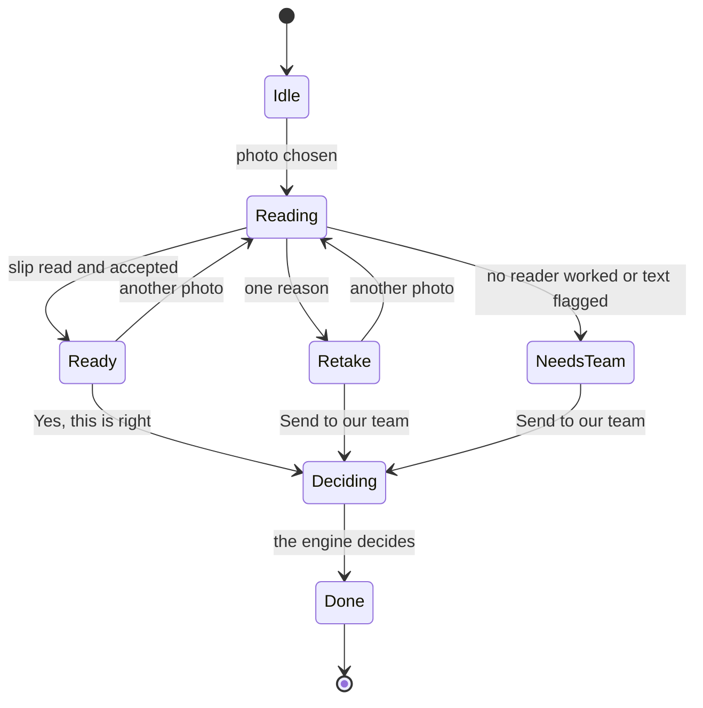

```text
+--------------------------------------+
| Send your hospital slip          [x] |
+--------------------------------------+
| Take one photo of the admission slip,|
| the discharge paper or the bill. Use |
| good light and keep the whole page in|
| view.                                |
|                                      |
| [ Take a photo ]                     |
| [ Choose from the gallery ]          |
|                                      |
| o The photo may be sent to an AI     |
|   reading service (Gemini or Sarvam) |
|   to be read. Please send a sample   |
|   slip, not a real one.              |
| o SIMULATED slip reading. A fixed    |
|   result is used for the demo slips. |
+--------------------------------------+
```

- **Idle.** `SLIP_SHEET_TITLE`, `SLIP_SHEET_HELP`, two buttons and the notice `SLIP_NOTICE`, shown on initial use. The buttons "Take a photo" and "Choose from the gallery" are proposed (the copy deck has no key for them yet). Both work through one native file input (`accept="image/*"`, with `capture="environment"` on "Take a photo"). With no key set the read is SIMULATED, and `sim.slip` says so.
- **Reading.** `SLIP_READING` with a Cancel button. Nothing is sent until a photo is chosen, and the chosen file stays in memory so a retry needs no second pick.
- **Consent (W3).** With `n6_consents` on and no active slip consent, the sheet shows the box `box.slip` unticked above the buttons. The buttons stay disabled until it is ticked, and the server answers 409 `consent_required` otherwise (fs-07 section 9.3).
- **Footer.** The mode word (LIVE, FALLBACK or SIMULATED) and "Details" with the provider, the model and the reason. The footer shows no percentage and no confidence number. A component test scans the sheet for digits other than dates.
- **Photo limit.** At most three photos for one check-in, as proposed in fs-02. A third photo that is not ready turns into `SLIP_PHOTO_LIMIT`.

```text
+--------------------------------------+
| Send your hospital slip          [x] |
+--------------------------------------+
| We have read your slip. Please check |
| it. Is this right?                   |
|                                      |
| Patient               {name as read} |
| Admitted                  {admitted} |
| Discharged           Not on the slip |
| Hospital                  {hospital} |
|                                      |
| o The photo could be read            |
| o The name is on the slip            |
| o The admission date is on the slip  |
|                                      |
| There is no discharge date on the    |
| slip. If you are still in hospital,  |
| that is normal.                      |
|                                      |
| [ Yes, this is right ]               |
| [ Send another photo ]               |
|                                      |
| o SIMULATED                Details > |
+--------------------------------------+
```

- **Ready.** `SLIP_PRECHECK_SHOW`, the four fields (`SLIP_FIELD_NAME`, `SLIP_FIELD_ADMITTED`, `SLIP_FIELD_DISCHARGED`, `SLIP_FIELD_HOSPITAL`) as plain text, three checklist lines (`SLIP_CHECK_*_PASS`, or `*_WARN` with the `triangle-alert` icon and the words "not clear"), the notes (`SLIP_NOTE_NO_DISCHARGE`, `SLIP_NOTE_NAME_NOT_LATIN`) and the buttons `SLIP_ACTION_CONFIRM` and `SLIP_ACTION_RETAKE`. An empty optional field reads `SLIP_FIELD_NOT_ON_SLIP`. The checklist says whether the slip shows what a check needs. The match with the KYC name is the engine's decision and is not shown early.
- **Deciding.** A spinner after the merchant confirms. The decision time is the minute of confirmation.
- **Done.** The sheet closes on the claim detail (S5). The messages appear in the WhatsApp phone as usual.

### 6.3 Slip problems

Each problem is a screen inside the sheet with one plain sentence, what the reader could see in muted text, and two buttons. None is a dead end, and none says "failed".

| Problem | How it is found | The sheet says | Buttons | Photo used |
|---|---|---|---|---|
| Blurry, cropped or glare | Nothing readable, or confidence below the minimum (`LOW_CONFIDENCE`) | `SLIP_RETAKE_CLEAR` | `SLIP_ACTION_RETAKE`, `SLIP_ACTION_TEAM` | Yes |
| Wrong document (a menu, an ID card) | The reader's class is `other` (`NOT_A_HOSPITAL_DOCUMENT`) | `SLIP_RETAKE_DOCUMENT` | the same two | Yes |
| Name not readable | `patient_name` is empty (`NAME_MISSING`) | `SLIP_RETAKE_NAME` | the same two | Yes |
| Admission date not readable | Missing, after the replay date, or before the discharge date (`DATES_NOT_CLEAR`) | `SLIP_RETAKE_DATE` | the same two | Yes |
| Reader down, or odd text on the slip | Every reader failed or timed out, or a field carried an instruction (`READ_FAILED`, `INJECTION_SUSPECTED`) | `SLIP_NO_READ`. The merchant never learns that a read was flagged | `SLIP_ACTION_TEAM`, and `SLIP_ACTION_RETAKE` while photos remain | Yes |
| Three photos sent | The last photo is not ready | `SLIP_PHOTO_LIMIT` | `SLIP_ACTION_TEAM` | n/a |
| File too big | Size check before upload | `slip.err.too_big` | Choose another photo | No |
| Wrong file type | Type check before upload (JPG, PNG, WebP) | `slip.err.bad_type` | Choose another photo | No |
| Damaged file | The browser cannot open it | `slip.err.damaged` | Choose another photo | No |
| Camera blocked | Section 6.4 | Proposed, section 6.4 | "Choose from the gallery" | No |
| No connection | `navigator.onLine` is false or the request fails | `error.network` | Retry. Both photo buttons are disabled with `offline.blocked` while offline | No |

Wireframes of the two most common screens follow. The other rows use the same card.

```text
+--------------------------------------+
| Send your hospital slip          [x] |
+--------------------------------------+
| ! The photo is not clear. Please take|
|   it in good light, with the slip    |
|   flat and fully in view.            |
|                                      |
| What we could read (muted)           |
|   Patient   not clear                |
|   Admitted  not clear                |
|                                      |
| o The photo is not clear             |
| o The name is not clear              |
| o The admission date is not clear    |
|                                      |
| [ Send another photo ]               |
| [ Send to our team ]                 |
+--------------------------------------+
```

```text
+--------------------------------------+
| Send your hospital slip          [x] |
+--------------------------------------+
| ! This does not look like a hospital |
|   document. Please send a photo of   |
|   the admission slip, the discharge  |
|   paper or the bill.                 |
|                                      |
| [ Send another photo ]               |
| [ Send to our team ]                 |
+--------------------------------------+
```

- **Why "Send to our team" is always offered.** A merchant must never be stuck. Sending a slip to the team files the claim with the slip as read, and the claim is REFERRED unless an independent HARD check fails, for example no cover. A merchant cannot make the engine pay by choosing that button, and fs-02 tests the rule.
- **Focus.** The sentence is a live region (`role="alert"`). Focus moves to it when the screen appears, and the top button is "Send another photo".

### 6.4 Camera blocked

The "Take a photo" button uses the browser's own capture input, so the app never asks for the camera itself and the browser or the phone handles the permission. A page cannot always tell a blocked camera from a cancelled picker. The design therefore never blocks the merchant, and it offers the gallery in both cases.

| Situation | What the sheet does |
|---|---|
| The Permissions API reports the camera as blocked (where the browser supports the query, inside try and catch) | At once, a card in the problem style: "The camera is blocked. Allow the camera in your browser settings, or choose a photo from the gallery." (proposed). "Take a photo" is hidden and "Choose from the gallery" is the main button |
| The picker returns with no file after "Take a photo" | A quiet line under the buttons: "No photo yet? If the camera did not open, choose a photo from the gallery." (proposed). Nothing is counted as a photo |
| A desktop with no camera | The file chooser opens, because the browser ignores `capture`. No special state |

### 6.5 After the merchant confirms: a name that does not match

The sheet cannot show this, because the pre-check never compares names. The engine compares after the merchant confirms. When the name on the slip does not match the KYC name (or cannot be compared, as with a name in Devanagari), the check NAME_MATCHES_KYC is not met, the claim is REFERRED and the merchant sees the claim detail. The screen explains and gives the time, and it never suggests a different name or a different document.

```text
+--------------------------------------+
| < Claims                             |
| Hospital cash · {date}               |
| [With a claims officer]              |
+--------------------------------------+
| o Detected                       {t} |
|   Your shop had no sales on {dates}. |
| o Checked                            |
|  The name on the slip does not match |
|   your KYC.                          |
| o Decided: With a claims officer     |
|   Sent to a claims officer ·         |
|   case C-2291 · {hours} hours left   |
| o Paid                       Waiting |
| o Instalment holiday (EDI)   Waiting |
|                                      |
| Thank you. The name on the slip      |
| doesn't match your KYC, so our team  |
| will check it. You'll hear back      |
| within 24 hours.                     |
+--------------------------------------+
| A claims officer is looking at this. |
| You will hear back within {sla_hours}|
| hours.            [ Back to claims ] |
+--------------------------------------+
```

- **Words.** The step lines are `claim.status.referred`, `TRACK_REFERRED_NAME` (the family of `TRACK_REFERRED_*` lines for the other reasons), `CASE_CHIP`, `tracker.clock.left` and the BUILT message `SLIP_TO_HUMAN` (which has `_DATES`, `_UNREADABLE` and `_DAYS` variants). `CASE_CHIP` has no Hindi line, so it reads English in every language.
- **The way out.** The officer decides, and the merchant is told either way (`OFFICER_APPROVED` or `OFFICER_DECLINED`). A decline reads `REASON_OFFICER_PERSONAL`. If the merchant thinks the decision is wrong, the dispute path of section 7 applies. There is no field to edit.
- **Next step.** `wait_for_officer`.

### 6.6 States of the sheet

| State | What shows |
|---|---|
| Loading | `SLIP_READING` with Cancel. Nothing is submitted without a chosen file |
| Empty | The idle sheet: help, two buttons and the notice |
| Error | One plain line (`slip.err.*` or `error.network`) and Retry. No photo is used |
| Offline | Both photo buttons are disabled with `offline.blocked` |
| SIMULATED | `sim.slip`, the footer word SIMULATED and, in the details, `fb.reason.NO_KEY` or `fb.reason.FORCED`. A photo that is not a sample slip reads as unreadable, so after the retakes it goes to the team |
| FALLBACK | `fb.slip` ("Slip reading is not available, so a person will check your slip."), the footer word FALLBACK and the reason in the details |

The WhatsApp phone shows the same content as a message card with up to three reply buttons, each title at most 20 characters (`SLIP_ACTION_CONFIRM`, `SLIP_ACTION_RETAKE` and `SLIP_ACTION_TEAM` all fit).

---

## 7. Rights: complaints and consent (N5, N6, W3)

Both are behind flags (`n5_grievances`, `n6_consents`). When a flag is off its Help row and its screens do not exist, and the dispute button of S5 uses the chat path. Everything here is BUILT behind those flags (`miniapp/screens/Grievance*.tsx`, `Consent*.tsx`).

### 7.1 Complaints and escalation (N5, `screen=grievances`, tab Help)

**Purpose.** Show where a complaint stands and where it can go next, one step at a time. The step that our own claims officer handles is built: a dispute case with a 24-hour clock. The other steps are outside Chhatri, and the screen says so.

```text
+--------------------------------------+
| < Help                               |
| Complaints and escalation            |
+--------------------------------------+
| If you are not happy with an answer, |
| you can take a complaint up one step |
| at a time. Each step shows its reply |
| time, or says that it is not         |
| confirmed yet.                       |
|                                      |
| Case C-2291 · The amount of a payout |
|                                      |
| o Our claims officer    You are here |
|   Our claims officer is looking at   |
|   this. Answer due in {time_left}.   |
|   We reply within 24 hours.          |
|   You can go to the next step if the |
|   answer does not settle it, or if   |
|   the reply time has passed.         |
|   [ Mark as solved ]                 |
| o The insurer's grievance officer    |
|   Opens after the step before        |
| o IRDAI Bima Bharosa portal          |
|   Opens after the step before        |
| o Insurance Ombudsman                |
|   Opens after the step before        |
|                                      |
| Steps outside Chhatri are shown so   |
| that you know where to go. In this   |
| demo nothing is sent to them.        |
|                                      |
| [ New complaint ]                    |
+--------------------------------------+
| Your case is with a claims officer.  |
| You will hear back within 24 hours.  |
|                     [ See my case ]  |
+--------------------------------------+
```

- **Components.** AppBar, Card, GrievanceLadder (an `ol`, `aria-current="step"` on the active step), ClockChip, Sheet, Button, NextBestActionBar.
- **List.** Complaints are cards, newest at the top. A dispute also appears in Claims (S4) as "Question about a payout". The card names the topic (`grv.topic.*`) and the case (`grv.case`).
- **A step** shows its name (`grv.step.*`), one line on what it is (`grv.what.*`), its state (`grv.state.here`, `grv.state.next`, `grv.state.done`, `grv.state.locked`), its clock and its delivery note. Steps outside Chhatri show `grv.delivery.SELF_REPORTED` (the merchant files and tells us the date) or `grv.delivery.SIMULATED` (nothing is sent). The contact line is the placeholder `grv.contact.placeholder`. No contact detail is invented.
- **Clocks** exist where a source does and nowhere else. The step of our own officer shows `grv.clock.own` and the live countdown (`tracker.clock.left`, or `tracker.clock.overdue` with `grv.state.PAYTM_DISPUTE.overdue`). The Bima Bharosa step shows the days the portal states (`grv.clock.portal`, `grv.state.BIMA_BHAROSA.active`, then `grv.state.BIMA_BHAROSA.past`, which never says the portal is late). Every other step reads `grv.clock.confirm.*`, "to be confirmed".
- **The way on.** `grv.when_next` sits under the active step. The button to the insurer's grievance officer (`grv.btn.to_gro`) appears once the claims officer has answered or the 24 hours have passed. Each later step has its own (`grv.btn.to_bharosa`, `grv.btn.to_ombudsman`), `grv.btn.resolved` is on every active step and `grv.btn.how` opens the filing guide. After the officer answers, the card says `grv.state.PAYTM_DISPUTE.answered`: the decision stands, and the numbers are in the receipt. A dispute never changes the amount. fs-06 also says a merchant can move on "at any time", and its state table and the deck time the button as above (open question 12).
- **Next step.** The global list. The step card holds its own next button.

```text
+--------------------------------------+
| What is your complaint about?    [x] |
+--------------------------------------+
| ( The amount of a payout )           |
| ( A claim that was not paid )        |
| ( A claim that is taking long )      |
| ( My loan instalment )               |
| ( Money did not reach me )           |
| ( A premium charge )                 |
| ( My data or my consent )            |
| ( A problem with the app )           |
| ( Something else )                   |
|                                      |
| This goes to the insurer. Our claims |
| officer looks first.                 |
|                                      |
| Tell us in your own words            |
| [                                  ] |
| [ Send ]                             |
| This is a guide. If you are not sure,|
| choose Something else.               |
+--------------------------------------+
```

- **New complaint.** A topic chip (`grv.topic.title`, `grv.topic.*`) picks the respondent from a fixed table, not a model. A line says who answers (`grv.who.INSURER`, `grv.who.LENDER`, `grv.who.PAYTM`). Free text of 500 characters at most (`grv.text.label`), `grv.btn.submit` and the note `grv.router.note`. The button that opens this sheet ("New complaint") is proposed. A second tap on Send makes no second case. Ask Chhatri may suggest a chip, and the merchant confirms it.
- **Filing outside Chhatri.** For the Bima Bharosa and Ombudsman steps a sheet shows what the step is, `grv.delivery.SELF_REPORTED`, what to keep ready (`grv.bring`), `grv.btn.how`, and a date field with `grv.filed.label`. Chhatri cannot file for the merchant, so it records the date the merchant says they filed. The button that saves the date is proposed.

| State | What shows |
|---|---|
| Loading | Two card skeletons with step rows |
| Empty | `empty.grievances` and the button "New complaint" (proposed) |
| Error | The generic error with Retry and the code |
| Offline | Banner. The list stays. New complaint, Send and every escalation button are disabled with `offline.blocked` |
| SIMULATED | Each step outside Chhatri carries `grv.delivery.SIMULATED`, and `grv.outside` explains in one line |
| FALLBACK | Not shown: the router is a fixed table |

### 7.2 My data and consent (S10, `screen=consents`, tab Help)

**Purpose.** Show what the merchant agreed to, turn each purpose off, and erase a slip. Consent is for one purpose and can be withdrawn. A withdrawal never edits a decision, a payout or the audit log.

```text
+--------------------------------------+
| < Help                               |
| My data and consent                  |
+--------------------------------------+
| You decide how Chhatri uses your     |
| data. You can turn each item off.    |
|                                      |
| Use my sales data to decide claims   |
| and set my premium                   |
|   [On]  Agreed on {date}             |
|   Set up by the simulator for this   |
|   demo. SIMULATED                    |
|   [>] What we use                    |
|   [ switch on ]          [ Receipt ] |
|                                      |
| Read my hospital slip to check a     |
| claim                                |
|   [Off]                              |
|   To turn this on again, send a slip |
|   in the app and agree when asked.   |
|   Slip received {date}        [Held] |
|   [ Erase this slip ]                |
|   [ switch off, disabled ]           |
|                                      |
| Take the next day's premium from my  |
| daily settlement                     |
|   [On]  Agreed on {date}             |
|   Set up by the simulator for this   |
|   demo. SIMULATED                    |
|   [>] What we use                    |
|   [ switch on ]          [ Receipt ] |
|                                      |
| Notice {version}. Prototype: nothing |
| here is real data.                   |
+--------------------------------------+
| See what was used, and when.         |
|              [ See what was used ]   |
+--------------------------------------+
```

- **Components.** AppBar, Card, ConsentRow (a `switch` with its label), Badge, Accordion ("What we use"), Sheet, EraseConfirm, Button, NextBestActionBar.
- **The sketch** shows a seeded merchant who has turned slip reading off, so one card is Off and holds a stored slip. For a seeded merchant who has changed nothing, all three cards read On with the line `consent.source.seeded`.
- **Each purpose** has a card in a fixed order: sales data, slip reading, premium from the settlement. A card shows the label (`purpose.*.label`), a state badge (`consent.state.on`, `consent.state.off`, `consent.state.not_given`), where it was agreed (`consent.source.*`, with a SIMULATED badge for the simulator's own), the date (`consent.granted_on`), "What we use" (`consent.used` and `purpose.*.data_used`), the switch and a Receipt button (`consent.receipt`).
- **The switch** does not flip on tap. It opens the withdraw sheet, and it flips when the call succeeds. For a purpose that is off or not given the switch is off and disabled, and the line `purpose.*.regrant` says how to turn it on again. A purpose that cannot be turned off now shows the reason in words, for example `consent.err.case_open` while a claim review is open.
- **Slips held.** Inside the slip card, a list of stored slips: `slip.held`, a state (`slip.state.held` or `slip.state.erased`) and `slip.erase`. While a review is open the button is disabled with `slip.erase.blocked`.
- **Links.** "See what was used" (`consent.activity_link`) opens S11. With `n5_grievances` on, "Complain about my data" (`consent.complain`) opens the complaint form with the topic `DATA_OR_CONSENT`.
- **Next step.** `get_cover_from_consents` for a merchant with no cover, otherwise `see_activity`.

```text
+--------------------------------------+
| Turn this off?                   [x] |
+--------------------------------------+
| {the effect text of this purpose}    |
|                                      |
| [ Turn off ]                         |
| [ Keep it on ]                       |
+--------------------------------------+
```

```text
+--------------------------------------+
| Erase this slip?                 [x] |
+--------------------------------------+
| We will erase: the photo, the details|
| read from it (name, dates, hospital),|
| and the same text in your claim      |
| record.                              |
| We will keep: the decision, the      |
| amount, and which checks passed or   |
| failed.                              |
| The activity log cannot be edited, so|
| it can still show the name and dates |
| from this slip in entries written    |
| before today.                        |
|                                      |
| [ Keep it ]                          |
| [ Erase ]                            |
+--------------------------------------+
```

- **The withdraw sheet** shows the effect text of the purpose (`purpose.*.effect`) with its numbers filled from the rules, then `consent.withdraw.confirm` ("Turn off") and `consent.withdraw.cancel` ("Keep it on"). A refusal (a review is open) shows its reason in the sheet and leaves the switch on. Success closes the sheet, flips the switch, shows `consent.withdraw.done` in a toast, and one WhatsApp line (`CONSENT_WITHDRAWN_*`) arrives in the thread.
- **The erase sheet** says before the merchant confirms what is erased, what stays and that the activity log cannot be edited (`slip.erase.removes`, `slip.erase.keeps`, `slip.erase.audit_note`). Focus starts on "Keep it", Esc cancels, and the destructive button is last. After an erase the decision view and the receipt mark the three slip checks "erased" (`receipt.erased`).

| State | What shows |
|---|---|
| Loading | Three card skeletons |
| Empty | Every purpose is not given (a merchant with no cover): the cards are replaced by `consent.empty` and the next step to get cover |
| Error | The generic error with Retry. A data error shows `contract_violation` |
| Offline | Banner. Switches and erase buttons are disabled with `offline.blocked` |
| SIMULATED | A purpose set up by the simulator carries a SIMULATED badge and `consent.source.seeded`. The footer is `consent.version` |
| FALLBACK | Not shown |

### 7.3 What was used (S11, `screen=consent-activity`, tab Help)

**Purpose.** Show what was used, for which purpose and when (H23), in sentences that cannot print a patient name.

```text
+--------------------------------------+
| < My data and consent                |
| What was used                        |
+--------------------------------------+
| (All) (Sales) (Slip) (Premium)       |
|                                      |
| 19 Aug 17:00                 (Sales) |
|   Your sales for 19 August were      |
|   compared with your usual day.      |
|   Decision D-000001      [ Receipt ] |
| {date} {time}              (Premium) |
|  {one sentence for the audit action} |
|                                      |
| [ Show more ]                        |
| [ Check the log ]                    |
| Times are simulated.                 |
+--------------------------------------+
| That is what was used so far.        |
|           [ My data and consent ]    |
+--------------------------------------+
```

- **Components.** AppBar, ConsentActivityList (a `ul`), filter chips (`activity.filter.*`), Badge, Button, NextBestActionBar.
- **Rows.** One fixed sentence for each audit action (`activity.*`, section 14.5 of the copy deck). A sentence never copies text from the audit entry. A decision row links to its receipt. "Show more" is `activity.more`, "Check the log" is `receipt.check_log`, and the footer is `activity.times`.
- **Next step.** `back_to_consents`.

| State | What shows |
|---|---|
| Loading | Row skeletons |
| Empty | `activity.empty` |
| Error | The generic error with Retry |
| Offline | Banner. The last list stays. "Show more" and "Check the log" are disabled with `offline.blocked` |
| SIMULATED | `activity.times`. A consent that the simulator set up wrote no entries, so it shows no rows |
| FALLBACK | Not shown |

---

## 8. Static demo and standalone route (N7, W5)

N7 is the mini-app on its own route, in a build that runs against the in-browser mock backend, so a judge can open it on a phone without the console. The repo owner deploys the static build to any free static host. **This document claims no public address.** The build plan's check is that a local copy served with `npm run preview` opens `/merchant/S-0142/app` offline.

```text
+--------------------------------------+
| This is the static demo. It runs in  |
| your browser with made-up data.      |
| Nothing is sent anywhere.  [ Got it ]|
+--------------------------------------+
| Chhatri                [A] SIMULATED |
| Demo date and time: 17:05    [clock] |
+--------------------------------------+
|   (the screen, as in section 4)      |
+--------------------------------------+
|   (next step)                        |
+--------------------------------------+
|   Home        Claims        Help     |
+--------------------------------------+
```

- **Layout.** Full viewport under 430 px, with no bezel and the safe-area insets. On a wider screen a centred 430 px column on the `--paper` page. No console header, control bar or footer. The honesty line that the console footer carries moves into the banner and the SIMULATED badge.
- **Banner.** `offline.static`. "Got it" (`explain.btn.got_it`) folds the banner into the app bar badge for the session. The badge never goes away.
- **What is recorded.** Ask answers are recorded samples (provider `mock`, SIMULATED, reason `fb.reason.MOCK_BACKEND`) with a visible "recorded sample" line. The slip reader reads the sample slips and nothing else (section 6.6). The payment link is `https://paytm.me/sim-…` and opens nothing. Speech to text is simulated (`voice.sim.note`). The numbers match [DEMO.md](../DEMO.md).
- **Deep links.** `screen`, `claim`, `decision`, `lang` and `mock=1` work as in section 3.5. The static host must send an unknown path to the app (the deep-link fallback of task N1-T60).
- **The demo clock.** Without the console's control bar a visitor cannot move the replay, and at the start of the replay Anil has no claim. A **demo clock sheet** (BUILT, W5, `miniapp/shell/DemoClockSheet.tsx`; its words are proposed) opens from the clock text in the app bar of the standalone route. It lists the four chapters the console already has (Alert 14:00, Trigger 17:00, Paid 17:04, Instalment 17:05), Play and Pause, and "Back to the start". It reuses the replay clock and the chapter list, and adds no endpoint. All its words are proposed. Without it the standalone route shows the replay start and nothing more (open question 5).

```text
+--------------------------------------+
| Demo date and time               [x] |
+--------------------------------------+
| Move the demo clock. The replay is   |
| made up.                             |
|                                      |
| ( Alert 14:00 ) ( Trigger 17:00 )    |
| ( Paid 17:04 ) ( Instalment 17:05 )  |
|                                      |
| [ Play ]      [ Back to the start ]  |
+--------------------------------------+
```

| State | What shows |
|---|---|
| Loading | The shell and the banner, with the screen's own skeleton |
| Empty | Home at the replay start: cover active, no claim, `empty.claims` in Claims |
| Error | If the mock backend fails to start, `error.generic` with Retry and the code |
| Offline | The offline banner never shows, because nothing leaves the browser. `offline.static` takes its place |
| SIMULATED | The banner, the app bar badge, every source badge and the recorded-sample line |
| FALLBACK | Not shown: the mock backend is the reason (`MOCK_BACKEND`), and it is a SIMULATED answer |

---

## 9. Console changes (W2 to W4)

The console keeps its plain CSS tokens and its seven pages. This section adds six parts and the case panel changes. Each part has a wireframe, its components, its rules and the six states. Everything is BUILT, and each sits behind a flag of the Wave 0 list in `frontend/src/features.ts` (`x6_provider_panel`, `h25_evals`, `h8_ops_strip`, `h24_whatif`, and `console_polish` for presenter mode, the moment card and the polish). fs-08 section 4.3 proposes separate names for presenter mode and the moment card. The list has one flag for both, and it wins until the owner splits it. When a flag is off the part does not exist.

### 9.0 Where the parts go

The right panel of Live has no room to spare in presenter mode (design system section 8.1: 88 px spare in normal mode, 16 px in presenter mode, measured at 1280×720). New blocks therefore go over the map or beside it, and the panel gets nothing new unless something of the same height leaves it.

```text
+----------------------------------------------------------------------------------------------+
| HEADER 52 px   Chhatri | the seven links (and Evals) |   [Present] [Simulated · N] [Sound]   |
+----------------------------------------------------------------------------------------------+
| CONTROL BAR 84 px, as built. In presenter mode, speed, steps, seek and reset fold under More |
+--------------------------------------------------------------+-------------------------------+
| OPS STRIP (H8), 40 px target, over the map column            |                               |
+--------------------------------------------------------------+ RIGHT PANEL, 392 px, as built |
| MAP, 846 px wide                                             |   Zone card with What if...   |
|  status chip (top left)  toast (top centre)  north arrow     |   KPI strip                   |
|                                                              |   Z9 note                     |
|  MOMENT CARD (bottom left)                 legend (bottom    |   Live events                 |
|                                            right)            |   (the what-if drawer covers  |
|                                                              |    this whole panel)          |
+--------------------------------------------------------------+-------------------------------+
| FOOTER 28 px: attribution, the honesty line, the "Mock data" badge                           |
+----------------------------------------------------------------------------------------------+
```

| Part | Placement | Height cost (targets, to check at 1280×720) |
|---|---|---|
| Provider panel (X6) | The existing popover under the header chip, wider | None: it floats over the page |
| Ops strip (H8) | A band at the top of the map column on `/live`. Full width on `/claims` | The map goes from 528 px to about 480 px (strip 40 px, gap 8 px). The right panel keeps its 528 px |
| What-if drawer (H24) | Over the right panel, same width | None: it covers the panel |
| Presenter mode | The header, the control bar and the page type | None: header 52 px, control bar 84 px and footer 28 px measured the same with the wider type scope |
| `/evals` | A new page in the same shell | None |
| Moment card | An overlay at the bottom left of the map | None: it covers map hexes and no label |
| Case panel additions | Inside the case panel, which scrolls | Extra lines inside a scrolling card |

fs-08 section 10.1 puts the ops strip under the control bar across the whole page, and section 13.4 puts the moment card at the top of the right panel. The measurement says both cost the panel's Z9 note in presenter mode, so this document moves them (open question 2).

### 9.1 X6 Provider panel and FALLBACK (W2)

**Purpose.** Show what is live, what is simulated and what fell back, and let the presenter force a component to its fallback on stage. BUILT today: the header chip ("Simulated · 15" or the live product names and "+N simulated") and a 470 px popover titled "Live vs simulated" with one row for each of 15 components (grid `10px 112px 82px 1fr`, 12 px text).

```text
+--------------------------------------------------------------------------+
| Live vs simulated                                         [ Clear all ]  |
| 1 forced for the demo                                                    |
+--------------------------------------------------------------------------+
| Can fall back                                                            |
| o Sarvam chat    LIVE        sarvam · {model}             Force fallback |
|                  last call ok · {ms} ms                         [ off ]  |
| o Gemini chat    SIMULATED   key set, model not set       Force fallback |
|                  Gemini key found, no model chosen          [ disabled ] |
| ! Lender         FALLBACK    forced for the demo          Force fallback |
|                  Simulated lender, not answering             [ on ]      |
| o Sarvam vision  SIMULATED  no key set, already simulated Force fallback |
|                                                            [ disabled ]  |
| ... (sarvam_stt, sarvam_tts, gemini_vision, n8n, whatsapp, paytm)        |
+--------------------------------------------------------------------------+
| No fallback path                                                         |
| o Sales data  SIMULATED  Sales index of the simulated city               |
| o Alerts feed SIMULATED  ...   KYC, Payout rail, Soundbox, Open-Meteo,   |
|   Cognee memory ...                                                      |
+--------------------------------------------------------------------------+
| Flags on: n1_miniapp, n2_ask_chhatri, x6_provider_panel                  |
+--------------------------------------------------------------------------+
```

- **Header chip.** Live product names at the left (up to three, then +N), then a new orange "N fallback" segment with a warning glyph when any component is in FALLBACK (text `--fallback-on-navy`, design system section 2.3), then the grey "+N simulated" (or "Simulated · N" with nothing live and nothing fallen back). While any component is forced the chip shows `console.provider.forced` ("forced for the demo") so a presenter cannot forget it. If that string makes the header wrap at 1280 px, the chip shortens to "forced" and the full line moves to its label. The accessible name lists the counts of live, fallback and simulated.
- **Rows.** Two lines. Line one: the dot, the label, the mode badge (LIVE, SIMULATED or FALLBACK, word and icon), and the switch. Line two: the provider and model as the API echoes them, the reason in words when the mode is not LIVE (`fb.reason.*`, and `console.provider.model_not_set` for "key set, model not set"), and the last call (outcome and milliseconds) when one was measured. Latency is shown when it was measured and not otherwise, and no latency is promised. The popover grows from 470 px to about 560 px (a target, to check) and scrolls inside its 652 px maximum height.
- **Groups.** Rows are grouped by whether a component has a fallback path (`switchable`). The group "Can fall back" holds the AI components, the lender, n8n, WhatsApp and the Paytm link. The group "No fallback path" holds sales data, alerts, KYC, the payout rail, Soundbox, weather and memory, as plain rows with no switch. This turns one list of 17 rows into two shorter groups.
- **Switch.** `console.provider.force` ("Force fallback"). It is enabled for a component that is LIVE, and for the lender always. For a SIMULATED component it is disabled with the reason "no key set, already simulated" (proposed, fs-08). A forced component turns orange (FALLBACK) on the next call, with no scenario reload. "Clear all" (`console.provider.clear`) clears every switch.
- **Footer.** The flags that are on, so the presenter can see them (fs-08 section 4.3).
- **Glyph.** `Icon.tsx` has no warning glyph today, so the FALLBACK segment and rows add one (`warn`), drawn as an inline path like the others.
- **Audit and scope.** Flipping a switch writes `integration.fallback_set`. The forced set is process-wide and survives a scenario reload.
- **Next to AI replies.** The same mode word appears on a phone bubble from the model path (in its footer, with details behind a tap), in the case evidence beside "Read confidence", and in the Overview "honest tiers" (LIVE, SIMULATED and FALLBACK counts).

| State | What shows |
|---|---|
| Loading | The chip reads "Integrations…" (BUILT) |
| Empty | Not applicable: there are always 15 rows, or 17 after X6 |
| Error | The chip reads "Integrations unavailable" as an alert (BUILT). A failed switch shows an inline error in the row and the switch snaps back |
| Offline | The chip and rows keep their last data. The connection pill already says "Reconnecting…". Switches are disabled with `offline.blocked` |
| SIMULATED | The default. In the static demo every row is SIMULATED, every switch except the lender's is disabled with `console.provider.static` ("static demo: nothing live to force"), and the lender switch works because the mock lender is already simulated |
| FALLBACK | The new mode: orange word with the warning glyph, the reason line, and a forced chip when `FORCED` |

### 9.2 H8 Ops strip (W4)

**Purpose.** One glance at the work in hand: open cases, the next due answer, how much the engine decided alone, money paid today and instalment holiday requests.

```text
+--------------------+----------------------+--------------------+-----------------------+--------------------+
| Open cases         | Next due             | Decided by the     | Paid today            | Holiday requests   |
|                    |                      | engine             |                       |                    |
| 1   1 dispute      | 23 h 54 min left     | 100%               | ₹4,25,420             | 123 granted        |
|                    | C-2291               | 312 of 312         | 312 shops             |                    |
+--------------------+----------------------+--------------------+-----------------------+--------------------+
```

The sketch spreads the label, value and suffix over lines for reading. In the page each cell is two lines: the label above, the value with its suffix below. Its numbers are the examples of fs-08 section 10.1, for the monsoon replay with the demo dispute open.

- **Components.** `ops/OpsStrip` and five `OpsCell` buttons (new), `useCountUp` and `useChangedKeys` (BUILT in `state/motion.ts`), `Popover` for the three cells that open one.
- **Cells and clicks.** Open cases opens `/claims`. Next due shows "{id} · {time} left" or "overdue {time}" with its tone in words, and opens `/claims?case={id}`. Decided by the engine opens a popover with three counts. Paid today shows the amount with the shop count and "N in flight" while payouts are pending, and opens a popover with one row per zone, largest at the top. Holiday requests shows the granted count and the other outcomes when they are not zero, and opens a popover with the four counts. The cell is hidden while X4 is off. Labels are `console.ops.*` (copy deck section 16).
- **Where.** The top of the map column on `/live`, and the full width on `/claims`. `/audit`, `/backtest`, `/policy`, the Merchant page and Overview have none.
- **Size.** 40 px at 1280×720 and 48 px in presenter mode are estimates to confirm. Labels use `--fs-xs` and values `--fs-lg`, and both step up in presenter mode. Five unequal columns (the Next due and Paid today cells are the widest) so that "C-2291 · 23 h 54 min left" and "₹4,25,420 · 312 shops" do not wrap at 846 px.
- **Motion.** Numbers count up over 500 ms and the cell flashes when a value changes. Under reduced motion the colour change stays and the movement goes.
- **Refresh.** On mount and again, debounced, when a case, decision, payout, instalment or scenario event arrives. Countdowns are computed in the browser from the due time and the replay clock, so the strip needs no polling.

| State | What shows |
|---|---|
| Loading | Five cells with grey bars where the values go |
| Empty | Nothing to count yet: every value is 0, and Next due reads "Nothing due" (proposed) |
| Error | `console.ops.unavailable` ("Ops numbers unavailable") and a Retry button. The strip never shows stale numbers without saying so |
| Offline | The stream is down: the strip keeps its last numbers and the connection pill already says so |
| SIMULATED | The footer line and the header chip stay on screen. The strip adds no badge of its own |
| FALLBACK | Not shown: nothing here is AI-backed |

### 9.3 H24 What-if drawer (W4)

**Purpose.** A judge changes the inputs of the trigger rule and sees whether it would have fired. Nothing is saved and no model is involved: the answer is the policy engine's own function.

```text
+----------------------------------------------------+
| What if...   Zone 9 · Chembur                 [x]  |
| Read-only: nothing is saved                        |
| Evaluated at 17:00, window 14:00 to 17:00          |
|                                    [ Latest hour ] |
+----------------------------------------------------+
| Alert   ( None ) ( Rain ) ( Civic ) ( Heat )       |
| Hour 1 [--o-----] 49  Hour 2 [--o-----] 49         |
| Hour 3 [--o-----] 49                               |
| Shops in the index [ 64 ]   Already triggered [ ]  |
| [ Back to what happened ]                          |
+----------------------------------------------------+
|                        What happened   What if     |
| Alert covers 3 hours   x no alert      v rain      |
| Every hour below 50%   x 59 58 67      v 49 49 49  |
| Window below the bound v 61 under 90   v 49        |
| Shops quorum (20)      v 64            v 64        |
| Not triggered earlier  v not yet       v not yet   |
+----------------------------------------------------+
| Would fire: yes, 51% drop                          |
| Computed by the policy engine, deterministic.      |
+----------------------------------------------------+
```

- **Components.** `whatif/WhatIfDrawer` (new), a segmented control for the alert, three sliders with number fields, a stepper, a switch, a conditions table with `Icon` ticks and crosses, a sticky result line.
- **Opening.** The "What if..." button (`console.whatif.open`) on the zone card of `/live`, or the key `W` in presenter mode. The drawer covers the right panel, has the same width, and closes with Esc or the close button. Focus moves in, and returns to the button.
- **Pinned hour.** The hour is pinned when the drawer opens, so a running replay does not move it (`console.whatif.evaluated`). "Latest hour" (`console.whatif.latest`) pins the newest completed hour again. Before three hours are complete the drawer says "no completed 3-hour window yet" and the controls are disabled.
- **Controls.** Alert: None, Rain, Civic and Heat (Heat is a real alert kind that the rule ignores). Hours 1 to 3 as a percent of expected sales: the sliders run 0 to 150 with the 50% floor marked (the API accepts 0 to 1000). Shops in the index, up to the zone's covered shops. Already triggered today, on or off. "Back to what happened" (`console.whatif.back`) clears every override. The rule values (50, 3 hours, 20 shops and the zone's lower bound) are shown and cannot be edited. The UI debounces about 150 ms and aborts a request in flight.
- **Conditions.** Five rows, each with words and an icon, for what happened and for the what-if side by side, from the response (`conditions[]`). Colour never carries the meaning alone.
- **Result.** `console.whatif.would_fire` with the drop, or `console.whatif.would_not_fire`, pinned at the bottom of the drawer so the answer stays visible when a long drawer scrolls. When the demo merchant is covered in the zone, one example line reads, for instance, "Anil would be paid ₹1,205 (½ × ₹4,380 × 55%)". It is the amount arithmetic for one shop and is never shown as a claim decision. For Zone 9 (Chembur) there is no such merchant, so it is left out.
- **Budget.** The drawer is 392 px by 528 px. The target is no scrolling at 1280×720 in normal mode. In presenter mode the larger type makes the body scroll, and the sticky result keeps the answer in view.
- **Mock.** The static demo serves the same contract with its own trigger function, which weights the hours equally, so a window percentage can differ by one point. Shared test vectors compare the verdicts, not the percentage.

| State | What shows |
|---|---|
| Loading | The conditions table as five grey rows while the opening answer comes |
| Empty | Fewer than three completed hours: "no completed 3-hour window yet", controls disabled |
| Error | An inline error with Retry. The controls stay and the last answer is greyed out |
| Offline | The request fails: the same inline error. The last answer stays, greyed |
| SIMULATED | The sales index is simulated, as the footer says. The source chips of the conditions carry their origin words |
| FALLBACK | Not shown: the response has no mode or provider, because nothing is AI-backed |

### 9.4 Presenter mode (W4)

**Purpose.** Make the console readable from the back of a room, and let one person run it from the keyboard.

```text
Header   Chhatri | Overview  Live map  Claims  Merchant phone  Audit  Backtest  Policy | [Present*] [Simulated · N] [Sound]
Control  [Monsoon replay v] (Mumbai · monsoon replay · 17:05 · simulated) [Pause] [More v] [Slow near payout] [Keys]
         scrubber with the four chapter ticks, always in view
```

- **Components.** `PresenterToggle` in the header (new), `state/presenter.tsx` (a context), a keys sheet.
- **What it changes.** Each `--fs-*` token takes the value of the next larger one, scoped to the header, the control bar, the footer and the page roots (design system section 8.1 recommends the wider scope, because with the narrower one the smallest text stays 11 px). Speed, steps, seek and reset fold under "More", using the markup the phone layout already has. The scenario picker, the clock, Play or Pause, the scrubber, the chapters and "Slow near payout" stay. The presenter notes open by default on the Merchant page. The provider panel footer lists the flags. KPI values go to `--fs-4xl`.
- **What it never changes.** No data, no label. The footer line, the "Mock data" badge and every SIMULATED, LIVE and FALLBACK badge stay on screen.
- **Toggle.** The header button "Present" (`console.presenter.on`) has `aria-pressed`. Pressed is a `--navy-3` fill with `--on-navy` text and a 2 px `--accent` underline, and the word does not change. `?presenter=1` turns it on and remembers it for the tab in `sessionStorage` (read and written in try and catch); `?presenter=0` turns it off. The key `P` toggles it.
- **Keys** (`console.presenter.keys` opens the list). They work while presenter mode is on, and never while focus is in a field.

| Key | Action |
|---|---|
| `P` | Toggle presenter mode |
| Space | Play or Pause, when focus is not on a button |
| `1` to `4` | Jump to chapter 1 to 4 (one minute before it) |
| `S` | Toggle "Slow near payout" |
| `W` | Open or close the what-if drawer on `/live` |
| `?` | Show this list |
| Esc | Close the drawer or a popover |

| State | What shows |
|---|---|
| Loading | Not applicable: it holds no data |
| Empty | Not applicable |
| Error | If `sessionStorage` is blocked, the mode works for the page and is not remembered. No error is shown |
| Offline | Not applicable |
| SIMULATED | Unchanged: the honesty labels stay |
| FALLBACK | Unchanged: the FALLBACK segment stays and is larger |

### 9.5 H25 Evaluation page `/evals` (W3)

**Purpose.** Show what the AI parts measured, how many items it was and against which target, and say NOT MEASURED when there was no run. A slide or pitch line that quotes a number quotes what this page shows, with its n and its set ([AI evaluation plan](../04-engineering/ai-evaluation-plan.md) rule 1).

```text
+------------------------------------------------------------------------------------------+
| AI evaluation                                              Run: none stored              |
| Synthetic data only. Results on generated slips and written questions say little about   |
| real merchants or real hospital paper.                                                   |
+--------------------------------+--------------------------------+------------------------+
| S1 Intent routing              | S2 Guard red-team              | S3 Ask end to end      |
| (NOT MEASURED)  no run stored  | (NOT MEASURED)  no run stored  | (NOT MEASURED) ...     |
+--------------------------------+--------------------------------+------------------------+
| S4 Slip reading and the gate   | S5 Voice                       | S6 Chains and labels   |
+--------------------------------+--------------------------------+------------------------+

After a run, a card lists its metrics:
| Wrong reads that pass the gate     {k} of {n}   interval {low} to {high}                 |
|   target 0 (proposed)                                                  (MET) or (MISSED) |
```

- **Components.** A page in the style of `Backtest.tsx` (`useAsync`, `AsyncView`), a route and a header link shown when `h25_evals` is on, `RunHeader`, `SuiteCard`, `MetricRow`, `StatusChip` (design system section 11.3), the mode chips of section 11.1, and tables for confusion matrices, the reliability table and the gate sweep.
- **Run header.** Run id, commit, start and end time, "synthetic" as the data origin, and one chip per provider configuration used (LIVE, SIMULATED or FALLBACK, with the model id the run echoed). With no run it reads "Run: none stored".
- **Card.** One for each of the plan's six suites, S1 to S6 (not the mini-app screens of section 4): the suite title, its status (MEASURED, PARTIAL or NOT MEASURED with its reason) and its metrics. A metric shows the value as "k of n", the 95% interval, the target with its source (the PRD, a spec or "proposed") and one status chip. A percentage alone is never shown. A target of 0 reads "0 of n, below the upper bound with 95% confidence", never "none".
- **Status chips.** NOT MEASURED (grey, `circle-dashed`), MISSED (red, `circle-x`), MET, WIDE INTERVAL (amber, `triangle-alert`) and MET (green, `circle-check`), each with its word.
- **Banner.** Fixed at the top, proposed copy from the evaluation plan: "Synthetic data only. Results on generated slips and written questions say little about real merchants or real hospital paper." A link to the plan sits beside it.
- **Mock.** The static demo serves a copy of the stored summary when one is committed, and the NOT MEASURED response otherwise. It never holds an invented number, and a test fails when the copy and the file differ.

| State | What shows |
|---|---|
| Loading | `Loading` (BUILT): a spinner and "Loading…" in a polite status |
| Empty | The default with the flag on and no run: every card says NOT MEASURED with its reason and shows no number |
| Error | `ErrorState` ("Could not load this", the reason, "Try again"). With the flag off the route does not exist |
| Offline | `StaleNote` over the last data |
| SIMULATED | A run where the provider was SIMULATED, mocked or answered by a template is a conformance run. Its accuracy shows as NOT MEASURED with the reason, because a simulated reader scores 100% by construction |
| FALLBACK | The run header shows a FALLBACK chip for a configuration that fell back. Configurations are separate columns and are never averaged |

### 9.6 The trigger-to-payout moment card (W4)

**Purpose.** Tell the four minutes from trigger to money as one story on the map while the presenter talks. The card exists while the replay clock is inside the scenario's slow window (16:58 to 17:06 on the monsoon) and while the replay is paused at the end of it, and not outside them. Outside the window it is not in the page.

```text
+--------------------------------------------+
| Triggered at 17:00 · paying 312 shops      |
| credit due 17:04                           |
| 16:58 -----|---o--------|----|---- 17:06   |
|          17:00        17:04  17:05         |
+--------------------------------------------+
```

- **Placement.** An overlay at the bottom left of the map, about 310 px wide and 72 px high (targets). The map's status chip holds the top left, the north arrow the top right, the toast the top centre and the legend the bottom right, so the bottom left is free of overlays. At the W4 rehearsal check it against the zone labels of the storm cluster. fs-08 section 13.4 puts the card at the top of the right panel, which costs the panel's Z9 note in presenter mode (open question 2).
- **Beats.**

| Replay time | State | The card says |
|---|---|---|
| 16:58 | Waiting | "Waiting for the trigger" (proposed) |
| 17:00 to 17:03 | Paying | "Triggered at 17:00 · paying 312 shops · credit due 17:04" with the progress track |
| 17:04 | Credited | The toast "₹1,380 credited · 17:04" (BUILT) and a card line "Credited at 17:04 · 312 shops paid" (proposed) |
| 17:05 | Instalments | "123 instalments paused", and after X4 "123 holiday requests, 123 granted" |
| 17:06 | Hold | The replay pauses and the card stays |

- **Data.** Numbers come from data that exists or arrives with H8: the triggers and KPIs of the snapshot, `payouts_today.pending_count` and `holiday_requests_today`. "Credit due" is the trigger time plus the payout rail delay (4 minutes in `rules.yaml`). No new endpoint.
- **The track** runs from 16:58 to 17:06 with the chapter ticks from `CHAPTERS` and a cursor at the clock. Under reduced motion the cursor steps to its place without sliding.
- **Presenter mode.** The card's type steps up with the page. At 1 simulated minute per second the whole story is 8 seconds, which is why the replay pauses at 17:06.

| State | What shows |
|---|---|
| Loading | The map veil "Loading the replay…" covers the card's place |
| Empty | Outside the slow window the card is not drawn |
| Error | The card has no request of its own. If the ops request failed, the holiday count is left out of the card |
| Offline | The stream is down: the card keeps its last numbers, and the connection pill says so |
| SIMULATED | The replay clock reads "simulated", and the card inherits the footer line. The 17:04 toast and the card stay labelled by the console |
| FALLBACK | Not shown |

### 9.7 Case panel additions (W4)

**Purpose.** Make a dispute case read as what it is, show where each check came from, and say what would have changed a decision. BUILT today: the header (kind, id and merchant, opened and due, SLA in words), the headline, the decision block with its formula, "Why a human", the note box, Approve and Decline, the evidence and the checks table.

```text
+----------------------------------------------------------------------------------+
| Dispute                                                                  [OPEN]  |
| C-2291 · Anil's Tea Stall                                                        |
| Opened 19 Aug 17:06 · due 20 Aug 17:06 · SLA 23 h 54 min left                    |
| {the headline of the case}                                                       |
| Policy engine decision  [APPROVED]  ₹1,380   D-000001 · Policy engine · 17:00    |
| ½ × ₹4,380 × 63% = ₹1,380                                                        |
| {one counterfactual line}              checked by re-running the engine          |
| The amount cannot change. Confirming keeps the payout. Rejecting closes the      |
| dispute. The merchant is told the result either way.                             |
| [ Note for the audit log (optional)     ] [ Confirm payout ] [ Reject dispute ]  |
| Checks · rules pilot-0.1                                                         |
|  Check               Result   Severity  Observed  Required   Source              |
|  Cover in force      PASS     HARD      ...       ...        (Your cover record) |
+----------------------------------------------------------------------------------+
```

- **Dispute buttons (`console.dispute.*`).** For a DISPUTE case the two buttons read "Confirm payout" and "Reject dispute", with one line above them (`console.dispute.hint`). The routes stay `/approve` and `/decline`. Confirming keeps the payout and rejecting closes the dispute. Either way the case is closed and the amount stays as paid. A case of another kind keeps "Approve" and "Decline".
- **Source column (H13).** The checks table gains a Source column. Each chip shows the label, the record id, the time and the origin word (LIVE, SIMULATED or CONFIG) from the receipt's sources. A SIMULATED origin always shows the word. A chip says where a value came from and never says that an outside body verified it.
- **Counterfactual line (H14).** One line under the decision block from the receipt's top counterfactual, with `console.cf.note`. Nothing is shown when the receipt carries none. No language model writes it.
- **Holiday rows (X4).** A feed line when the lender refuses or does not answer (`console.feed.holiday_refused`), the "Loan instalment" row of the merchant panel showing the request status, and the "instalments paused" KPI counting grants and nothing else.

| State | What shows |
|---|---|
| Loading | The case panel keeps its built loading state. The Source column and the counterfactual line wait for the receipt and show a grey bar |
| Empty | No case selected (BUILT). A decision with no sources shows the column empty. A receipt with no counterfactual shows no line |
| Error | An action that fails shows `InlineError` (BUILT), and the case stays open |
| Offline | `StaleNote` (BUILT). Approve and Decline wait |
| SIMULATED | Source chips carry SIMULATED. The credit note says "SIMULATED" through the console footer |
| FALLBACK | A SLIP source chip shows FALLBACK when a backup reader read the slip (W2) |

### 9.8 Other W4 polish

| Item | Where | Change | Check |
|---|---|---|---|
| Backtest caveat | Under the Backtest hero | `console.backtest.caveat`: "The model's range is calibrated on simulated sales, so this backtest tests the rule, not accuracy on real shops." (proposed, to review with the insurer) | A test finds the line |
| Legend and sparkline | Live map legend, zone sparkline | Read `area.index_floor_pct` from `GET /api/policy` through `ruleNumber`, not the constant in `lib/colour.ts` | A rules change reaches both |
| Faint text | 9 declarations | Move text from `--faint` to `--muted`. Keep `--faint` for lines and icons | A contrast test over a closed list of pairs |
| Focus ring | Light surfaces | `--focus` (`--blue`), not `--accent`. Keep `--accent` on navy | The ring is 3:1 or more on white |
| Raw sizes | Console CSS | Scale tokens, nothing below `--fs-2xs`, and in presenter mode nothing below `--fs-xs` | A test over the CSS files and an e2e walk of the text nodes |
| Hero wording | `overview/Hero.tsx` | Replace "pauses that day's loan instalment" with the lender wording of fs-03 | A text test |
| Honesty line | All pages | Stays in the footer in every mode | Present in the e2e screenshots |

The screenshot set of fs-08 section 13.5 (`10-live-ops-strip` to `15-claims-dispute-labels`) records these parts at 1280×720.

---

## 10. Claim state machine and journeys

The mini-app shows what the backend recorded. It has five steps for every claim and a separate card for a dispute. The app displays states and never moves a claim. The rules are those of fs-04 section 9 and fs-06.

### 10.1 Claim life cycle

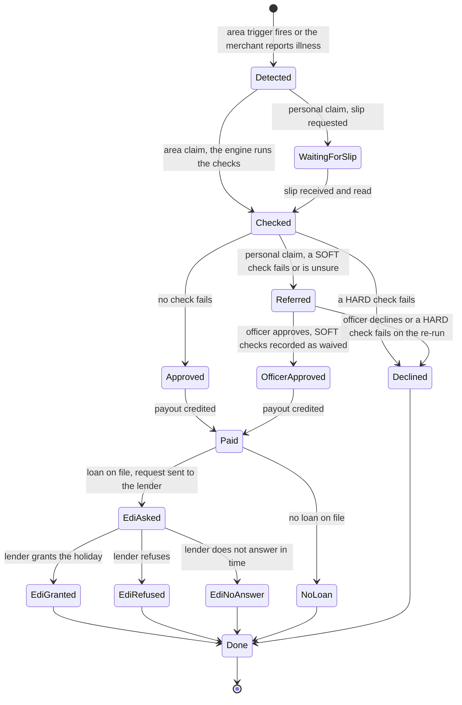

**An area claim never reaches Referred.** Area claims carry HARD checks and no SOFT checks. An area item with outcome REFERRED fails the data parser: the app shows the error state with the code `contract_violation` and never draws it.

- **REFERRED** is for personal claims. A case opens, and the merchant sees the case chip (`CASE_CHIP`) and the 24-hour clock. An officer decides REFERRED decisions and no others. Approval re-runs every check on fresh facts, and a SOFT check that failed or was unsure is recorded as waived by the officer. A HARD fail on the re-run still gives DECLINED. The new decision supersedes the referred one, so the tracker shows one claim.
- **The instalment holiday is the lender's decision.** Chhatri requests it after a payout under a pre-agreed rule, and the lender grants it, refuses it or does not answer. The tracker never says that Chhatri paused the instalment. A refusal reads "Not available" and shows no reason code.
- **No loan on file.** The step is not applicable (open question 1).

### 10.2 Dispute

A dispute is a separate case about the merchant's latest paid decision. It is not a re-decision. **The amount never changes.**

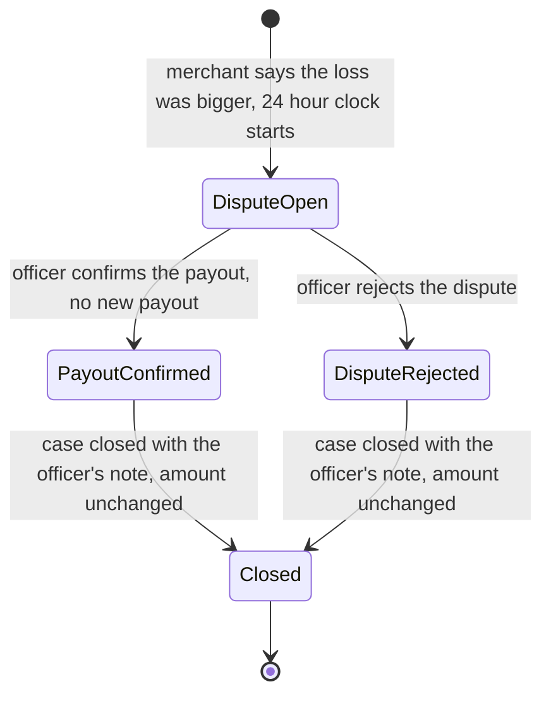

- The button "This is wrong" shows on a paid claim with no open dispute. A claim with no paid decision cannot be disputed in the app.
- In W1 the button sends the dispute phrase through the chat route and shows `DISPUTE_ACK` in a toast. From W3 it opens the complaint form (section 7.1) and the same case. A second dispute while one is open shows `DISPUTE_ALREADY_OPEN`.
- The officer's buttons mean "Confirm payout" and "Reject dispute" in the console (section 9.7). Either way the case is closed, the amount stays as paid, and the merchant is told the result.
- The dispute is its own card in Claims (`tracker.kind.dispute`). Its statuses are `claim.status.question_open` and `claim.status.question_closed` ("Question closed. Amount unchanged.").

### 10.3 What each situation draws

Step words are `tracker.state.*`: done, now (in progress), waiting, na (not needed) and stopped (stopped here). The pill is the S4 card label.

| Situation | Pill | Detected | Checked | Decided | Paid | Instalment holiday |
|---|---|---|---|---|---|---|
| Area, approved, credit pending | `claim.status.approved_pending` (Decided tone) | done | done | done, `TRACK_DECIDED_AUTO` | now, system working: `TRACK_PAID_PENDING`, `TRACK_PAID_ETA` | waiting |
| Area, paid, lender asked | `claim.status.paid` (Paid tone) | done | done | done | done | now: `TRACK_EDI_REQUESTED` |
| Area, paid, lender granted | `claim.status.paid` | done | done | done | done | done: the `HOLIDAY_GRANTED` family |
| Area, paid, lender refused | `claim.status.paid` | done | done | done | done | done: `TRACK_EDI_REFUSED` |
| Area, paid, no answer | `claim.status.paid` | done | done | done | done | done: `TRACK_EDI_NO_RESPONSE` |
| Area, paid, no loan | `claim.status.paid` | done | done | done | done | na: `TRACK_EDI_NONE` (or the step is not drawn) |
| Declined, either kind | `claim.status.declined` (Blocked tone) | done | done | stopped: `TRACK_DECIDED_DECLINED` | na | na |
| Personal, waiting for the slip | `claim.status.waiting_slip` (Neutral) | now | waiting | waiting | waiting | waiting |
| Personal, referred | `claim.status.referred` (Referred tone) | done | done | now, a person working: case chip and clock | waiting | waiting |
| Personal, officer approved | `TRACK_DECIDED_OFFICER` (Paid tone once credited) | done | done | done | now or done | as above |
| Personal, officer declined | `claim.status.declined` | done | done | stopped: the officer's reason | na | na |
| Dispute open | `claim.status.question_open` (Referred tone, `scale` icon) | its own card | | | | |
| Dispute closed | `claim.status.question_closed` (Neutral) | its own card | | | | |

Rules for the rendering:

- A step appears after it has happened. Nothing says Paid before the payout record exists.
- The "now" icon turns for a system that is working and is `user-round` for a person. A text label is always there, so a still frame under reduced motion still reads.
- Reasons come from the API in both languages (catalogue messages or the engine's own explanation). The app adds the fixed labels of the copy deck and nothing else.

### 10.4 Journeys and screens

Journey ids are those of [User journeys](../02-product/user-journeys.md).

| Journey | Mini-app screens | Console and phone |
|---|---|---|
| J1 Discover and understand cover | S1 Home, S2 Coverage with the jargon lens, then Ask (N2) | Merchant page |
| J2 Consent and buy cover | S2, S3 with the consent block (W3), then S1 with the status "starts on" | Phone thread shows `COVER_LINK` and `PREMIUM_PAID_STARTS` |
| J3 Area auto-claim in the monsoon | S1 paid card, S4, S5 five steps, S6, S7 | `/live` with the moment card, the toast and the KPI strip. Soundbox and WhatsApp on the Merchant page |
| J4 Hospital-cash claim (silent day) | N3 slip sheet, S5, S6, S7 | WhatsApp check-in on the phone |
| J5 Referred claim (name mismatch) | N3, S5 with the case chip (section 6.5), after the officer: S5 and S7 with a waived check | `/claims` case C-2291, "Approve" and "Decline" |
| J6 Dispute | S5 "This is wrong", S4 dispute card, S5 closed | `/claims` DISPUTE case with "Confirm payout" and "Reject dispute" |
| J7 Grievance escalation | N5 complaints (section 7.1) | None |
| J8 Blocked purchase (alert conflict) | S3 BLOCKED result, S2 section c5 | Phone thread shows `COVER_BLOCKED` |
| J9 Consent withdrawal and data deletion | S10, the withdraw sheet, the erase sheet, S11 | `/claims` shows "Slip erased" where the image was |
| J10 Cover lapse and renewal | S1 with the unpaid status, the `see_premium` next step, S2 section c6 | The renewal prompt belongs to a later work item and is not drawn here |

### 10.5 Four flows

The paid day (J3). The merchant does nothing, and every screen is a reading of what the backend recorded.

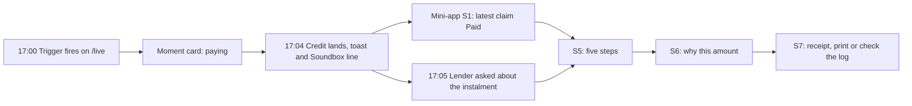

The referred claim (J5). The merchant confirms what was read, and a person decides.

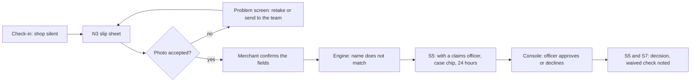

The dispute (J6 then J7). The amount never changes.

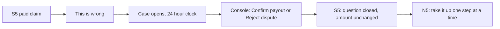

The purchase (J2 and J8).

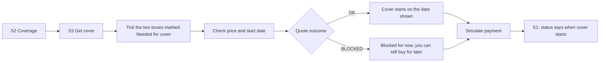

---

## 11. Responsive rules

The console is designed at 1280×720 and the mini-app at a 354 px screen. [Design system section 10](design-system.md) has the full rules. This section adds what the new parts do when the space shrinks. Sizes are targets to confirm in the build.

| Surface | Width | Behaviour |
|---|---|---|
| Console pages | 1280×720 and wider | The design size. No sideways scroll on `/live`, `/claims`, `/audit`, `/backtest` and `/policy`, in normal and presenter mode |
| Console pages | 900 px and below | Live and Claims stack in one column (BUILT). The ops strip wraps its five cells into two rows. The what-if drawer becomes a panel under the map. The moment card keeps its place on the map and its width becomes the smaller of 310 px and the map width minus 24 px |
| Console pages | 480 px and below | The merchant phone drops its bezel and becomes the page (BUILT). The header navigation scrolls sideways (BUILT) |
| Presenter mode | Below 1100 px | The type step is not applied (proposed). Presenter mode is a projector feature and is checked at 1280×720 and wider |
| Provider popover | 1280 px | About 560 px wide, anchored to the chip, at most the page height minus the header |
| Provider popover | Narrow (BUILT rule) | Fixed to the viewport with 16 px margins, the detail on a second line |
| Merchant page | 1200 px and wider | Phone, mini-app frame and the merchant panel in three columns |
| Merchant page | 900 to 1199 px | Phone and frame side by side, the panel below |
| Merchant page | Below 900 px | One column: phone, frame, panel |
| Mini-app, standalone | Under 430 px | Full viewport width, with the safe-area insets. Container variants `@xs` (320 px) and `@sm` (384 px) read the frame, not the window |
| Mini-app, standalone | 430 px and wider | A centred 430 px column |
| Mini-app, any | 320 px with text at 200% | No sideways scroll. Rows wrap. Buttons use a minimum height, so a Hindi label can take two lines |
| Mini-app, any | Landscape | The same column, centred |
| Receipt | Print | One column. The tab bar, the next-step bar and the buttons are hidden. Blocks do not split across pages |

Check before sign-off: the longest Hindi strings (the `SLIP_TO_HUMAN` family) in the 354 px frame and at 320 px, with nothing clipped and no mark cut at the top of a card or a button.

---

## 12. Copy

### 12.1 How to read the keys

| Kind | Where it lives | Status |
|---|---|---|
| `KEY_IN_CAPITALS` that `messages.py` has | `backend/chhatri/conversation/messages.py` | BUILT. The English and the Hindi are quoted from the code |
| `KEY_IN_CAPITALS` that `messages.py` lacks | The copy deck section for its feature | Proposed catalogue line |
| `dotted.key` | The copy deck | A proposed line, except where the deck marks it BUILT (`error.title`, `error.retry`, `settings.sound.*`) |
| A quoted line marked "proposed" | This document | Proposed. It goes into the copy deck before the build uses it |

The copy deck wins on wording. If a line quoted here differs from the deck, the deck is right and this document is stale. Marathi is a draft in the deck and needs a native speaker.

### 12.2 BUILT lines the screens show

| Key | English | Where |
|---|---|---|
| `PAYOUT_CARD` | Credited with today's settlement | S4 card and S5 Paid step |
| `PAYOUT_CARD_BADGE`, `PAYOUT_CARD_BADGE_PERSONAL`, `PAYOUT_CARD_BADGE_OFFICER` | No claim needed. One photo, no forms. Approved by a claims officer | Payout badges (copy deck 4.2) |
| `EXPLAIN_AREA` | Your usual {weekday}: {expected}. Your area fell {drop}%. Chhatri pays half the lost sales. | Ask answer for "Why this amount" |
| `EXPLAIN_AREA_FORMULA`, `EXPLAIN_PERSONAL` | How your payout was worked out: {formula}. How your claim was worked out: {formula} | S6 and S7 formula |
| `DISPUTE_ACK` | Okay, I'm sending this to our team. You'll hear back within 24 hours. | Toast after "This is wrong" |
| `CASE_CHIP` | Sent to a claims officer · case {case_id} | S5. English in every language |
| `SLIP_TO_HUMAN`, `_DATES`, `_UNREADABLE`, `_DAYS` | Thank you. The name on the slip doesn't match your KYC, so our team will check it. You'll hear back within 24 hours. (and three variants) | After a slip is sent and the claim is REFERRED |
| `OFFICER_APPROVED`, `OFFICER_DECLINED` | {name} ji, our team approved your claim. {amount} credited. / ... reviewed your claim. {reason} | Phone thread after the officer |
| `REASON_*` (ten checks and three officer lines) | For example "Your cover wasn't in force on that day." | S5 Decided step, S6, S7 |
| `COVER_STATUS_ACTIVE`, `COVER_STATUS_STARTS`, `COVER_STATUS_UNPAID` | Your cover is active. Premium is paid through {date}. / Your cover starts on {date}. / Your cover is active, but the premium for the coming days hasn't been paid yet. | S1 and S3 |
| `COVER_BLOCKED`, `COVER_LINK`, `COVER_LINK_UNAVAILABLE` | The blocked-quote, link and no-link lines | S3 and the phone thread |
| `FALLBACK_HELP` | I'm Chhatri. You can ask: "Why did I get this amount?" or "My loss was bigger". | Ask, when every link fails or the guard blocks |
| `VOICE_UNCLEAR` | Sorry, I couldn't hear that clearly. Please say it again or type it. | Voice, heard nothing |

### 12.3 Proposed lines that this document introduces

These are not in the copy deck yet. Each needs a row there (and a Hindi and Marathi line) before the build uses it.

| Where | Proposed English |
|---|---|
| Slip sheet, two buttons | "Take a photo", "Choose from the gallery" |
| Slip sheet, camera blocked | "The camera is blocked. Allow the camera in your browser settings, or choose a photo from the gallery." |
| Slip sheet, picker closed with no file | "No photo yet? If the camera did not open, choose a photo from the gallery." |
| Complaints | "New complaint", and the button that saves the date the merchant filed |
| Demo clock sheet (N7) | The title "Demo date and time", the intro "Move the demo clock. The replay is made up.", the four chapter chips (Alert 14:00, Trigger 17:00, Paid 17:04, Instalment 17:05), "Play", "Back to the start" |
| Moment card | "Waiting for the trigger", "Credited at 17:04 · 312 shops paid" |
| Ops strip | "Nothing due" for an empty Next due cell |
| Provider panel | "no key set, already simulated" as the reason of a disabled switch (fs-08) |
| Ask, static demo | A "recorded sample" line under an answer (fs-05) |
| `/evals` | The page title "AI evaluation" and the banner of the evaluation plan |
| Receipt, S6 | None: every line is a copy deck key |

### 12.4 Rules the screens keep

- A number that comes from the rules never sits inside a string. The screen fills a placeholder from `GET /api/policy` or the decision.
- No screen says "approved" about a quote or an eligibility. The word appears after a decision record exists and not before.
- SIMULATED, LIVE, FALLBACK and CONFIG are written in capitals, are never translated, and are never produced by a CSS transform.
- No screen uses promise words, and none says "verified by" an outside body. A source badge says where a value came from.

---

## Open questions

Settled since v1.2: the placement of the mini-app (a third column and a standalone route, ADR 0005), the ETA of the Paid step (`TRACK_PAID_ETA`), the provider badge of Ask (a footer word with details), the receipt download (print or save as PDF, no export) and the contact lines of the ladder (a marked placeholder).

1. **A skipped holiday step.** fs-04 draws the instalment holiday step as skipped with "No loan on file". The copy deck says the step is shown for a merchant with a loan and not otherwise. The layouts here work with either. Owner: Omkar Kadam, with the owner of fs-04.
2. **Ops strip and moment card placement.** fs-08 puts the strip under the control bar across the page and the card at the top of the right panel. Measured at 1280×720, both cost the panel's Z9 note in presenter mode, so this document puts the strip over the map column and the card over the map. The card also stays while the replay is paused at 17:06, where the [demo runbook](../06-delivery/demo-runbook.md) (B10) drops it outside 16:58 to 17:06, because that is where the presenter talks over it. Decide at the W4 rehearsal, on the projector if it is available. Owner: Omkar Kadam.
3. **No next-step bar on Ask and the slip sheet.** The composer and the answer's own button stand in. fs-04 AC-36 lists S1 to S9 for the bar. Owner: Omkar Kadam.
4. **Native review.** The new Hindi lines should be read by a Hindi speaker outside the team, and the Marathi by a native speaker before `n8_marathi` goes on in W4. Owner: Omkar Kadam.
5. **Moving the replay on a phone.** Settled: the demo clock sheet of section 8 is built; its words are proposed and need the native review of question 4. Owner: Omkar Kadam.
6. **Camera blocked.** The Permissions API is not in every browser, and a cancelled picker looks like a blocked camera. The design offers the gallery in both cases. Check it on the demo phone. Owner: Omkar Kadam.
7. **FALLBACK colour.** It is orange here so it differs from the amber of REFERRED. fs-08 calls it amber ([design system](design-system.md), open question 8). Owner: Omkar Kadam.
8. **One flag or two.** The Wave 0 list has `console_polish` for presenter mode, the moment card and the polish. fs-08 proposes `presenter_mode` and `moment_card`. Owner: Ujjwal Pardeshi.
9. **The why and receipt links on S5 and S6.** fs-04 lists "Why this amount?" and "See receipt" as body buttons on S5, and "See receipt" in the body of S6. The next-step bar already holds those links (`see_why`, `see_receipt`), so this document draws each one once. Owner: Omkar Kadam.
10. **The Help legend.** The mode legend on S8 is an addition of this document, built from existing hints. Keep it or drop it at the W1 review. Owner: Omkar Kadam.
11. **The public address of N7.** This document claims none. The repo owner deploys the static build and decides the host. Owner: Ujjwal Pardeshi.
12. **Escalating before the officer answers.** fs-06 says a merchant can move to the next step "at any time", and its state table and the deck show the button to the insurer's grievance officer once the claims officer has answered or the 24 hours have passed. Section 7.1 follows the table and the deck. If the owner wants the button at any time, it moves up to the "You are here" step. Owner: Omkar Kadam, with the owner of fs-06.

## Changelog

- 2026-10-03 · v1.4 · legend and the FALLBACK row brought up to the code; the strings marked proposed are wording of small states whose exact text the code may differ from
- 2026-10-02 · v1.4 · status lines match the build: every screen and console part BUILT behind its flag; the static demo banner and the demo clock sheet of section 8 are built (open question 5 settled)
- 2026-10-02 · v1.3 · rewritten as a build-ready screens document: the seven console pages as built (commit 86575ea) and the mini-app as the 354 px screen in a 372 px frame with three tabs (S1 to S11, Ask and voice, the slip sheet, complaints, consent and the standalone route), every screen with its layout, components and six states; error screens for a blurry slip, a wrong document, a name that does not match and a blocked camera; the six console changes (provider panel, ops strip, what-if drawer, presenter mode, `/evals`, the moment card) placed against the measured 1280×720 budget; the claim state machine with REFERRED and DISPUTE; responsive rules; copy keys checked against `messages.py` and the copy deck. Journey ids corrected, invented zone names, the emoji and the teal demo colour removed, the old priority labels replaced by build waves
- 2026-10-02 · v1.2 · second fact-check pass: removed invented STT latency estimate, clarified Gemini/Tesseract as planned (N2/N3), fixed EMI vs EDI terminology
- 2026-10-02 · v1.1 · fact-check pass: fixed ungrounded Bima Bharosa duration (14 days per portal), GRO SLA label, removed H5 reference
- 2026-10-02 · v1 · initial draft: console gallery, IA, N1 wireframes, flows, UX review.
