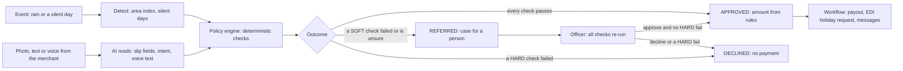

# AI architecture and guardrails

| | |
|---|---|
| Status | Draft v1.6 · 2 Oct 2026 · describes what is BUILT (checked against commit 86575ea) and what is PLANNED (Waves 2 and 3, behind feature flags). Planned design is labelled as such. Nothing here has been measured |
| Owner | Ujjwal Pardeshi |
| Audience | AI engineers, compliance reviewers, pilot partners, RBI examiners |
| Related | [System architecture](system-architecture.md) · [ML model card](ml-model-card.md) · [Data model and API](data-model-and-api.md) · [Free-tier stack](free-tier-stack-and-setup.md) · [AI evaluation plan](ai-evaluation-plan.md) · [ADR 0001](adr/0001-policy-engine-is-the-only-payout-authority.md) · [ADR 0003](adr/0003-free-ai-provider-chain.md) · [ADR 0004](adr/0004-live-simulated-fallback-labels.md) · [ADR 0009](adr/0009-synthetic-data-only-to-free-tier-ai.md) · [Ask Chhatri (fs-05)](../02-product/feature-specs/fs-05-ask-chhatri.md) · [Hospital-cash claim (fs-02)](../02-product/feature-specs/fs-02-hospital-cash-claim.md) · [Policy engine and audit (fs-09)](../02-product/feature-specs/fs-09-policy-engine-and-audit.md) · [Facts and sources](../01-strategy/facts-and-sources.md) · [Regulatory compliance](../05-business/regulatory-and-compliance.md) |

## TL;DR

- Governing principle: the AI builds the case, code decides the money. Only `chhatri.policy.engine` produces APPROVED. No model output sets an amount, approves, pays or overrides a check (SPEC §0.2, [ADR 0001](adr/0001-policy-engine-is-the-only-payout-authority.md)).
- BUILT today: the expected-sales model, area index and silent-shop detection (deterministic), word-list intents with a Sarvam call for UNKNOWN text that returns an intent only, Sarvam adapters for chat, document reading, speech to text and text to speech, offline simulators for all of them, the `grounded()` check (tested, not wired into any flow), upload validators and the audit log.
- PLANNED, in waves behind flags: Gemini adapters (chat and vision), the Ask Chhatri service with a stricter guard, the slip pre-check, voice confirmation chips, mode, provider and reason labels on every AI result (H26), a free-tier data gate, and the evaluation harness (H25). Wave 2 is live AI. Wave 3 is the harness and the `/evals` page.
- Provider chains end in something deterministic: a template for text, the simulated reader or a person for slips, typed text for voice. A link is in a chain only when fully configured. No Gemini model name and no free-tier quota is written in these documents, because both change. The Sarvam defaults named in §3.4 are read from the code.
- Only synthetic data goes to AI services on free tiers or free credits. Today that holds by construction, because the whole prototype is synthetic. A code gate is PLANNED ([ADR 0009](adr/0009-synthetic-data-only-to-free-tier-ai.md)).
- Honest limits: nothing is measured, model confidence is not calibrated, a forged slip cannot be detected, and the guard cannot catch a false sentence that has no numbers and no promise words (§4.7).

## 1. AI inventory

BUILT means in the code at commit 86575ea. PLANNED means specified and not built. None of the PLANNED parts is a fact about the running system.

| Component | Technique and provider | Purpose | BUILT today | PLANNED | Fallback | Data sent out | Can it move money? |
|---|---|---|---|---|---|---|---|
| Expected-sales model | LightGBM quantile regressors (P10, P50, P90) and a conformal lower bound per zone | The shop's normal sales by hour. Feeds the trigger and the published expected day | Trained on simulated sales driven by real rainfall, loaded from artifacts ([model card](ml-model-card.md)) | none | none. Without the artifacts the default scenario does not load: the API still starts and `/api/preflight` says what is wrong | none, runs in process | No. It is an input. The engine computes every amount from rules |
| Area index and triggers | Arithmetic: actual sales divided by P50 per zone and 3-hour window, against rule thresholds | Detect an area loss event | Hourly, deterministic | none | none | none | No. The engine decides |
| Silent-shop detection | Deterministic: zero sales in business hours, P10 above zero, not the weekly off, zone not in an area event | Start a personal-claim check-in | BUILT ([fs-02 §7.1](../02-product/feature-specs/fs-02-hospital-cash-claim.md)) | none | none | none | No |
| Intent classifier | Word lists (Devanagari, Hinglish, English): eight intents plus UNKNOWN. For UNKNOWN text only, a Sarvam chat call that returns one intent value | Route a merchant message to a handler | Rules always. The chat call is LIVE with `SARVAM_API_KEY`, sends at most 500 characters and no ids | With N2 on, rules choose the intent and no model does ([fs-05 §4](../02-product/feature-specs/fs-05-ask-chhatri.md)) | Rules. An UNKNOWN stands if the model fails | Merchant text, 500 characters at most | No payout. In the BUILT chat path a model-chosen intent can run two rule-triggered write handlers, a dispute case and a cover quote with a payment link (task N2.15) |
| Ask Chhatri (N2) | Rules, then Gemini, then Sarvam chat, then a catalogue template. Grounded in facts and clauses C1–C12 | Explain cover, claims and payouts | The catalogue replies and `grounded()` only | The `AskService`, guard layer B, injection and scam checks, labels, next action | A template (FALLBACK_HELP or ASK_HANDOFF) | Question (500 characters at most), fact sheet without names, clause text | No |
| Slip reader (N3) | Gemini vision, then Sarvam Vision (document intelligence), then REFERRED. The simulated reader when no live link applies | Read five fields from one photo | Sarvam doc-ai adapter, LIVE with the key. The simulated reader reads the sample slips' embedded answer key. A read failure is REFERRED | Gemini vision, the pre-check (confirm or retake), metadata stripping, labels | The simulated reader, or a person | The slip image (5 MB at most) | No. The fields feed three SOFT checks |
| Speech to text (N4) | Sarvam STT, then browser recognition, then typed text with confirmation chips | Turn a voice question into text | Sarvam adapter (`saaras:v3`), simulated canned notes, the 30-second recorder | Browser recognition, `POST /api/voice/stt`, confirmation chips (H18) | Typed text | Audio, 5 MB and 30 s at most. Browser recognition uses the browser's own speech service | No |
| Text to speech (N4) | Sarvam TTS, then browser `speechSynthesis` | Speak a reply | Sarvam adapter (`bulbul:v3`, 2,500 characters at most), used for demo merchants only. Browser speech (hi-IN) otherwise | `POST /api/voice/tts` for the answer of an earlier ask | Browser speech, then text | Reply text | No |
| Memory graph | In-process networkx graph. Optional Cognee adapter | Rank past cases for the officer | Graph by default. Cognee is live only with `COGNEE_ENABLED`, the package and an LLM configured through `LLM_API_KEY` | none | The graph | With Cognee on, learn-loop facts (kind, time, merchant and zone ids, and short text with ids, outcomes, amounts and dates, no names) go to its configured LLM | No. Advisory ranking |

Only the deterministic policy engine can move money. Everything else is advisory, grounded, validated or rejected.

## 2. Governing principle: the AI builds the case, code decides the money

Only `chhatri.policy.engine` produces APPROVED (SPEC §0.2). A model reads or explains. The engine decides.

Why: every step from merchant input to money can be traced. The engine is small, pure Python with frozen pydantic models, and tested. A regulator can read it in a way that they cannot read a model's reasoning. Money texts are catalogue templates. Model text is explanation only, and always guarded.

## 3. Provider chains, labels and adapter facts

### 3.1 Chains

A link is in a chain only when fully configured. The last link is deterministic. The order is fixed.

| Need | Chain | BUILT | PLANNED |
|---|---|---|---|
| Intent for UNKNOWN text | Sarvam chat (intent only), then the rules' UNKNOWN | BUILT | Replaced by the Ask path when N2 is on |
| Ask Chhatri | Rules for known intents, then Gemini, then Sarvam chat, then a template | Rules, templates and the Sarvam adapter | Gemini adapter and the whole service (Wave 2) |
| Slip reading | Gemini vision, then Sarvam Vision, then REFERRED. Simulated reader when the chain has no live link, the gate is closed or fallback is forced | Sarvam adapter, simulated reader, REFERRED on failure | Gemini vision, pre-check, labels (Wave 2) |
| Speech to text | Sarvam, then browser recognition, then typed text | Sarvam adapter, simulator | Browser recognition (Wave 2) |
| Text to speech | Sarvam (demo merchants), then browser `speechSynthesis`, then text | BUILT | `/api/voice/tts` (Wave 2) |

Tesseract is a PLANNED later link for slips, after Sarvam and before REFERRED. It is not in the Wave 2 chain, and its output would be parsed by rules and never given to a model. Browser speech recognition is PLANNED and not available today. Workflows and memory are not AI chains: the in-process runner is the default ([ADR 0008](adr/0008-in-process-workflows-on-stage.md)) and the memory graph is advisory.

### 3.2 Adapter facts (BUILT)

- Timeouts: 10 s by default and 60 s for Sarvam document reading. The document job is started, polled every 1 s up to 50 times inside that bound, then read.
- Retries: only on HTTP 429 and 5xx, at most 3 attempts in all, with waits of 0.5 s then 1 s. A timeout is not retried. A failure raises `IntegrationError` with a safe message that never holds a provider body, a URL with credentials or a secret.
- Sarvam speech to text accepts audio that passed the upload validators. Its "confidence" is a language probability, not recognition confidence. Text to speech is limited to 2,500 characters.
- Uploads are validated by content: images up to 5 MB (JPEG, PNG or WebP), audio up to 5 MB and 30 s.
- Planned interactive path: one attempt per link and per-link budgets set in the Wave 2 rehearsal so a whole chain fits its target. The targets are Ask in 5 s for at least 95 % of rehearsal questions and a slip read in 10 s for at least 90 % (PRD §5.1). Both are targets and neither is measured.

### 3.3 Labels (H26, PLANNED)

Every AI-backed result carries these fields. The definitions are in [fs-05 §10](../02-product/feature-specs/fs-05-ask-chhatri.md) and [fs-02 §7.3.8](../02-product/feature-specs/fs-02-hospital-cash-claim.md).

| Field | Values |
|---|---|
| `mode` | `LIVE`, `FALLBACK`, `SIMULATED` |
| `provider` | `rules`, `gemini`, `sarvam`, `template`, `simulated`, `mock`, `browser`, `none` |
| `model` | the configured model id, echoed at run time. Null for rules, templates and the browser |
| `fallback_reason` | null, or `NO_KEY`, `MODEL_NOT_SET`, `FORCED`, `MOCK_BACKEND`, `FREE_TIER_BLOCKED` (these give SIMULATED), or `TIMEOUT`, `RATE_LIMITED`, `PROVIDER_ERROR`, `INVALID_REPLY`, `GUARD_BLOCKED`, `INJECTION_SUSPECTED` (these give FALLBACK) |
| `attempts` | one `{provider, outcome, ms}` per link tried, for the console |

Today the registry reports only LIVE and SIMULATED per component. FALLBACK, per-component toggles, the new status names `gemini_chat` and `gemini_vision` (proposed) and the forced-fallback route `POST /api/integrations/{component}/fallback` are PLANNED (X6). The fixed list of 15 status names in `statuses.py` and SPEC §19.2 changes when they land.

### 3.4 Configuration

BUILT: `SARVAM_API_KEY` and the model settings (`sarvam_chat_model` default `sarvam-105b`, `sarvam_stt_model` default `saaras:v3`, `sarvam_tts_model` default `bulbul:v3`). PLANNED: `GOOGLE_API_KEY` for Gemini and a model id in `GEMINI_MODEL` (name proposed), chosen on the day from the current free tier in Google AI Studio. A key without a model id leaves Gemini out of the chain and the provider panel says so. `CHHATRI_DATA_IS_SYNTHETIC` (name proposed) drives the data gate. Rule thresholds such as the slip confidence minimum live in `rules.yaml`, not in the environment.

## 4. Guardrails

### 4.1 Grounding and clause citations (PLANNED)

Ask Chhatri answers from three sources only: the merchant's engine facts, the constants in `rules.yaml` and the policy clauses C1–C12 with sub-clauses C4.1–C4.4. The fact sheet holds display strings made by the engine, so the model never calculates, and it holds no names, phone numbers, KYC names or shop names. The model returns clause ids and fact keys. The server validates them and adds the chips and the sources (H13). Details are in [fs-05 §5](../02-product/feature-specs/fs-05-ask-chhatri.md).

Clauses: C1 definitions, C2 area income loss, C3 hospital cash, C4 how much we pay, C5 when cover starts, C6 premium and cash before cover, C7 exclusions, C8 how claims are decided, C9 disputes and grievances, C10 EDI holiday, C11 data and consent, C12 cancellation.

### 4.2 The guard on model text

| Layer | Status | What it checks |
|---|---|---|
| A: `grounded()` in `conversation/guard.py` | BUILT, 25 tests, not called by any flow | Every digit run is an allowed number (Devanagari digits folded, grouping commas dropped, so "₹1,380.50" brings in "50"), and the normalised reply holds no promise stem in English, Hindi or Hinglish |
| B: strict layer in front of A (`guard_strict.py`) | PLANNED, task N2.5 | B1 valid clause ids stripped and checked, B2 typed rupee and percent numbers, B3 number words, B4 a money word near a future marker, B5 outcome and certainty promises, B6 links, phones and handles, B7 length and script, B8 canary, B9 numbers only from the fact sheet |

Any exception inside the guard counts as a block. A blocked reply is never shown: the next link tries, then a template answers. Verified examples run on 2 Oct 2026 (28 rows in [fs-05 §6.3](../02-product/feature-specs/fs-05-ask-chhatri.md)):

| Reply | BUILT layer A | Layer B prototype | Why |
|---|---|---|---|
| "Your payout was ₹1,38,000." | blocks | blocks | Indian grouping becomes 138000, which is not a fact |
| "The yearly limit is ₹30,000 (C4.3)." | blocks | passes | A sees the digits 4 and 3 of the clause id. B1 strips a valid id first |
| "Payout is fifty thousand rupees." | passes | blocks | B3: a number word hides the number from the digit check |

Of the 21 replies in that table that must be blocked, layer A blocks 13 and the layer B prototype blocks 21. These are examples of the design, not a measurement of real model output. The guard fails closed, so some true past-tense replies are blocked, and the evaluation plan measures that false-block rate.

### 4.3 Schemas

- Intent call (BUILT, `nlu.py`): the model must return one value of the nine intents. The reply is parsed and checked against the schema by `parse_json_reply`. Anything else raises `IntegrationError` and the rules' UNKNOWN stands. At most 500 characters are sent, behind a fixed system prompt.
- Ask answer (PLANNED): `can_answer`, `answer_hi`, `answer_en`, `clause_ids`, `fact_keys`, no extra keys ([fs-05 §5.4](../02-product/feature-specs/fs-05-ask-chhatri.md)). Invalid JSON, a clause outside the table or a fact key outside the sheet is `INVALID_REPLY`.
- Slip read (PLANNED): five fields and two numbers, no free text ([fs-02 §7.3.1](../02-product/feature-specs/fs-02-hospital-cash-claim.md)).

### 4.4 Prompt injection

BUILT: merchant text is cut to 500 characters, the system prompt is a constant, the intent output is an enum, and no money figure is ever filled in from model output. PLANNED: the question is wrapped as untrusted data with tag characters removed, strong signals (instruction overrides, "you are now", prompt-extraction phrases, role-tag lines, tag-like text, zero-width characters) skip every model, a per-request canary detects a prompt leak, and weak signals are only logged ([fs-05 §7](../02-product/feature-specs/fs-05-ask-chhatri.md)). For slips, the reader fills a fixed schema, sees no merchant data, and every string it returns is validated and scanned. A flagged read is discarded and goes to a person ([fs-02 §7.3.7](../02-product/feature-specs/fs-02-hospital-cash-claim.md)). Red-team sets are part of the evaluation plan.

### 4.5 Refusal, hand-off and labels

When the model cannot ground an answer it sets `can_answer` to false and the reply is the hand-off text (ASK_HANDOFF), with the label staying LIVE. Until the grievance ladder (N5, Wave 3) the hand-off is informational and opens no case. On any model failure the next link or a template answers and the label says why. Failures are logged. The BUILT intent path logs a warning and audits only `intent.detected` (merchant, intent, source rules or llm).

### 4.6 A person in the loop

Any SOFT FAIL or unsure SOFT check gives REFERRED and opens a case in the officer console. The officer sees the evidence (for a slip: the image, the five fields, confidence, source, KYC name and score, silent days). Approve or decline re-runs every check from fresh facts and writes a superseding decision by `officer:<id>`. A new HARD fail makes it DECLINED even on approve. On approve every SOFT check is recorded as WAIVED_BY_OFFICER. An officer cannot waive a HARD check: a merchant without cover or paid premium is not paid.

### 4.7 Known limits

- A forged slip cannot be detected. The protection is structural: silence verified from sales data, paid cover, caps, a person looking at every referred case, and the audit log. A slip that tells the model what to return is the same threat ([fs-02 §7.3.7](../02-product/feature-specs/fs-02-hospital-cash-claim.md)).
- A model's own confidence is not calibrated. The slip gate uses it as a signal and the merchant's confirmation and the engine's checks are the protection. The evaluation plan measures calibration.
- The guard cannot catch a false statement with no numbers and no promise words, such as "dental treatment is covered". Mitigations are the clause-only context, validated citations, templates for known intents and a faithfulness score in the evaluation. The residual risk is real.
- The BUILT rules misroute some coverage questions to the wrong handler (six verified, [fs-05 §2.2](../02-product/feature-specs/fs-05-ask-chhatri.md)), and a model-chosen intent can run two write handlers in the BUILT chat path (task N2.15).
- The simulated slip reader is the answer key embedded in the sample image. Any accuracy figure from it would be meaningless and must never be shown as one.
- The patient name read from a slip appears in the audit log through the check text, and the log is append-only ([fs-02 §2.2](../02-product/feature-specs/fs-02-hospital-cash-claim.md)).
- Hindi text of proposed strings needs native review. The guard has no Marathi word lists, so Marathi answers stay off until N8.
- The terms of Sarvam free credits are unverified. They are treated like Gemini's until read ([ADR 0009](adr/0009-synthetic-data-only-to-free-tier-ai.md)).

## 5. Privacy and synthetic data

Rule ([ADR 0009](adr/0009-synthetic-data-only-to-free-tier-ai.md)): only synthetic data goes to AI services on free tiers or free credits. Gemini's free tier may use content to improve Google products (facts A19). Health data on slips is sensitive under the DPDP Act, whose Rules are phased in (facts A22).

Today the rule holds by construction. Every merchant, KYC name, sales figure and slip in the prototype is synthetic, and there is no code check. PLANNED: a gate that closes every free-tier link when the deployment does not declare its data synthetic, with the label `FREE_TIER_BLOCKED`.

| What leaves the server | Today (BUILT) | PLANNED |
|---|---|---|
| Merchant text for an UNKNOWN intent | 500 characters at most, to Sarvam chat | Replaced by the Ask question |
| Ask question and facts | not built | Question, fact sheet without names, clause text, to Gemini or Sarvam |
| Slip image | The original bytes, to Sarvam doc-ai when the key is set | A cleaned copy without EXIF, XMP or text chunks, to Gemini or Sarvam |
| Voice audio | To Sarvam when the key is set | Also the browser's speech service for browser recognition |
| Reply text for speech | To Sarvam, for demo merchants | Same |
| Learn-loop facts (ids, outcomes, amounts, dates, no names) | Only when Cognee is enabled, to its LLM | Same |

Minimisation. The slip reader's schema has no diagnosis field. BUILT keeps the original image in memory so an officer can see it, with no deletion path. "Forget my slip" (N6) and masking the name in check text are PLANNED (Wave 3). Retention is set with the insurer. See [fs-02 §12.2](../02-product/feature-specs/fs-02-hospital-cash-claim.md).

## 6. Evaluation and testing

Nothing is measured. The evaluation harness (H25) is PLANNED for Wave 3, and the `/evals` page shows NOT MEASURED until a run exists. The [AI evaluation plan](ai-evaluation-plan.md) defines the sets, the metrics with labelled targets, how to run and how results appear.

What exists today is regression testing, which is not accuracy measurement:

- `tests/conversation/test_intents.py` has 48 test cases over 128 labelled utterances. The word lists were written beside them, so they pass by construction.
- `grounded()` has 25 tests. The simulated slip reader has 19 tests and reads its own answer key.
- Policy, amounts, names and demo flows are tested in [testing and quality strategy](testing-and-quality-strategy.md).

## 7. Monitoring in a pilot

These are proposed signals. No threshold is set until a first measured run exists.

| Signal | Definition | Owner |
|---|---|---|
| Model drift | P50 forecast pinball loss on holdout data, tracked weekly | Ujjwal Pardeshi |
| Fallback rate per component | Share of calls with mode FALLBACK or SIMULATED, by reason (from the H26 labels) | Ujjwal Pardeshi |
| Ask hand-off rate | Share of questions answered with ASK_HANDOFF | Ujjwal Pardeshi |
| Guard block rate and false-block rate | Blocked replies, and blocked replies a person judged correct | Ujjwal Pardeshi |
| Injection signal counts | Strong and weak signals, per surface | Ujjwal Pardeshi |
| Wrong reads that pass the slip gate | Slips above the gate that an officer later corrected | Ujjwal Pardeshi |
| Free-tier gate closures | Requests answered with `FREE_TIER_BLOCKED` | Ujjwal Pardeshi |
| Latency per link | p50 and p95 per provider | Ujjwal Pardeshi |
| Merchant fairness feedback | A post-claim question such as "Did Chhatri treat your claim fairly?" after a pilot starts | Omkar Kadam |

## 8. RBI FREE-AI mapping

This is a self-assessment of design intent, not a certification. RBI's FREE-AI committee report (13 Aug 2025, facts A23) lists seven sutras and is advisory until RBI issues directions. The sutra names below are the ones used in the facts document.

| Sutra | BUILT | PLANNED |
|---|---|---|
| Trust | The audit log is hash-chained and verifiable (`GET /api/audit/verify`). Every decision stores all its checks. No model output moves money | Trust receipt with sources (fs-09) |
| People First | REFERRED claims go to a person. Replies come from a bilingual catalogue. Loan or top-up offers never appear while an alert is active or a claim is open (fs-04 has no offer kind) | The slip pre-check asks the merchant to confirm and offers a person at every step |
| Innovation | The expected-sales model and the area index are the product's own, described in the model card | Chains of free-tier providers under labels |
| Fairness | The area index needs a quorum of shops, so one merchant cannot move it. Daily and annual caps. Doubtful personal claims go to a person | The evaluation reports accuracy and false blocks by language, once measured |
| Accountability | Every decision has `decided_by` (`policy-engine` or `officer:<id>`). A review case is due after `dispute_sla_hours` (24) | Grievance ladder (N5). `ask.answered` audit event |
| Explainability | "Why this amount" shows the formula and numbers. Every check records what was observed and what was required | Clause citations, source badges (H13), counterfactual line (H14) |
| Resilience | Simulators for every AI component, timeouts, retries on 429 and 5xx, rules for intents, REFERRED on a read failure | Labelled chains, forced-fallback switch, free-tier gate. Tesseract and browser speech as later links |

## 9. Failure modes and degradation

| Failure | BUILT behaviour | PLANNED behaviour | What the merchant sees |
|---|---|---|---|
| Sarvam chat unavailable | The rules' UNKNOWN stands and a warning is logged. Known intents are unaffected | Ask path falls to a template, label FALLBACK | FALLBACK_HELP for UNKNOWN text |
| Model reply breaks the schema (for example an intent value that does not exist) | Rejected by `parse_json_reply`, the rules' UNKNOWN stands | `INVALID_REPLY`, next link | Same as above |
| Sarvam speech to text fails or hears nothing | Empty transcript, VOICE_UNCLEAR | Browser recognition, then typed text | "माफ़ कीजिए, आवाज़ साफ़ नहीं सुनाई दी…" (VOICE_UNCLEAR) |
| Sarvam text to speech fails, or merchant is not a demo merchant | Browser `speechSynthesis` (hi-IN), labelled. The text is always shown | `/api/voice/tts` chain | Text, with speech when the browser has a voice |
| Ask models unavailable | not built | Template answer, label FALLBACK or SIMULATED. No case is opened | FALLBACK_HELP or ASK_HANDOFF |
| Slip reader fails | An empty read (source `read-failed`) gives REFERRED and SLIP_TO_HUMAN_UNREADABLE with a case | Gemini, then Sarvam, then NEEDS_TEAM, then the merchant sends it to the team and it is REFERRED | "Thank you. We couldn't read the slip clearly, so our team will check it…" |
| Slip read is wrong in a way the checks see (another name, other dates) | NAME_MATCHES_KYC or DATES_MATCH fails, REFERRED | The pre-check shows the read first and the merchant confirms or retakes | SLIP_TO_HUMAN variant and the case chip |
| Prompt injection in a question | No AI path is wired to the guard yet | Strong signal skips every model. The guard blocks unsupported numbers and promises. No model can set an amount in any case | FALLBACK_HELP |
| All providers down at the 17:00 trigger | Trigger, engine and workflows use no AI, so payouts proceed | Same. Only Ask, voice and slip reading degrade | Money texts are catalogue templates |
| Gemini key without a model id | not built | Gemini left out of the chain, provider panel says "key set, model not set" | Nothing visible, the label says MODEL_NOT_SET |
| Free-tier gate closed | not built | Live links skipped, label SIMULATED with `FREE_TIER_BLOCKED` | Templates or the simulated reader |

## 10. Ideas after the hackathon

These are ideas. They are not in any wave and not promised.

- Multi-turn Ask Chhatri that remembers earlier questions in a conversation.
- Retrieval over a larger policy corpus. The clause table has twelve entries and fits the prompt, so it is not needed now.
- A second parametric product, such as heat stress, with its own model and evaluation.

## Open questions

1. How should Sarvam free credits be shared between speech, chat and document reading so the pilot reaches furthest? Owner: Ujjwal Pardeshi.
2. Who writes and reviews the labelled sets in the [evaluation plan](ai-evaluation-plan.md), and who reviews the Hindi? Owner: Omkar Kadam.
3. Which Gemini model and quota apply? It is decided from the free tier in Google AI Studio in the Wave 0 key check. Owner: Ujjwal Pardeshi.
4. Do the terms of the plan in use (Sarvam free credits, Gemini free tier) allow anything beyond synthetic data? Until read and recorded, the answer is no. Owner: Ujjwal Pardeshi.

## Changelog

- 2026-10-02 · v1.6 · rewritten against the code: BUILT versus PLANNED for every component, the label model (H26), BUILT adapter facts (timeouts, retries and waits), the two-layer guard with verified examples, injection defence for text and slips, the data gate, known limits, a cautious FREE-AI table and corrected failure modes; removed the circuit-breaker design, the 1 s, 2 s, 4 s backoff, the ROUGE-L evaluation and its targets, the invented monitoring thresholds, the claims that Ask Chhatri and the slip pre-check run today, Tesseract and browser recognition as available links, deletion of the slip after the decision, the "novel" claim, the test and time-of-day figures and the unverified Sarvam terms claim
- 2026-10-02 · v1.5 · second fact-check pass: Tesseract marked as PLANNED (P1) not available in TODAY's provider chain; TL;DR updated to clarify TODAY vs PLAN tools.
- 2026-10-02 · v1.4 · final consistency pass against the code: clarified that Ask Chhatri and slip reader can be LIVE with Sarvam key today (in addition to SIMULATED fallback).
- 2026-10-02 · v1.3 · AI provider and live/simulated framing aligned
- 2026-10-02 · v1.2 · logic and truth audit fixes
- 2026-10-02 · v1 · first draft, from SPEC §7, §13, §14, INTEGRATIONS.md, code inspection (forecast/, integrations/, conversation/), and RBI FREE-AI report (A23)
