# Data model and API

| | |
|---|---|
| Status | Draft v1 · 2 Oct 2026 |
| Owner | Ujjwal Pardeshi |
| Audience | Frontend developers, judges, integration partners |
| Related | [System architecture](system-architecture.md) · [SPEC.md](../SPEC.md) · [INTEGRATIONS.md](../INTEGRATIONS.md) |

## TL;DR

- **Domain model:** frozen pydantic models (Merchant, Cover, Loan, Alert, Decision, Payout, Case, …). Money is integer paise; times are timezone-aware IST.
- **Storage:** SQLite in-memory per scenario load (`/app/var/scenario.db`). Artefacts (model, backtest, premiums) are committed files.
- **IDs:** S-0142 (merchant), C-2291 (case), A-20250818-01 (alert), deterministic factories per seed.
- **Existing API:** 25 routes across 11 routers (meta, live, replay, merchants, phone, cases, records, premium, webhooks, media, internal). Request/response envelope: `{ok, data|error}` with paging metadata for lists.
- **Planned API (§5):** 10+ endpoints for mini-app (N1), Ask Chhatri (N2), slip pre-check (N3), grievances (N5), consents (N6), ops dashboard (K8), and demo-mode fallback switch (X6) — PLANNED (N1–N8, X1–X8 are not yet built as of 2 Oct); frontend mocks enable static demos.
- **Mock parity:** every new endpoint has a mock implementation in `frontend/src/mock/backend.ts` so the static demo works without a backend.
- **Rate limits:** 100 req/s per IP (burst), 6 MB upload size.

## 1. Domain model

### 1.1 Entity-relationship diagram

```mermaid
erDiagram
    ZONE ||--o{ MERCHANT : "contains"
    MERCHANT ||--o{ COVER : "purchases"
    MERCHANT ||--o{ LOAN : "borrows"
    MERCHANT ||--o{ CLAIM : "files"
    MERCHANT ||--o{ MESSAGE : "receives"
    ALERT ||--o{ TRIGGER : "causes"
    TRIGGER ||--o{ CLAIM : "generates"
    CLAIM ||--o{ DECISION : "results in"
    DECISION ||--o{ PAYOUT : "triggers"
    DECISION ||--o{ CASE : "creates"
    CASE ||--o{ DECISION : "resolved by"
    PAYOUT ||--o{ INSTALMENT_PAUSE : "triggers"
    PAYOUT ||--o{ AUDIT_ENTRY : "records"
    DECISION ||--o{ AUDIT_ENTRY : "records"
    
    ZONE {
        string id "Z3, Z7, …"
        string name "Parel, Worli, …"
        float centroid_lat
        float centroid_lng
        bool waterlogging_prone
    }
    
    MERCHANT {
        string id "S-0142"
        string shop_name
        string owner_name
        string kyc_name
        string phone "+91…"
        string zone_id FK
        string shop_type "tea, kirana, …"
        bool is_demo
    }
    
    COVER {
        string id
        string merchant_id FK
        datetime purchased_at
        date starts_on
        date ends_on "PLAN: roadmap"
        int premium_per_day_paise
        date prepaid_through
        string status "ACTIVE, LAPSED, CANCELLED"
    }
    
    LOAN {
        string id
        string merchant_id FK
        string lender_name
        int daily_instalment_paise
        int outstanding_paise
    }
    
    ALERT {
        string id "A-20250818-01"
        string kind "RAIN, HEAT, …"
        string level "RED, ORANGE, YELLOW, GREEN"
        array zone_ids FK
        datetime issued_at
        datetime valid_from
        datetime valid_to
    }
    
    TRIGGER {
        string id
        string zone_id FK
        string alert_id FK
        int index_pct "37"
        int drop_pct "63"
        datetime fired_at
    }
    
    CLAIM {
        string id
        string kind "AREA, PERSONAL"
        string merchant_id FK
        int trigger_id "FK for AREA"
        date silent_date "for PERSONAL"
        string slip_source "SARVAM, SIMULATED"
    }
    
    DECISION {
        string id
        string claim_id FK
        string outcome "APPROVED, REFERRED, DECLINED"
        int amount_paise "₹1,380 = 138000"
        string decided_by "policy-engine, officer:uid"
        datetime decided_at
        object checks "{HARD, SOFT}"
    }
    
    PAYOUT {
        string id
        string decision_id FK
        string status "PENDING, CREDITED, SETTLED"
        int amount_paise
        datetime credited_at
        datetime settled_at
    }
    
    INSTALMENT_PAUSE {
        string id
        string payout_id FK
        date paused_until
        int original_daily_paise
        string lender_response "APPROVED, DECLINED"
    }
    
    MESSAGE {
        string id
        string merchant_id FK
        string kind "CHECKIN_SILENT, ASK_SLIP, …"
        string channel "WHATSAPP, SOUNDBOX"
        string direction "INBOUND, OUTBOUND"
        datetime sent_at
        string content_hi
        string content_en
    }
    
    CASE {
        string id "C-2291"
        string kind "PERSONAL_CLAIM_REVIEW, DISPUTE, AREA_REVIEW"
        string merchant_id FK
        string status "OPEN, APPROVED, DECLINED, CLOSED"
        datetime opened_at
        datetime resolved_at
        int sla_minutes "1440 = 24 h"
    }
    
    AUDIT_ENTRY {
        int seq
        datetime at "IST, excluded from hash"
        string actor "system, policy-engine, officer:uid"
        string action "decision.made, payout.credited"
        string subject_type "Decision, Payout, …"
        string subject_id
        object data "checks, amount, …"
        string hash "sha256(canonical_json(…))"
        string prev_hash "chain link"
    }
```



### 1.2 Key entities and fields (Python models)

**Zone** (24 BMC wards, SPEC §5):
```
id: "Z3" | "Z7" | "Z12" | ...    # 24 zones, all covering all 1,821 merchants
ward: str                         # e.g. "Parel"
name: str                         # e.g. "Zone 3 – Parel (Z3)"
centroid_lat, centroid_lng: float # for hex layer
waterlogging_prone: bool          # advisory
```

**Merchant** (fictional, seed 20251019):
```
id: str  Pattern: "^S-\d{4}$"     # S-0142, S-0907
shop_name: str                    # "Anil's Tea Stall"
owner_name: str                   # "Anil Ramesh Jadhav"
owner_name_hi: str                # Devanagari
kyc_name: str                     # "ANIL RAMESH JADHAV" (KYC name on PAN/Aadhaar)
phone: str  Pattern: "^\+91\d{10}$"
language: "HI" | "EN" | "MR"      # preferred merchant language
zone_id: str  FK to Zone.id       # Z7 for Anil
lat, lng: float                   # shop GPS location
h3_cell: str                      # h3 hex identifier (level 9)
shop_type: "tea" | "kirana" | …   # for LightGBM model
weekly_off: int | null            # 0 (Mon) – 6 (Sun)
is_demo: bool                     # S-0142, S-0907 are demo merchants
```

**Cover** (insurance policy):
```
id: str  UUID or sequential       # cover-uuid
merchant_id: str  FK to Merchant
purchased_at: datetime IST        # "2025-08-19 18:15:00+05:30"
starts_on: date                   # after waiting period
ends_on: date | null              # PLAN: annual renewal date
premium_per_day_paise: int        # ₹14.16/day → 1416 paise
prepaid_through: date | null      # premium paid via link until this date
status: "ACTIVE" | "LAPSED" | …   # cover in force
```

**Loan** (merchant daily instalment):
```
id: str                           # loan-id
merchant_id: str  FK to Merchant
lender_name: str                  # e.g. "NBFC Partner"
daily_instalment_paise: int       # ₹600/day → 60000 paise (Anil's case)
outstanding_paise: int            # remaining principal
```

**Alert** (weather or civic):
```
id: str  Pattern: "^A-\d{8}-\d{2}$"  # A-20250818-01 (date + counter)
kind: "RAIN" | "HEAT" | "CIVIC" | …  # IMD alert kind
level: "RED" | "ORANGE" | "YELLOW" | "GREEN"  # IMD colour code
zone_ids: tuple[str, …]           # zones affected
issued_at: datetime IST           # when IMD issued
valid_from, valid_to: datetime    # alert window
source: str                       # "IMD" or "civic-authority"
headline_en, headline_hi: str     # "Heavy rain warning"
```

**AreaTrigger** (transient, generated on-hour):
```
id: str
zone_id: str  FK
alert_id: str  FK
window_start, window_end: datetime  # 3-hour window [t-3h, t)
index_pct: int                    # 37 (37% of expected sales)
drop_pct: int                     # 63 (63% drop from expected)
hourly_index_pct: tuple[int, …]   # [35, 40, 36] last 3 hours
lower_bound_pct: int              # zone-specific, from model
shops_in_index: int               # quorum: ≥20
fired_at: datetime
```

**Claim** (claim request):
```
id: str  auto-generated
kind: "AREA" | "PERSONAL"
merchant_id: str  FK
trigger_id: str | null            # for AREA claim
silent_date: date | null          # for PERSONAL, e.g. 2025-08-20
claim_at: datetime                # when detected or filed
```

**Decision** (policy engine output):
```
id: str  auto-generated
claim_id: str  FK
outcome: "APPROVED" | "REFERRED" | "DECLINED"  # enum
amount_paise: int | null          # ₹1,380 → 138000 (null if REFERRED/DECLINED)
decided_by: str  "policy-engine" or "officer:{officer_id}"
decided_at: datetime IST
checks: dict                      # {HARD: [{code, status, fact}], SOFT: […]}
formula: str                      # "½ × ₹4,380 × 63%" (explanation template)
```

**Payout** (actual payment, ledger entry):
```
id: str
decision_id: str  FK
status: "PENDING" | "CREDITED" | "SETTLED"
amount_paise: int                 # from decision
credited_at: datetime | null      # when money landed
settled_at: datetime | null       # when recorded in settlement
```

**InstalmentPause** (K3 EDI holiday):
```
id: str
payout_id: str  FK
paused_until: date                # instalment move-to date
original_daily_paise: int         # for receipts
lender_response: "APPROVED" | "DECLINED"  # the lender's decision
```

**Message** (conversation):
```
id: str  auto-generated
merchant_id: str  FK
kind: enum  "CHECKIN_SILENT" | "ASK_SLIP" | "SLIP_TO_HUMAN" | …
channel: "WHATSAPP" | "SOUNDBOX" | "SMS"  # (SMS is roadmap)
direction: "INBOUND" | "OUTBOUND"
sent_at: datetime IST
content_hi, content_en: str       # localized
audio_url: str | null             # for voice messages
```

**Case** (escalation):
```
id: str  Pattern: "^C-\d{4}$"     # C-2291, deterministic per scenario load
kind: enum  "PERSONAL_CLAIM_REVIEW" | "DISPUTE" | "AREA_REVIEW"
merchant_id: str  FK
status: "OPEN" | "APPROVED" | "DECLINED" | "CLOSED"
opened_at: datetime
resolved_at: datetime | null
sla_minutes: int                  # 1440 (24 h) for disputes
```

**AuditEntry** (immutable, hash-chained):
```
seq: int                          # 1, 2, 3, …
at: datetime IST                  # when action occurred
actor: str                        # "system", "policy-engine", "officer:ujjwal", "merchant:S-0142"
action: str                       # "decision.made", "payout.credited", …
subject_type: str                 # "Decision", "Payout", "Case"
subject_id: str                   # the id of the affected entity
data: dict                        # context: decision checks, amount, message, …
hash: str  64 hex chars           # sha256(to_json({seq, at, actor, action, …, prev_hash}))
prev_hash: str                    # hash of entry (seq-1); genesis = "0"*64
recorded_at: datetime             # wall clock, excluded from hash (replay reproducible)
```

## 2. Storage architecture

### 2.1 In-memory SQLite per scenario load (SPEC §3)

When a scenario loads (`GET /api/replay/load?scenario=monsoon`):

1. A new SQLite database is created in memory: `{CHHATRI_VAR_DIR}/{scenario_name}.db`.
2. Schema is initialized: zones, merchants, covers, loans, alerts, claims, decisions, payouts, cases, messages, audit log.
3. Fixture data is inserted: 1,821 merchants, 24 zones, 2–3 alerts for the scenario.
4. Every subsequent query in that session reads/writes this database.
5. On scenario unload or server shutdown, the database is closed (data is lost unless you export it).

**Rationale:** determinism. Scenario loading must be reproducible; a fresh DB per load ensures exact same ids, same order, no state leakage between replays.

### 2.2 Artefacts (read-only, committed)

```
backend/artifacts/
├── model/                           # LightGBM model files (trained)
│   ├── model_{zone_id}.pkl          # per-zone quantile regressor (p10/p50/p90)
│   └── features.json                # feature names, preprocessing
├── backtest/
│   ├── monsoon_2024_report.html     # vs weather-only trigger
│   └── monsoon_2025_report.html
├── calibration.json                 # {zone_id: {lower_bound_pct, confidence}}
├── premiums.json                    # {zone_id: {daily_paise, annual_limit}}
└── MANIFEST.json                    # metadata: build date, hashes, model version
```

Built once by `make data` (calls `backend/scripts/build_data.py`). Never rebuilt during tests. Committed to git so demos don't need to run the expensive data pipeline.

### 2.3 Audit log (SQLite, hash-chained)

Stored in the same scenario database; append-only table:

```sql
CREATE TABLE audit_log (
    seq INTEGER PRIMARY KEY,
    at TEXT NOT NULL,                -- "2025-08-19T17:04:00+05:30"
    actor TEXT NOT NULL,              -- "policy-engine", "officer:xyz"
    action TEXT NOT NULL,             -- "decision.made"
    subject_type TEXT NOT NULL,       -- "Decision"
    subject_id TEXT NOT NULL,         -- decision id
    data TEXT NOT NULL,               -- JSON: {checks: […], amount_paise: …}
    hash TEXT NOT NULL UNIQUE,        -- sha256(…)
    prev_hash TEXT NOT NULL,          -- link to previous
    recorded_at TEXT NOT NULL         -- wall-clock, excluded from hash
);
```

**Verification:** `GET /api/audit/verify` recomputes every hash from genesis to head. If a single byte is tampered, verification fails at that entry. Hash is also visible on audit-log web page.

## 3. ID formats (deterministic)

### 3.1 ID factories

Every ID is deterministic per `CHHATRI_SEED`. On scenario load, the factory is recreated with the same seed, so the first case is always `C-2291`, first alert is always `A-20250818-01`.

**Merchant ID:** `S-{merchant_index}`
- Example: `S-0142` (Anil), `S-0907` (Ramesh).
- Format: S-NNNN (4 digits, zero-padded).
- Generated once at city initialization; never changes.

**Case ID:** `C-{case_counter}`
- Example: `C-2291` (first case of the scenario).
- Format: C-NNNN (4 digits, zero-padded).
- Counter increments per scenario load; reset on scenario reload.

**Alert ID:** `A-{YYYYMMDD}-{counter}`
- Example: `A-20250818-01` (monsoon scenario, first alert on 18 Aug).
- Format: A-CCCCCCCC-NN (date + 2-digit counter).
- Deterministic per scenario and IMD alert sequence.

**Decision ID:** auto-UUID (deterministic hash-based pseudo-UUID per seed + claim_id).

**Payout ID:** sequential, e.g. `payout-123`.

**Message ID:** sequential, e.g. `msg-456`.

**Audit Entry:** sequential `seq: 1, 2, 3, …` (starting at 1 per scenario).

Implementation: `backend/chhatri/ids.py` exports factory functions; tests seed them at start.

## 4. Existing API: routes and methods

### 4.1 Route table (existing API: 39 route handlers across 12 router modules)

| Router | Method | Path | Purpose | Auth | SPEC § |
|---|---|---|---|---|---|
| **meta** | GET | `/api/health` | Health check: `{status, version, seed}` | none | 19 |
| | GET | `/api/integrations` | Status of each component (LIVE/SIMULATED) | none | 0.1 |
| | GET | `/api/session` | Demo mode: hand officer token to console | none | 19 |
| | GET | `/api/preflight` | Readiness: artefacts, scenario, integrations | none | 19 |
| | GET | `/api/weather/now` | Live Open-Meteo rain (wall-clock time) | none | 14.4 |
| **live** | GET | `/api/geo/zones` | Zone polygons and properties (GeoJSON) | none | 19.1 |
| | GET | `/api/geo/hexes` | H3 hex layer for map (GeoJSON) | none | 19.1 |
| | GET | `/api/state` | Full snapshot: clock, zones, hexes, KPIs, triggers | none | 19.1 |
| | GET | `/api/zones/{zone_id}` | Zone detail: area index, KPIs, trigger history | none | 19.1 |
| **replay** | POST | `/api/replay/load` | Load scenario; all ids reset | none | 19.2 |
| | POST | `/api/replay/play` | Start background clock (6 min/s) | none | 19.2 |
| | POST | `/api/replay/pause` | Pause clock | none | 19.2 |
| | POST | `/api/replay/step` | Advance N simulated minutes | none | 19.2 |
| | POST | `/api/replay/seek` | Jump to HH:MM (reload if backward) | none | 19.2 |
| | POST | `/api/replay/reset` | Unload scenario | none | 19.2 |
| **merchants** | GET | `/api/merchants` | List merchants (filterable by zone, search) | none | 19.2 |
| | GET | `/api/merchants/{merchant_id}` | Merchant detail: cover, loan, payouts, decisions | none | 19.2 |
| | GET | `/api/merchants/{merchant_id}/messages` | Conversation history | none | 19.2 |
| **phone** | POST | `/api/merchants/{merchant_id}/messages` | Send/receive WhatsApp message | none | 14.2 |
| | POST | `/api/merchants/{merchant_id}/voice` | Upload voice note (Sarvam STT) | none | 14.1 |
| | POST | `/api/merchants/{merchant_id}/photo` | Upload slip or claim photo (6 MB) | none | 14.1 |
| | POST | `/api/merchants/{merchant_id}/voice-demo` | Demo voice (no processing) | none | 14.2 |
| **cases** | GET | `/api/cases` | List open cases (filterable by status) | none | 12 |
| | GET | `/api/cases/{case_id}` | Case detail: history, SLA clock, resolution | none | 12 |
| | POST | `/api/cases/{case_id}/approve` | Officer approves case | officer | 12 |
| | POST | `/api/cases/{case_id}/decline` | Officer declines case | officer | 12 |
| **records** | GET | `/api/payouts` | Payout ledger (paginated) | none | 10 |
| | GET | `/api/decisions/{decision_id}` | Decision detail: checks, formula, audit hash | none | 9 |
| | GET | `/api/audit` | Audit log (paginated, hashable) | none | 11 |
| | GET | `/api/audit/verify` | Verify hash chain integrity | none | 11 |
| | GET | `/api/policy` | Active policy rules and thresholds (SPEC §13.3) | none | 13.3 |
| | GET | `/api/backtest` | Backtest results and calibration stats | none | SPEC |
| **premium** | POST | `/api/premium/link` | Quote cover and payment link (officer auth) | officer | 6, 9.7 |
| **webhooks** | GET | `/webhooks/whatsapp` | WhatsApp verification challenge | VERIFY_TOKEN | 14.2 |
| | POST | `/webhooks/whatsapp` | WhatsApp inbound messages (from Meta) | X-Hub-Signature-256 (app secret) | 14.2 |
| | POST | `/api/webhooks/paytm` | Paytm payment settlement notification | PAYTM checksum | 14.3 |
| **stream** | GET | `/api/stream` | SSE subscribe (Last-Event-ID resume) | none | 19.1 |
| **internal** | POST | `/internal/workflows/{step}` | n8n → backend callback (n8n live mode) | X-Chhatri-Secret | 15 |
| **media** | GET | `/api/media/{media_id}` | Stored media: voice notes and slip images | none | 14.1 |

### 4.2 Request/response envelope (SPEC §19)

**Success response:**
```json
{
  "ok": true,
  "data": {
    "id": "S-0142",
    "shop_name": "Anil's Tea Stall",
    ...
  }
}
```

**Success list:**
```json
{
  "ok": true,
  "data": [
    {"id": "S-0142", ...},
    {"id": "S-0143", ...}
  ],
  "meta": {
    "total": 1821,
    "limit": 50,
    "offset": 0
  }
}
```

**Error response:**
```json
{
  "ok": false,
  "error": {
    "code": "invalid_merchant_id",
    "message": "merchant S-9999 not found",
    "fields": {
      "merchant_id": "not in this scenario"
    }
  }
}
```

### 4.3 Error codes (subset)

| Code | HTTP | Meaning |
|---|---|---|
| `not_found` | 404 | Merchant, case, decision does not exist |
| `invalid_merchant_id` | 422 | Merchant ID format wrong or merchant not in scenario |
| `no_scenario` | 409 | No scenario loaded; POST `/api/replay/load` first |
| `officer_unauthorized` | 401 | Invalid or missing officer token on protected routes |
| `too_many_streams` | 429 | Stream cap reached; retry after 5 s |
| `scenario_not_found` | 404 | Scenario name unknown |
| `invalid_speed` | 422 | Speed outside 1–120 |
| `seek_out_of_bounds` | 422 | Seek time not in scenario window |

## 5. Planned API surface (N1–N8, X6, K8; P0–P1)

These endpoints are PLANNED (not built as of 2 Oct 2026). The frontend implements mocks in `frontend/src/mock/backend.ts` so the static demo (`?mock=1`) works without a live backend.

### 5.1 N1: Merchant mini-app (cover, tracker, grievance)

#### GET `/api/merchants/{merchant_id}/cover` — Cover card

**Purpose:** Home screen card showing cover status, zone, premium, caps used.

**Request:**
```http
GET /api/merchants/S-0142/cover
Accept: application/json
```

**Response:**
```json
{
  "ok": true,
  "data": {
    "merchant_id": "S-0142",
    "cover_id": "cover-uuid",
    "status": "ACTIVE",
    "zone_id": "Z7",
    "zone_name": "Parel (Z7)",
    "purchased_at": "2025-07-25T10:15:00+05:30",
    "starts_on": "2025-08-01",
    "prepaid_through": "2025-08-30",
    "waiting_period_days": 7,
    "premium_per_day_paise": 1862,
    "premium_per_day_label": "₹18.62",
    "annual_limit_paise": 3000000,
    "annual_limit_label": "₹30,000",
    "amount_claimed_paise": 138000,
    "amount_claimed_label": "₹1,380",
    "amount_remaining_paise": 2862000,
    "amount_remaining_label": "₹28,620",
    "prepaid_through": "2025-09-19",
    "premium_due": false,
    "alert_active": false
  }
}
```

**Mock (frontend/src/mock/backend.ts):**
```typescript
export const getCoverCard = (merchantId: string): CoverCard => ({
  merchant_id: merchantId,
  cover_id: "cover-" + merchantId,
  status: "ACTIVE",
  zone_id: "Z7",
  // ... (static fixture data)
});
```

#### GET `/api/merchants/{merchant_id}/claims` — Claim tracker

**Purpose:** Timeline of claims with steps: Detected → Checked → Decided → Paid → EDI holiday.

**Request:**
```http
GET /api/merchants/S-0142/claims
Accept: application/json
```

**Response:**
```json
{
  "ok": true,
  "data": [
    {
      "claim_id": "claim-uuid-1",
      "kind": "AREA",
      "claim_at": "2025-08-19T17:00:00+05:30",
      "zone_id": "Z7",
      "trigger_id": "area-trigger-123",
      "steps": [
        {
          "name": "Detected",
          "status": "completed",
          "at": "2025-08-19T17:00:00+05:30",
          "reason": "Area income drop 63%"
        },
        {
          "name": "Checked",
          "status": "completed",
          "at": "2025-08-19T17:00:00+05:30",
          "reason": "Cover active, premium paid"
        },
        {
          "name": "Decided",
          "status": "completed",
          "at": "2025-08-19T17:00:00+05:30",
          "reason": "Approved ₹1,380"
        },
        {
          "name": "Paid",
          "status": "completed",
          "at": "2025-08-19T17:04:00+05:30",
          "reason": "Credit via settlement"
        },
        {
          "name": "EDI holiday",
          "status": "completed",
          "at": "2025-08-19T17:05:00+05:30",
          "reason": "Tomorrow's ₹600 paused until …"
        }
      ],
      "decision_id": "decision-uuid-1"
    }
  ]
}
```

### 5.2 N2: Ask Chhatri — Grounded assistant (PLANNED: Gemini integration)

#### POST `/api/merchants/{merchant_id}/ask` — Ask a question

**Purpose:** Answer coverage and claim questions grounded in policy and decision facts.

**Status:** The endpoint is PLANNED (N2, integration pending 2–3 Oct). The Gemini free-tier provider is also PLANNED. Today, there is no implementation; the static demo uses mocks.

**Request:**
```json
{
  "question": "मुझे इतने ही पैसे क्यों मिले?",
  "lang": "hi"
}
```

**Response (when Gemini integration ships):**
```json
{
  "ok": true,
  "data": {
    "answer": "आपको ₹1,380 मिले क्योंकि आपके क्षेत्र में बिक्री 63% गिरी (C2)। आपका प्रत्याशित दिन ₹4,380 है। हम 50% देते हैं (C4)। तो: ½ × ₹4,380 × 63% = ₹1,380 (C4.2 के अनुसार सीमा सम्मान)। (A-20250818-01)",
    "answer_en": "You received ₹1,380 because sales in your area fell 63% (C2). Your expected day is ₹4,380. We pay 50% (C4). So: ½ × ₹4,380 × 63% = ₹1,380 (respecting cap C4.2). (A-20250818-01)",
    "citations": [
      {"clause": "C2", "text": "What is covered: area income loss"},
      {"clause": "C4", "text": "How much we pay, caps and the annual limit"},
      {"clause": "C4.2", "text": "Per-shop daily cap: ₹2,500"}
    ],
    "facts_used": [
      {"label": "Expected day", "value": "₹4,380"},
      {"label": "Area drop", "value": "63%"},
      {"label": "Payout share", "value": "50%"},
      {"label": "Decision ID", "value": "decision-uuid-1"}
    ],
    "provider": "gemini-flash-free",
    "handoff": false
  }
}
```

```

**Error cases:**
```json
{
  "ok": false,
  "error": {
    "code": "unsupported_question",
    "message": "I can only answer questions about your cover, not loan offers",
    "fields": {}
  }
}
```

### 5.3 N3: Slip pre-check — Extract and validate fields (Gemini PLANNED, Sarvam LIVE, Tesseract PLANNED)

#### POST `/api/merchants/{merchant_id}/slip-precheck` — Upload slip for pre-check

**Purpose:** Extract patient name, dates, hospital from slip image before the full policy engine checks run.

**Status:** The endpoint is PLANNED (N3, integration pending 2–3 Oct). Extraction providers are PLANNED: Gemini Vision (free tier), Sarvam Vision (if `SARVAM_API_KEY` set), and Tesseract OCR fallback (P1). Today, there is no implementation; the static demo uses mocks.

**Request:**
```
POST /api/merchants/S-0142/slip-precheck
Content-Type: multipart/form-data

slip_file: <image 6 MB max>
```

**Response (extraction good, check passes):**
```json
{
  "ok": true,
  "data": {
    "slip_id": "slip-uuid-1",
    "extracted": {
      "patient_name": "Anil R. Jadhav",
      "patient_name_confidence": 0.92,
      "admission_date": "2025-08-20",
      "admission_date_confidence": 0.88,
      "discharge_date": "2025-08-20",
      "discharge_date_confidence": 0.85,
      "hospital_name": "KEM Hospital, Parel",
      "hospital_name_confidence": 0.95,
      "document_type": "discharge_summary",
      "document_type_confidence": 0.89,
      "source": "sarvam-vision-free"
    },
    "readiness_checklist": [
      {
        "check": "Photo readable (≥0.80 confidence on all fields)",
        "status": "pass",
        "reason": "All fields ≥0.85 confidence"
      },
      {
        "check": "Name matches KYC (token_set_ratio ≥85)",
        "status": "pending",
        "reason": "Extracted 'Anil R. Jadhav' vs KYC 'ANIL RAMESH JADHAV' (requires full decision)"
      },
      {
        "check": "Dates match silent window (2025-08-20)",
        "status": "pass",
        "reason": "Admission and discharge both 2025-08-20"
      }
    ],
    "ready": true,
    "next_action": "Proceed to decision"
  }
}
```

**Response (extraction fails, ask for retake):**
```json
{
  "ok": true,
  "data": {
    "slip_id": "slip-uuid-1",
    "extracted": {
      "patient_name": null,
      "admission_date": null,
      "discharge_date": null,
      "hospital_name": "KEM Hospital",
      "hospital_name_confidence": 0.50,
      "document_type": "unclear",
      "document_type_confidence": 0.30,
      "source": "sarvam-vision-free"
    },
    "readiness_checklist": [
      {
        "check": "Photo readable",
        "status": "fail",
        "reason": "Blurry or cropped; patient name not visible; confidence <0.80"
      }
    ],
    "ready": false,
    "next_action": "Ask merchant to retake photo"
  }
}
```

### 5.4 N5: Grievance ladder — Open and track

#### GET `/api/merchants/{merchant_id}/grievances` — List grievances

**Request:**
```http
GET /api/merchants/S-0142/grievances
Accept: application/json
```

**Response:**
```json
{
  "ok": true,
  "data": [
    {
      "grievance_id": "grievance-uuid-1",
      "case_id": "C-2291",
      "kind": "DISPUTE",
      "opened_at": "2025-08-21T10:30:00+05:30",
      "reason": "मेरा नुकसान ज़्यादा हुआ।",
      "status": "OPEN",
      "ladder_steps": [
        {
          "level": 1,
          "name": "Insurer GRO",
          "status": "in_progress",
          "sla_minutes": 1440,
          "sla_expires": "2025-08-22T10:30:00+05:30",
          "minutes_remaining": 720
        },
        {
          "level": 2,
          "name": "IRDAI Bima Bharosa",
          "status": "pending",
          "sla_minutes": 14400,
          "sla_expires": null,
          "minutes_remaining": null
        },
        {
          "level": 3,
          "name": "Insurance Ombudsman",
          "status": "pending",
          "sla_minutes": null,
          "sla_expires": null,
          "minutes_remaining": null
        }
      ]
    }
  ]
}
```

#### POST `/api/merchants/{merchant_id}/grievances` — Open a new grievance

**Request:**
```json
{
  "reason_hi": "मेरी बिक्री और भी ज़्यादा गिरी।",
  "reason_en": "My sales dropped even more.",
  "decision_id": "decision-uuid-1"
}
```

**Response:**
```json
{
  "ok": true,
  "data": {
    "grievance_id": "grievance-uuid-2",
    "case_id": "C-2292",
    "status": "OPEN",
    "opened_at": "2025-08-21T10:30:00+05:30",
    "ladder_steps": [
      {
        "level": 1,
        "name": "Insurer GRO",
        "sla_minutes": 1440,
        "sla_expires": "2025-08-22T10:30:00+05:30"
      }
    ]
  }
}
```

### 5.5 N6: Consent centre — Manage consents

#### GET `/api/merchants/{merchant_id}/consents` — List consents

**Request:**
```http
GET /api/merchants/S-0142/consents
Accept: application/json
```

**Response:**
```json
{
  "ok": true,
  "data": [
    {
      "consent_id": "consent-uuid-1",
      "purpose": "SALES_DATA_FOR_CLAIM",
      "purpose_label": "Using your sales data to detect income loss",
      "status": "ACTIVE",
      "granted_at": "2025-08-19T10:00:00+05:30",
      "withdrawn_at": null,
      "data_retention_days": 90,
      "data_collected": [
        "hourly sales from Paytm",
        "which products you sold",
        "number of transactions"
      ]
    },
    {
      "consent_id": "consent-uuid-2",
      "purpose": "SLIP_DATA_FOR_HOSPITAL_CLAIM",
      "purpose_label": "Using your hospital slip for claim review",
      "status": "ACTIVE",
      "granted_at": "2025-08-19T10:00:00+05:30",
      "withdrawn_at": null,
      "data_retention_days": 30,
      "data_collected": [
        "patient name",
        "hospital name",
        "admission/discharge dates",
        "document type"
      ]
    }
  ]
}
```

#### POST `/api/merchants/{merchant_id}/consents/{consent_id}/withdraw` — Withdraw consent

**Request:**
```http
POST /api/merchants/S-0142/consents/consent-uuid-1/withdraw
Accept: application/json
```

**Response:**
```json
{
  "ok": true,
  "data": {
    "consent_id": "consent-uuid-1",
    "status": "WITHDRAWN",
    "withdrawn_at": "2025-08-21T10:30:00+05:30",
    "action_taken": "Your slip photos older than 30 days have been deleted. New claims cannot be filed until you re-grant consent."
  }
}
```

### 5.6 X6: Demo-mode fallback switch (H7)

#### POST `/api/integrations/{component}/fallback` — Force component into fallback (demo mode only)

**Purpose:** Test graceful degradation by forcing a component (Sarvam, WhatsApp, Paytm) into its fallback path without requiring key removal. Demo mode only; forbidden in production.

**Request:**
```json
{
  "component": "sarvam",
  "force_fallback": true
}
```

Valid components: `sarvam`, `whatsapp`, `paytm`, `n8n`. 

**Response (fallback now active):**
```json
{
  "ok": true,
  "data": {
    "component": "sarvam",
    "status": "FALLBACK",
    "message": "Sarvam is now in fallback mode (deterministic templates). To restore LIVE, send force_fallback: false.",
    "will_affect": ["Ask Chhatri", "Slip reading", "Speech-to-text", "Speech synthesis"]
  }
}
```

**Response (error: not demo mode):**
```json
{
  "ok": false,
  "error": {
    "code": "demo_mode_required",
    "message": "Fallback switching is only allowed in demo mode (CHHATRI_DEMO_MODE=true)",
    "fields": {}
  }
}
```

**Mock (frontend/src/mock/backend.ts):**
```typescript
export const setComponentFallback = (component: string, force: boolean) => ({
  component,
  status: force ? "FALLBACK" : "LIVE",
  message: `${component} is now ${force ? "FALLBACK" : "LIVE"}`,
  will_affect: []
});
```

### 5.7 K8: Ops strip — Operations dashboard

#### GET `/api/ops/summary` — Count actual states from database

**Purpose:** Real-time count of open cases, oldest SLA, auto vs manual decisions, payouts today by zone.

**Request:**
```http
GET /api/ops/summary
Accept: application/json
```

**Response:**
```json
{
  "ok": true,
  "data": {
    "open_cases": 2,
    "cases_by_kind": {
      "PERSONAL_CLAIM_REVIEW": 1,
      "DISPUTE": 1,
      "AREA_REVIEW": 0
    },
    "oldest_case_sla_minutes_remaining": 240,
    "oldest_case_id": "C-2291",
    "decisions_by_outcome": {
      "APPROVED": 46,
      "REFERRED": 1,
      "DECLINED": 0
    },
    "auto_ratio": 0.979,
    "auto_ratio_label": "97.9% decided automatically",
    "payouts_today": {
      "total_paise": 5890000,
      "total_label": "₹58,900",
      "by_zone": {
        "Z7": {"count": 46, "total_paise": 5890000, "total_label": "₹58,900"}
      }
    },
    "premium_status": {
      "prepaid_count": 1821,
      "expired_today": 0,
      "due_within_7_days": 0
    }
  }
}
```

## 6. Mock-mode parity (N7 static demo, frontend/src/mock)

For the static demo (`npm run dev:mock` or `?mock=1` in production build) to work, the frontend's mock backend must implement every endpoint. Priority:

### 6.1 Mock endpoints to implement

```typescript
// frontend/src/mock/backend.ts

// Existing (already complete)
export const listMerchants = (query?: string, zone?: string) => [...];
export const merchantDetail = (merchantId: string) => {...};
export const listZones = () => [...];
export const loadScenario = (name: string) => {...};

// NEW (required for N1–N6, X6)
export const getCoverCard = (merchantId: string) => CoverCard;
export const getClaimTracker = (merchantId: string) => ClaimItem[];
export const getDecisionDetail = (decisionId: string) => Decision;
export const getDecisionReceipt = (decisionId: string) => Receipt;
export const askChhatri = (merchantId: string, question: string, lang: string) => AskChhatriResponse;
export const slipPrecheck = (merchantId: string, slipFile: File) => SlipPrecheckResponse;
export const listGrievances = (merchantId: string) => Grievance[];
export const openGrievance = (merchantId: string, reason: string) => Grievance;
export const listConsents = (merchantId: string) => Consent[];
export const withdrawConsent = (merchantId: string, consentId: string) => ConsentWithdrawn;
export const getOpsSummary = () => OpsStrip;
export const setComponentFallback = (component: string, force: boolean) => FallbackResponse;
```

### 6.2 Mock data fixtures

```typescript
// frontend/src/mock/fixtures.ts

export const COVER_CARD_MONSOON: CoverCard = {
  merchant_id: "S-0142",
  status: "ACTIVE",
  zone_id: "Z7",
  premium_per_day_paise: 1416,
  annual_limit_paise: 3000000,
  amount_claimed_paise: 138000,
  // ...
};

export const CLAIM_TRACKER_MONSOON: ClaimItem[] = [
  {
    claim_id: "claim-uuid-1",
    kind: "AREA",
    steps: [
      {name: "Detected", status: "completed", ...},
      {name: "Checked", status: "completed", ...},
      // ...
    ],
    decision_id: "decision-uuid-1",
  },
];

export const ASK_CHHATRI_RESPONSE: AskChhatriResponse = {
  answer: "आपको ₹1,380 मिले...",
  answer_en: "You received ₹1,380...",
  citations: [{clause: "C2", text: "..."}],
  facts_used: [...],
  provider: "gemini-flash-free",
  handoff: false,
};

// ... other fixtures
```

## 7. Versioning and backward compatibility

### 7.1 API versioning strategy (PLAN)

- **Current:** v0 (pre-GA); all routes at `/api/…`, no version prefix.
- **Future:** v1 with `/api/v1/…` prefix when we go live; v0 routes deprecated (6-month notice).
- **URL pattern:** `/api/{version}/merchants/{merchant_id}`, e.g. `/api/v1/merchants/S-0142`.

### 7.2 Breaking changes (none planned before hackathon)

- Field additions are backward-compatible (ignore unknown fields).
- Field removals require major version bump.
- Enum additions are backward-compatible (frontend must handle unknown values).

## 8. Rate limits and size limits (SPEC §19)

### 8.1 Rate limiting

- **Global:** 100 requests per second per IP (burst), then 429 Too Many Requests.
- **Streams:** max 32 open SSE connections; 429 if exceeded; Retry-After: 5 s.
- **Implementation:** `RateLimiter` class in `backend/chhatri/api/security.py`.

### 8.2 Upload limits

- **Slip photos:** 6 MB max per file (POST `/api/media/slip`).
- **Voice notes:** 10 MB max per file (POST `/api/phone/voice-note`).
- **413 Payload Too Large** if exceeded.

### 8.3 Query limits

- **Merchant search (`q`):** 64 characters max.
- **List offset:** must be ≥0.
- **List limit:** 1–500 (default 50); 422 if outside range.

## Open questions

1. Should the ops strip (K8) include real-time cohort analytics (e.g. repeat payout rate)? (Owner: Ujjwal Pardeshi)
2. What is the UI for consent withdrawal on slips already used in a claim? (Owner: Omkar Kadam)
3. Should Ask Chhatri have a confidence score on answers? (Owner: Ujjwal Pardeshi)

## Changelog

- 2026-10-02 · v1.5 · route table auth corrected (replay and case reads need no token; WhatsApp POST is signature-checked); one media route; example payloads made consistent: rupee labels match paise (₹1,380, ₹28,620, ₹58,900), cover fields match the Cover model, case kinds match the enum; route count 39
- 2026-10-02 · v1.4 · second fact-check pass: corrected endpoint paths (/api/geo/zones, /api/geo/hexes, /api/state); removed non-existent endpoints (/api/alerts, /api/phone/*, /api/decisions list, /api/replay/scenarios, /api/replay/speed); corrected Case enums (AREA_REVIEW not GRIEVANCE, status values); clarified N1–N8 as PLANNED not live; fixed premium endpoint from POST /quote to POST /link; updated route count to 37; removed fallback switch from existing API table.
- 2026-10-02 · v1.3 · AI provider and live/simulated framing aligned: N2 Ask Chhatri example response reframed as "when Gemini integration ships"; current behavior note added for Sarvam/template fallback; N2 and N3 section headers updated to show PLANNED statuses (Gemini, Tesseract); provider field examples clarified.
- 2026-10-02 · v1.2 · logic and truth audit fixes
- 2026-10-02 · v1.1 · fact-check pass: removed BRIEF §13 references, added mermaid tag to erDiagram
- 2026-10-02 · v1 · first draft from API code audit.
