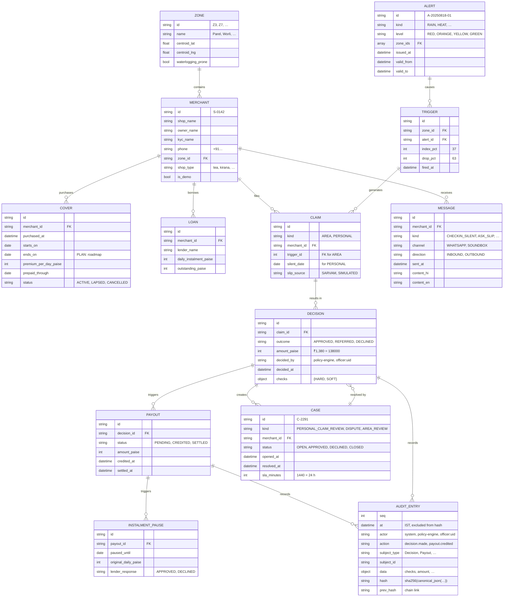
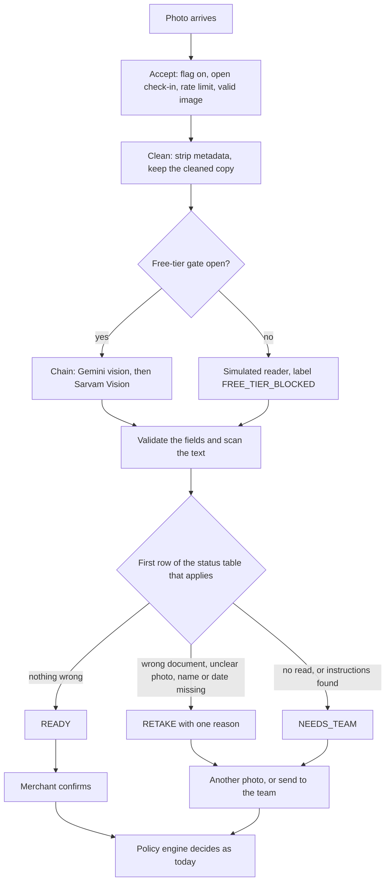

# Data model and API

| | |
|---|---|
| Status | Draft v1 · 2 Oct 2026 |
| Owner | Ujjwal Pardeshi |
| Audience | Frontend developers, judges, integration partners |
| Related | [System architecture](system-architecture.md) · [SPEC.md](../SPEC.md) · [INTEGRATIONS.md](../INTEGRATIONS.md) |

## TL;DR

- **Domain model:** frozen pydantic models (Merchant, Cover, Loan, Alert, Decision, Payout, Case, ...). Money is integer paise, with a `*_label` string made by `format_inr`. Times are timezone-aware IST.
- **Storage:** an in-memory store rebuilt on every scenario load, and an append-only, hash-chained audit log in a private in-memory SQLite database. Artefacts (model, backtest, premiums) are committed files.
- **IDs:** `S-0142` merchant, `D-000142` decision, `CL-000142` claim, `C-2291` case (the first case after a fresh load), `A-20250818-01` alert, `E-Z7-20250819` trigger. Sequence ids restart on every scenario load.
- **API (BUILT):** 57 route handlers (section 4.1). Envelope: `{ok, data}`, `{ok, data, meta}` for lists, `{ok: false, error: {code, message, fields?}}` for errors. Error codes are the 13 status names plus `no_scenario` (section 4.3).
- **Feature additions (section 5, BUILT, each behind its flag where it has one):** 18 endpoints for the mini-app and its cover, claims and receipt views, Ask Chhatri, the slip pre-check, voice, the grievance ladder, the consent centre and "forget my slip", the provider fallback switch, the published evaluation, the ops strip and the what-if panel. Each ships behind a feature flag (a flag that is off answers 404). Changes to existing endpoints are in 5.12.
- **Mock parity:** every section 5 endpoint has an entry in the in-browser mock backend (`frontend/src/mock`), so the static demo works with no server (section 6).
- **Limits (BUILT):** per client address per minute, `messages` 60, `uploads` 20, `webhooks` 60; 32 open event streams; images and audio at most 5 MB, audio at most 30 seconds (`backend/chhatri/api/security.py`, `uploads.py`).

## 1. Domain model

### 1.1 Entity-relationship diagram



### 1.2 Key entities and fields (Python models)

**Zone** (24 BMC wards, SPEC §5):
```
id: "Z3" | "Z7" | "Z12" | ...    # 24 zones, all covering all 1,821 merchants
ward: str                         # e.g. "Parel"
name: str                         # e.g. "Zone 3 – Parel (Z3)"
centroid_lat, centroid_lng: float # for hex layer
waterlogging_prone: bool          # advisory
```

**Merchant** (fictional, seed 20251019):
```
id: str  Pattern: "^S-\d{4}$"     # S-0142, S-0907
shop_name: str                    # "Anil's Tea Stall"
owner_name: str                   # "Anil Ramesh Jadhav"
owner_name_hi: str                # Devanagari
kyc_name: str                     # "ANIL RAMESH JADHAV" (KYC name on PAN/Aadhaar)
phone: str  Pattern: "^\+91\d{10}$"
language: "HI" | "EN" | "MR"      # preferred merchant language
zone_id: str  FK to Zone.id       # Z7 for Anil
lat, lng: float                   # shop GPS location
h3_cell: str                      # h3 hex identifier (level 9)
shop_type: "tea" | "kirana" | …   # for LightGBM model
weekly_off: int | null            # 0 (Mon) – 6 (Sun)
is_demo: bool                     # S-0142, S-0907 are demo merchants
```

**Cover** (insurance policy):
```
id: str  UUID or sequential       # cover-uuid
merchant_id: str  FK to Merchant
purchased_at: datetime IST        # "2025-08-19 18:15:00+05:30"
starts_on: date                   # after waiting period
ends_on: date | null              # PLAN: annual renewal date
premium_per_day_paise: int        # ₹14.16/day → 1416 paise
prepaid_through: date | null      # premium paid via link until this date
status: "ACTIVE" | "LAPSED" | …   # cover in force
```

**Loan** (merchant daily instalment):
```
id: str                           # loan-id
merchant_id: str  FK to Merchant
lender_name: str                  # e.g. "NBFC Partner"
daily_instalment_paise: int       # ₹600/day → 60000 paise (Anil's case)
outstanding_paise: int            # remaining principal
```

**Alert** (weather or civic):
```
id: str  Pattern: "^A-\d{8}-\d{2}$"  # A-20250818-01 (date + counter)
kind: "RAIN" | "HEAT" | "CIVIC" | …  # IMD alert kind
level: "RED" | "ORANGE" | "YELLOW" | "GREEN"  # IMD colour code
zone_ids: tuple[str, …]           # zones affected
issued_at: datetime IST           # when IMD issued
valid_from, valid_to: datetime    # alert window
source: str                       # "IMD" or "civic-authority"
headline_en, headline_hi: str     # "Heavy rain warning"
```

**AreaTrigger** (transient, generated on-hour):
```
id: str
zone_id: str  FK
alert_id: str  FK
window_start, window_end: datetime  # 3-hour window [t-3h, t)
index_pct: int                    # 37 (37% of expected sales)
drop_pct: int                     # 63 (63% drop from expected)
hourly_index_pct: tuple[int, …]   # [35, 40, 36] last 3 hours
lower_bound_pct: int              # zone-specific, from model
shops_in_index: int               # quorum: ≥20
fired_at: datetime
```

**Claim** (claim request):
```
id: str  auto-generated
kind: "AREA" | "PERSONAL"
merchant_id: str  FK
trigger_id: str | null            # for AREA claim
silent_date: date | null          # for PERSONAL, e.g. 2025-08-20
claim_at: datetime                # when detected or filed
```

**Decision** (policy engine output):
```
id: str  auto-generated
claim_id: str  FK
outcome: "APPROVED" | "REFERRED" | "DECLINED"  # enum
amount_paise: int | null          # ₹1,380 → 138000 (null if REFERRED/DECLINED)
decided_by: str  "policy-engine" or "officer:{officer_id}"
decided_at: datetime IST
checks: dict                      # {HARD: [{code, status, fact}], SOFT: […]}
formula: str                      # "½ × ₹4,380 × 63%" (explanation template)
```

**Payout** (actual payment, ledger entry):
```
id: str
decision_id: str  FK
status: "PENDING" | "CREDITED" | "SETTLED"
amount_paise: int                 # from decision
credited_at: datetime | null      # when money landed
settled_at: datetime | null       # when recorded in settlement
```

**InstalmentPause** (K3 EDI holiday):
```
id: str
payout_id: str  FK
paused_until: date                # instalment move-to date
original_daily_paise: int         # for receipts
lender_response: "APPROVED" | "DECLINED"  # the lender's decision
```

**Message** (conversation):
```
id: str  auto-generated
merchant_id: str  FK
kind: enum  "CHECKIN_SILENT" | "ASK_SLIP" | "SLIP_TO_HUMAN" | …
channel: "WHATSAPP" | "SOUNDBOX" | "SMS"  # (SMS is roadmap)
direction: "INBOUND" | "OUTBOUND"
sent_at: datetime IST
content_hi, content_en: str       # localized
audio_url: str | null             # for voice messages
```

**Case** (escalation):
```
id: str  Pattern: "^C-\d{4}$"     # C-2291, deterministic per scenario load
kind: enum  "PERSONAL_CLAIM_REVIEW" | "DISPUTE" | "AREA_REVIEW"
merchant_id: str  FK
status: "OPEN" | "APPROVED" | "DECLINED" | "CLOSED"
opened_at: datetime
resolved_at: datetime | null
sla_minutes: int                  # 1440 (24 h) for disputes
```

**AuditEntry** (immutable, hash-chained):
```
seq: int                          # 1, 2, 3, …
at: datetime IST                  # when action occurred
actor: str                        # "system", "policy-engine", "officer:ujjwal", "merchant:S-0142"
action: str                       # "decision.made", "payout.credited", …
subject_type: str                 # "Decision", "Payout", "Case"
subject_id: str                   # the id of the affected entity
data: dict                        # context: decision checks, amount, message, …
hash: str  64 hex chars           # sha256(to_json({seq, at, actor, action, …, prev_hash}))
prev_hash: str                    # hash of entry (seq-1); genesis = "0"*64
recorded_at: datetime             # wall clock, excluded from hash (replay reproducible)
```

## 2. Storage architecture

### 2.1 In-memory SQLite per scenario load (SPEC §3)

When a scenario loads (`POST /api/replay/load` with `{"scenario": "monsoon"}`):

1. A new, empty store is created in memory (`Store(city)` in `backend/chhatri/replay/state.py`), with fresh ids and a fresh audit log; nothing is written to disk.
2. The tables are created: zones, merchants, covers, loans, alerts, claims, decisions, payouts, cases, messages, audit log.
3. Fixture data is inserted: 1,821 merchants, 24 zones, 2–3 alerts for the scenario.
4. Every subsequent query in that session reads/writes this database.
5. On scenario unload or server shutdown, the database is closed (data is lost unless you export it).

**Rationale:** determinism. Scenario loading must be reproducible; a fresh DB per load ensures exact same ids, same order, no state leakage between replays.

### 2.2 Artefacts (read-only, committed)

```
backend/artifacts/
├── model/                           # LightGBM model files (trained)
│   ├── model_{zone_id}.pkl          # per-zone quantile regressor (p10/p50/p90)
│   └── features.json                # feature names, preprocessing
├── backtest/
│   ├── monsoon_2024_report.html     # vs weather-only trigger
│   └── monsoon_2025_report.html
├── calibration.json                 # {zone_id: {lower_bound_pct, confidence}}
├── premiums.json                    # {zone_id: {daily_paise, annual_limit}}
└── MANIFEST.json                    # metadata: build date, hashes, model version
```

Built once by `make data` (calls `backend/scripts/build_data.py`). Never rebuilt during tests. Committed to git so demos don't need to run the expensive data pipeline.

### 2.3 Audit log (SQLite, hash-chained)

Stored in the same scenario database; append-only table:

```sql
CREATE TABLE audit_log (
    seq INTEGER PRIMARY KEY,
    at TEXT NOT NULL,                -- "2025-08-19T17:04:00+05:30"
    actor TEXT NOT NULL,              -- "policy-engine", "officer:xyz"
    action TEXT NOT NULL,             -- "decision.made"
    subject_type TEXT NOT NULL,       -- "Decision"
    subject_id TEXT NOT NULL,         -- decision id
    data TEXT NOT NULL,               -- JSON: {checks: […], amount_paise: …}
    hash TEXT NOT NULL UNIQUE,        -- sha256(…)
    prev_hash TEXT NOT NULL,          -- link to previous
    recorded_at TEXT NOT NULL         -- wall-clock, excluded from hash
);
```

**Verification:** `GET /api/audit/verify` recomputes every hash from genesis to head. If a single byte is tampered, verification fails at that entry. Hash is also visible on audit-log web page.

## 3. ID formats (deterministic)

### 3.1 ID factories

Every ID is deterministic per `CHHATRI_SEED`. On scenario load, the factory is recreated with the same seed, so the first case is always `C-2291`, first alert is always `A-20250818-01`.

**Merchant ID:** `S-{merchant_index}`
- Example: `S-0142` (Anil), `S-0907` (Ramesh).
- Format: S-NNNN (4 digits, zero-padded).
- Generated once at city initialization; never changes.

**Case ID:** `C-{case_counter}`
- Example: `C-2291` (first case of the scenario).
- Format: C-NNNN (4 digits, zero-padded).
- Counter increments per scenario load; reset on scenario reload.

**Alert ID:** `A-{YYYYMMDD}-{counter}`
- Example: `A-20250818-01` (monsoon scenario, first alert on 18 Aug).
- Format: A-CCCCCCCC-NN (date + 2-digit counter).
- Deterministic per scenario and IMD alert sequence.

**Decision ID:** auto-UUID (deterministic hash-based pseudo-UUID per seed + claim_id).

**Payout ID:** sequential, e.g. `payout-123`.

**Message ID:** sequential, e.g. `msg-456`.

**Audit Entry:** sequential `seq: 1, 2, 3, …` (starting at 1 per scenario).

Implementation: `backend/chhatri/ids.py` exports factory functions; tests seed them at start.

## 4. Existing API: routes and methods

### 4.1 Route table (API: 57 route handlers)

| Router | Method | Path | Purpose | Auth | SPEC § |
|---|---|---|---|---|---|
| **meta** | GET | `/api/health` | Health check: `{status, version, seed}` | none | 19 |
| | GET | `/api/integrations` | Status of each component (LIVE/SIMULATED) | none | 0.1 |
| | GET | `/api/session` | Demo mode: hand officer token to console | none | 19 |
| | GET | `/api/preflight` | Readiness: artefacts, scenario, integrations | none | 19 |
| | GET | `/api/weather/now` | Live Open-Meteo rain (wall-clock time) | none | 14.4 |
| **live** | GET | `/api/geo/zones` | Zone polygons and properties (GeoJSON) | none | 19.1 |
| | GET | `/api/geo/hexes` | H3 hex layer for map (GeoJSON) | none | 19.1 |
| | GET | `/api/state` | Full snapshot: clock, zones, hexes, KPIs, triggers | none | 19.1 |
| | GET | `/api/zones/{zone_id}` | Zone detail: area index, KPIs, trigger history | none | 19.1 |
| **replay** | POST | `/api/replay/load` | Load scenario; all ids reset | none | 19.2 |
| | POST | `/api/replay/play` | Start background clock (6 min/s) | none | 19.2 |
| | POST | `/api/replay/pause` | Pause clock | none | 19.2 |
| | POST | `/api/replay/step` | Advance N simulated minutes | none | 19.2 |
| | POST | `/api/replay/seek` | Jump to HH:MM (reload if backward) | none | 19.2 |
| | POST | `/api/replay/reset` | Unload scenario | none | 19.2 |
| **merchants** | GET | `/api/merchants` | List merchants (filterable by zone, search) | none | 19.2 |
| | GET | `/api/merchants/{merchant_id}` | Merchant detail: cover, loan, payouts, decisions | none | 19.2 |
| | GET | `/api/merchants/{merchant_id}/messages` | Conversation history | none | 19.2 |
| **phone** | POST | `/api/merchants/{merchant_id}/messages` | Send/receive WhatsApp message | none | 14.2 |
| | POST | `/api/merchants/{merchant_id}/voice` | Upload voice note (Sarvam STT) | none | 14.1 |
| | POST | `/api/merchants/{merchant_id}/photo` | Upload slip or claim photo (6 MB) | none | 14.1 |
| | POST | `/api/merchants/{merchant_id}/voice-demo` | Demo voice (no processing) | none | 14.2 |
| **cases** | GET | `/api/cases` | List open cases (filterable by status) | none | 12 |
| | GET | `/api/cases/{case_id}` | Case detail: history, SLA clock, resolution | none | 12 |
| | POST | `/api/cases/{case_id}/approve` | Officer approves case | officer | 12 |
| | POST | `/api/cases/{case_id}/decline` | Officer declines case | officer | 12 |
| **records** | GET | `/api/payouts` | Payout ledger (paginated) | none | 10 |
| | GET | `/api/decisions/{decision_id}` | Decision detail: checks, formula, audit hash | none | 9 |
| | GET | `/api/audit` | Audit log (paginated, hashable) | none | 11 |
| | GET | `/api/audit/verify` | Verify hash chain integrity | none | 11 |
| | GET | `/api/policy` | Active policy rules and thresholds (SPEC §13.3) | none | 13.3 |
| | GET | `/api/backtest` | Backtest results and calibration stats | none | SPEC |
| **premium** | POST | `/api/premium/link` | Quote cover and payment link (officer auth) | officer | 6, 9.7 |
| **webhooks** | GET | `/webhooks/whatsapp` | WhatsApp verification challenge | VERIFY_TOKEN | 14.2 |
| | POST | `/webhooks/whatsapp` | WhatsApp inbound messages (from Meta) | X-Hub-Signature-256 (app secret) | 14.2 |
| | POST | `/api/webhooks/paytm` | Paytm payment settlement notification | PAYTM checksum | 14.3 |
| **stream** | GET | `/api/stream` | SSE subscribe (Last-Event-ID resume) | none | 19.1 |
| **internal** | POST | `/internal/workflows/{step}` | n8n → backend callback (n8n live mode) | X-Chhatri-Secret | 15 |
| **media** | GET | `/api/media/{media_id}` | Stored media: voice notes and slip images | none | 14.1 |
| **merchants** (section 5) | GET | `/api/merchants/{merchant_id}/cover` | Cover card with the derived status (5.1) | none | 5.1 |
| | GET | `/api/merchants/{merchant_id}/claims` | Claim tracker items (5.1) | none | 5.1 |
| **records** (section 5) | GET | `/api/decisions/{decision_id}/receipt` | Decision receipt with sources and counterfactual (5.8) | none | 5.8 |
| **ask** | POST | `/api/merchants/{merchant_id}/ask` | Ask Chhatri, flag `n2_ask_chhatri` (5.2) | none | 5.2 |
| **precheck** | POST | `/api/merchants/{merchant_id}/slip-precheck` | Read a slip and run the gate, flag `n3_slip_precheck` (5.3) | none | 5.3 |
| | POST | `/api/merchants/{merchant_id}/slip-precheck/{precheck_id}/confirm` | Confirm, or send to the team (5.3) | none | 5.3 |
| **grievances** | GET | `/api/merchants/{merchant_id}/grievances` | Grievance ladder, flag `n5_grievances` (5.4) | none | 5.4 |
| | POST | `/api/merchants/{merchant_id}/grievances` | Open, escalate or resolve (5.4) | none | 5.4 |
| **consents** | GET | `/api/merchants/{merchant_id}/consents` | Consent centre, flag `n6_consents` (5.5) | none | 5.5 |
| | GET | `/api/merchants/{merchant_id}/consents/activity` | What was used, for what, when (5.5) | none | 5.5 |
| | POST | `/api/merchants/{merchant_id}/consents/{consent_id}/withdraw` | Turn a purpose off (5.5) | officer | 5.5 |
| | POST | `/api/merchants/{merchant_id}/slips/{slip_id}/forget` | Erase a slip (5.5) | officer | 5.5 |
| **fallback** | POST | `/api/integrations/{component}/fallback` | Force or release a fallback, flag `x6_provider_panel`, demo mode (5.6) | officer | 5.6 |
| **ops** | GET | `/api/ops/summary` | Ops counts, flag `h8_ops_strip` (5.7) | none | 5.7 |
| **whatif** | POST | `/api/whatif/area` | Read-only engine re-run, flag `h24_whatif` (5.9) | none | 5.9 |
| **evals** | GET | `/api/evals/summary` | Stored evaluation results, flag `h25_evals` (5.10) | none | 5.10 |
| **voice** | POST | `/api/voice/stt` | Speech to text with chips, flag `n4_voice` (5.11) | none | 5.11 |
| | POST | `/api/voice/tts` | Text to speech (5.11) | none | 5.11 |

### 4.2 Request/response envelope (SPEC §19)

**Success response:**
```json
{
  "ok": true,
  "data": {
    "id": "S-0142",
    "shop_name": "Anil's Tea Stall",
    ...
  }
}
```

**Success list:**
```json
{
  "ok": true,
  "data": [
    {"id": "S-0142", ...},
    {"id": "S-0143", ...}
  ],
  "meta": {
    "total": 1821,
    "limit": 50,
    "offset": 0
  }
}
```

**Error response:**
```json
{
  "ok": false,
  "error": {
    "code": "invalid_merchant_id",
    "message": "merchant S-9999 not found",
    "fields": {
      "merchant_id": "not in this scenario"
    }
  }
}
```

### 4.3 Error codes

Every failure leaves the API in the envelope of 4.2. The `code` is the default name of the HTTP status (`CODE_BY_STATUS` in `backend/chhatri/api/errors.py`), unless a route passes its own code with `ApiError(status, message, code=...)`. Besides `no_scenario`, the section 5 routes add five own codes, all on 409 (the last table). A client should treat the HTTP status as the stable part and the code as a string it may not know.

| Code | HTTP | Where it comes from today |
|---|---|---|
| `bad_request` | 400 | Reserved for a request the framework rejects as unreadable. No route raises it itself |
| `unauthorized` | 401 | No officer bearer token on an officer route (with `WWW-Authenticate: Bearer`), or no `X-Chhatri-Secret` on `/internal/workflows/{step}` |
| `forbidden` | 403 | A wrong officer token or internal secret, a bad Paytm checksum, or a failed WhatsApp verification or signature |
| `not_found` | 404 | An unknown path, merchant, zone, case, decision, media id, payment link or workflow subject. Also `GET /api/session` outside demo mode, a backtest report that was not generated, and live weather when `OPENMETEO_LIVE` is false |
| `method_not_allowed` | 405 | A wrong method on an existing path |
| `conflict` | 409 | An officer action on a case that is not OPEN, a workflow step that is not valid for its run, and a slip pre-check with no open silence check-in (5.3) |
| `no_scenario` | 409 | No scenario is loaded. `POST /api/replay/load` first |
| `payload_too_large` | 413 | An image over 5 MB, audio over 5 MB or 30 seconds, or another upload over its limit |
| `unsupported_media_type` | 415 | An image that is not JPEG, PNG or WebP, audio that is not OGG/Opus, WebM, MP3, WAV or M4A, a damaged file, or a photo request that is neither multipart nor JSON |
| `validation_error` | 422 | A body, query or path that fails validation, with a `fields` map of `{field: reason}`. A merchant id must match `S-` plus four digits and a decision id `D-` plus at least six. Inputs are never echoed |
| `rate_limited` | 429 | A route group went over its per-minute limit, or 32 event streams are already open. Both carry `Retry-After` |
| `internal` | 500 | Any unhandled exception. The body has no stack trace, exception text or secret |
| `upstream_error` | 502 | The payment link service or the weather service failed |
| `unavailable` | 503 | The service is still starting, a scenario could not be loaded (see `/api/preflight`), or WhatsApp is not live in the loaded runtime |

The mock backend answers with the same lower-case codes, and a body that is not JSON is a 422 with `fields.body` there too (section 6.1 lists what it once lacked).

Codes that the section 5 routes add, all on HTTP 409:

| Code | Raised by | When |
|---|---|---|
| `mentions_unconfirmed` | `POST /api/merchants/{id}/ask` (5.2) | A voice question whose amount and date chips are not all confirmed. `fields.mentions` lists the ids |
| `consent_required` | `POST /api/merchants/{id}/slip-precheck` (5.3) | `n6_consents` is on and the merchant has no ACTIVE slip consent, and the request did not carry one |
| `already_withdrawn` | `POST .../consents/{consent_id}/withdraw` (5.5) | The consent is already withdrawn |
| `case_open` | `POST .../consents/{consent_id}/withdraw` and `POST .../slips/{slip_id}/forget` (5.5) | An OPEN review case needs the data: the sales consent cannot be withdrawn and the slip cannot be erased until it is answered |
| `already_erased` | `POST .../slips/{slip_id}/forget` (5.5) | The slip was erased before |

## 5. Feature API surface (18 endpoints, all P0)

Every endpoint in this section is BUILT in the working tree of 2 Oct 2026 (they were PLANNED at commit 86575ea, where the route table had 39 handlers; section 4.1 now has 57). Each route is pinned by `backend/tests/api/test_route_table.py`, and the flagged ones by `test_feature_routes.py`. **This section is the single source of truth for every path, request, response and error of these features.** Feature specs link here. If a spec and this section differ, this section wins and the spec is corrected. The build order, file lists and tests for each endpoint are in the [implementation guide](implementation-guide.md).

Everything here is P0 (team decision, 2 Oct 2026). The work runs in waves behind feature flags. A route whose flag is off answers 404 `not_found`, as if it did not exist, so nothing is shown half-working.

### 5.0 Index and conventions

| # | Method and path | Feature | Wave | Flag | Rate group | Auth | Spec |
|---|---|---|---|---|---|---|---|
| 1 | GET `/api/merchants/{merchant_id}/cover` | N1 | 1 | none (read-only) | none | none | [fs-04](../02-product/feature-specs/fs-04-merchant-mini-app.md) |
| 2 | GET `/api/merchants/{merchant_id}/claims` | N1, H1 | 1 | none (read-only) | none | none | fs-04 |
| 3 | GET `/api/decisions/{decision_id}/receipt` | H2, H3, H13, H14 | 1 | none (read-only) | none | none | [fs-09](../02-product/feature-specs/fs-09-policy-engine-and-audit.md) |
| 4 | POST `/api/merchants/{merchant_id}/ask` | N2, H16, H17, H19, H21, H26 | 2 | `n2_ask_chhatri` | messages | none | [fs-05](../02-product/feature-specs/fs-05-ask-chhatri.md) |
| 5 | POST `/api/merchants/{merchant_id}/slip-precheck` | N3, H15, H16, H26 | 2 | `n3_slip_precheck` | uploads | none | [fs-02](../02-product/feature-specs/fs-02-hospital-cash-claim.md) |
| 6 | POST `/api/merchants/{merchant_id}/slip-precheck/{precheck_id}/confirm` | N3, H15 | 2 | `n3_slip_precheck` | messages | none | fs-02 |
| 7 | POST `/api/voice/stt` | N4, H18, H26 | 2 | `n4_voice` | uploads | none | fs-05 |
| 8 | POST `/api/voice/tts` | N4, H26 | 2 | `n4_voice` | uploads | none | fs-05 |
| 9 | POST `/api/integrations/{component}/fallback` | X6, H26 | 2 | `x6_provider_panel` | none | officer token, demo mode only | [fs-08](../02-product/feature-specs/fs-08-claims-officer-console.md) |
| 10 | GET `/api/merchants/{merchant_id}/grievances` | N5, H22 | 3 | `n5_grievances` | none | none | [fs-06](../02-product/feature-specs/fs-06-explanations-disputes-and-grievance.md) |
| 11 | POST `/api/merchants/{merchant_id}/grievances` | N5, H22 | 3 | `n5_grievances` | messages | none | fs-06 |
| 12 | GET `/api/merchants/{merchant_id}/consents` | N6 | 3 | `n6_consents` | none | none | [fs-07](../02-product/feature-specs/fs-07-cover-purchase-and-consent.md) |
| 13 | POST `/api/merchants/{merchant_id}/consents/{consent_id}/withdraw` | N6 | 3 | `n6_consents` | messages | officer token (demo session) | fs-07 |
| 14 | GET `/api/merchants/{merchant_id}/consents/activity` | H23 | 3 | `n6_consents` | none | none | fs-07 |
| 15 | POST `/api/merchants/{merchant_id}/slips/{slip_id}/forget` | H23 | 3 | `n6_consents` | messages | officer token (demo session) | fs-07 |
| 16 | GET `/api/evals/summary` | H25 | 3 | `h25_evals` | none | none | [AI evaluation plan](ai-evaluation-plan.md) |
| 17 | GET `/api/ops/summary` | H8 | 4 | `h8_ops_strip` | none | none | fs-08 |
| 18 | POST `/api/whatif/area` | H24 | 4 | `h24_whatif` | `whatif` (new) | none | fs-08, fs-09 |

With all 18, the route table has 57 handlers and `SPEC_ROUTES` in `backend/tests/api/test_route_table.py` lists them (the guide, Wave 0, says how). Changes to existing endpoints, which add no route, are in section 5.12.

**Conventions that apply to every endpoint below**

| Topic | Rule |
|---|---|
| Envelope | Section 4.2: `{ok, data}`, `{ok, data, meta}` for lists, `{ok: false, error: {code, message, fields?}}` for errors. A list carries `meta {total, limit, offset}`. A merchant's own lists (claims, grievances, consents) are short and return everything in one page. Only the activity list takes `limit` and `offset`. |
| Money | Integer paise plus a `*_label` string made by `format_inr` (`₹1,380`, `₹18.62`, `₹4,25,420`). The app never calculates or formats money. |
| Times and ids | IST ISO timestamps. Ids are `XX-` plus digits (section 3), plus the prefixes in the last table of this section. Clause ids are `C1` to `C12` and `C4.1` to `C4.4`. |
| Errors | The codes in section 4.3, including the few 409 codes that carry their own name (`mentions_unconfirmed`, `consent_required`, `already_withdrawn`, `case_open`, `already_erased`). A malformed id is 422 `validation_error` with `fields`. A well-formed unknown id (merchant, decision, precheck, slip, consent) is 404 `not_found`. No scenario loaded is 409 `no_scenario`. A flag that is off is 404 `not_found`. |
| Unknown merchant | Every merchant-scoped route starts with the existing `merchant_or_404` helper (X5). |
| AI label (H26) | Every AI-backed response carries `mode` (`LIVE`, `FALLBACK` or `SIMULATED`), `provider` (`rules`, `gemini`, `sarvam`, `template`, `simulated`, `mock`, `browser`, `none`), `model` (the configured model id, null when no model ran), `fallback_reason` and `attempts` (one `{provider, outcome, ms}` per link tried). Reasons that give `SIMULATED`: `NO_KEY`, `MODEL_NOT_SET`, `MOCK_BACKEND`, `FREE_TIER_BLOCKED`. Reasons that give `FALLBACK`: `TIMEOUT`, `RATE_LIMITED`, `PROVIDER_ERROR`, `INVALID_REPLY`, `GUARD_BLOCKED`, `INJECTION_SUSPECTED`, and `FORCED` (a configured link the presenter switched off is blocked, not missing). A model failure is never an HTTP error: the answer is 200 with a template and a FALLBACK or SIMULATED label. |
| Rate limits | Per client address, per minute, existing groups (`backend/chhatri/api/security.py`): `messages` 60, `uploads` 20, `webhooks` 60. The group of each route is in the index. A hit is 429 `rate_limited` with `Retry-After`. The what-if route gets a group of its own (`whatif` 300) because a slider sends several requests a second. Whether the free-tier model quota needs a lower group for the AI routes is an open point (implementation guide, open question 4). |
| Audit | Every write appends hash-chained audit entries. The action names are listed per endpoint and, all together, in 5.12. Entries never hold a merchant's free text, a transcript or a slip value. One BUILT exception remains until Wave 3: the NAME_MATCHES_KYC check text inside a decision entry quotes the patient name (5.5) |
| Idempotency | A repeated OPEN of the same grievance returns the existing one (200) and writes nothing new. A repeated fallback switch returns the same row. A repeated confirm is 409 `conflict`, a repeated withdraw is 409 `already_withdrawn` and a repeated erase is 409 `already_erased`, because each would change nothing and the app should say so. |
| No money, no tools | No AI-backed endpoint decides, changes or promises an amount. Only the policy engine decides money. The two chat actions that exist today (open a dispute, make a cover quote) run only when the word-list rules matched the text, never because a model chose them. |
| Mock parity | Every endpoint in the index has an entry in the mock backend (section 6), so the static demo (N7) works with no server. |

**New id prefixes introduced by this section** (section 3.1 gains them when each endpoint lands)

| Prefix | Meaning | Example | Where |
|---|---|---|---|
| `AQ-` | An Ask Chhatri question and answer | `AQ-000007` | 5.2 |
| `ST-` | A speech-to-text result | `ST-000001` | 5.11 |
| `PC-` | A slip pre-check | `PC-000001` | 5.3 |
| `GR-` | A grievance | `GR-000001` | 5.4 (fs-06 section 8.1) |
| `HR-` | An EDI holiday request to the lender | `HR-000001` | 5.1, 5.8 (fs-03 section 7.5) |
| `CN-` | A consent record (fs-07 section 9.2) | `CN-000001` | 5.5 |

### 5.1 N1: Merchant mini-app (cover and claims)

Both routes are read-only and ship in Wave 1 with the mini-app core. The screens that read them are in [fs-04](../02-product/feature-specs/fs-04-merchant-mini-app.md). Fields marked **new** are those fs-04 section 6.2 asks for.

#### GET `/api/merchants/{merchant_id}/cover` — Cover card

Returns the merchant's cover as the home screen and the buy screen need it. The status is derived from `starts_on` and the replay date, not stored (fs-07 specifies the fix for a purchased cover that stays WAITING today).

```http
GET /api/merchants/S-0142/cover
```

```json
{
  "ok": true,
  "data": {
    "merchant_id": "S-0142",
    "cover_id": "CV-0142",
    "status": "ACTIVE",
    "status_text_hi": "आपका कवर चालू है। प्रीमियम 22 अगस्त तक जमा है।",
    "status_text_en": "Your cover is active. Premium is paid through 22 August.",
    "zone_id": "Z7",
    "zone_name": "Parel · Lalbaug",
    "purchased_at": "2025-03-10T11:00:00+05:30",
    "starts_on": "2025-03-17",
    "prepaid_through": "2025-08-22",
    "waiting_period_days": 7,
    "premium_per_day_paise": 1862,
    "premium_per_day_label": "₹18.62",
    "premium_due": false,
    "annual_limit_paise": 3000000,
    "annual_limit_label": "₹30,000",
    "amount_claimed_paise": 138000,
    "amount_claimed_label": "₹1,380",
    "amount_remaining_paise": 2862000,
    "amount_remaining_label": "₹28,620",
    "alert_active": true,
    "alert_id": "A-20250818-01"
  }
}
```

The example is Anil at 17:05 of the monsoon replay. The two status sentences are the existing catalogue key COVER_STATUS_ACTIVE (checked against the running API on 2 Oct 2026). The price reads ₹18.62 because Wave 1 fixes the seeding of pilot covers: today they carry the ₹2 minimum instead of their zone's price, so `GET /api/merchants/S-0142` shows ₹2.

| Field | Meaning |
|---|---|
| `status` | `NONE` (new, no cover record), `PENDING_PAYMENT`, `WAITING`, `ACTIVE`, `LAPSED` or `CANCELLED`. `NONE` is an API value only: the stored enum has the other five |
| `cover_id` | `CV-` plus the merchant number for a pilot cover, `CV-{merchant id}-{YYYYMMDD}` for a cover bought through a link. Null when `status` is `NONE` |
| `status_text_hi`, `status_text_en` (new) | The catalogue sentence COVER_STATUS_ACTIVE, COVER_STATUS_STARTS or COVER_STATUS_UNPAID, rendered by the backend. For `NONE`, the proposed key COVER_STATUS_NONE |
| `zone_id`, `zone_name` | From the merchant, not from the cover record |
| `premium_due` | `prepaid_through` is missing or before the replay date (the test behind COVER_STATUS_UNPAID) |
| `amount_claimed_*`, `amount_remaining_*` | Paid in the rolling 365 days and what is left of the annual limit |
| `alert_active`, `alert_id` (new) | An alert for the merchant's zone is valid now, and which one |

A merchant with no cover (Ramesh, S-0907) gets `status: "NONE"`, `cover_id: null`, the zone and the price his zone would pay (`premium_per_day_label` `₹14.16`), and nulls for the dates and amounts.

Errors: 404 `not_found` (unknown merchant), 409 `no_scenario`.

#### GET `/api/merchants/{merchant_id}/claims` — Claim tracker

Returns one item per claim and one per dispute, newest first. The five steps are the tracker of H1. The rows of "what each step shows in each situation" are in fs-04 section 9.5; this section defines the fields.

```http
GET /api/merchants/S-0142/claims
```

```json
{
  "ok": true,
  "data": [
    {
      "claim_id": null,
      "disputed_claim_id": "CL-000142",
      "kind": "DISPUTE",
      "claim_at": "2025-08-19T17:12:00+05:30",
      "zone_id": "Z7",
      "trigger_id": null,
      "decision_id": "D-000142",
      "outcome": "APPROVED",
      "amount_paise": 138000,
      "amount_label": "₹1,380",
      "steps": [],
      "case_id": "C-2291",
      "case_status": "OPEN",
      "due_by": "2025-08-20T17:12:00+05:30",
      "resolution": null
    },
    {
      "claim_id": "CL-000142",
      "disputed_claim_id": null,
      "kind": "AREA",
      "claim_at": "2025-08-19T17:00:00+05:30",
      "zone_id": "Z7",
      "trigger_id": "E-Z7-20250819",
      "decision_id": "D-000142",
      "outcome": "APPROVED",
      "amount_paise": 138000,
      "amount_label": "₹1,380",
      "steps": [
        {"name": "Detected", "status": "completed", "result": null, "at": "2025-08-19T17:00:00+05:30",
         "reason_hi": "अलर्ट के दौरान आपके इलाके की बिक्री 63% गिरी।",
         "reason_en": "Your area's sales fell 63% during the alert.", "reason_code": null},
        {"name": "Checked", "status": "completed", "result": null, "at": "2025-08-19T17:00:00+05:30",
         "reason_hi": "सभी 9 जाँचें पास हुईं।",
         "reason_en": "All 9 checks passed.", "reason_code": null},
        {"name": "Decided", "status": "completed", "result": "APPROVED", "at": "2025-08-19T17:00:00+05:30",
         "reason_hi": "आपके भुगतान का हिसाब: ₹4,380 का 63% = ₹2,759.40; उसका आधा = ₹1,380",
         "reason_en": "How your payout was worked out: ½ × ₹4,380 × 63% = ₹1,380", "reason_code": null},
        {"name": "Paid", "status": "completed", "result": null, "at": "2025-08-19T17:04:00+05:30",
         "reason_hi": "आज के सेटलमेंट के साथ जमा",
         "reason_en": "Credited with today's settlement", "reason_code": null},
        {"name": "EDI holiday", "status": "completed", "result": "GRANTED", "at": "2025-08-19T17:05:00+05:30",
         "reason_hi": "कल की ₹600 की किस्त रोक दी गई है।",
         "reason_en": "Tomorrow's ₹600 instalment is paused.", "reason_code": null}
      ],
      "case_id": null,
      "case_status": null,
      "due_by": null,
      "resolution": null
    }
  ],
  "meta": {"total": 2, "limit": 2, "offset": 0}
}
```

The example is Anil after he says "my loss was bigger" at 17:12 (the first case after a fresh load is always C-2291). The Decided, Paid and EDI lines reuse existing catalogue strings (EXPLAIN_AREA_FORMULA, PAYOUT_CARD, INSTALMENT_PAUSED). The Detected and Checked lines are proposed catalogue keys. After X4 the EDI line becomes the lender-decides wording (HOLIDAY_GRANTED, proposed in fs-03 section 8.2).

| Field | Meaning |
|---|---|
| `claim_id` | `CL-` plus six digits. Null on a DISPUTE item, which carries `case_id` and `disputed_claim_id` instead |
| `kind` | `AREA`, `PERSONAL` or `DISPUTE` (new). A DISPUTE item is a separate card about the merchant's latest paid decision |
| `trigger_id` | The area trigger (`E-Z7-20250819`). Null for PERSONAL and DISPUTE |
| `decision_id` | Null until the Checked step completes |
| `outcome`, `amount_paise`, `amount_label` (new) | The decision's outcome (`APPROVED`, `REFERRED` or `DECLINED`) and amount once checked, never recomputed in the app. On a DISPUTE item they are the disputed decision's, and **the amount never changes** |
| `steps[]` | Empty on a DISPUTE item. Otherwise five steps in this order: `Detected`, `Checked`, `Decided`, `Paid`, `EDI holiday` |
| `steps[].status` | `completed`, `current`, `pending` or `skipped` (new, for example Paid and EDI holiday after a DECLINED decision, or EDI holiday with no loan) |
| `steps[].result` (new) | On Decided: `APPROVED`, `REFERRED` or `DECLINED`. On EDI holiday: `GRANTED`, `REFUSED`, `NO_LOAN` or `NO_RESPONSE`. Null elsewhere |
| `steps[].reason_hi`, `steps[].reason_en` (new; today one `reason`) | Catalogue text or the engine's explanation, in both languages |
| `steps[].reason_code` (new) | Set only when the lender refuses: `FLAG_OFF`, `NOT_ACTIVE`, `IN_ARREARS` or `NO_ALLOWANCE` (upper case, as in fs-03 section 7.2). The merchant never sees it, the console does |
| `case_id`, `case_status`, `due_by`, `resolution` (new) | For REFERRED and DISPUTE items: the case (`C-2291`), its status (`OPEN`, `APPROVED`, `DECLINED` or `CLOSED`), the 24 hour clock from `dispute_sla_hours`, and the officer's note or the catalogue reason once the case is resolved |

Rules the contract enforces (a parser rejects the opposite, fs-04 section 9.4): an AREA item is never REFERRED, because area claims carry HARD checks only; a REFERRED item has a `case_id`; a DISPUTE item has no steps. A merchant with no claims gets `data: []` with `meta.total` 0.

Errors: 404 `not_found` (unknown merchant), 409 `no_scenario`.

### 5.2 N2: Ask Chhatri (grounded answers)

Wave 2, flag `n2_ask_chhatri`. BUILT: the route (`api/routers/ask.py`, `chhatri/ask/`), the Gemini → Sarvam → template chat chain, guard layer B and the injection and scam checks, on top of the word-list intents, the message catalogue and the `grounded()` guard. Gemini and Sarvam are LIVE only with their keys and an open data gate ([ADR 0009](adr/0009-synthetic-data-only-to-free-tier-ai.md)); they have been tested against fakes only. The pipeline, the grounding, the guard, the injection defence (H16), the scam warning (H19), the clause chips (H17) and the next action (H21) are specified in [fs-05](../02-product/feature-specs/fs-05-ask-chhatri.md). This section fixes the route.

#### POST `/api/merchants/{merchant_id}/ask` — Ask a question

| Field | Type | Rule |
|---|---|---|
| `question` | string | 1 to 500 characters after trimming. Untrusted text (H16) |
| `lang` | `hi` or `en` | Default is the merchant's language. `mr` arrives with N8 (Wave 4) |
| `stt_id` | string, optional | The `ST-` id of a voice question (5.11). The server then recomputes the amounts and dates in the final text and refuses the question with 409 `mentions_unconfirmed` unless each one is in `confirmed_mentions` |
| `confirmed_mentions` | list of strings, optional | Ids of the chips the merchant tapped (H18) |

```http
POST /api/merchants/S-0142/ask
Content-Type: application/json

{"question": "मुझे इतने ही पैसे क्यों मिले?", "lang": "hi"}
```

Response, a known intent answered by the rules on the day of the payout. No model runs, so `provider` is `rules` and `mode` is `LIVE`. The two sentences are the existing catalogue key EXPLAIN_AREA, filled with the engine's numbers (the day after, the date-neutral EXPLAIN_AREA_FORMULA is used instead, because EXPLAIN_AREA says "today"). The Hindi fact labels are proposed.

```json
{
  "ok": true,
  "data": {
    "ask_id": "AQ-000001",
    "intent": "WHY_AMOUNT",
    "intent_source": "rules",
    "lang": "hi",
    "answer": "आपका आम मंगलवार: ₹4,380। आज आपके इलाके की बिक्री 63% गिरी। छतरी खोई हुई बिक्री का आधा देती है।",
    "answer_en": "Your usual Tuesday: ₹4,380. Your area fell 63%. Chhatri pays half the lost sales.",
    "clauses": [
      {"id": "C4.1", "title": "Payout formula"},
      {"id": "C2", "title": "Coverage: Area income loss"}
    ],
    "facts_used": [
      {"key": "decision.latest.expected_day", "label_hi": "आपका आम मंगलवार", "label_en": "Your usual Tuesday", "value": "₹4,380",
       "sources": [{"kind": "FORECAST", "label": "Expected day, forecast P50 to the nearest ₹10", "ref": "forecast:S-0142:2025-08-19",
                    "as_of": "2025-08-19T17:00:00+05:30", "origin": "SIMULATED", "clause": "C4.1"}]},
      {"key": "decision.latest.drop_pct", "label_hi": "इलाके की बिक्री में गिरावट", "label_en": "Area sales fell", "value": "63%",
       "sources": [{"kind": "SALES_INDEX", "label": "Zone sales index for the alert window", "ref": "trigger:E-Z7-20250819",
                    "as_of": "2025-08-19T17:00:00+05:30", "origin": "SIMULATED", "clause": "C2"}]},
      {"key": "rules.payout_share", "label_hi": "खोई बिक्री का वह हिस्सा जो छतरी देती है", "label_en": "Share of lost sales we pay", "value": "50%",
       "sources": [{"kind": "RULES", "label": "Payout rules, pilot-0.1", "ref": "rules:pilot-0.1:payout_share",
                    "as_of": null, "origin": "CONFIG", "clause": "C4.1"}]}
    ],
    "next_action": {"kind": "SEE_CLAIM", "label_hi": "मेरा दावा देखें", "label_en": "See my claim"},
    "handoff": false,
    "case_id": null,
    "scam_warning": false,
    "mode": "LIVE",
    "provider": "rules",
    "model": null,
    "fallback_reason": null,
    "attempts": []
  }
}
```

Response, a question the rules cannot answer. It goes down the model chain: Gemini first, then Sarvam chat, then a template. This one shows a Gemini timeout answered by Sarvam. Ids, the model name and the times are illustrative, not measured.

```json
{
  "ok": true,
  "data": {
    "ask_id": "AQ-000002",
    "intent": "UNKNOWN",
    "intent_source": "rules",
    "lang": "en",
    "answer": "The yearly limit is ₹30,000 across all claims in any rolling 365 days.",
    "answer_en": "The yearly limit is ₹30,000 across all claims in any rolling 365 days.",
    "clauses": [{"id": "C4.3", "title": "Annual limit"}],
    "facts_used": [
      {"key": "rules.annual_limit", "label_hi": "साल की सीमा", "label_en": "Yearly limit", "value": "₹30,000",
       "sources": [{"kind": "RULES", "label": "Policy rules", "ref": "rules:pilot-0.1:annual_limit_rupees",
                    "as_of": null, "origin": "CONFIG", "clause": "C4.3"}]}
    ],
    "next_action": {"kind": "SEE_COVER", "label_hi": "मेरा कवर देखें", "label_en": "See my cover"},
    "handoff": false,
    "case_id": null,
    "scam_warning": false,
    "mode": "FALLBACK",
    "provider": "sarvam",
    "model": "sarvam-105b",
    "fallback_reason": "TIMEOUT",
    "attempts": [
      {"provider": "gemini", "outcome": "TIMEOUT", "ms": 3004},
      {"provider": "sarvam", "outcome": "OK", "ms": 1210}
    ]
  }
}
```

| Field | Meaning |
|---|---|
| `ask_id` | `AQ-` plus six digits. Only the answer of an earlier ask can be voiced (5.11) |
| `intent`, `intent_source` | One of the nine BUILT intents (`WHY_AMOUNT`, `DISPUTE_AMOUNT`, `REPORT_ILLNESS`, `BUY_COVER`, `COVER_STATUS`, `GREETING`, `AFFIRM`, `DENY`, `UNKNOWN`). `intent_source` is always `rules`: Ask classifies with the word lists only, so a model never chooses an intent. This also closes the BUILT path where a model-chosen DISPUTE_AMOUNT opened a case |
| `answer` | In `lang`. Several catalogue messages are joined with a newline (DISPUTE_AMOUNT: DISPUTE_ACK then CASE_CHIP, BUY_COVER: COVER_BLOCKED then COVER_LINK) |
| `answer_en` | Always English, so an officer or a judge can read it |
| `clauses[]` | Chips from the clause table (C1 to C12, C4.1 to C4.4). Every id is validated, and an unknown id blocks the answer |
| `facts_used[]` | Taken from the server's fact sheet (fs-05 section 5.1), never from model text. Each item has the shape of a receipt fact (5.8): `key`, a label in both languages, `value` and `sources[]`, every source a Source object of the closed list in 5.8. A fact without a source is not returned |
| `next_action` | `kind` is one of the closed set `SEE_CLAIM`, `SEE_COVER`, `GET_COVER`, `SEND_SLIP`, `TRACK_CASE`, `OPEN_CONSENTS`, `TALK_TO_TEAM`, `ASK_AGAIN`, chosen by the backend and never by the model (H21). The pre-check adds `CONFIRM_FIELDS`, `RETAKE_PHOTO` and `SEND_TO_TEAM` (5.3), which never appear in a model answer. Labels are proposed copy |
| `handoff` | True when the model declined (`can_answer` false) or the question is out of scope. The answer is then ASK_HANDOFF (proposed copy) and the label stays LIVE |
| `case_id` | Set when the rules opened a DISPUTE case |
| `scam_warning` | True when the deterministic scam check flagged the text (H19). The warning never blocks the question |
| `mode`, `provider`, `model`, `fallback_reason`, `attempts` | The H26 label (5.0) |

| Status | Code | When |
|---|---|---|
| 404 | `not_found` | unknown merchant, or the flag is off |
| 409 | `mentions_unconfirmed` | a voice question whose chips are not all confirmed. `fields.mentions` lists the ids |
| 409 | `no_scenario` | no scenario loaded |
| 422 | `validation_error` | empty or over-long question, bad `lang` |
| 429 | `rate_limited` | the `messages` group, 60 per minute per client |

Only synthetic demo data is ever sent to a free-tier model ([ADR 0009](adr/0009-synthetic-data-only-to-free-tier-ai.md)). When the data gate is closed the answer is a template with mode `SIMULATED` and reason `FREE_TIER_BLOCKED`. With the flag on, `POST /api/merchants/{id}/messages` sends UNKNOWN text through the same service (5.12). Audit: one `ask.answered` entry with the ask id, the intent, the label, the clause ids, the fact keys, the guard verdict, the scam flag, the next action and a hash of the answer, and never the question or the answer text.

### 5.3 N3: Slip pre-check (read, check the document, confirm)

Wave 2, flag `n3_slip_precheck`. Both routes are BUILT (`api/routers/precheck.py`, `chhatri/precheck/`). With the flag off the photo route (`POST /api/merchants/{id}/photo`) reads the slip and decides the claim in one step, so a bad photo becomes a referral and the merchant cannot retake it. The pre-check sits between the photo and the engine: it reads the slip, shows the merchant what was read, and **no claim is decided until the merchant confirms** or sends the slip to the team. The status table, the slot checklist, the confidence gate, the retake limit and the defence against instructions printed on a slip are specified in [fs-02](../02-product/feature-specs/fs-02-hospital-cash-claim.md) section 7.3. This section fixes the two routes.

With the flag on, the chat photo route hands the image to the same service, and its reply is a message whose `card` and `meta` carry the pre-check (fs-02 section 8.3). With the flag off both routes answer 404 `not_found`, the photo route behaves exactly as today and the golden demo flows do not change.

Which provider reads the slip: Gemini vision, then Sarvam Vision (both BUILT, each LIVE only with its key and an open data gate). The simulated reader, which returns the data embedded in the three sample slip images, answers only when the chain has no live link, when the free-tier gate is closed ([ADR 0009](adr/0009-synthetic-data-only-to-free-tier-ai.md)) or when the presenter forces fallback (5.6). It never stands in after a live link failed, so a simulated read is never shown as the fallback of a live one. Tesseract is a later option and is not in the Wave 2 chain.



#### POST `/api/merchants/{merchant_id}/slip-precheck` — Read a slip and run the gate

Request: `multipart/form-data` with a `file` part (JPEG, PNG or WebP, at most 5 MB, validated by content exactly as the photo route does), or JSON `{"sample": "anil_admission_slip.png"}` for the demo and the static demo (`{}` uses the loaded scenario's sample). An optional `lang` (`hi` or `en`) picks the language of the guidance text. A silence check-in must be open for the merchant, otherwise the route answers 409 `conflict` and stores nothing. With `n6_consents` on and no ACTIVE slip consent, the body also carries `consent: true` and `notice_version`; without both the route answers 409 `consent_required` and reads nothing ([fs-07](../02-product/feature-specs/fs-07-cover-purchase-and-consent.md) section 9.3).

```http
POST /api/merchants/S-0142/slip-precheck
Content-Type: application/json

{"sample": "anil_admission_slip.png", "lang": "hi"}
```

Response, READY, read by the simulated reader (no keys). The slot values are those embedded in the sample slip. The ids and the time are those of a local run of the `illness` scenario, where the voice note is `MD-000001`.

```json
{
  "ok": true,
  "data": {
    "precheck_id": "PC-000001",
    "merchant_id": "S-0142",
    "status": "READY",
    "attempt": 1,
    "retakes_left": 2,
    "media_id": "MD-000002",
    "document": {"type": "admission_slip", "accepted": true},
    "slots": [
      {"key": "patient_name", "value": "Anil R. Jadhav", "state": "READ", "note": null},
      {"key": "admission_date", "value": "2025-08-20", "state": "READ", "note": null},
      {"key": "discharge_date", "value": null, "state": "NOT_ON_SLIP", "note": null},
      {"key": "hospital_name", "value": "KEM Hospital, Parel", "state": "READ", "note": null}
    ],
    "checklist": [
      {"id": "photo_readable", "state": "PASS"},
      {"id": "name_on_slip", "state": "PASS"},
      {"id": "dates_on_slip", "state": "PASS"}
    ],
    "gate": {"passed": true, "confidence": 0.94, "minimum": 0.80},
    "reason": null,
    "guidance": null,
    "next_action": {"kind": "CONFIRM_FIELDS", "label_hi": "हाँ, सही है", "label_en": "Yes, this is right"},
    "source": {"kind": "SLIP", "label": "Hospital slip read", "ref": "slip:MD-000002",
               "as_of": "2025-08-21T11:25:00+05:30", "origin": "SIMULATED", "clause": "C3"},
    "mode": "SIMULATED",
    "provider": "simulated",
    "model": null,
    "fallback_reason": "NO_KEY",
    "attempts": []
  }
}
```

Response, RETAKE, a first upload of `blurry_slip.png` (only the fields that differ from the READY example; the sample reads at confidence 0.22 with no document type and no fields):

```json
{
  "precheck_id": "PC-000001",
  "status": "RETAKE",
  "media_id": "MD-000002",
  "document": {"type": null, "accepted": false},
  "slots": [
    {"key": "patient_name", "value": null, "state": "MISSING", "note": null},
    {"key": "admission_date", "value": null, "state": "MISSING", "note": null},
    {"key": "discharge_date", "value": null, "state": "NOT_ON_SLIP", "note": null},
    {"key": "hospital_name", "value": null, "state": "NOT_ON_SLIP", "note": null}
  ],
  "checklist": [
    {"id": "photo_readable", "state": "WARN"},
    {"id": "name_on_slip", "state": "WARN"},
    {"id": "dates_on_slip", "state": "WARN"}
  ],
  "gate": {"passed": false, "confidence": 0.22, "minimum": 0.80},
  "reason": "LOW_CONFIDENCE",
  "guidance": {"key": "SLIP_RETAKE_CLEAR",
               "text_hi": "फ़ोटो साफ़ नहीं है। रोशनी में, पर्ची सीधी रखकर, पूरी पर्ची की फ़ोटो भेजिए।",
               "text_en": "The photo is not clear. Please take it in good light, with the slip flat and fully in view."},
  "next_action": {"kind": "RETAKE_PHOTO", "label_hi": "दूसरी फ़ोटो भेजें", "label_en": "Send another photo"}
}
```

Response, NEEDS_TEAM, both live links failed (only the fields that differ from the RETAKE example; the times in `attempts` are illustrative, not measured):

```json
{
  "status": "NEEDS_TEAM",
  "gate": {"passed": false, "confidence": 0.0, "minimum": 0.80},
  "reason": "READ_FAILED",
  "guidance": {"key": "SLIP_NO_READ",
               "text_hi": "अभी पर्ची पढ़ी नहीं जा सकी। आप इसे हमारी टीम को भेज सकते हैं, वे इसे देखेंगे।",
               "text_en": "We could not read the slip just now. You can send it to our team, who will look at it."},
  "next_action": {"kind": "SEND_TO_TEAM", "label_hi": "हमारी टीम को भेजें", "label_en": "Send to our team"},
  "mode": "FALLBACK",
  "provider": "none",
  "model": null,
  "fallback_reason": "TIMEOUT",
  "attempts": [{"provider": "gemini", "outcome": "TIMEOUT", "ms": 3004},
               {"provider": "sarvam", "outcome": "PROVIDER_ERROR", "ms": 1210}]
}
```

| Field | Meaning |
|---|---|
| `precheck_id` | `PC-` plus six digits. Ids restart on every scenario load |
| `status` | `READY`, `RETAKE`, `NEEDS_TEAM`, `SUPERSEDED` (an older pre-check that a newer photo replaced) or, after the confirm route, `CONFIRMED` |
| `attempt`, `retakes_left` | The photo number for this check-in and the retakes still allowed. The limit is 3 photos per check-in (proposed in fs-02 section 7.3.5, to tune in the Wave 2 rehearsal), so `retakes_left` starts at 2 |
| `media_id` | The stored slip image (`MD-` plus six digits, the id the photo route uses). It is the `{slip_id}` of the erase route (5.5) |
| `document.type` | `admission_slip`, `discharge_summary`, `prescription`, `bill` (the four types the engine accepts, `MEDICAL_DOCUMENT_TYPES`), `other` (not accepted) or null when nothing could be read. `accepted` is true for the first four |
| `slots[]` | Four in fixed order: `patient_name` and `admission_date` (required, state `READ` or `MISSING`), `discharge_date` and `hospital_name` (optional, state `READ` or `NOT_ON_SLIP`). `note` is a catalogue key such as `SLIP_NOTE_NAME_NOT_LATIN` or null. There is no diagnosis slot: the schema never extracts one. Values are plain text, copied as printed |
| `checklist[]` | Three lines, one per slip check of the engine: `photo_readable`, `name_on_slip`, `dates_on_slip`. State `PASS` or `WARN`. It says only whether the slip shows what a check needs. It never says that a name matches the KYC name or that dates match the silent days, because showing a match early would invite trying slips until one passes |
| `gate` | `passed` is true when the document is accepted and `confidence` is at least `minimum`, which is `personal.slip_confidence_min` from the loaded rules (0.80 in `pilot-0.1`). The code holds no literal 0.80. `confidence` and `minimum` are for the console and the officer, and the merchant screens never show them |
| `reason` | Null for READY, otherwise one code of the table below |
| `guidance` | Null for READY, otherwise the catalogue key and the sentence in both languages. Hindi lines of proposed keys need a native review |
| `next_action.kind` | `CONFIRM_FIELDS`, `RETAKE_PHOTO` or `SEND_TO_TEAM`. They join the closed kinds of fs-05 section 9 |
| `source` | The Source object of 5.8 for the slip read: kind `SLIP`, clause `C3`, origin `LIVE` for a live reader and `SIMULATED` otherwise |
| `mode`, `provider`, `model`, `fallback_reason`, `attempts` | The H26 label (5.0). Providers for slips are `gemini`, `sarvam`, `simulated`, `mock` and `none`. `GUARD_BLOCKED` does not occur, because the reader writes no sentences |

The status is the first row of this closed table that applies (fs-02 section 7.3.5):

| Order | `reason` | When | Status | Guidance key |
|---|---|---|---|---|
| 1 | `READ_FAILED` | every live link failed or timed out, so there is no read | NEEDS_TEAM | `SLIP_NO_READ` |
| 2 | `INJECTION_SUSPECTED` | a strong instruction-like signal in a field value. The merchant sees the same text as for READ_FAILED, and the reason is in the audit and on the officer's evidence | NEEDS_TEAM | `SLIP_NO_READ` |
| 3 | `NOT_A_HOSPITAL_DOCUMENT` | the class is `other` | RETAKE | `SLIP_RETAKE_DOCUMENT` |
| 4 | `LOW_CONFIDENCE` | no name, no admission date and no class | RETAKE | `SLIP_RETAKE_CLEAR` |
| 5 | `NAME_MISSING` | `patient_name` is empty | RETAKE | `SLIP_RETAKE_NAME` |
| 6 | `DATES_NOT_CLEAR` | the admission date is missing or after the replay date, or the discharge date is before admission | RETAKE | `SLIP_RETAKE_DATE` |
| 7 | `LOW_CONFIDENCE` | name and date read, but the gate did not pass | RETAKE | `SLIP_RETAKE_CLEAR` |
| none | none | nothing above applies | READY | none |

A photo that is not READY when no retake is left becomes NEEDS_TEAM: `reason` keeps the retake reason and `guidance.key` is `SLIP_PHOTO_LIMIT`. A new upload while a pre-check is open supersedes it. After confirmation a new upload is refused with 409. A provider failure is never an HTTP error: it is a 200 with NEEDS_TEAM and a label. The slip text is untrusted (H16): the reply is validated against a fixed schema, only the four fields and the class are kept, and nothing printed on the paper is ever followed as an instruction.

| Status | Code | When |
|---|---|---|
| 404 | `not_found` | unknown merchant, an unknown sample name, or the flag is off |
| 409 | `conflict` | no silence check-in is open, or the claim was already filed |
| 409 | `consent_required` | `n6_consents` is on and no ACTIVE slip consent exists (5.5) |
| 413 | `payload_too_large` | image over 5 MB |
| 415 | `unsupported_media_type` | not JPEG, PNG or WebP, or damaged |
| 422 | `validation_error` | no file, bad `lang` |
| 429 | `rate_limited` | the `uploads` group, 20 per minute per client |

Audit: `slip.read` (BUILT, written for every read; it gains `precheck_id`, `attempt` and the label, and never holds a value), then `precheck.shown` (precheck id, status, reason, attempt).

#### POST `/api/merchants/{merchant_id}/slip-precheck/{precheck_id}/confirm` — Confirm, or send to the team

The merchant says that what was read matches the paper, or sends the slip to the team as it is. The merchant cannot type a correction: a corrected value would let a person make the slip match the KYC name, so the way out of a wrong read is another photo. Confirming never overrides a check. The engine still runs every check on the stored extraction, and the decision time is the minute of confirmation, so the credit and instalment-pause clocks start then.

| Field | Type | Rule |
|---|---|---|
| `action` | `CONFIRM` or `SEND_TO_TEAM` | Required. `CONFIRM` is allowed only while the status is `READY`. `SEND_TO_TEAM` is allowed while the status is `RETAKE` or `NEEDS_TEAM`, and files the claim with the slip as read (the BUILT empty read, source `read-failed`, when there is no read or when the text was flagged) |

```http
POST /api/merchants/S-0142/slip-precheck/PC-000001/confirm
Content-Type: application/json

{"action": "CONFIRM"}
```

```json
{
  "ok": true,
  "data": {
    "precheck_id": "PC-000001",
    "status": "CONFIRMED",
    "confirmed_as": "FIELDS_CONFIRMED",
    "claim_id": "CL-000001",
    "decision_id": "D-000001",
    "outcome": "APPROVED",
    "case_id": null,
    "messages": []
  }
}
```

The money text of an APPROVED claim is sent at credit time, as for every payout, so `messages` is empty. For REFERRED it holds the `SLIP_TO_HUMAN` variant and `CASE_CHIP`, and `case_id` is set. `confirmed_as` is `FIELDS_CONFIRMED` or `SENT_TO_TEAM`. A claim sent to the team is REFERRED unless an independent HARD check fails (such as no cover), which makes it DECLINED: a merchant cannot talk the engine into paying by choosing "send to the team".

| Status | Code | When |
|---|---|---|
| 404 | `not_found` | unknown merchant or pre-check, a pre-check of another merchant, or the flag is off |
| 409 | `conflict` | already confirmed, superseded by a newer photo, `CONFIRM` while not READY, or `SEND_TO_TEAM` while READY |
| 422 | `validation_error` | unknown action |
| 429 | `rate_limited` | the `messages` group, 60 per minute per client |

Audit: `precheck.confirmed` (actor `merchant:<id>`: precheck id, action, claim id), then the BUILT entries of a personal claim (`decision.personal`, and `case.open` when REFERRED).

### 5.4 N5: Grievance ladder (open, escalate, resolve)

Wave 3, flag `n5_grievances`. Both routes are BUILT (`api/routers/grievances.py`, `chhatri/cases/ladder.py`, `grievances.py`). The ladder steps, the respondent router (H22), the response clocks and the wording rules are specified in [fs-06](../02-product/feature-specs/fs-06-explanations-disputes-and-grievance.md) sections 5.4, 7 and 8. A grievance is stored in memory per scenario load, like a case. A merchant can also dispute by chat (intent DISPUTE_AMOUNT opens a DISPUTE case); the grievance route calls the same case-opening code, so a dispute opened either way is the same case.

#### GET `/api/merchants/{merchant_id}/grievances` — List grievances

Newest first. The list is not paged.

```json
{
  "ok": true,
  "data": [
    {
      "grievance_id": "GR-000001",
      "kind": "DISPUTE",
      "topic": "PAYOUT_AMOUNT",
      "respondent": "INSURER",
      "decision_id": "D-000142",
      "case_id": "C-2291",
      "status": "OPEN",
      "opened_at": "2025-08-19T17:12:00+05:30",
      "current_step": "PAYTM_DISPUTE",
      "ladder_steps": [
        {"level": 1, "id": "PAYTM_DISPUTE", "name": "Our claims officer", "state": "ACTIVE", "delivery": "IN_CHHATRI",
         "entered_at": "2025-08-19T17:12:00+05:30",
         "clock": {"kind": "OWN_SLA", "hours": 24, "due_by": "2025-08-20T17:12:00+05:30", "state": "RUNNING"}},
        {"level": 2, "id": "INSURER_GRO", "name": "The insurer's grievance officer", "state": "NOT_STARTED", "delivery": "SIMULATED",
         "clock": {"kind": "TO_CONFIRM", "note_en": "Response time to be confirmed with the insurer"}},
        {"level": 3, "id": "BIMA_BHAROSA", "name": "IRDAI Bima Bharosa portal", "state": "NOT_STARTED", "delivery": "SELF_REPORTED",
         "clock": {"kind": "PORTAL_STATED", "days": 14, "started_at": null,
                   "statement_en": "The portal says complaints are attended within 14 days"}},
        {"level": 4, "id": "OMBUDSMAN", "name": "Insurance Ombudsman", "state": "NOT_STARTED", "delivery": "SELF_REPORTED",
         "clock": {"kind": "TO_CONFIRM", "note_en": "No response time is stated. The service is free to the policyholder"}}
      ],
      "next_action": {"id": "ESCALATE_TO_INSURER_GRO", "label_en": "Send this to the insurer's grievance officer"}
    }
  ],
  "meta": {"total": 1, "limit": 1, "offset": 0}
}
```

The closed lists (fs-06 sections 5.4, 7.1 and 8.1):

| Item | Values |
|---|---|
| `kind` | `DISPUTE` (about a Chhatri decision) or `COMPLAINT` (anything else) |
| `topic` | `PAYOUT_AMOUNT`, `CLAIM_DECLINED`, `CLAIM_SLOW`, `EDI_HOLIDAY`, `PAYMENT_NOT_RECEIVED`, `PREMIUM_CHARGE`, `DATA_OR_CONSENT`, `APP_ISSUE`, `OTHER` |
| `respondent` | `INSURER` (first three topics), `LENDER` (`EDI_HOLIDAY`), `PAYTM` (the rest). A fixed lookup in code, never a model. Whether the split matches the real partners is to be confirmed |
| Ladder of `INSURER` | `PAYTM_DISPUTE`, `INSURER_GRO`, `BIMA_BHAROSA`, `OMBUDSMAN` |
| Ladder of `LENDER` and `PAYTM` | One step each: `LENDER_GRIEVANCE`, `PAYTM_SUPPORT` |
| `status` | `OPEN` or `RESOLVED` |
| Step `state` | `NOT_STARTED`, `ACTIVE`, `DONE` |

Clock kinds are `OWN_SLA` (our 24 hours, from `dispute_sla_hours`), `PORTAL_STATED` (the 14 days the Bima Bharosa portal states) and `TO_CONFIRM` (no source, so no time is shown). The clock `state` is computed when the list is read, from the entry time and the replay clock. `delivery` says how a step reaches its responder: `IN_CHHATRI`, `SIMULATED` or `SELF_REPORTED`. Contact details are never invented; the demo shows a marked placeholder.

#### POST `/api/merchants/{merchant_id}/grievances` — Open, escalate or resolve

One route, three actions.

| `action` | Body | Result |
|---|---|---|
| `OPEN` | `topic` (closed list in fs-06 section 7.1), `text` (at most 500 characters), `lang`, optional `decision_id` | The router picks respondent and ladder. `PAYOUT_AMOUNT` and `CLAIM_DECLINED` open the DISPUTE case at `PAYTM_DISPUTE`, send DISPUTE_ACK and the case chip to the chat, and return the grievance with **201**. `decision_id` defaults to the latest paid decision (`PAYOUT_AMOUNT`) or the latest DECLINED one (`CLAIM_DECLINED`); with neither, 422. `CLAIM_SLOW` opens no case: it links the open review case and uses its `due_by`, or is 422 when there is none |
| `ESCALATE` | `grievance_id`, `escalate_from` (must equal `current_step`), optional `filed_on` (a date, used for `BIMA_BHAROSA` and `OMBUDSMAN`) | Moves to the next step, sets its `entered_at` (the merchant's `filed_on`, else now) and starts its clock. Attaches the decision receipt (5.8) |
| `RESOLVE` | `grievance_id` | Sets `status` to `RESOLVED` |

```http
POST /api/merchants/S-0142/grievances
Content-Type: application/json

{"action": "OPEN", "topic": "PAYOUT_AMOUNT", "text": "मेरा नुकसान ज़्यादा हुआ।", "lang": "hi", "decision_id": "D-000142"}
```

The response is the grievance object shown above. An escalation:

```json
{"action": "ESCALATE", "grievance_id": "GR-000001", "escalate_from": "PAYTM_DISPUTE"}
```

returns the same object with `current_step` `INSURER_GRO`, the first step `DONE` and the second `ACTIVE`.

Rules: a second `OPEN` for the same merchant, decision and topic while one is `OPEN` returns the existing grievance with **200**, so a double tap makes no second case. A topic outside the list, text over 500 characters or an unknown action is 422 `validation_error`. An `ESCALATE` whose `escalate_from` is not the current step, from the last step, or on a resolved grievance is 409 `conflict`. Unknown merchant or grievance is 404 `not_found`. Rate group `messages`. Audit: `grievance.open` (topic, respondent, decision id, case id, first step; not the text), `grievance.escalate` (from, to, `filed_on`, clock kind, the receipt's audit sequence number), `grievance.resolve`.


### 5.5 N6 and H23: Consent centre, activity and "forget my slip"

Wave 3, flag `n6_consents`. All four routes and the consent model are BUILT (`api/routers/consents.py`, `chhatri/consent/`). The design, the effect of each withdrawal, the screens and the copy are in [fs-07](../02-product/feature-specs/fs-07-cover-purchase-and-consent.md) section 9. This section fixes the routes. With the flag off the four routes answer 404 `not_found`, `POST /api/premium/link` ignores `consents` and every gate passes, so Waves 1 and 2 run exactly as before.

There is no grant route, on purpose: consent is given by an action that needs the data, never on its own. It is recorded when a payment link is paid (from the app or from the chat notice) and when a first slip is sent. A pilot would store the consent a merchant gave in the Paytm app. The prototype seeds three ACTIVE records, source `SEEDED`, for every merchant with a seeded cover, labels them SIMULATED, writes no audit entry for them, and starts all of it afresh on every scenario load. A withdrawal replaces the record and never edits a decision, a payout or the audit log.

The API carries the consent wording, not the app: the notice module (`backend/chhatri/consent/notice.py`) holds the version, and for each purpose the label, the "what we use" lines and the effect sentences in Hindi and English. The mock copies them, and the honest-wording test scans them for promises.

| `purpose` | Label (English) | Needed to buy cover | What a withdrawal stops |
|---|---|---|---|
| `SALES_DATA_FOR_CLAIM` | Use my sales data to decide claims and set my premium | yes | The cover becomes CANCELLED. No new area claim and no silent-day check-in, and the merchant's sales leave the zone index. Refused with 409 `case_open` while a personal-claim review case is OPEN |
| `SLIP_DATA_FOR_HOSPITAL_CLAIM` | Read my hospital slip to check a claim | no (asked at purchase, or with the first slip) | New slips are not read: the chat answers SLIP_CONSENT_NEEDED and the pre-check route answers 409 `consent_required`. Cover and premium are untouched. Slips already stored stay until erased |
| `SETTLEMENT_DEDUCTION` | Take the next day's premium from my daily settlement | yes | No more evening deductions. The cover keeps working through `prepaid_through`, after which the premium is due |

Not in this build: voice notes, sharing with the lender and offers (fs-07 open questions 3, 2 and 8).

#### GET `/api/merchants/{merchant_id}/consents` — List consents

A list with `meta.total` 3, in the fixed order sales, slip, settlement. A merchant who never agreed to a purpose gets a placeholder with status `NOT_GIVEN`, so Ramesh (no cover) gets three of them.

| Field | Meaning |
|---|---|
| `consent_id` | `CN-` plus six digits, or null when `status` is `NOT_GIVEN` |
| `purpose` | One of the three above |
| `purpose_label_en`, `purpose_label_hi` | From the notice module |
| `status` | `ACTIVE`, `WITHDRAWN` or `NOT_GIVEN` |
| `granted_at`, `withdrawn_at` | IST times in replay time, or null |
| `source` | `PAYMENT_APP`, `PAYMENT_CHAT`, `SLIP_UPLOAD`, `SEEDED`, or null. `SEEDED` shows a SIMULATED badge |
| `notice_version`, `current_notice_version` | The notice the merchant agreed to (null for `SEEDED` and `NOT_GIVEN`) and the version in force now. The app sends the current one back at purchase |
| `required_to_buy` | True for sales and settlement |
| `data_used_en`, `data_used_hi` | Lists of sentences for the "What we use" section |
| `withdraw_effect_en`, `withdraw_effect_hi` | The effect text, with `{waiting_days}` and `{paid_through}` filled by the backend from the rules and the cover |
| `can_withdraw`, `blocked_reason` | False with `case_open` while an OPEN review case blocks a sales withdrawal |
| `regrant_en`, `regrant_hi` | How to turn it on again, shown while `WITHDRAWN` or `NOT_GIVEN` |
| `held` | On the slip item only: the stored slips, each `{slip_id, claim_id, received_at, state, erased_at, can_erase, blocked_reason}`. `state` is `HELD` or `ERASED`. `received_at` is the claim's creation time |

The slip item of Anil in the `illness_mismatch` scenario after the slip is sent, while case `C-2291` is open. The other two items have the same fields and are left out. The ids and times are those of a local run, the Hindi lines are proposed and need a native review, and `granted_at` is the time Anil's cover was bought.

```json
{
  "ok": true,
  "data": [
    {
      "consent_id": "CN-000002",
      "purpose": "SLIP_DATA_FOR_HOSPITAL_CLAIM",
      "purpose_label_en": "Read my hospital slip to check a claim",
      "purpose_label_hi": "दावा जाँचने के लिए मेरी अस्पताल की पर्ची पढ़ें",
      "status": "ACTIVE",
      "granted_at": "2025-03-10T11:00:00+05:30",
      "withdrawn_at": null,
      "source": "SEEDED",
      "notice_version": null,
      "current_notice_version": "notice-1",
      "required_to_buy": false,
      "data_used_en": ["The photo of the slip you send.",
                       "Five details read from it: patient name, admission date, discharge date, hospital name, document type."],
      "data_used_hi": ["आपकी भेजी पर्ची की फ़ोटो।",
                       "उससे पढ़ी गई पाँच जानकारियाँ: मरीज़ का नाम, भर्ती की तारीख़, छुट्टी की तारीख़, अस्पताल का नाम, काग़ज़ का प्रकार।"],
      "withdraw_effect_en": "Chhatri stops reading slips, so no new hospital-cash claim can be made. Your cover and premium stay as they are. Slips already stored stay until you erase them.",
      "withdraw_effect_hi": "छतरी पर्चियाँ पढ़ना बंद कर देगी, इसलिए अस्पताल-कैश का नया दावा नहीं बन सकेगा। आपका कवर और प्रीमियम जैसे हैं वैसे ही रहेंगे। जमा हो चुकी पर्चियाँ तब तक रहेंगी जब तक आप उन्हें मिटा न दें।",
      "can_withdraw": true,
      "blocked_reason": null,
      "regrant_en": "To turn this on again, send a slip in the app and agree when asked.",
      "regrant_hi": "इसे दोबारा चालू करने के लिए ऐप में पर्ची भेजें और पूछे जाने पर हामी भरें।",
      "held": [
        {"slip_id": "MD-000002", "claim_id": "CL-000001", "received_at": "2025-08-21T11:25:00+05:30",
         "state": "HELD", "erased_at": null, "can_erase": false, "blocked_reason": "case_open"}
      ]
    }
  ],
  "meta": {"total": 3, "limit": 3, "offset": 0}
}
```

There is no merchant login in the prototype. The two writes below need the officer bearer token, like `POST /api/premium/link`, and the app borrows the console's demo session (ADR 0005, `GET /api/session`). The audit actor is `merchant:<id>` because the action is the merchant's, and the entry's `data.via` says `demo_officer_session`, so the log does not imply a login that does not exist. Reads need no token. Both writes share the `messages` rate limit.

#### POST `/api/merchants/{merchant_id}/consents/{consent_id}/withdraw` — Turn a purpose off

No body. It takes effect at once, and the merchant gets one chat line through the normal outbox (`CONSENT_WITHDRAWN_SALES`, `_SLIP` or `_SETTLEMENT`, proposed in fs-07 section 9.10).

```http
POST /api/merchants/S-0142/consents/CN-000002/withdraw
Authorization: Bearer <officer token>
```

```json
{
  "ok": true,
  "data": {
    "consent_id": "CN-000002",
    "purpose": "SLIP_DATA_FOR_HOSPITAL_CLAIM",
    "status": "WITHDRAWN",
    "withdrawn_at": "2025-08-21T12:00:00+05:30",
    "action_taken_en": "Chhatri stops reading slips, so no new hospital-cash claim can be made. Your cover and premium stay as they are. Slips already stored stay until you erase them.",
    "action_taken_hi": "छतरी पर्चियाँ पढ़ना बंद कर देगी, इसलिए अस्पताल-कैश का नया दावा नहीं बन सकेगा। आपका कवर और प्रीमियम जैसे हैं वैसे ही रहेंगे। जमा हो चुकी पर्चियाँ तब तक रहेंगी जब तक आप उन्हें मिटा न दें।",
    "cover_status": "ACTIVE"
  }
}
```

`action_taken_*` is the effect sentence that was applied, the same text the withdraw sheet showed. `cover_status` is the derived status after the action: `CANCELLED` after a sales withdrawal, unchanged after the other two. A withdrawn consent can be given again only by the action that grants it (a new payment link, or a new slip upload), which creates a new record with a new id.

| Status | Code | When |
|---|---|---|
| 401, 403 | `unauthorized`, `forbidden` | no officer token, or a wrong one |
| 404 | `not_found` | unknown merchant, a consent that is not this merchant's, or the flag is off |
| 409 | `already_withdrawn` | the consent is already `WITHDRAWN` |
| 409 | `case_open` | the sales consent, while an OPEN `PERSONAL_CLAIM_REVIEW` case exists. An officer's approval re-runs the checks on the cover as it is then, so a cancelled cover would turn the approval into a decline for a loss that happened under cover (a design decision to confirm with the insurer, fs-07 open question 5) |
| 429 | `rate_limited` | the `messages` group |

Audit: `consent.withdrawn` (merchant, purpose, `via`, effect kinds) and, for the sales consent, `cover.cancelled` (reason `SALES_CONSENT_WITHDRAWN`, `prepaid_through`). A withdrawn settlement consent makes the evening settlement write `premium.not_settled` with the reason "consent withdrawn".

#### GET `/api/merchants/{merchant_id}/consents/activity` — What was used, for what, when (H23)

A list, newest first, paged like `GET /api/merchants` (`limit`, default 50, and `offset`), with an optional `purpose` filter. The log is a projection of the audit log, not a second log: each item is built from one audit entry of this merchant through a fixed map of audit actions, so it can never show something the audit log does not hold.

```json
{
  "ok": true,
  "data": [
    {"seq": 146, "at": "2025-08-19T17:00:00+05:30", "purpose": "SALES_DATA_FOR_CLAIM", "kind": "USED",
     "text_en": "Your sales for 19 August were compared with your usual day. Decision D-000142.",
     "text_hi": "19 अगस्त की आपकी बिक्री की तुलना आपके आम दिन से की गई। फ़ैसला D-000142।",
     "ref": {"type": "decision", "id": "D-000142"}}
  ],
  "meta": {"total": 1, "limit": 50, "offset": 0}
}
```

`seq` is the audit entry number (the real entry `decision.area` of D-000142 in a local run of the monsoon replay, before Wave 1 changes its payload), so a reviewer can find it in `GET /api/audit` and run `GET /api/audit/verify`. `ref` is `{type, id}` for a decision, consent or media id, or null. The sentence is a fixed template that never copies text from the entry, so it cannot print a patient name. The fixed map:

| Audit action | Purpose | `kind` | Sentence (English) |
|---|---|---|---|
| `silence.detected` | sales | `USED` | Your shop's sales were checked for {day}. No sales were found. |
| `decision.area` | sales | `USED` | Your sales for {day} were compared with your usual day. Decision {decision_id}. |
| `slip.read` | slip | `USED` | Your slip photo was read. Details found: {found} of {total}. |
| `decision.personal`, `decision.officer` | slip | `USED` | Your slip details were checked for a claim. Decision {decision_id}. |
| `premium.settled` | settlement | `USED` | Tomorrow's premium of {amount} was taken from today's collections. |
| `premium.not_settled` | settlement | `USED` | Today's collections were checked. Nothing was taken ({reason}). |
| `consent.granted` | its purpose | `GRANTED` | You agreed: {label}. |
| `consent.withdrawn` | its purpose | `WITHDRAWN` | You turned off: {label}. |
| `cover.cancelled` | sales | `EFFECT` | Your cover was cancelled because sales data was turned off. |
| `slip.erased` | slip | `ERASED` | Your slip data was erased. |

An entry belongs to the merchant when its `data.merchant_id` equals the merchant id (for `silence.detected`, when the subject is the merchant). Entries about other merchants and about a zone (`trigger.fired`) are never returned. `{reason}` is one of three fixed phrases ("collections below premium", "cover lapsed before this day", "consent withdrawn"). Seeded consents write no entries, so nothing the replay did not do appears. The Hindi sentences are in fs-07 section 9.10. Errors: 404 `not_found` (unknown merchant, or the flag is off), 422 `validation_error` (bad `limit`, `offset` or `purpose`).

#### POST `/api/merchants/{merchant_id}/slips/{slip_id}/forget` — Erase a slip (H23)

No body. `slip_id` is the media id of the stored photo (`MD-` plus six digits, the `media_id` of 5.3). The claim that holds it is found by that id. A hospital slip is health information, so the merchant can ask Chhatri to erase one slip, and the answer says plainly what that removes and what it cannot.

```http
POST /api/merchants/S-0142/slips/MD-000002/forget
Authorization: Bearer <officer token>
```

The example is Anil after the officer approved case `C-2291` (an erase is refused while the case is open). The counts are illustrative.

```json
{
  "ok": true,
  "data": {
    "slip_id": "MD-000002",
    "claim_id": "CL-000001",
    "erased_at": "2025-08-21T12:10:00+05:30",
    "erased": {"photo": true, "claim_fields": true, "decisions": 2, "case_fields": 1, "messages": 1},
    "kept": ["DECISION_OUTCOME", "AMOUNT", "CHECK_CODES_AND_RESULTS", "AUDIT_ENTRIES"],
    "audit_note_en": "The activity log cannot be edited, so it can still show the name and dates from this slip in entries written before today.",
    "audit_note_hi": "गतिविधि का लॉग बदला नहीं जा सकता, इसलिए आज से पहले लिखी गई प्रविष्टियों में इस पर्ची का नाम और तारीख़ें दिख सकती हैं।"
  }
}
```

`erased` lists the five places of fs-07 section 9.8: the stored photo (`GET /api/media/{slip_id}` then answers 404), the slip fields on the claim (replaced by an empty extraction with source `erased`), the slip text inside the check text of every decision of that claim (`observed` and `detail_en` become "Erased at the merchant's request", while code, status and severity stay), the slip fields and summary on the review case (the merchant's own KYC name stays), and the photo message in the thread. `decisions`, `case_fields` and `messages` are counts. `kept` is a closed list of codes (proposed here): what stays is the decision, the amount, which checks passed or failed, and the audit entries. The audit log is append-only and hash-chained, so it is never edited, and today the NAME_MATCHES_KYC check writes the patient name into the audit payload. The names and dates in entries written before the erase therefore remain. fs-07 open question 1 and fs-02 task N3.14 plan to write new check text without the name. After an erase the receipt marks the three slip checks `erased` (5.8).

| Status | Code | When |
|---|---|---|
| 401, 403 | `unauthorized`, `forbidden` | no officer token, or a wrong one |
| 404 | `not_found` | unknown merchant, or a slip that is not this merchant's, or the flag is off |
| 409 | `case_open` | an OPEN `PERSONAL_CLAIM_REVIEW` case exists for the claim, because the officer needs the evidence |
| 409 | `already_erased` | the slip was erased before |
| 429 | `rate_limited` | the `messages` group |

Audit: `slip.erased` (actor `merchant:<id>`, subject type `media`: slip id, claim id, the decision ids, the counts and `via`; never a value from the slip). The prototype enforces no time window for erase requests (fs-07 open question 6).

### 5.6 X6 and H26: Provider panel and fallback switch

Wave 2, flag `x6_provider_panel`. BUILT (`api/routers/fallback.py`, `integrations/panel.py`, `switch.py`, `switched.py`). A presenter forces one component into its fallback path to show that Chhatri still answers when a provider fails. The switch needs no key to be removed and changes no code path in the engine. It is a demo control, so it needs the officer bearer token (the console holds it, handed out by `GET /api/session` in demo mode) **and** `CHHATRI_DEMO_MODE` true. The behaviour, the panel and the copy are in [fs-08](../02-product/feature-specs/fs-08-claims-officer-console.md) section 9.

#### GET `/api/integrations` — The component rows (existing route, extended)

The route exists and lists 15 components with `{name, mode, detail}`. X6 widens `mode` to include `FALLBACK`, adds the fields below and adds two names, `gemini_chat` and `gemini_vision`, so the list has 17 rows. The response schema forbids extra fields, so the schema and `frontend/src/api/types.ts` change together.

```json
{
  "ok": true,
  "data": [
    {"name": "gemini_chat", "mode": "SIMULATED", "detail": "rule-based answers (no GOOGLE_API_KEY)", "provider": "template",
     "model": null, "fallback_reason": "NO_KEY", "switchable": false, "forced": false, "last_call": null},
    {"name": "lender", "mode": "FALLBACK", "detail": "Simulated lender (NBFC partner), not answering: forced for the demo",
     "provider": "simulated", "model": null, "fallback_reason": "FORCED", "switchable": true, "forced": true, "last_call": null},
    {"name": "kyc", "mode": "SIMULATED", "detail": "KYC names from the simulated city",
     "provider": "simulated", "model": null, "fallback_reason": null, "switchable": false, "forced": false, "last_call": null}
  ],
  "meta": {"total": 17, "limit": 17, "offset": 0}
}
```

The example shows three of the 17 rows and illustrates the shape, not measured values. Only the `lender` and `kyc` details are real strings today.

| Field | Meaning |
|---|---|
| `mode` | `LIVE` (the live adapter is in use and its last call, if any, succeeded), `SIMULATED` (no live adapter is configured here, or the component is always simulated) or `FALLBACK` (a configured live adapter failed, was blocked or was forced off, and a simulator or template answered) |
| `provider`, `model`, `fallback_reason` | The vocabulary of 5.0 and fs-05 section 10. While forced, `provider` is what answers instead |
| `switchable` | True only in demo mode: for the `lender` always, and for the other components in the table below while they are LIVE |
| `forced` | True while the presenter forced it |
| `last_call` | Null, or `{at, outcome, ms}`, set by live adapters only. A latency is shown only when it was measured |

#### POST `/api/integrations/{component}/fallback` — Force or release a fallback

Body `{"force": true}` or `{"force": false}`. Officer bearer token. It answers 200 with the updated row (the shape of one list item) and is idempotent: forcing a forced component returns the same row.

```http
POST /api/integrations/lender/fallback
Authorization: Bearer <officer token>
Content-Type: application/json

{"force": true}
```

```json
{
  "ok": true,
  "data": {
    "name": "lender", "mode": "FALLBACK",
    "detail": "Simulated lender (NBFC partner), not answering: forced for the demo",
    "provider": "simulated", "model": null, "fallback_reason": "FORCED",
    "switchable": true, "forced": true, "last_call": null
  }
}
```

What forcing does (fs-08 section 9.2). It takes effect on the next call, with no scenario reload:

| Component | While forced, what answers | `provider` |
|---|---|---|
| `gemini_chat`, `sarvam_chat` | The next link of the Ask chain, else a catalogue template | the next provider, or `template` |
| `gemini_vision`, `sarvam_vision` | The next reader link, else the simulated reader, which reads only the data embedded in the sample slips (any other photo reads at confidence 0.3, below the 0.80 gate) | the next provider, or `simulated` |
| `sarvam_stt` | Browser speech recognition, else the mic is hidden | `browser` |
| `sarvam_tts` | Browser speech synthesis, labelled | `browser` |
| `lender` | No answer: every holiday request ends `NO_RESPONSE` (fs-03 section 7.4) | `simulated` |
| `n8n` | The in-process runner, same steps, from the next workflow run | `simulated` |
| `whatsapp`, `paytm` | The simulator channel or the simulated link. Switchable only while LIVE, which is not the case on stage | `simulated` |
| `memory`, `weather`, `soundbox`, `sales_data`, `alerts`, `payout_rail`, `kyc` | No fallback path: `switchable` is false | n/a |

Except for the lender, a component is switchable only while it is LIVE. A SIMULATED component has no live adapter to force off, so its switch is disabled with the reason "no key set, already simulated". A reply that a forced component's replacement produced carries the label of 5.0: mode `FALLBACK`, reason `FORCED`. The panel and the reply label must agree, which is why a forced link counts as FALLBACK and not SIMULATED (the specs that said SIMULATED are corrected, see the implementation guide, open question 1).

| Status | Code | When |
|---|---|---|
| 401 | `unauthorized` | no officer token |
| 403 | `forbidden` | a wrong token |
| 404 | `not_found` | not demo mode (like `GET /api/session`), the flag is off, or an unknown component |
| 409 | `conflict` | a component with no fallback path, or one that is not LIVE (the lender excepted): "this component cannot be forced" |
| 422 | `validation_error` | the body is not `{"force": true or false}`, with `fields.force` |

State and audit. The forced set is **process-wide**, not per scenario: a backward seek reloads the scenario and would otherwise clear a switch silently. It is cleared by `{"force": false}`, by the panel's "Clear all" (one call per forced component, no extra route) or by a backend restart, and a "forced" chip stays visible while any component is forced. Flipping a switch writes the audit entry `integration.fallback_set` (actor `officer:officer`, subject type `integration`, subject id the component name, data `{forced}`). The `scenario.loaded` entry gains a sorted `forced_components` list **only when it is not empty**, so with nothing forced the entry and the audit head hash are unchanged. In the mock every component is SIMULATED and only the `lender` switch works, because the mock lender is already simulated.

### 5.7 H8: Ops strip

Wave 4, flag `h8_ops_strip`. BUILT (`api/routers/ops.py`, `replay/view_ops.py`). Counts only, read from the in-memory store of the loaded scenario: no projection, no model, no cohort analytics. The strip, its cells and its refresh are in [fs-08](../02-product/feature-specs/fs-08-claims-officer-console.md) section 10.

#### GET `/api/ops/summary` — Operations counts at the replay clock

No token: counts and ids only, no personal data. "Now" is the replay clock and "today" is its IST calendar date. The example is the monsoon replay at 17:06 after Anil's dispute with X4 on. The figures are the real ones of the replay (₹4,25,420 over 312 shops, 123 instalments), and they match `GET /api/state` `kpis` and the zone panels.

```json
{
  "ok": true,
  "data": {
    "as_of": "2025-08-19T17:06:00+05:30",
    "day": "2025-08-19",
    "open_cases": 1,
    "cases_by_kind": {"PERSONAL_CLAIM_REVIEW": 0, "DISPUTE": 1, "AREA_REVIEW": 0},
    "overdue_cases": 0,
    "next_due_case": {"id": "C-2291", "kind": "DISPUTE", "merchant_id": "S-0142",
                      "opened_at": "2025-08-19T17:06:00+05:30", "due_by": "2025-08-20T17:06:00+05:30", "due_in_minutes": 1440},
    "claims_today": {"automatic": 312, "human": 0, "waiting": 0, "automatic_share_pct": 100},
    "payouts_today": {
      "credited_count": 312, "credited_paise": 42542000, "credited_label": "₹4,25,420",
      "pending_count": 0, "failed_count": 0,
      "by_zone": {
        "Z3": {"count": 141, "paise": 20671900, "label": "₹2,06,719"},
        "Z7": {"count": 46, "paise": 5890000, "label": "₹58,900"},
        "Z12": {"count": 125, "paise": 15980100, "label": "₹1,59,801"}
      }
    },
    "holiday_requests_today": {"GRANTED": 123, "REFUSED": 0, "NO_RESPONSE": 0, "REQUESTED": 0}
  }
}
```

| Field | Exact definition |
|---|---|
| `open_cases`, `cases_by_kind` | Cases with status OPEN, and the count per kind (`PERSONAL_CLAIM_REVIEW`, `DISPUTE`, `AREA_REVIEW`, zeros included). The sum of the kinds equals `open_cases`, and `open_cases` equals the Claims badge. `AREA_REVIEW` exists in the enum, and nothing creates it today |
| `overdue_cases` | OPEN cases whose `due_by` is before now |
| `next_due_case` | The OPEN case with the earliest `due_by` (ties: earlier `opened_at`, then the lower case number), or null. `due_in_minutes` is whole minutes from now to `due_by`, negative when overdue |
| `claims_today` | For each claim created today, its final decision (the last of its decisions). `automatic`: APPROVED or DECLINED and `decided_by` is `policy-engine`. `human`: `decided_by` starts with `officer:`. `waiting`: REFERRED and no officer decision yet. A dispute is not a claim and never changes a claim's final decision |
| `claims_today.automatic_share_pct` | floor(100 × automatic ÷ (automatic + human + waiting)), null when there are no claims. It rounds down, so 100 means every claim was automatic |
| `payouts_today` | Payouts created today. `credited_*` count status CREDITED, `pending_count` counts PENDING (decided, credit not yet landed) and `failed_count` counts FAILED. `by_zone` groups credited payouts by the merchant's zone, as an object keyed by zone id |
| `holiday_requests_today` | After X4: today's holiday requests by status. Null while X4 is off, and the cell is hidden |

Money is integer paise plus a `format_inr` label. Errors: 404 `not_found` (flag off), 409 `no_scenario`. This replaces the earlier sketch of this route (`oldest_case_id`, `auto_ratio`, `premium_status`), which no operations job needs on stage.

### 5.8 H2, H3, H13, H14: Decision receipt

Wave 1, no flag (read-only). BUILT (`api/routers/records.py`, `replay/view_receipt.py`, `policy/provenance.py`, `counterfactual.py`, `receipt.py`). The existing `GET /api/decisions/{decision_id}` stays as it is. The receipt adds what the "why this amount" screen, the printable receipt and the console need: a **Source** on every check and number (H13), a **counterfactual** the engine verified by re-running itself (H14), the audit position, the payout, the lender's answer and the grievance path. The engine, the Source object and the counterfactual rules are specified in [fs-09](../02-product/feature-specs/fs-09-policy-engine-and-audit.md) sections 8 to 10.

#### GET `/api/decisions/{decision_id}/receipt` — The receipt of one decision

The id pattern is `D-` plus at least six digits. The sources and counterfactuals are built **when the decision is made**, from the facts the engine saw, and stored with the decision (new optional fields, default empty), so they are part of the audit payload and hash-chained. Building them later from the store would be wrong: after the payout the "already paid" fact has changed.

```json
{
  "ok": true,
  "data": {
    "decision": {
      "id": "D-000142", "claim_id": "CL-000142", "merchant_id": "S-0142",
      "outcome": "APPROVED", "amount_paise": 138000, "amount_label": "₹1,380",
      "rules_version": "pilot-0.1", "decided_at": "2025-08-19T17:00:00+05:30",
      "decided_by": "policy-engine", "supersedes": null, "referral_reason": null
    },
    "explanation": {
      "formula_en": "½ × ₹4,380 × 63% = ₹1,380",
      "formula_hi": "₹4,380 का 63% = ₹2,759.40; उसका आधा = ₹1,380",
      "clause": "C4",
      "facts": [
        {"key": "expected_day", "label_en": "Your usual Tuesday", "value": "₹4,380",
         "sources": [{"kind": "FORECAST", "label": "Expected day, forecast P50 to the nearest ₹10",
                      "ref": "forecast:S-0142:2025-08-19", "as_of": "2025-08-19T17:00:00+05:30",
                      "origin": "SIMULATED", "clause": "C4"}]}
      ]
    },
    "checks": [
      {"code": "ALERT_ACTIVE", "severity": "HARD", "status": "PASS",
       "label_en": "Alert active for the whole window",
       "detail_en": "Red rain alert covers the whole window.",
       "observed": "A-20250818-01 19 Aug 2025 14:00–19 Aug 2025 20:00",
       "required": "Alert for Z7 19 Aug 2025 14:00–17:00",
       "clause": "C2", "erased": false,
       "sources": [{"kind": "ALERT", "label": "IMD-style nowcast · simulated", "ref": "alert:A-20250818-01",
                    "as_of": "2025-08-18T17:30:00+05:30", "origin": "SIMULATED", "clause": "C2"}]},
      {"code": "BELOW_FLOOR", "severity": "HARD", "status": "PASS",
       "label_en": "Every hour below the floor",
       "detail_en": "Sales stayed below 50% of expected in each of the 3 hours.",
       "observed": "35% · 39% · 37%",
       "required": "All 3 hours below 50%",
       "clause": "C2", "erased": false,
       "sources": [{"kind": "SALES_INDEX", "label": "Zone sales index for the alert window", "ref": "trigger:E-Z7-20250819",
                    "as_of": "2025-08-19T17:00:00+05:30", "origin": "SIMULATED", "clause": "C2"},
                   {"kind": "RULES", "label": "Payout rules, pilot-0.1", "ref": "rules:pilot-0.1:area.index_floor_pct",
                    "as_of": null, "origin": "CONFIG", "clause": "C2"}]}
    ],
    "counterfactuals": [
      {"id": "CF-1", "kind": "AMOUNT_SENSITIVITY", "actionable": false,
       "changes": [{"check_code": null, "field": "drop_pct", "observed": "63", "needed": "64"}],
       "result": {"outcome": "APPROVED", "amount_paise": 140200, "amount_label": "₹1,402"},
       "verified": true,
       "text_en": "One more point of area drop would add about ₹22.",
       "text_hi": "बिक्री में एक प्रतिशत और गिरावट पर लगभग ₹22 और मिलते।",
       "sources": [{"kind": "SALES_INDEX", "label": "Zone sales index for the alert window", "ref": "trigger:E-Z7-20250819",
                    "as_of": "2025-08-19T17:00:00+05:30", "origin": "SIMULATED", "clause": "C2"}]}
    ],
    "payout": {"id": "P-000142", "status": "CREDITED", "amount_label": "₹1,380", "credited_at": "2025-08-19T17:04:00+05:30"},
    "edi": {"request_id": "HR-000001", "status": "GRANTED", "reason_code": null, "instalment_date": "2025-08-20",
            "instalment_label": "₹600", "decided_at": "2025-08-19T17:05:00+05:30", "lender": "Simulated lender (NBFC partner)"},
    "case": null,
    "audit": {"seq": 146, "hash_short": "d62a99db02d8", "verify_path": "/api/audit/verify"},
    "grievance": {"dispute_allowed": true, "ladder": ["PAYTM_DISPUTE", "INSURER_GRO", "BIMA_BHAROSA", "OMBUDSMAN"], "first_step_hours": 24}
  }
}
```

The `checks` array has all nine rows of an area decision (the example shows two). The decision, check, formula and alert strings are the real values of the monsoon replay. The audit numbers are from one local run before Wave 1, and they change when the decision payload gains its sources and counterfactuals. The Hindi counterfactual line is proposed and needs a native review ([copy deck](../03-design/copy-deck.md)). The ₹22 is the amount at a 64% drop (₹1,402) minus the amount at 63% (₹1,380), both from the engine.

| Field | Meaning |
|---|---|
| `decision` | The same fields as `GET /api/decisions/{id}`, without the checks. `decided_by` is `policy-engine`, or `officer:<id>` after an officer decision. `supersedes` is the REFERRED decision an officer decision replaces |
| `explanation.facts[]` | The money numbers shown to the merchant, each with its `sources`. A fact without a source is a contract error |
| `checks[]` | The decision's checks with `clause` and `sources`. `observed` and `required` are English text from the engine. `erased` is false, and becomes true on the three slip checks (`SLIP_READABLE`, `NAME_MATCHES_KYC`, `DATES_MATCH`) after the merchant erased the slip (5.5): their `observed` and `detail_en` then read "Erased at the merchant's request" and their status is unchanged. The field is sent from the first release, so a strict parser needs no change in Wave 3 |
| `counterfactuals[]` | At most two. Each is produced by re-running the real engine on a changed copy of the facts and kept only if the result is strictly better, so `verified` is always true. Kinds: `FLIP_FROM_DECLINED`, `FLIP_FROM_REFERRED`, `AMOUNT_SENSITIVITY`, `ZONE_NO_TRIGGER`, `EXPLAIN_ONLY`. An LLM never writes, edits or ranks one |
| `payout` | Null until a payout exists |
| `edi` | The lender request for this decision (X4), or null when the merchant has no loan or the flag is off. `status` is `REQUESTED`, `GRANTED`, `REFUSED` or `NO_RESPONSE`; `reason_code` is `FLAG_OFF`, `NOT_ACTIVE`, `IN_ARREARS` or `NO_ALLOWANCE` when refused |
| `case` | The open or resolved case for this decision (`id`, `kind`, `status`, `due_by`), or null |
| `audit` | The sequence number and the first 12 hex characters of the decision's audit entry, and the path that verifies the chain |
| `grievance` | Whether a dispute is allowed, the ladder step ids in order (fs-06 section 5.4) and the first step's clock in hours (`dispute_sla_hours`) |

**The Source object** is closed: exactly these six fields, and the API schema rejects extras.

| Field | Meaning |
|---|---|
| `kind` | `RULES`, `CLAUSE`, `ALERT`, `SALES_INDEX`, `FORECAST`, `ZONE_BOUND`, `COVER`, `PREMIUM`, `KYC`, `SLIP`, `SALES_DAY`, `PAYOUT_HISTORY` or `LENDER` |
| `label` | Short text from a fixed catalogue (for an alert, the alert's own `source` text). Never free text from a model |
| `ref` | The exact record or key (`alert:A-20250818-01`, `rules:pilot-0.1:area.index_floor_pct`, `clause:C2`). It must resolve to a stored record, a `rules.yaml` key or a clause |
| `as_of` | Time of the underlying record, or null for configuration |
| `origin` | `LIVE`, `SIMULATED` or `CONFIG`, from the record's own `source` field |
| `clause` | A clause id, or null |

On screen the chip says **Source**, never "verified by", because every input is SIMULATED today. The receipt carries no phone number and shows the KYC name masked. Errors: 404 `not_found`, 422 `validation_error` (malformed id), 409 `no_scenario`.

### 5.9 H24: What-if panel (read-only)

Wave 4, flag `h24_whatif`. BUILT (`api/routers/whatif.py`, `replay/whatif.py`). A judge changes the weather alert, the hourly sales or the shop count of a zone and watches the **deterministic engine** recompute. The route calls the same pure `trigger_verdict` function that the live trigger uses (fs-09 section 9.5) and the same amount arithmetic, so no threshold is copied. **It writes nothing**: no store change, no audit entry, no id, no message, no event and no model call. The panel and its controls are in [fs-08](../02-product/feature-specs/fs-08-claims-officer-console.md) section 11.

#### POST `/api/whatif/area` — Recompute a zone's trigger and one shop's payout

No token. A pure function of the loaded scenario and the request. Rate limited in a group of its own (`whatif`, 300 a minute), because a slider sends several requests a second. The drawer debounces about 150 ms and aborts the request in flight.

| Field | Type | Rule |
|---|---|---|
| `zone_id` | string | Required. A zone of the loaded scenario |
| `at` | IST time, optional | An hour boundary on the replay day, not after the last hour the replay clock has completed. Default: that hour. A scenario with fewer completed hours than `area.consecutive_hours` answers 409 `conflict`, "no completed 3-hour window yet" |
| `overrides` | object, optional | `alert`: `NONE`, `RAIN`, `CIVIC` or `HEATWAVE` (rain and civic count, heat is a real alert kind that the rule ignores, none removes the alert). `hourly_index_pct`: exactly `area.consecutive_hours` (3) whole numbers, each 0 to 1000, the guard `PERCENT_MAX` that the API schemas already use. `shops_in_index`: a whole number, 0 or more. `already_triggered_today`: boolean. An unknown key is 422 |
| `example_merchant_id` | string, optional | A covered merchant of that zone, else 422. It prices one shop's payout |

```http
POST /api/whatif/area
Content-Type: application/json

{"zone_id": "Z9", "overrides": {"alert": "RAIN", "hourly_index_pct": [49, 49, 49]}}
```

The window index is recomputed from the hourly values with the zone's own expected sales for those hours: the sum of (index × expected) over the sum of expected, as an integer percent rounded half up, as the detector computes it. Baseline `already_triggered_today` means a trigger for this zone and day exists with `fired_at` before `at`. The baseline values are the real ones: at 17:00 of the monsoon replay Z9 (Chembur) read 61% over the window (hours 59%, 58% and 67%) with no alert, a lower bound of 90% and 62 shops in the index (64 shops are covered in Z9, and two of them are off on Tuesdays), so it paid nothing.

```json
{
  "ok": true,
  "data": {
    "read_only": true,
    "zone_id": "Z9", "zone_name": "Chembur",
    "at": "2025-08-19T17:00:00+05:30",
    "window": {"start": "2025-08-19T14:00:00+05:30", "end": "2025-08-19T17:00:00+05:30"},
    "rules_version": "pilot-0.1",
    "fixed": {"index_floor_pct": 50, "consecutive_hours": 3, "min_shops_in_index": 20, "lower_bound_pct": 90},
    "baseline": {"alert": "NONE", "alert_id": null, "hourly_index_pct": [59, 58, 67], "window_index_pct": 61,
                 "shops_in_index": 62, "already_triggered_today": false, "fires": false, "status": "slow_day"},
    "scenario": {"alert": "RAIN", "alert_id": null, "hourly_index_pct": [49, 49, 49], "window_index_pct": 49,
                 "shops_in_index": 62, "already_triggered_today": false, "fires": true, "status": "triggered", "drop_pct": 51},
    "changed": ["alert", "hourly_index_pct"],
    "conditions": [
      {"code": "ALERT_COVERS_WINDOW", "label_en": "A rain or civic alert covers all 3 hours",
       "required": "a RAIN or CIVIC alert issued by 17:00 and valid for the whole window",
       "baseline": {"met": false, "observed": "no alert for Z9 on 19 Aug 2025"},
       "scenario": {"met": true, "observed": "a rain alert covering 14:00 to 17:00"},
       "sources": [{"kind": "CLAUSE", "label": "Area income loss", "ref": "clause:C2",
                    "as_of": null, "origin": "CONFIG", "clause": "C2"}]},
      {"code": "HOURS_BELOW_FLOOR", "label_en": "Every hour is below 50%", "required": "each hour below 50",
       "baseline": {"met": false, "observed": "59, 58, 67"}, "scenario": {"met": true, "observed": "49, 49, 49"},
       "sources": []}
    ],
    "counterfactual": null,
    "example": null,
    "computed_by": "policy engine, deterministic",
    "stored": false
  }
}
```

The example shows two of the five conditions (the other three have the same shape, and `sources` is left empty here only to keep the page short: in the real response every condition carries its Source objects of 5.8). The five codes are the conditions that `trigger_verdict` returns, and the check codes of fs-09 section 8.4 map onto them:

| `code` | Met when | Baseline for Z9 | Source kinds |
|---|---|---|---|
| `ALERT_COVERS_WINDOW` | A RAIN or CIVIC alert, issued by the evaluation time, is valid for every hour of the window | no alert, not met | `ALERT`, `CLAUSE` |
| `HOURS_BELOW_FLOOR` | Every hourly index is strictly below `index_floor_pct` (50) | 59, 58, 67, not met | `SALES_INDEX`, `RULES` |
| `WINDOW_BELOW_BOUND` | The window index is strictly below the zone's conformal lower bound | 61 below 90, met | `SALES_INDEX`, `ZONE_BOUND` |
| `SHOPS_QUORUM` | Shops in the index are at least `min_shops_in_index` (20) | 62, met | `SALES_INDEX`, `RULES` |
| `FIRST_TRIGGER_TODAY` | The zone has not triggered earlier today | not yet, met | `SALES_INDEX` |

`status` uses the detector's own zone statuses (`triggered`, `watch`, `slow_day`, `normal`, `no_data`), computed by the same function. With `example_merchant_id` the response adds the amount arithmetic for one shop, from the engine's own `area_breakdown`. Z7 at 17:00 with all three hours at 45 and Anil as the example:

```json
"scenario": {"alert": "RAIN", "alert_id": "A-20250818-01", "hourly_index_pct": [45, 45, 45], "window_index_pct": 45,
             "shops_in_index": 46, "already_triggered_today": false, "fires": true, "status": "triggered", "drop_pct": 55},
"example": {"merchant_id": "S-0142", "shop_name": "Anil's Tea Stall", "expected_day_paise": 438000,
            "drop_pct": 55, "lost_paise": 240900, "share_paise": 120500, "cap_paise": 250000, "capped": false,
            "amount_paise": 120500, "amount_label": "₹1,205", "formula_en": "½ × ₹4,380 × 55% = ₹1,205",
            "scope": "amount arithmetic only"}
```

`example` is the amount arithmetic for one shop. It does not re-run the cover, premium or paid-history checks, so the panel never presents it as a claim decision. For the golden 63% drop the same function gives ₹1,380. With **no overrides** the call returns the baseline, `changed` is empty, and for a zone that did not fire `counterfactual` carries the `ZONE_NO_TRIGGER` object of fs-09 section 9.4. That is how the Z9 explanation reaches screens.

Rules for the server: a call changes nothing (a test compares the audit log, id counters, store, feed and event bus before and after many calls); the verdict is `trigger_verdict` from `backend/chhatri/detect/triggers.py`, which `evaluate_hour` also calls; the baseline comes from the detector's own arrays through a read-only helper, never from the store's trigger records alone; the response has no `mode` or `provider`, because nothing here is AI-backed; and `at` can never be in the future of the replay clock.

Errors: 404 `not_found` (flag off, unknown zone), 409 `no_scenario`, 409 `conflict` (no completed 3-hour window yet), 422 `validation_error` (an override out of range, an unknown key, an `at` that is not an hour boundary or is after the clock, a merchant that is not covered in the zone), 429 `rate_limited` (the `whatif` group). The page says plainly that nothing is saved. The mock implements the same contract with its own trigger function and a shared vectors file that backend and mock tests both read (verdict parity, not window decimals).

### 5.10 H25: Published AI evaluation

Wave 3, flag `h25_evals`. BUILT (`api/routers/evals.py`, `chhatri/evals/`). The route reads the result file written by the evaluation harness and shows nothing but what was measured. The harness, its six suites (S1 to S6), the targets and the way every figure is reported are in the [AI evaluation plan](ai-evaluation-plan.md). **Until a run is stored, every suite reads `NOT_MEASURED` and no number exists.** The server never runs the harness, and it never runs on stage.

#### GET `/api/evals/summary` — Results of the evaluation suites

With the flag on and no stored run, which is the state at build time:

```json
{
  "ok": true,
  "data": {
    "measured": false,
    "run": null,
    "suites": [
      {"id": "intent", "status": "NOT_MEASURED", "reason": "no run stored", "metrics": []},
      {"id": "guard", "status": "NOT_MEASURED", "reason": "no run stored", "metrics": []},
      {"id": "ask", "status": "NOT_MEASURED", "reason": "no run stored", "metrics": []},
      {"id": "slips", "status": "NOT_MEASURED", "reason": "no run stored", "metrics": []},
      {"id": "voice", "status": "NOT_MEASURED", "reason": "no run stored", "metrics": []},
      {"id": "chain", "status": "NOT_MEASURED", "reason": "no run stored", "metrics": []}
    ]
  }
}
```

The list always has the six suites of the plan (S1 intent routing, S2 guard red-team, S3 Ask end to end, S4 slip reading and the gate, S5 voice, S6 chains and labels) in that order. The suite ids are the values of the harness option `--suite`, apart from `all`.

After a run is stored:

| Field | Meaning |
|---|---|
| `measured` | `true` when a stored run exists |
| `run` | The run header: `run_id`, `commit` (or `unknown`), `started_at`, `ended_at`, `data_origin` (always `synthetic`), `held_out_sha256` (one hash per held-out file) and `providers`, one `{component, mode, provider, model}` label per provider configuration used. The key names are proposed. The plan (section 7.1) lists the contents, and the harness task H25.1 fixes the names |
| `suites[].status` | `MEASURED`, `PARTIAL` (a rate limit stopped the suite, and only the items done are scored) or `NOT_MEASURED` |
| `suites[].reason` | Why a suite is `NOT_MEASURED`: no run stored, a simulated or mocked provider, the data gate closed, or no key. `null` otherwise |
| `suites[].metrics[]` | One record per metric, with the shape below |

One metric record. This one shows the shape with no run, so every value is `null`. The plan lists the metrics and their targets:

```json
{"id": "slips.wrong_read_passes_gate", "suite": "slips", "title": "Wrong reads that pass the gate",
 "k": null, "n": null, "value": null,
 "interval": {"method": "wilson", "level": 0.95, "low": null, "high": null},
 "direction": "at_most", "target": 0, "target_source": "proposed",
 "meets_target": null, "interval_clears_target": null, "status": "NOT_MEASURED", "reason": "no run stored"}
```

A metric's `status` is `NOT_MEASURED`, `MISSED`, `MET, WIDE INTERVAL` or `MET`, defined in the plan (section 3). Latency metrics carry `p50_ms`, `p95_ms` and the share within the target instead of `k` and `n`. A metric with no target has `target` and `target_source` set to `null`.

Rules for the server:

- It reads one file, `backend/artifacts/evals/summary.json`, and calls no provider. A missing file is the no-run response above. A file that fails the schema is shown as no run, with the reason `result file unreadable`, and the error is logged on the server (proposed). A number the server cannot vouch for is never shown.
- It needs no scenario (no `get_runtime` dependency) and has no rate group, because it is read-only.
- It adds no `mode` or `provider` to the response, because nothing is AI-backed at request time. The labels of the runs that produced the numbers are inside `run.providers`.
- With no run the answer is 200, not 404, because NOT MEASURED is a state the page shows. This follows the plan (open question 2).

Errors: 404 `not_found` (flag off).

The static demo serves a copy of the stored `summary.json` when one is committed, and the no-run response otherwise. It never holds invented numbers, and a test fails when the copy and the file differ.

### 5.11 N4: Voice (speech to text, text to speech)

Wave 2, flag `n4_voice`. Both routes are BUILT (`api/routers/voice.py`, `chhatri/ask/voice.py`, `mentions.py`), with the confirmation chips, on top of the Sarvam speech adapters (LIVE with `SARVAM_API_KEY` and an open data gate, simulated otherwise), the voice-note route `POST /api/merchants/{id}/voice` and browser playback with `speechSynthesis`. The flow, the chains, the chip rules (H18) and the states are in [fs-05](../02-product/feature-specs/fs-05-ask-chhatri.md) section 11. WhatsApp-style voice notes keep being answered at once as today.

#### POST `/api/voice/stt` — Transcribe a question and find its amounts and dates

Request, audio from the microphone: `multipart/form-data` with `merchant_id`, `file` (OGG/Opus, WebM, MP3, WAV or M4A, at most 5 MB and 30 seconds, validated by content as the voice-note route does) and an optional `lang_hint` (`hi-IN`, `en-IN` or `unknown`). Request, when the browser recognised the speech and the server never sees audio: JSON `{"merchant_id": "S-0142", "transcript": "…", "source": "browser", "language_code": "hi-IN"}`.

```json
{
  "ok": true,
  "data": {
    "stt_id": "ST-000001",
    "transcript": "डेढ़ हज़ार रुपये कब मिलेंगे",
    "language_code": "hi-IN",
    "language_probability": null,
    "duration_s": null,
    "mentions": [
      {"id": "m1", "kind": "amount", "heard": "डेढ़ हज़ार", "value": "₹1,500", "value_paise": 150000,
       "value_date": null, "chip_hi": "₹1,500 — सही है?", "chip_en": "₹1,500 — is that right?"}
    ],
    "mode": "SIMULATED",
    "provider": "browser",
    "model": null,
    "fallback_reason": "NO_KEY",
    "attempts": []
  }
}
```

The example is a browser transcript with no Sarvam key. Chip text is proposed copy. `language_probability` is Sarvam's language-detection value, shown to nobody and never used as recognition confidence. A `mentions[]` item is `{id, kind: "amount" | "date", heard, value, value_paise?, value_date?, chip_hi, chip_en}`. The parser is a fixed lookup: digits, Hindi and English number words, सौ, हज़ार, लाख, डेढ़, ढाई, सवा. Anything it cannot read has `value` null, and the chip asks the merchant to type the number. The word "कल" gives two options (yesterday or tomorrow) and the server never guesses.

A voice question is sent to `POST /api/merchants/{id}/ask` with this `stt_id` and the ids of the chips the merchant tapped. The server recomputes the mentions from the final text and answers 409 `mentions_unconfirmed` unless each one was confirmed.

Errors: 404 `not_found` (unknown merchant, or flag off), 413 `payload_too_large` (over 5 MB or 30 s), 415 `unsupported_media_type`, 422 `validation_error`, 429 `rate_limited` (the `uploads` group, 20 per minute). The first recording shows a notice (ASK_VOICE_NOTICE, proposed copy): the voice goes to a speech service, so only the sample sentences should be spoken. It is a courtesy for visitors and not a consent flow. Audit: `voice.transcribed` with the stt id, the provider label, the language code, the duration and the count of mentions, never the transcript, and `voice.confirmed` when the question that carries the `stt_id` is sent with its confirmed amounts and dates. The route does not store the audio.

#### POST `/api/voice/tts` — Speak an answer

Only the answer of an earlier ask can be voiced, so the route is not a general speech proxy.

```http
POST /api/voice/tts
Content-Type: application/json

{"merchant_id": "S-0142", "ask_id": "AQ-000001", "lang": "hi"}
```

```json
{
  "ok": true,
  "data": {
    "audio_url": null,
    "mime_type": null,
    "mode": "SIMULATED",
    "provider": "browser",
    "model": null,
    "fallback_reason": "NO_KEY"
  }
}
```

`audio_url` is `/api/media/{media_id}` (the existing media route) when Sarvam text to speech produced audio, which the BUILT rule allows only for demo merchants, or null when the client should speak the text with `speechSynthesis` (provider `browser`). Sarvam text to speech takes at most 2,500 characters. Longer text is not sent: the client speaks it or shows text only. Errors: 404 `not_found` (unknown merchant, unknown `ask_id`, an ask of another merchant, or the flag off), 422 `validation_error`, 429 `rate_limited` (the `uploads` group).

### 5.12 Changes to existing endpoints (no new route)

The 39 routes that existed before section 5 keep their paths, methods and auth. Every change below is BUILT. These behaviours change, always in a way that a client that ignores unknown fields survives. A change behind a flag is invisible while the flag is off.

| Endpoint | Change | Feature | Wave |
|---|---|---|---|
| GET `/api/health` | New field `features`: the sorted names of the flags that are on in the backend (an empty list by default), so the presenter can compare it with the console's list before a demo. The `Health` schema in `api/schemas/service.py`, the TypeScript type and the mock change together | flags | 0 |
| GET `/api/merchants/{merchant_id}` | `cover.premium_per_day_label` shows the zone price for pilot covers (BUILT: Anil reads ₹18.62, the Z7 price). New `holiday_requests[]` with every request and the lender's answer (BUILT; empty until a holiday is requested) | fix, X4 | 1 |
| GET `/api/state` | `kpis.instalments_paused` counts granted holidays only (123 stays 123 with the default simulated lender) | X4 | 1 |
| POST `/api/cases/{case_id}/approve`, `/decline` | A closed dispute tells the merchant what the officer decided (the payout stands, or the dispute was rejected) instead of always sending OFFICER_DECLINED. Status codes and shapes do not change. New catalogue keys are proposed in fs-06 section 10 | fix | 1 |
| POST `/api/merchants/{merchant_id}/messages` | With `n2_ask_chhatri` on, UNKNOWN text goes through the Ask service and the reply's `meta` carries `mode`, `provider`, `model`, `fallback_reason`, `clauses`, `next_action` and `scam_warning`. Known intents behave exactly as today. With `n6_consents` on, a photo sent without an ACTIVE slip consent gets SLIP_CONSENT_NEEDED and nothing is read | N2, N6 | 2, 3 |
| POST `/api/merchants/{merchant_id}/photo` | With `n3_slip_precheck` on, the image goes to the pre-check service (5.3). The reply is a message whose `card` and `meta` carry the pre-check with three actions, and the message `meta` carries the label fields. With the flag off the route reads and decides in one step, as today | N3, H26 | 2 |
| POST `/api/premium/link` | The body gains `consents` (a list of purposes) and `notice_version`. For a merchant without a live cover the two required purposes and the current version must be present, else 422 `validation_error` with `fields.consents` or `fields.notice_version`, and nothing is created. Paying the link turns them into consent records (5.5). With the flag off the two fields are ignored | N6 | 3 |
| GET `/api/integrations` | Two new components, `gemini_chat` and `gemini_vision` (15 rows become 17), `mode` may be `FALLBACK`, and each row gains `provider`, `model`, `fallback_reason`, `switchable`, `forced` and `last_call` (5.6). `GEMINI_STATUS_NAMES` in `integrations/statuses.py` adds the two rows to the 15 of `STATUS_NAMES`, and SPEC section 19.2 has the `ProviderRow` shape. `/api/preflight` lists all 17 | X6 | 2 |
| GET `/api/preflight` | Two more kinds of row: `free_tier_gate` (always `ok`, its detail says whether free-tier AI links may be called, ADR 0009) and the two Gemini integration rows, so it lists all 17 components | X6, ADR 0009 | 2 |
| GET `/api/cases/{case_id}` | `evidence.precheck` (optional) on a case filed through the pre-check: `precheck_id`, `filed_as` (`FIELDS_CONFIRMED` or `SENT_TO_TEAM`), `photos`, `injection_suspected` and the read's `mode`, `provider`, `model`, `fallback_reason`. After an erase, `evidence.slip` is `{erased: true, erased_at}` | N3, N6 | 2, 3 |
| POST `/api/replay/load`, `/api/replay/reset` | Also clear pre-checks, grievances and consents, which live in memory per scenario load. They do **not** clear the forced components, which are process-wide (5.6) | N3, N5, N6 | 2, 3 |
| GET `/api/media/{media_id}` | Answers 404 after the slip was erased (5.5). A token or signed URL on this route is proposed (fs-02 task N3.14) and open (fs-08 question 7): an `` tag cannot send a bearer header, so it would need a signed URL. It is not specified here and not built | N6 | 3 |
| GET `/api/audit` | New actions appear: `precheck.shown`, `precheck.confirmed`, `ask.answered`, `voice.transcribed`, `instalment.holiday_request`, `instalment.holiday_decision`, `grievance.open`, `grievance.escalate`, `grievance.resolve`, `consent.granted`, `consent.withdrawn`, `cover.cancelled`, `slip.erased`, `integration.fallback_set`, `message.suppressed`, `voice.confirmed`, `instalment.holiday_skipped`. The existing `slip.read` gains the label fields and `premium.not_settled` gains the reason "consent withdrawn". The hash chain is unchanged | all | 1 to 3 |

Nothing else changes. In particular `GET /api/cases/{case_id}` stays the officer's evidence bundle (with the two optional evidence keys above), which the merchant app never reads, and `GET /api/decisions/{decision_id}` keeps its shape.

## 6. Mock-mode parity (N7 static demo, `frontend/src/mock`)

Every endpoint of section 5 has an entry in the in-browser mock backend, so the static demo (N7) and `npm run dev:mock` work with no server. This section says how the mock works (BUILT), what it lacked on 2 Oct, what each section 5 entry returns, and the test that keeps the mock and the backend from drifting apart. The build order and the files are in the [implementation guide](implementation-guide.md).

### 6.0 How the mock works today (BUILT)

| Part | Where | What it does |
|---|---|---|
| Switch | `frontend/src/config.ts`, `frontend/.env.mock` | `npm run dev:mock` (mode `mock`, `VITE_MOCK=1`) or `?mock=1` in the URL, remembered for the tab in `sessionStorage` (`?mock=0` turns it off). `src/main.tsx` imports the mock lazily, so the live bundle carries it only as a separate chunk |
| Fetch | `frontend/src/mock/fetch.ts` | `createMockFetch(backend)` is a `fetch` replacement that returns real `Response` objects, so the production API client, the SSE parser and the reconnect logic run unchanged. It wraps a handler's data in the envelope of 4.2. `GET /api/stream` is answered here, resuming after `Last-Event-ID` |
| Routes | `frontend/src/mock/routes.ts` | `ROUTES` is a list of `{method, pattern, handler}` with a `RegExp` per path. A handler returns `{data, meta?}` or throws `MockHttpError(code, message, status, fields?)`. It validates ids, JSON bodies, the officer bearer token and upload type and size by magic bytes, like the real API |
| State | `backend.ts`, `runtime.ts` | `MockBackend` owns the replay clock, the loaded scenario and the event log. `MockRuntime` holds the messages, decisions, payouts, cases and audit of one scenario load |
| Logic | `area.ts`, `personal.ts`, `conversation.ts`, `claims.ts`, `cases.ts`, `views.ts` | A TypeScript re-implementation of the area trigger, the personal claim, the chat intents, the payout workflow, the case flow and the view models |
| Data | `fixtures.ts`, `data/` | Merchants, policy, integrations, backtest, zones and hexes |
| Tests | `routes.test.ts`, `backend.test.ts`, `golden.test.ts`, `liveTests.test.ts`, `index.test.ts` | Route behaviour, replay, and the golden numbers (₹1,380 for Anil, 3 zones, 312 shops) |

### 6.1 What the mock lacks today (verified 2 Oct 2026)

| Gap | Evidence | Fix | Wave |
|---|---|---|---|
| 8 of the 39 real routes have no entry: `GET /api/weather/now`, `GET /api/payouts`, `POST /api/premium/link`, `GET` and `POST /webhooks/whatsapp`, `POST /api/webhooks/paytm`, `POST /internal/workflows/{step}`, `GET /api/media/{media_id}` | `ROUTES` against section 4.1 | Add `POST /api/premium/link` and `POST /api/webhooks/paytm` (the buy flow needs them). The other six are read by no mini-app screen and stay out | 1 |
| Error codes are upper case (`NOT_FOUND`, `VALIDATION_ERROR`, `UNAUTHORIZED`, `INTERNAL`), and a body that is not JSON is a 400. The real codes are lower case and that case is a 422 with `fields.body` (4.3) | `routes.ts`, `fetch.ts`, `backend.ts` | Move the mock to the real codes. Tests that match the old upper-case codes change with it | 1 |
| The mock prices demo merchants at ₹3 a day (`premium_per_day_paise: 300`). A mock quote for Ramesh would read ₹90 for 30 days, not the ₹424.80 of DEMO.md (Z3, ₹14.16 a day) | `fixtures.ts` | Copy the zone prices from `backend/artifacts/premiums.json` | 1 |
| Per-zone totals differ: `ZONE_PAYOUTS` gives Z3 ₹1,79,820 and Z12 ₹1,34,650 where the backend gives ₹2,06,719 and ₹1,59,801, so the mock total is ₹3,73,370 and not ₹4,25,420. The mock counts 124 paused instalments and the backend 123 | `area.ts`, `golden.test.ts` | Align to the backend (fs-08 section 15) | 4 |
| The sample slips read other values: name score 41 against 28 for the mismatch slip, the blurry slip at 0.41 with a document type against 0.22 with none, the mismatch slip at 0.93 against 0.94. The mock also writes the patient name into the `slip.read` audit entry, which the backend never does | `personal.ts` | Align to the answer keys of the sample PNGs (fs-02 task N3.12) | 2 |
| `GET /api/integrations` has no `meta` and lists 15 rows without the X6 fields | `routes.ts`, `fixtures.ts` | Add `meta` and the extended rows (5.6) | 2 |

Status at the end of the build (2 Oct 2026, evening): the premium and Paytm entries, the lower-case codes, the zone prices, the Z3 and Z12 totals with the 123 count, and the 17 integration rows are in the mock and pinned by its tests and the contract test (6.3). The sample slip values of the chat path are still not aligned (task N3.12, open): `frontend/src/mock/personal.ts` reads the mismatch slip with a name score of 41 and confidence 0.93, and the blurry slip at 0.41, where the backend gives 28, 0.94 and 0.22. The pre-check mock already uses 0.22 for the unreadable slip. No golden number depends on these values.

### 6.2 Mock entries for the section 5 endpoints

Each feature gets its own small module in `frontend/src/mock/endpoints/`, so `routes.ts` stays short (the Ask, voice and pre-check mocks sit beside `routes.ts` in `frontend/src/mock/`, and the fallback switch is `setFallback` in `routes.ts`). Each module exports a list of routes that `routes.ts` spreads into `ROUTES`. Every handler checks its feature flag first and answers 404 `not_found` when it is off, like the backend. Per-scenario state (pre-checks, grievances, consents) lives in `MockRuntime`, so a scenario load clears it, as in the backend. Every AI-backed answer from the mock carries provider `mock`, mode `SIMULATED` and reason `MOCK_BACKEND`.

| # | Endpoint | Module | What the mock returns |
|---|---|---|---|
| 1 | GET cover | `cover.ts` | The cover view of the mock merchant. The status is derived from `starts_on` and the mock clock by the rules of fs-07 section 5.3. The price is the zone price from the copied `premiums.json`. Ramesh gets `status: NONE`. The two status sentences come from `catalogue.ts` |
| 2 | GET claims | `tracker.ts` | One item per mock claim and per dispute, with the five steps built from the mock decisions, payouts, lender requests (with `x4_lender_request`: GRANTED, REFUSED, NO_RESPONSE as the backend says them), instalment pauses and cases by the same rules as the backend (an AREA item is never REFERRED, a DISPUTE item has no steps). After X4 the EDI step reads the mock lender's answer |
| 3 | GET receipt | `receipt.ts` | The receipt of a mock decision with checks and Source objects. The three golden decisions (the monsoon payout D-000142, the approved illness claim, the referred mismatch claim) carry counterfactuals recorded from the backend, which the mini-app shows with the same footer as any other. Other decisions carry none |
| 4 | POST ask | `ask.ts` | The nine intents answered by the mock conversation, and a few recorded model answers for the sample questions of fs-05 section 13.3. Anything else is FALLBACK_HELP. A line "recorded sample" is part of the answer (fs-05 section 12.5) |
| 5 | POST slip-precheck | `precheckRoutes.ts` and `precheck.ts` (in `frontend/src/mock/`) | With `n6_consents` on, the slip gate first: no ACTIVE slip consent and no `consent: true` with the notice in force is 409 `consent_required`; an OK given with the photo is recorded as SLIP_UPLOAD. Then the three sample slips, read with values equal to the backend's answer keys, then the same status table, checklist and retake counter (a TypeScript port of the table in 5.3). A photo that is not a sample reads as unreadable, as in the simulated reader |
| 6 | POST precheck confirm | `precheckRoutes.ts` and `precheck.ts` (in `frontend/src/mock/`) | Files the claim through the existing mock path (`inboundPhoto`), and returns `claim_id`, `decision_id`, `outcome`, `case_id` and `messages` |
| 7 | POST voice/stt | `ask.ts` (in `frontend/src/mock/`) | For `source: "browser"` it parses the transcript with a TypeScript port of the fixed amount and date lookup. For an audio upload it returns the recorded transcript of the four voice-demo keys. The port and the backend parser both read one shared vectors file |
| 8 | POST voice/tts | `ask.ts` (in `frontend/src/mock/`) | `audio_url: null`, provider `browser`, so the client speaks the text |
| 9 | POST integrations fallback | `routes.ts` (`setFallback`) | Only `lender` can be forced, and a forced lender ends every mock holiday request as `NO_RESPONSE`. Any other component answers 409 with "static demo: nothing live to force". The route checks the mock officer token and is always in demo mode |
| 10, 11 | GET and POST grievances | `grievances.ts` | The router table, the ladder and its clocks from the mock clock, kept in `MockRuntime`. `OPEN` on `PAYOUT_AMOUNT` opens the mock DISPUTE case through the path chat already uses. Nothing is sent to an insurer, and the screen says so |
| 12 to 15 | GET consents, POST withdraw, GET activity, POST forget | `consents.ts` | Three SEEDED consents for every covered mock merchant at scenario load. A withdrawal changes the record and the effect the mock can show (a cancelled cover, SLIP_CONSENT_NEEDED in the photo path), with the same 409 codes. The activity log is built from the mock audit with the fixed map of 5.5. An erase clears the mock slip fields and the mock media link |
| 16 | GET evals/summary | `evals.ts` | The committed result file when one exists, else the `NOT_MEASURED` shape. It never invents a number |
| 17 | GET ops/summary | `ops.ts` | Counts computed from `MockRuntime` with the definitions of 5.7 |
| 18 | POST whatif/area | `whatif.ts` | The mock's own trigger function in `area.ts`, which weights hours equally. A shared `whatif.vectors.json`, which the backend test reads too, fixes the expected `conditions[].met` and `fires`. Verdicts must agree, and a one-point difference in the window index is allowed |

Existing routes that change (5.12) change in the mock too: `POST /api/premium/link` with `consents` and `notice_version`, `GET /api/integrations` with the extended rows, `GET /api/merchants/{id}` with `holiday_requests`, `POST /api/merchants/{id}/photo` through the pre-check when its flag is on, and the replay routes clearing pre-checks, grievances and consents (not the forced components).

### 6.3 One contract, two implementations

A mock that drifts from the backend would show the judges something the product does not do. One set of example responses keeps both honest.

| Piece | Where | Rule |
|---|---|---|
| Examples | `frontend/src/api/contract/<endpoint>.<case>.json` | One file per endpoint and case: the request (method, path, body, scenario, replay time) and the response from the real backend. They are the sections 5 examples, made into files |
| Strict parsers | `frontend/src/miniapp/api/` | The parsers the mini-app already needs (fs-04 task N1-T15). They reject unknown fields and wrong enums |
| Frontend test | `frontend/src/mock/contract.test.ts` | Runs every example's request against `createMockFetch`, then checks that both the example and the mock's answer pass the parser and have the same shape (keys and value types, recursively), and that a short list of exact fields agrees (amounts, labels, ids, statuses) |
| Backend test | `backend/tests/api/test_contract_examples.py` | Runs the same request against the real app in the same scenario and compares in the same way. With `CHHATRI_UPDATE_CONTRACT=1` it rewrites the example files from the real answers, so a deliberate contract change is one command and one reviewed diff |

### 6.4 What the static demo says about itself

- The console shows its "Mock data" badge, and every mini-app screen shows its SIMULATED badge. Provider `mock` and reason `MOCK_BACKEND` appear wherever a label is shown (H26).
- Nothing leaves the browser: no model, no speech service, no WhatsApp and no Paytm link. The consent and grievance screens say so in one line.
- One build serves both modes. `npm run build` produces the static bundle, and `?mock=1` (or `VITE_MOCK=1` at build time) opens it on the mock. Deep links such as `/merchant/S-0142/app` need a single-page fallback on the host (fs-04, open question 5). **No public demo URL exists yet.** The repo owner deploys the build to a free static host, and until then the static demo runs locally with `npm run preview`.

## 7. Versioning and backward compatibility

### 7.1 API versioning strategy (PLAN)

- **Current:** v0 (pre-GA); all routes at `/api/…`, no version prefix.
- **Future:** v1 with `/api/v1/…` prefix when we go live; v0 routes deprecated (6-month notice).
- **URL pattern:** `/api/{version}/merchants/{merchant_id}`, e.g. `/api/v1/merchants/S-0142`.

### 7.2 Breaking changes (none planned before hackathon)

- Field additions are backward-compatible (ignore unknown fields).
- Field removals require major version bump.
- Enum additions are backward-compatible (frontend must handle unknown values).

## 8. Rate limits and size limits (SPEC §19)

### 8.1 Rate limiting

- **Per route group:** an in-memory sliding window of 60 seconds per client and group, then 429 `rate_limited` with a `Retry-After` header. The groups and their limits per minute are `webhooks` 60, `uploads` 20, `messages` 60 and `whatif` 300 (`RATE_LIMITS` in `backend/chhatri/api/security.py`). Routes outside a group are not limited.
- **Streams:** at most 32 open SSE connections (`MAX_STREAMS` in `backend/chhatri/api/sse.py`); a 33rd gets 429 with `Retry-After: 5`.
- **Implementation:** `RateLimiter` in `backend/chhatri/api/security.py`, applied through the `rate_limit(group)` dependency in `backend/chhatri/api/deps.py`.

### 8.2 Upload limits

- **Slip photos:** 5 MB at most, JPEG, PNG or WebP by magic bytes, and Pillow must be able to open the file (`POST /api/merchants/{id}/photo`, `POST /api/merchants/{id}/slip-precheck`).
- **Voice notes:** 5 MB and 30 seconds at most; OGG/Opus, WebM, MP3, WAV or M4A by magic bytes (`POST /api/merchants/{id}/voice`, `POST /api/voice/stt`).
- **413 Payload Too Large** if a size limit is exceeded. The limits are `MAX_IMAGE_BYTES`, `MAX_AUDIO_BYTES` and `MAX_AUDIO_SECONDS` in `backend/chhatri/api/uploads.py`.

### 8.3 Query limits

- **Merchant search (`q`):** 64 characters at most.
- **List offset:** must be at least 0.
- **List limit:** 1 to 500, default 50 for merchants (cases default to 100); a message list takes 1 to 1,000, default 200; 422 outside the range.

## Open questions

1. Should the ops strip (K8) include real-time cohort analytics (e.g. repeat payout rate)? (Owner: Ujjwal Pardeshi)
2. What is the UI for consent withdrawal on slips already used in a claim? (Owner: Omkar Kadam)
3. Should Ask Chhatri have a confidence score on answers? (Owner: Ujjwal Pardeshi)

## Changelog

- 2026-10-02 · v1.7 · status synced with the working tree: every section 5 endpoint BUILT (57 route handlers, the 18 new rows added to 4.1), PLANNED wording removed, receipt example clause `C4` as the engine writes it, `checks[].erased` set after an erase, the what-if Z9 baseline carries `ZONE_NO_TRIGGER`, the gate rows of `/api/preflight`, mock gap status in 6.1, strict mirror schemas for the pre-check, grievance and consent routes in `chhatri/api/schemas/rights.py` (every 2xx body of those route tests is validated), and the case `evidence.precheck` lines and erased `evidence.slip`
- 2026-10-02 · v1.6 · section 5 rewritten as the single registry of the 18 planned endpoints, in one house format: index with flag, wave, rate group and auth, shared conventions (AI label fields, error codes, audit, idempotency), and request, response and error tables for each, with real values from the running API where a value exists today; paths and shapes aligned to the feature specs (fs-02, fs-04 to fs-09), including the pre-check statuses, the three consent purposes, the fallback body `force`, the ops and what-if shapes; a section on the changes to existing endpoints; section 4.3 now lists the real error codes; section 6 now describes the real mock (`ROUTES` in `frontend/src/mock/routes.ts`) and what each planned endpoint returns there; TL;DR corrected (39 routes, limits)
- 2026-10-02 · v1.5 · route table auth corrected (replay and case reads need no token; WhatsApp POST is signature-checked); one media route; example payloads made consistent: rupee labels match paise (₹1,380, ₹28,620, ₹58,900), cover fields match the Cover model, case kinds match the enum; route count 39
- 2026-10-02 · v1.4 · corrections: corrected endpoint paths (/api/geo/zones, /api/geo/hexes, /api/state); removed non-existent endpoints (/api/alerts, /api/phone/*, /api/decisions list, /api/replay/scenarios, /api/replay/speed); corrected Case enums (AREA_REVIEW not GRIEVANCE, status values); clarified N1–N8 as PLANNED not live; fixed premium endpoint from POST /quote to POST /link; updated route count to 37; removed fallback switch from existing API table.
- 2026-10-02 · v1.3 · AI provider and live/simulated framing aligned: N2 Ask Chhatri example response reframed as "when Gemini integration ships"; current behavior note added for Sarvam/template fallback; N2 and N3 section headers updated to show PLANNED statuses (Gemini, Tesseract); provider field examples clarified.
- 2026-10-02 · v1.2 · corrections
- 2026-10-02 · v1.1 · corrections: added mermaid tag to erDiagram
- 2026-10-02 · v1 · first draft from the API code.
