# Implementation guide

| | |
|---|---|
| Status | v2 · 3 Oct 2026 · every card is BUILT in the code (Waves 0 to 5), except the items named NOT BUILT. The cards keep the wording written before each wave (failing-first test lists, `(new)` and `STARTED` marks); the named files exist, and a test title in a card may be worded differently in the code, so run the named file |
| Owner | Ujjwal Pardeshi (backend, engine, AI) · Omkar Kadam (mini-app, console) |
| Date | 2026-10-02 |
| Related | [Build plan](../06-delivery/build-plan.md) · [Data model and API §5](data-model-and-api.md) · [Feature specs](../02-product/feature-specs/) · [Design system](../03-design/design-system.md) · [Copy deck](../03-design/copy-deck.md) · [AI evaluation plan](ai-evaluation-plan.md) |

## TL;DR

- This is the build order: for each feature, which files to touch and which failing test to write first. The [build plan](../06-delivery/build-plan.md) says when; the feature specs say what "accepted" means; this guide says where.
- Everything is P0 (team decision, 2 Oct). Work ships in six waves behind feature flags that default to off, so an unfinished feature is hidden, never shown half-working.
- Waves 0 and 1 have full feature cards (sections 2 and 3). Waves 2 to 5 have index cards (sections 4 to 7) that point to the spec sections holding the tasks and tests; each gets its full cards at the start of its wave.
- New endpoints are defined once, in [data-model-and-api.md §5](data-model-and-api.md). Every new endpoint also gets a mock-backend twin in `frontend/src/mock/`, so the static demo (N7) keeps working with no backend.

## 1. How to use this guide

### 1.1 What this guide is

The [build plan](../06-delivery/build-plan.md) says what lands in which wave and when a checkpoint passes. The feature specs say what each feature does and when it is accepted. This guide says **which files to touch and which test to write first**, for every feature in every wave. It is a build order, not a design: where a spec and this guide differ on a name or a path, this guide is the one to follow, and the spec gets corrected.

Status words, as of 3 Oct 2026: everything in the cards is BUILT in the code. The words **STARTED**, **PLANNED**, **(new)** and **(to create)** record the state when the card was written on 2 Oct 2026, before its wave was built: a file marked **(new)** was created by that card and now exists, and a command marked **(to create)** now exists. Items that are still not built say NOT BUILT: Tesseract OCR, the live evaluation suites, a deployed public URL for the static build, and the Marathi native review.

### 1.2 The feature card

Every feature in sections 3 to 7 has one card, with the same eight parts in the same order, so you can find the part you need without reading the rest.

| Part | What it holds |
|---|---|
| Goal | One or two sentences, and the spec that holds the detail |
| Backend | Real module paths, each marked as changed or (new) |
| Frontend | Real paths. Mini-app code goes in `frontend/src/miniapp/` ([ADR 0005](adr/0005-mini-app-inside-the-console.md)); console code stays where it is |
| Mock parity | What the in-browser mock backend must serve, in `frontend/src/mock/` |
| Endpoints | The rows of [data-model section 5](data-model-and-api.md#5-feature-api-surface-18-endpoints-all-p0), or "none" |
| Tests | The failing tests to write first: file, test name and what it asserts. Names that come from a spec are kept as written there, so a search finds both |
| Done when | The commands and the spec criteria that must be true. Always includes the flag-off check |
| Hidden behind | The flag, and what the product does with it off |

Each card also opens with a line that gives the owner, the wave, the flag and the task ids of the spec. Task ids are reused as they are (N3.4, K6-T02, N6-T08, H25.3). The build plan's ids are reused too (U1.1 to U1.7, O1.1 to O1.5, U2.1 to U2.4, O2.1 to O2.5).

### 1.3 Waves and checkpoints

```mermaid
flowchart LR
  W0["Wave 0 setup: X1, flags, Tailwind and shadcn, key checks"] --> CP0(["CP0"])
  CP0 --> W1["Wave 1 demo spine: X4, X2 X3 X5 X7, cover, claims, receipt, mini-app"]
  W1 --> CP1(["CP1"])
  CP1 --> W2["Wave 2 live AI: Gemini and Sarvam chain, N3, N2, N4, X6, labels"]
  W2 --> CP2(["CP2"])
  CP2 --> W3["Wave 3 trust and rights: N5, N6, X8, evaluation harness"]
  W3 --> CP3(["CP3"])
  CP3 --> W4["Wave 4 judge wow: console polish, moment, what-if, presenter, ops strip, N8"]
  W4 --> CP4(["CP4"])
  CP4 --> W5["Wave 5 ship: N7 static build, video, full run, rehearsals"]
  W5 --> CP5(["CP5 and freeze: 90 minutes before the slot"])
```



Two tracks run inside each wave. Ujjwal builds routes, engine changes, AI adapters and evaluation. Omkar builds the mini-app, the console, the mock, the copy and the pitch. The two meet at a contract test (section 3.8) and at a checkpoint. A checkpoint reads the suites, the flag set and a short list of drills. Its pass criteria are in the [build plan](../06-delivery/build-plan.md#5-checkpoints). The person who did not write the work runs it.

### 1.4 The loop for every task

1. **Red.** Write the test from the card. Run it. It must fail on an assertion that names the missing behaviour, not on an import error or a typo. A test that has never failed has not been shown to test anything.
2. **Green.** Write the least code that passes. Run the one test file, then its folder.
3. **Improve.** Remove duplication, keep functions under 50 lines and files under 800, run the formatters and linters, and run the suites the card names.
4. **Review.** Read the diff once as the person who will run the checkpoint. Check the security list in 1.5 before every commit.
5. **Commit.** One task or one card per commit, in a conventional commit (`feat(n3): add the slip pre-check service`). Commit on main under your own name. Never `.env`. No pushes from the working session.

**Commands that exist today.** Nothing else is promised by this guide.

| Command | What it runs |
|---|---|
| `make setup` | Creates `backend/.venv`, installs `backend[dev]`, runs `npm ci` in `frontend/` |
| `make test` | `test-backend` then `test-frontend` |
| `make test-backend` | Backend pytest, not slow, with coverage of at least 80% |
| `make test-frontend` | `npm run typecheck`, `npm run lint`, `npm run test` in `frontend/` |
| `make test-slow` | The golden numbers and the full-artefact flows (pytest `-m slow`) |
| `make test-infra` | The infra tests in `scripts/tests/` (compose, Makefile, env, n8n, docs quotes) |
| `make demo-check` | Every scenario through the HTTP API, `backend/scripts/demo_check.py` |
| `make e2e` | Playwright, project `live`, against a running backend and console |
| `make lint` | `ruff check` and `ruff format --check` for the backend and `scripts/` |
| `make dev`, `make up`, `make down` | Run the backend and console locally, or the docker stack |
| `make env` | Creates `.env` from `.env.example` with generated secrets |
| `make check-keys` | Reports `SARVAM_API_KEY` and `GOOGLE_API_KEY` as SET or NOT SET, and lists the Gemini models a Google key can use |
| `make evals` | The offline evaluation suites (H25); writes `backend/artifacts/evals/summary.json` |
| `make data`, `make n8n-workflows`, `make n8n-selftest`, `make clean` | Artefacts, n8n workflow JSON, the n8n self-test, cleanup |

| npm script (in `frontend/`) | What it runs |
|---|---|
| `npm run dev`, `npm run dev:mock` | Vite against the backend, or on the in-browser mock |
| `npm run build`, `npm run preview` | `tsc -b && vite build`, and a local server for `dist/` |
| `npm run typecheck`, `npm run lint` | `tsc -b --noEmit`, and oxlint with `--deny-warnings` |
| `npm run test`, `npm run test:coverage` | Vitest, and Vitest with the 90, 90, 85, 80 coverage thresholds |
| `npm run test:e2e`, `npm run test:e2e:mock` | Playwright project `live`, and project `mock` (the mock console starts itself) |

**One test, not the suite.**

```bash
cd backend && .venv/bin/python -m pytest tests/ledger/test_instalments.py -x -q                  # a file
cd backend && .venv/bin/python -m pytest tests/ledger/test_instalments.py -k request_is_idempotent -x -q   # a test
cd frontend && npm run test -- src/miniapp/api/parse.test.ts                                      # a file
cd frontend && npm run test:e2e:mock -- tests/e2e/miniapp-shell.spec.ts                           # an end-to-end spec
```

**Commands.** The evaluation harness is BUILT: `python -m chhatri.evals` and `make evals` exist ([AI evaluation plan section 6](ai-evaluation-plan.md#6-running-the-harness)). No other new command is needed. The two jobs that look like they need one (the static copy with a deep-link fallback, the measured test counts) are done with a Vite plugin and with the output of the commands above (cards 7.1 and 7.3).

### 1.5 Rules that every card inherits

| Rule | Where it is enforced | Test that keeps it true |
|---|---|---|
| Money is integer paise plus a label from `format_inr`. No float, and no screen computes money | `backend/chhatri/money.py`, the schemas in `backend/chhatri/api/schemas/` (label equals `format_inr(paise)`) | `backend/tests/api/test_schemas.py`; the contract test (3.8) |
| The policy engine is the only payout authority. A model never decides, changes or promises an amount | `backend/chhatri/policy/engine.py`; [ADR 0001](adr/0001-policy-engine-is-the-only-payout-authority.md) | `backend/tests/policy/test_engine.py`; the guard and honest-wording tests (3.6, 4.3) |
| Times are IST. The mini-app reads the replay clock, never the device clock | `backend/chhatri/clock.py`; `useLive()` snapshot in `frontend/src/state/live.tsx` | `frontend/src/miniapp/screens/Home.test.tsx` (AC-41) |
| One envelope, the codes of data-model section 4.3, and strict response schemas (frozen, extra fields forbidden) | `backend/chhatri/api/envelope.py`, `errors.py`, `schemas/` | `backend/tests/api/test_route_table.py`, `test_schemas.py`, and one route test per new route |
| A flag that is off means absent: the route answers 404 `not_found`, the screen is not rendered | `require_feature` in `backend/chhatri/api/deps.py`, `<Feature>` in `frontend/src/components/common/Feature.tsx` | `backend/tests/api/test_feature_routes.py` (new, section 2.2) and each card's flag-off test |
| Audit entries hold ids, codes and counts. Never a merchant's words, a transcript, a slip value or a patient name | `backend/chhatri/audit/`, each service that writes | One `*_audit_has_no_merchant_text` style test per writer (cards 4.2, 4.3, 4.4, 5.1, 5.2) |
| Every AI-backed output carries `mode`, `provider`, `model`, `fallback_reason` and `attempts` (H26) | The chains of card 4.1 | `backend/tests/integrations/test_chat_chain.py`, `test_slip_chain.py` |
| Only synthetic demo data goes to a free-tier AI service ([ADR 0009](adr/0009-synthetic-data-only-to-free-tier-ai.md)). A closed gate means zero outbound calls | The free-tier gate (card 4.1) | `backend/tests/integrations/test_free_tier_gate.py` |
| Merchant-facing text lives in the catalogue, in Hindi and English, and passes the honest-wording scan. A quoted line is a catalogue line or is marked proposed, and Hindi is read by a native speaker | `backend/chhatri/conversation/messages.py`; [copy deck](../03-design/copy-deck.md) | `backend/tests/conversation/test_honest_wording.py` (new, card 3.6) |
| Values are immutable. New frozen objects, not edits in place (the in-memory store is the one place that changes) | `Frozen` models in `backend/chhatri/domain/models.py` | Frozen-model tests in each new model's file |
| Keys live in `.env` and are never printed, logged or committed | `backend/chhatri/config.py` (`SecretStr`), `scripts/check_keys.py` | `scripts/tests/test_check_keys.py`, `backend/tests/api/test_secrets.py` |
| Free tools only. WhatsApp, the Paytm link, sales, alerts, KYC, payouts, the lender and Soundbox stay SIMULATED and labelled | `backend/chhatri/integrations/statuses.py` | `backend/tests/integrations/test_registry.py` |

**Before every commit:** no secret in the diff, every input validated at the route, no new `any`, no string built from user input into a query or into HTML, errors that do not leak internals, and the flag-off behaviour unchanged. The security rules are in [SECURITY](../SECURITY.md).

### 1.6 Shared files and who changes them

A file that two tracks touch has one owner per wave. Ask the owner, or make the change in the owner's commit.

| File | Wave 0 | Wave 1 | Wave 2 | Wave 3 | Wave 4 and 5 |
|---|---|---|---|---|---|
| `backend/chhatri/conversation/messages.py` (catalogue) | Ujjwal | **Ujjwal first**: the X4 change lands as one commit with `golden.py`, `scripts/tests/test_docs.py`, DEMO.md and the mock (3.1). Then keys by Ujjwal, wording by Omkar | Ujjwal (keys), Omkar (wording) | same | Ujjwal adds `mr` (6.7) |
| `backend/chhatri/api/demo/golden.py`, `docs/DEMO.md`, `scripts/tests/test_docs.py` | none | the X4 commit only | none | none | the demo script changes only with a flag decision |
| `frontend/src/mock/` | none | Omkar | Omkar | Omkar | Omkar (6.8 fixes the numbers) |
| `frontend/src/api/types.ts`, `frontend/src/api/endpoints.ts` | none | Omkar, from the contract in data-model section 5 | Omkar | Omkar | Omkar |
| `backend/chhatri/config.py`, `.env.example`, `docker-compose.yml` | Ujjwal | none | Ujjwal (Gemini fields, 4.1) | Ujjwal (evals path, 5.4) | none. `scripts/tests/test_compose_env.py` needs all three together |
| `backend/chhatri/features.py` and `frontend/src/features.ts` | both, in one commit | none | none | none | none. A flag name changes in both files and in `.env.example` in one commit |
| `backend/tests/api/test_route_table.py` | Ujjwal | Ujjwal, with each route | with each route | with each route | with each route |
| `backend/chhatri/replay/orchestrator.py`, `backend/chhatri/replay/views.py` | none | Ujjwal | Ujjwal | Ujjwal | Ujjwal |

### 1.7 Where the code goes

**Backend.** One package, `backend/chhatri/`. New code goes next to the code it extends, and a new folder appears only where the table says so.

| Area | Folder | What is added |
|---|---|---|
| Routes | `api/routers/` | `merchants.py` (cover, claims, ask, grievances, consents), `records.py` (receipt), `meta.py` (fallback switch, ops, evals), `phone.py` (slip pre-check), `voice.py` (new), `whatif.py` (new). Schemas in `api/schemas/` |
| Engine | `policy/` | `provenance.py` (new, H13), `counterfactual.py` (new, H14), `cover.py` (derived status) |
| Rule extraction | `detect/triggers.py` | `trigger_verdict` (pure, shared with the what-if) |
| Conversation and Ask | `conversation/`, `ask/`, `precheck/` | `conversation/`: `explain_first.py`, `guard_strict.py`, `message_guard.py` (X8), `outbox.py`, `slip_precheck_text.py`. `ask/`: `service.py`, `facts.py`, `clauses.py`, `injection.py`, `scam.py`, `mentions.py`, `voice.py`. `precheck/`: the slip pre-check service |
| AI adapters | `integrations/` | `gemini_chat.py`, `gemini_vision.py`, `chat_chain.py`, `slip_chain.py`, `free_tier.py`, `switch.py`, `lender.py` (all new) |
| Cases and rights | `cases/`, `consent/` (new) | `cases/ladder.py`, `cases/grievances.py`; `consent/service.py`, `notice.py`, `activity.py` |
| Replay views | `replay/` | `whatif.py` (new), `view_ops.py` (new), `provenance`-aware `decisions.py` |
| Evaluation | `evals/` (new) | The harness package of the [AI evaluation plan](ai-evaluation-plan.md#62-files) |
| Tests | `backend/tests/<same area>/` | Beside the code. New folders get an `__init__.py` like the others |

**Frontend.** The console is plain CSS and keeps its folders. The mini-app is a second system in one folder.

```text
frontend/src/
  api/             wire types (types.ts) and endpoint methods (endpoints.ts) for every route, console and mini-app alike
  api/contract/    one JSON file per endpoint and case, from the real backend (3.8)               (new)
  components/      the console's components, unchanged in structure
  pages/           the console's pages. Evals.tsx (new, 5.4)
  state/           live.tsx, useAsync.ts, useMerchant.ts. presenter.tsx (new, 6.4)
  mock/            the in-browser backend. endpoints/<feature>.ts per route group (new), contract.test.ts (new)
  miniapp/         everything that renders inside .miniapp
    MiniappRoot.tsx, miniapp.css    the scope and the one Tailwind entry (STARTED, rewritten in 2.3)
    ui/            generated shadcn files, edited once (2.3)
    lib/           cn.ts, format.ts (Indian grouping, ASCII digits), copy.ts (language fallback)       (new)
    api/           strict view-model parsers: parse.ts                                              (new)
    hooks/         useMiniappUrl, useResource, nextBestAction, trackerModel, useRules               (new)
    shell/         AppFrame, AppBar, TabBar, NextBestBar, shared states, StandaloneRoute             (new)
    components/    shared parts: SourceBadge, ModeBadge, Stepper, JargonTerm, FormulaBlock …         (new)
    screens/       Home, Coverage, Buy, Claims, ClaimDetail, Why, Receipt, Help, Language,
                   then Ask, SlipSheet, Grievances, Consents, ConsentActivity                        (new)
    copy/          hi.ts, en.ts, mr.ts (the strings of the copy deck, dotted lower-case keys)           (new)
    glossary.ts    the jargon lens glossary, at the folder root as fs-04 section 11 says               (new)
```

**The boundary between console and mini-app** (the follow-up that ADR 0005 leaves to this guide):

1. **The console imports from `frontend/src/miniapp/` in exactly two places.** `App.tsx` (the standalone route, loaded lazily) and `pages/Merchant.tsx` (the frame, loaded lazily). Nothing else. The mini-app chunk therefore loads only on those routes.
2. **The mini-app may import console code that carries no markup or CSS:** `api/`, `state/live.tsx` (`useLive`, `useLiveEvent`), `state/useAsync.ts`, `lib/` (`money.ts`, `time.ts`), `features.ts`, and types. It never imports a console component, a console class name or a console stylesheet.
3. **Wire types and endpoint methods live in `frontend/src/api/`, for every route.** The console's case panel needs the receipt types (card 6.1) and the provider panel needs the fallback types (card 4.5), so one API surface serves both. The strict parsers, which only the merchant surface needs, live in `frontend/src/miniapp/api/parse.ts`. This moves the client and the types that fs-04 task N1-T15 puts in `miniapp/api/` into `frontend/src/api/`; the parsers stay where the task puts them.
4. **Mini-app markup uses Tailwind classes from the theme names of the design system, and nothing else.** No console class (`.card`, `.btn`, `.badge`, `.muted`, `.eyebrow`, `.stack`), and the word `table` appears in no mini-app file (design system [section 13.4](../03-design/design-system.md#134-class-rules)).
5. **Console code never gets a Tailwind class.** The console keeps its tokens in `frontend/src/styles/tokens.css`, and the mini-app reads those tokens through the theme mapping. A new token for the mini-app is added to `tokens.css` first.
6. **Test ids follow fs-04 section 8:** `app-` for the shell, then each screen's own prefix, as `data-testid`.

### 1.8 Every id, its wave and its card

The ideas H13 to H26 are listed in the [executive summary](../00-executive-summary.md), and H1 to H12 in the [PRD](../02-product/prd.md). Every one is P0 and has a wave. H10 and the Hindi and English part of H11 are BUILT.

| Id | What | Wave | Flag | Card |
|---|---|---|---|---|
| X1 | Frontend tests pass | 0 | none | 2.1 |
| Flags | The flag mechanism (N1-T02, N6-T10) | 0 | all 14 | 2.2 |
| N1-T01 | Tailwind and shadcn scoped to the mini-app | 0 | none | 2.3 |
| Keys | Gemini and Sarvam key checks | 0 | none | 2.4 |
| X4 | The lender decides the EDI holiday | 1 | `x4_lender_request` | 3.1 |
| X2, X3, X5 | Expected-day check, zone price, unknown id | 1 | none | 3.2 |
| K6 | Derived cover status, cover route, seeded price | 1 | none | 3.3 |
| K5, N1-T11 | Claims route and dispute fixes | 1 | none | 3.4 |
| H13, H14, H2, H3 | Sources, counterfactuals, the receipt route | 1 | none | 3.5 |
| X7, H4 | Honest-wording test | 1 | none | 3.6 |
| N1 | Mini-app core (nine screens) | 1 | `n1_miniapp` | 3.7 to 3.11 |
| H1 | Claim tracker | 1 | `n1_miniapp` | 3.10 |
| H20, H21 | Jargon lens, next-best-action bar | 1 (chat replies 2) | `n1_miniapp` | 3.9, 3.11, 4.3 |
| N8 (Hindi, English) | Language switching | 1 | `n1_miniapp` | 3.11 |
| Foundation, H26, H16 | Gemini adapters, chains, labels, data gate | 2 | none (labels), per feature | 4.1 |
| N3, H5, H15, H16 | Slip pre-check | 2 | `n3_slip_precheck` | 4.2 |
| N2, H17, H19, H21 | Ask Chhatri | 2 | `n2_ask_chhatri` | 4.3 |
| N4, H18 | Voice | 2 | `n4_voice` | 4.4 |
| X6, H7, H26 | Provider panel and fallback switch | 2 | `x6_provider_panel` | 4.5 |
| N5, H22 | Grievance ladder | 3 | `n5_grievances` | 5.1 |
| N6, H23 | Consent centre, activity, forget my slip | 3 | `n6_consents` | 5.2 |
| X8, H9 | No offers in distress, message cap | 3 | `x8_distress_guard` | 5.3 |
| H25 | Evaluation harness and page | 3 | `h25_evals` | 5.4 |
| H13, H14 (console), X4 (console), K5 labels | Source chips, counterfactual line, holiday rows, DISPUTE labels | 4 | none | 6.1 |
| H8 | Ops strip | 4 | `h8_ops_strip` | 6.2 |
| H24 | What-if panel | 4 | `h24_whatif` | 6.3 |
| Presenter mode | Toggle, keys, type step-up | 4 | `console_polish` | 6.4 |
| Console polish | Projector type, contrast, overflow | 4 | none | 6.5 |
| The moment | Trigger-to-payout card | 4 | `console_polish` | 6.6 |
| N8 (Marathi) | Third language | 4 | `n8_marathi` | 6.7 |
| Mock numbers | Z3, Z12 totals and the 123 count | 4 | none | 6.8 |
| N7, H6 | Static build and deep-link fallback | 5 | none | 7.1 |
| Video, rehearsals | Backup video, two rehearsals | 5 | none | 7.2 |
| H12 | Measured test counts | 5 | none | 7.3 |
| Freeze | Full run, demo flag set, tag | 5 | none | 7.4 |


## 2. Wave 0 · setup

Wave 0 holds four things and nothing else: **X1** (the frontend tests pass), **the feature flags**, **Tailwind v4 and shadcn scoped to the mini-app**, and **the Gemini and Sarvam key checks**. Nothing visible turns on. The wave ends at CP0, which reviews what the working tree already holds, runs the suites and commits it.

Two items that the [build plan](../06-delivery/build-plan.md#31-wave-0--setup) also lists next to Wave 0 are not Wave 0 work here. The `AppFrame` skeleton (N1-T03) starts Wave 1 (card 3.7), because it needs the flags and the Tailwind setup committed first. The static safety net (`npm run build -- --mode mock`, then `npm run preview`) is a check CP0 runs (2.5), not a task.

**Where Wave 0 stood on 2 Oct 2026, before it was committed.** All of it is now in the code; the table records what each item needed then.

| Item | Owner | In the working tree on 2 Oct (STARTED) | Left to do then |
|---|---|---|---|
| X1 | Ujjwal | `frontend/src/test/setup.ts` and `frontend/vitest.config.ts` raise the two waits | Run the suite under load three times (2.1), then commit |
| Flags | Omkar (console), Ujjwal (backend) | The registry in `backend/chhatri/features.py` and `frontend/src/features.ts`, `require_feature`, `<Feature>`, the `features` field of `GET /api/health`, the mock, the compose and Dockerfile wiring, `.env.example`, and their tests | Review, run, commit. Add the per-route registry test, write the demo flag card (2.2) |
| Tailwind and shadcn | Omkar | A scaffold from an earlier recipe: layered `!important` utilities, shadcn variables declared under `.miniapp`, style `radix-nova`, 14 generated files | Replace the recipe with the design system's (2.3), add the W0 tokens, edit the generated files once, add the tests, commit |
| Key checks | Ujjwal | `make check-keys` (`scripts/check_keys.py`) and its tests | The three checks of 2.4 with real keys. Needs your keys, not run in this pass |

### 2.1 X1 · The frontend tests pass

**Owner** Ujjwal · **Wave** 0 · **Flag** none · **Spec** [PRD](../02-product/prd.md) X1, [build plan](../06-delivery/build-plan.md#31-wave-0--setup)

**Goal.** `make test-frontend` passes every test, every time, including on a busy laptop. The PRD names two failing tests (the Cases panel and the Overview live map). They are not logic bugs.

**What was measured (2 Oct, dev laptop, eight cores).** At idle all 264 tests pass. With eight busy CPU loops running, the unmodified suite failed three Overview tests on Testing Library's 5-second wait (`Unable to find an element by: [data-testid="live-map"]`). With only that wait raised and sixteen loops running, three other tests (Live, Merchant, Shell) failed on Vitest's 5-second test timeout. With both limits raised, three consecutive runs at eight loops passed, and one run at sixteen loops passed too. The tests that fail are the ones that wait for a lazy page chunk and the geo JSON, and the failures move from run to run, which is what a timing limit looks like.

**Backend.** None.

**Frontend.** STARTED, two files, no test body changes:

| File | Change |
|---|---|
| `frontend/src/test/setup.ts` | `ASYNC_UTIL_TIMEOUT_MS` from 5,000 to 20,000, with the reason in the comment |
| `frontend/vitest.config.ts` | `testTimeout: 30_000`, kept above the wait so a missing element fails with Testing Library's DOM dump and not with a bare timeout |

**Mock parity.** None. **Endpoints.** None.

**Tests.** No new test: the 264 existing tests are the test. The proof is the stress run below, which has to pass three times in a row.

```bash
# start eight busy loops, run the suite, stop only the loops you started (kill by pid, never by name)
pids=(); for _ in 1 2 3 4 5 6 7 8; do (while :; do :; done) & pids+=($!); done
(cd frontend && npm run test 2>&1 | tail -6)
kill "${pids[@]}"
```

**Done when**
- The stress run reports `Tests 264 passed` (or more, as later cards add tests) three times in a row, and `make test-frontend` passes at idle.
- `cd frontend && npm run test:coverage` passes with its thresholds (instrumentation slows the same tests).
- No test is skipped, no test body changed, and the limits are comments-explained constants, not magic numbers.

**Hidden behind.** Nothing. The limits are a safety net, not a performance gate. A test that needs the full 30 seconds is a test to speed up, not to leave.

### 2.2 The feature flags

**Owner** Omkar (console) · Ujjwal (backend) · **Wave** 0 · **Flag** all 14 · **Spec** N1-T02, fs-07 N6-T10, [build plan section 6](../06-delivery/build-plan.md#6-feature-flags)

**Goal.** Every feature in waves 1 to 4 ships behind a flag that starts off. Off means absent: the backend answers 404 `not_found` for a flagged route, and the console does not render the feature. With every flag off, the console and every golden flow behave as at commit 86575ea.

**The mechanism (STARTED, in the working tree).** It extends the pattern of `frontend/src/config.ts` and `backend/chhatri/config.py`: one environment variable on each side, parsed in one small module.

| Piece | File | What it does |
|---|---|---|
| Backend registry | `backend/chhatri/features.py` | `FEATURE_NAMES` (the 14 names), `parse_features`, `unknown_features`, `enabled_features`, `is_enabled(name)` (raises `ValueError` for a name that is not a flag, so a typo in code is loud) |
| Backend setting | `backend/chhatri/config.py` | `Settings.chhatri_features`, a string from `CHHATRI_FEATURES` |
| Route gate | `backend/chhatri/api/deps.py` | `require_feature(name)`, a dependency factory like `rate_limit(group)`. Off: `ApiError(404, "not found")`, raised before the body is validated, so the route is indistinguishable from one that does not exist |
| Start-up line | `backend/chhatri/api/app.py` | Logs `feature flags on: …` once, and a warning for names that are not flags |
| Health | `backend/chhatri/api/routers/meta.py`, `api/schemas/service.py` | `GET /api/health` gains `features`, the sorted names that are on ([data-model 5.12](data-model-and-api.md#512-changes-to-existing-endpoints-no-new-route)) |
| Console registry | `frontend/src/features.ts` | `FEATURE_NAMES`, `parseFeatures`, `unknownFeatures`, `enabledFeatures`, `isFeatureEnabled(name)`, read from `VITE_FEATURES` at call time |
| Console gate | `frontend/src/components/common/Feature.tsx` | `<Feature name="…" fallback={…}>children</Feature>` |
| Mock | `frontend/src/mock/routes.ts` | `/api/health` lists `enabledFeatures()` like the backend |
| Wiring | `docker-compose.yml`, `frontend/Dockerfile`, `.env.example` | `CHHATRI_FEATURES` for the backend, build argument `VITE_FEATURES` defaulting to `CHHATRI_FEATURES` for the console |
| Lockstep | `scripts/tests/test_feature_flags.py` | The two lists are identical and in the same order, names are unique snake case, `.env.example` documents both settings and every flag |

Both lists are comma or space separated, case-insensitive, and an unknown name is ignored and logged once. A flag changes only when the backend restarts or the console is rebuilt, so the demo flag set is chosen before the demo and never changed during it.

**The 14 flags, and the cards each one gates.** This list is final. Where a spec proposes another name, the spec changes (the last column).

| Flag | Gates | On in wave | Name the spec uses today |
|---|---|---|---|
| `n1_miniapp` | The frame, the standalone route, the third column, S1 to S9 (cards 3.7 to 3.11) | 1 | same |
| `x4_lender_request` | `request_holiday`, the `HOLIDAY_*` lines, the lender step in the tracker (3.1) | 1 | fs-03 names none |
| `n3_slip_precheck` | The pre-check routes, sheet and chat card (4.2) | 2 | same |
| `n2_ask_chhatri` | The Ask screen, `POST /api/merchants/{id}/ask`, the model path in `/messages` (4.3) | 2 | fs-05 and the evaluation plan: `ask_chhatri` |
| `n4_voice` | The mic, `POST /api/voice/stt` and `/tts`, the confirmation chips (4.4) | 2 | fs-05 and the evaluation plan: `voice` |
| `x6_provider_panel` | The panel, the FALLBACK tone, the fallback switch route (4.5) | 2 | same |
| `n5_grievances` | The ladder, the router, the two routes (5.1) | 3 | same |
| `n6_consents` | The consent centre, the S3 consent block, the four routes, the gates (5.2) | 3 | same |
| `x8_distress_guard` | Message kinds, suppression, the daily cap (5.3) | 3 | fs-03 names none |
| `h25_evals` | The `/evals` page and `GET /api/evals/summary` (5.4) | 3 | the evaluation plan: `evals` |
| `h24_whatif` | The what-if drawer and `POST /api/whatif/area` (6.3) | 4 | same |
| `h8_ops_strip` | The ops strip and `GET /api/ops/summary` (6.2) | 4 | same |
| `console_polish` | Presenter mode and the trigger-to-payout moment card (6.4, 6.6) | 4 | fs-08: `presenter_mode` and `moment_card` |
| `n8_marathi` | The Marathi option and the `mr` catalogue lines (6.7) | 4, after native review | same |

This answers [open question 3 of the build plan](../06-delivery/build-plan.md#open-questions): the names in the registry win, and the specs change to match. The edits are: fs-05 section 1.3 (two names), fs-08 sections 4.3, 12 and 19 (two names become the one `console_polish`), and the evaluation plan's header, section 7.2 and section 8 (`evals` becomes `h25_evals`, and its `ask_chhatri` and `voice` rows become the registry names). The data model already uses the registry names.

**Not flagged:** X2, X3, X5, X7, the K5 and K6 fixes, the claims and receipt routes, the console additions (source chips, counterfactual line, DISPUTE labels, holiday rows) and the projector polish. They are guards, wording and displays of data that already exists, and a flag would double the golden expectations. If one fails its checkpoint, its commit is reverted.

**How a card uses a flag.** Six patterns, one per place. Copy them, do not invent others.

```python
# 1. A flagged route (backend). One dependency on the router or the route, before the handler.
router = APIRouter(prefix="/api/merchants", tags=["ask"], dependencies=[Depends(require_feature("n2_ask_chhatri"))])

# 2. A flagged behaviour inside code that already runs (backend). The off path is today's code, untouched.
if is_enabled("n3_slip_precheck", settings):
    return await precheck.start(merchant, image)
return await self._read_and_decide(merchant, image)          # as at commit 86575ea
```

```tsx
// 3. A flagged screen or control (console and mini-app). Off renders nothing, not a disabled shell.
<Feature name="n2_ask_chhatri"><HelpRow to="ask" /></Feature>
// 4. A flagged rule in plain code
if (isFeatureEnabled('n1_miniapp')) { /* ... */ }
```

```ts
// 5. A flagged mock handler. Same rule as the backend: off answers 404 not_found.
if (!isFeatureEnabled('n3_slip_precheck')) throw new MockHttpError(404, 'not_found', 'not found')
```

```python
# 6. A test for the flag (backend). make_settings takes the flag list; the helpers are in backend/tests/api/.
settings = make_settings(chhatri_features="n2_ask_chhatri")
```

**How to add a route.** Every route card follows these steps, in this order, so the route table, the flags, the fakes and the mock stay in step.

1. Write the response schema in `backend/chhatri/api/schemas/` (frozen, extra fields forbidden, every `*_label` equal to `format_inr` of its paise).
2. Write the view builder as a pure function of the runtime, store and rules in `backend/chhatri/replay/views.py` or a new `replay/view_<name>.py`.
3. Add the handler to its router (section 1.7 says which) with its flag, its rate-limit dependency and `merchant_or_404`. A new router is added to `ROUTERS` in `backend/chhatri/api/routers/__init__.py`.
4. Add `(method, path, auth)` to `SPEC_ROUTES` and any new placeholder to `EXAMPLES` in `backend/tests/api/test_route_table.py`, and keep its length assert at the new count (39 plus the routes that have landed; 57 when all 18 are in).
5. Add a row to `FLAGGED_ROUTES` in `backend/tests/api/test_feature_routes.py` (new, below).
6. Give the fake application the same route: an entry in `backend/tests/api/fake_views.py` for the fake-app tests, and one happy-path test against the real application on `small_world` in the style of `backend/tests/api/test_real_app.py`.
7. Add the wire type to `frontend/src/api/types.ts`, the method to `frontend/src/api/endpoints.ts`, the mock handler in `frontend/src/mock/endpoints/<feature>.ts`, and the example file in `frontend/src/api/contract/` (card 3.8).
8. Update the docs in the same commit: the SPEC section 19 row and the route table of [data-model section 4.1](data-model-and-api.md#41-route-table-api-57-route-handlers).

**Left to do in Wave 0** (Omkar and Ujjwal, one commit each):

| # | Task | Test (file and name) | What it asserts |
|---|---|---|---|
| 1 | Run the existing flag tests and read them once | `backend/tests/test_features.py` (14 tests), `backend/tests/api/test_feature_flags.py`, `scripts/tests/test_feature_flags.py`, `frontend/src/features.test.ts`, `frontend/src/components/common/Feature.test.tsx` | The registry, the 404 envelope, the health field, the start-up line, the lockstep and the `<Feature>` component |
| 2 | The per-route registry (new): one place that lists every flagged route | `backend/tests/api/test_feature_routes.py` (new): `test_every_flagged_route_answers_404_with_its_flag_off`, `test_every_flagged_route_is_reachable_with_its_flag_on`, `test_every_route_in_the_registry_is_in_the_route_table` | Each `FLAGGED_ROUTES` row `(method, path, flag)` answers the same body as an unknown path while off, answers something other than that body while on (a domain 404 has its own message), and is in `SPEC_ROUTES`. The registry is empty in Wave 0 and each route card adds a row |
| 3 | The flag-off baseline | `make demo-check` and `make test-slow` with `CHHATRI_FEATURES` and `VITE_FEATURES` unset | 70 of 70 and the golden numbers, unchanged |
| 4 | Write the demo flag card | A section in the [demo runbook](../06-delivery/demo-runbook.md) or the checkpoint log: the flags on, the same text for both variables, and the sorted list that `curl -s localhost:8000/api/health` prints | The card equals the backend start-up line and the console's `enabledFeatures()` |

**Done when**
- All five existing flag test files pass, and `FLAGGED_ROUTES` exists (empty) with its three tests green.
- With both variables unset, `make test`, `make test-slow`, `make demo-check` and `make test-infra` pass, and the console opens on today's seven pages.
- `GET /api/health` prints `"features": []`, and with `CHHATRI_FEATURES=n1_miniapp` prints `["n1_miniapp"]`.
- AC-02 of [fs-04](../02-product/feature-specs/fs-04-merchant-mini-app.md#17-acceptance-criteria) holds for the flag part: the frame is absent while `n1_miniapp` is off. (The frame itself is card 3.7.)

**Hidden behind.** Not applicable: this card is the mechanism. The 14 flags all start off.

### 2.3 Tailwind v4 and shadcn, scoped to the mini-app

**Owner** Omkar · **Wave** 0 · **Flag** none (the CSS loads only with the mini-app chunk) · **Spec** N1-T01, [design system sections 12 and 13](../03-design/design-system.md#12-decision-record-tailwind-css-v4-and-shadcnui-for-the-mini-app), [ADR 0005](adr/0005-mini-app-inside-the-console.md)

**Goal.** The mini-app is built with Tailwind CSS v4 and shadcn/ui under a `.miniapp` root. The console keeps its plain CSS and does not change a pixel. There is no Preflight, no rule on `:root`, `html`, `body` or `*` outside the mini-app, and class detection reads one folder.

**What is already decided.** The [design system](../03-design/design-system.md#13-theme-mapping-tailwind-to-tokenscss) records the recipe that was measured (unlayered utilities without `important`, the theme mapped straight onto the console tokens, a zero-specificity `:where(.miniapp)` base). This section is how to build it. It also records four corrections found while building it again in a scratch copy of the frontend on 2 Oct (React 19, Vite 8.3, Tailwind 4.3.3, shadcn CLI 4.21.1). They are marked **correction** below, and the design system and fs-04 need the matching edits (open question 8).

**Replace, do not patch, the scaffold in the working tree.** It follows an older recipe, and two of its choices are wrong for the final design:

| In the working tree today | Why it goes | Replaced by |
|---|---|---|
| Utilities in `layer(utilities)` with the `important` flag | A layered `!important` beats the console's un-layered `!important` reduced-motion rule in `base.css`, so a mini-app element keeps its animation under `prefers-reduced-motion` | Un-layered utilities, no `important` anywhere |
| shadcn variables (`--background`, `--muted`, `--accent`, `--radius` …) declared under `.miniapp` | `--muted` and `--accent` are console tokens too. Redefining them inside the frame changes the console's `:focus-visible` outline for every element inside it | `@theme inline` that points the theme names straight at the console tokens, and no new variables |
| `components.json` from `shadcn init` (style `radix-nova`, `prefix`, `rtl`, `menuColor`, `menuAccent`, `registries`) | `init` writes `:root` variables into the CSS file. The files it generates are also a different style from the one the design system sizes | The hand-written `components.json` below (style `new-york`) |
| Button sizes of the generated file | 32 px controls | One-time edit to 44 and 48 px |

#### Step 1 · The W0 tokens

Add the block of [design system section 2.3](../03-design/design-system.md#23-status-colours-built-w0) to `:root` in `frontend/src/styles/tokens.css`: `--green-ink`, `--field-border`, `--focus`, the status names (`--paid`, `--paid-soft`, `--decided`, `--referred`, `--referred-soft`, `--blocked`, `--blocked-soft`, `--live`, `--live-soft`, `--demo`, `--demo-soft`, `--fallback`, `--fallback-soft`, `--fallback-on-navy`) and the three radius aliases (`--radius-control`, `--radius-card`, `--radius-panel`). The entry file below refers to them, and the mini-app is unreadable without them. Add the contrast test for the closed list of text and background pairs in the same commit (`frontend/src/contrast.test.ts`, [fs-08 section 13.2](../02-product/feature-specs/fs-08-claims-officer-console.md)); card 6.5 owns the list.

#### Step 2 · The packages

```bash
cd frontend
npx npm@11 install --save-exact -D tailwindcss @tailwindcss/vite tw-animate-css shadcn
npx npm@11 install --save-exact radix-ui lucide-react class-variance-authority cn sonner
```

| Package | Role | Version on 2 Oct | Licence |
|---|---|---|---|
| `tailwindcss`, `@tailwindcss/vite` | Engine and Vite plugin | 4.3.3 | MIT |
| `tw-animate-css` | `animate-in` and `fade-in` classes the generated files use | 1.4.0 | MIT |
| `shadcn` | The CLI that adds components (a dev dependency, never imported) | 4.21.1 | MIT |
| `radix-ui` | Accessible primitives | 1.6.7 | MIT |
| `lucide-react` | Icons | 1.49.0 | ISC |
| `class-variance-authority` | Variant helper | 0.7.1 | Apache-2.0 |
| `sonner` | Toasts | 2.0.8 | MIT |
| `cn` | Class joining and Tailwind conflict resolution (the shadcn project's package) | 0.4.0 | MIT |

**Vite 8 is supported.** On 2 Oct `@tailwindcss/vite` 4.3.3 lists `vite ^5.2.0 || ^6 || ^7 || ^8` as its peer range. If a later release drops Vite 8, switch to `@tailwindcss/postcss` with the same CSS entry (design system open question 10: run that fallback once so it is real).

**npm.** Install with npm 11 (`npx npm@11 …`). With npm 10.9.8 on Node 22, installing `@tailwindcss/vite` into this tree crashed inside npm's resolver on 2 Oct. The lockfile that npm 11 writes installs correctly under npm 10: `npm ci` under npm 10.9.8 passed on a lockfile written by npm 11 in the scratch copy, so `make setup`, the Dockerfile (`npm ci`) and CI are not affected.

**correction · `cn` replaces `clsx` and `tailwind-merge`.** The design system lists `clsx` and `tailwind-merge` and a `miniapp/lib/utils.ts`. The shadcn CLI 4.21.1 generates `import { cn } from "cn"` in every file, and `cn` is a drop-in for both. Install `cn`, not the two.

**correction · `next-themes`.** Adding `sonner` makes the CLI add `next-themes` to `package.json`. The Toaster is rewritten below to be light-only, so run `npx npm@11 uninstall next-themes` after the `add` step.

#### Step 3 · The CLI configuration

Write `frontend/components.json` by hand. Do not run `shadcn init`.

```json
{
  "$schema": "https://ui.shadcn.com/schema.json",
  "style": "new-york",
  "rsc": false,
  "tsx": true,
  "tailwind": {
    "config": "",
    "css": "src/miniapp/miniapp.css",
    "baseColor": "neutral",
    "cssVariables": true
  },
  "iconLibrary": "lucide",
  "aliases": {
    "components": "@/miniapp/components",
    "ui": "@/miniapp/ui",
    "utils": "@/miniapp/lib/utils",
    "lib": "@/miniapp/lib",
    "hooks": "@/miniapp/hooks"
  }
}
```

Checked on 2 Oct: `npx shadcn add button card badge skeleton sonner sheet accordion switch tabs alert radio-group textarea input label separator alert-dialog popover tooltip dialog --yes --overwrite` works from this file alone and writes 19 files into `src/miniapp/ui/`. It writes nothing to `miniapp.css`, because the file has no CSS variables for it to extend. (The `utils` alias is never used: the generated files import `cn` from the package.)

#### Step 4 · The alias and the plugin

STARTED and correct in the working tree. Three small edits, none of which changes console code:

```ts
// frontend/vite.config.ts
import tailwindcss from '@tailwindcss/vite'
import { fileURLToPath } from 'node:url'
// ...
plugins: [react(), tailwindcss()],
resolve: { alias: { '@': fileURLToPath(new URL('./src', import.meta.url)) } },
```

```ts
// frontend/vitest.config.ts: the same resolve.alias. Unit tests do not run the Tailwind plugin.
```

```jsonc
// frontend/tsconfig.json and frontend/tsconfig.app.json: compilerOptions.paths (the CLI reads the root file)
"paths": { "@/*": ["./src/*"] }
```

Console code keeps its relative imports. In `vitest.config.ts`, add `'src/miniapp/ui/**'` to `coverage.exclude` (generated files are not ours to cover, [fs-04 section 19](../02-product/feature-specs/fs-04-merchant-mini-app.md#19-test-plan)). The lint run does not need an exclusion: the edited generated files pass `oxlint --deny-warnings` (design system open question 5).

#### Step 5 · The one Tailwind entry

`frontend/src/miniapp/miniapp.css` is the only file that imports Tailwind. It is the text of [design system section 13.1](../03-design/design-system.md#131-the-entry-file) plus one addition, marked **correction**: the two renamed keyframes. Those are the last block inside `@theme inline`.

What each part is for:

| Lines | Why |
|---|---|
| `@layer theme;` and `@import 'tailwindcss/theme.css' layer(theme);` | The theme variables, in a layer the console's un-layered `:root` beats. No Preflight: `tailwindcss/preflight.css` is never imported, and a bare `@import 'tailwindcss'` is forbidden |
| `@import 'tailwindcss/utilities.css' source(none);` and `@source './';` | Utilities are un-layered with no `important`. Automatic class detection is switched off, and the one folder the file sits in (`src/miniapp`) is added back. A class that only console code uses never produces a rule |
| `@import 'tw-animate-css';` | `animate-in`, `fade-in` and the like that the generated files use |
| `@custom-variant dark …` | The mini-app is light only. The variant exists so that a stray `dark:` class never matches |
| `@theme inline { --color-*: initial; … }` | Clears the default palette, radii, fonts, easings, shadows and breakpoints, then maps every name the mini-app may use onto a console token. A class from another palette produces no CSS and fails in plain sight |
| `@utility duration-*` | Tailwind has no theme namespace for durations, so the three console durations are utilities |
| `:where(.miniapp) { … }` | The scoped base. Zero specificity, so the console and every utility win. It makes the root a stacking context, a clip, a containing block for `position: fixed` overlays (`contain: layout`) and a container for `@xs:` and `@sm:` |
| `:where(.miniapp …)` form-control, media, heading and list resets | The parts of Preflight that components rely on, scoped |
| `[hidden] { display: none !important }` | The one `!important` in the file |

**correction · global keyframes.** Keyframes are global even when utilities are not. The design system's entry makes Tailwind emit `@keyframes spin` and `@keyframes pulse` for `animate-spin` (the busy icon) and `animate-pulse` (the skeleton). The console already defines both in `frontend/src/styles/base.css`, and the mini-app CSS loads later, so its `pulse` (opacity 1 to 0.5) would replace the console's (1 to 0.35) on the merchant page, where the recording dot and the live panel use it. The fix is the block at the end of the file below: own names, emitted only when used. The built-CSS test asserts that no keyframes name is shared with the console.

The file as built: [`frontend/src/miniapp/miniapp.css`](../../frontend/src/miniapp/miniapp.css). Besides the text of section 13.1 it excludes test files from class detection (`@source not './**/*.test.{ts,tsx}'`), so a word in a test never ships as a utility.

#### Step 6 · The root, the class helper and the portal container

The file as built: [`frontend/src/miniapp/MiniappRoot.tsx`](../../frontend/src/miniapp/MiniappRoot.tsx).

`MiniappRoot` is the `.miniapp` element. Its height comes from the frame (card 3.7). Radix portals (dialogs, sheets, popovers, tooltips) render into it through `useMiniappPortalContainer()`, so they stay inside the frame, where the theme names resolve and `contain: layout` confines them.

**correction · `cn` and the custom text sizes.** The stock `cn` reads `text-caption` and `text-field` as colours, so `cn('text-caption', 'text-paid-ink')` returns `'text-paid-ink'` and the size is lost (checked on 2 Oct: also `cn('text-field', 'text-foreground')`). One instance that knows the mini-app's sizes fixes it, and our own components and the generated files both import it:

The file as built: [`frontend/src/miniapp/lib/cn.ts`](../../frontend/src/miniapp/lib/cn.ts). `lib/utils.ts` re-exports it, so a component added later through the `utils` alias (shadcn or 21st.dev) gets the same instance.

#### Step 7 · Add the components, then edit each once

```bash
cd frontend
npx shadcn add button card badge skeleton sonner sheet accordion switch tabs
npx shadcn add alert radio-group textarea input label separator alert-dialog popover tooltip dialog
npx npm@11 uninstall next-themes
```

Use the pinned CLI (`npx shadcn add`, with no `@latest`), so the files come out as they did on 2 Oct. Move to a newer CLI on purpose, review its diff, and write the version in the commit message. Review the diff after each `add` (the design system's checklist is in [section 5.4](../03-design/design-system.md#54-installing-and-vetting-components)). Components from 21st.dev come later, one at a time, only if a card needs them, and each has a shadcn or custom fallback; nothing at runtime depends on 21st.dev.

**The one-time edits.** The generated files are ours after this. Do not run `add --overwrite` again without a diff review. The edits, and the dead classes each one removes:

| # | Edit | Files | Why |
|---|---|---|---|
| 1 | `import { cn } from "cn"` becomes `import { cn } from "@/miniapp/lib/cn"` | all | The instance that knows `text-caption` and `text-field` |
| 2 | Delete every `dark:` class | all | One light theme. The variant exists only so a stray one never matches |
| 3 | Delete every viewport-prefixed class (`sm:`, `md:`, `lg:`, `xl:`, `2xl:`, also inside `data-[…]:sm:…`) | `alert-dialog`, `dialog`, `sheet`, `input`, `textarea` | The theme clears `--breakpoint-*`, so these classes produce no rule. The mini-app uses container queries (`@xs:`, `@sm:`). Input and textarea keep `text-base`, which is 16 px (no iOS zoom) |
| 4 | `rounded-xs` becomes `rounded-sm`; `ease-in-out` becomes `ease-move` | `dialog`, `sheet`, `alert-dialog`, `popover`, `tooltip` | `--radius-xs` and `--ease-in-out` are cleared, so these produce no rule |
| 5 | Button sizes: `default: "h-11 px-4 py-2 has-[>svg]:px-3"`, `lg: "h-12 px-6 has-[>svg]:px-4"`, `icon: "size-11"`. Delete `xs`, `sm`, `icon-xs`, `icon-sm`, `icon-lg`. Input `h-9` becomes `h-11` | `button`, `input` | 44 px targets and 48 px for a screen's main action |
| 6 | Pass `container={useMiniappPortalContainer()}` to every Radix `Portal`, and import the hook from `@/miniapp/MiniappRoot` | `dialog`, `sheet`, `alert-dialog`, `popover`, `tooltip` | Portals stay inside `.miniapp`. Without it Radix mounts them on `document.body`, outside the scope |
| 7 | Rewrite `sonner.tsx`: no `next-themes`, `theme="light"`, and the style variables `--normal-bg: var(--card)`, `--normal-text: var(--ink)`, `--normal-border: var(--line)`, `--border-radius: var(--radius-card)` | `sonner` | `--popover`, `--border` and `--radius` do not exist here (the theme is `@theme inline`), so the shadcn toaster would be transparent |

After the edits, `src/miniapp/ui/` passes `npm run lint` with `--deny-warnings`, `npm run typecheck` and the tests below. If the TooltipProvider is needed, mount it once inside `MiniappRoot`.

#### Step 8 · The tests (write them first)

| File | Test | What it asserts |
|---|---|---|
| `frontend/src/miniapp/miniappCss.test.ts` (source, Node environment) | `imports the theme and the utilities only` | No bare `tailwindcss` import, no `preflight`, `theme.css` in `layer(theme)`, `utilities.css` with `source(none)` |
| same | `limits class detection to this folder`, `leaves utilities un-layered and never uses the important flag` | `@source './'`; no `layer(` or `important` on the utilities import; exactly one `!important` in the file (`[hidden]`) |
| same | `clears every default theme namespace that the mapping replaces`, `keeps the dark variant inert`, `renames the keyframes the console also defines` | `--color-*`, `--radius-*`, `--font-*`, `--ease-*`, `--shadow-*`, `--breakpoint-*` set to `initial`; the `dark` custom variant; `--animate-spin` and `--animate-pulse` renamed |
| same | `styles nothing outside .miniapp` | Every selector in the base starts with `:where(.miniapp` |
| `frontend/src/miniapp/builtCss.test.ts` (build, Node environment) | `has no Preflight rule and nothing on html or body` | The built CSS lacks `-webkit-text-size-adjust` and the date-picker rule, and has no `html` or `body` selector |
| same | `has no utility with !important` | The only `!important` rule is `:where(.miniapp) [hidden]` |
| same | `emits no class that the console also defines` | None of the classes that console CSS declares (`.table`, `.card`, `.btn`, `.badge` and the rest) appears as a selector |
| same | `emits no keyframes with a name the console defines`, `declares no custom property that the console :root also declares` | No shared `@keyframes` name; no shared custom property outside `--tw-*` |
| same | `detects classes in src/miniapp only` | A class that only console `.tsx` files use has no rule |
| `frontend/src/miniapp/lib/cn.test.ts` | `keeps the mini-app text sizes next to a text colour`, `still resolves a real conflict` | `cn('text-caption', 'text-paid-ink')` keeps both; `cn('text-caption', 'text-sm')` gives `text-sm` |
| `frontend/src/miniapp/ui/edits.test.ts` (source, Node environment) | `uses our cn, no dark: class, no viewport variant, no dead class` (per file) | No `from "cn"`, `dark:`, `sm:` and the other prefixes, `rounded-xs`, `ease-in-out` or `next-themes` in any generated file |
| same | `makes the button 44 px, and 48 px for the main action`, `renders its portal inside the mini-app root` (per overlay file) | The size block of edit 5; `container={useMiniappPortalContainer()}` in the five overlay files |
| `frontend/src/miniapp/MiniappRoot.test.tsx` | `renders dialogs inside the .miniapp scope`, `without the root, Radix falls back to document.body` | A dialog is inside the root, and outside it without the root |
| Playwright, project `mock` (new): `frontend/tests/e2e/miniapp-isolation.spec.ts` | `console elements look the same with and without the mini-app chunk` | The computed styles of `.btn`, `h2`, `.table`, `.card` and `.badge` on `/claims` are equal on both loads (AC-05) |
| same | `reduced motion applies inside the mini-app` | With `reducedMotion: 'reduce'`, an element with `animate-in duration-ui` computes a duration of 1 ms or less ([design system 13.6](../03-design/design-system.md#136-checks-to-automate-w0)) |

The build-output test is the one that needs care, and it was run on 2 Oct (53 test files, 308 tests, typecheck and `oxlint --deny-warnings` all clean in the scratch copy). Two things in it are not obvious. Tailwind scans every file under `src/miniapp`, test files included, so the words that are Tailwind utility names and console class names are built from parts (`word('tab', 'le')`) and never typed in a test. And the test was also run broken on purpose: a `table` in a mini-app file, and a missing keyframe rename, both failed it.

The file as built: [`frontend/src/miniapp/builtCss.test.ts`](../../frontend/src/miniapp/builtCss.test.ts).

**Bundle size.** Record the CSS and JS sizes of `npm run build` before and after, in the checkpoint log. No target is set.

**Done when**
- AC-05 and AC-06 of fs-04 pass in their corrected form (no Preflight outside `.miniapp`, **no** utility with `!important`, no class that only console code uses).
- `make test-frontend` passes, the console's existing tests are unchanged, and `npm run build` still produces the same console CSS (the mini-app CSS is a separate chunk that loads only with the mini-app).
- The seven console routes look identical with and without the chunk (the Playwright check), at 1280×720 and at 390×844.
- `src/miniapp/ui/` holds the 19 edited files, and `components.json`, the alias and the plugin are committed.

**Hidden behind.** Nothing needs a flag: the CSS is imported only by `MiniappRoot`, which only the lazy mini-app chunk imports, so with `n1_miniapp` off no page loads it.

### 2.4 The Gemini and Sarvam key checks

**Owner** Ujjwal · **Wave** 0 · **Flag** none · **Spec** [build plan key check](../06-delivery/build-plan.md#31-wave-0--setup), [ADR 0003](adr/0003-free-ai-provider-chain.md), [ADR 0009](adr/0009-synthetic-data-only-to-free-tier-ai.md)

**Goal.** Before Wave 2 depends on them, learn from real calls that the free Gemini key and the Sarvam credits work, which Gemini model the key can use (one that accepts images, for slips), how fast each call is, and how much quota or credit is left. **This needs your keys. It was not run in this pass: no key was available, and nothing here is a measurement.** Everything below is a procedure with the expected output, and the numbers it asks for go into the CP0 log.

**Backend.** None to write now. The Gemini adapter is card 4.1. **Frontend.** None. **Mock parity.** None. **Endpoints.** None.

**Setup.** Put `SARVAM_API_KEY` and `GOOGLE_API_KEY` in `.env` (git-ignored, never committed, never pasted into a terminal line or a chat). Create the Google key in Google AI Studio, on the free tier, with no billing set up. `.env.example` has no line for `GOOGLE_API_KEY` yet. Add these commented lines under the Sarvam block in the same commit as Wave 0, so the name is documented (the three become `Settings` fields in card 4.1, where `scripts/tests/test_compose_env.py` then requires them in compose too):

```text
# Gemini (Google AI Studio, free tier), used from Wave 2. `make check-keys` reads the key.
# GOOGLE_API_KEY=
# GEMINI_MODEL=
# GEMINI_VISION_MODEL=
```

| # | Check | Command | Expected | Write down |
|---|---|---|---|---|
| 1 | Keys are set, and which Gemini models this key can call | `make check-keys` | `SARVAM_API_KEY  SET` and `GOOGLE_API_KEY  SET`, then a list of models that support `generateContent`. It never prints a key and makes no generation call, so it uses no quota | The model you will use for text (`GEMINI_MODEL`) and one that accepts images (`GEMINI_VISION_MODEL`, may be the same). No model name is written in any doc |
| 2 | Sarvam, every component whose key is present | `cd backend && . .venv/bin/activate && python scripts/live_smoke.py` | Each Sarvam component (speech to text, text to speech, chat, vision) passes, and components without keys read SKIPPED. Never use `--send`: it would message a phone and open a payment link | The Sarvam credit balance on its dashboard before and after |
| 3 | Gemini, one text call and one image call by hand | The script below, with `MODEL` set to the name from check 1 | `text : ('OK', <seconds>)` and `image: ('<patient name and date>', <seconds>)` | The Google AI Studio quota that the dashboard shows, and both times |
| 4 | The Sarvam path is LIVE in the app | `curl -s localhost:8000/api/integrations` with the backend running | The four Sarvam components read `LIVE`. There is no Gemini row until card 4.1 | The result |

The script for check 3 is standard-library Python plus Pillow, which the backend already has. It reads the key through `scripts/check_keys.py`, sends the key in a header and never prints it, and it strips the metadata from the sample slip first: the committed PNG carries a text chunk (`chhatri:slip`) that holds its answer key, and only the picture should go to a provider ([ADR 0009](adr/0009-synthetic-data-only-to-free-tier-ai.md); card 4.2 strips it in code). Run it from the repo root as `MODEL=<name> backend/.venv/bin/python - < the-script`. It was run against a stubbed network in this pass to check that the request has the header, the text part, the image part and no `chhatri` chunk.

```python
import base64, io, json, os, sys, time, urllib.request
from pathlib import Path

sys.path.insert(0, "scripts")
import check_keys  # reads GOOGLE_API_KEY from the environment or .env, never prints it
from PIL import Image

MODEL = os.environ["MODEL"]  # a name that `make check-keys` printed; for the image call, one that accepts images
key = check_keys.key_value("GOOGLE_API_KEY", os.environ, check_keys.read_dotenv(Path(".env"))).strip()
assert key, "GOOGLE_API_KEY is not set"
url = f"https://generativelanguage.googleapis.com/v1beta/models/{MODEL}:generateContent"


def call(parts):
    body = json.dumps({"contents": [{"parts": parts}]}).encode()
    request = urllib.request.Request(url, body, {"x-goog-api-key": key, "Content-Type": "application/json"})
    started = time.perf_counter()
    with urllib.request.urlopen(request, timeout=30) as response:
        data = json.load(response)
    return data["candidates"][0]["content"]["parts"][0]["text"], round(time.perf_counter() - started, 1)


print("text :", call([{"text": "Reply with the single word OK."}]))
slip = Image.open("backend/data/slips/anil_admission_slip.png")
clean = Image.frombytes(slip.mode, slip.size, slip.tobytes())  # drops the PNG text chunk that holds the answer key
buffer = io.BytesIO()
clean.save(buffer, "PNG")
ask = "Read this hospital slip. Reply with the patient name and the admission date only."
image = {"inline_data": {"mime_type": "image/png", "data": base64.b64encode(buffer.getvalue()).decode()}}
print("image:", call([{"text": ask}, image]))
```

**Targets, not measurements** (from the [PRD](../02-product/prd.md) and fs-05): a text answer in 5 s, a slip read in 10 s, one speech call under 3 s. Write down what you see. If it is slower, the plan does not change here: the per-link budgets of card 4.1 decide what the app does about it.

**Done when**
- The CP0 log holds: both keys SET, the chosen model names, `live_smoke.py` passing for Sarvam, the two Gemini calls and their times, the Gemini quota and the Sarvam balance.
- If a Gemini call fails, Wave 2 slips and Wave 1 continues, as the build plan says. A rejected key shows as `HTTP 400` or `HTTP 403` with a status word, never the key.
- No key appears in a commit, a log, a screenshot or a shared message.

**Hidden behind.** Not applicable. A missing key is a normal state: the app runs on its simulators and labels itself SIMULATED.

### 2.5 CP0

The checkpoint is run by the person who did not write the work. The commands and pass criteria are in the [build plan](../06-delivery/build-plan.md#5-checkpoints). In short: `make test`, `make test-slow`, `make test-infra`, `make demo-check`, `make lint`, `make check-keys`, `cd frontend && npm run test:e2e:mock`, the key checks of 2.4, and the static safety net: `cd frontend && npm run build -- --mode mock`, then `npm run preview`, and open the monsoon replay. With every flag off, the console and the golden flows are unchanged.

**Commit order for the files already in the working tree** (each owner commits their own, under their own name):

| # | Commit | Owner |
|---|---|---|
| 1 | `fix(x1): give the frontend tests room under load` (`setup.ts`, `vitest.config.ts`) | Ujjwal |
| 2 | `feat(flags): register the 14 feature flags` (`features.py`, `features.ts`, `Feature.tsx`, `config.py`, `deps.py`, `app.py`, `meta.py`, `schemas/service.py`, compose, Dockerfile, `.env.example`, mock health, tests) | Ujjwal (backend, infra), Omkar (console) |
| 3 | `feat(keys): add make check-keys` (`scripts/check_keys.py`, its tests, the `Makefile` target) | Ujjwal |
| 4 | `feat(n1): scope Tailwind and shadcn to the mini-app` (after step 1 to 8 of 2.3) | Omkar |

A hard rule for the same commits: `git status` shows no `.env`, and the checkpoint log is filled in before the wave is called done.


## 3. Wave 1 · demo spine

Wave 1 puts Anil's story end to end in the mini-app: home, tracker, receipt and cover, with the lender's answer in the right words. Ujjwal builds the routes and the engine changes in the order of the [build plan](../06-delivery/build-plan.md#32-wave-1--demo-spine) (U1.1 to U1.7), and Omkar builds the mini-app on the mock from the first minute (O1.1 to O1.5), so neither waits for the other. They meet at the contract test (3.8). Flags that turn on at CP1: `n1_miniapp` and `x4_lender_request`.

| Card | What | Owner | Flag | Build plan |
|---|---|---|---|---|
| 3.1 | X4: the lender decides the EDI holiday | Ujjwal, Omkar | `x4_lender_request` | U1.1, U1.2, O1.1 |
| 3.2 | X2, X3, X5: three guards | Ujjwal | none | U1.3 |
| 3.3 | K6: derived cover status, the cover route, the seeded price | Ujjwal | none | U1.4 |
| 3.4 | K5: the claims route and the dispute fixes | Ujjwal | none | U1.5 |
| 3.5 | H13, H14: sources, counterfactuals, the receipt route | Ujjwal | none | U1.6 |
| 3.6 | X7: the honest-wording test | Ujjwal | none | U1.7 |
| 3.7 | N1: the shell, routes and shared states | Omkar | `n1_miniapp` | N1-T03, N1-T19 |
| 3.8 | N1: the data layer, mock parity and the contract test | Omkar, Ujjwal | `n1_miniapp` | O1.2, N1-T15, N1-T16, N1-T21 |
| 3.9 | N1: Home, Coverage with the jargon lens, Buy | Omkar | `n1_miniapp` | O1.3, N1-T17 |
| 3.10 | N1: Claims, the tracker, Why, Receipt | Omkar | `n1_miniapp` | O1.3, O1.4, N1-T17, N1-T18 |
| 3.11 | N1: Help, Language and the next-best-action bar | Omkar | `n1_miniapp` | O1.3, N1-T17, O1.5 |

**Order inside the wave.** Ujjwal: 3.1 first (it changes the catalogue, so it lands as one change with its docs side), then 3.2 to 3.6 in any order, 3.3 and 3.4 before the contract test, 3.5 before 3.4's receipt link is useful. Omkar: 3.7 and 3.8 first (they unblock every screen), then 3.9, 3.10, 3.11 on the mock. The contract test runs when 3.3 and 3.4 land, and again after 3.5.

### 3.1 X4 · The lender decides the EDI holiday

**Owner** Ujjwal (backend) · Omkar (copy, docs, mock) · **Wave** 1 · **Flag** `x4_lender_request` · **Spec** [fs-03](../02-product/feature-specs/fs-03-edi-holiday.md) sections 7, 8 and 14, [ADR 0006](adr/0006-edi-holiday-is-the-lenders-decision.md), [ADR 0008](adr/0008-in-process-workflows-on-stage.md) · **Tasks** U1.1, U1.2, O1.1

**Goal.** After a payout is credited, Chhatri asks the merchant's lender to pause the next instalment. The lender answers by its own pre-agreed rule and the merchant is told the lender's answer in the lender's terms ("Your lender has paused…", "Your lender could not pause…"). BUILT today: step `pause_instalment` pauses unconditionally through `InstalmentService.pause_next` and the line says "is paused", with no word about who decided.

**Backend**

| File | Change |
|---|---|
| `backend/chhatri/integrations/base.py` | `Lender` protocol (the port): one method that takes a frozen request and returns a frozen answer. The request has only the fields of fs-03 section 7.3: no claim kind, no reason, no slip data, no amount of the payout |
| `backend/chhatri/integrations/lender.py` (new) | `SimulatedLender`: its own ledger of grants, the rule in order L4 `FLAG_OFF`, L1 `NOT_ACTIVE`, L2 `IN_ARREARS`, L3 `NO_ALLOWANCE` (first failing reason wins), fixtures that grant by default so the storm still pauses 123, and no answer when forced to FALLBACK (card 4.5) |
| `backend/chhatri/integrations/statuses.py`, `registry.py` | The `lender` component stays SIMULATED and gains the adapter. `Integrations` carries it |
| `backend/chhatri/domain/models.py`, `backend/chhatri/ids.py` | `HolidayRequest` (frozen): `HR-` id, merchant, loan, decision, payout, instalment date and amount, status `REQUESTED`, `GRANTED`, `REFUSED` or `NO_RESPONSE`, `reason_code`, times. `InstalmentPause` gains `request_id` |
| `backend/chhatri/store/repositories.py` | `add_holiday_request`, `replace_holiday_request`, `holiday_requests(merchant_id)` |
| `backend/chhatri/ledger/instalments.py` | `request_holiday` replaces the use of `pause_next`: guards G1 (decision APPROVED), G2 (payout CREDITED, else skip and audit the skip), G3 (a loan exists), G4 (one request per loan and instalment date). One attempt, no retry, and a time limit that is a setting (fs-03 proposes 10 s). Audit `instalment.holiday_request`, `instalment.holiday_decision`, and `instalment.pause` only on a grant. A refusal or no answer never touches the payout |
| `backend/chhatri/config.py`, `.env.example`, `docker-compose.yml` | The time-limit setting. `scripts/tests/test_compose_env.py` needs all three together |
| `backend/chhatri/workflows/definitions.py`, `backend/chhatri/api/schemas/service.py`, `backend/chhatri/replay/steps.py`, `backend/chhatri/replay/board.py`, `backend/chhatri/api/demo/flows.py` | Rename the step `pause_instalment` to `request_holiday` (still +5 minutes after the decision). Then `make n8n-workflows` regenerates `n8n/workflows/chhatri-payout.json` |
| `backend/chhatri/conversation/messages.py`, `notifications.py` | The keys `HOLIDAY_GRANTED`, `HOLIDAY_GRANTED_TODAY`, `HOLIDAY_GRANTED_ON`, `HOLIDAY_REFUSED`, `HOLIDAY_NO_RESPONSE` and the four reason texts (wording in [copy deck section 3.3](../03-design/copy-deck.md#33-chat-messages-for-the-instalment-holiday-x4-wave-1)). `instalment_paused` becomes `holiday_decided` and picks the line from the answer and the date |
| `backend/chhatri/replay/view_records.py` | `GET /api/merchants/{id}` gains `holiday_requests[]` (every outcome) beside `pauses` (grants only). The KPI "instalments paused" counts grants only |
| `backend/chhatri/api/demo/golden.py`, `scripts/tests/test_docs.py`, `docs/DEMO.md`, `docs/SPEC.md` (sections 13.4 and 10) | The coordinated change of fs-03 section 8.4: **one commit** with Omkar's docs side. `golden.py` expects the new line, `DEMO_MESSAGES` swaps its `INSTALMENT_PAUSED` entry, DEMO.md quotes the `HOLIDAY_GRANTED` family |

**Frontend**

| File | Change |
|---|---|
| `frontend/src/mock/claims.ts` | `pauseInstalment` becomes `requestHoliday`, with the mock lender (grants by default, `NO_RESPONSE` when forced) |
| `frontend/src/mock/catalogue.ts`, `frontend/src/mock/personal.ts` | The new keys and the request and answer shape |
| `frontend/src/components/phone/whatHappened.ts`, `frontend/src/components/audit/auditGroups.ts` | Name the two new audit actions ("Lender asked", "Lender answered") beside `instalment.pause` |

The tracker's lender step is card 3.10, and the console feed line and holiday rows are card 6.1.

**Mock parity.** The merchant detail serves `holiday_requests`. The storm run still reports 123 paused instalments (the KPI counts grants only), with the Z7 total at ₹58,900.

**Endpoints.** No new route. `GET /api/merchants/{merchant_id}` gains `holiday_requests` ([data-model 5.12](data-model-and-api.md#512-changes-to-existing-endpoints-no-new-route)), and the receipt's `edi` block ([5.8](data-model-and-api.md#58-h2-h3-h13-h14-decision-receipt)) reads the request.

**Tests** (write in this order)

| File | Test | What it asserts |
|---|---|---|
| `backend/tests/integrations/test_lender.py` (new) | `test_lender_rule_order_and_reasons` | L4, L1, L2, L3 in that order, and the first failing reason is the one returned |
| same | `test_lender_grant_is_recorded_and_counts_toward_allowance` | A grant is in the lender's ledger and L3 counts it |
| same | `test_lender_fallback_gives_no_answer` | A forced lender gives no response |
| `backend/tests/ledger/test_instalments.py` | `test_request_waits_for_a_credited_payout` | G2: a PENDING payout means no request, and the skip is audited |
| same | `test_request_is_idempotent_per_instalment` | G4 and the request id: the same instalment never gets a second request |
| same | `test_refusal_creates_no_pause` | `FLAG_OFF`, `NOT_ACTIVE`, `IN_ARREARS`, `NO_ALLOWANCE` and `NO_RESPONSE` each leave no `InstalmentPause` and the payout CREDITED |
| same | `test_request_carries_no_claim_reason_or_amount` | The payload holds only the fields of fs-03 section 7.3 |
| `backend/tests/replay/test_area_flow.py` | `test_kpi_counts_grants_only` | On the small city the KPI equals the number of granted holiday requests, and a refused or unanswered request adds nothing |
| `backend/tests/replay/test_golden.py` (slow) | `test_decisions_17_00_credits_17_04_pauses_17_05_and_the_kpis`, kept | 123 stays 123 with the default lender and the Z7 total stays ₹58,900. These figures need the committed artefacts, so they are asserted only in the slow suite |
| `backend/tests/conversation/test_messages.py` | `test_holiday_messages_render_and_name_the_lender` | The new keys render in both languages and name the lender as the decider |
| `backend/tests/conversation/test_honest_wording.py` (card 3.6) | `test_honest_wording_covers_holiday_keys` | No "Chhatri paused" and no promise in any `HOLIDAY_*` line |
| `backend/tests/conversation/test_notifications.py`, `backend/tests/replay/test_golden.py`, `test_area_flow.py`, `backend/tests/cases/test_demo_flows.py` | the existing instalment tests, changed | The pause assertions stay. The message assertions move to the lender wording |
| `backend/tests/workflows/test_definitions.py`, `test_runner.py`, `test_callbacks.py`, `backend/tests/replay/test_workflows.py`, `test_engine.py`, `backend/tests/integrations/test_n8n.py`, `scripts/tests/test_n8n_workflows.py` | the step name in each | `request_holiday`, with the same delay |
| `frontend/src/mock/routes.test.ts` | `serves the lender request and answer` | Mock parity |

**Done when**
- The acceptance table of fs-03 section 12 passes.
- `make test-backend`, `make test-slow` and `make test-infra` are green after `make n8n-workflows` (the generated workflow JSON is committed with the rename).
- `make demo-check` passes 70 of 70 **with `x4_lender_request` on**, and every number equals [DEMO.md](../DEMO.md). `scripts/tests/test_docs.py` is green.
- **The suites also pass with the flag off.** Proposed answer to [open question 7 of the build plan](../06-delivery/build-plan.md#open-questions): while the flag exists the catalogue keeps both sets, the three `INSTALMENT_PAUSED*` keys serve the off path only, and the tests that pin wording are parametrized on the flag. `golden.py`, DEMO.md and `DEMO_MESSAGES` pin the new set, because the demo flag set includes this flag. Remove the old keys only after the freeze decision.

**Hidden behind** `x4_lender_request`. Off: the BUILT unconditional pause and its three lines, no `holiday_requests` rows written, and the tracker's lender step reads the BUILT pause record.

### 3.2 X2, X3, X5 · Three guards

**Owner** Ujjwal · **Wave** 1 · **Flag** none (guards that only refuse bad data) · **Spec** [fs-01](../02-product/feature-specs/fs-01-area-auto-claim.md) (X2), K6-T01 in [fs-07](../02-product/feature-specs/fs-07-cover-purchase-and-consent.md) (X3), [PRD](../02-product/prd.md) (X5) · **Task** U1.3

**Goal.** A bad claim is never stored, a missing zone price fails loudly instead of costing ₹2, and every route answers an unknown merchant with the clean 404.

**Backend**

| File | Change |
|---|---|
| `backend/chhatri/domain/models.py` | X2: `Claim.expected_day_paise` must be a published value, a multiple of ₹10 (the engine already raises on an unrounded value in `policy/amounts.py`; this moves the check to creation, so a bad claim never reaches the store). Use `round_to_ten_rupees` from `backend/chhatri/money.py` |
| `backend/chhatri/ledger/premium_table.py` | X3: `premium_per_day_paise` raises `ValueError("no premium for zone Z99")` for a zone with no entry. The ₹2 minimum stays as the floor `parse_premiums` enforces |
| `backend/chhatri/replay/static.py`, `backend/chhatri/replay/preflight.py` | X3: `load_static` logs an error that names each city zone with no price. `GET /api/preflight` reports the `premiums` row as not ok and lists the zones |
| `backend/chhatri/api/routers/*.py` | X5: every merchant-scoped route calls `merchant_or_404` (the 39 existing handlers already do; the test below keeps it true for the new ones) |

**Frontend, mock, endpoints.** None. (The mock's zone prices are card 3.8.)

**Tests**

| File | Test | What it asserts |
|---|---|---|
| `backend/tests/domain/test_claim_model.py` (new folder, with `__init__.py`) | `test_claim_rejects_an_unrounded_expected_day`, `test_claim_accepts_a_published_expected_day` | Creation fails loudly for ₹4,383 and passes for ₹4,380 |
| `backend/tests/ledger/test_premiums.py` | the old fall-back-to-minimum tests, flipped and renamed `test_missing_file_gives_no_zone_a_price` and `test_zone_without_entry_is_an_error` | Both now expect the error |
| `backend/tests/ledger/test_premium_table.py` (new) | `test_the_error_names_the_zone`, `test_load_static_logs_each_zone_without_a_price` | The message names the zone, and the log line lists every zone |
| `backend/tests/replay/test_static.py` | `test_preflight_lists_zones_without_a_price` | The `premiums` row is not ok and names the zones |
| `backend/tests/api/test_unknown_merchant.py` (new) | `test_every_merchant_route_answers_404_for_an_unknown_merchant`, `test_a_malformed_merchant_id_is_422` | Each `{merchant_id}` row of `SPEC_ROUTES` gives 404 `not_found` for `S-9999` and 422 `validation_error` with `fields` for `S-12` |

**Done when** `make test-backend` is green, `make demo-check` passes 70 of 70, and `make preflight`-equivalent `curl -s localhost:8000/api/preflight` shows the zone prices row as ok on the committed artefacts. **Hidden behind** nothing: a guard that never fires on good data needs no flag, and if it fails its checkpoint the commit is reverted.

### 3.3 K6 · Derived cover status, the cover route and the seeded price

**Owner** Ujjwal · **Wave** 1 · **Flag** none (read-only route and a bug fix) · **Spec** [fs-07](../02-product/feature-specs/fs-07-cover-purchase-and-consent.md) sections 5.3 and 8.3, [fs-04](../02-product/feature-specs/fs-04-merchant-mini-app.md) section 6.2 · **Tasks** K6-T02, K6-T03, K6-T04, K6-T06, N1-T10, N1-T14 (U1.4)

**Goal.** The status a merchant sees and the engine reads comes from the stored status and the replay date, so a cover bought for the 25th reads WAITING until the 25th and ACTIVE after (today a link-bought cover stays WAITING forever, and a claim for a day after `starts_on` fails `COVER_IN_FORCE`). The mini-app reads it through one read-only route.

**Backend**

| File | Change |
|---|---|
| `backend/chhatri/policy/cover.py` | Pure `effective_status(cover, on)` and `premium_due(cover, on)` (the table in fs-07 section 5.3). `on` is the replay date in IST |
| `backend/chhatri/policy/checks.py` | `cover_in_force` uses `effective_status` with the claim's event date. Its two failure sentences stay |
| `backend/chhatri/conversation/replies.py` | `_cover_status` uses it: `COVER_STATUS_STARTS` while WAITING, `COVER_STATUS_UNPAID` when `premium_due`, else `COVER_STATUS_ACTIVE`. `_buy_cover` picks `COVER_BLOCKED_NOW` when the blocking alert is already in force |
| `backend/chhatri/conversation/messages.py` | `COVER_STATUS_NONE` and `COVER_BLOCKED_NOW` (K6-T06, wording from the [copy deck](../03-design/copy-deck.md#25-catalogue-lines-for-cover-wave-1)) |
| `backend/chhatri/replay/view_records.py` | `merchant_detail` uses the derived status, so the console agrees with the app |
| `backend/chhatri/replay/view_cover.py` (new), `backend/chhatri/api/schemas/miniapp.py` (new), `backend/chhatri/api/routers/merchants.py` | `cover_view(runtime, merchant_id)`, the strict `CoverView` schema, and `GET /api/merchants/{merchant_id}/cover` |
| `backend/chhatri/sim/merchants.py` (`cover_for`) | K6-T04: seed pilot covers at the zone price (Anil ₹18.62). Run `make test-slow` and `make demo-check` after. If a golden number moves, revert the seed and have Home hide the per-day price instead (the other branch of the task) |

**Frontend, mock.** The mock cover view is card 3.8 (`frontend/src/mock/endpoints/cover.ts`). **Endpoints.** Row 1 of [data-model 5.0](data-model-and-api.md#50-index-and-conventions): [`GET /api/merchants/{merchant_id}/cover`](data-model-and-api.md#get-apimerchantsmerchantidcover--cover-card).

**Tests**

| File | Test | What it asserts |
|---|---|---|
| `backend/tests/policy/test_cover_status.py` (new) | `test_effective_status_table` | The four-line table of fs-07 5.3, for every stored status |
| same | `test_premium_due`, `test_ramesh_worked_example` | The five dates of the worked example: WAITING, WAITING, ACTIVE, ACTIVE, ACTIVE with `premium_due` true on 24 Sep |
| same | `test_cover_in_force_for_a_waiting_cover_after_starts_on` | The bug: a claim for a day after `starts_on` now passes `COVER_IN_FORCE` |
| `backend/tests/conversation/test_replies.py` | `test_cover_status_follows_the_derived_status`, `test_buy_cover_picks_the_blocked_now_line` | The chat reply uses the right key |
| `backend/tests/replay/test_view_cover.py` (new, small city) | `test_a_covered_merchant_reads_active_with_the_zone_price`, `test_a_merchant_with_no_cover_reads_none_with_null_dates_and_the_zone_price` | The view builder on the small city: status, dates, price from the zone table, and `NONE` for Ramesh |
| `backend/tests/api/test_cover_route.py` (new, fake app) | `test_cover_is_served_in_the_envelope`, `test_cover_unknown_merchant_is_404`, `test_cover_malformed_id_is_422` | The route, the envelope and the clean errors, with the fake views of `backend/tests/api/fake_views.py` |
| `backend/tests/api/test_real_app.py` (slow, existing) | `test_cover_after_the_storm_reads_active_at_18_62`, `test_ramesh_quote_and_cover_view_agree_at_14_16` | The golden figures, which need the committed artefacts: Anil `ACTIVE`, `alert_id` `A-20250818-01`, `₹18.62` a day (after the seed change); Ramesh `NONE` and the price his zone would pay, `₹14.16` |
| `backend/tests/test_golden_numbers.py` (slow) | existing | Unchanged after the seed change |

**Done when** `make test-backend`, `make test-slow` and `make demo-check` (70 of 70) pass, and Home and DEMO.md agree on the price. **Hidden behind** nothing: the route is read-only, nothing calls it until `n1_miniapp` is on, and the status fix is a bug fix.

### 3.4 K5 and N1-T11 · The claims route and the dispute fixes

**Owner** Ujjwal · **Wave** 1 · **Flag** none · **Spec** [fs-04](../02-product/feature-specs/fs-04-merchant-mini-app.md) sections 6.2 and 9, [fs-06](../02-product/feature-specs/fs-06-explanations-disputes-and-grievance.md) section 10 · **Tasks** N1-T11 and the dispute fixes of fs-06 section 14 (U1.5)

**Goal.** One route gives the tracker everything it draws: area, personal and dispute items with their steps, and the lender's answer. The dispute path stops opening cases that nobody can decide. A dispute never changes an amount.

**Backend**

| File | Change |
|---|---|
| `backend/chhatri/store/repositories.py` | `claims_for(merchant_id)` (and `claims()`, `decisions()` for card 6.2) |
| `backend/chhatri/replay/view_claims.py` (new), `backend/chhatri/api/schemas/miniapp.py`, `backend/chhatri/api/routers/merchants.py` | `claims_view(runtime, merchant_id)`: one item per claim and per dispute, steps `Detected`, `Checked`, `Decided`, `Paid`, `EDI holiday` with `status` (`completed`, `current`, `pending`, `skipped`), `result`, `reason_hi` and `reason_en`, `reason_code` only for a lender refusal. An AREA item is never REFERRED. `GET /api/merchants/{merchant_id}/claims` |
| `backend/chhatri/replay/cases_flow.py` (`open_dispute`) | No decision at all: open no case, reply `DISPUTE_NO_PAYOUT`. Target the latest **final** decision (APPROVED and credited, or DECLINED), not only the latest paid one. A second dispute for the same decision returns the open case and `DISPUTE_ALREADY_OPEN` |
| `backend/chhatri/conversation/reasons.py` (`dispute_reason_key`) | A DECLINED branch that reuses the `REASON_<CHECK>` text |
| `backend/chhatri/replay/officer.py` | An officer can always close a DISPUTE with a note, also one that has no decision (today it is a 409) |
| `backend/chhatri/conversation/messages.py` | `DISPUTE_NO_PAYOUT`, `DISPUTE_ALREADY_OPEN` (wording in the copy deck, checked by card 3.6) |

**Frontend, mock.** The tracker model and screens are card 3.10, the mock `tracker.ts` is card 3.8. **Endpoints.** Row 2 of 5.0: [`GET /api/merchants/{merchant_id}/claims`](data-model-and-api.md#get-apimerchantsmerchantidclaims--claim-tracker).

**Tests**

| File | Test | What it asserts |
|---|---|---|
| `backend/tests/replay/test_dispute_cover.py` | `test_dispute_with_no_decision_opens_no_case` | The reply is `DISPUTE_NO_PAYOUT` and no case exists |
| same | `test_dispute_targets_a_declined_decision` | The case links the DECLINED decision and the answer uses its `REASON_<CHECK>` text |
| same | `test_second_dispute_returns_the_open_case` | One open case per decision, `DISPUTE_ALREADY_OPEN` |
| same | `test_dispute_never_changes_the_amount` | Confirm and reject both close the case with the decision and the payout unchanged |
| same | `test_officer_closes_a_dispute_that_has_no_decision` | Replaced a baseline test of an older name |
| `backend/tests/replay/test_view_claims.py` (new, small city) | `test_area_claim_has_five_steps_and_is_never_referred` | AC-17 and AC-18, on the engine's own output |
| same | `test_referred_personal_claim_shows_the_case_and_clock` | AC-19: `Decided` current, case `C-2291`, `Paid` and `EDI holiday` pending |
| same | `test_officer_approved_claim_supersedes_the_referred_one` | AC-20: one claim, `Approved by a claims officer` |
| same | `test_declined_claim_skips_paid_and_edi` | AC-21 |
| same | `test_dispute_item_carries_the_case_and_the_unchanged_amount` | AC-22 and AC-23 |
| same | `test_edi_step_reads_the_lender_answer`, `test_no_loan_skips_the_edi_step`, `test_a_refusal_shows_no_reason_code_to_the_merchant` | AC-24 and AC-25 (after card 3.1) |
| `backend/tests/api/test_claims_route.py` (new, fake app) | `test_claims_are_served_as_a_list_with_its_meta`, `test_claims_unknown_merchant_is_404`, `test_claims_malformed_id_is_422` | The route and the clean errors |
| `backend/tests/api/test_real_app.py` (slow, existing) | `test_anil_claim_after_the_storm_has_five_steps_and_1380`, `test_mismatch_slip_claim_is_referred_with_case_c_2291` | The golden figures on the committed artefacts: ₹1,380 and the five steps for Anil, the REFERRED claim and `C-2291` |

**Done when** the tests pass, `make test-backend` and `make demo-check` stay green, and the tracker steps for AREA, PERSONAL and DISPUTE equal fs-04 section 9.5 on the real backend (checked by the contract test of 3.8). **Hidden behind** nothing (read-only route, bug fixes).

### 3.5 H13, H14, H2, H3 · Sources, counterfactuals and the receipt route

**Owner** Ujjwal · **Wave** 1 · **Flag** none (read-only route, extra fields) · **Spec** [fs-09](../02-product/feature-specs/fs-09-policy-engine-and-audit.md) sections 8, 9, 10 and 16 · **Tasks** N1-T12, N1-T13, U1.6

**Goal.** Every check, number and clause shown to a merchant or an officer carries its source and time. Every explanation can carry a counterfactual that the engine verified by re-running itself, and an LLM never writes one. One route returns both, with the audit position and the payout.

**Backend**

| File | Change |
|---|---|
| `backend/chhatri/detect/triggers.py` | Extract `trigger_verdict(inputs, rules)`, the pure rule behind `evaluate_hour` (each of the five conditions and whether the zone fires). `evaluate_hour` calls it with **no change in behaviour**. Card 6.3 reuses it |
| `backend/chhatri/policy/provenance.py` (new) | The closed `Source` object (`kind`, `label`, `ref`, `as_of`, `origin`, `clause`), the source kinds, the check-to-source and clause map, the fact map. Nothing else may create a source |
| `backend/chhatri/policy/counterfactual.py` (new) | The flip table (`FLIP_TABLE[check_code]`, pure), the re-run with the real engine, the five kinds, at most two per decision, zone-level through `trigger_verdict` |
| `backend/chhatri/domain/models.py`, `backend/chhatri/replay/decisions.py` | `Decision` gains optional `sources` and `counterfactuals` (default empty). `DecisionRecorder` builds them at decision time with `build_receipt(facts, decision, rules)`, so they are inside the hash-chained audit payload. The engine's `evaluate_*` signatures do not change |
| `backend/chhatri/conversation/messages.py` | `CF_<CHECK_CODE>`, `CF_ZONE_NO_TRIGGER`, `CF_AMOUNT_*` (wording in the copy deck [section 6](../03-design/copy-deck.md#6-checks-and-counterfactuals-h14-wave-1)). A template reads only the fields of its counterfactual |
| `backend/chhatri/api/routers/records.py`, `backend/chhatri/replay/view_records.py`, `backend/chhatri/api/schemas/records.py` | `receipt_view`, the `Receipt` schema and `GET /api/decisions/{decision_id}/receipt` (id pattern `D-` plus six or more digits, 404 for an unknown id) |

The audit hash of every decision changes once, because the payload gains two fields. No test pins a literal decision hash (the determinism tests compare two runs), and the examples in data-model section 5.8 are refreshed with `CHHATRI_UPDATE_CONTRACT=1` (card 3.8).

**Frontend, mock.** The receipt in the mock is card 3.8 (`receipt.ts`). The merchant screens are card 3.10 and the console chips are card 6.1. **Endpoints.** Row 3 of 5.0: [`GET /api/decisions/{decision_id}/receipt`](data-model-and-api.md#58-h2-h3-h13-h14-decision-receipt).

**Tests**

| File | Test | What it asserts |
|---|---|---|
| `backend/tests/policy/test_provenance.py` (new) | `test_every_check_has_sources_and_a_clause` | All 14 checks map to at least one source kind and a clause in C1 to C12 |
| same | `test_source_object_is_closed`, `test_source_refs_resolve`, `test_origin_follows_the_record_source` | An extra field is rejected; each `ref` points at a stored record, a rules key or a clause; a slip read by `sarvam-doc-ai` is LIVE and `simulated` is SIMULATED |
| `backend/tests/policy/test_counterfactual.py` (new) | `test_counterfactual_is_verified_by_rerun` | For every emitted item, applying `changes` and re-running the engine gives the stated outcome and amount |
| same | `test_no_counterfactual_when_the_flip_does_not_help` | Two failing HARD checks with a flip for only one emit nothing that claims a better outcome |
| same | `test_name_mismatch_flip`, `test_four_day_claim_flip`, `test_zone_no_trigger_z9`, `test_amount_sensitivity_matches_engine` | The two REFERRED examples, Z9 at 17:00 (missing alert, hours not below 50), and the "one more point" figure equals the engine's difference |
| same | `test_flip_table_covers_every_check_code` | One flip, or an explicit `EXPLAIN_ONLY`, per check code (the build plan's "one test per check code") |
| same | `test_counterfactual_text_uses_only_its_own_numbers` | Every digit in a rendered text appears in the object |
| `backend/tests/detect/test_triggers.py` | `test_trigger_verdict_matches_evaluate_hour` | The extracted rule gives the same result for every existing case. The 21 trigger tests pass untouched |
| `backend/tests/replay/test_view_receipt.py` (new, small city) | `test_receipt_lines_carry_sources`, `test_receipt_is_in_the_audit_payload` | Every line has a source or says so, and the sources and counterfactuals are inside the chained `decision.area` entry |
| `backend/tests/api/test_receipt.py` (new, fake app) | `test_receipt_is_served_in_the_envelope`, `test_receipt_unknown_decision_is_404`, `test_a_malformed_decision_id_is_422` | The route, the envelope and the id pattern |
| `backend/tests/api/test_real_app.py` (slow, existing) | `test_receipt_of_the_monsoon_payout_matches_the_published_example` | D-000142 equals the example of fs-09 section 10 in every field except the audit hash |
| `backend/tests/audit/test_log.py`, `backend/tests/replay/test_determinism.py` | existing | The chain still verifies and two runs still match |

**Done when** the tests pass, `make test-backend`, `make test-slow` and `make demo-check` are green, and the receipt of Anil's D-000142 equals the example of fs-09 section 10 in every field except the audit hash. **Hidden behind** nothing.

### 3.6 X7 and H4 · The honest-wording test

**Owner** Ujjwal (test), Omkar (Hindi read) · **Wave** 1 · **Flag** none · **Spec** [PRD](../02-product/prd.md) X7, [copy deck section 1.6](../03-design/copy-deck.md#16-checks-to-automate-x7), [fs-09](../02-product/feature-specs/fs-09-policy-engine-and-audit.md) section 12 · **Task** U1.7

**Goal.** A test fails when a message promises, shows a money figure that is not a decision fact, or says "paid" before a payout record exists. It covers the whole catalogue, including the keys the other Wave 1 cards add (`HOLIDAY_*`, the cover keys, `CF_*`, `DISPUTE_*`, the source labels). Today only the guard has a test (`backend/tests/conversation/test_guard.py`); no test scans the catalogue.

**Backend**

| File | Change |
|---|---|
| `backend/tests/conversation/test_honest_wording.py` (new) | The scan. It reuses `PROMISE` and `numbers_in` from `backend/chhatri/conversation/guard.py` and reads `CATALOGUE` from `messages.py` |
| `backend/chhatri/policy/catalogue.py` | K4: the `required` text of `WITHIN_ANNUAL_LIMIT` says "rolling 365 days". It says "paid this policy year" today, which the rules do not mean |
| `backend/chhatri/conversation/messages.py` | Fix any line the scan finds. A line that legitimately states a decision (`PERSONAL_PAID`, `OFFICER_APPROVED`, the payout card) is listed in the test's `SHOWN_AFTER_A_DECISION` set, with the reason |

**Frontend, mock, endpoints.** None here. The mini-app strings are scanned by a frontend test in card 3.11, and the mock catalogue is compared with the backend's in card 3.8.

**Tests** (all in `backend/tests/conversation/test_honest_wording.py` unless stated)

| Test | What it asserts |
|---|---|
| `test_no_promise_stem_outside_decision_lines` | No `PROMISE` stem in any language of any key, except the keys in `SHOWN_AFTER_A_DECISION` |
| `test_no_literal_money_figure` | No `₹` followed by a digit in any template. Money arrives only through placeholders |
| `test_no_digit_outside_a_placeholder_unless_listed` | A digit that is not in `{…}` is on a short allow-list with its source (the 24-hour dispute clock, a clause id) |
| `test_every_key_has_both_languages_with_the_same_placeholders` | `hi` and `en` use the same placeholder set (`mr` joins in card 6.7) |
| `test_hindi_has_devanagari_and_only_whitelisted_latin_words` | The whitelist of the copy deck (KYC, Paytm, UPI, status tokens …) |
| `test_chip_titles_are_at_most_20_characters` | The WhatsApp limit, BUILT in `whatsapp_payloads.py` |
| `test_honest_wording_covers_holiday_keys`, `test_honest_wording_covers_slip_keys`, `test_honest_wording_covers_consent_keys` | The keys of cards 3.1, 4.2 and 5.2 are in the scan, and no line says "Chhatri paused" |
| `test_decision_lines_are_sent_only_after_their_record_exists` | Replay `monsoon`, `illness`, `illness_mismatch` and `buy_cover`: no outbound line from `SHOWN_AFTER_A_DECISION` precedes its decision, and no "credited" line precedes the payout record |

**Done when** the scan passes over the whole catalogue, `make test-backend` is green, and the build plan's definition-of-done line "every merchant-facing string passes the honest-wording test" is true. Every later card that adds a key adds it to this scan in the same commit. **Hidden behind** nothing: this is the honesty floor, and it is never hidden.

### 3.7 N1 · The shell, routes and shared states

**Owner** Omkar · **Wave** 1 · **Flag** `n1_miniapp` · **Spec** [fs-04](../02-product/feature-specs/fs-04-merchant-mini-app.md) sections 4, 7 and 8, [ADR 0005](adr/0005-mini-app-inside-the-console.md), [design system 5.2](../03-design/design-system.md#52-mini-app-components-built) · **Tasks** N1-T03, N1-T19

**Goal.** The merchant page shows a phone-sized app frame beside the WhatsApp phone, and `/merchant/:id/app` shows the same app full screen. Both render the same root, read the same live state and replay clock, and move by URL state. Nothing else on the console changes.

**Backend.** None.

**Frontend**

| File | Change |
|---|---|
| `frontend/src/App.tsx` | A second route tree for `/merchant/:id/app`, inside `LiveProvider` and outside `AppShell`, loaded lazily. Off: redirect to `/merchant/:id`. The one place besides `Merchant.tsx` that imports from `miniapp/` |
| `frontend/src/pages/Merchant.tsx`, `frontend/src/styles/phone.css` | Three columns at 1200 px and wider (the page allows 1280 px), two from 900 px, one below. The merchant panel becomes a single column of cards. The frame is lazy and rendered only while `n1_miniapp` is on |
| `frontend/src/miniapp/shell/AppFrame.tsx` (new) | The frame: the console's `.phone` bezel on an outer element **outside** `.miniapp` (the one console class the mini-app code uses), `data-testid="app-frame"`, an "Open full screen" link (`app-open-fullscreen`) that keeps `mock` and `lang`, and `MiniappRoot` inside |
| `frontend/src/miniapp/shell/StandaloneRoute.tsx` (new) | Full viewport, centred, at most 430 px wide on a desktop, no console chrome |
| `frontend/src/miniapp/shell/AppBar.tsx`, `TabBar.tsx`, `NextBestBar.tsx` (new) | The app bar (title as the `h1`, the simulated clock from the replay snapshot, the language button, one SIMULATED summary badge), the tab bar (a `nav` of three links Home, Claims, Help, `aria-current="page"`, 44 px targets), and the bar of card 3.11 |
| `frontend/src/miniapp/shell/SharedStates.tsx` (new) | The six states of fs-04 section 7: skeleton, empty, error with Retry and the code, offline banner, SIMULATED and FALLBACK badges. Every screen root carries `data-state` |
| `frontend/src/miniapp/hooks/useMiniappUrl.ts` (new) | URL state: `screen`, `claim`, `decision`, `lang`, with `mock` and `presenter` kept on every link. An unknown `screen` shows `home`. A decision id must match `^D-\d{6,}$`. The merchant id goes through the existing `assertMerchantId` |
| `frontend/src/miniapp/hooks/useResource.ts` (new) | A fetch hook in the style of `state/useMerchant.ts`: refetch on a stream event for this merchant (`decision`, `payout`, `instalment`, `case`, `message`, `scenario`), no polling, offline state from `navigator.onLine` |
| `frontend/src/miniapp/MiniappRoot.tsx` | Gains the `lang` attribute and `data-testid="app-root"` |

**Mock parity.** None for the shell. The frame needs only the merchant routes that exist.

**Endpoints.** None.

**Tests**

| File | Test | What it asserts |
|---|---|---|
| `frontend/src/miniapp/shell/AppFrame.test.tsx` | `renders the frame between the phone and the panel when n1_miniapp is on` | AC-01: `app-frame` is visible and `app-root` has the class `miniapp` |
| `frontend/src/pages/Merchant.test.tsx` | `has no frame while n1_miniapp is off` | AC-02 for the page: today's two columns, and the mini-app chunk is not requested |
| `frontend/src/App.miniapp.test.tsx` | `redirects to the merchant page while the flag is off`, `renders full viewport with three tabs and no console header` | AC-02 and AC-03 |
| `frontend/src/miniapp/hooks/useMiniappUrl.test.ts` | `tab tap sets screen and Back restores it`, `an unknown screen shows home`, `keeps mock and presenter on every link`, `rejects a malformed decision id` | AC-04 and the URL rules of fs-04 section 4.3 |
| `frontend/src/miniapp/shell/SharedStates.test.tsx` | `sets data-state for loading, empty, error, offline and ready`, `offline keeps the last data and disables network actions with a reason` | AC-38 and AC-39 |
| `frontend/tests/e2e/miniapp-shell.spec.ts` (new, project `mock`) | `frame at 1280x720 and standalone at 390x844` | AC-01, AC-03, AC-04 end to end |

**Done when** the tests pass, `npm run test:e2e:mock` passes, `make test-frontend` is green, the isolation check of card 2.3 still passes, and with `n1_miniapp` off the console renders exactly as at commit 86575ea. **Hidden behind** `n1_miniapp`. Off: no frame, `/merchant/:id/app` redirects, and the mini-app chunk is never loaded.

### 3.8 N1 · The data layer, mock parity and the contract test

**Owner** Omkar (client, parsers, mock) · Ujjwal (backend half of the contract test) · **Wave** 1 · **Flag** `n1_miniapp` (the mock handlers for the three read routes have none, like the routes) · **Spec** fs-04 section 6, [data-model section 6](data-model-and-api.md#6-mock-mode-parity-n7-static-demo-frontendsrcmock) · **Tasks** O1.2, N1-T15, N1-T16, N1-T21

**Goal.** The mini-app reads typed, strictly parsed data from the real backend or from the in-browser mock, and a test proves the two answer the same way. A mock that drifts would show judges something the product does not do.

**Backend.** `backend/tests/api/test_contract_examples.py` (new): see the contract test below.

**Frontend**

| File | Change |
|---|---|
| `frontend/src/api/types.ts`, `frontend/src/api/endpoints.ts` | Wire types and methods for cover, claims, receipt, `premiumLink` (officer token) and `paytmWebhook`, in the style of the existing `createApi`. The receipt types are here because the console's case panel uses them too (card 6.1) |
| `frontend/src/miniapp/api/parse.ts` (new) | Strict parsers for `Cover`, `ClaimItem` and `Receipt`: unknown fields rejected, enums checked, impossible combinations are a `contract_violation` (an AREA item that is REFERRED, a receipt line without `source_ref`) |
| `frontend/src/miniapp/lib/format.ts` (new) | Indian grouping and ASCII digits through the `-u-nu-latn` locale extension, dates in the active language. Money is the API's `*_label`, never formatted here |
| `frontend/src/miniapp/lib/copy.ts`, `frontend/src/miniapp/copy/hi.ts`, `en.ts` (new) | `t(key)` with the chain `mr` to `hi` to `en` (`mr` is empty until card 6.7). Hindi and English must be complete: a test fails on a missing key |
| `frontend/src/miniapp/hooks/useRules.ts` (new) | Rule numbers (waiting period, caps, limits) from `GET /api/policy`, so no number is typed into copy |

**Mock parity** (`frontend/src/mock/`)

| File | Change |
|---|---|
| `frontend/src/mock/endpoints/cover.ts`, `tracker.ts`, `receipt.ts` (new), `routes.ts` | The three read routes, built from the mock decisions, payouts, pauses and cases by the same rules as the backend. The three golden decisions carry counterfactuals recorded from the backend |
| `frontend/src/mock/endpoints/premium.ts` (new) | `POST /api/premium/link` and `POST /api/webhooks/paytm`: the buy flow needs both. The mock quote for Ramesh reads ₹424.80 for 30 days (Z3, ₹14.16 a day), not ₹90 |
| `frontend/src/mock/fixtures.ts`, `frontend/src/mock/data/premiums.json` (new) | Zone prices copied from `backend/artifacts/premiums.json`, replacing the flat ₹3 a day |
| `frontend/src/mock/fetch.ts`, `backend.ts`, `routes.ts` | Error codes move to the real lower-case codes and the 422 body shape ([data-model 6.1](data-model-and-api.md#61-what-the-mock-lacks-today-verified-2-oct-2026)). Tests that match the upper-case codes change with it |

**The contract test (N1-T21).** One set of example responses keeps both sides honest ([data-model 6.3](data-model-and-api.md#63-one-contract-two-implementations)).

| Piece | File |
|---|---|
| The examples, from the real backend | `frontend/src/api/contract/<endpoint>.<case>.json` (new): request, scenario, replay time and response |
| Frontend half | `frontend/src/mock/contract.test.ts` (new): runs every request against `createMockFetch`, checks the example and the mock's answer both pass the parser, have the same shape, and agree on a short list of exact fields (amounts, labels, ids, statuses) |
| Backend half | `backend/tests/api/test_contract_examples.py` (new, slow: it needs the committed artefacts, so it runs in `make test-slow`): runs the same request against the real app in the same scenario and compares the same way. With `CHHATRI_UPDATE_CONTRACT=1` it rewrites the example files from the real answers, so a deliberate contract change is one command and one reviewed diff |

**Endpoints.** Rows 1 to 3 of 5.0, plus the BUILT `POST /api/premium/link` and `POST /api/webhooks/paytm`.

**Tests**

| File | Test | What it asserts |
|---|---|---|
| `frontend/src/miniapp/api/parse.test.ts` | `parseCover accepts the six statuses and rejects an unknown field`, `parseClaims rejects an AREA item that is REFERRED`, `parseReceipt rejects a line without a source_ref` | AC-18, AC-28, and the strictness rule |
| `frontend/src/miniapp/lib/format.test.ts` | `groups digits the Indian way with ASCII digits in every language`, `date in Hindi, English and Marathi` | AC-35 |
| `frontend/src/miniapp/lib/copy.test.ts` | `hindi and english have the same keys`, `falls back mr to hi to en and marks the fallback with lang` | AC-33 and the copy rule |
| `frontend/src/mock/endpoints/cover.test.ts`, `tracker.test.ts`, `receipt.test.ts`, `premium.test.ts` | one file per module | The numbers of [DEMO.md](../DEMO.md): Anil ₹4,380 to ₹1,380, Z7 ₹18.62 a day, Ramesh ₹14.16 a day and ₹424.80, first case C-2291 |
| `frontend/src/mock/contract.test.ts`, `backend/tests/api/test_contract_examples.py` | `every example passes the parser and matches the mock`, `every example matches the real app` | The contract |
| `frontend/src/mock/routes.test.ts` | the error-code tests, changed | Lower-case codes, 422 with `fields.body` for a body that is not JSON |

**Done when** both halves of the contract test are green, run again after cards 3.3, 3.4 and 3.5 land, AC-13 holds on the mock (the Ramesh quote), and `npm run test:coverage` keeps its thresholds. **Hidden behind** `n1_miniapp` for the screens that read this layer. The read routes have no flag, and the mock handlers match them.

### 3.9 N1 · Home, Coverage with the jargon lens, Buy

**Owner** Omkar · **Wave** 1 · **Flag** `n1_miniapp` · **Spec** fs-04 sections 8 (S1 to S3), 11 and 12 · **Tasks** O1.3, N1-T17 (S1 to S3), H20

**Goal.** S1 Home shows the cover, the latest claim and the next step. S2 explains what is covered, with every number read from the rules and every insurance term tappable (H20). S3 asks for a price and, for a merchant whose waiting period applies, shows BLOCKED honestly. The app never computes money and never sends a payment link by viewing a screen.

**Backend.** None (cards 3.3 and 3.5 are its data).

**Frontend**

| File | Change |
|---|---|
| `frontend/src/miniapp/screens/Home.tsx`, `Coverage.tsx`, `Buy.tsx` (new) | `screen-home` (`home-cover-status`, `home-latest-claim`, `home-alert-banner`, `home-open-buy`, `home-prepaid-through`), `screen-coverage` (sections `c1` to `c6`, each number from `useRules`), `screen-buy` (`buy-check`, `buy-result`, `buy-starts-on`, `buy-price-per-day`, `buy-first-payment`, `buy-pay`, `buy-simulate-pay`, `buy-paid`) |
| `frontend/src/miniapp/glossary.ts`, `frontend/src/miniapp/components/JargonTerm.tsx`, `JargonSheet.tsx` (new) | The 15 terms of fs-04 section 11, keyed by id, with `{placeholders}` filled from the rules. A term is a button (`term-{id}`, `aria-haspopup="dialog"`) that opens a bottom Sheet with focus trapped and returned |
| `frontend/src/miniapp/components/CoverCard.tsx`, `AlertBanner.tsx`, `ModeBadge.tsx` (new) | Shared parts, built from the generated `card`, `badge`, `alert` |
| `frontend/src/miniapp/hooks/nextBestAction.ts` (new, finished in 3.11) | The S1 to S3 rules |

**Mock parity.** Card 3.8 (cover, premium link, Paytm webhook). **Endpoints.** Rows 1 and 2 of 5.0, `POST /api/premium/link`, `POST /api/webhooks/paytm`, `GET /api/policy`.

**Tests**

| File | Test | What it asserts |
|---|---|---|
| `frontend/src/miniapp/screens/Home.test.tsx` | `paid day`, `no cover`, `alert banner`, `error state with retry`, `follows the replay clock` | AC-07, AC-08, AC-09, AC-38, AC-41 |
| `frontend/src/miniapp/screens/Coverage.test.tsx` | `numbers come from the rules`, `viewing never sends a payment link` | AC-10 (7 days, and 10 with the mock rules changed), AC-12 |
| `frontend/src/miniapp/components/JargonSheet.test.tsx` | `opens with an example, traps focus, Esc returns focus to the term` | AC-11 |
| `frontend/src/miniapp/glossary.test.ts` | `every term id used on a screen exists`, `every example number matches the mock fixtures` | The glossary rule of fs-04 section 11 |
| `frontend/src/miniapp/screens/Buy.test.tsx` | `BLOCKED shows 25 August, ₹14.16 and ₹424.80 and never says Approved`, `OK quote starts seven days later`, `the link is simulated and nothing is opened`, `payment shows the new start date and refetches Home`, `check is disabled offline with a reason` | AC-13 to AC-16, AC-39 |
| `frontend/tests/e2e/miniapp-buy-blocked.spec.ts` (new, project `mock`) | `Ramesh price check ends BLOCKED` | AC-13 end to end, in the `buy_cover` scenario |

**Done when** the tests pass, AC-07 to AC-16 hold on the mock profile, every screen is readable in Hindi and English at 320 px, and `make test-frontend` is green. **Hidden behind** `n1_miniapp`.

### 3.10 N1 · Claims, the tracker, Why and Receipt

**Owner** Omkar · **Wave** 1 · **Flag** `n1_miniapp` · **Spec** fs-04 sections 8 (S4 to S7), 9 and 10, [fs-06](../02-product/feature-specs/fs-06-explanations-disputes-and-grievance.md) section 5 · **Tasks** O1.3, O1.4, N1-T17 (S4 to S7), N1-T18, H1, H2, H3

**Goal.** S4 lists claims, S5 shows one claim as five steps (and a dispute as its own card), S6 says why this amount with a formula, sources and a counterfactual, and S7 is a printable receipt with the audit fingerprint. The app displays what the backend recorded. It never moves a claim and never computes a number.

**Backend.** None (cards 3.4 and 3.5).

**Frontend**

| File | Change |
|---|---|
| `frontend/src/miniapp/screens/Claims.tsx`, `ClaimDetail.tsx`, `Why.tsx`, `Receipt.tsx` (new) | `claims-list`, `claim-step-detected` to `claim-step-edi` (each with `data-status`), `claim-case-chip`, `claim-dispute-button`, `why-formula`, `why-numbers`, `why-counterfactual`, `receipt-decision-id`, `receipt-rules-version`, `receipt-formula`, `receipt-sources`, `receipt-audit-prefix`, `receipt-counterfactual`, `receipt-grievance-path`, `receipt-print` |
| `frontend/src/miniapp/hooks/trackerModel.ts` (new) | The pure model of fs-04 section 9.5: the five steps per situation (area approved, paid, lender asked, granted, refused, no loan, declined, personal waiting for a slip, referred, officer approved, officer declined) |
| `frontend/src/miniapp/components/Stepper.tsx`, `SourceBadge.tsx`, `FormulaBlock.tsx`, `CounterfactualCard.tsx`, `ReceiptDocument.tsx` (new) | `ol` with `aria-current="step"` and a polite live region; a source badge that opens a sheet (system, id, time, version) and reads "Source missing" when a line has none; one text node for the formula; the counterfactual shown verbatim from the API; a `dl` receipt |
| `frontend/src/miniapp/screens/receipt.print.css` or a scoped `@media print` block in `miniapp.css` | Print: hide `app-tabbar` and `app-nba`, header "Prototype · simulated data". Keep the `@media print` rules inside `.miniapp` selectors |
| `frontend/src/miniapp/screens/ClaimDetail.tsx` | The dispute button sends the dispute phrase to `POST /api/merchants/{id}/messages` (the chat path; card 5.1 moves it to the grievance route) and shows the `DISPUTE_ACK` sentence in a toast. Offered on a paid claim only |

**Mock parity.** Card 3.8 (`tracker.ts`, `receipt.ts`), plus the REFERRED and DISPUTE paths (O1.4): the `illness_mismatch` claim shows case C-2291, and a dispute shows closed with the amount unchanged.

**Endpoints.** Rows 2 and 3 of 5.0, `GET /api/audit/verify` ("Check the log"), `POST /api/merchants/{id}/messages` (the dispute phrase).

**Tests**

| File | Test | What it asserts |
|---|---|---|
| `frontend/src/miniapp/hooks/trackerModel.test.ts` | one case per row of fs-04 section 9.5, and `an AREA claim is never REFERRED` | The step states, texts and the skipped steps |
| `frontend/src/miniapp/screens/ClaimDetail.test.tsx` | `area claim five steps with times`, `referred shows the case chip and the clock`, `officer approval`, `declined skips paid and edi`, `dispute opened`, `dispute closed keeps the amount`, `lender answer never says Chhatri paused and a refusal shows no code`, `no loan` | AC-17, AC-19 to AC-25 |
| `frontend/src/miniapp/screens/Claims.test.tsx` | `contract_violation for an AREA item that is REFERRED`, `a DISPUTE item appears after the dispute` | AC-18, AC-22 |
| `frontend/src/miniapp/screens/Why.test.tsx` | `formula in the selected language, every row has a badge, the counterfactual is present` | AC-26 |
| `frontend/src/miniapp/screens/Receipt.test.tsx` | `receipt contents`, `a row without a source reads Source missing`, `the counterfactual is the fixture text exactly`, `print runs once and hides the bars`, `Check the log shows the entry count` | AC-27 to AC-31, AC-40 |
| `frontend/tests/e2e/miniapp-area-claim.spec.ts`, `miniapp-referred.spec.ts`, `miniapp-dispute.spec.ts`, `miniapp-receipt-print.spec.ts` (new, project `mock`) | `anil claim to receipt`, `illness_mismatch referred to officer approval`, `dispute`, `receipt print` | AC-17, AC-19 to AC-23, AC-26 to AC-30 |
| `frontend/tests/e2e/miniapp-live-smoke.spec.ts` (new, project `live`) | `Home, tracker and receipt for Anil` | One spec against a running backend |

**Done when** the tests pass, AC-17 to AC-31 hold on the mock profile and (for Anil) on the live project, the receipt prints on one page, and Anil's receipt shows ₹1,380, `pilot-0.1`, the formula, at least one source badge and the 12-character fingerprint. **Hidden behind** `n1_miniapp`.

### 3.11 N1 · Help, Language and the next-best-action bar

**Owner** Omkar · **Wave** 1 (rows for waves 2 and 3 are added by their cards) · **Flag** `n1_miniapp` · **Spec** fs-04 sections 8 (S8, S9), 12 and 13 · **Tasks** O1.3, N1-T17 (S8, S9), O1.5, H21, N8 (Hindi and English)

**Goal.** S8 is the help screen, S9 switches language, and every screen ends in one clear next step (H21) from a pure rule table. There is no offer kind anywhere. Hindi and English are complete.

**Backend.** None.

**Frontend**

| File | Change |
|---|---|
| `frontend/src/miniapp/screens/Help.tsx`, `Language.tsx` (new) | `screen-help` (the dispute row and the glossary entry in Wave 1; Ask, slip, voice, grievance and consent rows arrive with their cards), `screen-language` (`lang-option-hi`, `lang-option-en`; `lang-option-mr` only with `n8_marathi`) |
| `frontend/src/miniapp/hooks/nextBestAction.ts` | The screen rules and the global list of fs-04 section 12, as a pure function `nextBestAction(input)` returning `{id, kind, sentenceKey, params, target}`. `kind` is `VIEW`, `ASK`, `BUY_COVER`, `SEND_SLIP`, `WAIT`… and **has no offer value**, so a type-level check keeps it true |
| `frontend/src/miniapp/shell/NextBestBar.tsx` | `app-nba` with `data-nba` set to the rule id, and `app-nba-action`, disabled with a reason while offline |
| `frontend/src/miniapp/lib/copy.ts`, `frontend/src/miniapp/hooks/useLanguage.ts` (new) | Order: URL `lang`, then the stored preference (`localStorage` key `chhatri.miniapp.lang`, in try/catch because storage can be blocked), then the merchant's `language`, then `hi`. The root carries `lang`, and fallback text carries its own `lang` |

**Mock parity.** None beyond card 3.8. **Endpoints.** None.

**Tests**

| File | Test | What it asserts |
|---|---|---|
| `frontend/src/miniapp/hooks/nextBestAction.test.ts` | table-driven: one case per rule id, one per priority conflict | The rule order of fs-04 section 12, and AC-07, AC-08 |
| same | `no action kind is an offer` | AC-37: a type-level check plus a run over every fixture |
| `frontend/src/miniapp/screens/Help.test.tsx`, `Language.test.tsx` | `every screen in its ready state has an enabled next action`, `switching language changes the tabs, the root lang and the URL`, `Marathi is absent while the flag is off` | AC-32, AC-34, AC-36 |
| `frontend/src/miniapp/copy/honestWording.test.ts` | `no mini-app string contains a promise stem outside the after-decision list` | The copy rules, mirroring card 3.6 on the frontend side |
| `frontend/tests/e2e/miniapp-language.spec.ts` (new, project `mock`) | `Hindi to English and back` | AC-32 |

**Done when** the tests pass, AC-32 to AC-41 hold on the mock profile, `make test-frontend` is green, and the [copy deck](../03-design/copy-deck.md) strings for sections 2, 3, 4, 5 and 7 are in `copy/hi.ts` and `copy/en.ts`, with the Hindi read by a native speaker (the build plan's open question 2 names the reader). **Hidden behind** `n1_miniapp`; Marathi stays behind `n8_marathi`.

### 3.12 CP1

Run by the person who did not write the work. The commands and pass criteria are in the [build plan](../06-delivery/build-plan.md#5-checkpoints): the three suites, `make demo-check`, the contract test, then the 3-minute cut once with `n1_miniapp` and `x4_lender_request` on. The suites also pass with every flag off. If it fails, hide `n1_miniapp` and keep fixing: the Wave 1 routes can stay, because nothing calls them.


## 4. Wave 2 · live AI (index cards)

The full cards for this wave are written when Wave 1 passes CP1. Until then, each row points to the spec that holds the tasks, the acceptance criteria and the test list. Endpoint numbers refer to [data-model-and-api.md §5](data-model-and-api.md).

| Card | What | Owner | Flag | Spec (tasks and tests) | API |
|---|---|---|---|---|---|
| 4.1 | Foundation: Gemini adapters, the Gemini → Sarvam → fallback chains, `mode` / `provider` / `fallback_reason` on every AI reply (H26), the synthetic-data gate (H16 input wrapping) | Ujjwal | none (labels), per feature | [AI architecture](ai-architecture-and-guardrails.md), [ADR 0003](adr/0003-free-ai-provider-chain.md), [ADR 0009](adr/0009-synthetic-data-only-to-free-tier-ai.md) | §5.0 conventions |
| 4.2 | N3 slip pre-check with H5, H15, H16 | Ujjwal (backend), Omkar (screens) | `n3_slip_precheck` | [fs-02](../02-product/feature-specs/fs-02-hospital-cash-claim.md) | §5.3 |
| 4.3 | N2 Ask Chhatri with H17, H19, H21 | Ujjwal, Omkar | `n2_ask_chhatri` | [fs-05](../02-product/feature-specs/fs-05-ask-chhatri.md) | §5.2 |
| 4.4 | N4 voice with H18 | Ujjwal, Omkar | `n4_voice` | [fs-05](../02-product/feature-specs/fs-05-ask-chhatri.md) (voice section), [conversation design](../03-design/conversation-design.md) | §5.11 |
| 4.5 | X6 provider panel and fallback switch, H7, H26 | Ujjwal, Omkar | `x6_provider_panel` | [fs-08](../02-product/feature-specs/fs-08-claims-officer-console.md), [ADR 0004](adr/0004-live-simulated-fallback-labels.md) | §5.6 |

## 5. Wave 3 · trust and rights (index cards)

| Card | What | Owner | Flag | Spec (tasks and tests) | API |
|---|---|---|---|---|---|
| 5.1 | N5 grievance ladder with response clocks and the respondent router (H22) | Ujjwal, Omkar | `n5_grievances` | [fs-06](../02-product/feature-specs/fs-06-explanations-disputes-and-grievance.md) | §5.4 |
| 5.2 | N6 consent centre, activity log and "forget my slip" (H23) | Ujjwal, Omkar | `n6_consents` | [fs-07](../02-product/feature-specs/fs-07-cover-purchase-and-consent.md) | §5.5 |
| 5.3 | X8 and H9: no loan offers during distress, message frequency cap | Ujjwal | `x8_distress_guard` | [fs-03](../02-product/feature-specs/fs-03-edi-holiday.md), [conversation design](../03-design/conversation-design.md) | none |
| 5.4 | H25 evaluation harness and the `/evals` page | Ujjwal (harness), Omkar (page) | `h25_evals` | [AI evaluation plan](ai-evaluation-plan.md) | §5.10 |

## 6. Wave 4 · judge wow (index cards)

| Card | What | Owner | Flag | Spec (tasks and tests) | API |
|---|---|---|---|---|---|
| 6.1 | Console: source chips (H13), counterfactual line (H14), lender-answer rows (X4), DISPUTE labels (K5) | Omkar | none | [fs-08](../02-product/feature-specs/fs-08-claims-officer-console.md), [fs-09](../02-product/feature-specs/fs-09-policy-engine-and-audit.md) | §5.8 |
| 6.2 | H8 ops strip | Omkar, Ujjwal | `h8_ops_strip` | [fs-08](../02-product/feature-specs/fs-08-claims-officer-console.md) | §5.7 |
| 6.3 | H24 what-if panel (read-only engine run) | Ujjwal, Omkar | `h24_whatif` | [fs-08](../02-product/feature-specs/fs-08-claims-officer-console.md) | §5.9 |
| 6.4 | Presenter mode | Omkar | `console_polish` | [fs-08](../02-product/feature-specs/fs-08-claims-officer-console.md), [screens and flows](../03-design/screens-and-flows.md) | none |
| 6.5 | Console polish for the projector (type scale, contrast, overflow) | Omkar | none | [design system](../03-design/design-system.md), [screens and flows](../03-design/screens-and-flows.md) | none |
| 6.6 | The trigger → payout moment | Omkar | `console_polish` | [fs-08](../02-product/feature-specs/fs-08-claims-officer-console.md), [screens and flows](../03-design/screens-and-flows.md) | none |
| 6.7 | N8 Marathi | Omkar | `n8_marathi` | [fs-04](../02-product/feature-specs/fs-04-merchant-mini-app.md), [copy deck](../03-design/copy-deck.md) (Marathi is a draft until a native speaker reviews it) | none |
| 6.8 | Mock numbers that match the live backend (Z3, Z12 totals and the instalment count) | Omkar | none | [data-model-and-api.md §6](data-model-and-api.md) | none |

## 7. Wave 5 · ship (index cards)

| Card | What | Owner | Spec |
|---|---|---|---|
| 7.1 | N7 static build and deep-link fallback (H6); deploying it needs the repo owner | Omkar | [data-model-and-api.md §6](data-model-and-api.md), [build plan](../06-delivery/build-plan.md) |
| 7.2 | Backup video and two rehearsals | Both | [final deck and video script](../06-delivery/final-deck-and-video-script.md), [demo runbook](../06-delivery/demo-runbook.md), [on-site checklist](../06-delivery/on-site-checklist.md) |
| 7.3 | H12 measured test counts in README and pitch | Ujjwal | [testing and quality strategy](testing-and-quality-strategy.md) |
| 7.4 | Freeze: full run, demo flag set, tag, 90 minutes before the slot (time not announced) | Both | [build plan](../06-delivery/build-plan.md), [on-site checklist](../06-delivery/on-site-checklist.md) |

## Open questions

1. Who writes the full cards for Waves 2 to 5, and when: at the start of each wave, by the owner of most of its cards. Owner: Ujjwal Pardeshi.
2. Which Gemini model is configured: chosen from AI Studio's free tier on the day and set by environment variable, not fixed here. Owner: Ujjwal Pardeshi.

## Changelog

- 2026-10-02 · v1 · first version: how to use, Wave 0 and Wave 1 full cards, Wave 2–5 index cards
