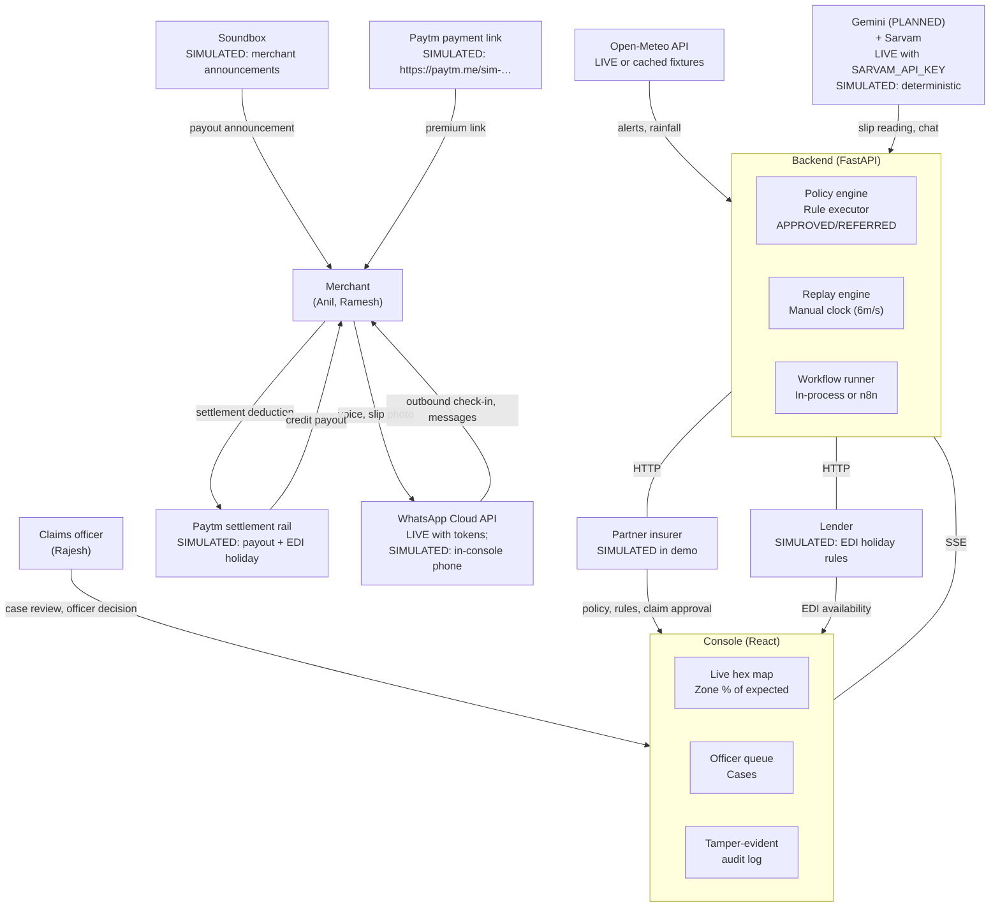
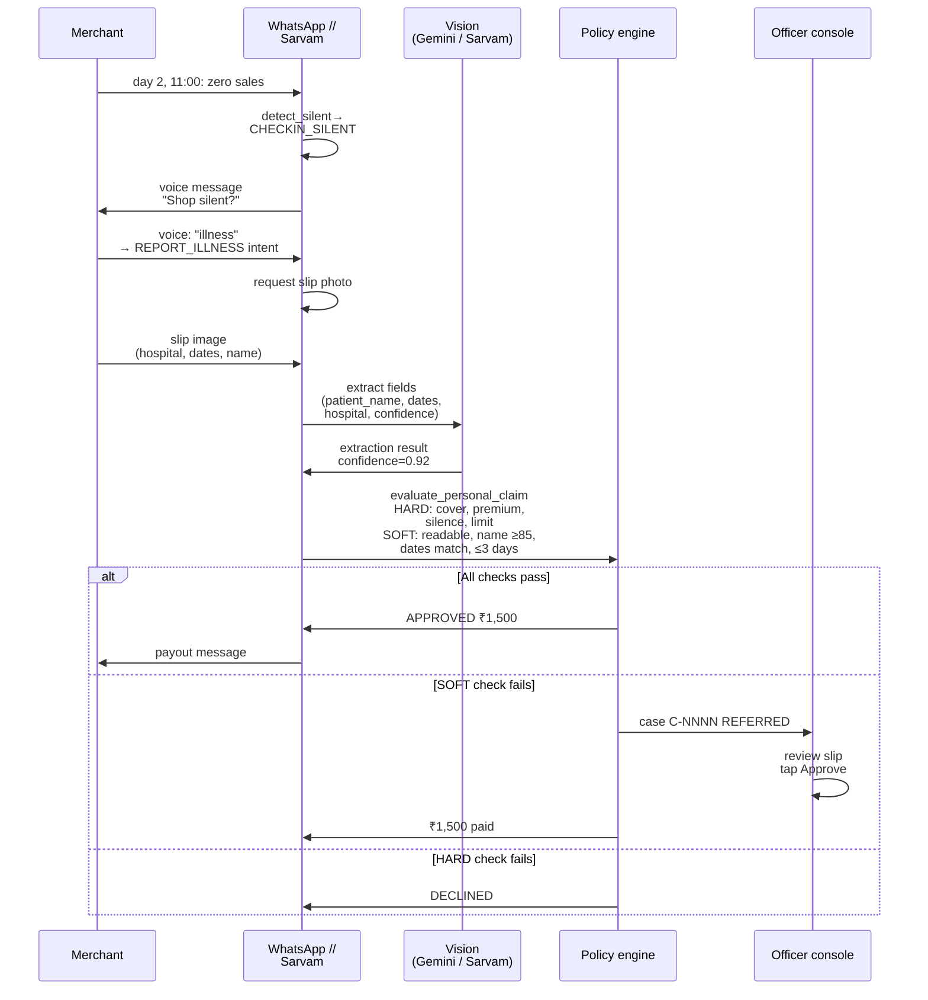

# System architecture

| | |
|---|---|
| Status | Draft v1 · 2 Oct 2026 |
| Owner | Ujjwal Pardeshi |
| Audience | Judges, mentors, engineers reviewing the codebase |
| Related | [ARCHITECTURE.md](../ARCHITECTURE.md) · [Data model and API](data-model-and-api.md) · [AI architecture and guardrails](ai-architecture-and-guardrails.md) · [Testing and quality strategy](testing-and-quality-strategy.md) |

## TL;DR

- **Principle:** "The AI builds the case; code decides the money." Only the policy engine produces APPROVED decisions.
- **Architecture:** FastAPI backend (Python 3.12, SQLite, hash-chained audit), React 19 console, in-process or n8n workflows.
- **Inputs:** hourly sales per shop (simulated during replay), weather and civic alerts (real Open-Meteo), KYC and loan state (simulated).
- **Clock:** replay engine with manual control; 6 simulated minutes per real second by default (1–120 range); deterministic per seed.
- **Integrations:** registry pattern; each component (Sarvam, WhatsApp, Paytm, n8n) is LIVE only when keys are set, otherwise labelled SIMULATED.
- **Events:** SSE to console (tick, zone updates, decisions, payouts, cases, audit entries); bounded per-client queues prevent slow clients from blocking replay.
- **Live vs simulated:** Every integration reports its status at startup. Deterministic simulators (word-list intents, slip-reading JSON, canned speech) run identically every time. Simulated data is never presented as live.

## 1. System context

### 1.1 Actors and external systems



### 1.2 High-level request flows

**Area claim (automatic):**
1. Replay engine ticks hourly.
2. Detection runs: hour index calculated from live sales and expected sales (LightGBM model).
3. If index &lt; 50 %, &lt; model lower bound, under alert, ≥20 shops in index → trigger.
4. Policy engine runs `evaluate_area_claim` for each covered shop in the zone.
5. Decision: APPROVED → payout workflow (credit in 4 min, instalment pause in 5 min), or insufficient data → REFERRED.

**Personal (hospital-cash) claim:**
1. Merchant is silent (zero sales for a day).
2. Check-in via WhatsApp at hour 11 next day.
3. Merchant replies with REPORT_ILLNESS intent + slip photo.
4. Sarvam vision (or simulator) extracts patient name, dates, hospital.
5. Policy engine runs `evaluate_personal_claim` (HARD checks: cover active, premium paid, silence verified; SOFT checks: slip readable, name matches KYC, dates match, ≤3 days).
6. Decision: APPROVED ₹1,500 → payout workflow, or SOFT fail → REFERRED to officer, or HARD fail → DECLINED.

**Ask Chhatri (PLANNED N2 — grounded assistant):**
1. Merchant asks a question in Hindi/English via WhatsApp or console text.
2. Intent detected: the word list first (always LIVE); the Sarvam chat model only for text the rules call UNKNOWN (LIVE with key, otherwise UNKNOWN stands).
3. Grounded chat model (PLANNED: Gemini Flash free tier or Sarvam) generates answer from policy wording.
4. Guard rejects any money figure not in decision facts, any unsupported promise.
5. Answer rendered in HTML with clause citations and merchant's own numbers.

## 2. Containers and packages (SPEC §1, §24)

### 2.1 Backend (Python 3.12, FastAPI 0.141)

```
backend/
├── pyproject.toml                (scaffold, shared)
├── Dockerfile                    (Python 3.12 slim, uid 10001, /app/var volume)
└── chhatri/
    ├── config.py                 (Settings, env vars, SPEC §21)
    ├── clock.py                  (IST, ManualClock, SystemClock)
    ├── money.py                  (paise, format_inr, rupee arithmetic)
    ├── events.py                 (Event, EventBus, bounded per-client queue)
    ├── ids.py                    (S-NNNN, C-NNNN, A-yyyymmdd-nn factories, deterministic)
    ├── domain/
    │   ├── models.py             (Merchant, Zone, Cover, Alert, Claim, Decision, …; frozen pydantic)
    │   └── enums.py              (ClaimKind, DecisionOutcome, CoverStatus, …)
    ├── config/
    │   └── (static settings loaded once)
    ├── sim/
    │   ├── geo.py                (24 BMC wards → zones Z3–Z12)
    │   ├── city.py               (1,821 merchants + uncovered demo merchant S-0907)
    │   ├── sales.py              (hourly sales per shop, rain/slow-day/bandh shocks)
    │   ├── weather.py            (alerts: Red/Orange/Yellow/Green)
    │   ├── alerts.py             (A-20250818-01 for monsoon scenario)
    │   ├── scenarios.py           (monsoon, illness, illness_mismatch, buy_cover; SPEC §6)
    │   └── slips.py              (sample hospital slips with embedded data)
    ├── forecast/
    │   ├── model.py              (LightGBM quantile model: p10/p50/p90)
    │   └── calibrate.py          (conformal lower bound per zone)
    ├── detect/
    │   ├── area_index.py         (3-hour window index: Σactual / Σexpected)
    │   ├── triggers.py           (alert + all 3 hours < 50% + < lower bound + ≥20 shops)
    │   └── silent.py             (find shops with zero sales for a day)
    ├── policy/
    │   ├── rules.yaml            (version pilot-0.1: payouts, caps, checks, waiting periods)
    │   ├── engine.py             (only source of APPROVED; pure function)
    │   ├── checks.py             (HARD: cover active, premium paid; SOFT: slip readable, name match)
    │   └── explain.py            (formula strings for decision facts: "½ × ₹4,380 × 63%")
    ├── store/
    │   ├── db.py                 (SQLite in-memory per scenario load, /app/var/scenario-name.db)
    │   └── repositories.py       (Cover, Loan, Merchant, Payout, Instalment read/write)
    ├── audit/
    │   └── log.py                (hash-chained; append-only; verify at /api/audit/verify)
    ├── ledger/
    │   ├── payouts.py            (PENDING → CREDITED → SETTLED)
    │   ├── instalments.py        (next instalment pause logic)
    │   └── premiums.py           (prepaid through date, cash-before-cover check)
    ├── cases/
    │   └── service.py            (open case C-NNNN, track SLA, officer review)
    ├── integrations/
    │   ├── base.py               (Protocol definitions: ChatModel, SlipReader, MessagingChannel, …)
    │   ├── registry.py           (build_integrations: wires LIVE vs SIMULATED per env vars)
    │   ├── sarvam.py             (chat, vision, STT, TTS; LIVE | SimulatedSTT/TTS/Chat/SlipReader)
    │   ├── whatsapp.py           (LiveWhatsAppChannel | SimulatorChannel with in-console phone)
    │   ├── paytm.py              (McpPaytmLinks | RestPaytmLinks | SimulatedPaytmLinks)
    │   ├── openmeteo.py          (LiveOpenMeteo | FixtureWeather)
    │   ├── n8n.py                (N8nWorkflowEngine; callback validation)
    │   ├── memory.py             (SimulatedMemoryGraph: networkx)
    │   ├── soundbox.py           (SimulatedSoundbox: announcements)
    │   └── statuses.py           (IntegrationStatus: name, kind, status, latency_ms, source)
    ├── workflows/
    │   ├── definitions.py        (WORKFLOWS step list; offsets from decision time)
    │   ├── runner.py             (InProcessWorkflowEngine, N8nWorkflowEngine)
    │   └── (effects: execute_payout, credit_payout, notify_merchant, pause_instalment, …)
    ├── conversation/
    │   ├── intents.py            (REPORT_ILLNESS, QUESTION, …; word-list classifier)
    │   ├── nlu.py                (rules first; the chat model only for UNKNOWN text)
    │   ├── messages.py           (message catalogue: CHECKIN_SILENT, ASK_SLIP, SLIP_TO_HUMAN, …)
    │   ├── guard.py              ("no money figure outside decision facts" rule)
    │   └── service.py            (flow logic for WhatsApp and in-console phone)
    ├── replay/
    │   ├── engine.py             (ManualClock, play/pause/step/seek; 6m/s default, 1–120 range)
    │   ├── scheduler.py          (SimScheduler: schedule effects at simulated time)
    │   ├── orchestrator.py       (on_minute, on_hour, run detection and claim evaluation)
    │   ├── state.py              (AppState, load_static, load scenario)
    │   └── views.py              (convert domain objects to JSON for API)
    ├── backtest/
    │   ├── run.py                (monsoon replay vs weather-only trigger)
    │   └── report.py             (HTML backtest report)
    ├── api/
    │   ├── app.py                (FastAPI factory, lifespan, middleware)
    │   ├── errors.py             (ApiError, error handler, 500 envelope)
    │   ├── envelope.py           (ok, ok_list, error helpers)
    │   ├── deps.py               (dependency injection: StateDep, RuntimeDep, SettingsDep)
    │   ├── sse.py                (ServerSentEvent, StreamHub, bounded queue per client)
    │   ├── security.py           (RateLimiter, officer token, internal secret, CORS)
    │   ├── routers/
    │   │   ├── meta.py           (health, integrations, session, preflight, weather)
    │   │   ├── merchants.py      (list, detail, messages)
    │   │   ├── live.py           (live map: zones, hexes, alerts)
    │   │   ├── replay.py         (load, play, pause, step, seek, speed)
    │   │   ├── stream.py         (SSE subscription)
    │   │   ├── phone.py          (WhatsApp inbound/outbound sim, voice note)
    │   │   ├── cases.py          (officer review, decision, SLA)
    │   │   ├── records.py        (payouts, instalments, premiums, decisions)
    │   │   ├── premium.py        (cover purchase, waiting period, payment link)
    │   │   ├── webhooks.py       (n8n callbacks, WhatsApp inbound)
    │   │   ├── media.py          (slip upload, audio file download)
    │   │   └── internal.py       (internal/workflows/{step} for n8n)
    │   ├── paytm_callback.py     (track paid transactions from MCP)
    │   ├── whatsapp_inbox.py     (background WhatsApp worker)
    │   └── ports.py              (AppStatePort protocol for testing)
    ├── data/
    │   ├── zones.json            (24 zones, 1,821 merchants, seed 20251019)
    │   ├── weather/              (cached Open-Meteo fixtures for replay)
    │   └── slips/                (sample hospital slip images with embedded JSON)
    ├── artifacts/
    │   ├── model/                (LightGBM quantile model files)
    │   ├── backtest/             (monsoon + monsoon2025 reports)
    │   ├── calibration.json      (conformal bounds per zone)
    │   ├── premiums.json         (₹X per day per zone)
    │   └── MANIFEST.json         (metadata, hashes, build date)
    └── tests/
        ├── test_policy/          (policy engine, checks, explanations)
        ├── test_detect/          (trigger detection, area index)
        ├── test_workflows/       (in-process and n8n runners)
        ├── test_api/             (FastAPI routes, envelope, error handling)
        ├── test_integrations/    (mocks for live/simulated swapping)
        └── …(mirror of source structure)

Data volumes:
- Input: `CHHATRI_DATA_DIR` (default backend/data) — read-only, committed.
- Artefacts: backend/artifacts/ — read-only committed files (model, backtest, premiums).
- State: `CHHATRI_VAR_DIR` (default backend/var, Docker /app/var volume) — SQLite per scenario, audit logs, temporary files.
```

### 2.2 Frontend (React 19, Vite, TypeScript)

```
frontend/
├── package.json
├── Dockerfile                    (Node build, nginx 1.30, unprivileged)
├── nginx.conf                    (SPA fallback, /api proxied to backend, SSE unbuffered, 6 MB upload)
└── src/
    ├── main.tsx                  (Vite entry, React Router)
    ├── App.tsx                   (layout, theme toggle, sidebar)
    ├── components/
    │   ├── Map.tsx               (react-leaflet, hex map, zone layer)
    │   ├── Phone.tsx             (WhatsApp phone simulator, message list)
    │   ├── CasesPanel.tsx        (officer queue, case detail)
    │   ├── AuditViewer.tsx       (hash-chain visualizer)
    │   └── …(50+ components)
    ├── pages/
    │   ├── Overview.tsx          (home: hero + replay controls + monsoon map)
    │   ├── Merchants.tsx         (list, search, detail view)
    │   ├── Decisions.tsx         (payout decisions by area)
    │   ├── Audit.tsx             (audit log viewer)
    │   ├── Cases.tsx             (officer console)
    │   ├── Backtest.tsx          (monsoon 2024 vs 2025)
    │   └── Policy.tsx            (rules.yaml + explanations)
    ├── api/
    │   ├── client.ts             (fetch wrapper with envelope detection)
    │   ├── types.ts              (TypeScript interfaces from API responses)
    │   └── endpoints.ts          (GET /api/…, SSE subscription)
    ├── state/
    │   ├── store.ts              (Zustand store: scenario, runtime, merchant state)
    │   └── sse.ts                (EventBus subscription, tick listener)
    ├── mock/
    │   ├── backend.ts            (in-memory mock API for ?mock=1 or dev:mock mode)
    │   └── fixtures.ts           (monsoon data, sample decisions, merchants)
    ├── styles/
    │   ├── tokens.css            (design system: colours, spacing, type)
    │   └── …(per-component CSS)
    └── tests/
        ├── pages/
        ├── components/
        └── …(vitest + Playwright E2E)
```

### 2.3 n8n (optional, Docker 2.41.3)

Generated workflows in `n8n/workflows/`:
- `chhatri-payout.json` → execute payout, credit, notify, pause instalment.
- `chhatri-human-review.json` → open case, notify officer.
- `chhatri-follow-up.json` → check SLA, notify after 24 hours.

Workflow callbacks validate `X-Chhatri-Secret` and POST to `/internal/workflows/{step}` on the backend.

## 3. Key sequences

### 3.1 Area auto-claim (monsoon replay)


### 3.2 Hospital-cash claim with slip reading



### 3.3 Ask Chhatri with fallback

**Provider chain (PLANNED):** Gemini Flash free tier → Sarvam chat → deterministic templates.


## 4. Live vs simulated switching (SPEC §0.1)

### 4.1 Integration status at startup

Every integration is built by `registry.py` (`build_integrations`) and reports `IntegrationStatus`:

| Component | Live when | Simulated | Label |
|---|---|---|---|
| **Sarvam** (STT, TTS, chat, vision) | `SARVAM_API_KEY` set and reachable | SimulatedSTT, SimulatedTTS, templates, fallbacks | SIMULATED (LIVE if key set) |
| **Gemini** (chat, vision, PLANNED N2/N3) | PLANNED: integration pending 2–3 Oct; will require `GOOGLE_API_KEY` | SIMULATED (until integration ships) | SIMULATED (PLANNED) |
| **WhatsApp Cloud API** | All four WHATSAPP_* keys + WHATSAPP_DEMO_RECIPIENT | SimulatorChannel (in-console phone) | SIMULATED |
| **Paytm payment link** | `PAYTM_MCP_URL` or (`PAYTM_MID` + `PAYTM_KEY_SECRET`) | SimulatedPaytmLinks (`https://paytm.me/sim-…`) | SIMULATED |
| **n8n workflows** | `N8N_BASE_URL` set | InProcessWorkflowEngine | SIMULATED |
| **Cognee memory** | `COGNEE_ENABLED=true` + cognee installed + LLM configured | SimulatedMemoryGraph (networkx) | SIMULATED |
| **Open-Meteo** (LIVE widget) | `OPENMETEO_LIVE=true` (uses wall-clock time) | FixtureWeather (cached historical) | SIMULATED |
| **Sales, alerts, KYC, payouts, lender, Soundbox** | — | Simulated by design | SIMULATED |

### 4.2 Registering integrations per scenario

When a scenario loads, `build_integrations(settings, scenario_context)` wires every integration:

```python
# Pseudocode (backend/chhatri/integrations/registry.py)
def build_integrations(settings: Settings) -> Integrations:
    # Speech
    if settings.sarvam_api_key:
        stt = LiveSarvamSTT(settings.sarvam_api_key, model="saaras:v3")
        tts = LiveSarvamTTS(settings.sarvam_api_key, model="bulbul:v3", speaker="ritu")
    else:
        stt = SimulatedSTT()
        tts = SimulatedTTS()
    
    # Chat
    chat = None  # Grounded LLM is only used during conversation
    if settings.sarvam_api_key:
        chat = LiveSarvamChat(settings.sarvam_api_key, model="sarvam-105b")
    # Else: intents.py word-list classifier + deterministic templates
    
    # Slip reading
    # PLANNED: Gemini Vision adapter; today use Sarvam or simulation
    if settings.sarvam_api_key:
        slips = LiveSarvamSlipReader(settings.sarvam_api_key)
    else:
        slips = SimulatedSlipReader()  # Reads JSON embedded in PNG; Tesseract OCR planned
    
    # Messaging
    if all([settings.whatsapp_access_token, settings.whatsapp_demo_recipient]):
        channel = LiveWhatsAppChannel(...)
    else:
        channel = SimulatorChannel()  # In-console phone
    
    # Payments
    if settings.paytm_mcp_url:
        payments = McpPaytmLinks(settings.paytm_mcp_url)
    elif settings.paytm_mid:
        payments = RestPaytmLinks(...)
    else:
        payments = SimulatedPaytmLinks()
    
    # Workflows
    if settings.n8n_base_url:
        workflows = N8nWorkflowEngine(settings.n8n_base_url)
    else:
        workflows = InProcessWorkflowEngine()
    
    # Compile status badges
    statuses = (
        live("Sarvam", "STT") if settings.sarvam_api_key else simulated("Sarvam", "STT"),
        # ... one per component
    )
    
    return Integrations(stt=stt, tts=tts, chat=chat, slips=slips, ...)
```

### 4.3 Environment variables (SPEC §21, .env.example)

**Core:**
- `CHHATRI_SEED=20251019` — deterministic id factory, shop sales, merchant list.
- `CHHATRI_VAR_DIR=/app/var` — SQLite, audit logs (Docker: volume).
- `CHHATRI_DEMO_MODE=true` — demo-only: `/api/session` hands officer token to console.
- `CHHATRI_OFFICER_TOKEN` — if unset, auto-generated and logged at startup.
- `CHHATRI_INTERNAL_SECRET` — X-Chhatri-Secret for n8n callbacks and internal routes.

**Sarvam (all or nothing; unset → SIMULATED):**
- `SARVAM_API_KEY`
- `SARVAM_CHAT_MODEL=sarvam-105b`
- `SARVAM_STT_MODEL=saaras:v3` (or v4)
- `SARVAM_TTS_MODEL=bulbul:v3`

**WhatsApp (LIVE iff all four set + recipient):**
- `WHATSAPP_ACCESS_TOKEN`
- `WHATSAPP_PHONE_NUMBER_ID`
- `WHATSAPP_APP_SECRET`
- `WHATSAPP_VERIFY_TOKEN`
- `WHATSAPP_DEMO_RECIPIENT=+91XXXXXXXXXX` (E.164, only number that receives live messages)

**Paytm (prefer MCP):**
- `PAYTM_MCP_URL=http://localhost:8080/sse` (MCP over SSE)
- Or: `PAYTM_MID`, `PAYTM_KEY_SECRET`, `PAYTM_BASE_URL=https://securestage…`

**n8n:**
- `N8N_BASE_URL=http://localhost:5678` (dev mode; docker-compose wires it automatically)

**Optional:**
- `COGNEE_ENABLED=true/false` (memory graph; requires cognee installed)
- `OPENMETEO_LIVE=true/false` (live weather widget; replay always uses cached)

### 4.4 Proposed additions for future features (PLAN)

The following env vars are candidates for new features (see [data-model-and-api.md §5](data-model-and-api.md)):

- `CHHATRI_GROUNDED_LLM_PROVIDER=gemini|sarvam|offline` — choose Ask Chhatri provider.
- `CHHATRI_SLIP_CONFIDENCE_THRESHOLD=0.80` — readiness gate for N3.
- `CHHATRI_NAME_MATCH_THRESHOLD=85` — rapidfuzz token-set-ratio for KYC matching.

## 5. Replay engine and accelerated clock (SPEC §17.1)

### 5.1 Manual clock and time control

The `ManualClock` (thread-safe) is the single source of time inside the replay:

```python
# backend/chhatri/clock.py
class ManualClock:
    def now() -> datetime:       # current IST time
    def set(datetime) -> None:   # jump to a time
    def advance(timedelta) -> datetime:  # move forward
```

All domain time is timezone-aware Asia/Kolkata (IST); replays always start paused at scenario start (monsoon: 08:00 IST).

### 5.2 Speed and tick events

**Speed** (simulated minutes per real second):
- Default: 6.0 (1 simulated hour = 10 real seconds).
- Range: 1.0–120.0 (validated on API).
- Adjustable from console: `/api/replay/speed?speed=12`.

**Tick events** (to console via SSE):
- Published every 250 ms of real time, at most 4 per real second.
- Carry `at`, `speed`, `scenario_name`, elapsed wall time.

**Quarter-hour hex updates:**
- Live hex map values published only every 15 simulated minutes (not every minute) to reduce SSE traffic.

### 5.3 Minute and hour loops

For every simulated minute `t`:

1. Clock set to `t`.
2. All workflow steps due by `t` run on `SimScheduler` (in `(at, seq)` order, idempotent).
3. Minute hooks run: `Orchestrator.on_minute(t)` → workflow callbacks.
4. **Hour boundary** (t.minute == 0): hour hooks run: `Orchestrator.on_hour(t)` → `detect.triggers.evaluate_hour()` → area claims → SSE events.
5. Hex values published (every 15 simulated minutes).

### 5.4 Play, pause, step and seek

**play():** background task. Wakes every 250 ms real time, advances `speed × 0.25` simulated minutes, pauses itself at scenario end or error. Non-blocking.

**pause():** waits for current minute to complete, so no half-processed minute remains.

**step(n):** pause then synchronously advance `n` minutes awaiting every effect. ValueError if n ≤ 0 or past scenario end.

**seek(HH:MM):** on the scenario day (monsoon: 08:00–20:00).
- Forward: step to target time.
- Backward: reload scenario (fresh ids, store, audit; SPEC §3), seek on new engine.

### 5.5 Settling and lingering

Money decided inside the scenario window still arrives on its workflow schedule. At or after scenario end, the clock may linger up to `settle_minutes` (5 minutes, the payout workflow's last offset) to let final steps complete. Then it pauses. The follow-up SLA check (24 hours later) never extends the window.

## 6. Events and SSE (SPEC §19.1, §20)

### 6.1 Event types

| Event | Payload | When |
|---|---|---|
| `tick` | `{at, speed, elapsed_ms}` | Every 250 ms real time (up to 4/s) |
| `zone` | `{zone_id, index_pct, drop_pct, …}` | Hour boundary; zone index changes |
| `hexes` | `[{h3_cell, index_pct, …}]` | Every 15 simulated minutes |
| `alert` | `{alert_id, level, zones, valid_from, valid_to}` | Alert issued during replay |
| `trigger` | `{area_trigger_id, zone_id, index_pct, …}` | Hour boundary; trigger fires |
| `decision` | `{decision_id, outcome, merchant_id, amount_paise, …}` | Policy engine produces APPROVED/REFERRED/DECLINED |
| `payout` | `{payout_id, decision_id, status, credited_at}` | Payout created, credited, settled |
| `instalment` | `{payout_id, decision_id, paused_until, …}` | Next-day instalment paused |
| `message` | `{message_id, merchant_id, content, channel, …}` | WhatsApp or Soundbox message sent |
| `soundbox` | `{payout_id, announcement_text}` | Soundbox announcement played |
| `case` | `{case_id, kind, merchant_id, status, opened_at}` | Case created (PERSONAL_CLAIM_REVIEW, DISPUTE, …) |
| `audit` | `{entry_id, action, subject_type, subject_id, at, hash}` | Audit log entry recorded |
| `kpis` | `{zones_triggered, shops_paid, trigger_to_money_min}` | After trigger fires |

### 6.2 SSE subscription and resume

**Subscribe:** `GET /api/stream?Last-Event-ID=12345` (optional).

**Resume rule:** if Last-Event-ID is newer than anything this process has published, resume from the start of retained history (not from that id), so reconnect never silently skips events.

**Per-client queue:** each client gets a bounded queue on the process-wide EventBus. If a client falls behind, the bus drops the client's oldest event. This prevents a slow console from blocking the replay.

## 7. Deployment modes (SPEC §23)

### 7.1 Development (`make dev`)

```
browser:5173 (Vite)
  └─ /api proxy ──> uvicorn :8000 (auto-reload)
       ↓ (optional n8n integration)
       n8n :5678 (if N8N_BASE_URL set)
```

- Fast feedback: auto-reload on code change.
- No docker-compose, no nginx.
- `.env` read by FastAPI, shell vars passed to Vite.
- Frontend mocks live at `frontend/src/mock/backend.ts`; use `npm run dev:mock` to bypass the backend.

### 7.2 Production stack (`make up`)

```
browser (CHHATRI_CONSOLE_ORIGIN)
  └─ http://localhost:8080 (nginx SPA fallback + reverse proxy)
       ├─ /api ──> backend:8000 (HTTP/1.1, buffering off, 1 h read timeout, no gzip on SSE)
       ├─ / (static console)
       └─ (backend also exposes /webhook/chhatri-* for n8n callbacks)

Backend (image: chhatri-backend:local)
  └─ /app/var (volume: backend-var, persists SQLite across restarts)

Optional n8n (image: n8n:2.41.3)
  └─ http://n8n:5678
     ├─ posts to backend:8000/internal/workflows/{step}
     └─ /n8n-data (volume: named volume, persists DB and config)

docker-compose up -d --build --wait
```

- Healthcheck on backend: GET http://127.0.0.1:8000/api/health every 10 s.
- Artefacts: baked into backend image.
- Logs: stdout/stderr collected by docker.

### 7.3 Static mock mode for N7 (backup demo, GitHub Pages or Vercel)

Build with `?mock=1` or `VITE_MOCK=1`:

```
npm run build
  └─ frontend/dist/ (pure HTML/JS/CSS, no server)
       └─ api calls to frontend/src/mock/backend.ts (in-browser)
            └─ monsoon replay plays at full speed (no server latency)
```

- No backend needed.
- Works offline (fonts self-hosted).
- Backup if live backend fails on stage.

## 8. Security summary (SPEC §21)

### 8.1 Officer token

- **Demo mode:** `/api/session` (GET, no auth) hands the token to console in HTML `<meta>` tag.
- **Stored:** `localStorage.OFFICER_TOKEN` in browser.
- **Sent:** Bearer token on protected routes: `/api/cases/{id}/decision`, `/api/internal/…`.
- **Gen:** if `CHHATRI_OFFICER_TOKEN` unset, auto-generated (random) at startup, logged once.

### 8.2 Internal secret

- **Used for:** n8n webhook callbacks, `/internal/workflows/{step}` routes.
- **Header:** `X-Chhatri-Secret` (must match `CHHATRI_INTERNAL_SECRET`).
- **Validation:** 403 if missing or wrong.

### 8.3 CORS

- **Origin:** `CHHATRI_CONSOLE_ORIGIN` (dev: http://localhost:5173, docker: http://localhost:8080).
- **Methods:** GET, POST, OPTIONS.
- **Headers:** Authorization, Content-Type, Last-Event-ID.
- **Max age:** 600 s.

### 8.4 Demo mode considerations

- Demo mode is **never safe for production** (officer token exposed, seed fixed, all data simulated).
- `CHHATRI_DEMO_MODE=false` in production hides `/api/session` (404).
- AI keys and Paytm secrets are **never logged** (pydantic SecretStr).

### 8.5 Links to SECURITY.md

Details: [docs/SECURITY.md](../SECURITY.md) (rate limits, upload limits, error messages, password resets, …).

## 9. What changes for production (ROADMAP)

These items are not in scope for the hackathon but are understood:

- **Real rails:** Paytm MCP for settlement and EDI (today: simulated).
- **Postgres:** Replace SQLite in-memory for durability across restarts.
- **Queue:** Async task queue (e.g. Celery, RQ) for long-running workflows instead of in-process.
- **Auth:** OAuth 2.0 or JWT for officer console, merchant API keys.
- **Observability:** structured logging (OpenTelemetry), metrics (Prometheus), traces (Jaeger).
- **Caching:** Redis for session store, rate limiter state.
- **CDN:** serve static assets (fonts, backtest reports) from CDN.
- **Cost optimization:** Cognee memory graph for persistent case context, reducing LLM calls.

## 10. Tech debt and fix IDs

| Fix ID | Issue | Owner | ETA |
|---|---|---|---|
| X1 | Frontend: 2 failing unit tests (Cases panel, Overview live-map) | Ujjwal | 2 Oct eve |
| X2 | Validate `published_expected_day` at claim creation | Ujjwal | 2 Oct eve |
| X3 | Fail loudly when a zone is missing from premiums.json | Ujjwal | 2 Oct eve |
| X4 | EDI-holiday guard: check loan active, not in arrears, lender policy flag | Ujjwal | 2 Oct |
| X5 | Off-script merchant → clean 404, not KeyError | Ujjwal | 2 Oct |
| X6 | Per-component Sarvam toggles, provider panel (H7) | Ujjwal | 2 Oct or 3 Oct |
| X7 | Honest-wording test over message catalogue (H4) | Ujjwal | 2 Oct or 3 Oct |
| X8 | No loan offers during alert/claim, daily message cap (H9) | Ujjwal | 2 Oct or 3 Oct |

## Open questions

1. Should we build a Cognee integration for persistent case memory? (Owner: Ujjwal Pardeshi)
2. Can we validate N3 slip-readiness with a visual checklist UI? (Owner: Omkar Kadam)
3. What fallback behavior when Sarvam vision times out (60 s)? (Owner: Ujjwal Pardeshi)

## Changelog

- 2026-10-02 · v1.4 · second fact-check pass: Ask Chhatri (N2) marked as PLANNED in high-level request flows section; clarified that intent detection is always LIVE but grounded chat model is PLANNED.
- 2026-10-02 · v1.3 · AI provider and live/simulated framing aligned: Gemini reframed as PLANNED in status table; mermaid diagrams updated to label Gemini PLANNED and Sarvam as fallback; Ask Chhatri sequence diagram clarified with provider chain order; integration registry code comment added to note Gemini Vision is PLANNED.
- 2026-10-02 · v1.2 · logic and truth audit fixes
- 2026-10-02 · v1.1 · fact-check pass: removed an internal reference, added mermaid tags, fixed BLOCKED→DECLINED terminology
- 2026-10-02 · v1 · first draft from codebase audit.
