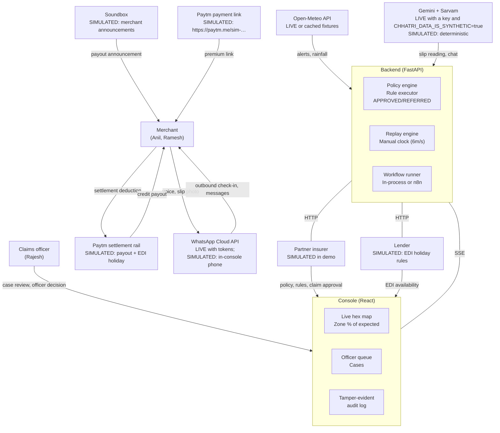
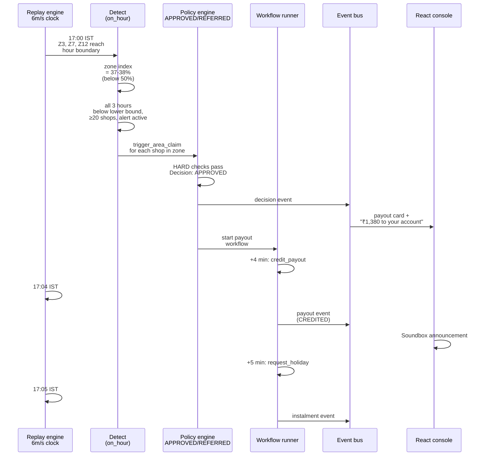
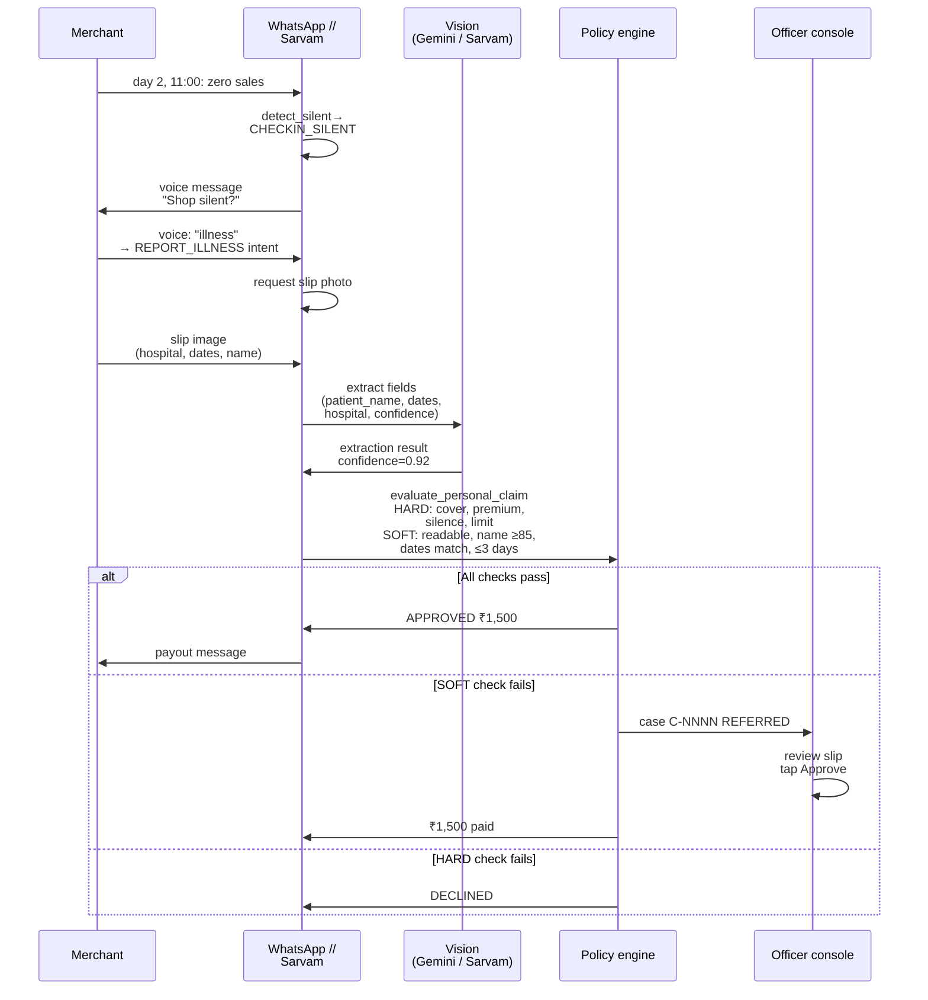
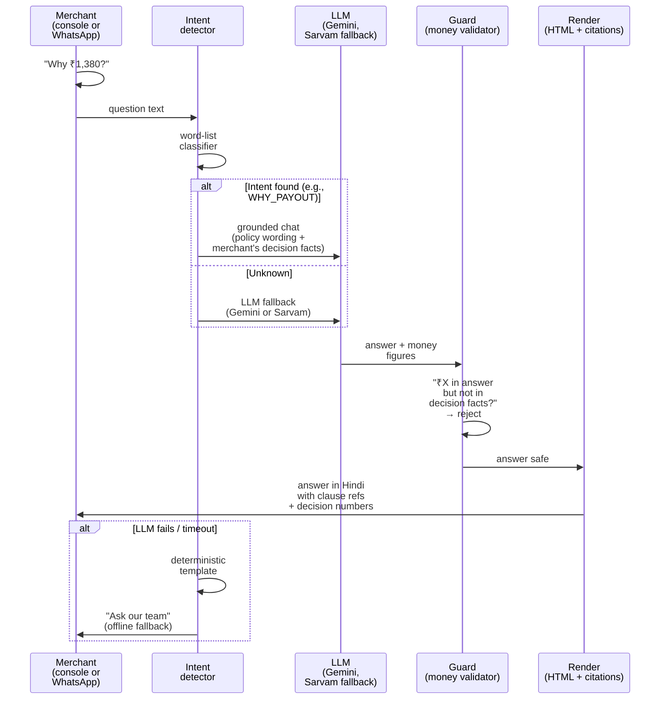

# System architecture

| | |
|---|---|
| Status | Draft v1 · 2 Oct 2026 |
| Owner | Ujjwal Pardeshi |
| Audience | Judges, mentors, engineers reviewing the codebase |
| Related | [ARCHITECTURE.md](../ARCHITECTURE.md) · [Data model and API](data-model-and-api.md) · [AI architecture and guardrails](ai-architecture-and-guardrails.md) · [Testing and quality strategy](testing-and-quality-strategy.md) |

## TL;DR

- **Principle:** "The AI builds the case; code decides the money." Only the policy engine produces APPROVED decisions.
- **Architecture:** FastAPI backend (Python 3.12, an in-memory store, a hash-chained audit log in private in-memory SQLite), React 19 console, in-process or n8n workflows.
- **Inputs:** hourly sales per shop (simulated), rainfall (real Open-Meteo data, cached in the repository), the alert feed, KYC and loan state (all simulated).
- **Clock:** replay engine with manual control; 6 simulated minutes per real second by default (1–120 range); deterministic per seed.
- **Integrations:** registry pattern; each component (Sarvam, WhatsApp, Paytm, n8n) is LIVE only when keys are set, otherwise labelled SIMULATED.
- **Events:** SSE to console (tick, zone updates, decisions, payouts, cases, audit entries); bounded per-client queues prevent slow clients from blocking replay.
- **Live vs simulated:** Every integration reports its status at startup. Deterministic simulators (word-list intents, slip-reading JSON, canned speech) run identically every time. Simulated data is never presented as live.

## 1. System context

### 1.1 Actors and external systems



### 1.2 High-level request flows

**Area claim (automatic):**
1. Replay engine ticks hourly.
2. Detection runs: hour index calculated from live sales and expected sales (LightGBM model).
3. If index &lt; 50 %, &lt; model lower bound, under alert, ≥20 shops in index → trigger.
4. Policy engine runs `evaluate_area_claim` for each covered shop in the zone.
5. Decision: APPROVED → payout workflow (credit in 4 min, instalment pause in 5 min), or insufficient data → REFERRED.

**Personal (hospital-cash) claim:**
1. Merchant is silent (zero sales for a day).
2. Check-in via WhatsApp at hour 11 next day.
3. Merchant replies with REPORT_ILLNESS intent + slip photo.
4. Sarvam vision (or simulator) extracts patient name, dates, hospital.
5. Policy engine runs `evaluate_personal_claim` (HARD checks: cover active, premium paid, silence verified; SOFT checks: slip readable, name matches KYC, dates match, ≤3 days).
6. Decision: APPROVED ₹1,500 → payout workflow, or SOFT fail → REFERRED to officer, or HARD fail → DECLINED.

**Ask Chhatri (N2, BUILT behind `n2_ask_chhatri` — grounded assistant):**
1. Merchant asks a question in Hindi/English via WhatsApp or console text.
2. Intent detected by the word lists (always LIVE). With N2 on no model chooses an intent; a question about a rule goes to the grounded path even when a keyword matches (explain-first, N2.7). With N2 off, the Sarvam chat model classifies only text the rules call UNKNOWN.
3. Grounded chat chain (Gemini, then Sarvam, then a template) answers from the fact sheet and the clause table.
4. Guard rejects any money figure not in decision facts, any unsupported promise.
5. Answer rendered in HTML with clause citations and merchant's own numbers.

## 2. Containers and packages (SPEC §1, §24)

### 2.1 Backend (Python 3.12, FastAPI 0.141)

One package per concern, listed from the code (`backend/chhatri/`; the module-level contract is [SPEC §1 and §24](../SPEC.md)).

```
backend/
├── pyproject.toml                (pins, ruff, pytest markers: slow, live)
├── Dockerfile                    (Python 3.12 slim, uid 10001, artefacts baked in, /app/var volume reserved)
├── data/                         (committed inputs: geo/, weather/ Open-Meteo fixtures, slips/, policy/, zones.json)
├── artifacts/                    (committed, written by `make data`: model/, backtest/, calibration.json, premiums.json, MANIFEST.json)
├── scripts/                      (build_data.py, calibrate.py, demo_check.py, make_slips.py, ...)
├── tests/                        (one folder per package below)
└── chhatri/
    ├── config.py clock.py money.py ids.py events.py features.py   (settings, IST clock, paise and format_inr, ids, event bus, the 15 flags)
    ├── domain/                   (frozen pydantic models and enums)
    ├── sim/                      (geo, city, merchants, sales, weather, alerts, scenarios, slips, truth)
    ├── forecast/                 (LightGBM P10/P50/P90 model, conformal calibration, training, persistence)
    ├── detect/                   (area index, triggers, silent-shop finder)
    ├── policy/                   (rules.yaml pilot-0.1, engine, checks, amounts, explain, cover, provenance, counterfactual, receipt)
    ├── store/  audit/  ledger/   (in-memory store, hash-chained audit log, payouts, instalments and holiday requests, premiums)
    ├── cases/                    (case service, grievance ladder and respondent router)
    ├── conversation/             (intents, nlu, message catalogue, guard and strict guard, explain-first, slip flow, notifications)
    ├── ask/                      (Ask Chhatri: fact sheet, clauses, model path, injection and scam checks, voice)
    ├── ai/                       (provider chain runner, H26 labels, untrusted-text wrapper)
    ├── precheck/                 (slip pre-check: clean, rules, status table, confirm or send to the team)
    ├── consent/                  (consent centre, activity log, forget my slip)
    ├── integrations/             (registry; sarvam_*, gemini_*, whatsapp_*, paytm_*, openmeteo, n8n, memory, soundbox, lender, free_tier gate, switch)
    ├── workflows/                (WORKFLOWS definitions, in-process runner, n8n callbacks)
    ├── replay/                   (ReplayEngine, Orchestrator, steps, views: the only place domain objects become JSON)
    ├── backtest/                 (two monsoons, Chhatri vs weather-only, per-zone premiums)
    ├── pipeline/                 (the `make data` steps: geo, city, history, model, calibration, backtest)
    ├── evals/                    (H25 offline evaluation harness and slip generator)
    └── api/                      (app factory, deps, envelope, errors, security, sse, uploads, schemas/, demo/, routers/*)
```

Routers (`api/routers/`): `meta`, `live`, `replay`, `stream`, `merchants`, `phone`, `cases`, `records`, `premium`, `webhooks`, `media`, `internal`, plus the flagged feature routers `ask`, `voice`, `precheck`, `grievances`, `consents`, `ops`, `whatif`, `evals`, `fallback`.

Data volumes:
- Input: `CHHATRI_DATA_DIR` (default `backend/data`), read-only and committed.
- Artefacts: `backend/artifacts/`, read-only and committed (model, backtest, premiums).
- State: the store and the audit log are in memory and rebuilt on every scenario load. `CHHATRI_VAR_DIR` (default `backend/var`, Docker `/app/var`) is reserved; nothing is written there yet.

### 2.2 Frontend (React 19, Vite, TypeScript)

```
frontend/
├── package.json  vite.config.ts  vitest.config.ts  playwright.config.ts
├── Dockerfile                    (Node build, nginx 1.30 unprivileged)
├── nginx.conf                    (SPA fallback, /api proxied to the backend, SSE unbuffered, 6 MB body limit)
├── tests/e2e/                    (Playwright specs; projects "mock" and "live")
└── src/
    ├── main.tsx  App.tsx         (bootstrap picks the real API or the in-browser mock; routes)
    ├── features.ts               (the 15 flags, read from VITE_FEATURES)
    ├── pages/                    (Overview, Live, Claims, Merchant, Audit, Policy, Evals; Backtest is a lazy route)
    ├── components/               (layout, map, panel, claims, phone, overview, audit, backtest, policy, evals, common, ...)
    ├── api/                      (client, endpoints, sse, stream, types, contract/)
    ├── state/                    (live provider, reducer, event hub, presenter and ops contexts, hooks)
    ├── mock/                     (in-browser backend: fixtures, routes for every endpoint, conversation and ask)
    ├── miniapp/                  (the merchant mini-app: shell/, screens/, components/, copy/ hi, en, mr, hooks/, ui/ shadcn primitives)
    ├── content/  lib/  styles/   (deck copy, money and time helpers, plain CSS tokens)
    └── *.test.ts(x)              (Vitest, next to the code)
```

### 2.3 n8n (optional, Docker 2.41.3)

Generated workflows in `n8n/workflows/`:
- `chhatri-payout.json` → execute payout, credit, notify, pause instalment.
- `chhatri-human-review.json` → open case, notify officer.
- `chhatri-follow-up.json` → check SLA, notify after 24 hours.

Workflow callbacks validate `X-Chhatri-Secret` and POST to `/internal/workflows/{step}` on the backend.

## 3. Key sequences

### 3.1 Area auto-claim (monsoon replay)



### 3.2 Hospital-cash claim with slip reading



### 3.3 Ask Chhatri with fallback

**Provider chain (BUILT):** Gemini (model id from `GEMINI_MODEL`) → Sarvam chat → deterministic templates, each live link behind the free-tier data gate (ADR 0009).



## 4. Live vs simulated switching (SPEC §0.1)

### 4.1 Integration status at startup

Every integration is built by `registry.py` (`build_integrations`) and reports `IntegrationStatus`:

| Component | Live when | Simulated | Label |
|---|---|---|---|
| **Sarvam** (STT, TTS, chat, vision) | `SARVAM_API_KEY` set and reachable | SimulatedSTT, SimulatedTTS, templates, fallbacks | SIMULATED (LIVE if key set) |
| **Gemini** (chat, vision, N2/N3) | `GOOGLE_API_KEY` and `GEMINI_MODEL` set, and `CHHATRI_DATA_IS_SYNTHETIC=true` | Templates, the simulated slip reader | SIMULATED (LIVE with key, model and open gate); FALLBACK when forced or failed (X6) |
| **WhatsApp Cloud API** | All four WHATSAPP_* keys + WHATSAPP_DEMO_RECIPIENT | SimulatorChannel (in-console phone) | SIMULATED |
| **Paytm payment link** | `PAYTM_MCP_URL` or (`PAYTM_MID` + `PAYTM_KEY_SECRET`) | SimulatedPaytmLinks (`https://paytm.me/sim-…`) | SIMULATED |
| **n8n workflows** | `N8N_BASE_URL` set | InProcessWorkflowEngine | SIMULATED |
| **Cognee memory** | `COGNEE_ENABLED=true` + cognee installed + LLM configured | SimulatedMemoryGraph (networkx) | SIMULATED |
| **Open-Meteo** (LIVE widget) | `OPENMETEO_LIVE=true` (uses wall-clock time) | FixtureWeather (cached historical) | SIMULATED |
| **Sales, alerts, KYC, payouts, lender, Soundbox** | — | Simulated by design | SIMULATED |

### 4.2 Registering integrations per scenario

When a scenario loads, `build_integrations(settings, scenario_context)` wires every integration:

```python
# Pseudocode (backend/chhatri/integrations/registry.py)
def build_integrations(settings: Settings) -> Integrations:
    # Speech
    if settings.sarvam_api_key:
        stt = LiveSarvamSTT(settings.sarvam_api_key, model="saaras:v3")
        tts = LiveSarvamTTS(settings.sarvam_api_key, model="bulbul:v3", speaker="ritu")
    else:
        stt = SimulatedSTT()
        tts = SimulatedTTS()
    
    # Chat
    chat = None  # Grounded LLM is only used during conversation
    if settings.sarvam_api_key:
        chat = LiveSarvamChat(settings.sarvam_api_key, model="sarvam-105b")
    # Else: intents.py word-list classifier + deterministic templates
    
    # Slip reading
    # Gemini vision comes first in the slip chain (integrations/slip_chain.py); this block is the Sarvam link
    if settings.sarvam_api_key:
        slips = LiveSarvamSlipReader(settings.sarvam_api_key)
    else:
        slips = SimulatedSlipReader()  # Reads JSON embedded in PNG; Tesseract is a later option
    
    # Messaging
    if all([settings.whatsapp_access_token, settings.whatsapp_demo_recipient]):
        channel = LiveWhatsAppChannel(...)
    else:
        channel = SimulatorChannel()  # In-console phone
    
    # Payments
    if settings.paytm_mcp_url:
        payments = McpPaytmLinks(settings.paytm_mcp_url)
    elif settings.paytm_mid:
        payments = RestPaytmLinks(...)
    else:
        payments = SimulatedPaytmLinks()
    
    # Workflows
    if settings.n8n_base_url:
        workflows = N8nWorkflowEngine(settings.n8n_base_url)
    else:
        workflows = InProcessWorkflowEngine()
    
    # Compile status badges
    statuses = (
        live("Sarvam", "STT") if settings.sarvam_api_key else simulated("Sarvam", "STT"),
        # ... one per component
    )
    
    return Integrations(stt=stt, tts=tts, chat=chat, slips=slips, ...)
```

### 4.3 Environment variables (SPEC §21, .env.example)

**Core:**
- `CHHATRI_SEED=20251019` — deterministic id factory, shop sales, merchant list.
- `CHHATRI_VAR_DIR=/app/var` — reserved for run state (Docker: volume); nothing is written there yet, because the store and the audit log are in memory.
- `CHHATRI_FEATURES` — comma-separated flags from the 14 in `backend/chhatri/features.py`; empty means every feature is off. `.env.example` leaves it empty.
- `CHHATRI_DATA_IS_SYNTHETIC=true` — the free-tier data gate (ADR 0009); false closes every Gemini and Sarvam link.
- `CHHATRI_DEMO_MODE=true` — demo-only: `/api/session` hands officer token to console.
- `CHHATRI_OFFICER_TOKEN` — if unset, auto-generated and logged at startup.
- `CHHATRI_INTERNAL_SECRET` — X-Chhatri-Secret for n8n callbacks and internal routes.

**Sarvam (all or nothing; unset → SIMULATED):**
- `SARVAM_API_KEY`
- `SARVAM_CHAT_MODEL=sarvam-105b`
- `SARVAM_STT_MODEL=saaras:v3` (or v4)
- `SARVAM_TTS_MODEL=bulbul:v3`

**WhatsApp (LIVE iff all four set + recipient):**
- `WHATSAPP_ACCESS_TOKEN`
- `WHATSAPP_PHONE_NUMBER_ID`
- `WHATSAPP_APP_SECRET`
- `WHATSAPP_VERIFY_TOKEN`
- `WHATSAPP_DEMO_RECIPIENT=+91XXXXXXXXXX` (E.164, only number that receives live messages)

**Paytm (prefer MCP):**
- `PAYTM_MCP_URL=http://localhost:8080/sse` (MCP over SSE)
- Or: `PAYTM_MID`, `PAYTM_KEY_SECRET`, `PAYTM_BASE_URL=https://securestage…`

**n8n:**
- `N8N_BASE_URL=http://localhost:5678` (dev mode; docker-compose wires it automatically)

**Optional:**
- `COGNEE_ENABLED=true/false` (memory graph; requires cognee installed)
- `OPENMETEO_LIVE=true/false` (live weather widget; replay always uses cached)

### 4.4 Gemini variables

- `GOOGLE_API_KEY` — the Google AI Studio key; unset leaves Gemini out of every chain.
- `GEMINI_MODEL` — the text model id, with no default (the free-tier ids change; `make check-keys` lists them). A key without a model id leaves Gemini out.
- `GEMINI_VISION_MODEL` — optional model for slips; the text model is used when empty.

The thresholds once proposed as environment variables (slip confidence, name match) are rules in `rules.yaml` (`slip_confidence_min: 0.80`, `name_match_min_score: 85`), not settings.

## 5. Replay engine and accelerated clock (SPEC §17.1)

### 5.1 Manual clock and time control

The `ManualClock` (thread-safe) is the single source of time inside the replay:

```python
# backend/chhatri/clock.py
class ManualClock:
    def now() -> datetime:       # current IST time
    def set(datetime) -> None:   # jump to a time
    def advance(timedelta) -> datetime:  # move forward
```

All domain time is timezone-aware Asia/Kolkata (IST); replays always start paused at scenario start (monsoon: 08:00 IST).

### 5.2 Speed and tick events

**Speed** (simulated minutes per real second):
- Default: 6.0 (1 simulated hour = 10 real seconds).
- Range: 1.0–120.0 (validated on API).
- Set with `POST /api/replay/play` and a body such as `{"speed": 12}`.

**Tick events** (to console via SSE):
- Published every 250 ms of real time, at most 4 per real second.
- Carry `at`, `speed`, `scenario_name`, elapsed wall time.

**Quarter-hour hex updates:**
- Live hex map values published only every 15 simulated minutes (not every minute) to reduce SSE traffic.

### 5.3 Minute and hour loops

For every simulated minute `t`:

1. Clock set to `t`.
2. All workflow steps due by `t` run on `SimScheduler` (in `(at, seq)` order, idempotent).
3. Minute hooks run: `Orchestrator.on_minute(t)` → workflow callbacks.
4. **Hour boundary** (t.minute == 0): hour hooks run: `Orchestrator.on_hour(t)` → `detect.triggers.evaluate_hour()` → area claims → SSE events.
5. Hex values published (every 15 simulated minutes).

### 5.4 Play, pause, step and seek

**play():** background task. Wakes every 250 ms real time, advances `speed × 0.25` simulated minutes, pauses itself at scenario end or error. Non-blocking.

**pause():** waits for current minute to complete, so no half-processed minute remains.

**step(n):** pause then synchronously advance `n` minutes awaiting every effect. ValueError if n ≤ 0 or past scenario end.

**seek(HH:MM):** on the scenario day (monsoon: 08:00–20:00).
- Forward: step to target time.
- Backward: reload scenario (fresh ids, store, audit; SPEC §3), seek on new engine.

### 5.5 Settling and lingering

Money decided inside the scenario window still arrives on its workflow schedule. At or after scenario end, the clock may linger up to `settle_minutes` (5 minutes, the payout workflow's last offset) to let final steps complete. Then it pauses. The follow-up SLA check (24 hours later) never extends the window.

## 6. Events and SSE (SPEC §19.1, §20)

### 6.1 Event types

| Event | Payload | When |
|---|---|---|
| `tick` | `{at, speed, elapsed_ms}` | Every 250 ms real time (up to 4/s) |
| `zone` | `{zone_id, index_pct, drop_pct, …}` | Hour boundary; zone index changes |
| `hexes` | `[{h3_cell, index_pct, …}]` | Every 15 simulated minutes |
| `alert` | `{alert_id, level, zones, valid_from, valid_to}` | Alert issued during replay |
| `trigger` | `{area_trigger_id, zone_id, index_pct, …}` | Hour boundary; trigger fires |
| `decision` | `{decision_id, outcome, merchant_id, amount_paise, …}` | Policy engine produces APPROVED/REFERRED/DECLINED |
| `payout` | `{payout_id, decision_id, status, credited_at}` | Payout created, credited, settled |
| `instalment` | `{payout_id, decision_id, paused_until, …}` | Next-day instalment paused |
| `message` | `{message_id, merchant_id, content, channel, …}` | WhatsApp or Soundbox message sent |
| `soundbox` | `{payout_id, announcement_text}` | Soundbox announcement played |
| `case` | `{case_id, kind, merchant_id, status, opened_at}` | Case created (PERSONAL_CLAIM_REVIEW, DISPUTE, …) |
| `audit` | `{entry_id, action, subject_type, subject_id, at, hash}` | Audit log entry recorded |
| `kpis` | `{zones_triggered, shops_paid, trigger_to_money_min}` | After trigger fires |

### 6.2 SSE subscription and resume

**Subscribe:** `GET /api/stream?Last-Event-ID=12345` (optional).

**Resume rule:** if Last-Event-ID is newer than anything this process has published, resume from the start of retained history (not from that id), so reconnect never silently skips events.

**Per-client queue:** each client gets a bounded queue on the process-wide EventBus. If a client falls behind, the bus drops the client's oldest event. This prevents a slow console from blocking the replay.

## 7. Deployment modes (SPEC §23)

### 7.1 Development (`make dev`)

```
browser:5173 (Vite)
  └─ /api proxy ──> uvicorn :8000 (auto-reload)
       ↓ (optional n8n integration)
       n8n :5678 (if N8N_BASE_URL set)
```

- Fast feedback: auto-reload on code change.
- No docker-compose, no nginx.
- `.env` read by FastAPI, shell vars passed to Vite.
- Frontend mocks live at `frontend/src/mock/backend.ts`; use `npm run dev:mock` to bypass the backend.

### 7.2 Production stack (`make up`)

```
browser (CHHATRI_CONSOLE_ORIGIN)
  └─ http://localhost:8080 (nginx SPA fallback + reverse proxy)
       ├─ /api ──> backend:8000 (HTTP/1.1, buffering off, 1 h read timeout, no gzip on SSE)
       ├─ / (static console)
       └─ /webhooks ──> backend:8000 (WhatsApp webhook)

Backend (image: chhatri-backend:local)
  └─ /app/var (volume reserved for run state; nothing is written there yet)

Optional n8n (image: n8n:2.41.3)
  └─ http://n8n:5678
     ├─ the backend starts a run at http://n8n:5678/webhook/chhatri-{workflow}
     ├─ n8n posts each step to backend:8000/internal/workflows/{step}
     └─ n8n-data (named volume: n8n's own database and config)

docker-compose up -d --build --wait
```

- Healthcheck on backend: GET http://127.0.0.1:8000/api/health every 10 s.
- Artefacts: baked into backend image.
- Logs: stdout/stderr collected by docker.

### 7.3 Static mock mode for N7 (backup demo, GitHub Pages or Vercel)

Build with `npm run build -- --mode mock` (add `VITE_FEATURES=n1_miniapp` or more flags to include the mini-app); a dev server or a preview can also take `?mock=1`:

```
npm run build -- --mode mock
  └─ frontend/dist/ (pure HTML/JS/CSS plus 404.html for deep links, no server)
       └─ api calls to frontend/src/mock/backend.ts (in-browser)
            └─ monsoon replay plays at full speed (no server latency)
```

- No backend needed.
- Works offline (fonts self-hosted).
- Backup if live backend fails on stage.

## 8. Security summary (SPEC §21)

### 8.1 Officer token

- **Demo mode:** `GET /api/session` (no auth) answers `{officer_token}` and the console keeps it in memory (`setOfficerToken`).
- **Sent:** as `Authorization: Bearer` on the officer routes: `/api/cases/{id}/approve` and `/decline`, `/api/premium/link`, the consent withdraw and forget routes, and the fallback switch. Internal routes use the shared secret instead (8.2).
- **Gen:** if `CHHATRI_OFFICER_TOKEN` unset, auto-generated (random) at startup, logged once.

### 8.2 Internal secret

- **Used for:** n8n webhook callbacks, `/internal/workflows/{step}` routes.
- **Header:** `X-Chhatri-Secret` (must match `CHHATRI_INTERNAL_SECRET`).
- **Validation:** 403 if missing or wrong.

### 8.3 CORS

- **Origin:** `CHHATRI_CONSOLE_ORIGIN` (dev: http://localhost:5173, docker: http://localhost:8080).
- **Methods:** GET, POST, OPTIONS.
- **Headers:** Authorization, Content-Type, Last-Event-ID.
- **Max age:** 600 s.

### 8.4 Demo mode considerations

- Demo mode is **never safe for production** (officer token exposed, seed fixed, all data simulated).
- `CHHATRI_DEMO_MODE=false` in production hides `/api/session` (404).
- AI keys and Paytm secrets are **never logged** (pydantic SecretStr).

### 8.5 Links to SECURITY.md

Details: [docs/SECURITY.md](../SECURITY.md) (rate limits, upload limits, error messages, password resets, …).

## 9. What changes for production (ROADMAP)

These items are not in scope for the hackathon but are understood:

- **Real rails:** Paytm MCP for settlement and EDI (today: simulated).
- **Postgres:** Replace the in-memory store and audit database for durability across restarts.
- **Queue:** Async task queue (e.g. Celery, RQ) for long-running workflows instead of in-process.
- **Auth:** OAuth 2.0 or JWT for officer console, merchant API keys.
- **Observability:** structured logging (OpenTelemetry), metrics (Prometheus), traces (Jaeger).
- **Caching:** Redis for session store, rate limiter state.
- **CDN:** serve static assets (fonts, backtest reports) from CDN.
- **Cost optimization:** Cognee memory graph for persistent case context, reducing LLM calls.

## 10. Fix IDs X1 to X8

All eight fixes are in the code. The test column names a test that guards each one; the counts are in the [testing strategy](testing-and-quality-strategy.md).

| Fix ID | Issue | Guarded by |
|---|---|---|
| X1 | Frontend: the Cases panel and Overview live-map unit tests (a longer test timeout) | `npm run test` (the whole frontend suite) |
| X2 | Validate `published_expected_day` at claim creation | `backend/tests/domain/test_claim_model.py`, `backend/tests/policy/test_amounts.py` |
| X3 | Fail loudly when a zone is missing from `premiums.json` | `backend/tests/ledger/test_premium_table.py` |
| X4 | EDI holiday: the lender decides (flag `x4_lender_request`) | `backend/tests/integrations/test_lender.py`, `backend/tests/api/test_feature_flags.py` |
| X5 | Off-script merchant gives a clean 404, not a KeyError | `backend/tests/api/test_unknown_merchant.py` |
| X6 | Per-component fallback switch and provider panel | `backend/tests/api/test_fallback_route.py`, `backend/tests/integrations/test_fallback_switch.py` |
| X7 | Honest-wording test over the message catalogue | `backend/tests/conversation/test_honest_wording.py` |
| X8 | No loan offers during an alert or claim, a daily message cap | `backend/tests/conversation/test_message_guard.py` |

## Open questions

1. Should we build a Cognee integration for persistent case memory? (Owner: Ujjwal Pardeshi)
2. Can we validate N3 slip-readiness with a visual checklist UI? (Owner: Omkar Kadam)
3. What fallback behavior when Sarvam vision times out (60 s)? (Owner: Ujjwal Pardeshi)

## Changelog

- 2026-10-03 · v1.5 · fact-checked against the code: package and frontend trees rewritten from the real folders, the workflow step is `request_holiday`, the storage and deployment notes no longer claim a SQLite file or a persisted volume, the fix table lists tests, the env variable list matches `config.py`
- 2026-10-02 · status synced with the working tree: Gemini, Ask, the chains and the data gate BUILT behind flags
- 2026-10-02 · v1.4 · corrections: Ask Chhatri (N2) marked as PLANNED in high-level request flows section; clarified that intent detection is always LIVE but grounded chat model is PLANNED.
- 2026-10-02 · v1.3 · AI provider and live/simulated framing aligned: Gemini reframed as PLANNED in status table; mermaid diagrams updated to label Gemini PLANNED and Sarvam as fallback; Ask Chhatri sequence diagram clarified with provider chain order; integration registry code comment added to note Gemini Vision is PLANNED.
- 2026-10-02 · v1.2 · corrections
- 2026-10-02 · v1.1 · corrections: added mermaid tags, fixed BLOCKED→DECLINED terminology
- 2026-10-02 · v1 · first draft from the code.
