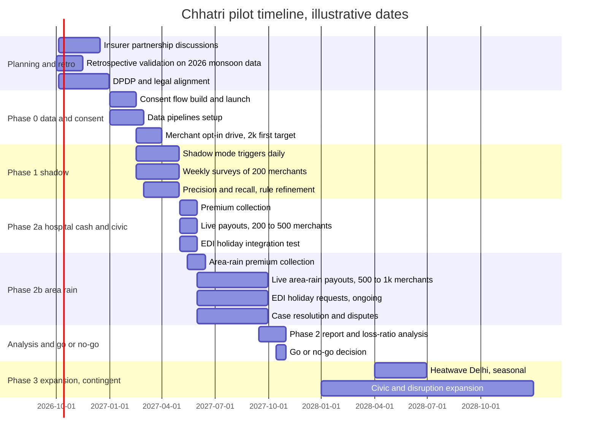

# Go-to-market and pilot plan

| | |
|---|---|
| Status | Draft v5 · 2 Oct 2026 |
| Owner | Omkar Kadam |
| Audience | Judges, mentors, partners, investors |
| Related | [Business model](./business-model-and-unit-economics.md) · [Metrics and impact](../02-product/metrics-and-impact.md) · [Regulatory and compliance](./regulatory-and-compliance.md) · [Personas and jobs](../02-product/personas-and-jtbd.md) |

## TL;DR

- This is a plan for discussion. No insurer, lender or Paytm team has agreed to any date, cohort or budget in it.
- Sell Chhatri inside Paytm for Business to device merchants, via Amit (field sales), Soundbox (announcement), WhatsApp (service). The in-app mini-app (N1) is PLANNED and today lives only in our own console.
- Retrospective validation: if Paytm agrees to share aggregated data, analyse 2026 monsoon sales (Oct–Nov 2026) to test the model on real behaviour.
- Phase 0 (Jan–Feb 2027): legal sign-off, consent cards and data pipelines. Phase 1 starts when the consent cards go live (mid-Feb 2027).
- Phase 1 (mid-Feb to Apr 2027): shadow mode, with no payouts, for the merchants who have given consent (first milestone 2,000 by the end of Mar; a target of 5,000–10,000); measure precision and recall against self-reported losses.
- Phase 2a (May 2027): Live hospital-cash and civic-disruption payouts with 200–500 merchants, validate operations before monsoon.
- Phase 2b (Jun–Sep 2027): Live area-rain payouts with 500–1,000 merchants during monsoon season; validate real loss ratios on actual rainfall.
- Prototype premiums (from the prototype's backtest on simulated sales): ₹6.93–₹38.82 per day by zone. **The final price is an open decision**, to be set with the partner insurer and validated in the pilot.
- Timeline: about 12 months (Oct 2026 to an Oct 2027 go/no-go); pilot budget about ₹16 lakh (estimate: AI, claims, ops, lender incentives).
- Kill criteria: no insurer commitment by 15 Dec 2026, Phase 1 precision/recall < 60%, Phase 2a SLA > 48 h, Phase 2b loss ratio > 90% or < 30%.

## 1. Go-to-market thesis

### 1.1 Channel strategy

Chhatri reaches merchants through three channels already owned by Paytm:

| Channel | Role | Owner |
|---|---|---|
| **Paytm for Business app** | Merchant discovers cover, buys, and tracks claims. Feature inside the app (N1 mini-app, PLANNED, Wave 1; today a prototype surface in our own console). | Paytm Product |
| **Soundbox** | Payout announcement in Hindi. "Paytm par ₹1,380 prapt hue — Chhatri se" (₹1,380 received on Paytm, from Chhatri). SIMULATED in the prototype. | Paytm Soundbox team |
| **WhatsApp** (Chhatri service line) | Claims service, questions about cover, disputes. Merchant texts or sends a voice note; Chhatri replies in Hindi and English text. Voice replies are PLANNED (N4). SIMULATED in the prototype. | Chhatri / Paytm Customer Ops |

No separate app. No expensive field force broadcast. Cover is a feature, not a product.

### 1.2 Sales narrative (for Amit, the field executive)

Amit visits a tea-stall owner or kirana in monsoon-prone Mumbai. He shows the Paytm for Business app and says:

---

**English (translation):**
"See this? We just added Chhatri, umbrella cover. If a heavy-rain alert hits your area and the shops around you lose sales, Chhatri pays you the same evening, with no forms and no calls. It can also ask your lender to pause the next day's instalment. The price depends on your zone; I'll show you yours. Cover starts 7 days after you buy, so buy before the monsoon, not during a storm."

**Hindi (original):**
"देखो, यह नया है: छतरी, दुकान की कमाई का कवर। अगर तुम्हारे इलाके में भारी बारिश का अलर्ट हो और आसपास की दुकानों की बिक्री गिरे, तो छतरी उसी शाम पैसे देती है, बिना फ़ॉर्म, बिना फ़ोन। यह तुम्हारे लोन वाले से अगले दिन की किस्त रोकने को भी कह सकती है। क़ीमत तुम्हारे ज़ोन पर निर्भर है, मैं तुम्हें तुम्हारी दिखाता हूँ। कवर ख़रीदने के 7 दिन बाद शुरू होता है, इसलिए मानसून से पहले लो, तूफ़ान के बीच नहीं।"

---

Amit does not give a 20-page brochure. He shows a 90-second demo: the map with a red alert, a payout of ₹1,380, the Soundbox line, and the next instalment paused. The merchant taps "Buy" and pays 30 days through a link; cover starts after the 7-day waiting period.

## 2. Customer segments and the first pilot segment

### 2.1 Total addressable market (by season, risk profile)

| Segment | Geography | Risk trigger | Shop types | Merchants (est.) | When |
|---|---|---|---|---|---|
| **Monsoon merchants** | Mumbai, coastal Gujarat, Kerala, TN coasts | Heavy rain | Tea stalls, kiranas, vegetable | 3–5 lakh | Jun–Sep |
| **Heatwave merchants** | Delhi NCR, UP, Rajasthan plains | Heat index > 42°C (roadmap trigger, not built) | Tea, juice, water refill | 2–3 lakh | Apr–Jun, Sep–Oct |
| **Flood-prone merchants** | Assam, Bihar, Odisha river valleys | Flood alerts | General retail | 1–2 lakh | Jul–Sep |
| **Dry-spell merchants** | Karnataka, Maharashtra dryland | Drought weeks | Vegetable, dairy | 1–2 lakh | Feb–May |

The merchant counts are unsourced estimates for orientation only. Paytm's data would replace them.

### 2.2 First pilot segment (monsoon Mumbai)

**Why this segment first:**

1. **Frequent loss events:** Mumbai has heavy-rain days every monsoon, in a predictable season (Jun–Sep; A13 records the extremes). We do not have a count of red alerts per season.
2. **Dense merchant base:** Paytm has 1.57 crore device merchants across India (Q1 FY27, A1). We do not have the Mumbai share.
3. **Measurable trigger:** Rainfall, alerts and sales can all be measured. Basis risk remains (A8), which is why the trigger uses the shops' own sales.
4. **Lender partnerships:** Paytm merchant loans come from partner NBFCs and banks (A5).
5. **Amit's base (assumption):** a field team in Mumbai can onboard 500–1,000 merchants in 4–6 weeks. This is not validated.

**Persona:** Anil Jadhav (S-0142), a synthetic tea-stall owner in Parel, Z7, with ₹600 daily EDI.

**Cohort target (estimate):** up to 5,000–10,000 consenting merchants in zones Z3, Z7, Z9, Z12 (monsoon-exposed) during Phase 1. Consent limits it: the first milestone is 2,000 by the end of Mar 2027.

## 3. Pilot phases

### 3.0 Retrospective validation (pre-partner: Oct–Nov 2026, on Jun–Sep 2026 data)

**Goal:** Validate the model against aggregated Paytm historical sales data from the 2026 monsoon season, without live payouts or insurer involvement. The model was trained on simulated data; this phase tests it against real merchant behavior. It needs Paytm to agree to share the aggregated data.

**Activities:**
1. Use aggregated, historical Paytm settlement data (zone-level, merchant-count-aggregated) from Jun–Sep 2026 monsoon under existing data governance and DPDP consent rules.
2. Run Chhatri's area and hospital-cash detections on 2026 historical rainfall and observed settlement data.
3. Compare detected triggers with observed sales drops (derived from settlement patterns under consent).
4. Measure precision and recall: how well do triggers predict actual loss events?
5. Validate that premiums calibrated on simulated data are defensible against real observed behavior.

**Success criteria:**
- Precision and recall ≥ 60% on 2026 historical data (validates model transferability from simulation to reality).
- No major contradictions between backtest assumptions and actual merchant loss patterns.

**Duration:** 6 weeks (Oct–early Nov 2026 analysis, backfilling 2026 monsoon data).

**Output:** A retrospective validation report replacing the circular calibration with real evidence of model behavior on actual monsoon loss events.

### 3.1 Phase 0: Data and consent setup (Jan–Feb 2027, about 8 weeks)

**Goal:** Enable Paytm to send sales data and alert data to Chhatri; get merchant opt-in consent for 2027 monsoon season.

**Activities:**
1. Finalize DPDP consent flow in the Paytm for Business app. Data: daily sales volume (aggregate, not itemized), zone ID, alert subscriptions.
2. Launch consent cards in Paytm for Business starting Jan 2027.
3. Get legal sign-off from Paytm's DPDP counsel and the partner insurer's GRO.
4. Set up data pipelines: real-time settlement to Chhatri, real-time IMD alert subscriptions.

**Success criteria:**
- ≥ 2,000 merchants have given consent by end of Mar 2027 (target).
- Data pipelines run with < 1% daily error rate.

### 3.2 Phase 1: Shadow mode (mid-Feb to Apr 2027)

**Goal:** Compute triggers and expected payouts *without* paying out before the monsoon. Compare Chhatri's triggers with merchants' own reports of actual losses. Also validate non-seasonal triggers (hospital-cash, civic disruption). Phase 1 starts when the consent cards from Phase 0 go live, so it only uses merchants who have consented.

**Activities:**
1. Chhatri computes area triggers and hospital-cash detections daily.
2. For every trigger, log: alert, zone index, would-be payout amount, policy version.
3. Every week, send a survey to 200 merchants: "On day X, did your sales drop? How much?" (via WhatsApp).
4. Match Chhatri's triggers with merchants' self-reported losses.
5. Test civic-disruption and hospital-cash triggers on historical data and incoming events.

**Targets (not measured):**
- Precision: % of Chhatri triggers that merchants self-report as real (target ≥ 70%).
- Recall: % of merchant-reported losses caught by Chhatri (target ≥ 60%).
- Agreement on payout amounts: if Chhatri says ₹1,380, do merchants agree (target ≥ 80%)?

**Duration:** about 11 weeks (mid-Feb to Apr 2027, pre-monsoon validation of rules and systems).

**No payouts.** Merchants are not told triggers fired; they are only surveyed.

### 3.3a Phase 2a: Live hospital-cash and civic-disruption claims (May 2027, then year-round)

**Goal:** Launch live payouts for non-seasonal triggers (hospital-cash, civic-disruption alerts) before the monsoon season. Validate insurer partnership, claims operations, and lender integration at scale.

**Setup:**
1. **Insurer partner:** Ready to underwrite and pay hospital-cash and civic-disruption claims.
2. **Pilot cohort:** 200–500 merchants in zones with active loans, consented for data.
3. **Premium collection:** premiums for these year-round covers (hospital cash and civic disruption) are collected through Paytm for the insurer. Their price is set with the insurer, because the prototype's backtest prices only the area cover.

**Live triggers and payouts:**
1. When a hospital-cash or civic-disruption trigger fires, Chhatri pays the merchant via settlement the same evening.
2. The insurer reimburses Paytm the next business day.
3. Chhatri asks the lender for an EDI holiday. The lender decides under its pre-agreed rule.

**Targets (not measured):**
- **Claims:** hospital-cash claims 10+, civic-disruption claims 5+.
- **Renewal rate:** month 2 retention ≥ 60%.
- **EDI holiday grant rate:** lender approves ≥ 90% of requests.
- **Case resolution SLA:** disputes resolved within 24 h (target 100%).

**Duration:** 4 weeks (May 2027), validating operations before monsoon ramp-up.

### 3.3b Phase 2b: Live area rain claims (Jun–Sep 2027, monsoon season)

**Goal:** Scale area rain claims to full merchant cohort during Mumbai's monsoon season. Validate real loss ratios on actual rainfall events and measure impact on EDI defaults and renewal.

**Seasonal timing:** Phase 2b is scheduled for Jun–Sep 2027 (Mumbai's main monsoon), the core use case. Loss ratios measured outside monsoon season would be artificially low and unrepresentative; this phase validates actual performance on real rain-driven loss events.

**Setup:**
1. **Insurer partner:** A general insurer ready to underwrite and pay area rain claims (contract signed by Jan 2027).
2. **Lender partner:** An NBFC or bank (already tested in Phase 2a) grants EDI holidays per pre-agreed rule.
3. **Pilot cohort:** 500–1,000 merchants in Z3, Z7, Z9, Z12 with active loans, shadow-mode experience, and hospital-cash/civic cover (from Phase 2a). Enroll area rain cover in May 2027 (pre-monsoon).
4. **Premium collection:** Paytm collects monsoon area-rain premiums (a 30-day prepayment of about ₹208 to ₹1,165 per merchant at the prototype's zone prices of ₹6.93 to ₹38.82 a day; the real price is open), separate from year-round hospital-cash premiums collected in Phase 2a.

**Live triggers and payouts:**
1. When a trigger fires, Chhatri pays the merchant via settlement the same evening.
2. The insurer reimburses Paytm the next business day.
3. Chhatri asks the lender for an EDI holiday. The lender grants or refuses under its pre-agreed rule (loan active, not in arrears, allowance left).
4. Soundbox announces the payout.

**Targets (not measured):**
- **Claims**: area claims fired 20+, hospital-cash claims 10+.
- **Loss ratio:** payouts ÷ premiums collected. Target: 60–70% (consistency check; see section 4.2).
- **Renewal rate:** merchants who keep cover month 2. Target: ≥ 80%.
- **EDI holiday grant rate:** lender approves ≥ 90% of requests. Target: ≥ 90%.
- **Case resolution SLA:** disputes opened, resolved within 24 h. Target: 100%.
- **Churn reason:** survey merchants who cancel; categorize (high price, low trust, no loss, other).

**Duration:** about 17 weeks (Jun–Sep 2027, covering the full Mumbai monsoon season).

### 3.4 Phase 3: Expansion (Oct 2027 onwards)

Everything in this phase is contingent on the go/no-go decision at the end of Phase 2b. The dates are illustrative.

**Go/no-go criteria (all required to proceed):**

1. **Phase 2b success:** Loss ratio 60–70%, renewal rate ≥ 80%, EDI holiday grant rate ≥ 90%.
2. **Insurer confidence:** Partner agrees to expand to new geographies and triggers.

**Expansion phases:**

1. **Heatwave segment (Delhi, Apr–Jun 2028):** Heat index > 42°C triggers. Priya (persona), a kirana owner in Delhi, buys seasonal cover. Target 500+ merchants in Delhi and NCR zones.
2. **Civic disruption alerts (year-round, 2028+):** Expand existing hospital-cash and civic-disruption triggers to Gujarat and Rajasthan.
3. **Flood-prone segment (Assam, Bihar, Odisha, Jul–Sep 2028):** Flood alerts for river valleys.

## 4. Pilot size, duration, and success criteria

### 4.1 Cohort sizing

| Phase | Merchants | Zones | Duration | Payouts | Insurer risk |
|---|---|---|---|---|---|
| Shadow (Phase 1) | up to 5k–10k (consent-limited; 2,000 first) | Z3, Z7, Z9, Z12 | about 11 weeks | ₹0 | ₹0 (no payout) |
| Live HC/Civic (Phase 2a) | 200–500 | Z3, Z7, Z9, Z12 | 4 weeks | Not priced yet; to be sized with the insurer | To be sized with the insurer |
| Live Area Rain (Phase 2b) | 500–1k | Z3, Z7, Z9, Z12 | about 17 weeks | About ₹7–₹14 lakh (estimate) | About ₹7–₹14 lakh (estimate) |

**Rationale:**
- Phase 2a validates operations on year-round claims before monsoon ramp-up (small cohort, low risk). The prototype's backtest prices only area cover, so no payout figure is given for hospital cash and civic disruption.
- Phase 2b scales to a full monsoon cohort during the actual rain season. The estimate assumes the pricing identity holds: premiums for 500–1,000 merchants spread evenly over the four pilot zones (average ₹17.16 a day) over Jun–Sep come to about ₹10–₹21 lakh, and payouts are 65% of that. Real payouts could be higher or lower, which is what the pilot measures (see the sensitivity table in the [business model](./business-model-and-unit-economics.md)). Small enough for proof-of-concept; large enough to validate real loss patterns.

### 4.2 Success criteria

| Metric | Phase | Target | Consequence if missed |
|---|---|---|---|
| **Precision / Recall** | Phase 1 | ≥ 70% / ≥ 60% | If lower, refine trigger rules before Phase 2 go-live |
| **Loss ratio** | Phase 2b | 60–70% | Consistency check (see note below). If outside band, triggers repricing or rule adjustment |
| **Renewal rate** | Phase 2a, 2b | ≥ 80% month 2 | If < 60%, cover appeal is low; pivot messaging |
| **Insurer claims approval rate** | Phase 2a, 2b | ≥ 90% | If < 80%, policy rules need revision |
| **EDI holiday grant rate** | Phase 2a, 2b | ≥ 90% | If < 70%, lender unwilling or terms not aligned |
| **Case resolution SLA** | Phase 2a, 2b | 100% within 24 h | If < 90%, ops load too high; reduce pilot size |
| **Ask Chhatri grounded-answer rate (N2, PLANNED)** | Ongoing | ≥ 95% (target; not measured, see the [AI evaluation plan](../04-engineering/ai-evaluation-plan.md)) | If < 90%, fix the prompts, guard or fallbacks (no model is trained) |

**Loss ratio note:** The target of 60–70% reflects expected loss ratios if merchant behavior matches model assumptions. The pilot validates this hypothesis against real data. A result outside this band leads to repricing or trigger-rule changes before any expansion. Beyond the kill criteria (a loss ratio above 90% or below 30% in Phase 2b), the product stops.

## 5. Onboarding script for Amit (field executive)

This script describes the future product inside the Paytm for Business app. Today the mini-app is PLANNED (N1) and is a prototype in our own console, and the Soundbox line and the lender are simulated. The lines about payouts describe the design, not a guarantee. Amit is a fictional persona.

### 5.1 Pre-visit (via WhatsApp, 2 days before)

**Hindi:**
"नमस्ते, मैं पेटीएम से अमित। अगले गुरुवार आपको कुछ नया दिखाना है: छतरी कवर। आपके इलाके में भारी बारिश का अलर्ट हो और बिक्री गिरे, तो उसी दिन पैसे मिलते हैं। क्या आप दुकान पर होंगे?"

**English translation:**
"Hi, this is Amit from Paytm. Next Thursday I'd like to show you something new: Chhatri cover. If a heavy-rain alert hits your area and sales fall, it pays the same day. Will you be at the shop?"

### 5.2 In-shop visit (5–8 minutes)

**Opening (1 min):**
"Last monsoon, when the rain was heavy, what happened to your sales? How many days did they drop? And the loan instalment still went out of your settlement, right?"

**Demo (4 min):**
*Opens Paytm for Business on a tablet.*
"See here? I open Chhatri. It shows the price for your zone, and the first payment covers 30 days. Cover starts a week after you buy. Then, if a heavy-rain alert hits and sales across your area fall, the money comes the same evening. This is a demo shop: ₹1,380 paid, and the Soundbox says 'Paytm par ₹1,380 prapt hue — Chhatri se'. No call, no form. The lender was also asked to pause tomorrow's instalment."

**Objections (2 min):**

- **"Why should I trust this?"** "The rules are written down. You can see why you got every rupee, and if you disagree, a person replies within 24 hours."
- **"Why pay every day?"** "You pay a little every day so that one bad day doesn't sink you. It's cover, not savings: most weeks you won't claim, and on a bad day it pays the same evening."
- **"Will my lender pause the instalment?"** "That's the lender's decision. After a payout, Chhatri asks on your behalf; if your loan is up to date, the lender's rule decides."

**Close (1 min):**
"Let me send the link. If you buy this week, cover starts next week, before the heavy rains. It pays only when an alert hits your area and sales there really fall; here is the rules page."

*Sends a WhatsApp link. The merchant taps and pays; cover starts after the 7-day waiting period.*

---

**Script in Hindi (full):**

"पिछले मानसून में जब बहुत बारिश हुई, तुम्हारी बिक्री का क्या हुआ? कितने दिन गिरी? और लोन की किस्त फिर भी सेटलमेंट से कट गई, है ना?"

*[Opens app]*

"देखो, यहाँ। छतरी खोलता हूँ। तुम्हारे ज़ोन की क़ीमत दिखती है, और पहली पेमेंट 30 दिन का कवर देती है। कवर ख़रीदने के एक हफ़्ते बाद शुरू होता है। फिर अगर भारी बारिश का अलर्ट आए और तुम्हारे इलाके की बिक्री गिरे, तो उसी शाम पैसे आते हैं। यह एक डेमो दुकान है: ₹1,380 आए, और साउंडबॉक्स बोलता है 'Paytm par ₹1,380 prapt hue — Chhatri se'। कोई कॉल नहीं, कोई फ़ॉर्म नहीं। लोन वाले से कल की किस्त रोकने को भी कहा गया।"

"क्यों मानूँ?" "नियम लिखे हुए हैं। हर रुपया क्यों मिला, तुम देख सकते हो, और अगर सहमत नहीं हो तो 24 घंटे में एक इंसान जवाब देता है।"

"रोज़ पैसे क्यों दूँ?" "रोज़ थोड़ा देते हो ताकि एक बुरा दिन तुम्हें न डुबोए। यह कवर है, बचत नहीं: ज़्यादातर हफ़्तों में दावा नहीं होगा, और बुरे दिन उसी शाम पैसे मिलेंगे।"

"मेरा लोन वाला किस्त रोकेगा?" "यह लोन वाले का फ़ैसला है। पेमेंट के बाद छतरी तुम्हारी तरफ़ से पूछती है; अगर तुम्हारा लोन समय पर है, तो लोन वाले का नियम तय करता है।"

"लिंक भेजता हूँ। इस हफ़्ते लोगे तो कवर अगले हफ़्ते से शुरू होगा, भारी बारिश से पहले। यह तभी देता है जब तुम्हारे इलाके में अलर्ट हो और वहाँ की बिक्री सच में गिरे; यह रहा नियमों वाला पेज।"

---

### 5.3 Post-visit (follow-up, 3 days later via WhatsApp)

If merchant bought: "आपका कवर ख़रीदने के 7 दिन बाद शुरू होगा। कोई सवाल हो तो इसी WhatsApp पर पूछ लीजिए।"

If merchant did not buy: "सोच लिया? कवर ख़रीदने के 7 दिन बाद शुरू होता है, इसलिए मानसून से पहले लेना ठीक रहेगा।"

## 6. Partner plan

### 6.1 Insurer partner

**Sought:** A general insurer licensed by IRDAI. Preferred: one with existing parametric or weather-index products.

**Ask:**
1. Underwrite the Chhatri pilot product (merchant income cover, area + hospital-cash claims).
2. File for product approval, possibly via IRDAI's regulatory sandbox.
3. Decide claims above the human-review threshold.
4. Arrange reinsurance for tail risk (e.g., ₹50+ lakh payout in one alert).
5. Meet IRDAI's reporting duties on claims and disputes (to be confirmed with the insurer).

**Target dates (proposed, not agreed):**
- Partner commitment by 15 Dec 2026.
- Product filing by 15 Jan 2027.
- Sandbox approval (if chosen) by 28 Feb 2027.
- If the insurer says no, or approval is late: Phase 1 can still run in shadow mode, because it pays nothing. Live phases wait for an insurer and approval.

**Incentive:** Paytm brings 1.57 crore merchants and distribution. The insurer gets a new customer segment and Paytm's operational support on claims.

### 6.2 Lender partner

**Sought:** An NBFC or bank already lending to Paytm merchants.

**Ask:**
1. Decide EDI holidays under a pre-agreed rule (for example: loan active, not in arrears, holiday allowance left, loan in the scheme). Chhatri only requests; the lender grants or refuses.
2. Answer Chhatri's EDI requests within an agreed time. The prototype's X4 design proposes a 10-second limit, a target to tune; a real lender may agree a different one.
3. Provide weekly reports: number of EDI holidays granted and refused (with reasons), default prevention, any issues.

**Target dates (proposed, not agreed):**
- Pre-agreed rule finalized by 31 Dec 2026.
- Live integration testing (Chhatri → lender's API) by 15 Jan 2027.

**Incentive:** EDI holidays may reduce missed-payment callbacks and default losses: when a merchant receives a payout, they can service the loan (a hypothesis the pilot measures). The partner insurer underwrites and pays claims; Paytm distributes and handles merchant relationships. The lender defers one instalment under a pre-agreed rule.

### 6.3 Weather and alert data provider

**Currently:** Open-Meteo cached real rainfall for the backtest and replay, and an optional live rain widget. Alerts are simulated.

**For pilot:** an official alert feed is needed (IMD). Paytm's data team should say whether one exists (open question 5). Open-Meteo rainfall stays useful for checking expected against observed.

**For production:** IMD's licensed or public alert API, to be confirmed.

**Cost assumption (estimate):** ₹500–₹2,000 / month for production alert ingestion, unverified.

### 6.4 AI services (production)

**Currently:** Sarvam free credits (BUILT, live only with `SARVAM_API_KEY`). The Gemini free tier is PLANNED (Wave 2).

**For pilot and beyond:** Sarvam paid, about ₹10k–₹30k a month (estimate, unverified) for slip vision, STT/TTS, and chat at expected volume.

**Fallback:** If Sarvam capacity runs out, a paid Gemini tier is the option (cost not estimated).

## 7. Regulatory path

See [Regulatory and compliance](./regulatory-and-compliance.md) for detailed DPDP, IRDAI, and RBI requirements.

**Proposed path (target dates, not agreed):**
1. **By 15 Dec 2026:** Partner insurer committed. Lender rule finalized by 31 Dec.
2. **By 15 Jan 2027:** Product filing (insurer and Paytm counsel). Regulatory sandbox application (if chosen). DPDP consent cards built and signed off (Phase 0).
3. **Mid-Feb 2027:** Consent cards live. Shadow phase starts.
4. **By 28 Feb 2027:** Sandbox or direct approval, if obtained.
5. **May 2027:** Live payouts start only with an insurer and an approval: hospital cash and civic disruption first (Phase 2a), then area rain in the monsoon (Phase 2b).
6. **Oct 2027:** Go/no-go. Other segments (heatwave, flood-prone) only after that, in 2028.

**Kill criteria:** No insurer partner commitment by 15 Dec 2026, or regulatory sandbox rejection by 28 Feb 2027 (unless direct approval obtained).

## 8. Budget

### 8.1 Pilot costs (Phase 0 + Phase 1 + Phase 2a + Phase 2b, Jan 2027–Sep 2027)

| Cost category | Amount (₹) | Notes |
|---|---|---|
| **AI services (production)** | 3,00,000 | Sarvam paid: slip vision, STT/TTS, chat for 5k–10k merchants, 5 months |
| **Claims operations** | 4,00,000 | 2 full-time claims officers (₹50k/month each × 4 months) |
| **Lender incentives** | 2,00,000 | EDI holiday reconciliation, reporting, API integration support |
| **WhatsApp service line** | 1,50,000 | Template management, customer service staff (₹30k/month × 5) |
| **Data compliance (DPDP, consent, audit)** | 1,50,000 | Legal counsel, compliance audit, data minimization infrastructure |
| **Survey and feedback (Phase 1)** | 50,000 | Weekly SMS/WhatsApp surveys to 200 merchants |
| **Merchant incentives (optional)** | 1,00,000 | Small gifts for early adopters, feedback |
| **Documentation and ADRs** | 50,000 | Regulatory filings, compliance reports, case studies |
| **Contingency** | 2,00,000 | Buffer for overruns, reinsurance negotiation costs |
| **Total** | **16,00,000** | **≈ ₹16 lakh** |

All amounts are rough estimates, not quotes.

**Proposed split (not agreed):**
- **Paytm bears:** AI services, claims ops, WhatsApp ops, data compliance, contingency.
- **Insurer partner bears:** Reinsurance, capital, claims officer for referred cases.
- **Lender partner bears:** API integration, EDI holiday processing (internal ops).

### 8.2 Cost per merchant (pilot)

- ₹16 lakh ÷ about 750 live merchants (the middle of 500–1,000) = **about ₹2,100 per merchant for the whole pilot** (estimate).
- Expected yearly premium: about ₹6,300 for a merchant in the four pilot zones (average ₹17.16 a day × 365; see the [business model](./business-model-and-unit-economics.md)). The 35% loading is about ₹2,200 a year.
- **Sustainability:** the pilot's cost per merchant is close to one year of the loading. The pilot is a cost of learning, not a profit centre. Costs per merchant should fall at scale, but we have not modelled that.

## 9. What we ask Paytm for

### 9.1 Product and platform

1. **Paytm for Business app:** embed N1 mini-app (cover card, buy, claim tracker, help).
2. **Soundbox integration:** API to send payout announcements in Hindi.
3. **Settlement API:** real-time daily settlement amounts per merchant (already available to Paytm's lending partners).
4. **Payment links:** production Paytm payment link for premium collection (SIMULATED in the prototype because the team has no Paytm keys; live only in a pilot).
5. **WhatsApp Cloud API:** test number or business account for service messages.

### 9.2 Data and compliance

1. **Sales data consent flow:** add a purpose-specific consent card to Paytm for Business (data: zone, daily sales volume aggregate).
2. **IMD alert feed:** real-time rain and civic alerts for Mumbai zones.
3. **Merchant KYC database:** access to merchant name, phone, zone for claims matching.
4. **Legal sign-off:** DPDP compliance for data minimization, consent, and deletion on request.

### 9.3 Operations and partnerships

1. **Field force alignment:** brief Amit and 20–30 other executives for Phase 1 onboarding.
2. **Lender introductions:** connect with 2–3 partner lenders for EDI holiday integration.
3. **Insurer introductions:** leverage Paytm Insurance Broking to approach underwriters.
4. **Analytics:** access to settlement data for loss-ratio monitoring (non-PII, aggregated by zone and day).

### 9.4 Contingency (if on-site builds extend past 3 Oct 2026)

1. **Demo hosting:** a free static host such as GitHub Pages for the static console (N7). It needs the repo owner to deploy. No public URL exists yet.
2. **Backup video:** a recording of the demo for judges if the live demo fails (N7).

## 10. Timeline

**Timeline structure:** Calendar dates, all illustrative. They assume an insurer commits by 15 Dec 2026 and nobody has agreed to them.

### 10.1 Milestones

| Target date (illustrative) | Milestone | Owner |
|---|---|---|
| Oct–Nov 2026 | Retrospective validation on 2026 monsoon data complete (needs Paytm's data) | Ujjwal Pardeshi |
| By 15 Dec 2026 | Partner insurer commitment secured. Lender rule agreed by 31 Dec | Omkar Kadam |
| By 15 Jan 2027 | Regulatory filing submitted | Paytm Legal + Omkar |
| Jan–Feb 2027 | Phase 0 consent cards and data pipelines built. Shadow mode starts when the cards go live (mid-Feb) | Paytm Product |
| End of Mar 2027 | First 2,000 merchants opted in (target) | Paytm Product |
| Feb–Apr 2027 | Phase 1 precision and recall analysis (target ≥ 70% / 60%) | Ujjwal Pardeshi |
| May 2027 | Phase 2a (HC/Civic) go-live, if an insurer and approval are in place | Omkar Kadam |
| Jun 2027 | Phase 2b (area rain) enrolment opens, monsoon season begins | Paytm Product |
| Oct 2027 | Phase 2b complete; loss ratio, renewal and EDI metrics final | Ujjwal Pardeshi + Omkar |
| Oct 2027 | Review and go or no-go decision for expansion | Paytm Leadership |

## 11. Risks and kill criteria

### 11.1 High-risk items

| Risk | Likelihood | Impact | Mitigation | Kill criterion |
|---|---|---|---|---|
| **No insurer partner** | Medium | Critical | Pitch 3+ insurers in parallel; use IRDAI sandbox if direct approval slow | No partner commitment by 15 Dec 2026 |
| **Loss ratio > 80%** | Medium | High | Adjust premiums or policy rules mid-pilot | A loss ratio above 90% (or below 30%) after 4 weeks in the monsoon stops the pilot (section 11.2) |
| **Renewal rate < 60%** | Medium | High | Survey drop-outs; adjust messaging or price | Month 2 renewal below 60% triggers a messaging pivot (section 4.2). Below 40% in month 1 is a kill criterion (section 11.2) |
| **Lender unwilling to grant EDI holidays** | Low | High | Show pilot impact on defaults; offer incentive share | Lender approves < 70% of EDI requests in Phase 2 |
| **Case resolution SLA > 24 h** | Low | Medium | Pre-hire claims officers; automate simple cases | Median case resolution > 48 h in Phase 2 |
| **Regulatory rejection** | Low | Critical | Engage IRDAI early; use sandbox; ensure DPDP alignment | Regulatory decision goes against pilot by 28 Feb 2027 |

### 11.2 Kill criteria (stop-loss thresholds)

**Any one of these triggers a pivot or shutdown:**

1. **No insurer partner commitment by 15 Dec 2026.** → Pivot to a lending-focused insurance (e.g., loan-protection-only model).
2. **Phase 1 precision or recall < 60% after 8 weeks.** → Trigger rules are unreliable; pause before Phase 2a and refine.
3. **Phase 2a (HC/Civic) case resolution SLA > 48 h median after 2 weeks.** → Operations cannot scale; hold Phase 2b launch pending hiring.
4. **Phase 2a EDI holiday grant rate < 70% after 2 weeks.** → Lender cannot operationalize; reframe as lender-optional (EDI becomes merchant incentive only).
5. **Phase 2b loss ratio > 90% or < 30% after 4 weeks in monsoon.** → Trigger or pricing fundamentally wrong; pause and reanalyze.
6. **Phase 2b renewal rate < 40% in month 1.** → Merchant acceptance is too low; redesign messaging or pivot to hospital-cash focus.
7. **Regulatory sandbox rejection AND direct approval not obtained by 28 Feb 2027.** → Product cannot be filed in current form; table Chhatri for next year.
8. **Cumulative pilot spend exceeds ₹30 lakh before Phase 2b achieves 20+ area claims.** → Opex unsustainable; reduce scope.

**Go/no-go meeting:** Oct 2027 with Paytm leadership. Decision: expand to heatwave (Delhi) and civic-disruption (new geographies) in 2028, or pivot to smaller, lower-risk model.

## Open questions

1. Which insurer should Paytm approach first, and who owns that relationship? Owner: Omkar Kadam.
2. Will Paytm's field force (Amit and peers) accept the onboarding and weekly check-in? Owner: Omkar Kadam.
3. What payment link flow does Paytm prefer for the 30-day prepayment—in-app payment or external link? Owner: Paytm Product.
4. Can Paytm commit WhatsApp test-number capacity for Phase 1 surveys and Phase 2 service? Owner: Paytm Comms.
5. Does Paytm have existing IMD alert integrations we can reuse, or must we build? Owner: Paytm Data.
6. How long will legal sign-off and the consent rollout take? The plan assumes about 8 weeks (Jan–Feb 2027) after legal alignment starts in Oct 2026. Owner: Omkar Kadam.

## Changelog

- 2026-10-02 · v5 · dates and phases made consistent (calendar months replace the M-numbers; Phase 0 is 8 weeks and shadow mode starts when consent goes live; one commitment date, 15 Dec 2026); budget total corrected to ₹16.0 lakh and per-merchant arithmetic redone; the ₹10–₹600 premium range replaced by the 30-day prepayment range; Phase 2b duration fixed; payout estimates tied to the 65% pricing identity; lender wording is request and decide; Sarvam is not an alert provider; Phase 3 marked contingent; planned items and unsourced estimates labelled; backup video has no assumed length.
- 2026-10-02 · v4 · sales scripts made honest: no promised holiday or guaranteed payout, real Soundbox line, cover starts after 7 days, no invented prices; loss-ratio note matches the kill criteria
- 2026-10-02 · v3 · second fact-check pass: aligned prototype premium range to the committed zone premiums (₹6.93–₹38.82, not ₹2–₹20); added "the price is open" statement; corrected year-round cover premium estimate to align with zone-dependent pricing.
- 2026-10-02 · v2 · final consistency pass against the code: no changes needed; all partner references correctly use future tense ("will be approached") and do not claim agreements.
- 2026-10-02 · v1.3 · AI provider and live/simulated framing aligned
- 2026-10-02 · v1.2 · logic and truth audit fixes
- 2026-10-02 · v1.1 · fact-check pass.
- 2026-10-02 · v1 · first draft.
