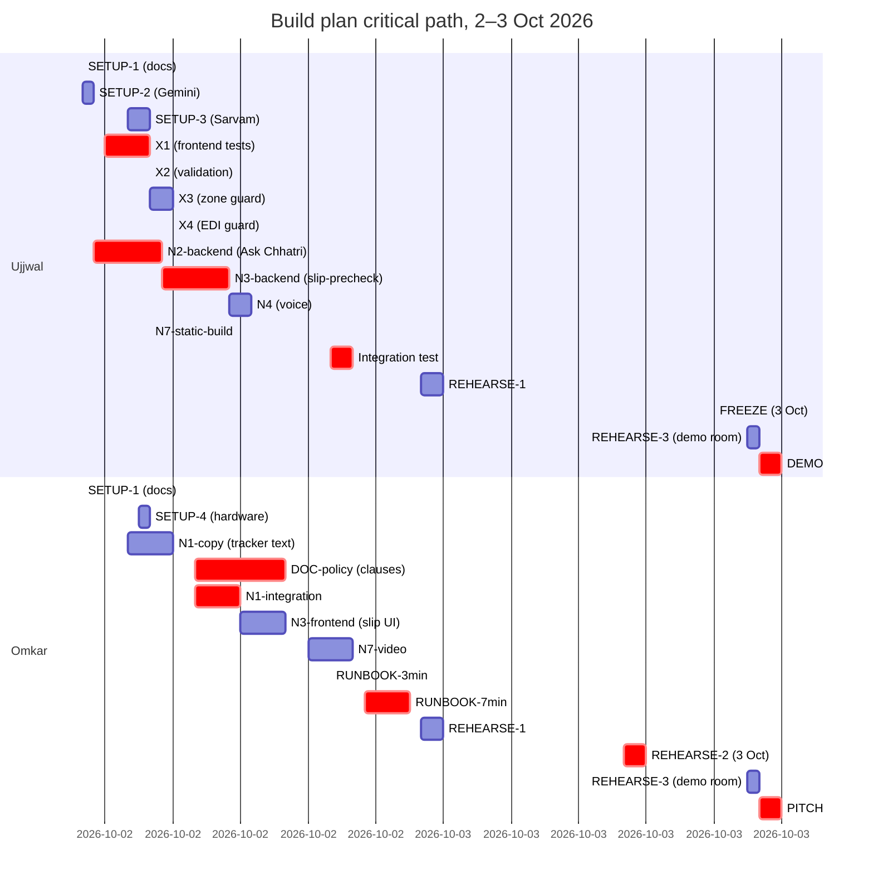

# Build plan for 2–3 Oct 2026

| | |
|---|---|
| Status | Draft v1 · 2 Oct 2026 |
| Owner | Omkar Kadam and Ujjwal Pardeshi |
| Audience | The team, judges, mentors tracking progress |
| Related | [Risk register](risk-register.md) · [Demo runbook](demo-runbook.md) · [Current-state audit](../01-strategy/current-state-audit.md) · [Pitch and judge Q&A](pitch-and-judge-qa.md) |

## TL;DR

- **2 Oct (today):** Read docs and set up keys. Ujjwal builds fixes X1–X6 and backend N2–N3. Omkar builds N1 screens and policy wording. Evening: integrate, static deploy, first rehearsal.
- **3 Oct (on-site, ~8 hours reported):** Finish N1–N4, optionally N5–N8. Freeze 90 min before demo. Run from in-process runner with true LIVE badges only.
- **Critical path:** N1 screens (Omkar) → N1 API endpoints and mocks → demo runbook copy (Omkar) → rehearsal. Any slip here costs the full demo window.
- **Commits:** Each person commits their own work daily under their own name. No merge conflicts; Omkar does docs, Ujjwal does code and infra.

## 1. Objectives

### 2 Oct (today)

- Validate all external APIs (Gemini, Sarvam, browser speech) on the demo laptop.
- Land X1–X6 (fixes). X1 (frontend tests) is critical; X4 (EDI guard) is new product logic.
- Complete N1 (mini-app) screens, API endpoints and backend logic. This is the judges' window into the merchant journey.
- Write and illustrate all policy wording (docs/02-product/policy-wording-and-cis.md).
- Build N7 (static mock-mode console and backup video) for the public-repo fallback.
- Rehearse 3-min and 7-min cuts. Identify timing holes and bottlenecks.

### 3 Oct (on-site)

- Polish N1–N4 (especially mini-app UX, voice latency, slip pre-check flow).
- Optionally land N5 (grievance ladder) and N6 (consent centre).
- Stretch goal: N8 (Marathi) if time allows.
- Freeze code 90 minutes before the first demo slot and run two final rehearsals.
- Go to stage with in-process runner, LIVE badges only for truly live components (Gemini key set → N2/N3 LIVE; Sarvam key set → N4 LIVE; browser speech fallback always available).
- **Key message:** "Specification validation on simulated sales with real rainfall."

## 2. Tasks and dependencies

| ID | Description | Component | Owner | Est (h) | Dependency | Priority | When | DoD | Verification |
|---|---|---|---|---|---|---|---|---|---|
| **Setup** | | | | | | | | | |
| SETUP-1 | Read all docs from README.md down (especially SPEC.md, ARCHITECTURE.md, DEMO.md). | docs | Both | 1.5 | — | P0 | 2 Oct 08:00–09:30 | Both understand the system and can explain it in 2 min. | "I can explain the trigger and the policy engine." (verbal check) |
| SETUP-2 | Set up Gemini API key in `.env`. Test on `/api/merchants/{id}/ask` with a synthetic question. | infra | Ujjwal | 0.5 | SETUP-1 | P0 | 2 Oct 09:30–10:00 | Key is set, `/api/integrations` shows Gemini LIVE, test response is grounded. | `curl http://localhost:8000/api/integrations \| grep gemini` and test ask endpoint. |
| SETUP-3 | Set up Sarvam key. Test STT, TTS, vision on demo laptop with sample slip and voice input. | infra | Ujjwal | 1 | SETUP-1, SETUP-2 | P0 | 2 Oct 10:00–11:00 | Sarvam components respond. STT latency < 3 s. TTS voice is audible. Vision extracts slip fields. | Transcript in logs, audio plays, vision response in `/api/merchants/{id}/slip-precheck`. |
| SETUP-4 | Test browser speech recognition (hi-IN) on demo laptop. Confirm microphone and speaker. Zoom at 100%, screen ≥ 1280×720. | hardware | Both | 0.5 | — | P0 | 2 Oct 10:30–11:00 | Browser detects hi-IN, microphone input works, output audible, no zoom. | Verbal: "Speech works offline." Run e2e speech test on the demo machine. |
| **Fixes (X1–X8)** | | | | | | | | | |
| X1 | Fix the 2 failing frontend tests (Cases panel, Overview live-map). Run `make test-frontend` → 264/264 pass. | frontend | Ujjwal | 2 | SETUP-1 | P0 | 2 Oct 09:00–11:00 | Tests pass. Coverage ≥ 80%. | `make test-frontend` shows 264/264 pass; `git log --oneline -1` shows X1 commit by Ujjwal. |
| X2 | Validate `published_expected_day` at claim creation (Paytm API call or simulator). Reject invalid zones. | backend | Ujjwal | 1.5 | SETUP-1 | P0 | 2 Oct 11:00–12:30 | Claim creation fails with a 400 and a clear error if the expected day is invalid or the zone is missing. | Test with a bad zone in the `/api/claims` POST; verify error response. Unit test in `test_claims.py`. |
| X3 | Fail loudly when a zone is missing from `backend/artifacts/premiums.json`. Add a startup check. | backend | Ujjwal | 1 | SETUP-1 | P0 | 2 Oct 12:30–13:30 | Server logs show a clear error at start-up if a zone in rules.yaml is not in premiums. | Start the backend with a missing zone; verify the error is logged and the zone name is clear, not a cryptic KeyError. |
| X4 | EDI-holiday guard: check that the loan is active, not in arrears, and holiday allowance not exhausted before requesting the lender. | backend | Ujjwal | 1.5 | SETUP-1 | P0 | 2 Oct 13:30–15:00 | Decision record includes `edi_holiday_requested: true` only if all three checks pass. If any check fails, the holiday is not requested but the claim decision is unchanged. | Unit test with three merchants (one active, one in arrears, one out of holidays). Verify decision diff. |
| X5 | Off-script merchant (unknown ID, no KYC, not in the index) returns a clean 404, not a KeyError. | backend | Ujjwal | 1 | SETUP-1 | P0 | 2 Oct 14:00–15:00 | Return `{"error": "merchant not found", "code": "NOT_FOUND"}` with a 404. | Test `/api/merchants/bad-id/cover` and verify a 404 with a clear message, not a 500. |
| X6 | Per-component Sarvam provider panel (proposed): implement toggles for assist, STT, TTS, slip (or stub for future). Add provider status to `/api/integrations`. | backend, frontend | Ujjwal | 3 | X1, SETUP-3 | P1 | 2 Oct 15:00–18:00, 3 Oct (if time) | `/api/integrations` includes `sarvam_providers: {assist, stt, tts, slip}` with LIVE/FALLBACK status. Console shows a provider panel (demo-mode only). | Inspect `/api/integrations`; visually inspect the console provider panel if built. X6 is a polish task; land it if X1–X5 are done by 15:00. |
| X7 | Honest-wording test: fail if merchant-facing copy promises (guaranteed, 100%, always), shows an unsupported money figure, or says "paid" before payout exists. | backend | Ujjwal | 1.5 | SETUP-1 | P0 | 2 Oct 15:00–16:30 | New test in `test_messages.py` covers the message catalogue; all pass. | Run `pytest backend/tests/conversation/test_messages.py::test_honest_wording -v`. |
| X8 | No-distress-offers rule: reject loan, top-up and cross-sell messages when an alert covers the zone, a claim or dispute is open. Daily message cap. | backend | Ujjwal | 2 | X4, SETUP-1 | P1 | 2 Oct 16:30–18:30, 3 Oct (if time) | Decision tree includes a `suppress_proactive_offers: true` flag. Backend logs show suppressed messages. | Unit test with two merchants (one in alert, one not). Verify the flag and the suppression. |
| **Core product: N1 (mini-app)** | | | | | | | | | |
| N1-screens | Design and build 6 screens: Home, Coverage, Consent+Buy, Tracker, Help, Grievance. Responsive, 375×667 min (phone). Devanagari + English toggle. | frontend | Omkar | 6 | SETUP-1 | P0 | 2 Oct 09:00–15:00 | Screens render without overflow. Links navigate. Forms accept input. Devanagari toggle works. No 404s. | Figma or code review; deploy to a live URL and test on mobile device. |
| N1-api-routes | `/api/merchants/{id}/cover`, `/api/merchants/{id}/claims`, `/api/merchants/{id}/ask` (frontend calls). Backend returns the right shape. | backend | Ujjwal | 2 | X1, X2, X4 | P0 | 2 Oct 11:00–13:00 | Routes exist. Response envelope matches SPEC §12.1. Mocked in frontend for `npm run dev:mock`. | `curl` the routes and jq the response. Inspect frontend mock responses in `src/mocks/`. |
| N1-copy | Write all merchant-facing text (Hindi + English) for 6 screens. One reason per step in the tracker (Detected, Checked, Decided, Paid, EDI holiday). Non-committal language (no "guaranteed"). | docs | Omkar | 2 | SETUP-1 | P0 | 2 Oct 10:00–12:00 | Copy is in `backend/chhatri/conversation/messages.py` and docs/02-product/policy-wording-and-cis.md. Each step has one plain sentence in Hindi and English. No unsupported claims. | Read the copy aloud. Check against X7 (honest-wording test). Commit by Omkar. |
| N1-edi-text | Write the two variants of EDI-holiday text (lender grants vs insurer pays the instalment). | docs | Omkar | 0.5 | N1-copy | P0 | 2 Oct 12:00–12:30 | Text is in messages.py and the policy wording. "The lender has approved a holiday for your next instalment" vs "Your payout covers the instalment." No unilateral language. | Read aloud; verify with the K3 (EDI holiday) feature definition. |
| N1-integration | Integrate N1 screens into the console layout. Mini-app nav, state passing, merchant selection. Test the Anil and Ramesh personas. | frontend | Omkar | 2 | N1-screens, N1-api-routes | P0 | 2 Oct 13:00–15:00 | Mini-app is accessible from the main console. Can switch merchants (Anil, Ramesh, etc.). Can replay scenarios. | Navigate through the console and manually test the N1 flow in the demo (monsoon scenario). |
| **Core product: N2 (Ask Chhatri backend and voice)** | | | | | | | | | |
| N2-backend | Implement `/api/merchants/{id}/ask` endpoint with Gemini ⊃ Sarvam ⊃ templates fallback. Add guardrails: grounding, clause citations, no unsupported money figures. | backend | Ujjwal | 3 | SETUP-2, X7 | P0 | 2 Oct 11:00–14:00 | Endpoint responds with `{answer, citations, provider, handoff}`. Guard rejects bad claims. Backend logs show the fallback path. Unit tests cover all three providers. | `curl` with a grounding test (e.g. "Why 1500?") and a non-grounded test (e.g. "Will I get 10000?"). Verify the guard blocks the second. |
| N2-voice | Implement voice input (STT) and output (TTS) in the frontend. Sarvam ⊃ browser speech ⊃ text-only fallback. Latency target < 3 s. | frontend | Ujjwal | 2 | SETUP-3, N2-backend | P0 | 2 Oct 14:00–16:00 | Voice button records, STT is transcribed, backend is called, TTS plays the response. Fallback chain works without internet. | Test on demo laptop: ask "मुझे इतने ही पैसे क्यों मिले?" and verify the response is audible and grounded. |
| **Core product: N3 (Slip reading)** | | | | | | | | | |
| N3-backend | Implement `/api/merchants/{id}/slip-precheck` with Gemini Vision ⊃ Sarvam Vision ⊃ Tesseract fallback. Extract patient name, dates, hospital. Show a 3-item checklist (readable, name match, dates). | backend | Ujjwal | 3 | SETUP-2, SETUP-3 | P0 | 2 Oct 14:00–17:00 | Endpoint returns `{extracted, confidence, checklist_items, ready, provider}`. Pre-check happens before the hard checks. Sample slip from repo extracts correctly. | Upload sample slip from `backend/data/slips/` to `/api/merchants/{id}/slip-precheck`; verify extracted fields and checklist. |
| N3-frontend | Build the slip-upload UX in the mini-app. Show extracted fields, checklist, and a retake button. Re-run pre-check on each upload. | frontend | Omkar | 2 | N3-backend, N1-screens | P0 | 2 Oct 15:00–17:00 | Photo input is shown as a file picker. Extracted fields are displayed with confidence badges. Checklist shows pass/fail for each item. Retake button re-uploads and updates. | Manually test the flow with a sample slip on the console. Verify the checklist clears on retake. |
| **Core product: N4 (Voice I/O)** | | | | | | | | | |
| N4-stt-tts | Already covered in N2-voice and X6 (provider toggles). Ensure Sarvam STT (v3/v4) and TTS (Bulbul) fall back to browser speech and text-only. | backend, frontend | Ujjwal | 1 | SETUP-3 | P0 | 2 Oct 16:00–17:00 | Both STT and TTS are tested with Sarvam live, then with Sarvam key disabled (fallback). Logs show provider used. | Test speech with key enabled, then disable `SARVAM_API_KEY` and test again. Verify fallback works offline. |
| **Documentation and policy** | | | | | | | | | |
| DOC-policy | Write and illustrate `docs/02-product/policy-wording-and-cis.md`: clauses C1–C12 with the full wording, exclusions, caps, waiting period, EDI, dispute SLA, consent, cancellation. Include a Customer Information Sheet (CIS). | docs | Omkar | 3 | SETUP-1 | P0 | 2 Oct 10:00–13:00 | All 12 clauses are written and consistent with rules.yaml (pilot-0.1). CIS is one page, clear language. Clause IDs C1–C12 are canonical. | Link and verify against the K1–K8 feature definitions and the policy-wording-and-cis.md structure. Run X7 test to verify no unsupported promises. |
| DOC-other | Write `docs/01-strategy/problem-statement-analysis.md`, `current-state-audit.md`, `competitive-landscape.md`. | docs | Omkar | 4 | SETUP-1, DOC-policy | P0 | 2 Oct 13:00–17:00 | All three docs are linked and cross-reference each other. Facts are from facts-and-sources.md with IDs (A1–A25). Rival projects are named (not individuals). Tone is honest and non-disparaging. | Structure: problem-statement-analysis maps track statement to features; current-state-audit lists strengths and needed fixes (X1–X8); competitive-landscape names rival projects and credits ideas adopted (H1–H12). Omit any PII. |
| **Demo and deployment** | | | | | | | | | |
| N7-static-build | Build the console in mock mode (`npm run build -- --mode mock`) with a permanent SIMULATED banner. Deploy to GitHub Pages or Vercel Hobby. Test from a clean browser (no cache). | frontend, infra | Ujjwal | 1.5 | X1, N1-api-routes | P0 | 2 Oct 17:00–18:30 | `frontend/dist/` is built. GitHub Pages or Vercel is updated. The URL works and shows the monsoon scenario. The SIMULATED banner is visible. | Visit the public URL from a phone on a different network. Navigate through the monsoon scenario. |
| X9 | API keys for live AI: Gemini and Sarvam | backend, infra | Ujjwal | 0.5 | SETUP-2, SETUP-3 | P0 | 2 Oct 10:00–11:00 (set up early) | Keys are in `.env`. The console header shows LIVE badges for Gemini and Sarvam when keys are active. With keys: Ask Chhatri and slip reading use Gemini/Sarvam APIs. Without keys: SIMULATED and labeled. | Check `curl localhost:8000/api/integrations` to confirm LIVE status for each provider. Test Ask Chhatri with a real API call (look for latency). |
| N7-video | Record a 7-minute narrated walk-through of the console (mock mode or replay) showing all key flows: area claim, hospital-cash claim with slip, tracker, grievance, audit. | media | Omkar | 2 | N7-static-build | P0 | 2 Oct 18:00–20:00 (optional, 3 Oct if late) | Video is ≤ 7 min, shows all flows, audio is clear, uploaded to YouTube or stored locally on demo laptop. | Play it back at 1× speed; confirm all flows are visible and narration is audible. |
| RUNBOOK-3min | Write the 3-minute demo script: hook (Anil's rainy day), live map trigger, payout, voice question, close. Cue every screenshot and number. | docs | Omkar | 1.5 | DOC-policy, N7-video | P0 | 2 Oct 19:00–20:30 | Script is in `docs/06-delivery/demo-runbook.md` with time codes, every number verified from docs/DEMO.md and docs/SPEC.md. Voice question and expected answer are scripted. | Read aloud at the planned pace; time it to 3 min ±10 s. |
| RUNBOOK-7min | Write the 7-minute script: everything in 3-min, plus hospital-cash claim with slip reading, three test outcomes (EXPLAINED, REFERRED, BLOCKED), audit, honest backtest, pitch. | docs | Omkar | 2 | RUNBOOK-3min | P0 | 2 Oct 20:30–22:30 | Script is complete with 7-min time codes and all numbers verified. All new features (N1–N4) are covered. | Read aloud; time to 7 min ±15 s. Practise with Ujjwal once. |
| **Rehearsal and polish** | | | | | | | | | |
| REHEARSE-1 | First run-through: both follow the 3-min script on the dev console. Time, find bottlenecks, verify all integrations. Record or screenshot key moments. | demo | Both | 1 | RUNBOOK-3min | P0 | 2 Oct 22:30–23:30 (or 3 Oct 08:00–09:00) | Both can deliver the 3-min cut without looking at notes. Voice response time is <2 s. All numbers match. | Time it: < 3 min 10 s. Verify numbers (Z7 37%, ₹1,380, ₹58,900, 46 shops) against docs/DEMO.md. |
| REHEARSE-2 | Second run-through: 7-min cut, with Q&A roleplay (one person is a judge). Identify weak points and polish answers. | demo | Both | 1.5 | RUNBOOK-7min | P0 | 3 Oct 09:00–10:30 (before on-site window) | 7-min cut is smooth, under 7 min 15 s. Answers to likely judge questions are ready. No "um", no hesitation on key facts. | Record this run and review for pacing. Check that every claim is hedged (e.g., "on simulated sales with real rainfall"). |
| POLISH | Final polish on-site: update copy if any fixes land, test all integrations one more time, time the cuts, verify rehearsal video plays. Freeze code 90 min before first demo. | both | Both | 1 | REHEARSE-2 | P0 | 3 Oct 10:30–11:30 | All X1–X8 and N1–N4 are in the final build. No last-minute commits after freeze. | `git log --oneline -20` shows the last commit is >90 min before your demo slot. `make demo-check` passes. |

## 3. Hour-by-hour schedule: 2 Oct (today)

**Note:** These are planning targets; actual progress will depend on dependencies and blockers. Adjust as needed to hit critical checkpoints.

**Tasks shown sequentially per the Gantt chart (Section 5). X3 and X4 are sequential, not parallel; see Gantt for actual dependencies.**

| Time | Ujjwal | Omkar | Notes |
|---|---|---|---|
| 08:00–09:30 | Read docs (SETUP-1) | Read docs (SETUP-1) | Both review SPEC.md, ARCHITECTURE.md, DEMO.md to understand the system. |
| 09:30–10:00 | Gemini setup (SETUP-2) | — | Test Gemini key and `/api/integrations`. |
| 10:00–11:00 | Sarvam setup + STT/TTS test (SETUP-3) | Hardware test (SETUP-4) | Ujjwal tests Sarvam on a sample slip. Omkar tests browser speech and screen on demo laptop. |
| 11:00–13:00 | X1, X2 (frontend tests, validation) | N1-copy (tracker step reasons) | Ujjwal fixes the 2 failing frontend tests. Omkar writes merchant-facing copy. |
| 12:30–13:30 | X3 (zone guard) | DOC-policy (start: clauses) | Ujjwal implements startup check for zone in premiums.json. Omkar starts the policy wording. |
| 13:30–15:00 | X4 (EDI guard) | N1-integration (screens in console) | Ujjwal implements EDI-holiday guard checks. Omkar integrates mini-app screens. |
| 15:00–16:00 | N2-backend (Ask Chhatri) | N1-integration (cont.) | Ujjwal builds grounded-LLM endpoint. Omkar continues N1 integration. |
| 16:00–17:00 | N2-backend (cont.) + X6 (provider panel) | N1-integration (cont.) | Ujjwal continues N2, optionally starts X6. Omkar continues N1. |
| 17:00–18:00 | N3-backend (slip pre-check) or X6 | DOC-policy (cont.) + DOC-other (start) | Ujjwal starts slip reading. Omkar continues policy and starts other docs. |
| 18:00–19:00 | N3-backend (cont.), N4 (voice), X7 | N3-frontend (slip upload UX) + DOC-other | Ujjwal continues backend. Omkar builds the slip UI in the mini-app. |
| 19:00–20:00 | X7, N4 (fallback chain test) | DOC-policy (final review) + N7-video (start) | Ujjwal finishes honest-wording test and voice fallback. Omkar finalizes policy and starts recording. |
| 20:00–21:00 | Integration test: `make demo-check` passes 70/70 | DOC-other (review) + N7-video (cont.) | Ujjwal runs the full demo check. Omkar reviews other docs. |
| 21:00–22:00 | X8 (distress-offer guard, if time) or N7-static-build | N7-video (cont.) + RUNBOOK-3min | Ujjwal optionally lands X8. Both prepare for rehearsal. |
| 22:00–23:00 | N7-static-build (GitHub Pages / Vercel) | RUNBOOK-3min + RUNBOOK-7min (start) | Ujjwal deploys mock console. Omkar writes demo scripts. |
| 23:00–23:59 | **Break** | RUNBOOK-7min (finish) | Ujjwal rests 1 h (will start early 3 Oct). Omkar finishes 7-min script. |
| 23:59–00:30 | REHEARSE-1 (3-min run-through, or move to 3 Oct 08:00) | REHEARSE-1 (3-min run-through) | Both practise the 3-min cut; time it, find gaps. |

**Critical dependency:** N1-api-routes (Ujjwal, originally 11:00–13:00 in task table) logically depends on X4 completion. Since X4 now runs 13:30–15:00, N1-api-routes cannot start until X4 finishes. This blocks N1-integration (Omkar, 13:00–15:00), which waits for N1-api-routes. **X4 must finish by 13:30 to unblock N1-integration.** If X4 slips past 13:30, cascade delays threaten the rehearsal window. Monitor X4 progress closely; if it looks like it will slip, escalate or defer non-critical work (X6, X8) to free up Ujjwal's time.

**Sleep plan:** Ujjwal targets 7–8 h sleep (23:00–06:00 or 07:00, then 2–3 h cat-nap before rehearsal). Omkar targets 6–7 h; stays up for RUNBOOK and first rehearsal.

## 4. Hour-by-hour schedule: 3 Oct (on-site, reported ~8 hours)

**Note:** These are planning targets for an 8-hour on-site window. The exact demo slot time is not yet announced. Re-baseline this schedule at the start of work on 3 Oct, and freeze code 90 minutes before the actual slot (to be confirmed by organisers).

| Time | Ujjwal | Omkar | Notes |
|---|---|---|---|
| 07:30 | Wake, coffee, check `.env` keys | Wake, review pitch notes | Both arrive at the venue early. |
| 08:00–09:00 | **REHEARSE-2** (7-min cut, first full run) | **REHEARSE-2** | Run the 7-min cut; time it, identify weak points. |
| 09:00–10:00 | Polish N4 (voice latency, fallback) | Update RUNBOOK with any copy changes | If N4 is slow, optimize Sarvam provider selection. Omkar updates scripts if X1–X8 change anything. |
| 10:00–11:00 | N5 or N6 (if time: grievance ladder or consent centre) | N5 or N6 screens (if time) | Stretch goals. If we're ahead, build grievance ladder (N5) or consent (N6). |
| 11:00–12:00 | Final integration test on a clean laptop or docker stack | Final screenshot review | Ujjwal runs `make demo-check` on the demo machine with the right env vars. Omkar reviews all visuals. |
| 12:00–13:00 | **FREEZE CODE** (90 min before demo, exact slot time TBD) | Polish pitch deck | **Hard stop on new commits.** Ujjwal ensures build is clean, no uncommitted changes. Omkar polishes the pitch slides if they exist. |
| 13:00–13:30 | Start in-process runner (`CHHATRI_STACK_N8N_URL=` in `.env`) | Practice pitch | Set the backend to use in-process workflows for speed. Omkar rehearses the 3-min pitch one more time. |
| 13:30–14:00 (approx) | **REHEARSE-3** (final 3-min run, on stage or in the demo room) | **REHEARSE-3** | Run the 3-min cut in the actual demo setup (laptop, projector, microphone). Time it, verify all integrations respond. This is a planning target; re-baseline at demo-site. |
| (Demo window) | **DEMO #1** (3-minute cut) | — | Ujjwal operates the console. Omkar delivers the pitch (if joint) or stands by. |
| (Demo window) | **DEMO #2** (7-minute cut, if scheduled separately) | — | Full walk-through: area claim, hospital-cash with slip, tracker, audit, business model. |
| (Post-demo) | **Judge Q&A** | Answer Q&A | Prepared answers from `docs/06-delivery/pitch-and-judge-qa.md`. Don't overstate. Hedge regulatory claims. |
| 16:00 onwards | Debrief, thank judges, pack | Debrief, thank judges, pack | Reflect on what worked. Do not make excuses. Credit the team and the prototype. |

## 5. Critical path (Mermaid gantt)

**Critical dependencies:**
1. X1 (frontend tests) unblocks N1 and N7 builds.
2. X2, X3, X4 (backend guards) unblock N1 API endpoints.
3. N1 (screens + API + integration) is on the critical path; any slip here cascades to rehearsal.
4. N2 and N3 backends must be done by 17:00 on 2 Oct to allow voice and slip frontend work.
5. RUNBOOK and REHEARSE must be complete before on-site; no last-minute rewrites of the script.
6. Code freeze 90 min before the demo is **hard**; no commits after 12:00 on 3 Oct.

## 6. Integration checkpoints

| Checkpoint | When | Owner | Check | Pass criteria |
|---|---|---|---|---|
| **Gemini + Sarvam live** | 2 Oct 11:00 | Ujjwal | `/api/integrations` shows provider status. Response time < 3 s. | Both providers respond. Logs show no auth errors. |
| **Frontend tests pass** | 2 Oct 13:00 | Ujjwal | `make test-frontend` → 264/264 pass. | All tests pass. Coverage ≥ 80%. |
| **N1 API endpoints work** | 2 Oct 15:00 | Ujjwal | `/api/merchants/{id}/cover`, `/api/merchants/{id}/claims` return correct shape. | Fetch both endpoints; `jq` the response. Verify Anil and Ramesh. |
| **N2 Ask Chhatri works** | 2 Oct 16:00 | Ujjwal | POST `/api/merchants/{id}/ask` with a grounded question. Response is cited and factual. | Ask "मुझे इतने ही पैसे क्यों मिले?" Get a response citing the decision. |
| **N3 Slip pre-check works** | 2 Oct 17:00 | Ujjwal | POST `/api/merchants/{id}/slip-precheck` with sample slip image. Extract fields and show checklist. | Upload `backend/data/slips/sample.png`. Verify extracted name, dates, hospital. |
| **N4 Voice fallback works** | 2 Oct 18:00 | Ujjwal | Sarvam STT/TTS fallback to browser speech and text. Latency < 3 s. | Test with Sarvam key enabled, then disabled. Verify both paths work. |
| **`make demo-check` passes** | 2 Oct 19:00 | Ujjwal | Run `python backend/scripts/demo_check.py`. All 70 scenarios pass. | 70/70 pass. Log shows no errors. Numbers match docs/DEMO.md and docs/SPEC.md. |
| **N1 screens in console** | 2 Oct 15:00 | Omkar | Mini-app is navigable. Can select Anil, Ramesh, etc. Tracker shows claims. | Manually navigate the monsoon scenario; verify the tracker shows detected and paid claims. |
| **N7 static build live** | 2 Oct 18:00 | Ujjwal | GitHub Pages or Vercel URL is live. Mock-mode console loads. Monsoon scenario plays. | Visit the public URL from a phone. Load the monsoon scenario and play to trigger. |
| **3-min rehearsal under 3:10** | 2 Oct 23:00 | Both | Deliver the 3-min cut without script. Every number matches. Voice response time < 2 s. | Time it: 3:00–3:10. Verify numbers (Z7 37%, ₹1,380, ₹4,380, ₹58,900) against docs/DEMO.md. Ask for a grounded answer. |
| **Code builds and tests pass** | 3 Oct 11:00 | Ujjwal | Run `make test`, `make demo-check`, lint. Commit history is clean (each person's commits). | All targets pass. `git log --oneline` shows Ujjwal's and Omkar's commits separately. |
| **Frozen build on demo machine** | 3 Oct 12:00 | Ujjwal | `git status` shows no uncommitted changes. Backend and console are built. Keys are set in `.env`. | Clean build. `make dev` starts. `/api/preflight` shows LIVE/SIMULATED statuses. |
| **7-min rehearsal under 7:15** | 3 Oct 08:00 | Both | Full walk-through with Q&A roleplay. All integrations are live or gracefully degrade. | Time: 7:00–7:15. Every claim is hedged. No "um". Q&A answers are ready. |

## 7. Build timeline: pre-work (through 1 Oct) vs planned for 2–3 Oct

### Built before 2 Oct (29 Sep–1 Oct, pre-work at commit 86575ea):
**Prototype foundation (76 commits, K1–K8):**
- Core policy engine and decision logic (deterministic).
- Trigger detection (area sales index, hospital silence).
- Audit and hash-chain logging.
- Backend tests (1,711 fast + 36 slow, 99.7% coverage).
- Demo scenario and replay (monsoon, area claim, hospital-cash).
- Initial Paytm and Sarvam integrations (SIMULATED in demo mode).
- Backend demo-check (70 of 70 passing).

### Planned for 2 Oct (pre-work continuation) and 3 Oct (on-site):
**N1–N4 (merchant journey), X1–X8 (fixes), docs and rehearsal:**

**Planned 2 Oct:**
- X1–X5 fixes: frontend tests, validation guards, EDI holiday guard, 404 error handling.
- N1 mini-app screens: Home, Coverage, Consent, Tracker, Help, Grievance.
- N1 API routes: `/api/merchants/{id}/cover`, `/api/merchants/{id}/claims`.
- N2 Ask Chhatri backend with the Gemini → Sarvam → templates chain.
- N3 Slip pre-check backend and frontend UI.
- N4 Voice (STT/TTS fallback chain).
- Policy wording (clauses C1–C12).
- Demo runbook and rehearsals (3-min and 7-min cuts).
- N7 static mock-mode build for GitHub Pages.

**Planned 3 Oct (on-site):**
- Polish N4 (voice latency if Sarvam is slow).
- Complete X6 (provider panel) if time.
- Optional N5 (grievance ladder) and N6 (consent centre).
- Final integration test (`make demo-check` 70/70).
- Code freeze 90 minutes before demo slot (exact time TBD).
- Deliver 3-minute and 7-minute demos from frozen build.

**Judges see:** Live map, area claim trigger (at a simulated time during the demo), merchant mini-app, payout, Hindi voice explanation, tracker, audit, honest backtest. The 2–3 Oct work delivers the full merchant-facing product surface; the final build should feel complete and polished, not like a last-minute sprint.

## 8. Commit hygiene

- **One person, one feature:** Omkar commits doc and product-facing work (policy, personas, runbook, pitch). Ujjwal commits code (backend, frontend, infra).
- **Conventional commits:** Each commit is `<type>: <description>`, e.g., `feat(n1): add mini-app tracker`, `fix(x1): pass frontend tests`, `docs(policy): write clause C1–C12`.
- **Never commit `.env`:** It contains secrets. `.env.example` is in the repo; `.env` is git-ignored.
- **No force pushes:** Keep the history clean. If a commit is wrong, revert and make a new one.
- **Review before push:** Both review each other's PRs or commits before merging to `main`. No surprises on demo day.
- **Tag the demo build:** After the final freeze (3 Oct 12:00), create a tag `demo-2026-10-03` so it is easy to find.

## 9. Risks and contingencies

See [risk-register.md](risk-register.md) for full details. Highlights:

| Risk | Impact | Mitigation | Contingency |
|---|---|---|---|
| Sarvam API is rate-limited or down on 3 Oct | Voice and slip reading fail; only deterministic fallback. | Test on demo laptop now (2 Oct). Monitor Sarvam dashboard. Have browser Web Speech API (hi-IN) and Tesseract ready. Note: browser Web Speech API requires a network connection (it is not offline). | Fallback to browser Web Speech API (hi-IN, requires network) or tap-to-send chips for speech input. For slip reading, use Tesseract (local, offline). N4 and N3 are still available via fallback. |
| Gemini returns a non-grounded answer (e.g., "yes, you'll get ₹10,000") | Guard catches it, but it looks like a bug on stage. | Run X7 (honest-wording test). Build a grounding evals set. Test edge cases. | If a bad answer slips through during rehearsal, rerun the same question. If it is consistent, investigate and fix before on-site. |
| Frontend N1 screens are not responsive on the demo projector (1920×1080, 100% zoom) | Mini-app is hard to read or overflows. | Test on demo laptop at 1920×1080. Adjust CSS if needed. | Use the fallback video (N7) to show the mini-app instead of live. Or zoom the browser to 85% (not ideal, but usable). |
| A last-minute X1–X8 fix breaks something | Regression; tests fail. | Each fix comes with its own unit test. Run `make test` after every commit. | Revert the commit. Investigate after the demo. Do not ship a broken build. |
| The code is frozen but a critical bug is found 30 min before demo | No time to fix and test. | Do one final run-through on 3 Oct 08:00–10:00 before freeze. If a bug is found, decide: fix and retest (add 30 min), or skip that feature. | Have the fallback video and the static mock-mode demo ready. Pivot to those if the live build is broken. |

## 10. Cut list (if late)

If we fall behind, drop in this order:

1. **X6** (per-component Sarvam toggles and provider panel): Nice-to-have polish. Sarvam on/off still works.
2. **X8** (no-distress-offers rule): A future protection; not critical for the demo.
3. **N5** (grievance ladder): Still visible in the audit and policy wording. Can be explained verbally.
4. **N6** (consent centre): Explained in the policy and shown as a future roadmap.
5. **N7 backup video** (recorded walkthrough): The static mock-mode build is the fallback.
6. **N8** (Marathi): English + Hindi is enough for the demo.
7. **DOC-other** (competitive landscape): Omkar keeps it but it is not presented on stage.

**Never cut:**
- X1–X5 (core fixes).
- N1–N4 (merchant journey: mini-app, Ask Chhatri, slip reading, voice).
- N2 backend (grounded LLM with guardrails).
- N3 backend and frontend (slip extraction and pre-check).
- DOC-policy (policy wording; required for pitch and Judge Q&A).
- RUNBOOK and REHEARSE (the script and timing).

## 11. Success metrics for completion

- [ ] `make test` passes (backend ≥ 80%, frontend all).
- [ ] `make demo-check` passes 70/70.
- [ ] `make lint` passes (ruff check and format).
- [ ] All 5 golden-number scenarios (monsoon, illness, illness_mismatch, buy_cover, and one more) replay correctly with numbers matching docs/DEMO.md and docs/SPEC.md.
- [ ] The 3-minute demo runs on the demo laptop under 3:10 and every number is correct.
- [ ] The 7-minute demo runs under 7:15 and all features (area claim, hospital-cash, slip, tracker, audit, backtest) are demonstrated.
- [ ] Every merchant-facing message is factually correct and not over-promised (X7 test passes).
- [ ] Both Omkar and Ujjwal can explain the system and the business model.
- [ ] The code is clean, commits are by the right person, and the build is frozen 90 minutes before demo.

## Open questions

1. **What if Sarvam is rate-limited during the demo?** Should we pre-load cached responses for hero moments, or rely on the browser Web Speech API fallback for STT and Tesseract for slip reading? Owner: Ujjwal Pardeshi.
2. **Should the 3-minute demo be run separately or back-to-back with the 7-minute demo?** This affects the rehearsal schedule and the judges' timetable. Owner: Omkar Kadam.
3. **Which metrics are most important to measure during the demo (latency, accuracy, user sentiment)?** For the post-hackathon pilot plan. Owner: Omkar Kadam.

## Changelog

- 2026-10-02 · v2 · final consistency pass against the code: retitled section 7 to clarify pre-work (29 Sep–1 Oct) vs planned for 2–3 Oct; changed "before 2 Oct" build claims to "planned for 2 Oct" per truth sheet (N1–N8, X1–X8 are PLANNED not built); fixed browser Web Speech API fallback language from en-IN to hi-IN and added network connection requirement; changed demo slot times from specific (14:00, 14:30) to planning targets (re-baseline on-site); removed "open source" references in favor of "public".
- 2026-10-02 · v1.3 · AI provider and live/simulated framing aligned
- 2026-10-02 · v1.2 · logic and truth audit fixes: adjusted schedule to show X3 and X4 sequential durations (12:30–13:30 and 13:30–15:00), added critical dependency note explaining N1-api-routes blocking on X4 completion.
- 2026-10-02 · v1.1 · fact-check pass: fixed X4 description to avoid incorrect outcome names, replaced private BRIEF references with public doc references (DEMO.md, SPEC.md, policy-wording-and-cis.md).
- 2026-10-02 · v1 · first draft: hourly schedule, tasks, critical path, integration checkpoints, cuts, risks.
