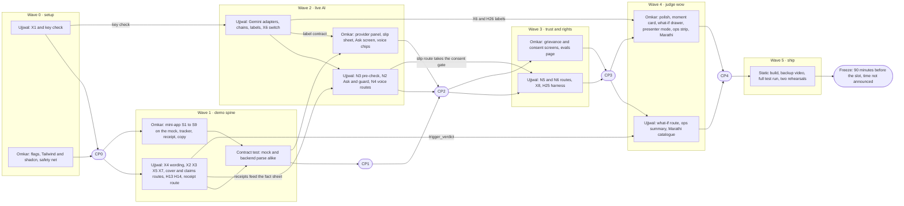

# Build plan for 2–3 Oct 2026

| | |
|---|---|
| Status | v4 · 3 Oct 2026 · all six waves are built in the code, each feature behind its flag. Still open, and only a person can do them: the rehearsals, the backup video, deploying the static demo and the native review of Marathi. The plan below is kept as written on 2 Oct, with its status marked in section 0 |
| Owner | Omkar Kadam (mini-app, console, design, copy, pitch) · Ujjwal Pardeshi (backend, engine, AI adapters, evals) |
| Audience | The two of us, and anyone tracking progress |
| Related | [Risk register](risk-register.md) · [Demo runbook](demo-runbook.md) · [On-site checklist](on-site-checklist.md) · [Final deck and video script](final-deck-and-video-script.md) · [PRD](../02-product/prd.md) · [Implementation guide](../04-engineering/implementation-guide.md) · [Data model and API](../04-engineering/data-model-and-api.md) · [Testing and quality strategy](../04-engineering/testing-and-quality-strategy.md) · [AI evaluation plan](../04-engineering/ai-evaluation-plan.md) · [Current-state audit](../01-strategy/current-state-audit.md) · [Pitch and judge Q&A](pitch-and-judge-qa.md) |

## TL;DR

- **Everything is P0** (team decision, 2 Oct): N1–N8, X1–X8, H1–H26 and a console polish for the projector. We do not cut scope. We build in six waves, with two tracks in parallel, and close each wave at a checkpoint with written pass criteria.
- **Unfinished work is hidden, never shown half-working.** Every new feature sits behind a flag that starts off. If time runs out we hide features in a fixed order ([section 7](#7-hide-order-if-time-runs-out)). That is a hide order, not a cut list.
- **Waves:** 0 setup · 1 demo spine · 2 live AI · 3 trust and rights · 4 judge wow · 5 ship.
- **Where it stands (3 Oct):** all six waves are built in the code. What is left is rehearsal, the backup video, deploying the static demo, a native review of Marathi and a trial of the AI keys. Section 0 is the status table.
- **Two tracks.** Omkar builds the mini-app and the console on the in-browser mock. Ujjwal builds the routes, the engine changes and the AI adapters. The JSON contracts in the feature specs let both start at once, and they meet at a contract test in Wave 1.
- **Critical path:** the X4 wording change, then the cover, claims and receipt routes, then the mini-app on live data (Wave 1), then the Gemini and Sarvam chain with labels (Wave 2), then everything that shows an AI label. The mock keeps the screens moving while the routes land.
- **The freeze is 90 minutes before our slot, and the slot time is not announced.** This plan has no clock times. Work out the freeze the moment the slot is known ([section 8](#8-pace-the-freeze-and-the-order-of-the-day)).
- **The honesty floor is never hidden:** the LIVE, SIMULATED and FALLBACK labels, the honest-wording test and the disclosure line.

## 0. Status on 3 Oct 2026

Checked against the code. "Built" means the code and its tests exist and the flag turns it on. The checkpoint log of section 5 was not kept as a file, so no checkpoint is recorded as passed here; the full suites are run once on the current tree and the result is in the facts page.

| Wave | Status | Evidence |
|---|---|---|
| 0 setup | Built: X1 (the frontend suite passes), the 14-flag registry, `make check-keys`, the Tailwind and shadcn setup scoped to the mini-app, the static fallback | `frontend/src/features.ts`, `backend/chhatri/features.py`, `scripts/check_keys.py`, `frontend/src/miniapp/miniappCss.test.ts` |
| 1 demo spine | Built: N1 core (S1 to S9), cover, claims and receipt routes, X4 behind `x4_lender_request`, X2, X3, X5, X7, H13, H14 | `frontend/src/miniapp/screens/`, `backend/tests/api/test_receipt.py`, `backend/tests/integrations/test_lender.py`, `backend/tests/conversation/test_honest_wording.py` |
| 2 live AI | Built: N3, N2, N4, X6 and the H26 labels. Tested against fakes only: no Gemini or Sarvam key has been run | `backend/tests/ask/`, `backend/tests/precheck/`, `backend/tests/ai/`, `backend/tests/integrations/test_fallback_switch.py` |
| 3 trust and rights | Built: N5, N6, X8, and the H25 harness with its `/evals` page. No evaluation run is stored | `backend/tests/api/test_grievances.py`, `backend/tests/api/test_consents.py`, `backend/tests/conversation/test_message_guard.py`, `backend/tests/evals/` |
| 4 judge wow | Built: what-if, ops strip, presenter mode, the moment card and the Marathi draft. Marathi has no native sign-off, so its flag stays off until one is recorded | `backend/tests/replay/test_whatif.py`, `backend/tests/api/test_ops_summary.py`, `frontend/src/components/panel/WhatIf.test.tsx`, `frontend/src/miniapp/copy/mr.test.ts` |
| 5 ship | Built: the static build (`npm run build -- --mode mock`, `npm run preview`) and its deep-link fallback. Not done (human-only): the backup video, deploying the static copy, two rehearsals, the freeze | `frontend/tests/e2e/static-build.spec.ts` |

## 1. Where we started (2 Oct, commit 86575ea)

| Area | BUILT at the start (commit 86575ea) | Planned then, built since (section 0) |
|---|---|---|
| Features | K1–K8: area auto-claim, hospital-cash claim, EDI holiday (an unconditional pause today), deterministic policy engine (`rules.yaml` pilot-0.1), explanations and disputes, cover purchase with the waiting period, hash-chained audit, claims-officer console | N1–N8, X1–X8, H1–H9 and H12–H26. H10 and H11 (Hindi and English) are built |
| Backend | FastAPI and SQLite, 39 route handlers in 12 routers | The new routes in [section 3](#3-waves-and-tracks) (the route table now holds 57) |
| Frontend | React 19, Vite 8, TypeScript console with plain CSS tokens, an in-browser mock backend (`npm run dev:mock`), a WhatsApp-style phone simulator | The merchant mini-app with Tailwind v4 and shadcn/ui, scoped under `.miniapp`. The console keeps its plain CSS |
| AI | Sarvam adapters (STT, TTS, chat, vision), LIVE when `SARVAM_API_KEY` is set, labelled simulators otherwise. Intents come from word lists, and the chat model sees just the text the lists cannot classify (UNKNOWN) | Gemini free tier at the head of the chain, then Sarvam, then templates (N2) or a person (N3). Browser speech. The FALLBACK status arrives with X6 |
| Always SIMULATED | Sales, alerts, KYC, payouts, the lender, Soundbox, WhatsApp, the Paytm link | Unchanged |

**Baseline every checkpoint had to hold or improve** (commit 86575ea): backend 1,711 fast and 36 slow tests at 99.7% coverage; frontend 262 of 264 (X1 fixed the other 2); infra 118; `make demo-check` 70 of 70; Playwright e2e 21. New tests raise these counts, so a checkpoint reads "no failing test and no drop in coverage", not a fixed total.

**Started in the working tree on 2 Oct, and finished since:**

- **The flag registry.** `frontend/src/features.ts` and `backend/chhatri/features.py` list the same 14 flag names ([section 6](#6-feature-flags)). The backend reads `CHHATRI_FEATURES`, the console reads `VITE_FEATURES`, an unset list means every flag is off, and a flagged route that is off answers 404 `not_found`.
- **`make check-keys`** (a new target, `scripts/check_keys.py`). It reports `SARVAM_API_KEY` and `GOOGLE_API_KEY` as SET or NOT SET without printing them. With a Google key it lists the Gemini models that key can call, through the free model-list call, and makes no generation call.
- **The mini-app scaffold.** Tailwind v4 through `@tailwindcss/vite` (the 2 Oct registry check shows it lists Vite 8 as a peer, and `@tailwindcss/postcss` stays the fallback), `frontend/components.json`, shadcn files under `frontend/src/miniapp/ui/`, `MiniappRoot` and `miniapp.css`.
- **A longer frontend test timeout** (`vitest.config.ts`, `src/test/setup.ts`). It was part of X1. The frontend suite now passes.

## 2. Ground rules

1. **Waves set the order.** Work in wave order. A track may start the next wave's backend or mock work once its own tasks in the current wave are done, but a screen is never built on top of a failing checkpoint.
2. **Flags start off.** A flag turns on when, and not before, its acceptance criteria (in its feature spec) pass, its wave checkpoint passes, and both of us agree ([section 7](#7-hide-order-if-time-runs-out) has the veto rule).
3. **Off means absent.** A flag that is off removes the screen, and its endpoints answer 404 `not_found`. With every flag off, the console and every golden flow behave as they do today.
4. **The honesty floor never moves.** Labels, the honest-wording test (X7), "the AI builds the case, code decides the money" and the disclosure line stay in every build.
5. **Tests are part of each task.** The spec's "done when" names the test. Backend work starts from a failing test. Each checkpoint runs the full suites.
6. **One owner per shared file per wave.** The shared files are `backend/chhatri/conversation/messages.py`, `backend/chhatri/api/demo/golden.py`, `frontend/src/mock/`, `docs/DEMO.md` and `scripts/tests/test_docs.py`. The X4 wording change touches all of them, so it lands at the start of Wave 1, as one change.
7. **Free tools and synthetic data.** The accounts are the Gemini API free tier (Google AI Studio) and Sarvam free credits, and no others. Synthetic demo data, and nothing else, goes to a free-tier AI service ([ADR 0009](../04-engineering/adr/0009-synthetic-data-only-to-free-tier-ai.md)). Keys live in `.env`, which is never committed.
8. **The other person runs the checkpoint.** At each checkpoint, the person who did not write the work runs the commands and reads the result aloud.

## 3. Waves and tracks

Task ids come from the feature specs, which hold the detail and the acceptance criteria. Owners follow our split of the work: Omkar builds the mini-app, console, design and copy. Ujjwal builds the backend, engine, AI adapters and evals.

| Wave | Goal | Flags that turn on | Closes at |
|---|---|---|---|
| 0 setup | Everything later waves stand on. Nothing visible turns on | none (all registered, all off) | CP0 |
| 1 demo spine | Anil's story end to end in the mini-app: home, tracker, receipt, cover. The lender request and its wording | `n1_miniapp`, `x4_lender_request` | CP1 |
| 2 live AI | Slip pre-check, Ask Chhatri, voice, and the labels that make live AI honest | `n3_slip_precheck`, `n2_ask_chhatri`, `n4_voice`, `x6_provider_panel` | CP2 |
| 3 trust and rights | Grievances, consent, the distress guard, the evaluation harness | `n5_grievances`, `n6_consents`, `x8_distress_guard`, `h25_evals` | CP3 |
| 4 judge wow | Console polish, the trigger-to-payout moment, what-if, presenter mode, ops strip, Marathi | `h24_whatif`, `h8_ops_strip`, `console_polish`, `n8_marathi` | CP4 |
| 5 ship | Static build, backup video, full test run, two rehearsals, freeze | the demo flag set is fixed | CP5 (freeze) |

### 3.1 Wave 0 · setup

| ID | Task | Owner | Needs | Done when |
|---|---|---|---|---|
| X1 | Fix the 2 failing frontend tests (Cases panel, Overview live map). A longer test timeout is in the working tree. DONE: the suite passes | Ujjwal | none | `make test-frontend` passes with no failing test (the baseline was 262 of 264) |
| Flags | The flag mechanism (N1-T02, fs-07 N6-T10). STARTED: the registry is in the working tree. Left to do: review it, get its tests green, commit it, and settle which flag names the specs use ([section 6](#6-feature-flags)) | Omkar (console), Ujjwal (backend) | the [implementation guide](../04-engineering/implementation-guide.md) | AC-02 of [fs-04](../02-product/feature-specs/fs-04-merchant-mini-app.md) passes. With `CHHATRI_FEATURES` and `VITE_FEATURES` unset, every flag is off, flagged routes answer 404 `not_found`, and the console and the golden flows behave as at commit 86575ea. The backend logs the flags that are on at start-up. The console shows them once X6 lands ([fs-08 section 12.1](../02-product/feature-specs/fs-08-claims-officer-console.md)) |
| N1-T01 | Tailwind v4 and shadcn/ui scoped to the mini-app ([fs-04 section 5](../02-product/feature-specs/fs-04-merchant-mini-app.md)). STARTED. Left to do: check it against AC-05 and AC-06, add every shadcn and 21st.dev component the mini-app needs now, and commit them, so no registry call is needed on 3 Oct | Omkar | none | AC-05 and AC-06 pass: the console tests are unchanged and the build output has no Preflight rule outside `.miniapp` |
| N1-T03 | `AppFrame` skeleton and the standalone route, behind `n1_miniapp` | Omkar | N1-T01, Flags | AC-01, AC-03, AC-04 |
| Keys | Key check for Gemini and Sarvam, with the quota and credit numbers written in the checkpoint log (steps below) | Ujjwal | accounts created | CP0 key criteria |
| Safety net | Prove the static fallback today: `cd frontend && npm run build -- --mode mock`, then `npm run preview`. Note the last known good commit | Omkar | none | The built console opens and plays the monsoon replay on the in-browser mock |

**Key check steps (Ujjwal).**

1. Put `SARVAM_API_KEY` and `GOOGLE_API_KEY` in `.env` (never committed). Run `make check-keys`. It prints each key as SET or NOT SET, never the value, and with a Google key it lists the Gemini models that key can call. It makes no generation call and uses no quota. Pick the model for `GEMINI_MODEL` (name proposed in [fs-05](../02-product/feature-specs/fs-05-ask-chhatri.md)) from that list on the day, and pick one that accepts images, for the slips.
2. Run the Sarvam smoke test: `cd backend && . .venv/bin/activate && python scripts/live_smoke.py`. It exercises every component whose keys are present, reports the rest as SKIPPED, and never prints secrets. Do not use `--send`. Note the Sarvam credit balance on its dashboard before and after.
3. Gemini has no adapter until Wave 2, so make one text call and one image call by hand against the model you picked, for example with `curl` and `backend/data/slips/anil_admission_slip.png`. Write down the quota that Google AI Studio shows.
4. Write the latency of each call. Targets, not measurements: a text answer in 5 s and a slip read in 10 s ([PRD section 5.1](../02-product/prd.md)), one speech call under 3 s ([fs-05 section 18](../02-product/feature-specs/fs-05-ask-chhatri.md)).
5. Confirm with `curl -s localhost:8000/api/integrations` that the four Sarvam components read LIVE. There is no Gemini row until Wave 2.

### 3.2 Wave 1 · demo spine

Omkar builds on the mock from the start, so he never waits for a route. Ujjwal builds the real routes. The contract is the JSON in fs-04 section 6 and [data-model-and-api section 5](../04-engineering/data-model-and-api.md). They meet at N1-T21.

**Ujjwal, in this order.**

| # | Task | Spec | Done when |
|---|---|---|---|
| U1.1 | **X4**, behind `x4_lender_request`. A `Lender` port and `SimulatedLender`, `HolidayRequest` records (`HR` ids), `request_holiday` with its guards, the `HOLIDAY_*` keys and notification. Rename the n8n step `pause_instalment` to `request_holiday`, then run `make n8n-workflows` | [fs-03 section 14](../02-product/feature-specs/fs-03-edi-holiday.md), [ADR 0006](../04-engineering/adr/0006-edi-holiday-is-the-lenders-decision.md), [ADR 0008](../04-engineering/adr/0008-in-process-workflows-on-stage.md) | fs-03 acceptance table passes, `make test-infra` is green |
| U1.2 | **Coordinated string change, code side.** `golden.py`, the backend tests that pin the instalment line, and the `DEMO_MESSAGES` entry in `scripts/tests/test_docs.py`. One commit with Omkar's docs side (O1.1). How the pinned wording behaves while `x4_lender_request` is off is open question 7 | fs-03 section 8.4 | `make demo-check` passes 70 of 70 with the demo flag set, the suites pass with every flag off, `test_docs.py` is green |
| U1.3 | **X2, X3, X5.** The claim model validates the published expected day. A missing zone price fails loudly. Every new route answers 404 `not_found` for an unknown id (the existing routes already do) | [fs-01](../02-product/feature-specs/fs-01-area-auto-claim.md), K6-T01 in [fs-07](../02-product/feature-specs/fs-07-cover-purchase-and-consent.md) | Tests for each guard, preflight reports the zone prices |
| U1.4 | Derived cover status, `GET /api/merchants/{id}/cover`, pilot covers seeded at the zone price, the catalogue keys for cover status | K6-T02 to T04 and T06, N1-T10, N1-T14 | Contract test; Home and DEMO.md agree on the price |
| U1.5 | `GET /api/merchants/{id}/claims` and the dispute fixes (`DISPUTE_NO_PAYOUT`, `DISPUTE_ALREADY_OPEN`, an officer can close a dispute that has no decision) | N1-T11, [fs-06 section 14](../02-product/feature-specs/fs-06-explanations-disputes-and-grievance.md) | Contract test; tracker steps for AREA, PERSONAL and DISPUTE |
| U1.6 | Extract `trigger_verdict` from `detect/triggers.py` with no behaviour change. Then H13 provenance, H14 counterfactuals and `GET /api/decisions/{decision_id}/receipt` | N1-T12, N1-T13, [fs-09 section 16](../02-product/feature-specs/fs-09-policy-engine-and-audit.md) | The 21 trigger tests still pass; one test per check code for counterfactuals |
| U1.7 | **X7.** The honest-wording scan covers `HOLIDAY_*`, the cover keys, `CF_*` templates and source labels. Fix the `WITHIN_ANNUAL_LIMIT` label ("this policy year" to "rolling 365 days") | fs-09 section 16 | The scan passes over the whole catalogue |

**Omkar.**

| # | Task | Spec | Done when |
|---|---|---|---|
| O1.1 | **X4 docs side.** SPEC section 13.4 and section 10 wording, the DEMO.md 17:05 steps, copy-deck lines, native review of the Hindi. One commit with U1.2 | fs-03 section 8.4, [copy deck](../03-design/copy-deck.md) | `test_docs.py` is green |
| O1.2 | API client and strict parsers. Mock parity: the three new routes, `POST /api/premium/link`, `POST /api/webhooks/paytm`, zone premiums from `premiums.json`, and the DEMO.md numbers (a mock quote for Ramesh reads ₹424.80, not ₹90) | N1-T15, N1-T16 | AC-13 on the mock |
| O1.3 | Screens S1 to S9 in Hindi and English, with the jargon lens, the next-best-action bar and the receipt print style. The console merchant page gets its third column | N1-T17 to N1-T19 | AC-07 to AC-41 on the mock profile |
| O1.4 | Tracker data for the REFERRED and DISPUTE paths | fs-06 section 14 | The tracker shows both paths on the mock |
| O1.5 | The component, unit and end-to-end tests in fs-04 section 19 | N1-T20 | Coverage thresholds hold |

**Shared.** N1-T21: one contract test where the mock fixtures and the backend JSON parse with the same parsers. Run it when U1.4 and U1.5 land, and again after U1.6.

### 3.3 Wave 2 · live AI

Build the foundation before anything else, because every AI feature stands on it. The force-fallback switch is the stage safety net, so it is part of the foundation, not an extra.

**Ujjwal, in this order.**

| # | Task | Spec | Done when |
|---|---|---|---|
| U2.1 | **Foundation.** Gemini adapters (`gemini_chat.py`, `gemini_vision.py`), the chat and reader chains with attempt logs and per-link budgets, the free-tier data gate, labels (H26), and the X6 backend: `IntegrationMode.FALLBACK`, the names `gemini_chat` and `gemini_vision`, `FallbackSwitch`, `POST /api/integrations/{component}/fallback`. Add a Gemini text and image check to `live_smoke.py` so the pre-flight covers it | N2.1, N2.10, N3.2, N3.3, [fs-08 section 9](../02-product/feature-specs/fs-08-claims-officer-console.md) | A forced component reads FALLBACK with reason FORCED on its next call, with no scenario reload |
| U2.2 | **N3.** `Precheck` model and ids, metadata stripping, field validation and injection signals, `SlipPrecheckService`, the two routes. Red-team slip fixtures | N3.1, N3.4 to N3.7, N3.13, [fs-02](../02-product/feature-specs/fs-02-hospital-cash-claim.md) | fs-02 drills T13 to T17 pass |
| U2.3 | **N2.** Clause extract, fact sheet, `AskService`, guard layer B, injection and scam detectors, routing that explains from the rules before any model call, the `/ask` route, `/messages` on the same service, hardening of the N2-off path | N2.2 to N2.9, N2.15, [fs-05](../02-product/feature-specs/fs-05-ask-chhatri.md) | The 28 checked examples in fs-05 section 6.3 behave as written |
| U2.4 | **N4.** `POST /api/voice/stt` with the mention detector, `POST /api/voice/tts` with its chain | N4.1, N4.2 | AC-VOICE-01 to AC-VOICE-08 |

**Omkar.**

| # | Task | Spec | Done when |
|---|---|---|---|
| O2.1 | Provider panel UI and the label on every AI-backed bubble and on the slip reader line (X6, H26). Mock parity for the labels | fs-08 section 19 | The header chip shows FALLBACK and a "forced" chip |
| O2.2 | N3 screens: chat card, mini-app sheet, officer evidence lines, mock parity, `SLIP_*` copy review | N3.8 to N3.12 | fs-02 section 10 states render |
| O2.3 | N2 screens: Ask screen, clause chips, badges, next action, label, mock parity, copy review | N2.11 to N2.13 | AC-ASK-06 and AC-ASK-21 on the mock |
| O2.4 | N4 screens: browser recognition hook, confirmation chips, recording notice | N4.3, N4.4 | AC-VOICE-04 to AC-VOICE-06 |
| O2.5 | Help rows and next-best-action rules for the new flags | N1-T30 | AC-36 |

### 3.4 Wave 3 · trust and rights

**Ujjwal.** N5 backend: `cases/ladder.py`, the `Grievance` model, the respondent router, `GET` and `POST /api/merchants/{id}/grievances` ([fs-06 section 14](../02-product/feature-specs/fs-06-explanations-disputes-and-grievance.md)). N6 backend: N6-T01 to N6-T11 in [fs-07](../02-product/feature-specs/fs-07-cover-purchase-and-consent.md), including the consent routes, `GET /api/merchants/{id}/consents/activity` and `POST /api/merchants/{id}/slips/{slip_id}/forget`. X8: message kinds, suppression and the daily cap ([fs-03 section 14](../02-product/feature-specs/fs-03-edi-holiday.md)). H25: the harness, the suites and `GET /api/evals/summary` ([AI evaluation plan](../04-engineering/ai-evaluation-plan.md)). Hardening N3.14.

**Omkar.** Grievance screens and mock routes. Consent screens S10 and S11, the S3 consent block, the slip upload notice, "Slip erased" in the case evidence (N6-T12 to N6-T19). The `/evals` page. The dispute button moves from the chat path to the grievance endpoint (N1-T40). Native review of the consent copy (N6-T18).

**Order.** Run the evaluation harness as soon as Wave 2 closes. A red-team item that fails is a bug to fix while N5 and N6 continue.

### 3.5 Wave 4 · judge wow

**Ujjwal.** `replay/whatif.py` and `POST /api/whatif/area` with the test that a call changes nothing, and the shared vectors file. `GET /api/ops/summary`. The Marathi catalogue (`mr` keys) and the guard's Marathi number and promise words.

**Omkar.** Projector polish: a font-token test, the contrast test, the 1280×720 overflow check. The moment card. Presenter mode. The what-if drawer. The ops strip. Source chips and the counterfactual line in the console case panel. DISPUTE button labels and holiday rows. The mock fixes for the Z3 and Z12 totals and the 123 count. Marathi review and the screenshot set. Full list: [fs-08 section 19](../02-product/feature-specs/fs-08-claims-officer-console.md).

### 3.6 Wave 5 · ship

| ID | Task | Owner | Done when |
|---|---|---|---|
| N7 | Static build with the standalone route and a deep-link fallback (N1-T60). Build it with the demo flags set, for example `VITE_FEATURES=<the flags on the card> npm run build -- --mode mock`, and serve a local copy with `npm run preview`. The repo owner deploys to GitHub Pages or any free static host. No URL is written down until one exists | Omkar builds, Ujjwal (repo owner) deploys | The local copy opens `/merchant/S-0142/app` offline and shows the same flags as the live build |
| Video | Backup video recorded from the release candidate, stored as a local file on the demo laptop. Script: [final deck and video script](final-deck-and-video-script.md) | Omkar | The file plays with the network off |
| Full run | `make lint`, `make test`, `make test-slow`, `make test-infra`, `make demo-check`, then `make e2e` against the running stack | Ujjwal | All green on the release candidate |
| Rehearsals | Two rehearsals on the demo laptop (N1-T61, N6-T20), logged in the [runbook](demo-runbook.md#8-rehearsals). Rehearsal 1 decides each beat: pass or hide. Rehearsal 2 adds judge Q&A role-play | Both | Every beat passed 3 of 3 or its flag is off |
| Demo flag set | The flags that are on for the demo, written on the card | Both | The card matches the build |
| Freeze | The last commit on main, a local tag, `git status` clean | Ujjwal | CP5 |

## 4. Dependencies



**Where the tracks depend on each other.**

| Omkar needs from Ujjwal | When |
|---|---|
| Live routes for the mini-app (contract test N1-T21) | End of Wave 1 |
| The label and fallback contract (`mode`, `provider`, `fallback_reason`) before the provider panel UI | Start of Wave 2 |
| Route shapes for slip pre-check, Ask and voice before mock parity | Wave 2 |
| `trigger_verdict`, then `POST /api/whatif/area`, before the what-if drawer | Wave 4 |
| Marathi catalogue keys before the Marathi flag can turn on | Wave 4 |

| Ujjwal needs from Omkar | When |
|---|---|
| The wording and docs side of the X4 change (one commit with the code side) | Start of Wave 1 |
| Hindi copy review for each new key, and a named native reader | Each wave |
| The shared vectors file for the what-if panel, checked against the mock | Wave 4 |
| The demo flag set and the rehearsal log | Wave 5 |

If you are blocked, pick from this list: tests against the other person's contract, mock parity, copy review, a beat drill from the [runbook](demo-runbook.md), or the docs.

## 5. Checkpoints

A checkpoint is a short meeting: run the commands, read the result, decide the flags, write the log. The person who did not write the work runs it.

| Checkpoint | After | Run | Pass when | If it fails |
|---|---|---|---|---|
| **CP0** | Wave 0 | `make test`, `make demo-check`, `make lint`, `make check-keys`, `cd frontend && npm run test:e2e:mock`, the key check steps, the static safety net | `make test` is green with no failing frontend test. `make demo-check` passes 70 of 70. All 14 flags are registered and off, and with them off the console and the golden flows are unchanged. AC-05 and AC-06 pass (no Preflight leak, console tests unchanged). The Wave 0 files that were in the working tree are reviewed and committed. `make check-keys` shows both keys SET and lists a Gemini model that accepts images. `live_smoke.py` passes for Sarvam, and the Gemini text and image calls return. Quota and balance are in the log. The static mock build opens | Fix Tailwind scoping before anything else. If Gemini or Sarvam fail, Wave 2 slips but Wave 1 continues |
| **CP1** | Wave 1 | `make test`, `make test-slow`, `make test-infra`, `make demo-check`, the contract test, then the 3-minute cut once with `n1_miniapp` and `x4_lender_request` on | The suites are green. `make demo-check` passes 70 of 70 with the demo flag set, and the suites also pass with every flag off. The contract test is green. In the mini-app: Anil's area claim shows five steps and reaches Paid and the lender request; the illness_mismatch claim shows REFERRED with case C-2291; a dispute shows; the receipt shows sources and a counterfactual line; Ramesh's BLOCKED quote reads ₹424.80 for 30 days at ₹14.16 a day; Hindi and English both work; unknown ids give 404 `not_found`. No offer kind exists in `nextBestAction`. Every number equals [DEMO.md](../DEMO.md) | Hide `n1_miniapp` and keep fixing. The Wave 1 routes can stay, because nothing calls them |
| **CP2** | Wave 2 | The three suites, `make demo-check`, then the drills below with the real keys | **Ask:** every question on the rehearsed list ([runbook section 4](demo-runbook.md#4-the-new-beats-flags-pass-rule-and-fallbacks)) returns an answer or a labelled fallback, with no unsupported figure, and the guard examples behave as fs-05 section 6.3 says. **Slip:** blurry gives RETAKE; Anil's slip gives READY, then APPROVED ₹1,500; the mismatch slip gives READY, then REFERRED; the injection fixture gives NEEDS_TEAM; with the network cut, FALLBACK then NEEDS_TEAM. **Switch:** each forced component reads FALLBACK with reason FORCED, "Clear all" restores it, the "forced" chip shows, a restart clears it. **Voice:** the Sarvam path and the browser path both transcribe the sample sentence on the demo laptop, and the confirmation chips appear. **Labels:** every AI-backed reply on screen shows its mode. With the flags off, golden flows are unchanged. Latencies and quotas are in the log | Hide the failing flag by the hide order. Never keep an AI feature on without its label |
| **CP3** | Wave 3 | The three suites, `make demo-check`, the fs-06 and fs-07 acceptance tables, the harness run | A grievance opens once on a double tap, the router names the owner, the ladder shows a clock where a source exists and nowhere else. The consent boxes gate the quote, a withdrawal stops what it says it stops, an erase removes the image and the fields, and `GET /api/audit/verify` still reads valid. The X8 suppression and cap tests pass. `/evals` shows numbers from a stored run and nothing else, or NOT MEASURED | Hide the flag. Consent and grievances are beside the story, not in it |
| **CP4** | Wave 4 | The three suites, `make demo-check`, `make e2e` (live) with the screenshot set, a full 7-minute rehearsal | The what-if baseline equals the detector, the no-write test passes, and Z9 with an alert and three hours at 49 fires. Presenter mode keys work. No sideways scroll at 1280×720 on the five console pages. The ops strip numbers match their definitions. Marathi has a recorded native sign-off or its flag stays off | Hide the flag. After CP4 there is no new feature |
| **CP5** | Wave 5 | `make lint`, `make test`, `make test-slow`, `make test-infra`, `make demo-check`, `make e2e`, the static copy offline, the video file | All green on the release candidate. Two rehearsals logged. The demo flag set is on the card. `git status` is clean and `.env` is untracked | Hide, revert to the last good commit, or take the fallback ladder in the [runbook](demo-runbook.md#6-contingency-ladder) |

**Checkpoint log** (copy for each checkpoint):

```
CP[#] · build [commit] · run by [name]
Suites: test [ ] test-slow [ ] test-infra [ ] demo-check 70/70 [ ] e2e [ ]
Flags on: ______________________
Quota and balance: Gemini ______  Sarvam ______
Latencies seen (not targets): ask __ s  slip __ s  speech __ s
Decisions (hide / keep / fix): ______________________
Slot time T: [not announced]  Freeze (T minus 90 min): ______
```

## 6. Feature flags

The flag names come from the registry in the code (`frontend/src/features.ts` and `backend/chhatri/features.py`, which hold the same 14 names). Some differ from names the feature specs propose, and the table says where. The [implementation guide](../04-engineering/implementation-guide.md) owns the mechanism and the final list, and wins where a name differs.

**How a flag is set.** The backend reads `CHHATRI_FEATURES` and the console reads `VITE_FEATURES`. Each is a comma or space separated list of names, and the two lists must be identical. `make dev` takes the backend list from `.env` or the shell and the console list from the shell or `frontend/.env.local`. A mock or static build takes it from the shell or `frontend/.env.mock.local` when it is built. `make up` passes `CHHATRI_FEATURES` to both. A flag changes when the backend restarts or the console is rebuilt, and at no other time, so the demo flag set is chosen before the demo and never changed during it. A name that is not a flag is ignored and logged once at start-up. A flag that is off hides the feature and makes its endpoints answer 404 `not_found`.

| Flag | Gates | On in | Off means |
|---|---|---|---|
| `n1_miniapp` | The frame, the standalone route `/merchant/:id/app`, the third column. Tracker, receipt, jargon lens, next-best-action bar (N1, H1–H3, H13, H14, H20, H21) | Wave 1 | The merchant page is today's two-column page |
| `x4_lender_request` | The lender request that replaces the instalment pause: `request_holiday`, the `HOLIDAY_*` messages, the tracker's lender step (X4) | Wave 1 | The instalment step and its wording behave as at commit 86575ea |
| `n3_slip_precheck` | The pre-check sheet and the two slip routes (N3, H15, H16) | Wave 2 | The chat photo behaves as today |
| `n2_ask_chhatri` | The Ask screen, `POST /api/merchants/{id}/ask`, the model path in `/messages` (N2, H17, H19). fs-05 proposes `ask_chhatri` | Wave 2 | Help row hidden |
| `n4_voice` | The mic, `POST /api/voice/stt`, `POST /api/voice/tts`, the confirmation chips (N4, H18). fs-05 proposes `voice` | Wave 2 | Mic hidden |
| `x6_provider_panel` | The panel, the FALLBACK tone, the switch, the route (X6, H26 on the console) | Wave 2 | The header shows LIVE and SIMULATED as today |
| `n5_grievances` | The ladder, the router, the routes, the Help row (N5, H22) | Wave 3 | The dispute uses the chat path |
| `n6_consents` | The consent centre, the S3 consent block, the routes, the gates (N6, H23) | Wave 3 | S3 shows a one-line notice, and the gates are open |
| `x8_distress_guard` | Message kinds, suppression, the daily cap (X8) | Wave 3 | No guard (no offer message exists) |
| `h25_evals` | The `/evals` page and `GET /api/evals/summary` (H25). The [AI evaluation plan](../04-engineering/ai-evaluation-plan.md) calls it `evals` | Wave 3, and with a stored run | Page hidden |
| `h24_whatif` | The what-if drawer and `POST /api/whatif/area` | Wave 4 | Button hidden |
| `h8_ops_strip` | The ops strip and `GET /api/ops/summary` (H8) | Wave 4 | Strip hidden |
| `console_polish` | Presenter mode (the toggle, the keys, the type step-up) and the trigger-to-payout moment card. [fs-08](../02-product/feature-specs/fs-08-claims-officer-console.md) names these `presenter_mode` and `moment_card` | Wave 4 | Toggle and card absent. `?presenter=1` notes work as today |
| `n8_marathi` | The Marathi option | Wave 4, after native review | Option hidden. `?lang=mr` shows Hindi |

**Not flagged:** the fixes X2, X3, X5 and X7, and the console additions (source chips, counterfactual line, DISPUTE labels, holiday rows). They are guards, wording and displays of data that already exists, and a flag would double the golden expectations. If one fails its checkpoint, revert its commit. [fs-03](../02-product/feature-specs/fs-03-edi-holiday.md) puts X4 and X8 behind flags without naming them. The registry names them `x4_lender_request` and `x8_distress_guard`.

## 7. Hide order if time runs out

Everything is P0, so nothing is cut. A feature that is not finished at its checkpoint is hidden by taking its flag out of both lists and restarting, in this order, from the top of the table down.

| # | Hide | Why this place |
|---|---|---|
| 1 | `n8_marathi` | It needs a native reader who may not be found. Copy shown unreviewed would hurt more than a missing option |
| 2 | `h25_evals` | A number reaches the page from a stored run and from nowhere else. No run, no page |
| 3 | `x8_distress_guard` | No offer message exists, so an off guard shows nothing. An unfinished cap could suppress a golden message, so it stays off until tested |
| 4 | `h8_ops_strip` | Console polish |
| 5 | `console_polish` | The presenter loses comfort and the moment card, not content. The Overview launchers still hold the storm at 17:06 |
| 6 | `n6_consents` | Beside the story. The S3 notice line remains |
| 7 | `h24_whatif` | A judge draw, but the "Why Zone 9 got nothing" panel still tells the story |
| 8 | `n5_grievances` | The "resolve" stage of the track. The chat dispute and the officer case remain |
| 9 | `n4_voice` | The most failure-prone part. The voice chips (BUILT) remain |
| 10 | `n2_ask_chhatri` | The rules answer "why this amount" without it |
| 11 | `n3_slip_precheck` | The BUILT chat photo path remains |
| 12 | `x6_provider_panel` | **Hide it when 9, 10 and 11 are all off, and not before.** No AI reply may show without its label |
| 13 | `x4_lender_request` | The BUILT instalment step answers as today. The script then drops the lender-decides line and says what the screen says (the [runbook](demo-runbook.md#4-the-new-beats-flags-pass-rule-and-fallbacks) has both versions) |
| 14 | `n1_miniapp` | Last. With it off, `/merchant/S-0142` is today's page, with the same numbers |

**The honesty floor is never hidden:** the LIVE, SIMULATED and FALLBACK labels, the X7 test, the disclosure line, the audit chain.

**Veto rule.** Either of us can veto showing a feature. Showing needs both. Ujjwal judges whether a backend feature is safe to run. Omkar judges whether a screen is fit to show.

**How to hide.** (1) Both agree. (2) Take the flag out of `CHHATRI_FEATURES` and `VITE_FEATURES` and restart `make dev`, or rebuild the static copy. (3) Check that the backend start-up line lists the flags on the card. (4) Re-run `make demo-check` and the affected beat. (5) Mark the beat in the [runbook](demo-runbook.md#4-the-new-beats-flags-pass-rule-and-fallbacks) as using its fallback. (6) Write it in the checkpoint log.

## 8. Pace, the freeze and the order of the day

### 8.1 The freeze

- **Freeze = 90 minutes before the start of our slot (T).** The organisers have not announced T. Ask at check-in on 3 Oct. When T is known, write T and the freeze at the top of the checkpoint log.
- **Wave 5 needs time before the freeze.** Estimate, for planning: about three hours (video 1 h, static build and checks 30 min, full test run 20 min, two rehearsals 1 h, slack 10 min). Replace it with your own number at CP4. Wave 5 must start no later than the freeze minus that number. Whatever is not at its checkpoint then is hidden by the order in section 7.
- **No new feature after CP4.** After CP4: fixes and polish, nothing else.
- **At the freeze:** the last commit is on main, tagged locally, `git status` is clean. After it, the one change allowed is a crash hotfix: a reproduced crash or a failing test, both of us agree, then `make demo-check` again. A hotfix that changes what the screen shows is said aloud in the disclosure if the video was recorded before it.

### 8.2 The order of the day

| Phase | When | Waves | Leave the phase when |
|---|---|---|---|
| A | The rest of 2 Oct | 0 and 1, then the start of 2 if time allows | CP1 has passed, or you must sleep. Then write down where each track stopped |
| B | 3 Oct, on arrival | Venue checks ([on-site checklist](on-site-checklist.md)). Ask for T | The checks are done and T is known |
| C | 3 Oct, on-site build | 2, then 3, then 4 | CP4 has passed, or the Wave 5 start time is reached |
| D | 3 Oct, ship | 5 | The freeze |
| E | After the freeze | The pre-flight at T minus 60 and T minus 30, then the demo | |

Phase A is a target, not a promise. If CP1 has not passed when you must stop, Wave 1 continues at the start of 3 Oct and the hide order covers the tail.

### 8.3 Sleep

A tired mistake in Wave 1 costs more than a hidden feature in Wave 4. Both of us sleep before the on-site day, and stop when a checkpoint would no longer be reliable. The on-site day needs both of us sharp for the rehearsals and the demo.

## 9. Commit hygiene

- **Development stays on main** (team decision, 2 Oct). Commit often. No pushes from the working session. The repo owner decides when to publish, and N7 needs that step.
- **Each person commits their own work under their own name.** Check `git config user.name` and `git config user.email` on each laptop before committing anything. The public git log credits every commit to its author.
- **Conventional commits:** `<type>: <description>`, for example `feat(n1): add the claim tracker`, `fix(x1): pass the frontend tests`, `docs(runbook): add the what-if beat`. Types: feat, fix, refactor, docs, test, chore, perf, ci.
- **Never commit `.env`.** `.env.example` is in the repo, and `.env` is git-ignored.
- **No force pushes, no history rewrites.** If a commit is wrong, revert it and commit again.
- **After each passed checkpoint,** tag the commit locally (`cp0` to `cp5`) so "revert to the last good build" is one command.

## 10. Definition of done for the build

- [ ] `make test` passes (backend coverage at least 80%, no failing frontend test).
- [ ] `make test-slow` and `make test-infra` pass.
- [ ] `make demo-check` passes 70 of 70. The four scenarios (monsoon, illness, illness_mismatch, buy_cover) and the three live tests (EXPLAINED, HUMAN, BLOCKED) replay with numbers matching [DEMO.md](../DEMO.md).
- [ ] `make lint` passes.
- [ ] Every merchant-facing string passes the honest-wording test (X7).
- [ ] Every AI-backed reply on screen shows its mode, provider and reason (H26).
- [ ] The 3-minute and 7-minute cuts run on the demo laptop, and each beat passed 3 of 3 or is hidden.
- [ ] The demo flag set is written on the card and matches the build.
- [ ] The static copy opens offline, and the backup video plays from a local file.
- [ ] Both of us can explain every flag that is on, and the hide order.

## Open questions

1. **How do two laptops share commits if nobody pushes?** Decision 5 says commits, with no pushes. Options: one shared working tree, patches exchanged with `git format-patch`, or the repo owner pushes a private branch. Owner: Ujjwal Pardeshi.
2. **Who is the native reader** for the Hindi copy (each wave) and the Marathi (Wave 4)? Owner: Omkar Kadam.
3. **Flag names.** The registry names `n2_ask_chhatri`, `n4_voice`, `h25_evals` and `console_polish`, where fs-05 proposes `ask_chhatri` and `voice`, the AI evaluation plan `evals`, and fs-08 `presenter_mode` and `moment_card`. Which texts change to match the registry? Owner: Omkar Kadam and Ujjwal Pardeshi.
4. **When is the slot announced,** and does the organiser allow a short run in the demo room? Owner: Omkar Kadam.
5. **Is there a second laptop** that can hold the frozen build as the backup machine ([on-site checklist](on-site-checklist.md))? Owner: Ujjwal Pardeshi.
6. **Which free static host** will the repo owner use for N7? Owner: Ujjwal Pardeshi.
7. **Pinned wording while `x4_lender_request` is off.** fs-03 section 8.4 replaces the three `INSTALMENT_PAUSED` lines in one coordinated change. With a flag, does the catalogue keep both sets of lines, and which set do `golden.py`, DEMO.md and `test_docs.py` pin for the demo? Owner: Ujjwal Pardeshi.
8. **Who reviews and commits the Wave 0 files** that are already in the working tree (the flag registry, `check-keys`, the mini-app scaffold, the test timeout)? CP0 needs an owner for each. Owner: Omkar Kadam for the console files, Ujjwal Pardeshi for the backend and scripts.
9. **The label of a forced component.** fs-05 and the copy deck call a forced reply SIMULATED with reason `FORCED`. fs-08 and the [data model](../04-engineering/data-model-and-api.md) call it FALLBACK with reason `FORCED`. This plan, the runbook and the on-site checklist follow FALLBACK, because the panel and the reply label must agree. Owner: Ujjwal Pardeshi, with the fs-05 owner.

## Changelog

- 2026-10-03 · v4 · added section 0 with the status of every wave against the code; the 2 Oct baseline and the working-tree notes are labelled as history
- 2026-10-02 · v3 · re-baselined from the afternoon of 2 Oct, with the flag names and mechanism taken from the registry in the working tree (14 flags, `CHHATRI_FEATURES` and `VITE_FEATURES`), the Wave 0 pieces already started (registry, `make check-keys`, mini-app scaffold, test timeout) shown as started and unchecked, and the key check rewritten around `make check-keys`: six waves with two parallel tracks, task ids from the feature specs, a dependency graph replacing the clock-time gantt, checkpoints CP0 to CP5 with pass criteria, the feature-flag table, the hide order and veto rule, and a freeze rule with no clock times. Removed the hour-by-hour tables and the old priority labels. Fixed the key check (there is no Gemini row until Wave 2), the Tesseract fallback (not in the Wave 2 chain), the old N1 dependency on X4 (the mini-app builds on the mock), the scenario count (four scenarios and three live tests), and the commit rules (own name, no pushes)
- 2026-10-02 · v2 · final consistency pass against the code: retitled section 7 to clarify pre-work (29 Sep–1 Oct) vs planned for 2–3 Oct; changed "before 2 Oct" build claims to "planned for 2 Oct" (N1–N8, X1–X8 are PLANNED not built); fixed browser Web Speech API fallback language from en-IN to hi-IN and added network connection requirement; changed the assumed demo slot times to planning targets (to re-baseline on-site); replaced the older repository wording with "public".
- 2026-10-02 · v1.3 · AI provider and live/simulated framing aligned
- 2026-10-02 · v1.2 · corrections after a second read against the code: adjusted the schedule to show X3 and X4 one after the other, and added a dependency note on X4 (superseded in v3).
- 2026-10-02 · v1.1 · fact-check pass: fixed X4 description to avoid incorrect outcome names, pointed to public docs (DEMO.md, SPEC.md, policy-wording-and-cis.md) instead.
- 2026-10-02 · v1 · initial draft: hourly schedule, tasks, critical path, integration checkpoints, cuts, risks.
