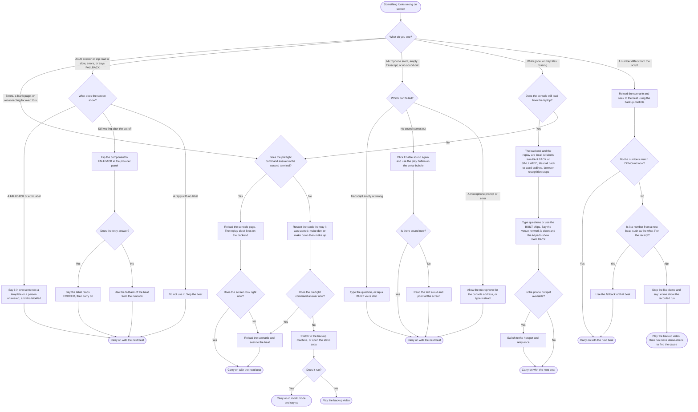

# On-site checklist

| | |
|---|---|
| Status | v1 · 2 Oct 2026 · for use on 3 Oct. Items that need a Wave 2 or later feature say so; those features are BUILT behind flags and still need their rehearsal |
| Owner | Ujjwal Pardeshi (machine and stack) with Omkar Kadam (room, slides, words) |
| Audience | The two of us, and a backup operator |
| Related | [Demo runbook](demo-runbook.md) · [Build plan](build-plan.md) · [Risk register](risk-register.md) · [DEMO.md](../DEMO.md) · [Final deck and video script](final-deck-and-video-script.md) · [Free-tier stack and setup](../04-engineering/free-tier-stack-and-setup.md) · [Pitch and judge Q&A](pitch-and-judge-qa.md) |

## TL;DR

- **Three passes.** On arrival (venue checks, and ask for the slot time), at T−60 (stack, keys, AI, flags), and at T−30 (the demo itself). T is the start of our slot. It is not announced. The code freeze is T−90.
- **Every item is a tick box** with the command to run or the thing to look at. The `make` targets named here all exist.
- **Two roles.** Omkar presents and makes no clicks. Ujjwal operates, keeps a second terminal open and calls the fallbacks.
- **Five failures have a decision tree** (section 4): backend down, an AI provider slow or out of quota, voice failing, the network down, and a number that does not match the script. Each ends in one of four places: carry on, use the fallback of the beat, open the static copy, or play the backup video.
- **Never on the projector:** `.env`, a key, or a terminal with a key in it.

## 1. The three passes

| Pass | When | Goal |
|---|---|---|
| Arrival | On arrival on 3 Oct, before the build starts | Ask the organisers for the slot time and length, the network, the projector connector and resolution, a sound check and power. Write T on the demo card. Work out the freeze (T−90) and the Wave 5 start ([build plan](build-plan.md#8-pace-the-freeze-and-the-order-of-the-day)) |
| T−60 | One hour before the slot | Start the stack. Check keys, AI, flags and scenarios (sections 2.4 to 2.6) |
| T−30 | Half an hour before | The demo itself: browser, sound, microphone, the scenario parked, hand signals, the card (sections 2.1 to 2.3 and 2.7) |

## 2. Pre-flight

### 2.1 Laptop and display

- [ ] The charger is plugged in. Sleep, screen lock and notifications are off. Other apps are closed.
- [ ] The display is mirrored to the projector. The browser window is 1280×720 at zoom 100%, full screen. Open `/live`, `/claims`, `/audit`, `/backtest` and `/policy` and check that nothing scrolls sideways.
- [ ] The browser is Chrome. Browser speech recognition works there and needs the network.
- [ ] A second terminal is open at the repo root. It is never closed.
- [ ] A text file holds the backup `curl` controls from [DEMO.md](../DEMO.md), with the `post` helper, ready to paste.
- [ ] The sample slips `anil_admission_slip.png`, `mismatch_admission_slip.png` and `blurry_slip.png` are on the Desktop (copy them from `backend/data/slips/`).
- [ ] The deck is open in its own window, and its PDF export is on the laptop as the offline copy.
- [ ] The backup video is a file on the laptop and on a phone, and it plays with the network off.
- [ ] The static copy opens. Build it with the demo flags, `VITE_FEATURES=<the flags on the card> npm run build -- --mode mock` in `frontend/`, then `npm run preview`, and open `/merchant/S-0142/app` (`/merchant/S-0142` when `n1_miniapp` is off). It shows the "Mock data" badge.
- [ ] If there is a second laptop, it holds the frozen build and the same card.
- [ ] The phone is charged. It is the hotspot, the timer and the video player.

### 2.2 Network

The console, the backend and the replay run on the laptop. The AI calls, the map tiles and browser speech recognition are what need the network.

- [ ] Join the venue network. If it shows a login page, complete it now.
- [ ] Open one public page to prove the network works.
- [ ] Switch to the phone hotspot once and back, so the switch is no surprise.
- [ ] Note whether the venue network blocks the Google or Sarvam addresses. `make check-keys` and `live_smoke.py` show it (section 2.4).

### 2.3 Audio

- [ ] Click **Enable sound** in the console header. Play one Soundbox line and one voice reply. Set the volume for the room.
- [ ] If `n4_voice` is on, allow the microphone for the console address and record one test sentence in the room, with the room's noise.
- [ ] Know the fallback: read the text aloud and point at the screen.

### 2.4 Keys and accounts

- [ ] `.env` exists (`make env` creates it) and holds `SARVAM_API_KEY` and `GOOGLE_API_KEY`. `git status` shows `.env` untracked, and `git check-ignore -v .env` names the rule that ignores it.
- [ ] `make check-keys` shows both keys SET and lists a Gemini model that accepts images. It never prints a key and uses no quota.
- [ ] `cd backend && . .venv/bin/activate && python scripts/live_smoke.py` passes for Sarvam. Do not use `--send`. The Gemini check is added with Wave 2.
- [ ] The Sarvam credit balance and the Google AI Studio quota are written on the card.
- [ ] Decide now: keep the keys, and let the badges show FALLBACK if a call fails, or remove them and restart so every badge reads SIMULATED. The disclosure names what the badges show.

### 2.5 Make targets and checks

Every target listed here exists in the Makefile.

| Command | When | What it proves or does |
|---|---|---|
| `make setup` | On a new machine | Creates `backend/.venv` and installs the backend and the console packages |
| `make env` | On a new machine | Creates `.env` with generated secrets. An existing `.env` is checked and never overwritten |
| `make dev` | T−60 | Starts the backend on :8000 and the console on :5173 with in-process workflows. The backend reloads on a saved file, so nobody edits a backend file after this |
| `make up`, `make down` | Alternative to `make dev` | Docker stack, console on :8080. Set `CHHATRI_STACK_N8N_URL=` (empty) in `.env` for the in-process runner. `make down` stops it |
| `make test-slow` | At the freeze | Golden numbers |
| `make demo-check` | Any time, in the second terminal | 70 of 70, in a separate in-process app with live integrations off. It proves nothing about Gemini or Sarvam |
| `backend/.venv/bin/python backend/scripts/demo_check.py --url http://localhost:8000` | T−60, before the console is opened | 70 passed on the running backend. It reloads scenarios there, so never during the talk |
| `curl -s localhost:8000/api/preflight` | T−60 | Every item has `"ok": true` |
| `make check-keys` | T−60 | Keys SET or NOT SET, and the Gemini models the key can call |
| `make test`, `make test-infra`, `make lint` | At CP5, not on stage | The fast suites, the infra checks, the linters |
| `make e2e` | At CP5, not on stage | Playwright against the running stack. It reloads scenarios, so never in the last half hour before the slot |

### 2.6 Flags

- [ ] `CHHATRI_FEATURES` (in `.env`) and `VITE_FEATURES` (in the shell or `frontend/.env.local`) hold the same list. It is the list on the demo card.
- [ ] The backend's start-up line `feature flags on: …` equals the card.
- [ ] A feature that the card does not list is absent from the console, and its endpoints answer 404 `not_found`.

### 2.7 Scenario parking and the card

- [ ] The monsoon scenario is loaded and the clock reads `Mumbai · monsoon replay · 08:00 · simulated`. Then seek to 14:00 (7-minute cut) or 14:30 (3-minute cut) and stay paused, on `/live` ([runbook](demo-runbook.md#1-pre-demo-setup-t30-minutes)).
- [ ] **Slow near payout** is on in the control bar.
- [ ] Each console page has been opened once, so lazy pages are loaded.
- [ ] The hand signals are agreed ([runbook](demo-runbook.md#13-hand-signals)).
- [ ] The demo card is filled in: the cut, the seek time, the flags, the LIVE list from the header badges, the beats on their fallback, and whether the backup machine and the video are ready.
- [ ] The notice on the initial recording is understood: the sample sentences are the ones spoken, and nobody photographs a real document.

## 3. Roles during the demo

| Role | Person | Does | Does not |
|---|---|---|---|
| Presenter | Omkar Kadam | Narrates. Calls "two fingers" for a fallback. Answers questions on product, market, price and policy | Click, or touch the keyboard, during the demo |
| Operator | Ujjwal Pardeshi | Makes every click. Switches between the deck and the console on the cue words. Keeps the second terminal ready. Flips a component to FALLBACK or runs a backup control when the presenter signals. Answers engineering, AI and data questions in Q&A | Speak during the demo, unless it stalls |
| Timekeeper | Both | Each keeps a phone timer in view. The operator checks the time checks in the [runbook](demo-runbook.md#3-the-7-minute-cut) and tells the presenter with a hand signal | Let a beat run on after a time check is missed by more than 10 seconds |
| Backup | The other person | If the operator is absent, the presenter runs the static copy or the video and narrates. If the presenter is absent, the operator presents from the notes of the deck script | |

**Calling a fallback.** Either of us can raise two fingers or the flat hand ([runbook signals](demo-runbook.md#13-hand-signals)). The operator acts. The presenter says one calm sentence about what is happening and keeps the story going.

**In Q&A.** Omkar takes the question. For engineering, AI or data, he says "Ujjwal will answer that". The two of us name projects and teams, never individuals.

## 4. The failure decision tree

Start at the top. Pick what you see. Follow the arrows. The symptoms are the five that the rehearsals and the [risk register](risk-register.md) rank highest.

**Details the tree leaves out.**

| Branch | Detail |
|---|---|
| Backend down | The preflight command is `curl -s localhost:8000/api/preflight`. A restart resets the replay and everything in memory (cases, consents, grievances, pre-checks, the audit log), so after it reload the scenario, seek, and resume at the nearest beat. Do not save backend files on stage |
| AI slow or out of quota | The cut-off is our own choice, to set in rehearsal. Start with 8 s, against a target of 5 s for an Ask answer and 10 s for a slip read ([PRD section 5.1](../02-product/prd.md)). The provider panel exists once X6 has landed. Before then, the fallback of the beat is the golden path. A 429 or "resource exhausted" error is a quota stop: do not retry more than once |
| Voice failing | The BUILT voice chips fall back to the canned transcript when speech-to-text fails. Browser recognition needs Chrome and the network |
| Network down | The map shows ward outlines on a plain background. The console loads from the laptop. Everything that is LIVE because of a key turns FALLBACK or SIMULATED, and the label says so |
| A number differs | Reloading a scenario is deterministic, so a number that is still wrong after a reload is a bug. Run `make demo-check` after the demo, not during it |

## 5. After the slot

- [ ] Leave the tabs as they are for Q&A: `/`, `/live`, `/merchant/S-0142`, `/claims`, `/audit`, `/policy`, `/backtest` ([runbook](demo-runbook.md#9-qa-set-up)).
- [ ] Write down which beats used a fallback and why. It goes in the rehearsal log and in the next checkpoint log.
- [ ] If a judge asks to try something, use the judge's turn in the runbook. Reload the scenario before the move. Do not hand over the microphone or the camera.
- [ ] Do not change code or flags before Q&A ends.

## Open questions

1. Is there a second laptop that can hold the frozen build as the backup machine? Owner: Ujjwal Pardeshi.
2. Which connector does the projector in the demo room use, and does it run 1280×720 or larger? Bring HDMI and USB-C adapters. Owner: Omkar Kadam.
3. Can we do a sound check in the demo room before our slot? Owner: Omkar Kadam.
4. Does the venue network reach the Gemini and Sarvam addresses? Test on arrival. Owner: Ujjwal Pardeshi.
5. What cut-off do we use for a slow AI answer? Set it in REHEARSE-1 from the latencies seen. Owner: Ujjwal Pardeshi.

## Changelog

- 2026-10-02 · v1 · initial version: three passes (arrival, T−60, T−30), the pre-flight lists for laptop, network, audio, keys, make targets, flags and scenario parking, the roles during the demo, and a failure decision tree for five symptoms
